## Mechanics II: Statics

For review, read chapter 2 of Morin or chapter 2 of Kleppner and Kolenkow. Statics is covered in more detail in chapter 7 of Wang and Ricardo, volume 1. Surface tension is covered in detail in chapter 5 of Physics of Continuous Matter by Lautrup, which is an upper-division level introduction to fluids in general. There is a total of 86 points.

## 1 Balancing Forces

Idea 1
In principle, you can always solve every statics problem by balancing forces on every individual particle in the setup, but often you can save on effort by considering appropriate systems.

Idea 2
Any problem where everything has a uniform velocity is equivalent to a statics problem, by going to the reference frame moving with that velocity. Any problem where everything has a uniform acceleration a is also about statics, by going to the noninertial frame with acceleration $\mathbf { a }$, where there is an extra effective gravitational acceleration $- \mathbf { a }$.

The same principle applies to uniform rotation, where a centrifugal force appears in the rotating frame, acting like an effective gravitational acceleration $\omega ^ { 2 } \mathbf { r } ^ { \perp }$, where $\mathbf { r } _ { \mathrm { cm } } ^ { \perp }$ is the part of r perpendicular to the axis of rotation.

Example 1
Six blocks are attached in a horizontal line with rigid rods, and placed on a table with coefficient of friction $\mu$. The blocks have mass $m$ and the leftmost block is pulled with a force $F$ so the blocks slide to the left. Find the tension force in the rod in the middle.

Solution
There are six objects here and five rods, each with a different tension, so a direct analysis would involve solving a system of six equations. Instead, first consider the entire set of six blocks as one object; we can do this because the rigid rods force them to move as one. The total mass is $6 m$, and applying Newton's second law gives

$$
F - 6 m g \mu = 6 m a , \quad a = \frac { F } { 6 m } - \mu g .
$$

Next, consider the rightmost three blocks as one object. Their total mass is $3 m$, and their acceleration is the same acceleration $a$ we computed above. This system experiences two horizontal force: tension and friction. Newton's second law gives

$$
T - 3 m g \mu = 3 m a
$$

and solving for $T$ gives

$$
T = \frac { F } { 2 } .
$$

This is intuitive, because the differences of any two adjacent tension forces are the same; that's the amount of tension that needs to be spent to accelerate each block. So the middle rod, which has to accelerate only half the blocks, has half the tension.

The reason we could ignore the tension forces in the other four rods is that the only thing they do is ensure the blocks move with the same acceleration. Once we assume this is the case, the specific values of the tensions don't matter; we can just zoom out and forget them. It's just like how within each block there is also an internal tension which keeps it together, but we rarely need to worry about its details.

Idea 3
To handle a problem where something is just about to slip on something else, set the frictional force to the maximal value $\mu N$ and assume slipping is not yet occurring, so the two objects move as one. The same idea holds for problems which ask for the minimal force needed to make something move, or the minimal force needed to keep something from moving.

[1] Problem 1 (KK 2.7). A block of mass $M _ { 1 }$ sits on a block of mass $M _ { 2 }$ on a frictionless table. The coefficient of friction between the blocks is $\mu$. Find the maximum horizontal force that can be applied to (a) block 1 or (b) block 2 so that the blocks will not slip on each other.
Solution. Let the horizontal force be $F$. In both cases the friction is maximal, $f = \mu M _ { 1 } g$, and the blocks move together, so $a = F / \left( M _ { 1 } + M _ { 2 } \right)$.
    (a) The bottom block experiences only the force $f = M _ { 2 } a$, so
$$
\mu M _ { 1 } g = M _ { 2 } a , \quad F = \mu g \left( M _ { 1 } + M _ { 2 } \right) \frac { M _ { 1 } } { M _ { 2 } }
$$
    (b) The top block experiences only the force $f = M _ { 1 } a$, so
$$
\mu M _ { 1 } g = M _ { 1 } a , \quad F = \mu g \left( M _ { 1 } + M _ { 2 } \right) .
$$
[2] Problem 2 (KK 2.28). A car, which can be treated as a point particle, enters a turn of radius $R$.
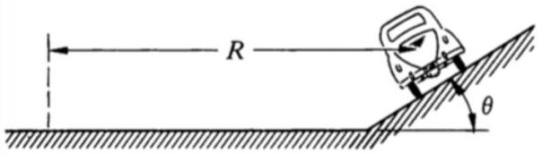
The road is banked at angle $\theta$, and the coefficient of friction between the wheels and road is $\mu$. Find the maximum and minimum speeds for the car to stay on the road without skidding sideways.
Solution. Let $N$ be the normal force, and let $f$ be the friction force (defined to be positive if it's pointing up the hill). We see that $N \cos \theta + f \sin \theta = m g$, and $N \sin \theta - f \cos \theta = m v ^ { 2 } / R$. Therefore,
$$
\frac { v ^ { 2 } } { g R } = \frac { N \sin \theta - f \cos \theta } { N \cos \theta + f \sin \theta } .
$$
Since $- N \mu \leq f \leq N \mu$, we have
$$
\frac { v _ { \min } ^ { 2 } } { g R } = \frac { \sin \theta - \mu \cos \theta } { \cos \theta + \mu \sin \theta } , \quad \frac { v _ { \max } ^ { 2 } } { g R } = \frac { \sin \theta + \mu \cos \theta } { \cos \theta - \mu \sin \theta } .
$$

These formulas give nonsensical results for $\mu > \tan \theta$ or $\mu > \cot \theta$. In these cases, it would be more correct to say that if $\mu \geq \tan \theta$, then $v _ { \min } = 0$, and if $\mu \geq \cot \theta$, there is no maximum speed.

Usually, we are in the regime where $\mu \geq \tan \theta$, in which case $v _ { \text {min } } = 0$ and banking the turn increases $v _ { \text {max } }$. Another benefit is that it helps align the direction of the gravitational and centrifugal force with the height of the car, making the turn more comfortable; you get less of a sideways pull along your seat. For this reason, banked turns are very common in highways. In highway engineering, this trick is called superelevation.

[2] Problem 3 (KK 2.19). A "pedagogical machine" is illustrated in the sketch below.
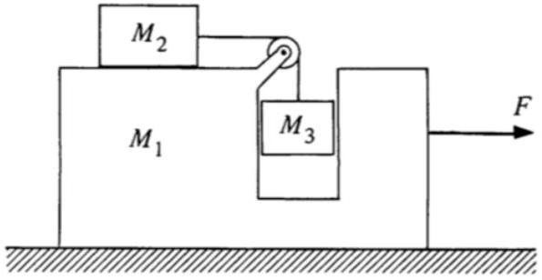
All surfaces are frictionless. What force $F$ must be applied to $M _ { 1 }$ to keep $M _ { 3 }$ from rising or falling?
Solution. By considering all the masses as one system, we see that $a = \frac { F } { M _ { 1 } + M _ { 2 } + M _ { 3 } }$. We see that the tension $T = M _ { 3 } g$, and $T = M _ { 2 } a$, so
$$
\left. M _ { 3 } g = M _ { 2 } a \Longrightarrow \frac { F } { M _ { 1 } + M _ { 2 } + M _ { 3 } } = \frac { M _ { 3 } } { M _ { 2 } } g \Longrightarrow \right\rvert \, F = \left( M _ { 1 } + M _ { 2 } + M _ { 3 } \right) \frac { M _ { 3 } } { M _ { 2 } } g .
$$
[3] Problem 4. USAPhO 2017, problem A1.

## 2 Balancing Torques

Idea 4
A static rigid body will remain static as long as the total force on it vanishes, and the total torque vanishes, where the torque about the origin is

$$
\boldsymbol { \tau } = \sum _ { i } \mathbf { r } _ { i } \times \mathbf { F } _ { i }
$$

where $\mathbf { r } _ { i }$ is the point of application of force $\mathbf { F } _ { i }$. If the total force vanishes, the total torque doesn't depend on where the origin is, because shifting the origin by a changes the torque by

$$
\Delta \boldsymbol { \tau } = \sum _ { i } \mathbf { a } \times \mathbf { F } _ { i } = \mathbf { a } \times \left( \sum _ { i } \mathbf { F } _ { i } \right) = 0 .
$$

The origin should usually be chosen to set as many torques as possible to zero.

[1] Problem 5. The "line" of a force is the line passing through its point of application parallel to its direction; then the torque of the force about any point on that line vanishes. Suppose a body is static and has three forces acting on it. Show that in two dimensions, the lines of these forces must either be parallel or concurrent. This will be useful for several problems later.

Solution. Let $\mathbf { F } _ { 1 } , \mathbf { F } _ { 2 } , \mathbf { F } _ { 3 }$ be the forces. Suppose two are parallel, then the third must be parallel to the first two to balance forces in the direction perpendicular to the direction of the first two. Now, suppose they are not parallel, and let the origin be at the intersection of the lines of forces of $\mathbf { F } _ { 1 }$ and $\mathbf { F } _ { 2 }$. Then, the torque due to these two is zero, so the torque due to $\mathbf { F } _ { 3 }$ must also be zero, so the line of action of $\mathbf { F } _ { 3 }$ must also pass through the origin.

Idea 5
The center of mass $\mathbf { r } _ { \mathrm { cm } }$ of a set of masses $m _ { i }$ at locations $\mathbf { r } _ { i }$ with total mass $M$ satisfies

$$
M \mathbf { r } _ { \mathrm { cm } } = \sum _ { i } m _ { i } \mathbf { r } _ { i } .
$$

If a system experiences no external forces, its center of mass moves at constant velocity.

Idea 6
A uniform gravitational field exerts no torque about the center of mass. Thus, for the purposes of applying torque balance on an entire object, the gravitational force $M \mathbf { g }$ can be taken to act entirely at its center of mass. (This is a formal substitution; of course, the actual gravitational force remains distributed throughout the object.)

Torque balance works in noninertial frames, as long as one accounts for the torques due to fictitious forces. For an accelerating frame, the $- M \mathbf { a }$ fictitious force never exerts a torque about the center of mass, so it can always be taken to act at the center of mass.

In a uniformly rotating frame, the total centrifugal force is $M \omega ^ { 2 } \mathbf { r } _ { \mathrm { cm } } ^ { \perp }$, where $\mathbf { r } _ { \mathrm { cm } } ^ { \perp }$ is the part of $\mathbf { r } _ { \mathrm { cm } }$ perpendicular to the axis of rotation. There can be a centrifugal torque about the center of mass, but in simple cases (such as when the object is flat, lying in a plane perpendicular to $\boldsymbol { \omega }$ ) this vanishes, in which case the centifugal force can be taken to act at the center of mass. We'll cover the Coriolis force and torque in M6.

Example 2
Show that the tension in a completely flexible static rope, massive or massless, points along the rope everywhere in the rope.

Solution
Consider a tiny segment $d \ell$ of the rope. Since the rope is static, the tension forces on both ends balance, so they are opposite. Let them both be at an angle $\theta$ to the rope direction. Then the net torque on the segment is $( T d \ell ) \sin \theta$. Since this must vanish for static equilibrium, we must have $\theta = 0$ and hence the tension is along the rope. In other words, flexible ropes can transmit force, but they can't transmit torque.

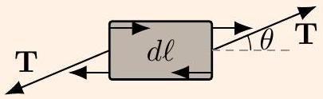

It's important to note that the argument above doesn't work for a rigid rod, because the internal forces in a rigid object can look like the picture above. In other words, there can be extra shear forces from the adjacent pieces of the rod that provide the compensating torque. If one tried to set up forces like this in a rope, it would flex instead.

In general, the force distribution within a massless rigid rod can be quite complicated, but if we zoom out, we can replace it with a single tension which does not necessarily point along the rod. This transmits both a force and a torque through the rod, in the sense that a torque is eventually exerted by whatever holds the end of the rod in place. Note that if the rod's supports are free to rotate, then they can't absorb torque, so the rod acts just like a rope, with tension always along it.

## Remark

Sometimes, problem writers will intentionally not introduce any variables that are irrelevant to the answer. This can occur in two ways. First, the variables might just cancel out, as one can often see by dimensional analysis. Second, the specific values of the variables might not matter in the limit when they are very large or small. For instance, if a problem simply states a mass is "very heavy" but doesn't give it a name like $m$, it is asking for the answer in the limit $m \rightarrow \infty$.

## Idea 7

To handle problems where an object is just about to tip over, note that at this moment, the entire normal force will often be concentrated at a point. (For example, when you're about to fall forward, all your weight goes on your toes.) That often means it's a good idea to take torques about this point.

## Example 3: Povey 5.6

In problem 2, we treated the car as a point particle, but in reality it can also tip over. Suppose that on level ground, a car has a distance $d$ between its left and right tires, which are both thin, and its center of mass is a height $h$ above the ground. Now suppose the car turns as in problem 2 on a vertical wall $\left( \theta = 90 ^ { \circ } \right)$ with speed $v$. For what $v$ is this possible?

## Solution

Again working in the noninertial frame of the car, force balance gives

$$
f _ { \text {fric } } = m g , \quad N = \frac { m v ^ { 2 } } { R }
$$

where $f _ { \text {fric } }$ and $N$ are the total friction and normal forces on the four tires. Since $f _ { \text {fric } } / N \leq \mu$,

$$
v \geq \sqrt { g R / \mu }
$$

which matches the general solution to problem 2. But in that problem, we only considered force balance. In this extreme situation, we also have to consider torque balance, i.e. the possibility that the car might topple over. When the car is about to topple over, all the normal and friction force is on the bottom tires. About this point, we have only torques from gravity and the centrifugal force, giving

$$
m g h = \frac { m v ^ { 2 } } { R } \frac { d } { 2 }
$$

and solving for $v$ gives $v = \sqrt { 2 g R h / d }$. Toppling is less likely the higher $v$ is, so the answer is

$$
v \geq \sqrt { g R } \max ( 1 / \sqrt { \mu } , \sqrt { 2 h / d } ) .
$$

Now here's a puzzle for you. A motorcycle only has one set of wheels, so it is like a car with $d \rightarrow 0$. But motorcyclists can perform the motion described here, in the Globe of Death, without toppling over. In fact, it is possible for them to do this when $d = 0$ exactly. How?

[2] Problem 6 (Quarterfinal 2004). A uniform board of length $L$ is placed on the back of a truck.
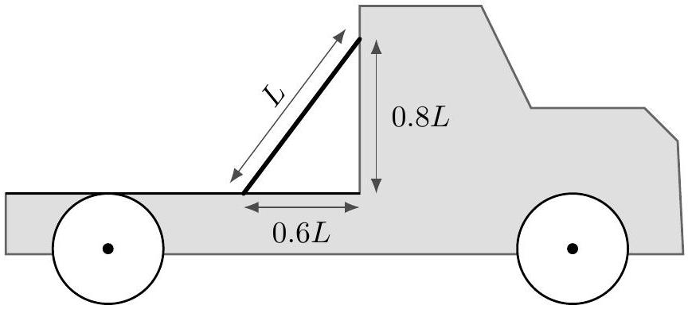
There is no friction between the top of the board and the vertical surface of the truck. The coefficient of static friction between the bottom of the board and the horizontal surface of the truck is $\mu _ { s } = 0.5$. The truck always moves in the forward direction.
    (a) What is the maximum starting acceleration the truck can have if the board is not to slip or fall over?
    (b) What is the maximum stopping acceleration the truck can have if the board is not to slip or fall over?
    (c) For what value of stopping acceleration is the static frictional force equal to zero?

Solution. Let us work in the accelerating frame of the truck.

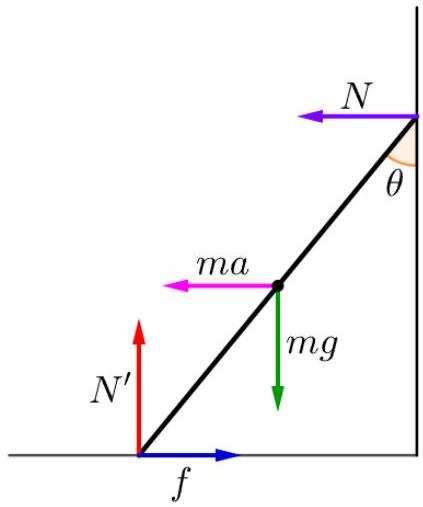

Force balance gives $m g = N ^ { \prime }$ and $N + m a = f$, and torque balance gives

$$
- m g \frac { L } { 2 } \sin \theta + m a \frac { L } { 2 } \cos \theta + N L \cos \theta = 0
$$

which implies

$$
2 N + m a = m g \tan \theta .
$$

Thus,

$$
N = \frac { m ( g \tan \theta - a ) } { 2 } , \quad f = \frac { m ( g \tan \theta + a ) } { 2 } .
$$

Since $- m g \mu \leq f \leq m g \mu$, to avoid slipping we require

$$
- g \leq g \tan \theta + a \leq g \Longrightarrow - g \leq \frac { 3 } { 4 } g + a \leq g \Longrightarrow - \frac { 7 } { 4 } g \leq a \leq \frac { 1 } { 4 } g .
$$

To avoid falling over, we need $N > 0$, which is equivalent to

$$
a \leq g \tan \theta = \frac { 3 } { 4 } g .
$$

We can now read off the answers.

(a) For starting accelerations above $3 g / 4$ we would have falling, while for ones above $g / 4$ we would have slipping. So slipping kicks in first, and the answer is $g / 4$.
(b) Here the only constraint is slipping, and the answer is $7 g / 4$.
(c) Here $\frac { 3 } { 4 } g + a = 0$, so the truck decelerates with acceleration $0.75 g$.

[2] Problem 7 (Kalda). Three identical uniform rods are connected by freely rotating hinges.
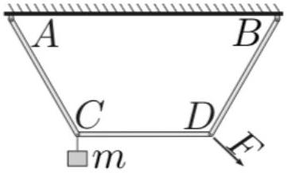
The rods are arranged so that $C D$ is parallel to $A B$, and $\overline { A B } = 2 \overline { C D }$. A mass $m$ is hung on hinge $C$. What is the minimum force that must be exerted at hinge $D$ to keep the system stationary?

Solution. Let the rods have length $\ell$. There are many ways to solve the problem, but the quickest is to consider the torque on the system of rod CD and its hinges, about the intersection point of AC and BD. About this point, the torque due to the weight of rod CD vanishes. Since the hinges are freely rotating, the force of rod AC on the system is directed along AC, so it also exerts no torque, and the same applies for the force from rod BD.

Thus, the only torque is $m g \ell / 2$, from the weight of the mass. The applied force must balance this torque, and by some elementary geometry, we find that its maximum possible lever arm is $\ell$, when the force is perpendicular to BD. Therefore, the minimum force is $\mathrm { mg } / 2$.

Note that it is crucial to assume the rods are massless. If the rods had mass, then the structure can't be supported by freely rotating hinges, even in the absence of the mass $m$ and external force $F$. (For example, the forces of the hinges on the rod CD would have to be horizontal, which means they can't balance gravity.) Instead, in reality the structure would deform a bit until the hinges were no longer freely rotating, but rather jammed in place.

Idea 8
An extended object supported at a point may be static if its center of mass lies directly above or below that point. More generally, if the object is supported at a set of points, it can be static if its center of mass lies above the convex hull of the points.

[2] Problem 8. $N$ identical uniform bricks of length $L$ are stacked, one above the other, near the edge of a table. What is the maximum possible length the top brick can protrude over the edge of the table? How does this limit grow as $N$ goes to infinity?
Solution. Suppose we begin with all $N$ blocks stacked directly on top of each other and slide them to the right. The maximal extension is reached when the center of mass of the top $n$ blocks lies on the edge of the $( n + 1 ) ^ { \text {th } }$ block. Let $\ell = L / 2$, and suppose we have already adjusted the top $n - 1$ blocks to be in the optimal position. Then the center of mass of the top $n$ blocks is a distance $\ell / n$ from the edge of the $( n + 1 ) ^ { \text {th } }$ block, so the $n ^ { \text {th } }$ block and everything on top of it may be moved $\ell / n$ to the right. Hence the total distance is
$$
\frac { L } { 2 } \left( 1 + \frac { 1 } { 2 } + \ldots + \frac { 1 } { N } \right) \approx \frac { L } { 2 } \int _ { 1 } ^ { N } \frac { d x } { x } \approx \frac { L } { 2 } \log N
$$
which is unbounded as $N \rightarrow \infty$. (By the way, if you allow blocks to be stacked in any combination, not just one on top of the other, then the maximum overhang is much larger. As shown in this neat paper, it grows as $N ^ { 1 / 3 }$.)
[2] Problem 9 (Kalda). A cylinder with mass $M$ is placed on an inclined slope with angle $\alpha$ so that its axis is horizontal. A small block of mass $m$ is placed inside it.
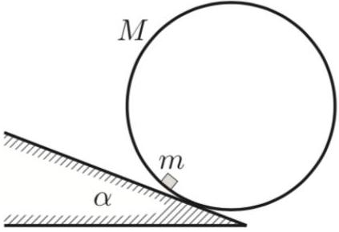
The coefficient of friction between the block and cylinder is $\mu$. Find the maximum $\alpha$ so that the cylinder can stay at rest, assuming that the coefficient of friction between the cylinder and slope is high enough to keep the cylinder from slipping.

Solution. Refer to the diagram below, where $C$ is the location of the block.
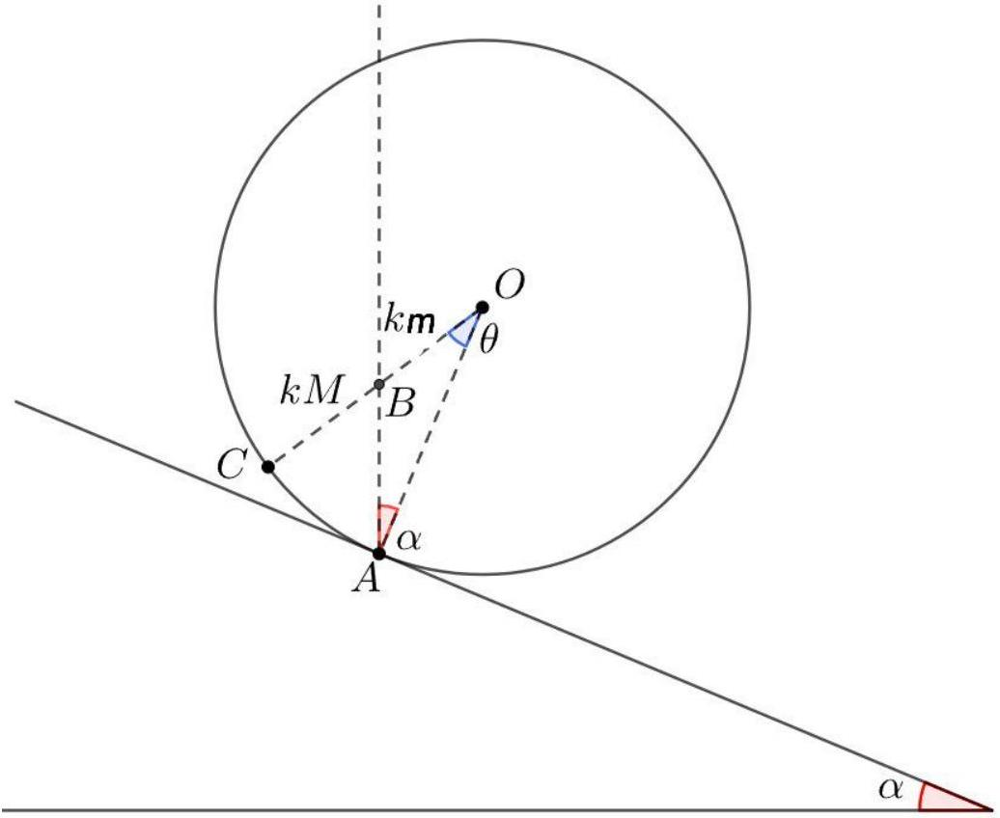

The center of mass $B$ of the cylinder-block system must be right above the contact point $A$. Therefore, we must have $O B = k m$ and $B C = k M$ for some constant $k$, so that the radius of the cylinder is $O C = k ( m + M ) = O A$. Next, by applying the law of sines on triangle $O A B$, we have

$$
\frac { O B } { \sin \alpha } = \frac { O A } { \sin ( \alpha + \theta ) } \Longrightarrow \sin ( \alpha + \theta ) = ( 1 + M / m ) \sin \alpha .
$$

We see that $m$ slips when $\tan ( \alpha + \theta ) = \mu$, or $\sin ( \alpha + \theta ) = \frac { \mu } { \sqrt { 1 + \mu ^ { 2 } } }$, so

$$
\alpha _ { \max } = \sin ^ { - 1 } \left( \frac { \mu } { \sqrt { 1 + \mu ^ { 2 } } } \left( 1 + \frac { M } { m } \right) ^ { - 1 } \right) .
$$

[2] Problem 10 (PPP 11). A sphere is made of two homogeneous hemispheres stuck together, with different densities. Is it possible to choose the densities so that the sphere can be placed on an inclined plane with incline 30° and remain in equilibrium? Assume the coefficient of friction is sufficiently high so that the sphere cannot slip.

Solution. No, it's not possible. We need the center of mass to be straight above the point of contact. Some basic geometry shows that this is only possible for some orientation of the sphere if the center of mass is at least a distance $R / 2$ from the center of the sphere. However, this is impossible: even if one hemisphere had near-zero density, the center of mass would only be $3 R / 8$ away from the center of the sphere, as can be shown by direct integration.

We can also resolve the problem without any calculation. Consider a homogeneous hemisphere flat on a table. Its center of mass must be at a height lower than $R / 2$, since the mass above the plane $z = R / 2$ is less than the mass below it, and concentrated closer to the plane. Therefore, the centers of masses of the hemispheres are each within $R / 2$ of the center of the sphere, so the overall center of mass is also within $R / 2$ of the center.
[3] Problem 11. An object of mass $m$ lies on a uniform floor, with coefficient of static friction $\mu$.

(a) First, suppose the object is a point mass. What is the minimum force required to make the object start moving, if you can apply the force in any direction?
(b) Now suppose the object is a thin, uniform bar. What is the minimum force required to make the object start moving in any way, if the force can only be applied horizontally? Assume the normal pressure on the floor remains uniform.

Solution. (a) Just before the block slides, the friction force is $\mu$ times the normal force, so the sum of the normal force and friction force yields a single force with angle $\phi$ with respect to the vertical, where $\tan \phi = \mu$. Let's call this sum the "contact force", with magnitude $F _ { C }$.

The contact force $F _ { C }$, gravitational force $m g$, and applied force $F _ { A }$ acting on the object have to sum to zero, so the three force vectors have to form a closed triangle.
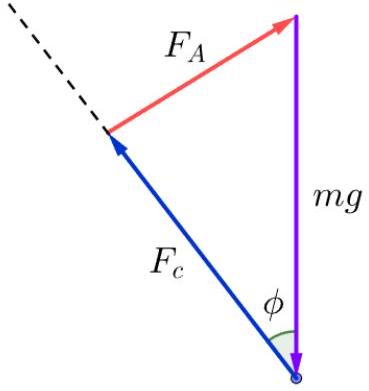
By varying the direction of the applied force, we vary both $F _ { C }$ and $F _ { A }$. The smallest possible value of $F _ { A }$ occurs when the contact and applied force are perpendicular, so that the force vectors form a right triangle. Then by basic trigonometry, the minimum $F _ { A }$ is

$$
F _ { \min } = m g \sin \phi = \frac { m g \mu } { \sqrt { 1 + \mu ^ { 2 } } } .
$$

As a sidenote, if the block were treated as an extended object, not just a point particle, one would have to worry about whether it's possible to do this without tipping the block over instead. However, by choosing the point of application of the force correctly, it's always possible to make the block slide without tipping. Can you see why?

(b) Naively the answer is $\mu m g$, because that's the maximum total friction force. However, we know from everyday experience that it's easier to get the object to start moving if you pull at the edge. That's because the friction forces distributed along the bar also need to balance torque, which means some of them must point forward, along the force you exert.
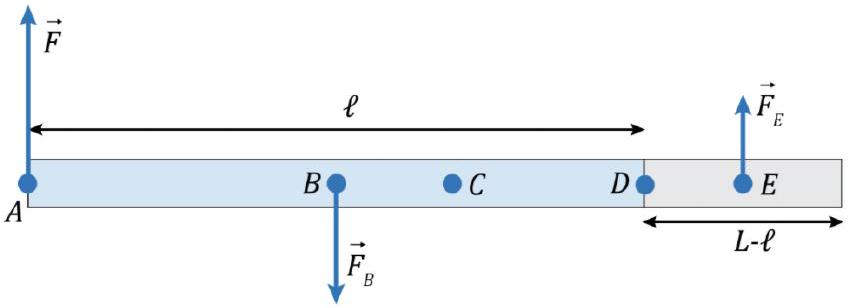
The figure above shows a top-down view of the bar. Just before slipping, the friction needs to be trying as hard as possible to balance both the applied force and applied torque. This implies that it must have the maximum possible magnitude everywhere, and this fixes the

total length of the bar where the friction points forward, and the total length where it points backward. To oppose the torque you apply as effectively as possible, the part of the bar where friction points forward must be all on the opposite side of the bar, as shown above.
Using the variables defined in the figure, just barely balancing forces and torques simultaneously gives
$$
F = \mu m g \left( \frac { \ell } { L } - \frac { L - \ell } { L } \right) , \quad F \ell = \mu m g \left( \frac { \ell } { L } \frac { \ell } { 2 } + \frac { L - \ell } { L } \frac { L - \ell } { 2 } \right) .
$$
Solving for $\ell$ gives $\ell = L / \sqrt { 2 }$, and plugging this in gives
$$
F = ( \sqrt { 2 } - 1 ) \mu m g
$$
which is less than half the naive answer!
[3] Problem 12 (Morin 2.17). A spool consists of an axle of radius $r$ and an outside circle of radius $R$ which rolls on the ground.
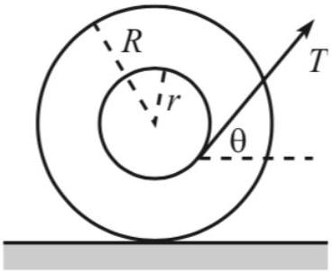
A thread is wrapped around the axle and is pulled with tension $T$ at an angle $\theta$ with the horizontal.
    (a) Which way does the spool move if it is pulled with $\theta = 0$ ?
    (b) Given $R$ and $r$, what should $\theta$ be so that the spool doesn't move? Assume that the friction between the spool and the ground is large enough so that the spool doesn't slip.
    (c) Given $R , r$, and the coefficient of friction $\mu$ between the spool and the ground, what is the largest value of $T$ for which the spool remains at rest?
    (d) Given $R$ and $\mu$, what should $r$ be so that you can make the spool slip from the static position with as small a $T$ as possible? That is, what should $r$ be so that the upper bound on $T$ in part (c) is as small as possible? What is the resulting value of $T$ ?

Solution. (a) The torque about the contact point with the ground is clockwise, so the spool rolls to the right. You might think it would roll to the left, by thinking about torque about the center, but one must also account for the torque from friction with the ground; taking torques about the contact point avoids this complication.

(b) Let $O$ be the center of the spool, $A$ the point where the thread leaves the inner circle, and $B$ the point of contact of the outer circle with the floor. We see that $\angle B O A = \theta$. Considering torques about $B$, we see that gravity provides 0 torque, so the tension must provide 0 torque as well. This means $B A$ is tangent to the inner circle. Since $B A O$ is a right triangle with $\angle B A O = 90 ^ { \circ }$, we have $\cos \theta = r / R$.

(c) Let $f$ be the friction force, and $N$ the normal force. We see that $T \cos \theta = f$ and $N =$ $M g - T \sin \theta$. Since $f \leq \mu N$, we see
$$
T \cos \theta \leq \mu ( M g - T \sin \theta ) \Longrightarrow T \leq \frac { \mu M g } { \cos \theta + \mu \sin \theta }
$$
where $\theta = \cos ^ { - 1 } ( r / R )$.
(d) We see that $\cos \theta + \mu \sin \theta = \frac { 1 } { \sqrt { 1 + \mu ^ { 2 } } } \cos ( \theta - \beta )$ where $\tan \beta = \mu$. Thus,
$$
T = \frac { \mu M g } { \sqrt { 1 + \mu ^ { 2 } } \cos ( \theta - \beta ) } ,
$$
so to minimize $T$, we want $\theta = \beta$, so $r = R \cos \beta = \frac { R } { \sqrt { 1 + \mu ^ { 2 } } }$, and the minimum value of $T$ is $\frac { \mu M g } { \sqrt { 1 + \mu ^ { 2 } } }$.
[3] Problem 13 (PPP 44). A plate, bent at right angles along its center line, is placed on a horizontal fixed cylinder of radius $R$ as shown. Each arm of the plate has length $2 R$.
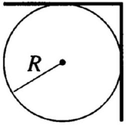
How large does the coefficient of static friction between the cylinder and plate need to be if the plate is not to slip off the cylinder?
Solution. Let the normal and friction forces at the top be $N _ { t } , f _ { t }$ and at the right $N _ { r } , f _ { r }$, and the static coefficient of friction be $\mu$. Balancing forces on the plate gives
$$
f _ { t } = N _ { r } , \quad N _ { t } + f _ { r } = m g .
$$
Now, it's not obvious whether friction will be maximal at the top or the right contact point, or both, so we define
$$
f _ { t } = \mu _ { t } N _ { t } , \quad f _ { r } = \mu _ { r } N _ { r }
$$
where $\mu _ { t } , \mu _ { r } \leq \mu$. Eliminating the friction forces and solving the force balance equations gives
$$
N _ { t } = \frac { m g } { 1 + \mu _ { r } \mu _ { t } } , \quad N _ { r } = \frac { m g \mu _ { t } } { 1 + \mu _ { r } \mu _ { t } } .
$$
Next, consider torques on the plate about its vertex. (This is an arbitrary choice; taking torques about either of the contact points also works about equally well.) The weight of the vertical of the plate contributes no torque, so the torque balance equation is
$$
N _ { r } + m g / 2 = N _ { t } .
$$

Plugging in our results for $N _ { r }$ and $N _ { t }$ gives

$$
\mu _ { t } \left( 2 + \mu _ { r } \right) = 1 .
$$

To find the minimum coefficient of friction to avoid slipping, we need to find the solution to this equation where the larger of $\mu _ { r }$ and $\mu _ { t }$ is as small as possible. But it's clear now that increasing one decreases the other, so this is achieved when the two are equal. In other words, at the limit, slipping is just about to occur at both contact points simultaneously. Setting $\mu _ { r } = \mu _ { t } = \mu$ gives

$$
\mu ^ { 2 } + 2 \mu - 1 = 0 , \quad \mu = \sqrt { 2 } - 1 .
$$

Incidentally, you can also do this problem with the idea of problem 5. At the minimum $\mu$, we assume both friction forces are saturated. The lines of these forces must cross at a point directly above/below the center of mass, where gravity is applied. This quickly yields the same quadratic equation as found above. If you do it this way, though, it's a bit harder to see why both friction forces are saturated simultaneously at the minimum $\mu$. It's usually true, but not guaranteed in general; our more explicit derivation above shows why.

## 3 Trickier Torques

Idea 9
Sometimes, a clever use of torque balance can be used to remove any need to have explicit force equations at all. Rarely, the same situation can occur in reverse.

Example 4: NBPhO 2010.4
A spherical ball of mass $M$ is rolled up along a vertical wall, by exerting a force $F$ to some point $P$ on the ball. The coefficient of friction is $\mu$. What is the minimum possible force $F$, and in this case, where is the point $P$ ?

Solution
Following the logic of idea 3, when the minimum possible force is used, the frictional force with the wall must be maximal, $f = \mu N$, and directed upward. (If friction weren't pushing the ball up as hard as possible, we could get by using a smaller force $F$.) So even though we don't know the magnitude of the normal or the frictional force, we know the direction of the sum of these two forces, so we'll consider them as one combined force.

This reduces the number of independent forces in the problem to three: gravity (acting at the center of mass), the force $F$ (acting at $P$ ), and the combined normal and friction forces (acting at the point of contact $C$ with the wall). Therefore, by the result of problem 5, the lines of these forces must all intersect at some point $A$, as shown.

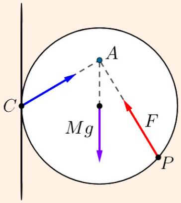
This ensures that the torques will balance, when taken about point $A$.
Next, we need to incorporate the information from force balance. Doing this directly will lead us to some nasty trigonometry, but there's a better way. There are in principle two force balance equations, for horizontal and vertical forces. However, one of these equations is just going to tell us the magnitude of the normal/frictional force, which we don't care about. So in reality, we just need one equation, which preferably doesn't involve that force.

The trick is to use torque balance again, about the point $C$. (You might ask, didn't we already use torque balance? Yes, but the torque balance equations about different points have different forms; they are related by adding combinations of the horizontal and vertical force balance equations. Here, we've chosen $C$ to avoid the normal/friction force.)

Now, when taking the torque about $C$, the torques due to gravity and $F$ must cancel. Then the force $F$ is minimized if $P$ is chosen to maximize its lever arm. This occurs when $C A \perp P A$, in which case the lever arm is $R \sqrt { 1 + \mu ^ { 2 } }$, where $R$ is the radius of the ball. So we have

$$
M g R = F R \sqrt { 1 + \mu ^ { 2 } } , \quad F = \frac { M g } { \sqrt { 1 + \mu ^ { 2 } } }
$$

and $P$ is determined as described above.
[2] Problem 14. NBPhO 2020, problem 4, parts (i) and (ii).
[3] Problem 15. NBPhO 2012, problem 3. The problem statement is missing some information: both the bars and rod have diameter $d$.
[3] Problem 16. NBPhO 2006, problem 6. You will need to print out the problem to make measurements on the provided figure.
[4] Problem 17 (Physics Cup 2012). A thin rod of mass $m$ is placed in a corner so that the rod forms an angle $\alpha$ with the floor. The gravitational acceleration is $g$, and the coefficient of friction with the wall and floor is $\mu _ { s } = \tan \beta$, which is not large enough to keep the rod from slipping.

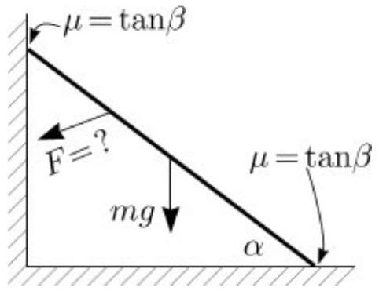
What is the minimum additional force $F$ needed to keep the rod static?
Solution. The answer is

$$
F = \frac { m g } { 2 } \cos ( \alpha + 2 \beta ) \times \begin{cases} 1 / \cos ( \alpha + \beta ) & \alpha + \beta \leq \pi / 4 \\ 1 / \sin ( \alpha + \beta ) & \alpha + \beta \geq \pi / 4 \end{cases}
$$

and several nice solutions are given here.
By the way, this is an example of how a great question writer gets around the problem of nonunique solutions, as we'll discuss further in example 5. The famous question of when a ladder will slip (e.g. as a person climbs up the ladder) has been appearing in books and exams for centuries. But the answer is usually not well-defined, because there are four unknowns (two normal forces and two friction forces) but only three equations (two from force balance, and torque balance). Instead, the answer in practice depends on details, such as how the ladder was placed in contact with the walls, and how much it can compress and bend. To avoid this, question writers often assume something artificial, such as making one wall frictionless. But in this nice problem, the indeterminacy is cancelled out by the freedom in deciding how to apply the force $F$.

Next, we consider some questions that train three-dimensional thinking.

[2] Problem 18 (PPP 10). In Victor Hugo's novel les Miserables, the main character Jean Valjean, an escaped prisoner, was noted for his ability to climb up the corner formed by the intersection of two vertical perpendicular walls. Suppose for simplicity that Jean has no feet. Let $\mu$ be the coefficient of static friction between his hands and the walls. What is the minimum force that Jean had to exert on each hand to climb up the wall? Also, for what values of $\mu$ is this feat possible at all?
Solution. Jean Valjean experiences two normal forces and two friction forces, one from each hand. Each friction force must balance the other normal force, plus half the weight, so
$$
f _ { \text {fric } } ^ { 2 } = N ^ { 2 } + ( m g / 2 ) ^ { 2 } .
$$
Assuming the friction is maximal, $f _ { \text {fric } } = \mu N$, we have
$$
N = \frac { m g } { 2 \sqrt { \mu ^ { 2 } - 1 } }
$$
and the force Jean Valjean exerts with each hand is
$$
F = \sqrt { N ^ { 2 } + f _ { \text {fric } } ^ { 2 } } = \frac { m g } { 2 } \sqrt { \frac { \mu ^ { 2 } + 1 } { \mu ^ { 2 } - 1 } } .
$$
The feat is only possible if $\mu > 1$.

[3] Problem 19 (PPP 69). A homogeneous triangular plate has threads of length $h _ { 1 } , h _ { 2 }$, and $h _ { 3 }$ fastened to its vertices. The other ends of the string are fastened to a common point on the ceiling. Show that the tension in each thread is proportional to its length. (Hint: with the origin at the point on the ceiling, let the vertices be at positions $\mathbf { r } _ { i }$ and express everything in vector form.)
Solution. Define the origin to be the attachment point on the ceiling, and let the vertices be at positions $\mathbf { r } _ { i }$. The tensions are along the ropes, so let them be $\mathbf { T } _ { i } = - \eta _ { i } \mathbf { r } _ { i }$. Force balance says
$$
\eta _ { 1 } \mathbf { r } _ { 1 } + \eta _ { 2 } \mathbf { r } _ { 2 } + \eta _ { 3 } \mathbf { r } _ { 3 } = m \mathbf { g } .
$$
Torque balance tells us that the center of mass of the triangle must lie directly below the attachment point, and the center of mass is at
$$
\mathbf { r } _ { \mathrm { cm } } = \frac { 1 } { 3 } \left( \mathbf { r } _ { 1 } + \mathbf { r } _ { 2 } + \mathbf { r } _ { 3 } \right)
$$
which means that
$$
\mathbf { r } _ { 1 } + \mathbf { r } _ { 2 } + \mathbf { r } _ { 3 } \propto \mathbf { g } .
$$
Thus, we know that the sum of the $\mathbf { r } _ { i }$ is in the vertical direction, and also that the weighted sum of the $\eta _ { i } \mathbf { r } _ { i }$ is in the same vertical direction. This is only possible if all the $\eta _ { i }$ are equal to each other, which proves the desired result.
In case you're not convinced, we can justify this in more detail. Let $\mathbf { r } _ { 1 } + \mathbf { r } _ { 2 } + \mathbf { r } _ { 3 } = \alpha \mathbf { g }$. Then subtracting this equation from $\alpha / m$ times the force balance equation gives
$$
\sum _ { i } \left( 1 - \frac { \alpha } { m } \eta _ { i } \right) \mathbf { r } _ { i } = 0 .
$$
The only way a nontrivial sum of three vectors can vanish is if they lie in a plane, which isn't true here. So each of the coefficients must vanish, so $1 - ( \alpha / m ) \eta _ { i } = 0$, which means all the $\eta _ { i }$ are the same, $\eta _ { i } = m / \alpha$.
[4] Problem 20 (KoMaL 2019, BAUPC 1998). Two identical uniform solid cylinders are placed on a level tabletop next to each other, so that they are touching. A third identical cylinder is placed on top of the other two.
    (a) Let the coefficient of static friction between the cylinders be $\mu _ { 1 }$, and the coefficient of static friction between the cylinders and table be $\mu _ { 2 }$. Find the minimum values of $\mu _ { 1 }$ and $\mu _ { 2 }$ so that the arrangement can stay at rest.
    (b) Repeat part (a) with the three cylinders replaced with four spheres, stacked so that their centers form an equilateral triangle.
    (c) Now return to part (a), and suppose the setup is frictionless. A force is applied directly to the right on the leftmost cylinder, causing the entire setup to accelerate. Find the minimum and maximum accelerations so that all three cylinders remain in contact with each other.

Parts (a) and (b) demonstrate an interesting point: it is possible for a collection of objects to resist some force, even though a single one of those objects would begin moving even with an infinitesimal applied force! This is a simple example of how granular materials, like sand, can give rise to emergent phenomena that are hard to predict from analyzing individual grains alone. Understanding these materials is a whole field of applied research.

Solution. (a) Call the top cylinder A, and the bottom ones B and C. Suppose the normal force between the top cylinder and either of the bottom cylinders is $N$, and the friction force is $f$. When $\mu _ { 1 }$ takes its minimum possible value, we have $f = \mu _ { 1 } N$. Note that since B and C are already being pushed apart by A, there's no normal force between B and C. (It would be possible in principle for the normal force to be nonzero, but that would require more friction to counteract it, and we're trying to find the configuration with the smallest $\mu _ { i }$ possible.) This also implies that there's no friction between B and C.
Now let's balance forces and torques on C. For torque to be balanced, the friction force from the ground must also be $f$. Then balancing horizontal forces yields

$$
f + f \cos ( \pi / 6 ) = N \sin ( \pi / 6 )
$$

from which we infer

$$
\mu _ { 1 } = \frac { f } { N } = \frac { 1 } { 2 + \sqrt { 3 } } \approx 0.268 .
$$

To find $\mu _ { 2 }$, let $N ^ { \prime }$ be the normal force between C and the ground. By symmetry, it has to be half of the total weight, so $N ^ { \prime } = 3 m g / 2$, but by balancing vertical forces on C, we also have

$$
N ^ { \prime } = N \cos ( \pi / 6 ) + f \sin ( \pi / 6 ) + m g .
$$

Using our previously derived result for $f / N$, we conclude that

$$
f = \frac { \mu _ { 1 } } { 3 } N ^ { \prime }
$$

from which we conclude that

$$
\mu _ { 2 } = \frac { \mu _ { 1 } } { 3 } \approx 0.0893 .
$$

(b) All the spheres are being pushed apart, so the analysis above is the same except now the angle is a bit different and the bottom balls exert a vertical force of $m g / 3$ on the top ball since there are 3 supports now.
The lines connecting the centers of the spheres form a tetrahedron by symmetry.
Let the length of the sides of a tetrahedron $A B C D$ be $\ell$, and $A$ being the point at the top (center of the top sphere). Then the distance from the centroid of triangle $B C D$ to $B$ is $\ell / \sqrt { 3 }$ (use the fact that medians intersect in a ratio of 2 to 1 or draw a line from the centroid to a side). Since $A B$ has length $\ell$, the angle between the vertical and the lines connecting the centers of the top sphere and a bottom sphere is $\alpha = \arcsin ( 1 / \sqrt { 3 } )$.
We can thus replace $\sin ( \pi / 6 )$ with $1 / \sqrt { 3 }$ and $\cos ( \pi / 6 )$ with $\sqrt { 2 / 3 }$ in the previous equations. Thus with the same analysis on a bottom ball with only the top ball acting on it, the friction coefficient between the balls is:
$$
\mu _ { 1 } = \frac { \sin \alpha } { 1 + \cos \alpha } = \sqrt { 3 } - \sqrt { 2 } \approx 0.318 .
$$
Similarly, we have $N ^ { \prime } = 4 m g / 3$ and $N \cos ( \alpha ) + f \sin ( \alpha ) = m g / 3$, so
$$
N ^ { \prime } = 4 \left( \frac { \cos \alpha } { \mu _ { 1 } } + \sin \alpha \right) f
$$
from which we conclude
$$
\mu _ { 2 } = \frac { \mu _ { 1 } } { 4 } \approx 0.0795 .
$$

(c) Call the top cylinder $A$, the left cylinder $B$, and the right cylinder $C$, and the normal forces between them $N _ { i j }$. Let $\theta = \pi / 6$.
At the minimum acceleration, the weight of cylinder A almost pushes B and C apart, so $N _ { B C } = 0$. Under this assumption, considering horizontal forces on cylinders A and C gives
$$
N _ { A C } \sin \theta = m a , \quad \left( N _ { B A } - N _ { A C } \right) \sin \theta = m a
$$
while balancing vertical forces on cylinder A gives
$$
\left( N _ { B A } + N _ { A C } \right) \cos \theta = m g
$$
Combining these equations and plugging in $\theta$, we find
$$
2 N _ { A C } = 4 m a = \frac { m g } { \sqrt { 3 } / 2 } - 2 m a
$$
from which we read off
$$
a _ { \min } = \frac { g } { 3 \sqrt { 3 } } .
$$
Now consider the maximum acceleration. In this case, cylinder $A$ will be just about to fly off the top, so that $N _ { A C } = 0$. Thus, the only normal force on cylinder $A$ is from cylinder $B$, and considering horizontal and vertical forces on cylinder $A$ gives
$$
N _ { B A } \sin \theta = m a , \quad N _ { B A } \cos \theta = m g
$$
from which we read off
$$
a _ { \max } = \frac { g } { \sqrt { 3 } } .
$$

## 4 Paradoxical Reactions

Idea 10
Physics is not fundamentally about solving tricky sets of idealized equations; that is just mathematics. Physics is also not fundamentally about describing common real-world situations as accurately as possible; that is just engineering. The heart of physics is to bridge the two effectively. A good physicist invents mathematical idealizations that decently describe as many things as possible. A great physicist figures out exactly when and why those idealizations break down, and how to replace them with better ones.

The point of this philosophical speech is that everything you've learned so far in this handout is an idealization. Real objects don't have single normal and friction forces applied at points. Instead, they are made of huge numbers of atoms connected by chemical bonds. Each atom applies forces to its neighbors, and each bond deforms in response to applied forces. Sometimes we can ignore these details, sometimes we can save our preferred idealizations with a clever adjustment, and sometimes the idealized picture breaks down completely. Each case is different, and requires thinking about the physics in play.

Example 5
A uniform bar with mass $m$ and length $\ell$ hangs on four equally spaced identical light wires. Initially, all four wires have tension $\mathrm { mg } / 4$.
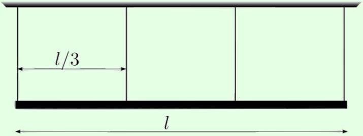
Find the tensions after the leftmost wire is cut.

Solution
This illustrates a common issue with setups involving rigid supports: there are often more normal or tension forces than independent equations, so there is not a unique solution. In the real world, the result is determined by imperfect characteristics of the wires. A reasonable assumption here is that the wires are identical, very stiff springs. In equilibrium, the bar will tilt a tiny bit, so that the length of the middle wire will be the average of the lengths of the other two. By Hooke's law, the force in that wire will than be the average of the other two, so the tensions are $m g / 3 - x , m g / 3$, and $m g / 3 + x$. Applying torque balance yields 7mg/12, mg/3, and mg/12.

A real civil engineer designing a structure would use a sophisticated computer program which simulates all the complex internal forces, torques, and strains in play. For intuition, you could try building some structures yourself in a simple game, like Poly Bridge.

Example 6
In traditional rock climbing, it is often necessary to place tools in small cracks, which will catch the climber in the event of a fall. Suppose two parallel vertical walls are a distance $L$ apart, and a rod of length $L$ and mass $m$ is placed horizontally between them. The coefficient of static friction between the rod and walls is $\mu$. Does the rod stay static?

Solution
Clearly, there are solutions where the rod stays static. There can be an upward friction force $f = m g / 2$ applied to the rod at each wall, and a normal force $N$ at each wall of at least $f / \mu$. But it would also be consistent with the laws of friction to have, for instance, $N = f = 0$, so that the rod falls down immediately.

In cases like this, the normal and friction forces depend on exactly how the rod was placed in contact with the walls. (In previous problems, you were able to resolve this ambiguity by considering the case where an object is about to slip, but here even the criterion for slipping is ambiguous.) For example, if you have to squeeze the rod very hard to fit it in, then it'll probably exert a comparable normal force once it's in. But exerting that much force would

be very impractical, so rock climbers have an ingenious alternative, called a "cam". A cam contains parts that rotate, so that it grows wider when a rope pulls on it.

[2] Problem 21. AuPhO 2015, problem 12. An explanation of how a cam works. You'll also need the diagram in the accompanying answer sheets.

Example 7
Here's an example which is taken from a real book.
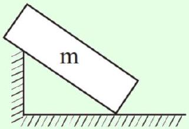
The problem asks about the conditions for this perfectly rectangular block to stay static. Let's ask something even more basic: which way do the normal forces on the block point?

Solution
If you think about it a bit, you'll see that the answer isn't well-defined.
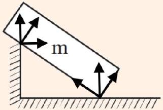
At the bottom contact point, there are three different possible directions, depending on whether you take the normal to the floor, or either of the two sides of the block. The other contact point is even more ambiguous, because of the wall magically ending. Is the normal force perpendicular to the block, perpendicular to the vertical wall, or something else?

This is a case where the idealization of the normal force breaks down. What happens depends on the exact shape of the block and wall, and how deformable they are. For example, suppose the block was perfectly rigid, but had slightly rounded corners (not shown in the diagram). Then there's a definite normal direction at the bottom contact point, pointing up. Similarly, we could suppose that at the other contact point, the wall actually ends in a step with a rounded corner, in which case the normal direction points directly into the block.

Alternatively, suppose the block and step weren't rounded, but could deform. Then the answer depends on the relative hardness of the materials, and how they were placed in contact. For instance, if we suppose the block is much softer, then it could squash at the bottom contact point, again leading to a common upward normal direction. But then we would expect the step to dig into the block at the other contact point, which yields two separate normal forces at that point. Or perhaps the step is made of a softer material than the floor, so that it's the step rather than the block that deforms. Or maybe both deform!

To reiterate, the issue isn't that idealizations are unrealistic. Physics uses idealizations, like neglecting air resistance and friction, all the time, and they work in appropriate limits. The issue is that when you apply the idealizations implied by the diagram, the result is mathematically undefined - and you get completely different answers depending on how you adjust the idealization. That means the true answer depends crucially on the details.

## Remark

The above example illustrates why it's hard to write good physics questions if you don't know exactly what you're doing. The writers of thoroughly vetted competitions, like the IPhO, EuPhO, or NBPhO, or the national Olympiads of America or China, are perfectly aware of this issue and always make sure to avoid it. For example, you can see that in problems 17 and 22, and example 16, objects are clearly drawn with rounded corners.

But ill-defined problems are depressingly common in homework assignments and less carefully written exams, such as the JEE. If you personally encounter such a problem, your only option is to try to read the question writer's mind; that is, simply start guessing and go with whatever gives you tractable results. If you encounter this sort of thing often, in a book or competition, then it's not worth your time. We're in it to learn about nature, not to please examiners.

## Idea 11: The Painleve Paradox

Coulomb's laws for "dry" friction, $f \leq \mu _ { s } N$ and $f = \mu _ { k } N$, can lead to mathematical contradictions if the coefficients of friction are sufficiently high. For example, equations derived from these laws might have no solutions, or multiple solutions.

[2] Problem 22 (Kalda). A rod is hinged to the ceiling, so that it makes an angle $\alpha$ with the vertical.
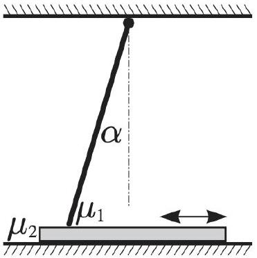
Underneath, a thin board is being dragged on the floor. The coefficient of (static and kinetic) friction is $\mu _ { 1 }$ between the board and rod, and $\mu _ { 2 }$ between the board and floor. The rod is meant to stop the board from being dragged to the right, no matter how hard or how quickly it is pulled. Is this possible? If so, what are the conditions on the parameters that allow this to occur?
Solution. Let the rod have mass $m$ and length $\ell$, and suppose it feels a normal force $N$ and friction force $f$ from the board. Then torque balance on the rod about the hinge gives
$$
N \ell \sin \alpha = \frac { \ell } { 2 } m g \sin \alpha + f \ell \cos \alpha .
$$

When friction is maximal and the board is about to move, $f = \mu _ { 1 } N$, so

$$
N = \frac { m g \sin \alpha } { 2 \left( \sin \alpha - \mu _ { 1 } \cos \alpha \right) } .
$$

It becomes impossible to move the board when $\mu _ { 1 }$ becomes large enough to make this $N$ blow up, so the board is stuck if

$$
\mu _ { 1 } \geq \tan \alpha .
$$

Physically, what's going on is that the harder you pull, the larger the normal force becomes, and so the larger the friction can be. For sufficiently large $\mu _ { 1 }$, the growth in the friction force outpaces the growth in the applied force. This is an example of "jamming". Note that $\mu _ { 2 }$ doesn't matter; it does contribute to the friction force on the board, but it doesn't affect when jamming begins.

## Remark

In problem 22 you showed that for sufficiently strong friction, it is impossible for a static board to start moving to the right. But if we suppose the board was already moving to the right, then solving for the normal force will yield a mathematical contradiction. Specifically, the rightward friction force on the rod is so strong that it rotates the rod even harder into the board, requiring an even larger normal force to keep the rod from going through the board, which induces an even larger friction force, and so on. Technically, there is a solution for the normal force, but it's negative, which doesn't make any sense either.

Of course, you've probably seen what happens in real life. The board tends to move in fits and starts. The rod creaks and cracks, and might even visibly bounce up and down. But you can't understand this behavior through the idealized laws of friction. Instead, we need "contact mechanics", which studies how the rod and board dynamically deform when subject to stress. (In section 8, we'll consider some of the simplest ideas of contact mechanics.)

Good Olympiad questions are designed to avoid triggering Painleve paradoxes. For an excellent further discussion of these issues, with many examples, see this paper. More generally, real friction (studied in the field of tribology) can be rather complicated even when the equations aren't paradoxical. For example, lubricated materials don't obey Coulomb's laws; instead the friction force has to be computed with fluid mechanics. Materials can even have adhesive forces, which allow them to roll without slipping down a vertical wall.

## 5 Extended Bodies

Next, we'll consider problems with continuous bodies, where one often needs to consider forces and torques acting on infinitesimal pieces.

Example 8
Find the tension in a circular rope of radius $R$ spinning with angular velocity $\omega$ and mass per length $\lambda$.

Solution
Consider an infinitesimal segment of the rope, spanning an angle $d \theta$.
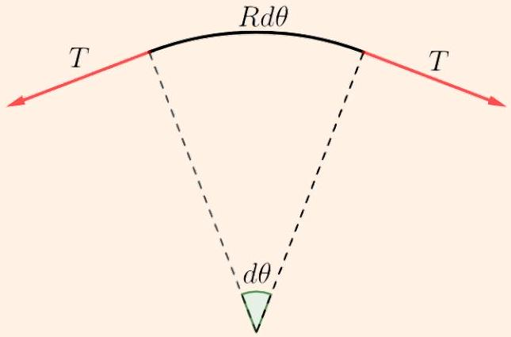
The mass of this segment is $d m = R \lambda d \theta$. The total force is radially inward, with magnitude

$$
d F = 2 T \sin \frac { d \theta } { 2 } \approx T d \theta
$$

where we used the small angle approximation. This is the centripetal force, so

$$
d F = ( d m ) \omega ^ { 2 } R .
$$

Combining these results yields $T = R ^ { 2 } \omega ^ { 2 } \lambda$.

Example 9
Find the distance $d$ of the center of mass of a uniform semicircle of radius $R$ to its center. (Note that a semicircle is half of a circle, not half of a disc.)

Solution
This can be done by taking the setup of the previous problem, and taking a subsystem comprising exactly half of the rope. In this case the net tension force is simply

$$
F = 2 T .
$$

The total mass is $m = \pi R \lambda$, and the force must provide the centripetal force, so

$$
F = ( \pi R \lambda ) \left( \omega ^ { 2 } d \right)
$$

But we also know that $T = R ^ { 2 } \omega ^ { 2 } \lambda$ as before, so plugging this in gives

$$
d = \frac { 2 } { \pi } R .
$$

Alternatively, we could have worked in the frame rotating with the rope. The equations would be the same, but instead we would say the tension balances the centrifugal force.

[1] Problem 23 (KK 2.22). A uniform rope of weight $W$ hangs between two trees. The ends of the rope are the same height, and they each make angle $\theta$ with the trees.

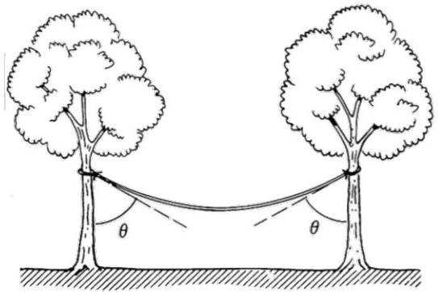
Find the tension at either end of the rope, and the tension at the middle of the rope.
Solution. Let the tension at the end be $T _ { 0 }$, and $T _ { 1 }$ at the center. Considering the entire rope as one system, we see that $2 T _ { 0 } \cos \theta = W$, so $T _ { 0 } = \frac { W } { 2 \cos \theta }$. Considering one half of the rope as a system, we see $T _ { 1 } = T _ { 0 } \sin \theta = \frac { W } { 2 } \tan \theta$.

[3] Problem 24 (KK 2.24). A capstan is a device used aboard ships to control a rope which is under great tension.
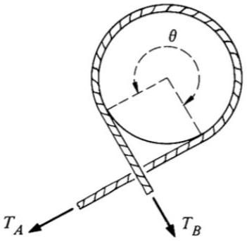
The rope is wrapped around a fixed drum with coefficient of friction $\mu$, usually for several turns. The load on the rope pulls it with a force $T _ { A }$. Ignore gravity.
    (a) Show that the minimum force $T _ { B }$ needed to hold the other end of the rope in place is $T _ { A } e ^ { - \mu \theta }$, an exponential decrease.
    (b) How does this result depend on the shape of the capstan, if we fix the angle $\theta$ between the initial and final tension forces? Would the answer be the same for an oval, or a square?
    (c) If $\theta = \pi$, explain why the total normal and friction force of the rope on the drum is $T _ { A } + T _ { B }$.

Solution. (a) Consider a small piece of the rope that turns through an angle $d \theta$. Using the small angle approximation, the normal force must be $T d \theta$, and the friction force must be $d T$. Setting $f = \mu N$ gives $\mu T d \theta = d T$, or $d T / T = \mu d \theta$, and integrating gives the desired result.

(b) The infinitesimal reasoning above doesn't care about the shape as long as it's reasonably smooth, so the answer for an oval is the same: just break it into pieces that turn through $d \theta$ again. On the other hand, for a square one has sharp kinks where the normal force is singular, in which case the answer won't be as reliable.
(c) Consider the system consisting of the curved part of the rope. This system experiences a force $T _ { A } + T _ { B }$ from the straight part of the rope. But it is static, which means it must also experience an equal and opposite force from the drum, which comes from integrating the friction and normal forces along the contact surface.

That's all you have to say, but we can also show this more explicitly. For concreteness, let both tensions be vertical. We have a normal force and difference in tension forces

$$
d N = T d \theta , \quad d T = - d f _ { \text {fric } }
$$

on a small piece $d \theta$ of the rope. The contribution to the vertical force on the drum is

$$
d F _ { y } = d N \sin \theta + d f _ { \text {fric } } \cos \theta = T \sin \theta d \theta - d T \cos \theta = - d ( T \cos \theta )
$$

by the product rule. So the total vertical force is

$$
F _ { y } = \int d F _ { y } = - \int _ { 0 } ^ { \pi } d ( T \cos \theta ) = - \left( T _ { A } + T _ { B } \right)
$$

as expected. A very similar manipulation shows that $F _ { x } = 0$.
[2] Problem 25 ( $\boldsymbol { F } = \boldsymbol { m a } 2018 \mathrm {~B} 20$ ). A massive, uniform, flexible string of length $L$ is placed on a horizontal table of length $L / 3$ that has a coefficient of friction $\mu _ { s } = 1 / 7$, so equal lengths $L / 3$ of string hang freely from both sides of the table. The string passes over the edges of the table, which are smooth frictionless curves, of size much less than $L$. Now suppose that one of the hanging ends of the string is pulled a distance $x$ downward, then released at rest. Neither end of the string touches the ground.

(a) Find the maximum value of $x$ so that the string does not slip off of the table.
(b) For the case $x = 0$, draw a free body diagram for the string, indicating only the external forces on the entire string. Do the forces balance?
(c) Would the answer change significantly if the table's small edges had friction as well?

Solution. (a) The difference in weights is $2 ( M g / L ) x$, and needs to be balanced by the friction force $f$. At the max value of $x , f = \mu _ { s } N = \mu _ { s } M g / 3$ (the normal force at the top only holds up the top of the string), so $x = \left( \mu _ { s } / 6 \right) L = L / 42$.

(b) At first, it may seem that the forces don't balance, because the normal force from the flat part of the table only balances the weight of the string above it, leaving nothing to balance the weight of the vertical parts of the string. But we must recall that there is an enormous normal pressure at the smooth corners. The total normal force there is large enough so that its vertical component holds up all of the string underneath it.

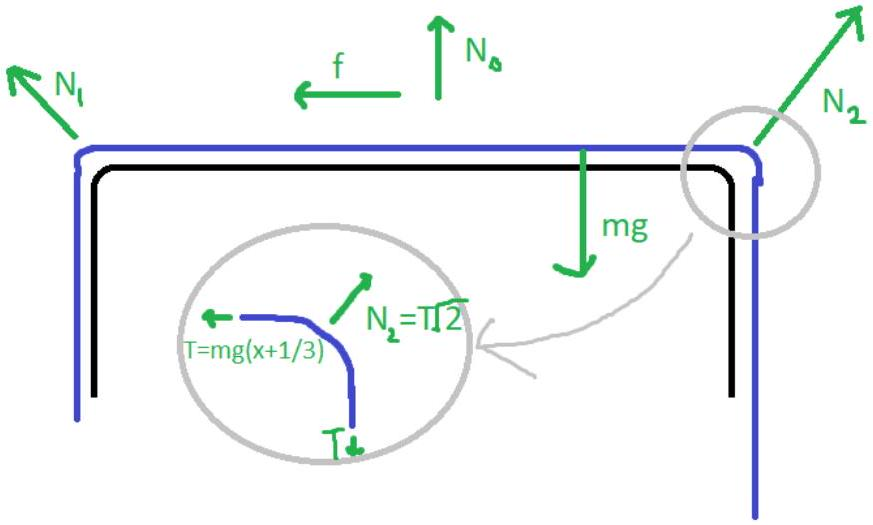

(c) Yes, the answer changes significantly no matter how small the edges are. This is because, as we saw in part (b), there is a sizable normal force at the edges, since they alone are responsible for holding up a significant part of the rope. So turning on a coefficient of friction at the edges would yield a sizable friction force. (You can calculate it using problem 24.)

[3] Problem 26 (Morin 2.25). A rope rests on two platforms that are both inclined at an angle $\theta$.
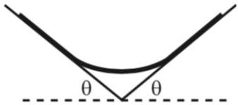
The rope has uniform mass density, and the coefficient of friction between it and the platforms is 1. The system has left-right symmetry. What is the largest possible fraction of the rope that does not touch the platforms? What angle $\theta$ allows this maximum fraction?

Solution. Let $\eta$ be the fraction of the rope that does not touch the platforms. Split the rope into the 3 obvious pieces (the left touching portion, the hanging portion, the right touching portion). Let $T$ be the tension at the boundaries (its the same on both sides by symmetry). Balancing forces on the middle portion tells us

$$
2 T \sin \theta = \eta m g \Longrightarrow T = \frac { \eta m g } { 2 \sin \theta } .
$$

We see the friction force on the left piece is $f = T + \frac { 1 - \eta } { 2 } m g \sin \theta$, and the normal force is $N =$ $\frac { 1 - \eta } { 2 } m g \cos \theta$. We have $f \leq N \mu$, so

$$
\frac { \eta m g } { 2 \sin \theta } + \frac { 1 - \eta } { 2 } m g \sin \theta \leq \frac { 1 - \eta } { 2 } m g \mu \cos \theta ,
$$

or

$$
\frac { \eta } { \sin \theta } + ( 1 - \eta ) \sin \theta \leq ( 1 - \eta ) \cos \theta ,
$$

so some algebra reveals

$$
\eta \leq \frac { \cos \theta - \sin \theta } { \cos \theta + \sin \theta } \tan \theta .
$$

Doing some more algebra turns this into

$$
\eta \leq \frac { \sin 2 \theta + \cos 2 \theta - 1 } { \sin 2 \theta + \cos 2 \theta + 1 } .
$$

To maximize $\eta$, we need to maximize $\sin 2 \theta + \cos 2 \theta$, which implies $\theta = \pi / 8$. The corresponding value of $\eta$ is $3 - 2 \sqrt { 2 }$.

Example 10
A chain is suspended from two points on the ceiling a distance $d$ apart. The chain has a uniform mass density $\lambda$, and cannot stretch. Find the shape of the chain.

Solution
First, we note that the horizontal component of the tension $T _ { x }$ is constant throughout the chain; this just follows from balancing horizontal forces on any piece of it. Moreover, by similar triangles, we have $T _ { y } = T _ { x } y ^ { \prime }$ everywhere.

Now consider a small segment of chain with horizontal projection $\Delta x$. The length of the piece is $\Delta x \sqrt { 1 + y ^ { \prime 2 } }$ which determines its weight, and this be balanced by the difference in vertical tensions. Thus

$$
\Delta T _ { y } = \lambda g \sqrt { 1 + y ^ { \prime 2 } } \Delta x .
$$

For infinitesimal $\Delta x$, we have $\Delta T _ { y } = T _ { x } d \left( y ^ { \prime } \right) = T _ { x } y ^ { \prime \prime } d x$, so we get the differential equation

$$
y ^ { \prime \prime } = \frac { \lambda g } { T _ { x } } \sqrt { 1 + y ^ { \prime 2 } } .
$$

Usually nonlinear differential equations with second derivatives are very hard to solve, but this one isn't because there is no direct dependence on $y$, just its derivatives. That means we can treat $y ^ { \prime }$ as the independent variable first, and the equation is effectively first order in $y ^ { \prime }$.

Writing $y ^ { \prime \prime } = d \left( y ^ { \prime } \right) / d x$ and separating, we have

$$
\int \frac { d y ^ { \prime } } { \sqrt { 1 + y ^ { \prime 2 } } } = \int \frac { \lambda g } { T _ { x } } d x
$$

Integrating both sides gives

$$
\sinh ^ { - 1 } \left( y ^ { \prime } \right) = \frac { \lambda g x } { T _ { x } } + C .
$$

Choosing $x = 0$ to be the lowest point of the chain, the constant $C$ is zero, and

$$
y ^ { \prime } = \sinh \left( \frac { \lambda g x } { T _ { x } } \right) .
$$

Integrating both sides again gives the solution for $y$,

$$
y = \frac { T _ { x } } { \lambda g } \cosh \left( \frac { \lambda g x } { T _ { x } } \right)
$$

where we suppressed another constant of integration. This curve is called a catenary.
[1] Problem 27. To check that you understand the previous example, repeat it for a suspension bridge. In this case the cable is attached by vertical suspenders to a horizontal deck with mass $\lambda$ per unit length, and supports the weight of the deck. Assume the cable and suspenders have negligible mass.

Solution. By the same logic as in the example, we have

$$
y ^ { \prime \prime } = \frac { \lambda g } { T _ { x } }
$$

where there is now no factor of $\sqrt { 1 + y ^ { \prime 2 } }$. Integrating this twice gives

$$
y = \frac { \lambda g } { T _ { x } } \frac { x ^ { 2 } } { 2 }
$$

which is a parabola. One result of this analysis is that the required height of the bridge scales as the square of its horizontal span, which is why very long suspension bridges are broken into multiple spans. According to Feynman, engineers were able to watch the shape of the cables of the George Washington bridge turn from a catenary into a parabola as the deck was installed.

By the way, essentially the same calculation can be used to determine the shape of an ideal suspended arch bridge. The main difference is that the arch, being a solid structure, can transmit internal torques (i.e. bending moments, as discussed below) which can result in more general shapes. But in a well-designed arch bridge this internal torque should be negligible, so the analysis is almost identical to the suspended cable bridge, but with an extra minus sign since arches are in compression rather than tension. The shape is an inverted parabola.

Example 11
A uniform spring of spring constant $k$, mass $m$, and relaxed length $L$ is hung from the ceiling. Find its length in equilibrium, as well as its center of mass.

Solution
Problems like this contain subtleties in notation. For example, if you talk about "the piece of the slinky at $z ^ { \prime \prime }$, this could either mean the piece that's actually at this position in equilibrium, or the piece that was originally at this place in the absence of gravity. Talking about it the first way automatically tells you where the piece is now, but talking about it the second way makes it easier to keep track of, because then the $z$ of a specific piece of the spring stays the same no matter where it goes.

In fluid dynamics, these are known as the Eulerian and Lagrangian approaches, respectively. If you don't use one consistently, you'll get nonsensical results, and it's easy to mix them up.

There are many ways to solve this problem, but I'll give one that reliably works for me. We're going to use the Lagrangian approach, and avoid confusion with the Eulerian approach by breaking the spring into discrete pieces. Let the spring consist of $N \gg 1$ pieces, of masses $m / N$, spring constants $N k$, and relaxed lengths $L / N$. Our expressions are going to contain sums, which we'll replace with integrals using the method described in P1.

The $i ^ { \text {th } }$ spring from the bottom has tension $( i / N ) m g$, and thus is stretched by

$$
\Delta L _ { i } = \frac { 1 } { k N } \frac { i } { N } m g = \frac { m g } { k N ^ { 2 } } i .
$$

The total stretch is

$$
\sum _ { i = 1 } ^ { N } \Delta L _ { i } = \frac { m g } { k N ^ { 2 } } \int _ { 0 } ^ { N } i d i = \frac { m g } { 2 k }
$$

This makes sense, since the average tension is $m g / 2$. To find the center of mass, note that the $j ^ { \text {th } }$ spring is displaced downward by a distance

$$
\Delta y _ { j } = \sum _ { i = j } ^ { N } \Delta L _ { i } = \frac { m g } { 2 k } \left( 1 - \frac { j ^ { 2 } } { N ^ { 2 } } \right)
$$

downward from its position in the absence of gravity. The center of mass displacement is
$$
\Delta y _ { \mathrm { cm } } = \frac { 1 } { N } \sum _ { j = 1 } ^ { N } \Delta y _ { j } \propto \frac { 1 } { N } \sum _ { j = 1 } ^ { N } \left( 1 - \frac { j ^ { 2 } } { N ^ { 2 } } \right) = \frac { 1 } { N ^ { 3 } } \int _ { 0 } ^ { N } N ^ { 2 } - j ^ { 2 } d j = \frac { 2 } { 3 }
$$
so restoring the proportionality constant gives
$$
\Delta y _ { \mathrm { cm } } = \frac { m g } { 3 k } .
$$
If you want to test your understanding of slinkies, you can also try doing this problem with the Eulerian approach. This would be best done without discretization. The first steps would be finding a relation between the density $\rho ( z )$ and tension $T ( z )$ from Hooke's law, and finding out how to write down local force balance as a differential equation.

[4] Problem 28 (MPPP). A slinky is a uniform spring with negligible relaxed length, with mass $m$ and spring constant $k$.

(a) Find the shape of a slinky hung from two points on the ceiling separated by distance $d$. (Hint: to begin, consider the mass and tension of a small piece of the spring with horizontal and vertical extent $d x$ and $d y$. Don't forget that the slinky's density won't be uniform.)
(b) Suppose a slinky's two ends are fixed, separated by distance $d$, and rotating uniformly with angular frequency $\omega$ like a jump rope in zero gravity. Find the values of $\omega$ for which this motion is possible, and the shape of the slinky in this case.

Solution. (a) Consider a small piece of the spring with mass $d m$, and horizontal and vertical extent $d x$ and $d y$. This piece of the spring has spring constant $k m / d m$, which means

$$
T _ { x } = k m \frac { d x } { d m } , \quad T _ { y } = \frac { d y } { d x } T _ { x } .
$$

By horizontal force balance, $T _ { x }$ is a constant, which means $d x / d m$ is a constant; the same amount of mass is contained within each horizontal interval. Thus

$$
\frac { d x } { d m } = \frac { d } { m } .
$$

Balancing vertical forces on this segment gives

$$
d T _ { y } = y ^ { \prime \prime } T _ { x } d x = g d m
$$

and combining this with the previous result gives

$$
y ^ { \prime \prime } = \frac { m g } { k d ^ { 2 } } .
$$

We thus conclude that the shape is a parabola. Centering it at $x = 0$, we have

$$
y = \frac { m g x ^ { 2 } } { 2 k d ^ { 2 } } .
$$

In particular, the lowest point of the parabola is a distance $y ( d / 2 ) - y ( 0 ) = m g / 8 k$ below the supports. (This solution is very similar to that of the example; the only difference is that the weight of the segment is proportional to $d x$ instead of $\sqrt { 1 + y ^ { \prime 2 } } d x$. This is because the slinky's mass per length is not constant, while the chain's was.)

(b) The only difference with respect to part (a) is that now we have a radial "gravity" force of $g _ { \text {eff } } = - \omega ^ { 2 } y$, because of the centrifugal acceleration in the frame rotating with the slinky. Therefore,
$$
y ^ { \prime \prime } = - \frac { m \omega ^ { 2 } } { k d ^ { 2 } } y
$$
The solution is a sinusoid. For concreteness, let's suppose one endpoint is at $x = 0$, imposing $y ( 0 ) = 0$. Then
$$
y ( x ) = y _ { 0 } \sin \left( \sqrt { \frac { m } { k } } \frac { \omega } { d } x \right) .
$$
For the other endpoint to be fixed, $y ( d ) = 0$, we must have
$$
\sqrt { \frac { m } { k } } \omega = n \pi
$$
for some integer $n \geq 1$. If $\omega$ satisfies this condition, then the slinky can rotate with uniform angular velocity, and its shape is a sinusoid. The value of $y _ { 0 }$ is arbitrary.
Another way to say this is that the solutions we have found here are standing waves. The valid values of $\omega$, given the spring parameters, are just the standing wave frequencies. The fact that $\omega$ doesn't depend on $d$ follows from dimensional analysis, and reflects the fact that stretching the string further increases the tension and decreases the density, therefore increasing the wave speed. These two effects cancel, keeping the standing wave frequencies the same.

Note that so far we've considered three cases: a hanging rope (in the example), a hanging slinky, and a rotating slinky. So what about a rotating rope? Unfortunately, the differential equation describing it is $y ^ { \prime \prime } \propto y \sqrt { 1 + y ^ { \prime 2 } }$, since the centrifugal acceleration is proportional to $y$. And unlike the example, this is a genuine nonlinear second order differential equation. Mathematica reports that the solution is not an elementary function, but rather an inverse elliptic integral. Unfortunately, that's just what happens most of the time.

## 6 The Principle of Virtual Work

Let's motivate this section with a simple question: why use torque at all? In principle, everything in Newtonian mechanics can be derived by considering forces alone, so torques shouldn't even be necessary. This is illustrated with the following example.

Example 12
Consider the simplest possible nontrivial rigid body: a triangle with masses at the vertices, and sides made of very thin, very rigid, massless springs. The triangle is pivoted at one vertex, and experiences external forces $\mathbf { F } _ { 1 }$ and $\mathbf { F } _ { 2 }$ at the other two vertices.

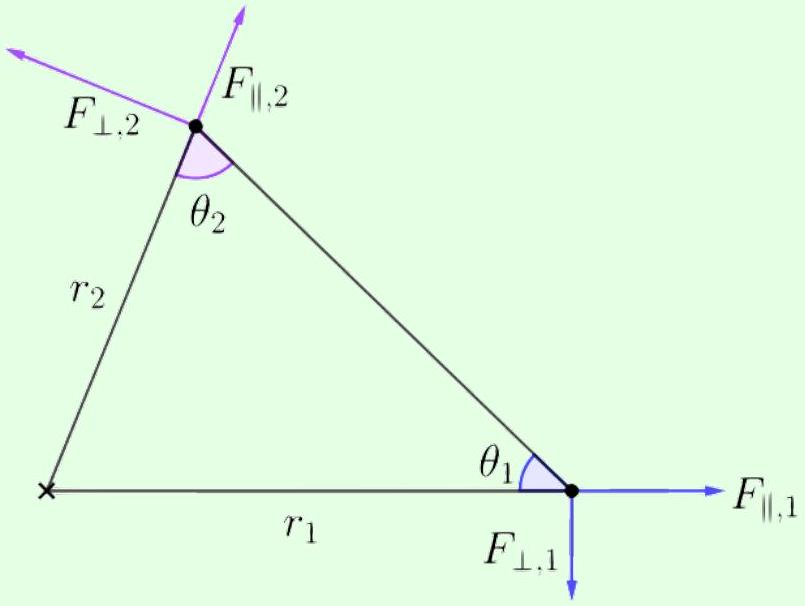
Find the criterion for this system to be in equilibrium, using force balance alone.

Solution
Consider force balance on the first marked vertex. The tension in the side of length $r _ { 1 }$ takes whatever value is necessary to balance the horizontal force $F _ { \| , 1 }$ on the vertex, while the tension $T$ in the other side has to balance the vertical force $F _ { \perp , 1 }$. Thus, $F _ { \perp , 1 } = T \sin \theta _ { 1 }$. Similarly, by considering the second marked vertex, we have $F _ { \perp , 2 } = T \sin \theta _ { 2 }$.

Eliminating $T$ and using the law of sines gives

$$
r _ { 1 } F _ { \perp , 1 } = r _ { 2 } F _ { \perp , 2 } .
$$

Of course, this is precisely the statement of torque balance about the pivot. And if you continue along this line of reasoning, letting the forces be arbitrary, you can also derive the rotational form of Newton's second law, $\tau = I \alpha$, for this system.

Remark
So why are torques necessary? Torque isn't a necessary tool for single point particles or very simple rigid bodies. But in a general rigid body, the internal forces which maintain their rigidity are very complicated, and torques let us avoid having to think about these forces.

For example, consider a rigid bar supported at its ends. The middle of the bar doesn't collapse, despite the force of gravity on it, because the bar contains internal, upward shear forces, which transmit the normal forces applied at its end throughout the rest of the bar. But to analyze such systems without using torque, one would have to account for all of these microscopic forces, acting on all of the rod's infinitely many pieces. With torque, we can compute useful information (such as the normal forces at each support) without much effort.

However, given how complicated internal forces can be, you might be wondering why torque balance even works in general. The simplest explanation is the principle of virtual work.

## Idea 12: Principle of Virtual Work

To determine if a system is in static equilibrium, we consider each way the system could move. For each such way, we consider how much work would be done if the system moved a little bit in that way. (This motion is just in our heads, so we call it a "virtual displacement" which corresponds to a "virtual work".) The system is in static equilibrium if the virtual work vanishes for every possible virtual displacement.

If we apply the principle of virtual work to translational motion, then we get force balance, since $d W = F d x$. If we apply it to rotation about a pivot, then we get torque balance, since $d W = \tau d \theta$. However, as we'll see below and in M4, the principle of virtual work can also be applied to more exotic displacements. It is particularly useful when applied to systems with a lot of parts but also a lot of constraints, so that they can only move in a few ways. The converse of the principle of virtual work can also be useful: if you know a system is in static equilibrium, you can use it to deduce an unknown force.

## Example 13: Roberval Balance

Consider the following scale made of rigid bars. The joints ensure that the quadrilateral in the middle always remains a parallelogram, with its left and right sides vertical.
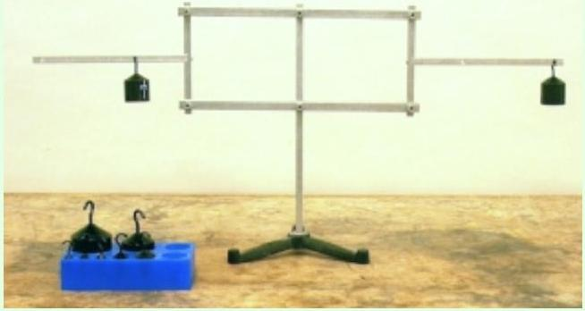
If identical weights are placed on each horizontal arm as shown, can the system remain static?

## Solution

There's only one way for the system to move: the rectangle can deform into a parallelogram so that the left horizontal arm moves up, and the right horizontal arm moves down by the same amount. Then the total virtual work done on the scale by the weights is zero, so the system can be in equilibrium no matter where on the arms the weights are placed.

[1] Problem 29 (Wang). Two massless rigid rods of length $\ell$ are connected by a joint $A$, which allows them to freely rotate with respect to each other. The left member is pinned to point $O$, while the right member is placed on a roller $B$ which can roll frictionlessly on the ground.

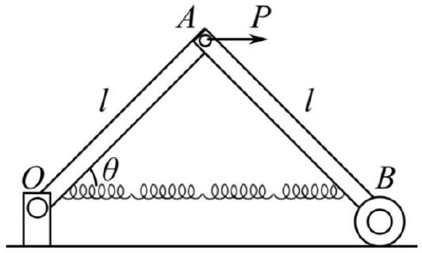
A massless spring of zero relaxed length and spring constant $k$ is stretched between $O$ and $B$, and a rightward force $P$ is exerted at $A$. Find the angle $\theta$ at equilibrium.

Solution. This problem can be solved directly by introducing variables for the tensions in each rod, then writing down force and torque balance equations. It can be quite quick if you're clever about choosing your pivot points and systems. But the principle of virtual work is even faster. We imagine the roller $B$ moves to the right by $d x$, which implies that $A$ moves to the right by $d x / 2$. Then we have a virtual work of

$$
d W = P \frac { d x } { 2 } - ( 2 k \ell \cos \theta ) d x = 0
$$

in equilibrium. This immediately gives

$$
\theta = \cos ^ { - 1 } \left( \frac { P } { 4 k \ell } \right) .
$$

The reason this is so easy is that we don't have to care about the tension forces within the rods, or the forces from the pivot or ground, because none of these forces perform virtual work on the system as a whole.

## 7 Pressure and Surface Tension

Example 14
A sphere of radius $R$ contains a gas with a uniform pressure $P$. Find the total force exerted by the gas on one hemisphere.

Solution
The pressure provides a force per unit area orthogonal to the sphere's surface, so the straightforward way to do this is to integrate the vertical component of the pressure force over a hemisphere. However, there's a neat shortcut in this case.

Momentarily forget about the sphere and just imagine we have a sealed hemisphere of gas at pressure $P$. The net force of the gas on the hemisphere must be zero, or else it would just begin shooting off in some direction, violating conservation of momentum. So the force on the curved face must balance the force on the flat face, which is $\pi R ^ { 2 } P$. The same logic must hold for the sphere, since the forces on the curved face are the same, so the answer is $\pi R ^ { 2 } P$.

This trick will come in handy for several future problems. It also generalizes to surfaces of arbitrary shape, as discussed in E1. Concretely, suppose a surface $S$ has boundary $C$, and

consider any other surface $S ^ { \prime }$ with the same boundary. Then by the same logic, the closed surface formed by $S$ and $S ^ { \prime }$ together experiences no net pressure force, so the pressure forces on $S$ and $S ^ { \prime }$ are equal in magnitude.

Idea 13
The surface of a fluid carries a surface tension $\gamma$. If one imagines dividing the surface into two halves, then $\gamma$ is the tension force of one half on the other per length of the cut. Specifically, for a small segment $d \mathbf { s }$ along the cut, where the normal vector to the surface is $\hat { \mathbf { n } }$, the surface tension force is

$$
d \mathbf { F } = \gamma d \mathbf { s } \times \hat { \mathbf { n } }
$$

which means the force acts along the surface and perpendicular to the cut.

Example 15
A spherical soap bubble of radius $R$ and surface tension $\gamma$ is in air with pressure $P$, and contains air with pressure $P + \Delta P$. Compute $\Delta P$.

Solution
We use the result of the previous problem to conclude that the force of one hemisphere on another is $\pi R ^ { 2 } \Delta P$. This must be balanced by the surface tension force. By imagining cutting the surface of the bubble in half, the surface tension force is $\gamma L$ where $L$ is the total length of the surface connecting the hemispheres.

At this point, we can write $L = 2 \pi R$, giving

$$
\Delta P = \frac { 2 \gamma } { R } .
$$

This is called the Young-Laplace equation. However, in this particular case, this is not the right answer. The reason is that we should actually take $L = 4 \pi R$ because the surface tension is exerted at both the inside and outside surfaces of the bubble wall, and thus the answer is

$$
\Delta P = \frac { 4 \gamma } { R } .
$$

The increased pressure inside balances the surface tension, which wants to collapse the bubble.
If you're confused about why $L = 4 \pi R$, you can also think about it in terms of energy. Surface tension arises from the fact that it costs energy to take soapy water and stretch it out into a surface, because this breaks some of the attractive intermolecular bonds. The Young-Laplace equation would give the correct answer for a ball of soapy water. But for a bubble of soapy water, twice as much soapy water/air surface is created. So the energy cost is double, and the force is double.
[2] Problem 30. One can also derive the Young-Laplace equation using the principle of virtual work. Suppose the bubble radius changes by $d r$. The energy of the bubble changes for two reasons: first,

there is net $\Delta P d V$ work from the two pressure forces, and there is the $\gamma d A$ surface tension energy cost. By setting the net virtual work to zero, find $\Delta P$.

Solution. The work done by the surface tension should be balanced by the work done by the pressure difference. Noting that the total surface area is $8 \pi R ^ { 2 }$, we have

$$
\Delta P d V = \Delta P d \left( \frac { 4 } { 3 } \pi R ^ { 3 } \right) = \Delta P \left( 4 \pi R ^ { 2 } \right) d R = d \left( 8 \pi R ^ { 2 } \gamma \right) = 16 \pi \gamma R d R
$$

from which we conclude

$$
\Delta P = \frac { 4 \gamma } { R } .
$$

Of course, one can generalize this to any other kind of energy. For example, if the bubble was charged, it would grow due to electrostatic repulsion, and the new equilibrium radius could also be found using virtual work.
[2] Problem 31 (Kalda). Consider two soap bubbles which have stuck together. The part of the soap film that separates the interior of the first bubble from the outside air has radius of curvature $R$. The part that separates the interior of the second bubble from the outside air has radius of curvature $2 R$. What is the radius of curvature $R _ { \text {sep } }$ of the part which separates the bubbles from each other?

Solution. The key is that the Young-Laplace equation should hold for every point on the surface since the surface tension and pressure should balance for every infinitesimal surface element. The gauge pressures (i.e. pressure above atmospheric pressure) inside the two bubbles are $P _ { 1 } = 4 \gamma / R$, and $P _ { 2 } = 4 \gamma / ( 2 R )$. Thus the pressure difference between the two bubbles is $\Delta P = 2 \gamma / R$, and this must be equal to $4 \gamma / R _ { \text {sep } }$, which implies $R _ { \text {sep } } = 2 R$.

## Remark

So far, we've only applied the Young-Laplace equation to spherical surfaces, which are characterized by a single radius of curvature. More generally, a surface has two principal radii of curvature $R _ { 1 }$ and $R _ { 2 }$ at each point. These are both equal to $R$ for a sphere of radius $R$, while for a cylinder of radius $R$, one is equal to $R$ and the other is infinity. For general surfaces, the Young-Laplace equation is

$$
\Delta P = \gamma \left( \frac { 1 } { R _ { 1 } } + \frac { 1 } { R _ { 2 } } \right)
$$

where the $R _ { i }$ can each be positive or negative, depending on the direction of curvature.
[3] Problem 32 (MPPP 67). When a pipe bursts under pressure, it often splits "lengthwise" instead of "across". (One familiar example is the process of cooking a long, straight sausage.) The two modes of splitting are shown as dotted lines below.
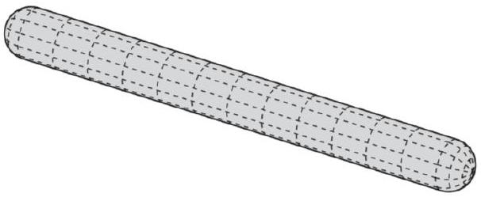
Explain this observation, assuming the thickness of the sausage skin is uniform, and hence can support a constant surface tension before breaking. (Hint: model the sausage as a cylinder of length

$L$ capped by hemispheres of radius $R \ll L$, and consider the surface tension needed to prevent the two modes of splitting mentioned, once an excess pressure $P$ builds up inside the sausage.)

Solution. Let the pressure difference from inside the sausage to outside be $P$. Cutting it across so the cross section is a circle tells us that the surface tension $\gamma _ { a }$ will exert a force $F = ( 2 \pi r ) \gamma _ { a }$ on each end since $F = \gamma \ell$. Using the trick from example 14, it must balance the force $F = \pi R ^ { 2 } P$, so $\gamma _ { a } = P R / 2$.

Lengthwise, the cross section has perimeter $2 L + 2 \pi R \approx 2 L$. If we apply the trick to each half-cylinder, we find that the pressure force is $F = ( 2 R L ) P$, so balancing forces gives $\gamma _ { L } = P R$. Since this is a greater requirement on the surface tension, the sausage will break lengthwise, as we observe in the kitchen.
[4] Problem 33. Two coaxial rings of radius $R$ are placed a distance $L$ apart from each other in vacuum. A soap film with surface tension $\gamma$ connects the two rings.

(a) Derive a differential equation for the shape $r ( z )$ of the film, and solve it.
(b) Show that for sufficiently large $L$, there are no solutions. If $L$ is increased to this value, what happens to the film?
(c) Using a computer or calculator, find the largest possible value of $L$.

We'll consider surface tension in more detail in T3.
Solution. (a) Consider a segment of the bubble between $z$ and $z + d z$. The net forces exerted by surface tension on both sides along the $z$-direction are $4 \pi r \gamma / \sqrt { 1 + r ^ { \prime 2 } }$. To balance forces in the $z$-direction for each segment, the quantity $r / \sqrt { 1 + r ^ { \prime 2 } }$ must be independent of $z$, so

$$
r ^ { 2 } = A ^ { 2 } \left( 1 + r ^ { \prime 2 } \right)
$$

for some constant $A$. Separating and integrating, we have

$$
\int d z = \int \frac { A d r } { \sqrt { r ^ { 2 } - A ^ { 2 } } }
$$

and substituting $r = A \cosh u$ and integrating yields

$$
z + C = A \cosh ^ { - 1 } ( r / A ) , \quad r = A \cosh \left( \frac { z + C } { A } \right)
$$

for another constant $C$. Setting the rings to be at $z = \pm L / 2$, we have $C = 0$. The quantity $A$ is the minimum radius, which occurs by symmetry at $z = 0$.
You may have noticed that the answer is a catenary, which is the same as the answer to example 10. The reason is that both problems can be solved by minimizing a similar quantity. Here, we want to find the function $r ( z )$ that minimizes the surface area,

$$
S = \int 2 \pi r \sqrt { 1 + r ^ { \prime 2 } } d z
$$

where the value of $r$ at two given values of $z$ is fixed. In that example, we wanted to find the shape $y ( x )$ of the chain that minimizes the gravitational potential energy,

$$
U = \lambda \int y \sqrt { 1 + y ^ { \prime 2 } } d x
$$

This function is similar in form, which explains why the form of the solution is similar. But there's an important physical difference: the length of the chain is fixed, and you need to specify it to determine the solution. (To see how this constraint can be imposed with Lagrange multipliers, see here.) By contrast, the soap bubble is more free to vary. That explains why, as we'll see below, you can sometimes have no solution for a soap bubble at all. In those cases, the middle of the film can just get thinner and thinner, always decreasing the area, until it pinches off into two separate pieces.
(b) We introduced the parameter $A$ above, which describes the shape of the solution. It is fixed by requiring that the bubble fit the rings,
$$
R = A \cosh \frac { L } { 2 A } .
$$
Now, we wish to find the largest $L$ so that there exists some $A$ that solves this equation. It's clearer to note that by dimensional analysis, the system only depends on the ratio $R / L$, so finding the largest $L$ for fixed $R$ is equivalent to finding the smallest $R$ for fixed $L$. By graphing the function $R ( A )$, we see it has a single minimum, so there is indeed a minimum possible $R / L$ and hence a maximum possible $L / R$.
(c) Setting the derivative $d R / d A$ to zero, the minimum occurs when
$$
\frac { 2 A } { L } = \tanh \frac { L } { 2 A } .
$$
This equation cannot be solved analytically. Using a calculator and the techniques of P1, we find the maximum possible $L$ is about 1.33R.

By the way, you can also solve this problem by looking at the forces on individual small elements of the bubble. Since the bubble isn't a closed surface, there's no pressure difference across it. Thus, in equilibrium, the Young-Laplace equation implies that the radii of curvature satisfy $R _ { 1 } + R _ { 2 } = 0$, i.e. the "mean curvature" is zero. This is the condition for the bubble to be a minimal surface. However, actually evaluating this condition in general is somewhat complicated; what we did above is the simplest way, which takes advantage of the axis of symmetry of the setup.

## 8 Deforming Solids

So far, the only continuous objects we've analyzed in detail have been ropes and bubbles. They are relatively simple because they can only support tension forces, and are one-dimensional and twodimensional respectively. A three-dimensional solid is much more complex, as it can deform in many different ways, and can also support internal shear forces. A full treatment of this subject, which requires comfort with tensors, is given in chapters 6 through 11 of Lautrup, as well as chapters II-31, II-38, and II-39 of the Feynman lectures. In this problem set, we'll just give two simple examples.

Example 16: IPhO 2022 3A
A thin piece of spaghetti of diameter $d$ is balanced horizontally from its middle.

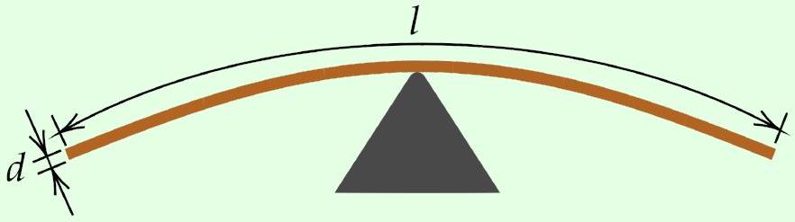
It can have a length $\ell \gg d$ before it snaps under its own weight. How does $\ell$ scale with $d$ ?

## Solution

Let the spaghetti rod have density $\rho$, and consider its right half. There must be a vertical normal force $F \sim \rho d ^ { 2 } \ell$ to balance the weight. This vertical force is transmitted through the rod by a shear stress (i.e. an internal force per area, perpendicular to the rod) of order $\sigma _ { s } \sim F / A \sim \rho \ell$. Each piece of the rod exerts such a shear stress on its neighbors, just like how pieces of a string exert tensions on their neighbors.

Now consider torques on the right half of the rod, about the pivot point. The torque $\tau \sim \rho d ^ { 2 } \ell ^ { 2 }$ of the rod's weight has to be balanced by forces from the other half of the rod. Vertical forces don't work, since they don't provide any torque about the pivot. Instead, the torque is supplied by a horizontal compression force at the bottom, and a horizontal tension force at the top, which cancel out to maintain horizontal force balance. This combination of forces, which produces no net force but does produce a net torque, is a bending moment.

Let the associated normal stresses be of order $\pm \sigma _ { n }$. Then the net compression and tension forces are of order $\pm d ^ { 2 } \sigma _ { n }$, and the lever arm is of order $d$, so balancing torques gives

$$
\rho d ^ { 2 } \ell ^ { 2 } \sim \sigma _ { n } d ^ { 3 }
$$

which implies $\sigma _ { n } \sim \rho \ell ^ { 2 } / d$. This is much greater than $\sigma _ { s }$, because of the very small lever arm, which is why thin rods usually break by snapping, not by shearing or pulling apart. Given a fixed maximum $\sigma _ { n }$, we conclude the maximum length scales as $\ell \sim \sqrt { d }$.
[3] Problem 34. USAPhO 2022, problem A1. A practical bending moment problem.

## Example 17

A solid ball of radius $R$, density $\rho$, and Young's modulus $Y$ rests on a hard table. Because of its weight, it deforms slightly, so that the area in contact with the table is a circle of radius $r$.

Estimate $r$, assuming that it is much smaller than $R$.

Solution
Recall from P1 that the Young's modulus is defined by

$$
Y = \frac { \text { stress } } { \text { strain } } = \frac { \text { restoring force/cross-sectional area } } { \text { change in length/length } }
$$

and has dimensions of pressure. By dimensional analysis, you can show that

$$
r = R f ( \rho g R / Y )
$$

but dimensional analysis alone can't tell us anything more about $f$. Moreover, an exact analysis using forces would be very difficult, because different parts of the ball are compressed in different amounts, and in different directions; there's little symmetry here.

Instead, we'll roughly estimate the stress and strain near the bottom of the ball. For the part directly in contact with the table, we have

$$
\text { stress } \sim F / r ^ { 2 } \sim \rho g R ^ { 3 } / r ^ { 2 }
$$

because the normal pressure has to balance gravity. This is the pressure exactly at the bottom of the ball; at heights much greater than $r$, the pressure will be smaller because it can spread out over a wider horizontal surface area. Since stress is proportional to strain, that means the part of the ball that is significantly strained has typical height $r$. (This is an example of Saint-Venant's principle, which states that strain is generally confined near the location that external forces are applied.) So in that region, the strain must be

$$
\text { strain } \sim \delta / r \sim r / R
$$

where $\delta$ is the vertical deformation. Using the definition of the Young's modulus, we conclude

$$
r \propto R \left( \frac { \rho g R } { Y } \right) ^ { 1 / 3 } .
$$

We can also phrase this result in terms of force and displacement. We have $\delta \sim r ^ { 2 } / R$, and the total force that pushes the ball into the table is $F \sim \rho g R ^ { 3 }$, so

$$
F \propto Y R ^ { 1 / 2 } \delta ^ { 3 / 2 } .
$$

The restoring force is not linear in $\delta$, so it doesn't obey Hooke's law.
As mentioned above, contact mechanics is the study of how normal and other forces behave for realistic, deformable solids. In this example, we considered "Hertzian contact". For much more, see Contact Mechanics by Johnson, and Contact Mechanics and Friction by Popov.
[4] Problem 35. NBPhO 2006, problem 5. A tough problem on a deforming object.
