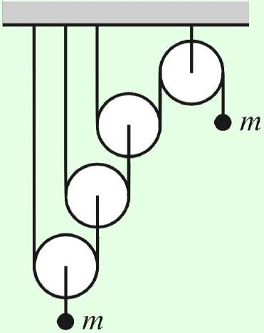
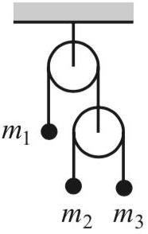
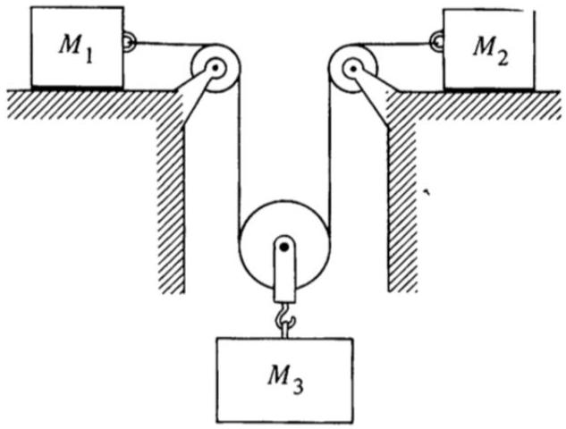
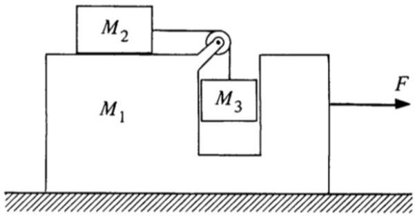
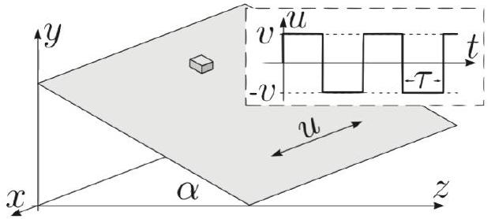
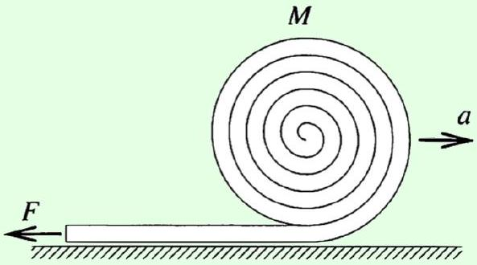
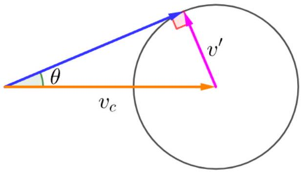
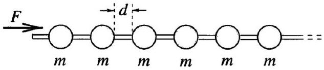
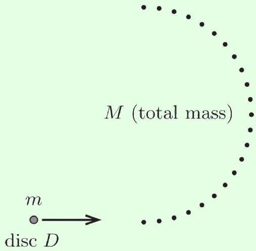
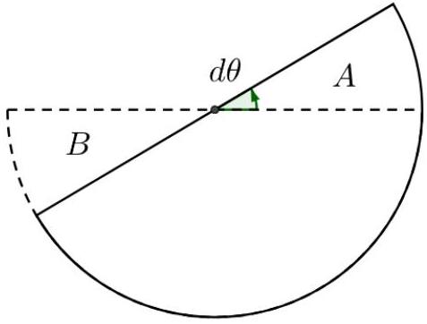

## Mechanics III: Dynamics

Chapters 3 and 5 of Morin cover dynamics, energy, and momentum. Alternatively, see chapters 2 and 3 of Kleppner and Kolenkow, or chapters 4 and 6 of Wang and Ricardo, volume 1. For fun, see chapters I-9 through I-14 of the Feynman lectures. There is a total of 79 points.

## 1 Blocks, Pulleys, and Ramps

Idea 1
To solve dynamics problems with constraints, it's easiest to first write the constraint in terms of coordinates (e.g. "conservation of string" for pulleys, or stationarity of the CM for an isolated system), then differentiate to get constraints on the velocity and acceleration.

Questions of this type are generally straightforward, as long as you write down the correct equations. The trickiest part is often solving the equations, which can get messy.

Example 1: Morin 3.30
Find the acceleration of the masses in the Atwood's machine shown below.

Neglect friction, and treat all pulleys and strings as massless.

Solution
Let $x$ and $x ^ { \prime }$ be the amounts by which the left and right mass have moved down, and number the pulleys 1 through 4 from left to right, and the strings 1 through 3 from left to right. Pulley 4 is stationary, so conservation of string 3 means that pulley 3 moves up by $x ^ { \prime } / 2$. Next, conservation of string 2 means that pulley 2 moves up by $x ^ { \prime } / 4$. Finally, conservation of string 1 implies that pulley 1 moves up by $x ^ { \prime } / 8$, so our final conservation of string constraint is

$$
x = - \frac { x ^ { \prime } } { 8 }
$$

which upon applying the derivative twice gives

$$
a = - \frac { a ^ { \prime } } { 8 } .
$$

Now, because we are neglecting friction and the mass of the strings, each string carries a uniform tension. (To see this, we use the same logic as in M2. We consider a small piece of one string, which has tension forces acting on both sides. Since there's no friction, the only net force along the string comes from the difference of these tension forces. Since the string's mass is negligible, the force required to accelerate it is also negligible, so there's no difference in tension.)

From left to right, we let the string tensions be $T _ { 1 } , T _ { 2 }$, and $T _ { 3 }$. We know that

$$
a = g - \frac { 2 T _ { 1 } } { m } , \quad a ^ { \prime } = g - \frac { T _ { 3 } } { m } .
$$

Since pulley 3 is massless, the forces on it must balance, so $T _ { 2 } = 2 T _ { 3 }$. Similarly $T _ { 1 } = 2 T _ { 2 }$, so $T _ { 1 } = 4 T _ { 3 }$. We hence have a system of three equations in three unknowns $\left( T _ { 1 } , a \right.$, and $\left. a ^ { \prime } \right)$, which can be solved straightforwardly to give

$$
a ^ { \prime } = \frac { 56 } { 65 } g , \quad a = - \frac { 7 } { 65 } g .
$$

By the way, this arrangement of pulleys is called a Spanish burton. If there are $n$ pulleys chained at the left ( $n = 3$ in the above diagram), the mechanical advantage is $2 ^ { n }$, the highest of any possible $n$-pulley system. However, in practice such a huge mechanical advantage is rarely useful, since friction would be substantial and the range of motion is small. Instead, people who use pulleys in real life, like sailors, climbers, or auto mechanics, tend to use simpler setups like the block and tackle or chain hoist.

[2] Problem 1 (Morin 3.2). Consider the double Atwood's machine shown below.

Assuming all pulleys are massless, and neglecting friction, find the acceleration of the mass $m _ { 1 }$.
Solution. Let $T$ be the tension in the lower pulley's string. Then the tension in the upper pulley's string has to be $2 T$, so that the forces on the massless lower pulley balance. Letting the downward accelerations be $a _ { 1 } , a _ { 2 }$, and $a _ { 3 }$, we have
$$
m _ { 1 } g - 2 T = m _ { 1 } a _ { 1 } , \quad m _ { 2 } g - T = m _ { 2 } a _ { 2 } , \quad m _ { 3 } g - T = m _ { 3 } a _ { 3 } .
$$
By conservation of string,
$$
0 = 2 a _ { 1 } + a _ { 2 } + a _ { 3 } = 2 \left( g - 2 T / m _ { 1 } \right) + g - T / m _ { 2 } + g - T / m _ { 3 } = 4 g - T \left( 4 / m _ { 1 } + 1 / m _ { 2 } + 1 / m _ { 3 } \right) ,
$$
so that
$$
T = \frac { g } { 1 / m _ { 1 } + 1 / 4 m _ { 2 } + 1 / 4 m _ { 3 } } .
$$

Thus, we conclude

$$
a _ { 1 } = g - \frac { 2 T } { m _ { 1 } } = g - \frac { 2 g } { 1 + m _ { 1 } / 4 m _ { 2 } + m _ { 1 } / 4 m _ { 3 } } = \frac { m _ { 1 } \left( m _ { 2 } + m _ { 3 } \right) - 4 m _ { 2 } m _ { 3 } } { 4 m _ { 2 } m _ { 3 } + m _ { 1 } \left( m _ { 2 } + m _ { 3 } \right) } g .
$$

[2] Problem 2 (KK 2.15). Consider the system of massless pulleys shown below.

The coefficient of friction between the masses and the horizontal surfaces is $\mu$. Show that the tension in the rope is
$$
T = \frac { ( \mu + 1 ) g } { 2 / M _ { 3 } + 1 / 2 M _ { 1 } + 1 / 2 M _ { 2 } } .
$$
Solution. Let block 1 have acceleration $a _ { 1 }$ to the right, block 2 have acceleration $a _ { 2 }$ to the left, block 3 have acceleration $a _ { 3 }$ down. Conservation of string implies
$$
2 a _ { 3 } = a _ { 1 } + a _ { 2 } .
$$
We also see that
$$
M _ { 3 } g - 2 T = M _ { 3 } a _ { 3 } , \quad T - M _ { 1 } g \mu = M _ { 1 } a _ { 1 } , \quad T - M _ { 2 } g \mu = M _ { 2 } a _ { 2 }
$$
which implies
$$
2 a _ { 3 } = 2 \frac { M _ { 3 } g - 2 T } { M _ { 3 } } , \quad a _ { 1 } = \frac { T - M _ { 1 } g \mu } { M _ { 1 } } , \quad a _ { 2 } = \frac { T - M _ { 2 } g \mu } { M _ { 2 } } .
$$
Thus, we have
$$
2 \left( g - 2 T / M _ { 3 } \right) = \left( T / M _ { 1 } - g \mu \right) + \left( T / M _ { 2 } - g \mu \right) \Longrightarrow 2 g ( 1 + \mu ) = T \left( 1 / M _ { 1 } + 1 / M _ { 2 } + 4 / M _ { 3 } \right) .
$$
Solving for $T$ gives the result.
[2] Problem 3 (KK 2.20). Consider the machine shown below, which we encountered in M2.

Show that the acceleration of $M _ { 1 }$ when the external force $F$ is zero is
$$
a = - \frac { M _ { 2 } M _ { 3 } g } { M _ { 1 } M _ { 2 } + M _ { 1 } M _ { 3 } + 2 M _ { 2 } M _ { 3 } + M _ { 3 } ^ { 2 } } .
$$

Solution. Let the acceleration of $M _ { 2 }$ with respect to $M _ { 1 }$ be $w$. Then $T = M _ { 2 } ( w + a )$ and $M _ { 3 } g - T = M _ { 3 } w$, and adding these results gives us

$$
M _ { 3 } g = M _ { 2 } ( w + a ) + M _ { 3 } w .
$$

There are no external horizontal forces, so the horizontal acceleration of the center of mass is zero,

$$
M _ { 1 } a + M _ { 2 } ( w + a ) + M _ { 3 } a = 0 \Longrightarrow w = - \frac { M _ { 1 } + M _ { 3 } } { M _ { 2 } } a - a = - a \frac { M _ { 1 } + M _ { 2 } + M _ { 3 } } { M _ { 2 } } .
$$

Plugging this back into the previous equation gives

$$
M _ { 3 } g = M _ { 2 } ( - a ) \frac { M _ { 1 } + M _ { 3 } } { M _ { 2 } } - a M _ { 3 } \frac { M _ { 1 } + M _ { 2 } + M _ { 3 } } { M _ { 2 } } ,
$$

and solving for $a$ gives the desired result.
By the way, if you tried to solve the problem by considering just forces, there's a subtlety; it's easy to forget that there must be a force on $M _ { 1 }$ due to the normal force of the rope on the pulley. (This force has to be there, or else the forces on the massless rope wouldn't balance.) Indeed, these forces already showed up in the preliminary problem set. The solution above implicitly took this into account, by using the fact that the center of mass doesn't move.
[3] Problem 4. A block of mass $m$ is placed at rest on top of a frictionless wedge of mass $M$. The wedge rests on a frictionless horizontal table, and its sloped top makes an angle $\theta$ to the horizontal.

(a) When the block is released, what is the horizontal acceleration of the wedge?
(b) Assume the block starts a distance $d$ above the table. Using results from part (a), what is the horizontal velocity of the block just before it reaches the floor?
(c) Find the speed of the block after it reaches the floor by applying energy and momentum conservation to the entire process.
(d) Your results for parts (b) and (c) should not match. What's going on?

Solution. (a) Applying Newton's second law to the wedge gives

$$
M a = N \sin \theta .
$$

Next, work in the noninertial frame of the wedge, where the block only moves parallel to the slope. Balancing the forces perpendicular to the slope gives

$$
N = m g \cos \theta - m a \sin \theta .
$$

It's now straightforward to eliminate $N$ and thereby solve for $a$, which gives

$$
a = \frac { m g \sin \theta \cos \theta } { M + m \sin ^ { 2 } \theta } .
$$

By the way, it's easy to get confused on this problem if you focus too much on the block, because its motion is somewhat confusing; you have to decompose it into motion parallel to the slope, and motion of the wedge itself. Once you do that, the problem can be solved straightforwardly. The solution above is especially short because it never considers the acceleration of the block parallel to the slope, which isn't required to get the answer.

(b) Since the only horizontal forces in the problem are between the block and wedge, the horizontal acceleration of the block is
$$
a _ { b } = \frac { M } { m } a .
$$
Thus, the relative acceleration of the two is
$$
a _ { \mathrm { rel } } = a + a _ { b } = \frac { M + m } { m } a .
$$
The block goes off the wedge once the two have moved a relative horizontal distance of $d / \tan \theta$, which takes a time $t = \sqrt { 2 d / \left( a _ { \text {rel } } \tan \theta \right) }$. At this point the block has a horizontal velocity
$$
v _ { b } = a _ { b } t = \sqrt { 2 g d } \frac { M \cos \theta } { \sqrt { \left( M + m \sin ^ { 2 } \theta \right) ( M + m ) } } .
$$
(c) By momentum conservation, the final horizontal speeds obey
$$
M v _ { p } = m v _ { b }
$$
while by energy conservation,
$$
\frac { 1 } { 2 } M v _ { p } ^ { 2 } + \frac { 1 } { 2 } m v _ { b } ^ { 2 } = m g d .
$$
Combining the two and solving gives
$$
v _ { b } = \sqrt { 2 g d } \sqrt { \frac { M } { M + m } } .
$$
(d) It turns out that both results are correct, but they're the answers to different questions. Note that at the instant the block gets to the bottom of the wedge, its velocity isn't horizontal, but right after it's off the wedge, its velocity must be exactly horizontal. This requires a rather large vertical impulse. (For an illustration of this, see $F = m a$ 2021, problems 1 and 2.)
Depending on how the wedge and block are constructed, there are several possibilities. If the wedge abruptly ends, and the block immediately begins moving horizontally, then we have an inherently inelastic process. The vertical kinetic energy $m v _ { y } ^ { 2 } / 2$ of the block is lost, so the answer to part (c) doesn't apply, and the answer to part (b) is correct. (Another possibility, if the block is very bouncy, is that the sign of its $v _ { y }$ will flip, and it'll bounce off the floor. In this case, the answer to part (b) is still correct. Energy is conserved now, but the answer to part (c) is still wrong because it assumes the final velocity of the block is horizontal.)
On the other hand, if the wedge ends in a transition region, where $\theta$ smoothly goes to zero, then ideally energy remains conserved, and the answer of part (c) applies. In this region, a strong normal force reorients the velocity to be horizontal, supplying both a large horizontal and vertical impulse. As a result, the answer to part (b) doesn't apply.
This subtlety about how wedges end applies to lots of physics problems. Often people implicitly assume the answer of part (c), but in reality it depends sensitively on how the wedge and block are made. In fact, in practice you can lose a lot of energy even if there's a smooth curve at the end, if that curve is not gradual enough.

## 2 Momentum

Idea 2
The momentum of a system is

$$
\mathbf { P } = \sum _ { i } m _ { i } \mathbf { v } _ { i } = M \mathbf { v } _ { \mathrm { CM } }
$$

In particular, the total external force on the system is $M \mathbf { a } _ { \mathrm { CM } }$, and if there are no external forces, the center of mass moves at constant velocity.

Example 2
A massless rope passes over a frictionless pulley. A monkey hangs on one side, while a bunch of bananas with exactly the same weight hangs from the other side. When the monkey tries to climb up the rope, what happens?

Solution
Remarkably, the answer doesn't depend on how the monkey climbs, whether slowly or quickly, or symmetrically or not! The total vertical force on the monkey is $T - m g$, so the acceleration of the center of mass of the monkey is $T / m - g$. But since the tension is uniform through a massless rope, the acceleration of the bananas is also $T / m - g$. Therefore, the monkey and bananas rise at the same rate, and meet each other at the pulley.

Now here's a question for you: compared to climbing up a rope fixed to the ceiling, climbing up to the pulley takes twice as much work, because the bananas are raised too. But in both cases, isn't the monkey applying the same force through the same distance? Where does the extra work come from? (The answer involves the ideas at the end of this problem set.)

Example 3: KK 3.14 / INPhO 2014.5
Two men, each with mass $m$, stand on a railway flatcar of mass $M$ initially at rest. They jump off one end of the flatcar with velocity $u$ relative to the car. The car rolls in the opposite direction without friction. Find the final velocities of the flatcar if they jump off at the same time, and if they jump off one at a time. Generalize to the case of $N \gg 1$ men, with a total mass of $m _ { \text {tot } }$.

Solution
In the first case, by conservation of momentum, we have

$$
M v + 2 m ( v - u ) = 0
$$

where $v$ is the final velocity of the flatcar, so

$$
v = \frac { 2 m u } { M + 2 m } .
$$

In the second case, by a similar argument, we find that after the first man jumps,

$$
v _ { 1 } = \frac { m u } { M + 2 m } .
$$

Now transform to the frame moving with the flatcar. When the second man jumps, he imparts a further velocity $v _ { 2 } = m u / ( M + m )$ to the flatcar by another similar argument. The final velocity of the flatcar relative to the ground is then

$$
v = v _ { 1 } + v _ { 2 } = m u \left( \frac { 1 } { M + 2 m } + \frac { 1 } { M + m } \right) .
$$

It might be a bit disturbing that the final speeds and hence energies of the flatcar are different, even though the men are doing the same thing (i.e. expending the same amount of energy in their legs to jump) in both cases.

The reason for the difference is that in the second case, the second man to jump ends up with less energy, since the velocity he gets from jumping is partially cancelled by the existing velocity $v _ { 1 }$. So the extra energy that goes into the flatcar corresponds to less kinetic energy in the men after jumping, which would ultimately have ended up as heat after they slid to a stop. Accounting properly for the kinetic energy of everything in the system solves a lot of paradoxes involving energy, as we'll see below.

In the case of many men, by similar reasoning we have

$$
v = \frac { m _ { \mathrm { tot } } } { M + m _ { \mathrm { tot } } } u
$$

in the first case, while in the second case the answer is the sum

$$
v = \sum _ { i = 1 } ^ { N } \frac { m _ { \mathrm { tot } } u } { N } \frac { 1 } { M + ( i / N ) m _ { \mathrm { tot } } } .
$$

This can be converted into an integral, by letting $x = i / N$, in which case $\Delta x = 1 / N$ and

$$
v = \sum _ { i } \Delta x \frac { m _ { \mathrm { tot } } u } { M + x m _ { \mathrm { tot } } } \approx \int _ { 0 } ^ { 1 } d x \frac { m _ { \mathrm { tot } } u } { M + x m _ { \mathrm { tot } } } = \log \left( \frac { M + m _ { \mathrm { tot } } } { M } \right) u .
$$

Note that this is essentially the rocket equation, which we'll derive in a different way in M6.
[2] Problem 5 (KK 4.11). A perfectly flexible chain of mass $M$ and length $\ell$ is suspended vertically with its lowest end touching a scale. The chain is released and falls onto the scale. Find the reading on the scale when a length of chain $x$ has fallen.

Solution. Because the chain is flexible, each link just crumples when it hits the ground, without pulling the rest of the chain downward. In other words, the assumption of ideal flexibility implies the tension in the chain vanishes, so that the vertical part of the chain is always in free fall.

Now, the lowest end of the chain is moving with velocity $\sqrt { 2 g x }$, so in time $d t$, a mass $M \sqrt { 2 g x } d t / \ell$ falls on to the scale, so the change in momentum of that piece is $( 2 M g x / \ell ) d t$. Thus, we need a force $2 M g x / \ell$ to stop the links that are falling on the scale. In addition, there must be a force $M g x / \ell$ to balance the weight of the chain that's already lying on the scale, for a total of $3 M g x / \ell$.

This is nice and elegant, but is it true? The result is actually pretty accurate, as you can see from experimental data here. The deviation from the expected result is because no chain is perfectly

flexible. Since the chain has to bend at the spot it hits the scale, some tension is produced, which pulls down the rest of the chain slightly faster than free fall.

This has a connection to the "inherently inelastic" processes mentioned later in the problem set. The fastest possible fall corresponds to the case where energy is conserved, i.e. when all the kinetic energy of each link hitting the ground is nearly transferred through tension to the still falling part of the chain. The answer we gave above corresponds to the slowest possible fall, where each link collides perfectly inelastically with the ground. For a flexible chain, the latter is closer to reality.
[3] Problem 6. Some qualitative questions about momentum.

(a) A box containing a vacuum is placed on a frictionless surface. The box is punctured on its right side. How does it move immediately afterward?
(b) You are riding forward on a sled across frictionless ice. Snow falls vertically (in the frame of the ice) on the sled. Which of the following makes the sled go the fastest or the slowest?
    1. You sweep the snow off the sled, directly to the left and right in your frame.
    2. You sweep the snow off the sled, directly to the left and right in the ice frame.
    3. You do nothing.
(c) An hourglass is made by dividing a cylinder into two identical halves, separated by a small orifice. Initially, the top half is full of sand and the bottom half is empty. The hourglass is placed on a scale, and then the orifice is opened. The total weight of the hourglass and sand is $W$. How does the scale reading compare to $W$ shortly after the sand starts falling, shortly after it finishing falling, and in between? (For concreteness, assume the surfaces of the sand in the top and bottom halves are always horizontal, and that the sand passes through the orifice at a constant rate.)

Solution. (a) Consider the system of the air plus the box. The air flows to the left, so to keep momentum conserved, the box moves to the right.

(b) It's easiest to think about this using conservation of momentum in the ice frame. Case (2) is clearly the fastest, as the snow steals none of the sled's horizontal momentum.
To decide between (1) and (3), note that in case (3), the snow always has the same speed as the sled. In case (1), the snow that fell and got swept up earlier has a higher speed than the sled, because the sled is constantly slowing down. So in case (1), the snow gets more of the horizontal momentum, so (1) is the slowest and (3) is in the middle.
(c) Right before the sand starts falling, and right after it finishes falling, the center of mass is stationary; however, it moves down while the sand is falling. Thus, the center of mass accelerates downward at the beginning, and accelerates upward at the end. So the scale reading is lower than $W$ right at the beginning, and higher than $W$ right at the end. You can see an experimental confirmation of these results here.
This can also be understood directly in terms of forces. Right after the sand starts falling, there's a column of sand that has not yet hit the bottom; the scale reading dips lower because it doesn't have to support this falling sand. And when the last bit of sand arrives, the scale reading jumps higher because the hourglass simultaneously has to support all of the sand, and absorb the impact from the falling sand; this is the effect derived in problem 5.

What about the scale reading in between these two times? Under the simplifying assumptions made in this problem, the downward velocity of the sand's center of mass is continuously decreasing (because the height difference between the tops of the sand in the two halves is decreasing), so the weight is more than $W$. But the difference is extremely small, since this acceleration is spread over the entire time sand is falling.
[3] Problem 7. USAPhO 2018, problem A1.
[3] Problem 8 (Kalda). A block is on a ramp with angle $\alpha$ and coefficient of friction $\mu > \tan \alpha$. The ramp is rapidly driven back and forth so that its velocity vector $\mathbf { u }$ is parallel to both the slope and the horizontal and has constant modulus $v$.

The direction of u reverses abruptly after each time interval $\tau$, where $g \tau \ll v$. Find the average velocity $\mathbf { w }$ of the block. (Hint: as mentioned in M1, it's best to work in the frame of the ramp, because it causes the friction, even though this introduces fictitious forces.)

Solution. Work in the frame of the ramp and orient the $x$ axis along $\mathbf { u }$ and the $y$ axis along the ramp. At all times, the acceleration due to friction is $\mu g \cos \alpha$ and the acceleration due to gravity is $g \sin \alpha$. Every time period $\tau$, an impulsive fictitious force changes $w _ { x }$ by $\pm 2 v$. Since $g \tau \ll v$, the total acceleration during the time period $\tau$ due to the friction and gravitational forces is negligible compared to this change. Assuming for now that $w _ { x }$ is symmetric so that $\bar { w } _ { x } = 0$, this means $\left| w _ { x } \right| \approx u$ at all times.

Now consider $w _ { y }$. In the steady state, the acceleration due to friction must be balanced by the acceleration due to gravity, so

$$
\frac { \bar { w } _ { y } } { \sqrt { \bar { w } _ { y } ^ { 2 } + u ^ { 2 } } } \mu g \cos \alpha = g \sin \alpha
$$

which yields the answer,

$$
\overline { \mathbf { w } } = \bar { w } _ { y } \hat { \mathbf { y } } , \quad \bar { w } _ { y } = \frac { u } { \sqrt { \mu ^ { 2 } \cot ^ { 2 } \alpha - 1 } } .
$$

Note that this diverges when $\mu = \tan \alpha$, because at that point the friction is not strong enough to prevent the block from accelerating down the ramp indefinitely. For $\mu > \tan \alpha$, we reach a steady state where only a portion of the friction is directed vertically, due to the horizontal speed, and that portion balances gravity.

This also allows us to argue that $\bar { w } _ { x } = 0$. If $\bar { w } _ { x }$ is not zero, $\left| w _ { x } \right|$ will be higher during one of the two halves of the cycle. But during that half, a greater share of the frictional acceleration will be directed against the $w _ { x }$ motion, tending to move $\bar { w } _ { x }$ to zero.

This seemingly weird problem actually has real-world applications! The point here is that you can make a block slide down a ramp even if friction would prevent it from doing so, and moreover make it slide at a controlled speed. This technique is used in factories, in the form of vibratory conveyors. In fact, a more complex vibration pattern can even make something slide up a ramp!

[4] Problem 9 (Morin 5.21). A sheet of mass $M$ moves with speed $V$ through a region of space that contains particles of mass $m$ and speed $v$. There are $n$ of these particles per unit volume. The sheet moves in the direction of its normal. Assume $m \ll M$, and assume that the particles do not interact with each other.
    (a) If $v \ll V$, what is the drag force per unit area on the sheet?
    (b) If $v \gg V$, what is the drag force per unit area on the sheet? Assume for simplicity that the component of every particle's velocity in the direction of the sheet's motion is exactly $\pm v / 2$.
    (c) Now suppose a cylinder of mass $M$, radius $R$, and length $L$ moves through the same region of space with speed $V$, and assume $v = 0$ and $m \ll M$. The cylinder moves in a direction perpendicular to its axis. What is the drag force on the cylinder?

Parts (a) and (b) are a toy model for the two regimes of drag, mentioned in M1. However, it shouldn't be taken too seriously, because as we'll see in M7, the typical velocity that separates the two types of behavior doesn't have to be of order $v$. Instead, it depends on how strongly the particles interact with each other.

Solution. (a) We can set $v = 0$. In time $t$, an area $A$ hits $n A V t$ particles, and the total change in momentum of these particles is $( n A V t ) m ( 2 V )$, so the pressure is $2 n m V ^ { 2 }$.

(b) Let's say the sheet is moving to the right. In the frame of the sheet, the particles are moving at velocity $V \pm v / 2$. The particles hitting the sheet from the right will have velocity $v / 2 + V$, and from the left $v / 2 - V$. From the right in time $d t$, there will be $\frac { 1 } { 2 } n A ( v / 2 + V ) d t$ particles hitting the sheet (with the $\frac { 1 } { 2 }$ coming from other particles moving away from the sheet), each with impulse $2 m ( v / 2 + V )$. Thus the pressure will be $n m ( v / 2 + V ) ^ { 2 }$ from the right, and replacing $V$ with $- V$ gives a pressure of $n m ( v / 2 - V ) ^ { 2 }$ from the left. Thus the total pressure on the sheet is $2 n m V v$.
(c) Work in cylindrical coordinates, with $\theta = 0$ along the direction of the cylinder's motion. For a segment $d \theta$, we have
$$
\frac { \text { collisions } } { \text { time } } = \frac { \text { particles volume swept out } } { \text { volume } } = n V L R \cos \theta d \theta
$$
where $L$ is the length of the cylinder. To calculate the rebound velocity, it's best to work in the frame of the cylinder. In this case, the particles come in with vertical velocity $- V$, and then bounce off elastically, ending up with vertical velocity $V \cos 2 \theta$. So the impulse per collision is $m V ( 1 + \cos 2 \theta )$. The drag force is
$$
F = \int _ { - \pi / 2 } ^ { \pi / 2 } m V ( 1 + \cos 2 \theta ) n V L R \cos \theta d \theta = n m V ^ { 2 } L R \int _ { - \pi / 2 } ^ { \pi / 2 } ( 1 + \cos 2 \theta ) \cos \theta d \theta
$$
The integral can be done straightforwardly using either the cosine double angle identity, or decomposing into complex exponentials, yielding 8/3, so
$$
F = \left( 2 n m V ^ { 2 } \right) ( L R ) \left( \frac { 4 } { 3 } \right)
$$
Compare this to the answer to part (a). The force is quadratic in $V$ for the same reason, but now the area is replaced by an effective area $( 4 / 3 ) L R$. This is slightly less than the actual area $2 L R$, since the surface is curved, and hence more aerodynamic.

You can also get a more "realistic" result by averaging over a Maxwell-Boltzmann distribution for the molecular speeds, as introduced in T1. But this is a lot more work, and the simpler calculation done in this problem gives all the essential insight.

## 3 Energy

Idea 3
The work done on a point particle is

$$
W = \int \mathbf { F } \cdot d \mathbf { x }
$$

and is equal to the change in kinetic energy, as you showed in P1.

Remark: Dot Products
The dot product of two vectors is defined in components as

$$
\mathbf { v } \cdot \mathbf { w } = v _ { x } w _ { x } + v _ { y } w _ { y } + v _ { z } w _ { z }
$$

and is equal to $| \mathbf { v } | | \mathbf { w } | \cos \theta$ where $\theta$ is the angle between them. For example, if $\mathbf { A }$ and $\mathbf { B }$ are the sides of a triangle, the other side is $\mathbf { C } = \mathbf { A } - \mathbf { B }$, and

$$
C ^ { 2 } = | \mathbf { A } - \mathbf { B } | ^ { 2 } = ( \mathbf { A } - \mathbf { B } ) \cdot ( \mathbf { A } - \mathbf { B } ) = A ^ { 2 } + B ^ { 2 } - 2 A B \cos \theta
$$

which proves the law of cosines. (Or, if you accept the law of cosines, you could regard this as a proof that the dot product depends on $\cos \theta$ as claimed.)

Like the ordinary product, the dot product obeys the product rule. For example,

$$
\frac { d } { d t } ( \mathbf { v } \cdot \mathbf { w } ) = \dot { \mathbf { v } } \cdot \mathbf { w } + \mathbf { v } \cdot \dot { \mathbf { w } }
$$

Using this, it's easy to generalize the derivation of the work-kinetic energy theorem in P1 to three dimensions; we have

$$
\frac { 1 } { 2 } d \left( v ^ { 2 } \right) = \frac { 1 } { 2 } d ( \mathbf { v } \cdot \mathbf { v } ) = \mathbf { v } \cdot d \mathbf { v } = \frac { d \mathbf { x } } { d t } \cdot d \mathbf { v } = \frac { d \mathbf { v } } { d t } \cdot d \mathbf { x } = \mathbf { a } \cdot d \mathbf { x }
$$

and this is equivalent to the desired theorem. As you can see, it's all basically the same, since the product and chain rule manipulations work the same way for vectors and scalars.

Example 4: IPhO 1996 1(b)
A skier starts from rest at point A and slowly slides down a hill with coefficient of friction $\mu$, without turning or braking, and stops at point B. At this point, his horizontal displacement is $s$. What is the height difference $h$ between points A and B ?

Solution
Since the skier begins and ends at rest, the change in height is the total energy lost to friction,

$$
m g h = \int f _ { \text {fric } } d s
$$

where the integral over $d s$ goes over the skier's path. Since the skier is always moving slowly, the normal force is approximately $m g \cos \theta$. (More generally, there would be another contribution to provide the centripetal acceleration.) But then

$$
\int f _ { \text {fric } } d s = \int \mu m g \cos \theta d s = \int \mu m g d x = \mu m g s
$$

which gives an answer of $h = \mu s$. (If the skier's path turned around, then this would still hold as long as $s$ denotes the total horizontal distance traveled.)

[2] Problem 10 (MPPP 16). On a windless day, a cyclist going "flat out" can ride uphill at a speed of $v _ { 1 } = 12 \mathrm {~km} / \mathrm { h }$ and downhill at $v _ { 2 } = 36 \mathrm {~km} / \mathrm { h }$ on the same inclined road. We wish to find the cyclist's top speed on a flat road if their maximal effort is independent of the speed at which the bike is traveling. Note that in this regime, the air drag force is quadratic in the speed.
    (a) Solve the problem assuming that "maximal effort" refers to the force exerted on the pedals by the rider, and that the rider never changes gears.
    (b) Solve the problem assuming that "maximal effort" refers to the rider's power.

Solution. (a) Let $F _ { 0 }$ be the force due to gravity along the hill and let $k v ^ { 2 }$ be the drag force. If the rider exerts force $F ^ { \prime }$ on the pedals, then the wheels exert a force $F$ on the ground, but the ratio $F / F ^ { \prime }$ is constant if there are no gear switches. Then

$$
F - F _ { 0 } = k v _ { 1 } ^ { 2 } , \quad F + F _ { 0 } = k v _ { 2 } ^ { 2 } , \quad F = k v _ { 3 } ^ { 2 }
$$

where $v _ { 3 }$ is the answer. Combining these equations gives

$$
v _ { 3 } = \sqrt { \frac { v _ { 1 } ^ { 2 } + v _ { 2 } ^ { 2 } } { 2 } } = 27 \mathrm {~km} / \mathrm { h } .
$$

(b) In this case, the equations are a bit nastier,
$$
P / v _ { 1 } - F _ { 0 } = k v _ { 1 } ^ { 2 } , \quad P / v _ { 2 } + F _ { 0 } = k v _ { 2 } ^ { 2 } , \quad P / v _ { 3 } = k v _ { 3 } ^ { 2 } .
$$
Some tedious but straightforward algebra gives
$$
v _ { 3 } = \sqrt [ 3 ] { \frac { v _ { 1 } v _ { 2 } \left( v _ { 1 } ^ { 2 } + v _ { 2 } ^ { 2 } \right) } { v _ { 1 } + v _ { 2 } } } = 23.5 \mathrm {~km} / \mathrm { h } .
$$
[3] Problem 11. USAPhO 2016, problem B1.
[2] Problem 12. Alice steps on the gas pedal on her car. Bob, who is standing on the sidewalk, sees Alice's car accelerate from rest to 10 mph. Charlie, who is passing by in another car, sees Alice's car accelerate from 10 mph to 20 mph. Hence Charlie sees the kinetic energy of Alice's car increase by three times as much. How is this compatible with energy conservation, given that the same amount of gas was burned in both frames?

Solution. The difference in energy comes from the change in kinetic energy of the Earth. In Bob's frame, the final kinetic energy of the Earth is $p ^ { 2 } / 2 M$ where $p$ is the total frictional impulse, and this is negligible since $p$ is moderately sized, while the Earth's mass $M$ is huge. Another way of saying this is that the final kinetic energy of the car is $p ^ { 2 } / 2 m _ { \text {car } }$, which is much larger since $m _ { \text {car } } \ll M$.

On the other hand, in Charlie's frame, the Earth has some initial momentum $P$. The change in kinetic energy of the Earth is

$$
\Delta K _ { E } = \frac { ( P - p ) ^ { 2 } - P ^ { 2 } } { 2 M } = - \frac { P p } { M } + \frac { p ^ { 2 } } { 2 M } .
$$

The last term is again negligible, but now we have a term that is linear in $p$, which isn't negligible. Let $v _ { 0 } = 10 \mathrm { mph }$. We have $P / M = v _ { 0 }$ and $p = m _ { \text {car } } v _ { 0 }$, so

$$
\Delta K _ { E } = - m _ { \text {car } } v _ { 0 } ^ { 2 } .
$$

This decrease in Earth's kinetic energy accounts for the extra increase in the car's kinetic energy. The lesson of this problem is that when you go into a different reference frame, kinetic energies and even changes in kinetic energy can differ dramatically. While you can get the right answer either way, it's generally least confusing to work in the rest frame of the largest object in the problem.

When there are multiple large objects, you can get interesting effects. For example, naively a gravitational slingshot can't work, because the gravitational force is conservative. And indeed, a rocket doing a gravitational slingshot off of Jupiter gets no additional energy, in Jupiter's frame. However, for rockets that far out, the most important object is the Sun, since it determines, e.g. whether the rocket can escape the solar system. To answer that kind of question we should work in the Sun's frame, and in this frame the rocket does get more energy, as it harvests it from Jupiter's large kinetic energy. You'll investigate this in more detail in M6.
[3] Problem 13 (KK 4.8). A block of mass $m$ is attached to a spring of spring constant $k$. It is pulled a distance $L$ from its equilibrium position and released from rest. The block has a small coefficient of friction $\mu$ with the ground. Find the number of cycles the mass oscillates before coming to rest.

Solution. First let's present a short solution that only works for small $\mu$. (The kind of reasoning will be useful in M4.) Let $A$ be the amplitude, so the energy is $E = \frac { 1 } { 2 } k A ^ { 2 }$. Hence in one cycle, the change in energy is related to the change in amplitude by

$$
d E = k A d A
$$

where we can use infinitesimals for one cycle since the friction is assumed small. But the energy loss is also $4 \mu m g A$, so plugging this in gives

$$
d A = - \frac { 4 \mu m g } { k } .
$$

The oscillation ends when the amplitude drops to zero, so

$$
N = \frac { k L } { 4 \mu m g } .
$$

We expect this result to be trustworthy whenever $N$ is large, i.e. when the fractional amplitude change during a cycle is small.

However, this problem is simple enough to be solved exactly. During the left-moving part of a cycle, the friction provides a constant force of $\mu m g$ to the right. Therefore, just like how gravity

shifts the equilibrium position of a vertical spring, the friction shifts the equilibrium position to the right by $\mu m g / k$. The left-moving motion is a perfect sinusoid centered at this position. Similarly, the right-moving part of the oscillation is a perfect sinusoid, but instead centered at $- \mu m g / k$. The net effect of one cycle is thus to decrease the amplitude by exactly $4 \mu m g / k$. Therefore, $N = k L / ( 4 \mu m g )$, or more strictly speaking, the number of complete "cycles" is $\lfloor N \rfloor$.
[3] Problem 14 (Morin 5.4). A massless string of length $2 \ell$ connects two hockey pucks that lie on frictionless ice. A constant horizontal force $F$ is applied to the midpoint of the string, perpendicular to it. The pucks eventually collide and stick together. How much kinetic energy is lost in the collision?

Solution. Suppose the bend in the rope is $\theta$, where originally $\theta = 0$. We see that the tension $T$ satisfies $2 T \sin \theta = F$, by balancing forces at the midpoint. Thus, the $y$-component of the force on the top mass is $T \cos \theta$, so the total work done by tension in the $y$ direction is

$$
W = - \int _ { 0 } ^ { \pi / 2 } 2 ( T \cos \theta ) d ( \ell \cos \theta ) = \ell F \int _ { 0 } ^ { \pi / 2 } \cos \theta d \theta = F \ell
$$

This determines the vertical kinetic energy, $m v _ { y } ^ { 2 } / 2$, of each puck. When the pucks collide, all of this energy is lost, giving the answer $F \ell$.

There's also a slick alternate solution using a noninertial reference frame. Now, in general work depends on the reference frame, as we just saw in problem 12, since displacement does, so we always need to be careful calculating energies in other frames. However, the amount of dissipated energy determines how much the pucks warm up, which is independent of frame! Therefore, we are free to use any frame we want.

In particular, consider the frame with acceleration $F / 2 m$ along the force. In this frame, there is a fictitious force $- F / 2$ on each puck. The net force on the system is zero, so the pucks move directly towards each other. When the pucks collide, the point of application of the force $F$ has traveled a distance $\ell$, doing work $F \ell$. Since the pucks are stationary after collision, all this energy is dissipated, giving the answer $F \ell$ again.

Idea 4
If a problem can be solved using either momentum conservation or energy conservation alone, it usually means one of the two isn't actually conserved. In particular, many processes are inherently inelastic and inevitably dissipate energy. For more about inherently inelastic processes, see section 5.8 of Morin.
[2] Problem 15 (KK 4.20). Sand falls slowly at a constant rate $d m / d t$ onto a horizontal belt driven at constant speed $v$.

(a) Find the power $P$ needed to drive the belt.
(b) Show that the rate of increase of the kinetic energy of the sand is only $P / 2$.
(c) We can explain this discrepancy exactly. Argue that in the reference frame of the belt, the rate of heat dissipation is $P / 2$. Since temperature is the same in all frames, the rate of heat dissipation is $P / 2$ in the original frame as well, accounting for the missing energy.

Solution. (a) We have $P = F v = ( d p / d t ) v = ( v ( d m / d t ) ) v = v ^ { 2 } d m / d t$.

(b) Clearly, it's $\frac { 1 } { 2 } ( d m / d t ) v ^ { 2 } = P / 2$.
(c) In the belt's frame, the sand comes in with a speed of $v$, and friction slows it down to zero speed. Hence the sand loses all its kinetic energy to heat, at a rate $\frac { 1 } { 2 } ( d m / d t ) v ^ { 2 } = P / 2$.

Example 5: PPP 108
A fire hose of mass $M$ and length $L$ is coiled into a roll of radius $R$. The hose is sent rolling along level ground, with its center of mass given initial speed $v _ { 0 } \gg \sqrt { g R }$. The free end of the hose is held fixed.

The hose unrolls and becomes straight. How long does this process take to complete?

Solution
First, we need to find what is conserved. The horizontal momentum is not conserved, because there is an external horizontal force needed to keep the end of the hose in place. On the other hand, the energy is conserved, even though this process looks inelastic. The hose "sticks" to the floor as it unrolls, but this process dissipates no energy because the circular part of the hose rolls without slipping, so the bottom of this part always has zero velocity.

Once we figure out energy is conserved, the problem is straightforward. The assumption $v _ { 0 } \gg \sqrt { g R }$ means we can neglect the change in gravitational potential energy as the hose unrolls. After the hose travels a distance $x$,

$$
\frac { 1 } { 2 } \left( 1 + \frac { 1 } { 2 } \right) M v _ { 0 } ^ { 2 } = \frac { 1 } { 2 } \left( 1 + \frac { 1 } { 2 } \right) m v ^ { 2 }
$$

where the $1 / 2$ terms are from rotational kinetic energy. Since $m ( x ) = M ( 1 - x / L )$, we have

$$
v ( x ) = \frac { v _ { 0 } } { \sqrt { 1 - x / L } }
$$

which gives a total time

$$
T = \int _ { 0 } ^ { L } \frac { d x } { v ( x ) } = \frac { L } { v _ { 0 } } \int _ { 0 } ^ { 1 } \sqrt { 1 - u } d u = \frac { 2 L } { 3 v _ { 0 } } .
$$

Evidently, the hose accelerates as it unrolls.

[3] Problem 16. Consider the following related problems; in all parts, neglect friction.
(a) A flexible uniform rope of length $\ell$ lies stretched out flat on a table, with a tiny portion $\ell _ { 0 } \ll \ell$ hanging through a small hole. The rope is released from rest, and all points on the rope begin

to move with the same speed. Since this motion is smooth, energy is conserved. Find the speed of the rope when the end goes through the hole.
(b) Find the total time it takes the rope to go through the hole.
(c) Now suppose a flexible uniform chain of length $\ell$ is placed loosely coiled close to the hole. Again, a tiny portion $\ell _ { 0 } \ll \ell$ hangs through the hole, and the chain is released from rest. In this case, the unraveling of the chain is an inherently inelastic process, because each link of the chain sits still until it is suddenly jerked into motion. Find the speed of the chain when the last link goes through the hole. (Hint: write down a differential equation for the length $x ( t )$ of chain that has passed through the hole. It can be solved by guessing $x ( t ) = A t ^ { n }$.)

Solution. (a) We use energy conservation. Let $M$ be the mass of the rope. The height of the center of mass falls by $\ell / 2$, so $\ell M g / 2 = M v ^ { 2 } / 2$, which gives the answer of $v = \sqrt { \ell g }$.

(b) Using energy conservation, we have
$$
\frac { 1 } { 2 } M v ^ { 2 } = \frac { M g x } { \ell } \frac { x } { 2 }
$$
which implies $v = \sqrt { g / \ell } x$. Taking the derivative, we have
$$
a = \sqrt { \frac { g } { \ell } } v = \frac { g } { \ell } x .
$$
This makes sense, as there is a total force $( x / \ell ) M g$ pulling the rope through the hole, and a total inertia $M$. (We will make this more precise using generalized coordinates in M4.)
In any case, we now have a linear differential equation which can be solved with the techniques of M1. Guessing exponentials gives growing and decaying solutions $e ^ { \pm \sqrt { g / \ell } t }$, so
$$
x ( t ) = A e ^ { \sqrt { g / \ell } t } + B e ^ { - \sqrt { g / \ell } t } .
$$
Since $x ( 0 ) = \ell _ { 0 }$ and $v ( 0 ) = 0$, we have $A = B = \ell _ { 0 } / 2$, so that
$$
x ( t ) = \frac { \ell _ { 0 } } { 2 } \left( e ^ { \sqrt { g / \ell } t } + e ^ { - \sqrt { g / \ell } t } \right) .
$$
Since $\ell \gg \ell _ { 0 }$, at the final time we have
$$
x \left( t _ { f } \right) = \ell \approx \frac { \ell _ { 0 } } { 2 } e ^ { \sqrt { g / \ell } t _ { f } }
$$
and solving for $t _ { f }$ yields
$$
t _ { f } = \sqrt { \frac { \ell } { g } } \log \frac { 2 \ell } { \ell _ { 0 } } .
$$
(c) In this case energy conservation doesn't work, so we need to use momentum/force ideas. Unlike part (b), it's best to use Newton's second law directly, by considering the vertical momentum of the vertical part of the chain. We didn't do this in part (b) because we would have to know the tension at the hole, since this provides an external vertical force, but here it's easy because the chain links on the table are slack, so the tension is zero.

Now, let $m$ be the time-dependent mass of the vertical part. The only external vertical force is gravity, so applying $F _ { y } = d p _ { y } / d t$ gives

$$
m g = m \dot { v } + \dot { m } v = m \dot { v } + ( m / x ) v ^ { 2 }
$$

which implies

$$
\ddot { x } = g - \dot { x } ^ { 2 } / x .
$$

This is a nonlinear second-order differential equation. There's no general way to solve such equations, so we'll resort to the hint. If we guess a pure power $A t ^ { n }$, then all three terms are the same power of $t$ as long as $n = 2$. Plugging in $x ( t ) = A t ^ { 2 }$ gives the solution

$$
x ( t ) = \frac { 1 } { 6 } g t ^ { 2 }
$$

so there is a uniform acceleration of $g / 3$. (The 1/6 is not an arbitrary constant, if you change it you don't get a solution to the differential equation at all! This equation is nonlinear, so there's no reason to expect that multiplying a solution by a constant gives another solution.) The amount of time it takes for last link to pass is $t = \sqrt { 6 \ell / g }$, so the speed there is

$$
v = ( g / 3 ) t = \sqrt { \frac { 2 \ell g } { 3 } } .
$$

This is smaller than the answer to part (a) because energy is not conserved.

[3] Problem 17 (PPP 95). A long slipway, inclined at an angle $\alpha$ to the horizontal, is fitted with many identical rollers, consecutive ones being a distance $d$ apart. The rollers have horizontal axles and consist of rubber-covered solid steel cylinders each of mass $m$ and radius $r$. A plank of mass $M$, and length much greater than $d$, is released at the top of the slipway.

Find the terminal speed $v$ of the plank. Ignore air drag and friction at the pivots of the rollers.
Solution. Consider the forces acting on the plank along the plane. There is of course a constant gravitational force $M g \sin \alpha$. In addition, every time the plank hits a roller, it experiences an impulse as it spin the roller up. The angular impulse on each roller is equal to its angular momentum, so
$$
\int f ( t ) r d t = \frac { 1 } { 2 } m r ^ { 2 } \omega
$$
This implies the linear impulse on the plank has magnitude
$$
J = \int f ( t ) d t = \frac { 1 } { 2 } m r \omega = \frac { 1 } { 2 } m v .
$$

This impulse must be equal to the total gravitational impulse along the plane between rollers,

$$
\frac { 1 } { 2 } m v = \frac { d } { v } M g \sin \alpha
$$

which gives the answer,

$$
v = \sqrt { \frac { 2 M g d \sin \alpha } { m } } .
$$

The subtle thing about this problem is that a similar argument based on energy conservation gives the wrong answer. Equating the gravitational potential energy lost per roller to the rotational kinetic energy given to each roller gives

$$
\frac { 1 } { 2 } I \omega ^ { 2 } = \frac { 1 } { 4 } m v ^ { 2 } = M g d \sin \alpha
$$

which gives an answer different by a factor of $\sqrt { 2 }$. The reason is that energy is also dissipated into heat, as the plank and roller initially slip with respect to each other. By an argument extremely similar to that of problem 15, but with angular variables instead of linear ones, you can show that precisely half the gravitational potential energy goes into heat. Accounting for this gives exactly the same answer as momentum conservation.

## 4 Elastic Collisions

Idea 5
Any temporary interaction between two objects that conserves energy and momentum is a perfectly elastic collision. In one dimension, such collisions are "trivial": their outcome is fully determined by energy and momentum conservation, because there are two final velocities and two conservation laws. In two dimensions, there are four final velocity components and three conservation laws (energy and 2D momentum), so we need one more number to describe what happens, such as the angle of deflection. In a two-dimensional collision, the outcome depends on the details, such as how the objects approach each other, and the force between them. The same holds in three dimensions.

Example 6
Two masses are constrained to a line. The mass $m _ { 1 }$ moves with velocity $v _ { 1 }$, and the mass $m _ { 2 }$ moves with velocity $v _ { 2 }$. The masses collide perfectly elastically. Find their speeds afterward.

Solution
The usual method is to directly invoke conservation of energy and momentum, which leads to a quadratic equation. A slicker method is to work in the center of mass frame instead. (This is useful for collision problems in general, and it'll become even more useful for the relativistic collisions covered in R2.)

The center of mass of the system has speed

$$
v _ { \mathrm { CM } } = \frac { m _ { 1 } v _ { 1 } + m _ { 2 } v _ { 2 } } { m _ { 1 } + m _ { 2 } } .
$$

Moreover, by momentum conservation, the center of mass never accelerates. Now we boost into the frame moving with the center of mass. Since the total momentum is by definition zero in the center of mass frame, the momenta of the particles cancel out. The only way for this to remain true after the collision is if we multiply their velocities by the same number. Energy is only conserved if this number is ±1, with the latter representing no collision at all.

Therefore, during an elastic collision, the velocities in the center of mass frame simply reverse. (In the mid-1600s, Huygens started with this reasonable assumption and used it to derive momentum and energy conservation!) Quantitatively, the initial velocities in that frame are

$$
v _ { 1 , \mathrm { CM } } = v _ { 1 } - v _ { \mathrm { CM } } , \quad v _ { 2 , \mathrm { CM } } = v _ { 2 } - v _ { \mathrm { CM } } .
$$

The final velocities in that frame are

$$
v _ { 1 , \mathrm { CM } } ^ { \prime } = - v _ { 1 } + v _ { \mathrm { CM } } , \quad v _ { 2 , \mathrm { CM } } ^ { \prime } = - v _ { 2 } + v _ { \mathrm { CM } } .
$$

Finally, going back to the original frame gives the final velocities

$$
v _ { 1 } ^ { \prime } = - v _ { 1 } + 2 v _ { \mathrm { CM } } , \quad v _ { 2 } ^ { \prime } = - v _ { 2 } + 2 v _ { \mathrm { CM } } .
$$

There are many special cases we can check. For example, if $m _ { 1 } = m _ { 2 }$, then the two masses simply swap their velocities, as if they just passed through each other. As another check, consider the case where the second mass is initially at rest, $v _ { 2 } = 0$. Then

$$
v _ { 1 } ^ { \prime } = v _ { 1 } \frac { m _ { 1 } - m _ { 2 } } { m _ { 1 } + m _ { 2 } } , \quad v _ { 2 } ^ { \prime } = v _ { 1 } \frac { 2 m _ { 1 } } { m _ { 1 } + m _ { 2 } } .
$$

When $m _ { 1 } = m _ { 2 }$, the first mass gives all its velocity to the second. When $m _ { 2 }$ is large, the first mass just rebounds off with velocity $- v _ { 1 }$. When $m _ { 1 }$ is large, the first mass keeps on going and the second mass picks up velocity $2 v _ { 1 }$. Finally, when $m _ { 1 } = m _ { 2 } / 3$, then the final speeds are $v _ { 1 } ^ { \prime } = - v _ { 1 } / 2$ and $v _ { 2 } ^ { \prime } = v _ { 1 } / 2$, a nice result which is worth committing to memory.

Idea 6
The kinetic energy of a set of masses $m _ { i }$ with total mass $M$ can be decomposed as

$$
\sum _ { i } \frac { 1 } { 2 } m _ { i } v _ { i } ^ { 2 } = \frac { 1 } { 2 } M v _ { \mathrm { CM } } ^ { 2 } + \sum _ { i } \frac { 1 } { 2 } m _ { i } \left( v _ { i } - v _ { \mathrm { CM } } \right) ^ { 2 }
$$

where the first term is the "center of mass" contribution, and the second term is the amount of kinetic energy in the center of mass frame. (This statement also holds for multidimensional collisions, if the squares are replaced with squared vector magnitudes.) The first term can be rewritten as $P ^ { 2 } / 2 M$ where $P$ is the total momentum of the masses. Therefore, the kinetic energy of a system of masses with fixed total momentum is minimized when the second term

is zero, i.e. when all the masses are traveling with the same velocity. This implies, for instance, that a totally inelastic collision dissipates the highest possible amount of kinetic energy.

Example 7
Three balls of mass $M$ are initially at rest. Then an explosion occurs, giving the system a fixed total kinetic energy. What is the maximum possible fraction of this energy that one ball can carry by itself?

Solution
Suppose we want to maximize the energy of the first ball, and let $p _ { 0 }$ be the magnitude of its final momentum. Since the total momentum is zero, the other two balls also have a total momentum of magnitude $p _ { 0 }$. As shown in the above idea, the energy of those two balls is minimized if they travel at the same speed. Therefore, the optimal scenario is to have the first ball come out with speed $v _ { 0 }$ and have both of the other two come out the other direction with equal speed $v _ { 0 } / 2$. Then the first ball has 2/3 of the total energy.

This is the simplest possible "optimal collision" problem; we'll see more in R2. Many can be solved with the basic idea that some of the outgoing masses should have the same velocity.
[1] Problem 18 (Morin 5.23). A tennis ball with mass $m _ { 2 }$ sits on top of a basketball with a mass $m _ { 1 } \gg m _ { 2 }$. The bottom of the basketball is a height $h$ above the ground. When the balls are dropped, how high does the tennis ball bounce?

Solution. Right after the basketball hits the ground, it has velocity $v = \sqrt { 2 g h }$ upwards, and the tennis ball has velocity $v$ downwards. In an elastic collision the relative velocity is reversed, and the basketball's velocity barely changes because it's heavy, so the final velocity of the tennis ball after the collision must be $3 v$ upward. This multiplies its energy by 9, so it bounces to a height $9 h$.
[3] Problem 19 (PPP 46). A Newton's cradle consists of three suspended steel balls of masses $m _ { 1 }$, $m _ { 2 }$, and $m _ { 3 }$ arranged in that order with their centers in a horizontal line. The ball of mass $m _ { 1 }$ is drawn aside in their common plane until its center has been raised by $h$ and is then released. If all collisions are elastic, how should $m _ { 2 }$ be chosen so that the ball of mass $m _ { 3 }$ rises to the greatest possible height, and what is this height? (Neglect all but the first two collisions.)

Solution. The ball of mass $m _ { 1 }$ has speed $v = \sqrt { 2 g h }$ once it hits the ball of mass $m _ { 2 }$. By applying the result of example 6 twice, the speed of mass $m _ { 3 }$ after the first two collisions is

$$
v ^ { \prime } = \frac { 2 m _ { 1 } } { m _ { 1 } + m _ { 2 } } \frac { 2 m _ { 2 } } { m _ { 2 } + m _ { 3 } } v
$$

which means the final height is

$$
h ^ { \prime } = \left( \frac { 4 m _ { 1 } m _ { 2 } } { \left( m _ { 1 } + m _ { 2 } \right) \left( m _ { 2 } + m _ { 3 } \right) } \right) ^ { 2 } h .
$$

By some basic calculus, this is maximized when

$$
m _ { 2 } = \sqrt { m _ { 1 } m _ { 3 } }
$$

in which case
$$
h ^ { \prime } = \left( \frac { 2 } { 1 + \sqrt { m _ { 3 } / m _ { 1 } } } \right) ^ { 4 } h .
$$
For a wide range of $m _ { 3 } / m _ { 1 }$, this is pretty close to perfect efficiency. (Transferring 100\% of the energy would yield $h ^ { \prime } = \left( m _ { 1 } / m _ { 3 } \right) h$.)
[3] Problem 20. Here's a variety problem involving some "clean" mathematical results. All three parts can be solved without lengthy calculation.
    (a) Consider $n$ identical balls confined to a line. Assuming all collisions are perfectly elastic, what is the maximum number of collisions that could happen? Assume no triple collisions happen.
    (b) A billiard ball hits an identical billiard ball initially at rest in a perfectly elastic collision. Show that the balls exit at a right angle to each other.
    (c) A mass $M$ collides elastically with a stationary mass $m$. If $M > m$, show that the maximum possible angle of deflection of $M$ is $\sin ^ { - 1 } ( m / M )$.

Solution. (a) When two identical balls collide, they simply swap velocities. Thus, we can imagine the balls as passing through one another, and we want the maximum number of times two balls can pass through each other. All $n ( n - 1 ) / 2$ pairs can pass through each other, as long as the $i ^ { \text {th } }$ ball on the right has the $i ^ { \text {th } }$ smallest rightward velocity.

(b) Let the initial velocity be $\mathbf { v }$, and the final velocities be $\mathbf { v } _ { 1 }$ and $\mathbf { v } _ { 2 }$. By momentum conservation, $\mathbf { v } _ { 1 } + \mathbf { v } _ { 2 } = \mathbf { v }$. By energy conservation, $v _ { 1 } ^ { 2 } + v _ { 2 } ^ { 2 } = v ^ { 2 }$. By the law of cosines, this is only possible if $\mathbf { v } _ { 1 }$ and $\mathbf { v } _ { 2 }$ are orthogonal.
(c) Let $v$ be the initial speed. Recall that in the center of mass frame, the mass $M$ can only change the direction, but not the magnitude, of its velocity. In this frame, the speed of the mass $M$ is $v ^ { \prime } = m v / ( m + M )$. Thus, the possible final velocities lie on a circle of radius $v ^ { \prime }$.
Now let's transform back to the lab frame. In this frame, it's still true that the possible final velocities lie on a circle of radius $v ^ { \prime }$, but the center of this circle is now at the center of mass velocity $v _ { c } = M v / ( m + M )$.

From the diagram above, the final velocity that maximizes the angle $\theta$ of deflection yields
$$
\sin \theta = \frac { v ^ { \prime } } { v _ { c } } = \frac { m } { M }
$$
which is the desired result.

[3] Problem 21 (PPP 72). Beads of equal mass $m$ are strung at equal distances $d$ along a long, horizontal, infinite wire. The beads are initially at rest but can move without friction. The first bead is continuously accelerated towards the right by a constant force $F$.

After some time, a "shock wave" of moving beads will propagate towards the right.
    (a) Find the speed of the shock wave, assuming all collisions are completely inelastic.
    (b) Do the same, assuming all collisions are completely elastic. What is the average speed of the accelerated bead in this case?

If you're having trouble visualizing this, try plotting all the masses' positions $x ( t )$ over time.
Solution. (a) In the steady state, a large clump of particles will be moving towards the right. If the steady state speed is $v _ { 0 }$, then collisions occur at time intervals $d / v _ { 0 }$, so the momentum of the blob must grow at rate $\left( m v _ { 0 } \right) \left( v _ { 0 } / d \right)$ as new beads join it. This must be equal to $F$, and solving gives

$$
v _ { 0 } = \sqrt { \frac { F d } { m } } .
$$

(b) By basic kinematics, the speed of the first, accelerated bead the moment before it hits the next bead is
$$
v _ { 1 } = \sqrt { \frac { 2 F d } { m } } .
$$
At the moment of collision, the first bead loses all its velocity to the second. The second bead moves towards the third with velocity $v _ { 1 }$ and gives its velocity to the third, and so on, creating a shock front with velocity $v _ { 1 }$.
In the meantime, the first bead is still accelerating. After another time interval, it hits the second bead, which is now where the third bead originally was, and the same phenomenon happens again, creating another bead with velocity $v _ { 1 }$ just behind the leading one. So after a long time, we build up a shock front of beads traveling with speed $v _ { 1 }$.
On the other hand, the first bead keeps uniformly accelerating between zero speed and $v _ { 1 }$, so its average speed is just $v _ { 1 } / 2$. Evidently, the shock wave separates from the first bead over time.
[3] Problem 22. USAPhO 2019, problem A1.
[3] Problem 23. USAPhO 2009, problem B1.
Example 8: MPPP 42
There are $N$ identical tiny discs lying on a table, equally spaced along a semicircle, with total mass $M$. Another disc $D$ of mass $m$ is very precisely aimed to bounce off all of the discs in turn, then exit opposite the direction it came.

In the limit $N \rightarrow \infty$, what is the minimal value of $M / m$ for this to be possible? Given this value, what is the ratio of the final and initial speeds of the disc?

## Solution

The reason there is a lower bound on $M$ is that, by problem 20(c), there is a maximal angle that each tiny disc can deflect the disc $D$. For large $N$, the deflection is $\pi / N$ for each disc, so

$$
\frac { \pi } { N } = \sin ^ { - 1 } \frac { M / N } { m } \approx \frac { M } { N m }
$$

which implies that $M / m \geq \pi$.
To see how much energy is lost in each collision, work in the center of mass frame and consider the first collision. In this frame, the disc $D$ is initially approximately still, and the tiny disc comes in horizontally with speed $v$. To maximize the deflection angle in the table's frame, the tiny disc should rebound vertically, as this provides the maximal vertical impulse to the disc $D$.

Thus, going back to the table's frame, where the disc $D$ has speed $v$, the tiny disc scatters with speed $\sqrt { v ^ { 2 } + v ^ { 2 } } = \sqrt { 2 } v$. By conservation of energy,

$$
\Delta \left( \frac { 1 } { 2 } m v ^ { 2 } \right) = - \frac { 1 } { 2 } \frac { M } { N } ( \sqrt { 2 } v ) ^ { 2 } .
$$

This simplifies to

$$
\frac { \Delta v } { v } = - \frac { \pi } { N }
$$

which means that after $N$ collisions, we have the cute result

$$
\frac { v _ { f } } { v _ { i } } = \left( 1 - \frac { \pi } { N } \right) ^ { N } \approx e ^ { - \pi }
$$

where in the last step we used a result from P1.

Example 9: NBPhO 2003.1
A spherical volleyball of radius $r$ and mass $m$ is inflated with excess pressure $\Delta P$. If it is dropped from the ceiling and hits the ground, estimate how long the subsequent elastic collision takes.

Solution
Answering this question requires making a simplified physical model of how the collision occurs. Let's say that when the volleyball hits the ground, it will keep going straight down, deforming the part that touches the ground into a flat circular face. Specifically, when the ball has moved a distance $y$ into the ground, the flat face has area

$$
A = \pi \left( \sqrt { r ^ { 2 } - ( r - y ) ^ { 2 } } \right) ^ { 2 } = \pi y ( 2 r - y ) \approx 2 \pi r y
$$

where we assumed that $y \ll r$ at all times, which is reasonable as long as the ball's initial speed is not enormous. As a result, the pressure of the volleyball exerts a force

$$
F = 2 \pi r \Delta P y
$$

on the ground. This assumes the pressure inside the volleyball remains uniform, and that the rest of the volleyball stays approximately spherical, which is again reasonable as long as the initial speed is not huge.

Assuming the initial velocity is not too small, gravity is negligible during the collision, so during the collision the force on the volleyball is effectively that of an ideal spring. The collision lasts for half a period, giving

$$
\tau = \pi \sqrt { \frac { m } { k _ { \mathrm { eff } } } } = \sqrt { \frac { \pi m } { 2 r \Delta P } } .
$$

If we plug in realistic numbers, the result is of order 10 ms, which is plausible.

## 5 Continuous Systems

Example 10
As shown in M2, a hanging chain takes the form of a catenary. Suppose you pull the chain down in the middle. How does the center of mass of the chain move? Does the answer depend on how hard you pull?

Solution
No matter how hard you pull, or in what direction, the height of the center of mass always goes up! This is because this quantity measures the total gravitational potential energy of the chain. If you pull a chain in equilibrium, in any direction whatsoever, you will do work on it. So this raises its potential energy, and hence the center of mass.

Another way of saying this is that the equilibrium position, without the extra pull you supply, is already in the lowest energy state, and hence already has the lowest possible center of mass. Changing this shape in any way raises the center of mass.

[2] Problem 24. A uniform half-disc of radius $R$ is nailed to a wall at the center of its circle and allowed to come to equilibrium. The half-disc is then rotated by an angle $d \theta$. By calculating the energy needed to do this in two different ways, find the distance from the pivot point to the center of mass.
Solution. Refer to the diagram below.

Suppose the center of mass is at radius $r$. The energy required to turn the disc by $d \theta$ is
$$
( 1 - \cos ( d \theta ) ) m g x \approx \frac { m g x } { 2 } d \theta ^ { 2 }
$$
However, when rotated, all that has changed is that there is a new sector of angle $d \theta$ above (sector A), and one sector is now missing (sector B). A thin sector is approximately an isosceles triangle, so its center of mass is at radius $2 R / 3$. Thus, the total extra energy of A is $( d m ) g ( 2 R / 3 ) d \theta / 2$, where $d m / m = d \theta / \pi$, so it's $m g R ( 1 / 3 \pi ) d \theta ^ { 2 }$, and the extra energy due to the absence of B is the same, so we have
$$
\frac { 2 } { 3 \pi } m g R d \theta ^ { 2 } = \frac { m g x } { 2 } d \theta ^ { 2 }
$$
which implies
$$
x = \frac { 4 } { 3 \pi } R .
$$
[4] Problem 25 (Morin 5.31). Assume that a cloud consists of tiny water droplets suspended (uniformly distributed, and at rest) in air, and consider a raindrop falling through them. Assume the raindrop is initially of negligible size, remains spherical at all times, and collides perfectly inelastically with the droplets. It turns out that the raindrop accelerates uniformly; assuming this, find the acceleration.
Solution. Suppose the mass density in the cloud is $\lambda$ and the mass density of the raindrop is $\rho$ (note $\rho > \lambda$ ), and suppose $r$ is the radius of the drop, $M$ the mass, and $v$ the velocity. We see that
$$
\dot { M } = 4 \pi r ^ { 2 } \dot { r } \rho = 3 M \frac { \dot { r } } { r }
$$
and
$$
\dot { M } = \pi r ^ { 2 } v \lambda ,
$$
which combine to give
$$
v = \frac { 4 \rho } { \lambda } \dot { r } .
$$

We see that $M g = \dot { M } v + M \dot { v }$, so Newton's second law is

$$
M g = M \left( \frac { 3 \dot { r } } { r } \frac { 4 \rho } { \lambda } \dot { r } + \frac { 4 \rho } { \lambda } \ddot { r } \right)
$$

and writing everything in terms of $r$ gives

$$
r g \lambda / \rho = 12 \dot { r } ^ { 2 } + 4 r \ddot { r } .
$$

This is a nonlinear second-order differential equation; there is no general method to solve these equations. Certainly an exponential won't work, because you won't get the same exponential on the left and right-hand sides. However, we can use the hint, which indicates that $v$ is linear in time. This implies that $r$ is a quadratic, so guessing $r = A t ^ { 2 }$ gives

$$
A t ^ { 2 } g \lambda / \rho = 4 A ^ { 2 } \left( 12 t ^ { 2 } + 2 t ^ { 2 } \right) .
$$

This implies that we indeed have a solution, as long as

$$
A = ( g \lambda / \rho ) / 56 .
$$

Using our relation between $v$ and $\dot { r }$, we finally have

$$
\dot { v } = \frac { 4 \rho } { \lambda } \ddot { r } = \frac { g } { 7 }
$$

which is the acceleration.
As you can see from this problem and an earlier one, nonlinear second-order differential equations are actually quite common in physics. Trying a pure power $A t ^ { n }$ is a decent first guess, because monomials remain monomials under both differentiation and multiplication; for the same reason, an exponential $A e ^ { B t }$ can also work. However, in practice, the vast majority of such differential equations don't have analytic solutions at all, or only have solutions in terms of exotic special functions. Problems for Olympiads and undergraduate textbooks are generally chosen precisely to avoid these complications, since they draw attention away from the essential physics.

This raindrop problem is a classic, invented (with a slightly different mass accretion rule) for a Cambridge exam in 1853. (In that era, the exam writers were some of the world's top physicists and mathematicians, and they had a lot of great ideas. For example, Stokes wrote the famous 1854 Cambridge Smith's Prize exam, where one of the problems was what we now call Stokes' theorem.) For more discussion of this problem, see this paper by Krane, who is the K in HRK.
[3] Problem 26. There's a hidden subtlety in the first half of problem 16. Let's suppose that, instead of the rope initially being fed through a small hole, we instead had a tiny part of it initially hanging off the edge of the table. Energy is still conserved, so one might expect the problem is identical. But if you actually try this in real life, the rope will start thrashing back and forth during its fall. Why does this happen, and how much of the rope is still on the table when this motion begins?

Solution. A sizable force is needed to turn each piece of the rope around when it reaches the corner, to go from moving horizontally to vertically. At a certain critical velocity, tension will no longer be enough to do this, and the rope will jump off the corner. This will lead to the hanging part whipping back and forth.

To see when this happens, consider the vertical forces on the rope. As we saw with a similar but static problem in M2, the normal force on the horizontal part of the table has to cancel the

force of gravity acting on the part of the rope on the table. This is because otherwise a piece of the horizontal part of the rope would have an unbalanced vertical force, and would have to go into the table or jump off it, neither of which make sense.

Thus, considering the vertical forces just gives

$$
\frac { d p _ { y } } { d t } = \frac { x } { \ell } M g - N _ { c , y }
$$

where we take the downward direction as positive for convenience, and $N _ { c , y }$ is the vertical part of the normal force acting at the corner of the table. (Recall from M2 that this is significant even when the corner is small.) Since the rope is flexible, the process is elastic, so energy is conserved. The rope jumps off the corner when $N _ { c , y }$ becomes zero.

Thus, we need to find $d p _ { y } / d t$. In part (b) of problem 16, we found that

$$
v = \sqrt { \frac { g } { \ell } } x , \quad a = \frac { g } { \ell } x .
$$

This implies that

$$
\frac { d p _ { y } } { d t } = \frac { M } { \ell } \frac { d } { d t } ( x v ) = \frac { M } { \ell } \left( x a + v ^ { 2 } \right) = \frac { 2 x ^ { 2 } } { \ell ^ { 2 } } M g .
$$

Setting $N _ { c , y }$ to zero gives $x = \ell / 2$, i.e. the rope jumps when it's halfway off the table. For further discussion and a photo of what actually happens afterward, see appendix A here. We avoided this subtlety in problem 16 by using a small hole, which guides the rope in the vertical direction.

You might have noticed that the jump occurs precisely when the rope's speed is equal to the wave speed $v = \sqrt { T / ( M / L ) }$ at the corner; the explanation for this will be found in W1.
[4] Problem 27 (BAUPC 2002). A small ball is attached to a massless string of length $L$, the other end of which is attached to a very thin pole. The ball is thrown so that it initially travels in a horizontal circle, with the string making an angle $\theta _ { 0 }$ with the vertical. As time goes on, the string wraps itself around the pole. Assume that (1) the pole is thin enough so that the length of string in the air decreases very slowly, and (2) the pole has enough friction so that the string does not slide on the pole, once it touches it. Show that the ratio of the ball's final speed (right before it hits the pole) to initial speed is $\sin \theta _ { 0 }$.

Solution. You can see the official solution as usual, but it's a lot longer because it also solves for the evolution of the height of the ball; in this shorter version of the problem, we only want the final speed, which is a lot easier to find.

In this problem, energy is conserved because the string doesn't slide, but angular momentum isn't conserved. Now note that if $\theta$ were constant, the ball would move at a constant height. Changes in $\theta$ as the string winds up change the ball's height, which then changes its speed by energy conservation. By doing some geometry, you can show

$$
m v d v = - m g \ell \sin \theta d \theta
$$

The radial $F = m a$ equation is

$$
m g \tan \theta = \frac { m v ^ { 2 } } { \ell \sin \theta } .
$$

Substituting this into the equation above gives

$$
- m g \frac { m v ^ { 2 } } { m g \tan \theta } d \theta = m v d v
$$

which upon separation gives the simple result

$$
- \int _ { \theta _ { 0 } } ^ { \theta _ { f } } \cot \theta d \theta = \int _ { v _ { 0 } } ^ { v _ { f } } \frac { d v } { v }
$$

Therefore, we have

$$
\frac { \sin \theta _ { 0 } } { \sin \theta _ { f } } = \frac { v _ { f } } { v _ { 0 } } .
$$

Now we just need to know the final angle $\theta _ { f }$. If we substitute this back into the radial $F = m a$ equation, then at the end of the motion we have $\tan \theta _ { f } \propto v _ { f } ^ { 2 } / \left( \ell \sin \theta _ { f } \right) \propto 1 / \left( \ell \sin ^ { 3 } \theta _ { f } \right)$ with $\ell \rightarrow 0$. Since $\sin \theta _ { f }$ is finite, this is only possible if $\tan \theta _ { f }$ diverges, so $\theta _ { f } = \pi / 2$. We therefore conclude the desired result, $v _ { f } / v _ { 0 } = \sin \theta _ { 0 }$.

When dealing with an extended system whose parts all move in different ways, conservation of energy is occasionally useless. However, the somewhat obscure idea of "center of mass energy" may become useful instead. For more about this concept, see section 13.5 of Halliday and Resnick.

## Idea 7: Center of Mass Energy

The work done on a part of a system is

$$
d W = F d x
$$

where $F$ is the force on that specific part of the system, and $d x$ is its displacement. Then $d W = d E$ where $E$ is the total energy of the system.

Similarly, the "center of mass work" done on a system is

$$
d W _ { \mathrm { cm } } = F d x _ { \mathrm { cm } }
$$

where $F$ is the total force on the system and $d x _ { \mathrm { cm } }$ is the displacement of the center of mass. Then $d W _ { \mathrm { cm } } = d E _ { \mathrm { cm } }$ where the "center of mass energy" is defined as $E _ { \mathrm { cm } } = M v _ { \mathrm { cm } } ^ { 2 } / 2$.

It should be noted that, like regular energy and work, center of mass energy and work depend on the reference frame you're using.

## Example 11

Consider a cyclist who pedals their bike to accelerate. The wheels roll without slipping on the ground. The cyclist moves a distance $d$, with the bike experiencing a constant friction force $f$ from the ground. Analyze the situation using both energy and center of mass energy.

## Solution

Since the wheels roll without slipping, their contact point with the ground is always zero, so the friction force does exactly zero work. Thus the net energy of the cyclist/bike system is conserved. The additional kinetic energy of the cyclist/bike comes from the chemical energy of the cyclist, which ultimately came from what they ate. So conservation of energy is correct, but it doesn't tell us anything useful at all.

Now consider center of mass energy. Considering the cyclist/bike system, the center of mass work is $f d$, which is the change in $M v _ { \mathrm { cm } } ^ { 2 } / 2$. This allows us to compute the change in velocity of the cyclist/bike.

Example 12
Consider the same setup as in the previous example, but now the cyclist brakes hard. The wheels slip on the ground, and experience a friction force $- f$ while the cyclist moves a distance $d$. Analyze the situation using both energy and center of mass energy.

Solution
The center of mass work equation tells us about the overall deceleration of the cyclist/bike, just as in the previous example.

On the other hand, the work done by the friction force is indeterminate! It can be any quantity between zero and $- f d$. When it is zero, the total energy of the cyclist/bike system is again conserved, which means all the kinetic energy lost is dissipated as heat inside the bike itself. When it is $- f d$, all the kinetic energy lost is dissipated as heat in the ground, and hence energy is removed from the cyclist/bike system. In general, the work will be an intermediate value, meaning that both the ground and the bike heat up, but we can't calculate what it is without a microscopic model of how the friction works. It depends on, e.g. how easily the ground and bike tire surface deform.
[1] Problem 28. Alice and Bob stand facing each other with their arms bent and hands touching on an ice skating rink. Bob has his back against a wall.

(a) Suppose Bob extends his arms, pushing Alice through a distance $d$ with a force $F$. Analyze what happens to Alice in terms of both work and center of mass work.
(b) Suppose Alice extends her arms, pushing herself through a distance $d$ with a force $F$. Repeat the analysis; what is different and what is the same?
(c) Suppose a spherical balloon is compressed uniformly from all sides. Is there work done on the balloon? How about center of mass work?

Solution. (a) The center of mass work and work done on Alice are both $F d$, so she moves with speed $v = \sqrt { 2 F d / m }$. In this situation Alice effectively behaves like a particle, so the two notions are the same.

(b) The center of mass work on Alice is again $F d$, so her final speed is the same. But no work is done on her since the contact point did not move. Accordingly, Alice's total energy did not change; she merely converted some of her internal energy to kinetic energy.
(c) There is no center of mass work on the balloon, but there is work done, at every point on the balloon's surface. This work is just the $P d V$ work in thermodynamics.

[4] Problem 29. USAPhO 2013, problem B1. This problem is quite tricky! Once you're done, carefully read the official solution, which describes how center of mass work is applied.

Solution. As usual, see the official solutions. Recently, this Veritasium video reignited the debate over the Blackbird, leading to this followup video, which cites the USAPhO solution. If you're still confused about how the Blackbird works, I recommend watching the second video, which shows various arguments and a mechanical model.
