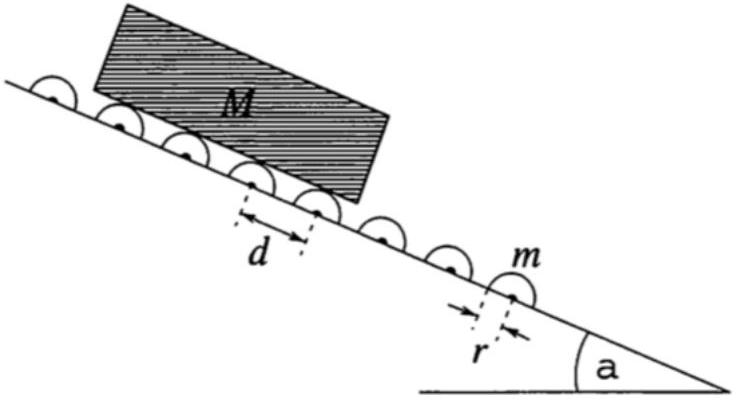

[3] Problem 16. Consider the following related problems; in all parts, neglect friction.
(a) A flexible uniform rope of length $\ell$ lies stretched out flat on a table, with a tiny portion $\ell _ { 0 } \ll \ell$ hanging through a small hole. The rope is released from rest, and all points on the rope begin

to move with the same speed. Since this motion is smooth, energy is conserved. Find the speed of the rope when the end goes through the hole.
(b) Find the total time it takes the rope to go through the hole.
(c) Now suppose a flexible uniform chain of length $\ell$ is placed loosely coiled close to the hole. Again, a tiny portion $\ell _ { 0 } \ll \ell$ hangs through the hole, and the chain is released from rest. In this case, the unraveling of the chain is an inherently inelastic process, because each link of the chain sits still until it is suddenly jerked into motion. Find the speed of the chain when the last link goes through the hole. (Hint: write down a differential equation for the length $x ( t )$ of chain that has passed through the hole. It can be solved by guessing $x ( t ) = A t ^ { n }$.)

Solution. (a) We use energy conservation. Let $M$ be the mass of the rope. The height of the center of mass falls by $\ell / 2$, so $\ell M g / 2 = M v ^ { 2 } / 2$, which gives the answer of $v = \sqrt { \ell g }$.

(b) Using energy conservation, we have
$$
\frac { 1 } { 2 } M v ^ { 2 } = \frac { M g x } { \ell } \frac { x } { 2 }
$$
which implies $v = \sqrt { g / \ell } x$. Taking the derivative, we have
$$
a = \sqrt { \frac { g } { \ell } } v = \frac { g } { \ell } x .
$$
This makes sense, as there is a total force $( x / \ell ) M g$ pulling the rope through the hole, and a total inertia $M$. (We will make this more precise using generalized coordinates in M4.)
In any case, we now have a linear differential equation which can be solved with the techniques of M1. Guessing exponentials gives growing and decaying solutions $e ^ { \pm \sqrt { g / \ell } t }$, so
$$
x ( t ) = A e ^ { \sqrt { g / \ell } t } + B e ^ { - \sqrt { g / \ell } t } .
$$
Since $x ( 0 ) = \ell _ { 0 }$ and $v ( 0 ) = 0$, we have $A = B = \ell _ { 0 } / 2$, so that
$$
x ( t ) = \frac { \ell _ { 0 } } { 2 } \left( e ^ { \sqrt { g / \ell } t } + e ^ { - \sqrt { g / \ell } t } \right) .
$$
Since $\ell \gg \ell _ { 0 }$, at the final time we have
$$
x \left( t _ { f } \right) = \ell \approx \frac { \ell _ { 0 } } { 2 } e ^ { \sqrt { g / \ell } t _ { f } }
$$
and solving for $t _ { f }$ yields
$$
t _ { f } = \sqrt { \frac { \ell } { g } } \log \frac { 2 \ell } { \ell _ { 0 } } .
$$
(c) In this case energy conservation doesn't work, so we need to use momentum/force ideas. Unlike part (b), it's best to use Newton's second law directly, by considering the vertical momentum of the vertical part of the chain. We didn't do this in part (b) because we would have to know the tension at the hole, since this provides an external vertical force, but here it's easy because the chain links on the table are slack, so the tension is zero.

Now, let $m$ be the time-dependent mass of the vertical part. The only external vertical force is gravity, so applying $F _ { y } = d p _ { y } / d t$ gives

$$
m g = m \dot { v } + \dot { m } v = m \dot { v } + ( m / x ) v ^ { 2 }
$$

which implies

$$
\ddot { x } = g - \dot { x } ^ { 2 } / x .
$$

This is a nonlinear second-order differential equation. There's no general way to solve such equations, so we'll resort to the hint. If we guess a pure power $A t ^ { n }$, then all three terms are the same power of $t$ as long as $n = 2$. Plugging in $x ( t ) = A t ^ { 2 }$ gives the solution

$$
x ( t ) = \frac { 1 } { 6 } g t ^ { 2 }
$$

so there is a uniform acceleration of $g / 3$. (The 1/6 is not an arbitrary constant, if you change it you don't get a solution to the differential equation at all! This equation is nonlinear, so there's no reason to expect that multiplying a solution by a constant gives another solution.) The amount of time it takes for last link to pass is $t = \sqrt { 6 \ell / g }$, so the speed there is

$$
v = ( g / 3 ) t = \sqrt { \frac { 2 \ell g } { 3 } } .
$$

This is smaller than the answer to part (a) because energy is not conserved.

[3] Problem 17 (PPP 95). A long slipway, inclined at an angle $\alpha$ to the horizontal, is fitted with many identical rollers, consecutive ones being a distance $d$ apart. The rollers have horizontal axles and consist of rubber-covered solid steel cylinders each of mass $m$ and radius $r$. A plank of mass $M$, and length much greater than $d$, is released at the top of the slipway.

Find the terminal speed $v$ of the plank. Ignore air drag and friction at the pivots of the rollers.
Solution. Consider the forces acting on the plank along the plane. There is of course a constant gravitational force $M g \sin \alpha$. In addition, every time the plank hits a roller, it experiences an impulse as it spin the roller up. The angular impulse on each roller is equal to its angular momentum, so
$$
\int f ( t ) r d t = \frac { 1 } { 2 } m r ^ { 2 } \omega
$$
This implies the linear impulse on the plank has magnitude
$$
J = \int f ( t ) d t = \frac { 1 } { 2 } m r \omega = \frac { 1 } { 2 } m v .
$$

This impulse must be equal to the total gravitational impulse along the plane between rollers,

$$
\frac { 1 } { 2 } m v = \frac { d } { v } M g \sin \alpha
$$

which gives the answer,

$$
v = \sqrt { \frac { 2 M g d \sin \alpha } { m } } .
$$

The subtle thing about this problem is that a similar argument based on energy conservation gives the wrong answer. Equating the gravitational potential energy lost per roller to the rotational kinetic energy given to each roller gives

$$
\frac { 1 } { 2 } I \omega ^ { 2 } = \frac { 1 } { 4 } m v ^ { 2 } = M g d \sin \alpha
$$

which gives an answer different by a factor of $\sqrt { 2 }$. The reason is that energy is also dissipated into heat, as the plank and roller initially slip with respect to each other. By an argument extremely similar to that of problem 15, but with angular variables instead of linear ones, you can show that precisely half the gravitational potential energy goes into heat. Accounting for this gives exactly the same answer as momentum conservation.

## 4 Elastic Collisions

Idea 5
Any temporary interaction between two objects that conserves energy and momentum is a perfectly elastic collision. In one dimension, such collisions are "trivial": their outcome is fully determined by energy and momentum conservation, because there are two final velocities and two conservation laws. In two dimensions, there are four final velocity components and three conservation laws (energy and 2D momentum), so we need one more number to describe what happens, such as the angle of deflection. In a two-dimensional collision, the outcome depends on the details, such as how the objects approach each other, and the force between them. The same holds in three dimensions.
