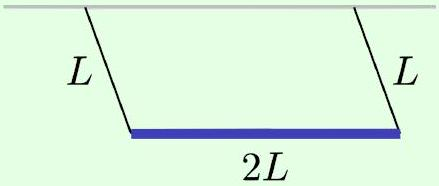

Example 3: $F = m a$ 2022A \#10
The two ends of a uniform rod of length $2 L$ are hung on massless strings of length $L$.

If the strings are attached to the ceiling, and the rod is pulled a small distance horizontally and released as shown, what is the period of oscillation?

Solution
This kind of question becomes completely trivial when you use the above idea. Using the rotation angle $\theta$ as a generalized coordinate, $K$ and $V$ are both exactly the same as for a simple pendulum of length $L$, because the rod doesn't rotate, so the period is $2 \pi \sqrt { L / g }$.
