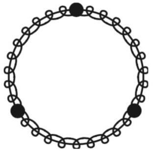
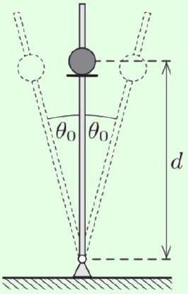

Example 8
Three identical masses are connected by three identical springs, forming an equilateral triangle in equilibrium. Describe the normal modes of the system.

Solution
Let the system be confined to the $x y$ plane. Then there are three masses that each can move in two dimensions, giving six degrees of freedom. Since we must be able to construct the general solution by superposing normal modes, there should be six normal modes. They are:

- Uniform translation. This yields two independent normal modes, as you can superpose motion in any two distinct directions (e.g. along the $x$ and $y$ axes) to get motion in any direction. These modes have zero frequency, since $\sin ( \omega t ) \propto t$ in the limit $\omega \rightarrow 0$.
- Uniform rotation about the axis of symmetry.

- A "breathing" motion where the whole triangle expands and contracts.
- A "scissoring" motion where one mass moves outward and the other two move inward. You might think there are three scissoring normal modes, but they are redundant: just like how the three sides of the equilateral triangle lie in a plane, these three normal modes formally lie in a plane, in the sense that you can superpose any two of them to get the third. So there are two independent scissoring modes.

Thus we have six normal modes, as expected. If the system can move in three-dimensional space, we need three more; they are uniform translation in the $z$ direction, and rotation about the $x$ and $y$ axes.

[5] Problem 23 (Morin 4.12, IPhO 1986). $N$ identical masses $m$ are constrained to move on a horizontal circular hoop connected by $N$ identical springs with spring constant $k$. The setup for $N = 3$ is shown below.

    (a) Find the normal modes and their angular frequencies for $N = 2$.
    (b) Do the same for $N = 3$.
    (c) ★ Do the same for general $N$. (Hint: the normal modes you found in part (a) should have each mass oscillating with unit amplitude, but a different phase. Try to write the normal modes in part (b) in the same form, and then guess a pattern.)
    (d) If one of the masses is replaced with a mass $m ^ { \prime } \ll m$, qualitatively describe how the set of frequencies changes.
    (e) Now suppose the masses alternate between $m$ and $m ^ { \prime } \ll m$. Qualitatively describe the set of frequencies.

Part (c) will be useful in X1, where we will quantize the normal modes found here.
Solution. (a) Let the positions of the masses along the circle be $x _ { 1 }$ and $x _ { 2 }$. Then

$$
m \ddot { x } _ { 1 } = - k \left( 2 x _ { 1 } - 2 x _ { 2 } \right) , \quad m \ddot { x } _ { 2 } = - k \left( 2 x _ { 2 } - 2 x _ { 1 } \right) .
$$

Adding and subtracting these equations and letting $\omega _ { 0 } = \sqrt { k / m }$ gives

$$
\ddot { x } _ { 1 } + \ddot { x } _ { 2 } = 0 , \quad \ddot { x } _ { 1 } - \ddot { x } _ { 2 } = - 4 \omega _ { 0 } ^ { 2 } \left( x _ { 1 } - x _ { 2 } \right)
$$

which tells us the normal mode angular frequencies are zero and $2 \omega _ { 0 }$. These correspond to the masses uniformly rotating around the circle together, and to the two moving oppositely.

(b) Defining quantities analogously to part (a), we have
$$
\ddot { x } _ { 1 } = - \omega _ { 0 } ^ { 2 } \left( 2 x _ { 1 } - x _ { 2 } - x _ { 3 } \right) , \quad \ddot { x } _ { 2 } = - \omega _ { 0 } ^ { 2 } \left( 2 x _ { 2 } - x _ { 1 } - x _ { 3 } \right) , \quad \ddot { x } _ { 3 } = - \omega _ { 0 } ^ { 2 } \left( 2 x _ { 3 } - x _ { 1 } - x _ { 2 } \right) .
$$
If we subtract the first two equations, we get
$$
\ddot { x } _ { 1 } - \ddot { x } _ { 2 } = - 3 \omega _ { 0 } ^ { 2 } \left( x _ { 1 } - x _ { 2 } \right)
$$
which gives a normal mode with angular frequency $\sqrt { 3 } \omega _ { 0 }$, where the first two masses move oppositely and the third doesn't move at all. The same happens if we subtract the first and third equation, and second and third equation. Finally, if we add all three equations, we get
$$
\ddot { x } _ { 1 } + \ddot { x } _ { 2 } + \ddot { x } _ { 3 } = 0
$$
which gives a normal mode with zero frequency: all the masses translate uniformly. Therefore, the normal mode angular frequencies are zero and $\sqrt { 3 } \omega _ { 0 }$.
Strangely, it seems like we have four normal modes even though there are only three masses! The reason is that the first three we found are redundant: if you sum any two of them, you get the third. So there are two normal modes with angular frequency $\sqrt { 3 } \omega _ { 0 }$.
(c) Following the hint, let's try to express the normal modes in part (b) in a manifestly symmetric way. We generalize the $x _ { i }$ to complex numbers (with the real part standing for the physical displacement) and impose symmetry by demanding that all of them have unit magnitude,
$$
x _ { 1 } ( t ) = e ^ { i \left( \omega t + \varphi _ { 1 } \right) } , \quad x _ { 2 } ( t ) = e ^ { i \left( \omega t + \varphi _ { 2 } \right) } , \quad x _ { 3 } ( t ) = e ^ { i \left( \omega t + \varphi _ { 3 } \right) } .
$$
To fix these arbitrary phases, note that the equations of motion are symmetric under cyclically shifting the masses, $1 \rightarrow 2 \rightarrow 3 \rightarrow 1$. So if the differences between adjacent phases are uniform,
$$
\varphi _ { 3 } - \varphi _ { 2 } = \varphi _ { 2 } - \varphi _ { 1 } = \varphi _ { 1 } - \varphi _ { 3 } = \phi
$$
then if one equation is satisfied, all three are automatically satisfied. This is only possible if $3 \phi$ is a multiple of $2 \pi$, so that we have
$$
\phi \in \{ 0,2 \pi / 3,4 \pi / 3 \} .
$$
In the case $\phi = 0$, the first equation becomes
$$
\omega ^ { 2 } = \omega _ { 0 } ^ { 2 } ( 2 - 1 - 1 ) = 0
$$
where we cancelled an overall, irrelevant factor of $e ^ { i \varphi _ { 1 } }$. Of course, this is just the normal mode where all the masses translate uniformly. For $\phi = 2 \pi / 3$, we get
$$
\omega ^ { 2 } = \omega _ { 0 } ^ { 2 } \left( 2 - e ^ { 2 \pi i / 3 } - e ^ { 4 \pi i / 3 } \right) = 3 \omega _ { 0 } ^ { 2 }
$$
and we find the same angular frequency for $\phi = 4 \pi / 3$. These are the two other normal modes. The pattern should now start to appear. For the general case, we have
$$
\ddot { x } _ { j } = - \omega _ { 0 } ^ { 2 } \left( 2 x _ { j } - x _ { j - 1 } - x _ { j + 1 } \right) , \quad j = 1,2 , \ldots N
$$

and we may again guess uniform phase differences between adjacent masses,
$$
x _ { j } = e ^ { i \omega t } e ^ { i \phi j } , \quad \phi = \frac { 2 \pi n } { N }
$$
for an integer $0 \leq n < N$. Plugging this in, each equation of motion gives
$$
\omega ^ { 2 } = \omega _ { 0 } ^ { 2 } \left( 2 - e ^ { - i \phi } - e ^ { i \phi } \right)
$$
which is equivalent to
$$
\omega = 2 \omega _ { 0 } \sin \left( \frac { \phi } { 2 } \right) = 2 \omega _ { 0 } \sin \left( \frac { \pi n } { N } \right) .
$$
For $n = 0 , \ldots , N - 1$, these are the normal mode angular frequencies.
As an aside, for $N \gg 1$ we can visualize the normal modes as waves propagating around the circle. As we'll discuss further in $\mathbf { W 1 }$, the wavenumber $k$ is the rate at which the phase varies around the circle, so it is proportional to $\phi$. Note that for $n \ll N$, we have $\omega \propto \phi$ as well. This indicates that waves built out of only normal modes with $n \ll N$ travel with constant velocity $v = \omega / k$, and hence satisfy the ideal wave equation. In general, systems that satisfy the ideal wave equation often appear in the low $n / N$ limit of a system with many discrete parts. We'll see these points in more detail in $\mathbf { W } \mathbf { 1 }$.
You might be wondering why the guess $x _ { j } = e ^ { i \omega t } e ^ { i \phi j }$ works. As we've discussed above, guessing a complex exponential $e ^ { i \omega t }$ is the general technique when dealing with linear equations with time translation symmetry. Similarly, in this problem we considered linear equations with a discrete spatial translational symmetry, i.e. the equations stay the same upon substituting $j \rightarrow j + 1$. So by the same logic, the general technique must be to guess a complex exponential in $j$, which is precisely the $e ^ { i \phi j }$ factor.
(d) When we add the one light mass, it adds a new normal mode with angular frequency $\sqrt { 2 k / m ^ { \prime } }$, where the light mass oscillates back and forth and nothing else moves. The band of angular frequencies from zero to $2 \omega _ { 0 }$ barely changes.
(e) Naively, if we turn half the masses into light masses, we get $N / 2$ modes with angular frequency $\sqrt { 2 k / m ^ { \prime } }$, consisting of each light mass oscillating independently. But this isn't right, because we must take sinusoidal combinations of these modes to get normal modes, by the same logic as we used in the previous parts. This broadens the normal mode angular frequencies into a band centered around $\sqrt { 2 k / m ^ { \prime } }$. Meanwhile, for the low-frequency modes, the heavy masses can't even see the light masses, so it's as if every spring has been doubled in length. We hence have a second band of normal modes with angular frequencies centered on $\sqrt { k / 2 m }$, which is nonoverlapping if $m ^ { \prime } \ll m$.
This idea of normal mode frequencies filling dense but separated bands is crucial in solid state physics. The result of part (d) shows how "defects" in a solid can lead to isolated energy levels, outside the bands. For further discussion, see this paper.
[4] Problem 24. [A] In this problem, you will analyze the normal modes of the double pendulum, which consists of a pendulum of length $\ell$ and mass $m$ attached to the bottom of another pendulum, of length $\ell$ and mass $m$. To solve this problem directly, one has to compute the tension forces in the two strings, which are quite complicated. A much easier method is to use energy.

(a) Parametrize the position of the pendulum in terms of the angle $\theta _ { 1 }$ the top string makes with the vertical, and the angle $\theta _ { 2 }$ the bottom string makes with the vertical. Write out the kinetic energy $K$ and the potential energy $V$ to second order in the $\theta _ { i }$ and $\dot { \theta _ { i } }$.
(b) The Euler-Lagrange equations for the system are
$$
\frac { d } { d t } \frac { \partial K } { \partial \dot { \theta } _ { i } } = - \frac { \partial V } { \partial \theta _ { i } } .
$$
Using the results of part (a), write these equations in the form
$$
\binom { \ddot { \theta _ { 1 } } } { \ddot { \theta _ { 2 } } } = - \frac { g } { \ell } A \binom { \theta _ { 1 } } { \theta _ { 2 } }
$$
where $A$ is a $2 \times 2$ matrix. This is a generalization of $\ddot { \theta } = - g \theta / \ell$ for a single pendulum.
(c) Find the normal modes and their angular frequencies, using the general method in section 4.5 of Morin.

For larger deviations, the double pendulum can become chaotic. For a beautiful visualization of both the chaotic behavior and the "islands of stability" within, see this video.

Solution. (a) To second order, the horizontal displacements of the masses are

$$
x _ { 1 } = \ell \theta _ { 1 } , \quad x _ { 2 } = \ell \left( \theta _ { 1 } + \theta _ { 2 } \right)
$$

which gives a kinetic energy of

$$
K = \frac { m \ell ^ { 2 } } { 2 } \left( \left( \dot { \theta _ { 1 } } \right) ^ { 2 } + \left( \dot { \theta _ { 1 } } + \dot { \theta _ { 2 } } \right) ^ { 2 } \right) .
$$

The vertical displacements are

$$
y _ { 1 } = \ell \left( 1 - \cos \left( \theta _ { 1 } \right) \right) , \quad y _ { 2 } = \ell \left( 2 - \cos \left( \theta _ { 1 } \right) - \cos \left( \theta _ { 2 } \right) \right)
$$

and expanding the cosines to second order gives

$$
y _ { 1 } = \frac { \ell } { 2 } \theta _ { 1 } ^ { 2 } , \quad y _ { 2 } = \frac { \ell } { 2 } \left( \theta _ { 1 } ^ { 2 } + \theta _ { 2 } ^ { 2 } \right)
$$

which gives a potential energy of

$$
V = \frac { m g \ell } { 2 } \left( 2 \theta _ { 1 } ^ { 2 } + \theta _ { 2 } ^ { 2 } \right) .
$$

(b) The resulting Euler-Lagrange equations are
$$
2 \ddot { \theta _ { 1 } } + \ddot { \theta _ { 2 } } = - \frac { 2 g } { \ell } \theta _ { 1 } , \quad \ddot { \theta _ { 1 } } + \ddot { \theta _ { 2 } } = - \frac { g } { \ell } \theta _ { 2 } .
$$
Solving the system, we find
$$
A = \left( \begin{array} { c c }
2 & - 1 \\
- 2 & 2
\end{array} \right)
$$
straightforwardly.

(c) We must find the eigenvalues of the matrix, which obey the equation
$$
( 2 - \lambda ) ^ { 2 } - 2 = 0
$$
which implies $\lambda = 2 \pm \sqrt { 2 }$. The normal mode amplitudes are
$$
\text { high frequency : } \binom { 1 } { - \sqrt { 2 } } \text {, low frequency : } \binom { 1 } { \sqrt { 2 } }
$$
and the angular frequencies are $\omega _ { \pm } ^ { 2 } = ( g / \ell ) ( 2 \pm \sqrt { 2 } )$.

Remark
We mostly considered examples with two or three masses, but the techniques above work for systems with arbitrarily many degrees of freedom. However, this quickly becomes intractable unless the setup is highly symmetric, as in problem 23. Without such symmetry, a computer is generally necessary, so this sort of question won't appear on standard Olympiads. However, if you're curious, see ITPO 2016, problem 1 and Physics Cup 2021, problem 3 for examples.

## 5 [A] Adiabatic Change

Idea 5
When a problem contains two widely separate timescales, such as a fast oscillation superposed on a slow overall motion, one can solve for the fast motion while neglecting the slow motion, then solve for the slow motion by replacing the fast motion with an appropriate average.

Example 9: MPPP 21
A small smooth pearl is threaded onto a rigid, smooth, vertical rod, which is pivoted at its base. Initially, the pearl rests on a small circular disc that is concentric with the rod, and attached to it a distance $d$ from the rotational axis. The rod starts executing simple harmonic motion around its original position with small angular amplitude $\theta _ { 0 }$.

What angular frequency of oscillation is required for the pearl to leave the rod?

Solution
The reason the pearl leaves the rod is that the normal force rapidly varies in direction, with an average upward component. If this average upward force is greater than gravity, the pearl accelerates upward and leaves the rod.

In this case, the fast motion is the oscillation of the rod, while the slow motion is the rate of change of the pearl's distance from the pivot, which can be neglected during one oscillation. The pearl has horizontal displacement and acceleration

$$
x ( t ) = - d \sin \theta \approx - d \theta ( t ) = - \theta _ { 0 } d \sin \omega t , \quad a _ { x } ( t ) = \theta _ { 0 } \omega ^ { 2 } d \sin \omega t .
$$

This is supplied by the horizontal component of the normal force. The vertical component is

$$
N _ { y } = N _ { x } \tan \theta ( t ) \approx m a _ { x } ( t ) \theta ( t ) = m \theta _ { 0 } ^ { 2 } \omega ^ { 2 } d \sin ^ { 2 } \omega t .
$$

Now we average over the fast motion to understand the slow motion. Since the average value of $\sin ^ { 2 } ( \omega t )$ is 1/2, the condition for the pearl to go up is

$$
\frac { 1 } { 2 } m \theta _ { 0 } ^ { 2 } \omega ^ { 2 } d > m g
$$

which gives

$$
\omega > \frac { 1 } { \theta _ { 0 } } \sqrt { \frac { 2 g } { d } } .
$$
