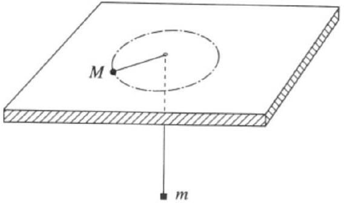
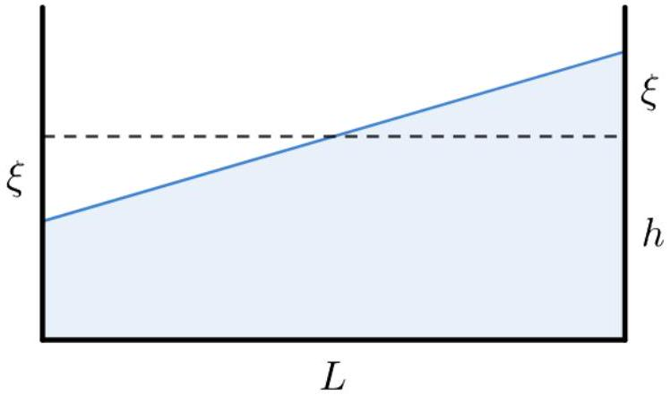
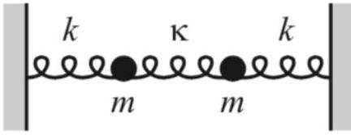
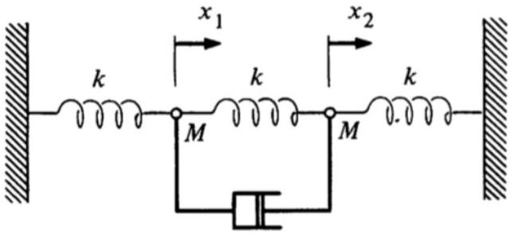

## Mechanics IV: Oscillations

Chapter 4 of Morin covers oscillations, as does chapter 10 of Kleppner and Kolenkow, and chapter 10 of Wang and Ricardo, volume 1. For a deeper treatment that covers normal modes in more detail, see chapters 1 through 6 of French. For a pedagogical introduction to the adiabatic theorem, see this article. For more fun discussion, see chapters I-21 through I-25, II-19, and II-38 of the Feynman lectures. There is a total of 88 points.

## 1 Small Oscillations

Idea 1
If an object obeys a linear force law, then its motion is simple harmonic. To compute the frequency, one must find the restoring force per unit displacement. More generally, if the force an object experiences can be expanded in a Taylor series with a nonzero linear restoring term, the motion is approximately simple harmonic for small displacements. (However, don't forget that there are also situations where oscillations are not even approximately simple harmonic, no matter how small the displacements are.)

Example 1: KK 4.13
The Lennard-Jones potential

$$
U ( r ) = \epsilon \left( \left( \frac { r _ { 0 } } { r } \right) ^ { 12 } - 2 \left( \frac { r _ { 0 } } { r } \right) ^ { 6 } \right)
$$

is commonly used to describe the interaction between two atoms. Find the equilibrium radius and the angular frequency of small oscillations about this point for two identical atoms of mass $m$ bound to each other by the Lennard-Jones interaction.

Solution
To keep the notation simple, we'll set $\epsilon = r _ { 0 } = 1$ and restore them later. The equilibrium radius is the radius where the derivative of the potential vanishes, and

$$
U ^ { \prime } ( r ) = - 12 r ^ { - 13 } + 12 r ^ { - 7 } = 0
$$

implies that the equilibrium radius is $r = r _ { 0 }$. Because the force accelerates both of the atoms, the angular frequency is

$$
\omega = \sqrt { \frac { U ^ { \prime \prime } ( r ) } { m / 2 } }
$$

where $m / 2$ is the so-called reduced mass. At the equilibrium point, we have

$$
U ^ { \prime \prime } \left( r _ { 0 } \right) = ( 12 ) ( 13 ) r _ { 0 } ^ { - 14 } - ( 12 ) ( 7 ) r _ { 0 } ^ { - 8 } = 72 .
$$

Restoring the dimensionful factors, we have $U ^ { \prime \prime } \left( r _ { 0 } \right) = 72 \epsilon / r _ { 0 } ^ { 2 }$, so

$$
\omega = \frac { 12 } { r _ { 0 } } \sqrt { \frac { \epsilon } { m } } .
$$

[3] Problem 1 (Morin 5.13). A hole of radius $R$ is cut out from an infinite flat sheet with mass per unit area $\sigma$. Let $L$ be the line that is perpendicular to the sheet and that passes through the center of the hole.
    (a) What is the force on a mass $m$ that is located on $L$, a distance $x$ from the center of the hole? (Hint: consider the plane to consist of many concentric rings.)
    (b) Now suppose the particle is released from rest at this position. If $x \ll R$, find the approximate angular frequency of the subsequent oscillations.
    (c) Now suppose that $x \gg R$ instead. Find the period of the resulting oscillations.
    (d) Now suppose the mass begins at rest on the plane, but slightly displaced from the center. Do oscillations occur? If so, what is the approximate frequency?

Solution. (a) Consider a ring with radius $r$ and thickness $d r$. It has mass $d M = 2 \pi r \sigma d r$. By symmetry, the net force is towards the sheet so we only take that component. Thus we multiply the total force from the ring $d F = G m d M / \left( x ^ { 2 } + r ^ { 2 } \right)$ by $x / \sqrt { x ^ { 2 } + r ^ { 2 } }$. We integrate from $R$ to infinity due to the hole, giving

$$
F = - \int _ { R } ^ { \infty } G m \frac { 2 \pi r x \sigma d r } { \left( x ^ { 2 } + r ^ { 2 } \right) ^ { 3 / 2 } } = - \pi G m x \sigma \int _ { x ^ { 2 } + R ^ { 2 } } ^ { \infty } \frac { d u } { u ^ { 3 / 2 } } = - 2 \pi G m \sigma \frac { x } { \sqrt { x ^ { 2 } + R ^ { 2 } } }
$$

(b) Approximating the force at small $x$ gives
$$
F = - 2 \pi G m \sigma \frac { x } { R \sqrt { 1 + x ^ { 2 } / R ^ { 2 } } } \approx - 2 \pi G m \sigma x / R .
$$
This implies simple harmonic oscillations,
$$
\ddot { x } = - \frac { 2 \pi G \sigma } { R } x = - \omega ^ { 2 } x , \quad \omega = \sqrt { \frac { 2 \pi G \sigma } { R } } .
$$
(c) In this case, approximating the force at large $x$ gives
$$
F = - 2 \pi G m \sigma \frac { 1 } { \sqrt { 1 + R ^ { 2 } / x ^ { 2 } } } \approx - 2 \pi G m \sigma
$$
with the force always directed towards the plane. This corresponds to a uniform acceleration of $g = 2 \pi G \sigma$. A ball takes time $t = \sqrt { 2 x / g }$ to fall from a height $x$. The period is thus
$$
T = 4 \sqrt { \frac { x } { \pi G \sigma } } .
$$
To be clear, our approximation for the force is only good when $x \gg R$. However, since the vast majority of the oscillation time is spent at $x \gg R$, using this approximation for all $x$ gives a decent approximation for the period.
(d) This situation is unstable; the mass will just accelerate further away from the center, so no oscillations occur. This is related to Earnshaw's theorem, which we cover in E1, which tells us that no gravitational field (or electrostatic field) in vacuum can have a point that is stable in all directions.

[2] Problem 2. Some questions about small oscillations with the buoyant force.

(a) A cubical glacier of side length $L$ has density $\rho _ { i }$ and floats in water with density $\rho _ { w }$. Find the angular frequency of small oscillations, assuming that a face of the glacier always remains parallel to the water surface, and that the force of the water on the glacier is always given by the hydrostatic buoyant force.
(b) A ball of radius $R$ floats in water with half its volume submerged. Find the angular frequency of small oscillations, making the same assumption.
(c) There are important effects that both of the previous parts neglect. What are some of them? Is the true oscillation frequency higher or lower than the one found here?

Solution. (a) Let $V = x L ^ { 2 }$ be the submerged volume, and let $V _ { 0 } = L ^ { 3 }$. We then have

$$
F = - \rho _ { w } V g + \rho _ { i } V _ { 0 } g = - \rho _ { w } L ^ { 2 } g x + \text { const. }
$$

Thus,

$$
\omega = \sqrt { \frac { \rho _ { w } L ^ { 2 } g } { \rho _ { i } L ^ { 3 } } } = \sqrt { \frac { \rho _ { w } } { \rho _ { i } } \frac { g } { L } } .
$$

(b) The density of the ball is half that of water, so its mass is $( 2 \pi / 3 ) \rho _ { w } R ^ { 3 }$. The "spring constant" is $\pi R ^ { 2 } \rho _ { w } g$, so
$$
\omega = \sqrt { \frac { \pi R ^ { 2 } \rho _ { w } g } { ( 2 \pi / 3 ) \rho _ { w } R ^ { 3 } } } = \sqrt { \frac { 3 g } { 2 R } } .
$$
(c) The most serious omission is that we have neglected the motion of the water. This clearly should add extra inertia, because the water has to move around to accommodate the moving glacier or ball, and it should be a significant change since the water is more dense than these objects. This "added mass" effect leads to a decrease in the oscillation frequency, and we discuss it further in M7.
In fact, the situation is even worse. As we'll also see in M7, viscosity between the object and water leads to a boundary layer of water carried along with the object. But since this boundary layer builds up over time, its thickness depends on the entire history of the object's motion! This is called the Basset force, and it turns Newton's second law into an "integro-differential equation", one where the second derivative of the position depends on an integral over all the past positions. It has the effect of damping the oscillations (which also slightly decreases their frequency). In general, nothing in fluid dynamics is easy.

[3] Problem 3. USAPhO 1998, problem A2. To avoid some confusion, skip part (a), since there actually isn't a nice closed-form expression for it.
[3] Problem 4. USAPhO 2009, problem A3.
[3] Problem 5. USAPhO 2010, problem B1.

Example 2
Find the acceleration of an Atwood's machine with masses $m$ and $M$ and a massless pulley and string.

Solution
The "high school" way to do this is to let $a _ { 1 }$ and $a _ { 2 }$ be the vertical accelerations of the masses, let $T$ be the unknown tension in the string, solve for $T$ by setting $a _ { 1 }$ and $a _ { 2 }$ to have equal magnitudes, then plug $T$ back in to find the common acceleration.

But this is unnecessarily complicated, because the system only has one degree of freedom. The fixed length of the string gives us a constraint: if we know where one of the masses is, then we automatically know where the other is. So there should be a way to describe the system without ever introducing a second variable. But there isn't a single Cartesian coordinate that accomplishes this, since the masses accelerate in opposite directions.

The key is to apply energy conservation to a "generalized coordinate" $q$. Specifically, let $q$ describe the distance that the string has moved along itself, so that $q = 0$ initially, and when $q = q _ { 0 }$, the mass $M$ has moved down by $q _ { 0 }$ and the mass $m$ has moved up by $q _ { 0 }$. The kinetic and potential energies of the system are simply

$$
K = \frac { 1 } { 2 } ( m + M ) \dot { q } ^ { 2 } , \quad V = q g ( m - M ) .
$$

To find the acceleration $\ddot { q }$, we differentiate energy conservation with respect to time,

$$
0 = \frac { d ( K + V ) } { d t } = ( m + M ) \ddot { q } \dot { q } + \dot { q } g ( m - M ) .
$$

Solving gives the familiar result

$$
\ddot { q } = \frac { M - m } { M + m } g .
$$

Intuitively, we could say that from the standpoint of this generalized coordinate, the "total force" is $( M - m ) g$, and the "total inertia" is $M + m$.

This will be a very useful concept, so let's think about why it works. The first reason is that forces and accelerations have directions but energy doesn't, so thinking about energy lets us collectively treat objects moving in different directions. The second reason is that in the force-based derivation, we needed to define two variables because we had to eliminate the unknown tension $T$. But in the energy-based derivation, the tension never shows up because the inextensible string doesn't do any work on the blocks. More generally, whenever a system has rigid constraints like this, we can work with a reduced set of generalized coordinates which automatically takes the constraints into account. The only cost is that, if you wanted to know the values of the constraint forces, you'd have to do an extra step at the end.

Idea 2
The idea shown in example 2 is very general. Consider any system whose configuration can be described by a single "generalized coordinate" $q$. If its energy can be decomposed into a kinetic energy quadratic in $\dot { q }$, and a potential energy that depends only on $q$,

$$
K = \frac { 1 } { 2 } m _ { \mathrm { eff } } \dot { q } ^ { 2 } , \quad V = V ( q )
$$

then the energy conservation equation $d ( K + V ) / d t = 0$ can be used to find the generalized acceleration $\ddot { q }$. Explicitly, the chain rule tells us that

$$
m _ { \mathrm { eff } } \ddot { q } = - \frac { \partial V } { \partial q } .
$$

For example, we recover the usual Newton's second law for $q = x$, but $q$ can also be something completely different. We call $m _ { \text {eff } } \dot { q }$ a "generalized momentum", and $- \partial V / \partial q$ a "generalized force". The above equation also contains the principle of virtual work from M2, as it tells us that static equilibrium can occur when $\partial V / \partial q = 0$, i.e. when the potential energy doesn't change under a small motion.

Remark
The result above is a special case of the Euler-Lagrange equation in Lagrangian mechanics, which states that if a system is described by a Lagrangian $L$, then

$$
\frac { d } { d t } \frac { \partial L } { \partial \dot { q } } = \frac { \partial L } { \partial q } .
$$

In simple cases, one has $L = K ( \dot { q } ) - V ( q )$, where typically $K$ is quadratic in $\dot { q }$, in which case we recover the previous result. But more generally, it might not be possible to meaningfully decompose $L$ into a "kinetic" and "potential" piece at all! We won't use this more general form below. While it is more powerful, it is also more complicated, and if you find yourself using it for an Olympiad problem, there's probably an easier way.
[1] Problem 6. A rope is nestled inside a curved frictionless tube. The rope has a total length $\ell$ and uniform mass per length $\lambda$. The shape of the tube can be arbitrarily complicated, but the left end of the rope is higher than the right end by a height $h$. If the rope is released from rest, find its acceleration.

Solution. Of course, you can get the same result by breaking the rope into infinitely many infinitesimal elements, applying Newton's second law to each one, and solving for how the tension varies throughout the rope. But this is unnecessarily complicated, because the system can be described by a single generalized coordinate.

Let $q$ be the length the rope has moved along the tube. The kinetic energy is $\lambda \ell \dot { q } ^ { 2 } / 2$. The "generalized force" is $- \partial V / \partial q = \lambda g h$. So the acceleration is $g h / \ell$.

Idea 3
Generalized coordinates are really useful for problems that involve complicated objects but only have one relevant degree of freedom, which is especially true for oscillations problems. For instance, if the kinetic and potential energy have the form

$$
K = \frac { 1 } { 2 } m _ { \mathrm { eff } } \dot { q } ^ { 2 } , \quad V = \frac { 1 } { 2 } k _ { \mathrm { eff } } q ^ { 2 }
$$

then the oscillation's angular frequency is always

$$
\omega = \sqrt { k _ { \text {eff } } / m _ { \text {eff } } } .
$$

Note that $q$ need not have units of position, $m _ { \text {eff } }$ need not have units of mass, and so on. When $V ( q )$ is a more general function, we can expand it about a minimum $q _ { \text {min } }$, so that $k _ { \mathrm { eff } } = V ^ { \prime \prime } \left( q _ { \mathrm { min } } \right)$. This lets us avoid dealing with possibly complicated constraint forces.

Example 3: $F = m a$ 2022A \#10
The two ends of a uniform rod of length $2 L$ are hung on massless strings of length $L$.

If the strings are attached to the ceiling, and the rod is pulled a small distance horizontally and released as shown, what is the period of oscillation?

Solution
This kind of question becomes completely trivial when you use the above idea. Using the rotation angle $\theta$ as a generalized coordinate, $K$ and $V$ are both exactly the same as for a simple pendulum of length $L$, because the rod doesn't rotate, so the period is $2 \pi \sqrt { L / g }$.

[3] Problem 7. A particle in a uniform vertical gravitational field is constrained to move on a curve $y ( x )$. If $y ( x )$ is a circular arc, then this system is just a simple pendulum, and we know that its period is not perfectly independent of its amplitude. Find a differential equation relating $d y / d x$ and $y$, so that the period of oscillation is exactly $2 \pi / \omega _ { 0 }$ for a fixed parameter $\omega _ { 0 }$, independent of amplitude. (Hint: as a generalized coordinate, use the arc length $s$ along the curve.)
Solution. The reason $s$ is useful is because
$$
K = \frac { 1 } { 2 } m \dot { s } ^ { 2 }
$$
exactly. So, we would get motion with fixed period $2 \pi / \omega _ { 0 }$ if the potential energy had the form
$$
V = \frac { 1 } { 2 } \omega _ { 0 } ^ { 2 } m s ^ { 2 } .
$$
On the other hand, since the system is in a uniform gravitational field, $V = m g y$, so we need
$$
y = \frac { \omega _ { 0 } ^ { 2 } } { 2 g } s ^ { 2 } .
$$

Taking the derivative with respect to $x$ of both sides, we have

$$
\frac { d y } { d x } = \frac { \omega _ { 0 } ^ { 2 } } { g } s \frac { d s } { d x } = \sqrt { \frac { 2 \omega _ { 0 } ^ { 2 } y } { g } } \sqrt { 1 + ( d y / d x ) ^ { 2 } } .
$$

Solving this for $d y / d x$ gives

$$
\frac { d y } { d x } = \sqrt { \frac { y } { \left( g / 2 \omega _ { 0 } ^ { 2 } \right) - y } }
$$

where we took the positive sign to get a proper restoring force. As a check, when $y$ is small, this equation is approximately solved by $y ( x ) = \omega _ { 0 } ^ { 2 } x ^ { 2 } / ( 2 g )$, which in turn is approximately an arc of a circle of radius $L$, where $\omega _ { 0 } ^ { 2 } = g / L$.

Solving the differential equation exactly is a bit nasty, but it turns out to be a cycloid. This fact was first discovered by Huygens, who invented the cycloidal pendulum for accurate timekeeping. It is equivalent to the usual textbook statement that the cycloid is a "tautochrone".

[3] Problem 8 (Cahn). A particle of mass $M$ is constrained to move on a frictionless horizontal plane. A second particle of mass $m$ is constrained to a vertical line. The two particles are connected by a massless string which passes through a hole in the plane.

The system is set up so that the mass $M$ moves in a circle of radius $r$, while the mass $m$ remains still. Show that this motion is stable with respect to small changes in $r$, and find the angular frequency of small oscillations.
Solution. In equilibrium we have
$$
m g = \frac { M v ^ { 2 } } { r } = \frac { L ^ { 2 } } { M r ^ { 3 } }
$$
where $r$ is the radius of the circle, and $L$ is the conserved angular momentum. If the hanging mass goes downward, then $r$ decreases, so the tension in the string increases providing a restoring force; hence the orbit is stable.
To find the angular frequency of small oscillations, we'll use the energy method, with generalized coordinate $r$. The "kinetic energy", which is the part of the energy dependent on $\dot { r }$, is
$$
T = \frac { 1 } { 2 } M \dot { r } ^ { 2 } + \frac { 1 } { 2 } m \dot { r } ^ { 2 } .
$$
The "potential energy", which is the part of the energy dependent on $r$, is
$$
V = m g r + \frac { L ^ { 2 } } { 2 M r ^ { 2 } } .
$$
Note that $L ^ { 2 } / 2 M r ^ { 2 }$ is treated as potential energy here even though it is associated with the motion of the large mass. From the kinetic energy, we see the "effective mass" is $m _ { \text {eff } } = M + m$, as one might expect. From the potential energy, we see the "effective spring constant" is
$$
k _ { \mathrm { eff } } = V ^ { \prime \prime } = \frac { 3 L ^ { 2 } } { M r ^ { 4 } } = \frac { 3 m g } { r } .
$$

Since $k _ { \text {eff } } / m _ { \text {eff } }$ is positive, the motion is stable, and the angular frequency is

$$
\omega = \sqrt { \frac { k _ { \mathrm { eff } } } { m _ { \mathrm { eff } } } } = \sqrt { \frac { 3 g } { r } } \sqrt { \frac { m } { m + M } } .
$$

[4] Problem 9. IPhO 1984, problem 2. If you use the energy methods above, you won't actually need to know anything about fluid mechanics to do this nice, short problem!
Solution. To find the period of oscillation, we will find expressions for the kinetic energy and potential energy associated with the seiching. Refer to the diagram below.

First, to find the potential energy increase when the water is displaced by $\xi$, note that a triangular prism of water has effectively been moved upward, as shown above. The centers of masses of these triangles are $\xi / 3$ from their bases, so the center of mass of the triangle will move up a distance of $2 \xi / 3$. Let the width of the container by $w$. Then the potential energy $U$ will be $2 m g \xi / 3$, where the mass of the triangular prism of water is $m = \frac { 1 } { 2 } \frac { L } { 2 } \xi w \rho$, so
$$
U = \frac { 1 } { 6 } \rho L w g \xi ^ { 2 } .
$$
To find a rough estimate of the kinetic energy, consider the movement of the center of mass alone; this won't get all of the kinetic energy, but it'll get enough to get a reasonable answer. By thinking of the contribution of moving the triangle mentioned above, we have
$$
\begin{gathered}
\Delta x _ { \mathrm { cm } } = \frac { m ( 2 L / 3 ) } { M } = \frac { \frac { 1 } { 4 } L \xi w ( 2 L / 3 ) } { L w h } = \frac { 1 } { 6 } \frac { L \xi } { h } . \\
\Delta y _ { \mathrm { cm } } = \frac { m ( 2 \xi / 3 ) } { M } = \frac { \xi ^ { 2 } } { 6 h } .
\end{gathered}
$$
We see that $\Delta x _ { \mathrm { cm } }$ dominates since $\xi$ is small, so we focus on it. The total mass of the water is
$$
M = \rho L w h
$$
and our approximation for the kinetic energy is
$$
K \approx \frac { 1 } { 2 } M \dot { x } _ { \mathrm { cm } } ^ { 2 } = \frac { 1 } { 2 } \rho L w h \frac { L ^ { 2 } \dot { \xi } ^ { 2 } } { 36 h ^ { 2 } } .
$$
Besides the overall side-to-side center of mass motion of the water, the water also has internal motions that can't be described just in terms of the center of mass moving. However, our result is good enough for the purposes of this problem.

Putting this together yields

$$
E \approx \frac { \rho w L ^ { 3 } } { 72 h } \dot { \xi } ^ { 2 } + \frac { 1 } { 6 } \rho L w g \xi ^ { 2 } = \frac { 1 } { 2 } m _ { \mathrm { eff } } \dot { \xi } ^ { 2 } + \frac { 1 } { 2 } k _ { \mathrm { eff } } \xi ^ { 2 }
$$

and thus a period of

$$
T \approx 2 \pi \sqrt { \frac { L ^ { 2 } } { 12 g h } } .
$$

This is compatible with the data given in the problem statement, up to order-one factors. Your answer may look different, since we've made a lot of approximations throughout the problem; as long as it agrees dimensionally, with the prefactor within an order of magnitude, you can regard it as correct.

This is a very brief taste of the fascinating field of oceanography, which is one of the premier real-world applications of fluid dynamics. For a lot more about seiches and their relatives, see chapter 9 of the Handbook of Coastal and Ocean Engineering.

## 2 Springs and Pendulums

Now we'll consider more general problems involving springs and pendulums, two very common components in mechanics questions. As a first example, we'll use the fictitious forces met in M2.

Example 4: PPP 79
A pendulum of length $L$ and mass $m$ initially hangs straight downward in a train. The train begins to move with uniform acceleration $a$. If $a$ is small, what is the period of small oscillations? If $a$ can be large, is it possible for the pendulum to loop over its pivot?

Solution
The fictitious force in the train's frame due to the acceleration is equivalent to an additional, horizontal gravitational field, so the effective gravity is

$$
\mathbf { g } _ { \text {eff } } = - a \hat { \mathbf { x } } - g \hat { \mathbf { y } } .
$$

For small oscillations, we know the period is $2 \pi \sqrt { L / g }$ in ordinary circumstances. By precisely the same logic, it must be replaced with

$$
T = 2 \pi \sqrt { \frac { L } { g _ { \mathrm { eff } } } } = \frac { 2 \pi \sqrt { L } } { \left( g ^ { 2 } + a ^ { 2 } \right) ^ { 1 / 4 } } .
$$

As $a$ gets larger, the effective gravity points closer to the horizontal. In the limit $g / a \rightarrow 0$, the effective gravity is just horizontal, so the pendulum oscillates about the horizontal. Its endpoints are the downward and upward directions, so it never can get past the pivot.

Here's a follow-up question: if the train can decelerate quickly, how should you stop it so that the pendulum doesn't end up swinging at the end? The most efficient way is to first quickly decelerate to half speed, which, in the frame of the train, provides a horizontal impulse to the pendulum. Then wait a half-period $\pi \sqrt { L / g }$, so that the pendulum's momentum

turns around, and then quickly stop, providing a second impulse that precisely cancels the pendulum's horizontal motion. Tricks like this are used by crane operators to transport loads, and by physicists to transport clouds of ultracold atoms without warming them up.

Example 5
If a spring with spring constant $k _ { 1 }$ and relaxed length $\ell _ { 1 }$ is combined with a spring with spring constant $k _ { 2 }$ and relaxed length $\ell _ { 2 }$, find the spring constant and relaxed length of the combined spring, if the combination is in series or in parallel.

Solution
For the series combination, the new relaxed length is clearly $\ell = \ell _ { 1 } + \ell _ { 2 }$. Suppose the first spring is stretched by $x _ { 1 }$ and the second by $x _ { 2 }$. The tensions in the springs must balance,

$$
F = k _ { 1 } x _ { 1 } = k _ { 2 } x _ { 2 } .
$$

Thus, the new spring constant is

$$
k = \frac { F } { x _ { 1 } + x _ { 2 } } = \frac { k _ { 2 } x _ { 2 } } { x _ { 2 } \left( k _ { 2 } / k _ { 1 } + 1 \right) } = \frac { k _ { 1 } k _ { 2 } } { k _ { 1 } + k _ { 2 } } .
$$

For example, if the spring is cut in half, the pieces have spring constant $2 k$.
Now consider the parallel combination. In this case it's clear that the new spring constant is $k = k _ { 1 } + k _ { 2 }$, since the tensions of the springs add. The new relaxed length $\ell$ is when the forces in the springs cancel out, so

$$
k _ { 1 } \left( \ell - \ell _ { 1 } \right) + k _ { 2 } \left( \ell - \ell _ { 2 } \right) = 0
$$

which implies

$$
\ell = \frac { k _ { 1 } \ell _ { 1 } + k _ { 2 } \ell _ { 2 } } { k _ { 1 } + k _ { 2 } } .
$$

[2] Problem 10 (Morin 4.20). A mass $m$ is attached to $n$ springs with relaxed lengths of zero. The spring constants are $k _ { 1 } , k _ { 2 } , \ldots , k _ { n }$. The mass initially sits at its equilibrium position and then is given a kick in an arbitrary direction. Describe the resulting motion.

Solution. Suppose the anchor of spring $i$ is at $\mathbf { r } _ { i }$. Then the force on the mass is

$$
\mathbf { F } = - \sum _ { i } k _ { i } \left( \mathbf { r } - \mathbf { r } _ { i } \right) = \left( \sum _ { i } k _ { i } \right) \mathbf { r } - \mathbf { C }
$$

where $\mathbf { C }$ is some constant vector. Thus, we see that the mass undergoes simple harmonic motion with angular frequency $\omega = \sqrt { \frac { \sum _ { i } k _ { i } } { m } }$.
[3] Problem 11 (Morin 4.22). A spring with relaxed length zero and spring constant $k$ is attached to the ground. A projectile of mass $m$ is attached to the other end of the spring. The projectile is then picked up and thrown with velocity $v$ at an angle $\theta$ to the horizontal.

(a) Geometrically, what kind of curve is the resulting trajectory?
(b) Find the value of $v$ so that the projectile hits the ground traveling straight downward.

Solution. (a) Let the anchor of the spring be the origin. Then, the force on the particle is $- k \mathbf { r } - m g \hat { \mathbf { y } } = - k \left( \mathbf { r } - \mathbf { r } _ { 0 } \right)$, so it is effectively a single spring force. The motion in 2D due to a spring force is an ellipse (independent $x$ and $y$ oscillations of the same frequency), so the shape is a portion of an ellipse, whose center is a distance $m g / k$ directly below the launch point.

(b) Note that the horizontal velocity takes the form $v _ { x } ( t ) = ( v \cos \theta ) \cos ( \omega t )$, because the motion in the horizontal direction is just simple harmonic. The horizontal velocity vanishes when the phase is $\pi / 2$, a total of a quarter cycle.
At this time, the vertical displacement must vanish. Vertically, the motion is just simple harmonic but with an equilibrium point shifted downward by $m g / k$. Let the vertical velocity take the form
$$
v _ { y } ( t ) = v _ { 0 } \cos ( \omega t + \phi ) .
$$
The initial phase is $\phi$, and just before the mass hits the ground, its vertical velocity is the opposite of the original one, so the final phase is $\pi - \phi$. So hitting the ground occurs at the same time as having a vertical velocity if the phase difference is $\pi / 2$, which implies $\phi = \pi / 4$.
Now, by matching the initial velocity and acceleration, we know that
$$
v _ { 0 } \cos \phi = v \sin \theta , \quad - v _ { 0 } \omega \sin \phi = - g
$$
Dividing these equations gives
$$
\tan \phi = \frac { g } { \omega v \sin \theta }
$$
and we must have $\tan \phi = 1$, so
$$
v = \frac { g } { \omega \sin \theta } = \sqrt { \frac { m } { k } } \frac { g } { \sin \theta } .
$$
[5] Problem 12. A uniform spring of spring constant $k$ and total mass $m$ is attached to the wall, and the other end is attached to a mass $M$.
(a) Show that when $m \ll M$, the oscillation's angular frequency is approximately
$$
\omega = \sqrt { \frac { k } { M + m / 3 } } .
$$
(b) [A] ★ Generalize part (a) to arbitrary values of $m / M$. (Hint: to begin, approximate the massive spring as a finite combination of smaller massless springs and point masses, as in the example in M2. It will not be possible to solve for $\omega$ in closed form, but you can get a compact implicit expression for it. Check that it reduces to the result of part (a) for small $m / M$, and interpret the results for large $m / M$. This is a challenging problem that requires almost all the techniques we've seen so far; you might want to return to it after doing section 4.)

Solution. In the $m \ll M$ case, we can assume the velocity of a piece of spring that is at position a fraction $x$ of the total length is proportional to $x$. (More precisely, accounting for nonlinear stretching of the spring would contribute at higher order.) Therefore, the total kinetic energy of the spring is

$$
\int _ { 0 } ^ { 1 } \frac { 1 } { 2 } \left( x v _ { 0 } \right) ^ { 2 } m d x = \frac { 1 } { 6 } m v _ { 0 } ^ { 2 }
$$

where $v _ { 0 }$ is the velocity of $M$, and $L$ is the current length of the spring. Therefore, the total kinetic energy is $\frac { 1 } { 2 } ( M + m / 3 ) v _ { 0 } ^ { 2 }$, so we have an effective mass of $M + m / 3$. The spring is uniformly stretched at this order, so the effective spring constant is still $k$, giving the desired result.

Part (b) is a nice exercise in dealing with continuous systems. First, as usual, we break the spring into pieces. Suppose the spring is made of $N$ masses connected with small springs, and let their displacements from equilibrium be $x _ { i }$. Each piece has mass $m / N$ and each small spring has spring constant $k N$, as established in an earlier problem. The equation of motion for each mass is

$$
\frac { m } { N } \ddot { x } _ { i } = N k \left( x _ { i - 1 } + x _ { i + 1 } - 2 x _ { i } \right) .
$$

We define $x _ { 0 } = 0$ and let $x _ { N }$ be the displacement of the mass $M$. Then its equation is different,

$$
M \ddot { x } _ { N } = N k \left( x _ { N - 1 } - x _ { N } \right) .
$$

The spring is really continuous, so we would like to take the limit $N \rightarrow \infty$. To this end, define the displacement function $x ( s , t )$ to be the continuous function with values

$$
x ( i / N , t ) = x _ { i } ( t ) .
$$

The argument $s$ ranges from 0 at the left end of the spring to 1 at the right end. We'll suppress the $t$ argument for brevity. Plugging this into the second equation above gives

$$
M \ddot { x } ( 1 ) = N k ( x ( 1 - 1 / N ) - x ( 1 ) ) = k \frac { x ( 1 - 1 / N ) - x ( 1 ) } { 1 / N } .
$$

Upon taking the limit $N \rightarrow \infty$, the fraction on the right becomes a derivative, giving

$$
M \ddot { x } ( 1 ) = - k x ^ { \prime } ( 1 )
$$

where a prime denotes a derivative with respect to $s$. Similarly, in the $N \rightarrow \infty$ limit, the quantity $N ^ { 2 } \left( x _ { i - 1 } + x _ { i + 1 } - 2 x _ { i } \right)$ becomes a second derivative (check this!), so our first equation becomes

$$
m \ddot { x } ( i / N ) = k x ^ { \prime \prime } ( i / N ) .
$$

Rearranging a bit and defining $\omega _ { 0 } = \sqrt { k / M }$, we have shown that

$$
\frac { m } { M } \frac { \ddot { x } ( s ) } { \omega _ { 0 } ^ { 2 } } = x ^ { \prime \prime } ( s ) , \quad \frac { \ddot { x } ( 1 ) } { \omega _ { 0 } ^ { 2 } } = - x ^ { \prime } ( 1 ) .
$$

Since we are looking for solutions where the whole spring oscillates uniformly with angular frequency $\omega$, we plug in the displacement $x ( s ) = \cos ( \omega t ) f ( s )$ for

$$
\frac { m } { M } \frac { \omega ^ { 2 } } { \omega _ { 0 } ^ { 2 } } f = - f ^ { \prime \prime } , \quad \frac { \omega ^ { 2 } } { \omega _ { 0 } ^ { 2 } } f ( 1 ) = f ^ { \prime } ( 1 ) .
$$

Defining $\alpha = \sqrt { m / M }$ for simplicity, solving the first equation gives

$$
f ( s ) \propto \sin \left( \alpha \omega s / \omega _ { 0 } \right)
$$

which yields the expected nonlinear stretching of the spring. The second equation says

$$
\frac { \omega ^ { 2 } } { \omega _ { 0 } ^ { 2 } } \sin \left( \alpha \omega / \omega _ { 0 } \right) = \frac { \alpha \omega } { \omega _ { 0 } } \cos \left( \alpha \omega / \omega _ { 0 } \right)
$$

or alternatively

$$
\tan \left( \alpha \omega / \omega _ { 0 } \right) = \frac { \alpha \omega _ { 0 } } { \omega } .
$$

This is equivalent to

$$
\tan \left( \frac { \omega } { \sqrt { k / m } } \right) = \frac { \sqrt { k m } } { M \omega } .
$$

There are generically infinitely many solutions for $\omega$, which correspond to the infinitely many normal modes of the spring. However, we're concerned with the lowest-frequency mode. This is the unique mode with $\alpha \omega / \omega _ { 0 } < \pi / 2$ where all the pieces of the spring are going in the same direction at the same time; it is the fundamental frequency.

The transcendental equation we have here has no closed form solution, but we can approximate it. For small $\alpha$, if we Taylor expand the tangent to third order we recover the answer to the previous problem. To see this, define $\bar { \omega } = \omega / \omega _ { 0 }$ and note that

$$
\alpha \bar { \omega } + \frac { ( \alpha \bar { \omega } ) ^ { 3 } } { 3 } = \frac { \alpha } { \bar { \omega } }
$$

which can be simplified to

$$
\frac { \alpha ^ { 2 } } { 3 } \bar { \omega } ^ { 4 } + \bar { \omega } ^ { 2 } - 1 = 0 .
$$

If we parametrize the frequency shift by $\bar { \omega } ^ { 2 } = 1 + \epsilon$, then plugging in gives

$$
\frac { \alpha ^ { 2 } } { 3 } + \epsilon + ( \text { higher order terms } ) = 0
$$

which tells us that

$$
\epsilon = - \frac { \alpha ^ { 2 } } { 3 } = - \frac { m } { 3 M }
$$

which is the same result found in part (a), to first order.
For large $\alpha$, the right-hand side is large, so the tangent must be large. The lowest frequency mode has $\alpha \bar { \omega } \approx \pi / 2$. In this case it's also useful to look at all the modes, which have $\alpha \bar { \omega } \approx ( n + 1 / 2 ) \pi$, so

$$
\omega \approx \left( n + \frac { 1 } { 2 } \right) \pi \sqrt { k / m } .
$$

To understand this, note that in this limit the mass $M$ doesn't matter; the spring acts as if it has a free end. Hence we've just found the standing wave angular frequencies for longitudinal waves with one fixed and one free end! The lowest frequency is the fundamental.

Jumping ahead a bit, we can compare this with some results from $\mathbf { W 1 }$. The wavenumbers for these boundary conditions are

$$
k _ { n } = \left( n + \frac { 1 } { 2 } \right) \pi
$$

and the wave velocity is

$$
v = \sqrt { \frac { Y } { \rho } }
$$

where $Y$ is the Young's modulus, and $\rho$ is the mass density. (If this isn't familiar, you can also derive it using dimensional analysis.) But this wave velocity can also be written as

$$
v = \sqrt { \frac { k L / A } { m / L A } } = L \sqrt { \frac { k } { m } } .
$$

Putting these two together using $\omega _ { n } = v k _ { n }$ recovers exactly the angular frequencies we found above! In other words, we have derived that the speed of sound is $v = \sqrt { Y / \rho }$.
[2] Problem 13 (PPP 77). A small bob of mass $m$ is attached to two light, unstretched, identical springs. The springs are anchored at their far ends and arranged along a straight line. If the bob is displaced in a direction perpendicular to the line of the springs by a small length $\ell$, the period of oscillation of the bob is $T$. Find the period if the bob is displaced by length $2 \ell$.

Solution. Suppose the bob is displaced by $x$ in the perpendicular direction. Then the springs are angled by $\theta \approx x / L$ to their original direction, so their change in length is $\Delta L = L ( 1 / \cos \theta - 1 ) \approx$ $L \theta ^ { 2 } / 2 \propto x ^ { 2 }$. The potential energy is then

$$
V ( x ) \propto ( \Delta L ) ^ { 2 } \propto x ^ { 4 }
$$

so the motion is not simple harmonic. To finish, as in P1, we can write the period as

$$
T = \int \frac { d x } { v } \propto \int \frac { d x } { \sqrt { E - V ( x ) } } \propto \int _ { 0 } ^ { \ell } \frac { d x } { \sqrt { \ell ^ { 4 } - x ^ { 4 } } } .
$$

This integral has units of inverse length, so we must have $T \propto 1 / \ell$, so the final answer is $T / 2$.
[3] Problem 14. USAPhO 2015, problem A3.
[3] Problem 15. USAPhO 2008, problem B1.
Example 6
About how accurately can you measure $g$ with a simple pendulum?

Solution
This simple question illustrates how rich experimental physics can be, even in elementary settings. First, let's think about the uncertainties in the pendulum's length and period.

- Length: a reasonable length for an experiment is $L \sim 1 \mathrm {~m}$. We should use a wire, not a string, to avoid stretching. If you measure the wire with a good ruler, you can get down to $\Delta L \sim 1 \mathrm {~mm}$. If you use calipers, you can get $\Delta L \sim 0.1 \mathrm {~mm}$. Assuming the latter gives a fractional uncertainty $\Delta L / L \sim 10 ^ { - 4 }$.
- Period: if the length is a meter, the period will be $T \simeq 2 \mathrm {~s}$. (This isn't a total coincidence!

$17 { } ^ { \text {th } }$ century scientists proposed to define the standard unit of length precisely so this would be true.) One might estimate the timing uncertainty to be given by human reaction speed, $\Delta T \sim 250 \mathrm {~ms}$, but this is too pessimistic, because you can see the pendulum coming. An extensive study of manual timing at swimming competitions found a typical spread $\Delta T \sim 70 \mathrm {~ms}$. Moreover, since a pendulum's motion is regular, you can "lock in" with your sense of rhythm to do even better than this. Finally, we can let the pendulum swing for $N = 100$ consecutive periods and measure the total time. These improvements allow a timing uncertainty $\Delta T / ( N T ) \sim 10 ^ { - 4 }$.

Combining these results with the error propagation rules of P2, we can estimate $\Delta g / g \sim 10 ^ { - 4 }$ for a well-performed experiment. But any real experiment also has to contend with systematic effects which can bias the results. Let's consider and estimate a couple of them.

- The bob has finite size, so the pendulum is really a physical pendulum. We can estimate the size of this effect by thinking about how much the bob's size changes the pendulum's moment of inertia. If the bob has radius $r \sim 1 \mathrm {~cm}$, the change is roughly $r ^ { 2 } / L ^ { 2 } \sim 10 ^ { - 4 }$.
- The wire isn't massless, so the effective length of the pendulum is less than $L$. If we use a lead bob whose mass is a few kilograms, and the wire is a thin steel wire whose mass is a few grams, the effect is roughly $m _ { \text {wire } } / m _ { \text {bob } } \sim 10 ^ { - 3 }$.
- The motion has finite amplitude $\theta _ { 0 }$. As we saw in P1, this changes the period fractionally by $\theta _ { 0 } ^ { 2 } / 16$, and for an amplitude of a few degrees this is $\sim 10 ^ { - 3 }$.
- The pendulum oscillates in air. This leads to two distinct effects: the buoyant force on the bob decreases the effective value of $g$, and the "added mass" effect, discussed in the solution to problem 2, increases the bob's effective inertia. These effects shift the period in the same direction, and they are both of order $\rho _ { \text {air } } / \rho _ { \text {bob } } \sim \left( 1 \mathrm {~kg} / \mathrm { m } ^ { 3 } \right) / \left( 10 ^ { 4 } \mathrm {~kg} / \mathrm { m } ^ { 3 } \right) \sim 10 ^ { - 4 }$.
- The Earth is rotating, leading to centrifugal and Coriolis forces. The latter turns out to be unimportant; as shown in M6, it rotates the pendulum's plane of oscillation, rather than shifting its period. Unless you're conducting the experiment in Greenland or Antarctica, the centrifugal force produces a shift of order $\omega _ { E } ^ { 2 } R _ { E } / g \sim 10 ^ { - 3 }$.
- The pendulum's motion is slightly damped, which lengthens the oscillation period. This factor depends on how frictionless the support is. However, if it was set up so that 100 consecutive periods can be measured, one must have quality factor $Q \gtrsim 10 ^ { 3 }$. One can show that the fractional shift in frequency is $\sim 1 / Q ^ { 2 } \sim 10 ^ { - 6 }$.

There are plenty of other factors, but these are the most important ones, and a few of them are larger than the uncertainty from the length and period. But the good thing is that all of them can be calculated, and thereby subtracted out, leading to an ultimate final precision of $\Delta g / g \sim 10 ^ { - 4 }$. That is indeed the best precision achieved during the 1800s, through extensive effort. For real measurements and further details, see this paper.

## 3 Damped and Driven Oscillations

We now review damped oscillators, which we saw in M1, and consider driven oscillators. For more guidance, see sections 4.3 and 4.4 of Morin.
[2] Problem 16. Consider a damped harmonic oscillator, which experiences force $F = - b v - k x$.

(a) As in M1, show that the general solution for $x ( t )$ is
$$
x ( t ) = A _ { + } e ^ { i \omega _ { + } t } + A _ { - } e ^ { - i \omega _ { - } t }
$$
and solve for the $\omega _ { \pm }$.
(b) For sufficiently small $b$, the roots are complex. In this limit, show that by taking the real part, one finds an exponentially damped sinusoidal oscillation. Roughly how many oscillation cycles happen when the amplitude damps by a factor of $e$ ?
(c) For large $b$, the roots are pure imaginary, the position simply decays exponentially, and we say the system is overdamped. Find the condition for the system to be overdamped.

Solution. (a) By setting up and solving a quadratic equation,

$$
\omega _ { \pm } = \frac { - i b \pm \sqrt { - b ^ { 2 } + 4 m k } } { - 2 m } = \frac { i b } { 2 m } \pm \sqrt { \frac { k } { m } - \left( \frac { b } { 2 m } \right) ^ { 2 } } .
$$

(b) In this limit, we have
$$
\omega _ { \pm } \approx \frac { i b } { 2 m } \pm \sqrt { \frac { k } { m } }
$$
in which case we have
$$
e ^ { i \omega _ { \pm } t } \approx e ^ { - b t / 2 m } e ^ { i \sqrt { k / m } t }
$$
which is an exponentially damped oscillation. The time for a damping of a factor of $e$ is $2 m / b$, which occurs after $\sqrt { k m } / \pi b$ cycles.
(c) This occurs if
$$
\frac { k } { m } - \left( \frac { b } { 2 m } \right) ^ { 2 } < 0
$$
which implies $b ^ { 2 } > 4 m k$.

[4] Problem 17. Analyzing a damped and driven harmonic oscillator.

(a) Consider a damped harmonic oscillator which experiences a driving force $F = F _ { 0 } \cos ( \omega t )$. Passing to complex variables, Newton's second law is
$$
m \ddot { x } + b \dot { x } + k x = F _ { 0 } e ^ { i \omega t } .
$$
If $x ( t )$ is a complex exponential, then we know that the left-hand side is still a complex exponential, with the same frequency. This motivates us to guess $x ( t ) = A _ { 0 } e ^ { i \omega t }$. Show that this solves the equation for some $A _ { 0 }$.

(b) Of course, the general solution needs to be described by two free parameters, to match the initial position and velocity. Argue that it takes the form
$$
x ( t ) = A _ { 0 } e ^ { i \omega t } + A _ { + } e ^ { i \omega _ { + } t } + A _ { - } e ^ { i \omega _ { - } t }
$$
where the $\omega _ { \pm }$are the ones you found in problem 16.
(c) After a long time, the "transient" $A _ { \pm }$terms will decay away, leaving the steady state solution
$$
x ( t ) \approx A _ { 0 } e ^ { i \omega t }
$$
which oscillates at the same frequency as the driving. The actual position is the real part,
$$
x ( t ) \approx \left| A _ { 0 } \right| \cos ( \omega t - \phi )
$$
where $A _ { 0 } = \left| A _ { 0 } \right| e ^ { - i \phi }$. Evaluate $\left| A _ { 0 } \right|$ and $\phi$.
(d) Sketch the amplitude $\left| A _ { 0 } \right|$ and phase shift $\phi$ as a function of $\omega$. Can you intuitively see they take the values they do, for $\omega$ small, $\omega \approx \sqrt { k / m }$, and $\omega$ large?
(e) There are several distinct things people mean when they speak of "resonant frequencies". Find the driving angular frequency $\omega$ that maximizes (i) the amplitude $\left| A _ { 0 } \right|$, (ii) the amplitude of the velocity, and (iii) the average power absorbed from the driving force. (As you'll see, these are all about the same when the damping is weak, so the distinction between these isn't so important in practice.)

Solution. (a) If we plug in $x = A _ { 0 } e ^ { i \omega t }$, we find the differential equation is satisfied if

$$
\left( - m \omega ^ { 2 } + i b \omega + k \right) A _ { 0 } = F _ { 0 } ,
$$

which yields

$$
A _ { 0 } = \frac { F _ { 0 } } { \left( k - m \omega ^ { 2 } \right) + i b \omega } .
$$

(b) This follows from linearity. If we plug this solution in, then the first term balances the driving term on the right-hand side. Then the other two terms need to satisfy the damped harmonic oscillator equation with no driving, so they're just the same as in problem 16.
(c) The answers are
$$
\left| A _ { 0 } \right| = \frac { F _ { 0 } } { \sqrt { \left( k - m \omega ^ { 2 } \right) ^ { 2 } + ( b \omega ) ^ { 2 } } } , \quad \tan \phi = \frac { b \omega } { k - m \omega ^ { 2 } } .
$$
(d) The amplitude and phase shift are shown below, for a few values of $\zeta = b / \left( 2 m \omega _ { 0 } \right)$, where $\omega _ { 0 } = \sqrt { k / m }$.

This all makes physical sense. For very small frequency, we are effectively stretching the spring statically, so the amplitude approaches a constant $\left| A _ { 0 } \right| = F _ { 0 } / k$, and the phase shift is zero. For $\omega \approx \sqrt { k / m }$, the amplitude is high because we're driving the oscillator at the frequency it wants to oscillate at, in the absence of driving and damping. Here, a large power is absorbed from the driving force, and since $P = F v$, that means $F$ and $v$ must be approximately in phase, so the phase shift between $F$ and $x$ is 90°. Finally, for high frequencies, the amplitude goes to zero because the mass doesn't have time to move far before the force turns around. In this case, the driving force is always the largest force acting on the mass, so $F$ and $a$ are in phase, so the phase shift between $F$ and $x$ is 180°.

(e) First, to find the maximum $\left| A _ { 0 } \right|$, it suffices to minimize the square of its denominator. Setting the derivative of that quantity to zero gives
$$
2 b ^ { 2 } \omega = 2 \left( k - m \omega ^ { 2 } \right) ( 2 m \omega )
$$
which can be solved to yield
$$
\omega = \sqrt { k / m - b ^ { 2 } / 2 m ^ { 2 } } .
$$
The amplitude of the velocity is
$$
v _ { 0 } = \omega \left| A _ { 0 } \right| = \frac { F _ { 0 } \omega } { \sqrt { \left( k - m \omega ^ { 2 } \right) ^ { 2 } + ( b \omega ) ^ { 2 } } } = \frac { F _ { 0 } } { \sqrt { ( k / \omega - m \omega ) ^ { 2 } + b ^ { 2 } } }
$$
which is clearly maximized when $\omega = \sqrt { k / m }$. Finally, the rate of power dissipation is
$$
P = F ( t ) v ( t ) = - F _ { 0 } v _ { 0 } \cos ( \omega t ) \sin ( \omega t - \phi ) = F _ { 0 } v _ { 0 } \cos ( \omega t ) \cos ( \omega t + ( \pi / 2 - \phi ) ) .
$$

As we've just seen, $v _ { 0 }$ is maximized at $\omega = \sqrt { k / m }$. In addition, the average value of the product of cosines is maximized when they are in phase with each other, $\phi = \pi / 2$, which also happens when $\omega = \sqrt { k / m }$. Therefore, the maximum average power dissipation occurs at $\omega = \sqrt { k / m }$.

[3] Problem 18. The quality factor of a damped oscillator is defined as $Q = m \omega _ { 0 } / b$, where $\omega _ { 0 } = \sqrt { k / m }$. It measures both how weak the damping is, and how sharp the resonance is.

(a) Show that for a lightly damped oscillator,
$$
Q \approx \frac { \text { total energy of the oscillator } } { \text { average energy dissipated per radian } } .
$$
Then estimate $Q$ for a guitar string.
(b) Show that for a lightly damped oscillator,
$$
Q \approx \frac { \text { resonant frequency } } { \text { width of resonance curve } }
$$
where the width of the resonance curve is defined to be the range of driving frequencies for which the amplitude is at least $1 / \sqrt { 2 }$ the maximum.

For more about $Q$, see pages 424 through 428 of Kleppner and Kolenkow.
Solution. (a) Take $x = A \cos \omega _ { 0 } t$. In one cycle, the energy dissipated is

$$
\int _ { 0 } ^ { 2 \pi / \omega _ { 0 } } b v \cdot v d t = b A ^ { 2 } \omega _ { 0 } \pi
$$

so the average energy dissipated per radian is $b A ^ { 2 } \omega _ { 0 } / 2$. The average energy stored is $\frac { 1 } { 2 } m \omega _ { 0 } ^ { 2 } A ^ { 2 }$, so the ratio is $m \omega _ { 0 } / b = Q$.
The value of $Q$ depends on the guitar string, but one of the strings in the middle will oscillate at around ~ 300 Hz for a few seconds, corresponding to $\sim 10 ^ { 4 }$ radians, so we can roughly estimate $Q \sim 10 ^ { 4 }$.

(b) We have $\left| A _ { 0 } \right| = \frac { F _ { 0 } } { \sqrt { m ^ { 2 } \left( \omega _ { 0 } ^ { 2 } - \omega ^ { 2 } \right) ^ { 2 } + ( b \omega ) ^ { 2 } } }$. At the edge of the range that we call the width, we have
$$
m ^ { 2 } \left( \omega _ { 0 } ^ { 2 } - \omega ^ { 2 } \right) ^ { 2 } + ( b \omega ) ^ { 2 } = 2 \left( b \omega _ { 0 } \right) ^ { 2 } \Longrightarrow m \left( \omega _ { 0 } ^ { 2 } - \omega ^ { 2 } \right) = \pm b \omega _ { 0 } ,
$$
so $m \left( \omega _ { 0 } + \omega \right) \left( \omega _ { 0 } - \omega \right) = \pm b \omega _ { 0 }$. We have $\omega \approx \omega _ { 0 }$ (to first order), so
$$
2 m \omega _ { 0 } \left( \omega _ { 0 } - \omega \right) = \pm b \omega _ { 0 } \Longrightarrow 1 - \omega / \omega _ { 0 } = \pm \frac { 1 } { 2 Q } .
$$
Thus the width is approximately $\omega _ { 0 } / Q$, as desired.

The next two problems explore other ways of driving harmonic oscillators.

[2] Problem 19. Consider a pendulum which can perform small-angle oscillations in a plane with natural frequency $f$. The pendulum bob is attached to a string, and you hold the other end of the string in your hand. There are three simple ways to drive the pendulum:

(a) Move the end of the string horizontally with sinusoidal frequency $f ^ { \prime }$.
(b) Move the end of the string vertically with sinusoidal frequency $f ^ { \prime }$.
(c) Apply a quick rightward impulse to the bob with frequency $f ^ { \prime }$.

In each case, for what value(s) of $f ^ { \prime }$ can the amplitude become large? (This question should be done purely conceptually; don't write any equations, just visualize it!)

Solution. (a) In the frame of the string, this is a sinusoidal horizontal (fictitious) force, so it's just the same kind of sinusoidal driving we saw above. Resonance happens when $f ^ { \prime } \approx f$.

(b) In this case, there is a sinusoidal vertical force by the same reasoning. Resonance can happen when $f ^ { \prime } \approx 2 f$, in which case gravity is weaker whenever the bob is moving up and stronger whenever it is moving down.
(c) This works as long as the impulse always comes when the object is moving to the right, i.e. in the same phase of the object's oscillation. This happens as long as the impulse's period is an integer multiple of the object's period, so $f ^ { \prime } \approx f / n$.

[5] Problem 20. GPhO 2016, problem 1. Note that this problem requires using the official answer sheet.

## 4 Normal Modes

Idea 4: Normal Modes
A system with $N$ degrees of freedom has $N$ normal modes when displaced from equilibrium. In a normal mode, the positions of the particles are of the form $x _ { i } ( t ) = A _ { i } \cos \left( \omega t + \phi _ { i } \right)$. That is, all particles oscillate with the same frequency. Normal modes can be either guessed physically, or found using linear algebra as explained in section 4.5 of Morin.

The general motion of the system is a superposition of these normal modes. So to compute the time evolution of the system, it's useful to decompose the initial conditions into normal modes, because they all evolve independently by linearity.

Example 7
Two blocks of mass $m$ are connected with a spring of spring constant $k$ and relaxed length $L$. Initially, the blocks are at rest at positions $x _ { 1 } ( 0 ) = 0$ and $x _ { 2 } ( 0 ) = L$. At time $t = 0$, the block on the right is hit, giving it a velocity $v _ { 0 }$. Find $x _ { 1 } ( t )$ and $x _ { 2 } ( t )$.

Solution
The equations of motion are

$$
\begin{aligned}
& m \ddot { x _ { 1 } } = k \left( x _ { 2 } - x _ { 1 } - L \right) \\
& m \ddot { x _ { 2 } } = k \left( x _ { 1 } + L - x _ { 2 } \right) .
\end{aligned}
$$

The system must have two normal modes. The obvious one is when the two masses oscillate

oppositely, $x _ { 1 } = - x _ { 2 }$. The other one is when the two masses move parallel to each other, $x _ { 1 } = x _ { 2 }$, and this normal mode formally has zero frequency. The initial condition is the superposition of these two modes.

We can show this a bit more formally. Define the normal mode amplitudes $u$ and $v$ as

$$
x _ { 1 } = \frac { u - v } { 2 } , \quad x _ { 2 } = \frac { u + v } { 2 } .
$$

Solving for $u$ and $v$, we find

$$
u = x _ { 1 } + x _ { 2 } , \quad v = x _ { 2 } - x _ { 1 } .
$$

Using the equations of motion for $x _ { 1 }$ and $x _ { 2 }$, we have the equations of motion

$$
\ddot { u } = 0 , \quad m \ddot { v } = - 2 k ( v - L )
$$

which just verifies that the normal modes are independent, with angular frequency zero and $\omega = \sqrt { 2 k / m }$ respectively. We can fit the initial condition if

$$
u ( 0 ) = L , \quad v ( 0 ) = L , \quad \dot { u } ( 0 ) = v _ { 0 } , \quad \dot { v } ( 0 ) = v _ { 0 } .
$$

The normal mode amplitudes are then

$$
u ( t ) = L + v _ { 0 } t , \quad v ( t ) = L + \frac { v _ { 0 } } { \omega } \sin \omega t .
$$

Plugging this back in gives

$$
x _ { 1 } ( t ) = \frac { v _ { 0 } t } { 2 } - \frac { v _ { 0 } } { 2 \omega } \sin \omega t , \quad x _ { 2 } ( t ) = L + \frac { v _ { 0 } t } { 2 } + \frac { v _ { 0 } } { 2 \omega } \sin \omega t .
$$

Each mass is momentarily stationary at time intervals of $2 \pi / \omega$, though neither mass ever moves backwards. If you didn't know about normal modes, you could also arrive at this conclusion by playing around with the equations; you could see that they decouple when you add and subtract them, for instance.
[3] Problem 21 (Morin 4.10). Three springs and two equal masses lie between two walls, as shown.

The spring constant $k$ of the two outside springs is much larger than the spring constant $\kappa \ll k$ of the middle spring. Let $x _ { 1 }$ and $x _ { 2 }$ be the positions of the left and right masses, respectively, relative to their equilibrium positions. If the initial positions are given by $x _ { 1 } ( 0 ) = a$ and $x _ { 2 } ( 0 ) = 0$, and if both masses are released from rest, show that

$$
x _ { 1 } ( t ) \approx a \cos ( ( \omega + \epsilon ) t ) \cos ( \epsilon t ) , \quad x _ { 2 } ( t ) \approx a \sin ( ( \omega + \epsilon ) t ) \sin ( \epsilon t )
$$

where $\omega = \sqrt { k / m }$ and $\epsilon = ( \kappa / 2 k ) \omega$. Explain qualitatively what the motion looks like. This is an

example of beats, which result from the superposition of two oscillations of nearly equal frequencies; we will see more about them in W3.

Solution. The equations of motion are

$$
\begin{aligned}
& m \ddot { x } _ { 1 } = - k x _ { 1 } - \kappa \left( x _ { 1 } - x _ { 2 } \right) \\
& m \ddot { x } _ { 2 } = - k x _ { 2 } - \kappa \left( x _ { 2 } - x _ { 1 } \right) .
\end{aligned}
$$

Again define $y _ { 1 } = x _ { 1 } + x _ { 2 }$ and $y _ { 2 } = x _ { 1 } - x _ { 2 }$. Adding and subtracting the two EOMs tells us that

$$
\begin{aligned}
& m \ddot { y } _ { 1 } = - k y _ { 1 } \\
& m \ddot { y } _ { 2 } = - ( k + 2 \kappa ) y _ { 2 } .
\end{aligned}
$$

The initial conditions are $y _ { 1 } ( 0 ) = y _ { 2 } ( 0 ) = a$ and $\dot { y } _ { 1 } ( 0 ) = \dot { y } _ { 2 } ( 0 ) = 0$. The solution is

$$
\begin{aligned}
& y _ { 1 } ( t ) = a \cos ( \sqrt { k / m } t ) \\
& y _ { 2 } ( t ) = a \cos ( \sqrt { ( k + 2 \kappa ) / m } t ) .
\end{aligned}
$$

Solving for $x _ { 1 }$ and $x _ { 2 }$, we see that

$$
\begin{aligned}
& x _ { 1 } ( t ) = a \cos \left( \frac { \sqrt { k / m } + \sqrt { ( k + 2 \kappa ) / m } } { 2 } t \right) \cos \left( - \frac { \sqrt { k / m } + \sqrt { ( k + 2 \kappa ) / m } } { 2 } t \right) \\
& x _ { 2 } ( t ) = a \sin \left( \frac { \sqrt { k / m } + \sqrt { ( k + 2 \kappa ) / m } } { 2 } t \right) \sin \left( - \frac { \sqrt { k / m } + \sqrt { ( k + 2 \kappa ) / m } } { 2 } t \right) .
\end{aligned}
$$

The result follows from the binomial theorem, which tells us that

$$
\frac { \sqrt { k / m } + \sqrt { ( k + 2 \kappa ) / m } } { 2 } \approx \omega + \epsilon , \quad - \frac { \sqrt { k / m } + \sqrt { ( k + 2 \kappa ) / m } } { 2 } \approx \sqrt { k / m } \frac { \kappa / k } { 2 } = \epsilon .
$$

We have an envelope curve of $a \cos ( \epsilon t )$ and $a \sin ( \epsilon t )$, and a very high frequency oscillation that matches the envelope. What this looks like is energy gradually sloshing back and forth between the masses. If the second mass begins still, it will gradually pick up energy, until the first mass becomes still. Then the process repeats in reverse.

Note that without the weak spring in the middle, we would have two normal modes of equal frequency, while adding the spring causes the frequencies to split apart. This is a very common phenomenon in physics, known as "avoided crossing". For this reason, you will rarely see two acoustic modes of exactly equal frequency in a room, or two electromagnetic modes of equal frequency inside a conducting cavity, or two quantum states of the same energy, unless there's a symmetry at play.

[3] Problem 22 (KK 10.11). Two identical particles are hung between three identical springs.

Neglect gravity. The masses are connected as shown to a dashpot which exerts a force $b v$, where $v$ is the relative velocity of its two ends, which opposes the motion.

(a) Find the equations of motion for $x _ { 1 }$ and $x _ { 2 }$.
(b) Show that the equations of motion can be solved in terms of the variables $y _ { 1 } = x _ { 1 } + x _ { 2 }$ and $y _ { 2 } = x _ { 1 } - x _ { 2 }$.
(c) Show that if the masses are initially at rest and mass 1 is given an initial velocity $v _ { 0 }$, the motion of the masses after a sufficiently long time is
$$
x _ { 1 } ( t ) = x _ { 2 } ( t ) = \frac { v _ { 0 } } { 2 \omega } \sin \omega t
$$
and evaluate $\omega$.

Solution. (a) The equations of motion are

$$
\begin{aligned}
& M \ddot { x } _ { 1 } = - k x _ { 1 } - k \left( x _ { 1 } - x _ { 2 } \right) - b \left( \dot { x } _ { 1 } - \dot { x } _ { 2 } \right) , \\
& M \ddot { x } _ { 2 } = - k x _ { 2 } - k \left( x _ { 2 } - x _ { 1 } \right) - b \left( \dot { x } _ { 2 } - \dot { x } _ { 1 } \right) .
\end{aligned}
$$

(b) Adding the two tells us that
$$
M \ddot { y } _ { 1 } = - k y _ { 1 }
$$
and subtracting tells us that
$$
M \ddot { y } _ { 2 } = - 3 k y _ { 2 } - 2 b \dot { y } _ { 2 } .
$$
(c) Let us solve for $y _ { 1 }$. The initial condition is $y _ { 1 } ( 0 ) = 0$ and $\dot { y } _ { 1 } ( 0 ) = v _ { 0 }$. Thus,
$$
y _ { 1 } ( t ) = \frac { v _ { 0 } } { \omega _ { 0 } } \sin \left( \omega _ { 0 } t \right)
$$
where $\omega _ { 0 } = \sqrt { k / M }$. After a very long time, $y _ { 2 }$ goes to 0, since it is damped. Thus, after a long time we have $x _ { 1 } = x _ { 2 } = y _ { 1 } / 2$, giving
$$
x _ { 1 } = x _ { 2 } = \frac { v _ { 0 } } { 2 \omega _ { 0 } } \sin \left( \omega _ { 0 } t \right)
$$
for $\omega = \omega _ { 0 }$.

Example 8
Three identical masses are connected by three identical springs, forming an equilateral triangle in equilibrium. Describe the normal modes of the system.

Solution
Let the system be confined to the $x y$ plane. Then there are three masses that each can move in two dimensions, giving six degrees of freedom. Since we must be able to construct the general solution by superposing normal modes, there should be six normal modes. They are:

- Uniform translation. This yields two independent normal modes, as you can superpose motion in any two distinct directions (e.g. along the $x$ and $y$ axes) to get motion in any direction. These modes have zero frequency, since $\sin ( \omega t ) \propto t$ in the limit $\omega \rightarrow 0$.
- Uniform rotation about the axis of symmetry.

- A "breathing" motion where the whole triangle expands and contracts.
- A "scissoring" motion where one mass moves outward and the other two move inward. You might think there are three scissoring normal modes, but they are redundant: just like how the three sides of the equilateral triangle lie in a plane, these three normal modes formally lie in a plane, in the sense that you can superpose any two of them to get the third. So there are two independent scissoring modes.

Thus we have six normal modes, as expected. If the system can move in three-dimensional space, we need three more; they are uniform translation in the $z$ direction, and rotation about the $x$ and $y$ axes.

[5] Problem 23 (Morin 4.12, IPhO 1986). $N$ identical masses $m$ are constrained to move on a horizontal circular hoop connected by $N$ identical springs with spring constant $k$. The setup for $N = 3$ is shown below.

    (a) Find the normal modes and their angular frequencies for $N = 2$.
    (b) Do the same for $N = 3$.
    (c) ★ Do the same for general $N$. (Hint: the normal modes you found in part (a) should have each mass oscillating with unit amplitude, but a different phase. Try to write the normal modes in part (b) in the same form, and then guess a pattern.)
    (d) If one of the masses is replaced with a mass $m ^ { \prime } \ll m$, qualitatively describe how the set of frequencies changes.
    (e) Now suppose the masses alternate between $m$ and $m ^ { \prime } \ll m$. Qualitatively describe the set of frequencies.

Part (c) will be useful in X1, where we will quantize the normal modes found here.
Solution. (a) Let the positions of the masses along the circle be $x _ { 1 }$ and $x _ { 2 }$. Then

$$
m \ddot { x } _ { 1 } = - k \left( 2 x _ { 1 } - 2 x _ { 2 } \right) , \quad m \ddot { x } _ { 2 } = - k \left( 2 x _ { 2 } - 2 x _ { 1 } \right) .
$$

Adding and subtracting these equations and letting $\omega _ { 0 } = \sqrt { k / m }$ gives

$$
\ddot { x } _ { 1 } + \ddot { x } _ { 2 } = 0 , \quad \ddot { x } _ { 1 } - \ddot { x } _ { 2 } = - 4 \omega _ { 0 } ^ { 2 } \left( x _ { 1 } - x _ { 2 } \right)
$$

which tells us the normal mode angular frequencies are zero and $2 \omega _ { 0 }$. These correspond to the masses uniformly rotating around the circle together, and to the two moving oppositely.

(b) Defining quantities analogously to part (a), we have
$$
\ddot { x } _ { 1 } = - \omega _ { 0 } ^ { 2 } \left( 2 x _ { 1 } - x _ { 2 } - x _ { 3 } \right) , \quad \ddot { x } _ { 2 } = - \omega _ { 0 } ^ { 2 } \left( 2 x _ { 2 } - x _ { 1 } - x _ { 3 } \right) , \quad \ddot { x } _ { 3 } = - \omega _ { 0 } ^ { 2 } \left( 2 x _ { 3 } - x _ { 1 } - x _ { 2 } \right) .
$$
If we subtract the first two equations, we get
$$
\ddot { x } _ { 1 } - \ddot { x } _ { 2 } = - 3 \omega _ { 0 } ^ { 2 } \left( x _ { 1 } - x _ { 2 } \right)
$$
which gives a normal mode with angular frequency $\sqrt { 3 } \omega _ { 0 }$, where the first two masses move oppositely and the third doesn't move at all. The same happens if we subtract the first and third equation, and second and third equation. Finally, if we add all three equations, we get
$$
\ddot { x } _ { 1 } + \ddot { x } _ { 2 } + \ddot { x } _ { 3 } = 0
$$
which gives a normal mode with zero frequency: all the masses translate uniformly. Therefore, the normal mode angular frequencies are zero and $\sqrt { 3 } \omega _ { 0 }$.
Strangely, it seems like we have four normal modes even though there are only three masses! The reason is that the first three we found are redundant: if you sum any two of them, you get the third. So there are two normal modes with angular frequency $\sqrt { 3 } \omega _ { 0 }$.
(c) Following the hint, let's try to express the normal modes in part (b) in a manifestly symmetric way. We generalize the $x _ { i }$ to complex numbers (with the real part standing for the physical displacement) and impose symmetry by demanding that all of them have unit magnitude,
$$
x _ { 1 } ( t ) = e ^ { i \left( \omega t + \varphi _ { 1 } \right) } , \quad x _ { 2 } ( t ) = e ^ { i \left( \omega t + \varphi _ { 2 } \right) } , \quad x _ { 3 } ( t ) = e ^ { i \left( \omega t + \varphi _ { 3 } \right) } .
$$
To fix these arbitrary phases, note that the equations of motion are symmetric under cyclically shifting the masses, $1 \rightarrow 2 \rightarrow 3 \rightarrow 1$. So if the differences between adjacent phases are uniform,
$$
\varphi _ { 3 } - \varphi _ { 2 } = \varphi _ { 2 } - \varphi _ { 1 } = \varphi _ { 1 } - \varphi _ { 3 } = \phi
$$
then if one equation is satisfied, all three are automatically satisfied. This is only possible if $3 \phi$ is a multiple of $2 \pi$, so that we have
$$
\phi \in \{ 0,2 \pi / 3,4 \pi / 3 \} .
$$
In the case $\phi = 0$, the first equation becomes
$$
\omega ^ { 2 } = \omega _ { 0 } ^ { 2 } ( 2 - 1 - 1 ) = 0
$$
where we cancelled an overall, irrelevant factor of $e ^ { i \varphi _ { 1 } }$. Of course, this is just the normal mode where all the masses translate uniformly. For $\phi = 2 \pi / 3$, we get
$$
\omega ^ { 2 } = \omega _ { 0 } ^ { 2 } \left( 2 - e ^ { 2 \pi i / 3 } - e ^ { 4 \pi i / 3 } \right) = 3 \omega _ { 0 } ^ { 2 }
$$
and we find the same angular frequency for $\phi = 4 \pi / 3$. These are the two other normal modes. The pattern should now start to appear. For the general case, we have
$$
\ddot { x } _ { j } = - \omega _ { 0 } ^ { 2 } \left( 2 x _ { j } - x _ { j - 1 } - x _ { j + 1 } \right) , \quad j = 1,2 , \ldots N
$$

and we may again guess uniform phase differences between adjacent masses,
$$
x _ { j } = e ^ { i \omega t } e ^ { i \phi j } , \quad \phi = \frac { 2 \pi n } { N }
$$
for an integer $0 \leq n < N$. Plugging this in, each equation of motion gives
$$
\omega ^ { 2 } = \omega _ { 0 } ^ { 2 } \left( 2 - e ^ { - i \phi } - e ^ { i \phi } \right)
$$
which is equivalent to
$$
\omega = 2 \omega _ { 0 } \sin \left( \frac { \phi } { 2 } \right) = 2 \omega _ { 0 } \sin \left( \frac { \pi n } { N } \right) .
$$
For $n = 0 , \ldots , N - 1$, these are the normal mode angular frequencies.
As an aside, for $N \gg 1$ we can visualize the normal modes as waves propagating around the circle. As we'll discuss further in $\mathbf { W 1 }$, the wavenumber $k$ is the rate at which the phase varies around the circle, so it is proportional to $\phi$. Note that for $n \ll N$, we have $\omega \propto \phi$ as well. This indicates that waves built out of only normal modes with $n \ll N$ travel with constant velocity $v = \omega / k$, and hence satisfy the ideal wave equation. In general, systems that satisfy the ideal wave equation often appear in the low $n / N$ limit of a system with many discrete parts. We'll see these points in more detail in $\mathbf { W } \mathbf { 1 }$.
You might be wondering why the guess $x _ { j } = e ^ { i \omega t } e ^ { i \phi j }$ works. As we've discussed above, guessing a complex exponential $e ^ { i \omega t }$ is the general technique when dealing with linear equations with time translation symmetry. Similarly, in this problem we considered linear equations with a discrete spatial translational symmetry, i.e. the equations stay the same upon substituting $j \rightarrow j + 1$. So by the same logic, the general technique must be to guess a complex exponential in $j$, which is precisely the $e ^ { i \phi j }$ factor.
(d) When we add the one light mass, it adds a new normal mode with angular frequency $\sqrt { 2 k / m ^ { \prime } }$, where the light mass oscillates back and forth and nothing else moves. The band of angular frequencies from zero to $2 \omega _ { 0 }$ barely changes.
(e) Naively, if we turn half the masses into light masses, we get $N / 2$ modes with angular frequency $\sqrt { 2 k / m ^ { \prime } }$, consisting of each light mass oscillating independently. But this isn't right, because we must take sinusoidal combinations of these modes to get normal modes, by the same logic as we used in the previous parts. This broadens the normal mode angular frequencies into a band centered around $\sqrt { 2 k / m ^ { \prime } }$. Meanwhile, for the low-frequency modes, the heavy masses can't even see the light masses, so it's as if every spring has been doubled in length. We hence have a second band of normal modes with angular frequencies centered on $\sqrt { k / 2 m }$, which is nonoverlapping if $m ^ { \prime } \ll m$.
This idea of normal mode frequencies filling dense but separated bands is crucial in solid state physics. The result of part (d) shows how "defects" in a solid can lead to isolated energy levels, outside the bands. For further discussion, see this paper.
[4] Problem 24. [A] In this problem, you will analyze the normal modes of the double pendulum, which consists of a pendulum of length $\ell$ and mass $m$ attached to the bottom of another pendulum, of length $\ell$ and mass $m$. To solve this problem directly, one has to compute the tension forces in the two strings, which are quite complicated. A much easier method is to use energy.

(a) Parametrize the position of the pendulum in terms of the angle $\theta _ { 1 }$ the top string makes with the vertical, and the angle $\theta _ { 2 }$ the bottom string makes with the vertical. Write out the kinetic energy $K$ and the potential energy $V$ to second order in the $\theta _ { i }$ and $\dot { \theta _ { i } }$.
(b) The Euler-Lagrange equations for the system are
$$
\frac { d } { d t } \frac { \partial K } { \partial \dot { \theta } _ { i } } = - \frac { \partial V } { \partial \theta _ { i } } .
$$
Using the results of part (a), write these equations in the form
$$
\binom { \ddot { \theta _ { 1 } } } { \ddot { \theta _ { 2 } } } = - \frac { g } { \ell } A \binom { \theta _ { 1 } } { \theta _ { 2 } }
$$
where $A$ is a $2 \times 2$ matrix. This is a generalization of $\ddot { \theta } = - g \theta / \ell$ for a single pendulum.
(c) Find the normal modes and their angular frequencies, using the general method in section 4.5 of Morin.

For larger deviations, the double pendulum can become chaotic. For a beautiful visualization of both the chaotic behavior and the "islands of stability" within, see this video.

Solution. (a) To second order, the horizontal displacements of the masses are

$$
x _ { 1 } = \ell \theta _ { 1 } , \quad x _ { 2 } = \ell \left( \theta _ { 1 } + \theta _ { 2 } \right)
$$

which gives a kinetic energy of

$$
K = \frac { m \ell ^ { 2 } } { 2 } \left( \left( \dot { \theta _ { 1 } } \right) ^ { 2 } + \left( \dot { \theta _ { 1 } } + \dot { \theta _ { 2 } } \right) ^ { 2 } \right) .
$$

The vertical displacements are

$$
y _ { 1 } = \ell \left( 1 - \cos \left( \theta _ { 1 } \right) \right) , \quad y _ { 2 } = \ell \left( 2 - \cos \left( \theta _ { 1 } \right) - \cos \left( \theta _ { 2 } \right) \right)
$$

and expanding the cosines to second order gives

$$
y _ { 1 } = \frac { \ell } { 2 } \theta _ { 1 } ^ { 2 } , \quad y _ { 2 } = \frac { \ell } { 2 } \left( \theta _ { 1 } ^ { 2 } + \theta _ { 2 } ^ { 2 } \right)
$$

which gives a potential energy of

$$
V = \frac { m g \ell } { 2 } \left( 2 \theta _ { 1 } ^ { 2 } + \theta _ { 2 } ^ { 2 } \right) .
$$

(b) The resulting Euler-Lagrange equations are
$$
2 \ddot { \theta _ { 1 } } + \ddot { \theta _ { 2 } } = - \frac { 2 g } { \ell } \theta _ { 1 } , \quad \ddot { \theta _ { 1 } } + \ddot { \theta _ { 2 } } = - \frac { g } { \ell } \theta _ { 2 } .
$$
Solving the system, we find
$$
A = \left( \begin{array} { c c }
2 & - 1 \\
- 2 & 2
\end{array} \right)
$$
straightforwardly.

(c) We must find the eigenvalues of the matrix, which obey the equation
$$
( 2 - \lambda ) ^ { 2 } - 2 = 0
$$
which implies $\lambda = 2 \pm \sqrt { 2 }$. The normal mode amplitudes are
$$
\text { high frequency : } \binom { 1 } { - \sqrt { 2 } } \text {, low frequency : } \binom { 1 } { \sqrt { 2 } }
$$
and the angular frequencies are $\omega _ { \pm } ^ { 2 } = ( g / \ell ) ( 2 \pm \sqrt { 2 } )$.

Remark
We mostly considered examples with two or three masses, but the techniques above work for systems with arbitrarily many degrees of freedom. However, this quickly becomes intractable unless the setup is highly symmetric, as in problem 23. Without such symmetry, a computer is generally necessary, so this sort of question won't appear on standard Olympiads. However, if you're curious, see ITPO 2016, problem 1 and Physics Cup 2021, problem 3 for examples.

## 5 [A] Adiabatic Change

Idea 5
When a problem contains two widely separate timescales, such as a fast oscillation superposed on a slow overall motion, one can solve for the fast motion while neglecting the slow motion, then solve for the slow motion by replacing the fast motion with an appropriate average.

Example 9: MPPP 21
A small smooth pearl is threaded onto a rigid, smooth, vertical rod, which is pivoted at its base. Initially, the pearl rests on a small circular disc that is concentric with the rod, and attached to it a distance $d$ from the rotational axis. The rod starts executing simple harmonic motion around its original position with small angular amplitude $\theta _ { 0 }$.

What angular frequency of oscillation is required for the pearl to leave the rod?

Solution
The reason the pearl leaves the rod is that the normal force rapidly varies in direction, with an average upward component. If this average upward force is greater than gravity, the pearl accelerates upward and leaves the rod.

In this case, the fast motion is the oscillation of the rod, while the slow motion is the rate of change of the pearl's distance from the pivot, which can be neglected during one oscillation. The pearl has horizontal displacement and acceleration

$$
x ( t ) = - d \sin \theta \approx - d \theta ( t ) = - \theta _ { 0 } d \sin \omega t , \quad a _ { x } ( t ) = \theta _ { 0 } \omega ^ { 2 } d \sin \omega t .
$$

This is supplied by the horizontal component of the normal force. The vertical component is

$$
N _ { y } = N _ { x } \tan \theta ( t ) \approx m a _ { x } ( t ) \theta ( t ) = m \theta _ { 0 } ^ { 2 } \omega ^ { 2 } d \sin ^ { 2 } \omega t .
$$

Now we average over the fast motion to understand the slow motion. Since the average value of $\sin ^ { 2 } ( \omega t )$ is 1/2, the condition for the pearl to go up is

$$
\frac { 1 } { 2 } m \theta _ { 0 } ^ { 2 } \omega ^ { 2 } d > m g
$$

which gives

$$
\omega > \frac { 1 } { \theta _ { 0 } } \sqrt { \frac { 2 g } { d } } .
$$

Example 10
A mass $m$ oscillates on a spring with spring constant $k = k _ { 0 }$ with amplitude $A _ { 0 }$. Over a very long period of time, the spring smoothly and continuously weakens until its spring constant becomes $k = k _ { 0 } / 2$. Find the new amplitude of oscillation.

Solution
In this case the fast motion is the oscillation of the mass, while the slow motion is the weakening of the spring. We can solve the problem by considering how the energy changes in each oscillation, due to the slight decrease in $k$.

Suppose that the spring constant drops in one instant by a factor of $1 - \epsilon$. Then the kinetic energy stays the same, while the potential energy drops by a factor of $1 - \epsilon$. Since the kinetic and potential energy are equal on average, this means that if the spring constant gradually decreases by a factor of $1 - x$ over a full cycle, with $x \ll 1$, then the energy decreases by a factor of $1 - x / 2$.

The process finishes after $N$ oscillations, where $( 1 - x ) ^ { N } \approx e ^ { - N x } = 1 / 2$. At this point, the energy has dropped by a factor of $( 1 - x / 2 ) ^ { N } \approx e ^ { - N x / 2 } = 1 / \sqrt { 2 }$. Since the energy is $k A ^ { 2 } / 2$, the new amplitude is $\sqrt [ 4 ] { 2 } A _ { 0 }$.

Amazingly, the question can also be solved in one step using a subtle conserved quantity.

Solution
Sinusoidal motion is just a projection of circular motion. In particular, it's equivalent to think of the mass as being tied to a spring of zero rest length attached to the origin, and performing a circular orbit about the origin, with the "actual" oscillation being the $x$ component. (This is special to zero-length springs obeying Hooke's law, and occurs because the spring force $- k \mathbf { x } = - k ( x , y )$ has its $x$-component independent of $y$, and vice versa.)

Since the spring constant is changed gradually, the orbit has to remain circular. Then angular momentum is conserved, and we have

$$
L \propto v r = \omega A ^ { 2 } \propto \sqrt { k } A ^ { 2 } .
$$

Then the final amplitude is $\sqrt [ 4 ] { 2 } A _ { 0 }$ as before.
Both of these approaches are tricky. The energy argument is very easy to get wrong, while the angular momentum argument seems to come out of nowhere and is inapplicable to other situations. But the formal angular momentum here turns out to be a special case of a more general conserved quantity, which is useful in a wide range of similar problems.

Idea 6: Adiabatic Theorem
If a particle performs a periodic motion in one dimension in a potential that changes very slowly, then the "adiabatic invariant"

$$
I = \oint p d x
$$

is conserved. This integral is the area of the orbit in phase space, an abstract space whose axes are position and momentum.

Solution
Since the potential changes slowly, the energy is roughly conserved in each oscillation cycle,

$$
E = \frac { p ^ { 2 } } { 2 m } + \frac { 1 } { 2 } k x ^ { 2 } .
$$

Thus, within one oscillation cycle, the curve $p ( x )$ traces out an approximate ellipse in phase space, with semimajor and semiminor axes of $\sqrt { 2 m E }$ and $\sqrt { 2 E / k }$. Over the course of many oscillations, the energy changes, but the area of this ellipse is the adiabatic invariant,

$$
I = \oint p d x = \pi \sqrt { 2 m E } \sqrt { 2 E / k } = 2 \pi E \sqrt { \frac { m } { k } } \propto A ^ { 2 } \sqrt { k m } .
$$

Thus, $A \propto k ^ { - 1 / 4 }$ in an adiabatic change of $k$, recovering the answer found earlier.

Remark
The existence of the adiabatic invariant is hard to see in pure Newtonian mechanics, but it falls naturally out of Hamiltonian mechanics, which is built on phase space. In fact, Hamiltonian mechanics makes a lot of useful facts easier to see, which is why it's the most commonly used foundation for introducing quantum mechanics. It is commonly introduced at the end of an undergraduate upper-division mechanics course, and therefore beyond the Olympiad syllabus. If you'd like to learn more about Hamiltonian mechanics, or just see how the adiabatic theorem is derived, see David Tong's lecture notes.

The conservation of the adiabatic invariant has important consequences throughout physics. As we'll see in problem 25 and in X1, it ensures that the conditions which determine energy levels in quantum mechanics remain true as a system is changed. As we'll discuss in R3, the adiabatic invariant is also useful to analyze the motion of charges in magnetic fields.

It's also closely connected to adiabatic processes in thermodynamics. You've probably heard that an adiabatic thermodynamic process has to be fast, so that no heat exchange can happen. But the more fundamental definition is that it's slow, relative to the dynamics of the particles. In this case, the conservation of the adiabatic invariant for each particle implies the conservation of the entropy of the gas. That's because, as we'll discuss in T2, the entropy fundamentally measures the volume of phase space that the system can occupy.

[3] Problem 25. Consider a pendulum whose length adiabatically changes from $L$ to $L / 2$.
    (a) If the initial (small) amplitude was $\theta _ { 0 }$, find the final amplitude using the adiabatic theorem.
    (b) Give a physical interpretation of the adiabatic invariant.
    (c) When quantum mechanics was being invented, it was proposed that the energy in a pendulum's oscillation was always a multiple of $\hbar \omega$, where $\omega$ is the angular frequency. At the first Solvay conference of 1911, Lorentz asked whether this condition would be preserved upon slow changes in the length of the pendulum, and Einstein said yes. Reproduce Einstein's analysis.

Solution. (a) Using the small angle approximation, we have

$$
E = \frac { 1 } { 2 } m v ^ { 2 } + \frac { 1 } { 2 } m g L \theta ^ { 2 }
$$

and the adiabatic invariant is

$$
\oint p d x = L \oint p d \theta = m L \oint v d \theta .
$$

On the other hand, from conservation of energy, we know that $v ( \theta )$ is an ellipse with semimajor and semiminor axes $\sqrt { 2 E / m }$ and $\sqrt { 2 E / m g L }$, so

$$
\oint p d x \propto m L \sqrt { E / m } \sqrt { E / m g L } = E \sqrt { \frac { L } { g } } .
$$

The total energy is $E = m g L \theta _ { 0 } ^ { 2 } / 2$, so

$$
\oint p d x \propto \theta _ { 0 } ^ { 2 } L ^ { 3 / 2 } g ^ { 1 / 2 }
$$

which implies that when $L$ halves, the amplitude becomes $2 ^ { 3 / 4 } \theta _ { 0 }$. Since we kept track of factors of $g$, this derivation also tells us what happens to the amplitude if $g$ is slowly changed.
The most famous literary example of a pendulum with changing length appears in Edgar Allan Poe's short story, The Pit and the Pendulum. In the story, the narrator is strapped to a table, and sees a pendulum above him slowly moving and lengthening, bringing its razor edge toward him. Poe describes the pendulum's amplitude as initially small, but "increasing inexorably". Ths is partly true. We found above that the angular amplitude scales as $L ^ { - 3 / 4 }$, so the linear amplitude scales as $L ^ { 1 / 4 }$, and the max speed scales as $\omega L ^ { 1 / 4 } \propto L ^ { - 1 / 4 }$. But then if the pendulum starts by moving harmlessly slowly, it just gets even slower.
(b) As for the case of a mass on a spring, we can add a third dimension and let the pendulum oscillate in a horizontal circle. Then the adiabatic invariant is simply
$$
\oint L _ { z } d \theta = 2 \pi L _ { z } \propto L _ { z }
$$
which is the angular momentum in the $z$-direction.
(c) Given the way we did part (a), this is immediate. The adiabatic invariant is
$$
E \sqrt { \frac { L } { g } } = \frac { E } { \omega } .
$$
Therefore, $E / \omega$ remains an integer multiple of $\hbar$ under adiabatic change.

[4] Problem 26. A block of mass $M$ and velocity $v _ { 0 }$ to the right approaches a stationary puck of mass $m \ll M$. There is a wall a distance $L$ to the right of the puck.

(a) Assuming all collisions are elastic, find the minimum distance between the block and the wall by explicitly analyzing each collision. (Note that it does not suffice to just use the adiabatic theorem, because it applies to slow change, while the collisions are sharp. Nonetheless, you should find a quantity that is approximately conserved after many collisions have occurred.)
(b) Approximately how many collisions occur before the block reaches this minimum distance?
(c) The adiabatic index $\gamma$ is defined so that $P V ^ { \gamma }$ is conserved during an adiabatic process. In one dimension, the volume $V$ is simply the length, and $P$ is the average force. Using the adiabatic theorem, infer the value of $\gamma$ for a one-dimensional monatomic gas.

Solution. (a) Let the speeds of the block and puck be $v$ and $w$. Every collision, $w$ increases by $2 v$. If the block is a distance $x$ from the wall, then a collision happens in time $2 x / w$. Therefore, we have

$$
\frac { \Delta w } { \Delta x } = \frac { 2 v } { - 2 x v / w } = - \frac { w } { x } .
$$

Because $m \ll M$, many collisions happen. After many collisions have happened, $w$ will be very large, so in the next collision, $\Delta x$ will be small compared to $x$, and $\Delta w$ will be small compared to $w$. In this case, we can approximate the finite differences with a derivative, giving

$$
\frac { d w } { d x } \approx - \frac { w } { x } .
$$

Separating and integrating shows that $w x$ is conserved. We could also have arrived at this by the adiabatic theorem,

$$
I = \oint p d x = m w ( 2 x ) \propto w x
$$

However, in the earlier collisions $( \Delta w ) / w$ and $( \Delta x ) / x$ aren't small, so this reasoning is invalid. For instance, $w x$ is zero before the first collision and nonzero right after it. Thus, we must treat the first few collisions manually. Right before the second collision, we have

$$
w \approx 2 v _ { 0 } , \quad x \approx L / 3
$$

by one-dimensional kinematics. Right before the third collision we have

$$
w \approx 4 v _ { 0 } , \quad x \approx L / 5
$$

where for these early few collisions we are treating $v$ as constant since $m \ll M$. It is not hard to show that right before collision $n + 1$, we have $w \approx 2 n v _ { 0 }$ and $x \approx L / ( 2 n + 1 )$, which means that after many (but not too many collisions) we have $w x \approx L v _ { 0 }$. Then, for future collisions, $w x$ stays at this value.

The block turns around when the puck has all its energy, so

$$
\frac { 1 } { 2 } M v _ { 0 } ^ { 2 } = \frac { 1 } { 2 } m w ^ { 2 } .
$$

Plugging in $w x = L v _ { 0 }$ and solving for $x$ gives the solution, $x = L \sqrt { m / M }$.

(b) At each collision we have $\Delta w = 2 v$, and energy conservation gives
$$
v ^ { 2 } + \frac { m } { M } w ^ { 2 } = v _ { 0 } ^ { 2 } .
$$
Therefore, the number of collisions is approximately
$$
n \approx \int _ { 0 } ^ { v _ { 0 } \sqrt { M / m } } \frac { d w } { 2 v } = \frac { 1 } { 2 } \int _ { 0 } ^ { v _ { 0 } \sqrt { M / m } } \frac { d w } { \sqrt { v _ { 0 } ^ { 2 } - ( m / M ) w ^ { 2 } } } = \frac { 1 } { 2 } \sqrt { \frac { M } { m } } \int _ { 0 } ^ { 1 } \frac { d x } { \sqrt { 1 - x ^ { 2 } } } = \frac { \pi } { 4 } \sqrt { \frac { M } { m } } .
$$
Note that we didn't need to separate out the first few collisions here, even though the approximation as an integral technically doesn't work, because they're just that not important for calculating the total number of collisions, which is large. The appearance of $\pi$ in this result has a nice geometric interpretation, as explained here.
(c) The analogue of pressure in one dimension is just force. The average force exerted by the puck, which we now think of as a gas molecule, is
$$
F = \frac { \Delta p } { \Delta t } = \frac { 2 m w } { 2 x / w } = \frac { m w ^ { 2 } } { x } .
$$
Meanwhile, the analogue of volume is one dimension is simply $x$. Then the conservation of $w x$ says that $F x ^ { 3 }$ is conserved, which means $\gamma = 3$. This is exactly what we would expect for a one-dimensional gas, where $C _ { v } = k _ { B } / 2$ and $C _ { p } = 3 k _ { B } / 2$.

[3] Problem 27. A block of mass $m$ is bouncing back and forth in a box spanning $0 < x < L$, with initial speed $v _ { 0 }$. At time $t = 0$, the potential energy is slowly raised in part of the box, so that
$$
V ( x , t ) = \begin{cases} V _ { 0 } & 0 < x < u t \\ 0 & u t < x < L \end{cases}
$$
where $V _ { 0 } > m v _ { 0 } ^ { 2 } / 2$, and the speed of the potential $u$ is very small. At time $t = L / u$, when the potential covers the entire box, what is the block's speed?
Solution. This is a simplified version of Physics Cup 2021, problem 4. The key is to use the adiabatic theorem. Initially, the box's orbit in phase space is a rectangle with width $\Delta x = L$ and $\Delta p _ { x } = 2 m v _ { 0 }$. As the potential barrier enters the box, it effectively makes it shorter. So, just as in problem 26, the rectangle gets narrower while keeping its area the same.
The twist is that eventually, the block will gain enough energy to climb over the potential barrier; at this point, the form of its orbit changes discontinuously, so we have to track exactly what's going on instead of blindly using the adiabatic theorem. Consider the moment when the block's energy becomes just enough to climb the potential barrier, and suppose that at this point, $u t = x _ { 0 }$. Then the phase space orbit becomes the union of two rectangles:
    1. The original, shrinking rectangle with width $\Delta x = L - x _ { 0 }$ and height $\Delta p _ { x } = 2 m v _ { 0 } L / \left( L - x _ { 0 } \right)$.
    2. A new rectangle with width $\Delta x = x _ { 0 }$ and negligible height.
The added rectangle has negligible area, so the adiabatic invariant (the total phase space area) doesn't change! After this point, we can continue to apply the adiabatic theorem until the end of the process. The first rectangle shrinks, until it reaches zero width, while the second rectangle grows. At the end of the process, we are back to a single rectangle with width $\Delta x = L$ and the same area as before, so the block ends up with the same speed as before.
In terms of Newton's laws, what's going on is that the moving potential barrier is initially like a piston that does work on the block during each collision, but it also subtracts energy since the block has to eventually climb on top of it. Evidently, these two effects perfectly cancel, thanks to the adiabatic theorem.
[4] Problem 28 ( $\boldsymbol { F } = \boldsymbol { m a }$, BAUPC). Two particles of mass $m$ are connected by pulleys as shown.

The mass on the left is given a small horizontal velocity $v$, and oscillates back and forth.
    (a) Without doing any calculation, which mass is higher after a long time?
    (b) Compute the average tension in the leftward string over the first few cycles, where the left mass has angular amplitude $\theta _ { 0 } \ll 1$.
    (c) Let the masses begin a distance $L$ from the pulleys. Find the speed $u$ of the mass which eventually hits the pulley, at the moment it does, in terms of $L$ and the initial amplitude $\theta _ { 0 }$.

Solution. (a) The mass on the right will be higher. If the masses didn't move up or down, both would have the same average $y$-component of tension. But the mass on the left also has an $x$-component of tension, so its average magnitude of tension would be higher. This is a contradiction; to make the tension constant throughout the rope the mass on the right must rise.

(b) Let $a$ be the acceleration of the string along its length, defined to be positive if the right mass accelerates up. Then from considering the right and left masses, we have
$$
m a = T - m g , \quad m a - \frac { m v ^ { 2 } } { r } = m g \cos \theta - T .
$$
Combining these results, we have
$$
T = \frac { m v ^ { 2 } } { 2 r } + \frac { m g ( 1 + \cos \theta ) } { 2 }
$$
where $\theta$ is the angle from the vertical. By energy conservation, the first term is $m g \left( \cos \theta - \cos \theta _ { 0 } \right)$ where $\theta _ { 0 }$ is the amplitude, so
$$
T = \left( \frac { 1 } { 2 } + \frac { 3 } { 2 } \cos \theta - \cos \theta _ { 0 } \right) m g \approx \left( 1 + \frac { \theta _ { 0 } ^ { 2 } } { 2 } - \frac { 3 } { 4 } \theta ^ { 2 } \right) m g
$$
where we used the small angle approximation in the second step. Since the motion is approximately simple harmonic, the average value of $\theta ^ { 2 }$ is $\theta _ { 0 } ^ { 2 } / 2$, so
$$
\bar { T } = \left( 1 + \frac { 1 } { 2 } \theta _ { 0 } ^ { 2 } - \frac { 3 } { 8 } \theta _ { 0 } ^ { 2 } \right) m g > m g
$$
as expected.
(c) Of course, you can do this using energy conservation and the adiabatic invariant. But we can also directly use the result of part (b) to solve it by considering forces.
As we've seen above,
$$
\bar { T } = \left( 1 + \frac { 1 } { 8 } \theta ^ { 2 } \right) m g
$$
where $\theta$ is the amplitude. Let $x$ be the distance the right mass has risen. From the standpoint of the left mass, it is simply a pendulum whose length is being adiabatically lengthened, so by the result of problem 25, we have
$$
\int ( \bar { T } - m g ) d x = \frac { m g } { 8 } \int _ { L } ^ { 2 L } L ^ { 3 / 2 } \theta _ { 0 } ^ { 2 } \frac { d x } { x ^ { - 3 / 2 } } = \frac { m g } { 4 } L \theta _ { 0 } ^ { 2 } \left( 1 - \frac { 1 } { \sqrt { 2 } } \right)
$$
This is the net work done on the right mass, so setting this equal to $m u ^ { 2 } / 2$ gives
$$
u = \frac { \theta _ { 0 } } { 2 } \sqrt { ( 2 - \sqrt { 2 } ) g L } .
$$
I thank Varun Rajkumar for correcting a factor of 2 in the original solution.
