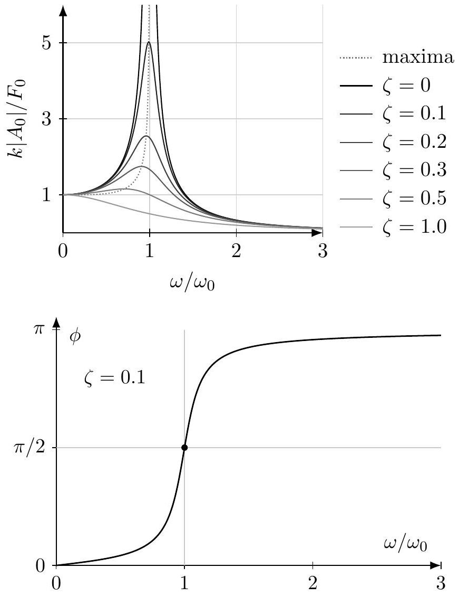

[4] Problem 17. Analyzing a damped and driven harmonic oscillator.

(a) Consider a damped harmonic oscillator which experiences a driving force $F = F _ { 0 } \cos ( \omega t )$. Passing to complex variables, Newton's second law is
$$
m \ddot { x } + b \dot { x } + k x = F _ { 0 } e ^ { i \omega t } .
$$
If $x ( t )$ is a complex exponential, then we know that the left-hand side is still a complex exponential, with the same frequency. This motivates us to guess $x ( t ) = A _ { 0 } e ^ { i \omega t }$. Show that this solves the equation for some $A _ { 0 }$.

(b) Of course, the general solution needs to be described by two free parameters, to match the initial position and velocity. Argue that it takes the form
$$
x ( t ) = A _ { 0 } e ^ { i \omega t } + A _ { + } e ^ { i \omega _ { + } t } + A _ { - } e ^ { i \omega _ { - } t }
$$
where the $\omega _ { \pm }$are the ones you found in problem 16.
(c) After a long time, the "transient" $A _ { \pm }$terms will decay away, leaving the steady state solution
$$
x ( t ) \approx A _ { 0 } e ^ { i \omega t }
$$
which oscillates at the same frequency as the driving. The actual position is the real part,
$$
x ( t ) \approx \left| A _ { 0 } \right| \cos ( \omega t - \phi )
$$
where $A _ { 0 } = \left| A _ { 0 } \right| e ^ { - i \phi }$. Evaluate $\left| A _ { 0 } \right|$ and $\phi$.
(d) Sketch the amplitude $\left| A _ { 0 } \right|$ and phase shift $\phi$ as a function of $\omega$. Can you intuitively see they take the values they do, for $\omega$ small, $\omega \approx \sqrt { k / m }$, and $\omega$ large?
(e) There are several distinct things people mean when they speak of "resonant frequencies". Find the driving angular frequency $\omega$ that maximizes (i) the amplitude $\left| A _ { 0 } \right|$, (ii) the amplitude of the velocity, and (iii) the average power absorbed from the driving force. (As you'll see, these are all about the same when the damping is weak, so the distinction between these isn't so important in practice.)

Solution. (a) If we plug in $x = A _ { 0 } e ^ { i \omega t }$, we find the differential equation is satisfied if

$$
\left( - m \omega ^ { 2 } + i b \omega + k \right) A _ { 0 } = F _ { 0 } ,
$$

which yields

$$
A _ { 0 } = \frac { F _ { 0 } } { \left( k - m \omega ^ { 2 } \right) + i b \omega } .
$$

(b) This follows from linearity. If we plug this solution in, then the first term balances the driving term on the right-hand side. Then the other two terms need to satisfy the damped harmonic oscillator equation with no driving, so they're just the same as in problem 16.
(c) The answers are
$$
\left| A _ { 0 } \right| = \frac { F _ { 0 } } { \sqrt { \left( k - m \omega ^ { 2 } \right) ^ { 2 } + ( b \omega ) ^ { 2 } } } , \quad \tan \phi = \frac { b \omega } { k - m \omega ^ { 2 } } .
$$
(d) The amplitude and phase shift are shown below, for a few values of $\zeta = b / \left( 2 m \omega _ { 0 } \right)$, where $\omega _ { 0 } = \sqrt { k / m }$.

This all makes physical sense. For very small frequency, we are effectively stretching the spring statically, so the amplitude approaches a constant $\left| A _ { 0 } \right| = F _ { 0 } / k$, and the phase shift is zero. For $\omega \approx \sqrt { k / m }$, the amplitude is high because we're driving the oscillator at the frequency it wants to oscillate at, in the absence of driving and damping. Here, a large power is absorbed from the driving force, and since $P = F v$, that means $F$ and $v$ must be approximately in phase, so the phase shift between $F$ and $x$ is 90°. Finally, for high frequencies, the amplitude goes to zero because the mass doesn't have time to move far before the force turns around. In this case, the driving force is always the largest force acting on the mass, so $F$ and $a$ are in phase, so the phase shift between $F$ and $x$ is 180°.

(e) First, to find the maximum $\left| A _ { 0 } \right|$, it suffices to minimize the square of its denominator. Setting the derivative of that quantity to zero gives
$$
2 b ^ { 2 } \omega = 2 \left( k - m \omega ^ { 2 } \right) ( 2 m \omega )
$$
which can be solved to yield
$$
\omega = \sqrt { k / m - b ^ { 2 } / 2 m ^ { 2 } } .
$$
The amplitude of the velocity is
$$
v _ { 0 } = \omega \left| A _ { 0 } \right| = \frac { F _ { 0 } \omega } { \sqrt { \left( k - m \omega ^ { 2 } \right) ^ { 2 } + ( b \omega ) ^ { 2 } } } = \frac { F _ { 0 } } { \sqrt { ( k / \omega - m \omega ) ^ { 2 } + b ^ { 2 } } }
$$
which is clearly maximized when $\omega = \sqrt { k / m }$. Finally, the rate of power dissipation is
$$
P = F ( t ) v ( t ) = - F _ { 0 } v _ { 0 } \cos ( \omega t ) \sin ( \omega t - \phi ) = F _ { 0 } v _ { 0 } \cos ( \omega t ) \cos ( \omega t + ( \pi / 2 - \phi ) ) .
$$

As we've just seen, $v _ { 0 }$ is maximized at $\omega = \sqrt { k / m }$. In addition, the average value of the product of cosines is maximized when they are in phase with each other, $\phi = \pi / 2$, which also happens when $\omega = \sqrt { k / m }$. Therefore, the maximum average power dissipation occurs at $\omega = \sqrt { k / m }$.
