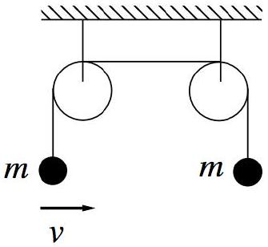

[3] Problem 27. A block of mass $m$ is bouncing back and forth in a box spanning $0 < x < L$, with initial speed $v _ { 0 }$. At time $t = 0$, the potential energy is slowly raised in part of the box, so that
$$
V ( x , t ) = \begin{cases} V _ { 0 } & 0 < x < u t \\ 0 & u t < x < L \end{cases}
$$
where $V _ { 0 } > m v _ { 0 } ^ { 2 } / 2$, and the speed of the potential $u$ is very small. At time $t = L / u$, when the potential covers the entire box, what is the block's speed?
Solution. This is a simplified version of Physics Cup 2021, problem 4. The key is to use the adiabatic theorem. Initially, the box's orbit in phase space is a rectangle with width $\Delta x = L$ and $\Delta p _ { x } = 2 m v _ { 0 }$. As the potential barrier enters the box, it effectively makes it shorter. So, just as in problem 26, the rectangle gets narrower while keeping its area the same.
The twist is that eventually, the block will gain enough energy to climb over the potential barrier; at this point, the form of its orbit changes discontinuously, so we have to track exactly what's going on instead of blindly using the adiabatic theorem. Consider the moment when the block's energy becomes just enough to climb the potential barrier, and suppose that at this point, $u t = x _ { 0 }$. Then the phase space orbit becomes the union of two rectangles:
    1. The original, shrinking rectangle with width $\Delta x = L - x _ { 0 }$ and height $\Delta p _ { x } = 2 m v _ { 0 } L / \left( L - x _ { 0 } \right)$.
    2. A new rectangle with width $\Delta x = x _ { 0 }$ and negligible height.
The added rectangle has negligible area, so the adiabatic invariant (the total phase space area) doesn't change! After this point, we can continue to apply the adiabatic theorem until the end of the process. The first rectangle shrinks, until it reaches zero width, while the second rectangle grows. At the end of the process, we are back to a single rectangle with width $\Delta x = L$ and the same area as before, so the block ends up with the same speed as before.
In terms of Newton's laws, what's going on is that the moving potential barrier is initially like a piston that does work on the block during each collision, but it also subtracts energy since the block has to eventually climb on top of it. Evidently, these two effects perfectly cancel, thanks to the adiabatic theorem.
[4] Problem 28 ( $\boldsymbol { F } = \boldsymbol { m a }$, BAUPC). Two particles of mass $m$ are connected by pulleys as shown.

The mass on the left is given a small horizontal velocity $v$, and oscillates back and forth.
    (a) Without doing any calculation, which mass is higher after a long time?
    (b) Compute the average tension in the leftward string over the first few cycles, where the left mass has angular amplitude $\theta _ { 0 } \ll 1$.
    (c) Let the masses begin a distance $L$ from the pulleys. Find the speed $u$ of the mass which eventually hits the pulley, at the moment it does, in terms of $L$ and the initial amplitude $\theta _ { 0 }$.

Solution. (a) The mass on the right will be higher. If the masses didn't move up or down, both would have the same average $y$-component of tension. But the mass on the left also has an $x$-component of tension, so its average magnitude of tension would be higher. This is a contradiction; to make the tension constant throughout the rope the mass on the right must rise.

(b) Let $a$ be the acceleration of the string along its length, defined to be positive if the right mass accelerates up. Then from considering the right and left masses, we have
$$
m a = T - m g , \quad m a - \frac { m v ^ { 2 } } { r } = m g \cos \theta - T .
$$
Combining these results, we have
$$
T = \frac { m v ^ { 2 } } { 2 r } + \frac { m g ( 1 + \cos \theta ) } { 2 }
$$
where $\theta$ is the angle from the vertical. By energy conservation, the first term is $m g \left( \cos \theta - \cos \theta _ { 0 } \right)$ where $\theta _ { 0 }$ is the amplitude, so
$$
T = \left( \frac { 1 } { 2 } + \frac { 3 } { 2 } \cos \theta - \cos \theta _ { 0 } \right) m g \approx \left( 1 + \frac { \theta _ { 0 } ^ { 2 } } { 2 } - \frac { 3 } { 4 } \theta ^ { 2 } \right) m g
$$
where we used the small angle approximation in the second step. Since the motion is approximately simple harmonic, the average value of $\theta ^ { 2 }$ is $\theta _ { 0 } ^ { 2 } / 2$, so
$$
\bar { T } = \left( 1 + \frac { 1 } { 2 } \theta _ { 0 } ^ { 2 } - \frac { 3 } { 8 } \theta _ { 0 } ^ { 2 } \right) m g > m g
$$
as expected.
(c) Of course, you can do this using energy conservation and the adiabatic invariant. But we can also directly use the result of part (b) to solve it by considering forces.
As we've seen above,
$$
\bar { T } = \left( 1 + \frac { 1 } { 8 } \theta ^ { 2 } \right) m g
$$
where $\theta$ is the amplitude. Let $x$ be the distance the right mass has risen. From the standpoint of the left mass, it is simply a pendulum whose length is being adiabatically lengthened, so by the result of problem 25, we have
$$
\int ( \bar { T } - m g ) d x = \frac { m g } { 8 } \int _ { L } ^ { 2 L } L ^ { 3 / 2 } \theta _ { 0 } ^ { 2 } \frac { d x } { x ^ { - 3 / 2 } } = \frac { m g } { 4 } L \theta _ { 0 } ^ { 2 } \left( 1 - \frac { 1 } { \sqrt { 2 } } \right)
$$
This is the net work done on the right mass, so setting this equal to $m u ^ { 2 } / 2$ gives
$$
u = \frac { \theta _ { 0 } } { 2 } \sqrt { ( 2 - \sqrt { 2 } ) g L } .
$$
I thank Varun Rajkumar for correcting a factor of 2 in the original solution.
