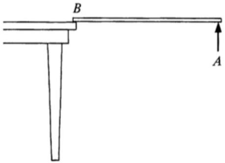
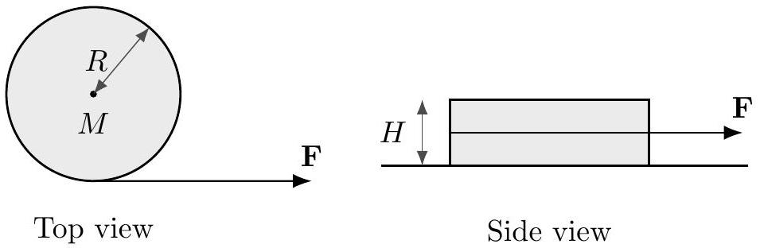
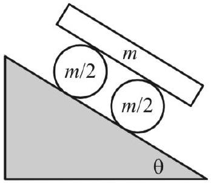

## Example 6: $F = m a 2018 \mathrm {~B} 23$

Two particles with mass $m _ { 1 }$ and $m _ { 2 }$ are connected by a massless rigid rod of length $L$ and placed on a horizontal frictionless table. At time $t = 0$, the first mass receives an impulse perpendicular to the rod, giving it speed $v$. At this moment, the second mass is at rest. When is the next time the second mass is at rest?

## Solution

The motion is the superposition of two motions: uniform translation of both masses with speed $m _ { 1 } v / \left( m _ { 1 } + m _ { 2 } \right)$ and circular motion about the common center of mass, where the two masses have speeds $m _ { 2 } v / \left( m _ { 1 } + m _ { 2 } \right)$ and $m _ { 1 } v / \left( m _ { 1 } + m _ { 2 } \right)$, respectively. This ensures that the second mass begins at rest and the first mass has speed $v$.

The circular part of the motion determines when the second mass will be at rest again. The radius of the circle the second mass makes is its distance from the center of mass, $L m _ { 1 } / \left( m _ { 1 } + m _ { 2 } \right)$. This gives a period of

$$
t = \frac { 2 \pi L m _ { 1 } / \left( m _ { 1 } + m _ { 2 } \right) } { m _ { 1 } v / \left( m _ { 1 } + m _ { 2 } \right) } = \frac { 2 \pi L } { v } .
$$

[2] Problem 8 (KK 6.14). A uniform stick of mass $M$ and length $\ell$ is suspended horizontally with end $B$ on the edge of a table, while end $A$ is held by hand.

Point $A$ is suddenly released. Right after release, find the vertical force at $B$, as well as the downward acceleration of point $A$. You should find a result greater than $g$. Explain how this can be possible, given that gravity is the only downward external force in the problem.
Solution. We take torques about $B$, applying idea 5 . Note that $\tau = M g \ell / 2 = I \alpha = \frac { 1 } { 3 } M \ell ^ { 2 } \alpha$, so $\alpha = \frac { 3 } { 2 } \frac { g } { \ell }$. Thus, the instantaneous acceleration of the center of mass is $\alpha \ell / 2 = \frac { 3 } { 4 } g$ down. Therefore, $M g - F = 3 M g / 4$, so $F = M g / 4$. Furthermore, the acceleration of point $A$ is $3 g / 2$ down.
This can be greater than $g$ because the stick is a rigid object, so it supports internal shear stresses, which keep the whole body moving as one piece. If you consider a small piece of the stick near the end, gravity provides a downward acceleration $g$, while a downward shear stress from the rest of the stick provides the remaining downward acceleration $g / 2$.
[2] Problem 9 (Quarterfinal 2005). A thin disk of mass $M$, radius $R$, and height $H$ is initially at rest on a flat horizontal table.

There is no friction between the disk and the table. A long massless cord is wrapped around the disk and pulled with constant force $F$ parallel to the table.
    (a) Find the ratio of rotational to translational kinetic energy.
    (b) What is the total work done by the force $F$ during the disk's first revolution?

Solution. This problem requires thinking about rotational and translational motion separately.

(a) The linear acceleration is $F / M$, so the translational kinetic energy after time $t$ is
$$
K _ { t } = \frac { 1 } { 2 } M \left( \frac { F t } { M } \right) ^ { 2 } = \frac { F ^ { 2 } t ^ { 2 } } { 2 M } .
$$
The torque about the center of mass is $F R$, so the angular acceleration is $\alpha = 2 F / M R$, so
$$
K _ { r } = \frac { 1 } { 2 } \left( \frac { 1 } { 2 } M R ^ { 2 } \right) \left( \frac { 2 F t } { M R } \right) ^ { 2 } = \frac { F ^ { 2 } t ^ { 2 } } { M }
$$
from which we conclude $K _ { r } / K _ { t } = 2$.
(b) If the disk didn't linearly accelerate, the answer would be $2 \pi F R$, and the translational kinetic energy is half as much as the rotational kinetic energy, so the true answer is $3 \pi F R$.
For another perspective, the answer has to be $F \ell$ where $\ell$ is the distance through which the cord has moved. (For example, the other end of the string might be attached to a hanging mass of weight $F$, which would then move down by distance $\ell$.) From the rotation we have a distance $2 \pi R$, and from the translation there's an additional distance $\pi R$, so that $\ell = 3 \pi R$.
[2] Problem 10 (Morin 8.71). A ball sits at rest on a piece of paper on a table. You pull the paper in a straight line out from underneath the ball. You are free to pull the paper in an arbitrary way forward or backwards; you may even jerk it so that the ball starts to slip. After the ball comes off the paper, it will eventually roll without slipping. Show that, in fact, the ball ends up at rest. Is it possible to pull the paper in such a way that the ball ends up exactly where it started?
Solution. The normal and gravitational forces cancel, so the only relevant force on the ball is friction, which acts at the bottom. Consider the angular momentum, $\mathbf { L } = \mathbf { r } \times \mathbf { p }$, and torques, $\boldsymbol { \tau } = \mathbf { r } \times \mathbf { F }$, about the point of initial contact. Since r and $\mathbf { F }$ are always in the same plane, $\boldsymbol { \tau }$ always points perpendicular to the surface, and $\mathbf { L } = \int \boldsymbol { \tau } d t$ will likewise be vertical.
During the process, the ball can move, as long as the horizontal components of its spin and orbital angular momentum cancel out. But after the ball comes off the paper, it will eventually roll without slipping, and in this case the spin and orbital angular momenta point in the same direction. So the only way for the sum to be zero is for both to be zero, so the ball stops.
It is possible for the ball to end up where it started. If we just pull the paper out to the right, the ball ends up to the left of where it started. But we can do a little maneuver in the beginning to move the ball right, so that it cancels out the leftward motion in the last step. To do this, just jerk the paper to the right a bit, getting the ball started rolling to the right, then stop it later by jerking the paper to the left. Then pull the paper out to the right.
[2] Problem 11 (Morin 8.28). Consider the following "car" on an inclined plane.

The system is released from rest, and there is no slipping between any surfaces. Find the acceleration of the board.

Solution. Let the acceleration of the board be $a$, and the angular accelerations of the cylinders be $\alpha$. Looking at one cylinder, the motion of the cylinder can be seen as pure rotation about the contact point with the slope (since there's no slipping, that point is stationary). Then the cylinder rotates about the contact point with angular acceleration $\alpha$, and the top will accelerate at $\alpha ( 2 R )$ where $R$ is the radius of the cylinders. Thus for the board to not slip, $a = 2 R \alpha$.

Taking torques about the contact point, with $f$ being the friction force between the cylinders and board,

$$
\tau = \left( \frac { m } { 2 } R ^ { 2 } + \frac { 1 } { 2 } \frac { m } { 2 } R ^ { 2 } \right) \alpha = \frac { m } { 2 } g R \sin \theta - 2 R f .
$$

For the acceleration of the board,

$$
F = m a = 2 f + m g \sin \theta .
$$

Adding these two equations and substituting $\alpha R = a / 2$ yields the answer,

$$
a = \frac { 12 } { 11 } g \sin \theta .
$$

For sufficiently large $\theta$, the downward acceleration of the board becomes larger than $g$, because it experiences an extra downward force from friction with the wheels.

This problem can also be solved using the "Lagrangian"/energy methods of M4. Let $s$ be the distance the centers of the wheels have moved. Then by totaling up the kinetic energy,

$$
K = \frac { 1 } { 2 } m \dot { s } ^ { 2 } \times \left( 1 + \frac { 1 } { 2 } + 4 \right) \equiv \frac { 1 } { 2 } m _ { \mathrm { eff } } \dot { s } ^ { 2 }
$$

where the three terms are the translational and rotational kinetic energy of the wheels, and the kinetic energy of the board, which travels at twice the speed as the centers of the wheels. On the other hand, the potential energy is

$$
V = - m g s \sin \theta ( 1 + 2 ) \equiv - F _ { \mathrm { eff } } s
$$

where the two terms are from the wheels and board. Then we have

$$
\ddot { s } = \frac { F _ { \mathrm { eff } } } { m _ { \mathrm { eff } } } = \frac { 3 m g \sin \theta } { ( 11 / 2 ) m } = \frac { 6 } { 11 } g \sin \theta .
$$

The acceleration of the board is twice this, giving the same answer as before.
[2] Problem 12. USAPhO 2006, problem A1.
[2] Problem 13. USAPhO 2013, problem A2.
[3] Problem 14. USAPhO 2014, problem A1.
Solution. See the official solutions as usual. If you're curious, I also wrote up a solution that doesn't use a rotating frame here. It uses some techniques covered in M8.
