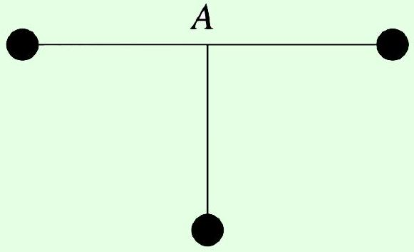
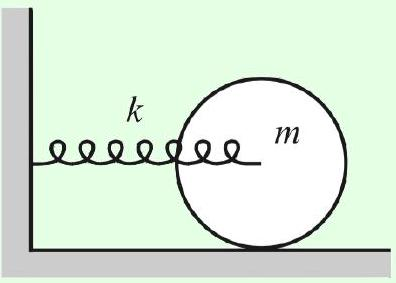

Example 8: $F = m a 2018$ A14
Three identical masses are connected with identical rigid rods and pivoted at point $A$.

If the lowest mass receives a small horizontal push to the left, it oscillates with period $T _ { 1 }$. If it receives a small push into the page, it oscillates with period $T _ { 2 }$. Find the ratio $T _ { 1 } / T _ { 2 }$.

Solution
Both modes are physical pendulums, which have period proportional to $\sqrt { I / M g x }$ where $x$ is the distance from the pivot to the center of mass, and $I$ is the moment of inertia about the pivot. Since $x$ is the same in both cases, $T _ { 1 } / T _ { 2 } = \sqrt { I _ { 1 } / I _ { 2 } } = \sqrt { 3 }$, because in the second case only the bottom mass contributes to the moment of inertia.

Example 9: Morin 8.41
The axis of a solid cylinder of mass $m$ and radius $r$ is connected to a spring of spring constant $k$, as shown.

If the cylinder rolls without slipping, find the angular frequency of the oscillations.

## Solution

This is a question best handled using the energy methods of M4. The potential energy is $k x ^ { 2 } / 2$ as usual, where $x$ describes the position of the cylinder's center of mass. The kinetic energy is $m v ^ { 2 } / 2 + I \omega ^ { 2 } / 2 = ( 3 / 4 ) m v ^ { 2 }$, since the cylinder is rolling without slipping. Therefore

$$
\omega = \sqrt { \frac { k } { m _ { \mathrm { eff } } } } = \sqrt { \frac { 2 k } { 3 m } } .
$$

More complicated variants of this kind of problem can be solved in a similar way.

## Example 10: Russia 2011

A uniform ring of mass $m$ and radius $r$ is suspended symmetrically on three inextensible strings of length $\ell$. Find the angular frequency of small oscillations.

## Solution

The small oscillations are torsional, i.e. the ring rotates about its axis of symmetry. When the ring has twisted by an angle $\theta$, the strings are an angle $\phi \approx ( r / \ell ) \theta$ from the vertical. Thus, summing over the three strings, the restoring torque is

$$
\tau \approx - m g r \phi \approx - \frac { m g r ^ { 2 } } { \ell } \theta .
$$

Setting this equal to $I \alpha$, we find $\omega = \sqrt { g / \ell }$.
The tricky thing about this problem is that it's harder to solve with the energy method. If you try, you immediately run into the problem that there seems to be no potential energy anywhere, since the strings don't stretch! The source of the potential energy is that the ring moves up a small amount as it oscillates, since the strings are no longer vertical,

$$
h = \ell - \sqrt { \ell ^ { 2 } - r ^ { 2 } \theta ^ { 2 } } \approx \frac { r ^ { 2 } \theta ^ { 2 } } { 2 \ell } .
$$

Therefore we have

$$
K = \frac { 1 } { 2 } m r ^ { 2 } \dot { \theta } ^ { 2 } , \quad V = \frac { 1 } { 2 } \frac { m g r ^ { 2 } } { \ell } \theta ^ { 2 }
$$

and the answer follows as usual. (There is also a kinetic energy contribution from the ring's vertical motion, but it's negligible.) The lesson here is that the force/torque and energy

approach have different strengths. The energy approach is often easier because it lets you ignore some internal details of the system. But it can be harder because it requires you to understand the kinematics of the system to second order, rather than first order.
