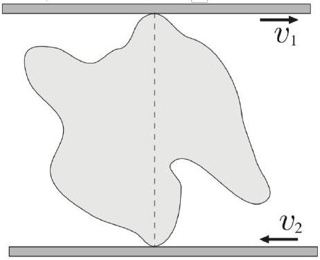
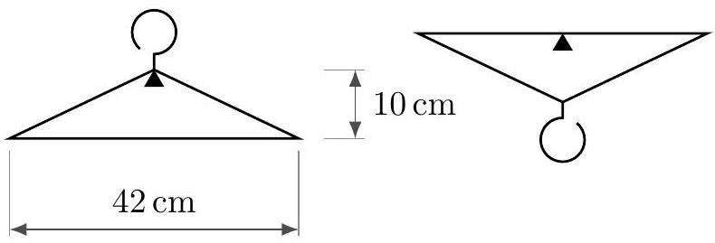
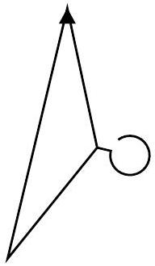

## Mechanics V: 2D Rotation

Two-dimensional rotation is covered in chapter 6 of Kleppner and Kolenkow, chapter 8 of Morin, or chapters 3 and 5 of Wang and Ricardo, volume 1. Further discussion is given in chapters I-18 and I-19 of the Feynman lectures. For more on dot and cross products, see the first two lectures of MIT OCW 18.02. There is a total of 84 points.

## 1 2D Rotational Kinematics

Idea 1
It can be shown that the instantaneous velocity of a two-dimensional rigid body can always be written as pure rotation about some point $\mathbf { r } _ { 0 }$, not necessarily in the body. Then the velocity of a point in the body at location r is

$$
\mathbf { v } = \omega \times \left( \mathbf { r } - \mathbf { r } _ { 0 } \right) .
$$

This equation defines $\boldsymbol { \omega }$, the angular velocity vector, which points out of the page. Differentiating gives the acceleration of a point in the body,

$$
\begin{aligned}
\mathbf { a } & = \boldsymbol { \alpha } \times \left( \mathbf { r } - \mathbf { r } _ { 0 } \right) + \boldsymbol { \omega } \times \left( \mathbf { v } - \mathbf { v } _ { 0 } \right) \\
& = \boldsymbol { \alpha } \times \left( \mathbf { r } - \mathbf { r } _ { 0 } \right) + \boldsymbol { \omega } \times \left( \boldsymbol { \omega } \times \left( \mathbf { r } - \mathbf { r } _ { 0 } \right) \right) - \boldsymbol { \omega } \times \mathbf { v } _ { 0 }
\end{aligned}
$$

where $\mathbf { v } _ { 0 } = d \mathbf { r } _ { 0 } / d t$ is the rate of change of the location of the pivot point. (Note that this differs from the velocity of the point in the body instantaneously at the pivot, which is always zero.) However, this latter expression is often hard to use, because you usually won't know $\mathbf { r } _ { 0 } ( t )$, or it'll have a complicated form.

Alternatively, we can write the velocity in terms of translation plus pure rotation about any desired point, which is almost always chosen to be the center of mass. This gives

$$
\mathbf { v } = \mathbf { v } _ { \mathrm { CM } } + \boldsymbol { \omega } \times \left( \mathbf { r } - \mathbf { r } _ { \mathrm { CM } } \right) .
$$

The $\boldsymbol { \omega }$ here is the same as in the previous expression. Differentiating gives the acceleration,

$$
\begin{aligned}
\mathbf { a } & = \mathbf { a } _ { \mathrm { CM } } + \boldsymbol { \alpha } \times \left( \mathbf { r } - \mathbf { r } _ { \mathrm { CM } } \right) + \boldsymbol { \omega } \times \left( \mathbf { v } - \mathbf { v } _ { \mathrm { CM } } \right) \\
& = \mathbf { a } _ { \mathrm { CM } } + \boldsymbol { \alpha } \times \left( \mathbf { r } - \mathbf { r } _ { \mathrm { CM } } \right) + \boldsymbol { \omega } \times \left( \boldsymbol { \omega } \times \left( \mathbf { r } - \mathbf { r } _ { \mathrm { CM } } \right) \right) .
\end{aligned}
$$

If you need an acceleration, this form tends to be easiest to use. The three terms represent the acceleration of the center of mass, the linear acceleration due to angular acceleration, and the centripetal acceleration, written in a slightly fancy way.

Remark 1: Cross Products
You learn in school that if $\mathbf { a } \times \mathbf { b } = \mathbf { c }$, then the direction of c is found by applying the right-hand rule to a and b, and its magnitude is $| \mathbf { a } | | \mathbf { b } | \sin \theta$ where $\theta$ is the angle between them. However, this comes from some more basic properties which will also be useful below.

First, the cross product of two vectors is antisymmetric and distributes over addition,

$$
\mathbf { a } \times \mathbf { b } = - \mathbf { b } \times \mathbf { a } , \quad \mathbf { a } \times \left( r _ { 1 } \mathbf { b } _ { 1 } + r _ { 2 } \mathbf { b } _ { 2 } \right) = r _ { 1 } \mathbf { a } \times \mathbf { b } _ { 1 } + r _ { 2 } \mathbf { a } \times \mathbf { b } _ { 2 } .
$$

The latter means a cross product can be differentiated using the product rule. Moreover,

$$
\hat { \mathbf { x } } \times \hat { \mathbf { y } } = \hat { \mathbf { z } } , \quad \hat { \mathbf { y } } \times \hat { \mathbf { z } } = \hat { \mathbf { x } } , \quad \hat { \mathbf { z } } \times \hat { \mathbf { x } } = \hat { \mathbf { y } } .
$$

Example 1
Describe the velocities of points in a disc rolling without slipping using both methods.

Solution
Let the disc have radius $R$, lie in the $x y$ plane, and roll along the $x$ axis. Consider the moment where the bottom of the disc touches the origin. At this moment its motion can be thought of as pure rotation about the origin,

$$
\mathbf { v } = \omega \times \mathbf { r } = - \omega \hat { \mathbf { z } } \times \mathbf { r } .
$$

On the other hand, the motion can also be thought of as simultaneous translation of the center of mass and rotation about the center of mass, so

$$
\begin{aligned}
\mathbf { v } & = \mathbf { v } _ { \mathrm { CM } } + \omega \times \left( \mathbf { r } - \mathbf { r } _ { \mathrm { CM } } \right) \\
& = \omega R \hat { \mathbf { x } } - \omega \hat { \mathbf { z } } \times ( \mathbf { r } - R \hat { \mathbf { y } } ) \\
& = \omega R \hat { \mathbf { x } } - \omega \hat { \mathbf { z } } \times \mathbf { r } - \omega R \hat { \mathbf { x } } \\
& = - \omega \hat { \mathbf { z } } \times \mathbf { r } .
\end{aligned}
$$

As we can see, both decompositions are completely equivalent. Which one you want to use depends on the problem; you could even use both in the same problem, if you're careful.

Remark
As we'll discuss in M8, for three-dimensional rigid bodies, rotation is always about an axis. When people say a body rotates about a point, as we will throughout this problem set, they always mean that the body is two-dimensional and moves in a fixed plane, and the "point" of rotation is the intersection of the 3D rotation axis with the plane.

You might also wonder how the description

$$
\mathbf { v } = \boldsymbol { \omega } \times \left( \mathbf { r } - \mathbf { r } _ { 0 } \right)
$$

applies in the case where a body is in pure translation. That's simply the case where $\boldsymbol { \omega }$ goes to zero while $\mathbf { r } _ { 0 }$ gets infinitely far away. In this limit, r is negligible, so every point in the body moves with the same velocity $\mathbf { v } = - \boldsymbol { \omega } \times \mathbf { r } _ { 0 }$. So the description still works for pure translation, though it's a bit unnatural.

Example 2
A cylinder of circumference 10 cm is placed on a table. You place a ruler horizontally on the cylinder, so that initially the top of the cylinder touches the 0 cm mark on the ruler. By pushing the ruler forward, you make the cylinder complete one full revolution, without anything slipping. At this point, what mark on the ruler is touching the top of the cylinder?

Solution
In one revolution, the center of the cylinder moves forward by 10 cm. The top of the cylinder moves forward by 20 cm, so the ruler also moves forward by this distance. The relative motion of the ruler and cylinder is the difference, which is 10 cm.
[4] Problem 1. Some brief puzzles about rotation.

(a) Consider two identical coins laid flat on a table. One is fixed in place, and the second is rolled without slipping around the first. Once the second coin's center has returned to its original position, how many times has it rotated? (Be sure to check your answer experimentally!)
(b) A bicycle wheel is rolling without slipping. When it is photographed, its spokes look blurred, except along a curve of special points, which don't look blurred at all. What is this curve?
(c) Consider a spaceship floating in space, without any thrusters that can expel material. Conservation of momentum implies that it cannot move its center of mass. But is it possible to turn the spaceship around? In other words, is it possible for it to begin stationary in one orientation, and end up stationary in another orientation? If so, why doesn't this violate conservation of angular momentum?
(d) Hold out your arm with your elbow bent at 90° and your palm straight out, facing down. Find a way to end up in the same position but with your palm facing up, without ever bending or rotating your wrist.

Solution. (a) Since the two coins have the same circumference, you might think the answer is 1. However, the answer is 2 , as is easily checked experimentally. Rolling around a convex curved surface gives an extra turn, as you can check with limiting cases, such as rolling around a big square.

Another way to think about this is that the center of the coin moves in a circle of radius $2 r$, where $r$ is the radius of the coin. Since the coin rolls without slipping, $v _ { \mathrm { CM } } = \omega r$ at all times. Integrating this result, $d _ { \mathrm { CM } } = \theta r$ where $d _ { \mathrm { CM } }$ is the distance through which the center of mass moves, and $\theta$ is the total turn angle. Then $2 \pi ( 2 r ) = \theta r$ which gives $\theta = 4 \pi$.

(b) Note that the motion can be described as pure rotation about the contact point $C$. For the special points $P$, we want the velocity of that point to be parallel to the spokes, so the line $C P$ to be perpendicular to the spoke $O P$. It is not hard to see that this locus is the circle with diameter $O C$.
(c) Just rotate a wheel inside the spaceship. If the wheel spins clockwise, then the rest of the spaceship will start spinning counterclockwise, by conservation of angular momentum. Then the wheel can be stopped when the spaceship has the desired final orientation. (This is actually

how spaceships turn around: they carry large reaction wheels which are spun up or down as needed. The ability to change orientation is essential for space telescopes, and in practice the wheels are always rotating fairly quickly, because their angular momentum can gyroscopically stabilize the rest of the ship.)
The fundamental reason this works is that rotations are periodic; unlike translations, you can give something a net rotation but also end up back where you started. For a closely related trick, see how a falling cat can turn itself around.
(d) Starting from the original position, bring your forearm horizontally to your chest, then rotate it vertically, then return it to the original position. At this point, your palm should be facing horizontally. Repeat the sequence to get it facing upward.
The fundamental reason this works is that your wrist and palm are constrained to move along a sphere, and the surface of a sphere is curved. Curvature intrinsically means that this kind of "parallel transport" doesn't necessarily return you to your original configuration. It's an important idea in differential geometry and general relativity. (The detailed math tells us that the angle through which your palm rotates is proportional to the solid angle traced out by the loop. So in theory, you could also achieve the same thing by moving your hand in one giant loop, though this takes some flexibility, or ten times in a small loop. The latter might not work in practice, though, because your brain might unconsciously rotate your wrist a bit to compensate for the effect.)
[2] Problem 2 (Kalda). A rigid lump is squeezed between two places, one of which is moving at velocity $v _ { 1 }$ and the other at $v _ { 2 }$. At some moment, the velocities are horizontal and the two contact points are vertically aligned.

Describe geometrically all of the points in the body with speed either $v _ { 1 }$ or $v _ { 2 }$.
Solution. The motion of the rigid body can be expressed as rotation about some point $O$. It must be on the vertical line connecting the two contact points, with distances to those points satisfying $\omega = v _ { 1 } / r _ { 1 } = v _ { 2 } / r _ { 2 }$, where $r _ { 1 } + r _ { 2 }$ is the distance between the contact points. Then, all points with speed $v _ { 1 }$ lie on the circle centered at $O$ with radius $r _ { 1 }$, and radius $r _ { 2 }$ for $v _ { 2 }$.
[2] Problem 3. USAPhO 2010, problem A1.

## 2 Moments of Inertia

Idea 2
For a two-dimensional object in the $x y$ plane, the moment of inertia

$$
I = \int x ^ { 2 } + y ^ { 2 } d m
$$

about the $z$-axis obeys the parallel axis theorem

$$
I = I _ { \mathrm { CM } } + M r _ { \mathrm { CM } } ^ { 2 }
$$

where $I _ { \mathrm { CM } }$ is the moment of inertia about the center of mass, and $M$ is the total mass. Defining $I _ { x }$ and $I _ { y }$ to be the moment of inertia about the $x$ and $y$ axes, we have

$$
I = I _ { x } + I _ { y } , \quad I _ { x } = \int y ^ { 2 } d m , \quad I _ { y } = \int x ^ { 2 } d m
$$

which is called the perpendicular axis theorem.
[3] Problem 4. Basic moment of inertia computations.

(a) Compute the moment of inertia for an $L _ { x } \times L _ { y }$ rectangular plate about an axis passing perpendicular to it through the center.
(b) Compute the moment of inertia for a uniform disc of radius $R$ and mass $M$, about an axis perpendicular to it through its center. What about an axis lying in the disc, passing through its center?
(c) Compute the moment of inertia of a uniform solid cone of mass $M$, with height $H$ and a base of radius $R$, about its symmetry axis.

Solution. (a) We have

$$
I _ { y } = \int _ { - L _ { x } / 2 } ^ { L _ { x } / 2 } x ^ { 2 } \left( M / L _ { x } \right) d x = \frac { 1 } { 12 } M L _ { x } ^ { 2 }
$$

with a similar expression for $I _ { x }$, giving an answer of $M \left( L _ { x } ^ { 2 } + L _ { y } ^ { 2 } \right) / 12$.

(b) By direct integration,
$$
I = \int _ { 0 } ^ { R } r ^ { 2 } \left( M / \pi R ^ { 2 } \right) 2 \pi r d r = \frac { 1 } { 2 } M R ^ { 2 }
$$
For an axis lying in the disc, the answer is half as much, $M R ^ { 2 } / 4$, by the perpendicular axis theorem.
(c) First off, we know the height $H$ doesn't matter, because we can stretch the cone along its symmetry axis without changing the answer. Letting the density be $\rho$, we can integrate over the discs making up the cone,
$$
I = \int d I = \int \frac { 1 } { 2 } ( d m ) r ^ { 2 } = \int _ { 0 } ^ { H } \frac { 1 } { 2 } \left( \rho \pi r ^ { 2 } d h \right) r ^ { 2 }
$$

where the radius of the disc at height $h$ is, in some set of coordinates, $r ( h ) = R ( h / H )$. Plugging this in, we get

$$
I = \int _ { 0 } ^ { H } \frac { \pi } { 2 } \rho R ^ { 4 } \frac { h ^ { 4 } } { H ^ { 4 } } d h = \frac { \pi \rho R ^ { 4 } H } { 10 } .
$$

It remains to find $\rho$, by noting that

$$
M = \int d m = \int _ { 0 } ^ { H } \rho \pi r ^ { 2 } d h = \rho \pi \frac { R ^ { 2 } } { H ^ { 2 } } \int _ { 0 } ^ { H } h ^ { 2 } d h = \frac { \pi \rho R ^ { 2 } H } { 3 } .
$$

Plugging in the result for $\rho$ gives

$$
I = \frac { 3 } { 10 } M R ^ { 2 } .
$$

This makes sense, as it's somewhat less than the moment of inertia of a uniform disc; a cone has comparatively more of its mass closer to the axis.
[1] Problem 5 ( $\boldsymbol { F } = \boldsymbol { m a } 2016$ ). The moment of inertia of a uniform equilateral triangle with mass $m$ and side length $a$ about an axis through one of its sides and parallel to that side is $m a ^ { 2 } / 8$. What is the moment of inertia of a uniform regular hexagon of mass $m$ and side length $a$ about an axis through two opposite vertices?

Solution. I include this question as an example of constructing a moment of inertia of a complex shape from pieces. There are much more complicated variants, but they're all the same idea.

Four of the triangles clearly each contribute $( m / 6 ) a ^ { 2 } / 8$. The other two each contribute

$$
\frac { m } { 6 } \left( a ^ { 2 } / 8 - ( a / 2 \sqrt { 3 } ) ^ { 2 } + ( a / \sqrt { 3 } ) ^ { 2 } \right) = 3 ( m / 6 ) a ^ { 2 } / 8
$$

where we did two consecutive applications of the parallel axis theorem. Thus, the total is

$$
I = \frac { m a ^ { 2 } } { 6 } ( 4 / 8 + 3 / 4 ) = \frac { 5 m a ^ { 2 } } { 24 } .
$$

## 3 Rotational Dynamics

In this section we'll consider some dynamic problems involving rotation.
Idea 3: Angular Momentum
For a system of particles we define the angular momentum and torque

$$
\mathbf { L } = \sum _ { i } \mathbf { r } _ { i } \times \mathbf { p } _ { i } , \quad \boldsymbol { \tau } = \sum _ { i } \mathbf { r } _ { i } \times \mathbf { F } _ { i } , \quad \boldsymbol { \tau } = \frac { d \mathbf { L } } { d t } .
$$

Using the first part of idea 1, we may write the angular momentum of a rigid body as

$$
\mathbf { L } = I \boldsymbol { \omega } , \quad K = \frac { 1 } { 2 } I \omega ^ { 2 }
$$

where $I$ is the moment of inertia about the instantaneous axis of rotation. Alternatively, using the second part,

$$
\mathbf { L } = I _ { \mathrm { CM } } \boldsymbol { \omega } + \mathbf { r } _ { \mathrm { CM } } \times M \mathbf { v } _ { \mathrm { CM } } , \quad K = \frac { 1 } { 2 } I _ { \mathrm { CM } } \omega ^ { 2 } + \frac { 1 } { 2 } M v _ { \mathrm { CM } } ^ { 2 }
$$

where $M$ is the total mass; the two terms are called "spin" and "orbital" contributions.
Both forms are useful in different situations. Systems cannot exert torques on themselves, provided they obey the strong form of Newton's third law: the force between two objects is equal and opposite, and directed along the line joining them.

## Idea 4

The idea above refers to taking torques about a fixed point, but often it is easier to consider a moving point $P$. Let $\mathbf { L }$ be the angular momentum about point $P$ in the frame of $P$, i.e. the frame whose axes don't rotate, but whose origin follows $P$ around. Working in this frame will produce fictitious forces, since $P$ can accelerate. Such forces act at the center of mass, just like gravity.

The upshot is that if $P$ is the center of mass, then the fictitious force in the frame of $P$ will produce no "fictitious torque". So it's safe to use $\boldsymbol { \tau } = d \mathbf { L } / d t$ about either a fixed point, or in the frame of the center of mass.

## Idea 5

There is a third, more confusing way of applying $\boldsymbol { \tau } = d \mathbf { L } / d t$ that you might rarely see: taking torques about the instantaneous center of rotation. In general, this doesn't work, because the instantaneous center of rotation can accelerate, producing an extra fictitious torque as mentioned above.

However, it turns out this procedure gives the correct answer if the object is instantaneously at rest. That's why taking torques about the contact point for the spool in M2 to find the initial angular acceleration was valid. It wouldn't have been valid at any instant afterward, after the spool had picked up some velocity.

For more discussion of this subtlety, which isn't mentioned in any textbooks I know of, see the paper Moments to be cautious of.

## Example 3: KK 6.13

A mass $m$ is attached to a post of radius $R$ by a string. Initially it is a distance $r$ from the center of the post and is moving tangentially with speed $v _ { 0 }$. In case (a) the string passes through a hole in the center of the post at the top. The string is gradually shortened by drawing it through the hole. In case (b) the string wraps around the outside of the post. Ignore gravity.

(a)

(b)

For each case, find the final speed of the mass when it hits the post.

## Solution

In case (a), the energy isn't conserved, since work is done on the mass as it moves inward. (Physically, we can see this by noting there could be a weight slowly descending on the other end of the string.) However, angular momentum conservation says $R v = r v _ { 0 }$, so $v = r v _ { 0 } / R$.

If you don't believe in angular momentum conservation yet, it's not too hard to show this with $F = m a$ as well. Let the tangential and radial speeds of the mass be $v _ { t }$ and $v _ { r }$, where $v _ { r } \ll v _ { t }$. Since $v _ { r }$ is nonzero, there is a component of acceleration parallel to the velocity,

$$
\frac { T } { m } \sin \theta \approx \frac { v _ { t } ^ { 2 } } { r } \frac { v _ { r } } { v _ { t } }
$$

and this is equal to the rate of change of speed, which to first order in $v _ { r } / v _ { t }$ is $d v _ { t } / d t$. Thus,

$$
\frac { d v _ { t } } { d t } = \frac { v _ { r } v _ { t } } { r } = - \frac { v _ { t } } { r } \frac { d r } { d t }
$$

from which we conclude $r v _ { t }$ is constant, as expected. (As mentioned in M2, you never need ideas like torque and angular momentum. Life is just harder without them.)

In case (b), the angular momentum about the axis of the pole isn't conserved, since the tension force has a lever arm about that axis. However, the mass's energy is conserved. A simple physical way to see this is to note that the massless string can't store any energy, and the post doesn't do work on the string, which means the string can't do any work on the mass. Thus, the final speed is just $v = v _ { 0 }$. (Of course, if you don't believe in energy conservation, you could get the same result by showing that the trajectory of the mass is always perpendicular to the string, though this takes more work.)

[2] Problem 6 (KK 6.9). A heavy uniform bar of mass $M$ rests on top of two identical rollers which are continuously turned rapidly in opposite directions, as shown.

The centers of the rollers are a distance $2 \ell$ apart. The coefficient of friction between the bar and the roller surfaces is $\mu$, a constant independent of the relative speed of the two surfaces. Initially the bar is held at rest with its center at distance $x _ { 0 }$ from the midpoint of the rollers. At time $t = 0$ it is released. Find the subsequent motion of the bar.

Solution. Let $N _ { 1 }$ be the normal force from the right roller, and $N _ { 2 }$ be the one from the left roller. Since there is no acceleration in the $y$-direction, we have $N _ { 1 } + N _ { 2 } = M g$. Also, since the bar is not rotating, the torque about the center is zero, so $N _ { 1 } \left( \ell - x _ { 0 } \right) = N _ { 2 } \left( \ell + x _ { 0 } \right)$. One quickly sees that the solution to this system is

$$
N _ { 1 } = \frac { M g \left( \ell + x _ { 0 } \right) } { 2 \ell } , \quad N _ { 2 } = \frac { M g \left( \ell - x _ { 0 } \right) } { 2 \ell } .
$$

Now, the friction force from the right roller points to the left with magnitude $N _ { 1 } \mu$, and the one from the left roller points to the right with magnitude $N _ { 2 } \mu$. Therefore, the total net force on this system is

$$
N _ { 1 } \mu - N _ { 2 } \mu = M g \mu \frac { x _ { 0 } } { \ell }
$$

to the left. This is simple harmonic motion with angular frequency $\omega = \sqrt { \mu g / \ell }$. This neat system is called a "friction oscillator", or "Timoshenko oscillator".
[2] Problem 7 (BAUPC). A mass is connected to one end of a massless string, the other end of which is connected to a very thin frictionless vertical pole. The string is initially wound completely around the pole, in a very large number of small horizontal circles, with the mass touching the pole. The mass is released, and the string gradually unwinds. What angle does the string make with the pole when it becomes completely unwound? (Though the setup is similar to that of example 3, you can't ignore gravity here.)

Solution. Let the string have length $\ell$, a final angle of $\theta$ with the pole, and final angular velocity $\omega = v / \ell \sin \theta$. As it unwinds, there is no source of energy loss so energy is conserved.

$$
g \ell \cos \theta = \frac { 1 } { 2 } v ^ { 2 }
$$

The components of the force on the mass from the string is a horizontal component for a centripetal force, and a vertical component to balance gravity,

$$
T \sin \theta = m \omega ^ { 2 } \ell \sin \theta , \quad T \cos \theta = m g .
$$

Solving yields

$$
\tan \theta = \frac { v ^ { 2 } } { g \ell \sin \theta } = \frac { 2 } { \tan \theta } .
$$

Thus, $\theta = \arctan ( \sqrt { 2 } ) \approx 54.74 ^ { \circ }$.

Example 4: MPPP 49
A uniform cylinder of mass $M$ and radius $R$ is attached to two identical strings. The strings are wound around the cylinder as shown, and their free ends are fastened to the ceiling.

A third cord is attached to and wound around the middle of the cylinder, and a mass $M$ is attached to the other side. There is sufficient friction so that the strings do not slip. Find the acceleration of the mass immediately after release.

Solution
Let $a$ be the downward acceleration of the center of mass of the cylinder, let $T _ { 1 }$ be the total tension in the first two strings, and let $T _ { 2 }$ be the tension in the third. The cylinder rolls without slipping about its contact axis with the first two strings, which means the downward acceleration of the mass is $a _ { \text {mass } } = 2 a$.

The Newton's second law equations are thus

$$
M a = T _ { 2 } + M g - T _ { 1 } , \quad 2 M a = M g - T _ { 2 }
$$

for the cylinder and mass. Taking torques about the axis of the cylinder gives

$$
\left( T _ { 1 } + T _ { 2 } \right) R = \frac { 1 } { 2 } M R ^ { 2 } \alpha
$$

and using $a = \alpha R$ converts this to

$$
M a = 2 T _ { 1 } + 2 T _ { 2 } .
$$

We now have three equations in three unknowns, so we can straightforwardly solve to find $a = ( 6 / 11 ) g$. This implies that the acceleration of the mass is

$$
a _ { \mathrm { mass } } = \frac { 12 } { 11 } g .
$$

Done, right? No, this is the wrong answer! Since the acceleration is greater than free fall, the tension $T _ { 2 }$ must be negative. But a string can't support a negative tension, so it instead goes slack. The mass thus free falls, so $a _ { \text {mass } } = g$.

In retrospect, we could have seen this conclusion with less work. Suppose the mass were not attached. Then the acceleration of the cylinder can be computed with the standard rolling

without slipping formula,

$$
a = \frac { g \sin \theta } { 1 + \beta } = \frac { g } { 1 + \beta } , \quad I = \beta M R ^ { 2 } .
$$

For any (axially symmetric) mass distribution in the cylinder, we have $0 \leq \beta \leq 1$. The acceleration of the part where the mass would have been attached is hence

$$
a _ { \mathrm { mass } } = \frac { 2 g } { 1 + \beta } \geq g .
$$

This implies that any string we attach there must go slack immediately after release.

## Example 5

If you're riding a bike and need to stop quickly, what are the advantages and disadvantages of using the front brake versus the rear brake?

## Solution

Work in the reference frame moving with the bike. In this frame, the backward friction force is balanced by a forward fictitious force on the center of mass; the combination of the two produces a torque that tends to lift the rear wheel off the ground. If you use the front brake, you can stop more quickly, because the normal force on the front tire stays higher. But if you brake too hard with the front brake, you could flip yourself over the handlebars. This can't happen when using the rear brake alone, because the brake stops doing anything the moment the rear wheel lifts off the ground.

## Idea 6

It is often useful in rotational dynamics to treat the rotational and linear motion of a rigid body conceptually separately.

## Example 6: $F = m a 2018 \mathrm {~B} 23$

Two particles with mass $m _ { 1 }$ and $m _ { 2 }$ are connected by a massless rigid rod of length $L$ and placed on a horizontal frictionless table. At time $t = 0$, the first mass receives an impulse perpendicular to the rod, giving it speed $v$. At this moment, the second mass is at rest. When is the next time the second mass is at rest?

## Solution

The motion is the superposition of two motions: uniform translation of both masses with speed $m _ { 1 } v / \left( m _ { 1 } + m _ { 2 } \right)$ and circular motion about the common center of mass, where the two masses have speeds $m _ { 2 } v / \left( m _ { 1 } + m _ { 2 } \right)$ and $m _ { 1 } v / \left( m _ { 1 } + m _ { 2 } \right)$, respectively. This ensures that the second mass begins at rest and the first mass has speed $v$.

The circular part of the motion determines when the second mass will be at rest again. The radius of the circle the second mass makes is its distance from the center of mass, $L m _ { 1 } / \left( m _ { 1 } + m _ { 2 } \right)$. This gives a period of

$$
t = \frac { 2 \pi L m _ { 1 } / \left( m _ { 1 } + m _ { 2 } \right) } { m _ { 1 } v / \left( m _ { 1 } + m _ { 2 } \right) } = \frac { 2 \pi L } { v } .
$$

[2] Problem 8 (KK 6.14). A uniform stick of mass $M$ and length $\ell$ is suspended horizontally with end $B$ on the edge of a table, while end $A$ is held by hand.

Point $A$ is suddenly released. Right after release, find the vertical force at $B$, as well as the downward acceleration of point $A$. You should find a result greater than $g$. Explain how this can be possible, given that gravity is the only downward external force in the problem.
Solution. We take torques about $B$, applying idea 5 . Note that $\tau = M g \ell / 2 = I \alpha = \frac { 1 } { 3 } M \ell ^ { 2 } \alpha$, so $\alpha = \frac { 3 } { 2 } \frac { g } { \ell }$. Thus, the instantaneous acceleration of the center of mass is $\alpha \ell / 2 = \frac { 3 } { 4 } g$ down. Therefore, $M g - F = 3 M g / 4$, so $F = M g / 4$. Furthermore, the acceleration of point $A$ is $3 g / 2$ down.
This can be greater than $g$ because the stick is a rigid object, so it supports internal shear stresses, which keep the whole body moving as one piece. If you consider a small piece of the stick near the end, gravity provides a downward acceleration $g$, while a downward shear stress from the rest of the stick provides the remaining downward acceleration $g / 2$.
[2] Problem 9 (Quarterfinal 2005). A thin disk of mass $M$, radius $R$, and height $H$ is initially at rest on a flat horizontal table.

There is no friction between the disk and the table. A long massless cord is wrapped around the disk and pulled with constant force $F$ parallel to the table.
    (a) Find the ratio of rotational to translational kinetic energy.
    (b) What is the total work done by the force $F$ during the disk's first revolution?

Solution. This problem requires thinking about rotational and translational motion separately.

(a) The linear acceleration is $F / M$, so the translational kinetic energy after time $t$ is
$$
K _ { t } = \frac { 1 } { 2 } M \left( \frac { F t } { M } \right) ^ { 2 } = \frac { F ^ { 2 } t ^ { 2 } } { 2 M } .
$$
The torque about the center of mass is $F R$, so the angular acceleration is $\alpha = 2 F / M R$, so
$$
K _ { r } = \frac { 1 } { 2 } \left( \frac { 1 } { 2 } M R ^ { 2 } \right) \left( \frac { 2 F t } { M R } \right) ^ { 2 } = \frac { F ^ { 2 } t ^ { 2 } } { M }
$$
from which we conclude $K _ { r } / K _ { t } = 2$.
(b) If the disk didn't linearly accelerate, the answer would be $2 \pi F R$, and the translational kinetic energy is half as much as the rotational kinetic energy, so the true answer is $3 \pi F R$.
For another perspective, the answer has to be $F \ell$ where $\ell$ is the distance through which the cord has moved. (For example, the other end of the string might be attached to a hanging mass of weight $F$, which would then move down by distance $\ell$.) From the rotation we have a distance $2 \pi R$, and from the translation there's an additional distance $\pi R$, so that $\ell = 3 \pi R$.
[2] Problem 10 (Morin 8.71). A ball sits at rest on a piece of paper on a table. You pull the paper in a straight line out from underneath the ball. You are free to pull the paper in an arbitrary way forward or backwards; you may even jerk it so that the ball starts to slip. After the ball comes off the paper, it will eventually roll without slipping. Show that, in fact, the ball ends up at rest. Is it possible to pull the paper in such a way that the ball ends up exactly where it started?
Solution. The normal and gravitational forces cancel, so the only relevant force on the ball is friction, which acts at the bottom. Consider the angular momentum, $\mathbf { L } = \mathbf { r } \times \mathbf { p }$, and torques, $\boldsymbol { \tau } = \mathbf { r } \times \mathbf { F }$, about the point of initial contact. Since r and $\mathbf { F }$ are always in the same plane, $\boldsymbol { \tau }$ always points perpendicular to the surface, and $\mathbf { L } = \int \boldsymbol { \tau } d t$ will likewise be vertical.
During the process, the ball can move, as long as the horizontal components of its spin and orbital angular momentum cancel out. But after the ball comes off the paper, it will eventually roll without slipping, and in this case the spin and orbital angular momenta point in the same direction. So the only way for the sum to be zero is for both to be zero, so the ball stops.
It is possible for the ball to end up where it started. If we just pull the paper out to the right, the ball ends up to the left of where it started. But we can do a little maneuver in the beginning to move the ball right, so that it cancels out the leftward motion in the last step. To do this, just jerk the paper to the right a bit, getting the ball started rolling to the right, then stop it later by jerking the paper to the left. Then pull the paper out to the right.
[2] Problem 11 (Morin 8.28). Consider the following "car" on an inclined plane.

The system is released from rest, and there is no slipping between any surfaces. Find the acceleration of the board.

Solution. Let the acceleration of the board be $a$, and the angular accelerations of the cylinders be $\alpha$. Looking at one cylinder, the motion of the cylinder can be seen as pure rotation about the contact point with the slope (since there's no slipping, that point is stationary). Then the cylinder rotates about the contact point with angular acceleration $\alpha$, and the top will accelerate at $\alpha ( 2 R )$ where $R$ is the radius of the cylinders. Thus for the board to not slip, $a = 2 R \alpha$.

Taking torques about the contact point, with $f$ being the friction force between the cylinders and board,

$$
\tau = \left( \frac { m } { 2 } R ^ { 2 } + \frac { 1 } { 2 } \frac { m } { 2 } R ^ { 2 } \right) \alpha = \frac { m } { 2 } g R \sin \theta - 2 R f .
$$

For the acceleration of the board,

$$
F = m a = 2 f + m g \sin \theta .
$$

Adding these two equations and substituting $\alpha R = a / 2$ yields the answer,

$$
a = \frac { 12 } { 11 } g \sin \theta .
$$

For sufficiently large $\theta$, the downward acceleration of the board becomes larger than $g$, because it experiences an extra downward force from friction with the wheels.

This problem can also be solved using the "Lagrangian"/energy methods of M4. Let $s$ be the distance the centers of the wheels have moved. Then by totaling up the kinetic energy,

$$
K = \frac { 1 } { 2 } m \dot { s } ^ { 2 } \times \left( 1 + \frac { 1 } { 2 } + 4 \right) \equiv \frac { 1 } { 2 } m _ { \mathrm { eff } } \dot { s } ^ { 2 }
$$

where the three terms are the translational and rotational kinetic energy of the wheels, and the kinetic energy of the board, which travels at twice the speed as the centers of the wheels. On the other hand, the potential energy is

$$
V = - m g s \sin \theta ( 1 + 2 ) \equiv - F _ { \mathrm { eff } } s
$$

where the two terms are from the wheels and board. Then we have

$$
\ddot { s } = \frac { F _ { \mathrm { eff } } } { m _ { \mathrm { eff } } } = \frac { 3 m g \sin \theta } { ( 11 / 2 ) m } = \frac { 6 } { 11 } g \sin \theta .
$$

The acceleration of the board is twice this, giving the same answer as before.
[2] Problem 12. USAPhO 2006, problem A1.
[2] Problem 13. USAPhO 2013, problem A2.
[3] Problem 14. USAPhO 2014, problem A1.
Solution. See the official solutions as usual. If you're curious, I also wrote up a solution that doesn't use a rotating frame here. It uses some techniques covered in M8.
[2] Problem 15. A uniform stick of length $L$ and mass $M$ begins at rest. A massless rocket is attached to one end of the stick, and provides a constant force $F$ perpendicular to the stick. Find an expression for the speed of the center of mass of the stick after a long time, in terms of a single integral. Is this quantity finite or infinite? If finite, give a rough estimate for it.

Solution. The uniform stick has moment of inertia $M L ^ { 2 } / 12$ about its center, and has a constant torque of $\tau = F L / 2$ about its center. Thus if $\theta$ is the angular distance the stick has rotated, then

$$
\frac { F L } { 2 } = \frac { 1 } { 12 } M L ^ { 2 } \ddot { \theta }
$$

which implies

$$
\ddot { \theta } = \frac { 6 F } { M L } , \quad \theta = \frac { 3 F } { M L } t ^ { 2 } \equiv c t ^ { 2 } .
$$

Let the plane of motion of the stick be the complex plane, let the initial position of the center of mass be the origin, and let the angle between the stick and the real axis be $\theta + \pi / 2$ so the force points at an angle $\theta$. Then in the complex plane, the unit vector of the force is just $e ^ { i \theta }$, so

$$
M a = F e ^ { i c t ^ { 2 } } .
$$

This trick of using complex numbers allows us to write the two real components of Newton's second law as a single equation. We thus conclude that

$$
\left| v _ { f } \right| = \frac { F } { M } \left| \int _ { 0 } ^ { \infty } e ^ { i c t ^ { 2 } } d t \right|
$$

Naively, this looks infinite because the integration range is infinite, and the integrand doesn't go to zero at infinity. However, as time goes on, the stick will rotate faster and faster, so the acceleration will spin faster, so the endpoint of the velocity vector moves in tighter and tighter circles. So even though the magnitude of the acceleration never gets smaller, the velocity does approach a finite limit. To find this quantity, we can use dimensional analysis to get

$$
\left| v _ { f } \right| \sim \sqrt { \frac { F L } { M } } .
$$

That's all the problem asked for, but one can get an exact answer too. Recall from P1 that

$$
\int _ { 0 } ^ { \infty } e ^ { - ( a x ) ^ { 2 } } d x = \frac { \sqrt { \pi } } { 2 a }
$$

for $a > 0$. In our case we need $a ^ { 2 } = - i c$, but it turns out the result above still works. (The proof of this requires some complex analysis.) We then have

$$
\frac { M } { F } v _ { f } = \int _ { 0 } ^ { \infty } e ^ { i c t ^ { 2 } } d t = \int _ { 0 } ^ { \infty } e ^ { - \left( \pm \frac { - 1 + i } { \sqrt { 2 } } \sqrt { c } t \right) ^ { 2 } } d t = \pm \frac { \sqrt { \pi } } { 2 ( - 1 + i ) \sqrt { c / 2 } }
$$

from which we conclude the final speed is

$$
\left| v _ { f } \right| = \frac { F \sqrt { \pi } } { 2 M \sqrt { c } } = \sqrt { \frac { \pi F L } { 12 M } } .
$$

[4] Problem 16 (KK 6.41). A plank of length $2 L$ leans nearly vertically against a wall. All surfaces are frictionless. The plank starts to slip downward. Find the height of the top of the plank when it loses contact with the wall or floor.

Solution. Note that the normal forces at the contact points do no work, since the plank moves in the perpendicular directions at those points. Therefore, mechanical energy is conserved.

The center of mass $P$ moves in a circle of radius $L$ around $O$, and its speed is $L \dot { \theta }$. Similarly, one also sees that the plank rotates around $P$ at angular velocity $\dot { \theta }$ counterclockwise. Therefore, if the plank starts at $\theta _ { 0 }$, energy conservation implies

$$
m g L \left( \cos \theta _ { 0 } - \cos \theta \right) = \frac { 1 } { 2 } m L ^ { 2 } \dot { \theta } ^ { 2 } + \frac { 1 } { 2 } \left( \frac { 1 } { 3 } m L ^ { 2 } \right) \dot { \theta } ^ { 2 } = \frac { 2 } { 3 } m L ^ { 2 } \dot { \theta } ^ { 2 } ,
$$

so

$$
\dot { \theta } ^ { 2 } = \frac { 3 g } { 2 L } \left( \cos \theta _ { 0 } - \cos \theta \right) .
$$

Taking the time derivative, we obtain

$$
2 \dot { \theta } \ddot { \theta } = \frac { 3 g } { 2 L } \sin \theta \dot { \theta } \Longrightarrow \ddot { \theta } = \frac { 3 g } { 4 L } \sin \theta .
$$

The plank loses contact when the normal force $N _ { x }$ at the high point of contact vanishes. By Newton's second law, $N _ { x } = m \ddot { x }$, so $N _ { x } = 0$ when $\ddot { x } = 0$. We also know that $x = L \sin \theta$, so $\dot { x } = L \cos \theta \dot { \theta }$, so $\ddot { x } = L \left( \cos \theta \ddot { \theta } - \sin \theta \dot { \theta } ^ { 2 } \right)$. Therefore, we have

$$
\cos \theta \ddot { \theta } = \sin \theta \dot { \theta } ^ { 2 }
$$

when contact is lost. Plugging in our earlier results, we find

$$
\frac { 3 g } { 4 L } \sin \theta \cos \theta = \frac { 3 g } { 2 L } \left( \cos \theta _ { 0 } - \cos \theta \right) \sin \theta ,
$$

or $\cos \theta = \frac { 2 } { 3 } \cos \theta _ { 0 }$, so $y = \frac { 2 } { 3 } y _ { 0 }$. This implies the ladder loses contact once its top reaches 2/3 of its original height. (For completeness, we could check that the plank actually loses contact with the wall before losing contact with the floor. This is intuitive, but it can be checked explicitly by computing $\ddot { y }$ and thereby $N _ { y }$.)

There is a slick alternative solution using Lagrangian mechanics, though it's subtle enough that I wouldn't recommend trying it in a competition. We note that the center of mass moves on a circle centered at the origin, and that the total kinetic energy of the ladder is proportional to $\dot { \theta } ^ { 2 }$. In particular, we have a Lagrangian of

$$
\mathcal { L } = \frac { 1 } { 2 } m _ { \mathrm { eff } } L ^ { 2 } \dot { \theta } ^ { 2 } - m g L \cos \theta , \quad m _ { \mathrm { eff } } = \frac { 4 } { 3 } m
$$

where the extra contribution in the first term is due to rotational kinetic energy. Multiplying the Lagrangian by $3 / 4$, which makes no difference to the equations of motion, we get

$$
\mathcal { L } = \frac { 1 } { 2 } m L ^ { 2 } \dot { \theta } ^ { 2 } - m \left( \frac { 3 g } { 4 } \right) L \cos \theta .
$$

However, this is simply the Lagrangian for a mass $m$ sliding on a frictionless hemisphere in gravity $3 g / 4$. This is a classic, simple problem, and we know in that case that the normal force with the hemisphere vanishes at height $( 2 / 3 ) L$.

Now, the motion of the mass in this problem is identical to the motion of the center of mass of the ladder in the original problem, so the total external forces are the same. In particular, the horizontal constraint force must vanish when the ladder's center of mass is at height $( 2 / 3 ) L$, so the ladder loses contact with the wall at this point. On the other hand, the vertical external force must be $3 m g / 4$, which implies the normal force with the ground is $m g / 4$, and hence positive; this shows that the ladder has not lost contact with the ground.

Example 7: NBPhO 2013
A uniform ball and a uniform ring are both released from rest from the same height on an inclined plane with inclination angle $\theta$. They arrive at the bottom of the plane in time $T _ { B }$ and $T _ { R }$, respectively. The coefficients of friction of both objects with the plane are $\mu _ { k } = 0.3$ and $\mu _ { s } = 0.5$. Find the ratio $T _ { B } / T _ { R }$ as a function of the angle $\theta$.

Solution
When rolling without slipping, the acceleration of an object with moment of inertia $\beta m R ^ { 2 }$ about its center of mass is

$$
a = \frac { g \sin \theta } { 1 + \beta }
$$

as mentioned in a previous example. The tangential force from friction is thus

$$
f = m g \sin \theta \frac { \beta } { 1 + \beta }
$$

which means rolling without slipping occurs when

$$
\mu _ { s } m g \cos \theta \geq m g \sin \theta \frac { \beta } { 1 + \beta }
$$

or equivalently

$$
\tan \theta \leq \mu _ { s } \frac { 1 + \beta } { \beta } .
$$

For the ball, this is when $\theta \leq 60.3 ^ { \circ }$, and for the ring $\theta \leq 45 ^ { \circ }$. Whenever either object slips, its acceleration is instead $a = g \left( \sin \theta - \mu _ { k } \cos \theta \right)$.

Since the motion is uniformly accelerated, $T _ { B } / T _ { R } = \sqrt { a _ { R } / a _ { B } }$. For $\theta \leq 45 ^ { \circ }$, both roll without slipping, so the formula above applies, giving a ratio of

$$
\frac { T _ { B } } { T _ { R } } = \sqrt { \frac { 1 + \beta _ { B } } { 1 + \beta _ { R } } } = \sqrt { \frac { 7 } { 10 } } .
$$

For $\theta \geq 60.3 ^ { \circ }$ they both slip, so the ratio is unity. For the angles in between, the ring slips, giving a slightly more complicated expression. At the boundaries between these three regimes, the ratio $T _ { B } / T _ { R }$ jumps discontinuously.

The next two problems require careful thought, and test your understanding of the multiple ways to describe rotational kinematics and dynamics. It will be useful to review idea 1.
[3] Problem 17. USAPhO 1999, problem B1.
[3] Problem 18. USAPhO 2019, problem B3. It's worth reading the solution carefully afterward.

## 4 Rotational Collisions

Idea 7: Angular Impulse
During a collision with impulse J, the angular momentum changes by the "angular impulse" $\mathbf { r } \times \mathbf { J }$. In many problems involving collisions which conserve angular momentum, energy is necessarily lost in the collision process. This is another example of an inherently inelastic process, an idea we first encountered in M3.
[3] Problem 19 (Morin 8.22). A uniform ball of radius $R$ and mass $m$ rolls without slipping with speed $v _ { 0 }$. It encounters a step of height $h$ and rolls up over it.

(a) Assuming that the ball sticks to the step during this process, show that for the ball to climb over the step,
$$
v _ { 0 } \geq \sqrt { \frac { 10 g h } { 7 } } \left( 1 - \frac { 5 h } { 7 R } \right) ^ { - 1 } .
$$
(b) Energy is lost to heat by the inelastic collision of the ball with the step. In the limit of small $h$, how much heat is produced?

Solution. (a) Let $\beta = 2 / 5$. Once the ball collides with the corner, it momentarily rotates around that corner, and we will first find the initial angular velocity of the rotation of the ball around the corner. Note that angular momentum about the corner is conserved, since the only relevant force during the very short collision time is the large force applied at the corner, so the net torque is zero. This is an inherently inelastic process; energy is lost during this collision.
Right before the collision, the angular momentum is the sum of orbital and spin contributions,

$$
L _ { i } = \beta m R ^ { 2 } \frac { v _ { 0 } } { R } + R m v _ { 0 } ( 1 - h / R ) ,
$$

since the sine of the angle between $\mathbf { p }$ and $\mathbf { R }$ is $1 - h / R$. Let the angular velocity about the corner be $\omega$. Then the final angular momentum is

$$
L _ { f } = ( 1 + \beta ) m R ^ { 2 } \omega ,
$$

so equating the two tells us that

$$
R \omega = \frac { \beta + 1 - h / R } { \beta + 1 } v _ { 0 } = \left( 1 - \frac { 1 } { \beta + 1 } \frac { h } { R } \right) v _ { 0 } .
$$

Now, as the ball rotates about the corner, energy is conserved, so the only way that the ball will make it to the top is if its kinetic energy is at least $m g h$. Therefore,
$$
\frac { 1 } { 2 } ( \beta + 1 ) m R ^ { 2 } \omega ^ { 2 } \geq m g h \Longrightarrow \frac { 1 } { 2 } ( \beta + 1 ) \left( 1 - \frac { 1 } { \beta + 1 } \frac { h } { R } \right) ^ { 2 } v _ { 0 } ^ { 2 } \geq g h .
$$
Simplifying gives the desired answer.
(b) The initial kinetic energy of the ball is $\frac { 1 } { 2 } ( 1 + \beta ) m v _ { 0 } ^ { 2 }$. We can use the previously found equation
$$
v _ { f } = R \omega = \left( 1 - \frac { 1 } { \beta + 1 } \frac { h } { R } \right) v _ { 0 } ,
$$
which helps us find the kinetic energy immediately after the inelastic collision $\frac { 1 } { 2 } ( 1 + \beta ) m v _ { f } ^ { 2 }$. Thus the kinetic energy dissipated into heat is
$$
\Delta Q = \frac { 1 } { 2 } ( 1 + \beta ) m \left( v _ { 0 } ^ { 2 } - v _ { f } ^ { 2 } \right) = \frac { 1 } { 2 } ( 1 + \beta ) m v _ { 0 } ^ { 2 } \left( 1 - \left( 1 - \frac { 1 } { 1 + \beta } \frac { h } { R } \right) ^ { 2 } \right) .
$$
Using the binomial approximation, we conclude
$$
\Delta Q \approx \frac { 1 } { 2 } ( 1 + \beta ) m v _ { 0 } ^ { 2 } \left( \frac { 2 h } { ( 1 + \beta ) R } \right) = \frac { m v _ { 0 } ^ { 2 } h } { R } .
$$
Interestingly, the ratio of this to the amount of gravitational potential energy needed to climb the step, which is $m g h$, is independent of $h$. So even if we turn a big step into many small steps, it'll still be substantially less efficient than a smooth slope. Of course, at some point the approximations in this problem break down (the ball deforms, so it can't be regarded as touching only one step at once), so that the slope is effectively smooth.
[3] Problem 20 (KK 6.38). A rigid massless rod of length $L$ joins two particles, each of mass $m$. The rod lies on a frictionless table, and is struck by a particle of mass $m$ and velocity $v _ { 0 }$ as shown.

After an elastic collision, the projectile moves straight back. Find the angular velocity of the rod about its center of mass after the collision.
Solution. Suppose the projectile moves back with speed $v _ { 1 }$, the center of mass speed of the dumbbell is $V$, and its angular velocity about its center of mass is $\omega$. Then, momentum, angular momentum, and energy conservation yield
$$
\begin{aligned}
m v _ { 0 } = - m v _ { 1 } + 2 m V & \Longrightarrow v _ { 0 } + v _ { 1 } = 2 V \\
m v _ { 0 } L / 2 \sqrt { 2 } = \left( m L ^ { 2 } / 2 \right) \omega - m v _ { 1 } L / 2 \sqrt { 2 } & \Longrightarrow v _ { 0 } + v _ { 1 } = \sqrt { 2 } L \omega \\
m v _ { 0 } ^ { 2 } = m v _ { 1 } ^ { 2 } + 2 m V ^ { 2 } + \left( m L ^ { 2 } / 2 \right) \omega ^ { 2 } & \Longrightarrow \left( v _ { 0 } - v _ { 1 } \right) \left( v _ { 0 } + v _ { 1 } \right) = 3 V ^ { 2 } .
\end{aligned}
$$

Combining the first and last equations implies $v _ { 0 } - v _ { 1 } = ( 3 / 2 ) V$, so $2 v _ { 0 } = ( 7 / 2 ) V$, so $V = \frac { 4 } { 7 } v _ { 0 }$. Using the second equation gives

$$
L \omega = \sqrt { 2 } V = \frac { 4 \sqrt { 2 } } { 7 } v _ { 0 } , \quad \omega = \frac { 4 \sqrt { 2 } } { 7 } \frac { v _ { 0 } } { L } .
$$

[3] Problem 21 (PPP 47). Two identical dumbbells move towards each other on a frictionless table.

Each consists of two point masses $m$ joined by a massless rod of length $2 \ell$. The dumbbells collide elastically as shown; describe what happens afterward.
Solution. Immediately after the collision, the dumbbells move in the opposite direction at $v _ { 1 }$, and have angular velocity $\omega > 0$.

Angular momentum and energy conservation yield
$$
\begin{aligned}
4 m \ell ^ { 2 } \omega - 4 m v _ { 1 } \ell & = 4 m v \ell \\
2 m v _ { 1 } ^ { 2 } + 2 m \ell ^ { 2 } \omega ^ { 2 } & = 2 m v _ { 1 } + v = \ell \omega , \\
& \Longrightarrow \left( v - v _ { 1 } \right) \left( v + v _ { 1 } \right) = \ell ^ { 2 } \omega ^ { 2 } .
\end{aligned}
$$
Therefore, $v - v _ { 1 } = \ell \omega$, so $v _ { 1 } = 0$. So the rods just rotate at angular velocity $v / \ell$.
Once both rods rotate 180°, they collide again. By using the reasoning of the first collision in reverse, the rods simply lose their angular velocity and regain their original translational velocities. Therefore, the final result is that both rods translate uniformly, as if they passed right through each other, but both rods are flipped upside down.
[3] Problem 22. USAPhO 2014, problem B1.
[3] Problem 23. EuPhO 2024, problem 1. A nice exercise on the process of a rotational collision.
[4] Problem 24. EuPhO 2018, problem 1. An elegant rotation problem.

## 5 Rotational Oscillations

In this section we'll consider small oscillations problems involving rotation.
Idea 8
A physical pendulum is a rigid body of mass $m$ pivoted a distance $d$ from its center of mass, with moment of inertia $I$ about the pivot. When considering physical pendulums, we always assume the pivot exerts no torque on the pendulum; that is, it is a "simple support", providing no bending moment, as discussed in M2. This is a good approximation if the pivot is smooth and small. In this case, the angular frequency for small oscillations is

$$
\omega = \sqrt { \frac { m g d } { I } } .
$$

For some neat real-world applications of this formula, see this paper.

Example 8: $F = m a 2018$ A14
Three identical masses are connected with identical rigid rods and pivoted at point $A$.

If the lowest mass receives a small horizontal push to the left, it oscillates with period $T _ { 1 }$. If it receives a small push into the page, it oscillates with period $T _ { 2 }$. Find the ratio $T _ { 1 } / T _ { 2 }$.

Solution
Both modes are physical pendulums, which have period proportional to $\sqrt { I / M g x }$ where $x$ is the distance from the pivot to the center of mass, and $I$ is the moment of inertia about the pivot. Since $x$ is the same in both cases, $T _ { 1 } / T _ { 2 } = \sqrt { I _ { 1 } / I _ { 2 } } = \sqrt { 3 }$, because in the second case only the bottom mass contributes to the moment of inertia.

Example 9: Morin 8.41
The axis of a solid cylinder of mass $m$ and radius $r$ is connected to a spring of spring constant $k$, as shown.

If the cylinder rolls without slipping, find the angular frequency of the oscillations.

## Solution

This is a question best handled using the energy methods of M4. The potential energy is $k x ^ { 2 } / 2$ as usual, where $x$ describes the position of the cylinder's center of mass. The kinetic energy is $m v ^ { 2 } / 2 + I \omega ^ { 2 } / 2 = ( 3 / 4 ) m v ^ { 2 }$, since the cylinder is rolling without slipping. Therefore

$$
\omega = \sqrt { \frac { k } { m _ { \mathrm { eff } } } } = \sqrt { \frac { 2 k } { 3 m } } .
$$

More complicated variants of this kind of problem can be solved in a similar way.

## Example 10: Russia 2011

A uniform ring of mass $m$ and radius $r$ is suspended symmetrically on three inextensible strings of length $\ell$. Find the angular frequency of small oscillations.

## Solution

The small oscillations are torsional, i.e. the ring rotates about its axis of symmetry. When the ring has twisted by an angle $\theta$, the strings are an angle $\phi \approx ( r / \ell ) \theta$ from the vertical. Thus, summing over the three strings, the restoring torque is

$$
\tau \approx - m g r \phi \approx - \frac { m g r ^ { 2 } } { \ell } \theta .
$$

Setting this equal to $I \alpha$, we find $\omega = \sqrt { g / \ell }$.
The tricky thing about this problem is that it's harder to solve with the energy method. If you try, you immediately run into the problem that there seems to be no potential energy anywhere, since the strings don't stretch! The source of the potential energy is that the ring moves up a small amount as it oscillates, since the strings are no longer vertical,

$$
h = \ell - \sqrt { \ell ^ { 2 } - r ^ { 2 } \theta ^ { 2 } } \approx \frac { r ^ { 2 } \theta ^ { 2 } } { 2 \ell } .
$$

Therefore we have

$$
K = \frac { 1 } { 2 } m r ^ { 2 } \dot { \theta } ^ { 2 } , \quad V = \frac { 1 } { 2 } \frac { m g r ^ { 2 } } { \ell } \theta ^ { 2 }
$$

and the answer follows as usual. (There is also a kinetic energy contribution from the ring's vertical motion, but it's negligible.) The lesson here is that the force/torque and energy

approach have different strengths. The energy approach is often easier because it lets you ignore some internal details of the system. But it can be harder because it requires you to understand the kinematics of the system to second order, rather than first order.
[2] Problem 25. A circular pendulum consists of a point mass $m$ on a string of length $\ell$, which is made to rotate in a horizontal circle. By using only the equation $\boldsymbol { \tau } = d \mathbf { L } / d t$ about an origin of your choice, compute the angular frequency if the string makes a constant angle $\theta$ with the horizontal.
Solution. Of course, this would be easier with Newton's second law, but we solve the problem using torques to show the general technique, which will be useful when studying precession in M8. We consider the angular momentum about the fixed top end of the string,
$$
L = | \mathbf { r } \times \mathbf { p } | = m v \ell = m \ell ^ { 2 } \omega \cos \theta
$$
where $\omega$ is the angular velocity of the circular motion. The angular momentum points at an angle $\theta$ to the vertical. Its vertical component stays the same, while its horizontal component $L \sin \theta$ rotates in a circle, so
$$
\left| \frac { d \mathbf { L } } { d t } \right| = \omega L \sin \theta = m \ell ^ { 2 } \omega ^ { 2 } \cos \theta \sin \theta .
$$
We equate this to the magnitude of the torque due to gravity,
$$
\tau = | \mathbf { r } \times \mathbf { F } | = m g \ell \cos \theta .
$$
We thus conclude that
$$
\omega = \sqrt { \frac { g } { \ell \sin \theta } } .
$$
As a check, in the limit of small oscillations $\theta \rightarrow \pi / 2$, we get $\omega = \sqrt { g / \ell }$. This makes sense because in this case, we can project in one direction to recover ordinary pendulum motion.
[3] Problem 26. Using a physical pendulum, one can measure the acceleration due to gravity as
$$
g = \frac { 4 \pi ^ { 2 } } { T ^ { 2 } } \frac { I } { m d } .
$$
In practice, $I$ is not very precisely known, since it depends on the exact shape of the material. Kater found an ingenious way to circumvent this problem. We pivot the pendulum at an arbitrary point and measure the period $T$. Next, by trial and error, we find another pivot point which has the same period, which lies at a different distance from the center of mass.
    (a) Show that
$$
g = \frac { 4 \pi ^ { 2 } L } { T ^ { 2 } }
$$
where $L$ is the sum of the lengths from these points to the center of mass. This allows a measurement of $g$ without knowledge of the moment of inertia about the center of mass.
    (b) When the two pivot points lie on a line, on opposite sides of the center of mass, then $L$ is simply the distance between the pivot points, which can be measured quite precisely, removing the need to find the center of mass. However, we do have to be a bit careful. Show that the formula in part (a) gives a totally wrong answer for a uniform cylinder of length $L$, with pivot points at its two ends. What's going on, and how can we fix the problem?

Solution. (a) Using the parallel axis theorem where $I _ { c }$ is the moment of inertia about the center of mass and $x _ { 1 }$ and $x _ { 2 }$ are the distances between the pivots and center of mass,

$$
I _ { 1 } = I _ { c } + m x _ { 1 } ^ { 2 } , \quad I _ { 2 } = I _ { c } + m x _ { 2 } ^ { 2 } .
$$

For them to have the same period $T$, then the ratio $I / x = m g T ^ { 2 } / 4 \pi ^ { 2 }$ must be the same, so

$$
\frac { I _ { 1 } } { x _ { 1 } } = \frac { I _ { 2 } } { x _ { 2 } } .
$$

Combining these equations, we find

$$
I _ { c } \left( \frac { 1 } { x _ { 1 } } - \frac { 1 } { x _ { 2 } } \right) = m \left( x _ { 2 } - x _ { 1 } \right) .
$$

Since $x _ { 1 } \neq x _ { 2 }$, we can divide by $x _ { 2 } - x _ { 1 }$ and find $I _ { c } = m x _ { 1 } x _ { 2 }$. Thus,

$$
\frac { I _ { 1 } } { m x _ { 1 } } = \frac { m x _ { 1 } x _ { 2 } + m x _ { 1 } ^ { 2 } } { m x _ { 1 } } = x _ { 1 } + x _ { 2 } = L .
$$

The answer follows straightforwardly,

$$
g = \frac { 4 \pi ^ { 2 } } { T ^ { 2 } } \frac { I } { m x _ { 1 } } = \frac { 4 \pi ^ { 2 } L } { T ^ { 2 } } .
$$

(b) For this system, we know that
$$
g = \frac { 4 \pi ^ { 2 } } { T ^ { 2 } } \frac { I } { m d } = \frac { 4 \pi ^ { 2 } } { T ^ { 2 } } \frac { m L ^ { 2 } / 3 } { m ( L / 2 ) } = \frac { 2 } { 3 } \frac { 4 \pi ^ { 2 } L } { T ^ { 2 } }
$$
which is completely different from the result in part (a). Looking back at the solution to part (a), it is because we had to divide by $x _ { 1 } - x _ { 2 }$ at some point, which is invalid if $x _ { 1 } = x _ { 2 }$. (Or, if we don't divide, then we just get the trivial equation $0 = 0$, which provides no information.) Kater's pendulum will always work if the pivot points are both on the same side of the center of mass, as then we automatically have $x _ { 1 } \neq x _ { 2 }$. For pivots with the center of mass in between, we need to ensure that $x _ { 1 } \neq x _ { 2 }$, which means the object can't be perfectly symmetric. In practice, people address this by just putting an extra weight on one end of the rod.
[3] Problem 27. USAPhO 1999, problem A4.
[3] Problem 28. USAPhO 2011, problem B2.
[3] Problem 29. USAPhO 2002, problem B1. An unusually tricky early USAPhO problem.
[4] Problem 30 (IPhO 1982). A coat hanger can perform small oscillations in the plane of the figure about the three equilibrium figures shown.

In the first two figures, the long side is horizontal. The other two sides have equal length. The period of oscillation is the same in all cases. The coat hanger does not necessarily have uniform density. Where is the center of mass, and how long is the period?

Solution. See the official solutions of IPhO 1982, problem 2.

[4] Problem 31 (APhO 2007). A uniform ball of mass $M$ and radius $r$ is encased in a thin spherical shell, also of mass $M$. The shell is placed inside a fixed spherical bowl of radius $R$, and performs small oscillations about the bottom. Assume that friction between the bowl and shell is very large, so the shell essentially always rolls without slipping.
The ball is made of an unusual material: it can quickly transition between a liquid and solid state. When the ball is in the liquid state, it has no viscosity, and hence no friction with the shell. When the ball is in the solid state, it rotates with the shell.
    (a) Find the period of the oscillations if the ball is always in the solid state.
    (b) Find the period of the oscillations if the ball is always in the liquid state.
    (c) The ball is now set so that it instantly switches to the liquid state whenever it starts moving downward, and instantly switches to the solid state whenever it starts moving upward. If the initial amplitude of oscillations is $\theta _ { 0 }$, find the amplitude after $n$ oscillations.

Solution. (a) In the solid state, the inside rotates with the shell, so the moment of inertia is

$$
I = \frac { 2 } { 5 } M r ^ { 2 } + \frac { 2 } { 3 } M r ^ { 2 } = \frac { 16 } { 15 } M r ^ { 2 } .
$$

The rolling without slipping condition means $v = \omega r$, so the total kinetic energy is

$$
K = \frac { 1 } { 2 } ( 2 M ) v ^ { 2 } + \frac { 1 } { 2 } I \omega ^ { 2 } = M v ^ { 2 } + \frac { 8 } { 15 } M v ^ { 2 } = \frac { 23 } { 15 } M v ^ { 2 } .
$$

If the angle between the line between the centers of the bowl and ball and the vertical is $\theta$, then $v = ( R - r ) \dot { \theta }$, and the potential energy is

$$
U = 2 M g ( R - r ) ( 1 - \cos \theta ) \approx M g ( R - r ) \theta ^ { 2 } .
$$

Since both the kinetic and potential energy are quadratic, this is simple harmonic motion. As we saw in M4, if we write the total energy as

$$
E = \frac { 1 } { 2 } m _ { \mathrm { eff } } \dot { \theta } ^ { 2 } + \frac { 1 } { 2 } k _ { \mathrm { eff } } \theta ^ { 2 }
$$

then the period of oscillations is

$$
T = 2 \pi \sqrt { \frac { m _ { \mathrm { eff } } } { k _ { \mathrm { eff } } } } = 2 \pi \sqrt { \frac { 23 ( R - r ) } { 15 g } } .
$$

(b) The only difference here is that the liquid will no longer rotate, so the first term in the moment of inertia above will no longer contribute. Then the kinetic energy is
$$
K = \frac { 23 } { 15 } M v ^ { 2 } - \frac { 1 } { 5 } M v ^ { 2 } = \frac { 4 } { 3 } M v ^ { 2 }
$$
which implies, by the same logic as in part (a), that
$$
T = 2 \pi \sqrt { \frac { 4 ( R - r ) } { 3 g } } .
$$

(c) When the ball goes from solid to liquid, the entire ball is at rest, so no energy is lost. On the other hand, when the ball switches from liquid to solid, the material inside the ball must suddenly start rotating with the shell. This is an angular inelastic collision, where energy is lost, so we expect the amplitude to decay.
Let's suppose that just before the ball switches from liquid to solid, it has an angular velocity $\omega _ { i }$. Then the total energy is
$$
E _ { i } = \frac { 4 } { 3 } M r ^ { 2 } \omega _ { i } ^ { 2 }
$$
by the work we did in part (b). As the material solidifies, the angular momentum about the ball's contact point with the bowl is conserved. Let the final angular velocity be $\omega _ { f }$.
The initial moment of inertia of the shell about the contact point is
$$
I _ { i } = \frac { 2 } { 3 } M r ^ { 2 } + M r ^ { 2 } = \frac { 5 } { 3 } M r ^ { 2 } .
$$
The shell is instantaneously rotating about the contact point, and so contributes angular momentum $I _ { i } \omega _ { i }$. The liquid is only in translational motion, so it contributes angular momentum $M v _ { i } r = M \omega _ { i } r ^ { 2 }$. Thus, the total angular momentum is
$$
L _ { i } = I _ { i } \omega _ { i } + M \omega _ { i } r ^ { 2 } = \frac { 8 } { 3 } M r ^ { 2 } \omega _ { i } .
$$
After the transition, both the shell and ball will rotate about the contact point, and the moment of inertia is
$$
I _ { f } = \frac { 5 } { 3 } M r ^ { 2 } + \frac { 2 } { 5 } M r ^ { 2 } + M r ^ { 2 } = \frac { 46 } { 15 } M r ^ { 2 } .
$$
Conserving the angular momentum gives
$$
\frac { 8 } { 3 } M r ^ { 2 } \omega _ { i } = \frac { 46 } { 15 } M r ^ { 2 } \omega _ { f }
$$
and therefore
$$
\omega _ { f } = \frac { 20 } { 23 } \omega _ { i } .
$$
Since the energy is $E = \omega L / 2$, this means
$$
E _ { f } = \frac { 20 } { 23 } E _ { i } .
$$
The angular amplitude $\theta \propto \sqrt { E }$, so the amplitude decreases by a factor of $\sqrt { 20 / 23 }$ after each collision. But there are two collisions per oscillation, so after $n$ oscillations, the amplitude is
$$
\theta _ { n } = \theta _ { 0 } \left( \frac { 20 } { 23 } \right) ^ { n } .
$$
