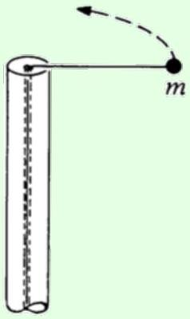
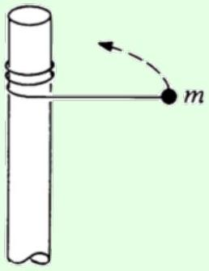
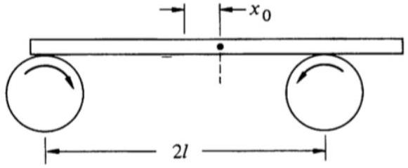
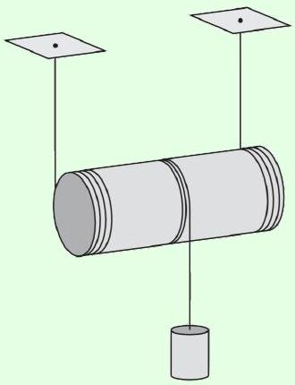

[1] Problem 5 ( $\boldsymbol { F } = \boldsymbol { m a } 2016$ ). The moment of inertia of a uniform equilateral triangle with mass $m$ and side length $a$ about an axis through one of its sides and parallel to that side is $m a ^ { 2 } / 8$. What is the moment of inertia of a uniform regular hexagon of mass $m$ and side length $a$ about an axis through two opposite vertices?

Solution. I include this question as an example of constructing a moment of inertia of a complex shape from pieces. There are much more complicated variants, but they're all the same idea.

Four of the triangles clearly each contribute $( m / 6 ) a ^ { 2 } / 8$. The other two each contribute

$$
\frac { m } { 6 } \left( a ^ { 2 } / 8 - ( a / 2 \sqrt { 3 } ) ^ { 2 } + ( a / \sqrt { 3 } ) ^ { 2 } \right) = 3 ( m / 6 ) a ^ { 2 } / 8
$$

where we did two consecutive applications of the parallel axis theorem. Thus, the total is

$$
I = \frac { m a ^ { 2 } } { 6 } ( 4 / 8 + 3 / 4 ) = \frac { 5 m a ^ { 2 } } { 24 } .
$$

## 3 Rotational Dynamics

In this section we'll consider some dynamic problems involving rotation.
Idea 3: Angular Momentum
For a system of particles we define the angular momentum and torque

$$
\mathbf { L } = \sum _ { i } \mathbf { r } _ { i } \times \mathbf { p } _ { i } , \quad \boldsymbol { \tau } = \sum _ { i } \mathbf { r } _ { i } \times \mathbf { F } _ { i } , \quad \boldsymbol { \tau } = \frac { d \mathbf { L } } { d t } .
$$

Using the first part of idea 1, we may write the angular momentum of a rigid body as

$$
\mathbf { L } = I \boldsymbol { \omega } , \quad K = \frac { 1 } { 2 } I \omega ^ { 2 }
$$

where $I$ is the moment of inertia about the instantaneous axis of rotation. Alternatively, using the second part,

$$
\mathbf { L } = I _ { \mathrm { CM } } \boldsymbol { \omega } + \mathbf { r } _ { \mathrm { CM } } \times M \mathbf { v } _ { \mathrm { CM } } , \quad K = \frac { 1 } { 2 } I _ { \mathrm { CM } } \omega ^ { 2 } + \frac { 1 } { 2 } M v _ { \mathrm { CM } } ^ { 2 }
$$

where $M$ is the total mass; the two terms are called "spin" and "orbital" contributions.
Both forms are useful in different situations. Systems cannot exert torques on themselves, provided they obey the strong form of Newton's third law: the force between two objects is equal and opposite, and directed along the line joining them.

## Idea 4

The idea above refers to taking torques about a fixed point, but often it is easier to consider a moving point $P$. Let $\mathbf { L }$ be the angular momentum about point $P$ in the frame of $P$, i.e. the frame whose axes don't rotate, but whose origin follows $P$ around. Working in this frame will produce fictitious forces, since $P$ can accelerate. Such forces act at the center of mass, just like gravity.

The upshot is that if $P$ is the center of mass, then the fictitious force in the frame of $P$ will produce no "fictitious torque". So it's safe to use $\boldsymbol { \tau } = d \mathbf { L } / d t$ about either a fixed point, or in the frame of the center of mass.

## Idea 5

There is a third, more confusing way of applying $\boldsymbol { \tau } = d \mathbf { L } / d t$ that you might rarely see: taking torques about the instantaneous center of rotation. In general, this doesn't work, because the instantaneous center of rotation can accelerate, producing an extra fictitious torque as mentioned above.

However, it turns out this procedure gives the correct answer if the object is instantaneously at rest. That's why taking torques about the contact point for the spool in M2 to find the initial angular acceleration was valid. It wouldn't have been valid at any instant afterward, after the spool had picked up some velocity.

For more discussion of this subtlety, which isn't mentioned in any textbooks I know of, see the paper Moments to be cautious of.

## Example 3: KK 6.13

A mass $m$ is attached to a post of radius $R$ by a string. Initially it is a distance $r$ from the center of the post and is moving tangentially with speed $v _ { 0 }$. In case (a) the string passes through a hole in the center of the post at the top. The string is gradually shortened by drawing it through the hole. In case (b) the string wraps around the outside of the post. Ignore gravity.

(a)

(b)

For each case, find the final speed of the mass when it hits the post.

## Solution

In case (a), the energy isn't conserved, since work is done on the mass as it moves inward. (Physically, we can see this by noting there could be a weight slowly descending on the other end of the string.) However, angular momentum conservation says $R v = r v _ { 0 }$, so $v = r v _ { 0 } / R$.

If you don't believe in angular momentum conservation yet, it's not too hard to show this with $F = m a$ as well. Let the tangential and radial speeds of the mass be $v _ { t }$ and $v _ { r }$, where $v _ { r } \ll v _ { t }$. Since $v _ { r }$ is nonzero, there is a component of acceleration parallel to the velocity,

$$
\frac { T } { m } \sin \theta \approx \frac { v _ { t } ^ { 2 } } { r } \frac { v _ { r } } { v _ { t } }
$$

and this is equal to the rate of change of speed, which to first order in $v _ { r } / v _ { t }$ is $d v _ { t } / d t$. Thus,

$$
\frac { d v _ { t } } { d t } = \frac { v _ { r } v _ { t } } { r } = - \frac { v _ { t } } { r } \frac { d r } { d t }
$$

from which we conclude $r v _ { t }$ is constant, as expected. (As mentioned in M2, you never need ideas like torque and angular momentum. Life is just harder without them.)

In case (b), the angular momentum about the axis of the pole isn't conserved, since the tension force has a lever arm about that axis. However, the mass's energy is conserved. A simple physical way to see this is to note that the massless string can't store any energy, and the post doesn't do work on the string, which means the string can't do any work on the mass. Thus, the final speed is just $v = v _ { 0 }$. (Of course, if you don't believe in energy conservation, you could get the same result by showing that the trajectory of the mass is always perpendicular to the string, though this takes more work.)

[2] Problem 6 (KK 6.9). A heavy uniform bar of mass $M$ rests on top of two identical rollers which are continuously turned rapidly in opposite directions, as shown.

The centers of the rollers are a distance $2 \ell$ apart. The coefficient of friction between the bar and the roller surfaces is $\mu$, a constant independent of the relative speed of the two surfaces. Initially the bar is held at rest with its center at distance $x _ { 0 }$ from the midpoint of the rollers. At time $t = 0$ it is released. Find the subsequent motion of the bar.

Solution. Let $N _ { 1 }$ be the normal force from the right roller, and $N _ { 2 }$ be the one from the left roller. Since there is no acceleration in the $y$-direction, we have $N _ { 1 } + N _ { 2 } = M g$. Also, since the bar is not rotating, the torque about the center is zero, so $N _ { 1 } \left( \ell - x _ { 0 } \right) = N _ { 2 } \left( \ell + x _ { 0 } \right)$. One quickly sees that the solution to this system is

$$
N _ { 1 } = \frac { M g \left( \ell + x _ { 0 } \right) } { 2 \ell } , \quad N _ { 2 } = \frac { M g \left( \ell - x _ { 0 } \right) } { 2 \ell } .
$$

Now, the friction force from the right roller points to the left with magnitude $N _ { 1 } \mu$, and the one from the left roller points to the right with magnitude $N _ { 2 } \mu$. Therefore, the total net force on this system is

$$
N _ { 1 } \mu - N _ { 2 } \mu = M g \mu \frac { x _ { 0 } } { \ell }
$$

to the left. This is simple harmonic motion with angular frequency $\omega = \sqrt { \mu g / \ell }$. This neat system is called a "friction oscillator", or "Timoshenko oscillator".
[2] Problem 7 (BAUPC). A mass is connected to one end of a massless string, the other end of which is connected to a very thin frictionless vertical pole. The string is initially wound completely around the pole, in a very large number of small horizontal circles, with the mass touching the pole. The mass is released, and the string gradually unwinds. What angle does the string make with the pole when it becomes completely unwound? (Though the setup is similar to that of example 3, you can't ignore gravity here.)

Solution. Let the string have length $\ell$, a final angle of $\theta$ with the pole, and final angular velocity $\omega = v / \ell \sin \theta$. As it unwinds, there is no source of energy loss so energy is conserved.

$$
g \ell \cos \theta = \frac { 1 } { 2 } v ^ { 2 }
$$

The components of the force on the mass from the string is a horizontal component for a centripetal force, and a vertical component to balance gravity,

$$
T \sin \theta = m \omega ^ { 2 } \ell \sin \theta , \quad T \cos \theta = m g .
$$

Solving yields

$$
\tan \theta = \frac { v ^ { 2 } } { g \ell \sin \theta } = \frac { 2 } { \tan \theta } .
$$

Thus, $\theta = \arctan ( \sqrt { 2 } ) \approx 54.74 ^ { \circ }$.

Example 4: MPPP 49
A uniform cylinder of mass $M$ and radius $R$ is attached to two identical strings. The strings are wound around the cylinder as shown, and their free ends are fastened to the ceiling.

A third cord is attached to and wound around the middle of the cylinder, and a mass $M$ is attached to the other side. There is sufficient friction so that the strings do not slip. Find the acceleration of the mass immediately after release.

Solution
Let $a$ be the downward acceleration of the center of mass of the cylinder, let $T _ { 1 }$ be the total tension in the first two strings, and let $T _ { 2 }$ be the tension in the third. The cylinder rolls without slipping about its contact axis with the first two strings, which means the downward acceleration of the mass is $a _ { \text {mass } } = 2 a$.

The Newton's second law equations are thus

$$
M a = T _ { 2 } + M g - T _ { 1 } , \quad 2 M a = M g - T _ { 2 }
$$

for the cylinder and mass. Taking torques about the axis of the cylinder gives

$$
\left( T _ { 1 } + T _ { 2 } \right) R = \frac { 1 } { 2 } M R ^ { 2 } \alpha
$$

and using $a = \alpha R$ converts this to

$$
M a = 2 T _ { 1 } + 2 T _ { 2 } .
$$

We now have three equations in three unknowns, so we can straightforwardly solve to find $a = ( 6 / 11 ) g$. This implies that the acceleration of the mass is

$$
a _ { \mathrm { mass } } = \frac { 12 } { 11 } g .
$$

Done, right? No, this is the wrong answer! Since the acceleration is greater than free fall, the tension $T _ { 2 }$ must be negative. But a string can't support a negative tension, so it instead goes slack. The mass thus free falls, so $a _ { \text {mass } } = g$.

In retrospect, we could have seen this conclusion with less work. Suppose the mass were not attached. Then the acceleration of the cylinder can be computed with the standard rolling

without slipping formula,

$$
a = \frac { g \sin \theta } { 1 + \beta } = \frac { g } { 1 + \beta } , \quad I = \beta M R ^ { 2 } .
$$

For any (axially symmetric) mass distribution in the cylinder, we have $0 \leq \beta \leq 1$. The acceleration of the part where the mass would have been attached is hence

$$
a _ { \mathrm { mass } } = \frac { 2 g } { 1 + \beta } \geq g .
$$

This implies that any string we attach there must go slack immediately after release.
