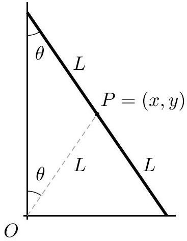
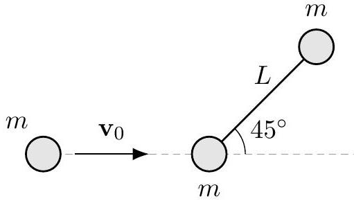
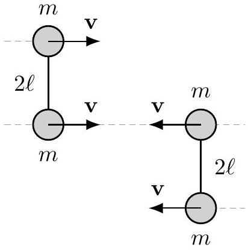
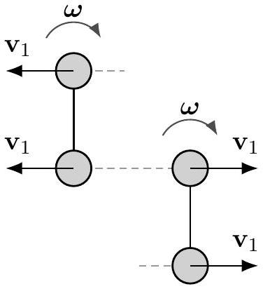

[2] Problem 15. A uniform stick of length $L$ and mass $M$ begins at rest. A massless rocket is attached to one end of the stick, and provides a constant force $F$ perpendicular to the stick. Find an expression for the speed of the center of mass of the stick after a long time, in terms of a single integral. Is this quantity finite or infinite? If finite, give a rough estimate for it.

Solution. The uniform stick has moment of inertia $M L ^ { 2 } / 12$ about its center, and has a constant torque of $\tau = F L / 2$ about its center. Thus if $\theta$ is the angular distance the stick has rotated, then

$$
\frac { F L } { 2 } = \frac { 1 } { 12 } M L ^ { 2 } \ddot { \theta }
$$

which implies

$$
\ddot { \theta } = \frac { 6 F } { M L } , \quad \theta = \frac { 3 F } { M L } t ^ { 2 } \equiv c t ^ { 2 } .
$$

Let the plane of motion of the stick be the complex plane, let the initial position of the center of mass be the origin, and let the angle between the stick and the real axis be $\theta + \pi / 2$ so the force points at an angle $\theta$. Then in the complex plane, the unit vector of the force is just $e ^ { i \theta }$, so

$$
M a = F e ^ { i c t ^ { 2 } } .
$$

This trick of using complex numbers allows us to write the two real components of Newton's second law as a single equation. We thus conclude that

$$
\left| v _ { f } \right| = \frac { F } { M } \left| \int _ { 0 } ^ { \infty } e ^ { i c t ^ { 2 } } d t \right|
$$

Naively, this looks infinite because the integration range is infinite, and the integrand doesn't go to zero at infinity. However, as time goes on, the stick will rotate faster and faster, so the acceleration will spin faster, so the endpoint of the velocity vector moves in tighter and tighter circles. So even though the magnitude of the acceleration never gets smaller, the velocity does approach a finite limit. To find this quantity, we can use dimensional analysis to get

$$
\left| v _ { f } \right| \sim \sqrt { \frac { F L } { M } } .
$$

That's all the problem asked for, but one can get an exact answer too. Recall from P1 that

$$
\int _ { 0 } ^ { \infty } e ^ { - ( a x ) ^ { 2 } } d x = \frac { \sqrt { \pi } } { 2 a }
$$

for $a > 0$. In our case we need $a ^ { 2 } = - i c$, but it turns out the result above still works. (The proof of this requires some complex analysis.) We then have

$$
\frac { M } { F } v _ { f } = \int _ { 0 } ^ { \infty } e ^ { i c t ^ { 2 } } d t = \int _ { 0 } ^ { \infty } e ^ { - \left( \pm \frac { - 1 + i } { \sqrt { 2 } } \sqrt { c } t \right) ^ { 2 } } d t = \pm \frac { \sqrt { \pi } } { 2 ( - 1 + i ) \sqrt { c / 2 } }
$$

from which we conclude the final speed is

$$
\left| v _ { f } \right| = \frac { F \sqrt { \pi } } { 2 M \sqrt { c } } = \sqrt { \frac { \pi F L } { 12 M } } .
$$

[4] Problem 16 (KK 6.41). A plank of length $2 L$ leans nearly vertically against a wall. All surfaces are frictionless. The plank starts to slip downward. Find the height of the top of the plank when it loses contact with the wall or floor.

Solution. Note that the normal forces at the contact points do no work, since the plank moves in the perpendicular directions at those points. Therefore, mechanical energy is conserved.

The center of mass $P$ moves in a circle of radius $L$ around $O$, and its speed is $L \dot { \theta }$. Similarly, one also sees that the plank rotates around $P$ at angular velocity $\dot { \theta }$ counterclockwise. Therefore, if the plank starts at $\theta _ { 0 }$, energy conservation implies

$$
m g L \left( \cos \theta _ { 0 } - \cos \theta \right) = \frac { 1 } { 2 } m L ^ { 2 } \dot { \theta } ^ { 2 } + \frac { 1 } { 2 } \left( \frac { 1 } { 3 } m L ^ { 2 } \right) \dot { \theta } ^ { 2 } = \frac { 2 } { 3 } m L ^ { 2 } \dot { \theta } ^ { 2 } ,
$$

so

$$
\dot { \theta } ^ { 2 } = \frac { 3 g } { 2 L } \left( \cos \theta _ { 0 } - \cos \theta \right) .
$$

Taking the time derivative, we obtain

$$
2 \dot { \theta } \ddot { \theta } = \frac { 3 g } { 2 L } \sin \theta \dot { \theta } \Longrightarrow \ddot { \theta } = \frac { 3 g } { 4 L } \sin \theta .
$$

The plank loses contact when the normal force $N _ { x }$ at the high point of contact vanishes. By Newton's second law, $N _ { x } = m \ddot { x }$, so $N _ { x } = 0$ when $\ddot { x } = 0$. We also know that $x = L \sin \theta$, so $\dot { x } = L \cos \theta \dot { \theta }$, so $\ddot { x } = L \left( \cos \theta \ddot { \theta } - \sin \theta \dot { \theta } ^ { 2 } \right)$. Therefore, we have

$$
\cos \theta \ddot { \theta } = \sin \theta \dot { \theta } ^ { 2 }
$$

when contact is lost. Plugging in our earlier results, we find

$$
\frac { 3 g } { 4 L } \sin \theta \cos \theta = \frac { 3 g } { 2 L } \left( \cos \theta _ { 0 } - \cos \theta \right) \sin \theta ,
$$

or $\cos \theta = \frac { 2 } { 3 } \cos \theta _ { 0 }$, so $y = \frac { 2 } { 3 } y _ { 0 }$. This implies the ladder loses contact once its top reaches 2/3 of its original height. (For completeness, we could check that the plank actually loses contact with the wall before losing contact with the floor. This is intuitive, but it can be checked explicitly by computing $\ddot { y }$ and thereby $N _ { y }$.)

There is a slick alternative solution using Lagrangian mechanics, though it's subtle enough that I wouldn't recommend trying it in a competition. We note that the center of mass moves on a circle centered at the origin, and that the total kinetic energy of the ladder is proportional to $\dot { \theta } ^ { 2 }$. In particular, we have a Lagrangian of

$$
\mathcal { L } = \frac { 1 } { 2 } m _ { \mathrm { eff } } L ^ { 2 } \dot { \theta } ^ { 2 } - m g L \cos \theta , \quad m _ { \mathrm { eff } } = \frac { 4 } { 3 } m
$$

where the extra contribution in the first term is due to rotational kinetic energy. Multiplying the Lagrangian by $3 / 4$, which makes no difference to the equations of motion, we get

$$
\mathcal { L } = \frac { 1 } { 2 } m L ^ { 2 } \dot { \theta } ^ { 2 } - m \left( \frac { 3 g } { 4 } \right) L \cos \theta .
$$

However, this is simply the Lagrangian for a mass $m$ sliding on a frictionless hemisphere in gravity $3 g / 4$. This is a classic, simple problem, and we know in that case that the normal force with the hemisphere vanishes at height $( 2 / 3 ) L$.

Now, the motion of the mass in this problem is identical to the motion of the center of mass of the ladder in the original problem, so the total external forces are the same. In particular, the horizontal constraint force must vanish when the ladder's center of mass is at height $( 2 / 3 ) L$, so the ladder loses contact with the wall at this point. On the other hand, the vertical external force must be $3 m g / 4$, which implies the normal force with the ground is $m g / 4$, and hence positive; this shows that the ladder has not lost contact with the ground.

Example 7: NBPhO 2013
A uniform ball and a uniform ring are both released from rest from the same height on an inclined plane with inclination angle $\theta$. They arrive at the bottom of the plane in time $T _ { B }$ and $T _ { R }$, respectively. The coefficients of friction of both objects with the plane are $\mu _ { k } = 0.3$ and $\mu _ { s } = 0.5$. Find the ratio $T _ { B } / T _ { R }$ as a function of the angle $\theta$.

Solution
When rolling without slipping, the acceleration of an object with moment of inertia $\beta m R ^ { 2 }$ about its center of mass is

$$
a = \frac { g \sin \theta } { 1 + \beta }
$$

as mentioned in a previous example. The tangential force from friction is thus

$$
f = m g \sin \theta \frac { \beta } { 1 + \beta }
$$

which means rolling without slipping occurs when

$$
\mu _ { s } m g \cos \theta \geq m g \sin \theta \frac { \beta } { 1 + \beta }
$$

or equivalently

$$
\tan \theta \leq \mu _ { s } \frac { 1 + \beta } { \beta } .
$$

For the ball, this is when $\theta \leq 60.3 ^ { \circ }$, and for the ring $\theta \leq 45 ^ { \circ }$. Whenever either object slips, its acceleration is instead $a = g \left( \sin \theta - \mu _ { k } \cos \theta \right)$.

Since the motion is uniformly accelerated, $T _ { B } / T _ { R } = \sqrt { a _ { R } / a _ { B } }$. For $\theta \leq 45 ^ { \circ }$, both roll without slipping, so the formula above applies, giving a ratio of

$$
\frac { T _ { B } } { T _ { R } } = \sqrt { \frac { 1 + \beta _ { B } } { 1 + \beta _ { R } } } = \sqrt { \frac { 7 } { 10 } } .
$$

For $\theta \geq 60.3 ^ { \circ }$ they both slip, so the ratio is unity. For the angles in between, the ring slips, giving a slightly more complicated expression. At the boundaries between these three regimes, the ratio $T _ { B } / T _ { R }$ jumps discontinuously.

The next two problems require careful thought, and test your understanding of the multiple ways to describe rotational kinematics and dynamics. It will be useful to review idea 1.
[3] Problem 17. USAPhO 1999, problem B1.
[3] Problem 18. USAPhO 2019, problem B3. It's worth reading the solution carefully afterward.

## 4 Rotational Collisions

Idea 7: Angular Impulse
During a collision with impulse J, the angular momentum changes by the "angular impulse" $\mathbf { r } \times \mathbf { J }$. In many problems involving collisions which conserve angular momentum, energy is necessarily lost in the collision process. This is another example of an inherently inelastic process, an idea we first encountered in M3.
[3] Problem 19 (Morin 8.22). A uniform ball of radius $R$ and mass $m$ rolls without slipping with speed $v _ { 0 }$. It encounters a step of height $h$ and rolls up over it.

(a) Assuming that the ball sticks to the step during this process, show that for the ball to climb over the step,
$$
v _ { 0 } \geq \sqrt { \frac { 10 g h } { 7 } } \left( 1 - \frac { 5 h } { 7 R } \right) ^ { - 1 } .
$$
(b) Energy is lost to heat by the inelastic collision of the ball with the step. In the limit of small $h$, how much heat is produced?

Solution. (a) Let $\beta = 2 / 5$. Once the ball collides with the corner, it momentarily rotates around that corner, and we will first find the initial angular velocity of the rotation of the ball around the corner. Note that angular momentum about the corner is conserved, since the only relevant force during the very short collision time is the large force applied at the corner, so the net torque is zero. This is an inherently inelastic process; energy is lost during this collision.
Right before the collision, the angular momentum is the sum of orbital and spin contributions,

$$
L _ { i } = \beta m R ^ { 2 } \frac { v _ { 0 } } { R } + R m v _ { 0 } ( 1 - h / R ) ,
$$

since the sine of the angle between $\mathbf { p }$ and $\mathbf { R }$ is $1 - h / R$. Let the angular velocity about the corner be $\omega$. Then the final angular momentum is

$$
L _ { f } = ( 1 + \beta ) m R ^ { 2 } \omega ,
$$

so equating the two tells us that

$$
R \omega = \frac { \beta + 1 - h / R } { \beta + 1 } v _ { 0 } = \left( 1 - \frac { 1 } { \beta + 1 } \frac { h } { R } \right) v _ { 0 } .
$$

Now, as the ball rotates about the corner, energy is conserved, so the only way that the ball will make it to the top is if its kinetic energy is at least $m g h$. Therefore,
$$
\frac { 1 } { 2 } ( \beta + 1 ) m R ^ { 2 } \omega ^ { 2 } \geq m g h \Longrightarrow \frac { 1 } { 2 } ( \beta + 1 ) \left( 1 - \frac { 1 } { \beta + 1 } \frac { h } { R } \right) ^ { 2 } v _ { 0 } ^ { 2 } \geq g h .
$$
Simplifying gives the desired answer.
(b) The initial kinetic energy of the ball is $\frac { 1 } { 2 } ( 1 + \beta ) m v _ { 0 } ^ { 2 }$. We can use the previously found equation
$$
v _ { f } = R \omega = \left( 1 - \frac { 1 } { \beta + 1 } \frac { h } { R } \right) v _ { 0 } ,
$$
which helps us find the kinetic energy immediately after the inelastic collision $\frac { 1 } { 2 } ( 1 + \beta ) m v _ { f } ^ { 2 }$. Thus the kinetic energy dissipated into heat is
$$
\Delta Q = \frac { 1 } { 2 } ( 1 + \beta ) m \left( v _ { 0 } ^ { 2 } - v _ { f } ^ { 2 } \right) = \frac { 1 } { 2 } ( 1 + \beta ) m v _ { 0 } ^ { 2 } \left( 1 - \left( 1 - \frac { 1 } { 1 + \beta } \frac { h } { R } \right) ^ { 2 } \right) .
$$
Using the binomial approximation, we conclude
$$
\Delta Q \approx \frac { 1 } { 2 } ( 1 + \beta ) m v _ { 0 } ^ { 2 } \left( \frac { 2 h } { ( 1 + \beta ) R } \right) = \frac { m v _ { 0 } ^ { 2 } h } { R } .
$$
Interestingly, the ratio of this to the amount of gravitational potential energy needed to climb the step, which is $m g h$, is independent of $h$. So even if we turn a big step into many small steps, it'll still be substantially less efficient than a smooth slope. Of course, at some point the approximations in this problem break down (the ball deforms, so it can't be regarded as touching only one step at once), so that the slope is effectively smooth.
[3] Problem 20 (KK 6.38). A rigid massless rod of length $L$ joins two particles, each of mass $m$. The rod lies on a frictionless table, and is struck by a particle of mass $m$ and velocity $v _ { 0 }$ as shown.

After an elastic collision, the projectile moves straight back. Find the angular velocity of the rod about its center of mass after the collision.
Solution. Suppose the projectile moves back with speed $v _ { 1 }$, the center of mass speed of the dumbbell is $V$, and its angular velocity about its center of mass is $\omega$. Then, momentum, angular momentum, and energy conservation yield
$$
\begin{aligned}
m v _ { 0 } = - m v _ { 1 } + 2 m V & \Longrightarrow v _ { 0 } + v _ { 1 } = 2 V \\
m v _ { 0 } L / 2 \sqrt { 2 } = \left( m L ^ { 2 } / 2 \right) \omega - m v _ { 1 } L / 2 \sqrt { 2 } & \Longrightarrow v _ { 0 } + v _ { 1 } = \sqrt { 2 } L \omega \\
m v _ { 0 } ^ { 2 } = m v _ { 1 } ^ { 2 } + 2 m V ^ { 2 } + \left( m L ^ { 2 } / 2 \right) \omega ^ { 2 } & \Longrightarrow \left( v _ { 0 } - v _ { 1 } \right) \left( v _ { 0 } + v _ { 1 } \right) = 3 V ^ { 2 } .
\end{aligned}
$$

Combining the first and last equations implies $v _ { 0 } - v _ { 1 } = ( 3 / 2 ) V$, so $2 v _ { 0 } = ( 7 / 2 ) V$, so $V = \frac { 4 } { 7 } v _ { 0 }$. Using the second equation gives

$$
L \omega = \sqrt { 2 } V = \frac { 4 \sqrt { 2 } } { 7 } v _ { 0 } , \quad \omega = \frac { 4 \sqrt { 2 } } { 7 } \frac { v _ { 0 } } { L } .
$$

[3] Problem 21 (PPP 47). Two identical dumbbells move towards each other on a frictionless table.

Each consists of two point masses $m$ joined by a massless rod of length $2 \ell$. The dumbbells collide elastically as shown; describe what happens afterward.
Solution. Immediately after the collision, the dumbbells move in the opposite direction at $v _ { 1 }$, and have angular velocity $\omega > 0$.

Angular momentum and energy conservation yield
$$
\begin{aligned}
4 m \ell ^ { 2 } \omega - 4 m v _ { 1 } \ell & = 4 m v \ell \\
2 m v _ { 1 } ^ { 2 } + 2 m \ell ^ { 2 } \omega ^ { 2 } & = 2 m v _ { 1 } + v = \ell \omega , \\
& \Longrightarrow \left( v - v _ { 1 } \right) \left( v + v _ { 1 } \right) = \ell ^ { 2 } \omega ^ { 2 } .
\end{aligned}
$$
Therefore, $v - v _ { 1 } = \ell \omega$, so $v _ { 1 } = 0$. So the rods just rotate at angular velocity $v / \ell$.
Once both rods rotate 180°, they collide again. By using the reasoning of the first collision in reverse, the rods simply lose their angular velocity and regain their original translational velocities. Therefore, the final result is that both rods translate uniformly, as if they passed right through each other, but both rods are flipped upside down.
[3] Problem 22. USAPhO 2014, problem B1.
[3] Problem 23. EuPhO 2024, problem 1. A nice exercise on the process of a rotational collision.
[4] Problem 24. EuPhO 2018, problem 1. An elegant rotation problem.

## 5 Rotational Oscillations

In this section we'll consider small oscillations problems involving rotation.
Idea 8
A physical pendulum is a rigid body of mass $m$ pivoted a distance $d$ from its center of mass, with moment of inertia $I$ about the pivot. When considering physical pendulums, we always assume the pivot exerts no torque on the pendulum; that is, it is a "simple support", providing no bending moment, as discussed in M2. This is a good approximation if the pivot is smooth and small. In this case, the angular frequency for small oscillations is

$$
\omega = \sqrt { \frac { m g d } { I } } .
$$

For some neat real-world applications of this formula, see this paper.
