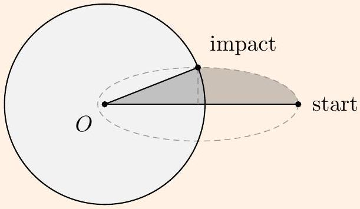
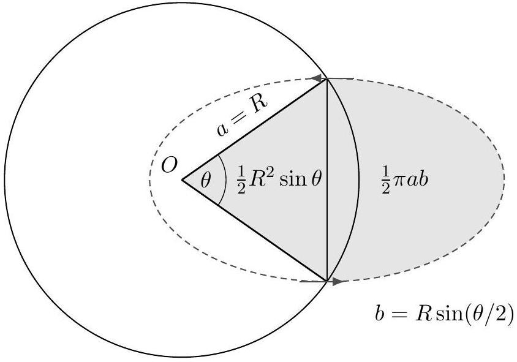
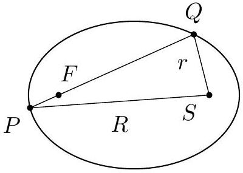

Example 5
An object is dropped from rest at a distance $R$ above the Earth's surface, where $R$ is the radius of the Earth. How long does it take to hit the Earth's surface?

Solution
The answer doesn't change much if we give the object a tiny horizontal velocity. In this case, the orbit becomes a part of a very thin ellipse, where $a \approx d \approx \ell$, with one focus at the center of the Earth (by the shell theorem) and the other near the starting point.

If the Earth were replaced by a point mass at its center, then the object could perform a full orbit, with total period $T$. The time until the object actually hits the Earth's surface is determined by the fraction of the orbit's area swept out. Referring to the diagram, this is

$$
t = T \frac { \pi a b / 4 + a b / 2 } { \pi a b } = T \left( \frac { 1 } { 4 } + \frac { 1 } { 2 \pi } \right)
$$

by summing a quarter of an ellipse and a triangle. All that's left is to solve for $T$. Note that the semimajor axis is $R$. Another orbit with the same semimajor axis is simply a circular orbit around the Earth, just above its surface. This orbit has

$$
\frac { v ^ { 2 } } { R } = \frac { G M } { R ^ { 2 } }
$$

so $v = \sqrt { G M / R }$. Using $T = 2 \pi R / v$ gives the answer,

$$
t = \left( \frac { \pi } { 2 } + 1 \right) \sqrt { \frac { R ^ { 3 } } { G M } } .
$$

Of course, you can get the same answer by directly solving Newton's laws.

Example 6: MPPP 39
An astronaut jumps out of the international space station directly towards the Earth. What happens afterward? In particular, will the astronaut survive?

Solution
If you've seen certain movies, you might get the impression that the astronaut spirals into the Earth, and so will surely die. But that isn't what Kepler's laws say! After the jump, the astronaut simply performs a Keplerian orbit. Since the change in energy is negligible, so is the change in semimajor axis and hence the change in period. The astronaut simply orbits in a nearly circular ellipse, with the same period as the space station.

After one rotation period of the space station, which takes time $T = 92 \mathrm {~min}$, the astronaut arrives back. They are unharmed as long as their oxygen and cooling supply lasts this long. (If you draw some pictures of the orbits, you may think the answer is T/2, because the orbits intersect twice. This is incorrect because while the orbits do intersect geometrically halfway through, the space station and the astronaut won't arrive at that point at the same time.)

Example 7: Wang and Ricardo 8.4
A particle moves in a circle of radius $R$, under the influence of a central force. If its minimum and maximum speeds are $v _ { 1 }$ and $v _ { 2 }$, what is the period $T$ ?

Solution
At first the problem statement might sound confusing, until you realize that the origin need not be at the center of the circle; it must be off-center. Now, it would be intractable to find the trajectory for a general central force law, but we can infer $T$ by thinking about how quickly area is swept out, as in Kepler's second law. This works because conservation of angular momentum holds for all central force laws, not just the inverse square.

At the furthest and closest points, the distances from the origin must be $r _ { 1 }$ and $r _ { 2 }$, and by

conservation of angular momentum, the speeds $v _ { 1 }$ and $v _ { 2 }$ are achieved at these points, so
$$
r _ { 1 } v _ { 1 } = r _ { 2 } v _ { 2 } , \quad r _ { 1 } + r _ { 2 } = 2 R , \quad \frac { d A } { d t } = \frac { 1 } { 2 } r _ { 1 } v _ { 1 } .
$$
Using the first two equations, we can solve for $r _ { 1 }$ and plug it into the third, for
$$
r _ { 1 } = \frac { 2 R } { 1 + v _ { 1 } / v _ { 2 } } , \quad \frac { d A } { d t } = \frac { R } { 1 / v _ { 1 } + 1 / v _ { 2 } } .
$$
Since $d A / d t = \pi R ^ { 2 } / T$, we have
$$
T = \pi R \left( \frac { 1 } { v _ { 1 } } + \frac { 1 } { v _ { 2 } } \right) .
$$
[3] Problem 8 (PPP 88). A rocket is launched from and returns to a spherical planet of radius $R$ so that its velocity vector on return is anti-parallel to its velocity vector at launch. The angular separation at the center of the planet between the launch and arrival points is $\theta$. How long does the flight take, if the period of a satellite flying around the planet just above its surface is $T _ { 0 }$ ?

Solution. The trajectory is an ellipse with a focus at the planet's center, and by drawing a diagram, you can see that the provided condition is only possible if the initial and final points of the trajectory are the two ends of the ellipse's minor axis.

By basic properties of ellipses, this implies that the semimajor axis $a$ of the ellipse is $R$, so the period of the whole orbit would be $T _ { 0 }$, if the rocket could perform the entire orbit. Thus, $T / T _ { 0 }$ is equal to the fraction of the ellipse's area that is swept out between the initial and final points.

By basic geometry, we have $A = \frac { 1 } { 2 } A _ { 0 } + \frac { 1 } { 2 } a ^ { 2 } \sin \theta$ while $A _ { 0 } = \pi a b = \pi a ^ { 2 } \sin \frac { \theta } { 2 }$ is the area of the full ellipse. Thus,

$$
T = \frac { A } { A _ { 0 } } T _ { 0 } = \left( \frac { 1 } { 2 } + \frac { \cos \theta / 2 } { \pi } \right) T _ { 0 } .
$$

[4] Problem 9 (Physics Cup 2012). A cannon at the equator fires a cannonball, which hits the North pole. Neglecting air resistance and the Earth's rotation, at what angle to the horizontal should the cannonball be fired to minimize the required speed?

Solution. The answer is $\pi / 8 = 22.5 ^ { \circ }$. See the solutions here.

[4] Problem 10 (NBPhO 2015). An asteroid is initially stationary, a distance $R$ from a star of mass $M$. The asteroid suddenly explodes into many pieces, with speed ranging from zero to $v _ { 0 }$. What is the set of all points that can be hit by a piece of the asteroid? (Hint: this problem requires more geometry than the rest. For simplicity, you can begin by treating the problem as two-dimensional, but the solution you find will work just as well for three.)
Solution. Consider a given piece of the asteroid, with speed $v _ { 0 }$. Its trajectory is an ellipse of major axis $2 a$, where $a$ satisfies
$$
\frac { 1 } { 2 } m v _ { 0 } ^ { 2 } - \frac { G M m } { R } = - \frac { G M m } { 2 a } .
$$
Let $S$ be the position of the sun, and let $P$ be the original point of the asteroid. Let $F$ be the other focus of this elliptical trajectory. By the definition of an ellipse, $S P + F P = 2 a$, so $F P = 2 a - R$.

Let $Q$ be a point that is reached by the piece, and suppose $S Q = r$. By the triangle inequality,
$$
P Q \leq P F + F Q = 2 a - R + 2 a - r = 4 a - r - R .
$$
Therefore, we see that
$$
Q P + Q S \leq 4 a - R .
$$
This constraint applies to all points $Q$ that can be hit. Thus, the points that can be hit lie within an ellipse with foci at the sun and the asteroid, with major axis $4 a - R$.
Is it possible to hit every point in this ellipse? It's intuitive that it's sufficient to show that we can hit every point on the boundary, since that's the hardest thing to do; points inside can be reached by launching with reduced speed. Let $Q$ be a given point on the boundary. Then the inequalities above become equalities as long as $P Q = P F + F Q$, which occurs when $F$ is on $P Q$. So the question is reduced to whether we can put the other focus of the orbit at any angle we want, relative to $P$. If you play around with a few drawings of orbits, you can see this is always possible by varying the launch angle, no matter what the launch speed is, so we can get the full ellipse.
In three dimensions, the answer is the set of points enclosed by rotating the ellipse about the axis $P S$. The resulting shape is called a spheroid. In the limit $R \rightarrow \infty$, where the star's gravitational field is uniform, the shape becomes a paraboloid, recovering a result from M1.
Idea 7: Reduced Mass
Consider two objects of mass $m _ { 1 }$ and $m _ { 2 }$ with positions $\mathbf { r } _ { 1 }$ and $\mathbf { r } _ { 2 }$ with relative position $\mathbf { r } = \mathbf { r } _ { 1 } - \mathbf { r } _ { 2 }$, interacting by a central potential $V ( r )$. For the purposes of computing r alone, we may replace this system with a single mass $\mu$ in the same central potential $V ( r )$, where $\mu$ is the reduced mass, obeying
$$
\frac { 1 } { \mu } = \frac { 1 } { m _ { 1 } } + \frac { 1 } { m _ { 2 } } .
$$
Both systems have the same solutions for $\mathbf { r } ( t )$.
