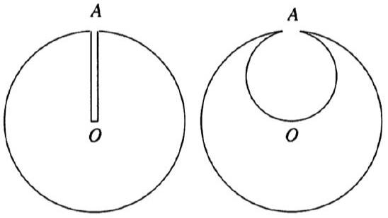
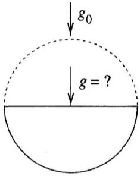

## Mechanics VI: Gravitation

Chapters 8 and 9 of Kleppner and Kolenkow cover orbits and fictitious forces, as do chapters 8 and 11 of Wang and Ricardo, volume 1, and chapters 7 and 10 of Morin. For much more, see chapters 2 and 3 of Galactic Dynamics by Binney and Tremaine. There is a total of 88 points.

## 1 Computing Fields

Idea 1
Gravitational fields obey the shell theorem and the superposition principle, which is sufficient to find the field in a variety of setups. One useful trick is to think of objects with holes as superpositions of objects without holes, and holes with negative mass.

[3] Problem 1 (PPP 110). A spaceship of titanium-devouring little green people has found a perfectly spherical homogeneous asteroid. A narrow trial shaft was bored from point A on its surface to the center O of the asteroid. At that point, one of the little green men fell off the surface of the asteroid into the trial shaft. He fell, without any braking, until he reached O, where he died on impact.

However, work continued and the little green men started secret excavation of the titanium, in the course of which they formed a spherical cavity of diameter AO inside the asteroid. Then a second accident occurred: another little green man similarly fell from point A to point O, and died. Find the ratio of the impact speeds, and total times for impact, of the two little green men.
Solution. We can find the final speeds using conservation of energy. The only difference between the two cases is the mass in the spherical cavity. However, the potential energy due to this mass is the same at points $A$ and $O$, so it doesn't affect the overall change in potential energy. Thus, the impact speeds are equal.
To find the impact times, we need to think about the forces. By recycling results from E1 using the shell theorem, we know that in the first case, the acceleration is $- \alpha \mathbf { r }$ for some constant $\alpha$. Then the motion is simple harmonic, and the time is a quarter period,
$$
t _ { 1 } = \frac { \pi } { 2 } \frac { 1 } { \sqrt { \alpha } } .
$$
In the second case, the acceleration is $- \alpha \mathbf { r } + \alpha ( \mathbf { r } - \mathbf { m } ) = - \alpha \mathbf { m }$ where m is the vector that points from $O$ to the center of the spherical cavity. Then the motion is uniformly accelerated, so
$$
t _ { 2 } = \frac { 2 } { \sqrt { \alpha } }
$$
so $t _ { 1 } / t _ { 2 } = \pi / 4$.

[3] Problem 2 (PPP 111). The titanium-devouring little green people of the previous problem continued their excavating. As a result of their environmentally destructive activity, half of the asteroid was soon used up, as shown.

What is the gravitational acceleration at the center of the circular face of the remaining hemisphere if the gravitational acceleration at the surface of the original spherical asteroid was $g _ { 0 }$ ? (This can be done without any integrals.)
Solution. We can decompose the hemisphere into many shells of uniform thickness $d r$. Each shell contributes the same amount, since the mass increases as the square of its radius. Therefore, it suffices to find the contribution of the outermost hemispherical shell, which is $\pi G \sigma = \pi G \rho d r$ by the hemisphere trick of E1. Integrating over $d r$ gives a factor of $R$, giving
$$
g = \pi G \rho R = \frac { 3 } { 4 } g _ { 0 } .
$$
We can also solve the problem more straightforwardly by integration. In spherical coordinates,
$$
\mathbf { g } = \int _ { 0 } ^ { R } \int _ { 0 } ^ { \pi / 2 } \int _ { 0 } ^ { 2 \pi } \frac { G \rho \hat { \mathbf { r } } } { r ^ { 2 } } r ^ { 2 } \sin \theta d \phi d \theta d r
$$
By symmetry, only the $\hat { \mathbf { z } }$ component of $\hat { \mathbf { r } }$ will survive, so we can replace $\hat { \mathbf { r } }$ with $\hat { \mathbf { z } } \cos \theta$. Thus,
$$
\begin{aligned}
\mathbf { g } & = \hat { \mathbf { z } } \int _ { 0 } ^ { R } \int _ { 0 } ^ { \pi / 2 } \int _ { 0 } ^ { 2 \pi } \frac { G \rho } { r ^ { 2 } } ( \cos \theta ) r ^ { 2 } \sin \theta d \phi d \theta d r \\
& = 2 \pi G \rho R \hat { \mathbf { z } } \int _ { 0 } ^ { \pi / 2 } \sin \theta \cos \theta d \theta = \pi G \rho R \hat { \mathbf { z } }
\end{aligned}
$$
as we argued above.
[2] Problem 3. Consider a fixed volume of a moldable material, with a fixed density. Describe the shape it should take to maximize the gravitational field at the origin.
Solution. Without loss of generality, we suppose the field will point along $\hat { \mathbf { z } }$, so that it suffices to maximize $g _ { z }$. Clearly, we will want all the mass to lie above the plane $z = 0$.
Now, setting up spherical coordinates in the usual way, note that the contribution of mass at a point to $g _ { z }$ is proportional to $\cos \theta / r ^ { 2 }$. Therefore, we should first put mass at the locations with the highest $\cos \theta / r ^ { 2 }$, then progressively lower values, until we run out of mass. Then when we're done, the surface of the shape will have constant $\cos \theta / r ^ { 2 }$ (because if it didn't, we could do better by moving some mass around).
For more discussion of this classic problem, and a plot of the solution, see this article.

Idea 2: The Shell Theorems
Newton proved three "shell" theorems using elegant geometrical arguments.

1. Inside a uniform spherical shell, there is no gravitational field. (At the time, this was an important result primarily because it meant that Hell couldn't be at the center of the Earth; if it were, the fire and brimstone would be floating around.)
2. Outside a uniform spherical shell of total mass $m$, the gravitational field is the same as that of a point mass $m$ at its center. (Of course, this is important because it's required to think about the Earth's gravity at all.)
3. A homoeoid is a shell-like region defined by
$$
1 < \frac { x ^ { 2 } } { a ^ { 2 } } + \frac { y ^ { 2 } } { b ^ { 2 } } + \frac { z ^ { 2 } } { c ^ { 2 } } < 1 + \epsilon
$$
for some constant $\epsilon$. If this homoeoid has uniform density, then the gravitational field vanishes everywhere inside it, i.e. at all points $x ^ { 2 } / a ^ { 2 } + y ^ { 2 } / b ^ { 2 } + z ^ { 2 } / c ^ { 2 } < 1$. (This reduces to the first theorem in the limit $a = b = c$ and $\epsilon \rightarrow 0$. The gravitational field outside the homoeoid is more complicated, so there's no generalization of the second theorem. As you might expect, the third theorem is less useful than the others.)

Example 1
Newton was aware that similar shell theorems hold for linear force laws, $F ( r ) \propto r$. How are his first two theorems modified in this case?

Solution
Consider a spherical shell centered at the origin, and a test mass at $\mathbf { r } _ { 0 }$. The contribution to the force due to a piece of the shell at r is $\mathbf { F } \propto \mathbf { r } - \mathbf { r } _ { 0 }$. When we integrate over the shell, $\mathbf { r }$ averages to zero, giving $\mathbf { F } \propto - \mathbf { r } _ { 0 }$, which is precisely the result for a mass exactly at the center of the shell. That is, for a linear force law, Newton's first theorem doesn't work; instead the second theorem's result applies both inside and outside the shell.

Example 2
Prove the converse of Newton's second theorem: outside of a spherical shell, its gravitational field is equivalent to a point mass at its center only if $F ( r )$ is proportional to $r$, proportional to $r ^ { - 2 }$, or a linear combination of the two.

Solution
It's easiest to consider the potential outside the shell. Let the shell of mass $m$ be centered at the origin with radius $R$, and consider the potential at a distance $z > R$ from the origin. If a point mass produces a gravitational potential $f ( r ) d m$ at separation $r$, then integrating

over the sphere in spherical coordinates gives

$$
V ( z ) = \frac { m } { 4 \pi R ^ { 2 } } \int _ { 0 } ^ { \pi } \left( 2 \pi R ^ { 2 } \sin \theta d \theta \right) f \left( \sqrt { z ^ { 2 } + R ^ { 2 } - 2 z R \cos \theta } \right)
$$

The trick is to switch variables to the separation $r = \sqrt { z ^ { 2 } + R ^ { 2 } - 2 z R \cos \theta }$, since

$$
r d r = z R \sin \theta d \theta .
$$

Plugging this in gives

$$
V ( z ) = \frac { m } { 2 z R } \int _ { z - R } ^ { z + R } r f ( r ) d r .
$$

Newton's second theorem works precisely when $d V / d z$ is independent of $R$, so that the shell radius can be collapsed to zero without changing the force.

Suppose $f ( r )$ is proportional to $r ^ { n }$. Then we have

$$
V ( z ) \propto \frac { ( z + R ) ^ { n + 2 } - ( z - R ) ^ { n + 2 } } { z R }
$$

and the force's dependence on $R$ only drops out in three cases: when $n = - 1$ (an inverse square force), $n = 0$ (the trivial case, corresponding to no force), and $n = 2$ (a linear force). The first two are easy to see, while for the final case we have

$$
V ( z ) \propto \frac { 8 z ^ { 3 } R + 8 z R ^ { 3 } } { z R } \propto z ^ { 2 } + R ^ { 2 }
$$

so that $R$ drops out of $d V / d z$, as required. Since any reasonable function can be built by superposing such power laws, this classification is exhaustive.

Incidentally, the same method can be used to prove the converse of Newton's first theorem. The only difference is that $z < R$, so that the lower limit of integration has to be replaced with $| z - R | = R - z$. Then the $n = 2$ case works out the same way, since $z - R$ is squared. By contrast, for $n = - 1$ we get no force, since $V ( z ) \propto ( ( z + R ) - ( R - z ) ) / z R = 2 / R$ which is constant. Thus, the inverse square force is the only one where Newton's first theorem applies.

## 2 Central Potentials

Idea 3: Effective Potential
A particle experiencing a central force has a potential energy $V ( r )$ which only depends on its radial coordinate, and conserved angular momentum

$$
L = | \mathbf { r } \times \mathbf { p } | = m r ^ { 2 } \dot { \theta } .
$$

Its kinetic energy can thus be written in terms of the radial velocity $\dot { r }$ and $L$,

$$
E = \frac { 1 } { 2 } m v _ { r } ^ { 2 } + \frac { 1 } { 2 } m v _ { \theta } ^ { 2 } + V ( r ) = \frac { 1 } { 2 } m \dot { r } ^ { 2 } + \left( V ( r ) + \frac { L ^ { 2 } } { 2 m r ^ { 2 } } \right) .
$$

By setting the time derivative of this expression to zero, we find

$$
m \ddot { r } = - \frac { d } { d r } \left( V ( r ) + \frac { L ^ { 2 } } { 2 m r ^ { 2 } } \right) .
$$

Therefore, if we are interested in $r ( t )$ alone, we can find it by treating the problem as one-dimensional, where the particle moves in the "effective potential" $V ( r ) + L ^ { 2 } / 2 m r ^ { 2 }$. The extra term is called the angular momentum barrier and repels the particle away from the center. Once we know $r ( t )$, we can find $\theta ( t )$ if desired by using $\dot { \theta } = L / m r ^ { 2 }$.

One way of understanding the effective potential term is to think in terms of the energy methods of M4. From the perspective of $r ( t )$ alone, any dependence on $\dot { r } ^ { 2 }$ is part of the kinetic energy, and any dependence on $r$ is part of the potential energy. In particular, the kinetic energy of tangential motion depends only on $r$, because it is fixed by angular momentum conservation, so it appears as part of the potential when considering only radial motion.

Example 3: KK 9.4
For what values of $n$ are circular orbits stable with the potential energy $U ( r ) = - A / r ^ { n }$ ?

Solution
Note that circular orbits can only possibly exist if the force is attractive. This implies that $A$ must have the same sign as $n$.

The effective potential is

$$
U _ { \mathrm { eff } } ( r ) = - \frac { A } { r ^ { n } } + \frac { L ^ { 2 } } { 2 m r ^ { 2 } } .
$$

In a circular orbit, $r$ is constant, so the particle just sits still at a minimum of the effective potential. That is, the circular orbit radius satisfies $U _ { \text {eff } } ^ { \prime } ( r ) = 0$, so

$$
\frac { A n } { r _ { 0 } ^ { n + 1 } } - \frac { L ^ { 2 } } { m r _ { 0 } ^ { 3 } } = 0 , \quad r _ { 0 } ^ { 2 - n } = \frac { L ^ { 2 } } { A n m } .
$$

The orbit is stable if $U _ { \text {eff } } ^ { \prime \prime } ( r ) > 0$, so

$$
- \frac { A n ( n + 1 ) } { r _ { 0 } ^ { n + 2 } } + \frac { 3 L ^ { 2 } } { m } \frac { 1 } { r _ { 0 } ^ { 4 } } > 0
$$

which simplifies to

$$
r _ { 0 } ^ { n - 2 } > \frac { m } { 3 L ^ { 2 } } A n ( n + 1 ) .
$$

Plugging in the value of $r _ { 0 }$, this becomes simply $n < 2$. As expected, for inverse square forces $( n = 1 )$ and spring forces $( n = - 2 )$ the orbits are stable, while, e.g. for inverse cube forces, the circular orbits are neutrally stable.
[3] Problem 4 (Morin 7.4). A particle of mass $m$ moves in a potential $V ( r ) = \beta r ^ { k }$. Let the angular momentum be $L$.

(a) Find the radius $r _ { 0 }$ of the circular orbit.
(b) Find the angular frequency $\omega _ { r }$ of small oscillations about this radius.
(c) Now consider a slightly perturbed circular orbit. Explain why the orbit remains a closed curve if the ratio of the time period of small oscillations and the time period of the original circular orbit is rational, and find the integer values of $k$ where this holds.

Solution. In this problem, the effective potential is

$$
V _ { \mathrm { eff } } ( r ) = \frac { L ^ { 2 } } { 2 m r ^ { 2 } } + \beta r ^ { k }
$$

(a) We have circular orbits when the effective potential is minimized, or $V _ { \text {eff } } ^ { \prime } ( r ) = 0$, so
$$
\frac { L ^ { 2 } } { 2 m } ( - 2 ) r _ { 0 } ^ { - 3 } + k \beta r _ { 0 } ^ { k - 1 } = 0 , \quad r _ { 0 } = \left( \frac { L ^ { 2 } } { m k \beta } \right) ^ { \frac { 1 } { k + 2 } }
$$
(b) For small $\left| r - r _ { 0 } \right|$, Taylor expanding gives
$$
V _ { \mathrm { eff } } ( r ) \approx V _ { \mathrm { eff } } \left( r _ { 0 } \right) + \frac { 1 } { 2 } V _ { \mathrm { eff } } ^ { \prime \prime } \left( r _ { 0 } \right) \left( r - r _ { 0 } \right) ^ { 2 } ,
$$
so $\omega _ { r } = \sqrt { V _ { \text {eff } } ^ { \prime \prime } \left( r _ { 0 } \right) / m }$. Thus, we must compute $V _ { \text {eff } } ^ { \prime \prime } \left( r _ { 0 } \right)$. We straightforwardly have
$$
V _ { \mathrm { eff } } ^ { \prime \prime } ( r ) = r ^ { - 4 } \left( \frac { 3 L ^ { 2 } } { m } + k ( k - 1 ) \beta r ^ { k + 2 } \right) ,
$$
so $V _ { \text {eff } } ^ { \prime \prime } \left( r _ { 0 } \right) = \frac { 1 } { r _ { 0 } ^ { 4 } } \frac { L ^ { 2 } } { m } ( k + 2 )$, so
$$
\omega _ { r } = \frac { L } { m r _ { 0 } ^ { 2 } } \sqrt { k + 2 } .
$$
(c) This is true because, if the ratio of periods is rational, there is a "least common multiple" at which point an integer number of both cycles (both radial oscillation and the overall orbit) have completed. At this point we return to the original starting point, so the orbit is closed. To find the answer, note that it is equivalent for $\omega _ { r } / \omega _ { \theta }$ to be rational, where $\omega _ { \theta } = L / m r _ { 0 } ^ { 2 }$ is the angular velocity of a circular orbit of radius $r _ { 0 }$. Then $\omega _ { r } / \omega _ { \theta } = \sqrt { k + 2 }$, and since $k$ is an integer, the ratio is rational when $k + 2$ is a perfect square, so
$$
k = - 1,2,7,14 , \ldots .
$$

Remark: Bertrand's Theorem
In problem 4, you showed that for a certain group of potentials, all bound orbits that are nearly circular are approximately closed. Bertrand's theorem states that the only central potentials for which all bound orbits are exactly closed are $V ( r ) \propto 1 / r$ and $V ( r ) \propto r ^ { 2 }$.

The idea of the proof is as follows. First, for a general potential $V ( r )$, we can compute the ratio of periods of a small radial oscillation and the underlying circular orbit and demand it be rational, just like in part (c) above. However, since this ratio changes continuously as the

orbit parameters are varied, it must be a constant if it is to always be rational. Using this condition, you can show that $V ( r )$ must be a power law, which we had to assume above.
You found in part (c) that infinitely many power laws give closed nearly circular orbits. To rule out the other ones, we need to expand to higher orders, i.e. account for the fact that the effective potential is not perfectly simple harmonic. A detailed derivation can be found here.
[4] Problem 5. In general relativity, the gravitational potential around a black hole of mass $M$ is
$$
V ( r ) = - \frac { G M m } { r } - \frac { G M L ^ { 2 } } { m c ^ { 2 } r ^ { 3 } } .
$$
The second term is a relativistic effect which strengthens the attraction towards the black hole. (It has nothing to do with the angular momentum barrier; you still have to add that separately.)
    (a) Explain why this new term allows particles to fall to the center of the black hole, $r = 0$, and why this is impossible in Newtonian gravity.
    (b) For a fixed $L$, find the values of the circular orbit radii.
    (c) Find the radius of the smallest possible stable circular orbit, for any value of $L$. What happens if you try to orbit the black hole closer than this?
    (d) Find the closest possible approach radius of an unbound object. That is, among the set of all trajectories that start and end far away from the black hole (i.e. without falling into it), find the smallest possible minimum value of $r$.

For all parts, assume the particle is moving nonrelativistically.
Solution. (a) The effective potential contains $L ^ { 2 } / 2 m r ^ { 2 }$, which in Newtonian gravity makes the effective potential go to $+ \infty$ as $r \rightarrow 0$. Thus, $r = 0$ is inaccessible, for any $L \neq 0$. However, adding the $- G M L ^ { 2 } / m c ^ { 2 } r ^ { 3 }$ term makes the effective potential go to $- \infty$ as $r \rightarrow 0$, so that particles can fall to the center.

(b) Circular orbits occur when $V _ { \text {eff } } ^ { \prime } ( r ) = 0$, which implies
$$
\frac { L ^ { 2 } } { m r ^ { 3 } } = \frac { G M m } { r ^ { 2 } } + \frac { 3 G M L ^ { 2 } } { m c ^ { 2 } r ^ { 4 } } .
$$
Writing this as a quadratic in $r$ and solving gives
$$
r _ { 1 } = \frac { L ^ { 2 } - \sqrt { L ^ { 4 } - 12 ( G M m L / c ) ^ { 2 } } } { 2 G M m ^ { 2 } } , \quad r _ { 2 } = \frac { L ^ { 2 } + \sqrt { L ^ { 4 } - 12 ( G M m L / c ) ^ { 2 } } } { 2 G M m ^ { 2 } } .
$$
Note that there are no solutions at all when the discriminant is negative. Thus, circular orbits only exist when $L > \sqrt { 12 } G M m / c$.
(c) From part (a), we know that $\lim _ { r \rightarrow 0 } V _ { \text {eff } } ( r ) = - \infty$. Thus the graph of $V _ { \text {eff } } ( r )$ should look like this, for sufficiently large $L$ :

Thus, the orbit at $r _ { 2 }$ is stable, and the one at $r _ { 1 }$ is unstable.
As the angular momentum is decreased, $r _ { 2 }$ decreases. When $L$ reaches the critical value $\sqrt { 12 } G M m / c$, we have $r _ { 2 } = r _ { 1 }$, and for smaller $L$, the curve $V _ { \text {eff } } ( r )$ has no extrema, so there are no circular orbits at all. Therefore, the radius of the smallest stable circular orbit is the minimum possible value of $r _ { 2 }$, which is achieved when $L = \sqrt { 12 } G M m / c$, giving

$$
r _ { \min } = \frac { 6 G M } { c ^ { 2 } } .
$$

If you orbit in a circular orbit with a smaller radius, it is necessarily unstable, which means that under any perturbation, you will either drift into the black hole, or outward away from it. If you have rockets, this can be prevented by continual orbital adjustment. (Of course, if you get closer than the Schwarzschild radius $2 G M / c ^ { 2 }$, you must fall into the black hole, no matter what you do. But this famous effect isn't incorporated in our simple Newtonian analysis.)

(d) For this to happen, the effective potential needs a maximum, so the particle can "bounce" off it and get back to $r \rightarrow \infty$. Thus we need $L > \sqrt { 12 } G M m / c$. For each value of $L$, the closest radius we can get while still bouncing off is $r _ { 1 }$.
Thus, we want to find the minimal value of $r _ { 1 }$, and this occurs when $L \rightarrow \infty$ (i.e. when the particle is launched from a very large impact parameter), giving
$$
\lim _ { L \rightarrow \infty } r _ { 1 } ( L ) = \frac { 6 ( G M m / c ) ^ { 2 } } { 2 G M m ^ { 2 } } = \frac { 3 G M } { c ^ { 2 } }
$$
where we used the binomial theorem in the first step.

By the way, the shapes of the orbits in this potential can be quite exciting, featuring "zoom-whirl" patterns where a particle slowly "zooms" around a black hole, then falls inward and quickly "whirls" around it several times, then comes back out. Such orbits produce interesting gravitational wave signatures. You can find a numeric simulation of them here.

Example 4: Binney 5.1
For over 150 years, most astronomers believed that Saturn's rings were rigid bodies, until Laplace showed that a solid ring would be unstable. The same instability plagues Larry Niven's Ringworld, a science fiction novel once popular among boomer nerds. Following Laplace, consider a rigid, circular ring of radius $R$ and mass $m$, centered on a planet of mass $M \gg m$. The ring rotates around the planet with the Keplerian angular velocity $\omega = \sqrt { G M / R ^ { 3 } }$. Show that this configuration is linearly unstable.

Solution
One way to understand the stability of an ordinary planetary orbit is angular momentum conservation: if you displace a planet radially inward, then it'll start moving faster tangentially, which will tend to make it go back out, even though the inward gravitational force gets stronger too. This tendency is absent for a rigid ring, because the entire ring always rotates with the same angular velocity $\omega = L / m R ^ { 2 }$.

The simplest way to see that this configuration is unstable is to calculate the gravitational potential $\phi$ due to the ring at the planet's position. If the planet starts at the center of the ring, then displacing it along the axis of the ring increases $\phi$. But since $\nabla ^ { 2 } \phi = 0$, displacing it towards the ring must decrease $\phi$, so the system is unstable. (This is just the gravitational analogue of Earnshaw's theorem from E1.)

To make this more concrete, fix the planet at the origin, and parametrize the ring by the angle $\theta$ along it. If the whole ring is shifted by a small distance $a$ in the plane of the ring, the elements of the ring are at

$$
r ^ { 2 } = ( R \cos \theta + a ) ^ { 2 } + ( R \sin \theta ) ^ { 2 } .
$$

The total gravitational potential energy is

$$
U = - G M m \int _ { 0 } ^ { 2 \pi } \frac { d \theta } { 2 \pi } \frac { 1 } { r } = - \frac { G M m } { R } \int _ { 0 } ^ { 2 \pi } \frac { d \theta } { 2 \pi } \frac { 1 } { \sqrt { 1 + ( 2 a / R ) \cos \theta + a ^ { 2 } / R ^ { 2 } } } .
$$

We have to be a bit careful here, remembering some lessons from P1. The first order term in $a$ is going to vanish, because we started at an equilibrium point, which means we need to expand everything to second order in $a$. Using the Taylor series

$$
\frac { 1 } { \sqrt { 1 + x } } = 1 - \frac { x } { 2 } + \frac { 3 x ^ { 2 } } { 8 } + \mathcal { O } \left( x ^ { 3 } \right)
$$

we conclude

$$
U \approx - \frac { G M m } { R } \int _ { 0 } ^ { 2 \pi } \frac { d \theta } { 2 \pi } \left( 1 - \frac { a } { R } \cos \theta + \frac { a ^ { 2 } } { R ^ { 2 } } \frac { 3 \cos ^ { 2 } \theta - 1 } { 2 } \right) = - \frac { G M m } { R } \left( 1 + \frac { a ^ { 2 } } { 4 R ^ { 2 } } \right) .
$$

The energy goes down upon a small displacement, so the configuration is unstable. The ring will soon crash into the planet.

## 3 Kepler's Laws

Idea 4
Kepler's laws for a general orbit are:

1. The trajectories of planets are conic sections, with a focus at the Sun. Bound orbits are ellipses, which contain circles as a special case. Unbound orbits are hyperbolas, which contain parabolas as a special case.

2. The trajectories sweep out equal areas in equal times.
3. When the orbit is bound, the period $T$ and semimajor axis $a$ obey $T ^ { 2 } \propto a ^ { 3 }$.

Unlike the other laws, the second is valid for any central force, because the rate of area sweeping is $r v _ { \perp } / 2 \propto | \mathbf { r } \times \mathbf { v } | \propto | \mathbf { L } |$.

Idea 5
For a general orbit with semimajor axis $a$, the total energy is

$$
E = - \frac { G M m } { 2 a } .
$$

This identity also applies to hyperbolas, where $a$ is negative, and the parabola in the limit of infinite $a$, where the total energy vanishes.

Idea 6
An ellipse is defined by two foci $F _ { 1 }$ and $F _ { 2 }$ separated by a distance $2 d$. It consists of the set of points $P$ so that $P F _ { 1 } + P F _ { 2 } = 2 a$ is a constant, where $a$ is the semimajor axis. The semiminor axis $b$ is related by $a = \sqrt { b ^ { 2 } + d ^ { 2 } }$, as one can show by considering an appropriate right triangle, and the area is $\pi a b$.

Remark: Virial Theorem
For bound orbits, the time-averaged values of the kinetic and potential energy are related by

$$
\langle K \rangle = - \frac { 1 } { 2 } \langle V \rangle .
$$

In fact, the virial theorem holds for more complicated bound systems of particles as well, as long as they interact by a power law potential $V ( r ) \propto r ^ { n }$. In this case, we have

$$
\langle K \rangle = \frac { n } { 2 } \langle V \rangle
$$

where gravity corresponds to the case $n = - 1$.
You can easily check that the virial theorem works in one dimension for a particle bouncing in a uniform gravitational field $( n = 1 )$, or a particle on a spring $( n = 2 )$. It's also easy to check for a planet in a circular orbit $( n = - 1 )$. With some more work, you can check that it also holds for arbitrary elliptical orbits. To do this most efficiently, convert the time integral to an integral over angle $\theta$, and use the form of an ellipse in polar coordinates.

In astrophysics, the virial theorem is useful because it allows us to estimate $V$, which can be hard to measure, given $K$. For discussion of the virial theorem along with applications to dark matter, see section 1.4.3 of these notes. We will return to these subjects in X3.
[3] Problem 6. In this problem we'll verify some of the basic facts stated above.

(a) Prove the statement of idea 5 for the case of elliptical orbits.
(b) Using this result, prove the vis-viva equation
$$
v ^ { 2 } = G M \left( \frac { 2 } { r } - \frac { 1 } { a } \right)
$$
which is often used in rocketry.
(c) Prove Kepler's third law.

Solution. (a) Let the closest approach distance be $r _ { 1 }$, farthest be $r _ { 2 }$. For simplicity, let's define the specific angular momentum $J = L / m$ and specific energy $\epsilon = 2 E / m$. Then angular momentum conservation and energy conservation give

$$
J = r _ { 1 } v _ { 1 } = r _ { 2 } v _ { 2 } , \quad \epsilon = v _ { 1 } ^ { 2 } - \frac { 2 G M } { r _ { 1 } } = v _ { 2 } ^ { 2 } - \frac { 2 G M } { r _ { 2 } } .
$$

From these facts, we see that the equation

$$
\epsilon = \frac { J ^ { 2 } } { r ^ { 2 } } - \frac { 2 G M } { r }
$$

is satisfied for $r = r _ { 1 }$ and $r = r _ { 2 }$. This equation is equivalent to the quadratic $\epsilon r ^ { 2 } + 2 G M r -$ $J ^ { 2 } = 0$, and applying Vieta's formulas gives $r _ { 1 } + r _ { 2 } = - 2 G M / \epsilon = - G M m / E$. Using $r _ { 1 } + r _ { 2 } = 2 a$ and rearranging gives the result.

(b) This follows immediately from rearranging the statement of energy conservation,
$$
- \frac { G M m } { 2 a } = \frac { 1 } { 2 } m v ^ { 2 } - \frac { G M m } { r } .
$$
(c) This follows from the geometrical facts stated in idea 6. First, the area swept out per unit time is $L / 2 m$, so $( L / 2 m ) T = \pi a b$.
To show that $T$ only depends on $a$, we need to eliminate $L$ and $b$. We know that $a = \left( r _ { 1 } + r _ { 2 } \right) / 2$ and $a = \sqrt { b ^ { 2 } + d ^ { 2 } }$, where $d = \left( r _ { 1 } - r _ { 2 } \right) / 2$. This implies that $b = \sqrt { r _ { 1 } r _ { 2 } }$, and applying Vieta's formulas to the quadratic in part (a) gives
$$
b = \sqrt { \frac { - J ^ { 2 } } { \epsilon } } = \frac { L / m } { \sqrt { - 2 E / m } } .
$$
Plugging this into our initial result, we have
$$
\frac { L } { 2 m } T = \pi a \frac { L / m } { \sqrt { G M / a } } ,
$$
which implies $T ^ { 2 } = 4 \pi ^ { 2 } a ^ { 3 } / G M \propto a ^ { 3 }$, as desired.

Remark: Scaling Symmetry
There's a variant of Kepler's third law for unbound orbits. Suppose a planet is right next to the Sun at time $t = 0$, but has a large initial radial velocity, so that it has zero total

energy. Then its distance to the Sun evolves as $r ( t ) \propto t ^ { 2 / 3 }$, like how $a \propto T ^ { 2 / 3 }$ for bound orbits.
Both of these results come from the scaling symmetry of inverse square force laws: any solution to Newton's second law remains a solution if you multiply all distances by 4 and all times by 8. The widest-reaching application of this idea is to the whole universe itself. If it contains only matter, which started at the origin at time $t = 0$, and it expands under gravity with zero total energy, then its "scale factor" evolves as $a ( t ) \propto t ^ { 2 / 3 }$. This was a good description of our universe for most of its lifetime, but in the past few billion years the effects of dark energy took over, accelerating the expansion. We'll revisit cosmology in X3.
[3] Problem 7. [A] A simple derivation of Kepler's first law is given in section 7.4 of Morin, and centers around solving a differential equation for $1 / r ( \theta )$. (You can motivate this by noting that the polar form of an ellipse is quite simple, $1 / r = ( 1 + e \cos \theta ) / p$, where $p$ is the semilatus rectum and $e$ is the eccentricity.) However, in this problem, we'll consider an alternative approach that uses a subtle conserved quantity, which is also important in more advanced physics.
    (a) Show that the Laplace-Runge-Lenz vector
$$
\mathbf { A } = \mathbf { p } \times \mathbf { L } - G M m ^ { 2 } \hat { \mathbf { r } }
$$
is conserved, where the star is at the origin and $\hat { \mathbf { r } }$ is the radial unit vector at the planet's position r. (Hint: use the fact that $\mathbf { L } = m r ^ { 2 } \boldsymbol { \omega }$ to evaluate the time derivative.)
    (b) We have $\mathbf { A } \cdot \mathbf { r } = A r \cos \theta$, where $\theta$ is the angle between A and r. Evaluate A ⋅ r using the definition of A, and the identity $\mathbf { a } \cdot ( \mathbf { b } \times \mathbf { c } ) = ( \mathbf { a } \times \mathbf { b } ) \cdot \mathbf { c }$, in order to derive an expression for $r$ in terms of $\theta$ and constants. Then use this to show that the orbit is a conic section.
    (c) As another simple application of the conservation of A, show that the set of velocities during an elliptical orbit traces out a circle in velocity space.

The ideas discussed in this problem are almost never required to solve Olympiad problems, but they can dramatically simplify very tough orbital mechanics problems. For two examples, see Physics Cup 2021, problem 2 and Physics Cup 2024, problem 4.

Solution. (a) Since the angular momentum is conserved,

$$
\dot { \mathbf { A } } = \mathbf { F } \times \mathbf { L } - G M m ^ { 2 } \frac { d \hat { \mathbf { r } } } { d t } = \frac { G M m } { r ^ { 2 } } \left( \omega m r ^ { 2 } \right) ( - \hat { \mathbf { r } } \times \hat { \mathbf { z } } ) - G M m ^ { 2 } ( \omega \hat { \mathbf { z } } \times \hat { \mathbf { r } } ) = 0
$$

as desired.

(b) We have
$$
\mathbf { A } \cdot \mathbf { r } = \mathbf { r } \cdot ( \mathbf { p } \times \mathbf { L } ) - G M m ^ { 2 } r = ( \mathbf { r } \times \mathbf { p } ) \cdot \mathbf { L } - G M m ^ { 2 } r = L ^ { 2 } - G M m ^ { 2 } r
$$
which tells us that
$$
A r \cos \theta = L ^ { 2 } - G M m ^ { 2 } r .
$$
But now this can be solved for $r$ to give the trajectory,
$$
r = \frac { L ^ { 2 } } { G M m ^ { 2 } + A \cos \theta } .
$$

This is precisely the form of a conic section. Specifically, the general form is

$$
r = \frac { p } { 1 + e \cos \theta }
$$

and we can identify

$$
p = \frac { L ^ { 2 } } { G M m ^ { 2 } } , \quad e = \frac { A } { G M m ^ { 2 } } .
$$

As a check, note that $A$ indeed vanishes for circular motion, where

$$
A = ( m v ) ( m v r ) - G M m ^ { 2 } = m r ^ { 2 } \left( \frac { m v ^ { 2 } } { r } - \frac { G M m } { r ^ { 2 } } \right) = 0 .
$$

For an elliptical orbit, A lies in the plane of the orbit and points along the major axis.

(c) Take the cross product of the vector with $\mathbf { L }$, which is always conserved, for
$$
\left( \mathbf { A } + G M m ^ { 2 } \hat { \mathbf { r } } \right) \times \mathbf { L } = ( \mathbf { p } \times \mathbf { L } ) \times \mathbf { L } = - m L ^ { 2 } \mathbf { v }
$$
since $\mathbf { p }$ is always perpendicular to $\mathbf { L }$. Now, during an elliptical orbit, the values of $\mathbf { A } + G M m ^ { 2 } \hat { \mathbf { r } }$ trace out a circle because A is conserved and $\hat { \mathbf { r } }$ has constant magnitude. Since $\mathbf { A }$ and $\hat { \mathbf { r } }$ are perpendicular to $\mathbf { L }$, taking the cross product with $\mathbf { L }$ just scales the circle and rotates it by 90° in the orbit plane, so the set of v lies on a circle.

Now we'll consider some really slick problems that can be solved with pure geometry.
Example 5
An object is dropped from rest at a distance $R$ above the Earth's surface, where $R$ is the radius of the Earth. How long does it take to hit the Earth's surface?

Solution
The answer doesn't change much if we give the object a tiny horizontal velocity. In this case, the orbit becomes a part of a very thin ellipse, where $a \approx d \approx \ell$, with one focus at the center of the Earth (by the shell theorem) and the other near the starting point.

If the Earth were replaced by a point mass at its center, then the object could perform a full orbit, with total period $T$. The time until the object actually hits the Earth's surface is determined by the fraction of the orbit's area swept out. Referring to the diagram, this is

$$
t = T \frac { \pi a b / 4 + a b / 2 } { \pi a b } = T \left( \frac { 1 } { 4 } + \frac { 1 } { 2 \pi } \right)
$$

by summing a quarter of an ellipse and a triangle. All that's left is to solve for $T$. Note that the semimajor axis is $R$. Another orbit with the same semimajor axis is simply a circular orbit around the Earth, just above its surface. This orbit has

$$
\frac { v ^ { 2 } } { R } = \frac { G M } { R ^ { 2 } }
$$

so $v = \sqrt { G M / R }$. Using $T = 2 \pi R / v$ gives the answer,

$$
t = \left( \frac { \pi } { 2 } + 1 \right) \sqrt { \frac { R ^ { 3 } } { G M } } .
$$

Of course, you can get the same answer by directly solving Newton's laws.

Example 6: MPPP 39
An astronaut jumps out of the international space station directly towards the Earth. What happens afterward? In particular, will the astronaut survive?

Solution
If you've seen certain movies, you might get the impression that the astronaut spirals into the Earth, and so will surely die. But that isn't what Kepler's laws say! After the jump, the astronaut simply performs a Keplerian orbit. Since the change in energy is negligible, so is the change in semimajor axis and hence the change in period. The astronaut simply orbits in a nearly circular ellipse, with the same period as the space station.

After one rotation period of the space station, which takes time $T = 92 \mathrm {~min}$, the astronaut arrives back. They are unharmed as long as their oxygen and cooling supply lasts this long. (If you draw some pictures of the orbits, you may think the answer is T/2, because the orbits intersect twice. This is incorrect because while the orbits do intersect geometrically halfway through, the space station and the astronaut won't arrive at that point at the same time.)

Example 7: Wang and Ricardo 8.4
A particle moves in a circle of radius $R$, under the influence of a central force. If its minimum and maximum speeds are $v _ { 1 }$ and $v _ { 2 }$, what is the period $T$ ?

Solution
At first the problem statement might sound confusing, until you realize that the origin need not be at the center of the circle; it must be off-center. Now, it would be intractable to find the trajectory for a general central force law, but we can infer $T$ by thinking about how quickly area is swept out, as in Kepler's second law. This works because conservation of angular momentum holds for all central force laws, not just the inverse square.

At the furthest and closest points, the distances from the origin must be $r _ { 1 }$ and $r _ { 2 }$, and by

conservation of angular momentum, the speeds $v _ { 1 }$ and $v _ { 2 }$ are achieved at these points, so
$$
r _ { 1 } v _ { 1 } = r _ { 2 } v _ { 2 } , \quad r _ { 1 } + r _ { 2 } = 2 R , \quad \frac { d A } { d t } = \frac { 1 } { 2 } r _ { 1 } v _ { 1 } .
$$
Using the first two equations, we can solve for $r _ { 1 }$ and plug it into the third, for
$$
r _ { 1 } = \frac { 2 R } { 1 + v _ { 1 } / v _ { 2 } } , \quad \frac { d A } { d t } = \frac { R } { 1 / v _ { 1 } + 1 / v _ { 2 } } .
$$
Since $d A / d t = \pi R ^ { 2 } / T$, we have
$$
T = \pi R \left( \frac { 1 } { v _ { 1 } } + \frac { 1 } { v _ { 2 } } \right) .
$$
[3] Problem 8 (PPP 88). A rocket is launched from and returns to a spherical planet of radius $R$ so that its velocity vector on return is anti-parallel to its velocity vector at launch. The angular separation at the center of the planet between the launch and arrival points is $\theta$. How long does the flight take, if the period of a satellite flying around the planet just above its surface is $T _ { 0 }$ ?

Solution. The trajectory is an ellipse with a focus at the planet's center, and by drawing a diagram, you can see that the provided condition is only possible if the initial and final points of the trajectory are the two ends of the ellipse's minor axis.

By basic properties of ellipses, this implies that the semimajor axis $a$ of the ellipse is $R$, so the period of the whole orbit would be $T _ { 0 }$, if the rocket could perform the entire orbit. Thus, $T / T _ { 0 }$ is equal to the fraction of the ellipse's area that is swept out between the initial and final points.

By basic geometry, we have $A = \frac { 1 } { 2 } A _ { 0 } + \frac { 1 } { 2 } a ^ { 2 } \sin \theta$ while $A _ { 0 } = \pi a b = \pi a ^ { 2 } \sin \frac { \theta } { 2 }$ is the area of the full ellipse. Thus,

$$
T = \frac { A } { A _ { 0 } } T _ { 0 } = \left( \frac { 1 } { 2 } + \frac { \cos \theta / 2 } { \pi } \right) T _ { 0 } .
$$

[4] Problem 9 (Physics Cup 2012). A cannon at the equator fires a cannonball, which hits the North pole. Neglecting air resistance and the Earth's rotation, at what angle to the horizontal should the cannonball be fired to minimize the required speed?

Solution. The answer is $\pi / 8 = 22.5 ^ { \circ }$. See the solutions here.

[4] Problem 10 (NBPhO 2015). An asteroid is initially stationary, a distance $R$ from a star of mass $M$. The asteroid suddenly explodes into many pieces, with speed ranging from zero to $v _ { 0 }$. What is the set of all points that can be hit by a piece of the asteroid? (Hint: this problem requires more geometry than the rest. For simplicity, you can begin by treating the problem as two-dimensional, but the solution you find will work just as well for three.)
Solution. Consider a given piece of the asteroid, with speed $v _ { 0 }$. Its trajectory is an ellipse of major axis $2 a$, where $a$ satisfies
$$
\frac { 1 } { 2 } m v _ { 0 } ^ { 2 } - \frac { G M m } { R } = - \frac { G M m } { 2 a } .
$$
Let $S$ be the position of the sun, and let $P$ be the original point of the asteroid. Let $F$ be the other focus of this elliptical trajectory. By the definition of an ellipse, $S P + F P = 2 a$, so $F P = 2 a - R$.

Let $Q$ be a point that is reached by the piece, and suppose $S Q = r$. By the triangle inequality,
$$
P Q \leq P F + F Q = 2 a - R + 2 a - r = 4 a - r - R .
$$
Therefore, we see that
$$
Q P + Q S \leq 4 a - R .
$$
This constraint applies to all points $Q$ that can be hit. Thus, the points that can be hit lie within an ellipse with foci at the sun and the asteroid, with major axis $4 a - R$.
Is it possible to hit every point in this ellipse? It's intuitive that it's sufficient to show that we can hit every point on the boundary, since that's the hardest thing to do; points inside can be reached by launching with reduced speed. Let $Q$ be a given point on the boundary. Then the inequalities above become equalities as long as $P Q = P F + F Q$, which occurs when $F$ is on $P Q$. So the question is reduced to whether we can put the other focus of the orbit at any angle we want, relative to $P$. If you play around with a few drawings of orbits, you can see this is always possible by varying the launch angle, no matter what the launch speed is, so we can get the full ellipse.
In three dimensions, the answer is the set of points enclosed by rotating the ellipse about the axis $P S$. The resulting shape is called a spheroid. In the limit $R \rightarrow \infty$, where the star's gravitational field is uniform, the shape becomes a paraboloid, recovering a result from M1.
Idea 7: Reduced Mass
Consider two objects of mass $m _ { 1 }$ and $m _ { 2 }$ with positions $\mathbf { r } _ { 1 }$ and $\mathbf { r } _ { 2 }$ with relative position $\mathbf { r } = \mathbf { r } _ { 1 } - \mathbf { r } _ { 2 }$, interacting by a central potential $V ( r )$. For the purposes of computing r alone, we may replace this system with a single mass $\mu$ in the same central potential $V ( r )$, where $\mu$ is the reduced mass, obeying
$$
\frac { 1 } { \mu } = \frac { 1 } { m _ { 1 } } + \frac { 1 } { m _ { 2 } } .
$$
Both systems have the same solutions for $\mathbf { r } ( t )$.

Example 8
Consider two planets of mass $m$. If one planet is somehow fixed in place, the other can perform a circular orbit of radius $R$ with period $T$. If both planets are allowed to move, they can simultaneously perform circular orbits of radius $R / 2$ about their center of mass. What is the period of this motion?

Solution
First let's try an explicit solution. In the first case,

$$
\frac { m v ^ { 2 } } { R } = \frac { G m ^ { 2 } } { R ^ { 2 } } , \quad v = \sqrt { \frac { G m } { R } } .
$$

In the second case, we have

$$
\frac { m v ^ { 2 } } { R / 2 } = \frac { G m ^ { 2 } } { R ^ { 2 } } , \quad v = \frac { 1 } { \sqrt { 2 } } \sqrt { \frac { G m } { R } } .
$$

The velocity in this case is a factor of $1 / \sqrt { 2 }$ smaller, but the arc length of the orbit is a factor of 2 smaller, so the period is $T / \sqrt { 2 }$.

We can also handle the problem with reduced mass. Consider the relative position $\mathbf { r } _ { 1 } - \mathbf { r } _ { 2 }$ in the second case, which orbits in a circle of radius $R$. Applying the above idea, we can work in the reduced system. In this system, there is a single mass $\mu = ( 1 / m + 1 / m ) ^ { - 1 } = m / 2$ in a circular orbit of radius $R$, experiencing the same force $G m ^ { 2 } / R ^ { 2 }$, so

$$
\frac { \mu v ^ { 2 } } { R } = \frac { G m ^ { 2 } } { R ^ { 2 } } , \quad v = \sqrt { \frac { 2 G m } { R } } .
$$

The speed is $\sqrt { 2 }$ bigger than in the first case, but the arc length of the orbit is the same, so the period is $T / \sqrt { 2 }$.

Reduced mass is a bit unintuitive, since you need to work in two very different pictures. On the other hand, some people like it because it's mathematically concrete, and can reduce some problems to one-liners. Whether you use it is up to you.
[2] Problem 11 (MPPP 27). Two permanent magnets are aligned on a horizontal frictionless table, separated by a distance $d$. The magnets are held in such a way so that the net force between them is attractive, and there are no torques generated.

If one of the magnets is held and the other is released, the two collide after time $t _ { 1 }$. If instead the roles are reversed, the two collide after time $t _ { 2 }$. If instead both magnets are released from rest, how long does it take for them to collide?

Solution. The fact that magnets are involved doesn't really matter; all that matters is that when the objects have a given separation $r$, they have a fixed total kinetic energy $K ( r )$, in all three scenarios. What differs in each case is the rate of change of the separation between them.

If the magnets have masses $m _ { 1 }$ and $m _ { 2 }$, then in the first and second cases, we have $d r / d t =$

$\sqrt { 2 K / m _ { 1 } }$ and $\sqrt { 2 K / m _ { 2 } }$ respectively. In the final case, momentum conservation gives

$$
m _ { 1 } v _ { 1 } + m _ { 2 } v _ { 2 } = 0 , \quad \frac { 1 } { 2 } m _ { 1 } v _ { 1 } ^ { 2 } + \frac { 1 } { 2 } m _ { 2 } v _ { 2 } ^ { 2 } = K
$$

which implies

$$
\frac { d r } { d t } = \left| v _ { 1 } - v _ { 2 } \right| = \sqrt { 2 K } \left( \sqrt { \frac { m _ { 2 } } { m _ { 1 } \left( m _ { 1 } + m _ { 2 } \right) } } + \sqrt { \frac { m _ { 1 } } { m _ { 2 } \left( m _ { 1 } + m _ { 2 } \right) } } \right) .
$$

In all three cases, $d r / d t$ has the same profile up to an overall constant, and the total time is inversely proportional to this constant. That is, we have

$$
t _ { 1 } = C \sqrt { m _ { 1 } } , \quad t _ { 2 } = C \sqrt { m _ { 2 } } , \quad t = C \left( \sqrt { \frac { m _ { 2 } } { m _ { 1 } \left( m _ { 1 } + m _ { 2 } \right) } } + \sqrt { \frac { m _ { 1 } } { m _ { 2 } \left( m _ { 1 } + m _ { 2 } \right) } } \right) ^ { - 1 }
$$

for some $C$. Solving for $t$ yields

$$
t = \frac { t _ { 1 } t _ { 2 } } { \sqrt { t _ { 1 } ^ { 2 } + t _ { 2 } ^ { 2 } } } .
$$

[3] Problem 12. USAPhO 2012, problem A4.
Remark: Discovering Gravity
In popular science, we are told that Newton understood gravity in a flash of inspiration, after being hit on the head with an apple. You might know that it didn't quite work that way: there was an apple tree in Newton's childhood home, but an apple didn't hit him, and Newton didn't publish his ideas on gravity until decades afterward.

However, the story is an oversimplification in a much more significant way: Newton's law of gravity actually contains many independent insights. For example, you need to realize that gravitational forces occur between pairs of objects, rather than emanating from an object, or reflecting an object's desire to move towards its "natural" place of being. To explain the orbits, you need to understand that the force is radial, not tangential, and moreover that it is not balanced by any other radial force. You need to see that the force acts between all pairs of objects, and not just certain pairs of objects with the right qualities, like iron and magnets, that the force is proportional to mass (i.e. the parameter that shows up in $F = m a$ ) and falls off with distance, and that it occurs "at a distance" with nothing in between.

All of these insights, which we think of as obvious today, were viewed as unintuitive or downright occult by intelligent thinkers of the time. For example, you probably think the astrological idea that Jupiter governs blood and Venus governs phlegm is laughable, as did many $17 ^ { \text {th } }$ century astronomers, but would the idea that the Moon governs the rise and fall of water on Earth sound any more plausible, if you hadn't been told early on that it's true by people you trust? (If you flip this logic around, you can understand why so many people believe in astrology.) Or, going further back to antiquity, if you claimed then that everything is affected by gravity, how could you explain why flames go up? (To explain buoyancy, you would first have to explain how air exerts a massive yet somehow unobservable pressure on everything, why air has mass but doesn't fall, and that buoyant forces for air ex-

ist at all. In the ancient world, there are no helium balloons, and it's hard to make a vacuum.)
Between Galileo and Newton, there were many incremental steps towards the development of universal gravitation. For instance, Cassini proposed that planets orbited in ovals, which are very similar to ellipses, Borelli proposed that Jupiter's moons obeyed Kepler's laws, and Horrocks found that Jupiter and Saturn slightly deviated from Kepler's laws because of their mutual attraction. Newton played an important role by putting everything on a solid foundation, such as by deriving Kepler's first law and the shell theorems. But as you can see from Newton's notebooks, these insights came from years of experience tinkering with concrete calculations, not from a single inspired thought.

In antiquity, the world was full of unexplainable mysteries. Aristotle's best bet was that things fall because they seek their "natural" place. To get from Aristotle's "rocks want to go home" theory to Newtonian mechanics requires not just genius, but many geniuses. And of course, there were just as many steps needed to get from noticing static electricity existed to writing down Coulomb's law, including centuries of homemade experiments with medieval technology. Nothing is trivial in physics.

## 4 Rocket Science

So far you've done some challenging problems, but they haven't exactly been rocket science. But the following questions literally are rocket science!
[2] Problem 13. A rocket burns fuel at a constant rate to produce a fixed thrust force $F$. The corresponding power $P = F v$ depends on the rocket's velocity, and becomes higher as the rocket moves faster. This is called the Oberth effect, and it has real practical consequences; all else equal, it implies that a rocket should be preferentially fired when the velocity is high. But where does the "extra" power come from?

Solution. When fuel in a stationary rocket is burned, it is ejected out the back of the rocket with a huge kinetic energy. On the other hand, if the rocket is already moving forward, the fuel inside it already has kinetic energy. And once that fuel is ejected, it ends up with less kinetic energy than in the stationary case. These effects allow more of the burnt fuel's chemical energy to go into the kinetic energy of the rocket. (For an explicit calculation, see here.)

We saw a similar problem in M3 with a car viewed from a different reference frame, in which case the source of the extra energy was the Earth itself. In general, the "extra" energy comes from whatever the vehicle pushes on to move itself forward. For a rocket that starts at rest in space, that energy doesn't come for free; the initial kinetic energy of the fuel at later times comes from the firing of the rocket at earlier times.

Note that above, we said that the Oberth effect means the rocket should be fired when its velocity is high. But what is that velocity with respect to? After all, for any rocket, you can find some frame where it's moving fast, and some frame where it isn't moving at all. The answer is that the "correct" frame depends on what you want to do. For example, if you want to escape the solar system, you need to achieve escape velocity in the Sun's frame, because the Sun's gravity dominates.
[4] Problem 14. A rocket with a full fuel tank has a mass $M$ and is initially stationary. The fuel is ejected at a rate $\sigma$, where $\sigma$ has units of kg/s, at a relative velocity of $u$.

(a) If the rocket begins in space, show that the velocity of the rocket when its total mass is $M ^ { \prime }$ is
$$
v = u \log \frac { M } { M ^ { \prime } } .
$$
This is the Tsiolkovsky rocket equation.
(b) Repeat part (a) for a rocket in a uniform gravitational field $g$. Do you get the best final velocity if $\sigma$ is high or low? (Ignore gravity for the rest of this problem.)
(c) In a multi-stage rocket, an empty fuel tank detaches from the rocket once it is used up, after which a second engine starts up. Explain why this can achieve a much higher final velocity than just firing both engines at once. (If you want a quantitative treatment of this, you can see INPhO 2016, problem 3.)
(d) It is desired for a rocket to begin at zero speed and accelerate to speed $v$, to deliver a given payload. If the exhaust comes out with a relative velocity of $u$, how should $u$ be chosen to minimize the fuel energy that must be spent to perform this maneuver? (Hint: let the final mass of the rocket be fixed, since that's the mass of the payload we want to transport. You will have to solve an equation numerically.)
(e) If $u$ has this value, what fraction $\eta$ of the spent fuel's energy ends up in the rocket's final kinetic energy?
(f) Now suppose $u$ can be freely varied over time. Qualitatively, how should it be chosen to maximize $\eta$, and what is the maximum possible value of $\eta$ ?

Solution. (a) Let $p = m v$ be the momentum of the rocket and all the fuel instantaneously inside it. As some fuel of mass $d m$ is ejected from the rocket, the total momentum is conserved, so

$$
d p = ( v - u ) d m .
$$

On the other hand, we also have

$$
d p = m d v + v d m .
$$

Combining these equations gives

$$
m d v = - u d m
$$

so integrating gives

$$
\log m = - \frac { v } { u } + C .
$$

Fixing $C$ with the initial condition gives the desired result.

(b) The reasoning is similar except that there is now an additional term representing the change in momentum due to the gravitational force. We have $d p + ( - d m ) ( v - u ) = - m g d t$, so $m d v = - u d m - m g d t$. Therefore,
$$
\frac { d m } { m } = - \frac { d v } { u } - \frac { g } { u } d t ,
$$
so $\log m = - v / u - g t / u + \log ( M )$. Solving for $v$ gives
$$
v = u \log \frac { M } { M ^ { \prime } } - \frac { g } { \sigma } \left( M - M ^ { \prime } \right) .
$$
It's better if $\sigma$ is high, since you are constantly losing momentum to gravity.

(c) The idea is that $\frac { M - M _ { 0 } } { M ^ { \prime } - M _ { 0 } } > \frac { M } { M ^ { \prime } }$ where $M _ { 0 }$ is the mass of the ejected tank, so the change in speed is higher. Basically, the empty fuel tank is now dead weight, so ejecting it means you don't waste energy speeding it up.
(d) Let the initial and final masses be $M$ and $M ^ { \prime }$. In order for the rocket to reach a velocity of $v$, $v = u \log \frac { M } { M ^ { \prime } }$, or $M = M ^ { \prime } e ^ { v / u }$.
Now, the energy released by burning a small mass $d m$ of fuel is precisely $( d m ) u ^ { 2 } / 2$. One way to see this is to work in the frame instantaneously moving with the rocket; then the only final energy is in the kinetic energy $( d m ) u ^ { 2 } / 2$ of the ejected fuel itself, since the rocket picks up negligible speed. This energy must have come from the internal energy of the burning of the fuel, and this quantity is the same in all frames, as we've discussed in M3.
Therefore, the total fuel energy burnt is, in any frame,
$$
E = \frac { 1 } { 2 } \left( M - M ^ { \prime } \right) u ^ { 2 } = \frac { 1 } { 2 } M ^ { \prime } \left( e ^ { v / u } - 1 \right) u ^ { 2 }
$$
This is minimized when $d E / d u = 0$ (treating $M ^ { \prime }$ as fixed), which gives
$$
2 u \left( e ^ { v / u } - 1 \right) = v e ^ { v / u } .
$$
Letting $x = v / u$, we need to numerically solve
$$
x = 2 \left( 1 - e ^ { - x } \right) .
$$
This can be done using the method of iteration in P1 (concretely, one plugs $2 \left( 1 - e ^ { - \text {Ans } } \right)$ repeatedly into the calculator) to get $x = 1.5936$. This implies $u = 0.6275 v$.
(e) At the end, the rocket will have a kinetic energy $\frac { 1 } { 2 } M ^ { \prime } v ^ { 2 }$ and the total fuel burnt will be $\frac { 1 } { 2 } M ^ { \prime } \left( e ^ { x } - 1 \right) v ^ { 2 } / x ^ { 2 }$. We divide the former by the latter to get an efficiency
$$
\eta = \frac { x ^ { 2 } } { \left( e ^ { x } - 1 \right) } = 0.6476 .
$$
(f) We should always set $u$ equal to the velocity of the rocket at that moment. Then when the fuel comes out, it's at a dead stop, so all of the kinetic energy burned goes into the rocket. Thus the maximum value of $\eta$ is 100\%. This is called a "perfect rocket", though it's not the kind of thing one would want to use in practice. It's not trivial to change $u$ arbitrarily, from an engineering point of view, and a perfect rocket at low speeds would have low power.

[3] Problem 15. USAPhO 2015, problem B1. A basic, two-step rocket maneuver.
Remark: Patched Conic Approximation
Treating an orbital maneuver exactly, accounting for the gravitational fields of the Sun and all planets, would be very complicated. So in the problems below, we will use the common "patched conic" approximation, where only the gravitational effect of a single object is considered at a time. The reason this makes sense is that, for the vast majority of the volume of the solar system, the Sun's gravity dominates, so we can ignore the planets. The gravity of a planet dominates when we pass close to it, but these encounters are very

brief compared to the period of an entire orbit, so during those encounters we can work in the frame following the planet and ignore the Sun.

To understand when the planet dominates, suppose it has mass $m$ and orbits at radius $R$, while the Sun has mass $M$. Consider a nonrotating coordinate system which accelerates with the planet, and a point a distance $r \ll R$ from the planet, and $R - r$ from the Sun.

At this point, the gravitational acceleration from the planet is $a _ { P } = G m / r ^ { 2 }$. The gravitational acceleration due to the Sun is $a _ { S } = G M / ( R - r ) ^ { 2 } - G M / R ^ { 2 }$, where we subtract $G M / R ^ { 2 }$ because the frame accelerates with the planet. The Sun's effect is subdominant when $a _ { S } \lesssim a _ { P }$, which means $r \lesssim ( m / M ) ^ { 1 / 3 } R$. This is roughly the radius of the Hill sphere.

There are other possible definitions; for example, it turns out that you get the best numeric results if you consider the planet's gravity for $r \lesssim ( m / M ) ^ { 2 / 5 } R$, the so-called sphere of influence. In any case, the point is that there exists a radius $r \ll R$ within which you can ignore the Sun and get an accurate result; for our purposes the exact choice of $r$ won't matter.

[5] Problem 16. The classic cosmic speeds. For each part, express your answers in terms of
$$
v _ { 0 } = \sqrt { \frac { G M _ { \text {Earth } } } { R _ { \text {Earth } } } } = 7.9 \mathrm {~km} / \mathrm { s } , \quad u _ { 0 } = \sqrt { \frac { G M _ { \text {Sun } } } { d _ { \text {Sun } } } } = 29.8 \mathrm {~km} / \mathrm { s } .
$$
Neglect the rotation of the Earth about its own axis for all parts except for part (b).
    (a) What is the minimum launch speed required to put a satellite into orbit around the Earth? This is the first cosmic speed. (It's useful to think in terms of speeds because the Tsiolkovsky rocket equation tells us that directly determines the amount of fuel needed. Multistage rocket maneuvers are often described in terms of their "total $\Delta v$ ".)
    (b) If you account for the rotation of the Earth, which has speed $v _ { r }$ at the equator, what is the new minimum speed and how should the satellite be launched?
    (c) What is the minimum launch speed required for a rocket to escape the gravitational field of the Earth? This is the second cosmic speed.
    (d) What is the minimum launch speed required for a rocket to leave the solar system? This is the third cosmic speed. How should the satellite be launched? (Hint: doing this exactly is very hard; instead use the approximation $R _ { \text {Earth } } \ll d _ { \text {Sun } }$. To check, the answer is 16.7 km/s.)
    (e) What is the minimum launch speed required for a rocket to hit the Sun? Assume you cannot make any adjustments to the rocket's path after launch. (To check, the answer is 31.8 km/s.)
    (f) If subsequent adjustments are allowed, the minimum launch speed to hit the Sun can be dramatically reduced. Find the minimum launch speed required to hit the Sun if an infinitesimal adjustment later is allowed.
    (g) Comets orbit very far from the Sun, with nearly zero speed. What is the maximum relative speed with which a comet can impact the Earth?

Solution. Note that $u _ { 0 }$ is the speed the Earth orbits the Sun.

(a) By Newton's second law, $m v ^ { 2 } / R = G M m / R ^ { 2 }$, so the answer is simply $v _ { 0 } = 7.9 \mathrm {~km} / \mathrm { s }$.
(b) Let $v _ { r }$ be the speed of rotation from the earth. To launch from the poles, we need to launch with speed $v _ { 0 }$, but from the equator, we need to launch with only $v _ { 0 } - v _ { r }$, giving 7.4 km/s.
(c) The total energy must be 0, so $- G M m / R + \frac { 1 } { 2 } m v ^ { 2 } = 0$, or $v = \sqrt { 2 } v _ { 0 } = 11.2 \mathrm {~km} / \mathrm { s }$.
(d) We work in two stages: first the rocket leaves the field of the Earth, then it leaves the field of the Sun. This is valid since $R _ { \text {Earth } } \ll d _ { \text {Sun } }$. In fact, this is necessary: we cannot do the problem in a single step using energy conservation, because we would necessarily have to work in a frame where either the Earth or Sun has a significant velocity. Then there may be large changes in the kinetic energy of the Earth or Sun, which can be extremely subtle to deal with. (Recall the problem we had with the accelerating car in M3!)
Once the rocket has left the field of the Earth, its velocity relative to the Sun must be $\sqrt { 2 } u _ { 0 }$. Since the Earth already has velocity $u _ { 0 }$, the minimum relative velocity to the Earth is $( \sqrt { 2 } - 1 ) u _ { 0 }$. Now work in the frame of the Earth for the first stage. If the launch velocity is $v$, then energy conservation gives
$$
\frac { 1 } { 2 } \left( v ^ { 2 } - \left( ( \sqrt { 2 } - 1 ) u _ { 0 } \right) ^ { 2 } \right) = \frac { G M _ { \mathrm { Earth } } } { R _ { \mathrm { Earth } } } = v _ { 0 } ^ { 2 } .
$$
Solving for $v$, we get
$$
v = \sqrt { 2 v _ { 0 } ^ { 2 } + ( 3 - 2 \sqrt { 2 } ) u _ { 0 } ^ { 2 } } = 16.7 \mathrm {~km} / \mathrm { s }
$$
which gives the advertised numeric answer.
If you found this part quite tricky, don't worry: there have been whole papers written about it, and many textbooks that got it wrong, including Halliday and Resnick!
(e) In this case, after leaving the Earth we need zero velocity, so velocity $u _ { 0 }$ relative to the Earth. By similar reasoning, we get
$$
v = \sqrt { 2 v _ { 0 } ^ { 2 } + u _ { 0 } ^ { 2 } } = 31.8 \mathrm {~km} / \mathrm { s } .
$$
(f) The best option is actually to do the procedure of part (d), in order to leave the solar system. After the rocket is a very large distance away, it can perform a very small boost to cancel out its angular momentum and fall into the Sun. This gives an answer of 16.7 km/s. (This solution is the first two thirds of an Edelbaum maneuver, as described in the remark below.)
(g) This is very similar to part (d), but in reverse. Once the comet gets near the Earth, it has speed $\sqrt { 2 } u _ { 0 }$ in the Sun's frame. To get the highest possible relative velocity, this should be directed against the Earth's velocity, giving a relative velocity of $( \sqrt { 2 } + 1 ) u _ { 0 }$ in the Earth's frame. Applying energy conservation until impact gives
$$
\frac { 1 } { 2 } \left( v ^ { 2 } - \left( ( \sqrt { 2 } + 1 ) u _ { 0 } \right) ^ { 2 } \right) = v _ { 0 } ^ { 2 } .
$$
Solving for $v$ gives the remarkably high answer
$$
v = \sqrt { 2 v _ { 0 } ^ { 2 } + ( 3 + 2 \sqrt { 2 } ) u _ { 0 } ^ { 2 } } = 72.8 \mathrm {~km} / \mathrm { s } .
$$

Remark
There's a whole science of multi-stage rocket maneuvers. For example, suppose your goal is to quickly escape the solar system. As you found in part (d) of problem 16, the minimum launch speed necessary is the third cosmic speed. However, you can also start by doing the maneuver of part (e). Once the rocket is very close to the Sun, it'll be moving extremely quickly, which means that a second impulse can provide a huge amount of energy. This is called the Oberth maneuver, as it uses the Oberth effect. Doing it this way costs more fuel, in terms of total $\Delta v$, but can allow the rocket to leave much faster.

In practice, you can only get within some distance $r _ { \text {min } }$ of the Sun without the rocket burning up, so there's a limit to how much you can employ the Oberth effect. Thus, in some cases a three-impulse maneuver, called the Edelbaum maneuver, can be even better. In the Edelbaum maneuver, you begin with a forward impulse to get to a higher elliptical orbit, then perform a backward impulse to drop to $r _ { \text {min } }$. This gives a higher speed at $r _ { \text {min } }$, since the rocket is on an elliptical orbit with higher total energy. Then a final forward impulse can be used to escape the solar system. You can read more about these maneuvers here. However, neither the Oberth or Edelbaum maneuvers have ever been used, because the $\Delta v$ requirement is too high for them to be feasible. For an authoritative reference on rocket maneuvers, see $A n$ Introduction to the Mathematics and Methods of Astrodynamics by Battin.

[4] Problem 17 (MPPP 36). Consider a solar system with two planets, in circular orbits with radii $R _ { 1 }$ and $R _ { 2 } = x R _ { 1 }$, where $x > 1$. A space probe is planned to be launched from the first planet, which we will call the Earth, and use a gravitational slingshot from the second planet to exit the solar system. The goal is to do this with the smallest fuel energy expenditure possible. Assume that all planets orbit in circles in the same plane.
    (a) The space probe is launched so that, after it has exited the gravitational field of the Earth, but before it has moved very far, it has speed $v _ { 0 }$ in the Sun's frame. Furthermore, its velocity is parallel to the Earth's velocity in the Sun's frame. Explain why this direction of launch minimizes the energy needed.
    (b) Assume the space probe arrives near the second planet, with radial and tangential speeds $v _ { r }$ and $v _ { t }$ with respect to the Sun. Find $v _ { r }$ and $v _ { t }$.
    (c) Suppose the planet have speed $v _ { p }$. In terms of $v _ { p } , v _ { r }$, and $v _ { t }$, what is the largest possible speed $v _ { f }$ of the space probe (relative to the Sun) after the gravitational slingshot ends?
    (d) To three significant figures, find the value of $x$ that minimizes the required initial launch speed $v _ { 0 }$, for the probe to be able to escape the solar system.
    (e) Which real solar system planet is closest to this ideal planet?

Solution. (a) We can achieve any velocity relative to the Earth with the same energy expenditure (ignoring the small effect of the Earth's rotation). But what matters for escaping the solar system is the velocity relative to the Sun. This is biggest if the velocity relative to the Earth and the Earth's velocity relative to the Sun are parallel, so that the speeds add.

(b) By angular momentum conservation,
$$
v _ { t } = \frac { v _ { 0 } } { x } .
$$
By energy conservation,
$$
\frac { 1 } { 2 } m v _ { 0 } ^ { 2 } - \frac { G M m } { R } = \frac { 1 } { 2 } m \left( v _ { r } ^ { 2 } + v _ { t } ^ { 2 } \right) - \frac { G M m } { x R } .
$$
This can be solved straightforwardly. Introducing the Earth's speed $v _ { E } = \sqrt { G M / R }$,
$$
v _ { r } = \sqrt { v _ { 0 } ^ { 2 } \left( 1 - \frac { 1 } { x ^ { 2 } } \right) - 2 v _ { E } ^ { 2 } \left( 1 - \frac { 1 } { x } \right) } .
$$
(c) A gravitational slingshot is simply an elastic collision, so as we saw in M3, the best frame to use is the center of mass frame, which in this case is effectively the planet's frame. In this frame the speed of the probe is
$$
v _ { \text {rel } } = \sqrt { \left( v _ { t } - v _ { p } \right) ^ { 2 } + v _ { r } ^ { 2 } } .
$$
As shown in M3, the most general thing that can happen is that the velocity of the probe (in this frame) is rotated.
The final speed of the space probe, relative to the Sun, is a vector of length $v _ { \text {rel } }$ plus the velocity of the planet $v _ { p }$. So the highest possible speed is achieved when these are parallel,
$$
v _ { f } = v _ { p } + \sqrt { \left( v _ { t } - v _ { p } \right) ^ { 2 } + v _ { r } ^ { 2 } } .
$$
(d) Escape velocity is achieved when $v _ { f } = \sqrt { 2 } v _ { p }$. Plugging this in gives
$$
( \sqrt { 2 } - 1 ) v _ { p } = \sqrt { \left( v _ { t } - v _ { p } \right) ^ { 2 } + v _ { r } ^ { 2 } } .
$$
Squaring both sides, we have
$$
( 2 - 2 \sqrt { 2 } ) v _ { p } ^ { 2 } = v _ { r } ^ { 2 } + v _ { t } ^ { 2 } - 2 v _ { t } v _ { p } .
$$
Plugging in the results of part (b),
$$
( 2 - 2 \sqrt { 2 } ) v _ { p } ^ { 2 } = \frac { v _ { 0 } ^ { 2 } } { x ^ { 2 } } + v _ { 0 } ^ { 2 } \left( 1 - \frac { 1 } { x ^ { 2 } } \right) - 2 v _ { E } ^ { 2 } \left( 1 - \frac { 1 } { x } \right) - \frac { 2 } { x } v _ { 0 } v _ { p } .
$$
After a little simplification, and using $v _ { p } = v _ { E } / \sqrt { x }$, this becomes
$$
\frac { v _ { E } ^ { 2 } } { x } ( 2 - 2 \sqrt { 2 } ) = v _ { 0 } ^ { 2 } - 2 v _ { E } ^ { 2 } \left( 1 - \frac { 1 } { x } \right) - \frac { 2 v _ { 0 } v _ { E } } { x ^ { 3 / 2 } } .
$$
Let's work with the dimensionless variable $u = v _ { 0 } / v _ { E }$, which obeys
$$
u ^ { 2 } - \frac { 2 u } { x ^ { 3 / 2 } } + \frac { 2 \sqrt { 2 } } { x } - 2 = 0 .
$$

This is a quadratic in $u$. Applying the quadratic formula and taking the physical sign gives

$$
u = \frac { 1 } { x ^ { 3 / 2 } } + \sqrt { \frac { 1 } { x ^ { 3 } } - \frac { 2 \sqrt { 2 } } { x } + 2 } .
$$

This is the function we want to minimize with respect to $x$. Taking the derivative and setting it to zero is possible, though extremely painful; this yields

$$
x = \frac { 9 + \sqrt { 81 - 24 \sqrt { 8 } } } { 8 } \approx 1.58 .
$$

Alternatively, one can simply perform binary search on a calculator, giving the same result.
(e) This is the closest to Mars, which has $x = 1.52$.

Remark
Above we discussed the Oberth and Edelbaum maneuvers, which use two and three impulses, respectively. In general, if you only deal with the gravity of the Sun, optimal maneuvers never require more than three impulses, so they can't get too complicated. But in reality, it would be impractical to exit the solar system or reach the Sun without also using gravitational slingshots. The Voyager probes used multiple slingshots off the gas giants to do the former, while the Parker Solar Probe did seven gravitational slingshots off Venus to do the latter!

Such trajectories need to be planned years in advance. They require careful adjustment to make sure the rocket reaches the right points at the right times. Even the simplest case of reaching a single desired point at a desired time, which is called Lambert's problem, is already analytically messy, and anything more than that has to be done numerically.

Still, you might be thinking, is this really the hardest stuff in the world, when it just boils down to Newtonian mechanics? Well, as Lee DuBridge, the president of Caltech once said:

I [like] to talk about space to nonscientific audiences. In the first place, they can't check up on whether what you are saying is right or not. And in the second place, they can't make head or tail out of what you are telling them anyway-so they just gasp with surprise and wonderment, and give you a big hand for being smart enough to say such incomprehensible things. And I never let on that all you have to do to work the whole thing out is to set the centrifugal force equal to the gravitational force and solve for the velocity. That's all there is to it!

I'm just being glib here - the moon landing is unquestionably one of the greatest engineering feats in history. The physical laws at play are elementary, but their application is subtle, and the engineering required getting thousands of tricky real-world details right.

Example 9
An object quickly flies past a star of mass $M$, with nearly constant speed $v$, so that its distance of closest approach is $R$. Estimate the angle by which the object is deflected.

Solution
To solve this exactly, we could use properties of conics, or solve Newton's second law in polar coordinates. Here we'll present a simpler rough estimate. Since the object is flying quickly, its path is approximately a straight line. Most of the transverse impulse it experiences occurs when it is at a distance of order $R$ from the star, and we can approximate this as

$$
\Delta p _ { \perp } = \int F _ { \perp } d t \sim F _ { \perp } \Delta t \sim \frac { G M m } { R ^ { 2 } } \frac { R } { v } .
$$

The small angle of deflection is thus

$$
\Delta \theta \approx \frac { \Delta p _ { \perp } } { m v } \sim \frac { G M } { R v ^ { 2 } } .
$$

The true answer in Newtonian gravity turns out to be $2 G M / R v ^ { 2 }$.
In Newtonian gravity, we can think of light as consisting of massless particles moving at speed $c$, so we can find the deflection of light by setting $v = c$. However, in general relativity the bending of light is actually twice as large, $\Delta \theta = 4 G M / R c ^ { 2 }$. The observation of this factor of 2 by Eddington during a solar eclipse was one of the first tests of general relativity, but it's pretty tricky; Einstein himself missed it in his original paper of the subject!

The 2 arises because in general relativity, for objects that don't get too close to the Sun,

$$
\Delta \theta \approx \frac { 2 G M } { R } \left( \frac { 1 } { v ^ { 2 } } + \frac { 1 } { c ^ { 2 } } \right) .
$$

Roughly speaking, the first term comes from "temporal" curvature, and simply recovers the Newtonian result. The second term is due to "spatial" curvature, which leads to an "angular defect": the circumference of a circle centered on the Sun is slightly less than $2 \pi r$. We could neglect this effect in problem 5 because we were considering nonrelativistic particles, with $v \ll c$. But for light, the two effects contribute equally to the deflection.

Remark: Mercury's Precession
Another famous prediction of general relativity is the perihelion precession of Mercury, i.e. the fact that its orbit advances by a tiny angle $\Delta \theta$ on each cycle. However, knowing only that general relativity is a relativistic theory of gravity, we can estimate this angle by dimensional analysis. The only dimensionful parameters are the strength of the Sun's gravity $G M$, the radius $R$ of Mercury's orbit, and the speed of light $c$. (Other parameters we might care about can be expressed in terms of these; for instance, the speed of Mercury is $v = \sqrt { G M / R }$.) By similar logic to the above problem, the only possible expression is

$$
\Delta \theta \sim \frac { G M } { R c ^ { 2 } } \sim 10 ^ { - 8 } .
$$

The true answer is larger by a factor of $6 \pi / \left( 1 - e ^ { 2 } \right)$, where $e \approx 0.2$ is the eccentricity.

This discrepancy was known in Einstein's time, and in textbooks it is usually described as decisive evidence in favor of general relativity. As usual, the history is more complicated. The precession is extremely tiny, and many other factors contribute to it. Even in the 1980s, people were arguing over whether the oblateness of the Sun could make a significant difference. Fortunately, in the four decades since then, we have performed stringent tests of general relativity, through extremely precise measurements of solar system orbits, gyroscopes in satellites, and indirect and direct observations of gravitational waves. It turns out that general relativity passes every test, and deviations from it must be extremely small.

## 5 Fictitious Forces

Idea 8
Consider an inertial frame and a rotating frame with angular velocity $\boldsymbol { \omega }$. For any vector V, the time derivatives of V in these two frames are related by

$$
\left( \frac { d \mathbf { V } } { d t } \right) _ { \text {in } } = \left( \frac { d \mathbf { V } } { d t } \right) _ { \text {rot } } + \boldsymbol { \omega } \times \mathbf { V }
$$

For example, when $\mathbf { V }$ is the position $\mathbf { r }$, we have the familiar result

$$
\mathbf { v } _ { \mathrm { in } } = \mathbf { v } _ { \mathrm { rot } } + \omega \times \mathbf { r } .
$$

Applying this equation to the velocity $\mathbf { v }$, we find

$$
\mathbf { a } _ { \mathrm { in } } = \mathbf { a } _ { \mathrm { rot } } + 2 \boldsymbol { \omega } \times \mathbf { v } _ { \mathrm { rot } } + \boldsymbol { \omega } \times ( \boldsymbol { \omega } \times \mathbf { r } ) .
$$

The two terms on the right correspond to the Coriolis and centrifugal forces,

$$
\mathbf { F } _ { \mathrm { rot } } = \mathbf { F } - 2 m \boldsymbol { \omega } \times \mathbf { v } _ { \mathrm { rot } } - m \boldsymbol { \omega } \times ( \boldsymbol { \omega } \times \mathbf { r } ) .
$$

In the case where $\boldsymbol { \omega }$ can change, we also have the azimuthal force $- m \dot { \boldsymbol { \omega } } \times \mathbf { r }$. (If you prefer, these forces can also be derived by working in components in polar coordinates, as shown in chapter 11 of Wang and Ricardo, volume 1.)

Idea 9
Sometimes, the best way to deal with fictitious forces is to just avoid them by using an inertial frame instead. This is especially true when the Coriolis force is not small; it's straightforward to treat it approximately if it's small, but otherwise it's quite complicated. If a problem presents a situation in a rotating frame, there's no reason you have to stay in that frame!

Example 10
Angular momentum conservation tells us that an ice skater increases their angular velocity as they pull their arms inward. Derive this result by working in the frame that always rotates with the skater, as the skater pulls their arms in radially. Specifically, model the skater as two

point masses $m$ a distance $r$ from the axis. Show that balancing the Coriolis and azimuthal forces yields a result equivalent to using angular momentum conservation in an inertial frame.

Solution
Let $\omega$ be the (time-dependent) angular velocity of the skater's frame. Balancing the forces on one arm,

$$
2 m \omega \dot { r } = - m \dot { \omega } r
$$

which is equivalent, by the product rule, to the statement that $\omega r ^ { 2 }$ is constant. Then $m r ^ { 2 } \omega$ is constant, which is exactly the angular momentum in an inertial frame.

Example 11
A projectile is dropped from height $h$ at the equator. Let the Earth be spherical with angular velocity $\omega$, and let the local gravitational acceleration be $g$. Counting only the Coriolis force, which direction is it deflected when it hits the ground, and by about how far?

Solution
The earth rotates from west to east, so the angular velocity points from the south pole to the north pole. The velocity of the falling ball points radially inward, so the Coriolis force points east. We naturally assume the height $h$ is much less than the radius of the Earth, so the inward gravitational acceleration is constant. The Coriolis acceleration is thus

$$
a _ { c } = 2 \omega v = 2 \omega g t
$$

in the eastward direction, and integrating this twice gives a deflection

$$
d ( t ) = \frac { 1 } { 3 } \omega g t ^ { 3 } .
$$

The projectile hits the ground at $t = \sqrt { 2 h / g }$, giving a final eastward deflection of

$$
d = \frac { \omega } { 3 } \sqrt { \frac { ( 2 h ) ^ { 3 } } { g } } .
$$

This is the right answer to first order in $\omega$. For a neat geometric method that arrives at the same result, see the solutions to NBPhO 2016, problem 9.

Remark
It's quite subtle to get a more accurate answer to the above problem, because a slew of other effects appear at higher order, including the centrifugal force (which affects both the mass's trajectory, and causes the Earth's shape to bulge out at the equator), and the variation in $g$ with height. If you want to explore this in detail, see problems 10.12 and 10.13 of Morin.

Incidentally, one of the earliest tests of Newtonian gravity was measurements of the Earth's shape. In the 1730s, the French sent surveyors to modern Finland and Ecuador to measure the curvature of the Earth by triangulation. These were some of the most expensive scientific expeditions that had ever been performed. Upon their success, Voltaire said: "You have confirmed in these tedious places what Newton found out without leaving his room."

## Example 12

The Eotvos effect is the fact that the apparent weight of an object on Earth depends on its motion. How large is this effect at latitude $\phi$, and what directions of motion have an effect?

## Solution

The Eotvos effect is due to the Coriolis force. As we mentioned in the previous example, the angular velocity of the Earth points out of the north pole. For concreteness, let's suppose we're in the northern hemisphere, $\phi > 0$. Then a object moving east with speed $v$ will yield an outward Coriolis force $2 m \omega v$, making the apparent weight lighter, while a westward velocity will make the apparent weight heavier. (Moving north or south, or up and down, just deflects the object east or west.) Eotvos first measured this effect in the lab in the 1910s, by rotating a balance. It must be accounted for by surveys of $g$, which are used to find oil deposits.

## Example 13

Explain where the factor of 2 in the Coriolis force comes from, working in an inertial frame.

## Solution

For concreteness, consider a rotating cylindrical space station of radius $R$ with angular velocity $\omega$. An astronaut initially stands on its rim, then jumps upward, picking up an inward radial velocity $u$ in the space station's rotating frame. The Coriolis force implies that the astronaut will have tangential acceleration $2 \omega u$.

In an inertial frame, this 2 comes from the combination of two effects of equal magnitude. Let $v = \omega R$ be the initial tangential velocity of the astronaut in this frame. As the astronaut moves radially inward, angular momentum conservation implies that their tangential velocity increases, so that after a time $d t$ it is

$$
\omega R \frac { R } { R - u d t } = \omega R + \omega u d t .
$$

In addition, the tangential speed of the rotating frame at the astronaut decreases, to

$$
\omega ( R - u d t ) = \omega R - \omega u d t .
$$

The relative tangential acceleration is thus $2 \omega u$, giving the desired result.

[1] Problem 18. A cylindrical space station of radius $R$ can create artificial gravity by rotating with angular velocity $\omega$ about its axis.

(a) For an observer rotating along with the spaceship on the rim, what gravitational acceleration $g$ do they perceive?
(b) The observer throws a ball parallel to the floor. For some launch speed $v$, the observer will see the ball perform a circular orbit along the spaceship, always parallel to the floor. Find $v$.
(c) What does the motion of part (b) look like, in a frame that isn't rotating with the ship?

Solution. (a) They perceive the centrifugal acceleration, $g = \omega ^ { 2 } R$.

(b) The Coriolis force points upward, so the acceleration upward is
$$
a = 2 \omega v - \omega ^ { 2 } R .
$$
For the ball to perform a circular orbit, it needs to have a centripetal acceleration of $a = v ^ { 2 } / R$. Equating these expressions for $a$ gives $( v - \omega R ) ^ { 2 } = 0$, implying
$$
v = \omega R .
$$
(c) This is an example of a case where working in an inertial frame is easiest. In an inertial frame, the ball just hovers in place (since there isn't any gravity), while the space station's floor rotates with speed $v$ right under it.

[1] Problem 19. A frictionless tube of length $R$ is rotated with fixed angular velocity $\omega$ about one of its ends. A package is placed in the tube at a distance $r _ { 0 }$ from the axis of rotation, with no initial radial velocity. When the package flies out the other end of the tube, what is its speed?

Solution. In the frame rotating with the tube, there is only a centrifugal force $F = m \omega ^ { 2 } r$, corresponding to a potential energy $V ( r ) = - m \omega ^ { 2 } r ^ { 2 } / 2$. By conservation of energy, the package has speed $v = \omega \sqrt { R ^ { 2 } - r _ { 0 } ^ { 2 } }$ when it reaches the end of the tube. We then have to go back to the lab frame, where there's also a tangential speed $\omega R$, giving

$$
v = \omega \sqrt { 2 R ^ { 2 } - r _ { 0 } ^ { 2 } } .
$$

Alternatively, you can solve for $r ( t )$ explicitly, by guessing exponentials. The solution is essentially the same as for the problem in M3 involving a rope on a table.
[2] Problem 20. Every satellite in orbit around the Earth is slowly falling due to drag. Consider a satellite steadily falling, with a large tangential velocity and small inward radial velocity.

(a) Show that for a satellite initially in a circular orbit, losing energy $U$ to drag increases the kinetic energy of the satellite. By how much is it increased?
(b) The result of part (a) seems almost paradoxical. How can it be explained in an inertial frame, given that the drag force always acts to slow down the satellite?
(c) Now consider a uniformly rotating frame, whose angular velocity is equal to the initial angular velocity of the satellite. In this frame, the drag force always points tangentially backwards, but the satellite ends up going tangentially forward. What force is responsible?

Solution. (a) This follows from the virial theorem, namely that the time average of the kinetic energy is negative of the time average of the total energy. So losing $U$ total energy means gaining $U$ kinetic energy. This recalcitrant behavior, where the mass seems to want to accelerate in the direction opposite the way it's pushed, is called the "donkey effect" in galactic dynamics.

(b) Gravity always points radially, but since the satellite's velocity has an inward radial component, that means gravity has a component along the velocity, and hence increases the speed. If you go through the calculation, which is a slightly more complex version of an example in M5, you'll find that the speed-increasing effect of gravity is precisely twice the speed-decreasing effect of the drag force.
(c) The inward component of the velocity gives rise to a Coriolis force pointing tangentially forward. Again, if you go through the calculation, you'll find it's twice as large as the drag force, effectively flipping its direction. The explanation looks totally different in the rotating frame, but the result is the same.
[2] Problem 21 (Cahn). A pendulum is designed for use on a gravity-free spacecraft. The pendulum consists of a mass at the end of a rod of length $\ell$. The pivot at the other end of the rod is forced to move in a circle of radius $R$ with fixed angular frequency $\omega$. Let $\theta$ be the angle the rod makes with the radial direction.

Show this system behaves exactly like a pendulum of length $\ell$ in a uniform gravitational field $g = \omega ^ { 2 } R$. That is, show that $\theta ( t )$ is a solution for one system if and only if it is for the other.
Solution. This system experiences no gravitational force, but instead experiences a Coriolis and centrifugal force. The Coriolis force plays no role, because it is always perpendicular to the velocity of the mass and the angular velocity, which implies it is directed along the rigid rod; it merely changes the tension in the rod.
The centrifugal acceleration a is directed away from the origin; the relevant part of it is the component $\mathbf { a } _ { \perp }$ perpendicular to the rod. Referring to the below diagram, we see that $a _ { \perp } =$ $\omega ^ { 2 } ( R \sin \theta )$.

This is exactly the same $a _ { \perp }$ as for a pendulum in gravity $g = \omega ^ { 2 } R$, so the systems are equivalent.
[2] Problem 22. Two stars of mass $M$ orbit each other in a circle. The separation between them is $2 R$, and their angular velocity about their center is $\omega$. Work in the frame rotating with the stars.

(a) In this frame, how many places can a third object of negligible mass stay at rest? Qualitatively indicate where all of them are, and when possible, analytically solve for their locations.
(b) Ignoring the Coriolis force, how many of these locations would be stable equilibria?

Solution. (a) There are 5 such locations. Let's place the stars at $( - R , 0 )$ and $( R , 0 )$. The angular velocity obeys

$$
\frac { G M ^ { 2 } } { ( 2 R ) ^ { 2 } } = M \omega ^ { 2 } R
$$

from which we conclude that the centrifugal acceleration is

$$
\mathbf { a } _ { c } = \omega ^ { 2 } \mathbf { r } = \frac { G M \mathbf { r } } { 4 R ^ { 3 } } .
$$

The desired points are the ones where $\mathbf { g }$ cancels the centrifugal acceleration.

- Clearly, both vanish at $( 0,0 )$ by symmetry.
- There are also other points on the $x$-axis where they cancel. Clearly, such points must lie at $| x | > R$. For the case $x > R$, we must solve
$$
\frac { G M x } { 4 R ^ { 3 } } = \frac { G M } { ( x - R ) ^ { 2 } } + \frac { G M } { ( x + R ) ^ { 2 } }
$$
which, after clearing denominators, gives a quintic equation. It's not practically possible to solve it analytically, but the answer is roughly $x \approx 2.4 R$. Similarly, there's another point at negative $x$.
- There are also points on the $y$-axis where they cancel. The relevant equation is
$$
\frac { G M y } { 4 R ^ { 3 } } = \frac { 2 G M y } { \left( R ^ { 2 } + y ^ { 2 } \right) ^ { 3 / 2 } }
$$
which can be straightforwardly solved to get $y = \pm \sqrt { 3 } R$. At these points, the three bodies form an equilateral triangle.
(b) Without the Coriolis force, none of them are stable. For (0, 0), a displacement towards either mass would just make its gravitational attraction stronger. (The centrifugal force adds to this effect, making the point even more unstable.) As for the four other equilibrium points, a displacement in the radial direction would make the gravitational attraction weaker but the centrifugal force stronger, so that the particle would keep moving away.

Remark: Lagrange Points
In part (b) above, you should have found that none of the locations are stable equilibria. This is a consequence of Earnshaw's theorem, which is usually stated in the context of electrostatics. In that context, suppose that in the presence of electric charges, a point $P$ outside of the charges is an equilibrium point, i.e. one where the electric field vanishes. We then draw a small Gaussian surface $S$ about $P$. For $P$ to be a stable equilibrium point, we would need the electric field to point inward everywhere on $S$. But this is impossible: since there is no charge inside $S$, Gauss's law implies that the electric flux through it must be zero.

The same argument applies to gravitational fields, as they satisfy $\nabla \cdot \mathbf { g } = 0$ away from other masses, and therefore obey the same Gauss's law constraint. In the above problem, there was also a centrifugal acceleration $\mathbf { a } _ { c }$, so that the relevant quantity was $\mathbf { a } _ { \text {tot } } = \mathbf { g } + \mathbf { a } _ { c }$. However, $\nabla \cdot \mathbf { a } _ { c }$ is positive, so it tends to make equilibrium points even more unstable, as you saw.

However, to determine stability correctly, we have to account for the Coriolis force, which tends to deflect things sideways. To do this, we expand Newton's second law at first order about the equilibrium point. The resulting differential equations are still linear, even with the Coriolis force added, and the equilibrium point is unstable if there is a normal mode solution that grows exponentially.

This more general analysis is carried out here, and the result is that all five equilibrium points are still unstable. (This situation was considered in IPhO 2011, problem 1, but there the Coriolis force was ignored and an unphysical assumption was introduced, leading to the incorrect conclusion that some of the points were stable. I don't recommend that problem.)

More generally, if the stars have masses $M _ { 1 } > M _ { 2 }$, there are still five equilibrium points. Two of them are still at the vertex of an equilateral triangle, and they become stable if

$$
\frac { M _ { 1 } } { M _ { 2 } } > \frac { 25 + 3 \sqrt { 69 } } { 2 } \approx 25 .
$$

For a proof of this remarkable statement, see this answer. Since $M _ { \text {Sun } } / M _ { \text {Earth } } = 3 \times 10 ^ { 5 }$, the corresponding Lagrange points for the Earth-Sun system are stable.
[4] Problem 23. IPhO 2016, problem 1B. A useful set of Coriolis force exercises.
[3] Problem 24. USAPhO 2020, problem A2. A tricky question on the Foucault pendulum. For an algebraic derivation of the final result, see section 9.9 of Taylor; it uses the complex number method introduced for a problem in M1. For a beautiful but more abstract geometric derivation, see section 11.5.1 of Griffiths' Introduction to Quantum Mechanics (3rd edition).

As a warning, this problem and its solution are rougher than usual, because the 2020 USAPhO was cancelled due to the pandemic. Still, I include some 2020 problems in these problem sets because they illustrate new ideas.
[4] Problem 25 (Morin 10.26). A coin stands upright on a turntable rotating with angular frequency $\omega$, and rolls without slipping so that its center is motionless in the lab frame. Thus, in the frame of the turntable, the coin rolls without slipping in a large circle with angular frequency $\omega$.

(a) In the lab frame, explain how $\mathbf { F } = d \mathbf { p } / d t$ and $\boldsymbol { \tau } = d \mathbf { L } / d t$ are satisfied. (This is the easy part.)
(b) In the frame of the turntable, verify that $\mathbf { F } = d \mathbf { p } / d t$.
(c) In the frame of the turntable, verify that $\boldsymbol { \tau } = d \mathbf { L } / d t$. (This is the hard part.)

If you slogged through part (c), you'll understand why we rarely want to think about torques for extended bodies in rotating frames.

Solution. Let the coin have radius $r$ and mass $m$, and let its orbit have radius $R$.

(a) The normal force cancels the gravitational force, while the friction force evidently vanishes. Hence all forces and torques cancel.
(b) The centrifugal force is $m \omega ^ { 2 } R$ and directed outward, while the Coriolis force due to the orbital motion is $2 m \omega v = 2 m \omega ^ { 2 } R$ and directed inward. Hence there is an inward force of $m \omega ^ { 2 } R$, as required.

(c) A torque is required to turn around the coin's spin angular momentum. This is provided by the Coriolis force associated with the spin motion, which provides zero net force but does provide a net torque. Let the coin rotate with spin angular velocity $\omega _ { s }$ and consider the noninertial frame following the center of mass.

Putting the origin at the center of the coin, and assuming the coin spans the $x y$ plane,

$$
\mathbf { v } _ { \mathrm { spin } } = \omega _ { s } ( x \hat { \mathbf { y } } - y \hat { \mathbf { x } } ) .
$$

The spin Coriolis acceleration at that point is

$$
\mathbf { a } = 2 \boldsymbol { \omega } \times \mathbf { v } _ { \text {spin } } = 2 \omega \omega _ { s } y \hat { \mathbf { z } } , \quad \boldsymbol { \omega } = \omega \hat { \mathbf { y } } .
$$

The differential torque is

$$
d \boldsymbol { \tau } = \mathbf { r } \times \mathbf { a } d m = ( x \hat { \mathbf { x } } + y \hat { \mathbf { y } } ) \times \left( 2 \omega \omega _ { s } y \hat { \mathbf { z } } \right) d m .
$$

The term proportional to $x y$ will integrate to zero, so we might as well ignore it,

$$
d \boldsymbol { \tau } = 2 \omega \omega _ { s } y ^ { 2 } \hat { \mathbf { x } } d m .
$$

Upon integrating over the coin, we have

$$
\boldsymbol { \tau } = 2 \omega \omega _ { s } \int y ^ { 2 } d m .
$$

This can be simplified using a trick. By rotational symmetry, we have

$$
\boldsymbol { \tau } = \omega \omega _ { s } \hat { \mathbf { x } } \int x ^ { 2 } + y ^ { 2 } d m = I _ { \mathrm { cm } } \omega \omega _ { s } \hat { \mathbf { x } } = L _ { \text {spin } } \omega \hat { \mathbf { x } }
$$

just as required. This Coriolis torque makes it a pain to think about rotating extended bodies in rotating frames.

Idea 10
An object freely falling in a gravitational field will experience tidal forces, due to the spatial variation of gravitational fields. Specifically, suppose a mass $M$ is placed at $( R , 0,0 )$. Then the gravitational acceleration near the origin is

$$
\mathbf { g } \approx \frac { G M } { R ^ { 2 } } \hat { \mathbf { x } } + \mathbf { g } _ { \text {tidal } } , \quad \mathbf { g } _ { \text {tidal } } = \frac { G M } { R ^ { 3 } } ( 2 x \hat { \mathbf { x } } - y \hat { \mathbf { y } } - z \hat { \mathbf { z } } ) .
$$

In particular, if a small rigid object with center of mass at the origin is released, it will have acceleration $\left( G M / R ^ { 2 } \right) \hat { \mathbf { x } }$. In the frame of the center of mass, the rest of the object will

experience the residual gravitational acceleration $\mathbf { g } _ { \text {tidal } }$. Intuitively $\mathbf { g } _ { \text {tidal } }$ tends to stretch the object in the longitudinal direction and squeeze it in the transverse direction.

Example 14
Estimate the height of the tides on Earth induced by the Moon.

Solution
We will simplify the problem by treating the Earth and Moon as stationary, and the Earth as a ball of fluid. The result above tells us that the tidal acceleration due to the Moon is

$$
\mathbf { g } = \frac { G M _ { M } } { D ^ { 3 } } ( 2 x \hat { \mathbf { x } } - y \hat { \mathbf { y } } )
$$

where $D$ is the distance to the Moon.
Suppose that without the Moon's presence, the Earth is a sphere of radius $R _ { E }$. By integrating this, the tidal gravitational potential induced on the Earth's surface is

$$
\Delta \Phi = - \frac { G M _ { M } R _ { E } ^ { 2 } } { D ^ { 3 } } \frac { 3 \cos ^ { 2 } \theta - 1 } { 2 } .
$$

Changing the gravitational potential on the surface by $\Delta \Phi$ means the equilibrium height of the water shifts by $\Delta h = \Delta \Phi / g$, where $g$ is the gravitational acceleration of the Earth. Thus,

$$
\Delta h \sim \frac { G M _ { M } R _ { E } ^ { 2 } / D ^ { 3 } } { G M _ { E } / R _ { E } ^ { 2 } } = \frac { M _ { M } } { M _ { E } } \left( \frac { R _ { E } } { D } \right) ^ { 3 } R _ { E } .
$$

This can also be written in terms of the densities,

$$
\Delta h \sim \frac { \rho _ { M } } { \rho _ { E } } \left( \frac { R _ { M } } { D } \right) ^ { 3 } R _ { E } .
$$

The first term is of order one. The second term is the angular radius of the Moon in the sky, which is about a quarter of a degree, giving

$$
\Delta h \sim \left( \frac { 2 \pi } { 360 \times 4 } \right) ^ { 3 } R _ { E } \sim 0.5 \mathrm {~m}
$$

which is of the right order of magnitude.

Remark
The tidal effects of the Sun and Moon are comparable, but the Moon's are somewhat larger. This can be seen by the final equation above: the Sun and Moon have comparable angular diameter, since eclipses can just barely happen, but the Moon is 2.4 times denser.

When the Moon and Sun's tidal effects reinforce, one has a larger tidal effect, called a spring tide; otherwise, one has a neap tide. Given what's been said so far, you should be able to figure out what phase(s) of the Moon and time(s) of day correspond to each (at least for an idealized "spherical cow" Earth), and also roughly how much stronger tides are at spring tides than at neap tides.

It's worth noting that the actual tides are far more complicated than just computing the tidal force, because they depend on the dynamical response of the water, which in turn depends on the detailed lay of the land. For some more details, see here.

[2] Problem 26 (Morin 10.31). A small spherical rock covered with sand falls radially toward a planet. Let the planet have radius $R$ and density $\rho _ { p }$ and let the rock have density $\rho _ { r }$. When the rock gets close enough to the planet, the tidal force will pull the sand off the rock. The cutoff distance is called the Roche limit; it gives the radial distance below which loose objects can't coalesce into larger ones.
    (a) Show that if the rock isn't rotating, the Roche limit is
$$
d = R \left( \frac { 2 \rho _ { p } } { \rho _ { r } } \right) ^ { 1 / 3 } .
$$
    (b) Now suppose the rock is both orbiting the planet, and rotating so that the same side always faces the planet. Show that the Roche limit is
$$
d = R \left( \frac { 3 \rho _ { p } } { \rho _ { r } } \right) ^ { 1 / 3 } .
$$

Solution. Let the rock have radius $r$, and consider the point on the rock nearest to the planet.

(a) The gravitational acceleration at this point due to the rock is
$$
g _ { \mathrm { rock } } = \frac { 4 \pi } { 3 } G r \rho _ { r } .
$$
The tidal acceleration due to the planet (relative to the center of the rock) is
$$
g _ { \mathrm { tidal } } = \frac { 8 \pi } { 3 } \operatorname { Gr } \rho _ { p } \left( \frac { R } { d } \right) ^ { 3 } .
$$
When these two are equal, the normal force on the point vanishes, so the sand can lift off; solving gives the desired result.
(b) The rock as a whole accelerates due to the planet's gravity with
$$
g _ { \text {planet } } = \frac { 4 \pi } { 3 } G R ^ { 3 } \rho _ { p } \frac { 1 } { d ^ { 2 } } = \omega ^ { 2 } d
$$
where $\omega$ is the orbital angular velocity of the rock about the planet. Since the rock is tidally locked, it also has a spin angular velocity of $\omega$, so the point has an acceleration of $\omega ^ { 2 } r$, giving
$$
a _ { \text {centripetal } } = \omega ^ { 2 } r = \frac { 4 \pi } { 3 } G r \rho _ { p } \left( \frac { R } { d } \right) ^ { 3 } .
$$
The sand at this point lifts off when $g _ { \text {rock } } - g _ { \text {tidal } } = a _ { \text {centripetal } }$, as the normal force vanishes in this case. Solving this gives the desired result.

[3] Problem 27. USAPhO 2025, problem A2. A nice problem on an exotic tidal effect.
[4] Problem 28. IPhO 2009, problem 1. A neat problem about how the Moon has slowed down the Earth's rotation. This is a fascinating subject; in the deep past, not only were days shorter, but the weather on Earth was completely different, owing to the much higher Coriolis forces.
[5] Problem 29. IPhO 1992, problem 1. A difficult problem on a strange propulsion mechanism. I recommend using Kai Wen Teo's modified version.

Solution. See Kai Wen Teo's solution here, and refer to the official solutions for further discussion.
Remark: Negative Mass
One intriguing difference between electrostatics and gravity is that charge can be positive or negative, while mass is apparently only positive. Could there be a "negative mass", to complete the analogy, which falls upward in a gravitational field? If general relativity is true, the answer is no: it implies the equivalence principle, i.e. that particles all accelerate the same way in a gravitational field. (Every month, people will write clickbait publications saying they've created negative mass, but all of those examples are like balloons. They don't go up in a gravitational field because they actually have negative mass, they go up because they have less mass than the stuff they're displacing.)

However, there's an alternative formulation of negative mass that does respect the equivalence principle: let $\mathbf { F } = m \mathbf { g }$ and $\mathbf { F } = m \mathbf { a }$ with the same negative $m$ in both equations. Then the force on the mass points upward, but it accelerates downward anyway.

This leads to some seriously strange consequences. For example, suppose we had a positive and a negative mass interacting. Then the two would repel each other, which implies that both will start accelerating in the same direction! This is completely compatible with momentum and energy conservation, since the negative mass has flipped momentum and negative energy, but it's quite strange. In a universe with an equal amount of both kinds of masses, they'll both eventually end up zooming around at the speed of light, but the energy will be zero. Anyway, at the moment we don't know of anything in reality with these weird properties.
