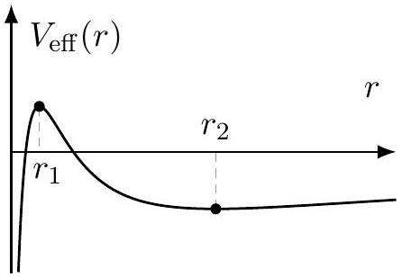

[4] Problem 5. In general relativity, the gravitational potential around a black hole of mass $M$ is
$$
V ( r ) = - \frac { G M m } { r } - \frac { G M L ^ { 2 } } { m c ^ { 2 } r ^ { 3 } } .
$$
The second term is a relativistic effect which strengthens the attraction towards the black hole. (It has nothing to do with the angular momentum barrier; you still have to add that separately.)
    (a) Explain why this new term allows particles to fall to the center of the black hole, $r = 0$, and why this is impossible in Newtonian gravity.
    (b) For a fixed $L$, find the values of the circular orbit radii.
    (c) Find the radius of the smallest possible stable circular orbit, for any value of $L$. What happens if you try to orbit the black hole closer than this?
    (d) Find the closest possible approach radius of an unbound object. That is, among the set of all trajectories that start and end far away from the black hole (i.e. without falling into it), find the smallest possible minimum value of $r$.

For all parts, assume the particle is moving nonrelativistically.
Solution. (a) The effective potential contains $L ^ { 2 } / 2 m r ^ { 2 }$, which in Newtonian gravity makes the effective potential go to $+ \infty$ as $r \rightarrow 0$. Thus, $r = 0$ is inaccessible, for any $L \neq 0$. However, adding the $- G M L ^ { 2 } / m c ^ { 2 } r ^ { 3 }$ term makes the effective potential go to $- \infty$ as $r \rightarrow 0$, so that particles can fall to the center.

(b) Circular orbits occur when $V _ { \text {eff } } ^ { \prime } ( r ) = 0$, which implies
$$
\frac { L ^ { 2 } } { m r ^ { 3 } } = \frac { G M m } { r ^ { 2 } } + \frac { 3 G M L ^ { 2 } } { m c ^ { 2 } r ^ { 4 } } .
$$
Writing this as a quadratic in $r$ and solving gives
$$
r _ { 1 } = \frac { L ^ { 2 } - \sqrt { L ^ { 4 } - 12 ( G M m L / c ) ^ { 2 } } } { 2 G M m ^ { 2 } } , \quad r _ { 2 } = \frac { L ^ { 2 } + \sqrt { L ^ { 4 } - 12 ( G M m L / c ) ^ { 2 } } } { 2 G M m ^ { 2 } } .
$$
Note that there are no solutions at all when the discriminant is negative. Thus, circular orbits only exist when $L > \sqrt { 12 } G M m / c$.
(c) From part (a), we know that $\lim _ { r \rightarrow 0 } V _ { \text {eff } } ( r ) = - \infty$. Thus the graph of $V _ { \text {eff } } ( r )$ should look like this, for sufficiently large $L$ :

Thus, the orbit at $r _ { 2 }$ is stable, and the one at $r _ { 1 }$ is unstable.
As the angular momentum is decreased, $r _ { 2 }$ decreases. When $L$ reaches the critical value $\sqrt { 12 } G M m / c$, we have $r _ { 2 } = r _ { 1 }$, and for smaller $L$, the curve $V _ { \text {eff } } ( r )$ has no extrema, so there are no circular orbits at all. Therefore, the radius of the smallest stable circular orbit is the minimum possible value of $r _ { 2 }$, which is achieved when $L = \sqrt { 12 } G M m / c$, giving

$$
r _ { \min } = \frac { 6 G M } { c ^ { 2 } } .
$$

If you orbit in a circular orbit with a smaller radius, it is necessarily unstable, which means that under any perturbation, you will either drift into the black hole, or outward away from it. If you have rockets, this can be prevented by continual orbital adjustment. (Of course, if you get closer than the Schwarzschild radius $2 G M / c ^ { 2 }$, you must fall into the black hole, no matter what you do. But this famous effect isn't incorporated in our simple Newtonian analysis.)

(d) For this to happen, the effective potential needs a maximum, so the particle can "bounce" off it and get back to $r \rightarrow \infty$. Thus we need $L > \sqrt { 12 } G M m / c$. For each value of $L$, the closest radius we can get while still bouncing off is $r _ { 1 }$.
Thus, we want to find the minimal value of $r _ { 1 }$, and this occurs when $L \rightarrow \infty$ (i.e. when the particle is launched from a very large impact parameter), giving
$$
\lim _ { L \rightarrow \infty } r _ { 1 } ( L ) = \frac { 6 ( G M m / c ) ^ { 2 } } { 2 G M m ^ { 2 } } = \frac { 3 G M } { c ^ { 2 } }
$$
where we used the binomial theorem in the first step.

By the way, the shapes of the orbits in this potential can be quite exciting, featuring "zoom-whirl" patterns where a particle slowly "zooms" around a black hole, then falls inward and quickly "whirls" around it several times, then comes back out. Such orbits produce interesting gravitational wave signatures. You can find a numeric simulation of them here.
