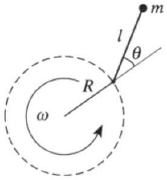
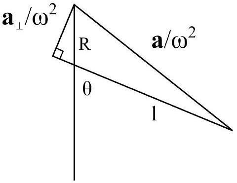

[2] Problem 20. Every satellite in orbit around the Earth is slowly falling due to drag. Consider a satellite steadily falling, with a large tangential velocity and small inward radial velocity.

(a) Show that for a satellite initially in a circular orbit, losing energy $U$ to drag increases the kinetic energy of the satellite. By how much is it increased?
(b) The result of part (a) seems almost paradoxical. How can it be explained in an inertial frame, given that the drag force always acts to slow down the satellite?
(c) Now consider a uniformly rotating frame, whose angular velocity is equal to the initial angular velocity of the satellite. In this frame, the drag force always points tangentially backwards, but the satellite ends up going tangentially forward. What force is responsible?

Solution. (a) This follows from the virial theorem, namely that the time average of the kinetic energy is negative of the time average of the total energy. So losing $U$ total energy means gaining $U$ kinetic energy. This recalcitrant behavior, where the mass seems to want to accelerate in the direction opposite the way it's pushed, is called the "donkey effect" in galactic dynamics.

(b) Gravity always points radially, but since the satellite's velocity has an inward radial component, that means gravity has a component along the velocity, and hence increases the speed. If you go through the calculation, which is a slightly more complex version of an example in M5, you'll find that the speed-increasing effect of gravity is precisely twice the speed-decreasing effect of the drag force.
(c) The inward component of the velocity gives rise to a Coriolis force pointing tangentially forward. Again, if you go through the calculation, you'll find it's twice as large as the drag force, effectively flipping its direction. The explanation looks totally different in the rotating frame, but the result is the same.
[2] Problem 21 (Cahn). A pendulum is designed for use on a gravity-free spacecraft. The pendulum consists of a mass at the end of a rod of length $\ell$. The pivot at the other end of the rod is forced to move in a circle of radius $R$ with fixed angular frequency $\omega$. Let $\theta$ be the angle the rod makes with the radial direction.

Show this system behaves exactly like a pendulum of length $\ell$ in a uniform gravitational field $g = \omega ^ { 2 } R$. That is, show that $\theta ( t )$ is a solution for one system if and only if it is for the other.
Solution. This system experiences no gravitational force, but instead experiences a Coriolis and centrifugal force. The Coriolis force plays no role, because it is always perpendicular to the velocity of the mass and the angular velocity, which implies it is directed along the rigid rod; it merely changes the tension in the rod.
The centrifugal acceleration a is directed away from the origin; the relevant part of it is the component $\mathbf { a } _ { \perp }$ perpendicular to the rod. Referring to the below diagram, we see that $a _ { \perp } =$ $\omega ^ { 2 } ( R \sin \theta )$.

This is exactly the same $a _ { \perp }$ as for a pendulum in gravity $g = \omega ^ { 2 } R$, so the systems are equivalent.
