## Mechanics VII: Fluids

The fundamental material is covered in chapters 15 and 16 of Halliday, Resnick, and Krane, and at a somewhat higher level in chapter 9 of Wang and Ricardo, volume 1. For interesting discussion, see chapters II-40 and II-41 of the Feynman lectures. For a much more advanced introduction which uses vector calculus heavily, see chapters 2-5 and 12-15 of Physics of Continuous Matter by Lautrup. There is a total of 88 points.

## 1 Fluid Statics

Idea 1
In equilibrium, the pressure in a static fluid varies with height as

$$
\frac { d P } { d y } = - \rho g .
$$

This always holds in equilibrium. For instance, if we squeeze a sealed container of fluid, increasing the pressure locally, then this pressure increase must propagate throughout the entire fluid to maintain $d P / d y = - \rho g$. This is Pascal's principle.

Idea 2: Archimedes' Principle
An object in a fluid experiences an upward buoyant force due to the different pressures on its top and bottom sides. The force is equal in magnitude to the weight of the fluid that would fill the volume of the immersed portion of the object.

This can be surprisingly tricky, so we'll begin with some conceptual questions.
Example 1
A large rock is tied to a balloon filled with air. Both are placed in a lake. As the balloon sinks, how do the air pressure in the balloon, the average density of the balloon, air, and rock system, and magnitude of the net force on the system vary?

Solution
For simplicity, we ignore the elastic force in the balloon itself. Then for the balloon to be in equilibrium, its pressure must match that of the water pressure, so the air pressure in the balloon increases. As the balloon sinks, the rock stays the same volume but the balloon is squeezed smaller, so the density of the system increases. Finally, since the density of water is very approximately constant, the buoyant force on the system is decreasing since its volume is decreasing, so the net force is increasing; the system accelerates downward faster and faster.
[1] Problem 1 (HRK). The average human body floats in water. SCUBA divers wear weights and a flotation vest that can fill with a varying amount of air to establish neutral buoyancy. A diver is originally neutrally buoyant at a certain depth. How should the diver manipulate the amount of air in their flotation vest to move lower, then stay there at neutral buoyancy?

Solution. To move lower, the amount of air should be decreased. To stay at neutral buoyancy, the amount of air should be increased. In fact, the amount of air in the vest should end up greater than the original amount, because at a lower point, the same amount of air would be squeezed to a smaller volume, making the vest less buoyant.

[2] Problem 2. A beaker contains liquid water at its freezing point and has a big ice cube floating in it, also at its freezing point. If the ice cube
    (a) is solid ice,
    (b) contains a small metal ball, or
    (c) contains a lot of olive oil (which will float on the water in a thin layer),

then how does the fluid level change when the cube melts? In all cases, neglect the density of air.
Solution. (a) The water level does not change. The ice cube creates a "hole" in the water that it sits in, and when it melts it exactly fills this hole.

(b) Initially the metal ball displaces its weight in water, which is large, but after the ice cube melts it falls to the bottom and only displaces its volume in water. So the water level goes down.
(c) Initially, the oil displaces its weight in water, but after the ice cube melts it sits on top, thereby occupying its whole volume. Since the oil is less dense than water, the fluid level goes up. (Specifically, the water level goes down, and an oil layer sits on top of it, at a height greater than the original water level.) Note that the answer would be different if there was only a little olive oil, because in that case the oil would coalesce into a few drops on the water surface. In that case each drop displaces its weight, so that the water level stays the same.

As a sidenote, if we accounted for the density of air, then the answer to part (a) would actually be that the water level goes up a tiny bit. The reason is that part of the ice cube poking out above the water surface experiences an extra buoyant force from the air itself, which means the ice cube is not as deep in the water as one would expect. So when it melts, it slightly more than fills the hole, causing the water level to go up.

[2] Problem 3. Consider a pair of scales with identical vessels in which there are equal quantities of water.
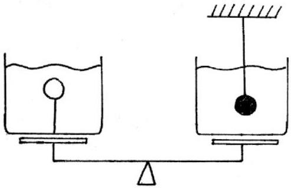
In the left-hand vessel you suspend a very light ping-pong ball on a thin, light wire attached to the base of the vessel. In the right-hand vessel you suspend a ping-pong ball filled with lead, again by a light thin wire. Do the scales stay level, go down on the left, or go down on the right?
Solution. The ball on the right experiences an upward buoyant force, so it exerts a downward force on the water. As for the ball on the left, it has no effect whatsoever on the force on the scale, because this force is simply equal to the weight of all the water. So the scales go down on the right.

This is an incredibly classic problem; it appeared on the first-ever physics Olympiad, held in Moscow in 1939.

[2] Problem 4 (BAUPC). Two trapezoidal containers, connected by a tube as shown, hold water.
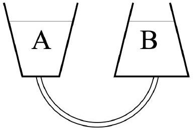
Assume the containers do not undergo thermal expansion.
    (a) If the water in container A is heated, causing it to expand, will water flow through the tube? If so, in which direction?
    (b) What if the water in container B is heated instead?

Solution. (a) The pressure at the bottom of each container is $P = \rho g h = m g h / V$, where $h$ is the height of the water level above the bottom, and $V$ and $m$ are the volume and mass of water in the container. When the water in container A is heated, $m$ stays the same, while $V / h$ increases because the container gets wider. Thus, the pressure at the bottom of container A will decrease, and water will flow from B to A.

(b) In this case, $V / h$ decreases in container B because the container gets narrower. Then the pressure at the bottom of container B will increase, so water will flow from B to A again. As a cross-check, we can consider what happens when all the water is heated. Then $\rho$ is the same everywhere, and all that matters is the relative heights. Due to the shapes of the containers, the final water height in container B is higher, so water flows from B to A, as expected.
[2] Problem 5 (MPPP 85). A solid cube of volume $V _ { i }$ and density $\rho _ { i }$ is fastened to one end of a cord, the other end of which is attached to a light bucket containing water, of density $\rho _ { w } = \rho _ { i } / 10$.
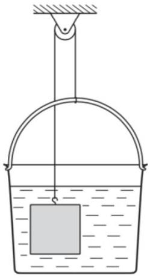
The system is in equilibrium.
    (a) Find the volume $V _ { w }$ of the water in the bucket.
    (b) What would happen if more water were poured into the bucket?
    (c) What would happen if some or all of the water evaporated?

Solution. (a) There is a buoyant force of $\rho _ { w } V _ { i }$ on the block, which pushes the block up and the bucket down. In equilibrium, the tension in the cord $T$ must balance against the weight of the block and the buoyant force: $T = \left( \rho _ { i } V _ { i } - \rho _ { w } V _ { i } \right) g$. Similarly for the water/bucket, $T = \left( \rho _ { w } V _ { w } + \rho _ { w } V _ { i } \right) g$. Equating the two gets

$$
\rho _ { w } V _ { w } = \rho _ { i } V _ { i } - 2 \rho _ { w } V _ { i }
$$

which implies $V _ { w } = 8 V _ { i }$.

(b) The effective weight on the left side won't change, but the bucket will be heavier. If the final volume of water $V _ { f }$ is less than $10 V _ { i }$, where $V _ { f } = 10 V _ { i }$ is when the system will be in equilibrium if the block is out of the water, then the system will be in equilibrium at some point with the block partially submerged. Once $V _ { f } > 10 V _ { i }$, the bucket will just keep falling.
(c) The cube will fall until it hits the bottom of the bucket (the amount of evaporation doesn't matter), and then the system will be stuck there since the cube can't pass through the bucket.

Example 2
A perfectly spherical, nonrotating planet is covered with water. Geological activity causes a small underwater mountain to form, made of rock that is denser than water. Does the ocean surface above this mountain become higher or lower?

Solution
Systems minimize their energy in equilibrium. This means that in hydrostatic equilibrium, the surface of the water is an equipotential. Since the gravitational field of the mountain decreases the gravitational potential near it, the water surface is higher near the mountain.

Example 3
Robert Boyle is best known for Boyle's law, but he also invented a remarkably simple perpetual motion machine, called the perpetual vase.
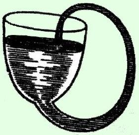
Since the volume of the vase is much greater than the neck, the pressure in the neck cannot possibly hold up all of the water in the vase. Thus, the water will flow through the neck and fall back into the vase, causing perpetual motion. Why doesn't this work?

Solution
This is an example of the hydrostatic paradox. Most of the upward force on the water is not provided by the pressure in the water in the neck, but from the normal force from the walls; each piece of wall provides enough normal force to hold up all of the water above it. (Of course, ultimately each piece of the glass is held in place by internal forces

with other pieces of the glass, which ultimately are balanced by whatever is holding the glass.)
Thus, the water in the neck only supports the water directly above it. That's precisely what is balanced by the heightened pressure in the neck, so the water doesn't start moving. (There have been many more attempts at fluid-based perpetual motion, as you can see here.)
[2] Problem 6. Below is another perpetual motion machine, proposed centuries ago.
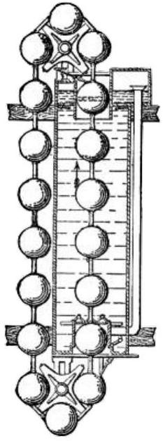
The balls are less dense than water. The balls on the left are pulled downward by gravity, while the balls on the right are pushed upward by the buoyant force.
    (a) Why doesn't this work?
    (b) Would it work if the balls and chain were replaced with a flexible tube of constant thickness?

Solution. (a) Let the balls have volume $V$, and the column have height $h$. The positive work done on a ball by the buoyant force, as it climbs the length of the column, is

$$
W _ { \text {up } } = F \Delta x = ( \rho g V ) h .
$$

On the other hand, it costs work to insert the ball into the column at the bottom,

$$
W _ { \text {in } } = P \Delta V = ( \rho g h ) V .
$$

Thus, the energy you get from letting a ball go all the way up is just the energy you put in by pushing the ball in at the bottom, so there's no free energy.
What this means in practice is that if you actually set up the system, it will start moving a bit until the first ball hits the bottom of the column, and then it won't be able to go in. If you push it in, then the chain will start going around, but only at a constant speed, until friction slows it down.

(b) In this case, the objection raised in part (a) doesn't hold. The tube can just slide in at the bottom, so that $W _ { \text {in } } = 0$. However, the machine still doesn't work because now the buoyant force vanishes, so $W _ { \text {up } } = 0$ too. The point is that the buoyant force is only $\rho g V$ if the entirety of the object with volume $V$ is surrounded by water. Since the tube just goes right through the bottom of the column, there's no water present to push up on the bottom of the tube, and thus no buoyant force.

[2] Problem 7 (HRK). A fluid is rotating at constant angular velocity $\omega$ about the vertical axis of a cylindrical container. Defining $z = 0$ to be the water level at the cylinder's axis, show that the liquid surface is the paraboloid
$$
z = \frac { \omega ^ { 2 } r ^ { 2 } } { 2 g } .
$$
Since a paraboloid perfectly focuses incoming light which is parallel to its axis, a rotating fluid can be used as a telescope, as was first pointed out by Isaac Newton. Such liquid-mirror telescopes are cheap, but have the disadvantage that they can only point up. Alternatively, one can gradually cool molten glass in a rotating container so that it solidifies into a paraboloidal lens.
Solution. Work in the frame rotating with the fluid, where it is static. Balancing the pressure and centrifugal force on a cylindrical shell of thickness $d r$, at radius $r$ and height $h$, gives
$$
d P ( 2 \pi r h ) = \omega ^ { 2 } r ( \rho ( 2 \pi r h d r ) ) \Longrightarrow \frac { d P } { d r } = \rho \omega ^ { 2 } r .
$$
On the other hand, we also know that in hydrostatic equilibrium, the pressure obeys
$$
\frac { d P } { d z } = - \rho g .
$$
The pressure has to stay the same along the surface, so
$$
\frac { d P } { d r } + \frac { d P } { d z } \frac { d z } { d r } = 0 .
$$
We thus have $d z / d r = \omega ^ { 2 } r / g$, and integrating gives the desired result.
[3] Problem 8. USAPhO 2013, problem A4. In order to make measurements, print out the problem before starting.

## 2 Fluid Mechanics

Next we'll consider some situations involving fluids and other objects, where the fluids can be treated at least quasistatically but the objects must be treated dynamically.

Idea 3
The buoyant force can be regarded as acting at the center of gravity of the fluid displaced by the submerged part of a floating object, called the center of buoyancy. A floating configuration is stable if, when the configuration is slightly rotated, the buoyant force provides a restoring torque about the center of mass.

[2] Problem 9 (Kalda). A hemispherical container is placed upside-down on a smooth horizontal surface. Water is poured in through a small hole at the top. At the moment the container fills, water starts leaking from between the table and the edge of the container.
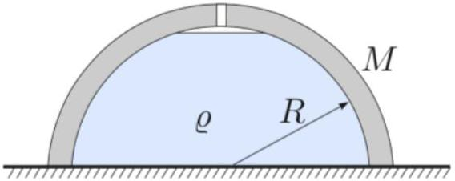
Find the mass of the container if the water has density $\rho$ and the hemisphere has radius $R$.

Solution. Note that right when the water is full, the normal force between the ground and the container vanishes. Thus, the weight of the container and water is balanced by the normal force on the water. However, this is just $\rho g R \left( \pi R ^ { 2 } \right)$, so we have

$$
\left( M + \frac { 2 } { 3 } \pi R ^ { 3 } \rho \right) g = \rho g \pi R ^ { 3 } , \quad M = \frac { \rho \pi R ^ { 3 } } { 3 } .
$$

Note that the atmosphere has a negligible effect here, because if all atmospheric effects are accounted for, the net effect is just a tiny buoyant force on the container and water.

[2] Problem 10 (MPPP 89). A thin-walled hemispherical shell of mass $m$ and radius $R$ is pressed against a smooth vertical wall.
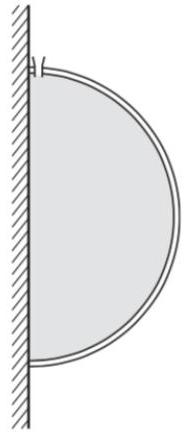
It is filled with water through a small aperture at its top, with total mass $M$. Find the minimum magnitude of the force that has to be applied to the shell to keep the liquid in place.

Solution. We consider the system of the water and shell. The external force $F$ exerted must counteract the vertical force of gravity, and the horizontal force of the hydrostatic pressure from the wall. First, vertical force balance gives

$$
F _ { y } = ( M + m ) g .
$$

Evaluating horizontal force balance is slightly trickier. However, note that by symmetry, the average pressure at the part of the wall touching the water is precisely the pressure at the vertical center of the hemisphere, so

$$
F _ { x } = \bar { P } A = ( \rho g R ) \left( \pi R ^ { 2 } \right) = \pi R ^ { 3 } \rho g = \frac { 3 } { 2 } M g .
$$

Thus, the total force needed is

$$
F = \sqrt { F _ { x } ^ { 2 } + F _ { y } ^ { 2 } } = g \sqrt { \frac { 13 } { 4 } M ^ { 2 } + 2 M m + m ^ { 2 } } .
$$

Note that we ignored the effect of the atmosphere in this question, which would be tiny in any case; one can tell that it should be ignored since the problem statement never specified the density of air.

Technically, we should verify that the torques can be balanced too, by choosing an appropriate point to apply the force $F$. Take the origin $O$ to be the center of the hemisphere, so that the radial pressure of the curved part produces no torque. The applied force needs to cancel the torques from gravity and the pressure from the wall. It turns out there always exists a point of application for $F$ that does this, but showing it explicitly is messy and unenlightening. In this problem, you're just meant to see intuitively that torque can be balanced.

[3] Problem 11. USAPhO 2004, problem A2.
[3] Problem 12. USAPhO 2002, problem A4. Be careful with this one!
[3] Problem 13. A long log with square cross section and density $\rho _ { l }$ floats in water with density $\rho _ { w }$. If $\alpha = \rho _ { l } / \rho _ { w }$, then when $\alpha \ll 1$, the log will float stably with one of its sides parallel to the water.
    (a) As $\alpha$ is increased, show that once $\alpha > ( 3 - \sqrt { 3 } ) / 6$, this orientation becomes unstable. (Hint: to keep the calculations short, choose a good coordinate system and work to the lowest relevant order everywhere.)
    (b) How do you think the stable orientation of the log varies as $\alpha$ continues to increase? In particular, what it is when $\alpha = 1 / 2$, or when $\alpha \approx 1$ ?

Finding the stable orientation of the log for general values of $\alpha$ is quite complicated, but you can play with a nice simulation here; you can also use this to check your answer.

Solution. For simplicity, we'll set the side length of the log to 1.

(a) The task reduces to finding how the center of mass and center of buoyancy move after an infinitesimal rotation $d \theta$. For simplicity, we align the coordinate system with the log and place the origin at the center of mass $C _ { M }$.
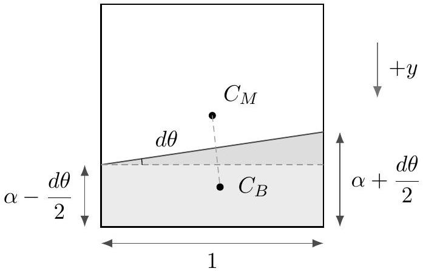
The fraction of the $\log$ submerged is $\alpha$. To compute the coordinates of the center of buoyancy $C _ { B }$ we split it into two pieces as shown above. Then
$$
x _ { B } = \frac { 1 } { \alpha } \left( \frac { 1 } { 6 } \cdot \frac { d \theta } { 2 } + 0 \cdot \left( \alpha - \frac { d \theta } { 2 } \right) \right) = \frac { d \theta } { 12 \alpha }
$$
and
$$
y _ { B } = \frac { 1 } { 2 } - \frac { \alpha } { 2 } + \mathcal { O } ( d \theta ) .
$$
where $y$ is positive downward. For neutral stability, $\left( x _ { B } , y _ { B } \right)$ must lie on a vertical line from the center of mass, which implies $x _ { B } / y _ { B } = d \theta$, so
$$
\frac { 1 } { 12 \alpha } \left( \frac { 1 } { 2 } - \frac { \alpha } { 2 } \right) ^ { - 1 } = 1 .
$$
This is a quadratic equation with solution $\alpha = ( 3 - \sqrt { 3 } ) / 6$.

(b) Of course, there's always some stable equilibrium, corresponding to the orientation where the center of mass of the system is as low as possible. When $\alpha = 1 / 2$, it's fairly intuitive that the log stably sits at a 45° angle, with a corner facing directly down. And when $\alpha \approx 1$, the result is the same as in the low density case: the log sits with a side parallel to the water surface. However, it's much less intuitive for other values of the density. As you can see in the linked simulation, the equilibrium orientation can actually be at any angle, depending on the density!
This is a subtle and unintuitive result. In fact, an entire paper has been written on this problem, which you can see if you want more details.

## Remark

Some Olympiad questions involving oscillating fluids, which are more subtle. These questions are often impossible to solve exactly, because one must keep track of the entire motion of the water to know how much kinetic and potential energy are in play. In M4, you solved IPhO 1984, problem 2, which only asked for an order of magnitude estimate. Physics Cup 2018, problem 4 considers a $V$-shaped container, where the calculation can be done exactly.
[4] Problem 14. EuPhO 2022, problem 1. A nice fluid oscillations problem which can be solved nearly exactly without too much trouble.

Solution. See the official solutions as usual. It's interesting that here, the water's potential and kinetic energy get multiplied by the exact same factor, resulting in an oscillation period that doesn't depend on the cylinder's exact dimensions. For a generic container geometry, the two won't precisely match, but they will change the oscillation frequency by a comparable amount in opposite directions.

## Idea 4: Added Mass

When an object moves through water, it effectively has extra inertia because it forces water to move as well. This is the "added mass" $\Delta m$ (or "virtual mass"), mentioned in M4. For example, it turns out that in water of density $\rho$,

$$
\Delta m = \rho \times \begin{cases} ( 2 \pi / 3 ) R ^ { 3 } & \text { sphere of radius } R , \\ \pi R ^ { 2 } L & \text { cylinder of radius } R , \text { length } L \gg R , \text { moving perpendicular to axis, } \\ ( 8 / 3 ) R ^ { 3 } & \text { thin disc of radius } R , \text { moving along its axis of symmetry } . \end{cases}
$$

## Example 4

Derive the expression for the added mass of a sphere.

## Solution

Consider a spherical object of radius $a$ moving uniformly with speed $v _ { 0 }$ through water of density $\rho$. The object forces the water to move: the water ahead of it has to get out of the way, while the water behind it needs to fill the space it leaves behind. By the ideas of M4, the total kinetic energy of the water is $( \Delta m ) v _ { 0 } ^ { 2 } / 2$, where $\Delta m$ is the added mass.

It turns out the fluid's velocity field $\mathbf { v } ( \mathbf { r } )$ has to satisfy $\nabla \cdot \mathbf { v } = 0$, reflecting the incompressibility of water, and $\nabla \times \mathbf { v } = 0$, reflecting the absence of vorticity. It also has to go to zero far from the sphere, and have zero relative normal velocity at the sphere itself. These differential equations and boundary conditions yield a unique solution. The methods for finding the solution are standard, and typically taught in an undergraduate electromagnetism course, but since they're outside the Olympiad syllabus, I'll just display the answer. The velocity is

$$
\mathbf { v } ( \mathbf { r } ) = \frac { v _ { 0 } a ^ { 3 } } { 2 r ^ { 3 } } ( 2 \cos \theta \hat { \mathbf { r } } + \sin \theta \hat { \boldsymbol { \theta } } )
$$

in polar coordinates, where we placed the origin at the center of the sphere and aligned the ẑ axis with its direction of motion. If you've done E1, you might notice this is just like the electric dipole field; this coincidence isn't too surprising because that field satisfies the similar equations $\nabla \cdot \mathbf { E } = 0$ and $\nabla \times \mathbf { E } = 0$, which are quite restrictive.

Now, to derive the added mass, we just have to carry out the kinetic energy integral, which is easiest in spherical coordinates,

$$
\begin{aligned}
K & = \int \frac { \rho v ^ { 2 } } { 2 } d V \\
& = \frac { \rho v _ { 0 } ^ { 2 } a ^ { 6 } } { 8 } \int _ { a } ^ { \infty } \frac { r ^ { 2 } d r } { r ^ { 6 } } \int _ { 0 } ^ { 2 \pi } d \phi \int _ { 0 } ^ { \pi } ( \sin \theta d \theta ) \left( 4 \cos ^ { 2 } \theta + \sin ^ { 2 } \theta \right) \\
& = \frac { \rho v _ { 0 } ^ { 2 } a ^ { 6 } } { 8 } \left( \frac { 1 } { 3 a ^ { 3 } } \right) ( 2 \pi ) ( 4 )
\end{aligned}
$$

This yields a added mass of $( 2 \pi / 3 ) \rho a ^ { 3 } = \rho V / 2$, as stated above.

## Remark

We won't derive the added mass for other shapes, because it often requires advanced mathematical techniques, outside the Olympiad syllabus. (For this reason, IPhO 1995, problem 3, involving a partially submerged cylindrical buoy of mass $m$, simply asks you to assume a added mass $m / 3$.) If you're interested in this subject, this paper compiles many exact results, and this paper discusses the history and measurement of added mass. Furthermore, Physics Cup 2019, problem 1 and Physics Cup 2024, problem 1 introduce slick methods to calculate added mass for some special shapes.

## Example 5

What is the initial upward acceleration of a spherical air bubble in water?

## Solution

The upward buoyant force on the bubble is $\rho V g$, and the mass of the bubble is negligible, so if we didn't know about added mass, we would be tempted to conclude the acceleration is enormous. Instead, the buoyant force is used to move the added mass $\rho V / 2$ out of the way, so the upward acceleration is $2 g$.

Like most things in fluid dynamics, this isn't an exact result. The usual expression for the buoyant force assumes no motion at all, while the added mass derivation assumes uniform motion, neither of which are true for an accelerating bubble. For the result above to be accurate, the bubble has to be small, so that the pressure and flow fields have time to reach a quasi-steady state, but not too small, so that we can still ignore viscous forces.

## 3 Fluid Dynamics

Idea 5: Continuity
In steady flow, the quantity $\rho A v$ is constant along tubes of streamlines.

Idea 6: Bernoulli's Principle
For steady, nonviscous, incompressible flow, the quantity

$$
P + \frac { 1 } { 2 } \rho v ^ { 2 } + \rho g y
$$

is constant along streamlines. Another version of Bernoulli's principle, valid for compressible flow, is given in T3. As explained there, the incompressible result here is applicable for water flow, and for gas flow as long as the velocity is much less than the speed of sound.

You might be wondering how steady the flow has to be. Bernoulli's principle is derived by equating work done to kinetic energy, as water flows between two points on a streamline. So you can apply Bernoulli's principle between those two points if the flow is steady on the timescale that it takes fluid to move from one to the other.

Example 6: HRK
A tank is filled with water to a height $H$. A small hole is punched in one of the walls at a depth $h$ below the water surface as shown.
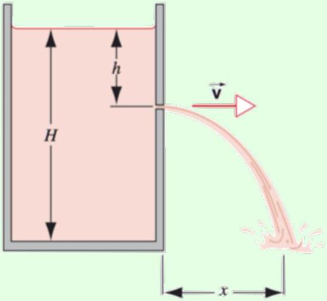
Find the distance $x$ from the foot of the wall at which the stream strikes the floor.

Solution
The flow isn't perfectly steady, but it's close enough since the hole is small. We thus apply Bernoulli's principle along a streamline, where one point is at the water's top surface, and the other point is just outside the hole. Both points are at atmospheric pressure, because they are directly exposed to the atmosphere. Since the hole is small compared to the tank, the velocity at the first point is small by continuity, so we neglect it, giving

$$
\frac { 1 } { 2 } \rho v ^ { 2 } = \rho g h
$$

which implies Torricelli's law,

$$
v = \sqrt { 2 g h } .
$$

The time $t$ to fall is $t = \sqrt { 2 ( H - h ) / g }$, so

$$
x = v t = 2 \sqrt { h ( H - h ) }
$$

which incidentally is maximized at $h = H / 2$.
Incidentally, Bernoulli himself was aware that the answer was different for a large hole, and treated the general case in his 1738 book, Hydrodynamica. The method is to apply energy conservation to all of the water at once (i.e. equating the rate of decrease of gravitational potential energy to the rate of increase of total kinetic energy), rather than attempt to apply it along streamlines. You can see this general analysis here.

Example 7
Why should you close your barn door during a storm?

Solution
The wind can flow into the barn, at which point it stops. By Bernoulli's principle, this increases its pressure by $\rho v ^ { 2 } / 2$. This creates a net upward force on the roof, which can tear it off the barn.

By the way, even if you do close the barn door, there's a second effect that can still cause a problem: the wind outside has to flow faster along the top to get around it, which decreases its pressure, again creating a net upward force on the roof. This lift effect is very common in real life. You probably already know it's responsible for the lift on an airplane wing. But it also caused my childhood trampoline to achieve liftoff during Hurricane Sandy, destroying a backyard fence. And plumbers rely on it to make sewer pipes "self-clean", by picking up anything stuck to the bottom.

Incidentally, this example brings up a little puzzle about Bernoulli's principle. We argued that the air slows down when it enters the barn, so the pressure goes up. But in the reference frame moving with the wind, the air speeds up when it enters the barn - so shouldn't its pressure go down? The issue with this reasoning is two-fold. First, in the wind's frame, the

barn is moving, so the flow isn't steady and Bernoulli's principle doesn't apply. Second, even if the barn were moving slowly, so that the flow were almost steady, the barn's motion would still be doing work on the air, and this changes Bernoulli's principle because it is ultimately a restatement of energy conservation. So in either case, the reasoning fails. When obstacles are present, Bernoulli's principle should always be invoked in the frame of the obstacles.

Example 8: JEE 2020
When a train enters a narrow tunnel, your ears pop because of the pressure change. Find the pressure change, assuming the air has constant density $\rho$, the atmospheric pressure is $P _ { 0 }$, the train speed is $v$, and the cross-sectional areas of the train and tunnel are $A _ { t }$ and $A _ { 0 }$.

Solution
We work in the reference frame of the train. In this frame, the air in the tunnel begins moving towards the train at speed $v$. When it gets to the train, it has to speed up to speed $v _ { f }$ because it flows through a smaller area $A _ { 0 } - A _ { t }$, and this causes its pressure to decrease by Bernoulli's principle. Specifically, we have

$$
A _ { 0 } v = \left( A _ { 0 } - A _ { t } \right) v _ { f } , \quad P _ { f } + \frac { 1 } { 2 } \rho v _ { f } ^ { 2 } = P _ { 0 } + \frac { 1 } { 2 } \rho v ^ { 2 }
$$

which gives a pressure drop of

$$
P _ { f } - P _ { 0 } = - \frac { 1 } { 2 } \rho v ^ { 2 } \left( \frac { 1 } { \left( 1 - A _ { t } / A _ { 0 } \right) ^ { 2 } } - 1 \right) .
$$

We neglected the change in density of the air, which is a good approximation when the train is much slower than the speed of sound. We'll treat fluid flow with changing density in T3.

Example 9
A whirly tube is a long, narrow, flexible tube that produces musical tones when swung. Model a whirly tube as a cylinder of length $L$, rotated about one end with angular velocity $\omega$. For simplicity, neglect gravity. What is the speed of the air when it shoots out the other end?

Solution
The air is slowly sucked from all directions around the entry hole, and shot out at the exit hole. Applying Bernoulli's principle between a point near the entry hole, and the exit hole,

$$
P _ { \mathrm { atm } } \approx P _ { \mathrm { atm } } + \frac { 1 } { 2 } \rho v _ { \mathrm { out } } ^ { 2 } .
$$

But that implies $v _ { \text {out } } \approx 0$, which doesn't make sense. The problem is that Bernoulli's principle applies to steady flows, and this situation is definitely not steady: by the time the air goes through the tube, the tube has rotated by a significant amount.

Instead, we apply Bernoulli's principle in a reference frame rotating with the tube. The centrifugal force gives an additional term, turning it into

$$
P + \frac { 1 } { 2 } \rho v ^ { 2 } - \frac { 1 } { 2 } \rho \omega ^ { 2 } r ^ { 2 } = \text { const. }
$$

Applying Bernoulli's principle between the same two points gives

$$
P _ { \mathrm { atm } } \approx P _ { \mathrm { atm } } + \frac { 1 } { 2 } \rho v ^ { 2 } - \frac { 1 } { 2 } \rho \omega ^ { 2 } L ^ { 2 }
$$

from which we conclude $v = \omega L$. Transforming back to the original reference frame, the exit speed of the air is $\sqrt { v ^ { 2 } + ( \omega L ) ^ { 2 } } = \sqrt { 2 } \omega L$.

Example 10
A big fan produces a stream of air with speed $v$. If the atmospheric pressure in the room is $P _ { \text {atm } }$, what's the pressure $P$ in the middle of the fan's air stream?

Solution
This question frequently appears in middle school physics lessons. Obviously, if we apply Bernoulli's principle to the air before and after it goes through the fan, we get

$$
P + \frac { 1 } { 2 } \rho v ^ { 2 } = P _ { \mathrm { atm } }
$$

so that the pressure is lower than atmospheric pressure. Easy, right? But it's wrong!
The air in the stream is traveling forward with constant velocity, exposed to the rest of the air in the room, which has atmospheric pressure. If there actually was such a pressure difference, the fan's air stream would be compressed by the air in the room, until it reached atmospheric pressure again. If you look back carefully at the above examples, you'll see this is always the case: air can only be at a different pressure if it's confined away from the atmosphere at large (e.g. in a train tunnel or a whirly tube), or if it's actively being accelerated (e.g. when it flies into or over a barn, in which case the pressure difference is precisely what causes the force). The other case where you can maintain a pressure difference is when the air is moving extremely quickly, which will be discussed in T3.

So the correct answer is that $P = P _ { \text {atm } }$. But why doesn't Bernoulli's principle work? Because it's a statement of energy conservation, and the fan itself is doing work on the air to get it moving. The correct statement would be

$$
P _ { \mathrm { atm } } + \frac { 1 } { 2 } \rho v ^ { 2 } = P _ { \mathrm { atm } } + w
$$

where $w$ is the work done by the fan per unit volume of air.
[2] Problem 15 (HRK). A siphon is a device for removing liquid from a container that cannot be tipped. An example of a siphon, with constant cross-section, is shown below.

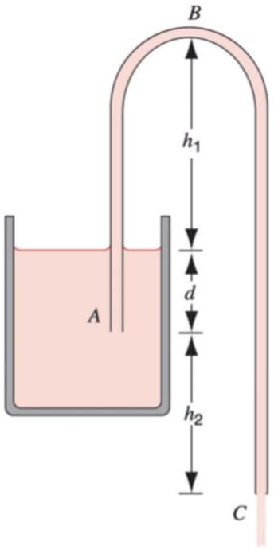
The tube must initially be filled, but once this has been done the liquid will flow until its level drops below the tube opening at A. The liquid has density $\rho$ and negligible viscosity.

(a) With what speed does the liquid emerge from the tube at C?
(b) What is the pressure of the liquid at the topmost point B?
(c) What is the maximum possible $h _ { 1 }$ so that the siphon can operate?
(d) Would the siphon still work if $h _ { 2 }$ were slightly negative? How negative can it be, for the siphon to keep on working?

Solution. (a) Applying Bernoulli's principle between the surface of the water and point C gives

$$
\frac { 1 } { 2 } \rho v ^ { 2 } = \rho g \left( h _ { 2 } + d \right)
$$

which implies

$$
v = \sqrt { 2 g \left( h _ { 2 } + d \right) } .
$$

(b) By continuity the speed $v$ in the tube is constant. Applying Bernoulli's principle between points B and C gives
$$
P _ { \mathrm { atm } } = P _ { B } + \rho g \left( h _ { 1 } + h _ { 2 } + d \right)
$$
which gives
$$
P _ { B } = P _ { \mathrm { atm } } - \rho g \left( h _ { 1 } + h _ { 2 } + d \right) .
$$
(c) For the siphon to just barely work, the flow speed $v$ should be tiny, so $h _ { 2 } + d \approx 0$. The highest value of $h _ { 1 }$ is when the pressure is zero at point B , since pressure can't be negative, so $h _ { 1 } \leq P _ { \text {atm } } / \rho g$. (If we start with this maximum possible value of $h _ { 1 }$ but then increase $h _ { 2 } + d$ above zero, then the siphon will stop working, because the water flow will break up along the exit tube.)
(d) Yes. It is still energetically favorable for water to flow through the siphon as long as point C is below the surface of the water. As mentioned above, the siphon works as long as $h _ { 2 } + d > 0$.

[2] Problem 16 (HRK). Consider a uniform U-tube with a diaphragm shown below.
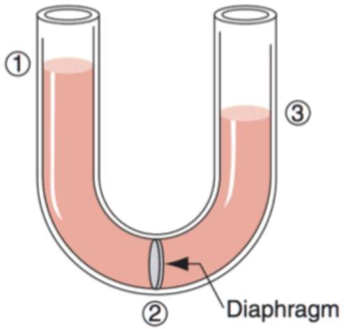
    (a) Suppose the diaphragm is opened and the liquid begins to flow from left to right. Show that applying Bernoulli's principle yields a contradiction.
    (b) Explain why Bernoulli's principle doesn't apply if the diaphragm has a very wide opening.
    (c) Explain why Bernoulli's principle doesn't apply if the diaphragm has a tiny opening.

Solution. (a) Since the pressures and velocities at points 1 and 3 are the same, Bernoulli's principle would imply the heights are also the same, which is false.

(b) Bernoulli's principle is just energy conservation, applied to water moving along a streamline. In this case, the liquid just oscillates back and forth, with point 1 and point 3 alternating periodically in height. Bernoulli's principle can't be applied between points 1 and 3 because water never moves all the way from point 1 to point 3; it just wiggles back and forth.
(c) In this case, viscous effects are not negligible. Energy is dissipated to heat, so Bernoulli's principle doesn't apply.
But what if we used a very nonviscous fluid? In that case, you would still lose energy, but to turbulence; the flow pattern after the diaphragm's opening would look like the setup of problem 17. Energy in turbulent eddies eventually dissipates to heat, so we again lose energy and Bernoulli's principle doesn't apply.
But what if the diaphragm is also shaped like a smooth curve, to prevent turbulence? In that case, you don't lose energy, but the flow isn't steady. The fluid continually accelerates as it goes through the diaphragm; in the long run the heights of points 1 and 3 alternate, as in part (b). Fluid does go all the way from point 1 to point 3, but Bernoulli's principle can't be applied because the flow isn't steady.
[2] Problem 17 (HRK). A stream of fluid of density $\rho$ with speed $v _ { 1 }$ passes abruptly from a cylindrical pipe of cross-sectional area $a _ { 1 }$ into a wider cylindrical pipe of cross-sectional area $a _ { 2 }$ as shown.

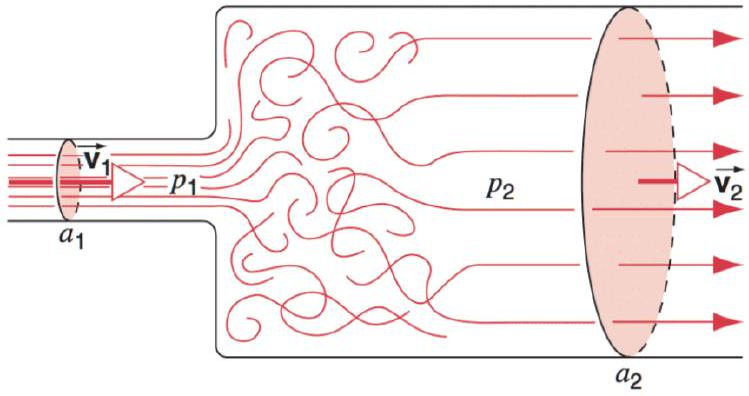
The jet will mix with the surrounding fluid, forming a turbulent region where the pressure is approximately $P _ { 1 }$. Further to the right, the flow becomes almost uniform again, with average speed $v _ { 2 }$ and pressure $P _ { 2 }$.

(a) By considering force and momentum, show that
$$
P _ { 2 } - P _ { 1 } = \rho v _ { 2 } \left( v _ { 1 } - v _ { 2 } \right) .
$$
(b) Show from Bernoulli's principle that in a gradually widening pipe we would instead get
$$
P _ { 2 } - P _ { 1 } = \frac { 1 } { 2 } \rho \left( v _ { 1 } ^ { 2 } - v _ { 2 } ^ { 2 } \right) .
$$
(c) Find the loss of pressure due to the abrupt enlargement of the pipe. Can you draw an analogy with elastic and inelastic collisions in particle mechanics?

Solution. (a) Let's consider the fluid in the region bounded by the two shaded circles. After a small time $d t$, this fluid moves to the right, and some of the fluid originally traveling at $v _ { 1 }$ ends up traveling at $v _ { 2 }$. The rate of change in momentum is

$$
\frac { \Delta p } { \Delta t } = \left( v _ { 2 } - v _ { 1 } \right) \frac { \Delta m } { \Delta t } = \rho v _ { 2 } a _ { 2 } \left( v _ { 2 } - v _ { 1 } \right) .
$$

This must be equal to the net force on the fluid, which has three contributions:

- A leftward force $P _ { 2 } a _ { 2 }$ from the fluid on its right side.
- A rightward force $P _ { 1 } a _ { 1 }$ from the fluid on its left side.
- A rightward force $P _ { 1 } \left( a _ { 2 } - a _ { 1 } \right)$ from the vertical part of the wall.

This is a net rightward force of $\left( P _ { 1 } - P _ { 2 } \right) a _ { 2 }$. Equating these expressions and dividing by $a _ { 2 }$ gives the desired result.

(b) This is simply a direct application of Bernoulli's principle.
(c) The extra loss of pressure is the difference,
$$
\Delta P = \frac { 1 } { 2 } \rho \left( v _ { 1 } - v _ { 2 } \right) ^ { 2 } .
$$
As in an inelastic collision, the loss of energy (reflected in the loss of pressure, which is essentially like elastic potential energy) goes as the square of the relative speed.

[2] Problem 18 (PPP 49). A bucket with a hole in the bottom is held below a faucet. When the bucket is empty, the hole is plugged, and the faucet is turned on, the bucket fills with water in time $T _ { 1 }$. When the bucket is full, the faucet is turned off, and the hole is opened, the bucket empties in time $T _ { 2 }$. If both the hole and faucet are open, what ratio of $T _ { 1 } / T _ { 2 }$ can cause the bucket to overflow?
Solution. Let water come out of the faucet at a volumetric flow rate of $\dot { V }$, so that the bucket with area $A$ and height $h _ { 0 }$ will be filled in time $T _ { 1 } = A h _ { 0 } / \dot { V }$.
When the hole at the bottom with effective area $a$ is open, water will flow out at a speed of $v = \sqrt { 2 g h }$, giving a volumetric flow rate of $- a \sqrt { 2 g h }$, where $h$ is the water depth. Then
$$
\begin{gathered}
\frac { d } { d t } ( A h ) = A \frac { d h } { d t } = - a \sqrt { 2 g h } \\
- \int _ { h _ { 0 } } ^ { 0 } \frac { d h } { \sqrt { 2 g h } } = \int _ { 0 } ^ { T _ { 2 } } \frac { a } { A } d t \\
\sqrt { \frac { 2 h _ { 0 } } { g } } = \frac { a } { A } T _ { 2 }
\end{gathered}
$$
To overflow the water bucket, the faucet needs to add water faster than the plug drains water when the bucket is almost full. The overflow condition is then
$$
\dot { V } = \frac { A h _ { 0 } } { T _ { 1 } } > a \sqrt { 2 g h _ { 0 } } .
$$
Plugging in our result for $T _ { 2 }$ gives
$$
\frac { T _ { 1 } } { T _ { 2 } } < \frac { 1 } { 2 } .
$$
This differs from the naive answer $T _ { 1 } / T _ { 2 } = 1$ because the rate of emptying depends on the current water height. This also implies that all those elementary school questions about filling and emptying a bucket simultaneously are wrong. For example, you might have once been asked, "if a bucket can be filled in 2 minutes and drains in 3 minutes, how long does it take to fill if the drain is open?" If we were working with sand, then the correct answer would be 6 minutes (for reasons noted in P1), but for real water, the true answer is that it never fills up all the way.
[4] Problem 19. This problem is about the subtle phenomenon of vena contracta. An incompressible fluid of density $\rho$ is flowing through a tube of area $A _ { 1 }$, which suddenly contracts to area $A _ { 2 } \ll A _ { 1 }$. Naively, the flow looks as shown at left below.
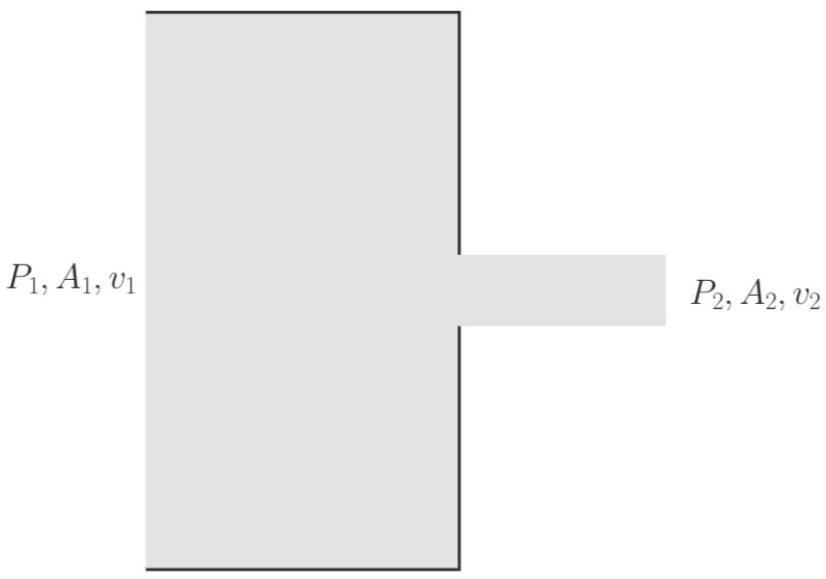
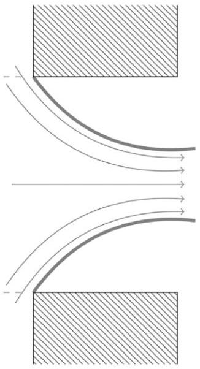

(a) Argue by energy conservation that $v _ { 2 } \approx \sqrt { 2 \left( P _ { 1 } - P _ { 2 } \right) / \rho }$.
(b) Argue that the net force on the fluid shown in the picture is approximately $\left( P _ { 1 } - P _ { 2 } \right) A _ { 2 }$. Then argue by momentum conservation that $v _ { 2 } \approx \sqrt { \left( P _ { 1 } - P _ { 2 } \right) / \rho }$.
(c) The resolution of the paradox is that in part (a), we're actually solving for the final speed of the water, and in part (b), we're actually solving for the horizontal component of the velocity. So the resolution has to be that the fluid does not exit through the orifice purely horizontally. Instead, it contracts as it exits, as shown at right above, eventually shrinking to a minimum area $A _ { 3 }$, at which point the flow actually is horizontal. Assume for simplicity that $P _ { 1 } \gg P _ { 3 }$. Show that the final area is $A _ { 3 } \approx A _ { 2 } / 2$, so that the hole is effectively only half its size.
(d) Even assuming ideal fluid flow satisfying Bernoulli's principle, the result above for $A _ { 3 }$ is not exact, but is instead off by about 20\% for the sudden opening shown above. Is the true value of $A _ { 3 }$ higher or lower than $A _ { 2 } / 2$ ?
(e) How could the shape of the orifice be modified so that $A _ { 3 }$ is almost exactly $A _ { 2 } / 2$ ? How could the orifice be modified so that the water comes out perfectly straight?

Solution. (a) Applying Bernoulli's principle,

$$
\frac { 1 } { 2 } \rho \left( v _ { 2 } ^ { 2 } - v _ { 1 } ^ { 2 } \right) = P _ { 1 } - P _ { 2 }
$$

Since $A _ { 1 } v _ { 1 } = A _ { 2 } v _ { 2 }$ and $A _ { 2 } \ll A _ { 1 }$, we have $v _ { 2 } ^ { 2 } - v _ { 1 } ^ { 2 } \approx v _ { 2 } ^ { 2 }$, so the desired equation follows.

(b) Taking a tube bounded by $A _ { 1 }$ and $A _ { 2 }$ and apply $F = d p / d t$ to the fluid within it. The pressure at the walls is approximately $P _ { 1 }$ everywhere, so the force cancels out except at the area $A _ { 2 }$. The net force is
$$
F \approx \left( P _ { 1 } - P _ { 2 } \right) A _ { 2 } .
$$
On the other hand, the rate of change of momentum is $( d m / d t ) v _ { 2 } = \rho A _ { 2 } v _ { 2 } ^ { 2 }$, where we again use $v _ { 1 } \ll v _ { 2 }$, giving the result.
(c) Neglecting $P _ { 3 }$, Bernoulli's principle gives
$$
\frac { 1 } { 2 } \rho v _ { 3 } ^ { 2 } \approx P _ { 1 } .
$$
To use momentum conservation, apply $F = d p / d t$ to a tube bounded by $A _ { 1 }$ and $A _ { 3 }$, giving
$$
F \approx P _ { 1 } A _ { 2 } , \quad \frac { d p } { d t } = \rho A _ { 3 } v _ { 3 } ^ { 2 }
$$
which gives us
$$
\frac { A _ { 3 } } { A _ { 2 } } \rho v _ { 3 } ^ { 2 } \approx P _ { 1 } .
$$
Combining these equations gives $A _ { 3 } / A _ { 2 } \approx 1 / 2$ as desired.
(d) In reality, the pressure on the right wall is not precisely $P _ { 1 }$, but instead slightly lower near the hole because the fluid has nonzero speed there. So the net force is actually larger than expected, so $A _ { 3 } > A _ { 2 } / 2$. (Actually calculating this amount exactly would be rather difficult.)

(e) We can force the net force to be almost exactly $\left( P _ { 1 } - P _ { 2 } \right) A _ { 2 }$ with a "Borda mouthpiece."
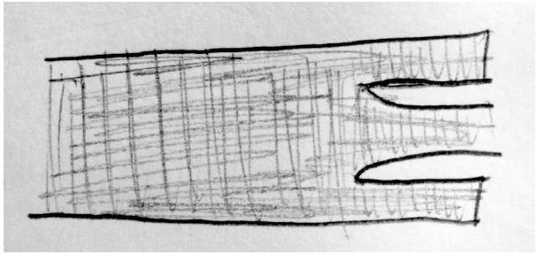
This works because by construction, the fluid in the parts jutting out to the right is almost perfectly at rest.
On the other hand, if we wanted the water to come out perfectly straight, we could simply make a curved mouthpiece that perfectly follows the path the water would have taken if it weren't there, and end it once the water reaches its final area $A _ { 3 }$. At that point, it will come out of the hole straight.

## Remark

Vena contracta is too subtle for introductory textbooks, but it makes a big practical difference. For example, if you estimate how long it takes water in a bucket to empty through a hole using Torricelli's law, you'll be off by up to a factor of 2 if you don't include vena contracta! And Halliday, Resnick, and Krane don't consider it in their example titled "thrust on a rocket", getting a thrust which is also off. Of course, real plumbers and rocket scientists are perfectly aware of vena contracta, and carefully design nozzles and drains to account for it. For further discussion, see this paper.

## 4 Fluid Systems

Now we put it all together and consider complex mechanical systems with moving fluids.
Idea 7
If a fluid is moving in a complex way, it's usually difficult to say anything by directly considering the flow. Instead, it's easier to apply conservation laws.

Example 11
A fluid of density $\rho$ flowing with a fast velocity $v _ { 1 }$ and height $h _ { 1 }$ can undergo a "hydraulic jump", where the height of the fluid increases to $h _ { 2 }$. At the same time, the fluid flow slows down and becomes turbulent.
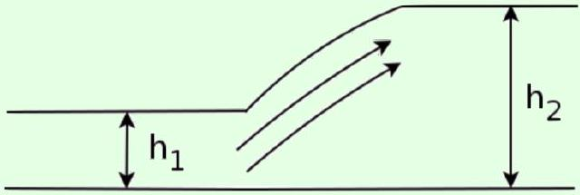
This phenomenon is very common in everyday life. For example, it happens whenever you turn on the water faucet in a sink; the hydraulic jump occurs on a circle centered on the

faucet. Find the final height $h _ { 2 }$.

Solution
During this process, the bulk kinetic energy of the water is not conserved, because it is converted to turbulent motion. However, the horizontal momentum of the water is approximately conserved. Consider a stream of water of width $w$ flowing in the $x$ direction, where the hydraulic jump occurs at $x = 0$. By mass conservation,

$$
v _ { 1 } h _ { 1 } = v _ { 2 } h _ { 2 }
$$

where $v _ { 2 }$ is the final speed. Now we consider a fixed subset of the water encompassing the hydraulic jump. The atmospheric pressure does not yield a net horizontal force on the water, so we focus on the pressure in excess of atmospheric pressure. The total excess pressure force on the left end is

$$
F _ { \ell } = \int _ { 0 } ^ { h _ { 1 } } \rho g h w d h = \frac { 1 } { 2 } \rho g w h _ { 1 } ^ { 2 }
$$

Therefore, we have total force

$$
F = \frac { 1 } { 2 } \rho g w \left( h _ { 1 } ^ { 2 } - h _ { 2 } ^ { 2 } \right) .
$$

On the other hand, the mass of water that flows through the hydraulic jump per unit time is $\rho h _ { 1 } w v _ { 1 }$, and its velocity decreases by $v _ { 1 } - v _ { 2 }$, so

$$
\frac { d p } { d t } = - \rho h _ { 1 } w v _ { 1 } \left( v _ { 1 } - v _ { 2 } \right) = \rho w v _ { 1 } v _ { 2 } \left( h _ { 1 } - h _ { 2 } \right)
$$

where we used mass conservation. Equating $F = d p / d t$ and simplifying gives

$$
g \left( h _ { 1 } + h _ { 2 } \right) = 2 v _ { 1 } v _ { 2 } .
$$

Applying mass conservation again leads to a quadratic in $h _ { 2 }$,

$$
h _ { 2 } ^ { 2 } + h _ { 1 } h _ { 2 } - \frac { 2 v _ { 1 } ^ { 2 } h _ { 1 } } { g } = 0
$$

and the physically relevant positive solution is the answer,

$$
h _ { 2 } = - \frac { h _ { 1 } } { 2 } + \sqrt { \frac { h _ { 1 } ^ { 2 } } { 4 } + \frac { 2 h _ { 1 } v _ { 1 } ^ { 2 } } { g } } .
$$

For $v _ { 1 } ^ { 2 } > g h _ { 1 }$, we have $h _ { 2 } > h _ { 1 }$ and an ordinary hydraulic jump. For $v _ { 1 } ^ { 2 } < g h _ { 1 }$, you might expect a "reverse" hydraulic jump to occur, but this is impossible by the second law of thermodynamics. In a hydraulic jump, some of the kinetic energy of laminar flow energy is converted to turbulent flow, which is essentially heat; thus the reverse can't happen. So in addition to deriving $h _ { 2 }$, we've found the minimum $v _ { 1 }$ for a hydraulic jump to be possible!

Note that this conservation law approach doesn't tell us about how far a fluid will flow before it undergoes a hydraulic jump. That would require understanding the fluid flow in detail, accounting for turbulence and viscosity, which is generally analytically intractable. For more on this subject, see sections 26.1 and 26.2 of Lautrup.

[3] Problem 20 (PPP 70). A tanker full of liquid is at rest on a frictionless horizontal road.
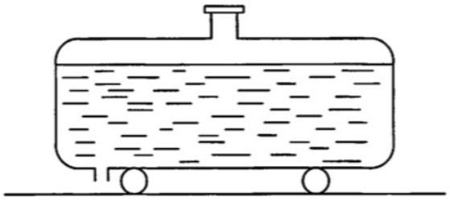
A small vertical outlet pipe at the rear of the tanker is opened. Describe qualitatively how the tanker will move (a) immediately afterward, and (b) after a long time. Assume that the water always falls out of the cart with zero horizontal velocity in the cart's frame.
Solution. (a) The total horizontal momentum of the tanker and liquid is conserved, and is initially zero, so the center of mass of the tanker and liquid cannot move horizontally. When water starts to flow out, it comes out on the tanker's left side. Thus, the tanker has to initially move to the right.
    (b) However, it's impossible for the tanker to always move to the right. If that were the case, then after a long time, when the water has all left, both the tanker and all of the water will be moving to the right, violating momentum conservation. Thus, at some point the tanker has to turn around, and its final velocity is to the left. (However, if the draining process was so violent that the water started sloshing around, then the tanker would jerk back and forth, which would screw up the above argument. We're implicitly assuming that the draining process is slow, so that the water still inside the tanker moves with it.)

By the way, it's worth thinking about the forces that make the tanker move. These forces must be due to water pressure. When the water starts flowing towards the drain, it has a higher velocity near the drain, and thus a lower pressure by Bernoulli's principle. Thus, the total pressure force on the tanker's left wall is lower than that on its right wall, which is why the tanker starts moving to the right. On the other hand, when there's only a thin layer of water left, the part of the water to the right of the drain will have a big leftward horizontal velocity. That leftward momentum is transferred to the tanker near the drain, where the water is forced to turn around and fall down vertically; that's why the tanker starts moving to the left near the end. If you're interested in seeing more, there's a complete analysis here which even includes explicit expressions for the tanker's position over time.

[3] Problem 21 (PPP 74). A jet of water strikes a horizontal gutter of semicircular cross-section obliquely, as shown.
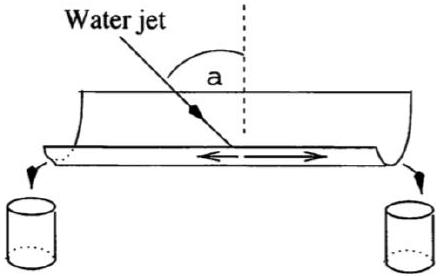
The jet lies in the vertical plane that contains the center-line of the gutter. Assume the angle is relatively shallow, so that the water hits the gutter smoothly, and doesn't splatter. Find the ratio of the quantities of water flowing out at the two ends of the gutter as a function of the angle of incidence $\alpha$ of the jet.

Solution. Let the original water jet have area $A _ { 0 }$ and speed $v$. Let $v _ { 1 }$ be the speed of the stream to the right, and let $A _ { 1 }$ be its area. Similarly define $v _ { 2 }$ and $A _ { 2 }$. First, we claim that

$$
v = v _ { 1 } = v _ { 2 } .
$$

This follows directly from Bernoulli's principle. The incoming jet has atmospheric pressure, because it's exposed to the air, and so do the two streams. Since they have the same pressures, they have the same speeds. (Of course, this wouldn't be true if energy was dissipated. For instance, if the water jet were fast and directed straight down, water would splatter everywhere.)

Next, conservation of mass gives

$$
A _ { 0 } = A _ { 1 } + A _ { 2 } .
$$

Conservation of horizontal momentum gives

$$
\rho A _ { 0 } v ^ { 2 } \sin \alpha = \rho A _ { 1 } v ^ { 2 } - \rho A _ { 2 } v ^ { 2 }
$$

which implies

$$
A _ { 0 } \sin \alpha = A _ { 1 } - A _ { 2 } .
$$

Combining this with mass conservation gives

$$
A _ { 1 } = \frac { 1 + \sin \alpha } { 2 } A _ { 0 } , \quad A _ { 2 } = \frac { 1 - \sin \alpha } { 2 } A _ { 0 } .
$$

Since the speeds are the same, the ratio of flow rates is just the ratio of areas,

$$
\frac { A _ { 1 } } { A _ { 2 } } = \frac { 1 + \sin \alpha } { 1 - \sin \alpha } .
$$

[3] Problem 22 (NBPhO 2005). A water pump consists of a vertical tube of cross-sectional area $S _ { 1 }$ topped with a cylindrical rotating tank of radius $r$. All the vessels are filled with water; there are holes of total cross-sectional area $S _ { 2 } \ll S _ { 1 }$ along the perimeter of the tank, which are open for the operating regime of the pump. The height of the tank from the water surface of the reservoir is $h$. An electric engine keeps the vessel rotation at angular velocity $\omega$. The water density is $\rho$, the atmospheric pressure is $p _ { 0 }$, and the saturated vapor pressure is $p _ { k }$. Inside the tank there are metal blades, which make the water rotate with the tank.
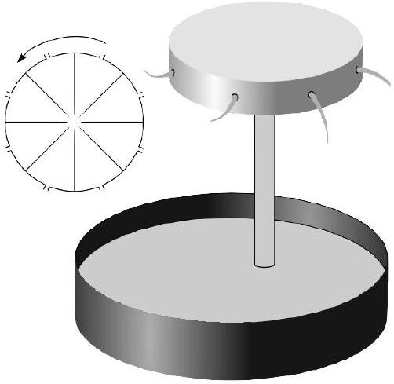
    (a) Find the pressure $p _ { 2 }$ at the perimeter of the tank when all the holes are closed.
    (b) For the rest of the problem, we suppose the holes are opened. Find the velocity $v _ { 2 }$ of the water jets with respect to the ground.

(c) If the tank rotates too fast, the water pressure at some point will become lower than $p _ { k }$. As you'll see in T3, this will cause "cavitation", i.e. the water will start boiling, lowering the pump's efficiency. Find the highest cavitation-free angular speed $\omega _ { \text {max } }$.
(d) If the power of the electric engine is $P$, what is the theoretical upper limit of the mass pumped per unit time, assuming $S _ { 2 }$ can be freely adjusted?

Solution. See the official solutions as usual. This setup is called a centrifugal pump. There are typos in the final answers to the first and third parts; the correct answers are:

$$
\begin{aligned}
p _ { 2 } & = p _ { 0 } - \rho g h + \rho \omega ^ { 2 } r ^ { 2 } / 2 \\
v _ { 2 } & = \sqrt { 2 \left( \omega ^ { 2 } r ^ { 2 } - g h \right) } \\
\omega _ { m } & = \frac { \sqrt { 2 } } { r } \sqrt { g h + \left( \frac { p _ { 0 } - p _ { k } } { \rho } - g h \right) \left( \frac { S _ { 1 } } { S _ { 2 } } \right) ^ { 2 } } \\
\mu & = P / 2 g h
\end{aligned}
$$

[3] Problem 23. A helicopter with length scale $\ell$ and density $\rho _ { h }$ can hover using power $P$, in air of density $\rho _ { a }$. Find a rough estimate for $P$ in terms of the given parameters. (For a nice followup discussion of lift, see section 3.6 of The Art of Insight.)

Solution. Helicopters push themselves upward by pushing air downward. We need

$$
\frac { d p } { d t } \sim \rho _ { h } \ell ^ { 3 } g
$$

to support the aircraft, while considering the rate of air pushed downward gives

$$
\frac { d p } { d t } \sim \frac { d m } { d t } v \sim \rho _ { a } \ell ^ { 2 } v ^ { 2 }
$$

where $v$ is the velocity of the air. By comparing both sides,

$$
v \sim \sqrt { \frac { \rho _ { h } \ell g } { \rho _ { a } } } .
$$

The power needed goes into putting kinetic energy into the air,

$$
P \sim \frac { d m } { d t } v ^ { 2 } \sim \rho _ { a } \ell ^ { 2 } v ^ { 3 } \sim \sqrt { \frac { \ell ^ { 7 } g ^ { 3 } \rho _ { h } ^ { 3 } } { \rho _ { a } } } .
$$

The only thing that might be surprising is the dependence on $\rho _ { a }$, where more energy is required if the air is thinner. (This is why helicopters have trouble rescuing people from Mount Everest.) The reason is that thinner air needs to be pushed down faster to get the same lift, but this requires more power because energy is quadratic in speed. Also, note that this problem couldn't have been solved by dimensional analysis alone, since two densities were present.

Example 12: Kalda 82
A water turbine consists of a large number of paddles that could be considered as light flat boards with length $\ell$, that are at one end attached to a rotating axis. The paddles' free ends are positions on the surface of an imaginary cylinder that is coaxial with the turbine's axis. A stream of water with velocity $v$ and flow rate $\mu ( \mathrm { kg } / \mathrm { s } )$ is directed on the turbine such that it only hits the edges of the paddles.
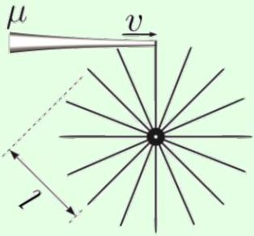
Find the maximum possible power that can be extracted.

Solution
Let $v _ { t }$ be the speed of the edge of the turbine. In time $d t$, the amount of mass of water that collides with the turbine is

$$
d m = \frac { \mu } { v } \left( v - v _ { t } \right) d t
$$

The horizontal force on the paddle is

$$
F = \frac { d p } { d t } = \frac { d m } { d t } \Delta v = \frac { \mu } { v } \left( v - v _ { t } \right) ^ { 2 }
$$

so the power delivered to the turbine is

$$
P = F v _ { t } = \frac { \mu v _ { t } } { v } \left( v - v _ { t } \right) ^ { 2 } .
$$

Maximizing this by setting $d P / d v _ { t } = 0$ gives $v _ { t } = v / 3$, so the maximum power is $4 \mu v ^ { 2 } / 27$. This is 8/27 of the total power in the incoming water.

[3] Problem 24. Air of constant density $\rho$ and wind speed $v _ { i }$ is heading directly towards a windmill of area $A$. When the wind gets to the windmill blades, it is traveling forward with speed $v _ { f }$. Well after it leaves the vicinity of the blades, it has speed $v _ { o }$. The design of the windmill, such as the shape and speed at which its blades turn, can be adjusted to set the value of $v _ { f }$.
    (a) Find the power going from the wind to the turbine by using energy conservation, assuming that there are no extraneous energy losses, e.g. to turbulence.
    (b) Find the power going from the wind to the turbine by considering the force of the windmill on the air and using momentum conservation, again assuming no extraneous energy losses.
    (c) Find an upper bound on the ratio of the wind power that can be harvested by the windmill, to the amount of wind power that would pass through it if it weren't running.

This result is called the Betz limit.

Solution. (a) Since there's nowhere else for the energy to go, the power must be the rate of change of the wind's energy. The mass flow rate is $\mu = \rho A v _ { f }$, so

$$
P = \frac { 1 } { 2 } \mu \left( v _ { i } ^ { 2 } - v _ { o } ^ { 2 } \right) = \frac { 1 } { 2 } \rho A v _ { f } \left( v _ { i } - v _ { o } \right) \left( v _ { i } + v _ { o } \right) .
$$

(b) The (negative) power on the wind is $F v _ { f }$ where $F$ is the rate of change of momentum of the wind. Ideally, all of this power goes to the windmill, so
$$
P = F v _ { f } = \mu \left( v _ { i } - v _ { o } \right) v _ { f } = \rho A v _ { f } ^ { 2 } \left( v _ { i } - v _ { o } \right) .
$$
(c) By comparing these equations, we find $v _ { f } = \left( v _ { i } + v _ { o } \right) / 2$, which allows us to eliminate $v _ { f }$. Plugging this back in gives
$$
P = \frac { 1 } { 4 } \rho A \left( v _ { i } + v _ { o } \right) ^ { 2 } \left( v _ { i } - v _ { o } \right)
$$
which can then be maximized with respect to $v _ { o }$. Setting the derivative to zero gives $v _ { o } = v _ { i } / 3$ and thus $P = ( 8 / 27 ) \rho A v _ { i } ^ { 3 }$. If the windmill were not running, the rate at which wind energy flows through it is $\left( \rho A v _ { i } \right) v _ { i } ^ { 2 } / 2$, which means the maximum fraction harvested is 16/27.

[5] Problem 25. GPhO 2017, problem 2. A very tricky composite fluids/mechanics problem.

## 5 Wet Water

So far we've mostly ignored viscosity and turbulence, an unrealistic limit that some refer to as "dry water". Now we'll consider some problems involving real, wet water.

Idea 8
When the velocity of a flow is not uniform, there is a drag force

$$
F = \eta A \frac { d v } { d y }
$$

which tries to make the velocity more uniform. Here, $\eta$ is the (dynamic) viscosity. Also, when fluid flows next to a wall, the fluid right next to the wall is approximately at rest.

Example 13: HRK
Prairie dogs live in large colonies in complex interconnected burrow systems. They face the problem of maintaining a sufficient air supply to their burrows to avoid suffocation. They avoid this by building conical earth mounds about some of their many burrow openings. How does this air conditioning scheme work?

Solution
Because of viscous effects, the wind speed is small near the ground, and hence grows with height. By Bernoulli's principle, this means the pressure at the top of a mound is slightly lower than the pressure at an opening without a mound. This difference in pressure drives air flow through the burrows.

Example 14
If you've used a standard garden hose, you might have noticed that the water shoots higher if you partially block the outlet with your finger. Why does this happen?

Solution
The water company provides water to your house at a fixed pressure $P _ { \text {atm } } + \Delta P$. Thus, naively the water should always shoot equally far, because Bernoulli's principle says the exit speed is $v = \sqrt { 2 \Delta P / \rho }$, corresponding to a peak height $\Delta P / \rho g$, independent of the area of the hole. (There is a vena contracta effect, as mentioned in problem 19, but this also doesn't depend on the area.)

The resolution is that for a typical long, thin garden hose, viscous losses dominate. As you'll see in problem 26, a higher mass flow rate leads to a higher drop in pressure. When you partially block the outlet, you're simply decreasing the flow rate, so that viscosity has a smaller effect, allowing the water to get closer to the maximum possible height $\Delta P / \rho g$.

In plumbing, the quantity $\Delta P / \rho g$ is called the "pressure head", and effects like viscosity give rise to "head loss". Unfortunately, for most realistic pipes it is intractable to calculate the head loss, because the water flow is turbulent. Instead, the amount of head loss is parametrized by the so-called Darcy friction factor, whose values are tabulated in references.

Example 15
If you stir a cup of coffee, around how long does it take the rotational motion to settle down?

Solution
The rotational motion stops because of viscous drag against the walls. For concreteness, let's suppose the coffee has density $\rho$, viscosity $\eta$, and is in a mug of radius $R$ and height $H \gg R$ (so most of the drag comes from the vertical wall of the mug). The angular momentum is

$$
L \sim I \omega \sim \rho R ^ { 4 } H \omega .
$$

The damping torque due to viscous forces is

$$
\tau \sim R F \sim \eta A \frac { d v } { d r } R
$$

and since the drag is from the vertical wall, $A \sim H R$. Estimating the velocity gradient $d v / d r$ is a little trickier. As mentioned above, the coffee right next to the wall has zero velocity, while the coffee slightly inward from the wall has speed $v \sim R \omega$. The velocity transitions between these two values in a thin "boundary layer".

Finding the exact thickness of this boundary layer would require solving complicated differential equations, but it suffices to use dimensional analysis. Note that $R$ and $H$ can't possibly play a role, since the layer is so thin it doesn't "see" the shape of the mug. The fluid properties $\eta$ and $\rho$ surely matter. Perhaps more subtly, $\omega$ matters. If the fluid weren't

spinning, but rather were uniformly translating in a plane, then the boundary layer would just grow over time until it was the size of the whole fluid. That's what we saw in problem 26, where the velocity changes gradually along the whole pipe radius $R$. The boundary layer doesn't grow to the whole mug's size here, because the velocity it's trying to match is constantly changing over the timescale $1 / \omega$.

Using dimensional analysis, we thus conclude the boundary layer has thickness

$$
\Delta r \sim \sqrt { \frac { \eta } { \rho \omega } } .
$$

The damping torque is

$$
\tau \sim \eta ( H R ) \frac { R \omega } { \Delta r } R \sim \sqrt { \rho \eta \omega ^ { 3 } } H R ^ { 3 }
$$

so the timescale for damping is

$$
T \sim \frac { L } { \tau } \sim \sqrt { \frac { \rho } { \eta \omega } } R .
$$

Numerically, if we use the rough estimates

$$
\rho \sim 10 ^ { 3 } \mathrm {~kg} / \mathrm { m } ^ { 3 } , \quad \omega \sim 10 \mathrm {~s} ^ { - 1 } , \quad R \sim 0.1 \mathrm {~m} , \quad \eta \sim 10 ^ { - 3 } \mathrm { Pas }
$$

where $\eta$ is the value for room temperature water, then we get the reasonable results

$$
\Delta r \sim 0.3 \mathrm {~mm} , \quad T \sim 30 \mathrm {~s} .
$$

[3] Problem 26. Water flows through a cylindrical pipe of radius $R$ and length $L \gg R$, across which a pressure difference $\Delta P$ is applied.

(a) If the flow is slow, viscous effects dominate. By balancing forces on a cylinder of fluid, show that
$$
v ( r ) = \frac { \Delta P } { 4 \eta L } \left( R ^ { 2 } - r ^ { 2 } \right) .
$$
Then show that the total mass flux is
$$
\frac { d m } { d t } = \frac { \rho \pi R ^ { 4 } \Delta P } { 8 \eta L } .
$$
This is called Poiseuille's law.
(b) If the flow is very fast, the flow is turbulent. Viscous effects are negligible, and the work done by the pressure difference is dissipated by turbulence into internal energy. Find a rough estimate of the mass flow rate.

Solution. (a) We see $- \eta ( 2 \pi r L ) d v / d r = \pi r ^ { 2 } \Delta P$, so

$$
d v / d r = - \frac { \Delta P } { 2 \eta L } r .
$$

Integrating and using the fact that $v ( R ) = 0$ yields the desired result. Now, the mass flux is
$$
\begin{aligned}
d m / d t & = \int _ { 0 } ^ { R } ( 2 \pi r d r ) \rho v ( r ) \\
& = 2 \pi \rho \frac { \Delta P } { 4 \eta L } \int _ { 0 } ^ { R } \left( R ^ { 2 } - r ^ { 2 } \right) r d r \\
& = \frac { \rho \pi R ^ { 4 } \Delta P } { 8 \eta L }
\end{aligned}
$$
as desired.
(b) We perform dimensional analysis, leaving $\mu$ out because viscosity is negligible. The parameters of the problem are $\Delta P , L , R$, and $\rho$, which is one more than the number of independent dimensions. However, we can note that the flow rate ought to stay the same if we connect two identical pipes in series, with the same pressure drop $\Delta P$ across each one. This implies that the mass flow rate only depends on the ratio $\Delta P / L$, i.e. the pressure gradient. Carrying out dimensional analysis as usual gives
$$
\frac { d m } { d t } \propto \sqrt { \frac { \rho R ^ { 5 } \Delta P } { L } } .
$$
[4] Problem 27. When a spherical object of radius $R$ moves with velocity $v$ through a fluid of viscosity $\eta$ and density $\rho$, it experiences a drag force.
    (a) Apply dimensional analysis to constrain the possible forms of the drag force $F$. You should find there is one dimensionless quantity inversely proportional to $\eta$, in accordance with the Buckingham Pi theorem of P1. This dimensionless quantity is called the Reynolds number, and it determines what kind of drag dominates.
    (b) It turns out that $F \propto v$ at low velocities and $F \propto v ^ { 2 }$ at high velocities. Using this information, find the form of the drag force in both cases. (For reference below: the answers are
$$
F = 6 \pi \eta R v , \quad F = \frac { 1 } { 2 } C _ { d } \rho A v ^ { 2 }
$$
where $C _ { d }$ is a dimensionless drag coefficient, which is about 1/2 for a sphere. The drag coefficient depends strongly on the shape of the object, being much smaller for streamlined shapes, and weakly on the velocity.)
    (c) Hot water has density $\rho = 10 ^ { 3 } \mathrm {~kg} / \mathrm { m } ^ { 3 }$ and viscosity $\eta = 0.3 \times 10 ^ { - 3 } \mathrm { Pas }$. (Room temperature water has about 3 times the viscosity.) For an object of radius 1 cm, find the characteristic velocity that divides the two types of drag.
    (d) The two cases correspond to flow patterns as shown below.

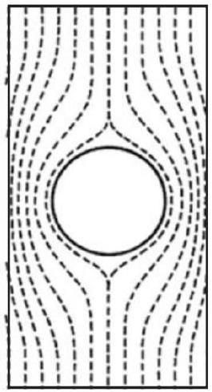
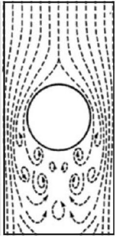

In the latter case, a region of turbulent flow is created. Using this picture, explain why the drag force is proportional to $v ^ { 2 }$.

(e) The results above apply to both liquids and gases. In a gas, the relevant quantities are the mass $m$ of the gas molecules, their typical speed $u$, their number density $n$, and radius $r$ (which determines how often they collide with each other). Use dimensional analysis to constrain the possible forms of the viscosity $\eta$. How do you think $\eta$ scales with $n$ ?

Drag is nicely discussed throughout The Art of Insight; see sections 3.5, 5.3.2, and 8.3.1.2.
Solution. (a) By running a standard dimensional analysis, we find the most general expression with the right dimensions of force is

$$
F = \eta R v f \left( \frac { \rho R v } { \eta } \right) .
$$

In accordance with the Buckingham Pi theorem of P1, we can't pin down the answer exactly; we can only determine it up to an unknown function of $\mathrm { Re } = \rho R v / \eta$, the unique dimensionless quantity in the problem. This quantity is called the Reynolds number; when it is low, viscosity dominates.

(b) At low velocities, viscosity dominates, so we are in the low Reynolds number regime. The fact that $F \propto v$ in this regime means that the function $f$ must approach a constant,
$$
\lim _ { x \rightarrow 0 } f ( x ) = c _ { 1 } .
$$
This implies that $F \propto \eta R v$. At high velocities, we have a high Reynolds number. To get a force $F \propto v ^ { 2 }$, we must have $f ( x ) \sim c _ { 2 } x$ as $x \rightarrow \infty$, giving $F \propto \rho R ^ { 2 } v ^ { 2 }$.
This is an illustration of how dimensional analysis plus a few limiting cases lets us solve a tricky problem. For intermediate velocities, of course, we would need to know the form of $f ( x )$, which is quite complicated and in practice is found from simulations or experiments.
(c) One way of doing this is by noting that the characteristic velocity is when the forces are of the same order,
$$
6 \pi \eta R v = \frac { 1 } { 2 } C _ { d } \rho A v ^ { 2 } \approx \frac { 1 } { 4 } \pi \rho R ^ { 2 } v ^ { 2 }
$$
which gives
$$
v = \frac { 24 \eta } { \rho R } = 7.2 \times 10 ^ { - 4 } \mathrm {~m} / \mathrm { s }
$$

for hot water.
Since the Reynolds number Re is the only dimensionless quantity in the problem, the crossover must correspond to some value for Re. Our rough estimate above corresponds to taking $\operatorname { Re } = 24$. (In reality, the crossover happens at $\operatorname { Re } \sim 10 ^ { 3 }$, but unfortunately there's no easy way to deduce this from first principles; it was measured, not calculated.)
(d) In the ball's frame, the average velocity of the water decreases significantly behind the ball, due to the turbulent flow. Then by momentum conservation, the drag force on the ball is $F = d p / d t \sim v ( d m / d t ) \sim v ( \rho A v ) \propto v ^ { 2 }$.
(e) By a standard dimensional analysis, we have
$$
\eta = \frac { m u } { r ^ { 2 } } g \left( n r ^ { 3 } \right)
$$
where $g$ is an unknown function. Remarkably, we will see in T1 that for a sparse gas, $\eta$ is actually independent of $n$, corresponding to $g$ being a constant.

Remark
Without knowing the answer to part (b) above, one might expect that the drag force can depend on $\eta , \rho , v$, and the shape of the object. In the linear case, the drag force does not depend on $\rho$. In the quadratic case, the drag force does not depend on $\eta$.

These differences can be understood by thinking of where the energy dissipated is going. In the quadratic case, the fluid picks up macroscopic kinetic energy, in the form of a turbulent flow pattern, which is why the drag force does not depend on $\eta$. In the linear case, the fluid slows smoothly and hence does not pick up any macroscopic energy; instead the energy is dissipated as heat. Since the macroscopic kinetic energy is not involved, the drag force does not depend on $\rho$. (Of course, in the quadratic case the turbulent motion eventually stops; at this point it has been converted to heat. The time it takes this to happen is set by $\eta$, but it occurs well after the object has passed by and hence does not affect the drag force.)

Example 16
If raindrops fall, why don't clouds fall?

Solution
This isn't a stupid question! It's actually a tough one, which stumped the ancient Greeks and Romans. To give context, we'll cover a bit of atmospheric physics, a topic we will continue in T1 and T3. This is all a bit of a simplification of an interesting story, told in more detail in chapter II-9 of the Feynman lectures.

First, it's useful to review the water cycle. Sunlight directly warms up the ground, and the ground thereby warms the air near the ground. Since warmer air at the same pressure is less dense, it begins to rise by convection. This air also expands roughly adiabatically as it rises, lowering its temperature. Warmer air can also hold more water, so if the original air was moist, water vapor will condense into droplets as the air rises. (This last point is important,

because the condensation releases energy, partially counteracting the cooling of the rising air. This keeps it warmer and hence lighter than its surroundings, allowing it to continue to rise.)

Now consider a droplet of radius $r$. Depending on the droplet size and velocity, the drag force scales as $r$ or $r ^ { 2 }$, while the gravitational force scales as $r ^ { 3 }$. The tiny water droplets in clouds are thus carried upward with the ascending moist air, since the drag force dominates. They fall down once they accrete into sufficiently large raindrops, where gravity dominates.

Incidentally, falling raindrops do not have the teardrop shape shown in typical illustrations. Small raindrops are nearly spherical, because of surface tension. Large raindrops are squashed by air resistance into a "hamburger" shape.

## Example 17

Why can you see through both humid air and heavy rain, but not through fog or a cloud, which contains droplets of intermediate size?

## Solution

Let's consider a fixed number of water molecules in a fixed volume. When they're all separated, we have humid air. As the molecules join into small droplets the amount of electromagnetic radiation scattered by each droplet grows as $n ^ { 2 }$ because of constructive interference (as discussed in E7), which allows them to scatter a larger fraction of the light that passes through them.

But for the very large droplets found in rain, the trend turns around. These droplets are much larger than the wavelength of light, which means that we're in the geometric optics limit. They can scatter at most 100\% of the light that falls on them, which scales as their area. Since the volume goes as $n$, the area goes as $n ^ { 2 / 3 }$.

We therefore conclude that

$$
\frac { \text { scattering } } { \text { water molecule } } \sim \begin{cases} n & \text { small droplets in cloud/fog } \\ n ^ { - 1 / 3 } & \text { large droplets in rain } \end{cases}
$$

so that clouds occupy a sweet spot, scattering the most light for a given amount of water. The same applies for fog, which is simply a cloud that touches the ground.

## 6 Surface Tension

We now return to surface tension, first covered in M2, which we'll see yet again in T3.

Example 18
A very thin, hollow glass tube of radius $r$ is dipped vertically inside a container of water.
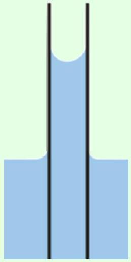
Find the equilibrium height of the water in the tube.

Solution
In M2, we considered problems that could be solved knowing only the "surface tension of water" $\gamma$, which is the energy cost per unit area of having a water-air interface. But in this problem there is also a water-glass interface, and the answer to the question depends on precisely how water and glass interact. Specifically, you need to know the surface tension coefficient $\gamma _ { w g }$ which determines the energy cost of having a water-glass interface.

Fortunately, it turns out you don't need to know $\gamma _ { w g }$ if you know the contact angle $\theta$, i.e. the angle between the glass and water surface at the top of the meniscus, which is drawn as acute in the diagram above. We'll just treat $\theta$ as a given, but for an explanation of how $\theta$ is determined, see T3 or section 5.5 of Lautrup.

Since the glass tube is very thin, surface tension determines the shape of the water-air surface, so it is spherical since spheres minimize area. By some elementary geometry, one can show that the radius of curvature of this sphere is $R = r / \cos \theta$.

We showed using force balance arguments in M2 that the pressure inside the curved water surface is lower than atmospheric pressure by $\Delta P = 2 \gamma / R$. On the other hand, we also know from Pascal's principle that $\Delta P = \rho g h$. Equating the two gives

$$
h = \frac { 2 \gamma \cos \theta } { \rho g r } .
$$

This is Jurin's law.
Physics problems often assume that water and glass have zero contact angle. This implies that water perfectly wets glass, i.e. that a droplet of water placed on a horizontal glass surface will spread to cover it completely. We will follow this assumption below, though in practice, glass tends to quickly get coated in a layer of impurities, leading to a nonzero contact angle.

Example 19: PPP 130
Water in a glass beaker forms a meniscus, as shown below.
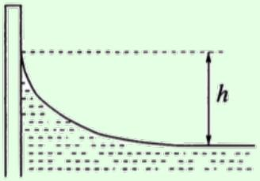
Find the height $h$ to which the meniscus rises above the flat water surface.

Solution
We consider all of the external horizontal forces acting on the water. The surface tension force acting at the top of the meniscus is purely vertical, because water and glass have zero contact angle. The other surface tension force acting on the flat part of the water is $\gamma$ per length. This balances the excess hydrostatic pressure (i.e. the pressure above atmospheric pressure) at the wall, which is $\rho g h ^ { 2 } / 2$ per unit length. Thus,

$$
h = \sqrt { \frac { 2 \gamma } { \rho g } } .
$$

We could have also gotten this with dimensional analysis, up to the prefactor.

Remark
You might be wondering how to compute the shape of the meniscus. There are two methods. First, the pressure right above the water surface is $P _ { \text {atm } }$, so the pressure right below the water surface can be determined from the radii of curvature of the surface, using the Young-Laplace equation from M2. This pressure can also be computed from the height of the surface using Pascal's principle. Combining these two yields a differential equation for the shape with a rather complicated solution, as explained in sections 5.6 and 5.7 of Lautrup. As you'll see in problem 33, you can also derive this result by considering force balance on the water.

Example 20: PPP 29
Water can rise to a height $H$ in a certain capillary tube. Three "gallows" are made from this tubing by bending it, and placed into a tank of water.
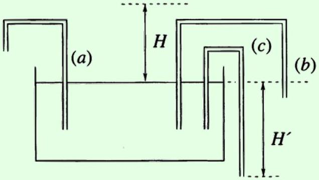

Note that $H ^ { \prime } > H$. For which tubes, if any, does water flow out of the other end?

Solution
Clearly no water can fall out of (a), because this would produce a perpetual motion machine. The gallows (b) and (c) are a bit more subtle. Water will not fall out of a capillary tube if its end is less than a height $H$ below the free water surface; this follows from the same derivation as Jurin's law, with the surface tension acting to hold the water in the tube. So water only falls out of (c).
[2] Problem 28. A soap bubble of radius $R$ and surface tension $\gamma$ has a small tube of radius $r \ll R$ passing through its surface. If the air has density $\rho$, find the rate of decrease of $R$.

Solution. This is an adaptation of a 2006 Russian Olympiad question, with some unnecessary assumptions removed. Let $v$ be the speed of the air as it moves through the tube. Since the tube is thin, the air speed is only significant in and near the tube itself. After the air exits the tube, it spreads out, and before it enters the tube it gradually converges. Thus, within most of the bubble's volume, the air speed is negligible. The pressure at the outside of the tube is $P _ { \text {atm } }$, and the pressure throughout most of the bubble is $P _ { \text {atm } } + 4 \gamma / R$ by the Young-Laplace equation from M2.

Thus, applying Bernoulli's principle between a point near the middle of the bubble and a point near the exit of the tube, we find

$$
v = \sqrt { \frac { 2 \Delta P } { \rho } } = \sqrt { \frac { 8 \gamma } { \rho R } } .
$$

By mass conservation,

$$
\left| \frac { d R } { d t } \right| \left( 4 \pi R ^ { 2 } \right) = \left( \pi r ^ { 2 } \right) v
$$

from which we conclude

$$
\frac { d R } { d t } = - \frac { r ^ { 2 } } { R ^ { 2 } } \sqrt { \frac { \gamma } { 2 \rho R } } .
$$

Technically, the true answer is a bit different because the air inside the bubble is under a slightly higher pressure, and so slightly denser. But $\Delta P \ll P _ { \text {atm } }$ for any bubble you can reasonably make, so this isn't a significant source of error.
[2] Problem 29 (PPP 63). Water is stuck between two parallel glass plates. The distance between the plates is $d$, and the diameter of the trapped water disc is $D \gg d$.
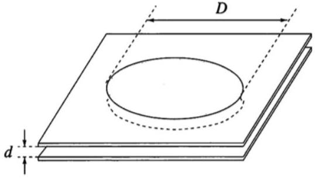
In terms of the surface tension $\gamma$ of water, what is the force acting between the two plates? This effect can cause wet glass plates to stick together.

Solution. If you imagine slicing the puddle of water along a diameter, then its boundaries with the air are arcs of circles, since this minimizes the surface area. Since water perfectly wets glass, these circles are tangent to the two glass plates, which mean they have radius of curvature $d / 2$. In addition, the surface of the water has radius of curvature $D / 2$ in the orthogonal direction. Thus, by the Young-Laplace equation,

$$
\Delta P = \gamma \left( \frac { 2 } { D } - \frac { 2 } { d } \right) \approx - \frac { 2 \gamma } { d } .
$$

This lowered pressure inside the water puddle causes a "suction" force between the two plates, of magnitude

$$
F = | \Delta P | A = \pi ( D / 2 ) ^ { 2 } \frac { 2 \gamma } { d } = \frac { \gamma \pi D ^ { 2 } } { 2 d } .
$$

[3] Problem 30 (NBPhO 2009). A soap film of thickness $h = 1 \mu \mathrm {~m}$ is formed inside a ring of diameter $D = 10 \mathrm {~cm}$, and the surface tension of the film is $\gamma = 0.025 \mathrm {~N} / \mathrm { m }$. If the film is broken at the center, it will begin to fall apart; estimate the time needed for this to happen.

Solution. Like the helicopter question, this can't be solved with pure dimensional analysis, because there are four quantities $( h , D , \gamma$, and the density $\rho )$. Instead, we need to think about the dynamics. The edge of the break will expand outward, pulled by surface tension. This competes with the inertia of the film itself, and the inertia per area only depends on the combination $\rho h$. Thus, we can perform dimensional analysis on the combinations $\rho h , D$, and $\gamma$, giving

$$
t \sim \sqrt { \frac { \rho h } { \gamma } } D \sim 0.02 \mathrm {~s} .
$$

This is good enough for an estimate, but for completeness, we present a more precise solution below.
Assume the film is broken at the center, so the edge of the break will be an expanding circle of radius $r$. The surface tension will provide a force of $4 \pi r \gamma$ outwards, pulling on the mass that was originally inside the circle of $m = \rho \pi r ^ { 2 } h$. Thus, by considering forces along the radial direction (i.e. treating $r$ as a generalized coordinate in the spirit of M4), we have $F _ { r } = d p _ { r } / d t$, or

$$
4 \pi r \gamma = \frac { d m } { d t } v + m \frac { d v } { d t } = 2 \pi r v ^ { 2 } \rho h + \pi r ^ { 2 } \rho h \frac { d v } { d t } .
$$

Cleaning this up a bit, we have

$$
v _ { 0 } ^ { 2 } = v ^ { 2 } + \frac { r } { 2 } \frac { d v } { d t } , \quad v _ { 0 } = \sqrt { \frac { 2 \gamma } { \rho h } } .
$$

This equation tells us that the speed of the break quickly approaches $v _ { 0 }$ when $r$ is small. Our result for $v _ { 0 }$ is called the Taylor-Culick formula; you can see the constant speed in action in slow-motion videos. Thus, the total time taken is

$$
t \approx \frac { D / 2 } { v _ { 0 } } = \sqrt { \frac { \rho h } { 8 \gamma } } D \sim 0.01 \mathrm {~s}
$$

where we used $\rho \approx 10 ^ { 3 } \mathrm {~kg} / \mathrm { m } ^ { 3 }$, since soap films are mostly water.

If you want to be even more precise, we can also solve the differential equation exactly. We can get rid of the $t$-dependence entirely by writing $d v / d t = ( d v / d r ) ( d r / d t ) = v d v / d r$, giving

$$
v _ { 0 } ^ { 2 } = v ^ { 2 } + \frac { r v } { 2 } \frac { d v } { d r } .
$$

Separating and integrating yields

$$
\int \frac { d r } { r } = \int \frac { d v } { 2 } \frac { v } { v _ { 0 } ^ { 2 } - v ^ { 2 } } .
$$

The broken part starts with $v = 0$ and small radius $r _ { 0 }$. Then, integrating and simplifying gives

$$
v ( r ) = v _ { 0 } \sqrt { 1 - \left( r _ { 0 } / r \right) ^ { 4 } }
$$

which indicates that once $r$ becomes larger than the tiny value $r _ { 0 }$, the velocity rapidly approaches $v _ { 0 }$, as stated above. You can go a step further, integrating to find $r ( t )$, but the result is a hypergeometric function, which isn't very enlightening.
[2] Problem 31 (Eotvos 2018). A large sealed cylindrical container of water of density $\rho$ and atmospheric pressure contains an air bubble of volume $V$ and surface tension $\gamma$. The cylinder is in zero gravity, but then begins to rotate with angular velocity $\omega$. If $\omega$ is sufficiently high, the bubble will acquire a simple shape. Qualitatively describe it, and find the condition on $\omega$ for this to occur.

Solution. Working in the frame rotating with the container, the centrifugal force tries to push water outward, which tends to compress the bubble (which contains no water) towards the axis of rotation. Thus, in the limit of high $\omega$, the bubble is shaped like a long cylinder.

For this shape to be achieved, the energy associated with the centrifugal force must dominate over that associated with surface tension. So we must have

$$
\rho V \omega ^ { 2 } r ^ { 2 } \gg \gamma r ^ { 2 }
$$

where $r \sim V ^ { 1 / 3 }$ is the characteristic length of the initial spherical bubble. This is equivalent to $\omega \gg \sqrt { \gamma / \rho V }$. I thank Kai Wen Teo for translating this problem.
[3] Problem 32. USAPhO 2020, problem B1. A nice, slightly mathematically involved surface tension problem with a real-world impact. This setup is discussed in detail in section 5.4 of Lautrup.
[4] Problem 33. IPhO 2023, problem 3, parts B and C. A nice problem on the shape of a meniscus, which also explains why pieces of cereal clump together in a bowl of milk.

Example 21: IPhO 2022 3B
Slightly wet sand is much stronger than either dry sand or very wet sand, which allows the construction of large structures like sand castles. Why is this, and how does the strength depend on the typical size $r$ of the sand grains?

Solution
When a pile of sand is dry, the only force keeping it in place is friction, which is weak. When it's very wet, it's essentially just water, which will simply collapse. But when it's slightly wet, adjacent sand grains have a small layer of water connecting them. Since sand grains are

small, this implies a huge total surface area, and thus large surface tension effects.
There are actually two conceptually distinct components to the effect. First, the bit of water connecting two sand grains will provide a surface tension force $F \sim \gamma r$. Second, as you saw in problem 29, the water has a pressure lower by $\Delta P \sim \gamma / r$, leading to an attractive pressure force $( \Delta P ) A \sim \gamma r$. In either case, that means the force needed to displace a single grain of sand scales with $r$. The number of sand grains in a fixed cross-sectional area scales as $1 / r ^ { 2 }$, so the weight a sand castle can bear scales as $1 / r$. Thus, fine-grained sand is stronger.

This is another example of the subtleties of granular media, first mentioned in M2. Neither sand nor water are strong on their own, but they're strong together. Water provides the forces, while the sand provide the structure which lets those forces be effective.
