## Example 5: IIT JEE 2016

Two thin circular discs, with radii $a$ and $2 a$, are connected by a rod of length $\ell = \sqrt { 24 } a$ through their centers. This rigid object rolls without slipping on a flat table.
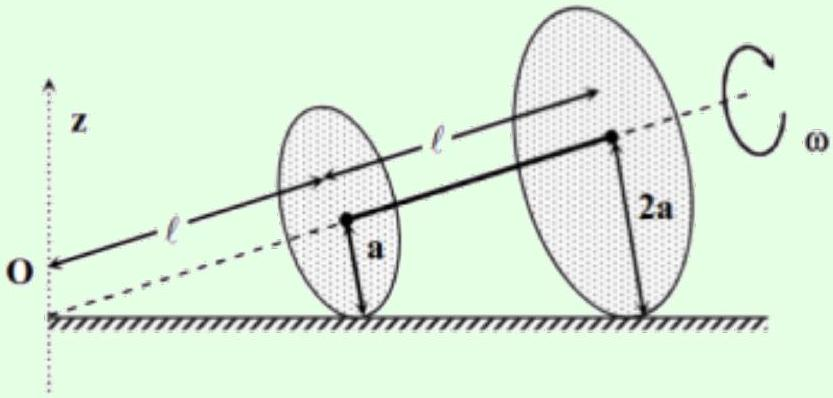
The center of mass of the object rotates about the $z$-axis with an angular speed of $\Omega$. The angular speed of the object about the axis of the rod is $\bar { \omega }$. How are $\Omega$ and $\bar { \omega }$ related?

## Solution

This is the most famous problem ever set on the IIT JEE (condensed for clarity), celebrated by generations of students for its difficulty. But it's also an example of how not to write a 3D rotation problem. Under the standard definition of angular velocity, none of the options provided in the question were correct, while the intended answer requires a nonstandard, arbitrary definition. You can find a detailed explanation of this here, by one of the former top scorers on the JEE, and I'll give a condensed explanation below.

First, let's figure out what's going on. The kinematics of this problem isn't any different from problem 1. Defining the $x$-axis to be horizontal in the figure above, the instantaneous angular velocity is $\boldsymbol { \omega } = \omega \hat { \mathbf { x } }$, while the precession rate is $\boldsymbol { \Omega } = ( \omega / \sqrt { 24 } ) \hat { \mathbf { z } }$. The hard part is figuring out what the question writers meant by "the angular speed $\bar { \omega }$ about the axis of the rod".

If we're only talking about the object's instantaneous motion, then the only possible answer is $\bar { \omega } = \boldsymbol { \omega } \cdot \hat { \mathbf { n } }$, where $\hat { \mathbf { n } }$ is the unit vector pointing along the rod. In that case we have $\Omega / \bar { \omega } = 5 / 24$, but then none of the answer choices in the exam are correct. On the other hand, if we are comparing the object's orientation at different times, then there isn't a

unique answer. At a finite time later, the object will be in a different place, and computing a relative angle requires defining a convention for comparing orientations.

Here's what the problem authors meant. We work in the frame rotating with angular velocity $\boldsymbol { \Omega }$. In this frame, the system is spinning in place, with angular velocity $\boldsymbol { \omega } + \boldsymbol { \Omega }$ parallel to $\hat { \mathbf { n } }$. The definition of $\bar { \omega }$ is $| \boldsymbol { \omega } + \boldsymbol { \Omega } |$, which gives $\Omega / \bar { \omega } = 1 / 5$, the intended answer.

Another way of saying this is that when we compare the orientation of the system at one moment to its orientation at another moment, we bring them to the same position by rotating about the $z$-axis, at which point they differ by a rotation about $\hat { \mathbf { n } }$. But this procedure is totally arbitrary, and not specified by the problem. To pose the problem properly, the writers could have either defined $\bar { \omega }$ explicitly in the rotating frame mentioned above, or replaced it with a quantity with equivalent but unambiguous physical meaning, such as the interval between times a given point on the rim of a disc touches the ground. Fortunately, you'll almost never see problems this ambiguous on Olympiads.

## Remark

One of the most counterintuitive things about 3D rigid body motion is the intermediate axis theorem, which states that if a body has moments of inertia $I _ { 1 } < I _ { 2 } < I _ { 3 }$ about its principal axes, then it can rotate stably about the first and third principal axes, but not the second, "intermediate" axis. You can demonstrate this yourself by throwing a rectangular prism (such a book or a phone) in the air. If you spin it about the intermediate axis, it'll start tumbling. The Soviet physicist Dzhanibekov found a particularly striking example of such motion in zero gravity, which you can see here.

Deriving this theorem requires the full theory of 3D rotational kinematics, which is beyond the scope of the Olympiad, but there's a simple explanation of this effect using conserved quantities. The rotational kinetic energy is

$$
K = \frac { 1 } { 2 } I _ { 1 } \omega _ { 1 } ^ { 2 } + \frac { 1 } { 2 } I _ { 2 } \omega _ { 2 } ^ { 2 } + \frac { 1 } { 2 } I _ { 3 } \omega _ { 3 } ^ { 2 }
$$

while the magnitude squared of the angular momentum is

$$
L ^ { 2 } = I _ { 1 } ^ { 2 } \omega _ { 1 } ^ { 2 } + I _ { 2 } ^ { 2 } \omega _ { 2 } ^ { 2 } + I _ { 3 } ^ { 2 } \omega _ { 3 } ^ { 2 } .
$$

This makes it easy to see why rotation about the third axis is stable: it corresponds to the smallest possible kinetic energy for a given angular momentum.

On the other hand, it's not so clear why the first axis is stable, because it corresponds to the maximum possible kinetic energy. Aren't maxima usually unstable? Generally yes, but in this case, the kinetic energy is the only contribution to the energy. Since kinetic energy is conserved in the short run, there is nowhere else for the energy to go, so a system set spinning about the first axis has to stay that way. (Of course, in the long run energy will be lost to the environment, e.g. by friction. So we might say that rotation about the first axis is stable mechanically, but not thermodynamically.)

However, for rotation about the second, "intermediate" axis, the body can keep both $K$ and $L ^ { 2 }$ the same by turning on some combination of $\omega _ { 1 }$ and $\omega _ { 3 }$. That explains the Dzhanibekov effect. Initially the second principal axis aligns with the direction of $\mathbf { L }$. Then the body rotates so that $\omega _ { 1 }$ and $\omega _ { 3 }$ become nonzero, until the body has completely flipped over. At that point $\omega _ { 1 }$ and $\omega _ { 3 }$ become zero again, with the second principal axis now aligned against L. It's like a one-dimensional oscillation, where $I _ { 2 } \omega _ { 2 } ^ { 2 } / 2$ plays the role of "potential" energy and $I _ { 1 } \omega _ { 1 } ^ { 2 } / 2 + I _ { 3 } \omega _ { 3 } ^ { 2 } / 2$ plays the role of "kinetic" energy.

## 2 Composite Rotation

These are rotational dynamics problems like the ones you saw in M5, but more complex.

[3] Problem 10 (PPP 60). A uniform thin rod is placed with one end on the edge of a table in a nearly vertical position and then released from rest. Find the angle it makes with the vertical at the moment it loses contact with the table. Investigate the following two extreme cases.
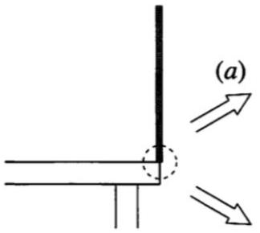
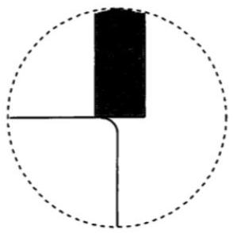
    (a) The edge of the table is smooth (friction is negligible) but has a small, single-step groove.
    (b) The edge of the table is rough (friction is large) and very sharp, which means the radius of curvature of the edge is much smaller than the flat end-face of the rod. Half of the end-face protrudes beyond the table edge, so that when it is released the rod pivots about the edge.

Solution. Let $\ell$ be the length of the rod. By energy conservation, we have

$$
\frac { 1 } { 2 } \frac { 1 } { 3 } m \ell ^ { 2 } \omega ^ { 2 } = m g \frac { \ell } { 2 } ( 1 - \cos \theta ) \Longrightarrow \omega ^ { 2 } = \frac { 3 g } { \ell } ( 1 - \cos \theta ) .
$$

Differentiating this with respect to time gives

$$
2 \omega \dot { \omega } = \frac { 3 g } { \ell } ( \sin \theta ) \dot { \theta } \Longrightarrow \dot { \omega } = \frac { 3 g } { 2 \ell } \sin \theta .
$$

The centripetal and tangential acceleration of the center of mass are

$$
a _ { c } = \frac { \omega ^ { 2 } \ell } { 2 } = \frac { 3 } { 2 } g ( 1 - \cos \theta ) , \quad a _ { t } = \frac { \dot { \omega } \ell } { 2 } = \frac { 3 } { 4 } g \sin \theta .
$$

(a) This is formally identical to the falling ladder problem from M5, and hence has the same answer. But we can also solve the problem directly here. We have
$$
N _ { x } = M \left( a _ { t } \cos \theta - a _ { c } \sin \theta \right) = \frac { 3 } { 4 } M g \sin \theta ( 3 \cos \theta - 2 )
$$
and
$$
N _ { y } = M g - M \left( a _ { c } \cos \theta + a _ { t } \sin \theta \right) = \frac { 1 } { 4 } M g ( 3 \cos \theta - 1 ) ^ { 2 } .
$$
The first one to go to zero is $N _ { x }$, and this happens at $\theta = \cos ^ { - 1 } ( 2 / 3 )$.
(b) In this case, the normal force points along the rod. Therefore,
$$
N - M g \cos \theta = - M a _ { c } ,
$$
so $N = M g \left( \frac { 5 } { 2 } \cos \theta - \frac { 3 } { 2 } \right)$. This becomes zero at $\theta = \cos ^ { - 1 } ( 3 / 5 )$.
[3] Problem 11 (Cahn). A tall, thin brick chimney of height $L$ is slightly perturbed from its vertical equilibrium position so that it topples over, rotating rigidly about its base $B$ until it breaks at a point $P$.
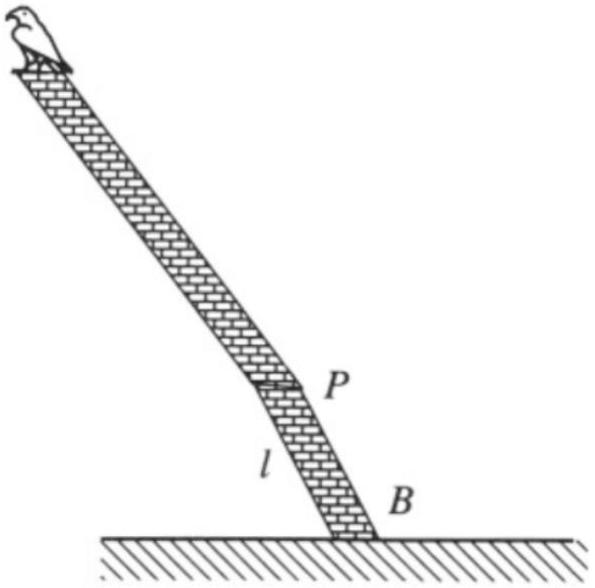
(a) For concreteness, we will model the internal forces in the chimney as shown below. Assume throughout that $r$ is very small.
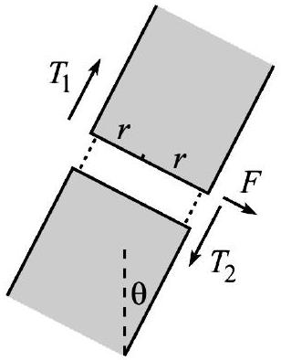
We assume that each piece of the chimney experiences a shear force $F$ and longitudinal tension or compression forces $T _ { 1 }$ and $T _ { 2 }$ from its neighbors. Find the point on the chimney with the greatest $\left| T _ { 1 } \right|$ or $\left| T _ { 2 } \right|$, assuming the chimney is very thin.

(b) Find the point on the chimney experiencing the greatest shear force $F$.
(c) At what point is the chimney most likely to break? Do you think the limiting factor is the chimney's maximal compressive strength, tensile strength, or shear strength?

Solution. See the solution here.

[3] Problem 12. (1) IPhO 2014, problem 1A.
[2] Problem 13 (PPP 14). A bicycle is supported so that it can move forward or backwards but cannot fall sideways; its pedals are in their highest and lowest positions.
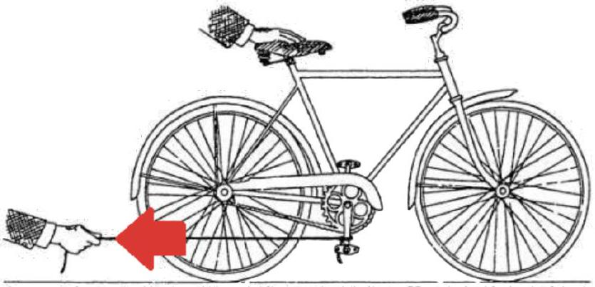
A student crouches beside the bicycle and pulls a string attached to the lower pedal, providing a backward horizontal force.
    (a) Which way does the lower pedal move relative to the ground?
    (b) Which way does the bicycle move?

To check your answer, watch this video.
Solution. (a) The student must do positive work on the bike to let it move, so the force and displacement of the point where the force is applied have to be parallel. That is, the lower pedal moves backwards.

(b) Technically, it depends on the gearing of the bike, but for a typical bike (and for the one shown in the picture) it is backwards. To see this, let's review how a bike works.
A bike works by moving the pedals, which are a distance $r _ { p }$ from the pedal axle. This rotates a gear of radius $r _ { g , p }$, which is connected by a chain to another gear of radius $r _ { g , w }$, which rotates the rear wheel of radius $R$. By accounting for both the gearing ratios, we have
$$
\frac { \text { forward motion of bike } } { \text { backward motion of pedal relative to bike } } = \frac { R } { r _ { g , w } } \frac { r _ { g , p } } { r _ { p } } \text {. }
$$
The entire point of a bike's gearing system is to make this ratio large, so that the bike can go fast without your feet having to move like crazy. And this is indeed true in the image, which has $r _ { p }$ and $r _ { g , p }$ comparable, and $R \gg r _ { g , w }$.
Therefore, if you move the pedal forward a little, the bike goes backward a lot more, so the net motion of the pedal (relative to the ground) is backward, consistent with part (a).
[4] Problem 14. APhO 2005, problem 1B. A problem on parametric resonance, an idea we first encountered in M4. (The problem is good, but it's slightly underspecified, leading to two possible answers which were both accepted. If you get stuck, just make a reasonable assumption.)

[4] Problem 15. INPhO 2020, problem 5. A tough angular collision problem.
[5] Problem 16. EuPhO 2019, problem 2. A tough problem about the motion of an rigid body in a magnetic field.

## 3 Frictional Losses

These miscellaneous problems are grouped under the theme of friction or energy dissipation.
[2] Problem 17 (Kalda). A plank of length $L$ and mass $M$ lies on a frictionless horizontal surface; on one end sits a small block of mass $m$.
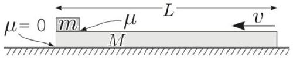
The coefficient of friction between the block and plank is $\mu$. The plank is sharply hit and given horizontal velocity $v$. What is the minimum $v$ required for the block to slide across the plank and fall off the other end?

Solution. If the block barely is able to slide off, then right before it does, it has relative velocity of zero with the plank. By momentum conservation the velocities are $M v / ( M + m )$, so the energy loss is

$$
\Delta E = \frac { 1 } { 2 } M v ^ { 2 } - \frac { 1 } { 2 } ( m + M ) \left( \frac { m v } { m + M } \right) ^ { 2 } = \frac { 1 } { 2 } \frac { m M } { m + M } v ^ { 2 } .
$$

But this is also $\mu m g L$, so $v = \sqrt { 2 \mu g L ( 1 + m / M ) }$.
[3] Problem 18 (BAUPC). A uniform sheet of metal of length $\ell$ lies on a roof inclined at angle $\theta$, with coefficient of kinetic friction $\mu > \tan \theta$. During the daytime, thermal expansion causes the sheet to uniformly expand by an amount $\Delta \ell \ll \ell$. At night, the sheet contracts back to its original length. What is the displacement of the sheet after one day and night?

Solution. When the sheet expands/contracts, it should do so about a certain point that doesn't move by continuity (the opposite ends move in opposite directions). Additionally, the forces from the expansion/contraction should balance so the point remains stationary.

If the center of expansion is a distance $x$ up from the bottom of the sheet, then the compressional force balance for a sheet with linear mass density $\rho$ will be

$$
\mu x \rho g \cos \theta - \rho g x \sin \theta = \mu ( \ell - x ) \rho g \cos \theta + \rho g ( \ell - x ) \sin \theta
$$

which simplifies to

$$
x = \frac { \mu + \tan \theta } { 2 \mu } \ell .
$$

For contraction, the tension at the stationary point a distance $y$ up from the bottom of the sheet has a force balance equation of

$$
\mu y \rho g \cos \theta + \rho g y \sin \theta = \mu ( \ell - y ) \rho g \cos \theta - \rho g ( \ell - y ) \sin \theta
$$

which simplifies to

$$
y = \ell - x = \frac { \mu - \tan \theta } { 2 \mu } \ell .
$$

When the sheet expands by an amount $\Delta \ell$, the distance each point moves is proportional to the distance away from the stationary point since the expansion is uniform. The stationary point for contraction is a distance of $x - y = \ell \tan \theta / \mu$ away from the stationary point for expansion, and will move a distance of $\Delta \ell ( x - y ) / \ell$ down (away from the expansionary point), and stay stationary for contraction. The net displacement for all the points is this distance, which is

$$
\frac { \tan \theta } { \mu } \Delta \ell .
$$

This is a real practical issue for roofs, known as thermal creep.

[4] Problem 19. APhO 2010, problem 1A. An instructive model of an inelastic collision; expect some messy intermediate expressions. I recommend the modified version by Jaan Kalda here.
[5] Problem 20. IPhO 2020, problem 2. A nice problem on anisotropic friction.

## 4 Ropes, Wires, and Chains

Example 6: MPPP 78
A uniform flexible rope passes over two small frictionless pulleys mounted at the same height.
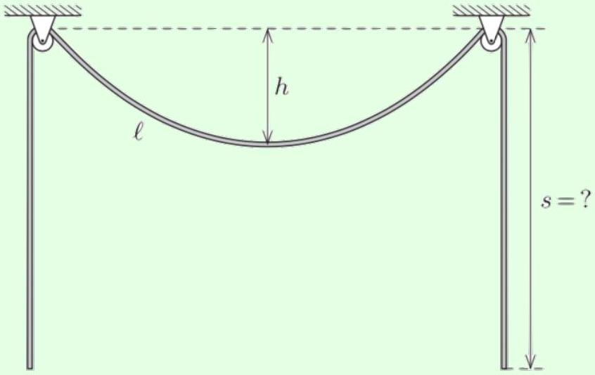
The length of rope between the pulleys is $\ell$, and its sag is $h$. In equilibrium, what is the length $s$ of the rope segments that hang down on either side?

Solution
The problem can be attacked by differential equations, but there is an elegant solution using only algebra. We let our unknowns be $s$, the tension $\mathbf { T } _ { 1 } = \left( T _ { 1 , x } , T _ { 1 , y } \right)$ in the rope at the pulley, and the tension $T _ { 2 }$ at the lowest point.

Considering the entire sagging portion as the system, vertical force balance gives

$$
2 T _ { 1 , y } = \lambda \ell g , \quad T _ { 1 , y } = \lambda \ell g / 2 .
$$

Now consider half of the sagging portion as the system. Horizontal force balance gives

$$
T _ { 2 } = T _ { 1 , x } .
$$

Finally, consider one of the hanging portions as the system. Then

$$
T _ { 1 } = \lambda g s .
$$

We hence have three equations, but four unknowns.
For the final equation, we need to consider how the tension changes throughout the rope. This would usually be done by a differential equation, but there is a clever approach using conservation of energy. Suppose we cut the rope somewhere, pull out a segment $d x$, and reattach the two ends. This requires work $T d x$, where $T$ is the magnitude of the local tension. Now suppose we cut the rope somewhere else, separate the ends by $d x$, and paste our segment inside. This requires work $- T ^ { \prime } d x$. After this process, the rope is exactly in the same state it was before, so the total work done must be zero.

This would seem to prove that $T = T ^ { \prime }$, which is clearly wrong. The extra contribution is that if the two locations have a difference in height $\Delta y$, then it takes work $\lambda g ( \Delta y ) d x$ to move the segment from the first to the second. So in equilibrium, for any two points of the rope,

$$
\Delta T = \lambda g \Delta y .
$$

Therefore, we have

$$
T _ { 1 } - T _ { 2 } = \lambda g h .
$$

Now we're ready to solve. We have

$$
T _ { 1 } ^ { 2 } - T _ { 2 } ^ { 2 } = ( \lambda \ell g / 2 ) ^ { 2 }
$$

from our first three equations, and dividing by this new relation gives

$$
T _ { 1 } + T _ { 2 } = \lambda g \frac { \ell ^ { 2 } } { 4 h } .
$$

This allows us to solve for $T _ { 1 }$, which gives

$$
s = \frac { T _ { 1 } } { \lambda g } = \frac { h } { 2 } + \frac { \ell ^ { 2 } } { 8 h } .
$$

This is a useful result in real engineering projects: it means that the tension in a cable can be estimated by seeing how much it sags.

Example 7: Kalda 27/IPhO 1971
A wedge with mass $M$ and acute angles $\alpha _ { 1 }$ and $\alpha _ { 2 }$ lies on a horizontal surface. A string has been drawn across a pulley situated at the top of the wedge, and its ends are tied to blocks with masses $m _ { 1 }$ and $m _ { 2 }$.
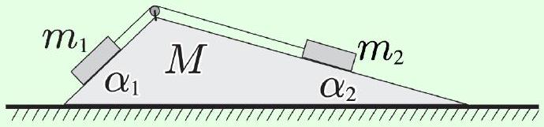

There is no friction anywhere. What is the acceleration of the wedge?

Solution
This is a classic example of a problem best solved with the Lagrangian-like techniques of M4. By working in generalized coordinates, we won't have to solve any systems of equations.

Let $s$ be the distance the rope moves through the pulley, so that both blocks have speed $\dot { s }$ in the noninertial frame of the wedge. The "generalized force" is

$$
F _ { \mathrm { eff } } = - \frac { d V } { d s } = \left( m _ { 1 } \sin \alpha _ { 1 } - m _ { 2 } \sin \alpha _ { 2 } \right) g .
$$

Now, the kinetic energy in the lab frame will be of the form

$$
K = \frac { 1 } { 2 } M _ { \mathrm { eff } } \dot { s } ^ { 2 }
$$

which means that, by the Euler-Lagrange equations,

$$
\ddot { s } = \frac { F _ { \mathrm { eff } } } { M _ { \mathrm { eff } } } .
$$

Our task is now to calculate $M _ { \text {eff } }$. Since the center of mass of the system can't move horizontally, the wedge has speed

$$
v _ { w } = \frac { m _ { 1 } \cos \alpha _ { 1 } + m _ { 2 } \cos \alpha _ { 2 } } { M + m _ { 1 } + m _ { 2 } } \dot { s } .
$$

Now, it's a bit annoying to directly compute the kinetic energy $K$ in the lab frame, but it's easy to compute the kinetic energy in the frame of the wedge: it's simply $\left( m _ { 1 } + m _ { 2 } \right) \dot { s } ^ { 2 } / 2$. But the two are also related simply,

$$
K + \frac { 1 } { 2 } \left( M + m _ { 1 } + m _ { 2 } \right) v _ { w } ^ { 2 } = \frac { 1 } { 2 } \left( m _ { 1 } + m _ { 2 } \right) \dot { s } ^ { 2 } .
$$

Using this to solve for $K$, we conclude

$$
M _ { \mathrm { eff } } = m _ { 1 } + m _ { 2 } - \frac { \left( m _ { 1 } \cos \alpha _ { 1 } + m _ { 2 } \cos \alpha _ { 2 } \right) ^ { 2 } } { M + m _ { 1 } + m _ { 2 } } .
$$

Finally, the desired acceleration is

$$
a _ { w } = \frac { m _ { 1 } \cos \alpha _ { 1 } + m _ { 2 } \cos \alpha _ { 2 } } { M + m _ { 1 } + m _ { 2 } } \ddot { s } .
$$

When you plug in the result for $\ddot { s }$, you'll get a very complicated final answer, but the Lagrangian derivation shows where all the pieces come from.
[3] Problem 21 (Kalda). A rope of mass per unit length $\rho$ and length $L$ is thrown over a pulley so that the length of one hanging end is $\ell$. The rope and pulley have enough friction so that they do not slip against each other.

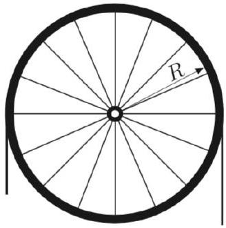
The pulley is a hoop of mass $m$ and radius $R$ attached to a horizontal axle by light spokes. Find the force on the axle immediately after the motion begins.

Solution. Let the distance the rope moves along the pulley be represented by the coordinate $q$. The kinetic energy of the rope is $\frac { 1 } { 2 } \rho L \dot { q } ^ { 2 }$ since every section of the rope moves with velocity $\dot { q }$. Without slipping, the kinetic energy of the pulley is $\frac { 1 } { 2 } m \dot { q } ^ { 2 }$. Another consequence of no slipping is that energy is conserved, so $d K / d t = - d U / d t$.

When the rope moves along a small distance of $d q$, the change in potential energy can be calculated by considering a segment $d q$ moving from one end to another, having a difference in vertical height of $L - \pi R - 2 \ell$. Thus $d U = - \rho g d q ( L - \pi R - 2 \ell )$, so

$$
\frac { d K } { d t } = ( m + \rho L ) \dot { q } \ddot { q } = \rho g \dot { q } ( L - \pi R - 2 \ell ) , \quad \ddot { q } = g \frac { \rho ( L - \pi R - 2 \ell ) } { m + \rho L } .
$$

The vertical normal force can be determined by $\sum m _ { i } \left( a _ { y } \right) _ { i }$ of the rope. The acceleration of the parts moving up and down will cancel out, so the acceleration of the center of mass can be found by considering the "extra" segment of length $L - \pi R - 2 \ell$. The net vertical force on the system is then $\rho ( L - \pi R - 2 \ell ) \ddot { q }$, so the force on the axle $N$ satisfies $( m + \rho L ) g - N = \rho ( L - \pi R - 2 \ell ) \ddot { q }$.

$$
N _ { y } = g \frac { ( m + \rho L ) ^ { 2 } - \rho ^ { 2 } ( L - \pi R - 2 \ell ) ^ { 2 } } { m + \rho L } .
$$

Since rope is transferred to the right, there is also a horizontal component of force on the axle. When the rope moves along a distance $d q , \sum m _ { i } d x _ { i }$ is essentially $\rho d q ( 2 R )$ since it can be seen as a segment of length $d q$ moving to the other side. Thus $F _ { x } = \rho \ddot { q } ( 2 R )$, and

$$
N _ { x } = 2 \rho R g \frac { \rho ( L - \pi R - 2 \ell ) } { m + \rho L } .
$$

The answers are ugly, but they come from combining a few ingredients in a straightforward way.

[3] Problem 22 (French 5.10). Two equal masses are connected as shown with two identical massless springs of spring constant $k$.
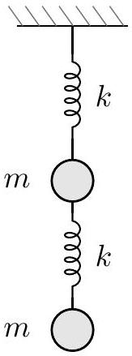

Considering only motion in the vertical direction, show that the ratio of the frequencies of the two normal modes is $( \sqrt { 5 } + 1 ) / ( \sqrt { 5 } - 1 )$.

Solution. Let $y _ { 1 }$ denote the displacement of the upper mass and $y _ { 2 }$ for the lower mass. The equations of motion are

$$
m \ddot { y } _ { 1 } = - k y _ { 1 } - k \left( y _ { 1 } - y _ { 2 } \right) = - 2 k y _ { 1 } + k y _ { 2 } , \quad m \ddot { y } _ { 2 } = - k y _ { 2 } + k y _ { 1 }
$$

For normal modes, the particles will oscillate at the same frequency. Guessing a form $y _ { 1 } =$ $A e ^ { i \left( \omega t + \phi _ { 1 } \right) } = \tilde { A } e ^ { i \omega t }$ and $y _ { 2 } = \tilde { B } e ^ { i \omega t }$ and defining $\alpha = \omega / \sqrt { k / m }$, the equations are

$$
- \omega ^ { 2 } \tilde { A } = - 2 \omega _ { 0 } ^ { 2 } \tilde { A } + \omega _ { 0 } ^ { 2 } \tilde { B } , \quad - \omega ^ { 2 } \tilde { B } = - \omega _ { 0 } ^ { 2 } \tilde { B } + \omega _ { 0 } ^ { 2 } \tilde { A } .
$$

Dividing these equations gives

$$
\frac { \tilde { A } } { \tilde { B } } = \frac { 1 } { 2 - \alpha ^ { 2 } } = \frac { 1 - \alpha ^ { 2 } } { 1 } .
$$

Solving for $\alpha$, we find

$$
\alpha ^ { 4 } - 3 \alpha ^ { 2 } + 1 = 0 , \quad \alpha ^ { 2 } = \frac { 3 \pm \sqrt { 5 } } { 2 }
$$

Then the ratio of the two normal mode frequencies is

$$
\frac { \alpha _ { 1 } } { \alpha _ { 2 } } = \sqrt { \frac { 1 + 5 + 2 \sqrt { 5 } } { 1 + 5 - 2 \sqrt { 5 } } } = \frac { \sqrt { 5 } + 1 } { \sqrt { 5 } - 1 }
$$

as desired.

[3] Problem 23 (Kalda). A massless rod of length $\ell$ is attached to the ceiling by a hinge which allows the rod to rotate in a vertical plane.
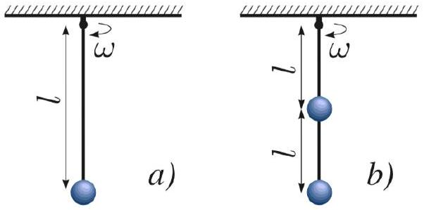
The rod is initially vertical and the hinge is spun with a fixed angular velocity $\omega$.
    (a) Before starting, explain why this problem has to use rods, and not just strings.
    (b) If a mass $m$ if attached to the bottom of the rod, find the maximum $\omega$ for which the configuration is stable.
    (c) [A] Now suppose another mass $m$ and rod of length $\ell$ is attached to the first mass by an identical hinge that turns in the same direction, as shown above. Find the maximum $\omega$ for which the configuration is stable. (Hint: the configuration is unstable if any infinitesimal change in the angles of the rods can lower the energy.)

Solution. (a) If you take an ideal string and twist one end of it, then nothing will happen to an object hanging from the other side. By contrast, if you did the same thing with a rod, then the object would start rotating. The difference is that a rod can transmit torsion (torque about its own axis), while an ideal string does not.

(b) First, let's imagine what this motion looks like in the lab frame. If we define $\theta$ as the direction of the rod to the vertical axis, the spinning of the hinge fixes $d \theta / d t = \omega$. So if the mass's height is fixed, this forces the mass to spin in a circle. More generally, it exerts a confusing time-dependent force on the mass.
We don't want to deal with that, so we work in the frame rotating with the hinge. In this frame, the rod doesn't rotate about the vertical axis; it just changes its tilt $\theta$ to the vertical, in the plane of the page. The effective potential from the centrifugal force $m \omega ^ { 2 } r$ is $- \int _ { 0 } ^ { r } m \omega ^ { 2 } r ^ { \prime } d r ^ { \prime } = - \frac { 1 } { 2 } m \omega ^ { 2 } r ^ { 2 }$, where $r$ is the distance from the vertical axis through the hinge. In this setup, $r = \ell \sin \theta$ and the potential energy from gravity is $m g \ell ( 1 - \cos \theta )$. For small angles, the potential energy is
$$
U \approx m g \ell \left( 1 - \left( 1 - \frac { 1 } { 2 } \theta ^ { 2 } \right) \right) - \frac { 1 } { 2 } m \omega ^ { 2 } \ell ^ { 2 } \theta ^ { 2 } = \frac { 1 } { 2 } \theta ^ { 2 } \left( m g \ell - m \omega ^ { 2 } \ell ^ { 2 } \right)
$$
The system is stable when $U ^ { \prime \prime } ( \theta ) > 0$, so the maximum value of $\omega$ for stability is
$$
\omega _ { \max } = \sqrt { g / \ell } .
$$
(c) Let the angles between the vertical and the upper, lower rods be $\theta _ { 1 } , \theta _ { 2 } \ll 1$ respectively. The gravitational potential energy of the lower mass is $m g \ell \left( 1 - \cos \theta _ { 1 } \right) + m g \ell \left( 1 - \cos \theta _ { 2 } \right)$, and the Taylor expansion gives $U _ { 2 } = \frac { 1 } { 2 } m g \ell \left( \theta _ { 1 } ^ { 2 } + \theta _ { 2 } ^ { 2 } \right)$. Using the rotating reference frame again, the potential energy from the centrifugal force is $\frac { 1 } { 2 } m \omega ^ { 2 } r ^ { 2 }$, where $r = \ell \left( \sin \theta _ { 1 } + \sin \theta _ { 2 } \right) \approx \ell \left( \theta _ { 1 } + \theta _ { 2 } \right)$ since the hinges go in the same direction. The total potential of the system (same potential for the first mass) is then
$$
\begin{aligned}
U \left( \theta _ { 1 } , \theta _ { 2 } \right) & = m g \ell \theta _ { 1 } ^ { 2 } + \frac { 1 } { 2 } m g \ell \theta _ { 2 } ^ { 2 } - \frac { 1 } { 2 } m \omega ^ { 2 } \ell ^ { 2 } \theta _ { 1 } ^ { 2 } - \frac { 1 } { 2 } m \omega ^ { 2 } \ell ^ { 2 } \left( \theta _ { 1 } + \theta _ { 2 } \right) ^ { 2 } \\
& = m \ell ^ { 2 } \left( \left( \omega _ { 0 } ^ { 2 } - \omega ^ { 2 } \right) \theta _ { 1 } ^ { 2 } + \frac { 1 } { 2 } \left( \omega _ { 0 } ^ { 2 } - \omega ^ { 2 } \right) \theta _ { 2 } ^ { 2 } - \omega ^ { 2 } \theta _ { 1 } \theta _ { 2 } \right)
\end{aligned}
$$
where $\omega _ { 0 } ^ { 2 } = g / \ell$. To be stable, we want the potential energy to be at a local minimum near that point. We could test this by considering a general infinitesimal change in the angles.
However, the fastest way is to use the second derivative test for two-variable functions $f ( x , y )$. Let's consider a critical point of such a function, where $\partial f / \partial x = \partial f / \partial y = 0$. For $f$ to be a minimum along the $x$ and $y$ directions, we clearly need to have
$$
\frac { \partial ^ { 2 } f } { \partial x ^ { 2 } } > 0 , \quad \frac { \partial ^ { 2 } f } { \partial y ^ { 2 } } > 0 .
$$
In this problem, these are both true if $\omega < \omega _ { 0 }$.
However, we also have to worry whether it's possible to decrease the potential energy by traveling in some other direction. It turns out we are guaranteed to have a true minimum if
$$
\frac { \partial ^ { 2 } f } { \partial x ^ { 2 } } \frac { \partial ^ { 2 } f } { \partial y ^ { 2 } } > \left( \frac { \partial ^ { 2 } f } { \partial x \partial y } \right) ^ { 2 } .
$$
In this problem, that condition is
$$
2 \left( \omega _ { 0 } ^ { 2 } - \omega ^ { 2 } \right) ^ { 2 } - \omega ^ { 4 } > 0 .
$$

This quantity is positive for $\omega = 0$, and first hits zero when
$$
\omega ^ { 2 } = \omega _ { 0 } ^ { 2 } ( 2 - \sqrt { 2 } ) .
$$
We therefore conclude that
$$
\omega _ { \max } = \sqrt { \frac { g } { l } ( 2 - \sqrt { 2 } ) } .
$$
[4] Problem 24 (PPP 106). A long, heavy flexible rope with mass $\rho$ per unit length is stretched by a constant force $F$. A sudden movement causes a circular loop to form at one end of the rope.
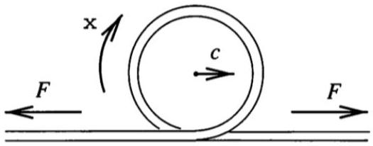
The center of the loop moves with speed $c$ as shown.
    (a) Find the speed $c$, assuming gravity is negligible.
    (b) Find the energy $E$ carried by a loop rotating with angular frequency $\omega$.
    (c) Show that the momentum $p$ carried by the loop obeys $E = p c$. This is true for waves in general, as we'll see in $\mathbf { W 1 }$.
    (d) Find the angular momentum carried by the loop, about a point on the rope on the ground.

Solution. (a) By balancing forces on a small piece of the rope,

$$
\rho \left( c ^ { 2 } / R \right) ( R d \theta ) = F d \theta
$$

which gives $F = \rho c ^ { 2 }$, so $c = \sqrt { F / \rho }$.

(b) The mass of the loop is $m = 2 \pi R \rho$. Splitting the energy into center of mass energy and rotational energy, we have
$$
E = \frac { 1 } { 2 } m c ^ { 2 } + \frac { 1 } { 2 } \left( m R ^ { 2 } \right) \omega ^ { 2 } = m c ^ { 2 } = 2 \pi R F = \frac { 2 \pi F c } { \omega } ,
$$
since $c = \omega R$.
(c) Since the loop as a whole moves with speed $c$ and has mass $m$, we have $p = m c$. Since $E = m c ^ { 2 }$, we have $E = p c$ as desired.
(d) The orbital and spin angular momentum are
$$
L _ { o } = m c R = \frac { m c ^ { 2 } } { \omega } , \quad L _ { s } = I \omega = m R ^ { 2 } \omega = \frac { m c ^ { 2 } } { \omega } .
$$
They happen to be equal, and the total angular momentum is $2 m c ^ { 2 } / \omega$.

## 5 [A] Advanced Mathematical Techniques

The following problems were cut from earlier problem sets because they required more advanced math; however, they illustrate some very neat and important ideas.
