## Mechanics VIII: 3D Rotation

Three-dimensional rotation is covered in chapter 7 of Kleppner and Kolenkow and chapter 9 of Morin. For further discussion and examples, see chapter I-20 of the Feynman lectures. There is a total of 96 points.

## 1 3D Rotation

In M6, we considered mostly two-dimensional rotation. Now we will tackle the full three-dimensional case, starting with the general description of rigid body motion.

Idea 1: Chasles' Theorem
The instantaneous velocity of a three-dimensional rigid body can always be decomposed in one of two ways. First, for any given point, it can be written in terms of a translational velocity plus a pure rotation about an axis going through that point. In practice, this point is almost always chosen to be the center of mass, giving the decomposition

$$
\mathbf { v } = \mathbf { v } _ { \mathrm { CM } } + \boldsymbol { \omega } \times \left( \mathbf { r } - \mathbf { r } _ { \mathrm { CM } } \right) .
$$

Alternatively, there always exists an axis so that the motion can be written as rotation about that axis, plus a translational velocity parallel to the axis, giving

$$
\mathbf { v } = \mathbf { v } _ { 0 } + \omega \times \left( \mathbf { r } - \mathbf { r } _ { 0 } \right)
$$

where $\mathbf { v } _ { 0 }$ and $\boldsymbol { \omega }$ are parallel. (This is known as a "screw" motion.) In both cases, $\boldsymbol { \omega }$ is the same, and its direction defines the axis of rotation. These two decompositions are analogous to the two we saw in M5, and both will be useful below.

Idea 2
Sometimes it can be hard to visualize $\boldsymbol { \omega }$, so here are two tricks. First, if any two points on the object are stationary, then $\boldsymbol { \omega }$ must be parallel to the axis connecting the two points. Second, if the rotation is complicated, one can use rotating frames to simplify the analysis. If a body has angular velocity $\boldsymbol { \omega } _ { 1 }$ in one frame, and that frame has an angular velocity $\boldsymbol { \omega } _ { 2 }$ with respect to a second frame, then the body has angular velocity $\boldsymbol { \omega } _ { 1 } + \boldsymbol { \omega } _ { 2 }$ with respect to the second frame.

Example 1
You have a small globe, which is mounted so that it can spin on the polar axis and can be spun about a horizontal axis (so that the south pole can be on top). Give the globe a quick spin about the polar axis, and then, before it stops, give it another quick spin about the horizontal axis. Are there any points on the globe that are at rest?

Solution
The first spin gives the angular velocity a vertical component $\boldsymbol { \omega } _ { 1 }$. The second spin gives the angular velocity an additional horizontal component $\boldsymbol { \omega } _ { 2 }$. The globe now rotates about its center of mass with angular velocity $\boldsymbol { \omega } _ { 1 } + \boldsymbol { \omega } _ { 2 }$. Precisely two points on the globe are stationary, namely the points that are parallel and antiparallel to this vector.

[2] Problem 1 (Morin 9.3). A cone rolls without slipping on a table; this means that all the points of the cone that touch the table are instantaneously stationary. The half-angle of the vertex is $\alpha$, and the axis has length $h$.
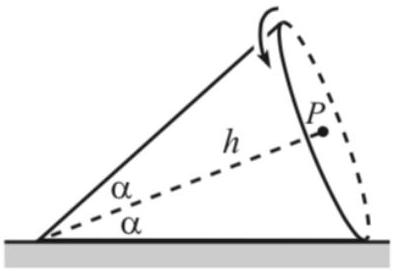
Let the speed of the center of the base, point $P$ in the figure, be $v$.
    (a) Compute the angular velocity $\boldsymbol { \omega }$ by thinking of the motion as pure rotation about some axis.
    (b) Compute the angular velocity $\boldsymbol { \omega }$ by thinking of the motion as translation of $P$, plus rotation about an axis passing through $P$.
    (c) The apex of the cone is fixed, and the cone continues to rotate. As this motion goes on, the angular velocity vector rotates uniformly, keeping a constant magnitude. Find the precession rate $\boldsymbol { \Omega }$, i.e. the constant vector that satisfies $d \boldsymbol { \omega } / d t = \boldsymbol { \Omega } \times \boldsymbol { \omega }$ at all times.

Heuristically, the precession rate $\boldsymbol { \Omega }$ is "the angular velocity of the angular velocity". For the relevant problems below, it's important to keep track of the difference between $\boldsymbol { \omega }$ and $\boldsymbol { \Omega }$.

Solution. (a) The points of the cone that touch the table form a line. This whole line is instantaneously stationary, so the motion is pure rotation about this axis. Let $d$ be the distance from $P$ to the ground. Then the speed of point $P$ is $v = \omega d$, which gives

$$
\omega = \frac { v } { d } = \frac { v } { h \sin \alpha } .
$$

(b) The point $P$ has speed $v$. The point directly below $P$ is at rest, and its velocity can also be written as $v - \omega d$. Then $v = \omega d$, giving the same answer as above.
(c) The center of the base moves in a circle of radius $h \cos \alpha$ with speed $v$, and hence completes one cycle in time $2 \pi h \cos \alpha / v$. Hence the precession rate is
$$
\mathbf { \Omega } = - \frac { v } { h \cos \alpha } \hat { \mathbf { z } }
$$
where we used the right hand rule to find the sign. Note how this is distinct from the angular velocity: not only do they have totally different magnitudes, they point in totally different directions! The angular velocity vector only describes what a body is doing right now. It is completely independent of $\boldsymbol { \Omega }$, which is about what the body will do in the future.

Most of our statements about rotational dynamics from M5 remain true. The main new aspect is that angular momentum is not necessarily parallel to angular velocity.

Example 2: KK Example 7.4
Consider a rigid body consisting of two particles of mass $m$ connected by a massless rod of length $2 \ell$, rotating about the $z$-axis with angular velocity $\omega$ as shown.
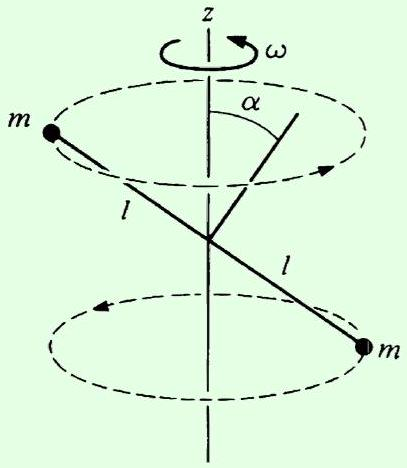
Find the angular momentum of the system.

Solution
We simply add $\mathbf { r } \times \mathbf { p }$ for both masses. Let the rod lie in the $x z$ plane at this moment. Then for the top left mass,

$$
\mathbf { r } = - \ell \cos \alpha \hat { \mathbf { x } } + \ell \sin \alpha \hat { \mathbf { z } } .
$$

The momentum is

$$
\mathbf { p } = m \mathbf { v } = m \boldsymbol { \omega } \times \mathbf { r } = - m \omega \ell \cos \alpha \hat { \mathbf { y } } .
$$

Then the angular momentum is

$$
\mathbf { L } = \mathbf { r } \times \mathbf { p } = m \omega \ell ^ { 2 } \cos \alpha ( \sin \alpha \hat { \mathbf { x } } + \cos \alpha \hat { \mathbf { z } } ) .
$$

The other mass has the opposite r and p and hence the same L, so the total angular momentum is

$$
\mathbf { L } = 2 m \omega \ell ^ { 2 } \cos \alpha ( \sin \alpha \hat { \mathbf { x } } + \cos \alpha \hat { \mathbf { z } } ) .
$$

It is directed perpendicular to the rod, and in particular, it isn't parallel to the angular velocity!
Here is another way to derive the same result. We can decompose the angular velocity vector into a component along the rod, and a component perpendicular to the rod. The former contributes no angular momentum, because rotating about the rod's axis doesn't move the masses. The latter contributes all the angular momentum. So the angular momentum is

$$
L = I _ { \perp } \omega _ { \perp } = \left( 2 m \ell ^ { 2 } \right) ( \omega \cos \alpha )
$$

directed perpendicular to the rod, which is what we just saw explicitly.
We can summarize the lessons drawn from this example as follows.

Idea 3
For a three-dimensional object, $\mathbf { L }$ is not necessarily parallel to $\boldsymbol { \omega }$. In general, for pure rotation about an axis passing through the origin, we have $\mathbf { L } = I \boldsymbol { \omega }$ where $I$ is a 3 × 3 matrix called the "moment of inertia tensor about the origin". In components, this means that

$$
L _ { i } = \sum _ { j } I _ { i j } \omega _ { j } .
$$

While this is simple and general, the $I _ { i j }$ are a pain to calculate. You can learn more in the reading, but to my knowledge, no Olympiad problem has ever required computing a general moment of inertia tensor.

For the purposes of Olympiad problems, there is a better way to think about the angular momentum. We use the first decomposition of idea 1, and think of the motion as translation plus rotation about the center of mass. If the object has an axis of symmetry, which it will in almost all Olympiad problems, then the angular velocity can then be decomposed into a component parallel to the axis, and perpendicular to the axis,

$$
\omega = \omega _ { \| } + \omega _ { \perp } .
$$

The key is that, in such situations, the spin angular momentum has two pieces, which are each parallel to the corresponding piece of the angular velocity,

$$
\mathbf { L } _ { \| } = I _ { \| } \boldsymbol { \omega } _ { \| } , \quad \mathbf { L } _ { \perp } = I _ { \perp } \boldsymbol { \omega } _ { \perp }
$$

where $I _ { \| }$and $I _ { \perp }$ are ordinary moments of inertia about the center of mass. For example, for a flat uniform disc, $I _ { \| } = M R ^ { 2 } / 2$ and $I _ { \perp } = M R ^ { 2 } / 4$.

The total angular momentum about the origin is then

$$
\mathbf { L } = \mathbf { r } _ { \mathrm { CM } } \times M \mathbf { v } _ { \mathrm { CM } } + I _ { \| } \boldsymbol { \omega } _ { \| } + I _ { \perp } \boldsymbol { \omega } _ { \perp }
$$

where the first term is from the motion of the center of mass, and the next two are from rotation about the center of mass. Note that this is exactly the same as what we saw in M5, except that the "spin" angular momentum is broken into two parts.

Finally, the rate of change of angular momentum is

$$
\frac { d \mathbf { L } } { d t } = \boldsymbol { \tau }
$$

where the torque $\boldsymbol { \tau }$ is defined as in M5. The kinetic energy is

$$
K = \frac { 1 } { 2 } M v _ { \mathrm { CM } } ^ { 2 } + \frac { 1 } { 2 } I _ { \| } \omega _ { \| } ^ { 2 } + \frac { 1 } { 2 } I _ { \perp } \omega _ { \perp } ^ { 2 } .
$$

Remark
In any dynamics problem, there are many choices you can make in the setup. For example, if you're using an inertial frame, you need to choose where the origin is; usually it's best to place it along the axis of symmetry if possible. You are also free to use a noninertial frame with acceleration a. The only difference is that there will be a fictitious force $- M \mathbf { a }$ acting at the center of mass. For that reason, it's usually best to have the accelerating frame follow the center of mass, keeping it at its origin, so no new torques are introduced.

However, you should usually avoid rotating reference frames for dynamics problems. Not only will there be position-dependent Coriolis and centrifugal forces, but they'll contribute torques which are a pain to calculate, as you saw in M6. In general, rotating frames are only good for getting a handle on the kinematics, as mentioned in idea 2.

Example 3: KK Example 7.5
Calculate the magnitude of the torque on the rod in example 2.

Solution
We recall that the angular momentum was

$$
\mathbf { L } = 2 m \omega \ell ^ { 2 } \cos \alpha ( \sin \alpha \hat { \mathbf { x } } + \cos \alpha \hat { \mathbf { z } } ) .
$$

The rod as a whole rotates with angular velocity $\omega \hat { \mathbf { z } }$. In particular, the angular momentum vector rotates with this angular velocity as well; its horizontal component moves in a circle with angular velocity $\omega$. Then

$$
| \boldsymbol { \tau } | = \left| \frac { d \mathbf { L } } { d t } \right| = \omega L _ { x } = 2 m \omega ^ { 2 } \ell ^ { 2 } \cos \alpha \sin \alpha = m \omega ^ { 2 } \ell ^ { 2 } \sin ( 2 \alpha ) .
$$

It might be surprising that there needs to be a torque given that $\boldsymbol { \omega }$ is constant, but that's just because $\mathbf { L }$ and $\boldsymbol { \omega }$ aren't necessarily parallel. Conversely, there can be situations where there is no torque, yet $\boldsymbol { \omega }$ changes over time.

[2] Problem 2 (Morin 9.10). A stick of mass $m$ and length $\ell$ spins with angular frequency $\omega$ around an axis in zero gravity, as shown.
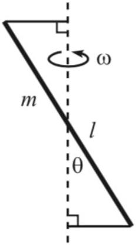
The stick makes an angle $\theta$ with the axis and is kept in its motion by two strings that are perpendicular to the axis. Find the tension in the strings.

Solution. This is a very slight variation on the example. Again, the component of angular velocity parallel to the stick contributes no angular momentum, and the component perpendicular to the stick is $\omega \sin \theta$, so it contributes

$$
L = \frac { 1 } { 12 } m \ell ^ { 2 } \omega \sin \theta .
$$

Only the horizontal component of $\mathbf { L }$ is changing over time, so the magnitude of the torque is $\tau = \omega L \cos \theta$. On the other hand, we also know that the torque is $2 T ( \ell / 2 ) \cos \theta$. Equating these expressions and solving gives

$$
T = \frac { 1 } { 12 } m \ell \omega ^ { 2 } \sin \theta .
$$

[3] Problem 3 (KK 7.1). A thin hoop of mass $M$ and radius $R$ rolls without slipping about the $z$-axis. It is supported by an axle of length $R$ through its center, as shown.
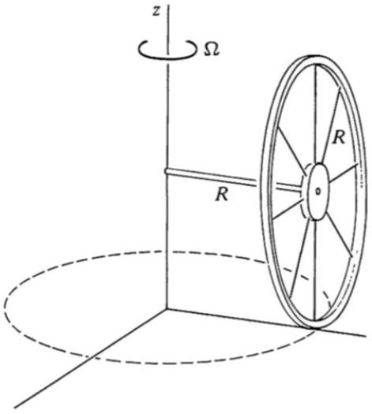
The axle circles around the $z$-axis with angular speed $\Omega$, so that the bottom point of the wheel traces out a circle of radius $R$. Let $O$ be the pivot point of the rod, i.e. the point where the rod meets the $z$-axis.
    (a) Find the instantaneous angular velocity $\boldsymbol { \omega }$ of the hoop. (Before moving forward, you'll want to be totally sure you have this part right. Sometimes, students get confused on it because they imagine a symmetric pair of hoops instead. However, if you actually had a pair, the setup wouldn't even make sense. Why not?)
    (b) As the motion continues, the angular velocity vector rotates in a circle. Find the precession rate $\boldsymbol { \Omega }$ of this system.
    (c) Find the instantaneous angular momentum $\mathbf { L }$ of the hoop, about the point $O$.

Solution. (a) Since both $O$ and the bottom point of the hoop are stationary, the angular velocity must be parallel to the line joining them,

$$
\omega \propto \hat { \mathbf { z } } - \hat { \mathbf { y } } .
$$

In fact, the motion can be thought of as pure rotation about the line joining them. Now consider the motion of the rod. The $y$-component of the angular velocity doesn't affect the rod, while the $z$-component makes it rotate about the $z$-axis. We are already given that the rod rotates with angular speed $\Omega$ about the $z$-axis, so we must have $\omega _ { z } = \Omega$, and hence

$$
\omega = \Omega \hat { \mathbf { z } } - \Omega \hat { \mathbf { y } } .
$$

Alternatively, this part can be done using an intermediate rotating frame. We first go to the frame rotating with angular velocity $\Omega \hat { \mathbf { z } }$. In this frame the rod is frozen in place, while the wheel turns in place, with angular velocity $- \Omega \hat { \mathbf { y } }$. So the angular velocity in the original frame is the sum, giving the same answer.

A very common incorrect answer to this question is $\boldsymbol { \omega } = \Omega \hat { \mathbf { z } }$. Usually, this happens because a student implicitly imagines this system is part of a symmetric pair of hoops, like the two wheels on a wheelchair or cart. Then by symmetry, $\boldsymbol { \omega }$ has to point along $\hat { \mathbf { z } }$, right? The problem with this reasoning is that it's actually impossible for a rigidly connected pair of wheels to rotate as shown, without at least one wheel slipping on the ground. (We would need $\boldsymbol { \omega } = \Omega \hat { \mathbf { z } } - \Omega \hat { \mathbf { y } }$ for the original wheel not to slip, and $\boldsymbol { \omega } = \Omega \hat { \mathbf { z } } + \Omega \hat { \mathbf { y } }$ for the other wheel not to slip.) Wheelchairs don't face this problem because their wheels aren't rigidly connected. In a car, we do want to connect a pair of wheels to a single engine, but we do it with a fancy gear called a differential which allows the wheels to rotate at different rates.

(b) Since the wheel is rigidly attached to the rod, this is simply $\Omega \hat { \mathbf { z } }$.
(c) We apply the result
$$
\mathbf { L } = \mathbf { r } _ { \mathrm { CM } } \times M \mathbf { v } _ { \mathrm { CM } } + I _ { \| } \boldsymbol { \omega } _ { \| } + I _ { \perp } \boldsymbol { \omega } _ { \perp } .
$$
We have $I _ { \| } = M R ^ { 2 }$ and $I _ { \perp } = M R ^ { 2 } / 2$, so
$$
\mathbf { L } = M R ^ { 2 } \Omega \hat { \mathbf { z } } - M R ^ { 2 } \Omega \hat { \mathbf { y } } + \frac { M R ^ { 2 } } { 2 } \Omega \hat { \mathbf { z } } = M R ^ { 2 } \Omega \left( \frac { 3 } { 2 } \hat { \mathbf { z } } - \hat { \mathbf { y } } \right) .
$$
[2] Problem 4 (KK 7.4). In an old-fashioned rolling mill, grain is ground by a disk-shaped millstone which rolls in a circle on a flat surface driven by a heavy vertical shaft. Because of the stone's angular momentum, the contact force with the surface can be greater than the weight of the wheel.
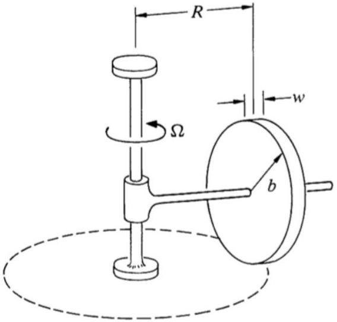
Assume the millstone is a uniform disk of mass $M$, radius $b$, and width $w$, and it rolls without slipping in a circle of radius $R$ with angular velocity $\Omega$. Find the contact force $N$. Assume the millstone is closely fitted to the axle so that it cannot tip, and $w \ll R$. Neglect friction.
Solution. Take torques about the point where the vertical and horizontal rods meet. Because we are neglecting friction, the only torque on the system is from gravity on the stone, and the normal force with the ground,
$$
\tau = ( N - M g ) R .
$$

Note that there is also a normal force $N ^ { \prime }$ on the bottom of the shaft, and the weight force $M ^ { \prime } g$ for the shaft. These two forces won't play a role below, since they exert no torque, but they ensure vertical force balance, $\left( M + M ^ { \prime } \right) g = N + N ^ { \prime }$. Also, as mentioned in M5, we are assuming there is negligible bending moment from the pivots, which is reasonable since they are typically small.

The angular momentum due to the motion of the center of mass is vertical and constant, so it doesn't matter. As in problem 3, the angular velocity connects this point and the contact point, so

$$
\omega = \frac { R } { b } \Omega \hat { \mathbf { x } } + \Omega \hat { \mathbf { z } } .
$$

The vertical component of the angular velocity yields another constant vertical component of the angular momentum, so it also doesn't matter. The only part of the angular momentum that changes is the part due to the horizontal component of the angular velocity of the axle. The whole system precesses with angular velocity $\Omega \hat { \mathbf { z } }$, so

$$
\tau = \frac { R \Omega } { b } \Omega \left( \frac { 1 } { 2 } M b ^ { 2 } \right) .
$$

Setting this equal to our other expression for torque and solving gives

$$
N = M g \left( 1 + \frac { b \Omega ^ { 2 } } { 2 g } \right) .
$$

This is greater than $M g$, so the vertical shaft exerts a downward force on the horizontal rod.

## Idea 4: Precession

In the above problems, we've seen a few examples of systems undergoing uniform precession. In these cases, the angular velocity and the angular momentum vectors rotate with a uniform angular velocity $\boldsymbol { \Omega }$, called the precession rate, where

$$
\frac { d \boldsymbol { \omega } } { d t } = \boldsymbol { \Omega } \times \boldsymbol { \omega } , \quad \frac { d \mathbf { L } } { d t } = \boldsymbol { \Omega } \times \mathbf { L } .
$$

Precession is easiest to see in gyroscopes, which are systems spun up to a very high angular velocity, subject to a weak external torque, so that $\Omega \ll \omega$. (Kleppner and Kolenkow call this the "gyroscope approximation".) More generally, you'll have to decide whether or not $\Omega \ll \omega$ in each case.

## Example 4: KK 7.3

A gyroscope wheel is at one end of an axle of length $\ell$. The other end of the axle is suspended from a string of length $L$.
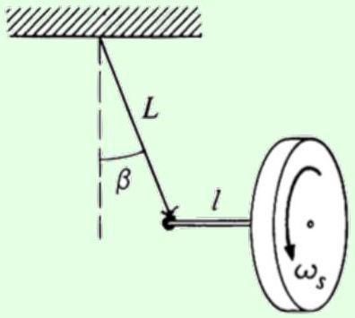

The wheel is set into motion so that it executes slow, uniform precession in the horizontal plane. The wheel has mass $M$ and moment of inertia $I _ { 0 }$ about its center of mass, and turns with angular speed $\omega$. Neglect the mass of the shaft and string. Find the angle $\beta$ the string makes with the vertical, assuming $\beta$ is very small.

## Solution

Let $T$ be the tension in the rope, and let the precession rate be $\boldsymbol { \Omega } = \Omega \hat { \mathbf { z } }$. Since the center of mass does not accelerate vertically, and the center of mass moves in a horizontal circle,

$$
T \cos \beta = M g , \quad T \sin \beta = M \Omega ^ { 2 } ( \ell + L \sin \beta ) .
$$

We'll work to lowest possible order in $\beta$ everywhere, which means approximating $\cos \beta \approx 1$ and ignoring the $L \sin \beta$ term, giving

$$
T = M g , \quad T \beta = M \Omega ^ { 2 } \ell .
$$

Combining these equations gives the precession angular frequency

$$
\Omega = \sqrt { \frac { g \beta } { \ell } } .
$$

This is as far as we can go with forces alone.
Now we use $\boldsymbol { \tau } = d \mathbf { L } / d t$, taking torques about the point the string meets the ceiling. As in the previous examples, the angular velocity of the system has a component $\Omega \hat { \mathbf { z } }$, which contributes to a constant $L _ { z }$. The change in the angular velocity comes from the horizontal components, which yield $| \boldsymbol { \tau } | = I _ { 0 } \Omega \omega$. The only torque on the system comes from gravity, $| \boldsymbol { \tau } | = M g ( \ell + L \sin \beta ) \approx M g \ell$. Combining our results and solving for $\beta$ yields

$$
\beta = \frac { M ^ { 2 } g \ell ^ { 3 } } { \omega ^ { 2 } I _ { 0 } ^ { 2 } } .
$$

Did we actually use the gyroscope approximation here? This kind of motion intuitively seems like it requires a gyroscope, but we never used $\Omega \ll \omega$ explicitly in the above derivation. However, note that we can rearrange our results in the form

$$
\beta = \frac { \Omega } { \omega } \frac { M \ell ^ { 2 } } { I _ { 0 } } .
$$

If the radius of the wheel is comparable to $\ell$, then the final fraction is order-one, so it is only possible to have $\beta \ll 1$ if $\Omega \ll \omega$.

## Remark

In most gyroscope problems, we simply assume the system is already undergoing uniform precession. However, you might wonder just how it gets started in the first place. For example, suppose we had the same setup as the previous problem, with the wheel spinning and the axle

horizontal. For simplicity, let's get rid of the string and suppose the end of the axle is held at a fixed support. Now suppose the axle and wheel are released with no translational motion.

The following chain of events ensues:

1. Because of gravity, the wheel starts to move down.
2. Since the wheel is rigidly attached to the axle, the axle starts to tip downward.
3. This produces a downward component of angular momentum, which is balanced by the axle/wheel system starting to rotate about the $z$-axis. That is, the center of mass of the wheel moves into the page, starting the precession.
4. This precession makes the axle exert an extra upward force on the wheel, stopping its fall. In reality the process overshoots and overcorrects, leading to oscillations called nutation. (For details, see Note 2 of chapter 7 of Kleppner and Kolenkow.)
5. For a typical pivot, energy can be dissipated at the pivot point, but the angular momentum of the system stays roughly the same because the pivot is small. Assuming this is the case, the oscillations will eventually damp away, leaving a uniform precession.

Notice that in this example, the initial angular momentum is perfectly horizontal. The final angular momentum includes an upward component due to the uniform precession, which implies that the axle must tilt slightly downward, by an angle of order $( \Omega / \omega ) ^ { 2 }$. Therefore, if you want to set up uniform precession with the axle perfectly horizontal, as in the above example, you should point the axle slightly upward when releasing it from rest.

[2] Problem 5 (KK 8.5). An "integrating gyro" can be used to measure the speed of a vehicle. Consider a gyroscope spinning at high speed $\omega _ { s }$. The gyroscope is attached to a vehicle by a universal pivot. If the vehicle accelerates in the direction perpendicular to the spin axis at rate $a$, then the gyroscope will precess about the acceleration axis, as shown.
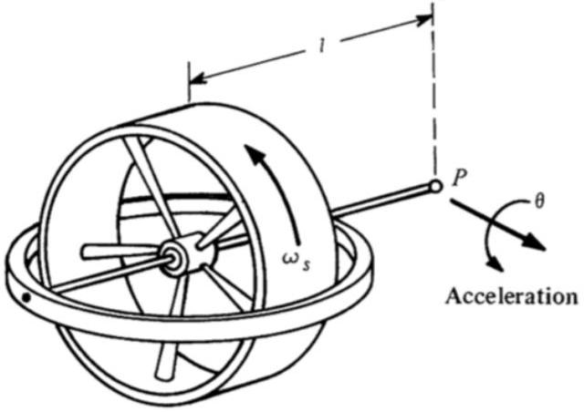
The total angle of precession is $\theta$. Show that if the vehicle starts from rest, its final speed is
$$
v = \frac { I _ { s } \omega _ { s } } { M \ell } \theta
$$
where $I _ { s } \omega _ { s }$ is the gyroscope's spin angular momentum, $M$ is the total mass, and $\ell$ is the distance from the pivot to the center of mass.

Solution. Work in the accelerating reference frame where the pivot is at rest. Using the gyroscope approximation, we see that $\dot { L } = I _ { s } \omega _ { s } \omega$ where $\omega = \dot { \theta }$, and $\tau = M a \ell$. Thus,

$$
a = \frac { I _ { s } \omega _ { s } \dot { \theta } } { M \ell } .
$$

Integrating yields the desired result.
[3] Problem 6 (KK 7.5). When an automobile rounds a curve at high speed, the weight distribution on the wheels is changed. For sufficiently high speeds, the loading on the inside wheels goes to zero, at which point the car starts to roll over. This tendency can be avoided by mounting a large spinning flywheel on the car.

(a) In what direction should the flywheel be mounted, and what should be the sense of rotation, to help equalize the loading? (Check your method works for the car turning in either direction.)
(b) Show that for a disk-shaped flywheel of mass $m$ and radius $R$, the requirement for equal loading is that the angular velocity $\omega$ of the flywheel is related to the velocity of the car $v$ by
$$
\omega = 2 v \frac { M L } { m R ^ { 2 } }
$$
where $M$ is the total mass of the car and flywheel, and $L$ is the height of their center of mass.

Solution. (a) If the car is turning with a radius of curvature of $r$ at velocity $v$, then the frictional force must provide the centripetal force of $f = M v ^ { 2 } / r$. This will exert a torque of $f L$ on the car about the center of mass, where $L$ is the height of the center of mass. The torque points forward for turning left, and backwards for turning right.

Normally, a difference in the normal forces between the wheels will provide the opposing torque to keep the car from rolling over. To keep an equal loading, the flywheel must provide the opposing torque. Another way to think about it is to have the torque from friction to cause precession of the flywheel instead of turning the car (the equal and opposite "reaction torque" will keep the car stable).
The key is that as the car is turning, the flywheel will also turn with the car at angular velocity $v / r$, thus the direction of its spin angular momentum $\mathbf { L } _ { s }$ will change. From a top view, that means the forwards torque for turning left must turn $\mathbf { L } _ { s }$ counterclockwise, and the backwards torque for turning right must turn $\mathbf { L } _ { s }$ clockwise. This works when $\mathbf { L } _ { s }$ is pointing to the right with respect to the car's motion (the flywheel spins in the opposite direction from that of the wheels).

(b) In order for the torque from friction to turn the flywheel, $\tau = f L = L _ { s } ( v / r )$. For a disk-shaped flywheel with angular momentum $L _ { s } = \frac { 1 } { 2 } m R ^ { 2 } \omega$, putting in $f = M v ^ { 2 } / r$ yields
$$
\frac { M v ^ { 2 } L } { r } = \frac { 1 } { 2 } m R ^ { 2 } \frac { \omega v } { r }
$$
which is equivalent to the desired result.

[3] Problem 7 (KK 7.7). A thin hoop of mass $M$ and radius $R$ is suspended from a string through a point on the rim of the hoop. The string makes an angle $\alpha$ with the vertical.

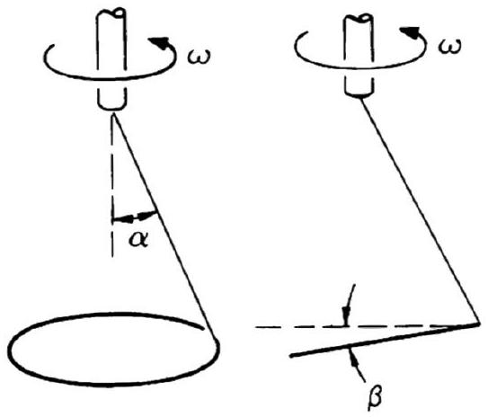
The support is turned with angular velocity $\omega$, which is high enough so that the hoop's plane makes a small angle $\beta$ with the horizontal, and the hoop's center travels in a small circle of radius $r \ll R$.

(a) Does the gyroscope approximation apply in this problem?
(b) Find approximate expressions for $\beta$ and $r$.

Solution. (a) No. The whole system is undergoing uniform rotation about the $\hat { \mathbf { z } }$ axis, i.e. in the frame rotating with the support, the whole system is just static! Thus, the precession rate $\Omega$ is just equal to the spin rate $\omega$, so we don't have $\Omega \ll \omega$.

In fact, it is possible to solve part (b) like a statics problem in that rotating frame. However, doing so introduces a centrifugal torque, which is annoying to compute. (I thank Toshiv Chowdhary for pointing this out.) It turns out to be easier to stay in a nonrotating frame.

(b) To balance vertical forces, the tension $T$ in the string obeys $T \cos \alpha = M g$. Now work in the noninertial but nonrotating frame which follows the hoop's center of mass. In this frame, the only torque about the hoop's center of mass is from the tension. The angle between the string and the plane of the hoop is $\pi - ( \alpha + \pi / 2 - \beta ) = \pi / 2 - \alpha + \beta$, so
$$
\tau = T R \sin ( \pi / 2 - \alpha + \beta ) = T R \cos ( \alpha - \beta ) .
$$
This torque rotates the horizontal component of the angular momentum with precession rate $\omega$. To find the horizontal component, we decompose $\boldsymbol { \omega } = \omega \hat { \mathbf { z } }$ into components perpendicular and parallel to the loop. If the $\hat { \mathbf { x } }$ axis is horizontal in the second picture above, then
$$
L _ { x } = - \omega _ { \perp } I _ { \perp } \sin \beta + \omega _ { \| } I _ { \| } \cos \beta = - ( \omega \cos \beta ) \left( M R ^ { 2 } \right) \sin \beta + ( \omega \sin \beta ) \left( M R ^ { 2 } / 2 \right) \cos \beta
$$
from which we conclude that
$$
\left| L _ { x } \right| = \frac { M R ^ { 2 } \omega } { 2 } \cos \beta \sin \beta .
$$
Then the torque has to be
$$
\tau = \left| L _ { x } \right| \omega = \frac { M R ^ { 2 } \omega ^ { 2 } } { 2 } \cos \beta \sin \beta .
$$
Equating our two expressions yields
$$
\frac { 2 g } { \omega ^ { 2 } R } = \frac { \cos \alpha \cos \beta \sin \beta } { \cos ( \alpha - \beta ) } .
$$

Now we use the fact that $\omega$ is large, which corresponds to $\beta$ being small. To leading order in $\beta$, we can approximate $\cos ( \alpha ) / \cos ( \alpha - \beta ) \approx 1$ and $\sin \beta \cos \beta \approx \beta$, giving

$$
\beta \approx \frac { 2 g } { \omega ^ { 2 } R } .
$$

Finally, going back to the lab frame, the horizontal component of the tension should provide a centripetal force, so $T \sin \alpha = M \omega ^ { 2 } r$. We thus have

$$
r = \frac { g \tan \alpha } { \omega ^ { 2 } } .
$$

Note that the official solution to this problem in Kleppner and Kolenkow (both editions) incorrectly states $\beta \approx g / \left( \omega ^ { 2 } R \right)$, because it misses the "parallel" contribution to $L _ { x }$. I thank Roger Yang for pointing this out.

[4] Problem 8 (KK 7.6, Morin 9.23). With the right initial conditions, a coin on a table can roll in a circle.
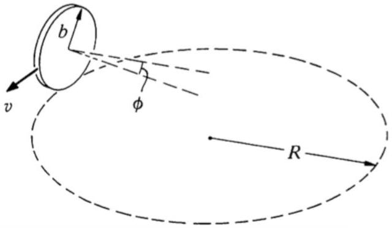
As shown, the coin leans inward, with its axis tilted to the horizontal by an angle $\phi$. The radius of the coin is $b$, the radius of the circle it follows on the table is $R$, and its velocity is $v$.
    (a) Assuming the coin rolls without slipping and $b \ll R$, show $\tan \phi = 3 v ^ { 2 } / 2 g R$.
    (b) No longer assuming $b \ll R$, show that the described motion is only possible if $R > ( 5 / 6 ) b \sin \phi$.

Solution. (a) We work in the noninertial, but nonrotating frame whose origin follows the center of mass. In this frame, the only part of the angular momentum that changes is the horizontal component of the spin angular momentum. The coin spins by "rolling" and "turning", along $\boldsymbol { \omega } _ { s }$ and $\boldsymbol { \omega } _ { 2 }$ respectively:
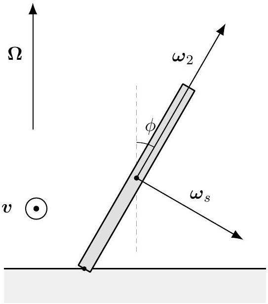

Since the motion of the coin is the combination of "rolling" and going around in a circle, the total angular velocity should be $\boldsymbol { \omega } _ { s } + \boldsymbol { \Omega }$ where $\boldsymbol { \Omega }$ describes the circular motion/turning of the coin and points vertically upwards. The components of $\boldsymbol { \Omega }$ are $\boldsymbol { \Omega } \cos \phi$ and $- \boldsymbol { \Omega } \sin \phi$ along $\boldsymbol { \omega } _ { 2 }$ and $\boldsymbol { \omega } _ { s }$ respectively. The moments of inertia about the coin in the $\boldsymbol { \omega } _ { s }$ and $\boldsymbol { \omega } _ { 2 }$ directions are $\frac { 1 } { 2 } M b ^ { 2 }$ and $\frac { 1 } { 4 } M b ^ { 2 }$ respectively. Note that we can't simply ignore $\boldsymbol { \Omega }$ because it is vertical; this is because the angular momentum from $\boldsymbol { \Omega }$ does not point in the same direction as $\boldsymbol { \Omega }$ (they point in the same direction only along the principal axes).
With $\mathbf { L } = I \boldsymbol { \omega }$ along those principal axes, the horizontal components of the angular momenta is $L _ { x } = \frac { 1 } { 2 } M b ^ { 2 } \left( \omega _ { s } - \Omega \sin \phi \right) \cos \phi + \frac { 1 } { 4 } M b ^ { 2 } \Omega \cos \phi \sin \phi$. The no slip condition is that $\omega _ { s } b = \Omega R$. With $b \ll R$, we can approximate $L _ { x } \approx \frac { 1 } { 2 } M b ^ { 2 } \omega _ { s } \cos \phi$. The torque, $\tau = \Omega L _ { x }$, about the center of mass is $( N \sin \phi - f \cos \phi ) b$ where $f = M v ^ { 2 } / ( R - b \sin \phi ) \approx M v ^ { 2 } / R$ is the frictional force, and $N = M g$ is the normal force. The velocity of the CM is $v = \Omega ( R - b \sin \phi ) \approx \Omega R$. Then

$$
\tau = \Omega L _ { x } = \frac { 1 } { 2 } M b ^ { 2 } ( \Omega R / b ) \Omega \cos \phi = \frac { 1 } { 2 } M \Omega ^ { 2 } b R \cos \phi = \frac { M v ^ { 2 } b } { 2 R } \cos \phi
$$

but we also know that

$$
\tau = M g b \sin \phi - \frac { M v ^ { 2 } b } { R } \cos \phi
$$

from which we conclude

$$
\tan \phi = \frac { 3 v ^ { 2 } } { 2 g R } .
$$

(b) Now we will do the calculations above without $b \ll R$. The torque is
$$
\begin{aligned}
\tau & = \Omega \left( \frac { 1 } { 2 } M b ^ { 2 } \left( \omega _ { s } - \Omega \sin \phi \right) \cos \phi + \frac { 1 } { 4 } M b ^ { 2 } \Omega \cos \phi \sin \phi \right) \\
& = M g b \sin \phi - \frac { M v ^ { 2 } b } { R - b \sin \phi } \cos \phi .
\end{aligned}
$$
Using $\omega _ { s } = \Omega R / b$ and $v = \Omega ( R - b \sin \phi )$ and dividing the above equation by $M \Omega ^ { 2 } b$ yields
$$
\frac { 1 } { 2 } R \cos \phi - \frac { 1 } { 2 } b \sin \phi \cos \phi + \frac { 1 } { 4 } b \sin \phi \cos \phi = \frac { g } { \Omega ^ { 2 } } b \sin \phi - ( R - b \sin \phi ) \cos \phi
$$
which simplifies to
$$
\frac { 3 } { 2 } R - \frac { 5 } { 4 } b \sin \phi = \frac { g } { \Omega ^ { 2 } } \tan \phi .
$$
Since $\tan \phi > 0$ in order for the motion to make sense, we have $R > ( 5 / 6 ) b \sin \phi$.
[4] Problem 9 (Morin 9.24). If you spin a coin around a vertical diameter on a table, it will slowly lose energy and begin a wobbling motion. The angle between the coin and the table will gradually decrease, and eventually it will come to rest. Assume this process is slow, and consider the motion when the coin makes an angle $\theta$ with the table, as shown.

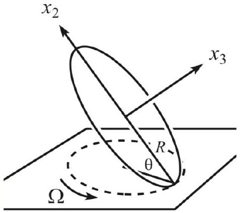
You may assume that the center of mass is essentially motionless. Let $R$ be the radius of the coin, and let $\Omega$ be the angular frequency at which the contact point on the table traces out its circle. Assume the coin rolls without slipping.

(a) Show that the angular velocity of the coin is $\boldsymbol { \omega } = \Omega \sin \theta \hat { \mathbf { x } } _ { 2 }$, where $\hat { \mathbf { x } } _ { 2 }$ always points upward along the coin, directly away from the contact point.
(b) Show that $\Omega = 2 \sqrt { g / ( R \sin \theta ) }$.
(c) Show that the face on the coin appears to rotate, when viewed from above, with angular frequency $\Omega ^ { \prime } = ( 1 - \cos \theta ) \Omega$.

Near the end of the motion, as $\theta \rightarrow 0$, we have $\Omega \rightarrow \infty$ while $\Omega ^ { \prime } \rightarrow 0$, so that the disc appears to frantically jitter in place. This system is called Euler's disc, and if you haven't seen it before, I recommend watching a video!

Solution. (a) Since the center of mass is essentially motionless and the coin is rolling without slipping, the center of mass and the contact point are both stationary. Thus the angular velocity must pass through those lines, and is pointing along $\hat { \mathbf { x } } _ { 2 }$. Let $\hat { \mathbf { k } }$ be a vertical unit vector. The angular velocity can be seen as the sum of the rotation about the center of mass and pointing along $\hat { \mathbf { k } }$ (turning of the coin's orientation) with angular velocity $\boldsymbol { \omega } _ { k } = \Omega \hat { \mathbf { k } }$, and rotation about $- \hat { \mathbf { x } } _ { 3 }$ with angular velocity $\hat { \boldsymbol { \omega } } _ { 3 }$ to roll without slipping. Thus, $\boldsymbol { \omega } = \boldsymbol { \omega } _ { k } + \boldsymbol { \omega } _ { 3 }$.
Since $\hat { \mathbf { x } } _ { 2 }$ and $\hat { \mathbf { x } } _ { 3 }$ are perpendicular, $\omega = \omega _ { k } \sin \theta$, so $\boldsymbol { \omega } = \Omega \sin \theta \hat { \mathbf { x } } _ { 2 }$ as desired.

(b) The torque about the contact point from gravity is $M g R \cos \theta$, and points horizontally to change the horizontal component of the angular momentum $L _ { x } = I \omega \cos \theta$ at a rate of $\Omega$. The moment of inertia about $\hat { \mathbf { x } } _ { 2 }$ is $\frac { 1 } { 4 } M R ^ { 2 }$, which gives
$$
M g R \cos \theta = \frac { 1 } { 4 } M R ^ { 2 } \Omega ^ { 2 } \sin \theta \cos \theta
$$
Solving this for $\Omega$ gives the desired result. Of course, we could also have found this result by taking torques about the center of mass.
(c) From part (a), we found that $\boldsymbol { \omega } = \boldsymbol { \omega } _ { k } + \boldsymbol { \omega } _ { 3 }$ and $\hat { \mathbf { x } } _ { 2 }$ and $\hat { \mathbf { x } } _ { 3 }$ are perpendicular which gets $\omega _ { 3 } =$ $- \Omega \cos \theta$. Consider a point on the coin from the top view. $\boldsymbol { \omega } _ { k }$ makes it rotate counterclockwise with angular velocity $\Omega$, and $\boldsymbol { \omega } _ { 3 }$ rotates it clockwise with angular velocity $\Omega \cos \theta$. Thus the face of the coin appears to be rotating with angular velocity $\Omega ( 1 - \cos \theta )$.
Another way to do this is to consider the difference between the radius of the coin and the radius of the traced out circle. In a full rotation of the contact point in time $T = 2 \pi / \Omega$, a

distance of $2 \pi R \cos \theta$ was covered by the coin. Since the coin didn't slip, that same distance was covered along the coin's edge, so the initial contact point will be a distance of $2 \pi R ( 1 - \cos \theta )$ ahead of the new contact point. Thus the angle change is $2 \pi ( 1 - \cos \theta )$ in time $T = 2 \pi / \Omega$, giving an apparent angular velocity of $( 1 - \cos \theta ) \Omega$.

Remark: Bivectors
Vector quantities defined by the cross product have some unusual properties. For example, under a spatial inversion, which flips the signs of r and p, the sign of $\mathbf { L } = \mathbf { r } \times \mathbf { p }$ doesn't get flipped, so $\mathbf { L }$ transforms differently from other vectors. The same applies to the velocity $\boldsymbol { \omega }$ and magnetic field B. All three of these quantities are "pseudovectors", not true vectors.

The underlying reason is that all of these quantities are fundamentally a different kind of mathematical object. They are really rank 2 differential forms, also called bivectors in three dimensions. While a vector is specified by an arrow with magnitude and direction, a bivector is specified by a planar tile with area and orientation. The following figure, taken from this paper, shows how it can be constructed visually from the cross product.
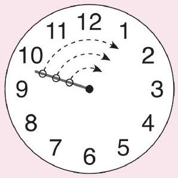
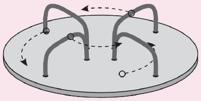
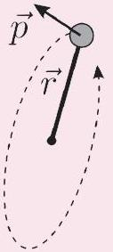
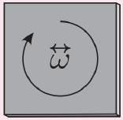
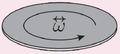
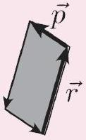
In three dimensions, we can always convert between bivectors and pseudovectors using the right-hand rule, so any calculation can be done with either form. Bivectors have the advantage of visually representing rotational quantities: the angular velocity bivector lies along an object's plane of rotation, while the magnetic field bivector lies along the plane in which it makes charged particles circularly orbit. However, it is easier to add vectors, both visually and mathematically, which also makes it easier to think about decomposing vectors into components. This advantage is so important in practice that I don't recommend using bivectors at all for three-dimensional problems.

On the other hand, when you work in higher-dimensional spaces, the differential form perspective becomes essential. In general, in $d$ dimensions the angular velocity has $\binom { d } { 2 }$ components, corresponding to the rotation rate in each independent plane.

- Of course, when $d = 1$ there is no such thing as rotation at all, while when $d = 2$ the angular velocity has one component, so we treat it as a scalar.
- When $d = 3$ the angular velocity has three components, so we treat it as a vector.
- When $d = 4$ the angular velocity has six components, so we can't even pretend it's a

vector; we have to use the differential form description.
Rotational dynamics gets really complicated in 4 dimensions. Both the angular velocity and the angular momentum are rank 2 differential forms with 6 independent components each. The moment of inertia is a rank 4 tensor with 10 independent components, which takes a simpler form when you work in the body's 6 "principal planes".

## Remark: Alternative Notation

If you want to look into bivectors more, be sure to steer clear of "geometric algebra", which dominates the Google search results. Geometric algebra is an internet cult which recruits unsuspecting young people by telling them about bivectors, which are indeed cool. Once they have your attention, they'll claim that "mainstream" physics has hit a dead end because it refuses to go beyond vector notation, and that you should spend years relearning all of physics in their homemade alternative notation.

However, as we've discussed in P1 and R3, there's nothing magical about notation. Physicists don't teach geometric algebra simply because we have better tools in every situation. In $d = 3$ vectors are intuitive and work just fine, while for higher dimensions we either use differential forms, which are more elegant, or tensor calculus, which is powerful enough to do almost anything. When you get to quantum field theory, you'll have to deal with spinors and Clifford algebras, which are commonly taught in graduate textbooks.

The idea of geometric algebra is to mash together the ideas of differential forms and Clifford algebra into a single universal operation called the "geometric product", and use it to describe absolutely everything, including basic 3d vector operations. But while this seems satisfying in principle, in practice it introduces a huge number of secondary operations and identities. It doesn't just not lead to any new results, it makes familiar results substantially harder to reach. (Don't just take my word for it; see this blog post by a practitioner.)

Geometric algebra is also touted as a replacement for standard matrix operations in pure math, but it has problems there too. According to a another long-time practitioner, definitions in geometric algebra sources are wildly inconsistent with each other, and sometimes aren't even self-consistent. And using geometric algebra is exponentially less efficient than ordinary matrix operations once you get past the trivial case of 3 × 3 matrices!

There are two lessons here. First, physicists will use whatever notation works the best for the problems they care about. So if an alternative isn't used, it's not because it's being censored, it's because it's not actually useful. But most of the time, there won't be anybody around on the internet to tell you why, because practitioners are busy solving real problems. Relying on the internet can therefore give a very skewed view of what's important.

Second, learning new things is more important than learning new names for old things. Practitioners of geometric algebra say that it's worth using, even if it's less efficient, because it "makes more sense". Simple problems end up taking lots of steps, and each step introduces

new objects associated with new jargon, so it's apparently deeply satisfying to see the whole apparatus at work. But in my opinion, those people are just getting lost in a maze of their own making. Physical objects don't care about how we describe them, and there's no extra credit for making things harder than necessary.

Many people fall into the trap of overformalization. For example, the popular blog series Graphical Linear Algebra advocates a category theory inspired notation for arithmetic. It proudly takes 9 blog posts to get to the definition of addition, and 25 to define fractions. This is why even mathematicians don't take "applied category theory" seriously.

## Example 5: IIT JEE 2016

Two thin circular discs, with radii $a$ and $2 a$, are connected by a rod of length $\ell = \sqrt { 24 } a$ through their centers. This rigid object rolls without slipping on a flat table.

The center of mass of the object rotates about the $z$-axis with an angular speed of $\Omega$. The angular speed of the object about the axis of the rod is $\bar { \omega }$. How are $\Omega$ and $\bar { \omega }$ related?

## Solution

This is the most famous problem ever set on the IIT JEE (condensed for clarity), celebrated by generations of students for its difficulty. But it's also an example of how not to write a 3D rotation problem. Under the standard definition of angular velocity, none of the options provided in the question were correct, while the intended answer requires a nonstandard, arbitrary definition. You can find a detailed explanation of this here, by one of the former top scorers on the JEE, and I'll give a condensed explanation below.

First, let's figure out what's going on. The kinematics of this problem isn't any different from problem 1. Defining the $x$-axis to be horizontal in the figure above, the instantaneous angular velocity is $\boldsymbol { \omega } = \omega \hat { \mathbf { x } }$, while the precession rate is $\boldsymbol { \Omega } = ( \omega / \sqrt { 24 } ) \hat { \mathbf { z } }$. The hard part is figuring out what the question writers meant by "the angular speed $\bar { \omega }$ about the axis of the rod".

If we're only talking about the object's instantaneous motion, then the only possible answer is $\bar { \omega } = \boldsymbol { \omega } \cdot \hat { \mathbf { n } }$, where $\hat { \mathbf { n } }$ is the unit vector pointing along the rod. In that case we have $\Omega / \bar { \omega } = 5 / 24$, but then none of the answer choices in the exam are correct. On the other hand, if we are comparing the object's orientation at different times, then there isn't a

unique answer. At a finite time later, the object will be in a different place, and computing a relative angle requires defining a convention for comparing orientations.

Here's what the problem authors meant. We work in the frame rotating with angular velocity $\boldsymbol { \Omega }$. In this frame, the system is spinning in place, with angular velocity $\boldsymbol { \omega } + \boldsymbol { \Omega }$ parallel to $\hat { \mathbf { n } }$. The definition of $\bar { \omega }$ is $| \boldsymbol { \omega } + \boldsymbol { \Omega } |$, which gives $\Omega / \bar { \omega } = 1 / 5$, the intended answer.

Another way of saying this is that when we compare the orientation of the system at one moment to its orientation at another moment, we bring them to the same position by rotating about the $z$-axis, at which point they differ by a rotation about $\hat { \mathbf { n } }$. But this procedure is totally arbitrary, and not specified by the problem. To pose the problem properly, the writers could have either defined $\bar { \omega }$ explicitly in the rotating frame mentioned above, or replaced it with a quantity with equivalent but unambiguous physical meaning, such as the interval between times a given point on the rim of a disc touches the ground. Fortunately, you'll almost never see problems this ambiguous on Olympiads.

## Remark

One of the most counterintuitive things about 3D rigid body motion is the intermediate axis theorem, which states that if a body has moments of inertia $I _ { 1 } < I _ { 2 } < I _ { 3 }$ about its principal axes, then it can rotate stably about the first and third principal axes, but not the second, "intermediate" axis. You can demonstrate this yourself by throwing a rectangular prism (such a book or a phone) in the air. If you spin it about the intermediate axis, it'll start tumbling. The Soviet physicist Dzhanibekov found a particularly striking example of such motion in zero gravity, which you can see here.

Deriving this theorem requires the full theory of 3D rotational kinematics, which is beyond the scope of the Olympiad, but there's a simple explanation of this effect using conserved quantities. The rotational kinetic energy is

$$
K = \frac { 1 } { 2 } I _ { 1 } \omega _ { 1 } ^ { 2 } + \frac { 1 } { 2 } I _ { 2 } \omega _ { 2 } ^ { 2 } + \frac { 1 } { 2 } I _ { 3 } \omega _ { 3 } ^ { 2 }
$$

while the magnitude squared of the angular momentum is

$$
L ^ { 2 } = I _ { 1 } ^ { 2 } \omega _ { 1 } ^ { 2 } + I _ { 2 } ^ { 2 } \omega _ { 2 } ^ { 2 } + I _ { 3 } ^ { 2 } \omega _ { 3 } ^ { 2 } .
$$

This makes it easy to see why rotation about the third axis is stable: it corresponds to the smallest possible kinetic energy for a given angular momentum.

On the other hand, it's not so clear why the first axis is stable, because it corresponds to the maximum possible kinetic energy. Aren't maxima usually unstable? Generally yes, but in this case, the kinetic energy is the only contribution to the energy. Since kinetic energy is conserved in the short run, there is nowhere else for the energy to go, so a system set spinning about the first axis has to stay that way. (Of course, in the long run energy will be lost to the environment, e.g. by friction. So we might say that rotation about the first axis is stable mechanically, but not thermodynamically.)

However, for rotation about the second, "intermediate" axis, the body can keep both $K$ and $L ^ { 2 }$ the same by turning on some combination of $\omega _ { 1 }$ and $\omega _ { 3 }$. That explains the Dzhanibekov effect. Initially the second principal axis aligns with the direction of $\mathbf { L }$. Then the body rotates so that $\omega _ { 1 }$ and $\omega _ { 3 }$ become nonzero, until the body has completely flipped over. At that point $\omega _ { 1 }$ and $\omega _ { 3 }$ become zero again, with the second principal axis now aligned against L. It's like a one-dimensional oscillation, where $I _ { 2 } \omega _ { 2 } ^ { 2 } / 2$ plays the role of "potential" energy and $I _ { 1 } \omega _ { 1 } ^ { 2 } / 2 + I _ { 3 } \omega _ { 3 } ^ { 2 } / 2$ plays the role of "kinetic" energy.

## 2 Composite Rotation

These are rotational dynamics problems like the ones you saw in M5, but more complex.

[3] Problem 10 (PPP 60). A uniform thin rod is placed with one end on the edge of a table in a nearly vertical position and then released from rest. Find the angle it makes with the vertical at the moment it loses contact with the table. Investigate the following two extreme cases.

    (a) The edge of the table is smooth (friction is negligible) but has a small, single-step groove.
    (b) The edge of the table is rough (friction is large) and very sharp, which means the radius of curvature of the edge is much smaller than the flat end-face of the rod. Half of the end-face protrudes beyond the table edge, so that when it is released the rod pivots about the edge.

Solution. Let $\ell$ be the length of the rod. By energy conservation, we have

$$
\frac { 1 } { 2 } \frac { 1 } { 3 } m \ell ^ { 2 } \omega ^ { 2 } = m g \frac { \ell } { 2 } ( 1 - \cos \theta ) \Longrightarrow \omega ^ { 2 } = \frac { 3 g } { \ell } ( 1 - \cos \theta ) .
$$

Differentiating this with respect to time gives

$$
2 \omega \dot { \omega } = \frac { 3 g } { \ell } ( \sin \theta ) \dot { \theta } \Longrightarrow \dot { \omega } = \frac { 3 g } { 2 \ell } \sin \theta .
$$

The centripetal and tangential acceleration of the center of mass are

$$
a _ { c } = \frac { \omega ^ { 2 } \ell } { 2 } = \frac { 3 } { 2 } g ( 1 - \cos \theta ) , \quad a _ { t } = \frac { \dot { \omega } \ell } { 2 } = \frac { 3 } { 4 } g \sin \theta .
$$

(a) This is formally identical to the falling ladder problem from M5, and hence has the same answer. But we can also solve the problem directly here. We have
$$
N _ { x } = M \left( a _ { t } \cos \theta - a _ { c } \sin \theta \right) = \frac { 3 } { 4 } M g \sin \theta ( 3 \cos \theta - 2 )
$$
and
$$
N _ { y } = M g - M \left( a _ { c } \cos \theta + a _ { t } \sin \theta \right) = \frac { 1 } { 4 } M g ( 3 \cos \theta - 1 ) ^ { 2 } .
$$
The first one to go to zero is $N _ { x }$, and this happens at $\theta = \cos ^ { - 1 } ( 2 / 3 )$.
(b) In this case, the normal force points along the rod. Therefore,
$$
N - M g \cos \theta = - M a _ { c } ,
$$
so $N = M g \left( \frac { 5 } { 2 } \cos \theta - \frac { 3 } { 2 } \right)$. This becomes zero at $\theta = \cos ^ { - 1 } ( 3 / 5 )$.
[3] Problem 11 (Cahn). A tall, thin brick chimney of height $L$ is slightly perturbed from its vertical equilibrium position so that it topples over, rotating rigidly about its base $B$ until it breaks at a point $P$.

(a) For concreteness, we will model the internal forces in the chimney as shown below. Assume throughout that $r$ is very small.

We assume that each piece of the chimney experiences a shear force $F$ and longitudinal tension or compression forces $T _ { 1 }$ and $T _ { 2 }$ from its neighbors. Find the point on the chimney with the greatest $\left| T _ { 1 } \right|$ or $\left| T _ { 2 } \right|$, assuming the chimney is very thin.

(b) Find the point on the chimney experiencing the greatest shear force $F$.
(c) At what point is the chimney most likely to break? Do you think the limiting factor is the chimney's maximal compressive strength, tensile strength, or shear strength?

Solution. See the solution here.

[3] Problem 12. (1) IPhO 2014, problem 1A.
[2] Problem 13 (PPP 14). A bicycle is supported so that it can move forward or backwards but cannot fall sideways; its pedals are in their highest and lowest positions.

A student crouches beside the bicycle and pulls a string attached to the lower pedal, providing a backward horizontal force.
    (a) Which way does the lower pedal move relative to the ground?
    (b) Which way does the bicycle move?

To check your answer, watch this video.
Solution. (a) The student must do positive work on the bike to let it move, so the force and displacement of the point where the force is applied have to be parallel. That is, the lower pedal moves backwards.

(b) Technically, it depends on the gearing of the bike, but for a typical bike (and for the one shown in the picture) it is backwards. To see this, let's review how a bike works.
A bike works by moving the pedals, which are a distance $r _ { p }$ from the pedal axle. This rotates a gear of radius $r _ { g , p }$, which is connected by a chain to another gear of radius $r _ { g , w }$, which rotates the rear wheel of radius $R$. By accounting for both the gearing ratios, we have
$$
\frac { \text { forward motion of bike } } { \text { backward motion of pedal relative to bike } } = \frac { R } { r _ { g , w } } \frac { r _ { g , p } } { r _ { p } } \text {. }
$$
The entire point of a bike's gearing system is to make this ratio large, so that the bike can go fast without your feet having to move like crazy. And this is indeed true in the image, which has $r _ { p }$ and $r _ { g , p }$ comparable, and $R \gg r _ { g , w }$.
Therefore, if you move the pedal forward a little, the bike goes backward a lot more, so the net motion of the pedal (relative to the ground) is backward, consistent with part (a).
[4] Problem 14. APhO 2005, problem 1B. A problem on parametric resonance, an idea we first encountered in M4. (The problem is good, but it's slightly underspecified, leading to two possible answers which were both accepted. If you get stuck, just make a reasonable assumption.)

[4] Problem 15. INPhO 2020, problem 5. A tough angular collision problem.
[5] Problem 16. EuPhO 2019, problem 2. A tough problem about the motion of an rigid body in a magnetic field.

## 3 Frictional Losses

These miscellaneous problems are grouped under the theme of friction or energy dissipation.
[2] Problem 17 (Kalda). A plank of length $L$ and mass $M$ lies on a frictionless horizontal surface; on one end sits a small block of mass $m$.

The coefficient of friction between the block and plank is $\mu$. The plank is sharply hit and given horizontal velocity $v$. What is the minimum $v$ required for the block to slide across the plank and fall off the other end?

Solution. If the block barely is able to slide off, then right before it does, it has relative velocity of zero with the plank. By momentum conservation the velocities are $M v / ( M + m )$, so the energy loss is

$$
\Delta E = \frac { 1 } { 2 } M v ^ { 2 } - \frac { 1 } { 2 } ( m + M ) \left( \frac { m v } { m + M } \right) ^ { 2 } = \frac { 1 } { 2 } \frac { m M } { m + M } v ^ { 2 } .
$$

But this is also $\mu m g L$, so $v = \sqrt { 2 \mu g L ( 1 + m / M ) }$.
[3] Problem 18 (BAUPC). A uniform sheet of metal of length $\ell$ lies on a roof inclined at angle $\theta$, with coefficient of kinetic friction $\mu > \tan \theta$. During the daytime, thermal expansion causes the sheet to uniformly expand by an amount $\Delta \ell \ll \ell$. At night, the sheet contracts back to its original length. What is the displacement of the sheet after one day and night?

Solution. When the sheet expands/contracts, it should do so about a certain point that doesn't move by continuity (the opposite ends move in opposite directions). Additionally, the forces from the expansion/contraction should balance so the point remains stationary.

If the center of expansion is a distance $x$ up from the bottom of the sheet, then the compressional force balance for a sheet with linear mass density $\rho$ will be

$$
\mu x \rho g \cos \theta - \rho g x \sin \theta = \mu ( \ell - x ) \rho g \cos \theta + \rho g ( \ell - x ) \sin \theta
$$

which simplifies to

$$
x = \frac { \mu + \tan \theta } { 2 \mu } \ell .
$$

For contraction, the tension at the stationary point a distance $y$ up from the bottom of the sheet has a force balance equation of

$$
\mu y \rho g \cos \theta + \rho g y \sin \theta = \mu ( \ell - y ) \rho g \cos \theta - \rho g ( \ell - y ) \sin \theta
$$

which simplifies to

$$
y = \ell - x = \frac { \mu - \tan \theta } { 2 \mu } \ell .
$$

When the sheet expands by an amount $\Delta \ell$, the distance each point moves is proportional to the distance away from the stationary point since the expansion is uniform. The stationary point for contraction is a distance of $x - y = \ell \tan \theta / \mu$ away from the stationary point for expansion, and will move a distance of $\Delta \ell ( x - y ) / \ell$ down (away from the expansionary point), and stay stationary for contraction. The net displacement for all the points is this distance, which is

$$
\frac { \tan \theta } { \mu } \Delta \ell .
$$

This is a real practical issue for roofs, known as thermal creep.

[4] Problem 19. APhO 2010, problem 1A. An instructive model of an inelastic collision; expect some messy intermediate expressions. I recommend the modified version by Jaan Kalda here.
[5] Problem 20. IPhO 2020, problem 2. A nice problem on anisotropic friction.

## 4 Ropes, Wires, and Chains

Example 6: MPPP 78
A uniform flexible rope passes over two small frictionless pulleys mounted at the same height.

The length of rope between the pulleys is $\ell$, and its sag is $h$. In equilibrium, what is the length $s$ of the rope segments that hang down on either side?

Solution
The problem can be attacked by differential equations, but there is an elegant solution using only algebra. We let our unknowns be $s$, the tension $\mathbf { T } _ { 1 } = \left( T _ { 1 , x } , T _ { 1 , y } \right)$ in the rope at the pulley, and the tension $T _ { 2 }$ at the lowest point.

Considering the entire sagging portion as the system, vertical force balance gives

$$
2 T _ { 1 , y } = \lambda \ell g , \quad T _ { 1 , y } = \lambda \ell g / 2 .
$$

Now consider half of the sagging portion as the system. Horizontal force balance gives

$$
T _ { 2 } = T _ { 1 , x } .
$$

Finally, consider one of the hanging portions as the system. Then

$$
T _ { 1 } = \lambda g s .
$$

We hence have three equations, but four unknowns.
For the final equation, we need to consider how the tension changes throughout the rope. This would usually be done by a differential equation, but there is a clever approach using conservation of energy. Suppose we cut the rope somewhere, pull out a segment $d x$, and reattach the two ends. This requires work $T d x$, where $T$ is the magnitude of the local tension. Now suppose we cut the rope somewhere else, separate the ends by $d x$, and paste our segment inside. This requires work $- T ^ { \prime } d x$. After this process, the rope is exactly in the same state it was before, so the total work done must be zero.

This would seem to prove that $T = T ^ { \prime }$, which is clearly wrong. The extra contribution is that if the two locations have a difference in height $\Delta y$, then it takes work $\lambda g ( \Delta y ) d x$ to move the segment from the first to the second. So in equilibrium, for any two points of the rope,

$$
\Delta T = \lambda g \Delta y .
$$

Therefore, we have

$$
T _ { 1 } - T _ { 2 } = \lambda g h .
$$

Now we're ready to solve. We have

$$
T _ { 1 } ^ { 2 } - T _ { 2 } ^ { 2 } = ( \lambda \ell g / 2 ) ^ { 2 }
$$

from our first three equations, and dividing by this new relation gives

$$
T _ { 1 } + T _ { 2 } = \lambda g \frac { \ell ^ { 2 } } { 4 h } .
$$

This allows us to solve for $T _ { 1 }$, which gives

$$
s = \frac { T _ { 1 } } { \lambda g } = \frac { h } { 2 } + \frac { \ell ^ { 2 } } { 8 h } .
$$

This is a useful result in real engineering projects: it means that the tension in a cable can be estimated by seeing how much it sags.

Example 7: Kalda 27/IPhO 1971
A wedge with mass $M$ and acute angles $\alpha _ { 1 }$ and $\alpha _ { 2 }$ lies on a horizontal surface. A string has been drawn across a pulley situated at the top of the wedge, and its ends are tied to blocks with masses $m _ { 1 }$ and $m _ { 2 }$.

There is no friction anywhere. What is the acceleration of the wedge?

Solution
This is a classic example of a problem best solved with the Lagrangian-like techniques of M4. By working in generalized coordinates, we won't have to solve any systems of equations.

Let $s$ be the distance the rope moves through the pulley, so that both blocks have speed $\dot { s }$ in the noninertial frame of the wedge. The "generalized force" is

$$
F _ { \mathrm { eff } } = - \frac { d V } { d s } = \left( m _ { 1 } \sin \alpha _ { 1 } - m _ { 2 } \sin \alpha _ { 2 } \right) g .
$$

Now, the kinetic energy in the lab frame will be of the form

$$
K = \frac { 1 } { 2 } M _ { \mathrm { eff } } \dot { s } ^ { 2 }
$$

which means that, by the Euler-Lagrange equations,

$$
\ddot { s } = \frac { F _ { \mathrm { eff } } } { M _ { \mathrm { eff } } } .
$$

Our task is now to calculate $M _ { \text {eff } }$. Since the center of mass of the system can't move horizontally, the wedge has speed

$$
v _ { w } = \frac { m _ { 1 } \cos \alpha _ { 1 } + m _ { 2 } \cos \alpha _ { 2 } } { M + m _ { 1 } + m _ { 2 } } \dot { s } .
$$

Now, it's a bit annoying to directly compute the kinetic energy $K$ in the lab frame, but it's easy to compute the kinetic energy in the frame of the wedge: it's simply $\left( m _ { 1 } + m _ { 2 } \right) \dot { s } ^ { 2 } / 2$. But the two are also related simply,

$$
K + \frac { 1 } { 2 } \left( M + m _ { 1 } + m _ { 2 } \right) v _ { w } ^ { 2 } = \frac { 1 } { 2 } \left( m _ { 1 } + m _ { 2 } \right) \dot { s } ^ { 2 } .
$$

Using this to solve for $K$, we conclude

$$
M _ { \mathrm { eff } } = m _ { 1 } + m _ { 2 } - \frac { \left( m _ { 1 } \cos \alpha _ { 1 } + m _ { 2 } \cos \alpha _ { 2 } \right) ^ { 2 } } { M + m _ { 1 } + m _ { 2 } } .
$$

Finally, the desired acceleration is

$$
a _ { w } = \frac { m _ { 1 } \cos \alpha _ { 1 } + m _ { 2 } \cos \alpha _ { 2 } } { M + m _ { 1 } + m _ { 2 } } \ddot { s } .
$$

When you plug in the result for $\ddot { s }$, you'll get a very complicated final answer, but the Lagrangian derivation shows where all the pieces come from.
[3] Problem 21 (Kalda). A rope of mass per unit length $\rho$ and length $L$ is thrown over a pulley so that the length of one hanging end is $\ell$. The rope and pulley have enough friction so that they do not slip against each other.

The pulley is a hoop of mass $m$ and radius $R$ attached to a horizontal axle by light spokes. Find the force on the axle immediately after the motion begins.

Solution. Let the distance the rope moves along the pulley be represented by the coordinate $q$. The kinetic energy of the rope is $\frac { 1 } { 2 } \rho L \dot { q } ^ { 2 }$ since every section of the rope moves with velocity $\dot { q }$. Without slipping, the kinetic energy of the pulley is $\frac { 1 } { 2 } m \dot { q } ^ { 2 }$. Another consequence of no slipping is that energy is conserved, so $d K / d t = - d U / d t$.

When the rope moves along a small distance of $d q$, the change in potential energy can be calculated by considering a segment $d q$ moving from one end to another, having a difference in vertical height of $L - \pi R - 2 \ell$. Thus $d U = - \rho g d q ( L - \pi R - 2 \ell )$, so

$$
\frac { d K } { d t } = ( m + \rho L ) \dot { q } \ddot { q } = \rho g \dot { q } ( L - \pi R - 2 \ell ) , \quad \ddot { q } = g \frac { \rho ( L - \pi R - 2 \ell ) } { m + \rho L } .
$$

The vertical normal force can be determined by $\sum m _ { i } \left( a _ { y } \right) _ { i }$ of the rope. The acceleration of the parts moving up and down will cancel out, so the acceleration of the center of mass can be found by considering the "extra" segment of length $L - \pi R - 2 \ell$. The net vertical force on the system is then $\rho ( L - \pi R - 2 \ell ) \ddot { q }$, so the force on the axle $N$ satisfies $( m + \rho L ) g - N = \rho ( L - \pi R - 2 \ell ) \ddot { q }$.

$$
N _ { y } = g \frac { ( m + \rho L ) ^ { 2 } - \rho ^ { 2 } ( L - \pi R - 2 \ell ) ^ { 2 } } { m + \rho L } .
$$

Since rope is transferred to the right, there is also a horizontal component of force on the axle. When the rope moves along a distance $d q , \sum m _ { i } d x _ { i }$ is essentially $\rho d q ( 2 R )$ since it can be seen as a segment of length $d q$ moving to the other side. Thus $F _ { x } = \rho \ddot { q } ( 2 R )$, and

$$
N _ { x } = 2 \rho R g \frac { \rho ( L - \pi R - 2 \ell ) } { m + \rho L } .
$$

The answers are ugly, but they come from combining a few ingredients in a straightforward way.

[3] Problem 22 (French 5.10). Two equal masses are connected as shown with two identical massless springs of spring constant $k$.

Considering only motion in the vertical direction, show that the ratio of the frequencies of the two normal modes is $( \sqrt { 5 } + 1 ) / ( \sqrt { 5 } - 1 )$.

Solution. Let $y _ { 1 }$ denote the displacement of the upper mass and $y _ { 2 }$ for the lower mass. The equations of motion are

$$
m \ddot { y } _ { 1 } = - k y _ { 1 } - k \left( y _ { 1 } - y _ { 2 } \right) = - 2 k y _ { 1 } + k y _ { 2 } , \quad m \ddot { y } _ { 2 } = - k y _ { 2 } + k y _ { 1 }
$$

For normal modes, the particles will oscillate at the same frequency. Guessing a form $y _ { 1 } =$ $A e ^ { i \left( \omega t + \phi _ { 1 } \right) } = \tilde { A } e ^ { i \omega t }$ and $y _ { 2 } = \tilde { B } e ^ { i \omega t }$ and defining $\alpha = \omega / \sqrt { k / m }$, the equations are

$$
- \omega ^ { 2 } \tilde { A } = - 2 \omega _ { 0 } ^ { 2 } \tilde { A } + \omega _ { 0 } ^ { 2 } \tilde { B } , \quad - \omega ^ { 2 } \tilde { B } = - \omega _ { 0 } ^ { 2 } \tilde { B } + \omega _ { 0 } ^ { 2 } \tilde { A } .
$$

Dividing these equations gives

$$
\frac { \tilde { A } } { \tilde { B } } = \frac { 1 } { 2 - \alpha ^ { 2 } } = \frac { 1 - \alpha ^ { 2 } } { 1 } .
$$

Solving for $\alpha$, we find

$$
\alpha ^ { 4 } - 3 \alpha ^ { 2 } + 1 = 0 , \quad \alpha ^ { 2 } = \frac { 3 \pm \sqrt { 5 } } { 2 }
$$

Then the ratio of the two normal mode frequencies is

$$
\frac { \alpha _ { 1 } } { \alpha _ { 2 } } = \sqrt { \frac { 1 + 5 + 2 \sqrt { 5 } } { 1 + 5 - 2 \sqrt { 5 } } } = \frac { \sqrt { 5 } + 1 } { \sqrt { 5 } - 1 }
$$

as desired.

[3] Problem 23 (Kalda). A massless rod of length $\ell$ is attached to the ceiling by a hinge which allows the rod to rotate in a vertical plane.

The rod is initially vertical and the hinge is spun with a fixed angular velocity $\omega$.
    (a) Before starting, explain why this problem has to use rods, and not just strings.
    (b) If a mass $m$ if attached to the bottom of the rod, find the maximum $\omega$ for which the configuration is stable.
    (c) [A] Now suppose another mass $m$ and rod of length $\ell$ is attached to the first mass by an identical hinge that turns in the same direction, as shown above. Find the maximum $\omega$ for which the configuration is stable. (Hint: the configuration is unstable if any infinitesimal change in the angles of the rods can lower the energy.)

Solution. (a) If you take an ideal string and twist one end of it, then nothing will happen to an object hanging from the other side. By contrast, if you did the same thing with a rod, then the object would start rotating. The difference is that a rod can transmit torsion (torque about its own axis), while an ideal string does not.

(b) First, let's imagine what this motion looks like in the lab frame. If we define $\theta$ as the direction of the rod to the vertical axis, the spinning of the hinge fixes $d \theta / d t = \omega$. So if the mass's height is fixed, this forces the mass to spin in a circle. More generally, it exerts a confusing time-dependent force on the mass.
We don't want to deal with that, so we work in the frame rotating with the hinge. In this frame, the rod doesn't rotate about the vertical axis; it just changes its tilt $\theta$ to the vertical, in the plane of the page. The effective potential from the centrifugal force $m \omega ^ { 2 } r$ is $- \int _ { 0 } ^ { r } m \omega ^ { 2 } r ^ { \prime } d r ^ { \prime } = - \frac { 1 } { 2 } m \omega ^ { 2 } r ^ { 2 }$, where $r$ is the distance from the vertical axis through the hinge. In this setup, $r = \ell \sin \theta$ and the potential energy from gravity is $m g \ell ( 1 - \cos \theta )$. For small angles, the potential energy is
$$
U \approx m g \ell \left( 1 - \left( 1 - \frac { 1 } { 2 } \theta ^ { 2 } \right) \right) - \frac { 1 } { 2 } m \omega ^ { 2 } \ell ^ { 2 } \theta ^ { 2 } = \frac { 1 } { 2 } \theta ^ { 2 } \left( m g \ell - m \omega ^ { 2 } \ell ^ { 2 } \right)
$$
The system is stable when $U ^ { \prime \prime } ( \theta ) > 0$, so the maximum value of $\omega$ for stability is
$$
\omega _ { \max } = \sqrt { g / \ell } .
$$
(c) Let the angles between the vertical and the upper, lower rods be $\theta _ { 1 } , \theta _ { 2 } \ll 1$ respectively. The gravitational potential energy of the lower mass is $m g \ell \left( 1 - \cos \theta _ { 1 } \right) + m g \ell \left( 1 - \cos \theta _ { 2 } \right)$, and the Taylor expansion gives $U _ { 2 } = \frac { 1 } { 2 } m g \ell \left( \theta _ { 1 } ^ { 2 } + \theta _ { 2 } ^ { 2 } \right)$. Using the rotating reference frame again, the potential energy from the centrifugal force is $\frac { 1 } { 2 } m \omega ^ { 2 } r ^ { 2 }$, where $r = \ell \left( \sin \theta _ { 1 } + \sin \theta _ { 2 } \right) \approx \ell \left( \theta _ { 1 } + \theta _ { 2 } \right)$ since the hinges go in the same direction. The total potential of the system (same potential for the first mass) is then
$$
\begin{aligned}
U \left( \theta _ { 1 } , \theta _ { 2 } \right) & = m g \ell \theta _ { 1 } ^ { 2 } + \frac { 1 } { 2 } m g \ell \theta _ { 2 } ^ { 2 } - \frac { 1 } { 2 } m \omega ^ { 2 } \ell ^ { 2 } \theta _ { 1 } ^ { 2 } - \frac { 1 } { 2 } m \omega ^ { 2 } \ell ^ { 2 } \left( \theta _ { 1 } + \theta _ { 2 } \right) ^ { 2 } \\
& = m \ell ^ { 2 } \left( \left( \omega _ { 0 } ^ { 2 } - \omega ^ { 2 } \right) \theta _ { 1 } ^ { 2 } + \frac { 1 } { 2 } \left( \omega _ { 0 } ^ { 2 } - \omega ^ { 2 } \right) \theta _ { 2 } ^ { 2 } - \omega ^ { 2 } \theta _ { 1 } \theta _ { 2 } \right)
\end{aligned}
$$
where $\omega _ { 0 } ^ { 2 } = g / \ell$. To be stable, we want the potential energy to be at a local minimum near that point. We could test this by considering a general infinitesimal change in the angles.
However, the fastest way is to use the second derivative test for two-variable functions $f ( x , y )$. Let's consider a critical point of such a function, where $\partial f / \partial x = \partial f / \partial y = 0$. For $f$ to be a minimum along the $x$ and $y$ directions, we clearly need to have
$$
\frac { \partial ^ { 2 } f } { \partial x ^ { 2 } } > 0 , \quad \frac { \partial ^ { 2 } f } { \partial y ^ { 2 } } > 0 .
$$
In this problem, these are both true if $\omega < \omega _ { 0 }$.
However, we also have to worry whether it's possible to decrease the potential energy by traveling in some other direction. It turns out we are guaranteed to have a true minimum if
$$
\frac { \partial ^ { 2 } f } { \partial x ^ { 2 } } \frac { \partial ^ { 2 } f } { \partial y ^ { 2 } } > \left( \frac { \partial ^ { 2 } f } { \partial x \partial y } \right) ^ { 2 } .
$$
In this problem, that condition is
$$
2 \left( \omega _ { 0 } ^ { 2 } - \omega ^ { 2 } \right) ^ { 2 } - \omega ^ { 4 } > 0 .
$$

This quantity is positive for $\omega = 0$, and first hits zero when
$$
\omega ^ { 2 } = \omega _ { 0 } ^ { 2 } ( 2 - \sqrt { 2 } ) .
$$
We therefore conclude that
$$
\omega _ { \max } = \sqrt { \frac { g } { l } ( 2 - \sqrt { 2 } ) } .
$$
[4] Problem 24 (PPP 106). A long, heavy flexible rope with mass $\rho$ per unit length is stretched by a constant force $F$. A sudden movement causes a circular loop to form at one end of the rope.

The center of the loop moves with speed $c$ as shown.
    (a) Find the speed $c$, assuming gravity is negligible.
    (b) Find the energy $E$ carried by a loop rotating with angular frequency $\omega$.
    (c) Show that the momentum $p$ carried by the loop obeys $E = p c$. This is true for waves in general, as we'll see in $\mathbf { W 1 }$.
    (d) Find the angular momentum carried by the loop, about a point on the rope on the ground.

Solution. (a) By balancing forces on a small piece of the rope,

$$
\rho \left( c ^ { 2 } / R \right) ( R d \theta ) = F d \theta
$$

which gives $F = \rho c ^ { 2 }$, so $c = \sqrt { F / \rho }$.

(b) The mass of the loop is $m = 2 \pi R \rho$. Splitting the energy into center of mass energy and rotational energy, we have
$$
E = \frac { 1 } { 2 } m c ^ { 2 } + \frac { 1 } { 2 } \left( m R ^ { 2 } \right) \omega ^ { 2 } = m c ^ { 2 } = 2 \pi R F = \frac { 2 \pi F c } { \omega } ,
$$
since $c = \omega R$.
(c) Since the loop as a whole moves with speed $c$ and has mass $m$, we have $p = m c$. Since $E = m c ^ { 2 }$, we have $E = p c$ as desired.
(d) The orbital and spin angular momentum are
$$
L _ { o } = m c R = \frac { m c ^ { 2 } } { \omega } , \quad L _ { s } = I \omega = m R ^ { 2 } \omega = \frac { m c ^ { 2 } } { \omega } .
$$
They happen to be equal, and the total angular momentum is $2 m c ^ { 2 } / \omega$.

## 5 [A] Advanced Mathematical Techniques

The following problems were cut from earlier problem sets because they required more advanced math; however, they illustrate some very neat and important ideas.

[3] Problem 25. In P1, you found a general expression for the period of a pendulum oscillating with amplitude $\theta _ { 0 }$ in terms of an integral, then approximated the integral for $\theta _ { 0 } \ll 1$ to find
$$
\omega = \omega _ { 0 } \left( 1 - \frac { \theta _ { 0 } ^ { 2 } } { 16 } + \mathcal { O } \left( \theta _ { 0 } ^ { 4 } \right) \right)
$$
where $\omega _ { 0 } = \sqrt { g / L }$. In this problem, we will show a different way to get the same answer, by solving the equation of motion approximately. We write the solution $\theta ( t )$ as a series in $\theta _ { 0 }$. The overall solution is of order $\theta _ { 0 }$, and the corrections only depend on $\theta _ { 0 } ^ { 2 }$, so we can write
$$
\theta ( t ) = \theta _ { 0 } f _ { 0 } ( t ) + \theta _ { 0 } ^ { 3 } f _ { 1 } ( t ) + \theta _ { 0 } ^ { 5 } f _ { 2 } ( t ) + \ldots
$$
where all the functions $f _ { i } ( t )$ are of order 1. Then we plug this expansion into Newton's second law, $\ddot { \theta } + \omega _ { 0 } ^ { 2 } \sin \theta = 0$, and expand it out order by order in $\theta _ { 0 }$.
    (a) A naive first guess is to set $f _ { 0 } ( t )$ so that it cancels precisely the order $\theta _ { 0 }$ terms in this equation, then set $f _ { 1 } ( t )$ to cancel the order $\theta _ { 0 } ^ { 3 }$ terms, and so on. Using this guess, show that
$$
\ddot { f } _ { 0 } + \omega _ { 0 } ^ { 2 } f _ { 0 } = 0 , \quad \ddot { f } _ { 1 } + \omega _ { 0 } ^ { 2 } f _ { 1 } = \frac { \omega _ { 0 } ^ { 2 } f _ { 0 } ^ { 3 } } { 6 }
$$
where the first equation has solution $f _ { 0 } ( t ) = \cos \left( \omega _ { 0 } t \right)$.

Unfortunately, this decomposition is not very useful. The problem is that two things are going on at once: the oscillations are not quite sinusoidal, and they have an angular frequency lower than $\omega _ { 0 }$. The expansion we've done would be useful if we only had the first effect, because then $f _ { 1 } ( t )$ would just capture the small, non-sinusoidal corrections to $f _ { 0 } ( t )$. But our method can't account for the frequency shift; by construction, $f _ { 0 } ( t )$ always oscillates at angular frequency $\omega _ { 0 }$. Over time, the real oscillation $\theta ( t )$ gets out of phase with $f _ { 0 } ( t )$. This manifests itself as a "secular growth" in $f _ { 1 } ( t )$, i.e. it increases in magnitude every cycle until it has a huge value, of order $1 / \theta _ { 0 } ^ { 2 }$, and our perturbative expansion breaks down.

(b) Write the right-hand side of the differential equation for $f _ { 1 } ( t )$ as a sum of sinusoids, and show that it contains a term proportional to $\cos \left( \omega _ { 0 } t \right)$. This resonantly drives $f _ { 1 } ( t )$, causing the secular growth.
(c) We can salvage our perturbative expansion using the method of "renormalized" frequencies. We impose by fiat that $f _ { 0 } ( t )$ oscillates at the true angular frequency, letting
$$
\ddot { f } _ { 0 } + \omega ^ { 2 } f _ { 0 } = 0 , \quad \omega = \omega _ { 0 } \left( 1 - c \theta _ { 0 } ^ { 2 } + \mathcal { O } \left( \theta _ { 0 } ^ { 4 } \right) \right)
$$
for a constant $c$. Because of this choice, the differential equation for $f _ { 1 } ( t )$, which contains all terms at order $\theta _ { 0 } ^ { 3 }$, will be altered. The correct choice of $\omega$ is precisely the one for which this eliminates the secular growth of $f _ { 1 } ( t )$. Using this idea, show that $c = 1 / 16$.

If you keep going, you'll find the next term $f _ { 2 } ( t )$ still has secular growth. We can remove it by having both $f _ { 0 } ( t )$ and $f _ { 1 } ( t )$ oscillate at angular frequency $\omega _ { 0 } \left( 1 - \theta _ { 0 } ^ { 2 } / 16 + c ^ { \prime } \theta _ { 0 } ^ { 4 } \right)$, where $c ^ { \prime }$ is chosen to cancel the secular growth of $f _ { 2 } ( t )$. In this way, the frequency can be found to any order in $\theta _ { 0 } ^ { 2 }$. (This technique is called the method of strained coordinates. It's an example of multiple-scale analysis.)

Solution. (a) Plugging everything in and using $\sin \theta = \theta - \theta ^ { 3 } / 6 + \mathcal { O } \left( \theta ^ { 5 } \right)$, we have

$$
\theta _ { 0 } \ddot { f } _ { 0 } + \theta _ { 0 } ^ { 3 } \ddot { f } _ { 1 } + \omega _ { 0 } ^ { 2 } \left( \theta _ { 0 } f _ { 0 } + \theta _ { 0 } ^ { 3 } f _ { 1 } - \frac { 1 } { 6 } \theta _ { 0 } ^ { 3 } f _ { 0 } ^ { 3 } + \mathcal { O } \left( \theta _ { 0 } ^ { 5 } \right) \right) = 0 .
$$

Collecting the order $\theta _ { 0 }$ and $\theta _ { 0 } ^ { 3 }$ terms gives the desired result.

(b) The easiest way to do this is to use the definition of $\cos \left( \omega _ { 0 } t \right)$ in terms of complex exponentials,
$$
\cos ^ { 3 } \left( \omega _ { 0 } t \right) = \left( \frac { e ^ { i \omega _ { 0 } t } + e ^ { - i \omega _ { 0 } t } } { 2 } \right) ^ { 3 } = \frac { e ^ { 3 i \omega _ { 0 } t } + 3 e ^ { i \omega _ { 0 } t } + 3 e ^ { - i \omega _ { 0 } t } + e ^ { - 3 i \omega _ { 0 } t } } { 8 } = \frac { 1 } { 4 } \cos \left( 3 \omega _ { 0 } t \right) + \frac { 3 } { 4 } \cos \left( \omega _ { 0 } t \right) .
$$
Another way is to remember the cosine triple angle identity, but who knows that?
(c) Adjusting $\omega _ { 0 }$ to the renormalized angular frequency for $f _ { 0 }$ moves terms between the two differential equations, so that now we have
$$
\ddot { f } _ { 0 } + \omega ^ { 2 } f _ { 0 } = 0 , \quad \ddot { f } _ { 1 } + \omega _ { 0 } ^ { 2 } f _ { 1 } = \omega _ { 0 } ^ { 2 } \left( \frac { f _ { 0 } ^ { 3 } } { 6 } - 2 c f _ { 0 } + \mathcal { O } \left( \theta _ { 0 } ^ { 2 } \right) \right) .
$$
The part of the right-hand side that oscillates at angular frequency $\omega _ { 0 }$ is
$$
\omega _ { 0 } ^ { 2 } \left( \frac { 1 } { 6 } \frac { 3 } { 4 } \cos \left( \omega _ { 0 } t \right) - 2 c \cos \left( \omega _ { 0 } t \right) \right)
$$
from which we conclude $c = 1 / 16$.

[3] Problem 26. You might be wondering how we can solve the weakening spring problem from M4 without anything fancy like the adiabatic theorem. There is a general technique to solve linear differential equations whose coefficients are slowly varying. First, write the equation of motion as

$$
\ddot { x } + \omega ^ { 2 } ( t ) x = 0 .
$$

Then expand $x ( t )$ as

$$
x ( t ) = A ( t ) e ^ { i \phi ( t ) } , \quad \dot { \phi } ( t ) = \omega ( t ) .
$$

The point of writing $x ( t )$ this way is that pulling out the factor of $e ^ { i \phi ( t ) }$ will automatically account for the rapid oscillations. The factor $A ( t )$ only varies slowly, so it's easier to handle by itself.

(a) Evaluate $\ddot { x } ( t )$ and plug it into the equation of motion.
(b) Using the fact that $A ( t )$ and $\omega ( t )$ vary slowly, throw out small terms in your equation from part (a), until you get a differential equation you can easily integrate. This is an example of the WKB approximation for differential equations, which we applied at length in X1.
(c) Show that this gives the expected final result for a weakening spring.

Solution. (a) Just carrying out the time derivatives using the product rule gives
$$
\ddot { x } = \ddot { A } e ^ { i \phi } + 2 i \omega \dot { A } e ^ { i \phi } + i \dot { \omega } A e ^ { i \phi } - \omega ^ { 2 } A e ^ { i \phi } .
$$
Plugging this back into the equation of motion, the last term cancels, and we can cancel an overall factor of $e ^ { i \phi }$ to get
$$
\ddot { A } + 2 i \omega \dot { A } + i \dot { \omega } A = 0 .
$$
    (b) Let's think carefully about how big each of these terms is. If the total time it takes for the spring to weaken is $T$, where $\omega T \gg 1$, then each time derivative on $A$ or $\omega$ multiplies the magnitude of the term by roughly $1 / T$. So the first term is of order $A / T ^ { 2 }$, while the other two are of order $\omega A / T \gg A / T ^ { 2 }$. Therefore, we can throw out the first term to get
$$
\frac { 2 \dot { A } } { A } = - \frac { \dot { \omega } } { \omega }
$$
which is equivalent to
$$
\frac { d \log \left( A ^ { 2 } \right) } { d t } = \frac { d \log ( 1 / \omega ) } { d t } .
$$
    (c) The above result tells us that $A ^ { 2 } \omega$ is constant, so $A \propto k ^ { - 1 / 4 }$ as found in M4.
[4] Problem 27 (BAUPC 1996). A mass $M$ is located at the vertex of an angle $\theta \ll 1$ formed by two massless sticks of length $\ell$. The structure is held so that the left stick is initially vertical, then released. The right stick hits the ground at time $t = 0$. The structure then rocks back and forth, coming to a stop at time $t = T$.
    (a) Prove the identity
$$
1 + \frac { 1 } { 3 ^ { 2 } } + \frac { 1 } { 5 ^ { 2 } } + \frac { 1 } { 7 ^ { 2 } } + \ldots = \frac { \pi ^ { 2 } } { 8 }
$$
using the result $\sum _ { n \geq 1 } 1 / n ^ { 2 } = \pi ^ { 2 } / 6$, which we derived in $\mathbf { W } 1$.
    (b) Using this result, calculate $T$ to leading order in $\theta$.

Solution. See the official solutions as usual.

[3] Problem 28. In this problem, we'll go through Laplace's slick derivation of Kepler's first law. Throughout, we assume the orbit takes place in the $x y$ plane, with the Sun at the origin.
    (a) Show that
$$
\ddot { x } = - \frac { \gamma x } { r ^ { 3 } } , \quad \ddot { y } = - \frac { \gamma y } { r ^ { 3 } }
$$
where $\gamma$ is a constant that depends on the parameters.
    (b) Show that
$$
\frac { d } { d t } \left( r ^ { 3 } \ddot { x } \right) = - \gamma \dot { x } , \quad \frac { d } { d t } \left( r ^ { 3 } \ddot { y } \right) = - \gamma \dot { y } .
$$
    (c) Show that
$$
\frac { d } { d t } \left( r ^ { 3 } \ddot { r } \right) = - \gamma \dot { r } .
$$
(Hint: this can get messy. As a first step, try showing the left-hand side is equal to $\left( r ^ { 2 } / 2 \right) d ^ { 3 } \left( r ^ { 2 } \right) / d t ^ { 3 }$. You will have to switch variables to $x$ and $y$ and then switch back; for these purposes it's useful to use the results of part (a), and the definition $r ^ { 2 } = x ^ { 2 } + y ^ { 2 }$.)

(d) Define $\psi ( t ) = r ( t ) ^ { 3 }$. In parts (b) and (c), we have shown that the differential equation
$$
\frac { d } { d t } \left( \psi ( t ) \frac { d u } { d t } \right) = - \gamma u
$$
has three solutions, namely $\dot { x } , \dot { y }$, and $\dot { r }$. Any second-order linear differential equations only has two independent solutions. If $\dot { x }$ and $\dot { y }$ are not independent, the orbit is simply a line, which is trivial. Assuming that doesn't happen, they are independent, so $\dot { r }$ must be a linear combination of them,
$$
\dot { r } = A \dot { x } + B \dot { y } .
$$
Use this result to argue that the orbit is a conic section.

Solution. (a) This just follows from $F = m a$. In terms of the usual parameters, $\gamma = G M$.

(b) This immediately follows from clearing denominators in the results of part (a) and differentiating both sides.
(c) Following the hint, we have
$$
\frac { d } { d t } \left( r ^ { 3 } \ddot { r } \right) = r ^ { 3 } \dddot { r } + 3 r ^ { 2 } \dot { r } \ddot { r } = \frac { 1 } { 2 } r ^ { 2 } \frac { d ^ { 3 } } { d t ^ { 3 } } \left( r ^ { 2 } \right) = r ^ { 2 } \frac { d ^ { 2 } } { d t ^ { 2 } } ( r \dot { r } ) .
$$
At this point, we switch back to $x$ and $y$. By differentiating $r ^ { 2 } = x ^ { 2 } + y ^ { 2 }$,
$$
r \dot { r } = x \dot { x } + y \dot { y } .
$$
Plugging this in gives
$$
\frac { d } { d t } \left( r ^ { 3 } \ddot { r } \right) = r ^ { 2 } \frac { d ^ { 2 } } { d t ^ { 2 } } ( x \dot { x } + y \dot { y } ) = r ^ { 2 } \frac { d } { d t } \left( x \ddot { x } + y \ddot { y } + \dot { x } ^ { 2 } + \dot { y } ^ { 2 } \right) .
$$
We see that we'll have a lot of factors involving $\ddot { x }$ and $\ddot { y }$, but we know how to handle these using part (a). Using part (a) several times, we have
$$
\dot { x } \ddot { x } + \dot { y } \ddot { y } = - \frac { \gamma } { r ^ { 3 } } ( x \dot { x } + y \dot { y } ) = - \frac { \gamma } { r ^ { 3 } } ( r \dot { r } ) = - \frac { \gamma \dot { r } } { r ^ { 2 } }
$$
and
$$
x \ddot { x } + y \ddot { y } = - \frac { \gamma } { r ^ { 3 } } \left( x ^ { 2 } + y ^ { 2 } \right) = - \frac { \gamma } { r } .
$$
Plugging these results in, we find
$$
\frac { d } { d t } \left( r ^ { 3 } \ddot { r } \right) = - r ^ { 2 } \left( \frac { d } { d t } \left( \frac { \gamma } { r } \right) + \frac { 2 \gamma \dot { r } } { r ^ { 2 } } \right) = - \gamma \dot { r }
$$
just as desired.
(d) Integrating both sides,
$$
r = A x + B y + C .
$$
But then squaring both sides shows that the equation of the orbit is just a quadratic in $x$ and $y$, which is precisely the form of a conic section in Cartesian coordinates. You can also show that the focus is at the origin, though this requires a bit more knowledge about conics.

This question was inspired by this paper, which has a few more derivations of Kepler's first law.

## 6 Mechanics and Geometry

For dessert, we'll consider a few cute problems that relate statics to geometry.
Example 8
Given a triangle $A B C$, the Fermat point is the point $X$ that minimizes $A X + B X + C X$. Design a machine that finds the Fermat point.

Solution
We take a horizontal plane and drill holes at points $A , B$, and $C$. A mass $M$ on a rope is fed through each hole, and the three ends of the rope are tied together at point $X$. The gravitational potential energy is proportional to $A X + B X + C X$, so in equilibrium $X$ lies on the Fermat point. Moreover, since the tensions in each rope are all equal to $M g$, force balance requires $\angle A X B = \angle B X C = \angle C X A = 120 ^ { \circ }$.
[1] Problem 29. Using similar reasoning, design a machine that finds the point $X$ that minimizes $( A X ) ^ { 2 } + ( B X ) ^ { 2 } + ( C X ) ^ { 2 }$. What geometrical property can you conclude about this point?

Solution. Attach a mass to springs at each of $A , B$, and $C$ each with spring constant $k$ and zero rest length. In equilibrium, the mass has the minimum possible potential energy, so it is at point $X$. Balancing forces gives $k ( \mathbf { X } - \mathbf { A } ) + k ( \mathbf { X } - \mathbf { B } ) + k ( \mathbf { X } - \mathbf { C } ) = 0$, so $X$ is the centroid of $A B C$.

Example 9
Show that the incenter of a triangle (i.e. the meeting point of the angle bisectors) exists.

Solution
Apply six forces at the vertices of a triangle as shown.
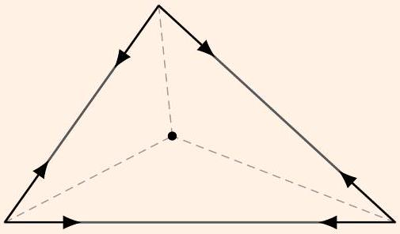
These forces clearly balance, and also produce no net torque on the triangle. Now combine the forces applied at each vertex, yielding three forces that point along the angle bisectors. By the principles of M2, the torques of these forces can only balance if their lines of action meet at a point. Therefore the angle bisectors are concurrent, so the incenter exists.

Example 10
Let $A B$ be a diameter of a circle, and let a mass be free to slide on the circle. The mass is connected to two identical straight springs of zero rest length, which are in turn connected to points $A$ and $B$. At what points $C$ can the mass be in static equilibrium?

Solution
The potential energy of the system is proportional to $( \mathrm { AC } ) ^ { 2 } + ( \mathrm { BC } ) ^ { 2 }$. Since ABC is a right triangle, this is just equal to (AB$) ^ { 2 }$ by the Pythagorean theorem. Since the potential energy doesn't depend on where the mass is, it can be at static equilibrium at any point on the circle. Alternatively, you can show that the mass is in static equilibrium by force balance, and use the reasoning in reverse to derive the Pythagorean theorem.

[1] Problem 30. Consider a right triangle $A B C$ filled with a fluid of uniform pressure. Using torque balance, establish the Pythagorean theorem.
Solution. Suppose $\angle C = 90 ^ { \circ }$, and suppose the pressure is $p$. Taking torques about $A$, we have $p a \cdot ( a / 2 ) + p b \cdot ( b / 2 ) - p c \cdot ( c / 2 ) = 0$, or $a ^ { 2 } + b ^ { 2 } = c ^ { 2 }$.
[1] Problem 31. Shown below is a setup due to the $16 { } ^ { \text {th } }$ century mathematician Stevin, who was also known for introducing decimal numbers.
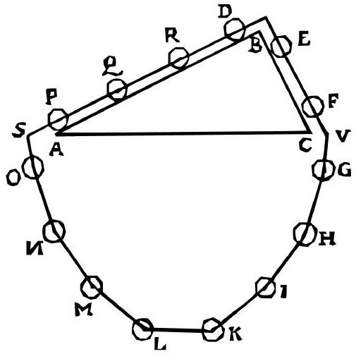
One might argue that because there are more masses on $A B$ than on $B C$, this is a perpetual motion machine that turns counterclockwise. By using the fact that perpetual motion machines don't actually exist, prove the law of sines.
Solution. For each mass on $A B$, the component of gravity along $A B$ is proportional to $\sin \angle B A C$. Furthermore, the number of masses is proportional to $\overline { A B }$. This must be balanced by the masses along $B C$, giving
$$
A B \sin \angle B A C = B C \sin \angle B C A
$$
which after minor rearrangement is the law of sines.
[2] Problem 32. Consider the $n$-sided polygon $P$ of least possible area that circumscribes a closed convex curve $K$. Prove that every tangency point of $K$ with a side of $P$ is the midpoint of that side. (Hint: begin by supposing that the area outside $P$ is filled with a gas of uniform pressure, with a vacuum inside $P$.)
Solution. The minimum energy is achieved when the gas takes up the largest possible area, i.e. when the polygon $P$ has minimum area. Let's model the polygon as being formed by $n$ infinite rods, which don't push on each other. Now, in equilibrium, the torque on each rod must be zero, but the only forces on the rod are the uniform pressure along the part of the rod making up the corresponding polygon side, and the normal force at the contact point. Taking torques about the contact point shows that it must be the midpoint.

[2] Problem 33. In this problem we'll derive Kepler's first law yet again, using no calculus, but a bit of Euclidean geometry. As usual, we suppose a planet of mass $m$ orbits a fixed star of much greater mass $M$. Placing the star at the origin, let $\phi$ be the angle between $\mathbf { r }$ and $\mathbf { v }$ for the planet.
    (a) Write down the quantities $E$ and $L$ in terms of $G , M , m , v , r$, and $\phi$, and show that
$$
\left( r ^ { 2 } + \frac { G M m } { E } r \right) \sin ^ { 2 } \phi = \frac { L ^ { 2 } } { 2 m E } .
$$
    (b) Now consider an ellipse with semimajor axis $a$ and eccentricity $e$, meaning that the distance between the foci is $2 a e$, with one of the foci $F$ at the origin. Consider a point $P$ on the ellipse, so that the angle between the tangent to the ellipse at $P$ and $F P$ is $\phi$. If $r = | F P |$, show that
$$
\left( r ^ { 2 } - 2 a r \right) \sin ^ { 2 } \phi = - a ^ { 2 } \left( 1 - e ^ { 2 } \right) .
$$
You will have to use the geometrical property that a light ray sent from one focus will reflect at the ellipse to hit the other focus.
    (c) By comparing your results for (a) and (b), conclude that the orbit is an ellipse with
$$
a = - \frac { G M m } { 2 E } , \quad e = \sqrt { 1 + \frac { 2 E L ^ { 2 } } { G ^ { 2 } M ^ { 2 } m ^ { 3 } } } .
$$

Solution. (a) By definition, we have

$$
L = m r v \sin \phi , \quad E = \frac { 1 } { 2 } m v ^ { 2 } - \frac { G M m } { r } .
$$

Solving the second equation for $v$ gives

$$
v = \sqrt { \frac { 2 E } { m } + \frac { 2 G M } { r } } .
$$

Plugging this into the first equation, squaring, and rearranging gives the desired result.

(b) Refer to the below diagram, where $T T ^ { \prime }$ is the tangent to the ellipse and $N N ^ { \prime }$ is the normal.
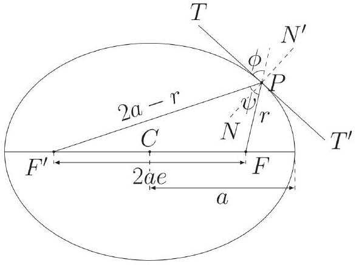
By the law of cosines,
$$
( 2 a e ) ^ { 2 } = ( 2 a - r ) ^ { 2 } + r ^ { 2 } - 2 r ( 2 a - r ) \cos \psi .
$$
By the geometrical properties of the ellipse, $N N ^ { \prime }$ is the angle bisector of $\angle F ^ { \prime } P F$, so
$$
\cos \psi = \cos ( \pi - 2 \phi ) = - \cos ( 2 \phi ) = 2 \sin ^ { 2 } \phi - 1 .
$$
Plugging this into the law of cosines and rearranging gives the desired result.

(c) This follows immediately, from inspection.
This derivation breaks down for $E \geq 0$, since in that case the trajectory isn't an ellipse, but similar derivations can be performed for the parabola and hyperbola.
