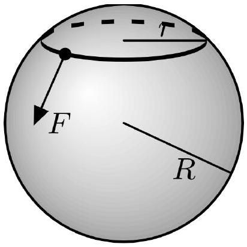
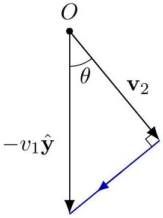
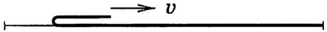
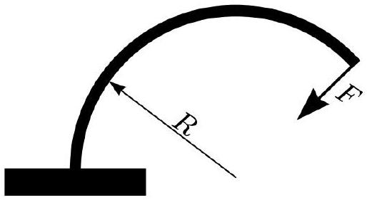
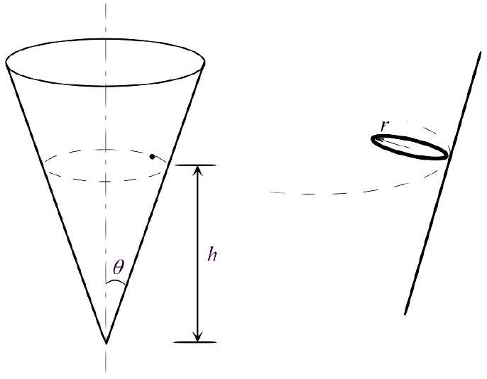
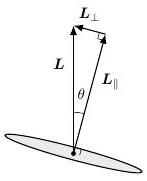

## Mechanics Review

For some nice mechanical puzzles, see this talk and this talk. There is a total of 89 points.

## 1 Approximations

[2] Problem 1. At some point in your life, you might have to buy a very expensive item of price $P$ financed by a loan. If the loan has a monthly interest rate $r \ll 1$ (e.g. $r = 1 \%$ means your debt grows by 1\% per month), then it turns out you can pay it all off in $N$ months if you pay
$$
C = \frac { r ( 1 + r ) ^ { N } } { ( 1 + r ) ^ { N } - 1 } P
$$
per month. For example, if $r = 0$ then $C = P / N$.
    (a) Find an approximation for $C$ valid for small $r N$.
    (b) Find an approximation for $C$ valid for large $r N$.

Solution. (a) We apply the binomial approximation to the $( 1 + r ) ^ { N }$ factors, but we have to be a bit careful. The leading term in the denominator is order $r$, so if we want the first correction in $r$, we need to compute the denominator to order $r ^ { 2 }$. Thus,

$$
C \approx \frac { r ( 1 + r N ) } { \left( 1 + r N + r ^ { 2 } N ^ { 2 } / 2 \right) - 1 } P = \frac { 1 + r N } { 1 + r N / 2 } \frac { P } { N } \approx \frac { P } { N } \left( 1 + \frac { r N } { 2 } \right) .
$$

This makes sense, as when we average across the payment of the whole loan, the interest charged per month is $r ( P / 2 )$.

(b) In this case, we have $( 1 + r ) ^ { N } \approx e ^ { r N } \gg 1$. Then
$$
C \approx \frac { r e ^ { r N } } { e ^ { r N } - 1 } P \approx r P
$$
which makes sense, as most of your payment per month just goes to the interest.

## 2 Statics and Linear Dynamics

[3] Problem 2 (FYKOS 34.1). We model a person's head as a sphere of radius $R$, and a beanie as a circular, massless rubber band of radius $r _ { 0 }$ and spring constant $k$, where $r _ { 0 } < R$. The coefficient of friction between the band and head is $\mu$. When is it possible for the person to put the beanie on with one hand?

That is, find the conditions for which it is possible to stretch the band so that it lies along the equator of the sphere, by applying forces only at one point at the band, as shown above. Assume for simplicity that the band is always planar.

Solution. This is secretly a statics problem. The problem with trying to put on a beanie this way is that it might slip back up your head, since it wants to contract. If the coefficient of friction is high enough, this slipping won't happen. And as long as slipping doesn't happen, it's possible to pull the beanie down, by just applying an infinitesimal force at some point with a downward component.

Consider the moment where the beanie is a circle with radius $r$. At each point along the beanie, there is a normal force $d N$ and a friction force $d f$. Balancing the net upward/outward force gives

$$
d f \sin \alpha = d N \cos \alpha , \quad \sin \alpha = \frac { r } { R }
$$

Assuming the friction is maximal, we require

$$
\mu \geq \cot \alpha .
$$

This is harder to satisfy the smaller $r$ is, so the toughest part is when we just start, and $r = r _ { 0 }$. By solving the relevant right triangle and rearranging, we have

$$
\mu \geq \sqrt { \left( R / r _ { 0 } \right) ^ { 2 } - 1 }
$$

or equivalently,

$$
r _ { 0 } \geq \frac { R } { \sqrt { 1 + \mu ^ { 2 } } } .
$$

The spring constant $k$ doesn't matter, as one could have seen by dimensional analysis.
[3] Problem 3. In M2, we considered many problems with ideal strings, which have a fixed length and can exert tension forces along themselves but no bending moment. The next simplest case is an elastic strip, such as a long, thin piece of plastic. An elastic strip is just like an ideal string, except that it also contains a bending moment (i.e. an internal torque) of $\tau$, related to its local radius of curvature $R$ by $\tau = \kappa / R$, for a constant $\kappa$.

Suppose the ends of an elastic strip of total length $L + \Delta x$ are connected by an ideal string of length $L$, where $\Delta x \ll L$, so that the strip bends away from the string near its middle. Find the tension $T$ in the string, and the maximal distance between the strip and the string.

Solution. Let's suppose the endpoints of the string are at $( 0,0 )$ and $( L , 0 )$, and let the strip's shape be $y ( x )$. Now consider torque balance on the part of the strip at $x < x _ { 0 }$. There are contributions from the tension from the string, the bending moment from the rest of the strip, and the tension from the rest of the strip. We don't care about the tension in the strip in this problem, so we eliminate that contribution by taking torques about $\left( x _ { 0 } , y \left( x _ { 0 } \right) \right)$, leading to the torque balance equation

$$
- T y \left( x _ { 0 } \right) = \tau \left( x _ { 0 } \right) = \frac { \kappa } { R \left( x _ { 0 } \right) } .
$$

Because $\Delta x \ll L$, the strip is only slightly bent, so we can approximate

$$
\left. \frac { 1 } { R \left( x _ { 0 } \right) } \approx \frac { d ^ { 2 } y } { d x ^ { 2 } } \right| _ { x = x _ { 0 } } .
$$

Since $x _ { 0 }$ was arbitrary, the shape of the strip obeys the differential equation

$$
\frac { d ^ { 2 } y } { d x ^ { 2 } } = - \frac { T } { \kappa } y
$$

and imposing the boundary condition $y ( 0 ) = 0$ gives

$$
y ( x ) = y _ { 0 } \sin \left( \sqrt { \frac { T } { \kappa } } x \right) .
$$

We need the strip to bend away and then back to the string, so $\pi = \sqrt { T / \kappa } L$, so that

$$
T = \frac { \pi ^ { 2 } \kappa } { L ^ { 2 } } .
$$

Now, to find the value of $y _ { 0 }$ we integrate the arc length of the strip,

$$
L + \Delta x = \int _ { 0 } ^ { L } \sqrt { 1 + ( d y / d x ) ^ { 2 } } d x \approx \int _ { 0 } ^ { L } \left( 1 + \frac { y _ { 0 } ^ { 2 } T } { 2 \kappa } \cos ^ { 2 } ( \sqrt { T / \kappa } x ) \right) d x
$$

where we used the binomial theorem. This yields $\Delta x = y _ { 0 } ^ { 2 } T L / 4 \kappa$, and solving for $y _ { 0 }$ gives

$$
y _ { 0 } = \frac { 2 } { \pi } \sqrt { L \Delta x } .
$$

If we hadn't had $\Delta x \ll L$, the problem would have been much harder, since the formula for the radius of curvature would have been more complicated. The solutions in the general case are called elastica. They can be very elaborate, with reversals in direction and even loops, which you can see from thin strips of paper or plastic. The history of the elastica is discussed here. The problem was first posed by Bernoulli in 1691, and conclusively solved by Euler in 1744.
[3] Problem 4 (MPPP 19). A small pearl moving in deep water experiences a viscous retarding force that is proportional to its speed, by Stokes' law. If a pearl is released from rest under the water, then it reaches a terminal velocity $v _ { 1 }$.

(a) Suppose the pearl is instead released horizontally with initial speed $v _ { 2 }$. Find the minimum speed of the pearl during the subsequent motion.
(b) If $v _ { 2 } < v _ { 1 }$, for what range of angles can the pearl be released, so that its speed monotonically increases?

Solution. (a) When the speed is at a minimum, $d \left( v ^ { 2 } \right) / d t = 0$, so $\mathbf { v } \cdot \mathbf { a } = 0$. The retarding force $- b v$ satisfies $b v _ { 1 } = m g$. Newton's laws in each dimension give

$$
m a _ { x } = - b v _ { x } \quad m a _ { y } = - b v _ { y } - m g
$$

Solving these equations by separating variables gives

$$
v _ { x } = v _ { 2 } e ^ { - b t / m } , \quad v _ { y } = - v _ { 1 } \left( 1 - e ^ { - b t / m } \right) .
$$

Differentiating, we have

$$
a _ { x } = - \frac { g v _ { 2 } } { v _ { 1 } } e ^ { - b t / m } , \quad a _ { y } = - g e ^ { - b t / m } .
$$

We want $v _ { x } a _ { x } + v _ { y } a _ { y } = 0$, and letting $\alpha = e ^ { - b t / m }$, this means,
$$
\frac { v _ { 2 } ^ { 2 } } { v _ { 1 } } \alpha ^ { 2 } = v _ { 1 } ( 1 - \alpha ) \alpha
$$
and solving gives
$$
\alpha = \frac { v _ { 1 } ^ { 2 } } { v _ { 1 } ^ { 2 } + v _ { 2 } ^ { 2 } } , \quad v = \sqrt { v _ { 2 } ^ { 2 } \alpha ^ { 2 } + v _ { 1 } ^ { 2 } ( 1 - \alpha ) ^ { 2 } } = \frac { v _ { 1 } v _ { 2 } } { \sqrt { v _ { 1 } ^ { 2 } + v _ { 2 } ^ { 2 } } } .
$$
(b) Note that in the previous part, $a _ { y } / a _ { x }$ is constant. Let the velocity vector start at $O$. The end of the velocity vector moves in a straight line since the direction of acceleration is constant (goes from $\mathbf { v } _ { 2 }$ to $- v _ { 1 } \hat { \mathbf { y } }$ ).

At the limiting angle when the velocity monotonically increases, $v _ { 2 }$ will be the minimum velocity, so $\mathbf { v } _ { 2 }$ is perpendicular to the blue line. That means that the angle $\theta$ from the downward direction needs to satisfy
$$
| \theta | < \arccos \left( \frac { v _ { 2 } } { v _ { 1 } } \right) .
$$
[3] Problem 5 (PPP 42). A uniform rod of mass $m$ and length $\ell$ is supported horizontally at its ends by two fingers. As the fingers are slowly brought together, the rod alternates between sliding on each finger. The coefficients of friction are $\mu _ { k } < \mu _ { s }$.
    (a) Explain why the fingers meet under the center of mass of the rod. (Try it in real life!)
    (b) Find the total work done by the fingers during this process.

Solution. (a) Consider balancing torques about the center of mass of the rod. As a finger moves closer to the center, its lever arm decreases so the normal force increases. Eventually, the maximum possible friction force increases enough so that finger stops sliding, at which point the other finger starts sliding. (For a visual explanation, see this nice video!)

(b) Let $x _ { 1 }$ and $x _ { 2 }$ denote the distances from the center. Then $F _ { 1 } = \frac { m g x _ { 2 } } { x _ { 1 } + x _ { 2 } }$, and similarly for $F _ { 2 }$. During the motions, one finger is stationary while the other finger moving from $x _ { 1 } = a$ to $x _ { 1 } = b$ will do work
$$
W = \int _ { a } ^ { b } \frac { m g \mu _ { k } x _ { 2 } } { x _ { 1 } + x _ { 2 } } d x _ { 1 } = m g \mu _ { k } x _ { 2 } \log \left( \frac { x _ { 2 } + a } { x _ { 2 } + b } \right)
$$

Each finger does work until the ratio of the forces is $\mu _ { s } / \mu _ { k }$, and the ratio of the distances is $r = \mu _ { k } / \mu _ { s }$, at which point the finger switches. Then the total work is

$$
W = - \frac { 1 } { 2 } m g \mu _ { k } \ell \left( \log \left( \frac { 1 + r } { 2 } \right) + r \log \left( \frac { r + r ^ { 2 } } { 1 + r } \right) + r ^ { 2 } \log \left( \frac { r ^ { 2 } + r ^ { 3 } } { r + r ^ { 2 } } \right) + \ldots \right)
$$

which means

$$
- \frac { W } { \frac { 1 } { 2 } m g \mu _ { k } \ell } = \log \left( \frac { 1 + r } { 2 } \right) + r \log ( r ) + r ^ { 2 } \log ( r ) + r ^ { 3 } \log ( r ) + \ldots = \log \left( \frac { 1 + r } { 2 } \right) + \frac { r } { 1 - r } \log ( r ) .
$$

Plugging back in for $r$, we conclude

$$
W = \frac { 1 } { 2 } m g \mu _ { k } \ell \left( \log \left( \frac { 2 \mu _ { s } } { \mu _ { k } + \mu _ { s } } \right) + \frac { \mu _ { k } } { \mu _ { s } - \mu _ { k } } \log \left( \frac { \mu _ { s } } { \mu _ { k } } \right) \right) .
$$

This is a pretty complicated expression, so let's check it with limiting cases. Let $\mu _ { s } = \mu _ { k } ( 1 + \epsilon )$ where $\epsilon \ll 1$. The first logarithm term is $\mathcal { O } ( \epsilon )$, so

$$
W = \frac { 1 } { 2 } m g \mu _ { k } \ell \left( \frac { 1 } { \epsilon } \log ( 1 + \epsilon ) + \mathcal { O } ( \epsilon ) \right) = \frac { 1 } { 2 } m g \mu _ { k } \ell + \mathcal { O } ( \epsilon ) .
$$

This makes sense, because in this limit both fingers are sliding almost continuously, moving a distance $\ell / 2$ each against a friction force $\mu _ { k } m g / 2$.

[3] Problem 6. A long rope with linear mass density $\lambda$ rests on a horizontal table with a small bend.

You pull the end of the rope that is near the bend with force $F$.

(a) Suppose that the bend is very small, so that all of the rope touching the ground is perfectly slack (zero tension). What $F$ is needed to pull the end of the rope with constant velocity $v$ ?
(b) Now suppose that the bend is smooth, so that pieces of the rope are gradually accelerated from rest as they pass the bend. What force $F$ is needed to pull the end of the rope with constant velocity $v$ ?
(c) In both cases, what force $F ( t )$ is needed to pull the rope with constant acceleration $a$, if we assume the rope starts flat and at rest at time $t = 0$ ?

Solution. (a) In this case, we can't directly consider the energy, because the sudden acceleration of a piece of the rope when it hits the bend is inherently inelastic. On the other hand, since the part of the rope touching the ground is slack, there can be no horizontal forces on any part of it, so the friction force vanishes. As a result, the only horizontal external force is the force you exert. Note that the mass $m$ that is moving is

$$
m = \frac { \lambda x } { 2 }
$$

where $x$ is the total distance the end has moved. Then

$$
\frac { d m } { d t } = \frac { \lambda v } { 2 }
$$

and we have

$$
F = \frac { d p } { d t } = \frac { d m } { d t } v = \frac { 1 } { 2 } \lambda v ^ { 2 } .
$$

(b) In this case, we can't directly consider the momentum because of the friction force from the ground. However, there are no energy losses, so we have
$$
F = \frac { 1 } { v } \frac { d E } { d t } = \frac { 1 } { v } \frac { 1 } { 2 } \frac { d m } { d t } v ^ { 2 } = \frac { 1 } { 4 } \lambda v ^ { 2 } .
$$
Of course, in reality, the true answer will be somewhere in between the results of (a) and (b), depending on the properties of the bend.
There's a simple reason why this answer is precisely half of the answer to part (a). We showed in M8 that an isolated flexible chain moving with uniform speed $u$ along its length, carrying a constant tension $T = \lambda u ^ { 2 }$, can indefinitely maintain its shape. Now consider the rope in a reference frame moving with speed $v / 2$ to the right. Then the curved part of the rope is precisely such a flexible chain, with uniform tension $T = \lambda v ^ { 2 } / 4$. Therefore, the two rightward forces on the rope, due to the pulling and the friction, are equal.
(c) Again, we can consider momentum and energy, respectively. The part of the string that's moving has mass and speed
$$
m ( t ) = \frac { \lambda a t ^ { 2 } } { 4 } , \quad v ( t ) = a t
$$
so that we have
$$
p ( t ) = \frac { \lambda a ^ { 2 } t ^ { 3 } } { 4 } , \quad E ( t ) = \frac { \lambda a ^ { 3 } t ^ { 4 } } { 8 } .
$$
In the first case, we have
$$
F ( t ) = \frac { d p } { d t } = \frac { 3 } { 4 } \lambda a ^ { 2 } t ^ { 2 } .
$$
In the second case, we have
$$
F ( t ) = \frac { 1 } { v } \frac { d E } { d t } = \frac { 1 } { 2 } \lambda a ^ { 2 } t ^ { 2 } .
$$
Again, the difference comes from the friction force. (The slick argument of part (b) doesn't quite work anymore, since in the moving frame, the chain is accelerating along its length, so the tension inside the curved part isn't uniform; instead, it needs to be higher at the top. However, the argument still shows that the tension at the bottom is $\lambda v ^ { 2 } / 4 = \lambda a ^ { 2 } t ^ { 2 } / 4$. This force is supplied by friction and precisely accounts for the difference between the two cases.)
[2] Problem 7. 3 INPhO 2012, problem 1.
[3] Problem 8. INPhO 2018, problem 4.
[4] Problem 9. USA Theory Team Selection Test 2022, problem 2. A set of nice exercises.

## 3 Oscillations

[3] Problem 10 (NBPhO 2007). Consider a light elastic rod with fixed length $\ell$. If one end of the rod is firmly fixed, and a force $F$ is applied to the other end of the rod, perpendicular to the rod at the point of application, then it can be shown that the rod takes a form of a circular arc with radius of curvature $R = k / F$, for a constant $k$. (We previously considered such objects in problem 3.)

Let the rod be fixed vertically, at its bottom end, and a mass $m$ be attached to its upper end. The rod is initially standing up straight.

(a) Find the period of small oscillations, assuming $m g \ell \ll k$.
(b) What is the maximum mass $m$ for the configuration to be stable?

Solution. (a) Recall that when we find the period of the ordinary pendulum, we can ignore the effect of the tension because it's directed radially, so it's always perpendicular to the mass's trajectory. We only have to care about the tangential component of gravity. This case is a bit trickier than that, for two reasons. First, the trajectory of the mass isn't a circle, because the rod bends. Second, in general we need to care about both the tangential component of gravity and the internal force of the rod.
When the rod has bent through a small total angle $\theta$, its radius of curvature is $R = \ell / \theta$, so the horizontal displacement of the mass is

$$
\Delta x = R ( 1 - \cos \theta ) \approx \frac { R \theta ^ { 2 } } { 2 } = \frac { \ell \theta } { 2 } .
$$

The mass also has a small vertical displacement, but it's proportional to $\theta ^ { 2 }$ and thus negligible. So $\Delta x$ is roughly the total distance the mass has moved.
Next, we want to find the restoring force, i.e. the magnitude of the force acting on the mass which points backwards along the mass's trajectory. The part due to the rod itself is $k / R = k \theta / \ell$. The mass's trajectory makes a small angle of order $\theta$ to the horizontal, so the part due to gravity is of order $m g \theta \approx m g \ell / R$, which is negligible by assumption.
Thus, the motion is simple harmonic with an effective spring constant of $2 k / \ell ^ { 2 }$, giving period $T = \pi \ell \sqrt { 2 m / k }$.

(b) It would be confusing to do this with forces, because the directions of the forces change in a complicated way as the rod is bent, so we instead consider the energy.
When the rod bends an angle $\theta$, the change in the mass's gravitational potential energy is
$$
\Delta U _ { g } = m g r \sin \theta - m g \ell = m g \ell \left( \frac { \sin \theta } { \theta } - 1 \right) \approx - \frac { 1 } { 6 } m g \ell \theta ^ { 2 } .
$$
On the other hand, the rod itself gains potential energy, which can be computed by considering the work done on it. To lowest nontrivial order in $\theta$, we have $d x = \ell d \theta / 2$ and $F = k \theta / \ell$, so
$$
\Delta U _ { r } \approx \int F d x = \int _ { 0 } ^ { \theta } \frac { k \theta } { \ell } \frac { \ell } { 2 } d \theta = \frac { 1 } { 4 } k \theta ^ { 2 } .
$$
Note that $\Delta U _ { g }$ is negligible when $m g \ell \ll k$, which is why we were able to neglect the gravitational force in part (a). More generally, we need to make sure the total potential energy is a minimum at $\theta = 0$, so we need
$$
\frac { m g \ell } { 6 } < \frac { k } { 4 }
$$

which gives a maximum mass of
$$
m = \frac { 3 k } { 2 g \ell } .
$$
[3] Problem 11. INPhO 2019, problem 7. A nice data analysis problem; bring graph paper.
[5] Problem 12. APhO 2011, problem 2. A neat problem on "stick-slip", which appears in many real-world contexts; you can see it in action on a violin string here. (For some other calculations on a similar stick-slip setup, see USAPhO 2021, problem A1.)
Solution. See the official solutions as usual. (There's an older version of the official solutions online, which has a factor of 2 error on the last step. The final answer should be $5.6 \times 10 ^ { - 3 } \mathrm {~s} ^ { - 1 }$.)

## 4 Rotation

[2] Problem 13. NBPhO 2015, problem 3.
[3] Problem 14. 1 USAPhO 2021, problem B1. An elegant rotation problem.
[3] Problem 15 (Morin 8.24). A spherically symmetric ball of radius $R$ initially slides without rotating on a horizontal surface with friction. The initial speed is $v _ { 0 }$, and the moment of inertia about the center is $I = \beta m R ^ { 2 }$.
    (a) Assuming that the normal force is always applied upward at the bottom of the ball, and that the friction force is always applied horizontally at the bottom of the ball (but assuming nothing about how the friction force varies), find the speed of the ball when it begins to roll without slipping. Also, find the kinetic energy lost while sliding.
    (b) Now consider the case where the friction force is standard uniform kinetic friction, $f = - \mu _ { k } N$. Verify that the work done by friction equals the energy loss calculated in part (a).
    (c) In reality, the conclusions above can be modified by "rolling resistance". Any real material will slightly deform when the ball rolls on it. We can crudely account for this by thinking of the normal force as applied not at the bottom of the ball, but at a point slightly forward from the bottom. The horizontal component of this normal force is defined to be $f _ { r } = - \mu _ { r } N _ { y }$ where $N _ { y }$ is the vertical normal force, and $\mu _ { r } \ll 1$. In addition, kinetic friction is still present, as in part (b). Under these assumptions, find the velocity of the ball once it stops slipping. Is more or less energy lost than in part (b)?

Solution. (a) The point here is that we can relate the linear and angular impulses without having to know how the force behaves in time. If there's a net impulse $J$ on the ball, the net change in angular momentum about the center of the ball is $\int R F d t = R J$. When the ball is rolling without slipping, $v = \omega R$. Thus

$$
J = m v _ { 0 } - m v _ { f } = L / R = \beta m R \omega
$$

which gives

$$
v _ { f } = \frac { v _ { 0 } } { 1 + \beta } .
$$

The kinetic energy lost is

$$
\Delta K = \frac { 1 } { 2 } m v _ { 0 } ^ { 2 } - \frac { 1 } { 2 } m v _ { f } ^ { 2 } - \frac { 1 } { 2 } \beta m R ^ { 2 } \omega ^ { 2 } = \frac { 1 } { 2 } m \left( v _ { 0 } ^ { 2 } - ( 1 + \beta ) v _ { f } ^ { 2 } \right) = \frac { 1 } { 2 } \frac { \beta } { 1 + \beta } m v _ { 0 } ^ { 2 } .
$$

(b) Here, $f = - \mu _ { k } m g$ and acts for a time of $t = J / f$. Since the acceleration is constant, the ball travels a distance of $\frac { 1 } { 2 } \left( v _ { 0 } + v _ { f } \right) t$ while sliding. However, it will turn a distance of $R \theta = \frac { 1 } { 2 } \omega R t = \frac { 1 } { 2 } v _ { f } t$ in the other direction, so the relative distance traveled between the surface of the ball and the ground is $L = \frac { 1 } { 2 } v _ { 0 } t$.
$$
\Delta K = f L = \frac { 1 } { 2 } v _ { 0 } J = \frac { 1 } { 2 } m \left( v _ { 0 } - v _ { f } \right) v _ { 0 } = \frac { 1 } { 2 } \frac { \beta } { 1 + \beta } m v _ { 0 } ^ { 2 }
$$
as desired.
(c) Now the angular and linear accelerations are
$$
\alpha = \frac { \mu _ { k } g } { \beta R } , \quad a = - \left( \mu _ { r } + \mu _ { k } \right) g
$$
where the rolling resistance doesn't affect the angular acceleration, because the overall normal force always exerts no torque about the center of mass of the ball. (Note that this conclusion would have been changed if we accounted for the deformation of the ball itself, which would give a second, additional type of rolling resistance. Here we are assuming that the ball is much harder than the surface it rolls on, though there are plenty of situations where the reverse is true, such as when a bike tire rolls on concrete.)
Thus, by similar reasoning to that of part (a),
$$
v _ { f } = \frac { v _ { 0 } } { 1 + \beta \left( 1 + \mu _ { r } / \mu _ { k } \right) } .
$$
This is smaller than the result of part (a), so more energy is lost. The reason is that the rolling resistance dissipates additional energy. Notice that even once slipping stops, rolling resistance will continue to dissipate energy, causing the ball to eventually come to a stop.

## Remark

In the early 1800s, some said it was impossible for a train engine to pull anything heavier than the engine itself. As the argument went, the force that moves the train forward is friction between the engine car's wheels and the track. If the engine car has mass $M$, the maximum friction force is $\mu M g$. If the rest of the train has mass $M ^ { \prime }$, however, then it requires a force $\mu M ^ { \prime } g$ to get it started moving, so the train can't start if $M ^ { \prime } > M$.

Problem 15 explains why this reasoning is wrong. The maximum forward frictional force on the engine car wheels is determined by the coefficient of static friction $\mu _ { s }$, while the force needed to get the rest of the train moving is determined by the coefficient of rolling friction $\mu _ { r }$. So we only need $\mu _ { s } M > \mu _ { r } M ^ { \prime }$, which is possible since $\mu _ { r }$ can be very small. For steel train wheels on steel rail, we might have $\mu _ { s } \sim 0.5$ but $\mu _ { r } \lesssim 10 ^ { - 3 }$.

On the other hand, early trains could have trouble going up inclines. This led to several innovative concepts, such as trains propelled by atmospheric pressure or pushed by mechanical legs. All the mechanical systems we're familiar with today, whose design might seem obvious at first glance, actually gradually evolved through many intermediate forms. For instance, most people think they know how a bicycle works, but actually don't, because it's really quite tricky. Accordingly, it took over a century for the modern bicycle design to evolve.

[4] Problem 16 (IPhO 1998). A hexagonal pencil with mass $M$ and side length $R$ is pushed and rolls down a ramp of inclination $\theta$. For some values of $\theta$, the pencil will roll down the plane with some terminal speed, never losing contact with the ramp. In order to avoid a complicated moment of inertia calculation, we will assume the cross section looks like a wheel with six equally spaced massless spokes and no rim, with all the mass on the axle.
    (a) The pencil does not speed up indefinitely, but rather reaches a steady state. Explain why, and compute the speed the pencil's axis has immediately after each collision, in the steady state.
    (b) Find the minimum $\theta$ so that rolling spontaneously starts, without needing a push.
    (c) Find the minimum $\theta$ so that, once the pencil has been pushed to start rolling, it never stops.
    (d) Find the maximum $\theta$ so that a rolling pencil always remains in contact with the plane.

Solution. (a) Each time the pencil rolls through an angle $\pi / 3$, a new vertex of the pencil hits the plane. In this moment, that vertex suddenly becomes the new pivot point about which the pencil is rotated, which means energy is dissipated in an inelastic collision. This is the reason that the pencil reaches a steady state, instead of accelerating indefinitely. You can see this very nicely depicted in this video.

Let the pencil's center of mass have speed $v _ { i }$ just before an impact, and $v _ { f }$ just after the impact. The impact involves a singular impact force at the new pivot point, which means angular momentum is conserved about that point. Thus,

$$
M v _ { i } R \cos 60 ^ { \circ } = M v _ { f } R
$$

from which we conclude

$$
v _ { f } = \frac { v _ { i } } { 2 } .
$$

In the steady state, the kinetic energy gained from rolling from one vertex to another balances the energy lost in the collision, so conserving energy immediately after a collision and immediately before a next one gives

$$
\frac { 1 } { 2 } M v _ { f } ^ { 2 } + M g R \sin \theta = \frac { 1 } { 2 } M \left( 2 v _ { f } \right) ^ { 2 }
$$

from which we conclude

$$
v _ { f } = \sqrt { \frac { 2 g R \sin \theta } { 3 } } .
$$

By the way, the original formulation of the question gave the pencil a moment of inertia $C M R ^ { 2 }$ about its center of mass. The solution with general $C$ is not much harder. Now the angular momentum conservation condition is

$$
M v _ { i } R \cos 60 ^ { \circ } + C M R ^ { 2 } \omega _ { i } = ( C + 1 ) M R ^ { 2 } \omega _ { f }
$$

where $\omega _ { i } = v _ { i } / R$ and $\omega _ { f } = v _ { f } / R$. Thus,

$$
v _ { f } = \frac { 2 C + 1 } { C + 1 } \frac { v _ { i } } { 2 } .
$$

The energy balance equation for the steady state becomes
$$
\frac { 1 } { 2 } M ( C + 1 ) v _ { f } ^ { 2 } + M g R \sin \theta = \frac { 1 } { 2 } M ( C + 1 ) v _ { i } ^ { 2 }
$$
and simplifying gives
$$
v _ { f } = \sqrt { \frac { 2 g R \sin \theta ( C + 1 / 2 ) ^ { 2 } } { ( C + 1 ) \left( ( C + 1 ) ^ { 2 } - ( C + 1 / 2 ) ^ { 2 } \right) } } .
$$
(b) This is a basic statics problem. The rolling must start if the center of mass of the hexagon is not above its support, so the minimum angle is $\theta = 30 ^ { \circ }$.
(c) Between two vertex transitions, the maximum potential energy of the pencil is when the center of mass is directly above the vertex at a height $R$. It will start out at a height of $h _ { 0 } = R \sin \left( \theta + 60 ^ { \circ } \right)$ above the vertex, and fall down to a height $h _ { f } = R \sin \left( 60 ^ { \circ } - \theta \right)$ above the vertex.
In order for it to roll indefinitely, potential energy from height $R$ to $h _ { f }$ followed by the inelastic collision must leave enough kinetic energy for the pencil to go from height $h _ { 0 }$ to height $R$. Earlier we found that $\omega _ { f } = \omega _ { 0 } ( C + 1 / 2 ) / ( C + 1 )$, so the kinetic energy will be reduced by a factor of $\alpha = \left( \omega _ { f } / \omega _ { 0 } \right) ^ { 2 }$. Thus the energy equation for indefinite rolling is
$$
\alpha M g \left( R - h _ { f } \right) = M g \left( R - h _ { 0 } \right) .
$$
This implies
$$
\frac { 1 - \sin \left( \theta + 60 ^ { \circ } \right) } { 1 - \sin \left( 60 ^ { \circ } - \theta \right) } = \alpha .
$$
In our case, $\alpha = 1 / 4$. The solution of the above equation can be found using either binary search or by the "plug in" method, i.e. repeatedly calculating
$$
\arcsin \left( 1 - \frac { 1 - \sin \left( 60 ^ { \circ } - \mathrm { Ans } \right) } { 4 } \right) - 60 ^ { \circ } .
$$
Both methods give an answer of $\theta = 10.21 ^ { \circ }$.
(d) The pencil leaves the ramp when gravity isn't strong enough to provide the needed centripetal acceleration for the rotation about a vertex. Right before the next vertex transition, the pencil is moving the fastest, and the radial component of gravity is the smallest, so the pencil most readily leaves the ramp at that point. Using part (a)'s notation ( $\omega _ { 0 }$ is the angular velocity right before the next transition), the leaving condition is $g \cos \left( 30 ^ { \circ } + \theta \right) = g \sin \left( 60 ^ { \circ } - \theta \right) = \omega _ { 0 } ^ { 2 } R$, where $30 ^ { \circ } + \theta$ is the angle between the vertical and line connecting the center of mass to the vertex. Using our expression for $\omega _ { 0 } = \frac { v _ { f } } { R } ( C + 1 ) / ( C + 1 / 2 )$ found in part (a),
$$
\sin \left( 60 ^ { \circ } - \theta \right) = \frac { 2 \sin \theta ( C + 1 ) } { \left( ( C + 1 ) ^ { 2 } - ( C + 1 / 2 ) ^ { 2 } \right) }
$$
With $C = 0$, we have
$$
\sin \left( 60 ^ { \circ } - \theta \right) = \frac { 8 \sin \theta } { 3 } .
$$
We can binary search for the answer or repeatedly plug in
$$
\arcsin \left( \frac { 3 \sin \left( 60 ^ { \circ } - \operatorname { Ans } \right) } { 8 } \right)
$$

to find that the maximum angle for it to stay on the ramp is $\theta = 15.3 ^ { \circ }$. So the range of angles where the rolling will never stop, but also keep the pencil on the ramp, is quite narrow!
This famous question has appeared on the IPhO, BAUPC, and Morin's mechanics book, and papers have even experimentally confirmed its results. For more, see the extended analysis here.

[4] Problem 17. USAPhO 2017, problem B1. A tough rotation problem.

[3] Problem 18. USAPhO 2021, problem B3. A cute setup with many nice lessons.
The next two questions are about three-dimensional rotation, covered in M8.
[3] Problem 19 (BAUPC). A frictionless fixed cone stands on its tip.

    (a) A particle slides on the inside surface of the cone at height $h$ above the tip, as shown at left above. Find the angular frequency of the circular motion.
    (b) Now suppose the cone has friction, and a small ring of negligible radius rolls on the surface without slipping at the same height. Also assume that the plane of the ring is at all times perpendicular to the line joining the point of contact and the tip of the cone, as shown at right above. Find the angular frequency of the circular motion.
    (c) How general were our assumptions in part (b)? Specifically, would the described motion had been possible if the plane of the ring were at a different angle? Is a slightly smaller or larger angle to the horizontal possible? Would it be possible if the ring were exactly horizontal?
Solution. (a) The centripetal force $m \omega ^ { 2 } h \tan \theta$ is horizontal, which equals to $N \cos \theta$. The particle must be vertically balanced, so $N \sin \theta = m g$, giving
$$
\omega ^ { 2 } h \tan \theta = g \cot \theta
$$
and solving for $\omega$ yields
$$
\omega = \cot \theta \sqrt { \frac { g } { h } } .
$$
    (b) Let the ring have moment of inertia $\beta m r ^ { 2 }$ (where $\beta = 1$ ) and move in a circle of radius $R = h \tan \theta \gg r$. The no slip condition is $\omega r = \Omega R$. About the point of contact, the ring has a horizontal angular momentum $L _ { h } = ( 1 + \beta ) m r ^ { 2 } \omega \sin \theta$, where the two terms are due to orbital and spin angular momentum.

Since $\boldsymbol { \tau } = d \mathbf { L } / d t$, the torque about the point of contact is solely due to gravity, $\tau = m g r \cos \theta$. Using $| d \mathbf { L } | / d t = \Omega L _ { h }$ gives
$$
m g r \cos \theta = \Omega ( 1 + \beta ) m r ^ { 2 } \omega \sin \theta .
$$
Solving for $\Omega$ yields
$$
\Omega = \cot \theta \sqrt { \frac { g } { 2 h } } .
$$
(c) There are two constraints in this problem: force balance and torque balance. As we saw in part (b), considering the torque of gravity about the contact point alone fixes the angular frequency $\Omega$ of the circular motion. That in turn gives the force balance equations (vertical force is zero, horizontal force is centripetal), and since the coefficient of friction is high enough to prevent slipping, there's always some combination of normal and frictional forces that makes the problem work out. Since none of this depends very sensitively on the angle, we could change the angle and the problem would still work.
There's one exception: you can't have a horizontal ring. In that case, the angular momentum of the ring does not change at all (because it's always spinning in a horizontal plane), so the torque balance equation can't be satisfied. Thus, when motorcyclists ride along the equator of the globe of death (mentioned in M2), they always tilt a bit above the horizontal.
[3] Problem 20. Richard Feynman used to tell the following story, here reproduced verbatim.
I was in the cafeteria and some guy, fooling around, throws a plate in the air. As the plate went up in the air I saw it wobble, and I noticed the red medallion of Cornell on the plate going around. It was pretty obvious to me that the medallion went around faster than the wobbling.
I had nothing to do, so I start figuring out the motion of the rotating plate. I discover that when the angle is very slight, the medallion rotates twice as fast as the wobble rate - two to one. It came out of a complicated equation!
I went on to work out equations for wobbles. Then I thought about how the electron orbits start to move in relativity. Then there's the Dirac equation in electrodynamics. And then quantum electrodynamics. And before I knew it... the whole business that I got the Nobel prize for came from that piddling around with the wobbling plate.

Feynman was right about quantum electrodynamics, but was he right about the plate?
Solution. For concreteness, take the angular momentum of the plate to point upward. From the problem statement, the axis of symmetry of the plate is a small angle $\theta$ away from this direction.

As in M8, we decompose the angular momentum into parallel and perpendicular components, and

$$
L _ { \| } = L , \quad L _ { \perp } = \theta L
$$

by the small angle approximation, and hence

$$
\omega _ { \| } = \frac { L _ { \| } } { I _ { \| } } = \frac { L } { M R ^ { 2 } / 2 } , \quad \omega _ { \perp } = \frac { L _ { \perp } } { I _ { \perp } } = \frac { \theta L } { M R ^ { 2 } / 4 }
$$

where the last step is by the perpendicular axis theorem. Now we need to think more about the physical motion of the plate. The component $\omega _ { \| }$of angular velocity parallel to the axis of rotation is the part that makes the medallion go around,

$$
\omega _ { \text {med } } = \omega _ { \| } .
$$

The component $\omega _ { \perp }$ makes the orientation of the plate itself rotate. Specifically, the entire setup drawn above rotates about the axis of $\mathbf { L }$ with angular velocity $\omega _ { \text {wob } }$. Imagine the path taken by the unit normal $\hat { \mathbf { n } }$ to the plate. The tip of this vector goes in a circle of circumference $2 \pi \theta$, but the speed of the tip of the vector is $\omega _ { \perp }$. Therefore, the angular velocity of the vector along the circle is

$$
\omega _ { \mathrm { wob } } = \frac { \omega _ { \perp } } { \theta } .
$$

The answer to the question is

$$
\frac { \omega _ { \mathrm { med } } } { \omega _ { \mathrm { wob } } } = \frac { 1 } { 2 } .
$$

So it's the opposite of what Feynman says! The wobbling actually goes twice as fast. Sometimes, when you tell a story too many times, you forget details like this.

## 5 Gravity

[3] Problem 21 (Morin 5.65). Let the Earth's radius be $R$, its average density be $\rho$, and its angular frequency of rotation be $\omega$. Consider a long rope with uniform mass density extending radially from just above the surface of the Earth out to a radius $\eta R$. Show that if the rope is to remain above the same point on the equator at all times, then we must have
$$
\eta ^ { 2 } + \eta = \frac { 8 \pi G \rho } { 3 \omega ^ { 2 } } .
$$
What is the numerical value of $\eta$, and where does the tension in the rope achieve its maximum value? This would be a "space elevator", allowing objects to be cheaply lifted to space. But we currently can't build anything that could withstand the enormous tension.
Solution. The gravitational field from Earth will be
$$
g = \frac { 4 } { 3 } G \pi \rho R ^ { 3 } / r ^ { 2 }
$$
which works with the tension to provide the centripetal acceleration $\omega ^ { 2 } r$. For a small piece of rope of length $d r$ and mass $d m = \mu d r$, force balance gives
$$
\begin{gathered}
\omega ^ { 2 } r d m = g d m - d T \\
d T = \frac { 4 } { 3 } \frac { G \pi \rho \mu R ^ { 3 } } { r ^ { 2 } } d r - \mu \omega ^ { 2 } r d r
\end{gathered}
$$

Integrating from $r = R$ to $r = \eta R$ gives

$$
T ( \eta R ) - T ( R ) = \frac { 4 } { 3 } G \pi \rho \mu R ^ { 2 } \left( 1 - \frac { 1 } { \eta } \right) - \frac { 1 } { 2 } \mu \omega ^ { 2 } R ^ { 2 } \left( \eta ^ { 2 } - 1 \right) .
$$

At both ends of the rope, the tension must be zero since they're not connected to anything, so

$$
\frac { 8 \pi G \rho } { 3 \omega ^ { 2 } } \frac { \eta - 1 } { \eta } = ( \eta - 1 ) ( \eta + 1 )
$$

which gives

$$
\eta ^ { 2 } + \eta = \frac { 8 \pi G \rho } { 3 \omega ^ { 2 } } = 579
$$

and solving the quadratic numerically gives

$$
\eta = 23.6 .
$$

The maximum value of the tension occurs when $d T / d r = 0$, which is when

$$
r ^ { 3 } = \frac { 4 \pi G \rho R ^ { 3 } } { 3 \omega ^ { 2 } } , \quad r = R \left( \frac { 4 \pi G \rho } { 3 \omega ^ { 2 } } \right) ^ { 1 / 3 } = 6.62 R .
$$

This radius has a physical meaning: since the gravitational and centrifugal forces on a piece of mass balance here, it's the radius where a satellite can stay in geostationary orbit.
[2] Problem 22 (Morin 10.7). A puck slides with a small speed $v$ on frictionless ice. The surface is "level" in the sense that it is orthogonal to $\mathbf { g } _ { \text {eff } }$ at all points, where $\mathbf { g } _ { \text {eff } }$ includes the centrifugal acceleration. Show that the puck moves in a circle, as seen in the Earth's rotating frame. Find its radius and the angular frequency and direction of the motion, in terms of the Earth's angular velocity $\omega _ { 0 }$ and the latitude $\phi$ of the puck.

Solution. Since the surface is level with gravity and the centrifugal acceleration, the normal force will cancel out the effects from those, so the only remaining force is the Coriolis force $- 2 m \boldsymbol { \omega } _ { 0 } \times \mathbf { v }$. The component of Earth's angular velocity normal to the ground at latitude $\phi$ is $\Omega \sin \phi$, so

$$
2 \omega _ { 0 } v \sin \phi = v ^ { 2 } / r , \quad r = \frac { v } { 2 \omega _ { 0 } \sin \phi } , \quad \omega = 2 \omega _ { 0 } \sin \phi .
$$

The puck will travel clockwise in the Northern hemisphere and counterclockwise in the Southern hemisphere. (You might wonder why this is opposite the direction hurricanes turn. The difference is that in a hurricane, the center has low pressure, and the Coriolis force provides a outward force which opposes the inward pressure force, so that the system doesn't immediately collapse. By contrast, here the Coriolis force must be inward since it is the only source of centripetal force.)
[2] Problem 23. A narrow tube is formed in the shape of ring of radius $R$. Initially, it is stationary and horizontal in the lab frame. Then, it is quickly spun by 180° about its east-west diameter.

(a) Suppose the tube contains water, and the Earth's rotational velocity $\boldsymbol { \omega }$ makes an angle $\phi$ to the vertical in the lab frame. What is the speed of the water afterward?
(b) Suppose the tube is a conductor with self-inductance $L$, and the Earth's magnetic field B makes an angle $\phi$ to the vertical in the lab frame. What is the current in the tube afterward?

Solution. (a) This is called the Compton generator. It was invented by Compton while he was still an undergraduate to measure the Coriolis force, and he found agreement to within 3\%.

We first compute the Coriolis impulse on a small piece of the water in the tube, with mass $d m$, as the ring spins around. We have

$$
d \mathbf { J } _ { c } = ( d m ) \int 2 \boldsymbol { \omega } \times \mathbf { v } d t = ( d m ) \int 2 \boldsymbol { \omega } \times d \mathbf { r } = ( d m ) 2 \boldsymbol { \omega } \times \Delta \mathbf { r }
$$

where $\Delta \mathbf { r }$ is the total displacement of that piece of water. Since the rotation is about the east-west axis, all the displacements are north-south, which means that only the vertical component of $\boldsymbol { \omega }$ matters. If we let $\theta = 0$ at the easternmost point of the ring, then the component of the impulse on this fluid element along the ring is

$$
d J _ { c } = ( 2 \omega \cos \phi d m ) \Delta r \sin \theta
$$

Next, we integrate over the ring, letting $\theta = 0$ at the easternmost point, so that

$$
J _ { c } = 2 \omega \cos \phi \int _ { 0 } ^ { 2 \pi } d \theta \frac { d m } { d \theta } ( 2 R \sin \theta ) \sin \theta = 4 \omega R \cos \phi \frac { m } { 2 \pi } \pi .
$$

The final velocity is given by $J _ { c } = m v _ { f }$, so that

$$
v _ { f } = 2 \omega R \cos \phi .
$$

(b) This is called an Earth inductor, or Delzenne's circle. We simply apply Faraday's law, using the fact that the change in magnetic flux is $2 \pi R ^ { 2 } B \cos \phi$, along with
$$
\Delta \Phi = \int \mathcal { E } d t = L I _ { f }
$$
to conclude that
$$
I _ { f } = \frac { 2 \pi R ^ { 2 } } { L } B \cos \phi .
$$
This is similar in form to the answer in part (a), and the reason is that the magnetic force $\mathbf { v } \times \mathbf { B }$ and the Coriolis force $2 \mathbf { v } \times \boldsymbol { \omega }$ are similar. Indeed, we could have solved part (a) much faster by thinking like the magnetic case, and computing a change in the "flux" of $\boldsymbol { \omega }$. Of course, the analogy isn't perfect. The fluid motion is dominated by kinetic energy, while, as we mentioned in E5, in a typical circuit the kinetic energy of the charges is negligible, and field energy dominates instead. Also, in a typical circuit the density of electrons is almost perfectly uniform, while in a mechanical system the mass density can be arbitrary.
However, it can sometimes be helpful to keep this analogy in mind. If the force is the only thing that matters, then we can often exchange magnetic and Coriolis force effects. For example, as we discussed in E5, a superconductor in a magnetic field will produce currents that expel that magnetic field. But since the Coriolis force has the same form, if you just rotate a superconductor in a lab on the Earth, it will also produce currents, because the electrons respond to the Coriolis force in the same way! This neat effect is called the London moment.
[3] Problem 24. Consider a potential of the form $V ( r ) = - a / r ^ { n }$.

(a) For what $n$ is it possible for a particle to orbit in a circle passing through the origin?
(b) For what $n$ is it possible for a particle to spiral inward, $r ( \theta ) \propto e ^ { - c \theta }$ for some $c$ ?

Solution. Using the effective potential results from M6, we have

$$
\frac { 1 } { 2 } m \left( \frac { d r } { d t } \right) ^ { 2 } = E + \frac { a } { r ^ { n } } - \frac { L ^ { 2 } } { 2 m r ^ { 2 } } .
$$

We also know that

$$
\frac { d \theta } { d t } = \frac { L } { m r ^ { 2 } }
$$

and since we're interested in the trajectory's shape, we multiply by $( d \theta / d t ) ^ { - 2 }$ to get

$$
\frac { 1 } { 2 } m \left( \frac { d r } { d \theta } \right) ^ { 2 } = \frac { m ^ { 2 } } { L ^ { 2 } } \left( E r ^ { 4 } + \frac { a } { r ^ { n - 4 } } - \frac { L ^ { 2 } r ^ { 2 } } { 2 m } \right) .
$$

This setup will be common to both of the parts of the problem.

(a) The equation of a circle through the origin in polar coordinates is $r = b \sin \theta$, so
$$
\left( \frac { d r } { d \theta } \right) ^ { 2 } = b ^ { 2 } \cos ^ { 2 } \theta = b ^ { 2 } - r ^ { 2 } .
$$
We therefore must have, for appropriate constants $E , L$, and $b$, that
$$
b ^ { 2 } - r ^ { 2 } = \frac { 2 m } { L ^ { 2 } } \left( E r ^ { 4 } + \frac { a } { r ^ { n - 4 } } - \frac { L ^ { 2 } r ^ { 2 } } { 2 m } \right) .
$$
The final terms on each side cancel, so the first two terms on the right-hand side have to sum to a constant. This is only possible if $E = 0$ and $n = 4$.
Note that the orbit can have finite $L$ because $v$ diverges when $r$ goes to zero. This is a classic problem, which was common in mechanics books in the 1800s. Technically, it's not really physical since the potential blows up near the origin, so the particle has to be aimed perfectly to pass straight through it rather than get deflected through some angle, but it's still cute.
(b) In order for this to hold, $d r / d \theta$ must be proportional to $r$ itself, which means we must have $E = 0$ and $n = 2$, corresponding to an inverse cube force. This odd behavior was discovered by Cotes in the early 1700s, and the resulting shape is called a Cotes spiral.

These examples show that Kepler's first law is nontrivial. When you go beyond the inverse square law, you don't just get modifications of conics, you get orbits with completely different character. More generally, weird behaviors like these can occur when $n \geq 2$, as the gravitational potential can overwhelm the centrifugal potential barrier. In our universe, we have $n = 1$ because there are $d = n + 2 = 3$ spatial dimensions. It has been proposed that $d = 3$ is the only option, because $d = 2$ is too simple and $d > 3$ would not generically allow stable orbits, needed for the development of life.

[3] Problem 25. In this problem, you will explore yet another slick derivation of Kepler's first law. As usual, suppose the orbit lies in the $x y$ plane. This derivation resolves around writing $\mathbf { r } ( t ) = r ( t ) \hat { \mathbf { r } } ( \theta )$ where $\hat { \mathbf { r } } = \cos \theta \hat { \mathbf { x } } + \sin \theta \hat { \mathbf { y } }$, and solving a differential equation for $\mathbf { v } ( \theta )$.

(a) Show that $d \mathbf { v } / d \theta$ is proportional to $\hat { \mathbf { r } }$, times constants and conserved quantities.
(b) Integrate this result to find $\mathbf { v } ( \theta )$. What nice geometric property does it have?
(c) Plug this result into $\mathbf { L } = \mathbf { r } \times \mathbf { p }$ to show that $r ( \theta )$ is a conic section.

Solution. (a) Using the usual variables, we have

$$
\frac { d \mathbf { v } } { d t } = - \frac { G M } { r ^ { 2 } } \hat { \mathbf { r } } , \quad L = m r ^ { 2 } \frac { d \theta } { d t } .
$$

The desired quantity is

$$
\frac { d \mathbf { v } } { d \theta } = \frac { d \mathbf { v } } { d t } \frac { d t } { d \theta } = - \frac { G M m } { L } \hat { \mathbf { r } } .
$$

(b) Performing a straightforward integration, we find
$$
\mathbf { v } ( \theta ) = - \frac { G M m } { L } \left( \sin \theta + c _ { 1 } , - \cos \theta + c _ { 2 } \right)
$$
where $c _ { 1 }$ and $c _ { 2 }$ are constants of integration. The nice result is that $\mathbf { v } ( \theta )$ is a circle! That's the hidden reason why this derivation will be so quick.
(c) Carrying out the cross product, the magnitude of the angular momentum is
$$
L = - \frac { G M m ^ { 2 } r } { L } \left( ( \cos \theta ) \left( - \cos \theta + c _ { 2 } \right) - ( \sin \theta ) \left( \sin \theta + c _ { 1 } \right) \right) .
$$
We can easily solve this to get
$$
\frac { 1 } { r } = \frac { G M m ^ { 2 } } { L ^ { 2 } } \left( 1 + c _ { 1 } \sin \theta - c _ { 2 } \cos \theta \right) .
$$
This can be put into the standard form for a conic section by just shifting $\theta$ to get rid of the $\sin \theta$ term.

## 6 Fluids

[2] Problem 26 (BAUPC). Two cylindrical containers, A and B, have the same shape and contain equal volumes of water. In addition to the water, B contains an immersed balloon, attached to the bottom with a string. Consider the following reasoning.

The total upward force exerted by the bottom of container A is equal to the weight of the water in A, likewise for B. Since the areas of the bottoms are the same, and the weights of the water are the same, the pressures at the bottoms are the same.

Is this reasoning correct or incorrect? Explain your answer.
Solution. The reasoning is incorrect. As usual, the pressure depends only on the depth of the water, which is greater for container B. The net forces still balance: the greater upward force of the bottom on the water in container B is compensated for by the downward force of the balloon on the water.
[4] Problem 27. IPhO 1997, problem 3. A simple, neat question about how a plane works.

Remark
As you saw in the above problem, a plane works by having a wing angled so that air passing next to it gets pushed downward; momentum conservation then implies there is an upward force on the wing. Concretely, this upward force occurs because there is a higher pressure on the bottom of the wing, which by Bernoulli's principle means there must be a higher air velocity on the top of the wing.

This is all standard knowledge among engineers. However, in outdated or poor physics textbooks, an incorrect explanation is sometimes given. The story is that because the top side of the wing is curved, the air at the top of the wing must be moving faster, so that it can "catch up" to the air at the bottom. Then by Bernoulli's principle there is a higher pressure on the bottom of the wing, causing lift.

The second step of this argument is right, but the first step doesn't make sense: there is no reason air should want to "catch up" with the air it used to be next to. For example, airplanes can fly upside down as long as the wing is angled the right way. In this case, the air at the top of the wing still moves faster, but now it's the bottom side that's curved.

There's much more to say about flight, which is a whole field of study. For some nice further discussion, see section 4.6 of The Art of Insight, or this paper and this paper by the same author. And for a perspective from a cantankerous old aerodynamicist, see this talk.
[5] Problem 28. Physics Cup 2023, problem 1.
Solution. See the official solutions here.
[3] Problem 29. [A] The Navier-Stokes equation, governing the velocity $\mathbf { v } ( \mathbf { x } , t )$ of an incompressible fluid of density $\rho$ and dynamic viscosity $\mu$, are

$$
\frac { \partial \mathbf { v } } { \partial t } + ( \mathbf { v } \cdot \nabla ) \mathbf { v } = - \frac { 1 } { \rho } \nabla P + \frac { \mu } { \rho } \nabla ^ { 2 } \mathbf { v } .
$$

Let's consider a fixed fluid, with a given $\rho$ and $\mu$, and see how potential solutions to this equation behave under symmetry transformations.

(a) Given a velocity $\mathbf { v } ( \mathbf { x } , t )$, we can define a time-reversed velocity profile $\mathbf { v } ^ { \prime } ( \mathbf { x } , t ) = - \mathbf { v } ( \mathbf { x } , - t )$. If we replace v with v ${ } ^ { \prime }$ in the above equation, then the $\partial \mathbf { v } / \partial t$ term stays the same, because both the sign of the velocity and the sign of the time derivative get flipped. Show that among the other three terms, two of them stay the same and one flips sign, and interpret your result.

We can schematically describe the above transformation as " $t \rightarrow - t$ and $\mathbf { v } \rightarrow - \mathbf { v }$ ". Next, we'll consider a scaling, which simultaneously takes $\mathbf { x } \rightarrow \lambda \mathbf { x }$ and $t \rightarrow \lambda ^ { 2 } t$.

(b) Find how this scaling affects $\mathbf { v } , P$, time derivatives, and space derivatives.
(c) Show that under this scaling, all the terms in the Navier-Stokes equation scale as $\lambda ^ { - n }$, for some integer $n$. This shows that the Navier-Stokes equation has scale symmetry: if something can happen in a fluid, then it can also happen at a scale 2 times larger and 4 times slower.

Remarkably, part (c) explains why there aren't many additional terms in the Navier-Stokes equation! In principle there must be terms with more time or space derivatives, since the microscopic dynamics of a fluid are very complex. However, all such terms would be suppressed by more than $\lambda ^ { - n }$ as we scale a solution up, which means that they wouldn't have any significant effect on macroscopic scales. The Navier-Stokes equation contains precisely the terms that remain relevant.

Solution. (a) The other term on the left-hand side gets two sign flips, because it has two powers of v. On the right-hand side, the fluid properties $\rho$ and $\mu$ stay the same, as does the pressure $P$, so the $\nabla P$ term is unchanged, while the $\nabla ^ { 2 } \mathbf { v }$ term flips sign. The interpretation is that viscosity is the only effect in the equations that cares about the direction of time, because it arises from dissipation and thus has a direction set by the second law of thermodynamics. In the absence of viscosity, the dynamics of a fluid are time reversal symmetric.

(b) Since $\mathbf { v }$ is a distance per time, it must scale as $\mathbf { v } \rightarrow \lambda ^ { - 1 } \mathbf { v }$. The spatial derivative transforms in the opposite way as the space: if a configuration gets stretched out, then its change per length is smaller, so its derivative gets smaller. Thus we conclude $\nabla \rightarrow \lambda ^ { - 1 } \nabla$, and by similar reasoning $\partial / \partial t \rightarrow \lambda ^ { - 2 } \partial / \partial t$.
Pressure is the tricky one. You can find it by thinking about how pressure emerges in kinetic theory, or by dimensional analysis: $P / \rho$ is a speed squared, and $\rho$ is fixed, so $P \rightarrow \lambda ^ { - 2 } P$.
(c) By plugging in our results to part (b), it's straightforward to show $n = 3$.
