## Preliminary Problems

These problems should be approachable, after some thought, if you understand the core material in Halliday, Resnick, and Krane. If you can solve at least 75\% of these completely and correctly, you're ready to start the main problem sets. Take care: many of the problems are more subtle than they look. Answers are provided for most questions, so you can check your work; solutions are deliberately not provided, so that you have the chance to work them out for yourself.

## 1 Mechanics

These problems can be solved using the material in chapters 1 through 17 of Halliday and Resnick.

[1] Problem 1. A projectile is thrown up and passes point $A$, then point $B$ a height $h$ above $A$. Let $T _ { A }$ and $T _ { B }$ be the time intervals between the two times the projectile passes $A$ and $B$, respectively.
    (a) Show that an experimentalist can measure $g$ by computing $g = 8 h / \left( T _ { A } ^ { 2 } - T _ { B } ^ { 2 } \right)$.
    (b) This procedure probably looks a little contrived. Why is it better than doing something simpler, such as just dropping the ball and using $\Delta y = g t ^ { 2 } / 2$ ?
[2] Problem 2. A projectile is launched with speed $v$ at an angle $\theta$ from the horizontal on a flat plane.
    (a) Find $y ( x )$ and the ratio of the range to the maximum height.
    (b) What is the maximum $\theta$ for which the projectile always increases its distance from the thrower?

Answer. (b) $\sin ^ { - 1 } ( 2 \sqrt { 2 } / 3 )$

[1] Problem 3. Consider the two following setups involving pulleys and spring scales. Treat the ropes and spring scales as massless, and the pulleys as frictionless. Model the pulleys as uniform discs with masses of 5 kg which are fixed by a rigid support.
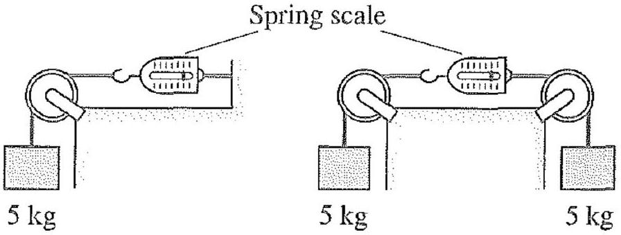
    (a) Draw a free-body diagram for the second setup, showing all external forces on the spring scale.
    (b) What are the readings on the two spring scales?
    (c) Draw a free-body diagram for the first setup, showing and naming all external forces on the pulley. In particular, what is the magnitude of the force between the pulley and the rope?
    (d) For $g = 10 \mathrm {~m} / \mathrm { s } ^ { 2 }$, what is the magnitude of the force that must be provided by the support?

Answer. (c) normal force from the rope, weight, and the force from the support, (d) $50 \sqrt { 5 } \mathrm {~N}$

[1] Problem 4. A sewage worker is using a ladder inside a large, frictionless, horizontal circular aqueduct. The ladder is of the same length as the diameter of the aqueduct.
    (a) First the ladder is placed perfectly vertically and the worker climbs to the midpoint. Draw a free-body diagram indicating all forces on the ladder, and their names. Do the forces balance?
    (b) Now suppose the ladder is placed perfectly horizontally and the worker hangs statically from the midpoint. Draw a free-body diagram indicating all forces on the ladder, and their names. Do the forces balance? If so, show this explicitly. If not, what happens next?

Answer. This "troll" question is included because in many good physics problems, the idealizations used for standard problems break down. For these, you need to think carefully about what actually happens, based on what you know about physics and the world. This kind of thinking is the fundamental thing that distinguishes physics from math, and we'll see a lot of it in the handouts.

[1] Problem 5. A student proposes to build this set of pulleys and string, called a "fool's tackle".
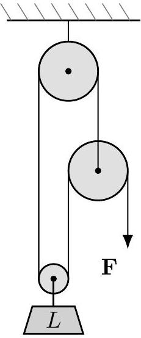
If the load $L$ has mass $m$, and the pulleys and string are frictionless and have negligible mass, find the force $F$ needed to keep the system static.
Answer. This system can't be static. It just instantly falls apart, no matter what $F$ is.
[2] Problem 6. A wooden isosceles right triangle with uniform mass density is placed on a table, and a force is applied as shown.
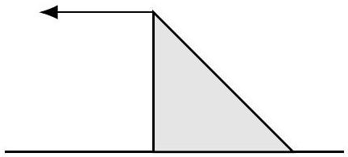
The force is gradually increased until the triangle begins to tip over without sliding. The force is then removed. Next, the surface is inclined with angle $\theta$. For what range of $\theta$ can you be certain the triangle will not slide down the incline?
Answer. $\theta < \tan ^ { - 1 } ( 1 / 3 )$
[1] Problem 7. A painter of mass $M$ stands on a platform of mass $m$ as shown.

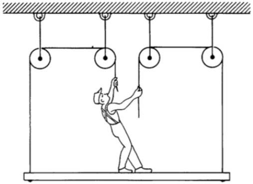
He pulls each rope down with force $F$, and accelerates upward with acceleration $a$. Find $a$.
Answer. $- g + 4 F / ( M + m )$

[1] Problem 8. A wheel of radius $R$ is rolling without slipping with angular velocity $\omega$. What is the average speed $v$ of a point on the rim? How about the average of $v ^ { 2 }$ ?
Answer. $( 4 / \pi ) \omega R , 2 \omega ^ { 2 } R ^ { 2 }$
[3] Problem 9. A small block lies at the bottom of a spherical bowl of radius $R$.
    (a) Find the period of small oscillations, assuming no friction. Can you give an intuitive explanation of the simplicity of your answer?
    (b) What is the period if the block is replaced with a small uniform ball, with sufficient friction to roll without slipping? Neglect the ball's radius.
    (c) Now suppose the block moves in a circle, staying a constant height $h \ll R$ above the bottom of the bowl. Find the period of the motion, assuming no friction.
    (d) Again, find the period if the block is replaced with a small uniform ball, with sufficient friction to roll without slipping.
    (e) Now consider part (c) again. Suppose that at some moment, the speed of the block is instantaneously increased by a small amount. Qualitatively describe the subsequent motion, e.g. sketch what a top-down view would look like. What if $h$ is not small?

Answer. (a, c) $2 \pi \sqrt { R / g }$, (b, d) $2 \pi \sqrt { 7 R / 5 g }$

[2] Problem 10. A car accelerates forward uniformly from rest. Initially, its door is very slightly ajar. Calculate how far the car travels before the door slams shut. Assume the door has a frictionless hinge at its front, a uniform mass distribution, and a length $L$ from front to back.
Answer. $\pi ^ { 2 } L / 12$
[2] Problem 11. Two diametrically opposite points on a ring of mass $M$ and radius $R$ are marked out. The ring is placed at rest on a frictionless floor. An ant of mass $m$ starts at one point, then walks horizontally along the ring's edge to the other. Through what total angle does the ring turn? Assume that (a) the ring's center is fixed in place, or (b) the ring is free to both rotate and translate.
Answer. (a) $\pi m / ( M + m )$, (b) $\pi m / ( M + 2 m )$
[2] Problem 12. A baseball player holds a bat, modeled as a uniform rigid rod, horizontally at one of its ends. Usually, when the baseball hits the bat, the player will feel a sharp jolt in their hands as the bat recoils. This can be avoided if the baseball hits the "sweet spot". Where is it?

Answer. If the rod has length $L$, the center of percussion/sweet spot is $2 L / 3$ from the held end.

[3] Problem 13. Maxwell's wheel is a toy which demonstrates conservation of energy. It consists of a uniform disc of mass $M$ and radius $R$, with a massless axle of radius $r \ll R$.
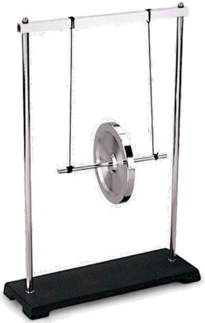
If the wheel is released from rest, it falls downward in such a way that the strings supporting it are always approximately vertical.
    (a) Find the approximate acceleration during descent.
    (b) Suppose each string has length $L \gg R ^ { 2 } / r$. When the string completely unravels, the wheel turns around and starts climbing back up. During the turnaround, what is the maximum magnitude of the acceleration of the wheel?

Answer. (a) $a \approx - 2 r ^ { 2 } g / R ^ { 2 }$

(b) $a _ { \max } \approx 4 g r L / R ^ { 2 }$
[3] Problem 14. A cue ball is a uniform sphere of radius $R$.
    (a) Find the height at which the cue ball must be hit so that it immediately begins rolling without slipping. For simplicity, assume the impulse from the hit is horizontal.
    (b) Skillful players can hit the cue ball so that it begins moving forwards, but then ends up moving backwards. Model the hit as an instantaneous impulse applied at an arbitrary point on the back half of the cue ball, in an arbitrary direction. For what impulses will this trick work? You can treat the situation as two-dimensional; justify your answer carefully.

Answer. (a) $7 R / 5$, (b) the line of the impulse passes under the contact point with the ground

[4] Problem 15. Six identical uniform rods, fastened at their ends by frictionless massless pivots, form a regular hexagon and lie on a frictionless surface.
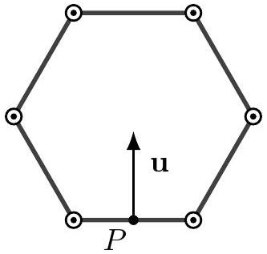

A blow is given at a right angle to the midpoint of the bottom rod. Immediately afterward, the bottom rod has velocity $u$, as shown. Find the speed of the opposite rod at this moment.

This is the toughest question in this problem set; it appeared on the Cambridge Tripos, arguably the hardest math/physics exam in history, in 1882. It is intended to give you a taste of the trickier problems in the main problem sets, but it's definitely not a prerequisite to start them. The simplest solution I'm aware of uses just symmetry and elementary Newtonian mechanics.

Answer. $u / 10$

[2] Problem 16. Several possible elliptical orbits of a satellite are shown below.
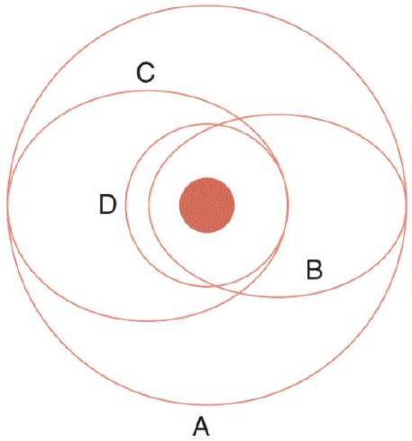
    (a) Which orbit has the most angular momentum?
    (b) Which orbit has the highest total energy?
    (c) On which orbit is the largest speed acquired?

In all cases, justify your answer carefully.
Answer. (a) A, (b) A, (c) B

[2] Problem 17. A comet passes by the Sun as shown, in a parabolic path.
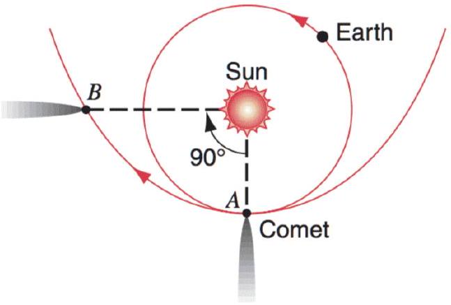
How long, in years, does the comet take to get from point A to point B? (Hint: if you apply Kepler's laws and properties of conics, this problem can be done with almost no computation.)
Answer. $2 \sqrt { 2 } / ( 3 \pi )$ years
[2] Problem 18. Because of the rotation of the Earth, the line of a plumb bob will not align with the local gravitational field. Find the (small) angle of deviation between them as a function of the latitude $\theta$, the gravitational acceleration $g$, the radius $R$ of the Earth, and its angular velocity $\omega$.

[2] Problem 19. You should be comfortable with setting up multiple integrals. Consider a cylindrical shell whose axis of symmetry is the $z$-axis. It has non-uniform mass per unit area $\sigma ( \phi , z )$ in cylindrical coordinates, and the shell has radius $a$ and height $h$, with the bottom edge at $z = 0$.
    (a) Write down an integral that gives the total mass of the shell.
    (b) Write down an integral that gives the moment of inertia of the shell about the $z$-axis.
    (c) How would these results change if we had a solid cylinder with mass per unit volume $\rho ( \phi , z , r )$ ?
[2] Problem 20. An entrepreneur proposes to propel the Earth through space by attaching many balloons to one side of it with ropes. The balloons will experience a buoyant force, which will create a tension in the ropes. Now consider the forces on the solid Earth. Because the atmospheric pressure on the surface is uniform, the only net force on the Earth is from the tension, so the Earth will get propelled.
Is this correct? If you think it is, explain why momentum conservation isn't violated. If you think it isn't, identify the specific force acting on the solid Earth that cancels the tension force.
Answer. The tension force is cancelled. But it's not cancelled by atmospheric pressure, because that remains uniform on the Earth's surface. Instead, it is balanced by the gravitational force of the atmosphere on the Earth. This force exists because the atmosphere is no longer symmetric around the Earth's center - there's a hole where the balloon is.

## 2 Electromagnetism

These problems can be solved using the material in chapters 25 through 38 of Halliday and Resnick.

[2] Problem 21. As a warmup, take the Conceptual Survey of Electricity and Magnetism test. This should take no longer than 1 hour. You do not have to justify your answers; just list them.
Answer. BABBC EBBBC EDEDA EEDAD EDACD AECCA ED
[2] Problem 22. A half-infinite line has linear charge density $\lambda$.
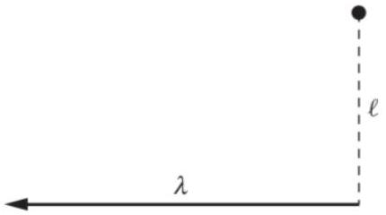
    (a) Find the electric field at a point that is "even" with the end, a distance $\ell$ from it, as shown.
    (b) You should find the direction of the field is independent of $\ell$. Explain why.
    (c) Sketch the electric field lines everywhere.

Answer. (b) scaling symmetry

[2] Problem 23. Some basic tasks involving intuition for vector fields.

(a) Consider the vector field
$$
\mathbf { v } = 2 \hat { \mathbf { x } } + x \hat { \mathbf { y } } .
$$
Sketch some field vectors at regular points. Then, on a separate sketch, draw some field lines.
(b) Some electric field vectors in a certain situation are shown below.
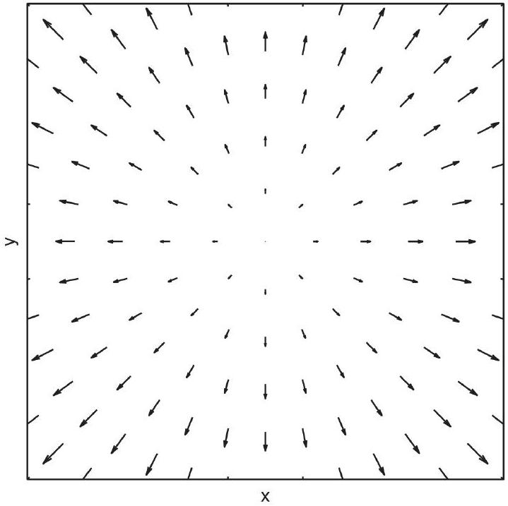
Sketch a corresponding field line diagram. Then, give a mathematical expression that could describe this field, and a physical situation which could produce it.
(c) The electric field lines in another situation are shown below.
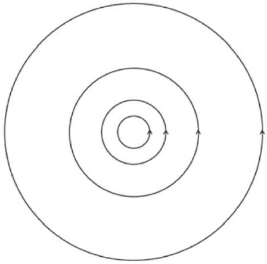
Sketch a corresponding set of field vectors at regular points. Then, give a mathematical expression that could describe this field, and a physical situation which could produce it.
[3] Problem 24. A parallel plate capacitor of capacitance $C$ is placed in a region of zero electric field. The first plate is given total charge $Q _ { 1 }$ and the second plate is given total charge $Q _ { 2 }$. Let the plates have area $A$ and separation $d$, where $A \gg d ^ { 2 }$.
(a) Each of the plates has an inner and outer surface. Using Gauss's law, find the total charge on each of these four surfaces.
(b) Find the potential difference between the plates.
(c) Find the force between the plates.

(d) In addition to the force between the plates found in part (c), there is a contribution to the internal stress (force per unit area) within each plate due to the charges on its two surfaces. Find this part of the stress for each plate, and assuming $Q _ { 1 } > Q _ { 2 } > 0$, indicate whether it is tension or compression.

Answer. (c) $Q _ { 1 } Q _ { 2 } / 2 A \epsilon _ { 0 }$, (d) $\left( Q _ { 1 } ^ { 2 } - Q _ { 2 } ^ { 2 } \right) / 8 A ^ { 2 } \epsilon _ { 0 }$ for both, plate 1 under tension, plate 2 under compression

[3] Problem 25. A battery is connected to an RC circuit as shown.
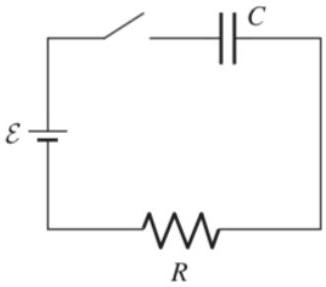
Initially, the switch is open and the charge on the capacitor is zero. The switch is closed at $t = 0$.
    (a) Solve for the charge on the capacitor as a function of time.
    (b) Solve for the power dissipated in the resistor as a function of time.
    (c) What is the total energy dissipated in the resistor over all time? Can you find a simple way to derive this result?
    (d) Suppose that the $\operatorname { emf } \mathcal { E } ( t )$ supplied by the battery can be adjusted freely over time, and the capacitor must be given a total charge $Q$ by the time $t = T$. Sketch the profile $\mathcal { E } ( t )$ that maximizes the efficiency of this process, i.e. the ratio of the energy stored in the capacitor to the energy output by the battery, and find this efficiency.

Answer. (d) $\mathcal { E } ( t )$ is linear, efficiency $1 / ( 1 + ( 2 R C / T ) )$.

[2] Problem 26. In this problem we estimate the maximum firing speed of a human neuron. Model a human cell simply as a sphere of radius $10 ^ { - 6 } \mathrm {~m}$.
    (a) It has been measured that $1 \mathrm {~cm} ^ { 2 }$ of cell membrane has a resistance of $1000 \Omega$. Estimate the resistance of a single human cell.
    (b) Estimate the capacitance of a single human cell, treating the two sides of the membrane as capacitor plates. You will have to estimate the thickness of the cell membrane.
    (c) By modeling the cell as an RC circuit, estimate the maximum firing speed of a human neuron. Is this a reasonable result? If yes, how do you know? If not, how could this model be refined?

Answer. (c) The RC timescale is on the order of 1ms, which is reasonable.

[2] Problem 27. An infinite solenoid with radius $b$ has $n$ turns per unit length. The current varies in time according to $I ( t ) = I _ { 0 } \cos \omega t$. A ring with radius $r < b$ and resistance $R$ is centered on the solenoid's axis, with its plane perpendicular to the axis.
    (a) What is the induced current in the ring?

(b) A given little piece of the ring will feel a magnetic force. For what values of $t$ is this force maximum? At this moment, sketch the electric field everywhere.
(c) What is the effect of the force on the ring? That is, does the force cause the ring to translate, spin, etc.?
(d) If the current is driven by the AC power from a wall outlet, which has frequency 60 Hz in America, the ring will emit a humming sound. What is the frequency of this sound?

Answer. (c) grows and shrinks, (d) 120 Hz

[2] Problem 28. A very long, insulating cylinder with radius $r$ and uniform surface charge density $\sigma$ on its outer surface rotates about its symmetry axis with angular velocity $\omega$.
    (a) Find the magnetic field everywhere.
    (b) A wire is connected to a point on the cylinder, with the other end on the axis of rotation. The wire rotates along with the cylinder. Show that the emf across the wire does not depend on the shape of the wire's path, and find this emf.

Answer. (b) $\mu _ { 0 } \sigma \omega ^ { 2 } r ^ { 3 } / 2$

[2] Problem 29. A rectangular loop of wire with dimensions $a$ and $b$ is placed with one side parallel to a long, straight wire carrying current $I _ { 0 }$, at a distance $l$.
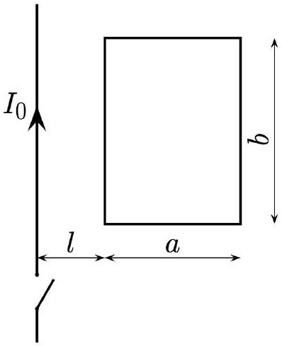
The loop has resistance $R$ and negligible self-inductance. The current in the long wire is quickly switched off.
    (a) What is the net momentum $p$ acquired by the loop?
    (b) How is momentum conserved in this setup?

Answer.

$$
\text { (a) } \frac { 1 } { 8 \pi ^ { 2 } } \frac { \left( b \mu _ { 0 } I _ { 0 } \right) ^ { 2 } } { R } \log \left( \frac { a + l } { l } \right) \left( \frac { 1 } { l } - \frac { 1 } { a + l } \right)
$$

[1] Problem 30. A 120 V rms, 60 Hz line provides power to a 40 W light bulb, modeled as a resistor. How will the brightness change if a $10 \mu \mathrm {~F}$ capacitor is connected in series with the light bulb?
Answer. Becomes 65\% as much

## 3 Thermodynamics

These problems can be solved using the material in chapters 21 through 24 of Halliday and Resnick.

[2] Problem 31. Two moles of a monatomic ideal gas are taken through the following cycle.
    - The gas begins at point $A$ with pressure $P _ { 0 }$ and volume $V _ { 0 }$.
    - The gas is heated at constant volume until it doubles its pressure, reaching point $B$.
    - The gas is expanded at constant pressure until it doubles its volume, reaching point $C$.
    - The gas is cooled at constant volume until it halves its pressure, reaching point $D$.
    - The gas is compressed at constant pressure until it halves its volume, returning to point $A$.

Assume that all processes are quasistatic and reversible.

(a) Draw the process on a $P V$ diagram.
(b) Calculate the net work done by the gas during the cycle.
(c) Calculate the efficiency of the cycle.
(d) Calculate the change in entropy of the gas as the system goes from state A to state D.

Answer. (b) $P _ { 0 } V _ { 0 }$, (c) $2 / 13$, (d) $5 R \log 2$

[3] Problem 32. Deriving some basic results in thermodynamics.
    (a) Starting from the first law of thermodynamics, derive the fact that $P V ^ { \gamma }$ is constant for an ideal gas in an adiabatic process.
    (b) Using the ideal gas law, derive the total work done by a gas as it expands at constant temperature from volume $V _ { 1 }$ to $V _ { 2 }$, in terms of $n , R , T , V _ { 1 }$, and $V _ { 2 }$.
    (c) Show that if a general gas, not necessarily ideal, satisfies the equation $P V = k U$, where $U$ is the total internal energy, then $P V ^ { n }$ is constant in an adiabatic process for some power $n$, and find $n$ in terms of $k$.
    (d) Does a monatomic ideal gas satisfy $P V = k U$ ? If so, what is $k$ ?
    (e) Two Carnot engines operate with the same minimum and maximum pressures, temperatures, and volumes. One uses helium as its working substance, and the other uses air. (At the relevant temperatures, helium behaves like a monatomic gas.) Which one performs more work per cycle?

Answer. (c) $n = k + 1$, (d) $k = \gamma - 1$, (e) helium

[1] Problem 33. A monatomic ideal gas is adiabatically compressed to 1/8 of its original volume. For each of the following quantities, indicate by what factor they change.
    (a) The rms velocity $v _ { \text {rms } }$.
    (b) The mean free path $\lambda$.

(c) The average time between collisions $\tau$ for each gas molecule.
(d) The molar heat capacity $C _ { v }$.

Answer. (a) 2 times larger, (b) 8 times smaller, (c) 16 times smaller, (d) same

[2] Problem 34. A simple heat engine consists of a movable piston in a cylinder filled with an ideal monatomic gas. Initially the gas in the cylinder is at a pressure $P _ { 0 }$ and volume $V _ { 0 }$. The gas is slowly heated at constant volume until the pressure is $32 P _ { 0 }$. The gas is then adiabatically expanded until its pressure is $P _ { 0 }$ again. Finally, the gas is cooled at constant pressure until its volume is $V _ { 0 }$ again. Find the efficiency of the cycle.
Answer. 58/93

[2] Problem 35. The total mass of a hot-air balloon (envelope, basket, and load) is 320 kg. Initially the air pressure inside and outside the envelope is $1.01 \times 10 ^ { 5 } \mathrm {~Pa}$ and its density is $1.29 \mathrm {~kg} / \mathrm { m } ^ { 3 }$. In order to raise the hot-air balloon, a gas burner is used to heat the air inside the balloon. The volume of the envelope filled with hot air is $650 \mathrm {~m} ^ { 3 }$. The molar mass of air is 29 g/mol. Treat the temperature of the air in the balloon as uniform.

(a) The balloon can either be tightly sealed, so that none of its air mixes with the outside air, or have a hole, so that its pressure equalizes with that of the outside air. For the purpose of generating lift, which is better?
(b) Assuming the better option has been taken, to what temperature must the air inside the balloon be heated to make the balloon begin to rise?

Answer. (a) hole, (b) 440 K

[3] Problem 36. Water is heated in an electric kettle. At some time, a piece of ice at temperature $T _ { 0 } = 0 ^ { \circ } \mathrm { C }$ was put in the kettle. The figure below shows the water temperature as a function of time.
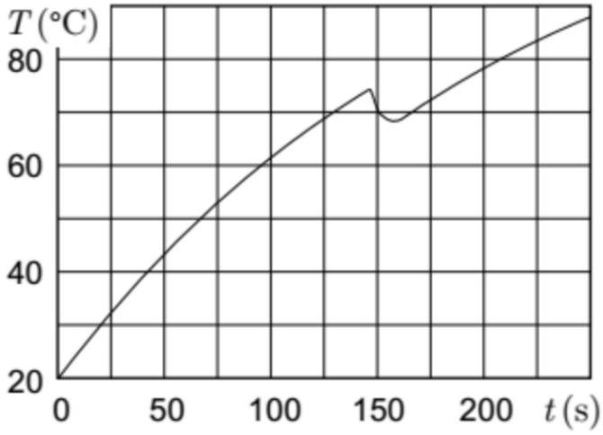
Find the mass of the ice if the heating power of the kettle is $P = 1 \mathrm {~kW}$. The latent heat of melting for ice is $L = 335 \mathrm {~kJ} / \mathrm { kg }$, the heat capacity of water is $c = 4.2 \mathrm {~kJ} / \mathrm { kg } \mathrm { K }$, and the temperature of the room is $T _ { 1 } = 20 ^ { \circ } \mathrm { C }$. (Hint: it's very easy to get an answer that's off by up to $50 \%$ if you're careless.)
Answer. 28 g

## 4 Relativity and Waves

These problems can be solved using the material in chapters 18 through 20, and 39 through 44 of Halliday and Resnick.

[2] Problem 37. Two bombs lie on a train platform, a distance $L$ apart. As a train passes by at speed $v$, the bombs explode simultaneously (in the platform frame) and leave marks on the train. Due to the length contraction of the train, we know that the marks on the train are a distance $\gamma L$ apart when viewed in the train's frame, because this distance is what is length-contracted down to the given distance $L$ in the platform frame. How would someone on the train quantitatively explain why the marks are a distance $\gamma L$ apart, considering that the bombs are a distance of only $L / \gamma$ apart in the train frame?
[1] Problem 38. An atom with mass $m$ is at rest, then radiates a photon with angular frequency $\omega$. What is the rest mass of the atom afterward?
Answer. $\sqrt { m \left( m - 2 \hbar \omega / c ^ { 2 } \right) }$
[3] Problem 39. A rope of linear mass density $\sigma$ is hung between two poles, a distance $L$ apart, and the middle of the rope sags a distance $d \ll L$ below the ends. Find the approximate frequencies of standing waves on the rope. (Hint: you do not have to solve for the shape of the rope. As an intermediate step, it will be useful to consider torque balance on half of the rope.)
Answer.
$$
f _ { n } = \frac { n } { 4 \sqrt { 2 } } \sqrt { \frac { g } { d } }
$$
[3] Problem 40. A uniform string of length $L$ and linear density $\rho$ is stretched between two fixed supports. The tension in the string is $T$.
    (a) Find the standing wave solutions and angular frequencies for the given boundary conditions.
    (b) A very small mass $m$ is now placed a distance $\ell$ from one end of the string. Find the change in the angular frequencies to first order in $m$, by using the fact that the average potential energy and average kinetic energy for each standing wave should remain equal.
    (c) How would you go about finding the exact standing wave frequencies for this setup?

Answer. (a) $\omega _ { n } = n \pi v / L$ where $v = \sqrt { T / \rho }$, (b) $\Delta \omega _ { n } \approx ( - m / \rho L ) \omega _ { n } \sin ^ { 2 } ( n \pi \ell / L )$

[2] Problem 41. A perfectly flat piece of glass is placed over a perfectly flat piece of black plastic.
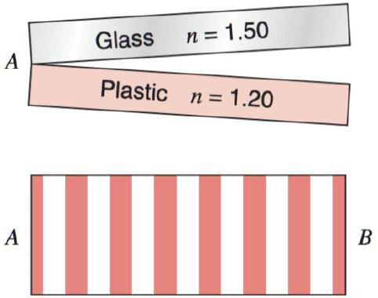
They touch at point $A$. Light of wavelength 600 nm is incident normally from above. The location of the dark fringes in the reflected light is shown above.

(a) How thick is the space between the glass and plastic at $B$ ?
(b) Water with $n = 1.33$ seeps into the region between the glass and the plastic. How many dark fringes are seen when all of the air has been displaced by water? The straightness and equal spacing of the fringes is an accurate test of the flatness of the glass.
(c) A setup like this one was used by the physicist Otto Wiener to measure the wavelength of light. When setting up the experiment, one must decide on the angle between the two objects. What are the advantages and disadvantages of making this angle smaller, for the purposes of measuring the wavelength?

Answer. (b) 9 dark fringes (we lose a $\pi$ phase shift when water replaces air)

[2] Problem 42. A point source of light $L$ emitting a single wavelength $\lambda$ is situated a distance $d$ from an ideal mirror, at $z = 0$. A screen stands at the end of the mirror at distance $D \gg d$ from $L$.
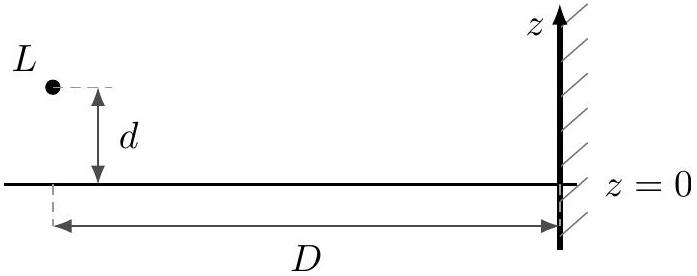
Find the relative intensity of light on the screen as a function of $z$. (This setup is known as Lloyd's mirror.)
Answer. $I ( z ) \propto \sin ^ { 2 } ( 2 \pi d z / D \lambda )$

## 5 Estimation and Dimensional Analysis

[2] Problem 43. Argon atoms are special because they stay in the atmosphere for a very long time. They are not recycled like oxygen and nitrogen. An average breath inhales around 0.5 L of air and people breathe on average around once every five seconds. Air is about 1\% argon and has density $1.2 \mathrm {~kg} / \mathrm { m } ^ { 3 }$. Assume all air particles have a mass of approximately $5 \times 10 ^ { - 26 } \mathrm {~kg}$. Take the atmosphere to have constant density and be around 20 km thick. The radius of the Earth is $6.4 \times 10 ^ { 6 } \mathrm {~m}$.
    (a) Estimate the total number of argon atoms inhaled by Galileo throughout his life.
    (b) Assuming the atmosphere has been uniformly mixed since then, estimate the number of argon atoms in each of your breaths that were once in Galileo's lungs.

Answer. (a) about $10 ^ { 29 }$, (b) about $10 ^ { 6 }$

[3] Problem 44. The acceleration due to gravity can be measured by measuring the time period of a simple pendulum. However, it can be challenging to get an accurate result.
    (a) Suppose you constructed a pendulum using regular household materials. Name at least five sources of possible experimental error in your calculated value of $g$. How would you make the pendulum and perform the measurements to minimize these sources of error?
    (b) Make an actual pendulum yourself and carry out the measurement. Describe your experimental procedure and show your data. Estimate as many of the sources of experimental error identified in part (a) as you can, and using them, give a value of $g$ with a reasonable uncertainty.

(c) If you had \$1,000 and a week to do plenty of measurements, how would you go about it? How precise a result do you think you could get? What would be the dominant sources of uncertainty remaining?
[2] Problem 45. Blackbody radiation is an electromagnetic phenomenon, so the radiation intensity depends on the speed of light $c$. It is also a thermal phenomenon, so it depends on the thermal energy $k _ { B } T$, where $T$ is the object's temperature and $k _ { B }$ is Boltzmann's constant. And it is a quantum phenomenon, so it depends on Planck's constant $h$.
    (a) Using the relation $E = h f$, find the dimensions of $h$.
    (b) Using dimensional analysis, show that the power emitted by the blackbody per unit area, called the radiation intensity $I$, obeys $I \propto T ^ { 4 }$, and find the constant of proportionality up to a dimensionless constant.
    (c) How would the result change in a world with $d$ spatial dimensions?
    (d) The result you derived in part (b) is known as the Stefan-Boltzmann law. But if it can be derived with pure dimensional analysis, without needing any detailed calculations or experimental data at all, then why is it considered a law at all? Isn't it obvious?

Answer. (c) $I \propto T ^ { d + 1 }$
