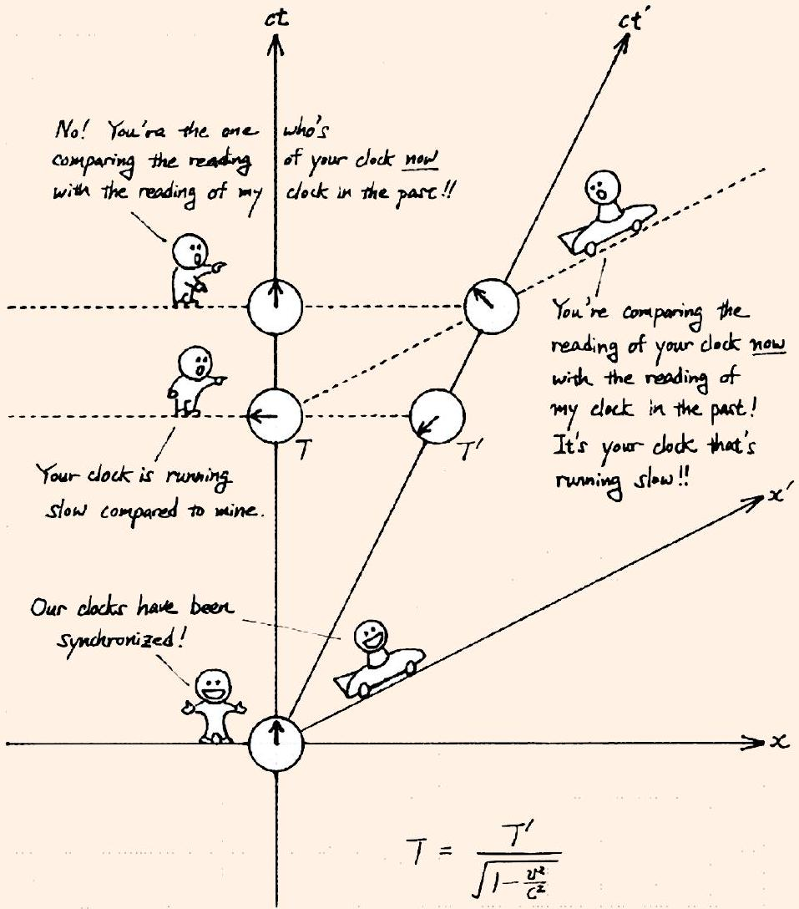

Example 2
Bob moves away from Alice at constant speed. According to special relativity, each sees the other as aging slower. (This is true both in terms of their reference frames, and in terms of what they see with their eyes.) How can that possibly be self-consistent? Shouldn't time be running slower for one or the other?

Solution
The first thing to point out about this paradox, and many other relativistic paradoxes, is that they rely on slipping in nonrelativistic assumptions using tricky wording. If you're fine with the idea of time being relative, there's nothing paradoxical about people disagreeing on whose clock runs slower. It's not really more confusing than the fact that when I walk away from you, I see you getting smaller, but you also see me getting smaller.

More seriously, though, the reason time dilation can be symmetric is the loss of simultaneity effect, as beautifully shown in Tatsu Takeuchi's Illustrated Guide to Relativity.

[2] Problem 14. The Lorentz transformations treat $x$ and $t$ completely symmetrically. So why is it that lengths contract while times dilate? Shouldn't both do the same thing?
Solution. This comes down to a difference in how lengths and times are measured. Let $S$ be the lab frame and let $S ^ { \prime }$ be the frame of a moving rod and clock, and watch the primes below carefully!
    - In frame $S ^ { \prime }$, consider two events occupied by the clock. Then by definition $\Delta x ^ { \prime } = 0$ and the proper time read by the clock is $\Delta t ^ { \prime }$. In our frame, for these same two events, we have $\Delta t = \gamma \Delta t ^ { \prime }$, so a greater amount of time passes on the lab clock; we interpret this as time dilating for the moving clock.
    - In frame $S ^ { \prime }$, consider the opposite ends of the ruler at the same time. Then by definition $\Delta t ^ { \prime } = 0$ and the proper length is $\Delta x ^ { \prime }$. In our frame, for these same two events, we have $\Delta x = \gamma \Delta x ^ { \prime }$. So naively it looks like the story is the same.
    - The difference comes down to how we define "time measured" and "length measured" in the lab frame $S$. The time measured on the clock is $\Delta t$, where the events must have $\Delta x ^ { \prime } = 0$ so that we follow the clock. But by contrast, the length measured in the lab frame is $\Delta x$, where we must have $\Delta t = 0$ so that we measure the locations of both ends at the same time. The fundamental difference is that in frame $S$, time measurements can be done in different places (since we have, conceptually, a network of synchronized clocks) but length measurements must be done at the same time.
    - Therefore, if we impose $\Delta t = 0$, we can use an inverse Lorentz transform to yield $\Delta x ^ { \prime } = \gamma \Delta x$, which is length contraction.
