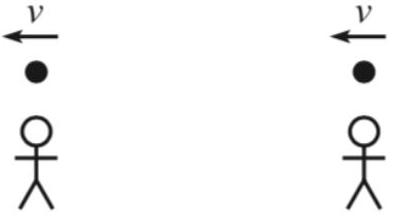
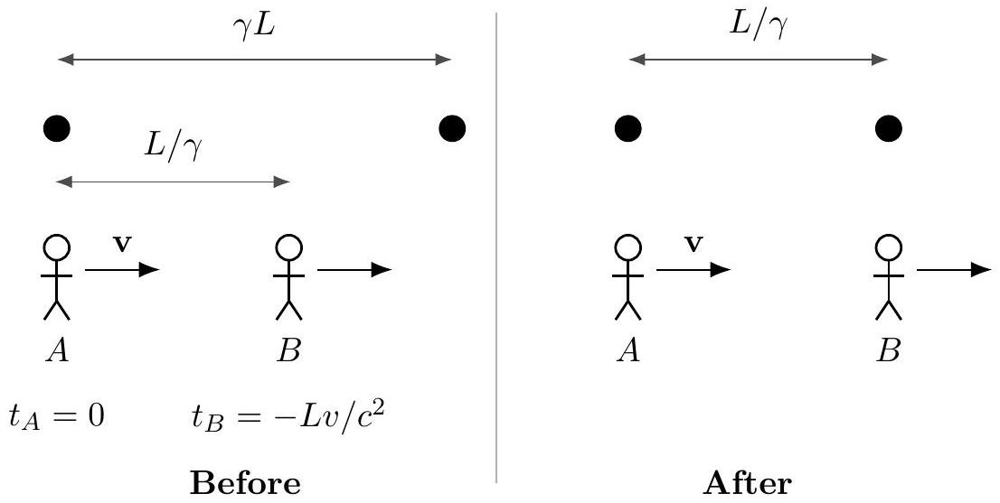
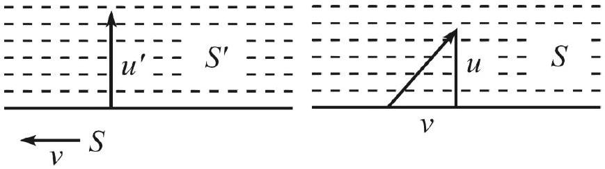
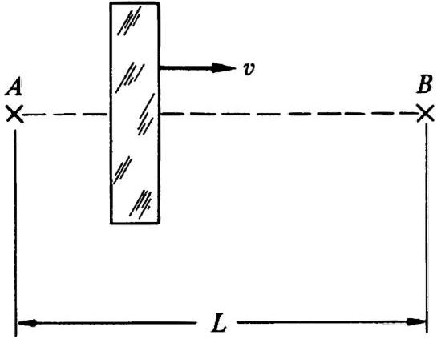
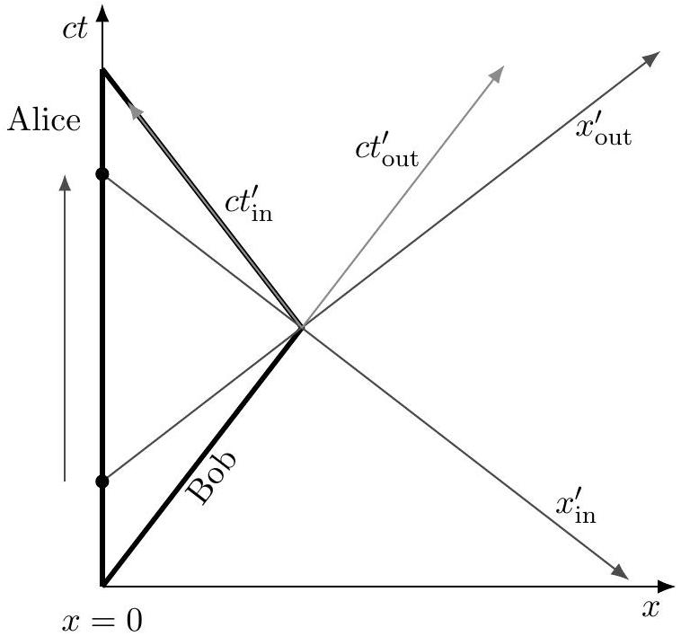
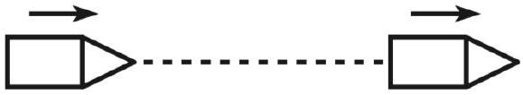
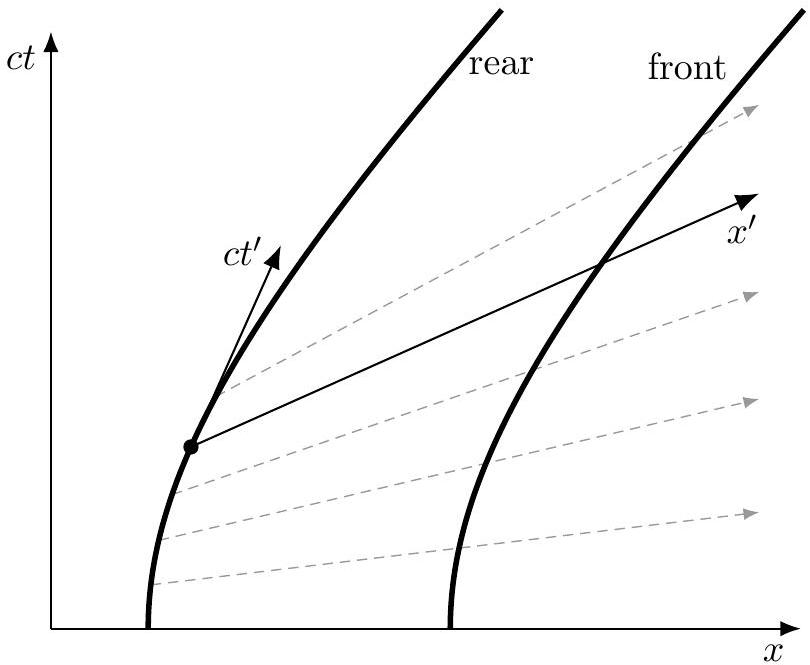

## Relativity I: Kinematics

For relativistic kinematics and four-vectors, see chapters 11 and 13 of Morin (highly recommended), Morin's newer book Special Relativity: For the Enthusiastic Beginner, or chapters 12 and 14 of Kleppner and Kolenkow. For an entertaining introduction, see chapters I-15 through I-17 of the Feynman lectures. There is a total of 84 points.

## 1 Lorentz Transformations

Special relativity is uniquely subtle among introductory physics topics, and requires a solid, detailed introduction. This problem set assumes you've already done that, by reading chapter 11 of Morin or the equivalent in another book. (The short chapter in Halliday, Resnick, and Krane is not sufficient.)

Idea 1: Lorentz Transformation
Let $S ^ { \prime }$ be the frame of an observer moving to the right with velocity $v \hat { \mathbf { x } }$ with respect to the frame $S$. Then the coordinates in $S$ and $S ^ { \prime }$ are related by the Lorentz transformation

$$
t ^ { \prime } = \gamma \left( t - v x / c ^ { 2 } \right) , \quad x ^ { \prime } = \gamma ( x - v t ) , \quad y ^ { \prime } = y , \quad z ^ { \prime } = z , \quad \gamma = \frac { 1 } { \sqrt { 1 - v ^ { 2 } / c ^ { 2 } } } .
$$

This implies that the lengths of moving objects are contracted by $\gamma$, moving clocks run slow by a factor of $\gamma$, and that if two clocks are synchronized in the frame $S ^ { \prime }$ and separated by a distance $L$, then in the frame $S$ the rear clock is ahead by $L v / c ^ { 2 }$.

[2] Problem 1 (Morin 11.2). Two planets, $A$ and $B$, are at rest with respect to each other, a distance $L$ apart, with synchronized clocks. A spaceship flies at speed $v$ past planet $A$ toward planet $B$ and synchronizes its clock with $A$ 's right when it passes $A$ (they both set their clocks to zero). The spaceship eventually flies past planet $B$ and compares its clock with $B$ 's. We know, from working in the planets' frame, that when the spaceship reaches $B , B$ 's clock reads $L / v$. And the spaceship's clock reads $L / \gamma v$, because it runs slow by a factor of $\gamma$ when viewed in the planets' frame.
How would someone on the spaceship quantitatively explain to you why $B$ 's clock reads $L / v$ (which is more than its own $L / \gamma v$ ), considering that the spaceship sees $B$ 's clock running slow?
Solution. Let us work in the frame of the spaceship. Since $A B$ is moving to the left with $v$, when the ship is at $A$, the clock at $B$ reads $L v / c ^ { 2 }$. Now, the time it takes for $B$ to reach the spaceship is $( L / \gamma ) / v$, so the time on $B$ 's clock is
$$
\frac { L } { \gamma ^ { 2 } v } + \frac { L v } { c ^ { 2 } } = \frac { L } { v } \left( 1 - \frac { v ^ { 2 } } { c ^ { 2 } } + \frac { v ^ { 2 } } { c ^ { 2 } } \right) = \frac { L } { v } .
$$
[2] Problem 2 (Morin 11.4). A stick of (proper) length $L$ moves past you at speed $v$. There is a time interval between the front end coinciding with you and the back end coinciding with you. What is this time interval in:
    (a) your frame? (Calculate this by working in your frame.)
    (b) the stick's frame? (Work in the stick's frame.)
    (c) your frame? (Work in the stick's frame.)

(d) the stick's frame? (Work in your frame. This is the tricky one.)

Solution. (a) The stick is length contracted to $L / \gamma$, so it takes time $L / \gamma v$ for the stick to pass.

(b) The stick has length $L$ and you move past it at speed $v$, so it takes time $L / v$.
(c) The same reasoning as part (b) applies. But in the stick's frame, your clock is running slow by a factor of $\gamma$, so the time measured by your clock is $L / \gamma v$.
(d) The time measured in your frame is $L / \gamma v$ from part (a), but the clocks on the ends of the stick are running slow. In addition, those clocks are not synchronized in your frame. Thus, the time measured in the stick's frame is
$$
\frac { 1 } { \gamma } \frac { L } { \gamma v } + \frac { L v } { c ^ { 2 } } = \frac { L } { v }
$$
just as in the previous problem.
[2] Problem 3 (Morin 11.9). Two balls move with speed $v$ along a line toward two people standing along the same line. The proper distance between the balls is $\gamma L$, and the proper distance between the people is $L$. Due to length contraction, the people measure the distance between the balls to be $L$, so the balls pass the people simultaneously (as measured by the people), as shown.

Assume that the people's clocks both read zero at this time. If the people catch the balls, then the resulting proper distance between the balls becomes $L$, which is shorter than the initial proper distance of $\gamma L$. Your task is to explain how the proper distance between the balls decreases from $\gamma L$ to $L$, by working in the frame where the balls are initially at rest.
(a) Draw the beginning and ending pictures for the process. Indicate the readings on both clocks in the two pictures, and label all relevant lengths.
(b) Explain in words how the proper distance between the balls decreases from $\gamma L$ to $L$.

Solution. (a) Call the person on the left $A$, and the person on the right $B$. Here's the diagram.

(b) The point is that since we lose simultaneity, by the time $B$ catches his ball in his frame, $A$ has dragged his ball closer to $B$ 's ball, reducing their distance in the process.
More precisely, the time interval between the two catches is $\gamma L v / c ^ { 2 }$, because they were simultaneous in the lab frame but separated by distance $\gamma L$ in the balls' frame. Then the decrease in distance is $\gamma L v ^ { 2 } / c ^ { 2 }$, giving a final distance $\gamma L - \gamma L v ^ { 2 } / c ^ { 2 } = L / \gamma$.

Example 1
A reference frame is a formal object made of rulers and synchronized clocks. The length of an object in a given reference frame isn't necessarily the same thing as how long the object looks, to somebody at rest in the frame using their own eyes. That is different, because one has to account for the time the light needs to travel to the eyes.

Consider a train of rest length $L$ moving with speed $v$ to the right in the ground frame. How long does the train look to somebody standing on the ground directly to the right of it?

Solution
Both ends of the train continually emit light. Suppose two pulses of light, one from each end, hit an observer's eyes simultaneously. Then the apparent length of the train $L _ { \text {app } }$ is the distance between the points where the light pulses were originally launched.

For somebody to the right of the train, the pulse from the left end of the train had to travel an extra distance $L _ { \text {app } }$, so it must have been emitted a time $L _ { \text {app } } / c$ earlier. When the left pulse was emitted, the left end of the train was $v L _ { \text {app } } / c$ behind where it was when the right pulse was emitted. So the apparent length is

$$
L _ { \mathrm { app } } = \frac { L } { \gamma } + \frac { v } { c } L _ { \mathrm { app } } .
$$

Solving this for $L _ { \text {app } }$ gives

$$
L _ { \mathrm { app } } = L \sqrt { \frac { 1 + v / c } { 1 - v / c } } .
$$

Unlike the abstract lab frame length $L / \gamma$, this directly observable length is larger than $L$. (But if the person had been to the left of the train, then instead $L _ { \text {app } } = L \sqrt { ( 1 - v / c ) / ( 1 + v / c ) }$.)

Remark
In most of the problems here, we'll focus on how objects are measured in inertial reference frames, not on how they physically appear to an observer's eyes. This is a complicated but fascinating subject. For instance, it turns out that once one accounts for the light travel time delay, moving objects appear to be rotated. For an interactive simulation, check out the game A Slower Speed of Light (3D) and Velocity Raptor (2D only).

[3] Problem 4. USAPhO 2016, problem A3. Print out the custom answer sheet before starting.
[5] Problem 5. IPhO 2006, problem 2. A nice problem about relativistic visual effects.

## 2 Velocity Addition

Idea 2: Velocity Addition
Again, let frame $S ^ { \prime }$ move with velocity $v \hat { \mathbf { x } }$ with respect to frame $S$. If an object has velocity ( $u _ { x } ^ { \prime } , u _ { y } ^ { \prime }$ ) in frame $S ^ { \prime }$, then the velocity in $S$ is

$$
u _ { x } = \frac { u _ { x } ^ { \prime } + v } { 1 + u _ { x } ^ { \prime } v / c ^ { 2 } } , \quad u _ { y } = \frac { u _ { y } ^ { \prime } } { \gamma \left( 1 + u _ { x } ^ { \prime } v / c ^ { 2 } \right) }
$$

where $\gamma = 1 / \sqrt { 1 - v ^ { 2 } / c ^ { 2 } }$ as usual.

[1] Problem 6 (KK 12.6). A rod of proper length $\ell _ { 0 }$ oriented parallel to the $x$ axis moves with velocity $u \hat { \mathbf { x } }$ in frame $S$. What is the length measured by an observer in frame $S ^ { \prime }$, which, as usual, moves with velocity $v \hat { \mathbf { x } }$ with respect to $S$ ?
Solution. The speed of the rod measured by an observer in $S ^ { \prime }$ is
$$
u ^ { \prime } = \frac { u - v } { 1 - u v / c ^ { 2 } } .
$$
The length contraction will result in an observed length of
$$
\ell ^ { \prime } = \ell _ { 0 } \sqrt { 1 - \left( \frac { u - v } { c - u v / c } \right) ^ { 2 } } .
$$
[2] Problem 7 (Morin 11.16). In frame $S ^ { \prime }$, a particle moves with velocity $\left( 0 , u ^ { \prime } \right)$ as shown at left.

Frame $S$ moves to the left with speed $v$, so the situation in $S$ is as shown at right, with the $y$ speed now $u$. Consider a series of equally spaced dotted lines, as shown. By considering the rate at which the particle crosses the dotted lines in each frame, find $u$ in terms of $u ^ { \prime }$ and $v$, and confirm the result agrees with the velocity addition formula.
Solution. Before starting, let's recall how the time dilation formula works. Suppose we have two events with the same $x$ coordinate (such as the ticking of a clock at rest in frame $S$ ), separated by time $\Delta t$. Then applying the Lorentz transformation yields $\Delta t ^ { \prime } = \gamma \Delta t$ for the time separation in the primed frame. Conversely, if we had two events with the same $x ^ { \prime }$ coordinate (such as the ticking of a clock at rest in frame $S ^ { \prime }$ ), then $\Delta t = \gamma \Delta t ^ { \prime }$.
In this problem, the particle isn't at rest in either frame $S$ or $S ^ { \prime }$. But the Lorentz transformations don't do anything to the $y$ coordinate, so the motion in the $y$-direction doesn't matter for the purposes of the above argument. Suppose that in frames $S$ and $S ^ { \prime }$, there is an interval $\Delta t$ and $\Delta t ^ { \prime }$ between crossing adjacent dotted lines, respectively. Since these occur at the same $x ^ { \prime }$ coordinate in frame $S ^ { \prime }$, we have
$$
\Delta t = \gamma \Delta t ^ { \prime } .
$$

Moreover, length in the $y$-direction isn't contracted at all, so

$$
\gamma = \frac { \Delta t } { \Delta t ^ { \prime } } = \frac { u ^ { \prime } } { u } .
$$

Thus, we have

$$
u _ { y } = \frac { u _ { y } ^ { \prime } } { \gamma }
$$

which agrees with the velocity addition formula, when we plug in $u _ { x } ^ { \prime } = 0$.
[3] Problem 8 (Morin 11.58). A person walks very slowly at speed $u$ from the back of a train of proper length $L$ to the front. The total time dilation effect in the train frame can be made arbitrarily small by picking $u$ to be sufficiently small, so that if a person's watch agrees with a clock at the back of the train when he starts, then it also agrees with a clock at the front when he finishes, to arbitrary accuracy.

Now consider this setup in the ground frame, where the train moves at speed $v$. The rear clock reads $L v / c ^ { 2 }$ more than the front, so in view of the preceding paragraph, the time gained by the person's watch during the process must be $L v / c ^ { 2 }$ less than the time gained by the front clock. By working in the ground frame, explain why this is the case. Assume $u \ll v$.

Solution. This is a tricky issue: even though the extra time dilation effect can be made arbitrarily small by making $u$ smaller, doing so would make the effect last for a longer time. In this particular situation, that means the effect doesn't go away even as $u \rightarrow 0$ ! In this respect, it has something in common with the more subtle approximation problems in P1.

Setting $c = 1$, the person in the ground frame has speed and Lorentz factor

$$
w = \frac { u + v } { 1 + u v } , \quad \gamma _ { w } = \gamma _ { u } \gamma _ { v } ( 1 + u v )
$$

so that the time it takes for them to walk across the train is

$$
\Delta t = \frac { L } { \gamma _ { v } } \frac { 1 } { w - v } .
$$

The difference in time dilation factors, on the person's clock versus the train's clocks, leads to a relative change in time reading of

$$
\Delta \tau = \left( \frac { 1 } { \gamma _ { w } } - \frac { 1 } { \gamma _ { v } } \right) \Delta t = \left( \frac { 1 } { \gamma _ { u } ( 1 + u v ) } - 1 \right) \left( \frac { L } { \gamma _ { v } ^ { 2 } } \frac { 1 } { w - v } \right) .
$$

To simplify the second factor, note that

$$
\frac { 1 } { \gamma _ { v } ^ { 2 } ( w - v ) } = \frac { 1 } { \gamma _ { v } ^ { 2 } } \frac { 1 + u v } { u \left( 1 - v ^ { 2 } \right) } = \frac { 1 + u v } { u }
$$

so that we have

$$
\Delta \tau = \frac { L } { u } \left( \frac { 1 } { \gamma _ { u } } - 1 - u v \right) .
$$

We need to be a bit careful in approximating this expression, since the $1 / \gamma _ { u }$ and 1 terms will almost cancel out. So we instead write $1 / \gamma _ { u } = 1 + \mathcal { O } \left( u ^ { 2 } \right)$, giving

$$
\Delta \tau = \frac { L } { u } \left( 1 + \mathcal { O } \left( u ^ { 2 } \right) - 1 - u v \right) = - L ( v + \mathcal { O } ( u ) ) \approx - L v
$$

since we are assuming $u \ll v$. This is precisely the expected result.

## Idea 3: Relativistic Doppler Shift

If a light source with (proper) frequency $f ^ { \prime }$ is moving directly towards you at speed $v$, then in nonrelativistic physics, we would measure a frequency

$$
f _ { \mathrm { nr } } = \frac { f ^ { \prime } } { 1 - v / c } .
$$

In relativity, we also need to account for the source being time dilated, so

$$
f = \frac { f _ { \mathrm { nr } } } { \gamma } = \sqrt { \frac { 1 + v / c } { 1 - v / c } } f ^ { \prime } .
$$

This additional, second-order correction was first measured by Ives and Stilwell, in the late 1930s. (The transverse Doppler effect is more subtle, and we'll come back to it in problem 22.)

[3] Problem 9 (KK 12.9). A slab of glass moves to the right with speed $v \ll c$. A flash of light is emitted from $A$ and passes through the glass to arrive at $B$, a distance $L$ away.

In the rest frame of the glass, it has thickness $D$ and the speed of light in the glass is $c / n$. Suppose $n$ is a constant independent of light frequency.
    (a) If you were a $19 ^ { \text {th } }$ century physicist, who didn't know relativity but did know about the index of refraction and Galilean velocity addition, how long would you expect it to take the light to go from $A$ to $B$ ? Keep the lowest order term in $v / c$.
    (b) How long does it actually take the light to go from $A$ to $B$, again to lowest order in $v / c$ ?

This kind of setup could be part of an interference experiment, which would allow the tiny time difference to be effectively measured. Before the advent of special relativity, experiments like these which require relativistic velocity addition were very puzzling. They were interpreted by imagining that materials that slowed down light also partially "dragged" the ether along with it.

Solution. (a) Naively, the light moves with speed $c$ in free space, and speed $v _ { \text {in } } = c / n + v$ inside the slab, by Galilean velocity addition. So when the light is in the slab, the relative speed of the light and slab is exactly

$$
v _ { \mathrm { rel } } = \frac { c } { n } .
$$

Therefore, by routine kinematics, the time spent in the slab is

$$
t _ { \mathrm { in } } = \frac { D } { v _ { \mathrm { rel } } }
$$

during which the light moves forward by $D + v t _ { \text {in } }$. The rest of the time is
$$
t _ { \mathrm { out } } = \frac { L - D - v t _ { \mathrm { in } } } { c } .
$$
Adding these together gives a total time of
$$
T = \frac { L } { c } + D \left( \frac { 1 } { v _ { \mathrm { rel } } } - \frac { 1 } { c } - \frac { v } { c v _ { \mathrm { rel } } } \right) = \frac { L } { c } + \frac { D } { c } \left( n - 1 - \frac { v n } { c } \right) .
$$
(b) The slab length contracts, but this is second order in $v / c$, while we're just interested in the first order effect. The key difference is that because of relativistic velocity addition, the light in the slab moves with speed
$$
v _ { \mathrm { in } } = \frac { c / n + v } { 1 + v / n c } = \frac { c } { n } + \left( 1 - \frac { 1 } { n ^ { 2 } } \right) v + \mathcal { O } \left( v ^ { 2 } / c \right) .
$$
Thus, to leading order in $v / c$, when the light is in the slab, the relative speed of the light and slab is, in the lab frame,
$$
v _ { \mathrm { rel } } \approx \frac { c } { n } - \frac { v } { n ^ { 2 } } .
$$
The rest of the above derivation goes through unchanged, giving
$$
T = \frac { L } { c } + D \left( \frac { 1 } { v _ { \mathrm { rel } } } - \frac { 1 } { c } - \frac { v } { c v _ { \mathrm { rel } } } \right) \approx \frac { L } { c } + \frac { D } { c } \left( n - 1 - \frac { v ( n - 1 ) } { c } \right)
$$
again to first order in $v / c$. (Before the advent of relativity, this result was explained by an "ether drag" coefficient of $1 - 1 / n ^ { 2 }$.)
[4] Problem 10. An object at rest at the origin in frame $S ^ { \prime }$ emits a flash of light uniformly in all directions.
    (a) In frame $S ^ { \prime }$, the expanding shell of radiation is a perfect sphere. Explain why it is also a perfect sphere, at any moment, in any other frame $S$.
    (b) Let frames $S$ and $S ^ { \prime }$ be related as usual. Consider the light emitted at an angle $\theta _ { 0 }$ with respect to the $x ^ { \prime }$ axis in $S ^ { \prime }$. Show that the angle $\theta$ it makes with respect to the $x$ axis in $S$ obeys
$$
\cos \theta = \frac { \cos \theta _ { 0 } + v / c } { 1 + ( v / c ) \cos \theta _ { 0 } } .
$$
In the nonrelativistic limit $v / c \rightarrow 0$, this isn't a surprising result. It's essentially the reason that when you run or drive in rain falling straight down, it'll hit you from the front.
    (c) Therefore, if the object has an ultrarelativistic speed $v \approx c$ in frame $S$, argue that in this frame, most of its radiation comes out in a narrow cone of opening angle $1 / \gamma$ along the direction of travel. This "relativistic beaming" effect is important in the Large Hadron Collider, where high-energy particles decay into lower-energy particles concentrated in narrow "jets".

Now consider the case where the object is at rest, but the light is viewed by a very distant, slowly moving observer going in a circle, with momentarily comoving frame $S$. Because of your result in part (b), the observer will see the object perform an apparent circular motion. When the object is a star and the observer is a telescope on the Earth, this phenomenon is known as stellar aberration.

(d) Suppose the displacement from the sun to the distant star is perpendicular to the plane of orbit of the Earth. If the Earth performs a circular orbit with speed $v \ll c$, find the angular radius $\theta _ { A }$ of the circle the star appears to move in on the sky, to an observer on Earth.
(e) There is another independent effect at play here, which is that the star will also seem to move in a circle due to parallax. Parallax exists even if the speed of light is taken to infinity; it is the result of the Earth moving in its orbit, and hence seeing the star from different angles. If the Earth orbits with radius $r$, and the star of part (d) is a distance $d \gg r$ away, find the apparent angular radius $\theta _ { P }$ of the circle the star moves in.
(f) For a typical star in the galaxy, which is larger, $\theta _ { A }$ or $\theta _ { P }$ ?

The fact that both aberration and parallax escaped detection over centuries of effort was a strong early piece of evidence against heliocentrism. Today we know that they are hard to observe because $c$ and $d$ are very large.

Solution. (a) Since the radiation is emitted from a single point, all the light is emitted at the same time in any frame. From that point on, the shell of radiation is a sphere because the speed of light is the same in all frames.

(b) In $S ^ { \prime }$, the end of the light beam is described by $x ^ { \prime } = c t ^ { \prime } \cos \theta _ { 0 }$. Lorentz transforming to $S$, we see that
$$
( c t , x ) = \gamma c t ^ { \prime } \left( 1 + ( v / c ) \cos \theta _ { 0 } , v / c + \cos \theta _ { 0 } \right) .
$$
Therefore, the angle is
$$
\cos \theta = \frac { x } { c t } = \frac { \cos \theta _ { 0 } + v / c } { 1 + ( v / c ) \cos \theta _ { 0 } } .
$$
This conclusion can also be reached using relativistic velocity addition.
(c) In frame $S ^ { \prime }$, half of the radiation comes out at an angle $\left| \theta _ { 0 } \right| \leq 90 ^ { \circ }$. So let's consider how the radiation at $\theta _ { 0 } = 90 ^ { \circ }$ comes out, in frame $S$. Plugging in $\cos \theta _ { 0 } = 0$, we find
$$
\cos \theta = \frac { v } { c } = \sqrt { 1 - 1 / \gamma ^ { 2 } } .
$$
Using the usual right triangle trick, these corresponds to
$$
\sin \theta = \frac { 1 } { \gamma }
$$
which is a small angle! (In fact, more than half the radiation power comes out within this small angle, because the radiation going forward in $S$ is blueshifted, while the radiation going backwards is redshifted, as one can see with the relativistic Doppler effect.)
(d) Let the star be displaced relative to the Earth along the $z$ axis, and let the Earth's velocity be along its $x$ axis. Then the formula in part (b) applies, where $\theta _ { 0 } = \pi / 2$. We thus have $\cos \left( \pi / 2 + \theta _ { A } \right) = v / c$, and applying the small angle approximation gives $\left| \theta _ { A } \right| = v / c$. (If you find the geometry of the effect confusing, see this diagram.)
(e) Using the small angle approximation, the answer is straightforwardly $\theta _ { P } = r / d$.

(f) Earth's orbit speed is about $30 \mathrm {~km} / \mathrm { s }$, so $v / c \sim 10 ^ { - 4 }$. By contrast, $r$ is a few light-minutes, while $d$ is at the minimum a few light-years, so $r / d \lesssim 10 ^ { - 5 }$ even for the closest stars. So the aberration effect is significantly larger. Aberration and parallax were first seen by Bradley in 1725 and Bessel in 1838. (By the way, aberration applies to the Sun too; the actual position of the Sun, in an inertial frame on Earth, is an angle $10 ^ { - 4 }$ away from where it appears in the sky. But this deflection isn't so practical to measure.)
[4] Problem 11. In his original 1905 paper on relativity, Einstein considered how light reflected from a moving mirror is Doppler shifted.
    (a) Find the frequency of light reflected directly back from a mirror which is approaching the observer with speed $v$, if the light originally had frequency $f$.
    (b) Show that this is the same as if the light were sourced with frequency $f$ by an object moving at speed $2 v / \left( 1 + v ^ { 2 } / c ^ { 2 } \right)$ towards the observer. Can you find an intuitive reason for this?
    (c) Confirm that the energy gained by the light is equal to the loss of the kinetic energy of the mirror. For simplicity, assume the mirror is very heavy. You'll have to use the fact that the energy carried by a pulse of light is related to its momentum by $E = p c$.
    (d) What happens if the mirror is moving along its own length? Concretely, suppose the mirror lies at $x = 0$, light hits it traveling in the $\hat { \mathbf { x } }$ direction, and the mirror has a velocity $v \hat { \mathbf { y } }$. After reflection, which way does the light travel, and what is its new frequency?

Solution. (a) Consider the frame of the mirror. In this frame, the light comes in with frequency

$$
f _ { 1 } = \sqrt { \frac { 1 + v / c } { 1 - v / c } } f
$$

by the Doppler shift, and it bounces off with the same frequency $f _ { 1 }$. Now go back to the frame of the observer. By using the Doppler shift formula again, the observer sees a frequency

$$
f _ { 2 } = \frac { 1 + v / c } { 1 - v / c } f .
$$

That is, a moving mirror causes a double Doppler shift.

(b) Let $u = 2 v / \left( 1 + v ^ { 2 } / c ^ { 2 } \right)$. Then verifying the claim boils down to showing that
$$
f _ { 2 } = \sqrt { \frac { 1 + u / c } { 1 - u / c } } f
$$
which is equivalent to (setting $c = 1$ ),
$$
\frac { ( 1 + v ) ^ { 2 } } { ( 1 - v ) ^ { 2 } } = \frac { 1 + u } { 1 - u } .
$$
This holds because
$$
\frac { 1 + u } { 1 - u } = \frac { 1 + \frac { 2 v } { 1 + v ^ { 2 } } } { 1 - \frac { 2 v } { 1 + v ^ { 2 } } } = \frac { 1 + v ^ { 2 } + 2 v } { 1 + v ^ { 2 } - 2 v } .
$$
The intuition is that we can think of the reflected wave as being sourced by an image. Both the source and the image have speed $v$ relative to the mirror, so by relativistic velocity addition, the image has speed $2 v / \left( 1 + v ^ { 2 } \right)$ relative to the source.

(c) Let $\Delta p$ be the momentum transferred to the mirror, and let $p _ { 0 }$ be the momentum of the initial pulse of light. Then the change in the mirror's kinetic energy is
$$
\Delta K = v \Delta p = - p _ { 0 } v \left( 1 + \frac { 1 + v / c } { 1 - v / c } \right) = - p _ { 0 } \frac { 2 v } { 1 - v / c } .
$$
On the other hand, the change in the light's energy is
$$
\Delta E = p _ { 0 } c \left( \frac { 1 + v / c } { 1 - v / c } - 1 \right) = p _ { 0 } \frac { 2 v } { 1 - v / c } .
$$
These are precisely opposite, so energy is conserved.
(d) Nothing nontrivial happens. To see this, consider boosting into the mirror's frame, then computing the reflection as usual, and then boosting back into the original frame. Initially, the light has velocity $( c , 0 )$. After boosting to the mirror's frame, it has some velocity $\left( u _ { x } , u _ { y } \right)$. Reflection simply flips the sign of $u _ { x }$. But then boosting back to the original frame will just yield a velocity $( - c , 0 )$. In other words, the light ray bounces back the way it came, with no modification to its direction, and no modification to its frequency. There's no Doppler shift from a mirror moving along its own length.
We can also understand this fact from the standpoint of energy conservation. The reflection process does no work on the mirror, because the change in momentum is perpendicular to the mirror's velocity, so the light's energy remains the same as well.
On the other hand, if the mirror is moving perpendicular to its plane, then the frequency of the photon can change, and its angle of reflection will generally be different from its angle of incidence. If you're interested, it's straightforward (albeit a bit messy) to work this out.

[3] Problem 12. USAPhO 2021, problem A2. A simple, elegant problem with a useful punchline.
[3] Problem 13. In relativity, objects that change their direction of motion also automatically rotate, even if they experience no torque in their own frames. Concretely, suppose an object is moving along the $x$-axis with speed $v \ll c$. In its own frame, it experiences an impulse along the $y$-axis, which doesn't rotate it, but does change its velocity in that direction by $u \ll v$. To keep things simple, you should set $c = 1$, and throw away terms smaller than either $v ^ { 2 }$ or $u v$. Under this approximation, the final velocity of the object in the lab frame is just $( v , u )$.

(a) Starting in the lab frame, with coordinates $( t , x , y )$, go into the object's frame by performing a Lorentz boost of $v$ along $\hat { \mathbf { x } }$, and then of $u$ along $\hat { \mathbf { y } }$. That is, express the object's coordinates $\left( t _ { o } , x _ { o } , y _ { o } \right)$ in terms of $t , x$, and $y$.
(b) To compare the orientation of this frame to that of the lab frame, start again in the lab frame and go into the object's frame using a single Lorentz boost of $\mathbf { v } = ( v , u )$. You'll need the formula for a Lorentz transformation in an arbitrary direction, which is
$$
t ^ { \prime } = \gamma ( t - \mathbf { v } \cdot \mathbf { r } ) , \quad \mathbf { r } ^ { \prime } = \mathbf { r } - \gamma \mathbf { v } t + ( \gamma - 1 ) ( \hat { \mathbf { v } } \cdot \mathbf { r } ) \hat { \mathbf { v } } .
$$
(c) Your two frames will differ in orientation by a small angle $\Delta \theta$. What is $\Delta \theta$ ? More generally, if the object performs uniform circular motion with angular velocity $\omega$ and speed $v$ in the lab frame, what spin rotation rate $\omega _ { s }$ is induced by this effect?

(d) Suppose the object accelerated by momentarily firing an array of rockets on its back. How would an observer in the lab frame explain why the object rotated?

This subtle phenomenon goes by several names. When we think about it kinematically, as the result of composing Lorentz transformations, it's usually called Wigner rotation, while when we think about it dynamically, e.g. by tracking the orientation of an orbiting particle, it's usually called Thomas precession. In this problem, we considered a very concrete, straightforward derivation of this effect. For a beautifully geometric but more advanced derivation, see this article. For a rather messy application of Wigner rotation, see Physics Cup 2023, problem 4.

Solution. (a) After the first Lorentz transformation, we have coordinates

$$
t _ { 1 } \approx \left( 1 + v ^ { 2 } / 2 \right) t - v x , \quad x _ { 1 } \approx \left( 1 + v ^ { 2 } / 2 \right) x - v t , \quad y _ { 1 } = y
$$

where we threw out some small terms, e.g. by approximating $\gamma \approx 1 + v ^ { 2 } / 2$. After the second Lorentz transformation, throwing out other small terms (or order $v ^ { 3 } , u ^ { 2 } , u v ^ { 2 }$, etc.) gives

$$
t _ { o } \approx \left( 1 + v ^ { 2 } / 2 \right) t - v x - u y
$$

and

$$
x _ { o } \approx \left( 1 + v ^ { 2 } / 2 \right) x - v t , \quad y _ { o } \approx y - u t + u v x .
$$

(b) To evaluate the result, we note that $\hat { \mathbf { v } } \approx ( 1 , u / v )$, so that
$$
( \gamma - 1 ) ( \hat { \mathbf { v } } \cdot \mathbf { r } ) \hat { \mathbf { v } } \approx \left( v ^ { 2 } / 2 \right) ( x + u y / v ) ( 1 , u / v ) \approx \frac { 1 } { 2 } \left( v ^ { 2 } x + u v y , u v x \right)
$$
to the order at which we're working. Then the Lorentz transformation gives
$$
t ^ { \prime } \approx \left( 1 + v ^ { 2 } / 2 \right) t - v x - u y
$$
and
$$
x ^ { \prime } \approx \left( 1 + v ^ { 2 } / 2 \right) x - v t + \frac { 1 } { 2 } u v y , \quad y ^ { \prime } \approx y - u t + \frac { 1 } { 2 } u v x
$$
(c) By comparing our results and thinking about the form of a small rotation matrix, we see that the orientation difference is $\Delta \theta = u v / 2$. If the object keeps moving in a circle, then
$$
\omega _ { s } = \frac { \Delta \theta } { \Delta t } = \frac { v } { 2 } \frac { \Delta u } { \Delta t } = \frac { v } { 2 } \omega v = \frac { v ^ { 2 } } { 2 } \omega .
$$
So rotations receive a relativistic correction at order $v ^ { 2 }$, like lengths or times. (Tracking the signs, $\boldsymbol { \omega } _ { s }$ is antiparallel to $\boldsymbol { \omega }$.) This effect is important for the dynamics of electrons in atoms; if you don't account for it, the "spin-orbit" interaction is off by a factor of 2.
(d) As usual, the culprit is loss of simultaneity. If the rockets are fired simultaneously in the object's frame, then the object won't turn in its own frame. But in the lab frame, the rockets won't be fired simultaneously, so that the object will momentarily experience a torque about its center, and turn.
For more discussion, see this paper, which explicitly computes the torque on an accelerating gyroscope. Its appendix also contains a quick, but tricky derivation of Thomas precession. On a deeper level, Thomas precession isn't too surprising. It arises from the fact that boosts don't commute (the order you apply them matters), but in special relativity, boosts and rotations are both Lorentz transformations, and we know from M8 that 3D rotations don't commute.

## 3 Paradoxes

Now you're prepared to confront some classic relativistic paradoxes. They won't appear in competitions, but your understanding of relativity will be deeper if you grapple with them. (Also, now that we've got the basics out of the way, we'll start setting $c = 1$ for most problems.)

Example 2
Bob moves away from Alice at constant speed. According to special relativity, each sees the other as aging slower. (This is true both in terms of their reference frames, and in terms of what they see with their eyes.) How can that possibly be self-consistent? Shouldn't time be running slower for one or the other?

Solution
The first thing to point out about this paradox, and many other relativistic paradoxes, is that they rely on slipping in nonrelativistic assumptions using tricky wording. If you're fine with the idea of time being relative, there's nothing paradoxical about people disagreeing on whose clock runs slower. It's not really more confusing than the fact that when I walk away from you, I see you getting smaller, but you also see me getting smaller.

More seriously, though, the reason time dilation can be symmetric is the loss of simultaneity effect, as beautifully shown in Tatsu Takeuchi's Illustrated Guide to Relativity.

[2] Problem 14. The Lorentz transformations treat $x$ and $t$ completely symmetrically. So why is it that lengths contract while times dilate? Shouldn't both do the same thing?
Solution. This comes down to a difference in how lengths and times are measured. Let $S$ be the lab frame and let $S ^ { \prime }$ be the frame of a moving rod and clock, and watch the primes below carefully!
    - In frame $S ^ { \prime }$, consider two events occupied by the clock. Then by definition $\Delta x ^ { \prime } = 0$ and the proper time read by the clock is $\Delta t ^ { \prime }$. In our frame, for these same two events, we have $\Delta t = \gamma \Delta t ^ { \prime }$, so a greater amount of time passes on the lab clock; we interpret this as time dilating for the moving clock.
    - In frame $S ^ { \prime }$, consider the opposite ends of the ruler at the same time. Then by definition $\Delta t ^ { \prime } = 0$ and the proper length is $\Delta x ^ { \prime }$. In our frame, for these same two events, we have $\Delta x = \gamma \Delta x ^ { \prime }$. So naively it looks like the story is the same.
    - The difference comes down to how we define "time measured" and "length measured" in the lab frame $S$. The time measured on the clock is $\Delta t$, where the events must have $\Delta x ^ { \prime } = 0$ so that we follow the clock. But by contrast, the length measured in the lab frame is $\Delta x$, where we must have $\Delta t = 0$ so that we measure the locations of both ends at the same time. The fundamental difference is that in frame $S$, time measurements can be done in different places (since we have, conceptually, a network of synchronized clocks) but length measurements must be done at the same time.
    - Therefore, if we impose $\Delta t = 0$, we can use an inverse Lorentz transform to yield $\Delta x ^ { \prime } = \gamma \Delta x$, which is length contraction.
[3] Problem 15. A scientist is trying to drill through a piece of wood of thickness $2 L$, but the longest drill bit they own has a length $L$. The scientist decides to move the wood relativistically fast, so that it length contracts to a thickness less than $L$. Then the drill can be held in the path of the wood, and pulled out once it goes through. Can this really be done without harming the drill bit or ruining the wood? If not, what's wrong? If yes, then what does it look like in the rest frame of the wood?
Solution. This is a harder version of the ladder, or barn-pole paradox. The answer is that it's not possible to pull the drill bit out in time without destroying it. The point is that, as you saw in problem 3, length contraction happens to fast-moving objects because of loss of simultaneity. In other words, if we pull the drill out without changing the proper length of any piece of it, then the tip of the drill bit has to start moving backwards first. The backward velocity propagates back through the drill bit, but it can't get to the back of the drill bit before it collides with the wood.
Here's an extreme example: suppose we try to pull the drill bit out at the speed of light. This means it has to length contract to zero, which means the tip of the drill bit and the motion both propagate backward at speed $c$. Suppose for concreteness that $\gamma = 4$, so that the piece of wood has thickness $L / 2$ and speed $v = ( \sqrt { 15 } / 4 ) c$. At the moment the tip of the drill bit goes through the wood, we start moving the tip backwards. It takes a time $L / c$ for this backwards motion to propagate to the back of the drill bit. During this time, the piece of wood has moved backwards a distance $v L / c > L / 2$, which means it has already smashed into the back of the drill bit, ruining the wood.
For a more detailed discussion, with many nice diagrams, see section 6.3 of Understanding Relativity by Sartori.

[3] Problem 16. A headlight is constructed by putting a light source inside a spherical cavity.

The opening of the cavity has angular width $\theta$, so a beam of light comes out with width $\theta$. The headlight is mounted on the front of a car, which then moves forward at a relativistic speed. The new width of the headlight's beam is $\theta ^ { \prime }$, in the frame of the Earth. Consider the following two arguments.
The headlight length contracts, increasing the cavity opening angle. Therefore, $\theta ^ { \prime } > \theta$.
By relativistic velocity addition, the light must have a greater forward velocity in the Earth's frame than in the car frame, because the car is moving forward. So the light must come out at a shallower angle in the Earth's frame. Therefore, $\theta ^ { \prime } < \theta$.

Which argument is right?
Solution. The second argument is right; it's just the relativistic beaming effect from problem 10. The problem with the first argument is that, even though the cavity opening angle is bigger, that isn't the same thing as the beam's opening angle, because the light that gets to the cavity opening was emitted when the light source was further back.

Visually, here's a snapshot of the situation.

The two definitions of $\theta ^ { \prime }$ correspond to the two arguments, but it's the smaller $\theta ^ { \prime }$ that corresponds to the beam angle, as measured from far away. (Of course, if you take the first argument and account for the fact that the relevant light is further back, you can get precisely the same $\theta ^ { \prime }$ as in the second argument, though the algebra to show this is a bit messy.)

[3] Problem 17. In the lab frame, a horizontal stick of proper length $L$ has horizontal speed $v$. There is a horizontal thin sheet which has a hole of length $L$. Since the stick's length is contracted to $L / \gamma$, it easily passes through the hole in the sheet, if the sheet is moved vertically. But in the frame of the stick, the sheet is moving horizontally, so the hole is length contracted instead. Qualitatively explain how the stick can still pass through the hole in this frame, in the following two cases:
    (a) The sheet has a uniform vertical velocity in the lab frame.

(b) The sheet begins at rest at the lab frame, but is pushed upward a small amount when the stick passes over the hole, then ends at rest again.

Solution. The idea behind this classic problem was first proposed by Rindler in 1961, then refined by Shaw in 1962, and incorporated into many textbooks. A detailed solution of Rindler's original version, with illustrations, is given in section 6.4 of Understanding Relativity by Sartori.

(a) The resolution is that the sheet is not horizontal in the stick's frame. The simplest way to see this is to let the $z$-axis be vertical, and consider when different points in the sheet cross the point $z = 0$. In the lab frame, these events are all simultaneous, so they're not simultaneous in the stick's frame, which means that in the stick's frame the sheet is rotated; you can calculate the angle with the Lorentz transformation. (This rotation is closely related to the Thomas precession effect mentioned in problem 13.) Since the sheet isn't horizontal, the hole passes around the stick at an angle, so it fits. For a detailed quantitative solution, see this paper.
(b) The resolution is that the sheet is not straight in the stick's frame. Again, the simplest way to see this is to consider when different points in the sheet start to be raised. In the lab frame, these events are all simultaneous, so they're not simultaneous in the stick's frame. At any given moment in the stick's frame, part of the sheet is still at the lower position, part of the sheet is already at the upper position, and part in between is moving upward while slanted, as in part (a). So, as the sheet moves horizontally, the hole appears to "bend around" the stick, letting it pass through.
This might seem very disturbing. The sheet is always perfectly straight in the lab frame, but it has two kinks in the stick's frame! But this is no more paradoxical than length contraction is. To decide whether a piece of an object is actually deformed, we need to look at it in its rest frame. An rod that's severely length contracted in one frame is in no danger of breaking, and this sheet, which is severely kinked in some frames, is in no danger of tearing.
Here's another example: suppose you have a uniformly rotating cylinder. Then in the frame of an object moving along the axis of the cylinder, the cylinder is twisted because of the loss of simultaneity effect. (But it's not really twisted, in the sense that if you work in the frame locally moving with any piece of the cylinder, it will have no shear stress.)
The lesson is that the classical definition of a rigid body from M8, i.e. that angles and lengths between points on the body always remain the same, doesn't work in special relativity; even if those conditions hold in one frame, they won't necessarily in another.
[4] Problem 18. Here is the statement of the traditional twin paradox.
Bob is an astronaut who leaves home on a rocket with speed $v$. Alice stays home. After time $T$ in Alice's frame, Bob reverses direction and travels home with speed $v$. Who, if either, has aged more?

The obvious answer is that Alice has aged more by time dilation. The trouble is explaining why we can't just work in Bob's frame and conclude that Bob has aged more by time dilation.

(a) Draw a Minkowski diagram for Alice and Bob where Alice's worldline is $x = 0$.
(b) The reason that working in Bob's frame is subtle is that it is not a single inertial frame. Draw $x ^ { \prime }$ and $t ^ { \prime }$ axes for Bob at several points on Bob's worldline. Argue that when Bob turns around,

thereby moving to a different inertial frame, Alice's age jumps upward. (Using the results of chapter 11 of Morin, you can even show that the amount of aging is exactly what is needed, using the Minkowski diagram alone.)

This illustrates why the situation is not symmetric between Alice and Bob. But this resolution of the twin paradox is a little unphysical. It does explain what goes wrong working in Bob's frame, but it's not related to what Bob actually physically sees, which is determined by when photons from Earth reach his eyes; nothing about that changes discontinuously when he turns around.

(c) More physically, let us suppose that Bob continually emits radiation of frequency $f$ (in his frame) towards Alice. Suppose that in Alice's frame, Bob travels with speed $v$, reaches a maximum distance $L$ from Alice, and accelerates quickly to return with speed $v$. If Alice sees $N _ { b }$ wave crests in total during Bob's trip, then Bob has aged by $N _ { b } / f$. Use the relativistic Doppler effect to compute $N _ { b } / f$, working entirely from Alice's perspective.
(d) Now suppose Alice continually emits radiation of frequency $f$ (in her frame) towards Bob. If Bob sees $N _ { a }$ wave crests, use the relativistic Doppler effect to compute $N _ { a } / f$, working entirely from Bob's perspective. If you're careful, this should differ from the answer to (c).
(e) [A] Now consider a trickier example. Suppose Alice and Bob live on a torus, i.e. a spacetime where the point $( x , y , z , t )$ is the same as the point $( x + L , y , z , t )$. Alice stays home, while Bob leaves on a rocket with velocity $v \hat { \mathbf { x } }$. After a while, Bob returns home, without having done any acceleration along the way! It seems like the resolution above does not apply, so who, if either, has aged more? Can you explain the results from Bob's reference frame?

Solution. (a) Here's the result.

(b) Bob's $x ^ { \prime }$ and $c t ^ { \prime }$ axes before and after the acceleration are also displayed. We see that as these axes rotate during the acceleration, Alice's age changes extremely quickly.
This might feel strange, but it's really just an artifact of changing reference frames. As a simpler example, suppose you were a surveyor trying to measure the height of a mountain, which can be done by measuring the angle to its summit with respect to a horizontal level. If

the surveyor then gets on an accelerating car, their horizontal level will tilt, causing the height reading to change extremely quickly. But that doesn't mean people living on the mountain will be flung off! They don't feel anything; it's just the surveyor's notion of horizontal that changed. Similarly, when Bob turns around, his definition of time changes, so that Alice's age "right now" (according to Bob) suddenly changes.
(c) The radiation that was emitted while Bob was moving away from Alice is received by Alice with redshifted frequency
$$
f _ { r } = \sqrt { \frac { 1 - v } { 1 + v } } f .
$$
The radiation that was emitted while Bob was moving towards Alice is received by Alice with blueshifted frequency
$$
f _ { b } = \sqrt { \frac { 1 + v } { 1 - v } } f
$$
Suppose that Alice sees these frequencies for times $t _ { r }$ and $t _ { b }$. Then the answer is
$$
N _ { b } = t _ { r } f _ { r } + t _ { b } f _ { b } .
$$
It remains to compute $t _ { r }$ and $t _ { b }$. Naively we would say $t _ { r } = t _ { b } = L / v$, because that's how long Bob spends moving towards and away from Alice respectively, but this question is about what Alice sees with her eyeballs. The transition point between the two phases is when the radiation that Bob emitted while turning around gets to Alice. In other words,
$$
t _ { r } = \frac { L } { v } + \frac { L } { c } , \quad t _ { b } = \frac { L } { v } - \frac { L } { c } .
$$
Then we have
$$
N _ { b } = \frac { L f } { v } \left( ( v + 1 ) \sqrt { \frac { 1 - v } { 1 + v } } + ( 1 - v ) \sqrt { \frac { 1 + v } { 1 - v } } \right) = \frac { 2 L f } { v } \sqrt { 1 - v ^ { 2 } }
$$
so Bob has aged by $2 L / \gamma v$, exactly as expected. Physically, Alice sees Bob aging in slow motion for more than half the time, and aging in fast motion for less than half the time, with the overall effect of Alice aging more.
(d) Let's define all the terms as in the previous part. Bob turns around when he is a distance $L / \gamma$ (according to him) from Alice. The fundamental difference is that Bob starts seeing the higher frequency the instant he turns around, so
$$
t _ { r } = t _ { b } = \frac { L } { \gamma v } .
$$
Therefore, we have
$$
N _ { a } = \frac { L f } { \gamma v } \left( \sqrt { \frac { 1 - v } { 1 + v } } + \sqrt { \frac { 1 + v } { 1 - v } } \right) = \frac { 2 L f } { \gamma v } \frac { 1 } { \sqrt { 1 - v ^ { 2 } } }
$$
so Alice has aged by $2 L / v$, exactly as expected. Physically, Bob sees Alice aging in slow motion for half the time, and aging in fast motion for half the time, with the overall effect of Alice aging more. Again, note that the fundamental asymmetry is due to Bob being the one accelerating, which is baked into how we computed the $t _ { r }$ and $t _ { b }$.

(e) This example was first considered in 1973 by this paper, and reviewed pedagogically by this paper. In this exotic spacetime, there really is a notion of absolute rest: we can unambiguously say that Bob moved and Alice didn't, so Alice has aged more. The reason is that the torus itself picks out a special frame. Only in Alice's frame is it true that when you wrap around the edge of the torus, you emerge on the other end at the same time. In Bob's frame, this isn't true, by loss of simultaneity. In Bob's frame, Alice gets to the edge of the torus, then emerges out the other edge at a later time, which ultimately makes her older than Bob when she returns.
The more general lesson is that while special relativity restricts the forms of physical laws to have certain symmetries, it doesn't mean that the solutions of the corresponding equations must always have the same symmetry. The dynamics of salt molecules in solution obey perfect rotational symmetry, but when they crystallize, the faces of the crystal pick out special directions. Likewise, as far as we've ever measured, all of the dynamics in our universe perfectly obey the Lorentz symmetry of special relativity, but the cosmic microwave background radiation does provide an absolute rest frame.

## Remark

The above problem on the twin paradox is quite long. Every physics textbook that covers relativity mentions the twin paradox, and Morin even has a whole appendix with five different resolutions of it. But it's not that hard to resolve, so why spend so much energy on it?

The answer is that seemingly intelligent people really can get stuck on these things for years, or even decades. As an example, consider the honored English astronomer and philosopher Herbert Dingle. Dingle wrote several textbooks, served as president of the Royal Astronomical Society, and even wrote popular essays introducing relativity. But late in life, he started to believe that relativity could not explain the twin paradox.

Dingle's arguments contained thousands of words of vague, equation-free prose. Here's the simplest mathematical formalization of what he meant. In the Lorentz transformations

$$
x ^ { \prime } = \gamma ( x - v t ) , \quad t ^ { \prime } = \gamma ( t - v x ) , \quad x = \gamma \left( x ^ { \prime } + v t ^ { \prime } \right) , \quad t = \gamma \left( t ^ { \prime } + v x ^ { \prime } \right) ,
$$

we notice that if we set $x = 0$, then $t ^ { \prime } = \gamma t$, while if we set $x ^ { \prime } = 0$, then $t = \gamma t ^ { \prime }$. Therefore, aging in the twin paradox must be symmetric, $\gamma = 1 / \gamma$. However, this implies $\gamma = 1$, so that time dilation doesn't happen at all, and relativity collapses.

Dingle continued pushing this for the rest of his life, writing endless letters and articles, and even publishing a rambling book, Science at the Crossroads, which warned of the grave dangers of trusting relativity. Today, it is a favorite of flat Earthers. And it's far from the only example. For instance, there was a book published in 1930s Germany called $A$ Hundred Authors Against Einstein, where an army of philosophers argued that relativity had to be wrong, e.g. because it contradicted the metaphysical system of the native German, $18 { } ^ { \text {th } }$ century philosopher Immanuel Kant. Kant's ideas about space and time, they said, could be proven true by verbal reasoning alone, so any theory or experiment saying otherwise had to be wrong.

If there's a lesson to be drawn from this bizarre history, it's that the ability to write or speak is not the same as the ability to think. People can churn out pages of flowing prose without ever having a single coherent thought. Physicists learn to think by solving well-defined problems mathematically. Many others never gain this skill, and spend their whole lives drunkenly stumbling from word to word. The real tragedy is that such people often grow to believe that no better method of reasoning can exist.

## 4 Four-Vectors

Idea 4
A four-vector $V ^ { \mu }$ is a set of four quantities $\left( V ^ { 0 } , V ^ { 1 } , V ^ { 2 } , V ^ { 3 } \right)$ that transform in the same manner as $( c t , x , y , z )$. The inner product of two four-vectors is defined as

$$
V \cdot W = V ^ { 0 } W ^ { 0 } - V ^ { 1 } W ^ { 1 } - V ^ { 2 } W ^ { 2 } - V ^ { 3 } W ^ { 3 } .
$$

It is invariant under Lorentz transformations. By convention, $V \cdot W$ is also written as $V ^ { \mu } W _ { \mu }$.

[2] Problem 19. Show explicitly that the norm of the displacement four-vector is invariant under Lorentz transformations, i.e. that
$$
( \Delta s ) ^ { 2 } = \Delta s \cdot \Delta s = ( \Delta t ) ^ { 2 } - ( \Delta x ) ^ { 2 } - ( \Delta y ) ^ { 2 } - ( \Delta z ) ^ { 2 }
$$
is Lorentz invariant. Since all four-vectors transform the same way, this proves it for all of them.

Solution. Plugging in the Lorentz transformations, we have

$$
\begin{aligned}
\left( \Delta s ^ { \prime } \right) ^ { 2 } & = \left( \Delta t ^ { \prime } \right) ^ { 2 } - \left( \Delta x ^ { \prime } \right) ^ { 2 } - \left( \Delta y ^ { \prime } \right) ^ { 2 } - \left( \Delta z ^ { \prime } \right) ^ { 2 } \\
& = \gamma ^ { 2 } ( \Delta t - v \Delta x ) ^ { 2 } - \gamma ^ { 2 } ( \Delta x - v \Delta t ) ^ { 2 } - ( \Delta y ) ^ { 2 } - ( \Delta z ) ^ { 2 } \\
& = \gamma ^ { 2 } \left( 1 - v ^ { 2 } \right) ( \Delta t ) ^ { 2 } - \gamma ^ { 2 } \left( 1 - v ^ { 2 } \right) ( \Delta x ) ^ { 2 } - ( \Delta y ) ^ { 2 } - ( \Delta z ) ^ { 2 } \\
& = ( \Delta t ) ^ { 2 } - ( \Delta x ) ^ { 2 } - ( \Delta y ) ^ { 2 } - ( \Delta z ) ^ { 2 }
\end{aligned}
$$

as desired.
Example 3
Find a four-vector representing the velocity of a particle with position $\mathbf { x } ( t )$.

Solution
Just as multiplying an ordinary vector with a rotational invariant produces another vector, multiplying or dividing a four-vector with a Lorentz invariant gives another four-vector. In this case, the appropriate four-vector is found by dividing displacement by the proper time experienced by the particle,

$$
u ^ { \mu } = \frac { d x ^ { \mu } } { d \tau } = \gamma \frac { d x ^ { \mu } } { d t } = ( \gamma , \gamma \mathbf { v } )
$$

where $\mathbf { v } = d \mathbf { x } / d t$ is the spatial velocity and $\gamma = 1 / \sqrt { 1 - v ^ { 2 } }$ as usual. Since its spatial part reduces to the spatial velocity in the limit of low speeds, it is the relativistic generalization of the spatial velocity. Finally, we define the four-momentum as $p ^ { \mu } = m u ^ { \mu } = ( E , \mathbf { p } )$, where $E = \gamma m$ and $\mathbf { p } = \gamma m \mathbf { v }$ are the relativistic energy and momentum.

Example 4
Give a simple interpretation of the squared norm of a particle's four-velocity, $u \cdot u$, and its four-momentum, $p \cdot p$.

Solution
The answers have to be simple, because they must be invariants that only depend on the intrinsic properties of the particle, i.e. only on the invariant mass $m$. For the four-velocity,

$$
u \cdot u = \gamma ^ { 2 } - \gamma ^ { 2 } v ^ { 2 } = 1
$$

which is clearly invariant. For the four-momentum we have $p \cdot p = m ^ { 2 }$.

Remark
Pop-science books usually describe the result $u \cdot u = 1$ by saying that "particles always move with the same speed through spacetime", just like how a particle in uniform circular motion always has the same spatial speed. This is misleading because it makes people think that if $d x / d \tau$ increases in magnitude, then $d t / d \tau$ decreases. In fact it's the opposite: time dilation means more time $d t$ passes for each tick $d \tau$ of a moving clock, so $d t / d \tau$ increases. The analogy doesn't work, because inner products of four-vectors have terms with minus signs, while ordinary inner products of three-vectors don't.

There are a lot of simple things in physics which are impossible to explain with fuzzy mathfree analogies. Pop-science books try to do it, but the understanding they impart is incredibly fragile. They give their readers some familiarity with jargon, but no ability to actually do anything with it, besides repeat what's in the book. With math, relativity can make sense to high school students. Without math, it can't really make sense to anyone.

Example 5
Give a simple interpretation of the inner product of two momentum four-vectors, $p _ { 1 } \cdot p _ { 2 }$.

Solution
By definition, this is equal to $m _ { 1 } m _ { 2 } u _ { 1 } \cdot u _ { 2 }$, and since the inner product is invariant, we can evaluate $u _ { 1 } \cdot u _ { 2 }$ in any frame. Suppose we work in the frame of the first particle, where

$$
u _ { 1 } ^ { \mu } = ( 1 , \mathbf { 0 } ) , \quad u _ { 2 } ^ { \mu } = \left( \frac { 1 } { \sqrt { 1 - v ^ { 2 } } } , \frac { \mathbf { v } } { \sqrt { 1 - v ^ { 2 } } } \right) .
$$

Carrying out the inner product, we have the relatively simple result

$$
p _ { 1 } \cdot p _ { 2 } = \frac { m _ { 1 } m _ { 2 } } { \sqrt { 1 - v ^ { 2 } } }
$$

where $v$ is the relative speed, meaning the speed of one particle in the frame of the other.
[2] Problem 20. In your inertial frame, there is a particle with four-momentum $p ^ { \mu }$, and an observer moving with four-velocity $u ^ { \mu }$. The observer measures the particle in their inertial frame.

(a) Show that the energy they measure is $p \cdot u$.
(b) Show that the momentum they measure has magnitude $\sqrt { ( p \cdot u ) ^ { 2 } - p \cdot p }$.
(c) What is the speed that they measure?

Don't use Lorentz transformations here; everything can be done with four-vectors alone.
Solution. (a) We can evaluate $p \cdot u$ in the observer's frame. In that case, $u ^ { \mu } = ( 1,0,0,0 )$, so $p \cdot u$ just picks out the first component of $p ^ { \mu }$ in that frame, which is by definition the energy the observer measures.

(b) Continuing to work in the observer's frame, and writing $p ^ { \mu } = ( E , \mathbf { p } )$, where $E$ and p are the energy and momentum in the observer's frame, we have
$$
( p \cdot u ) ^ { 2 } - p \cdot p = E ^ { 2 } - \left( E ^ { 2 } - | \mathbf { p } | ^ { 2 } \right) = | \mathbf { p } | ^ { 2 }
$$
which gives the desired result.
(c) Note that $E = \gamma m$ and $\mathbf { p } = \gamma m \mathbf { v }$, so the speed they measure is the ratio
$$
| \mathbf { v } | = \frac { | \mathbf { p } | } { E } = \frac { \sqrt { ( p \cdot u ) ^ { 2 } - p \cdot p } } { p \cdot u } = \sqrt { 1 - \frac { p \cdot p } { ( p \cdot u ) ^ { 2 } } } .
$$
A nice feature of this result is that it's immediately clear that $| \mathbf { v } | \leq 1$.

[3] Problem 21. In $A$ 's frame, $B$ has speed $u$, and $C$ has speed $v$.

(a) Suppose $B$ and $C$ have velocities in opposite directions. Find the speed of $B$ with respect to $C$ using four-vectors, by computing the inner product $v _ { B } \cdot v _ { C }$ in two different frames.
(b) The answer of part (a) should look familiar, but with four-vectors we can easily go further. Generalize part (a) to the case where $B$ and $C$ have velocities an angle $\theta$ apart.

Solution. (a) In $A$ 's frame, the four-velocities are

$$
v _ { B } = \left( \gamma _ { u } , \gamma _ { u } u \right) , \quad v _ { C } = \left( \gamma _ { v } , - \gamma _ { v } v \right) .
$$

Let $w$ be the desired answer. Then in $C$ 's frame,

$$
v _ { B } = \left( \gamma _ { w } , \gamma _ { w } w \right) , \quad v _ { C } = ( 1,0 ) .
$$

The inner product of $v _ { B }$ and $v _ { C }$ should be independent of frame, so
$$
\gamma _ { u } \gamma _ { v } ( 1 + u v ) = \gamma _ { w }
$$
or equivalently
$$
\frac { 1 + u v } { \sqrt { 1 - u ^ { 2 } } \sqrt { 1 - v ^ { 2 } } } = \frac { 1 } { \sqrt { 1 - w ^ { 2 } } } .
$$
Solving for $w$ gives the expected result,
$$
w = \frac { u + v } { 1 + u v } .
$$
(b) Taking $\mathbf { v } _ { B }$ to be along the $x$-axis for concreteness,
$$
v _ { B } = \left( \gamma _ { u } , \gamma _ { u } u , 0 \right) , \quad v _ { C } = \left( \gamma _ { v } , \gamma _ { v } v \cos \theta , \gamma _ { v } v \sin \theta \right) .
$$
By the same logic as in part (a), we have
$$
\gamma _ { u } \gamma _ { v } ( 1 - u v \cos \theta ) = \gamma _ { w }
$$
and solving for $w$ gives the complicated result
$$
w = \frac { \sqrt { u ^ { 2 } + v ^ { 2 } - 2 u v \cos \theta - u ^ { 2 } v ^ { 2 } \sin ^ { 2 } \theta } } { 1 - u v \cos \theta } .
$$
This reduces to the usual velocity addition formula for $\theta = 0$ and $\theta = \pi$. If we didn't use the tool of four-vectors and just applied the Lorentz transformations directly, this could have been quite a mess, but instead it wasn't much harder than part (a)!
[3] Problem 22. Four-vectors provide a quick derivation of the relativistic Doppler effect. Given a plane wave, define $k ^ { \mu } = ( \omega , \mathbf { k } )$. Then the plane wave is proportional to $e ^ { i \phi }$, where the phase is
$$
\phi = \omega t - \mathbf { k } \cdot \mathbf { x } = k \cdot x .
$$
Since the phase $\phi$ is Lorentz invariant, and we know $x ^ { \mu }$ is a four-vector, $k ^ { \mu }$ is a four-vector as well.
(a) Show that for light, $k ^ { \mu } k _ { \mu } = 0$.
(b) Consider a light ray with angular frequency $\omega$ traveling along the $x$ axis, and an observer moving with speed $v$ along the $x$-axis. Use an explicit Lorentz transformation to find the angular frequency $\omega ^ { \prime }$ the observer sees, thus rederiving the longitudinal Doppler shift for light.
(c) Now it's easy to go further. Repeat the previous part for a light ray traveling at an arbitrary angle $\theta$ to the $x$ axis. You can do this using either an explicit Lorentz transformation, or just properties of four-vectors.
(d) The angle $\theta$ has different values in the source's frame and the observer's frame. In part (c), we defined it in the source's frame, but the most common form of the result defines $\theta$ in the observer's frame. To get this formula, repeat part (c), but now suppose we're already in the observer's frame, where the source moves with velocity $- v \hat { \mathbf { x } }$, and the light ray is traveling at an angle $\theta$ to the $x$-axis. Find the relationship between $\omega ^ { \prime }$ and $\omega$.

The answer to part (d) is also the final result of USAPhO 2021, problem A2. For more on the relativistic Doppler effect, see section 11.8.2 of Morin. (By the way, now that we have the four-vector formalism set up, it's not that much harder to compute the Doppler effect for waves that travel at general speeds. You probably won't need that result, but it's an example of something that's fairly annoying to derive without four-vectors.)

Solution. (a) For plane waves $\omega = v k$, where $v = c$ for light. Thus the norm is $\omega ^ { 2 } - k ^ { 2 } = 0$.

(b) Setting $c = 1$ now, a light ray traveling along the $x$ axis has $k ^ { \mu } = ( \omega , \omega , 0,0 )$. Applying a boost along the $x$ axis, the new angular frequency is
$$
\omega ^ { \prime } = \left( k ^ { \prime } \right) ^ { 0 } = \gamma ( \omega - v \omega ) = \sqrt { \frac { 1 - v } { 1 + v } } \omega
$$
which is precisely the longitudinal Doppler effect. The $v \omega$ term above is just what we would expect from Galilean physics, while the relativistic factor of $\gamma$ modifies the effect to second order in $v$.
(c) For variety, we'll do this part with four-vectors. We have
$$
k ^ { \mu } = ( \omega , \omega \cos \theta , \omega \sin \theta , 0 ) , \quad v ^ { \mu } = ( \gamma , \gamma v , 0,0 )
$$
and by slightly modifying part (a) of problem 20, we have
$$
\omega ^ { \prime } = k \cdot v = \gamma \omega - \gamma \omega v \cos \theta = \frac { 1 - v \cos \theta } { \sqrt { 1 - v ^ { 2 } } } \omega .
$$
(d) In this case, let $v ^ { \mu }$ be the four-velocity of the source. In the observer's frame,
$$
k ^ { \mu } = \left( \omega ^ { \prime } , \omega ^ { \prime } \cos \theta , \omega ^ { \prime } \sin \theta , 0 \right) , \quad v ^ { \mu } = ( \gamma , - \gamma v , 0,0 )
$$
and the angular frequency measured in the source's frame is
$$
\omega = k \cdot v = \gamma \omega ^ { \prime } + \gamma \omega ^ { \prime } v \cos \theta = \frac { 1 + v \cos \theta } { \sqrt { 1 - v ^ { 2 } } } \omega ^ { \prime } .
$$
Rearranging, we conclude that
$$
\omega ^ { \prime } = \frac { \sqrt { 1 - v ^ { 2 } } } { 1 + v \cos \theta } \omega
$$
which differs from the result of part (c) by second-order terms.

Example 6: Woodhouse 6.6
Four distant stars $S _ { i }$ are observed. Let $\theta _ { i j }$ denote the observed angle between the directions to $S _ { i }$ and $S _ { j }$. Show that the ratio

$$
\frac { \left( 1 - \cos \theta _ { 12 } \right) \left( 1 - \cos \theta _ { 34 } \right) } { \left( 1 - \cos \theta _ { 13 } \right) \left( 1 - \cos \theta _ { 24 } \right) }
$$

is independent of the motion of the observer.

Solution
This Oxford undergraduate exam question is too technical to be relevant to Olympiads, but it shows how four-vectors can be essential. The $\theta _ { i j }$ depend on the motion of the observer because of the aberration effect in problem 10. That is, when you Lorentz transform to a moving observer's frame, it changes the direction of the incoming light. A direct attack on the question would thus require applying the full, four-dimensional Lorentz transformations to four vectors with arbitrary orientations, which would be a nightmare. Here's an alternative: let $k _ { i } ^ { \mu }$ be the wave vectors of an incoming photon from each star. Then

$$
k _ { i } \cdot k _ { j } = \omega _ { i } \omega _ { j } - \mathbf { k } _ { i } \cdot \mathbf { k } _ { j } = \omega _ { i } \omega _ { j } \left( 1 - \cos \theta _ { i j } \right)
$$

where we used $\omega _ { i } = \left| \mathbf { k } _ { i } \right|$. Therefore, the ratio is

$$
\frac { \left( k _ { 1 } \cdot k _ { 2 } \right) \left( k _ { 3 } \cdot k _ { 4 } \right) / \omega _ { 1 } \omega _ { 2 } \omega _ { 3 } \omega _ { 4 } } { \left( k _ { 1 } \cdot k _ { 3 } \right) \left( k _ { 2 } \cdot k _ { 4 } \right) / \omega _ { 1 } \omega _ { 2 } \omega _ { 3 } \omega _ { 4 } } = \frac { \left( k _ { 1 } \cdot k _ { 2 } \right) \left( k _ { 3 } \cdot k _ { 4 } \right) } { \left( k _ { 1 } \cdot k _ { 3 } \right) \left( k _ { 2 } \cdot k _ { 4 } \right) }
$$

which is manifestly independent of frame.
[4] Problem 23. In this problem we'll construct a four-vector $a ^ { \mu }$ for the acceleration of a particle, and use it to derive the Lorentz transformation of the ordinary three-vector acceleration $\mathbf { a } = d \mathbf { v } / d t$.

(a) Explain why $a ^ { \mu } = d u ^ { \mu } / d \tau$ is a four-vector, and why $u \cdot a$ is always zero.
(b) Show that when $\mathbf { v } = v \hat { \mathbf { x } }$, the components of $a ^ { \mu }$ are
$$
a ^ { \mu } = \left( \gamma ^ { 4 } v a _ { x } , \gamma ^ { 4 } a _ { x } , \gamma ^ { 2 } a _ { y } , \gamma ^ { 2 } a _ { z } \right)
$$
where $\gamma = 1 / \sqrt { 1 - v ^ { 2 } }$ as usual.
(c) Let the particle have three-acceleration $\mathbf { a } ^ { \prime }$ in its momentary rest frame $S ^ { \prime }$, i.e. the inertial frame that, at a given moment, has the same velocity as the particle. Show that $a \cdot a = - \left| \mathbf { a } ^ { \prime } \right| ^ { 2 }$.
(d) By Lorentz transforming to $S$ and using part (b), show that the acceleration in frame $S$ is
$$
\mathbf { a } = \left( a _ { x } ^ { \prime } / \gamma ^ { 3 } , a _ { y } ^ { \prime } / \gamma ^ { 2 } , a _ { z } ^ { \prime } / \gamma ^ { 2 } \right) .
$$
As you can see, transformations of three-vector quantities can get quite nasty!

Solution. (a) We know that $u ^ { \mu }$ is a four-vector, and $d \tau$ is Lorentz invariant, so $d u ^ { \mu } / d \tau = a ^ { \mu }$ is a four-vector. Next, we know from an example that $u \cdot u$ is constant, so

$$
\frac { d } { d \tau } ( u \cdot u ) = 2 u \cdot a = 0 .
$$

(b) The four-velocity will be $( \gamma , \gamma \mathbf { v } )$. Since $d \tau = d t / \gamma$, we have $a ^ { \mu } = d u ^ { \mu } / d \tau = \gamma d u ^ { \mu } / d t$, and
$$
\frac { d \gamma } { d t } = \left( 1 - v ^ { 2 } \right) ^ { - 3 / 2 } ( - 1 / 2 ) \left( - 2 v a _ { x } \right) = \gamma ^ { 3 } v a _ { x } .
$$
Here we used the fact that instantaneous acceleration in the $y$ and $z$ components doesn't change the magnitude of the speed, and thus won't change $\gamma$. Then we have
$$
a ^ { \mu } = \gamma \frac { d } { d t } ( \gamma , \gamma \mathbf { v } ) = \gamma \left( \gamma ^ { 3 } v a _ { x } , \gamma ^ { 3 } a _ { x } v ^ { 2 } + \gamma a _ { x } , \gamma a _ { y } , \gamma a _ { z } \right) = \left( \gamma ^ { 4 } v a _ { x } , \gamma ^ { 4 } a _ { x } , \gamma ^ { 2 } a _ { y } , \gamma ^ { 2 } a _ { z } \right) .
$$

(c) This follows immediately because $a ^ { \mu ^ { \prime } } = \left( 0 , a _ { x } ^ { \prime } , a _ { y } ^ { \prime } , a _ { z } ^ { \prime } \right)$ in this frame.
(d) Applying a Lorentz transformation to $a ^ { \mu ^ { \prime } }$, we have
$$
a ^ { \mu } = \left( \gamma \left( 0 + v a _ { x } ^ { \prime } \right) , \gamma \left( a _ { x } ^ { \prime } + 0 \right) , a _ { y } ^ { \prime } , a _ { z } ^ { \prime } \right) = \left( \gamma ^ { 4 } v a _ { x } , \gamma ^ { 4 } a _ { x } , \gamma ^ { 2 } a _ { y } , \gamma ^ { 2 } a _ { z } \right)
$$
We therefore read off the desired result,
$$
\mathbf { a } = \left( a _ { x } ^ { \prime } / \gamma ^ { 3 } , a _ { y } ^ { \prime } / \gamma ^ { 2 } , a _ { z } ^ { \prime } / \gamma ^ { 2 } \right) .
$$
Of course, in the low velocity limit we recover $a _ { i } ^ { \prime } = a _ { i }$, as expected from Galilean relativity.

Remark
We can rewrite a lot of our results in terms of three-vectors. First, the Lorentz transformations for general v are, using the same notation as in idea 1,

$$
t ^ { \prime } = \gamma ( t - \mathbf { v } \cdot \mathbf { r } ) , \quad \mathbf { r } ^ { \prime } = \mathbf { r } - \gamma \mathbf { v } t + ( \gamma - 1 ) ( \hat { \mathbf { v } } \cdot \mathbf { r } ) \hat { \mathbf { v } } .
$$

The velocity addition formula for general v and u' is, using the same notation as in idea 2,

$$
\mathbf { u } = \frac { 1 } { 1 + \mathbf { v } \cdot \mathbf { u } ^ { \prime } } \left( \mathbf { v } + \frac { \mathbf { u } ^ { \prime } } { \gamma } + \left( 1 - \frac { 1 } { \gamma } \right) \hat { \mathbf { v } } \left( \hat { \mathbf { v } } \cdot \mathbf { u } ^ { \prime } \right) \right) .
$$

The first result of problem 23 is

$$
a ^ { \mu } = \left( \gamma ^ { 4 } \mathbf { a } \cdot \mathbf { u } , \gamma ^ { 4 } ( \mathbf { a } + \mathbf { u } \times ( \mathbf { u } \times \mathbf { a } ) ) \right)
$$

and the second result, for the transformation of acceleration, is

$$
\mathbf { a } = \frac { \mathbf { a } ^ { \prime } } { \gamma ^ { 2 } } - \frac { \hat { \mathbf { v } } \left( \hat { \mathbf { v } } \cdot \mathbf { a } ^ { \prime } \right) ( \gamma - 1 ) } { \gamma ^ { 3 } } .
$$

As you can see, these aren't very enlightening, and they don't tend to be useful in solving problems. The reason is that in relativity, there's nothing special about three-vectors. For concrete problems, you'll typically either want to do everything in terms of four-vectors, or descend all the way down to individual components - in which case you would align your axes so that v points along one of them, rather than considering a completely general v.

On the other hand, you can get practice with three-vectors by staring at the above expressions until you see how they reduce to the component forms we had earlier. If you do this, you'll learn how to translate just about any component expression into three-vector notation.

## 5 Acceleration and Rapidity

Idea 5
The geometry of special relativity is much like ordinary geometry, except that the dot product is replaced with an inner product, which has some minus signs. Lorentz transformations can be thought of as "generalized rotations" which mix up time and space, just as ordinary rotations mix up different spatial axes. The generalized angle is the rapidity $\phi = \tanh ^ { - 1 } v$.
[3] Problem 24 (Morin 11.27). In this problem, we'll see the meaning of the rapidity more precisely.

(a) Show that a Lorentz transformation may be written as
$$
\binom { x } { t } = \left( \begin{array} { c c }
\cosh \phi & \sinh \phi \\
\sinh \phi & \cosh \phi
\end{array} \right) \binom { x ^ { \prime } } { t ^ { \prime } } .
$$
(b) Show that the composition of Lorentz transformations with rapidity $\phi _ { 1 }$ and $\phi _ { 2 }$ is a Lorentz transformation with rapidity $\phi _ { 1 } + \phi _ { 2 }$. This makes rapidity extremely useful in kinematics problems with multiple boosts, such as problems involving acceleration.
(c) An ordinary rotation of spatial axes has the form
$$
\binom { x } { y } = \left( \begin{array} { c c }
\cos \theta & - \sin \theta \\
\sin \theta & \cos \theta
\end{array} \right) \binom { x ^ { \prime } } { y ^ { \prime } } .
$$
Show that a Lorentz transformation is essentially an ordinary rotation between space and time, if we treat time as like "imaginary space" and the rotation as by an imaginary angle. This was one of the ways the founders of relativity thought about it.

Solution. (a) The rapidity $\phi$ is defined by $\tanh \phi = v$. Then using $\tanh \phi = \sinh \phi / \cosh \phi$ and $\cosh ^ { 2 } \phi - \sinh ^ { 2 } \phi = 1$, we have

$$
\sinh \phi = \gamma v , \quad \cosh \phi = \gamma .
$$

On the other hand, the Lorentz transformations are

$$
t = \gamma \left( t ^ { \prime } + v x ^ { \prime } \right) , \quad x = \gamma \left( x ^ { \prime } + v t ^ { \prime } \right)
$$

which are exactly of the desired form.

(b) Explicitly, we have
$$
\left( \begin{array} { c c }
\cosh \phi _ { 1 } & \sinh \phi _ { 1 } \\
\sinh \phi _ { 1 } & \cosh \phi _ { 1 }
\end{array} \right) \left( \begin{array} { c c }
\cosh \phi _ { 2 } & \sinh \phi _ { 2 } \\
\sinh \phi _ { 2 } & \cosh \phi _ { 2 }
\end{array} \right) = \left( \begin{array} { c c }
A & B \\
B & A
\end{array} \right)
$$
where
$$
A = \cosh \phi _ { 1 } \cosh \phi _ { 2 } + \sinh \phi _ { 1 } \sinh \phi _ { 2 } , \quad B = \cosh \phi _ { 1 } \sinh \phi _ { 2 } + \sinh \phi _ { 1 } \cosh \phi _ { 2 } .
$$
By using the hyperbolic trig sum rules, we have
$$
A = \cosh \left( \phi _ { 1 } + \phi _ { 2 } \right) , \quad B = \sinh \left( \phi _ { 1 } + \phi _ { 2 } \right)
$$
as desired.

(c) Substituting $\theta = i \phi$ and $y = i t$, the rotation becomes
$$
\binom { x } { i t } = \left( \begin{array} { c c }
\cos ( i \phi ) & - \sin ( i \phi ) \\
\sin ( i \phi ) & \cos ( i \phi )
\end{array} \right) \binom { x ^ { \prime } } { i t ^ { \prime } } .
$$
This can be converted to a transformation between $( x , t )$ and $\left( x ^ { \prime } , t ^ { \prime } \right)$,
$$
\binom { x } { t } = \left( \begin{array} { c c }
\cos ( i \phi ) & - i \sin ( i \phi ) \\
- i \sin ( i \phi ) & \cos ( i \phi )
\end{array} \right) \binom { x ^ { \prime } } { t ^ { \prime } } = \left( \begin{array} { c c }
\cosh \phi & \sinh \phi \\
\sinh \phi & \cosh \phi
\end{array} \right) \binom { x ^ { \prime } } { t ^ { \prime } } .
$$

Idea 6
The next few questions will deal with accelerating objects. In Newtonian mechanics, a common strategy is to work in the accelerating frame of the object, but that's not a good idea at this stage of your education. (There's nothing wrong with doing so, but it brings in complications that one usually needs a course in general relativity to fully appreciate.)

Instead, we will describe accelerating objects using inertial frames. In principle we could do everything in the lab frame, but it is also often useful to work in a momentarily comoving frame, i.e. the inertial frame that, at some time $t$, moves with the same velocity as the object.

[4] Problem 25. A rocket starts from rest in the lab frame at the origin, then accelerates with uniform proper acceleration $a _ { 0 }$ (i.e. as measured by an accelerometer on the ship).
    (a) Show that the acceleration measured in the lab frame is $a _ { 0 } / \gamma ^ { 3 }$. (We already proved this more generally in problem 23, but try to do this more explicitly by working in the comoving frame, then going back to the lab frame.)
    (b) Find the speed of the rocket ship in the lab frame as a function of time $t$ in the lab frame, and as a function of the proper time $\tau$ elapsed on the rocket.
    (c) Find $t ( \tau ) , x ( t )$, and $x ( \tau )$, and comment on their limits.
    (d) If a light beam starts a distance $d > d _ { 0 }$ behind the rocket at time $t = 0$, it will never catch up to the rocket. Find the value of $d _ { 0 }$.

Solution. (a) Suppose the rocket has speed $v$ in the lab frame, and now consider the momentarily comoving frame $S ^ { \prime }$ moving with speed $v$. In that frame, in time $d t ^ { \prime }$, the rocket accelerates from zero speed to speed $a _ { 0 } d t ^ { \prime }$. Then the new speed in the lab frame is the result of relativistically adding velocities $v$ and $a _ { 0 } d t ^ { \prime }$,

$$
\frac { v + a _ { 0 } d t ^ { \prime } } { 1 + v a _ { 0 } d t ^ { \prime } } = v + a _ { 0 } d t ^ { \prime } - v ^ { 2 } a _ { 0 } d t ^ { \prime } + \mathcal { O } \left( d t ^ { 2 } \right) .
$$

Therefore, we have

$$
\frac { d v } { d t } = a _ { 0 } \left( 1 - v ^ { 2 } \right) \frac { d t ^ { \prime } } { d t } = a _ { 0 } \left( 1 - v ^ { 2 } \right) ^ { 3 / 2 } = \frac { a _ { 0 } } { \gamma ^ { 3 } }
$$

as desired.

(b) Separating and integrating, we have
$$
a _ { 0 } t = \int _ { 0 } ^ { v } \frac { d v } { \left( 1 - v ^ { 2 } \right) ^ { 3 / 2 } } = \frac { v } { \sqrt { 1 - v ^ { 2 } } }
$$
by a trigonometric substitution. (Here and below, we're using an abuse of notation mentioned in M1, where the integration variable is denoted by the same letter as its upper bound.) Then
$$
v ( t ) = \frac { a _ { 0 } t } { \sqrt { 1 + \left( a _ { 0 } t \right) ^ { 2 } } } .
$$
Next, note that the increment of proper time measured by the rocket is $d \tau = d t ^ { \prime }$, because $d t ^ { \prime }$ is always defined in the frame momentarily moving with the rocket. Therefore
$$
\frac { d v } { d \tau } = a _ { 0 } \left( 1 - v ^ { 2 } \right) , \quad a _ { 0 } \tau = \int _ { 0 } ^ { v } \frac { d v } { 1 - v ^ { 2 } } .
$$
Using hyperbolic trig substitution, we have
$$
v ( \tau ) = \tanh \left( a _ { 0 } \tau \right)
$$
which we could also have concluded immediately, since the rapidity changes at rate $a _ { 0 }$.
(c) It's easy to crank these out given the above results. First, note that
$$
d t = \gamma d \tau = \frac { d \tau } { \sqrt { 1 - \tanh ^ { 2 } \left( a _ { 0 } \tau \right) } } = \cosh \left( a _ { 0 } \tau \right) d \tau
$$
Integrating both sides gives
$$
t ( \tau ) = \frac { \sinh \left( a _ { 0 } \tau \right) } { a _ { 0 } } .
$$
Next, we integrate the answer to part (b),
$$
x ( t ) = \int _ { 0 } ^ { t } \frac { a _ { 0 } t } { \sqrt { 1 + \left( a _ { 0 } t \right) ^ { 2 } } } d t = \frac { \sqrt { 1 + \left( a _ { 0 } t \right) ^ { 2 } } - 1 } { a _ { 0 } } .
$$
Finally, plugging in our expression for $t ( \tau )$ gives
$$
x ( \tau ) = \frac { \sqrt { 1 + \sinh ^ { 2 } \left( a _ { 0 } \tau \right) } - 1 } { a _ { 0 } } = \frac { \cosh \left( a _ { 0 } \tau \right) - 1 } { a _ { 0 } } .
$$
These results make sense. At small $t$ and $\tau$, they just reduce to the familiar results $t = \tau$ and $x = a _ { 0 } t ^ { 2 } / 2$. At large $t , x ( t )$ increases linearly, since the speed of the rocket approaches the speed of light. What is perhaps most interesting is that at large $\tau , x ( \tau )$ increases exponentially, because of how quickly the time dilation effect increases. If it's possible to make it to another star in a human lifetime, it's actually not that much harder to cross the whole galaxy! This is a neat result, recently highlighted in the 2022 IPhO and the popular book Project Hail Mary.
(d) In the limit $t \rightarrow \infty$, we have $x ( t ) \approx t - 1 / a _ { 0 }$, which implies $d _ { 0 } = 1 / a _ { 0 }$. This is the so-called Rindler horizon. Since it has some features in common with the event horizon of a black hole, this setup is this problem is often used as a toy model in theoretical physics.

[3] Problem 26. USAPhO 2020, problem A3. An unusual problem that tests your understanding of momentarily comoving frames, and higher-dimensional Lorentz transformations. As a warning, this question requires you to make an unstated assumption. The fact that uniformly moving clocks have their time dilated by a factor of $\gamma$ follows directly from the postulates of special relativity. But here you'll have to assume this also holds for accelerating clocks, even though clocks can tell if they're accelerating, and may tick differently. This is called the clock hypothesis. For example, on a roller coaster, a pendulum clock doesn't obey the clock hypothesis, but a quartz watch does. Also, the solution is a bit misleading, so don't worry if you thought about the problem differently as long as you got the same final answers.
[3] Problem 27 (Morin 11.26). The following problem is called Bell's spaceship paradox. It caused a stir at CERN when many particle physicists could not agree on the answer.
Two identical spaceships float in space and are at rest relative to each other. They are connected by a string, which cannot withstand an arbitrary amount of stretching.

At a given instant, the spaceships simultaneously (with respect to their initial inertial frame) start accelerating in the same direction along the line between them, with the same constant proper acceleration. Will the string eventually break?
Solution. On one hand, the distance between the rockets is always $L$ in the lab frame, so applying length contraction in reverse, the distance between the two rockets is $\gamma L$ in the co-moving frame, indicating that the string stretches and breaks. On the other hand, in the rocket's frame the two rockets have the same proper acceleration, which suggests their relative velocity is always zero.
The first argument is correct; the string will break. The second argument fails because of the relativity of simultaneity. We can consider, at each moment, the inertial frame comoving with the rear rocket, whose axes are as shown.

Over time, the $x ^ { \prime }$ axis of this set of inertial frames tilts upward, so the rear rocket sees the front rocket accelerating faster, and hence moving away.
To see this another way, consider discretizing the acceleration, i.e. converting it into a series of rocket pulses. Since the clocks of the rockets are initially synchronized, the first pulses are

simultaneous according to both rockets. But because of the relativity of simultaneity, within the frame moving with the rear rocket after the first pulse, the front rocket does the second pulse earlier, and hence starts to move away. (For a neat visual explanation, see this video.)
[5] Problem 28. APhO 2013, problem 2. This is a challenging question that ties together everything you've learned about kinematics.
