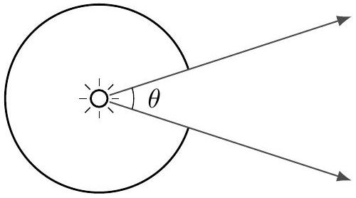
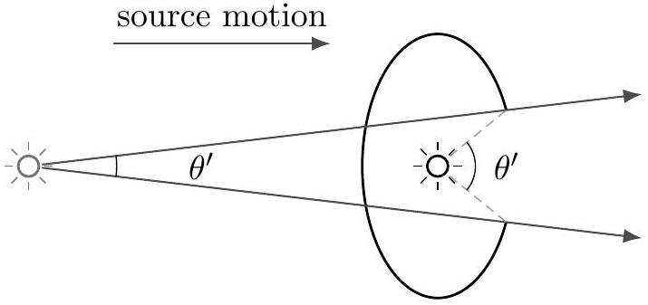

[3] Problem 16. A headlight is constructed by putting a light source inside a spherical cavity.

The opening of the cavity has angular width $\theta$, so a beam of light comes out with width $\theta$. The headlight is mounted on the front of a car, which then moves forward at a relativistic speed. The new width of the headlight's beam is $\theta ^ { \prime }$, in the frame of the Earth. Consider the following two arguments.
The headlight length contracts, increasing the cavity opening angle. Therefore, $\theta ^ { \prime } > \theta$.
By relativistic velocity addition, the light must have a greater forward velocity in the Earth's frame than in the car frame, because the car is moving forward. So the light must come out at a shallower angle in the Earth's frame. Therefore, $\theta ^ { \prime } < \theta$.

Which argument is right?
Solution. The second argument is right; it's just the relativistic beaming effect from problem 10. The problem with the first argument is that, even though the cavity opening angle is bigger, that isn't the same thing as the beam's opening angle, because the light that gets to the cavity opening was emitted when the light source was further back.

Visually, here's a snapshot of the situation.

The two definitions of $\theta ^ { \prime }$ correspond to the two arguments, but it's the smaller $\theta ^ { \prime }$ that corresponds to the beam angle, as measured from far away. (Of course, if you take the first argument and account for the fact that the relevant light is further back, you can get precisely the same $\theta ^ { \prime }$ as in the second argument, though the algebra to show this is a bit messy.)
