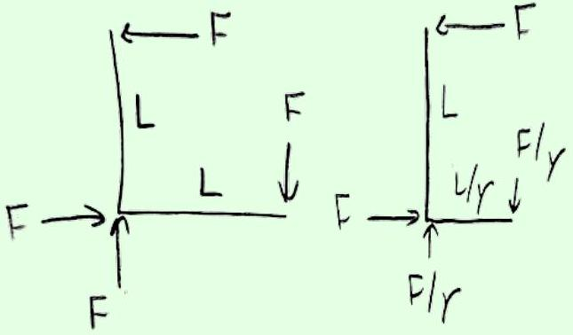

## Example 10: Right Angle Lever Paradox

In 1909, Lewis and Tolman found one of the first relativistic paradoxes. Consider a rigid lever in static equilibrium, with both arms of length $L$, experiencing the forces shown at left.

In a frame where the lever moves to the right with speed $v$, one of the lever arms will be contracted to $L / \gamma$, as shown at right. In addition, by the results of problem 18, the vertical external forces will be redshifted to $F / \gamma$. This implies a net torque of

$$
\tau = F L - \frac { F } { \gamma } \frac { L } { \gamma } = F L v ^ { 2 } .
$$

The paradox is, given that $\boldsymbol { \tau } = d \mathbf { L } / d t$, why doesn't the lever rotate?

## Solution

The resolution is that, in the frame shown at right, the angular momentum of the lever is constantly increasing. The horizontal forces are continually doing equal and opposite work on the lever, resulting in a upward flow of energy of rate $F v$ in the vertical arm. As explained below problem 1, in relativity, energy flow is equal to momentum density, so the total upward

momentum in the vertical arm is $F L v$. Therefore,

$$
\frac { d L } { d t } = \frac { d x } { d t } ( F L v ) = F L v ^ { 2 }
$$

exactly as expected.

Remark: Relativistic Torque
The resolution of the right angle lever paradox is very controversial, with dozens of papers written on the subject, so we should discuss what it even means to "resolve" a paradox. As long as we believe relativity is self-consistent, we already know what's going to happen: the lever won't rotate. Everything the lever does is determined by $\mathbf { F } = d \mathbf { p } / d t$ alone, so if it looks like angular momentum considerations give a different answer, that just means we haven't formulated the latter correctly. The reason there are so many different resolutions out there is just that people choose different ways to define torque and angular momentum.

The solution above is the standard one, and its implicit definition of angular momentum can be motivated by Noether's theorem. That's a reasonable choice, since it's a specific output of a useful and general theorem, and we thereby know for sure that it's conserved for isolated systems. Unfortunately, explaining the definition takes some advanced math.

We define the angular momentum density tensor

$$
M ^ { \mu \nu \rho } ( x ) = x ^ { \mu } T ^ { \nu \rho } ( x ) - x ^ { \nu } T ^ { \mu \rho } ( x )
$$

where the right-hand side contains the stress-energy tensor, from the solution to problem 17. The total angular momentum is an antisymmetric rank 2 tensor,

$$
J ^ { \mu \nu } ( t ) = \int d \mathbf { x } M ^ { \mu \nu 0 } ( x )
$$

Noether's theorem states that it is this quantity that is conserved for an isolated system, due to symmetry under rotations and boosts. More specifically, the three spatial components $J ^ { x y } , J ^ { y z }$, and $J ^ { z x }$ just make up ordinary angular momentum, e.g. for a single point particle they would assemble into the vector $\mathbf { r } \times \mathbf { p } = \mathbf { r } \times ( \gamma m \mathbf { v } )$. And the other components $J ^ { 0 x } , J ^ { 0 y }$ and $J ^ { 0 z }$ have to do with the center of mass motion.

If there is an external four-force per unit proper volume $f ^ { \mu } ( x )$, which in terms of the stressenergy tensor implies $\partial _ { \mu } T ^ { \mu \nu } = f ^ { \nu }$, the rate of change of angular momentum is

$$
\frac { d J ^ { \mu \nu } } { d t } = \tau ^ { \mu \nu } , \quad \tau ^ { \mu \nu } = \int d \mathbf { x } x ^ { \mu } f ^ { \nu } ( x ) - x ^ { \nu } f ^ { \mu } ( x )
$$

which looks quite similar to the Newtonian expression. The component of this equation relevant to this paradox is $d J ^ { x y } / d t = \tau ^ { x y }$, where

$$
J ^ { x y } = \int d \mathbf { x } x T ^ { y 0 } - y T ^ { x 0 } , \quad \tau ^ { x y } = \sum _ { k } x ^ { ( k ) } F _ { y } ^ { ( k ) } - y ^ { ( k ) } F _ { x } ^ { ( k ) }
$$

where the index $k$ sums over the four forces, and the $T ^ { i 0 }$ stand for the density of momentum in the $i$ direction. From this point on, the solution proceeds as above.

There is something a bit strange here, though. In the lever's rest frame, the angular momentum is zero, so if $J ^ { \mu \nu }$ were a tensor, it would have to be zero in all frames, but instead it rises to arbitrarily high values in the other frame. The reason is that when there are external torques, $J ^ { \mu \nu }$ isn't a tensor at all, just like how the four-momentum wasn't a four-vector in the solution to problem 17. That's one of the reasons there's a controversy: there just doesn't exist any definition that has all the nice properties one might want.
