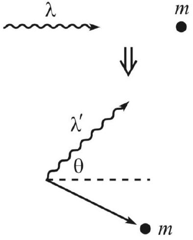
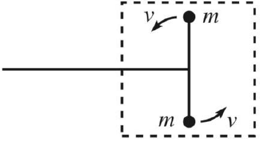
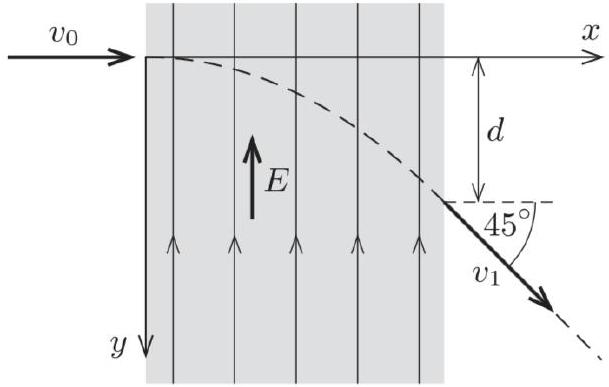
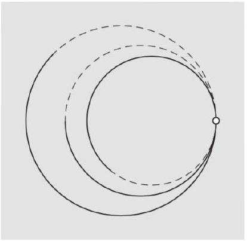

## Relativity II: Dynamics

For relativistic dynamics, see chapter 12 of Morin or chapter 13 of Kleppner and Kolenkow. For a deeper explanation of four-vectors, see chapter 2 of A First Course in General Relativity by Schutz. There is a total of 83 points.

## 1 Energy and Momentum

Idea 1
The relativistic generalizations of energy and momentum are

$$
E = \gamma m c ^ { 2 } , \quad \mathbf { p } = \gamma m \mathbf { v } .
$$

These quantities are conserved, and $m$ is defined as the rest mass. Note that $m$ is not conserved in inelastic processes, while $E$ is conserved; this is precisely the opposite of what happens nonrelativistically. The relativistic energy $E$ automatically counts all contributions to the energy, including internal energy and rest energy $m c ^ { 2 }$.
[4] Problem 1. A few useful facts about energy and momentum, for future reference.

(a) Recalling the definition of the four-velocity from R1, show that
$$
( E / c , \mathbf { p } ) = m u ^ { \mu }
$$
where $u ^ { \mu }$ is the four-velocity. Setting $c = 1$ below, this shows $p ^ { \mu } = ( E , \mathbf { p } )$ is a four-vector.
(b) Let's check the Lorentz transformation properties of $p ^ { \mu }$ explicitly. Let $S ^ { \prime }$ be the frame moving to the right with velocity $v \hat { \mathbf { x } }$ with respect to the frame $S$. If a particle has velocity $u \hat { \mathbf { x } }$ in frame $S$, write $E ^ { \prime }$ and $p ^ { \prime }$ in frame $S ^ { \prime }$ in terms of $E$ and $p$.
(c) Show that the norm of the four-momentum is
$$
p ^ { \mu } p _ { \mu } = E ^ { 2 } - | \mathbf { p } | ^ { 2 } = m ^ { 2 } .
$$
This is a very useful result that can simplify the solutions to many problems below, especially ones that simply ask for a final mass $m$. In this case one can often compute a single fourmomentum and find its norm to get the answer.
(d) The expressions in idea 1 for $E$ and $\mathbf { p }$ don't work for photons, since $\gamma$ is infinite and $m$ is zero. Instead, show that for a photon we have $p ^ { \mu } = \hbar k ^ { \mu }$.
(e) A system's center of mass frame is the one where its momentum is zero. For a system with total energy $E$ and momentum $\mathbf { p }$, show that the center of mass has velocity $\mathbf { v } = \mathbf { p } / E$.
(f) In Newtonian mechanics, the kinetic energy $K$ of an object with fixed mass $m$ satisfies $d K = \mathbf { v } \cdot d \mathbf { p }$. Show that this also holds in relativity, assuming the rest mass $m$ is fixed.
(g) As we'll discuss in more detail below, the force three-vector is defined as $\mathbf { F } = d \mathbf { p } / d t$ in relativistic mechanics. Show that $d K = \mathbf { F } \cdot d \mathbf { x }$, continuing to assume that $m$ is fixed.

Solution. (a) We saw in R1 that $u ^ { \mu } = ( \gamma c , \gamma \mathbf { v } )$. Multiplying by $m$ gives the desired result

$$
m u ^ { \mu } = ( \gamma m c , \gamma m \mathbf { v } ) = ( E / c , \mathbf { p } ) .
$$

(b) In the frame $S ^ { \prime }$, the particle has speed $( u - v ) / ( 1 - u v )$, corresponding to Lorentz factor
$$
\gamma ^ { \prime } = \left( 1 - \frac { ( u - v ) ^ { 2 } } { ( 1 - u v ) ^ { 2 } } \right) ^ { - 1 / 2 } = ( 1 - u v ) \gamma _ { u } \gamma _ { v } .
$$
Thus, the boosted values of $E$ and $p$ are
$$
E ^ { \prime } = \gamma ^ { \prime } m = \gamma _ { v } ( E - v p ) , \quad p ^ { \prime } = \gamma ^ { \prime } m ( u - v ) / ( 1 - u v ) = \gamma _ { v } ( p - v E ) .
$$
These are exactly the expected Lorentz transformation properties.
(c) We compute the norm $E ^ { 2 } - p ^ { 2 } = \gamma ^ { 2 } m ^ { 2 } - \gamma ^ { 2 } m ^ { 2 } v ^ { 2 } = \gamma ^ { 2 } m ^ { 2 } \left( 1 - v ^ { 2 } \right) = m ^ { 2 }$.
(d) This follows directly from the de Broglie relations $E = \hbar \omega$ and $\mathbf { p } = \hbar \mathbf { k }$.
(e) In this frame, $p ^ { \prime } = 0$. Then using the result of part (b), we have $p - v E = 0$ where $v$ is the velocity of the center of mass in the original frame. Therefore, $\mathbf { v } = \mathbf { p } / E$.
(f) Starting with $E ^ { 2 } = p ^ { 2 } + m ^ { 2 }$ and taking the differential of both sides,
$$
2 E d E = 2 \mathbf { p } \cdot d \mathbf { p } .
$$
Solving for $d E$, we have
$$
d E = \frac { \mathbf { p } } { E } \cdot d \mathbf { p } = \mathbf { v } \cdot d \mathbf { p }
$$
where we used part (e). Since $K$ and $E$ are the same up to a constant, we have $d K = \mathbf { v } \cdot d \mathbf { p }$.
(g) We have $\mathbf { F } \cdot d \mathbf { x } = ( \mathbf { F } d t ) \cdot ( d \mathbf { x } / d t ) = \mathbf { v } \cdot d \mathbf { p } = d K$ using part (f).

Remark
The result of part (e) is equivalent to saying that momentum p is always associated with the motion of energy $E \mathbf { v }$. This is a very general statement, which also holds at the differential level: momentum density is equal to energy flux density. One example of this was given in E7, where it was noted that the electromagnetic momentum density p was equal to the Poynting vector $\mathbf { S }$, in units where $c = 1$.

Idea 2
In relativistic dynamics problems, it is almost always better to work with energy and momentum than velocity; one typically shouldn't even mention velocities unless the problem asks for or gives them.

We'll start with some very simple problems to warm up, setting $c = 1$ throughout.

Example 1: KK 13.5
A particle of mass $m$ and speed $v$ collides and sticks to a stationary particle of mass $M$. Find the final speed of the composite particle.

Solution
The total four momentum is $( E , p ) = ( \gamma m + M , \gamma m v )$, so the final speed is

$$
v _ { f } = \frac { p } { E } = \frac { \gamma m v } { \gamma m + M } = \frac { v } { 1 + ( M / m ) \sqrt { 1 - v ^ { 2 } } } .
$$

Example 2: Morin 12.2
Two photons of energy $E$ collide at an angle $\theta$ and create a particle of mass $M$. What is $M$ ?

Solution
The total four-momentum is

$$
p ^ { \mu } = ( 2 E , E ( 1 + \cos \theta ) , E \sin \theta ) .
$$

The mass is just the norm of the four-momentum, so

$$
M = \sqrt { 4 E ^ { 2 } - E ^ { 2 } ( 1 + \cos \theta ) ^ { 2 } - E ^ { 2 } \sin ^ { 2 } \theta } = E \sqrt { 2 - 2 \cos \theta } = 2 E \sin ( \theta / 2 ) .
$$

[1] Problem 2 (Morin 12.4). A stationary mass $M _ { A }$ decays into masses $M _ { B }$ and $M _ { C }$. What are the energies of these two masses?
Solution. In the lab frame, the momenta of the masses $B$ and $C$ adds to zero, so $p _ { B } ^ { 2 } = p _ { C } ^ { 2 }$, so
$$
E _ { B } ^ { 2 } - M _ { B } ^ { 2 } = E _ { C } ^ { 2 } - M _ { C } ^ { 2 } .
$$
We also know that $E _ { B } + E _ { C } = M _ { A }$, so simplifying gives
$$
E _ { B } - E _ { C } = \frac { M _ { B } ^ { 2 } - M _ { C } ^ { 2 } } { M _ { A } } .
$$
Therefore, we conclude
$$
E _ { B } = \frac { M _ { A } ^ { 2 } + M _ { B } ^ { 2 } - M _ { C } ^ { 2 } } { 2 M _ { A } } , \quad E _ { C } = \frac { M _ { A } ^ { 2 } - M _ { B } ^ { 2 } + M _ { C } ^ { 2 } } { 2 M _ { A } } .
$$
[1] Problem 3. An atom has mass $m$ when in an excited state. It is initially at rest, and then decays back into its ground state, emitting a photon in the process. These two states differ in energy by $\Delta$. What is the photon's energy?
Solution. To do this properly, we have to remember that all of the energy of a system at rest contributes to its mass; therefore, the mass of the atom in its ground state is $m - \Delta$. The final four-momentum of the atom is $\left( m - E _ { \gamma } , E _ { \gamma } \right)$, and squaring this gives
$$
( m - \Delta ) ^ { 2 } = \left( m - E _ { \gamma } \right) ^ { 2 } - E _ { \gamma } ^ { 2 } .
$$

Solving for $E _ { \gamma }$ gives

$$
E _ { \gamma } = \Delta - \frac { \Delta ^ { 2 } } { 2 m } .
$$

It's a bit lower than the obvious answer, because of the kinetic energy of the recoiling atom. For nuclei decaying and emitting gamma rays, this difference can be measured with nuclear spectroscopy.
[2] Problem 4. USAPhO 2012, problem A1.
[2] Problem 5. A particle with mass $M$ and energy $E$ moves towards a detector when it suddenly decays and emits a photon in its direction of motion. The detector measures a photon angular frequency of $\omega$. What was the photon's angular frequency in the rest frame of the decaying particle?

Solution. It's not hard to solve this using four-momentum conservation, but a nice alternative is to use the Doppler shift formula from R1. Letting $p$ be the particle's momentum in the lab frame,

$$
\omega = \omega ^ { \prime } \sqrt { \frac { 1 + v } { 1 - v } } = \omega ^ { \prime } \sqrt { \frac { E + p } { E - p } } = \omega ^ { \prime } \frac { E + p } { \sqrt { E ^ { 2 } - p ^ { 2 } } } = \omega ^ { \prime } \frac { E + p } { M } .
$$

Thus, the answer is

$$
\omega ^ { \prime } = \frac { M } { E + \sqrt { E ^ { 2 } - M ^ { 2 } } } \omega .
$$

If you solve the problem a different way, you might get the equivalent answer

$$
\omega ^ { \prime } = \frac { E - \sqrt { E ^ { 2 } - M ^ { 2 } } } { M } \omega .
$$

[3] Problem 6. USAPhO 2002, problem A2.
Now let's try some more involved problems.
Example 3: Woodhouse 7.5
A particle of rest mass $m$ moves with velocity $\mathbf { u }$ and collides elastically with a second particle, also of rest mass $m$, which is initially at rest. After the collision, the particles have velocities v and w. Show that if $\theta$ is the angle between v and w, then

$$
\cos \theta = \frac { \left( 1 - \sqrt { 1 - v ^ { 2 } } \right) \left( 1 - \sqrt { 1 - w ^ { 2 } } \right) } { v w } .
$$

Solution
First, a remark: in Newtonian mechanics, you learn that in an inelastic collision, the kinetic energy is dissipated into microscopic thermal motion. This often leads students to ask: if we keep track of the motion of all particles in detail, then are all collisions actually perfectly elastic? According to particle physics, the answer is no. You really can lose kinetic energy by converting it to mass-energy, in collisions which change the identity of the particles or produce new particles. Therefore, at particle colliders, we say a collision is elastic if the particles that come out are precisely the same as the ones that came in. For this example, that means the final particles still have rest mass $m$.

Conservation of energy and momentum imply

$$
1 + \gamma _ { u } = \gamma _ { v } + \gamma _ { w } , \quad \gamma _ { u } \mathbf { u } = \gamma _ { v } \mathbf { v } + \gamma _ { w } \mathbf { w } .
$$

To get an expression with $\cos \theta$, we take the norm squared of the momentum equation,

$$
\gamma _ { u } ^ { 2 } u ^ { 2 } = \gamma _ { v } ^ { 2 } v ^ { 2 } + \gamma _ { w } ^ { 2 } w ^ { 2 } + 2 \gamma _ { v } \gamma _ { w } v w \cos \theta .
$$

This can be substantially simplified by noting that $\gamma _ { u } ^ { 2 } u ^ { 2 } = \gamma _ { u } ^ { 2 } - 1$, giving

$$
2 v w \gamma _ { v } \gamma _ { w } \cos \theta = \gamma _ { u } ^ { 2 } - \gamma _ { v } ^ { 2 } - \gamma _ { w } ^ { 2 } + 1 .
$$

The appearance of so many squares motivates us to square both sides of the energy equation,

$$
1 + 2 \gamma _ { u } + \gamma _ { u } ^ { 2 } = \gamma _ { v } ^ { 2 } + \gamma _ { w } ^ { 2 } + 2 \gamma _ { v } \gamma _ { w }
$$

Using this to simplify the right-hand side of the previous equation,

$$
2 v w \gamma _ { v } \gamma _ { w } \cos \theta = 2 \gamma _ { v } \gamma _ { w } - 2 \gamma _ { u } = 2 \left( \gamma _ { v } \gamma _ { w } - \gamma _ { v } - \gamma _ { w } + 1 \right) = 2 \left( \gamma _ { v } - 1 \right) \left( \gamma _ { w } - 1 \right)
$$

where in the second step we used conservation of energy. After solving for $\cos \theta$, we get the desired result. This was a bit of a slog, but it's representative of the hardest calculations you'll ever have to do for special relativity problems.

As a check on that result, note that in the nonrelativistic limit we get $\cos \theta = 0$, indicating a $90 ^ { \circ }$ angle, which you saw in M3. At relativistic speeds, the opening angle gets smaller, which is a manifestation of the "beaming" effect you saw in R1. This is a familiar effect, commonly observed in particle physics experiments.
[3] Problem 7 (Morin 12.6). A ball of mass $M$ and energy $E$ collides head-on elastically with a stationary ball of mass $m$. Show that the final energy of mass $M$ is

$$
E ^ { \prime } = \frac { 2 m M ^ { 2 } + E \left( m ^ { 2 } + M ^ { 2 } \right) } { 2 E m + m ^ { 2 } + M ^ { 2 } } .
$$

This problem is a little messy, but you can save yourself some trouble by noting that $E ^ { \prime } = E$ must be a root of the equation you get for $E ^ { \prime }$.

Solution. Let the answer be $x$. The final momentum is $( E + m , p )$, split between $P _ { M } = \left( x , p _ { M } \right)$ and $P _ { m }$. Now, $P _ { m } = ( E + m , p ) - \left( x , p _ { M } \right)$, so taking the norm squared, we see that

$$
\begin{aligned}
& m ^ { 2 } = ( E + m - x ) ^ { 2 } - \left( \sqrt { E ^ { 2 } - M ^ { 2 } } - \sqrt { x ^ { 2 } - M ^ { 2 } } \right) ^ { 2 } \\
& \Longrightarrow m ^ { 2 } = \left( E ^ { 2 } + m ^ { 2 } + x ^ { 2 } + 2 E m - 2 E x - 2 m x \right) - E ^ { 2 } + M ^ { 2 } - x ^ { 2 } + M ^ { 2 } + 2 \sqrt { \left( E ^ { 2 } - M ^ { 2 } \right) \left( x ^ { 2 } - M ^ { 2 } \right) } \\
& \Longrightarrow 0 = 2 E m - 2 E x - 2 m x + 2 M ^ { 2 } + 2 \sqrt { \left( E ^ { 2 } - M ^ { 2 } \right) \left( x ^ { 2 } - M ^ { 2 } \right) } \\
& \Longrightarrow \left( E ^ { 2 } - M ^ { 2 } \right) \left( x ^ { 2 } - M ^ { 2 } \right) = \left( m x + E x - E m - M ^ { 2 } \right) ^ { 2 }
\end{aligned}
$$

This is manifestly a quadratic in $x$, and we know that one root is $x = E$, so applying Vieta's formulas and some tedious algebra reveals that

$$
x = \frac { 2 m M ^ { 2 } + E \left( m ^ { 2 } + M ^ { 2 } \right) } { 2 E m + m ^ { 2 } + M ^ { 2 } }
$$

as desired.

[3] Problem 8 (Morin 12.7). In Compton scattering, a photon collides with a stationary electron.

    (a) If the photon scatters at an angle $\theta$, show that the resulting wavelength $\lambda ^ { \prime }$ is given in terms of the original wavelength $\lambda$ by
$$
\lambda ^ { \prime } = \lambda + \frac { h } { m c } ( 1 - \cos \theta )
$$
where $m$ is the mass of the electron.
    (b) While Compton scattering can occur for photons of any frequency, it is usually used in reference to X-rays, which have very high frequencies. Why?

Solution. (a) The original momentum of the system is $( E + m , E , 0 )$ where $E$ is the original energy of the photon. Let $x$ be the new energy of the photon. Then $P _ { \gamma } = ( x , x \cos \theta , x \sin \theta )$, and $P _ { m } = ( E + m , E , 0 ) - x ( 1 , \cos \theta , \sin \theta )$. Taking the norm squared, we see that

$$
\begin{aligned}
m ^ { 2 } & = ( E + m - x ) ^ { 2 } - ( E - x \cos \theta ) ^ { 2 } - x ^ { 2 } \sin ^ { 2 } \theta \\
& \Longrightarrow 0 = 2 E m - 2 E x - 2 m x + 2 E x \cos \theta \\
& \Longrightarrow x = \frac { E m } { m + E ( 1 - \cos \theta ) } = c ^ { 2 } \left( c ^ { 2 } / E + \frac { 1 } { m } ( 1 - \cos \theta ) \right) ^ { - 1 } .
\end{aligned}
$$

Now, $\lambda = h c / x = \lambda + \lambda _ { C } ( 1 - \cos \theta )$ where $\lambda _ { C } = h / m c$.

(b) The wavelength shift is independent of frequency, and since $c = f \lambda$ the frequency shift (which is what we measure directly) is larger if the frequency begins large. The energy loss for visible photons is hardly noticeable, while it is very large for X-rays.
Indeed, for such photons we usually talk about Thomson scattering (as in E7) which does not change the frequency of the photon at all. At the level of relativistic dynamics, Thomson scattering is nothing more than the low-frequency limit of Compton scattering. Incidentally, at even higher frequencies, the result has more subtle corrections due to quantum field theory effects, and the cross section is given by the Klein-Nishina formula.
[3] Problem 9. USAPhO 2017, problem A4. However, to make it a little harder, solve part (a) without assuming $E _ { b }$ is small.

## 2 Optimal Collisions

These collision problems are conceptually simple, but somewhat more mathematically challenging.
Idea 3
The minimum energy configuration of a system of particles with fixed total momentum is the one where they all move with the same velocity. This is easiest to show by boosting to the center of mass frame (i.e. the frame with zero total momentum) and then boosting back.

Example 4: KK 14.3
A high energy photon ( $\gamma$ ray) collides with a proton at rest. A neutral pi meson is produced according to the reaction

$$
\gamma + p \rightarrow p + \pi ^ { 0 } .
$$

What is the minimum energy the $\gamma$ ray must have for this reaction to occur? The rest mass of a proton is 938 MeV and the rest mass of a neutral pion is 135 MeV.

Solution
The total four-momentum is $\left( E + m _ { p } , E \right)$ where $E$ is the energy of the $\gamma$ ray in the lab frame. This four-momentum has norm $2 E m _ { p } + m _ { p } ^ { 2 }$. Crucially, the norms of four-momenta don't change upon changing frames, so the total four-momentum in the center of mass frame is

$$
\left( \sqrt { 2 E m _ { p } + m _ { p } ^ { 2 } } , 0 \right)
$$

because the total spatial momentum vanishes by definition. On the other hand, we also know that the reaction can just barely happen when both the proton and pion are produced at rest in the center of mass frame, with a final four-momentum of $\left( m _ { p } + m _ { \pi } , 0 \right)$. Hence we have

$$
\sqrt { 2 E m _ { p } + m _ { p } ^ { 2 } } = m _ { p } + m _ { \pi }
$$

and plugging in the numbers gives $E = 145 \mathrm { MeV }$. As expected, this is a little bit more than the mass-energy of the pion, because the final system inevitably has some kinetic energy too.

Example 5
Two photons of angular frequencies $\omega _ { 1 }$ and $\omega _ { 2 }$ collide head-on. Under what conditions can an electron-positron pair be created?

Solution
The naive answer is to say the energy present must exceed the rest energy,

$$
\hbar \omega _ { 1 } + \hbar \omega _ { 2 } \geq 2 m _ { e } .
$$

However, this is incorrect because the electron and positron will inevitably have kinetic energy, since the photons initially have a net momentum. The lowest total kinetic energy

is achieved when the electron and positron come out with the same velocity, which is the velocity of the center of mass frame of the photons.

The total four-momentum of the photons is

$$
\left( \hbar \left( \omega _ { 1 } + \omega _ { 2 } \right) , \hbar \left( \omega _ { 1 } - \omega _ { 2 } \right) \right)
$$

in the lab frame, and $\left( E _ { \mathrm { cm } } , 0 \right)$ in the center of mass frame. Therefore,

$$
E _ { \mathrm { cm } } ^ { 2 } = \hbar ^ { 2 } \left( \left( \omega _ { 1 } + \omega _ { 2 } \right) ^ { 2 } - \left( \omega _ { 1 } - \omega _ { 2 } \right) ^ { 2 } \right) = 4 \hbar ^ { 2 } \omega _ { 1 } \omega _ { 2 } .
$$

In the center of mass frame, the electron and positron can be produced at rest, so the condition is $E _ { \mathrm { cm } } \geq 2 m _ { e }$, which means

$$
\hbar \sqrt { \omega _ { 1 } \omega _ { 2 } } \geq m _ { e } .
$$

[3] Problem 10. In a particle collider, a proton of mass $m$ is given kinetic energy $E$ and collided with an initially stationary proton.

(a) What is the minimum $E$ required to produce a proton-antiproton pair, $p + p \rightarrow p + p + p + \bar { p }$ ?
(b) How about $N$ proton-antiproton pairs, where $N = 1$ in part (a)?

The scaling behavior of the answer you found in part (b) is the reason many particle colliders use two beams going in opposite directions, even though managing two beams precisely enough to collide them at the desired points is technically challenging.

Solution. (a) Keep in mind that here, $E$ stands for kinetic energy. (This is an annoying convention used in some older sources.) The total relativistic energy is $\gamma m = E + m$.
Now, let $p$ be the momentum of the moving proton. The total four momentum is then

$$
p ^ { \mu } = ( E + 2 m , p ) .
$$

We end up with four particles of mass $m$. From the idea above, the threshold energy is minimized when all of these particles have the same velocity, so they each have $p _ { i } = p / 4$. Then the final four-momentum is

$$
p ^ { \mu } = 4 \left( \sqrt { m ^ { 2 } + p ^ { 2 } / 16 } , p / 4 \right) .
$$

Setting the two expressions for $p ^ { 0 }$ equal, we have

$$
\sqrt { 16 m ^ { 2 } + p ^ { 2 } } = E + 2 m .
$$

Squaring both sides and eliminating $p$ using $( E + m ) ^ { 2 } = p ^ { 2 } + m ^ { 2 }$ gives

$$
2 E m = 12 m ^ { 2 } , \quad E = 6 m .
$$

With this result in mind, the Bevatron at Berkeley was designed to accelerate protons to a kinetic energy of $6.6 m$. It discovered the antiproton in 1955, and won the 1959 Nobel prize.

(b) Now we have $2 N + 2$ particles of mass $m$ at the end, which have $p _ { i } = p / ( 2 N + 2 )$. Now we instead have
$$
p ^ { \mu } = ( 2 N + 2 ) \left( \sqrt { m ^ { 2 } + ( p / ( 2 N + 2 ) ) ^ { 2 } } , p / ( 2 N + 2 ) \right)
$$
and setting the energies equal again gives
$$
\sqrt { ( 2 N + 2 ) ^ { 2 } m ^ { 2 } + E ^ { 2 } + 2 E m } = E + 2 m
$$
and solving gives
$$
E = \left( 2 N ^ { 2 } + 4 N \right) m .
$$
In other words, the energy required scales up quadratically in the mass-energy of the stuff you want to create!
[3] Problem 11 (MPPP 196). Two ultrarelativistic particles with negligible rest mass collide with oppositely directed momenta $p _ { 1 }$ and $p _ { 2 }$ elastically, where $p _ { 1 } > p _ { 2 }$. Find the minimum possible angle between their velocities after the collision.
Solution. Let $\mathbf { q } _ { 1 } , \mathbf { q } _ { 2 }$ be the two new momenta of the new (still ultra-relativistic) particles. We see that $\mathbf { q } _ { 1 } + \mathbf { q } _ { 2 } = \left( p _ { 1 } - p _ { 2 } \right) \hat { \mathbf { x } } \equiv \mathbf { d }$ and $q _ { 1 } + q _ { 2 } = p _ { 1 } + p _ { 2 } \equiv 2 a$ (energy).

The point $A$ lies on an ellipse with foci at the endpoints of d, and it is equivalent to maximize the angle at vertex $A$ of the above triangle. This occurs when when $A$ is on the perpendicular bisector of d. Doing some basic geometry, we find that in this case, the angle between the velocities is
$$
\theta = \pi - 2 \sin ^ { - 1 } \left( \frac { p _ { 1 } - p _ { 2 } } { p _ { 1 } + p _ { 2 } } \right) = 2 \cos ^ { - 1 } \left( \frac { p _ { 1 } - p _ { 2 } } { p _ { 1 } + p _ { 2 } } \right) .
$$
An alternative equivalent answer is
$$
\theta = \cos ^ { - 1 } \left( 1 - \frac { 8 p _ { 1 } p _ { 2 } } { \left( p _ { 1 } + p _ { 2 } \right) ^ { 2 } } \right)
$$
which also works when $p _ { 1 } < p _ { 2 }$.
[3] Problem 12. IPhO 2003, problem 3A.
[4] Problem 13. APhO 2007, problem 3B. A comprehensive relativistic dynamics problem.

## 3 Relativistic Systems

Idea 4
The truly nonintuitive part of the result $E = m c ^ { 2 }$ is that changes in internal energy cause changes in mass. As a simple example, if you take a box of gas and heat it up, it'll have more mass than before, in every sense: the system will have more inertia, it'll have more momentum and kinetic energy when moving, it'll be heavier, and it'll exert more gravitational force on other objects. Some of the questions below illustrate how this can occur.

[3] Problem 14. The facts that $E = \gamma m c ^ { 2 }$ and $\mathbf { p } = \gamma m \mathbf { v }$ are conserved are fundamentally new results of relativity, so the logically cleanest way to set up the theory is to simply make these postulates, without any further justification. But this certainly isn't the most convincing way, if you don't already believe that relativity is true.
The most striking new result is the huge rest energy $E = m c ^ { 2 }$. Throughout his life, Einstein came up with many derivations of this result, starting from more familiar postulates. In this problem, we'll cover Baierlein's simplified version of Einstein's 1946 derivation of $E = m c ^ { 2 }$. Specifically, we will prove that when the energy content of a body at rest decreases by $\Delta E$, its mass decreases by $\Delta E / c ^ { 2 }$. The result then follows if one assumes that a zero-mass object has no rest energy.
Consider an object of mass $M$ at rest, and suppose it emits photons with equal and opposite momenta $p _ { \gamma }$ upward and downward simultaneously. Let $m$ be the final mass of the object.
    (a) Now consider the same process in a frame moving with speed $v \ll c$ to the left. By using conservation of momentum in the $x$ direction, show that
$$
M = m + \frac { 2 p _ { \gamma } } { c } .
$$
Don't use the relativistic momentum formula here, because we're trying to imagine we don't already know relativity. Just use the fact that at $v \ll c$ the Galilean formula works.
    (b) Using energy conservation, conclude the desired result.
    (c) The derivation also works if one considers a frame moving upward with speed $v \ll c$. Carry out this analysis.
    (d) The physicist Hans Ohanian has claimed that all of Einstein's derivations of $E = m c ^ { 2 }$, including this one, were inadequate. What do you think?

Solution. (a) The initial momentum is $M v$. After emitting the photons, the body still has the same speed, so its final momentum is $m v$. Using Galilean velocity addition, the photons are emitted at a slight angle in this frame, contributing momentum $2 p _ { \gamma } v / c$.

(b) Since the speeds are low, the $m v ^ { 2 } / 2$ and $M v ^ { 2 } / 2$ contributions to the energy are second order and hence negligible. Energy $2 p _ { \gamma } c$ goes into photons, so an equal amount must have come out of rest energy. But the change in mass is $2 p _ { \gamma } / c$, so $\Delta E = \Delta M c ^ { 2 }$.
Finally, assuming that the rest energy of a particle goes to zero as its mass does to zero, which seems reasonable, gives $E = M c ^ { 2 }$.
(c) Initially, the mass $M$ has momentum downwards of $M v$, and after the photons are emitted, the mass $m$ has momentum $m v$ which is made up for by the photons of different momenta due to Doppler shifting. Since energy and momenta are proportional to frequency, which is

proportional to $1 \pm v / c$, the difference in the momenta of the photons is $p _ { \gamma } ( 2 v / c )$ so we get $M = m + 2 p _ { \gamma } / c$. For energy, we have $\frac { 1 } { 2 } M v ^ { 2 } + \Delta E = \frac { 1 } { 2 } m v ^ { 2 } + p _ { \gamma } c ( 1 + v / c + 1 - v / c )$, and with second order $v$ terms we have $\Delta E = 2 p _ { \gamma } c = \Delta M c ^ { 2 }$. The rest will be the same as above.
(d) This is a very subjective question, so opinions will vary. Here's my personal opinion.
Special relativity contains nonrelativistic mechanics as a special case. Therefore, there is no need to motivate any of the results of special relativity using arguments from nonrelativistic physics - relativity stands on its own. Instead one can derive the results of nonrelativistic physics by taking limits of the results of special relativity. (It's just like quantum mechanics: you don't derive Schrodinger's equation from $F = m a$, you derive $F = m a$ as a limiting behavior of Schrodinger's equation.) Because of this, there is absolutely nothing illogical about simply defining $E = \gamma m c ^ { 2 }$. We then believe it because it reduces to results we already know about ( $E = m v ^ { 2 } / 2$ in the nonrelativistic limit) and also produces new verified predictions (nuclear power works).
(It's also worth noting that in nonrelativistic physics, the definition of energy simply follows from it being the conserved quantity associated with time translations. If we continue to define energy that way in special relativity, we automatically get $E = \gamma m c ^ { 2 }$. So it's not like $E = \gamma m c ^ { 2 }$ is some ad hoc, independent assumption on top of what we assumed in R1.)
Given the above, what is the point of trying to derive the rest energy expression at all? It's just to make people more comfortable with the new ideas of relativity. In physics you can often derive the same result in multiple ways. The rest energy follows automatically from the full framework of relativity, but it also follows by using part of the framework of relativity and part of the framework of nonrelativistic physics. This is useful if you're trying to explain why rest energy makes sense, to people who don't already believe in it: you get to the result using fewer unfamiliar assumptions, and possibly only ones that have already been tested experimentally. That's why arguments like these were important historically, when scientists were first grappling with relativity, and pedagogically, when students first encounter relativity.
A derivation using this kind of "hybrid" framework is necessarily weaker. For example, we had to make the somewhat random assumption above that a zero-mass object has no rest energy. You could argue that the only way to deduce that is to start with $E = m c ^ { 2 }$, making the argument "circular". But that doesn't really matter. The point of such a derivation is just to provide motivation, by explaining something new and unfamiliar in terms of things that are more believable. If you find the result that a zero-mass object has no rest energy believable, then the derivation works for you.

## Example 6: USAPhO 2023 B2

A spaceship of mass $m$ is propelled by light produced by lasers on Earth, with total power $P$. The light evenly impacts a sail on the spaceship, and reflects directly backwards. If the spaceship starts near Earth at rest, how long will it take, in the Earth's frame, to accelerate the spaceship to a speed $v _ { f }$ ?

Solution
The spaceship is accelerated by the light, because light carries momentum. Consider a piece of the beam with total momentum $d p _ { x }$ in the Earth's frame, which impacts the spaceship when it has speed $v$. Lorentz transforming to the ship's frame, this momentum is $d p _ { x } ^ { \prime } = \gamma ( 1 - v ) d p _ { x }$, and it is flipped in sign upon reflection to $- d p _ { x } ^ { \prime }$. Lorentz transforming that final momentum back to the Earth's frame gives a final momentum $- \gamma ^ { 2 } ( 1 - v ) ^ { 2 } d p _ { x }$. Thus, the change in the spaceship's momentum is

$$
d P _ { x } = \left( 1 + \gamma ^ { 2 } ( 1 - v ) ^ { 2 } \right) d p _ { x } = \frac { 2 } { 1 + v } d p _ { x }
$$

Considering the rate at which the beam impacts the spaceship gives $d p _ { x } = P ( 1 - v ) d t$, so

$$
\frac { d P _ { x } } { d t } = \frac { 1 - v } { 1 + v } ( 2 P ) .
$$

On the other hand, using the definition of relativistic momentum gives

$$
\frac { d P _ { x } } { d t } = \frac { m d v / d t } { \left( 1 - v ^ { 2 } \right) ^ { 3 / 2 } }
$$

Combining these results and separating and integrating yields

$$
\frac { 2 P t } { m } = \int _ { 0 } ^ { v _ { f } } \frac { d v } { ( 1 - v ) ^ { 2 } \sqrt { 1 - v ^ { 2 } } }
$$

Note that we implicitly assumed $m$ was a constant, which is valid because the mirror is perfectly reflective: the spaceship doesn't absorb any energy, so its rest mass doesn't change. Carrying out the integral gives a somewhat messy final answer.

Remark
Based on the solution above, it would be natural to conclude that the amount of energy required to accelerate to final speed $v _ { f }$ is $P t$, but that's wrong. That would be the energy required to run the laser for time $t$, but in reality, we can shut off the laser earlier; we actually want the end of the laser pulse to reach the spaceship at time $t$ in the Earth's frame.

For small final speeds, this doesn't matter much, but for a highly relativistic final speed it makes a big difference. Several publications argued back and forth over the correct answer to this puzzle. For a clear overview of the situation, see this paper.

[3] Problem 15. Consider a cube of initial mass $m$ and side length $L$ in free space. In the lab frame, the cube has an initial velocity $v _ { 0 } \ll c$ to the right, and plane electromagnetic waves of intensity $I$ (in units of $\mathrm { W } / \mathrm { m } ^ { 2 }$ ) approach the cube from the left and right, striking two faces of it head on. Find the displacement of the cube after a long time, for three cases:
    (a) The left and right faces of the cube are perfectly black, and emit negligible thermal radiation. (This is the easiest case, but it's actually extremely unrealistic; can you see why?)
    (b) The left and right faces of the cube are perfectly black. In addition, they are kept in thermal

equilibrium with each other, and emit thermal radiation so that the mass-energy of the cube stays constant in the cube's frame.
(c) The cube is perfectly reflective.

For simplicity, you may always work to lowest order in $v / c$.
Solution. We'll set $c = 1$ for convenience, and expand everything to lowest order in $v$. There are many ways to do this problem, though each one requires some careful bookkeeping. For instance, you can do it like example 6, by transforming between the lab and cube frames. For variety, I'll present a slightly different method here.

(a) This can be done without leaving the lab frame. Since the cube is running into one of the beams and directly away from the other, the rate of momentum transfer from each beam is multiplied by $1 + v$ and $1 - v$, respectively. Then we have
$$
\frac { d p } { d t } = - 2 I L ^ { 2 } v .
$$
Integrating both sides with respect to time, using $p _ { 0 } \approx m v _ { 0 }$, we get $m v _ { 0 } = 2 I L ^ { 2 } \Delta x$, so that
$$
\Delta x = \frac { m v _ { 0 } } { 2 I L ^ { 2 } } .
$$
The reason this is unrealistic is that during this process, the cube will absorb an incredible amount of energy. The velocity decays on the characteristic time $m / \left( 2 I L ^ { 2 } \right)$, which means that during this time, the cube absorbs a total energy of order $m$, which is enough to change its rest mass by a significant amount! The above result is still correct, because it only uses the fact that the initial momentum is $m v _ { 0 }$ and the final momentum is zero, but any real object would either get extremely hot and start emitting energy, or reflect away the energy. Those are the cases we consider in the next two parts.
(b) We start by working in the cube frame. In this frame, the light beam coming in from the right has its intensity enhanced by two powers of $1 + v$. To see this, I find it helpful to imagine the light beam as made of discrete photons.
Suppose that in the lab frame, each photon had frequency $f$, and they happened to be spaced a wavelength $\lambda = 1 / f$ apart. In the cube frame, each photon incoming from the right has frequency $f ^ { \prime } = \sqrt { ( 1 + v ) / ( 1 - v ) } f \approx ( 1 + v ) f$. In addition, the spacing between them is now $1 / f ^ { \prime }$, so the rate at which they hit the cube is enhanced by another factor of $1 + v$. Therefore, the cube sees an incoming intensity $I ^ { \prime } \approx ( 1 + 2 v ) I$.
Of course, this isn't exactly how photons work, but the transformation of intensity doesn't depend on exactly what the beam is made of, so this has to be the right answer in general. Similarly, the cube sees an incoming intensity of $( 1 - 2 v ) I$ from the left.
So, if the cube didn't emit any radiation, then in its own frame, its energy $E ^ { \prime }$ and momentum $p ^ { \prime }$ satisfy
$$
\frac { d E ^ { \prime } } { d t } = 2 I L ^ { 2 } , \quad \frac { d p ^ { \prime } } { d t } = - 4 I L ^ { 2 } v .
$$
Transforming back to the lab frame using the Lorentz transformations at first order in $v$,
$$
\frac { d p } { d t } \approx \frac { d p ^ { \prime } } { d t } + v \frac { d E ^ { \prime } } { d t } = - 2 I L ^ { 2 } v
$$

where we neglected time dilation since it's second order in $v$. This is as we found in part (a). Now let's add on the radiation emission. In the cube frame, an equal intensity $I$ is emitted from both sides, so that
$$
\frac { d E ^ { \prime } } { d t } = 0 , \quad \frac { d p ^ { \prime } } { d t } = - 4 I L ^ { 2 } v .
$$
Transforming back to the lab frame, we have
$$
\frac { d p } { d t } = - 4 I L ^ { 2 } v
$$
from which we conclude
$$
\Delta x = \frac { m v _ { 0 } } { 4 I L ^ { 2 } } .
$$
This is smaller than in part (a), which makes sense. Thermal radiation by itself can't change the cube's velocity in any frame. However, by removing energy, it reduces the cube's inertia (or rather, prevents the inertia from increasing), making it easier to slow down.
(c) In this case, a similar argument to the above gives
$$
\frac { d E ^ { \prime } } { d t } = 0 , \quad \frac { d p ^ { \prime } } { d t } = - 8 I L ^ { 2 } v .
$$
We now get twice the force as before, since the photon momenta get flipped upon reflection. Going back to the lab frame,
$$
\frac { d p } { d t } = - 8 I L ^ { 2 } v , \quad \Delta x = \frac { m v _ { 0 } } { 8 I L ^ { 2 } } .
$$
Of course, it is also possible to get this answer by using the result of example 6 twice.
[4] Problem 16. A rocket of initial mass $M _ { 0 }$ starts from rest and propels itself forward along the $x$ axis by emitting photons backward.
(a) Show that the final velocity of the rocket relative to the initial frame is
$$
\frac { v } { c } = \frac { x ^ { 2 } - 1 } { x ^ { 2 } + 1 } = \tanh ( \log x ) , \quad x = \frac { M _ { 0 } } { M _ { f } }
$$
where $M _ { f }$ is the final rest mass of the rocket. (Hint: for this part, no integration is needed.)
(b) More generally, show that if the rocket fuel comes out at a speed $u$ relative to the rocket,
$$
\frac { v } { c } = \frac { x ^ { 2 u / c } - 1 } { x ^ { 2 u / c } + 1 } = \tanh ( ( u / c ) \log x )
$$
where $x$ is defined as above. (Hint: to avoid nasty differential equations, relate $d m$ and $d v$.)
(c) Show that this reduces to the nonrelativistic rocket equation in the limit $u / c \rightarrow 0$.
(d) Show that in the limit $v / c \rightarrow 0$, the result of part (a) also reduces to the nonrelativistic rocket equation with exhaust speed $c$. Why does this work, given that photons are the most relativistic possible things?

Solution. (a) We see that the four momentum goes from $\left( M _ { 0 } , 0 \right)$ to $\left( \gamma M _ { f } , \gamma M _ { f } v \right)$. Since the difference is given by photons, we must have

$$
- \gamma M _ { f } v = \gamma M _ { f } - M _ { 0 } \Longrightarrow \gamma M _ { f } ( 1 + v ) = M _ { 0 } \Longrightarrow \frac { 1 + v } { 1 - v } = x ^ { 2 } .
$$

Solving for $v$ and restoring $c$, we have

$$
\frac { v } { c } = \frac { x ^ { 2 } - 1 } { x ^ { 2 } + 1 }
$$

as desired.

(b) The reason part (a) didn't require integration is that all the emitted photons have the same speed in the original frame, because light always travels at $c$. But in this case, the emitted fuel will have varying speed in the original frame, depending on when it was emitted.
Since our variable $x$ is in terms of mass, it's useful to relate the decrease in mass $d m$ of the rocket with its increase in speed $d v$. Let's consider the very first instant the rocket is on. The decrease in the rocket's energy is $d m$ (the kinetic energy it picks up is proportional to $d v ^ { 2 }$, which is negligible). All of this energy must be in the fuel, which is traveling with speed $u$, which means the mass of the fuel $d m _ { f }$ obeys
$$
d m = \gamma _ { u } d m _ { f }
$$
The momentum carried by this bit of fuel is
$$
d p = \gamma _ { u } u d m _ { f } = u d m .
$$
This is equal to the momentum change of the rocket, $d p = m d v$. So combining everything,
$$
- \frac { d m } { m } = \frac { d v } { u } .
$$
This is exactly the same as the first half of the derivation of the ordinary rocket equation.
This equation holds as long as we're working in the momentarily comoving frame of the rocket; the difference in relativity is that, as we saw in R1, the velocity does not directly add. Instead, rapidity $\phi = \tanh ^ { - 1 } ( v )$ adds, so that $- d m / m = d \phi / u$, which gives a final $\phi = u \log x$.
If you don't remember this fact, we can get the same result with relativistic velocity addition. If the rocket has speed $v$ in the original frame, then after accelerating by $d v$ in its momentarily comoving frame, it ends up with speed
$$
v ^ { \prime } = \frac { v + d v } { 1 + v d v } \approx v + d v - v ^ { 2 } d v = v + \left( 1 - v ^ { 2 } \right) d v
$$
in the original frame. Therefore, in general we have
$$
- \frac { d m } { m } = \frac { 1 } { u } \frac { d v } { 1 - v ^ { 2 } }
$$
and integrating both sides gives
$$
\log x = \frac { 1 } { u } \int _ { 0 } ^ { v } \frac { d v } { 1 - v ^ { 2 } } = \frac { 1 } { 2 u } \int _ { 0 } ^ { v } \frac { d v } { 1 - v } + \frac { d v } { 1 + v } = \frac { 1 } { 2 u } \log \frac { 1 + v } { 1 - v } .
$$
Solving for $v$ gives the result.

(c) We can use the approximation
$$
x ^ { 2 u / c } = e ^ { ( 2 u / c ) \log x } \approx 1 + \frac { 2 u } { c } \log x
$$
to arrive at
$$
\frac { v } { c } \approx \frac { ( 2 u / c ) \log x } { 2 } \approx \frac { u } { c } \log x .
$$
In other words, $v = u \log x$ which is precisely the nonrelativistic rocket equation. (Here we have implicitly assumed that $( u / c ) \log x$ is small, which is equivalent to assuming that the rocket doesn't get to relativistic speeds. If $u / c$ is nonrelativistic, this should be true for any reasonable value of $x$.)
(d) At first glance, this shouldn't make any sense. When $u / c \rightarrow 1$, the rocket fuel is always moving extremely relativistically, so how can we take the nonrelativistic limit? But pressing on, let's consider the limit $v / c \rightarrow 0$. This corresponds to $x \rightarrow 1$, so
$$
v \approx \frac { ( x - 1 ) ( x + 1 ) } { 2 } c \approx ( x - 1 ) c = \frac { M _ { 0 } - M _ { f } } { M _ { f } } c .
$$
On the other hand, the nonrelativistic rocket equation gives
$$
v = u \log \frac { M _ { 0 } } { M _ { f } } = c \log \frac { M _ { 0 } } { M _ { f } } = c \log \left( 1 + \frac { M _ { 0 } - M _ { f } } { M _ { f } } \right) \approx \frac { M _ { 0 } - M _ { f } } { M _ { f } } c
$$
which matches.
Why does this work? The first half of the derivation in part (b) gives precisely the same result as the ordinary rocket equation; the only thing that matters is how much momentum you get from the fuel per energy spent. In the nonrelativistic limit, this ratio is $p / E \approx p / m c ^ { 2 } = u / c ^ { 2 }$. When we apply the nonrelativistic rocket equation to relativistic fuel, we're implicitly assuming $p / E = u / c ^ { 2 }$ for all speeds $u$, but this is actually true in relativity, because the factors of $\gamma$ cancel out! For example, for photons we indeed have $p / E = 1 / c$.
Thus, the only step where we actually need relativity is the velocity addition in the second half of part (b), but this effect is negligible as long as $v / c$ is small, no matter how big $u / c$ is.
[3] Problem 17 (Cahn). An empty box of total mass $M$ and perfectly reflecting walls is at rest in the lab frame. Then $N$ photons are introduced into the box, each with angular frequency $\omega _ { 0 }$ in a standing wave configuration; one can think of these photons as continually bouncing back and forth with velocity $\pm c \hat { \mathbf { x } }$, with zero total momentum.
(a) State what the rest mass $M _ { \text {tot } }$ of the system will be when the photons are present.
(b) Consider the momentum of the system in an inertial frame moving along the $x$ axis with speed $v \ll c$. Using the first order Doppler shift and assuming that at any moment, half the photons are moving left and half the photons are moving right, show that $p = M _ { \mathrm { tot } } v$. This provides a dynamical explanation of exactly how photons contribute to the inertia of an object.
(c) Unfortunately, it is not true that half the photons are moving right at any given time. Show that the fraction of photons moving to the right is modified by an amount of order $v / c$, and find the total momentum accounting for this effect.

(d) [A] The analysis of part (b) is nice and neat, and you can sometimes find it in textbooks. But part (c) shows that this simple analysis is wrong! What's going on? (This requires considering the stress-energy tensor, which is beyond the scope of Olympiad physics.)

Solution. (a) Since $E = m c ^ { 2 }$, the rest mass is

$$
M _ { \mathrm { tot } } = M + \frac { N \hbar \omega _ { 0 } } { c ^ { 2 } } .
$$

(b) Since $v \ll c$, we will use the equation $p = M _ { \text {tot } } v$. We clearly have momentum $M v$ from the box itself. Meanwhile, the photons are Doppler shifted, so their total momentum is
$$
p _ { \gamma } = \frac { N } { 2 } \frac { \hbar \omega _ { 0 } } { c } ( 1 + v / c ) - \frac { N } { 2 } \frac { \hbar \omega _ { 0 } } { c } ( 1 - v / c ) = \frac { N v \hbar \omega _ { 0 } } { c ^ { 2 } } .
$$
Dividing the momentum by $v$, we find the same result as in part (a).
(c) The fraction of photons moving to the right/left is $( 1 \pm v / c ) / 2$, which implies that
$$
p _ { \gamma } = \frac { N } { 2 } \frac { \hbar \omega _ { 0 } } { c } ( 1 + v / c ) ^ { 2 } - \frac { N } { 2 } \frac { \hbar \omega _ { 0 } } { c } ( 1 - v / c ) ^ { 2 } = \frac { 2 N v \hbar \omega _ { 0 } } { c ^ { 2 } } .
$$
This appears to ruin the conclusion of part (b), and there is no other first-order effect to fix it.

Now we resolve the paradox. For simplicity, we'll analyze the system only at first order in $v / c$. There are numerous other effects at second order, such as the relativistic corrections to the Doppler shift and momentum, but these will complicate the analysis without adding much insight.

The resolution is very subtle, so to warm up, let's consider a simpler situation. In R3, you will learn that the charge density and current density can be combined into a four-vector $J ^ { \mu } = ( \rho , \mathbf { J } )$. If you integrate $J ^ { 0 }$ over all of space, you get the total electric charge $Q$. And it can be shown that whenever you integrate the zeroth component of a four-vector over all space, you get a Lorentz scalar. That is, the total charge is the same in all frames.

However, this isn't always true if you don't integrate over all of space. For example, suppose we had a segment of wire with a perfectly steady current flowing through it. In the wire's frame, it's neutral, and each new charge enters the left end as another charge exits the right end. But in a frame with a velocity along the wire, the loss of simultaneity effect implies that the wire has a net charge! That is, "the amount of charge on the wire" is not a Lorentz scalar. (This insight is essential to solving many of the problems in R3.) The amount of charge in a system is only necessarily a Lorentz scalar when there's no current flowing through it.

The same subtlety applies to energy and momentum. The total four-momentum of an isolated system (i.e. through which no external energy or momentum enters or leaves) is indeed a four-vector. That's why, for all the collision problems in this problem set, we could treat the four-momenta of particles long before or after the collision as four-vectors. But the photons in the box are not a closed system, because they are constantly interacting with the box, and as a result their four-momentum is not a four-vector. That's why the total momentum of the photons, in a frame where the box is moving, is not what we expect. However, the total momentum of the photons and box together is exactly what we expect, i.e. it is precisely $M _ { \mathrm { tot } } v$ in the nonrelativistic limit. The rest of the solution will show this explicitly.

To do this properly, we must introduce the stress-energy tensor $T ^ { \mu \nu }$, which is analogous to $p ^ { \mu }$ in the same way that $J ^ { \mu }$ is analogous to $Q$. Concretely, in a one-dimensional universe with only $x$ and $t$ directions, it is

$$
T ^ { \mu \nu } = \left( \begin{array} { l l }
u & S \\
S & \sigma
\end{array} \right)
$$

where the components have the following meanings.

- $T ^ { 00 } = u$ is the energy density.
- $T ^ { 01 } = S$ is the momentum density, i.e. what we must integrate over space to get momentum. We call this $S$ because it coincides with the Poynting vector for a light wave.
- $T ^ { 10 }$ is the current of energy in the $x$ direction. For example, a particle of mass $m$ and velocity $v$ would have $T ^ { 10 } = m v$. It turns out that in general $T ^ { 10 } = T ^ { 01 }$.
- $T ^ { 11 }$ is the current of $x$-momentum in the $x$ direction, i.e. it has units of momentum per time. Physically, a flow of momentum is equivalent to a pressure.

Upon a Lorentz transformation, the stress energy tensor transforms differently from a four-vector. For a four-vector we would have

$$
\binom { x ^ { \prime } } { t ^ { \prime } } = \gamma \left( \begin{array} { c c }
1 & - v \\
- v & 1
\end{array} \right) \binom { x } { t }
$$

but for the stress-energy tensor we have

$$
\left( \begin{array} { l l }
u ^ { \prime } & S ^ { \prime } \\
S ^ { \prime } & \sigma ^ { \prime }
\end{array} \right) = \gamma ^ { 2 } \left( \begin{array} { c c }
1 & - v \\
- v & 1
\end{array} \right) \left( \begin{array} { l l }
u & S \\
S & \sigma
\end{array} \right) \left( \begin{array} { c c }
1 & - v \\
- v & 1
\end{array} \right) .
$$

Expanding to first order in $v$, we have

$$
S ^ { \prime } = ( u + \sigma ) v + \mathcal { O } \left( v ^ { 2 } \right) .
$$

The momentum of the photons is found by integrating $S ^ { \prime }$, giving

$$
p _ { \gamma } = \int _ { 0 } ^ { L / \gamma } S ^ { \prime } d x = L ( u + \sigma ) v + \mathcal { O } \left( v ^ { 2 } \right)
$$

The first term, Luv, is just what we would naively expect by transforming the four-momentum of the photons as a four-vector, and it's the answer we find in part (b). The pressure exerted by the walls yields the additional contribution $v L \sigma$. The energy density in the rest frame is simply $u = N \hbar \omega _ { 0 } / L$, while the pressure exerted by the walls is $\sigma = N \hbar \omega _ { 0 } / L$. Summing the terms gives

$$
p _ { \gamma } = 2 N v \hbar \omega _ { 0 }
$$

just as we found more directly in part (c).
Now we're in a position to see where the extra momentum is. The walls of the box cause a constant current of $x$-momentum to flow rightward through the photons. Hence the internal forces of the box must have an equal and opposite current of $x$-momentum leftward. Thus, by the same argument as above, in the primed frame $p _ { \text {box } }$ contains a contribution $- L \sigma v$ which precisely cancels the unwanted $L \sigma v$ contribution in the photons. Hence the total momentum is indeed

$$
p _ { \text {tot } } = M v + N \hbar \omega _ { 0 } v
$$

as it must be. For a similar setup, see this paper, which considers a capacitor containing an electromagnetic field, modeled classically instead of in terms of photons.

Remark
In Newtonian mechanics, we know that for an isolated system, $\mathbf { p } _ { \text {tot } } = M _ { \text {tot } } \mathbf { v } _ { \mathrm { CM } }$. In relativity, however, the idea of a "center of mass" no longer makes any sense. For example, suppose a particle with mass $m$ decays into two photons. Each of the photons has no mass, so the center of mass is no longer defined! You can always define the mass of an overall system as $\sqrt { E _ { \text {tot } } ^ { 2 } - p _ { \text {tot } } ^ { 2 } }$, and this quantity remains equal to $m$, but it's no longer the sum of the masses of the individual parts. Since you can't break the mass of the system into parts, you can't sum over the parts to define a center of mass.

However, you can still define a "center of energy",

$$
\mathbf { x } _ { \mathrm { CE } } = \frac { \sum _ { i } \mathbf { x } _ { i } E _ { i } } { \sum _ { i } E _ { i } }
$$

where $E _ { i }$ is the energy of particle $i$. It turns out that in relativity, we always have

$$
\mathbf { p } _ { \mathrm { tot } } = \frac { E _ { \mathrm { tot } } } { c ^ { 2 } } \mathbf { v } _ { \mathrm { CE } }
$$

which is called the "center of energy theorem". (Specifically, it comes from applying Noether's theorem to the symmetry of Lorentz boosts.) Of course, this reduces to $\mathbf { p } _ { \text {tot } } = M _ { \text {tot } } \mathbf { v } _ { \mathrm { CM } }$ in the nonrelativistic limit, since in that case almost all the energy is rest energy, $E = m c ^ { 2 }$.

## 4 Relativistic Dynamics

The previous questions could be solved by just using momentum and energy conservation. In this section we'll consider some deeper problems, which require considering the detailed dynamics.

Idea 5
In relativity, the force four-vector is defined as

$$
f ^ { \mu } = \frac { d p ^ { \mu } } { d \tau } .
$$

There's a bit of a subtlety here. In relativity, the invariant mass of a system can change when it absorbs energy. For example, putting a system on the stove gives it energy but not momentum, thereby changing $m = \sqrt { E ^ { 2 } - p ^ { 2 } }$. That's a perfectly valid four-force, but it feels strange to call it a "force".

Thus, we often restrict to "pure" four-forces, which don't change the invariant mass. Since

$$
\frac { d m ^ { 2 } } { d \tau } = \frac { d } { d \tau } ( p \cdot p ) = 2 m u \cdot f
$$

this corresponds to demanding $f \cdot u = 0$. For a pure force, $f ^ { \mu } = m a ^ { \mu }$.

There's another common definition of force, with three-vectors. Since three-accelerations transform in a rather complicated way, as we saw in R1, we define the three-force as

$$
\mathbf { F } = \frac { d \mathbf { p } } { d t } .
$$

The three-force doesn't directly tell us how the energy changes over time, so it's only a useful concept for pure forces. Both F and $f ^ { \mu }$ are common, but they are different even for pure forces ( $F ^ { i }$ and $f ^ { i }$ differ by a factor of $\gamma$ ), so you should carefully track which is being used.

[4] Problem 18. In this problem, we'll derive some properties of the three-force and four-force. For reference, see section 12.5 of Morin.
    (a) Show that for a particle traveling along the $\hat { \mathbf { x } }$ direction,
$$
\mathbf { F } = m \left( \gamma ^ { 3 } a _ { x } , \gamma a _ { y } , \gamma a _ { z } \right) .
$$
This is the relativistic three-vector analogue of $\mathbf { F } = m \mathbf { a }$, but it implies that force is no longer parallel to acceleration, which will be important in the problems below.
    (b) Now let $S ^ { \prime }$ be the momentary rest frame of that particle. In this frame, since the particle is at rest, the nonrelativistic expression $\mathbf { F } ^ { \prime } = m \mathbf { a } ^ { \prime }$ holds. By using the transformation of acceleration derived in R1, show that
$$
\mathbf { F } = \left( F _ { x } ^ { \prime } , F _ { y } ^ { \prime } / \gamma , F _ { z } ^ { \prime } / \gamma \right) .
$$
So transverse forces are reduced, while longitudinal forces are unchanged. Since we derived this using Lorentz transformations alone, it applies to all kinds of forces, including electromagnetic forces, or the tension force from a string.
    (c) Show that the components of the four-force are
$$
f ^ { \mu } = \left( \gamma \frac { d E } { d t } , \gamma \mathbf { F } \right) .
$$
Use the relativistic transformation of the four-force to rederive the result of part (b).
    (d) The four-impulse is defined as
$$
\Delta p ^ { \mu } = \int f ^ { \mu } d \tau .
$$
But you can also consider the Lorentz scalar
$$
\int f ^ { \mu } d x _ { \mu }
$$
This ought to be something nice and simple that you already know about. What is it?

Solution. (a) Using the chain rule and the definition of p,

$$
\mathbf { F } = \frac { d \mathbf { p } } { d t } = \gamma m \mathbf { a } + m \mathbf { v } \frac { d \gamma } { d t } .
$$

Thus, the $y$ and $z$ components in the desired expression are correct, while the $x$ component (i.e. the part parallel to v itself) has an extra contribution due to the second term. We have
$$
\frac { d \gamma } { d t } = \frac { d \gamma } { d v } \frac { d v } { d t } = \gamma ^ { 3 } v a _ { x }
$$
using a result from R1, so
$$
F _ { x } = \gamma m a _ { x } \left( 1 + \gamma ^ { 2 } v ^ { 2 } \right) = m \gamma ^ { 3 } a _ { x }
$$
as desired.
(b) We see that
$$
\mathbf { F } = m \left( \gamma ^ { 3 } a _ { x } , \gamma a _ { y } , \gamma a _ { z } \right) = m \left( \gamma ^ { 3 } a _ { x } ^ { \prime } / \gamma ^ { 3 } , \gamma a _ { y } ^ { \prime } / \gamma ^ { 2 } , \gamma a _ { z } ^ { \prime } / \gamma ^ { 2 } \right) = \left( F _ { x } ^ { \prime } , F _ { y } ^ { \prime } / \gamma , F _ { z } ^ { \prime } / \gamma \right)
$$
where we used $\mathbf { F } ^ { \prime } = m \mathbf { a } ^ { \prime }$ in the last step.
(c) We just note that
$$
\frac { d } { d \tau } = \frac { d t } { d \tau } \frac { d } { d t } = \gamma \frac { d } { d t }
$$
which gives
$$
f ^ { \mu } = \frac { d p ^ { \mu } } { d \tau } = \gamma \frac { d p ^ { \mu } } { d t } = \left( \gamma \frac { d E } { d t } , \gamma \frac { d \mathbf { p } } { d t } \right) = \left( \gamma \frac { d E } { d t } , \gamma \mathbf { F } \right) .
$$
In the primed frame of part (b), the components are
$$
f ^ { \mu ^ { \prime } } = \left( 0 , \mathbf { F } ^ { \prime } \right) .
$$
Applying a Lorentz transformation to the original frame, we have
$$
f ^ { x } = \gamma F _ { x } ^ { \prime } , \quad f ^ { y } = F _ { y } ^ { \prime } , \quad f ^ { z } = F _ { z } ^ { \prime } .
$$
Since we know that $f ^ { i } = \gamma F _ { i }$, we find
$$
F _ { x } = F _ { x } ^ { \prime } , \quad F _ { y } = F _ { y } ^ { \prime } / \gamma , \quad F _ { z } = F _ { z } ^ { \prime } / \gamma
$$
as desired.
(d) Using the chain rule, we have
$$
I = \int f ^ { \mu } \frac { d x _ { \mu } } { d \tau } d \tau = \int f \cdot u d \tau = \int \frac { 1 } { 2 m } \frac { d m ^ { 2 } } { d \tau } d \tau = \Delta m
$$
so $I$ gives the change in rest mass, which is of course a scalar, and just zero in most cases.

Remark
In popular science books and some older textbooks, relativistic dynamics is introduced using the idea of relativistic mass, $m _ { r } = \gamma m$. This definition implies the simple results $E = m _ { r } c ^ { 2 }$ and $\mathbf { p } = m _ { r } \mathbf { v }$, so these books often say that relativistic dynamics is just like ordinary dynamics, except that moving objects have more mass. This picture is misleading because it breaks down once you go beyond one dimension: in problem 18, you showed that F is not

even parallel to a, so there's no definition of mass that recovers Newtonian mechanics. You instead need separate "transverse" and "longitudinal" relativistic masses,

$$
\mathbf { F } = m _ { \perp } \mathbf { a } _ { \perp } + m _ { \| } \mathbf { a } _ { \| } , \quad m _ { \perp } = \gamma m , \quad m _ { \| } = \gamma ^ { 3 } m .
$$

I think this picture is honestly more confusing than helpful, though. It's better to avoid talking about mass and acceleration too much, and focus more on momentum and energy.

## Example 7

A circular pendulum consists of a mass $m$ attached to a string of length $L$, with the other end fixed. Suppose the mass rotates in a small circle of radius $r \ll L$, with a nonrelativistic velocity in the lab frame. Find the angular frequency of the oscillations in the lab frame, and in a frame where the entire setup moves vertically with a relativistic speed $v$.

## Solution

In the lab frame, this is a standard rotational mechanics problem. By the small angle approximation, the horizontal component of the three-force is $F _ { \perp } = m g r / L$. This is equal to

$$
F _ { \perp } = m a _ { \perp } = m \omega ^ { 2 } r
$$

from which we immediately conclude $\omega = \sqrt { g / L }$. We can use the results of problem 18 to find the answer in the other frame. The two effects are that the transverse force is redshifted, and the force's relation with acceleration is different,

$$
F _ { \perp } = \frac { m g r } { \gamma L } , \quad F _ { \perp } = \gamma m a _ { \perp } = \gamma m \omega ^ { 2 } r .
$$

Combining these results, we find

$$
\omega = \frac { 1 } { \gamma } \sqrt { \frac { g } { L } } .
$$

Of course, $\gamma$ is just the usual time dilation factor. We knew this had to be the answer, because time dilation follows directly from the postulates of relativity, but now we can explicitly show this is the right answer in this specific example. (With similar reasoning, you can show that a mass-spring system oscillates slower, too.)

## Remark

It's important not to misunderstand the meaning of the above example. Like many old physicists, Oleg Jefimenko decided one day that relativity had to be completely wrong. His argument was along the lines of the previous example: he showed that length contraction and time dilation could be derived dynamically in some simple cases, without the need to switch frames. Therefore, they can't be "real".

This argument doesn't make sense. It's like saying energy can't be real because you can solve many mechanics problems with just $F = m a$, without needing to invoke energy conservation.

In reality they're both wonderful tools with complementary uses.
Furthermore, it turns out to be extremely difficult to derive the core results of relativistic dynamics (such as the "transverse" and "longitudinal" masses, already measured by the turn of the $20 { } ^ { \text {th } }$ century) without using relativistic assumptions. In the early 1900s, many physicists tried to explain the dynamics of the electron solely in terms of its electromagnetic fields. Since the field energy and field momentum of a moving point charge are infinite, it was necessary to take a model of the electron with finite size, but there were many possibilities, leading to many different expressions for the transverse mass, as well as persistent issues like the 4/3 problem mentioned in E7.

Relativity circumvents all of these issues. If you accept the postulates of relativity, you don't need to care whether the electron is shaped like a sphere, an ellipsoid, a torus, or a dumbbell: as long as its dynamics obey Lorentz symmetry, its four-momentum is a four-vector, and the usual results follow. And that's just as well, because with the advent of quantum mechanics, we learned that the electron is not like any of these classical models. But the relativistic result still holds, because our quantum theories obey the postulates of relativity too. This flexibility comes about because, like thermodynamics, relativity isn't so much a physical theory, as it is a framework within which many theories can be formulated.

[3] Problem 19 (Morin 12.8). Consider a dumbbell made of two equal masses, $m$. The dumbbell spins around, with its center pivoted at the end of a stick.

If the speed of the masses is $v$, then the energy of the system is $2 \gamma m$. Treated as a whole, the system is at rest. Therefore, the mass of the system must be $2 \gamma m$. (Imagine enclosing it in a box, so that you can't see what's going on inside.) Convince yourself that the system does indeed behave like a mass of $M = 2 \gamma m$, by pushing on the stick (when the dumbbell is in the "transverse" position shown in the figure) and showing that $F = d p / d t = M a$.
Solution. Consider speeding up the system by $d v$ to the left. The relativistic velocity addition formula for $u$ plus $d v$ becomes
$$
\frac { u + d v } { 1 + \frac { u d v } { c ^ { 2 } } } = ( u + d v ) \left( 1 - u d v / c ^ { 2 } \right) = u + d v \left( 1 - u ^ { 2 } / c ^ { 2 } \right)
$$
Let $\gamma _ { u }$ be $1 / \sqrt { 1 - u ^ { 2 } }$. Let $\gamma _ { u } ^ { \prime }$ be the gamma factor for $u + d v \left( 1 - u ^ { 2 } \right)$. One can easily check that $\gamma _ { u } ^ { \prime } = \gamma ( 1 + u d v )$. Thus, the change in momentum due to the extra $d v$ is
$$
\gamma m ( 1 + u d v ) \left( u + d v \left( 1 - u ^ { 2 } \right) \right) - \gamma m u = \gamma m d v ,
$$
which is surprisingly what one would naively expect. Thus, the total change in momentum of the system is simply $d p = 2 \gamma m d v$, so $d p / d t = M d v / d t$, as desired.

Idea 6
The Lorentz force is a three-force as defined in problem 18. That is, we have

$$
\mathbf { F } = q ( \mathbf { E } + \mathbf { v } \times \mathbf { B } ) = \frac { d \mathbf { p } } { d t }
$$

and the force keeps the invariant mass fixed.

Example 8
A point charge $q$ of mass $m$ is initially at rest, and experiences a uniform electric field $E$. What time $t$ does it take the object to move a distance $x$ ?

Solution
In R1, we found $x ( t )$ for a uniformly accelerated rocket, which assumed a constant three-force in the momentarily comoving frame. By contrast, here we have a constant three-force $F = q E$ in the lab frame. However, we showed in problem 18 that forces along the direction of motion are the same in both frames, so these two problems are actually identical!

So we already know the answer to the problem, but it turns out that in the lab frame perspective, there's a slick alternative derivation that yields the result in one step. The trick is to consider the energy and momentum. Recall from problem 1 that the three-force $F$ obeys $F = d p / d t$ and $F = d E / d x$. Therefore, when the object reaches its destination,

$$
E = m + F x , \quad p = F t .
$$

But we also know that $E ^ { 2 } = p ^ { 2 } + m ^ { 2 }$, so plugging the results in and solving for $t$ gives

$$
t = \sqrt { x ^ { 2 } + \frac { 2 m x } { F } }
$$

which is compatible with our expression for $x ( t )$ back in R1. The reason this was so easy is that momentum and energy behave simply in relativity, while position and velocity don't.

Example 9
The LHC accelerates protons to an energy of $E = 7 \mathrm { TeV }$, and is a tunnel of radius $R = 4.3 \mathrm {~km}$. If the protons are kept in a circular orbit in the tunnel by a magnetic field of magnitude $B$, find the required value of $B$. If the value of $B$ is kept constant, what would be the radius of a future collider which accelerates protons to an energy of 20 TeV?

Solution
The centripetal force required is

$$
F = \left| \frac { d \mathbf { p } } { d t } \right| = \omega p
$$

where $\omega$ is the angular velocity. The speed of the protons is very close to $c$, so the angular velocity is $\omega \approx c / R$, and the momentum is $p \approx E / c$. The deflecting force is $q v B \approx q c B$, so

$$
q c B \approx \omega p \approx \frac { E } { R } .
$$

Therefore, we have

$$
B = \frac { E } { q c R } = \frac { 7 \times 10 ^ { 12 } } { \left( 3 \times 10 ^ { 8 } \right) \left( 4.3 \times 10 ^ { 3 } \right) } \mathrm { T } = 5.4 \mathrm {~T} .
$$

This is slightly lower than what is actually used, because magnets don't take up the entire tunnel. Since $R \propto E$, the future collider would need a radius of

$$
R ^ { \prime } = \frac { 20 \mathrm { TeV } } { 7 \mathrm { TeV } } R = 12 \mathrm {~km} .
$$

## Remark

You might be wondering how to write the Lorentz force as a four-force. It certainly should be possible, since we know electromagnetism is compatible with relativity (indeed, it led us to relativity in the first place), but it seems challenging because electromagnetism is so naturally written in terms of three-vectors. It turns out that the proper way to express the electromagnetic field in relativity is to join the electric and magnetic fields together, making them the components of an antisymmetric rank 2 tensor,

$$
F _ { \mu \nu } = \left( \begin{array} { c c c c }
0 & E _ { x } & E _ { y } & E _ { z } \\
- E _ { x } & 0 & - B _ { z } & B _ { y } \\
- E _ { y } & B _ { z } & 0 & - B _ { x } \\
- E _ { z } & - B _ { y } & B _ { x } & 0
\end{array} \right)
$$

called the field strength tensor. Then the four-force is

$$
f ^ { \mu } = q u _ { \nu } F ^ { \mu \nu }
$$

where $u _ { \nu }$ is the four-velocity. Note that this ensures the rest mass of the particle is fixed, as

$$
f \cdot u = q u _ { \mu } u _ { \nu } F ^ { \mu \nu } = - q u _ { \mu } u _ { \nu } F ^ { \nu \mu } = - f \cdot u
$$

using the antisymmetric property, so $f \cdot u = 0$. (In fact, the requirement to keep the rest mass fixed is quite restrictive, so this is one of the simplest possible relativistic force laws.)

[2] Problem 20. USAPhO 2013, problem A3. A warmup question using the above facts.
[3] Problem 21 (MPPP 192). An electron moving with speed $v _ { 0 } = 0.6 c$ enters a homogeneous electric field that is perpendicular to its velocity.

When the electron leaves the field, its velocity makes an angle 45° with its initial direction.

(a) Find the speed $v _ { 1 }$ of the electron after it has crossed the electric field.
(b) Find the distance $d$ shown above, if the strength of the electric field is $E = 510 \mathrm { kV } / \mathrm { m }$.

Note that the rest energy of an electron is 510 keV.
Solution. (a) Since we are working with three-forces here, we use $\mathbf { F } = d \mathbf { p } / d t$. This tells us that the component of momentum $p _ { x }$ is unchanged. Since the velocity is at a $45 ^ { \circ }$ angle, so is the momentum, so $p _ { y } = p _ { x }$. Thus, the momentum increases by a factor of $\sqrt { 2 }$. The momentum per mass started at $0.6 / 0.8 = 3 / 4$, so its now $\frac { 3 } { 4 } \sqrt { 2 }$. Thus,

$$
\frac { v _ { 1 } } { \sqrt { 1 - v _ { 1 } ^ { 2 } } } = \frac { 3 \sqrt { 2 } } { 4 } \Longrightarrow \frac { v _ { 1 } ^ { 2 } } { \left( 1 - v _ { 1 } ^ { 2 } \right) } = \frac { 9 } { 8 } \Longrightarrow v _ { 1 } = \frac { 3 c } { \sqrt { 17 } } .
$$

Note that this implies that $v _ { x }$ has decreased, even though the electric 3-force had no $x$ component. As we warned above, this is a manifestation of the fact that F is no longer parallel to a in relativity.

(b) As we showed in problem 1, the basics of work still work the same in relativity. The amount of work done on the electron is $e E d$, while the energy change is $m \Delta \gamma$, where
$$
\Delta \gamma = \frac { 1 } { \sqrt { 1 - 9 / 17 } } - \frac { 1 } { \sqrt { 1 - 9 / 25 } } = \frac { \sqrt { 17 } } { \sqrt { 8 } } - \frac { 5 } { 4 } .
$$
Plugging in the numbers gives $d = 20.8 \mathrm {~cm}$.
[3] Problem 22 (MPPP 194). The trajectories of charged particles, moving in a homogeneous magnetic field, can be seen by observing the tracks they leave in cloud chambers. Because the particles are moving quickly, it is impossible to see the tracks being formed; instead, one must infer what happened from the shapes of the tracks. Is it possible that, when a charged particle decays into two other charged particles, the trail segments close to the decay point (before the particles have started to slow down significantly) are arcs of circles that touch each other, as shown?

If so, identify which track belongs to the original particle. If not, explain why not.
Solution. Number the three tracks as 1, 2, and 3 starting from the inside, and let their radii be $r _ { 1 } < r _ { 2 } < r _ { 3 }$. We know that even for relativistic motion, the momentum of a particle is $p = q B r$. We can then use conservation of momentum and conservation of charge to investigate each case.

Case 1: Particle 1 decays, implying that a particle comes in along track 1, and particles leave along tracks 2 and 3. The curvatures of the tracks imply

$$
q _ { 1 } > 0 , \quad q _ { 2 } > 0 , \quad q _ { 3 } > 0 .
$$

Conservation of charge and momentum imply

$$
q _ { 1 } = q _ { 2 } + q _ { 3 } , \quad q _ { 1 } r _ { 1 } = q _ { 2 } r _ { 2 } + q _ { 3 } r _ { 3 } .
$$

By combining these equations, we may solve for $r _ { 1 }$ to find

$$
r _ { 1 } = \frac { q _ { 2 } r _ { 2 } + q _ { 3 } r _ { 3 } } { q _ { 2 } + q _ { 3 } } .
$$

However, this is impossible because we know $r _ { 1 }$ is smaller than both $r _ { 2 }$ and $r _ { 3 }$.
Case 2: Particle 2 decays, which implies

$$
q _ { 1 } < 0 , \quad q _ { 2 } < 0 , \quad q _ { 3 } > 0 .
$$

Conservation of charge and momentum imply

$$
q _ { 2 } = q _ { 1 } + q _ { 3 } , \quad \left| q _ { 2 } r _ { 2 } \right| = \left| q _ { 1 } r _ { 1 } \right| - \left| q _ { 3 } r _ { 3 } \right| .
$$

Being careful with minus signs, momentum conservation implies

$$
- q _ { 2 } r _ { 2 } = - q _ { 1 } r _ { 1 } - q _ { 3 } r _ { 3 } .
$$

Again solving for $r _ { 1 }$, we find

$$
r _ { 1 } = \frac { q _ { 3 } r _ { 3 } + \left( - q _ { 2 } \right) r _ { 2 } } { q _ { 3 } + \left( - q _ { 2 } \right) }
$$

which is a contradiction for the same reason as in case 1.
Case 3: Particle 3 decays, which implies

$$
q _ { 1 } < 0 , \quad q _ { 2 } > 0 , \quad q _ { 3 } < 0 .
$$

Conservation of charge and momentum imply

$$
q _ { 3 } = q _ { 1 } + q _ { 2 } , \quad \left| q _ { 3 } r _ { 3 } \right| = \left| q _ { 1 } r _ { 1 } \right| - \left| q _ { 2 } r _ { 2 } \right| .
$$

Again being careful with minus signs, momentum conservation implies

$$
- q _ { 3 } r _ { 3 } = - q _ { 1 } r _ { 1 } - q _ { 2 } r _ { 2 } .
$$

Again solving for $r _ { 1 }$, we find

$$
r _ { 1 } = \frac { q _ { 2 } r _ { 2 } + \left( - q _ { 3 } \right) r _ { 3 } } { q _ { 2 } + \left( - q _ { 3 } \right) }
$$

which is again a contradiction. Thus, the series of tracks shown is impossible.

[3] Problem 23. USAPhO 2006, problem A4.

[3] Problem 24. USAPhO 2022, problem B2. A nice problem on deriving the time dilation formula for an electrostatic "clock".
[3] Problem 25. Consider a particle at the origin at time $t = 0$, with initial $x$-momentum $p _ { 0 }$ and total energy $E _ { 0 }$. A constant three-force $F$ acts on the particle in the $- y$ direction.
    (a) Calculate $y ( t )$. (Hint: don't write down any equations containing $\gamma$, because it depends on $v _ { x } ( t )$, which we don't know yet.)
    (b) Calculate $x ( t )$.
    (c) Combine these results to get $y ( x )$. This is the path of a relativistic projectile.

Solution. We use the technique of example 8, setting $c = 1$ throughout.

(a) By the definition of three-force and the work-energy theorem,
$$
p _ { x } = p _ { 0 } , \quad p _ { y } = - F t , \quad E = E _ { 0 } - F y .
$$
To find $y ( t )$, we use the fact that $v _ { y } = p _ { y } / E$, so
$$
\frac { d y } { d t } = - \frac { F t } { E _ { 0 } - F y } .
$$
Separating and integrating, then using the initial condition gives
$$
y ^ { 2 } - \frac { 2 E _ { 0 } } { F } y = t ^ { 2 } .
$$
Solving the quadratic in $y$ gives
$$
y ( t ) = \frac { E _ { 0 } } { F } - \sqrt { \frac { E _ { 0 } ^ { 2 } } { F ^ { 2 } } + t ^ { 2 } } .
$$
(b) Similarly, we have
$$
\frac { d x } { d t } = \frac { p _ { x } } { E } = \frac { p _ { 0 } } { E _ { 0 } - F y } = \frac { p _ { 0 } } { \sqrt { E _ { 0 } ^ { 2 } + F ^ { 2 } t ^ { 2 } } }
$$
where we used the result of part (a). Separating and integrating,
$$
x = \int _ { 0 } ^ { t } \frac { p _ { 0 } d t } { \sqrt { E _ { 0 } ^ { 2 } + F ^ { 2 } t ^ { 2 } } }
$$
Nondimensionalizing the integral, it can be performed with the hyperbolic trigonometric substitution $t = \left( E _ { 0 } / F \right) \sinh \theta$, giving
$$
x ( t ) = \frac { p _ { 0 } } { F } \sinh ^ { - 1 } \frac { F t } { E _ { 0 } } .
$$

(c) To get $y ( x )$, we invert the above to get $t ( x )$ and plug it into our expression for $y ( t )$. We have
$$
\frac { F t } { E _ { 0 } } = \sinh \frac { F x } { p _ { 0 } }
$$
and plugging this in gives
$$
y ( x ) = \frac { E _ { 0 } } { F } \left( 1 - \cosh \left( F x / p _ { 0 } c \right) \right)
$$
where we restored $c$ in the last step. In other words, relativistic projectile motion follows an inverted catenary! To check the nonrelativistic limit, we just note that
$$
\cosh u = 1 + \frac { u ^ { 2 } } { 2 } + \ldots
$$
which tells us that
$$
y ( x ) \approx - \frac { 1 } { 2 } \frac { E _ { 0 } } { F } \left( \frac { F x } { p _ { 0 } c } \right) ^ { 2 } \approx - \frac { 1 } { 2 } \frac { m F } { p _ { 0 } ^ { 2 } } x ^ { 2 } \approx - \frac { 1 } { 2 } \frac { F } { m v _ { 0 } ^ { 2 } } x ^ { 2 }
$$
which is indeed the usual parabola.
[5] Problem 26. IPhO 1994, problem 1. A clean and neat relativistic dynamics problem. Print out the custom answer sheets before starting.

Remark
Problem 26 is a nice model for mesons, particles composed of two quarks. It is a simple version of the MIT "bag model", which was one of the most important advances in the field in the 1970s. The original paper has thousands of citations, and contains the answer to the problem in figure 3.

Idea 7
In string theory, strings carry a constant tension $T$, in the sense that the force $\mathbf { F } = d \mathbf { p } / d t$ exerted on one piece of string by its neighbors is $T$ in the momentary rest frame of that piece. The strings may stretch or shrink freely, and have zero mass when they have zero length.

[3] Problem 27 (Morin 12.16). A simple exercise involving relativistic string.
    (a) Two masses $m$ are connected by a string of length $\ell$ and constant tension $T$. The masses are released simultaneously, and they collide and stick together. What is the mass, $M$, of the resulting blob?
    (b) Consider this scenario from the point of view of a frame moving to the left at speed $v$.

The energy of the resulting blob must be $\gamma M c ^ { 2 }$. Show that you obtain the same result by computing the work done on the two masses.

Solution. (a) The total work done on the masses is $\ell T$, so by energy conservation this must manifest as rest energy in the final blob, $M = 2 m + \ell T / c ^ { 2 }$.

(b) Let $c = 1$. The initial energy is $2 \gamma m$, so we need to show that the work done is $\gamma \ell T$.
At first glance, this is puzzling, because the initial distance between the masses in this frame is $\ell / \gamma$. Therefore, naively applying $W = \int F d x$, we have
$$
W = \int T d x _ { 1 } - \int T d x _ { 2 } = T \int d x _ { 1 } - d x _ { 2 } = T \ell / \gamma
$$
which is wrong. The resolution is that we have assumed the masses are released simultaneously in the original frame, which means they aren't released simultaneously in this frame.
The mass on the left will start accelerating first, and after some time, the mass on the right will accelerate. In the original frame, these two events have $\Delta x = \ell$ and $\Delta t = 0$. Thus, applying the Lorentz transformation,
$$
\Delta x ^ { \prime } = \gamma \Delta x = \gamma \ell .
$$
Suppose that after it starts experiencing the tension, the left mass moves a distance $x _ { 0 }$ before it collides with the right mass. Then the above calculation shows that after the right mass starts experiencing the tension, it moves a distance $x _ { 0 } - \Delta x ^ { \prime }$ until collision. Thus,
$$
W = T \left( x _ { 0 } - \left( x _ { 0 } - \Delta x ^ { \prime } \right) \right) = \gamma \ell T
$$
as desired.
[3] Problem 28 (Morin 12.37). Two equal masses are connected by a relativistic string with tension $T$. The masses are constrained to move with speed $v$ along parallel lines, as shown.

The constraints are then removed, and the masses are drawn together. They collide and make one blob which continues to move to the right. Is the following reasoning correct?
The forces on the masses point in the $y$ direction. Therefore, there is no change in the momentum of the masses in the $x$ direction. But the mass of the resulting blob is greater than the sum of the initial masses (because they collide with some relative speed). Therefore, the speed of the resulting blob must be less than $v$ (to keep $p _ { x }$ constant), so the whole apparatus slows down in the $x$ direction.
If your answer is "no," exactly what's wrong about the reasoning above?
Solution. The reasoning is incorrect. To see this, we can consider working in the initial rest frame of the system. In this frame, the masses just approach each other and collide, ending up at rest. So in the original frame, the whole apparatus must keep going at the same speed as before.

There are two ways to see what's going on. First, consider just the top mass, and work throughout in the original frame. Then the incorrect statement is the very first sentence: the three-force on the top mass is not always in the $y$ direction. Recall the relativistic transformation of the three-force derived in problem 18. This tells us that if we align the $x ^ { \prime }$ axis with the instantaneous motion of the particle, then

$$
\mathbf { F } = \left( F _ { x ^ { \prime } } ^ { \prime } , F _ { y ^ { \prime } } ^ { \prime } / \gamma , F _ { z ^ { \prime } } ^ { \prime } / \gamma \right) .
$$

Once the top mass gets moving, it has velocity components along both $x$ and $y$, so the $x ^ { \prime }$ axis must be tilted accordingly. Upon applying this formula (i.e. redshifting the $y ^ { \prime }$ component of the force), we end up with a nonzero $x$ component of the force, so the logic above fails.

Alternatively, we can consider the entire system, of the masses and string. In this case, the statement that fails is the second parenthetical, "to keep $p _ { x }$ constant". The issue here is that the string itself has a linear mass density of $T / c ^ { 2 }$, due to the energy stored in it in the stretching process, and hence also carries momentum. This needs to be accounted for in the momentum conservation equation, and gives the "missing" momentum we need. Note that this is totally compatible with the previous paragraph; the force discussed there is precisely how this string momentum ends up transferred to the masses.

## Example 10: Right Angle Lever Paradox

In 1909, Lewis and Tolman found one of the first relativistic paradoxes. Consider a rigid lever in static equilibrium, with both arms of length $L$, experiencing the forces shown at left.

In a frame where the lever moves to the right with speed $v$, one of the lever arms will be contracted to $L / \gamma$, as shown at right. In addition, by the results of problem 18, the vertical external forces will be redshifted to $F / \gamma$. This implies a net torque of

$$
\tau = F L - \frac { F } { \gamma } \frac { L } { \gamma } = F L v ^ { 2 } .
$$

The paradox is, given that $\boldsymbol { \tau } = d \mathbf { L } / d t$, why doesn't the lever rotate?

## Solution

The resolution is that, in the frame shown at right, the angular momentum of the lever is constantly increasing. The horizontal forces are continually doing equal and opposite work on the lever, resulting in a upward flow of energy of rate $F v$ in the vertical arm. As explained below problem 1, in relativity, energy flow is equal to momentum density, so the total upward

momentum in the vertical arm is $F L v$. Therefore,

$$
\frac { d L } { d t } = \frac { d x } { d t } ( F L v ) = F L v ^ { 2 }
$$

exactly as expected.

Remark: Relativistic Torque
The resolution of the right angle lever paradox is very controversial, with dozens of papers written on the subject, so we should discuss what it even means to "resolve" a paradox. As long as we believe relativity is self-consistent, we already know what's going to happen: the lever won't rotate. Everything the lever does is determined by $\mathbf { F } = d \mathbf { p } / d t$ alone, so if it looks like angular momentum considerations give a different answer, that just means we haven't formulated the latter correctly. The reason there are so many different resolutions out there is just that people choose different ways to define torque and angular momentum.

The solution above is the standard one, and its implicit definition of angular momentum can be motivated by Noether's theorem. That's a reasonable choice, since it's a specific output of a useful and general theorem, and we thereby know for sure that it's conserved for isolated systems. Unfortunately, explaining the definition takes some advanced math.

We define the angular momentum density tensor

$$
M ^ { \mu \nu \rho } ( x ) = x ^ { \mu } T ^ { \nu \rho } ( x ) - x ^ { \nu } T ^ { \mu \rho } ( x )
$$

where the right-hand side contains the stress-energy tensor, from the solution to problem 17. The total angular momentum is an antisymmetric rank 2 tensor,

$$
J ^ { \mu \nu } ( t ) = \int d \mathbf { x } M ^ { \mu \nu 0 } ( x )
$$

Noether's theorem states that it is this quantity that is conserved for an isolated system, due to symmetry under rotations and boosts. More specifically, the three spatial components $J ^ { x y } , J ^ { y z }$, and $J ^ { z x }$ just make up ordinary angular momentum, e.g. for a single point particle they would assemble into the vector $\mathbf { r } \times \mathbf { p } = \mathbf { r } \times ( \gamma m \mathbf { v } )$. And the other components $J ^ { 0 x } , J ^ { 0 y }$ and $J ^ { 0 z }$ have to do with the center of mass motion.

If there is an external four-force per unit proper volume $f ^ { \mu } ( x )$, which in terms of the stressenergy tensor implies $\partial _ { \mu } T ^ { \mu \nu } = f ^ { \nu }$, the rate of change of angular momentum is

$$
\frac { d J ^ { \mu \nu } } { d t } = \tau ^ { \mu \nu } , \quad \tau ^ { \mu \nu } = \int d \mathbf { x } x ^ { \mu } f ^ { \nu } ( x ) - x ^ { \nu } f ^ { \mu } ( x )
$$

which looks quite similar to the Newtonian expression. The component of this equation relevant to this paradox is $d J ^ { x y } / d t = \tau ^ { x y }$, where

$$
J ^ { x y } = \int d \mathbf { x } x T ^ { y 0 } - y T ^ { x 0 } , \quad \tau ^ { x y } = \sum _ { k } x ^ { ( k ) } F _ { y } ^ { ( k ) } - y ^ { ( k ) } F _ { x } ^ { ( k ) }
$$

where the index $k$ sums over the four forces, and the $T ^ { i 0 }$ stand for the density of momentum in the $i$ direction. From this point on, the solution proceeds as above.

There is something a bit strange here, though. In the lever's rest frame, the angular momentum is zero, so if $J ^ { \mu \nu }$ were a tensor, it would have to be zero in all frames, but instead it rises to arbitrarily high values in the other frame. The reason is that when there are external torques, $J ^ { \mu \nu }$ isn't a tensor at all, just like how the four-momentum wasn't a four-vector in the solution to problem 17. That's one of the reasons there's a controversy: there just doesn't exist any definition that has all the nice properties one might want.
