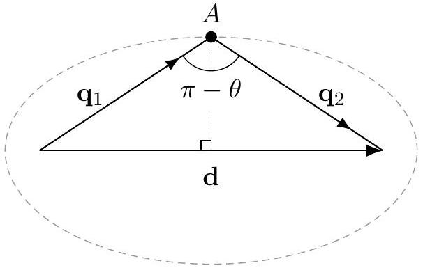

[3] Problem 10. In a particle collider, a proton of mass $m$ is given kinetic energy $E$ and collided with an initially stationary proton.

(a) What is the minimum $E$ required to produce a proton-antiproton pair, $p + p \rightarrow p + p + p + \bar { p }$ ?
(b) How about $N$ proton-antiproton pairs, where $N = 1$ in part (a)?

The scaling behavior of the answer you found in part (b) is the reason many particle colliders use two beams going in opposite directions, even though managing two beams precisely enough to collide them at the desired points is technically challenging.

Solution. (a) Keep in mind that here, $E$ stands for kinetic energy. (This is an annoying convention used in some older sources.) The total relativistic energy is $\gamma m = E + m$.
Now, let $p$ be the momentum of the moving proton. The total four momentum is then

$$
p ^ { \mu } = ( E + 2 m , p ) .
$$

We end up with four particles of mass $m$. From the idea above, the threshold energy is minimized when all of these particles have the same velocity, so they each have $p _ { i } = p / 4$. Then the final four-momentum is

$$
p ^ { \mu } = 4 \left( \sqrt { m ^ { 2 } + p ^ { 2 } / 16 } , p / 4 \right) .
$$

Setting the two expressions for $p ^ { 0 }$ equal, we have

$$
\sqrt { 16 m ^ { 2 } + p ^ { 2 } } = E + 2 m .
$$

Squaring both sides and eliminating $p$ using $( E + m ) ^ { 2 } = p ^ { 2 } + m ^ { 2 }$ gives

$$
2 E m = 12 m ^ { 2 } , \quad E = 6 m .
$$

With this result in mind, the Bevatron at Berkeley was designed to accelerate protons to a kinetic energy of $6.6 m$. It discovered the antiproton in 1955, and won the 1959 Nobel prize.

(b) Now we have $2 N + 2$ particles of mass $m$ at the end, which have $p _ { i } = p / ( 2 N + 2 )$. Now we instead have
$$
p ^ { \mu } = ( 2 N + 2 ) \left( \sqrt { m ^ { 2 } + ( p / ( 2 N + 2 ) ) ^ { 2 } } , p / ( 2 N + 2 ) \right)
$$
and setting the energies equal again gives
$$
\sqrt { ( 2 N + 2 ) ^ { 2 } m ^ { 2 } + E ^ { 2 } + 2 E m } = E + 2 m
$$
and solving gives
$$
E = \left( 2 N ^ { 2 } + 4 N \right) m .
$$
In other words, the energy required scales up quadratically in the mass-energy of the stuff you want to create!
[3] Problem 11 (MPPP 196). Two ultrarelativistic particles with negligible rest mass collide with oppositely directed momenta $p _ { 1 }$ and $p _ { 2 }$ elastically, where $p _ { 1 } > p _ { 2 }$. Find the minimum possible angle between their velocities after the collision.
Solution. Let $\mathbf { q } _ { 1 } , \mathbf { q } _ { 2 }$ be the two new momenta of the new (still ultra-relativistic) particles. We see that $\mathbf { q } _ { 1 } + \mathbf { q } _ { 2 } = \left( p _ { 1 } - p _ { 2 } \right) \hat { \mathbf { x } } \equiv \mathbf { d }$ and $q _ { 1 } + q _ { 2 } = p _ { 1 } + p _ { 2 } \equiv 2 a$ (energy).

The point $A$ lies on an ellipse with foci at the endpoints of d, and it is equivalent to maximize the angle at vertex $A$ of the above triangle. This occurs when when $A$ is on the perpendicular bisector of d. Doing some basic geometry, we find that in this case, the angle between the velocities is
$$
\theta = \pi - 2 \sin ^ { - 1 } \left( \frac { p _ { 1 } - p _ { 2 } } { p _ { 1 } + p _ { 2 } } \right) = 2 \cos ^ { - 1 } \left( \frac { p _ { 1 } - p _ { 2 } } { p _ { 1 } + p _ { 2 } } \right) .
$$
An alternative equivalent answer is
$$
\theta = \cos ^ { - 1 } \left( 1 - \frac { 8 p _ { 1 } p _ { 2 } } { \left( p _ { 1 } + p _ { 2 } \right) ^ { 2 } } \right)
$$
which also works when $p _ { 1 } < p _ { 2 }$.
[3] Problem 12. IPhO 2003, problem 3A.
[4] Problem 13. APhO 2007, problem 3B. A comprehensive relativistic dynamics problem.

## 3 Relativistic Systems

Idea 4
The truly nonintuitive part of the result $E = m c ^ { 2 }$ is that changes in internal energy cause changes in mass. As a simple example, if you take a box of gas and heat it up, it'll have more mass than before, in every sense: the system will have more inertia, it'll have more momentum and kinetic energy when moving, it'll be heavier, and it'll exert more gravitational force on other objects. Some of the questions below illustrate how this can occur.

[3] Problem 14. The facts that $E = \gamma m c ^ { 2 }$ and $\mathbf { p } = \gamma m \mathbf { v }$ are conserved are fundamentally new results of relativity, so the logically cleanest way to set up the theory is to simply make these postulates, without any further justification. But this certainly isn't the most convincing way, if you don't already believe that relativity is true.
The most striking new result is the huge rest energy $E = m c ^ { 2 }$. Throughout his life, Einstein came up with many derivations of this result, starting from more familiar postulates. In this problem, we'll cover Baierlein's simplified version of Einstein's 1946 derivation of $E = m c ^ { 2 }$. Specifically, we will prove that when the energy content of a body at rest decreases by $\Delta E$, its mass decreases by $\Delta E / c ^ { 2 }$. The result then follows if one assumes that a zero-mass object has no rest energy.
Consider an object of mass $M$ at rest, and suppose it emits photons with equal and opposite momenta $p _ { \gamma }$ upward and downward simultaneously. Let $m$ be the final mass of the object.
    (a) Now consider the same process in a frame moving with speed $v \ll c$ to the left. By using conservation of momentum in the $x$ direction, show that
$$
M = m + \frac { 2 p _ { \gamma } } { c } .
$$
Don't use the relativistic momentum formula here, because we're trying to imagine we don't already know relativity. Just use the fact that at $v \ll c$ the Galilean formula works.
    (b) Using energy conservation, conclude the desired result.
    (c) The derivation also works if one considers a frame moving upward with speed $v \ll c$. Carry out this analysis.
    (d) The physicist Hans Ohanian has claimed that all of Einstein's derivations of $E = m c ^ { 2 }$, including this one, were inadequate. What do you think?

Solution. (a) The initial momentum is $M v$. After emitting the photons, the body still has the same speed, so its final momentum is $m v$. Using Galilean velocity addition, the photons are emitted at a slight angle in this frame, contributing momentum $2 p _ { \gamma } v / c$.

(b) Since the speeds are low, the $m v ^ { 2 } / 2$ and $M v ^ { 2 } / 2$ contributions to the energy are second order and hence negligible. Energy $2 p _ { \gamma } c$ goes into photons, so an equal amount must have come out of rest energy. But the change in mass is $2 p _ { \gamma } / c$, so $\Delta E = \Delta M c ^ { 2 }$.
Finally, assuming that the rest energy of a particle goes to zero as its mass does to zero, which seems reasonable, gives $E = M c ^ { 2 }$.
(c) Initially, the mass $M$ has momentum downwards of $M v$, and after the photons are emitted, the mass $m$ has momentum $m v$ which is made up for by the photons of different momenta due to Doppler shifting. Since energy and momenta are proportional to frequency, which is

proportional to $1 \pm v / c$, the difference in the momenta of the photons is $p _ { \gamma } ( 2 v / c )$ so we get $M = m + 2 p _ { \gamma } / c$. For energy, we have $\frac { 1 } { 2 } M v ^ { 2 } + \Delta E = \frac { 1 } { 2 } m v ^ { 2 } + p _ { \gamma } c ( 1 + v / c + 1 - v / c )$, and with second order $v$ terms we have $\Delta E = 2 p _ { \gamma } c = \Delta M c ^ { 2 }$. The rest will be the same as above.
(d) This is a very subjective question, so opinions will vary. Here's my personal opinion.
Special relativity contains nonrelativistic mechanics as a special case. Therefore, there is no need to motivate any of the results of special relativity using arguments from nonrelativistic physics - relativity stands on its own. Instead one can derive the results of nonrelativistic physics by taking limits of the results of special relativity. (It's just like quantum mechanics: you don't derive Schrodinger's equation from $F = m a$, you derive $F = m a$ as a limiting behavior of Schrodinger's equation.) Because of this, there is absolutely nothing illogical about simply defining $E = \gamma m c ^ { 2 }$. We then believe it because it reduces to results we already know about ( $E = m v ^ { 2 } / 2$ in the nonrelativistic limit) and also produces new verified predictions (nuclear power works).
(It's also worth noting that in nonrelativistic physics, the definition of energy simply follows from it being the conserved quantity associated with time translations. If we continue to define energy that way in special relativity, we automatically get $E = \gamma m c ^ { 2 }$. So it's not like $E = \gamma m c ^ { 2 }$ is some ad hoc, independent assumption on top of what we assumed in R1.)
Given the above, what is the point of trying to derive the rest energy expression at all? It's just to make people more comfortable with the new ideas of relativity. In physics you can often derive the same result in multiple ways. The rest energy follows automatically from the full framework of relativity, but it also follows by using part of the framework of relativity and part of the framework of nonrelativistic physics. This is useful if you're trying to explain why rest energy makes sense, to people who don't already believe in it: you get to the result using fewer unfamiliar assumptions, and possibly only ones that have already been tested experimentally. That's why arguments like these were important historically, when scientists were first grappling with relativity, and pedagogically, when students first encounter relativity.
A derivation using this kind of "hybrid" framework is necessarily weaker. For example, we had to make the somewhat random assumption above that a zero-mass object has no rest energy. You could argue that the only way to deduce that is to start with $E = m c ^ { 2 }$, making the argument "circular". But that doesn't really matter. The point of such a derivation is just to provide motivation, by explaining something new and unfamiliar in terms of things that are more believable. If you find the result that a zero-mass object has no rest energy believable, then the derivation works for you.

## Example 6: USAPhO 2023 B2

A spaceship of mass $m$ is propelled by light produced by lasers on Earth, with total power $P$. The light evenly impacts a sail on the spaceship, and reflects directly backwards. If the spaceship starts near Earth at rest, how long will it take, in the Earth's frame, to accelerate the spaceship to a speed $v _ { f }$ ?

Solution
The spaceship is accelerated by the light, because light carries momentum. Consider a piece of the beam with total momentum $d p _ { x }$ in the Earth's frame, which impacts the spaceship when it has speed $v$. Lorentz transforming to the ship's frame, this momentum is $d p _ { x } ^ { \prime } = \gamma ( 1 - v ) d p _ { x }$, and it is flipped in sign upon reflection to $- d p _ { x } ^ { \prime }$. Lorentz transforming that final momentum back to the Earth's frame gives a final momentum $- \gamma ^ { 2 } ( 1 - v ) ^ { 2 } d p _ { x }$. Thus, the change in the spaceship's momentum is

$$
d P _ { x } = \left( 1 + \gamma ^ { 2 } ( 1 - v ) ^ { 2 } \right) d p _ { x } = \frac { 2 } { 1 + v } d p _ { x }
$$

Considering the rate at which the beam impacts the spaceship gives $d p _ { x } = P ( 1 - v ) d t$, so

$$
\frac { d P _ { x } } { d t } = \frac { 1 - v } { 1 + v } ( 2 P ) .
$$

On the other hand, using the definition of relativistic momentum gives

$$
\frac { d P _ { x } } { d t } = \frac { m d v / d t } { \left( 1 - v ^ { 2 } \right) ^ { 3 / 2 } }
$$

Combining these results and separating and integrating yields

$$
\frac { 2 P t } { m } = \int _ { 0 } ^ { v _ { f } } \frac { d v } { ( 1 - v ) ^ { 2 } \sqrt { 1 - v ^ { 2 } } }
$$

Note that we implicitly assumed $m$ was a constant, which is valid because the mirror is perfectly reflective: the spaceship doesn't absorb any energy, so its rest mass doesn't change. Carrying out the integral gives a somewhat messy final answer.

Remark
Based on the solution above, it would be natural to conclude that the amount of energy required to accelerate to final speed $v _ { f }$ is $P t$, but that's wrong. That would be the energy required to run the laser for time $t$, but in reality, we can shut off the laser earlier; we actually want the end of the laser pulse to reach the spaceship at time $t$ in the Earth's frame.

For small final speeds, this doesn't matter much, but for a highly relativistic final speed it makes a big difference. Several publications argued back and forth over the correct answer to this puzzle. For a clear overview of the situation, see this paper.
