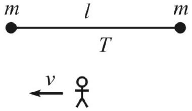
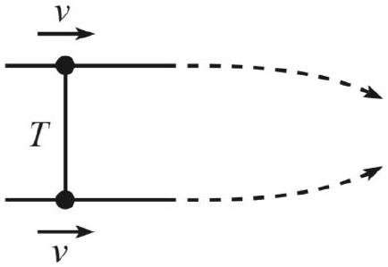

[3] Problem 25. Consider a particle at the origin at time $t = 0$, with initial $x$-momentum $p _ { 0 }$ and total energy $E _ { 0 }$. A constant three-force $F$ acts on the particle in the $- y$ direction.
    (a) Calculate $y ( t )$. (Hint: don't write down any equations containing $\gamma$, because it depends on $v _ { x } ( t )$, which we don't know yet.)
    (b) Calculate $x ( t )$.
    (c) Combine these results to get $y ( x )$. This is the path of a relativistic projectile.

Solution. We use the technique of example 8, setting $c = 1$ throughout.

(a) By the definition of three-force and the work-energy theorem,
$$
p _ { x } = p _ { 0 } , \quad p _ { y } = - F t , \quad E = E _ { 0 } - F y .
$$
To find $y ( t )$, we use the fact that $v _ { y } = p _ { y } / E$, so
$$
\frac { d y } { d t } = - \frac { F t } { E _ { 0 } - F y } .
$$
Separating and integrating, then using the initial condition gives
$$
y ^ { 2 } - \frac { 2 E _ { 0 } } { F } y = t ^ { 2 } .
$$
Solving the quadratic in $y$ gives
$$
y ( t ) = \frac { E _ { 0 } } { F } - \sqrt { \frac { E _ { 0 } ^ { 2 } } { F ^ { 2 } } + t ^ { 2 } } .
$$
(b) Similarly, we have
$$
\frac { d x } { d t } = \frac { p _ { x } } { E } = \frac { p _ { 0 } } { E _ { 0 } - F y } = \frac { p _ { 0 } } { \sqrt { E _ { 0 } ^ { 2 } + F ^ { 2 } t ^ { 2 } } }
$$
where we used the result of part (a). Separating and integrating,
$$
x = \int _ { 0 } ^ { t } \frac { p _ { 0 } d t } { \sqrt { E _ { 0 } ^ { 2 } + F ^ { 2 } t ^ { 2 } } }
$$
Nondimensionalizing the integral, it can be performed with the hyperbolic trigonometric substitution $t = \left( E _ { 0 } / F \right) \sinh \theta$, giving
$$
x ( t ) = \frac { p _ { 0 } } { F } \sinh ^ { - 1 } \frac { F t } { E _ { 0 } } .
$$

(c) To get $y ( x )$, we invert the above to get $t ( x )$ and plug it into our expression for $y ( t )$. We have
$$
\frac { F t } { E _ { 0 } } = \sinh \frac { F x } { p _ { 0 } }
$$
and plugging this in gives
$$
y ( x ) = \frac { E _ { 0 } } { F } \left( 1 - \cosh \left( F x / p _ { 0 } c \right) \right)
$$
where we restored $c$ in the last step. In other words, relativistic projectile motion follows an inverted catenary! To check the nonrelativistic limit, we just note that
$$
\cosh u = 1 + \frac { u ^ { 2 } } { 2 } + \ldots
$$
which tells us that
$$
y ( x ) \approx - \frac { 1 } { 2 } \frac { E _ { 0 } } { F } \left( \frac { F x } { p _ { 0 } c } \right) ^ { 2 } \approx - \frac { 1 } { 2 } \frac { m F } { p _ { 0 } ^ { 2 } } x ^ { 2 } \approx - \frac { 1 } { 2 } \frac { F } { m v _ { 0 } ^ { 2 } } x ^ { 2 }
$$
which is indeed the usual parabola.
[5] Problem 26. IPhO 1994, problem 1. A clean and neat relativistic dynamics problem. Print out the custom answer sheets before starting.

Remark
Problem 26 is a nice model for mesons, particles composed of two quarks. It is a simple version of the MIT "bag model", which was one of the most important advances in the field in the 1970s. The original paper has thousands of citations, and contains the answer to the problem in figure 3.

Idea 7
In string theory, strings carry a constant tension $T$, in the sense that the force $\mathbf { F } = d \mathbf { p } / d t$ exerted on one piece of string by its neighbors is $T$ in the momentary rest frame of that piece. The strings may stretch or shrink freely, and have zero mass when they have zero length.

[3] Problem 27 (Morin 12.16). A simple exercise involving relativistic string.
    (a) Two masses $m$ are connected by a string of length $\ell$ and constant tension $T$. The masses are released simultaneously, and they collide and stick together. What is the mass, $M$, of the resulting blob?
    (b) Consider this scenario from the point of view of a frame moving to the left at speed $v$.

The energy of the resulting blob must be $\gamma M c ^ { 2 }$. Show that you obtain the same result by computing the work done on the two masses.

Solution. (a) The total work done on the masses is $\ell T$, so by energy conservation this must manifest as rest energy in the final blob, $M = 2 m + \ell T / c ^ { 2 }$.

(b) Let $c = 1$. The initial energy is $2 \gamma m$, so we need to show that the work done is $\gamma \ell T$.
At first glance, this is puzzling, because the initial distance between the masses in this frame is $\ell / \gamma$. Therefore, naively applying $W = \int F d x$, we have
$$
W = \int T d x _ { 1 } - \int T d x _ { 2 } = T \int d x _ { 1 } - d x _ { 2 } = T \ell / \gamma
$$
which is wrong. The resolution is that we have assumed the masses are released simultaneously in the original frame, which means they aren't released simultaneously in this frame.
The mass on the left will start accelerating first, and after some time, the mass on the right will accelerate. In the original frame, these two events have $\Delta x = \ell$ and $\Delta t = 0$. Thus, applying the Lorentz transformation,
$$
\Delta x ^ { \prime } = \gamma \Delta x = \gamma \ell .
$$
Suppose that after it starts experiencing the tension, the left mass moves a distance $x _ { 0 }$ before it collides with the right mass. Then the above calculation shows that after the right mass starts experiencing the tension, it moves a distance $x _ { 0 } - \Delta x ^ { \prime }$ until collision. Thus,
$$
W = T \left( x _ { 0 } - \left( x _ { 0 } - \Delta x ^ { \prime } \right) \right) = \gamma \ell T
$$
as desired.
[3] Problem 28 (Morin 12.37). Two equal masses are connected by a relativistic string with tension $T$. The masses are constrained to move with speed $v$ along parallel lines, as shown.

The constraints are then removed, and the masses are drawn together. They collide and make one blob which continues to move to the right. Is the following reasoning correct?
The forces on the masses point in the $y$ direction. Therefore, there is no change in the momentum of the masses in the $x$ direction. But the mass of the resulting blob is greater than the sum of the initial masses (because they collide with some relative speed). Therefore, the speed of the resulting blob must be less than $v$ (to keep $p _ { x }$ constant), so the whole apparatus slows down in the $x$ direction.
If your answer is "no," exactly what's wrong about the reasoning above?
Solution. The reasoning is incorrect. To see this, we can consider working in the initial rest frame of the system. In this frame, the masses just approach each other and collide, ending up at rest. So in the original frame, the whole apparatus must keep going at the same speed as before.

There are two ways to see what's going on. First, consider just the top mass, and work throughout in the original frame. Then the incorrect statement is the very first sentence: the three-force on the top mass is not always in the $y$ direction. Recall the relativistic transformation of the three-force derived in problem 18. This tells us that if we align the $x ^ { \prime }$ axis with the instantaneous motion of the particle, then

$$
\mathbf { F } = \left( F _ { x ^ { \prime } } ^ { \prime } , F _ { y ^ { \prime } } ^ { \prime } / \gamma , F _ { z ^ { \prime } } ^ { \prime } / \gamma \right) .
$$

Once the top mass gets moving, it has velocity components along both $x$ and $y$, so the $x ^ { \prime }$ axis must be tilted accordingly. Upon applying this formula (i.e. redshifting the $y ^ { \prime }$ component of the force), we end up with a nonzero $x$ component of the force, so the logic above fails.

Alternatively, we can consider the entire system, of the masses and string. In this case, the statement that fails is the second parenthetical, "to keep $p _ { x }$ constant". The issue here is that the string itself has a linear mass density of $T / c ^ { 2 }$, due to the energy stored in it in the stretching process, and hence also carries momentum. This needs to be accounted for in the momentum conservation equation, and gives the "missing" momentum we need. Note that this is totally compatible with the previous paragraph; the force discussed there is precisely how this string momentum ends up transferred to the masses.
