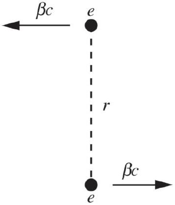
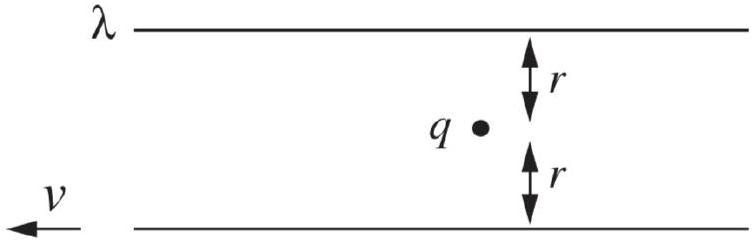

## Relativity III: Fields

Relativity in electromagnetism is covered in chapter 5 of Purcell and then sprinkled in throughout the rest of the book, notably in sections 6.7 and 9.7, and appendix H. For a more advanced discussion, see chapter 3 of A First Course in General Relativity by Schutz for tensors, and chapter 12 of Griffiths and chapters I-34, II-13, and II-25 through II-28 of the Feynman lectures for relativistic electromagnetism. For a brief taste of general relativity, see chapter 14 of Morin, and chapter II-42 of the Feynman lectures. For a great, accessible introduction to tests of general relativity, see Was Einstein Right? by Will. There is a total of 90 points.

## 1 Electromagnetic Field Transformations

Idea 1: Field Transformations
If the electromagnetic field is $( \mathbf { E } , \mathbf { B } )$ in one reference frame, then in a reference frame moving with velocity v with respect to this frame, the components of the field parallel to v are

$$
E _ { \| } ^ { \prime } = E _ { \| } , \quad B _ { \| } ^ { \prime } = B _ { \| }
$$

while the components perpendicular are

$$
\mathbf { E } _ { \perp } ^ { \prime } = \gamma \left( \mathbf { E } _ { \perp } + \mathbf { v } \times \mathbf { B } _ { \perp } \right) , \quad \mathbf { B } _ { \perp } ^ { \prime } = \gamma \left( \mathbf { B } _ { \perp } - \frac { \mathbf { v } } { c ^ { 2 } } \times \mathbf { E } _ { \perp } \right) .
$$

As alluded to in R2, this is the transformation rule for the components of a rank 2 antisymmetric tensor.

Under these transformations, Maxwell's equations remain true in all inertial frames, and the Lorentz force transforms properly as well. Furthermore, a Lorentz transformation does not change the total amount of charge in a system, where total charge is defined by Gauss's law via the electric flux through a surface containing the system.

Remark
There are many ways of deriving the field transformations. The tensor method alluded to above is the mathematically cleanest, but the conceptually clearest is to think about how some simple setups must Lorentz transform, if Maxwell's equations are to remain true. For example, boosting a capacitor increases the charge density on the plates because of length contraction, which is why $\mathbf { E } _ { \perp } ^ { \prime }$ contains $\gamma \mathbf { E } _ { \perp }$. (Further examples are given in chapter 5 of Purcell, which is essential reading for this section.) Another method is to demand that the Lorentz force obeys the transformation of three-force derived in R2.
[4] Problem 1. Basic facts about the electric and magnetic fields of a moving charge.

(a) Show that the field of a point charge $q$ at the origin moving with constant velocity $v$ is
$$
\mathbf { E } = \frac { q } { 4 \pi \epsilon _ { 0 } r ^ { 2 } } \frac { 1 - v ^ { 2 } } { \left( 1 - v ^ { 2 } \sin ^ { 2 } \theta \right) ^ { 3 / 2 } } \hat { \mathbf { r } }
$$
in units where $c = 1$, and $\theta$ is the angle from $\mathbf { v }$. In particular, the field is still radial.

(b) Verify that the charge of this moving charge is still $q$. It may be useful to consult the integral table in appendix K of Purcell.
(c) Argue that the magnetic field of this point charge must be exactly
$$
\mathbf { B } = \frac { \mathbf { v } } { c ^ { 2 } } \times \mathbf { E } .
$$
(d) Verify that the previous result is correct in nonrelativistic electromagnetism (i.e. using Coulomb's law and the Biot-Savart law).

The result of part (a), first found by Heaviside in 1888, implies that the field lines and equipotential surfaces of a moving charge contract by a factor of $\gamma$ in the direction of motion. In fact, this was what inspired Lorentz and Fitzgerald to propose length contraction in the first place! It's hard to measure the Coulomb field of a relativistic electron, so this prediction was first verified in 2022.

Solution. For concreteness, let the charge be moving along the $z$ direction, and let the primed frame be the rest frame of the charge.

(a) By rotational symmetry, it suffices to show this holds in the $x z$ plane. Consider the point
$$
( x , z , t ) = ( r \sin \theta , r \cos \theta , 0 )
$$
Lorentz transforming to the primed frame, this point corresponds to
$$
\left( x ^ { \prime } , z ^ { \prime } , t ^ { \prime } \right) = \left( r \sin \theta , \gamma r \cos \theta , t ^ { \prime } \right)
$$
where the value of $t ^ { \prime }$ is irrelevant since the charge is at rest in this frame. By Coulomb's law, the electric field at that point is
$$
E _ { x } ^ { \prime } = \frac { q } { 4 \pi \epsilon _ { 0 } } \frac { x ^ { \prime } } { \left( \left( x ^ { \prime } \right) ^ { 2 } + \left( z ^ { \prime } \right) ^ { 2 } \right) ^ { 3 / 2 } } , \quad E _ { z } ^ { \prime } = \frac { q } { 4 \pi \epsilon _ { 0 } } \frac { z ^ { \prime } } { \left( \left( x ^ { \prime } \right) ^ { 2 } + \left( z ^ { \prime } \right) ^ { 2 } \right) ^ { 3 / 2 } } .
$$
Applying the field transformations, the field in the original frame is
$$
E _ { x } = \gamma E _ { x ^ { \prime } } = \frac { q } { 4 \pi \epsilon _ { 0 } } \frac { \gamma r \sin \theta } { r ^ { 3 } \left( \sin ^ { 2 } \theta + \gamma ^ { 2 } \cos ^ { 2 } \theta \right) ^ { 3 / 2 } } , \quad E _ { z } = E _ { z } ^ { \prime } = \frac { q } { 4 \pi \epsilon _ { 0 } } \frac { \gamma r \cos \theta } { r ^ { 3 } \left( \sin ^ { 2 } \theta + \gamma ^ { 2 } \cos ^ { 2 } \theta \right) ^ { 3 / 2 } } .
$$
This is a radial field, as desired, and rewriting $\sin ^ { 2 } \theta + \gamma ^ { 2 } \cos ^ { 2 } \theta = \gamma ^ { 2 } \left( 1 - v ^ { 2 } \sin ^ { 2 } \theta \right)$ and simplifying gives the desired result.
(b) The electric flux through a unit sphere surrounding the charge must still be $q / \epsilon _ { 0 }$, so we need to show that
$$
1 = \frac { 1 } { 4 \pi } \int \frac { 1 - v ^ { 2 } } { \left( 1 - v ^ { 2 } \sin ^ { 2 } \theta \right) ^ { 3 / 2 } } d \Omega
$$
Setting up spherical coordinates as usual, the $d \phi$ integral gives $2 \pi$, leaving
$$
\frac { 1 - v ^ { 2 } } { 2 } \int _ { 0 } ^ { \pi } \frac { \sin \theta d \theta } { \left( 1 - v ^ { 2 } \sin ^ { 2 } \theta \right) ^ { 3 / 2 } } = \left. \frac { 1 - v ^ { 2 } } { 2 } \frac { - \cos \theta } { \left( 1 - v ^ { 2 } \right) \sqrt { 1 - v ^ { 2 } \sin ^ { 2 } \theta } } \right| _ { 0 } ^ { \pi } = 1
$$
as desired, where we used equation (K.15) from Purcell.
(c) We know $\mathbf { B } ^ { \prime } = 0$, and using the field transformations immediately gives the result.

(d) Applying Coulomb's law, we have
$$
\frac { \mathbf { v } \times \mathbf { E } } { c ^ { 2 } } = \left( \mu _ { 0 } \epsilon _ { 0 } \right) \frac { q v } { 4 \pi \epsilon _ { 0 } r ^ { 2 } } \hat { \mathbf { z } } \times \hat { \mathbf { r } } = \frac { \mu _ { 0 } } { 4 \pi } \frac { q v \sin \theta } { r ^ { 2 } } \hat { \varphi }
$$
which is precisely what the Biot-Savart law predicts.
[3] Problem 2 (Purcell 5.29). Two protons are moving antiparallel to each other, along lines separated by a distance $r$, with the same speed $v$ in the lab frame, as shown.

Consider the moment the protons are a distance $r$ apart.
    (a) Show that the three-force experienced by each proton due to the electric field of the other is
$$
F = \frac { \gamma e ^ { 2 } } { 4 \pi \epsilon _ { 0 } r ^ { 2 } }
$$
    (b) Compute the three-force experienced by one of the protons by transforming to its rest frame, computing the force there, then transforming back to the lab frame. In particular, show that this is not equal to the result of part (a).
    (c) Show that the discrepancy is resolved if the magnetic three-force is also included.

Recall from R2 that the Lorentz three-force is $\mathbf { F } = q ( \mathbf { E } + \mathbf { v } \times \mathbf { B } )$. You will also have to use the three-force transformation laws you derived there.

Solution. (a) Using part (a) of problem 1 gives

$$
e E = \frac { e ^ { 2 } } { 4 \pi \epsilon _ { 0 } r ^ { 2 } } \frac { 1 - v ^ { 2 } } { \left( 1 - v ^ { 2 } \right) ^ { 3 / 2 } } = \frac { \gamma e ^ { 2 } } { 4 \pi \epsilon _ { 0 } r ^ { 2 } }
$$

as desired.

(b) In the rest frame of one proton, we have
$$
F ^ { \prime } = e E ^ { \prime } = \frac { e ^ { 2 } } { 4 \pi \epsilon _ { 0 } r ^ { 2 } } \frac { 1 - v ^ { \prime 2 } } { \left( 1 - v ^ { \prime 2 } \right) ^ { 3 / 2 } } , \quad v ^ { \prime } = \frac { 2 v } { 1 + v ^ { 2 } } .
$$
Simplifying a bit yields
$$
F ^ { \prime } = \frac { e ^ { 2 } } { 4 \pi \epsilon _ { 0 } r ^ { 2 } } \frac { 1 + v ^ { 2 } } { 1 - v ^ { 2 } } .
$$
Using our result from R2 that transverse forces are redshifted,
$$
F = \frac { F ^ { \prime } } { \gamma } = \frac { \gamma e ^ { 2 } } { 4 \pi \epsilon _ { 0 } r ^ { 2 } } \left( 1 + v ^ { 2 } \right) .
$$
This is more than the result we found in part (a).

(c) The extra three-force due to the magnetic field adds to the electric force,
$$
e v B = e v ^ { 2 } E = \frac { \gamma e ^ { 2 } } { 4 \pi \epsilon _ { 0 } r ^ { 2 } } v ^ { 2 }
$$
where we used part (c) of problem 1. This is exactly the missing piece.

## Remark

In problem 1, we found that the electric field of a uniformly moving charge in special relativity is exactly radial, even though the field is no longer spherically symmetric. But why?

Mechanically, the fact that the field is radial in the charge's rest frame just means $z / x = E _ { z } / E _ { x }$. When we Lorentz transform, $z$ is Lorentz contracted by a factor of $\gamma$, while $E _ { x }$ is enhanced by a factor of $\gamma$, so we still have the equality of ratios $z ^ { \prime } / x ^ { \prime } = E _ { z } ^ { \prime } / E _ { x } ^ { \prime }$.

But there's a deeper point of view. Suppose two particles of charge $\pm q$ and mass $m$ orbit each other with speed $v$ and separation $r$. If we didn't know the answer to this problem, we might naively guess the electric field "lags behind" the particles, e.g. pointing to where the particle used to be according to a speed of light delay, then we would expect it to be tilted away from the radial direction by an angle $\sim v$. However, this would make the particles spiral in or out, breaking angular momentum conservation.

More precisely, the angular momentum of the charges is actually not quite conserved, because they emit electromagnetic radiation, which carries away angular momentum. However, this effect is quite small. To estimate it, recall from E7 that $P \sim q ^ { 2 } a ^ { 2 }$, where we set $\epsilon _ { 0 } = c = 1$. This energy loss corresponds to a "radiation reaction" force $F _ { \text {rad } }$ acting backwards on each particle. Using $P \sim F _ { \text {rad } } v$ and $a = v ^ { 2 } / r$, and eliminating $a$, we have

$$
F _ { \mathrm { rad } } \sim \frac { q ^ { 2 } v ^ { 3 } } { r ^ { 2 } } .
$$

So the leading nonradial force is $\mathcal { O } \left( v ^ { 3 } \right)$ smaller than the Coulomb force. This means there cannot possibly be an $\mathcal { O } ( v )$ "lag" effect, as described in the previous paragraph.

We also learn something else. In earlier handouts, we considered many problems where charges interacted directly via the Coulomb force, without having to think about what the electric and magnetic fields were. Is it possible to do something similar, accounting for relativistic corrections? This is an important question, since simulating particles interacting directly with each other is much faster than simulating fields.

The answer is that it's possible up to $\mathcal { O } \left( v ^ { 2 } \right)$ corrections, as described by the Darwin Lagrangian. But at $\mathcal { O } \left( v ^ { 3 } \right)$ the radiation reaction force shows up, and that force is associated with exciting radiation in the field, which doesn't exist in a particle description. (Similar logic holds for gravity, though in that case the radiation reaction force shows up at $\mathcal { O } \left( v ^ { 5 } \right)$.)

People once tried to guess velocity-dependent forces to fit data, including Weber for electromagnetism and Gerber for gravity. However, this only works up to some point, and there are many possibilities to guess. The benefit of a field theory (Maxwell's electromagnetism or

general relativity) is that it's a simple starting point, from which one can compute all forces.
[3] Problem 3 (Purcell 5.24). In the rest frame of a particle with charge $q$, another particle with charge $q$ is approaching with relativistic velocity $\mathbf { v }$. Assume that both particles are extremely massive, and hence their velocities are nearly constant. The second particle passes a minimum distance $b$ from the first.

(a) Show that the impulse acquired by each particle is perpendicular to v with magnitude $q ^ { 2 } / 2 \pi \epsilon _ { 0 } v b$. (Hint: you can avoid doing a nasty integral by using Gauss's law.)
(b) If the particles have mass $m$, roughly how large does $m$ have to be for the above result to be a good approximation?

Solution. (a) Let the stationary particle be at the origin, and let the velocity of the moving particle be along the $x$-axis. Then the impulse experienced by the moving particle is

$$
J = \int F d t = \frac { q } { v } \int _ { - \infty } ^ { \infty } E _ { z } ( x , b ) d x
$$

On the other hand, suppose we consider the electric flux through an infinite cylinder of radius $b$, oriented along the $x$-axis. Then

$$
\Phi = \int \mathbf { E } \cdot d \mathbf { S } = 2 \pi b \int _ { - \infty } ^ { \infty } E _ { z } ( x , b ) d x
$$

Therefore, we conclude

$$
J = \frac { q } { v } \frac { \Phi } { 2 \pi b } = \frac { q ^ { 2 } } { 2 \pi \epsilon _ { 0 } v b }
$$

The great thing about this derivation is that exactly the same reasoning applies to the impulse experienced by the stationary charge. It can be written as a similar integral, except that $E _ { z } ( x , b )$ is now the electric field of a moving charge. But the impulse is the exactly the same in magnitude because the Gauss's law argument still works. That's good to know, as it ensures momentum is conserved.

(b) First off, we've ignored magnetic forces, even though the particles will pick up transverse velocity and hence begin to feel them. Since magnetic forces are small compared to electric forces when the (transverse) speeds of the charges are nonrelativistic, we should require
$$
J \ll m c
$$
to be safe. Now, given this assumption, we can focus on the electric forces. Here we have assumed the charges don't move transversely during the whole process. The final transverse velocity is of order $J / m$, and the total time the interaction takes is of order $b / v$, so we need
$$
\frac { J } { m } \frac { b } { v } \ll b
$$
which simplifies to
$$
J \ll m v .
$$
Since this is strictly stronger than the other condition, this is the only one we really need. In other words, this kind of calculation only works if the transverse speed $\mathrm { J } / \mathrm { m }$ the charges pick up is small compared to the original speed, i.e. if the angular deflection is small.

[3] Problem 4. USAPhO 2014, problem B2. This isn't the clearest of problems, but it introduces and justifies the Galilean field transformations we first saw in E4.
[3] Problem 5 (Purcell 5.30). Consider an infinite wire oriented along $\hat { \mathbf { x } }$ with linear charge density $\lambda$ and current $I$. Show that under a Lorentz boost along $\hat { \mathbf { x } } , ( \lambda , I )$ transforms like $( c t , x )$.
Solution. This can get kind of complicated if you think about a completely general set of charges in the wire. On the other hand, we already know that the way electromagnetic fields transform doesn't depend on what makes the fields, and we know that Maxwell's equations relate the fields to the charge density and current. Thus, the transformation of $( \lambda , I )$ shouldn't depend on precisely what's responsible for the $\lambda$ and $I$, so we can take a concrete choice that's easy to work with. (As you've seen throughout the relativity handouts, this kind of argument is common and very useful!)
Specifically, let's suppose the wire is built entirely out of point charges of linear number density $n$ and charge $q$ moving with velocity $u \hat { \mathbf { x } }$. Then we have
$$
\lambda = n q , \quad I = n q u .
$$
Now we move to a frame moving to the right with speed $v$. In this frame, the charges are moving with speed
$$
u ^ { \prime } = \frac { u - v } { 1 - u v }
$$
and, by applying length contraction, the linear number density is
$$
n ^ { \prime } = \frac { \gamma _ { u ^ { \prime } } } { \gamma _ { u } } n = \sqrt { \frac { 1 - u ^ { 2 } } { 1 - u ^ { \prime 2 } } } n = ( 1 - u v ) \gamma _ { v } n .
$$
Putting things together, we have
$$
\lambda ^ { \prime } = n ^ { \prime } q = ( 1 - u v ) \gamma _ { v } n q , \quad I ^ { \prime } = n ^ { \prime } q u ^ { \prime } = ( u - v ) \gamma _ { v } n q .
$$
Writing this in terms of the unprimed quantities, we conclude
$$
\lambda ^ { \prime } = \gamma _ { v } ( \lambda - v I ) , \quad I ^ { \prime } = \gamma _ { v } ( I - v \lambda )
$$
which is precisely the desired result.
[2] Problem 6 (Purcell 6.22). A neutral wire carries current $I$. A stationary charge $q$ is nearby; the Lorentz force on this charge is zero. Verify this remains true in a frame moving parallel to the wire with velocity $\mathbf { v }$, by using the Lorentz transformations of the fields.
Solution. Applying the transformations of problem 5, in that frame we have
$$
\lambda ^ { \prime } = - \gamma _ { v } v I , \quad I ^ { \prime } = \gamma _ { v } I .
$$
In other words, the wire picks up a net charge. The electric and magnetic forces are
$$
q E = \frac { \gamma _ { v } v I q } { 2 \pi r \epsilon _ { 0 } } , \quad q v B = \frac { \mu _ { 0 } \gamma _ { v } v I q } { 2 \pi r }
$$
which balance because $\mu _ { 0 } \epsilon _ { 0 } = 1$, in our units where $c = 1$.

[3] Problem 7 (Purcell 6.69). Two very long sticks each have uniform linear proper charge density $\lambda$. One stick is stationary in the lab frame, while the other moves to the left with speed $v$, as shown.

They are $2 r$ apart, and a stationary point charge $q$ lies midway between them. Find the Lorentz three-force on the charge in the lab frame, and also in the frame of the bottom stick, and verify the forces relate properly.
Solution. Let upward-pointing forces be denoted with a positive sign. In the lab frame, we only have an electric force. The charge on the bottom stick is length contracted, so
$$
F = q \left( \frac { \gamma \lambda } { 2 \pi \epsilon _ { 0 } r } - \frac { \lambda } { 2 \pi \epsilon _ { 0 } r } \right) = \frac { q \lambda } { 2 \pi \epsilon _ { 0 } r } ( \gamma - 1 ) .
$$
In the frame of the bottom stick, the bottom stick has charge density $\lambda$, while the top stick has
$$
\lambda ^ { \prime } = \gamma \lambda , \quad I ^ { \prime } = \gamma v \lambda
$$
where $I ^ { \prime }$ is directed to the right. Now the charge experiences both an electric and a magnetic force. The electric force is
$$
F _ { E } ^ { \prime } = - \frac { q \lambda } { 2 \pi \epsilon _ { 0 } r } ( \gamma - 1 )
$$
by the same logic as in the lab frame. The magnetic force is
$$
F _ { B } ^ { \prime } = q v B = \frac { \mu _ { 0 } \gamma v ^ { 2 } q \lambda } { 2 \pi r } = \frac { q \lambda } { 2 \pi \epsilon _ { 0 } r } \left( \gamma v ^ { 2 } \right) .
$$
The sum of the two is
$$
F ^ { \prime } = \frac { q \lambda } { 2 \pi \epsilon _ { 0 } r } \left( \gamma v ^ { 2 } - \gamma + 1 \right) = \frac { q \lambda } { 2 \pi \epsilon _ { 0 } r } \left( 1 - \frac { 1 } { \gamma } \right) = \frac { F } { \gamma }
$$
exactly as expected.
Remark: Are Wires Neutral?
The classic example in problem 6 starts by assuming the wire is neutral in the lab frame. But in problem 5, you showed that if a current-carrying wire is neutral in one reference frame, then it's not neutral in other reference frames. So how do we know which frame a real wire is neutral in? Is it the lab frame, the frame where the current vanishes, or something else?
It actually depends on the details, so for concreteness, let's consider two very long, parallel wires, connected at one end by a battery and at the other end by a resistor. Before current starts flowing, the whole system is neutral. So if the wires picked up a net charge density, the battery would have to have a large compensating charge, which would make it blow up. Or, to say it another way, if a net charge appears in the rest of the system, it pulls a

compensating charge out of the battery, so the battery keeps the wires net neutral. You can then show that in a boosted frame, the wires stay net neutral, as expected.
But this argument only shows that the wires have opposite charge densities $\pm \lambda$ in the lab frame. Can we show that $\lambda = 0$ ? Actually, we can't, because it's not true! As briefly discussed in a problem in E2, wires in circuits do carry charges in the lab frame, even if everything is ideal. One simple way to see this here is to note that the wires are at different electrical potentials. That's only possible if there's an electric field between them, which is created by the charge densities carried by the wires.
[3] Problem 8. The vectors E and B cannot go into four-vectors, as they transform among each other, but rather fit together into an antisymmetric rank two tensor. As a result, there is a different set of associated invariant quantities.
    (a) Show that under the relativistic field transformations, the quantities $\mathbf { E } \cdot \mathbf { B }$ and $E ^ { 2 } - B ^ { 2 }$ are both invariant. (Hint: this can be done using vector notation, using $\mathbf { E } _ { \perp } \cdot \mathbf { E } _ { \| } = \mathbf { B } _ { \perp } \cdot \mathbf { B } _ { \| } = 0$.) These are the two basic invariants, out of which all other invariants can be constructed.
    (b) Suppose that in an inertial frame, $\mathbf { E }$ is zero at a given point and $\mathbf { B }$ is nonzero. Is it possible to find an inertial frame where B is zero at that point?
    (c) Recall from E7 that, in units where $\epsilon _ { 0 } = \mu _ { 0 } = 1$, the energy density of the electromagnetic field is $\mathcal { E } = E ^ { 2 } / 2 + B ^ { 2 } / 2$, and the Poynting vector is $\mathbf { S } = \mathbf { E } \times \mathbf { B }$. Show that $\mathcal { E } ^ { 2 } - | \mathbf { S } | ^ { 2 }$ is invariant. (Hint: don't use the field transformations for this part.)
Solution. (a) Plugging in the transformations, we have
$$
\mathbf { E } ^ { \prime } \cdot \mathbf { B } ^ { \prime } = \mathbf { E } _ { \perp } ^ { \prime } \cdot \mathbf { B } _ { \perp } ^ { \prime } + E _ { \| } ^ { \prime } B _ { \| } ^ { \prime } = \gamma ^ { 2 } \left( \mathbf { E } _ { \perp } + \mathbf { v } \times \mathbf { B } _ { \perp } \right) \cdot \left( \mathbf { B } _ { \perp } - \mathbf { v } \times \mathbf { E } _ { \perp } \right) + E _ { \| } B _ { \| } .
$$
The cross terms vanish, since $\mathbf { v } \times \mathbf { V }$ is always perpendicular to $\mathbf { V }$, leaving
$$
\mathbf { E } ^ { \prime } \cdot \mathbf { B } ^ { \prime } = \gamma ^ { 2 } \left( 1 - v ^ { 2 } \right) \mathbf { E } _ { \perp } \cdot \mathbf { B } _ { \perp } + E _ { \| } B _ { \| } = \mathbf { E } \cdot \mathbf { B }
$$
as desired. As for the other quantity, we have
$$
\begin{aligned}
E ^ { \prime 2 } - B ^ { \prime 2 } & = E _ { \| } ^ { \prime 2 } + \mathbf { E } _ { \perp } ^ { \prime } \cdot \mathbf { E } _ { \perp } ^ { \prime } - B _ { \| } ^ { \prime 2 } - \mathbf { B } _ { \perp } ^ { \prime } \cdot \mathbf { B } _ { \perp } ^ { \prime } \\
& = E _ { \| } ^ { 2 } + \gamma ^ { 2 } \left( \mathbf { E } _ { \perp } + \mathbf { v } \times \mathbf { B } _ { \perp } \right) ^ { 2 } - B _ { \| } ^ { 2 } - \gamma ^ { 2 } \left( \mathbf { B } _ { \perp } - \mathbf { v } \times \mathbf { E } _ { \perp } \right) ^ { 2 } \\
& = E _ { \| } ^ { 2 } + \gamma ^ { 2 } \left( \mathbf { E } _ { \perp } \cdot \mathbf { E } _ { \perp } + v ^ { 2 } \mathbf { B } _ { \perp } \cdot \mathbf { B } _ { \perp } \right) - B _ { \| } ^ { 2 } - \gamma ^ { 2 } \left( \mathbf { B } _ { \perp } \cdot \mathbf { B } _ { \perp } + v ^ { 2 } \mathbf { E } _ { \perp } \cdot \mathbf { E } _ { \perp } \right) \\
& = E _ { \| } ^ { 2 } + \mathbf { E } _ { \perp } \cdot \mathbf { E } _ { \perp } - B _ { \| } ^ { 2 } - \mathbf { B } _ { \perp } \cdot \mathbf { B } _ { \perp } \\
& = E ^ { 2 } - B ^ { 2 }
\end{aligned}
$$
as desired, where in the third equality the cross-terms canceled.
    (b) This is impossible, because then $E ^ { 2 } - B ^ { 2 }$ would have different signs in the two frames.

(c) If we plugged in the field transformations, the algebra would get extremely messy. Instead, we use the hint that this invariant can be constructed out of the ones found in part (a), so
$$
\begin{aligned}
\mathcal { E } ^ { 2 } - | \mathbf { S } | ^ { 2 } & = \left( \frac { 1 } { 2 } E ^ { 2 } + \frac { 1 } { 2 } B ^ { 2 } \right) ^ { 2 } - | \mathbf { E } \times \mathbf { B } | ^ { 2 } \\
& = \left( \frac { 1 } { 2 } E ^ { 2 } + \frac { 1 } { 2 } B ^ { 2 } \right) ^ { 2 } + ( \mathbf { E } \cdot \mathbf { B } ) ^ { 2 } - E ^ { 2 } B ^ { 2 } \\
& = \left( \frac { 1 } { 2 } E ^ { 2 } - \frac { 1 } { 2 } B ^ { 2 } \right) ^ { 2 } + ( \mathbf { E } \cdot \mathbf { B } ) ^ { 2 } .
\end{aligned}
$$
This is constructed out of the invariants in part (a), so it is invariant as well.

Remark: Is Magnetism Real?
Purcell's electromagnetism textbook is exceptional because it shows that a force like magnetism must exist, if one believes Coulomb's law and relativity. The idea is simple. We know how forces transform between frames, and given some reasonable assumptions, can also deduce how electric fields transform between frames. If electric fields were all there were, then electric forces would have to transform just like three-forces, but they don't. So there must be some other force to make up the difference, and it turns out to be precisely the magnetic force. We saw an example of this in problem 2.

It is important not to misunderstand this beautiful idea. Many people, upon reading such arguments, believe that magnetism "doesn't exist" because it's "all just electric fields". Sometimes people even say that magnetic forces are a "mistake" caused by "forgetting about" relativistic corrections. This is all totally backwards. Sometimes time dilation in one frame can be explained in terms of length contraction in another, but that doesn't mean that length contraction doesn't exist, or is a mistake - it's perfectly real in that particular frame. (Furthermore, while you can always get rid of the magnetic force on one particle at one moment by going to that particle's rest frame, there are plenty of situations where you can't remove the magnetic field, as we saw in problem 8!)

The real lesson of relativity isn't that magnetic fields are a mistake, it's that electric and magnetic fields are as intertwined as space and time, as you can see from their transformation properties. Just as space and time combine into a four-vector, electric and magnetic fields combine, in an equal footing, into the electromagnetic field tensor.

Remark: Electromagnetism in Covariant Form
Problem 5 is a first step to showing that $J ^ { \mu } = ( \rho , \mathbf { J } )$ is a four-vector, where $\rho$ is the charge density and $\mathbf { J }$ is the current density. Note that the continuity equation for charge, as mentioned in T2, can be simply written in four-vector notation as

$$
\partial _ { \mu } J ^ { \mu } = 0 .
$$

As another example, you can show that the four-current of a single charged particle $q$ is $J ^ { \mu } = q u ^ { \mu }$. We can go even further and write the whole of electromagnetism in terms of

four-vectors and tensors. Maxwell's equations can be written as

$$
\partial _ { \mu } F ^ { \mu \nu } = J ^ { \nu } .
$$

The invariant quantities found in problem 8 can be written in terms of the field strength tensor as $F _ { \mu \nu } F ^ { \mu \nu }$ and $\epsilon _ { \mu \nu \rho \sigma } F ^ { \mu \nu } F ^ { \rho \sigma }$ where $\epsilon _ { \mu \nu \rho \sigma }$ is the Levi-Civita symbol. These are the only two ways to "contract all the indices" to get a scalar.

## Remark: Elegant Notation

Sometimes people dislike the index notation above because of all the little Greek letters floating around. If you only want to deal with vectors, vector notation is often better. It hides all the indices, at the cost of requiring you to introduce special symbols like • and × to specify the vector operations you want to do. The reason we don't use a vector-like notation for tensors is because there are too many operations you can do with them (e.g. "contract the 3rd index of a rank 4 tensor with the 1st index of a rank 2 tensor") to define separate symbols for each one; indices are just more efficient. On the other hand, if you only work with totally antisymmetric tensors, then there are only a few possible operations, and one can use the elegant, index-free "differential form" notation. In this notation, Maxwell's equations are

$$
d \star F = J
$$

where $d$ is called the exterior derivative, ★ is the Hodge dual, and the fact that the electromagnetic fields are derivatives of potentials is expressed as

$$
F = d A .
$$

So is this the best, most true formulation of Maxwell's equations? Well, as Feynman once pointed out, you can easily do better. For example, you can define the "unworldliness"

$$
U = | \mathbf { F } - m \mathbf { a } | ^ { 2 } + \left( \nabla \cdot \mathbf { E } - \rho / \epsilon _ { 0 } \right) ^ { 2 } + \ldots .
$$

Then all physical laws can be expressed in terms of the amazingly simple equation

$$
U = 0 .
$$

But this doesn't actually help, because to use the equation for anything, you need to plug in the definition of $U$, and then you're back to where you were before. In general, more elegant notation is often more brittle: it only works well in a smaller set of situations. (For example, with differential form notation, you just can't write down the stress-energy tensor of the electromagnetic field, because that's symmetric rather than antisymmetric.) Index notation is great because it works as long as indices are contracted in pairs, which holds as long as you're dealing with laws that are independent of coordinate system. In general, there's no need to be ideological about notation; it's just a tool, and we should use the best tool for each job. If anyone tells you that their preferred alternative notation for vectors or tensors will revolutionize physics, keep your hand on your wallet.

[4] Problem 9. Consider an electromagnetic wave of the form
$$
\mathbf { E } ( z , t ) = E _ { 0 } \cos ( k z - \omega t ) \hat { \mathbf { x } } , \quad \mathbf { B } ( z , t ) = B _ { 0 } \cos ( k z - \omega t ) \hat { \mathbf { y } } .
$$
As usual, you may work in units where $c = 1$.
    (a) What do Maxwell's equations imply about the relation between $E _ { 0 }$ and $B _ { 0 }$, and $k$ and $\omega$ ?
    (b) Now consider a frame moving with velocity $v$ along the $\hat { \mathbf { z } }$ direction. Show that the electromagnetic wave continues to have the same basic functional form for $\mathbf { E } ^ { \prime } \left( z ^ { \prime } , t ^ { \prime } \right)$ and $\mathbf { B } ^ { \prime } \left( z ^ { \prime } , t ^ { \prime } \right)$, but with new parameters $E _ { 0 } ^ { \prime } , B _ { 0 } ^ { \prime } , k ^ { \prime }$, and $\omega ^ { \prime }$. Using these results, show that the energy density of the wave is smaller by a factor of $( 1 - v ) / ( 1 + v )$.
    (c) The energy of a photon in an electromagnetic wave of angular frequency $\omega$ is $E = \hbar \omega$. Show that for a finite-sized electromagnetic wave, the initial and boosted frames agree on the number of photons. This was one of the hints Einstein used to conclude light was made of photons.
    (d) Now consider another question Einstein pondered: what does the light wave look like if we try to "catch up" with it, taking $v \rightarrow c$ ? Is this consistent with the invariants of problem 8?

Solution. (a) From E7, we know that $E _ { 0 } = B _ { 0 }$ and $k = \omega$.

(b) The electromagnetic field only has perpendicular components. Using the field transformations,
$$
\mathbf { E } ^ { \prime } \left( z ^ { \prime } , t ^ { \prime } \right) = \gamma \left( E _ { 0 } \cos ( k z - \omega t ) - v B _ { 0 } \cos ( k z - \omega t ) \right) \hat { \mathbf { x } } .
$$
In units where $c = 1$, we have $E _ { 0 } = B _ { 0 }$ for an electromagnetic wave, so this simplifies to
$$
\mathbf { E } ^ { \prime } \left( z ^ { \prime } , t ^ { \prime } \right) = \gamma ( 1 - v ) E _ { 0 } \cos ( k z - \omega t ) \hat { \mathbf { x } } .
$$
Repeating the reasoning for the magnetic field, we conclude
$$
E _ { 0 } ^ { \prime } = \gamma ( 1 - v ) E _ { 0 } , \quad B _ { 0 } ^ { \prime } = \gamma ( 1 - v ) B _ { 0 }
$$
which still obeys $E _ { 0 } ^ { \prime } = B _ { 0 } ^ { \prime }$ as expected. Thus, the energy density is reduced by a factor of
$$
\gamma ^ { 2 } ( 1 - v ) ^ { 2 } = \frac { 1 - v } { 1 + v }
$$
as stated. To find $k ^ { \prime }$ and $\omega ^ { \prime }$, we can simply apply the Lorentz transformations,
$$
k z - \omega t = k \left( \gamma \left( z ^ { \prime } + v t ^ { \prime } \right) \right) - \omega \left( \gamma \left( t ^ { \prime } + v z ^ { \prime } \right) \right) = \gamma ( k - \omega v ) z ^ { \prime } - \gamma ( \omega - k v ) t ^ { \prime } .
$$
This indicates that $\mathbf { E } ^ { \prime } \left( z ^ { \prime } , t ^ { \prime } \right)$ is still a plane wave proportional to $\cos \left( k ^ { \prime } z ^ { \prime } - \omega ^ { \prime } t ^ { \prime } \right)$, where
$$
k ^ { \prime } = \gamma ( k - \omega v ) , \quad \omega ^ { \prime } = \gamma ( \omega - k v )
$$
which is of course just the statement that $( \omega , \mathbf { k } )$ is a four-vector, derived in R1. Using the fact that $\omega = k$, we conclude
$$
k ^ { \prime } = \omega ^ { \prime } = \gamma ( 1 - v ) \omega = \sqrt { \frac { 1 - v } { 1 + v } } \omega
$$
which is of course just the usual Doppler shift.

(c) The number of photons is the ratio of the total energy in the wave to the energy of each photon. Since the energy of each photon is reduced by a factor of $\sqrt { ( 1 - v ) / ( 1 + v ) }$ in the boosted frame, we need to show that the total energy of the wave is reduced by the same factor. This results from the combination of two effects.
First, we know the energy density is reduced by the factor $( 1 - v ) / ( 1 + v )$. Second, the wavenumber is reduced by a factor of $\sqrt { ( 1 - v ) / ( 1 + v ) }$, which means the wavelength is increased by $\sqrt { ( 1 + v ) / ( 1 - v ) }$. Since the number of wavelengths contained in the wave is the same in every reference frame, this means the volume of the wave is increased by $\sqrt { ( 1 + v ) / ( 1 - v ) }$. Multiplying these factors gives the desired result.
(d) In this case we have $E _ { 0 } ^ { \prime } , B _ { 0 } ^ { \prime } , \omega ^ { \prime } , k ^ { \prime } \rightarrow 0$, so the light wave disappears! That is, you can never "catch up" to a light wave. This result is completely compatible with the invariants from part (a) of problem 8, which both vanish for a plane electromagnetic wave. The invariant in part
    (c) vanishes as well, since $\mathcal { E } = | \mathbf { S } |$ for a plane wave.

Idea 2
If a uniformly moving point charge suddenly stops moving, then the field outside a spherical shell, centered at the charge when it stopped moving, expanding at speed $c$, is precisely that calculated in problem 1. The same occurs if the point charge suddenly changes its velocity; information about the change only propagates at $c$.

[1] Problem 10 (Purcell 5.18). In the figure below, you see an electron at time $t = 0$ and the associated electric field at that instant.

(a) Describe what has been going on, as quantitatively as you can.
(b) Where was the electron at the time $t = - 0.75 \mathrm {~ns}$ ?

Solution. (a) Clearly, the particle isn't moving at $t = 0$. Since there's a kink in the field lines at $r = 15 \mathrm {~cm}$, it must have quickly stopped at $t = - r / c = - 0.5 \mathrm {~ns}$, since the speed of light is $c = 30 \mathrm {~cm} / \mathrm { ns }$. We also see that the field lines outside this shell are straight, and point towards the location $x = 12 \mathrm {~cm}$. This implies that shortly before the charge stopped, it was moving with constant velocity $v = | x / t | = 24 \mathrm {~cm} / \mathrm { ns } = 0.8 c$.

(b) By combining the results from (a), it must have been at $x = - ( 24 \mathrm {~cm} / \mathrm { ns } ) ( 0.25 \mathrm {~ns} ) = - 6 \mathrm {~cm}$.
[2] Problem 11 (Purcell 5.19). People often wonder what would happen if an electric charge instantly appeared or vanished. However, this is impossible, because as discussed in E7, Maxwell's equations imply that charge must be conserved. Assuming otherwise will just lead to mathematical contradictions, like $0 = 1$.

Here's a related scenario that actually can happen. We consider two highly relativistic particles with opposite charge approaching the origin.

They collide at the origin at time $t = 0$ and remain there as a neutral entity. Sketch the field lines at some time $t > 0$.

Solution. Before the charges collide, we have a kind of distorted dipole field. After they collide, we still have a dipole field at $r > c t$, with the positive charge on the right and the negative charge on the left. For $r < c t$ the field is zero, and at the shell $r \approx c t$ there is a thin shell that connects up the field lines. This transverse pulse of radiation steadily moves outward over time.

Some crackpots claim that particle annihilation is impossible because that would imply the electric field has to "instantly vanish", contradicting relativity. As you can see, that's not the case. A spherical shell, corresponding to a pulse of radiation, travels outward at the speed of light. The electric field only vanishes inside the expanding shell.

[3] Problem 12. Work through the derivation of the Larmor formula in Appendix H of Purcell.

[3] Problem 13 (Purcell H.4). The Larmor formula only applies to particles moving nonrelativistically. To get a result valid for faster particles, we can simply transform into an inertial frame $F ^ { \prime }$ where the particle is nonrelativistic, apply the Larmor formula, then transform back to the lab frame.
    (a) Consider a relativistic electron moving perpendicularly to a magnetic field B. Defining the radiation power as $P _ { \text {rad } } = d E / d t$, find $P _ { \text {rad } } ^ { \prime }$, the power in a frame instantaneously comoving with the electron.
    (b) Argue that in this context, $P _ { \text {rad } } = P _ { \text {rad } } ^ { \prime }$, and conclude that
$$
P _ { \mathrm { rad } } = \frac { \gamma ^ { 2 } v ^ { 2 } e ^ { 4 } B ^ { 2 } } { 6 \pi \epsilon _ { 0 } m ^ { 2 } c ^ { 3 } } .
$$
Thus, the power increases rapidly as $v \rightarrow c$. Incidentally, a "relativistic" way to write the general result is
$$
P _ { \mathrm { rad } } = \frac { q ^ { 2 } } { 6 \pi \epsilon _ { 0 } c ^ { 3 } } \left( \frac { 1 } { m } \frac { d p ^ { \mu } } { d \tau } \right) ^ { 2 }
$$
which clearly reduces to the Larmor formula in the nonrelativistic limit.
    (c) This radiation is also called synchrotron radiation. Qualitatively, how does its angular distribution differ from radiation from an accelerating nonrelativistic charge?

Solution. (a) In the frame comoving with the electron, it's not relativistic, so we can just apply the Larmor formula,

$$
P _ { \mathrm { rad } } ^ { \prime } = \frac { e ^ { 2 } a ^ { \prime 2 } } { 6 \pi \epsilon _ { 0 } c ^ { 3 } } .
$$

In this frame, the only force is the electric force, so

$$
a ^ { \prime } = \frac { e E ^ { \prime } } { m } = \frac { e \gamma v B } { m } .
$$

Putting it together, we conclude

$$
P _ { \mathrm { rad } } ^ { \prime } = \frac { e ^ { 4 } \gamma ^ { 2 } v ^ { 2 } B ^ { 2 } } { 6 \pi \epsilon _ { 0 } m ^ { 2 } c ^ { 3 } } .
$$

(b) We have $P _ { \text {rad } } ^ { \prime } = d E ^ { \prime } / d t ^ { \prime }$. Now, in the primed frame, the electron is just accelerating transversely, with no component along the unprimed frame's v. Thus, when we Lorentz transform back to the unprimed frame, we simply get $d E = \gamma d E ^ { \prime }$ and $d t = \gamma d t ^ { \prime }$. The $\gamma$ factors cancel out, giving the desired result.
(c) In the primed frame, the radiation power comes out with a wide angular distribution, but none of it comes out along the direction of motion of the charge, and most of it comes out roughly transverse to the motion. But when we boost back to the original frame, where the charge is moving very quickly, the radiation's direction gets a big component along the charge's direction of motion. Thus, almost all the radiation is "beamed" in a narrow cone along the charge's motion (as we saw in R1), though there still is zero radiation intensity exactly along the charge's direction.

Remark: Gravitoelectromagnetism
As mentioned in E1, there's a close analogy between electrostatic fields, which are sourced by charge density $\rho _ { e }$, and gravitational fields, which are sourced by energy density $\rho$. If you apply the analogy and run the same arguments as in Purcell, you would expect there to be a "gravitomagnetic" field, which is sourced by momentum density $\mathbf { J } = \rho \mathbf { v }$. That's indeed correct! In the theory of gravitoelectromagnetism, the gravitoelectric and gravitomagnetic fields $\mathbf { E } _ { g }$ and $\mathbf { B } _ { g }$ satisfy

$$
\nabla \cdot \mathbf { E } _ { g } = 4 \pi G \rho , \quad \nabla \cdot \mathbf { B } _ { g } = 0 , \quad \nabla \times \mathbf { E } _ { g } = - \dot { \mathbf { B } } _ { g } , \quad \nabla \times \mathbf { B } _ { g } = 4 \pi G \mathbf { J } + \dot { \mathbf { E } } _ { g }
$$

under one common convention. Given this definition, the force on a point mass is

$$
\mathbf { F } = m \left( \mathbf { E } _ { g } + 4 \mathbf { v } \times \mathbf { B } _ { g } \right) .
$$

From this you can draw some interesting conclusions. For example:

- Two masses moving parallel to each other will have an extra attraction due to the gravitomagnetic force.
- A rotating object will produce a gravitomagnetic field which can cause gyroscopes to precess; this is called the Lense-Thirring, or frame dragging effect, which has been measured by satellites such as Gravity Probe B. (There is also a significantly larger "geodetic" effect caused by the curvature of spacetime around the Earth, but this isn't captured within gravitoelectromagnetism.)
- A cylinder which starts to rotate will induce a gravitoelectric field inside, by Faraday's law. This will cause masses inside the cylinder to start rotating a small amount in the same direction as the cylinder. (This is also sometimes called frame dragging.)

Now you might be puzzled by two things: first, how does gravitoelectromagnetism relate to general relativity, and second, why is there an extra 4 in the force? Well, the truth is that Purcell's arguments don't really work for gravity. These arguments crucially depend on electric charge $Q = \int \rho _ { e } d \mathbf { x }$ being Lorentz invariant, which in our more sophisticated language was necessary to ensure $j ^ { \mu } = \left( \rho _ { e } , \rho _ { e } \mathbf { v } \right)$ is a four-vector. However, the total energy $E = \int \rho d \mathbf { x }$ is not Lorentz invariant - instead it's itself a component of a four-vector. Thus, $( \rho , \rho \mathbf { v } )$ isn't a four-vector, so none of the arguments really work: the theory of gravitoelectromagnetism is just not Lorentz invariant at all.

Instead, gravitoelectromagnetism is properly derived as a limiting case of general relativity, valid when all the masses involved are moving slowly, $v \ll c$. The fact that general relativity is a theory of a rank 2 tensor field, the metric $g _ { \mu \nu }$, is responsible for the extra factors of 2 above. Even though it's only approximately true, gravitoelectromagnetism is a very useful tool for analyzing precision tests of general relativity, since it's much easier to calculate with.

However, there's also a lot of nonsense written about gravitomagnetism, both on the internet and in low-quality academic journals. The problem is that the effects are very small, which means they usually don't matter, but they're also a bit subtle, which makes it easy to make a

mistake and overestimate their importance. For example, many have tried to use gravitomagnetism to explain the anomalous rotation of galaxies (typically ascribed to dark matter), even though, using just the basic equations above, you can show that the gravitomagnetic force is $( v / c ) ^ { 2 }$ times smaller than the usual gravitational force. Since galaxies rotate at $v / c \sim 10 ^ { - 3 }$, the effect is about $10 ^ { 6 }$ times too small to fix the problem.

## 2 Charges in Fields

[5] Problem 14. IPhO 1991, problem 2. A problem on the subtle relativistic "hidden momentum".
Solution. See the official solutions. There's a minor typo, as noted here, though it doesn't affect any answers. This remarkably subtle effect was discovered in the 1960s by Shockley and James; Shockley also won a Nobel prize for the transistor. For nice further discussion, see this paper.

Idea 3: Scalar and Vector Potentials
In E1, we learned about the electric (or "scalar") potential $\phi ( \mathbf { x } )$, which obeys $\mathbf { E } = - \nabla \phi$. More generally, the scalar potential can depend on both space and time, as can the vector potential $\mathbf { A } ( \mathbf { x } , t )$, and these two quantities yield the electric and magnetic fields by

$$
\mathbf { E } = - \nabla \phi - \frac { \partial \mathbf { A } } { \partial t } , \quad \mathbf { B } = \nabla \times \mathbf { A } .
$$

Olympiad problems rarely require thinking about the vector potential, but it's essential to formulate the following idea.

Idea 4: Canonical Momentum
Noether's theorem yields a conserved quantity for every symmetry. If a system is symmetric under time translations, then its energy is conserved. Spatial translational symmetry yields momentum conservation, and rotational symmetry yields angular momentum conservation.

We won't prove Noether's theorem, but we'll illustrate it for a nonrelativistic particle of mass $m$ and charge $q$. First, if $\phi$ and A are both time-independent, then the conserved energy is

$$
E = \frac { 1 } { 2 } m v ^ { 2 } + q \phi .
$$

This is quite familiar. Note that $\mathbf { A }$ doesn't appear because in this case, the only role of $\mathbf { A }$ is to determine the magnetic field, which does no work.

As for space-translational symmetry, if $\phi$ and $\mathbf { A }$ are both space-independent, then the conserved momentum, called the "canonical" momentum, is

$$
\mathbf { p } = m \mathbf { v } + q \mathbf { A } .
$$

This is less familiar, so let's check it explicitly. Since we have assumed $\phi$ and A are both space-independent, we simply have $\mathbf { B } = 0$ and $\mathbf { E } = - \partial \mathbf { A } / \partial t$, so

$$
\frac { d \mathbf { p } } { d t } = m \mathbf { a } - q \mathbf { E } = 0
$$

as desired. This tells us that $q \mathbf { A }$ is like a "potential momentum", similar to how $q \phi$ is a potential energy. (Since the canonical momentum is such an important property, it is usually denoted by p whenever it's in play, while the Newtonian "mechanical"/"kinetic" momentum is demoted to $\boldsymbol { \pi } = m \mathbf { v }$.) However, in this case, the tool of canonical momentum doesn't tell us much we didn't already know.

Canonical momentum becomes useful in situations with only partial translational symmetry. For example, suppose that $\phi$ and A are both independent of $x$, but not $y$ and $z$. Then the fields can be quite complicated, as can the particle's motion, but $p _ { x }$ will still be conserved!

In addition, the canonical momentum is the building block used for more complex situations. For example, if $\phi$ and $\mathbf { A }$ are both invariant under rotations about the $z$-axis, then

$$
J _ { z } = ( \mathbf { r } \times \mathbf { p } ) \cdot \hat { \mathbf { z } }
$$

is conserved. Moreover, the adiabatic invariant of M4 must be written in terms of the canonical momentum. For example, for periodic motion along the $x$-axis, it is

$$
I = \oint p _ { x } d x
$$

while for periodic circular motion in the $x y$ plane, it is

$$
I = \oint J _ { z } d \theta
$$

Finally, though all the following problems will assume the particles are nonrelativistic, the results above go through unchanged in relativistic mechanics provided that $\boldsymbol { \pi } = m \mathbf { v }$ is replaced with the relativistic momentum $\gamma m \mathbf { v }$.
[4] Problem 15. Let's check some of the statements made above in a simple case. Consider a situation with zero electric field and a constant uniform magnetic field $\mathbf { B } = B \hat { \mathbf { z } }$.

(a) Show that this situation can be described with
$$
\phi = 0 , \quad \mathbf { A } = \frac { B } { 2 } ( x \hat { \mathbf { y } } - y \hat { \mathbf { x } } ) = \frac { B r } { 2 } \hat { \boldsymbol { \theta } }
$$
which is symmetric under translations along the $z$-axis and rotations about the $z$-axis.
(b) The symmetries of this problem tell us that $p _ { z }$ and $J _ { z }$ are conserved. Conservation of $p _ { z } = \pi _ { z }$ is obvious, because there are no forces in the $z$-direction. As for $J _ { z }$, find an explicit expression for it, in terms of the ordinary angular momentum $L _ { z } , B$, and $r$.

Back in E4, we encountered IPhO 1996, problem 2, which instructs the reader to solve a tricky problem by pulling out a magical conserved quantity; it's just $J _ { z }$. Next, let's suppose the magnetic field's magnitude varies in time, corresponding to

$$
\phi = 0 , \quad \mathbf { A } = \frac { B ( t ) r } { 2 } \hat { \boldsymbol { \theta } } .
$$

Of course, the changing magnetic field is accompanied by an induced electric field, as $\mathbf { E } = - \partial \mathbf { A } / \partial t$.

(c) Suppose that $B$ is initially equal to $B _ { 0 }$, and the particle is orbiting in a circle of radius $r _ { 0 }$ about the $z$-axis. The field is slowly changed to $B _ { 1 }$. What is the new radius $r _ { 1 }$ of the orbit?
(d) What if instead the field is very quickly changed to $B _ { 1 }$ ?
(e) Even more generally, let's suppose the field is $\mathbf { B } = B ( r , t ) \hat { \mathbf { z } }$, which can depend on both time and the distance $r$ to the $z$-axis. Assuming the field changes slowly, find a compact expression for $J _ { z }$ in terms of $r$, the value of $B$ at the particle's radius, and $B _ { \mathrm { av } }$, the average value of $B$ within the circle formed by the particle. This will immediately yield the answer to the "betatron" example in E4.

Solution. (a) This follows immediately from evaluating the curl of A, either in Cartesian or cylindrical coordinates.

(b) The $z$-component of the canonical angular momentum is
$$
J _ { z } = ( \mathbf { r } \times ( m \mathbf { v } + q \mathbf { A } ) ) \cdot \hat { \mathbf { z } } = L _ { z } + \frac { q B r ^ { 2 } } { 2 } .
$$
(c) Because the field is slowly changed, the particle remains in a circular orbit centered on the $z$-axis, so we can simply use the conservation of $J _ { z }$ to find the answer. It is
$$
J _ { z } = - m v r + \frac { q B r ^ { 2 } } { 2 }
$$
where the minus sign is because the two contributions to $J _ { z }$ have opposite signs. On the other hand, for circular motion we have $m v ^ { 2 } / r = q v B$, which tells us that the two terms are simply proportional to each other. So in this case, we just have
$$
J _ { z } = - \frac { q B r ^ { 2 } } { 2 }
$$
and the answer to the question is
$$
r _ { 1 } = r _ { 0 } \sqrt { B _ { 0 } / B _ { 1 } } .
$$
We could also have gotten to this conclusion using the adiabatic theorem, but it's not any different, since here $I = 2 \pi J _ { z }$. And of course, you can also derive it directly using Newton's laws, in a manner similar to the betatron example in E4.
(d) When the field is quickly changed, the particle simply receives a sharp impulse. The final orbit is still a circle, but it won't be centered on the $z$-axis. Conservation of $J _ { z }$ during the impulse gives
$$
m \Delta v = \frac { q r _ { 0 } \Delta B } { 2 } = \frac { q r _ { 0 } } { 2 } \left( B _ { 1 } - B _ { 0 } \right)
$$
which of course can also be deduced by Newton's laws. The final speed is
$$
v ^ { \prime } = \frac { q B _ { 0 } r _ { 0 } } { m } + \Delta v = \frac { q r _ { 0 } } { m } \frac { B _ { 0 } + B _ { 1 } } { 2 }
$$
which is related to the final radius by $v ^ { \prime } = q B _ { 1 } r _ { 1 } / m$. We thus conclude
$$
r _ { 1 } = r _ { 0 } \frac { B _ { 0 } + B _ { 1 } } { 2 B _ { 1 } } .
$$
For a more challenging problem which uses similar ideas, see Physics Cup 2017, problem 3.

(e) In this case, we have
$$
J _ { z } = - m v r + q r A _ { \theta }
$$
where $A _ { \theta }$ is independent of $\theta$. To evaluate this, we note that
$$
A _ { \theta } = \frac { 1 } { 2 \pi } \int _ { 0 } ^ { 2 \pi } A _ { \theta } d \theta = \frac { 1 } { 2 \pi r } \oint _ { C } \mathbf { A } \cdot d \mathbf { r } = \frac { \Phi _ { B } ( r ) } { 2 \pi r } = \frac { r } { 2 } B _ { \mathrm { av } } ( r ) .
$$
where $C$ is the particle's momentary circular orbit, and we used Stokes' theorem and then the definition of $B _ { \mathrm { av } }$. We still have $m v r = q B ( r ) r ^ { 2 }$, so
$$
J _ { z } = q r ^ { 2 } \left( - B + \frac { B _ { \mathrm { av } } } { 2 } \right) .
$$
If the quantity in parentheses doesn't vanish, then conservation of $J _ { z }$ implies that $r$ has to change as the field is changed. As we found in E4 using Newton's laws, $r$ can stay the same if $B = B _ { \mathrm { av } } / 2$, in which case $J _ { z }$ simply vanishes.
[2] Problem 16. Here's another quick application of the conserved $J _ { z }$ identified in problem 15. As discussed in E8, electron orbits can be modified in a magnetic field, leading to diamagnetism. Many textbooks try to motivate this by considering forces on classical electrons, but such arguments don't actually work: it can be shown that for classical systems in thermal equilibrium, diamagnetic effects always cancel out. A legitimate derivation requires some quantum mechanics.
In X1, we discussed how the electron orbits in a hydrogen atom have $L _ { z } = n \hbar$. Let's suppose the states $n = \pm 1$ are occupied, corresponding to electrons of charge $q$ and mass $m$ performing a circular orbit of radius $r$ in opposite directions. The magnetic moments associated with these orbits cancel. But in the presence of a uniform magnetic field $\mathbf { B } = B \hat { \mathbf { z } }$, the quantization condition becomes $J _ { z } = n \hbar$, and the magnetic moments no longer cancel.
Find an approximate expression for the net magnetic moment, in terms of $q , m , r$, and $B$. Assume $B$ is small, so that the magnetic force is small compared to the electrostatic force.
Solution. This problem was inspired by this paper. Following problem 15, we note that for the $n = 1$ orbit,
$$
J _ { z } = L _ { z } + \frac { 1 } { 2 } q B r ^ { \prime 2 } = \hbar
$$
where $r ^ { \prime }$ is the orbit radius when the magnetic field is on. In the absence of a magnetic field, we have $L _ { z } = \hbar$, so the change in $L _ { z }$ is
$$
\Delta L _ { z } = - \frac { 1 } { 2 } q B r ^ { \prime 2 } .
$$
Since the magnetic field is weak, $r ^ { \prime } \approx r$, and since $\Delta L _ { z }$ is proportional to $B$, which is already small, we can neglect the difference between $r$ and $r ^ { \prime }$. Finally, using a result from E5, we have
$$
\Delta \mu _ { z } = \frac { q } { 2 m } \Delta L _ { z } = - \frac { q ^ { 2 } B r ^ { 2 } } { 4 m } .
$$
For the $n = - 1$ orbit, the change in magnetic moment has the same sign, giving a total of
$$
\mu _ { z } = - \frac { q ^ { 2 } B r ^ { 2 } } { 2 m } .
$$
[2] Problem 17. Let's consider one more simple application of canonical momentum. Suppose a point charge of mass $m$ and charge $q$ experiences the uniform constant fields $\mathbf { E } = E \hat { \mathbf { x } }$ and $\mathbf { B } = B \hat { \mathbf { y } }$.

(a) Write a corresponding $\phi$ and $\mathbf { A }$ which are independent of $y$ and $z$.
(b) What are the associated conserved quantities?

Solution. (a) The simplest possible answer is $\phi = - E x$ and $\mathbf { A } = - B x \hat { \mathbf { z } }$.

(b) The conserved quantities are $p _ { y } = m v _ { y }$ and $p _ { z } = m v _ { z } - q B x$. Conservation of $p _ { y }$ is trivial, as there are no forces in the $y$-direction. As for $p _ { z }$, it's conserved because
$$
\frac { d p _ { z } } { d t } = m a _ { z } - q B v _ { x }
$$
which is simply the $z$-component of the Lorentz force law, as we saw in the corresponding problem in E4. So in this case the canonical momentum doesn't tell you much new, though in a more subtle situation, such as when the particle is relativistic, it can be useful.

By now, we've covered most of the applications of canonical momentum for point charges. When it shows up on modern Olympiad problems, there's generally a twist. For instance, we can replace the point charge with an electric dipole, as illustrated in the following three tough questions.

[5] Problem 18. APhO 2001, problem 2. In the first part, you are meant to define the moment of inertia as a scalar, $I = m \ell ^ { 2 } / 2$, even though it's technically a tensor. As you'll see, the difference doesn't matter, since the moment of inertia about the dipole's axis vanishes.
[5] Problem 19. EuPhO 2022, problem 3.
[5] Problem 20. Physics Cup 2021, problem 1. This one requires more electromagnetism background.
Solution. See the official solutions here.
[5] Problem 21. GPhO 2017, problem 3. A problem on a "shock wave" hitting an electron. Don't be intimidated by the language; you don't need to know anything about shock wave physics to do this question.

## 3 Gravitational Fields

Idea 5
In classical mechanics, you've seen that a uniform gravitational field behaves a lot like the fictitious force due to a uniform acceleration. The equivalence principle states that the two behave exactly identically, in all possible contexts; it was one of the key ideas that led to the development of general relativity.

[5] Problem 22. In this problem, we give one of the classic justifications for gravitational redshift, the fact that photons redshift when moving against a gravitational field. Suppose that point $B$ is a height $H$ above point $A$, in a gravitational field $g$. A set of electrons and positrons with total rest mass $M$ are converted into photons of frequency $f$ at $A$. The photons fly upward to $B$, where they are converted back into electrons and positrons. Assume throughout that $g$ is small.
    (a) Find the total mass $M ^ { \prime }$ at $B$, and thus the frequency $f ^ { \prime }$ of the photons measured at $B$.

Let's explore some consequences of the result of part (a).

(b) Since the frequencies of photons can be used as a clock, the fact that $f \neq f ^ { \prime }$ implies that the gravitational potential causes time dilation. Show that times are dilated by a factor of $1 + \phi / c ^ { 2 }$, where $\phi$ is the gravitational potential and $\phi / c ^ { 2 } \ll 1$.
(c) Suppose a photon bounces between the top and bottom walls of a vertical box, of height $H$. If the photon has energy $E$ at the bottom of the box, what is the time-averaged contribution of the photon to the weight of the box?
(d) We can also derive the frequency shift using the equivalence principle. To confirm this, suppose that two observers $C$ and $D$ begin at rest, with $D$ a distance $H$ to the right of $C$. At a certain moment, both observers begin accelerating to the right with a small acceleration $a$. If $C$ emits light of frequency $f$ (in $C$ 's rest frame), show that $D$ observes light of frequency $f ^ { \prime }$.

The predicted frequency shift was observed in the 1959 Pound-Rebka experiment, where gamma rays were transmitted from the top to the bottom of a tower.

(e) The tower's height was 22.5 m. What was the fractional change in energy of the photons?
(f) The gamma ray had energy 14 keV. According to the energy-time uncertainty principle, what is the minimum time needed to detect the effect?

Using your gravitational redshift results, it can be shown that a vertical system (such as an ideal gas) in thermal equilibrium does not have uniform temperature. The argument starts as follows: we put a box of photons into the system and let it come to thermal equilibrium with the gas, at temperature $T$. We then consider moving the box upward.

(g) By filling in the rest of this argument, find an expression for $d T / d z$. This is called the Tolman temperature gradient. How important is this effect for the problems in T1?

Solution. (a) By conservation of energy,

$$
M c ^ { 2 } = M ^ { \prime } c ^ { 2 } + M ^ { \prime } g H
$$

from which we conclude, using the fact that $g$ is small, that

$$
M ^ { \prime } = M \left( 1 - \frac { g H } { c ^ { 2 } } \right) .
$$

Each photon has its energy reduced by a factor of $1 - g H / c ^ { 2 }$, and since $E = h f$,

$$
f ^ { \prime } = f \left( 1 - \frac { g H } { c ^ { 2 } } \right) .
$$

(b) If we measure time through the frequency of light, then
$$
\Delta t ^ { \prime } = \Delta t \left( 1 + \frac { g H } { c ^ { 2 } } \right)
$$
again to lowest order in $g$. This is the desired result, since $\phi = g H$. It implies that higher clocks tick faster.

(c) This is related to one of the questions in R2, though it's a lot simpler because we're working in the frame of the box. In the presence of a gravitational field, the photon has a different momentum at the bottom and the top of the box,
$$
p = \frac { E } { c } , \quad p ^ { \prime } = \frac { E } { c } \left( 1 - \frac { g H } { c ^ { 2 } } \right) .
$$
In each round trip, the photon exerts an impulse $J = 2 p - 2 p ^ { \prime }$ on the box, giving a timeaveraged force
$$
F = \frac { J } { 2 H / c } = \frac { \left( p - p ^ { \prime } \right) c } { H } = \frac { E } { c ^ { 2 } } g .
$$
In other words, the photon contributes $\Delta m = E / c ^ { 2 }$ to the "gravitational" mass of the box, i.e. the quantity that determines its weight. But in a related question in R2, we found that the photon contributes $\Delta m = E / c ^ { 2 }$ to the "inertial" mass of the box, i.e. the quantity that determines its momentum for a given speed. The fact that the gravitational and inertial masses are equal in this case is an example of the equivalence principle.
(d) Since the acceleration is small, it takes about a time $H / c$ for the light to arrive at $D$. By this time, $D$ has picked up a velocity $a H / c$, so by the Doppler shift,
$$
f ^ { \prime } = f \sqrt { \frac { 1 - a H / c ^ { 2 } } { 1 + a H / c ^ { 2 } } } \approx f \left( 1 - \frac { a H } { c ^ { 2 } } \right)
$$
where we again work to lowest order in $a$.
(e) Plugging in the numbers, $g H / c ^ { 2 } = 2.5 \times 10 ^ { - 15 }$.
(f) The change in energy is $\Delta E = h \Delta f$, and the uncertainty principle says we need time
$$
\Delta t \gtrsim \frac { h } { \Delta E } \sim \frac { h } { \left( 2.5 \times 10 ^ { - 15 } \right) ( 14 \mathrm { keV } ) } = 10 ^ { - 4 } \mathrm {~s} .
$$
In the real experiment, Pound and Rebka used two identical samples of iron as the emitter and receiver, and vibrated one of them vertically at a few tens of Hz. Whenever the relative velocity was just enough to cancel out the gravitational redshift effect, absorption occurred. Since the $\Delta t$ required was substantially lower than the period of the vibration, the vibration didn't mess up the experiment.
(g) Consider moving the box of photons up a distance $d z$. Because of gravitational redshift, the photon energies are multiplied by $\left( 1 - g d z / c ^ { 2 } \right)$, so the temperature of the box is multiplied by the same factor. But the photons must still be in thermal equilibrium with the gas around it (or else we could run a perpetual motion machine from the temperature difference), so
$$
T + d T = \left( 1 - g d z / c ^ { 2 } \right) T
$$
from which we conclude that
$$
\frac { d T } { d z } = - \frac { g T } { c ^ { 2 } } .
$$
Moreover, this applies to any system, not just a gas. This argument won first place in the 2018 Gravity Research Foundation essay competition, along with a big cash prize.

In Earth's atmosphere, this temperature gradient is of order $10 ^ { - 13 } \mathrm {~K} / \mathrm { m }$, and therefore completely negligible. On the other hand, for the cosmic microwave background, the redshifting of photon temperature can accumulate over the entire history of the universe. That's called the Sachs-Wolfe effect, and it must be accounted for in cosmological studies.

[3] Problem 23. In this problem we consider the effects of relativity on a clock on the surface of the Earth, which has mass $M$ and radius $R$. It rotates about its axis in time $T$, as measured by an observer at infinity who is at rest relative to the center of the planet.

(a) Consider a clock $C$ that lies on the surface of the planet at a point on the equator. Compute the time measured by the clock $C$ after a single rotation of the planet, incorporating both the ordinary time dilation effect in special relativity, and the additional effect of gravitational time dilation. Which effect is bigger?
(b) Repeat part (a) for a clock $C ^ { \prime }$ on a satellite orbiting the planet, in a circular orbit a height $h$ above the equator.
(c) Using the numbers $M = 5.97 \times 10 ^ { 24 } \mathrm {~kg} , R = 6.4 \times 10 ^ { 6 } \mathrm {~m}$, and $h = 2 \times 10 ^ { 7 } \mathrm {~m}$, estimate the difference in time elapsed per day for the two clocks, counting only time dilation in special relativity, or only the effect of gravitational time dilation.

This paper explains how the Global Positioning System accounts for both of these effects to work.
Solution. (a) The clock $C$ always has speed $v = 2 \pi R / T$, so if we only counted the time dilation of special relativity,

$$
T _ { C } = T \sqrt { 1 - ( 2 \pi R / c T ) ^ { 2 } } \approx T \left( 1 - \frac { 1 } { 2 } \left( \frac { 2 \pi R } { c T } \right) ^ { 2 } \right) .
$$

It is also at a lower gravitational potential than a clock at infinity, so counting only gravitational time dilation,

$$
T _ { C } = T \left( 1 + \Delta \phi / c ^ { 2 } \right) = T \left( 1 - G M / R c ^ { 2 } \right) .
$$

In reality both effects occur, and at leading order they just add, giving

$$
T _ { C } = T \sqrt { 1 - ( 2 \pi R / c T ) ^ { 2 } } \left( 1 + \Delta \phi / c ^ { 2 } \right) \approx T \left( 1 - \frac { 1 } { 2 } \left( \frac { 2 \pi R } { c T } \right) ^ { 2 } - \frac { G M } { R c ^ { 2 } } \right) .
$$

The two effects are equal when $v ^ { 2 } = 2 G M / R$, which describes escape velocity. Since the Earth is rotating a lot slower than that, the gravitational time dilation effect is much larger.

(b) The clock $C ^ { \prime }$ has speed $v = \sqrt { G M / ( R + h ) }$ and potential $\Delta \phi = - G M / ( R + h )$, so
$$
T _ { C ^ { \prime } } \approx T \left( 1 - \frac { 1 } { 2 } \frac { G M } { ( R + h ) c ^ { 2 } } - \frac { G M } { ( R + h ) c ^ { 2 } } \right) .
$$
The gravitational time dilation effect is still larger, but only by a factor of 2.
(c) Plugging in the numbers, we have
$$
\left( \frac { 2 \pi R } { c T } \right) ^ { 2 } = 2.4 \times 10 ^ { - 12 } , \quad \frac { G M } { R c ^ { 2 } } = 7.0 \times 10 ^ { - 10 } , \quad \frac { G M } { ( R + h ) c ^ { 2 } } = 1.7 \times 10 ^ { - 10 } .
$$

If we just consider the special relativistic time dilation effect, the time difference per day is

$$
\frac { T } { 2 } \left( \frac { G M } { ( R + h ) c ^ { 2 } } - \left( \frac { 2 \pi R } { c T } \right) ^ { 2 } \right) = 7 \mu \mathrm {~s} .
$$

If we consider just gravitational time dilation, the time difference per day is

$$
T \left( \frac { G M } { ( R + h ) c ^ { 2 } } - \frac { G M } { R c ^ { 2 } } \right) = - 46 \mu \mathrm {~s} .
$$

So at this height, the gravitational effect dominates. This graphic gives a neat overview of how the two effects vary as a function of height, and how they've been tested.
[4] Problem 24. IPhO 1995, problem 1. A straightforward problem on gravitational redshift.
Solution. See the official solutions, but note that there's a numeric mistake in the very last subpart. They should have written $m _ { 0 } c ^ { 2 } = 3.752 \times 10 ^ { 9 } \mathrm { eV }$ and $\Delta f / f _ { 0 } = 5.44 \times 10 ^ { - 9 }$.
[5] Problem 25. APhO 2014, problem 3. Gravitational lensing from the bending of light. Print out the official answer sheets and record your answers on them.
[3] Problem 26. IPhO 2023, problem 2, parts C. 1 through C.4. A neat problem on how the Shapiro delay, a classic test of general relativity, can be used to measure neutron star masses.

Remark: Visualizing Relativity
You've probably heard that in general relativity, gravity is explained by the curvature of spacetime. In other words, freely falling objects always move in straight lines through spacetime; they only look like they're accelerating downward because we are constantly being accelerated upward. This is nicely illustrated here and explained in greater detail in this paper.

There is a common analogy for this involving picturing space as a distorted rubber sheet. It's a very bad analogy, because things will only accelerate towards the valleys in the sheets if you have gravity pointing down the sheet. In other words, the analogy tries to explain gravity by assuming you have spatial curvature and gravity. This misses the beautiful key point of relativity, which is that the gravity can be explained by spacetime curvature alone.

The fact that freely falling objects move in straight lines means that an object sitting on the surface of the Earth is actually being constantly accelerated. But this leads to a common followup question: in this picture, the surfaces of America and India are constantly accelerated in opposite directions, so why doesn't the Earth tear itself apart? Indeed, in special relativity this would make no sense. It's only possible because of spacetime curvature.

This can be explained with a spatial curvature analogy. Consider two people walking east, side by side, with one just north of the equator and the other south. In order to stay a constant distance apart, the person walking on the north will constantly have to bear to the left, while the person walking on the south will have to bear to the right, because the Earth's surface is spatially curved. Similarly, in a situation with spacetime curvature, America and India need constant opposite accelerations to maintain the same distance.

There's a neat way to visualize this situation called the "river model", which was rediscovered and animated here. The basic idea is that we think of space as a river that is constantly flowing towards the center of the Earth. Observers in America and India constantly need to paddle in opposite directions against the river to stay in place. This is also a good way to think about the event horizon of a black hole, which is where the river starts to flow faster than light.

I've mentioned three analogies about spacetime, so which of them is "correct"? None, really. The analogies don't tell us what spacetime is; they're just different ways of talking about the equations of general relativity. They each describe some aspects of the equations, while failing to capture others. (Any analogy must fail to capture the full content of a theory, because if it really were simpler and equivalent, that analogy would be the theory instead!) In practice, you simply deploy each one whenever it's valid and helpful.
