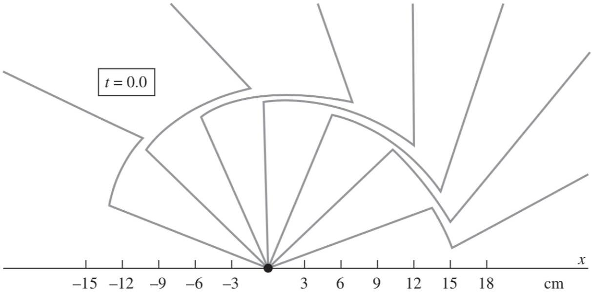
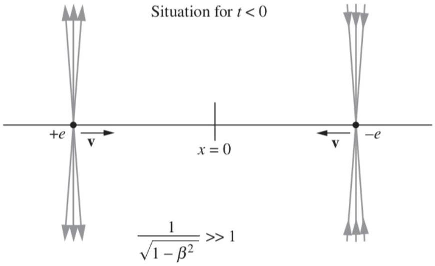
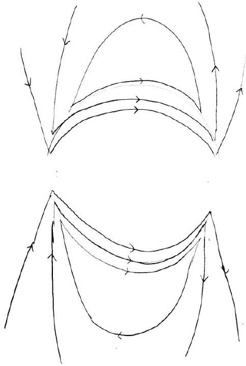

[4] Problem 9. Consider an electromagnetic wave of the form
$$
\mathbf { E } ( z , t ) = E _ { 0 } \cos ( k z - \omega t ) \hat { \mathbf { x } } , \quad \mathbf { B } ( z , t ) = B _ { 0 } \cos ( k z - \omega t ) \hat { \mathbf { y } } .
$$
As usual, you may work in units where $c = 1$.
    (a) What do Maxwell's equations imply about the relation between $E _ { 0 }$ and $B _ { 0 }$, and $k$ and $\omega$ ?
    (b) Now consider a frame moving with velocity $v$ along the $\hat { \mathbf { z } }$ direction. Show that the electromagnetic wave continues to have the same basic functional form for $\mathbf { E } ^ { \prime } \left( z ^ { \prime } , t ^ { \prime } \right)$ and $\mathbf { B } ^ { \prime } \left( z ^ { \prime } , t ^ { \prime } \right)$, but with new parameters $E _ { 0 } ^ { \prime } , B _ { 0 } ^ { \prime } , k ^ { \prime }$, and $\omega ^ { \prime }$. Using these results, show that the energy density of the wave is smaller by a factor of $( 1 - v ) / ( 1 + v )$.
    (c) The energy of a photon in an electromagnetic wave of angular frequency $\omega$ is $E = \hbar \omega$. Show that for a finite-sized electromagnetic wave, the initial and boosted frames agree on the number of photons. This was one of the hints Einstein used to conclude light was made of photons.
    (d) Now consider another question Einstein pondered: what does the light wave look like if we try to "catch up" with it, taking $v \rightarrow c$ ? Is this consistent with the invariants of problem 8?

Solution. (a) From E7, we know that $E _ { 0 } = B _ { 0 }$ and $k = \omega$.

(b) The electromagnetic field only has perpendicular components. Using the field transformations,
$$
\mathbf { E } ^ { \prime } \left( z ^ { \prime } , t ^ { \prime } \right) = \gamma \left( E _ { 0 } \cos ( k z - \omega t ) - v B _ { 0 } \cos ( k z - \omega t ) \right) \hat { \mathbf { x } } .
$$
In units where $c = 1$, we have $E _ { 0 } = B _ { 0 }$ for an electromagnetic wave, so this simplifies to
$$
\mathbf { E } ^ { \prime } \left( z ^ { \prime } , t ^ { \prime } \right) = \gamma ( 1 - v ) E _ { 0 } \cos ( k z - \omega t ) \hat { \mathbf { x } } .
$$
Repeating the reasoning for the magnetic field, we conclude
$$
E _ { 0 } ^ { \prime } = \gamma ( 1 - v ) E _ { 0 } , \quad B _ { 0 } ^ { \prime } = \gamma ( 1 - v ) B _ { 0 }
$$
which still obeys $E _ { 0 } ^ { \prime } = B _ { 0 } ^ { \prime }$ as expected. Thus, the energy density is reduced by a factor of
$$
\gamma ^ { 2 } ( 1 - v ) ^ { 2 } = \frac { 1 - v } { 1 + v }
$$
as stated. To find $k ^ { \prime }$ and $\omega ^ { \prime }$, we can simply apply the Lorentz transformations,
$$
k z - \omega t = k \left( \gamma \left( z ^ { \prime } + v t ^ { \prime } \right) \right) - \omega \left( \gamma \left( t ^ { \prime } + v z ^ { \prime } \right) \right) = \gamma ( k - \omega v ) z ^ { \prime } - \gamma ( \omega - k v ) t ^ { \prime } .
$$
This indicates that $\mathbf { E } ^ { \prime } \left( z ^ { \prime } , t ^ { \prime } \right)$ is still a plane wave proportional to $\cos \left( k ^ { \prime } z ^ { \prime } - \omega ^ { \prime } t ^ { \prime } \right)$, where
$$
k ^ { \prime } = \gamma ( k - \omega v ) , \quad \omega ^ { \prime } = \gamma ( \omega - k v )
$$
which is of course just the statement that $( \omega , \mathbf { k } )$ is a four-vector, derived in R1. Using the fact that $\omega = k$, we conclude
$$
k ^ { \prime } = \omega ^ { \prime } = \gamma ( 1 - v ) \omega = \sqrt { \frac { 1 - v } { 1 + v } } \omega
$$
which is of course just the usual Doppler shift.

(c) The number of photons is the ratio of the total energy in the wave to the energy of each photon. Since the energy of each photon is reduced by a factor of $\sqrt { ( 1 - v ) / ( 1 + v ) }$ in the boosted frame, we need to show that the total energy of the wave is reduced by the same factor. This results from the combination of two effects.
First, we know the energy density is reduced by the factor $( 1 - v ) / ( 1 + v )$. Second, the wavenumber is reduced by a factor of $\sqrt { ( 1 - v ) / ( 1 + v ) }$, which means the wavelength is increased by $\sqrt { ( 1 + v ) / ( 1 - v ) }$. Since the number of wavelengths contained in the wave is the same in every reference frame, this means the volume of the wave is increased by $\sqrt { ( 1 + v ) / ( 1 - v ) }$. Multiplying these factors gives the desired result.
(d) In this case we have $E _ { 0 } ^ { \prime } , B _ { 0 } ^ { \prime } , \omega ^ { \prime } , k ^ { \prime } \rightarrow 0$, so the light wave disappears! That is, you can never "catch up" to a light wave. This result is completely compatible with the invariants from part (a) of problem 8, which both vanish for a plane electromagnetic wave. The invariant in part
    (c) vanishes as well, since $\mathcal { E } = | \mathbf { S } |$ for a plane wave.

Idea 2
If a uniformly moving point charge suddenly stops moving, then the field outside a spherical shell, centered at the charge when it stopped moving, expanding at speed $c$, is precisely that calculated in problem 1. The same occurs if the point charge suddenly changes its velocity; information about the change only propagates at $c$.

[1] Problem 10 (Purcell 5.18). In the figure below, you see an electron at time $t = 0$ and the associated electric field at that instant.

(a) Describe what has been going on, as quantitatively as you can.
(b) Where was the electron at the time $t = - 0.75 \mathrm {~ns}$ ?

Solution. (a) Clearly, the particle isn't moving at $t = 0$. Since there's a kink in the field lines at $r = 15 \mathrm {~cm}$, it must have quickly stopped at $t = - r / c = - 0.5 \mathrm {~ns}$, since the speed of light is $c = 30 \mathrm {~cm} / \mathrm { ns }$. We also see that the field lines outside this shell are straight, and point towards the location $x = 12 \mathrm {~cm}$. This implies that shortly before the charge stopped, it was moving with constant velocity $v = | x / t | = 24 \mathrm {~cm} / \mathrm { ns } = 0.8 c$.

(b) By combining the results from (a), it must have been at $x = - ( 24 \mathrm {~cm} / \mathrm { ns } ) ( 0.25 \mathrm {~ns} ) = - 6 \mathrm {~cm}$.
[2] Problem 11 (Purcell 5.19). People often wonder what would happen if an electric charge instantly appeared or vanished. However, this is impossible, because as discussed in E7, Maxwell's equations imply that charge must be conserved. Assuming otherwise will just lead to mathematical contradictions, like $0 = 1$.

Here's a related scenario that actually can happen. We consider two highly relativistic particles with opposite charge approaching the origin.

They collide at the origin at time $t = 0$ and remain there as a neutral entity. Sketch the field lines at some time $t > 0$.

Solution. Before the charges collide, we have a kind of distorted dipole field. After they collide, we still have a dipole field at $r > c t$, with the positive charge on the right and the negative charge on the left. For $r < c t$ the field is zero, and at the shell $r \approx c t$ there is a thin shell that connects up the field lines. This transverse pulse of radiation steadily moves outward over time.

Some crackpots claim that particle annihilation is impossible because that would imply the electric field has to "instantly vanish", contradicting relativity. As you can see, that's not the case. A spherical shell, corresponding to a pulse of radiation, travels outward at the speed of light. The electric field only vanishes inside the expanding shell.

[3] Problem 12. Work through the derivation of the Larmor formula in Appendix H of Purcell.

[3] Problem 13 (Purcell H.4). The Larmor formula only applies to particles moving nonrelativistically. To get a result valid for faster particles, we can simply transform into an inertial frame $F ^ { \prime }$ where the particle is nonrelativistic, apply the Larmor formula, then transform back to the lab frame.
    (a) Consider a relativistic electron moving perpendicularly to a magnetic field B. Defining the radiation power as $P _ { \text {rad } } = d E / d t$, find $P _ { \text {rad } } ^ { \prime }$, the power in a frame instantaneously comoving with the electron.
    (b) Argue that in this context, $P _ { \text {rad } } = P _ { \text {rad } } ^ { \prime }$, and conclude that
$$
P _ { \mathrm { rad } } = \frac { \gamma ^ { 2 } v ^ { 2 } e ^ { 4 } B ^ { 2 } } { 6 \pi \epsilon _ { 0 } m ^ { 2 } c ^ { 3 } } .
$$
Thus, the power increases rapidly as $v \rightarrow c$. Incidentally, a "relativistic" way to write the general result is
$$
P _ { \mathrm { rad } } = \frac { q ^ { 2 } } { 6 \pi \epsilon _ { 0 } c ^ { 3 } } \left( \frac { 1 } { m } \frac { d p ^ { \mu } } { d \tau } \right) ^ { 2 }
$$
which clearly reduces to the Larmor formula in the nonrelativistic limit.
    (c) This radiation is also called synchrotron radiation. Qualitatively, how does its angular distribution differ from radiation from an accelerating nonrelativistic charge?

Solution. (a) In the frame comoving with the electron, it's not relativistic, so we can just apply the Larmor formula,

$$
P _ { \mathrm { rad } } ^ { \prime } = \frac { e ^ { 2 } a ^ { \prime 2 } } { 6 \pi \epsilon _ { 0 } c ^ { 3 } } .
$$

In this frame, the only force is the electric force, so

$$
a ^ { \prime } = \frac { e E ^ { \prime } } { m } = \frac { e \gamma v B } { m } .
$$

Putting it together, we conclude

$$
P _ { \mathrm { rad } } ^ { \prime } = \frac { e ^ { 4 } \gamma ^ { 2 } v ^ { 2 } B ^ { 2 } } { 6 \pi \epsilon _ { 0 } m ^ { 2 } c ^ { 3 } } .
$$

(b) We have $P _ { \text {rad } } ^ { \prime } = d E ^ { \prime } / d t ^ { \prime }$. Now, in the primed frame, the electron is just accelerating transversely, with no component along the unprimed frame's v. Thus, when we Lorentz transform back to the unprimed frame, we simply get $d E = \gamma d E ^ { \prime }$ and $d t = \gamma d t ^ { \prime }$. The $\gamma$ factors cancel out, giving the desired result.
(c) In the primed frame, the radiation power comes out with a wide angular distribution, but none of it comes out along the direction of motion of the charge, and most of it comes out roughly transverse to the motion. But when we boost back to the original frame, where the charge is moving very quickly, the radiation's direction gets a big component along the charge's direction of motion. Thus, almost all the radiation is "beamed" in a narrow cone along the charge's motion (as we saw in R1), though there still is zero radiation intensity exactly along the charge's direction.

Remark: Gravitoelectromagnetism
As mentioned in E1, there's a close analogy between electrostatic fields, which are sourced by charge density $\rho _ { e }$, and gravitational fields, which are sourced by energy density $\rho$. If you apply the analogy and run the same arguments as in Purcell, you would expect there to be a "gravitomagnetic" field, which is sourced by momentum density $\mathbf { J } = \rho \mathbf { v }$. That's indeed correct! In the theory of gravitoelectromagnetism, the gravitoelectric and gravitomagnetic fields $\mathbf { E } _ { g }$ and $\mathbf { B } _ { g }$ satisfy

$$
\nabla \cdot \mathbf { E } _ { g } = 4 \pi G \rho , \quad \nabla \cdot \mathbf { B } _ { g } = 0 , \quad \nabla \times \mathbf { E } _ { g } = - \dot { \mathbf { B } } _ { g } , \quad \nabla \times \mathbf { B } _ { g } = 4 \pi G \mathbf { J } + \dot { \mathbf { E } } _ { g }
$$

under one common convention. Given this definition, the force on a point mass is

$$
\mathbf { F } = m \left( \mathbf { E } _ { g } + 4 \mathbf { v } \times \mathbf { B } _ { g } \right) .
$$

From this you can draw some interesting conclusions. For example:

- Two masses moving parallel to each other will have an extra attraction due to the gravitomagnetic force.
- A rotating object will produce a gravitomagnetic field which can cause gyroscopes to precess; this is called the Lense-Thirring, or frame dragging effect, which has been measured by satellites such as Gravity Probe B. (There is also a significantly larger "geodetic" effect caused by the curvature of spacetime around the Earth, but this isn't captured within gravitoelectromagnetism.)
- A cylinder which starts to rotate will induce a gravitoelectric field inside, by Faraday's law. This will cause masses inside the cylinder to start rotating a small amount in the same direction as the cylinder. (This is also sometimes called frame dragging.)

Now you might be puzzled by two things: first, how does gravitoelectromagnetism relate to general relativity, and second, why is there an extra 4 in the force? Well, the truth is that Purcell's arguments don't really work for gravity. These arguments crucially depend on electric charge $Q = \int \rho _ { e } d \mathbf { x }$ being Lorentz invariant, which in our more sophisticated language was necessary to ensure $j ^ { \mu } = \left( \rho _ { e } , \rho _ { e } \mathbf { v } \right)$ is a four-vector. However, the total energy $E = \int \rho d \mathbf { x }$ is not Lorentz invariant - instead it's itself a component of a four-vector. Thus, $( \rho , \rho \mathbf { v } )$ isn't a four-vector, so none of the arguments really work: the theory of gravitoelectromagnetism is just not Lorentz invariant at all.

Instead, gravitoelectromagnetism is properly derived as a limiting case of general relativity, valid when all the masses involved are moving slowly, $v \ll c$. The fact that general relativity is a theory of a rank 2 tensor field, the metric $g _ { \mu \nu }$, is responsible for the extra factors of 2 above. Even though it's only approximately true, gravitoelectromagnetism is a very useful tool for analyzing precision tests of general relativity, since it's much easier to calculate with.

However, there's also a lot of nonsense written about gravitomagnetism, both on the internet and in low-quality academic journals. The problem is that the effects are very small, which means they usually don't matter, but they're also a bit subtle, which makes it easy to make a

mistake and overestimate their importance. For example, many have tried to use gravitomagnetism to explain the anomalous rotation of galaxies (typically ascribed to dark matter), even though, using just the basic equations above, you can show that the gravitomagnetic force is $( v / c ) ^ { 2 }$ times smaller than the usual gravitational force. Since galaxies rotate at $v / c \sim 10 ^ { - 3 }$, the effect is about $10 ^ { 6 }$ times too small to fix the problem.

## 2 Charges in Fields

[5] Problem 14. IPhO 1991, problem 2. A problem on the subtle relativistic "hidden momentum".
Solution. See the official solutions. There's a minor typo, as noted here, though it doesn't affect any answers. This remarkably subtle effect was discovered in the 1960s by Shockley and James; Shockley also won a Nobel prize for the transistor. For nice further discussion, see this paper.

Idea 3: Scalar and Vector Potentials
In E1, we learned about the electric (or "scalar") potential $\phi ( \mathbf { x } )$, which obeys $\mathbf { E } = - \nabla \phi$. More generally, the scalar potential can depend on both space and time, as can the vector potential $\mathbf { A } ( \mathbf { x } , t )$, and these two quantities yield the electric and magnetic fields by

$$
\mathbf { E } = - \nabla \phi - \frac { \partial \mathbf { A } } { \partial t } , \quad \mathbf { B } = \nabla \times \mathbf { A } .
$$

Olympiad problems rarely require thinking about the vector potential, but it's essential to formulate the following idea.

Idea 4: Canonical Momentum
Noether's theorem yields a conserved quantity for every symmetry. If a system is symmetric under time translations, then its energy is conserved. Spatial translational symmetry yields momentum conservation, and rotational symmetry yields angular momentum conservation.

We won't prove Noether's theorem, but we'll illustrate it for a nonrelativistic particle of mass $m$ and charge $q$. First, if $\phi$ and A are both time-independent, then the conserved energy is

$$
E = \frac { 1 } { 2 } m v ^ { 2 } + q \phi .
$$

This is quite familiar. Note that $\mathbf { A }$ doesn't appear because in this case, the only role of $\mathbf { A }$ is to determine the magnetic field, which does no work.

As for space-translational symmetry, if $\phi$ and $\mathbf { A }$ are both space-independent, then the conserved momentum, called the "canonical" momentum, is

$$
\mathbf { p } = m \mathbf { v } + q \mathbf { A } .
$$

This is less familiar, so let's check it explicitly. Since we have assumed $\phi$ and A are both space-independent, we simply have $\mathbf { B } = 0$ and $\mathbf { E } = - \partial \mathbf { A } / \partial t$, so

$$
\frac { d \mathbf { p } } { d t } = m \mathbf { a } - q \mathbf { E } = 0
$$

as desired. This tells us that $q \mathbf { A }$ is like a "potential momentum", similar to how $q \phi$ is a potential energy. (Since the canonical momentum is such an important property, it is usually denoted by p whenever it's in play, while the Newtonian "mechanical"/"kinetic" momentum is demoted to $\boldsymbol { \pi } = m \mathbf { v }$.) However, in this case, the tool of canonical momentum doesn't tell us much we didn't already know.

Canonical momentum becomes useful in situations with only partial translational symmetry. For example, suppose that $\phi$ and A are both independent of $x$, but not $y$ and $z$. Then the fields can be quite complicated, as can the particle's motion, but $p _ { x }$ will still be conserved!

In addition, the canonical momentum is the building block used for more complex situations. For example, if $\phi$ and $\mathbf { A }$ are both invariant under rotations about the $z$-axis, then

$$
J _ { z } = ( \mathbf { r } \times \mathbf { p } ) \cdot \hat { \mathbf { z } }
$$

is conserved. Moreover, the adiabatic invariant of M4 must be written in terms of the canonical momentum. For example, for periodic motion along the $x$-axis, it is

$$
I = \oint p _ { x } d x
$$

while for periodic circular motion in the $x y$ plane, it is

$$
I = \oint J _ { z } d \theta
$$

Finally, though all the following problems will assume the particles are nonrelativistic, the results above go through unchanged in relativistic mechanics provided that $\boldsymbol { \pi } = m \mathbf { v }$ is replaced with the relativistic momentum $\gamma m \mathbf { v }$.
[4] Problem 15. Let's check some of the statements made above in a simple case. Consider a situation with zero electric field and a constant uniform magnetic field $\mathbf { B } = B \hat { \mathbf { z } }$.

(a) Show that this situation can be described with
$$
\phi = 0 , \quad \mathbf { A } = \frac { B } { 2 } ( x \hat { \mathbf { y } } - y \hat { \mathbf { x } } ) = \frac { B r } { 2 } \hat { \boldsymbol { \theta } }
$$
which is symmetric under translations along the $z$-axis and rotations about the $z$-axis.
(b) The symmetries of this problem tell us that $p _ { z }$ and $J _ { z }$ are conserved. Conservation of $p _ { z } = \pi _ { z }$ is obvious, because there are no forces in the $z$-direction. As for $J _ { z }$, find an explicit expression for it, in terms of the ordinary angular momentum $L _ { z } , B$, and $r$.

Back in E4, we encountered IPhO 1996, problem 2, which instructs the reader to solve a tricky problem by pulling out a magical conserved quantity; it's just $J _ { z }$. Next, let's suppose the magnetic field's magnitude varies in time, corresponding to

$$
\phi = 0 , \quad \mathbf { A } = \frac { B ( t ) r } { 2 } \hat { \boldsymbol { \theta } } .
$$

Of course, the changing magnetic field is accompanied by an induced electric field, as $\mathbf { E } = - \partial \mathbf { A } / \partial t$.

(c) Suppose that $B$ is initially equal to $B _ { 0 }$, and the particle is orbiting in a circle of radius $r _ { 0 }$ about the $z$-axis. The field is slowly changed to $B _ { 1 }$. What is the new radius $r _ { 1 }$ of the orbit?
(d) What if instead the field is very quickly changed to $B _ { 1 }$ ?
(e) Even more generally, let's suppose the field is $\mathbf { B } = B ( r , t ) \hat { \mathbf { z } }$, which can depend on both time and the distance $r$ to the $z$-axis. Assuming the field changes slowly, find a compact expression for $J _ { z }$ in terms of $r$, the value of $B$ at the particle's radius, and $B _ { \mathrm { av } }$, the average value of $B$ within the circle formed by the particle. This will immediately yield the answer to the "betatron" example in E4.

Solution. (a) This follows immediately from evaluating the curl of A, either in Cartesian or cylindrical coordinates.

(b) The $z$-component of the canonical angular momentum is
$$
J _ { z } = ( \mathbf { r } \times ( m \mathbf { v } + q \mathbf { A } ) ) \cdot \hat { \mathbf { z } } = L _ { z } + \frac { q B r ^ { 2 } } { 2 } .
$$
(c) Because the field is slowly changed, the particle remains in a circular orbit centered on the $z$-axis, so we can simply use the conservation of $J _ { z }$ to find the answer. It is
$$
J _ { z } = - m v r + \frac { q B r ^ { 2 } } { 2 }
$$
where the minus sign is because the two contributions to $J _ { z }$ have opposite signs. On the other hand, for circular motion we have $m v ^ { 2 } / r = q v B$, which tells us that the two terms are simply proportional to each other. So in this case, we just have
$$
J _ { z } = - \frac { q B r ^ { 2 } } { 2 }
$$
and the answer to the question is
$$
r _ { 1 } = r _ { 0 } \sqrt { B _ { 0 } / B _ { 1 } } .
$$
We could also have gotten to this conclusion using the adiabatic theorem, but it's not any different, since here $I = 2 \pi J _ { z }$. And of course, you can also derive it directly using Newton's laws, in a manner similar to the betatron example in E4.
(d) When the field is quickly changed, the particle simply receives a sharp impulse. The final orbit is still a circle, but it won't be centered on the $z$-axis. Conservation of $J _ { z }$ during the impulse gives
$$
m \Delta v = \frac { q r _ { 0 } \Delta B } { 2 } = \frac { q r _ { 0 } } { 2 } \left( B _ { 1 } - B _ { 0 } \right)
$$
which of course can also be deduced by Newton's laws. The final speed is
$$
v ^ { \prime } = \frac { q B _ { 0 } r _ { 0 } } { m } + \Delta v = \frac { q r _ { 0 } } { m } \frac { B _ { 0 } + B _ { 1 } } { 2 }
$$
which is related to the final radius by $v ^ { \prime } = q B _ { 1 } r _ { 1 } / m$. We thus conclude
$$
r _ { 1 } = r _ { 0 } \frac { B _ { 0 } + B _ { 1 } } { 2 B _ { 1 } } .
$$
For a more challenging problem which uses similar ideas, see Physics Cup 2017, problem 3.

(e) In this case, we have
$$
J _ { z } = - m v r + q r A _ { \theta }
$$
where $A _ { \theta }$ is independent of $\theta$. To evaluate this, we note that
$$
A _ { \theta } = \frac { 1 } { 2 \pi } \int _ { 0 } ^ { 2 \pi } A _ { \theta } d \theta = \frac { 1 } { 2 \pi r } \oint _ { C } \mathbf { A } \cdot d \mathbf { r } = \frac { \Phi _ { B } ( r ) } { 2 \pi r } = \frac { r } { 2 } B _ { \mathrm { av } } ( r ) .
$$
where $C$ is the particle's momentary circular orbit, and we used Stokes' theorem and then the definition of $B _ { \mathrm { av } }$. We still have $m v r = q B ( r ) r ^ { 2 }$, so
$$
J _ { z } = q r ^ { 2 } \left( - B + \frac { B _ { \mathrm { av } } } { 2 } \right) .
$$
If the quantity in parentheses doesn't vanish, then conservation of $J _ { z }$ implies that $r$ has to change as the field is changed. As we found in E4 using Newton's laws, $r$ can stay the same if $B = B _ { \mathrm { av } } / 2$, in which case $J _ { z }$ simply vanishes.
