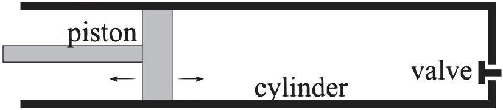
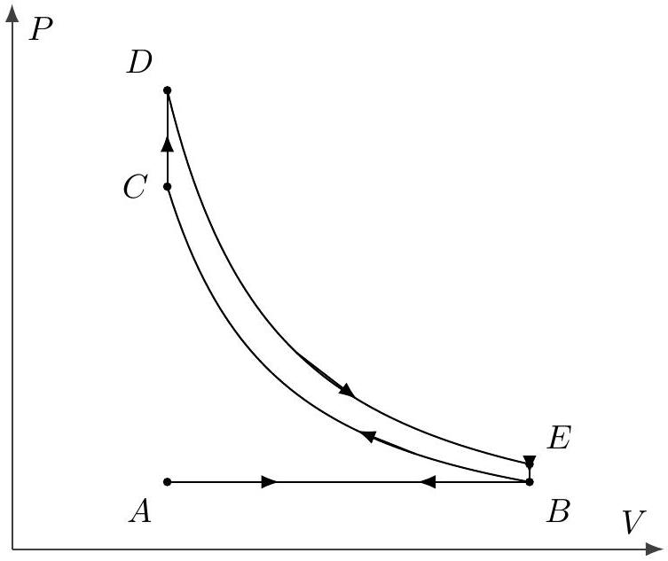
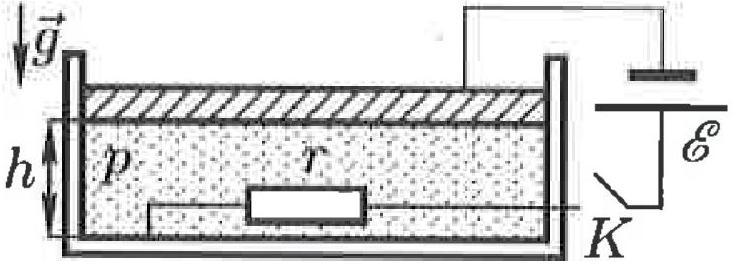
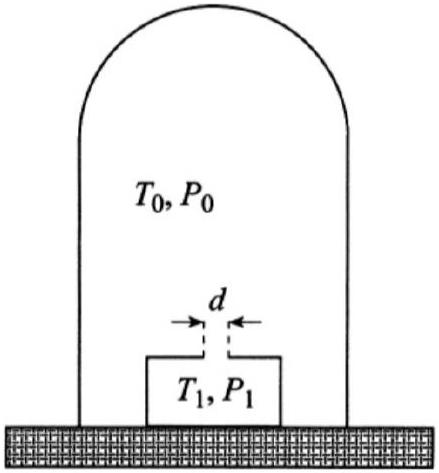

## Thermodynamics I

For an introduction to basic thermodynamics at the right level, see chapter 2 of Wang and Ricardo, volume 2. For more detail, see chapters 1-9, 19, and 20 of Blundell and Blundell. For interesting discussion, see chapters I-39 through I-43 of the Feynman lectures. There is a total of 78 points.

## 1 Ideal Gases and Heat Engines

Questions about ideal gas heat engines are straightforward. They were very common on the USAPhO a decade ago, though problems today tend to require a deeper understanding of thermodynamics. Nonetheless, it's fundamental material that you should know.

Idea 1
The ideal gas law comes in a few common forms,

$$
P V = n R T = N k _ { B } T , \quad P = \frac { \rho R T } { \mu } = \frac { \rho k _ { B } T } { m } .
$$

Here, Avogadro's number is $N _ { A } = N / n$, so that $R = N _ { A } k _ { B } , m$ is the mass of a gas molecule, and $\mu = N _ { A } m$ is the molar mass. The first law of thermodynamics says

$$
d U = d W + d Q , \quad d W = - P d V
$$

The heat capacity at constant volume is defined so that $d U = n C _ { V } d T$ at constant volume. As a result, if we define $C _ { P } = C _ { V } + R$, we have

$$
Q = \left\{ \begin{array} { l l }
n C _ { V } \Delta T & \text { at constant volume } \\
n C _ { P } \Delta T & \text { at constant pressure }
\end{array} \quad C _ { V } = \left\{ \begin{array} { l l }
3 R / 2 & \text { monatomic } \\
5 R / 2 & \text { diatomic } \\
3 R & \text { polyatomic }
\end{array} . \right. \right.
$$

Using the first law, we can derive the results

$$
W = - n R T \log \frac { V _ { f } } { V _ { i } } \text { for isothermal expansion }
$$

and

$$
P V ^ { \gamma } = \mathrm { constant } \text { for adiabatic expansion, } \quad \gamma = C _ { P } / C _ { V } ,
$$

both of which you should easily be able to rederive.

Idea 2
For a cyclic process that takes in heat $Q _ { \text {in } }$ from a hot reservoir at temperature $T _ { H }$ and outputs heat $Q _ { \text {out } }$ to a cold reservoir at temperature $T _ { C }$, the work done is $W = Q _ { \text {in } } - Q _ { \text {out } }$. The efficiency $\eta = W / Q _ { \text {in } }$ is maximized by the Carnot engine, for which $\eta = 1 - T _ { C } / T _ { H }$.

Remark
The study of thermodynamics arose from efforts in the early $19 { } ^ { \text {th } }$ century to understand the efficiency of steam engines. However, Carnot's ideal reversible engine doesn't resemble practical engines, since the isothermal steps take place at zero temperature difference, and therefore take infinite time. Suppose the isothermal steps take place at temperature $T _ { 1 } < T _ { H }$ and $T _ { 2 } > T _ { C }$, and that the rate of heat flow is proportional to the temperature difference. This engine isn't reversible, but it does yield a nonzero average power. When $T _ { 1 }$ and $T _ { 2 }$ are set to maximize the average power, it turns out the efficiency is simply $1 - \sqrt { T _ { C } / T _ { H } }$, and this expression more closely matches the efficiencies of real engines.

[2] Problem 1. Derive the Carnot efficiency using the fact that (a) the engine is reversible, so a complete cycle leaves the entropy of the universe unchanged, or (b) directly from idea 1.
Solution. (a) At the end of a heat engine cycle, the working fluid comes back to its original state, so its entropy is unchanged. When an engine is reversible, it also leaves the entropy of the surroundings unchanged, so that the total entropy of the universe doesn't go up. (If it did go up, then we wouldn't be able to reverse the cycle, by the second law of thermodynamics.)
The increase in entropy of the cold reservoir is $Q _ { \text {out } } / T _ { C }$, while the decrease in entropy of the hot reservoir is $Q _ { \text {in } } / T _ { H }$. Setting these equal to each other, we find
$$
\eta = \frac { Q _ { \text {in } } - Q _ { \text {out } } } { Q _ { \text {in } } } = 1 - \frac { T _ { C } } { T _ { H } }
$$
as desired.
    (b) There are a lot of ways to do this, but we'll show one that will be useful later. Note that during the heating and cooling steps, we have
$$
d Q = d U - d W = n C _ { V } d T + P d V
$$
Using the ideal gas law, we have
$$
d T = \frac { 1 } { n R } ( P d V + V d P )
$$
and plugging this in gives
$$
d Q = \frac { C _ { P } } { R } P d V + \frac { C _ { V } } { R } V d P
$$
Dividing by $T$ and using the ideal gas law again, we have
$$
\frac { d Q } { T } = n C _ { P } \frac { d V } { V } + n C _ { V } \frac { d P } { P } = n C _ { V } \frac { d \left( P V ^ { \gamma } \right) } { P V ^ { \gamma } } .
$$
Therefore, the quantity $\Delta Q / T$ for the heating and cooling steps only depends on the change of the quantity $P V ^ { \gamma }$. This is equal and opposite for those steps, since $P V ^ { \gamma }$ stays the same in the adiabatic steps, which means $Q _ { \text {in } } / T _ { H } = Q _ { \text {out } } / T _ { C }$. The derivation then continues as in part (a). (Of course, what we've done here is essentially just deriving the expression for the entropy, up to constants, without explicitly calling it that. This will be explored in more detail in T2.)

Remark
The most common mistake students make in this problem set is forgetting to account for the work done by the atmosphere.
[3] Problem 2. USAPhO 2009, problem A4.
[3] Problem 3. USAPhO 2011, problem A1.
If you want further practice, see USAPhO 1998 A1, 2008 A2, and 2010 A3. This kind of routine question should be easy. Some competitions try to make them harder by making the cycles more complicated (some truly crazy ones have been considered in the literature), but this is contrived and doesn't really require much insight. Instead, we'll move on to slightly subtler problems.

Example 1
A cold room is initially at temperature $T$. The heater is turned on, raising the temperature to $T + \Delta T$. Assuming the thermal insulation is ideal, at most what fraction of the energy released by the heater stays in the room?

Solution
As long as the room has any contact with the outside at all, air will leak out to set the pressure equal to atmospheric pressure. Its volume also stays the same, so by the ideal gas law, $N k _ { B } T$ stays the same, but this is proportional to the internal energy of the air. Thus, at most 0\% of the energy released by the heater stays in the room; the increase in average energy per molecule is exactly compensated by the decrease in the number of molecules. If there are thermal losses, the total internal energy of the air in the room actually decreases.

Example 2
A thermally isolated cylinder is divided into two compartments by a thermally conductive piston. Initially, the piston divides the cylinder into two compartments, A and B, of equal volume $V / 2$ and temperature $T _ { 0 }$. One mole of monatomic gas is in each compartment. An external agent slowly moves the piston to the side until the volumes are V/3 and 2V/3. Throughout this process, the temperature remains uniform. What is the final temperature?

Solution
The tricky thing about this problem is that the pressures in the two compartments aren't equal; this is possible because the external agent is holding the piston. Instead, the temperatures are made equal by heat conduction. The work done by the agent is

$$
d W = - p _ { A } d V _ { A } - p _ { B } d V _ { B } = - R T \left( \frac { d V _ { A } } { V _ { A } } + \frac { d V _ { B } } { V _ { B } } \right) .
$$

On the other hand, this is also equal to the increase in energy,

$$
d W = d U = \frac { 3 } { 2 } n R d T = 3 R d T
$$

Combining the two gives a differential equation,

$$
3 \int \frac { d T } { T } = - \int \frac { d V _ { A } } { V _ { A } } - \int \frac { d V _ { B } } { V _ { B } }
$$

which means the final temperature $T _ { f }$ obeys

$$
3 \log \frac { T _ { f } } { T _ { 0 } } = - \log \frac { 2 } { 3 } - \log \frac { 4 } { 3 } = \log \frac { 9 } { 8 } , \quad T _ { f } = \frac { 3 ^ { 2 / 3 } } { 2 } T _ { 0 } .
$$

[3] Problem 4 (EstPhO 2002). In this problem we consider the combustion cycle of a car engine. Model the engine as a cylinder with a piston on the left and a valve on the right.

The steps of the process are as follows.
    1. Gas entry: the piston moves from the rightmost position to the leftmost; fresh air comes in through the valve and fills the cylinder.
    2. Pressure increase: the valve closes, and the piston quickly moves back to the rightmost position.
    3. Work: fuel is injected in the cylinder and is ignited; you may model this process as occurring instantaneously. Then the gas starts expanding and pushes the piston to the leftmost position.
    4. Gas disposal: the valve is opened. The piston is pushed to the right at constant pressure until it reaches its rightmost position, and the process then repeats.

Neglect friction and heat conduction, suppose the number of fuel molecules is negligible compared to the number of air molecules, and treat air as a diatomic ideal gas. Let $k$ be the ratio of the maximum and minimum volumes of the cylinder. Draw the cycle on a $P V$ diagram and find its efficiency.

Solution. This problem is a bit trickier because it's less clear how to treat the steps. Of course, the second step is just an adiabatic compression, but the third is subtle. Since the number of fuel molecules is negligible, burning the fuel essentially just rapidly deposits energy into the system, raising its temperature. Thus, the first half of the third step is an isochoric (constant volume) heating; the second half of the third step is an adiabatic expansion.

Finally, the fourth and first steps should be regarded as one unit. When the valve is opened, the gas in the cylinder quickly falls to atmospheric pressure, as it freely expands out. Then the piston moves to the right, doing work $P _ { \text {atm } } \Delta V$. In the first step, the piston moves to the left, pulling in fresh air and doing work $- P _ { \text {atm } } \Delta V$. So the first half of the fourth step has an isochoric pressure decrease. The second half of the fourth step, and the first step, do no net work, and function solely to pull in fresh air.

This tells us what's going on, but where are the heat reservoirs? The heating step occurs when the fuel is burned, so the burnt fuel itself is effectively the hot reservoir. The gas is cooled by letting

it leave and replacing it with new gas, so in some sense the atmosphere is the cold reservoir. But unlike the other examples of heat engines above, we use a different set of gas every cycle.

The $P V$ diagram is shown below.

The first, second, third, fourth bullet steps correspond to $\mathrm { AB } , \mathrm { BC } , \mathrm { CD } + \mathrm { DE }$, and $\mathrm { EB } + \mathrm { BA }$ respectively. Since BC and DE are adiabats $\left( P _ { E } V _ { B } ^ { \gamma } = P _ { D } V _ { A } ^ { \gamma } \right.$ and $\left. P _ { C } V _ { A } ^ { \gamma } = P _ { B } V _ { B } ^ { \gamma } \right)$, the net work is

$$
W = \oint p d V = \frac { P _ { D } V _ { A } - P _ { E } V _ { B } } { \gamma - 1 } + \frac { P _ { B } V _ { B } - P _ { C } V _ { A } } { \gamma - 1 } .
$$

The heat from the fuel, $Q$, can be found with the internal energy change from C to D:

$$
Q = C _ { V } n \left( T _ { D } - T _ { C } \right) = \frac { C _ { V } } { R } V _ { A } \left( P _ { D } - P _ { C } \right) = \frac { \left( P _ { D } - P _ { C } \right) V _ { A } } { \gamma - 1 } .
$$

Thus the efficiency can be found with $\epsilon = W / Q$ and $P _ { E } = P _ { D } k ^ { - \gamma } , P _ { B } = P _ { C } k ^ { - \gamma }$,

$$
\epsilon = \frac { W } { Q } = \frac { \left( P _ { D } - P _ { C } \right) V _ { A } - \left( P _ { E } - P _ { B } \right) V _ { B } } { \left( P _ { D } - P _ { C } \right) V _ { A } } = 1 - k ^ { 1 - \gamma } .
$$

For diatomic gas, $\gamma = 7 / 5$, so $\epsilon = 1 - 1 / k ^ { 2 / 5 }$.
[3] Problem 5 (IZhO 2022). One mole of ideal monatomic gas initially has volume $V _ { 0 } = 1 \mathrm {~m} ^ { 3 }$ and $P _ { 0 } = 10 ^ { 5 } \mathrm {~Pa}$. It then undergoes a quasistatic process. At every moment in this process, the rate of work done is proportional to the rate of change of the gas's internal energy. At the end of the process, the gas has volume $4 V _ { 0 }$ and pressure $P _ { 0 } / 2$. Find the total work done by the gas.

Solution. This problem is good practice for working with the laws of thermodynamics directly. Let $\eta = d W / d U$ be the constant ratio of work to internal energy change. By combining the results $d W = P d V , d U = ( 3 / 2 ) R d T$, and $P V = R T$, and following essentially the same derivation as that for an adiabatic process, we find

$$
- \frac { d P } { P } = \left( 1 - \frac { 2 } { 3 \eta } \right) \frac { d V } { V }
$$

which implies

$$
P \propto V ^ { ( 2 / 3 \eta ) - 1 } .
$$

In other words, this is like an adiabatic process, but with a different effective value of $\gamma$. Using the given initial and final conditions, we have $\eta = 4 / 3$, so that $P \propto V ^ { - 1 / 2 }$. Thus, the gas does work

$$
W = \int _ { V _ { 0 } } ^ { 4 V _ { 0 } } P d V = \int _ { V _ { 0 } } ^ { 4 V _ { 0 } } P _ { 0 } \left( \frac { V _ { 0 } } { V } \right) ^ { 1 / 2 } d V = 2 P _ { 0 } V _ { 0 } = 2 \times 10 ^ { 5 } \mathrm {~J}
$$

This problem might look contrived, but "polytropic" processes where $P V ^ { \beta }$ is constant, for a general value of $\beta$, are commonly considered in engineering thermodynamics.

In physics we often assume processes are adiabatic, $\beta = \gamma$, but in real life nothing is ever an ideal adiabatic process. Instead, engineers parametrize this by allowing $\beta$ to be general, and measuring its value. As a simple concrete example, if the chamber containing the gas also contains some dirt, in thermal equilibrium of the gas, that dirt contributes to the system's heat capacities $C _ { V }$ and $C _ { P }$. It therefore shifts the effective value of $\gamma$ away from its ideal gas value.
[3] Problem 6. USAPhO 2018, problem A3. A simple model for how a vacuum pump works.

## 2 Dynamic Ideal Gases

Idea 3
Problems involving ideal gases can be mechanics questions. For example, the first law of thermodynamics becomes conservation of energy, where the energy includes the internal energy of the gas in addition to the usual kinetic and potential energy. You may also have to use the principles of hydrostatic equilibrium and Bernoulli's principle from M7.

Example 3
A space station is a large cylinder of radius $R _ { 0 }$ filled with air molecules of mass $m$. The cylinder spins about its axis at an angular velocity $\omega$, and the air rotates along with it. If the temperature $T$ is constant inside the station, what is the ratio of the air pressure at the center of the station to the pressure at the rim?

Solution
We saw in M7 that a fluid next to a moving wall will pick up that wall's velocity, by viscosity. In this scenario, that happens because a gas molecule that bounces off the wall will, on average, pick up an additional component of tangential velocity. In the steady state, the gas ends up rotating with the walls. It's therefore simplest to work in the frame rotating with the station, in which case the walls and gas are at rest, and we simply have a fluid statics problem.

By considering force balance on a thin parcel of air of radial thickness $d r$ and area $A$,

$$
A d P = \rho g _ { \text {eff } } A d r
$$

where $g _ { \text {eff } } = \omega ^ { 2 } r$ is the centrifugal acceleration. Applying the ideal gas law,

$$
\frac { d P } { P } = \frac { m g _ { \mathrm { eff } } } { k _ { B } T } d r
$$

which integrates to give
$$
\frac { P ( r = 0 ) } { P \left( r = R _ { 0 } \right) } = e ^ { - m \omega ^ { 2 } R _ { 0 } ^ { 2 } / 2 k _ { B } T } .
$$
[5] Problem 7. In this problem we'll make a simple model for the atmosphere.
    (a) Assume the atmosphere to be an ideal gas at constant temperature $T$ in mechanical equilibrium, with gas molecules of mass $m$. Show that the pressure depends on height as
$$
P ( h ) = P _ { 0 } e ^ { - m g h / k _ { B } T }
$$
by demanding that small parcels of gas be in mechanical equilibrium.
    (b) The assumption of constant temperature is not very accurate. Sunlight warms air near the ground, causing large parcels of it to slowly rise; simultaneously other parcels of air slowly fall. This results in a well-mixed atmosphere and, since heat conduction in air is poor, the rising and falling processes are approximately adiabatic, not isothermal. Assuming the air molecules are diatomic with mass $m$, show that the temperature varies linearly with height. Does the atmosphere get colder or hotter with increasing height?
    (c) Estimate the rate of temperature change with height numerically; is your result reasonable?
    (d) Now ignoring the mixing effect of the sun, argue that an atmosphere with a temperature gradient of larger or smaller magnitude than the result you found in part (c) will be unstable or stable against spontaneous convection, respectively. (Hint: see idea 4.)
    (e) ★ More generally, one might wonder how the total energy of the atmosphere, summed over all molecules, is divided into kinetic (i.e. thermal) and potential (i.e. gravitational) energy. Show that for any configuration in mechanical equilibrium (i.e. not necessarily adiabatic or isothermal), $E _ { \text {grav } } / E _ { \text {kin } }$ has the same value, and find this value. Assume the atmosphere is thin enough to treat $g$ as uniform, and set the potential equal to zero at the Earth's surface.

When "thermal inversion" occurs, the temperature gradient has the opposite sign to the natural one you found in part (b), causing the atmosphere to be very stable against convection. Such events can cause very high air pollution in cities, since the pollutants can't escape. For more about atmospheric physics, see chapter 37 of Blundell.

Solution. (a) The ideal gas law becomes $P V = N k _ { B } T$, and the density is $\rho = N m / V$, so $P m = \rho k _ { B } T$. By considering forces on a parcel of height $d h$ and cross sectional area $A$, we see

$$
A d P = - \rho g A d h
$$

which implies

$$
\frac { d P } { P } = - \frac { m g } { k _ { B } T } d h .
$$

Integrating yields the desired result.

(b) Since the expansion is adiabatic, $T ^ { \gamma } P ^ { 1 - \gamma }$ is constant, so $T \propto P ^ { 1 - 1 / \gamma }$. This implies
$$
\frac { d T } { T } = \frac { d P } { P } ( 1 - 1 / \gamma ) .
$$

Since the motion of the parcels of air is slow, hydrostatic equilibrium remains approximately true. Using the equation derived in part (a) gives
$$
\frac { d T } { T } = - \frac { m g } { k _ { B } T } ( 1 - 1 / \gamma ) d h
$$
which simply rearranges to
$$
\frac { d T } { d h } = - \frac { m g } { k _ { B } } ( 1 - 1 / \gamma )
$$
which is a linear decrease as desired.
(c) We have
$$
\frac { d T } { d h } = - \frac { m g } { k _ { B } } \frac { 2 } { 7 } \approx - \frac { 2 } { 7 } \frac { ( 30 \mathrm {~g} / \mathrm { mol } ) \left( 9.8 \mathrm {~m} / \mathrm { s } ^ { 2 } \right) } { \left( 8.314 \mathrm {~kg} \mathrm {~m} ^ { 2 } / \left( \mathrm { s } ^ { 2 } \mathrm {~K} ^ { 2 } \mathrm {~mol} \right) \right) } \approx - 10 \mathrm {~K} / \mathrm { km }
$$
which is reasonable. One reason it's a bit unrealistically high is because air typically contains water vapor, which increases the heat capacity.
(d) Suppose the temperature gradient is smaller in magnitude than the gradient we found above. Consider a packet of air that is perturbed and moves upward. As it moves upward, it expands adiabatically, lowering its temperature; since the existing temperature gradient is less than in the well-mixed adiabatic atmosphere, the packet will end up colder than its surroundings. However, it is also at the same pressure because mechanical equilibrium is quickly reached, so since $P \propto \rho T$, the density is higher and it falls back down. Hence the situation is stable. The same reasoning occurs in reverse for a larger temperature gradient.
(e) First, let's get everything in a convenient set of variables. For a small mass $d M$ of gas, where $m$ is the mass per gas molecule, we have
$$
d E _ { \text {kin } } = \beta k _ { B } T d M / m , \quad d E _ { g } = g h d M
$$
where we defined $\beta = C _ { V } / R$. Using the ideal gas law $\rho = m P / k _ { B } T$ and substituting in $d M = \rho A d h$, we have
$$
d E _ { \text {kin } } = \beta P A d h \quad d E _ { g } = \rho g h A d h
$$
Now, the key idea is to relate these energies by integration by parts. For concreteness, suppose the atmosphere ends at height $H$, so that $P ( H ) = 0$. (This isn't a necessary assumption; we could also take $H \rightarrow \infty$ at the end.) Then we have
$$
E _ { \text {kin } } = \beta A \int _ { 0 } ^ { H } P d h = \beta \left( - \int _ { P ( 0 ) } ^ { 0 } h A d P \right) = \beta \left( \int _ { 0 } ^ { H } \rho g h A d h \right) = \beta E _ { \text {grav } }
$$
where we used the fact that $d P = - \rho g d h$ in mechanical equilibrium.
Thus, we conclude that
$$
\frac { E _ { \text {grav } } } { E _ { \text {kin } } } = \frac { R } { C _ { V } } .
$$
For monatomic gases, this ratio is 2/3, while for diatomic gases like air, it's 2/5.
By the way, this result is actually a corollary of the virial theorem, which we met in M6. The virial theorem states that for particles interacting by a power law potential $V \propto r ^ { n }$ in longterm mechanical equilibrium, we have $\langle K \rangle = \frac { n } { 2 } \langle V \rangle$ on average. In this case, the particles are

the gas molecules and the Earth, which interact with $n = 1$, so that we expect $\langle V \rangle / \langle K \rangle = 2$. Here, $\langle V \rangle$ corresponds to what we've called $E _ { \text {grav } }$, but we need to be careful with $\langle K \rangle$. The proof of the virial theorem doesn't account for the energy of any degrees of freedom that aren't acted on by the force, which here includes the internal degrees of freedom of the gas, and the horizontal translational degrees of freedom. We should therefore single out the vertical translational kinetic energy, $\langle K \rangle = E _ { \text {kin } } \left( R / 2 C _ { V } \right)$, giving the expected result. (We also should add on the vertical kinetic energy of the Earth, but this is negligible.) Thus, you could also have solved this problem in one step using the virial theorem, which illustrates its power.
[3] Problem 8. USAPhO 1997, problem B2.
Remark
A Foehn is a hot, dry wind that comes down from a mountain range. This occurs in three steps. First, warm air rises adiabatically up the opposite side of the mountain range. As the air rises, it cools, causing the water vapor to condense and fall as rain. The now dry air then falls adiabatically down the mountain range. Since the heat capacity is now lower, the falling air heats up more than the rising air cooled down, becoming hot and dry at the bottom.

Idea 4
Consider an ideal gas in a container. In simple heat engine problems, we assume the gas stays in equilibrium, meaning that it has a single, well-defined pressure and temperature throughout. But in almost all real-world applications, there will be some deviations from equilibrium.

For example, suppose you started to heat the bottom of the container. Then the gas would no longer be in thermal equilibrium, because it doesn't have a uniform temperature, and if the heating is sufficiently sudden, it wouldn't be in mechanical equilibrium, because it wouldn't have a uniform pressure either. For a human-scale container, mechanical equilibrium is usually reestablished quickly, by a readjustment of the density. Thermal equilibrium is reestablished on a longer timescale, as energy spreads out through heat transfer.

In this simple example, we were able to talk about the temperature of individual parts of the gas, even though the gas as a whole wasn't in thermal equilibrium. That's because each piece of the gas is in thermal equilibrium with itself, so temperature can be defined locally. In more violent situations, even that might not be possible.

In general, conservation laws are quite useful for nonequilibrium problems, because following the detailed dynamics may be impossible.

Example 4
A thermally insulated chamber contains a vacuum; it is connected to the outside by a small valve. The valve is opened until the air inside the chamber reaches atmospheric pressure, then closed. The temperature of the air outside the chamber is $T _ { 0 }$. Treating the air as diatomic, what is the temperature $T$ of the air inside the chamber?

Solution
Let the chamber have a volume $V$, and let the atmospheric pressure be $p _ { 0 }$. As our system, consider the set of all air that eventually makes it inside the chamber, and suppose this air has volume $V _ { 0 }$ before it enters the chamber. The work done on this air by the entire rest of the atmosphere, as it enters the chamber, is $p _ { 0 } V _ { 0 }$. The final internal energy of the air is

$$
E = \frac { 5 } { 2 } n R T _ { 0 } + p _ { 0 } V _ { 0 } = \frac { 7 } { 2 } n R T _ { 0 } .
$$

On the other hand, we also have $E = n C _ { V } T = ( 5 / 2 ) n R T$, which gives

$$
T = \frac { 7 } { 5 } T _ { 0 } .
$$

At that point, the flow stops because the pressure is equalized, even though the temperature isn't. This is an example of mechanical equilibrium being attained before thermal equilibrium. (In the long run, the temperature will equalize too, by heat transfer through the walls.)

You might suspect this violates energy conservation. Where does the extra thermal energy of the gas come from? It's taken from the air behind it pushing it into the chamber. But on a deeper level, the energy is ultimately gravitational: the entire atmosphere shrinks down toward the Earth a bit once the volume $V _ { 0 }$ of air is removed from it, and this decrease in gravitational potential energy is the same as the increase in thermal energy of this system.

You might also suspect this violates the second law of thermodynamics. We started with everything at temperature $T _ { 0 }$, and got a part of the system to a higher temperature than the rest. Using this temperature difference, you could then run a heat engine, which apparently allows you to get work for free. The problem with this reasoning is that heating isn't the only thing that happens; the initially empty chamber also gets filled up. After running the heat engine, you would have to pump the air out to reset the system to its original state, which takes work. Another way of thinking about it is that the entropy actually doesn't decrease when the air goes into the chamber. The thermal energy is less evenly distributed, decreasing entropy, but the air now has more volume to occupy, increasing entropy by more.
[2] Problem 9. Consider two cylinders $A$ and $B$ of equal volume $V$, connected by a thin valve. The cylinders are thermally insulated from the environment, but conduct heat well between each other. Cylinder $A$ is equipped with a piston that can compress the gas inside. Initially, the valve is sealed, cylinder $A$ contains an ideal monatomic gas at temperature $T$, and cylinder $B$ contains a vacuum.

Now suppose the valve is opened, and the piston is slowly, gently pushed inward so that the pressure in cylinder $A$ remains constant. What is the final temperature of the gas, and what is the final volume of cylinder $A$ ?

Solution. Let the constant pressure in cylinder $A$ be $P$. If there are $n$ moles of gas, we have $P V = n R T$ by the ideal gas law. Now let the final volume of $A$ be $V ^ { \prime }$, and let the final temperature be $T ^ { \prime }$. The initial and final energies are

$$
E _ { i } = \frac { 3 } { 2 } n R T , \quad E _ { f } = \frac { 3 } { 2 } n R T ^ { \prime } .
$$

Since the piston always pushes against a pressure $P$, it does work $P \left( V - V ^ { \prime } \right)$, so by the first law of thermodynamics,

$$
P \left( V - V ^ { \prime } \right) = \frac { 3 } { 2 } n R \left( T ^ { \prime } - T \right) .
$$

Since both $T ^ { \prime }$ and $V ^ { \prime }$ are unknown, we need one more equation. It follows from the fact that the piston stops once the pressure in $B$ is equal to the pressure $P$ in $A$. Applying the ideal gas law to both cylinders together at this point yields

$$
P \left( V + V ^ { \prime } \right) = n R T ^ { \prime } .
$$

It is then straightforward to combine our two equations to find

$$
T ^ { \prime } = \frac { 7 } { 5 } T , \quad V ^ { \prime } = \frac { 2 } { 5 } V .
$$

[4] Problem 10. Consider a cylinder of gas with cross-sectional area $A$ and volume $V$. Assume all surfaces are frictionless and thermally insulating. A piston of mass $m$ is placed snugly on top, and the entire setup is inside an atmosphere with pressure $P _ { \text {atm } }$.

(a) First suppose the system is in equilibrium, so that the pressure of the gas inside is $P _ { \text {atm } } + m g / A$. The piston is then given a slight downward displacement. Find the angular frequency of small oscillations by assuming the ideal gas law always holds for the gas as a whole. This setup is known as the Ruchardt experiment, and can be used to determine $\gamma$.
(b) Under what circumstances is the result of part (a) a good approximation?
(c) Now suppose that instead, the piston is initially suspended from a thread carrying tension $m g$, so that the pressure of the gas is just $P _ { \text {atm } }$. Suddenly, the thread is cut. The piston falls down the cylinder and bounces up and down several times before eventually coming to rest. Explain why the equation $P V ^ { \gamma } =$ const cannot be used to determine the final state.
(d) Find the final downward displacement $d$ of the piston, assuming the gas is monatomic. For simplicity, assume that all of the energy released in this process goes into the internal energy of the gas, with none going into the internal energy of the piston or atmosphere.

Solution. (a) When the mass has a displacement of $x$, let the gas pressure be $P _ { x }$. Then

$$
P V ^ { \gamma } = P _ { x } ( V - A x ) ^ { \gamma }
$$

so

$$
P _ { x } = P \left( \frac { V } { V - A x } \right) ^ { \gamma } \approx P \left( 1 + \gamma \frac { A x } { V } \right) .
$$

Thus, the force on the mass is

$$
F = - \left( P _ { x } - P \right) A \approx - P \gamma \frac { A x } { V } A
$$

so

$$
\ddot { x } \approx - \frac { \gamma P A ^ { 2 } } { m V } x , \quad \omega = \sqrt { \frac { \gamma P A ^ { 2 } } { m V } } .
$$

(b) First, we've treated the gas as always having the pressure of a static ideal gas. That means the piston needs to move slowly enough for the gas to have time to adjust to this pressure, i.e. the piston should always be moving much slower than the speed of sound in the gas. This happens automatically, as long as the amplitude is small enough.
Second, as mentioned in M7, even in the case where the piston is moving arbitrarily slowly, it has effective extra inertia because it needs to move the gas in front of it out of the way. That is, in the language of M4, the Lagrangian for the system should contain both the kinetic energy of the piston and the gas, and the latter contributes an effective extra inertia, lowering the frequency. This extra term is negligible as long as the density of the gas is much lower than the density of the piston.
For reasonable experimental setups, both of these conditions are easily satisfied. In real life, the hardest part of getting this to work is probably making the piston oscillate with low friction, while still being airtight.
(c) It depends on how you derive $P V ^ { \gamma } =$ const. One way to derive it, which you saw in problem 1, is to write down basic results like $d W = - P d V , d U = n C _ { V } d T$, and $P V = n R T$, and combine them. What could possibly go wrong with that? The problem is that during this process, the gas does not even have a uniform pressure or temperature; there is no such thing as a single $P$ or $T$.
Another way to derive it, as we'll show in T2, is to argue that the entropy is constant. (Then we can ignore all the complicated stuff that happens in the middle, because entropy is a state function.) The entropy turns out to be a function of $P V ^ { \gamma }$, which implies $P V ^ { \gamma }$ is constant. The reason this argument fails is because entropy isn't constant. As the piston's motion damps out, kinetic energy is dissipated to heat, increasing the entropy.
In other words, this is a process that can't be neatly classified as "heat" or "work". It's not pure heating, since the volume changes, and it's not pure work, since the entropy changes.
(d) The energy released is
$$
\Delta U = m g d + P _ { \mathrm { atm } } A d
$$
where we counted the decrease in gravitational energy of the piston, and the expansion of the atmosphere. If all of this goes into the gas, then
$$
\Delta U = \frac { 3 } { 2 } n R \Delta T .
$$
On the other hand, by the ideal gas law,
$$
\Delta ( P V ) = n R \Delta T
$$
which means we have
$$
m g d + P _ { \mathrm { atm } } A d = \frac { 3 } { 2 } \left( \left( P _ { \mathrm { atm } } + \frac { m g } { A } \right) ( V - A d ) - P V \right) .
$$
Solving for $d$, we have
$$
d = \frac { 3 } { 5 } \frac { m g V } { A \left( m g + P _ { \mathrm { atm } } A \right) } .
$$
Interestingly, this approaches only $3 / 5$ of the total height when $m g$ goes to infinity.

The assumption that all the energy released goes into the gas is a bit artificial, and just used to make the problem tractable. As the piston bounces up and down, it creates sound waves in the gas. These eventually dissipate into ordinary thermal energy, i.e. random motion of the gas molecules. However, as this occurs, energy can also be dissipated into the piston by friction, or just by thermal conduction with the gas; we assume both of these effects are negligible. In addition, the motion of the piston excites sound waves in the atmosphere, which carries some of the energy away. We expect this effect to be smaller if the pressure variations in the gas are larger, e.g. if the weight is very heavy.

[3] Problem 11 (Russia 2008). A cylinder with a metal bottom and insulating walls is underneath a thin massive metal piston located at a height $h$, which is much smaller than the cylinder diameter. A resistor of resistance $r$ is placed inside and connected to an electric circuit with an $\operatorname { emf } \mathcal { E }$.

The circuit is connected to the piston and cylinder bottom with light flexible wires. Initially, the switch is open, the cylinder is filled with helium at a pressure $p \gg \epsilon _ { 0 } \mathcal { E } ^ { 2 } / h ^ { 2 }$, which you can treat as a monatomic ideal gas with a dielectric constant of 1 . The system is thermally insulated, placed in vacuum, and at thermal and mechanical equilibrium. Then the switch $K$ is closed. Find the height $H$ of the piston after a long time.
Solution. Several things happen at once. Energy is dissipated in the resistor, causing the gas to warm up and increase in pressure. At the same time, charge accumulates on the top and bottom plates, which form a parallel plate capacitor, causing them to attract each other. And when the piston moves, energy is exchanged between the gas and the capacitor. Keeping track of the detailed time evolution of the gas, piston, and $R C$ circuit would be very complicated, but since we only care about the final state, we can use energy conservation instead.
The total energy added to the system is the work done by the battery, $\mathcal { E } q$, where $q$ is the final charge on the capacitor plates, so energy conservation gives
$$
\frac { 3 } { 2 } p _ { 1 } V _ { 1 } + m g h + \mathcal { E } q = \frac { 3 } { 2 } p _ { 2 } V _ { 2 } + m g H + \frac { q ^ { 2 } } { 2 C } .
$$
We also know that in the final state,
$$
q = C \mathcal { E } = \frac { \epsilon _ { 0 } A \mathcal { E } } { H }
$$
where $A$ is the surface area of the top and bottom plates. The attractive force between the plates is
$$
F = \frac { q ^ { 2 } } { 2 \epsilon _ { 0 } A } = \frac { \epsilon _ { 0 } A \mathcal { E } ^ { 2 } } { 2 H ^ { 2 } }
$$
which means the final pressure is
$$
p _ { 2 } = p _ { 1 } + \frac { F } { A } = p _ { 1 } + \frac { \epsilon _ { 0 } \mathcal { E } ^ { 2 } } { 2 H ^ { 2 } } .
$$

Of course, we also have $V _ { 1 } = A h , V _ { 2 } = A H , p _ { 1 } = p$, and force balance in the initial state implies $m g h = p _ { 1 } V _ { 1 }$. Carefully plugging all of this in and writing everything in terms of $H / h$ and the small ratio $\epsilon _ { 0 } \mathcal { E } ^ { 2 } / h ^ { 2 } p$ yields the result

$$
\left( \frac { H } { h } \right) ^ { 2 } - \frac { H } { h } = - \frac { \epsilon _ { 0 } \mathcal { E } ^ { 2 } } { 10 h ^ { 2 } p }
$$

and solving the quadratic gives

$$
H = h \left( \frac { 1 } { 2 } + \sqrt { \frac { 1 } { 4 } - \frac { \epsilon _ { 0 } \mathcal { E } ^ { 2 } } { 10 h ^ { 2 } p } } \right) \approx h - \frac { \epsilon _ { 0 } \mathcal { E } ^ { 2 } } { 10 h p } .
$$

[4] Problem 12 (Cahn). A long, cylindrical tank of length $L$ and radius $R$ is placed on a carriage that can slide without friction on rails. The mass of the empty tank and carriage is $M$. Initially, the tank is filled with an ideal gas of total mass $m \ll M$ at pressure $P _ { 0 }$ and temperature $T _ { 0 }$. The left end of the tank is heated to a fixed temperature $T _ { 0 } + \Delta T$, while the right end of the tank has its temperature fixed at $T _ { 0 }$, where $\Delta T \ll T _ { 0 }$.

In this problem, you need only work to first order in $\Delta T / T _ { 0 }$. Suppose that the temperatures have been maintained for long enough for the gas to enter a steady state.

(a) Argue that the temperature $T ( x )$ of the gas in the tank is a linear function of position.
(b) Find the density of the gas in the tank as a function of position.
(c) Find the distance the carriage has moved.
(d) In order for the carriage to have moved, a horizontal force had to have acted on it. Where did this force come from?

Solution. (a) In the steady state, the temperature of the gas at each location must be constant, which means that the heat flow through the gas must be uniform. This heat flow rate is proportional to $\kappa d T / d x$, where $\kappa$ is the thermal conductivity. Now, $\kappa$ itself depends on the temperature, but $d T / d x$ is already proportional to $\Delta T$, and we only want effects to first order in $\Delta T$, so we can treat $\kappa$ as approximately constant. Then $d T / d x$ is constant, as desired. Explicitly, if we put the left end of the tank at $x = 0$, then

$$
T ( x ) \approx T _ { 0 } + \left( 1 - \frac { x } { L } \right) \Delta T .
$$

(b) For the system to be in mechanical equilibrium, the pressure must be uniform. By the ideal gas law, the density obeys $\rho \propto P / T$, which implies that, to first order in $\Delta T , \rho$ is also a linear function of $x$. In addition, this linear function has to have an average value of $m / \left( \pi R ^ { 2 } L \right)$, so that the total mass of gas remains $m$. We thus have
$$
\rho ( x ) \approx \frac { m } { \pi R ^ { 2 } L } \left( 1 + \frac { \Delta T } { T _ { 0 } } \frac { x - L / 2 } { L } \right) .
$$
(c) Relative to the left wall, the center of mass of the gas is at
$$
x _ { \mathrm { cm } } = \frac { 1 } { m } \int _ { 0 } ^ { L } x \rho ( x ) \pi R ^ { 2 } d x = \frac { 1 } { L } \int _ { 0 } ^ { L } \left( 1 + \frac { \Delta T } { T _ { 0 } } \frac { x - L / 2 } { L } \right) x d x = L \left( \frac { 1 } { 2 } + \frac { \Delta T } { 12 T _ { 0 } } \right) .
$$

Thus it was displaced to a distance $\Delta x = L \Delta T / \left( 12 T _ { 0 } \right)$ to the right with respect to the carriage. Since there's no net force on the system, the center of mass of the entire system must have stayed stationary. Thus the displacement of the carriage $D$ satisfies
$$
M D + m ( D + \Delta x ) = 0 .
$$
Solving for $D$ yields
$$
D = - L \frac { m } { M + m } \left( \frac { \Delta T } { 12 T _ { 0 } } \right) \approx - L \frac { m } { M } \frac { \Delta T } { 12 T _ { 0 } } .
$$
(d) When a gas molecule bounces off a hotter wall, it picks up kinetic energy in the collision; in other words, it bounces off faster than it came in. (This is the microscopic way heat is transferred through conduction.) So the pressure gas molecules exert on a hotter wall is actually greater than the pressure of the gas itself. (Similarly, the pressure on a colder wall is lower.) Even though the pressure of the gas was initially uniform, an unbalanced force was momentarily exerted on the walls until local thermal equilibrium was reached.

[4] Problem 13. APhO 2010, problem 3B. A mathematical problem on a collapsing bubble.
Remark
Students often get stuck on problem 14, which is about a chimney above a furnace, because they forget that the base of the furnace is open to the air, and so its pressure is equal to the atmospheric pressure. Indeed, in real life it is very hard to produce air pressures substantially above atmospheric pressure. You need to either tightly seal a container (which applies to the engines of the problems above, or to pressure cookers), or make the air move very quickly (which occurs in jet engines, covered in T3, or in specialized "blast" furnaces).
[4] Problem 14. IPhO 2010, problem 2. A neat, tricky problem about how chimneys work.

## 3 Statistical Mechanics

There are fundamentally two approaches to describing systems of many interacting particles: bottomup and top-down. In the top-down approach of thermodynamics, we try to roughly describe the behavior of the whole system in terms of a few macroscopically measurable observables, such as pressure and temperature, and hope this is enough information to extract what we want. In the bottom-up approach, we start by analyzing the behavior of individual molecules, governed by Newtonian mechanics. Of course, we can't do this exactly, but it turns out to be possible to make probabilistic statements about individual molecules. This is the approach of statistical mechanics.

Idea 5: Boltzmann Distribution
The probability distribution for the states of a particle in a system of temperature $T$ is proportional to $e ^ { - E / k _ { B } T }$. Specifically:

- For quantum systems, where the energy levels are discrete, the probability of being in a state $n$ with energy $E _ { n }$ is proportional to $e ^ { - E _ { n } / k _ { B } T }$.
- For a single classical particle, the state is instead specified by $( x , p )$, the position and the

momentum, and the probability density in this space, called phase space, is proportional to $e ^ { - E ( x , p ) / k _ { B } T }$.

It isn't possible to derive the Boltzmann distribution from anything we've already covered, but you'll see in T2 how it emerges from a simpler postulate.

Example 5: Isothermal Atmosphere
Do problem 7 using statistical mechanics.

Solution
The energy of each particle is

$$
E ( \mathbf { x } , \mathbf { p } ) = m g z + \frac { p ^ { 2 } } { 2 m }
$$

The probability distribution for height $z$ is found by integrating over all the other quantities,

$$
p ( z ) \propto \int d x \int d y \int d ^ { 3 } \mathbf { p } e ^ { - E ( \mathbf { x } , \mathbf { p } ) / k _ { B } T } = e ^ { - m g z / k _ { B } T } \int d x \int d y \int d ^ { 3 } \mathbf { p } e ^ { - p ^ { 2 } / 2 m k _ { B } T }
$$

Here, all integrals are implicitly from $- \infty$ to $\infty$. Now, the remaining integrals are just constants independent of $z$, so we just get

$$
p ( z ) \propto e ^ { - m g z / k _ { B } T } .
$$

Since the particles are assumed independent (since we have an ideal gas), the probability for a particle to be at a point is proportional to the density of gas at that point. We see the density falls exponentially with height, so by the ideal gas law, the pressure does too.
[1] Problem 15. Do example 3 using statistical mechanics, by working in the station's rotating frame.
Solution. In the rotating frame of reference, the Coriolis force is irrelevant because it does no work, and integrating the centrifugal force gives a potential energy $U ( r ) = - m \omega ^ { 2 } r ^ { 2 } / 2$. Therefore, the radial probability distribution is

$$
p ( r ) \propto e ^ { m \omega ^ { 2 } r ^ { 2 } / 2 k _ { B } T } .
$$

By the definition of density, we have $\rho ( r ) \propto p ( r )$, and at fixed temperature, the pressure $P ( r )$ is proportional to the density by the ideal gas law. Thus, the pressure obeys

$$
\frac { P ( r = 0 ) } { P \left( r = R _ { 0 } \right) } = e ^ { - m \omega ^ { 2 } R _ { 0 } ^ { 2 } / 2 k _ { B } T } .
$$

exactly as found earlier.
Now you might be wondering: why can't we solve this problem by working in the lab frame, where there's no centrifugal potential? It's related to a question in M3, about considering the energy of a car in a frame where the Earth is moving. In the rotating frame, the heavy space station is at rest, and any change in its energy is negligible. But in the lab frame, it's moving, so particles can transfer a substantial amount of energy to it in collisions. This energy needs to be accounted for in $E ( \mathbf { x } , \mathbf { p } )$, and ultimately gives the same answer after a more complicated calculation. This is another example of the principle that when energy matters, you should almost always work in the frame of the most massive object in the problem.

[3] Problem 16. Some basic computations for ideal gases.

(a) For an ideal gas in a box, show that the probability distribution of speeds obeys
$$
p ( v ) \propto v ^ { 2 } e ^ { - m v ^ { 2 } / 2 k _ { B } T }
$$
at any point in the box, regardless of the shape of the box.
(b) Compute the most probable speed, i.e. the location of the peak of this probability distribution.
(c) Show that the average kinetic energy is $\left\langle m v ^ { 2 } / 2 \right\rangle = 3 k _ { B } T / 2$. This is a special case of the equipartition theorem, shown below. (Hint: you will have to do a somewhat tricky integral. See the example below and the examples in P1 for guidance.)

Solution. (a) Note that the probability that a particle has velocity $\left( v _ { x } , v _ { y } , v _ { z } \right)$ is given by $f \left( v _ { x } , v _ { y } , v _ { z } \right) d v _ { x } d v _ { y } d v _ { z }$ where $f \left( v _ { x } , v _ { y } , v _ { z } \right) \propto e ^ { - \frac { m } { 2 k _ { B } T } \left( v _ { x } ^ { 2 } + v _ { y } ^ { 2 } + v _ { z } ^ { 2 } \right) }$. Then, we see that

$$
p ( v ) d v \propto \left( 4 \pi v ^ { 2 } d v \right) e ^ { - \frac { m v ^ { 2 } } { 2 k _ { B } T } } ,
$$

where the factor of $4 \pi v ^ { 2 }$ comes from the surface area of a sphere. Thus, $p ( v ) \propto v ^ { 2 } e ^ { - m v ^ { 2 } / 2 k _ { B } T }$.

(b) We set $p ^ { \prime } ( v ) = 0$, so
$$
v ^ { 2 } \left( - m v / k _ { B } T \right) e ^ { - m v ^ { 2 } / 2 k _ { B } T } = - 2 v e ^ { - m v ^ { 2 } / 2 k _ { B } T } \Longrightarrow v = \sqrt { \frac { 2 k _ { B } T } { m } } .
$$
(c) Using the result of part (a),
$$
\left\langle m v ^ { 2 } / 2 \right\rangle = \frac { \int _ { 0 } ^ { \infty } \left( \frac { 1 } { 2 } m v ^ { 2 } \right) v ^ { 2 } e ^ { - m v ^ { 2 } / 2 k _ { B } T } d v } { \int _ { 0 } ^ { \infty } v ^ { 2 } e ^ { - m v ^ { 2 } / 2 k _ { B } T } d v } = \frac { k _ { B } T } { 2 } \frac { \int _ { 0 } ^ { \infty } x ^ { 4 } e ^ { - x ^ { 2 } / 2 } d x } { \int _ { 0 } ^ { \infty } x ^ { 2 } e ^ { - x ^ { 2 } / 2 } d x }
$$
where we nondimensionalized the integral. To evaluate it, note that by integration by parts,
$$
\int _ { 0 } ^ { \infty } \left( x ^ { 3 } \right) \left( x e ^ { - x ^ { 2 } / 2 } d x \right) = 3 \int _ { 0 } ^ { \infty } x ^ { 2 } e ^ { - x ^ { 2 } / 2 } d x
$$
Then the ratio of integrals is just 3 , giving
$$
\left\langle m v ^ { 2 } / 2 \right\rangle = \frac { 3 } { 2 } k _ { B } T
$$
as desired.

Remark: Deriving the Maxwell Velocity Distribution
Statistical mechanics implies that the velocity distribution in an ideal gas is

$$
p ( \mathbf { v } ) \propto e ^ { - m v ^ { 2 } / 2 k _ { B } T }
$$

which is a three-dimensional Gaussian. This result was first derived by Maxwell, long before statistical mechanics was understood, using an ingenious argument.

Suppose the ideal gas is inside a rectangular box, so that collisions with its left and right sides determine $v _ { x }$, the front and back sides determine $v _ { y }$, and the top and bottom sides determine $v _ { z }$. The distributions of velocities in each direction should therefore be independent, and identical by rotational symmetry, so that we can write

$$
p ( \mathbf { v } ) = f \left( v _ { x } \right) f \left( v _ { y } \right) f \left( v _ { z } \right)
$$

for some function $f$. Moreover, by rotational symmetry, $p ( \mathbf { v } )$ can only depend on $v ^ { 2 }$. Taking the logarithm of both sides and defining $g = \log f$, we have

$$
\log p = g \left( v _ { x } \right) + g \left( v _ { y } \right) + g \left( v _ { z } \right)
$$

and the right-hand side only depends on $v ^ { 2 }$. This is only possible if $g ( x ) = - \alpha x ^ { 2 }$ for a constant $\alpha$, which yields $p ( \mathbf { v } ) \propto e ^ { - \alpha v ^ { 2 } }$. (This remarkable property of Gaussian functions is connected to their appearance in the central limit theorem.) Finally, the value of $\alpha$ can be determined, e.g. by demanding the pressure match the ideal gas law (see example 7).

But this trick is limited. When relativistic effects are important, the $v _ { i }$ are not independent - if $v _ { x }$ is near $c$, then $v _ { y }$ and $v _ { z }$ must be small. (Concretely, if a collision with a wall in the $y z$ plane applies a relativistic impulse $\Delta p _ { x }$, then it also changes $v _ { y }$ and $v _ { z }$ since $\mathbf { p } = \gamma m \mathbf { v }$.) The $v _ { i }$ also aren't independent if quantum statistics matters. For example, if the gas particles are fermions, as discussed in X1, then no two can be in the same state, so some final v's are forbidden. So we'll now present a different, more modern derivation, which generalizes better.

The idea is that in thermodynamic equilibrium, time reversal symmetry implies every reaction is in "detailed balance". Specifically, suppose that when two gas molecules collide elastically, with velocities $\left( \mathbf { v } _ { 1 } , \mathbf { v } _ { 2 } \right)$, they exit with velocities $\left( \mathbf { v } _ { 1 } ^ { \prime } , \mathbf { v } _ { 2 } ^ { \prime } \right)$. Then the rate at which this happens must be equal to the rate at which gas molecules with velocities $\left( \mathbf { v } _ { 1 } ^ { \prime } , \mathbf { v } _ { 2 } ^ { \prime } \right)$ collide, which causes them to exit with velocities $\left( \mathbf { v } _ { 1 } , \mathbf { v } _ { 2 } \right)$. (Otherwise, you could distinguish a video of the molecules' dynamics from the same video played in reverse.) Therefore,

$$
p \left( \mathbf { v } _ { 1 } \right) p \left( \mathbf { v } _ { 2 } \right) \left| \mathbf { v } _ { 1 } - \mathbf { v } _ { 2 } \right| = p \left( \mathbf { v } _ { 1 } ^ { \prime } \right) p \left( \mathbf { v } _ { 2 } ^ { \prime } \right) \left| \mathbf { v } _ { 1 } ^ { \prime } - \mathbf { v } _ { 2 } ^ { \prime } \right|
$$

where the relative velocity factor is present because a larger relative velocity gives more opportunities for collision. However, for elastic collisions, the initial and final relative velocities are the same, so this factor just cancels out.

Now, by rotational symmetry we have $p ( \mathbf { v } ) = f \left( v ^ { 2 } \right)$ for some function $f$, so

$$
f \left( v _ { 1 } ^ { 2 } \right) f \left( v _ { 2 } ^ { 2 } \right) = f \left( v _ { 1 } ^ { \prime 2 } \right) f \left( v _ { 2 } ^ { \prime 2 } \right)
$$

Furthermore, by energy conservation we have $v _ { 1 } ^ { 2 } + v _ { 2 } ^ { 2 } = v _ { 1 } ^ { \prime 2 } + v _ { 2 } ^ { \prime 2 }$. Then the above equation can only be satisfied if $f$ is an exponential, $f ( x ) \propto e ^ { - \alpha x }$, which again gives $p ( \mathbf { v } ) \propto e ^ { - \alpha v ^ { 2 } }$.

Idea 6: Equipartition Theorem
Suppose some degree of freedom in phase space contributes to the energy by a power law,

$$
E \propto p ^ { n } \text { or } E \propto x ^ { n } .
$$

Then in thermal equilibrium, there is an average energy of $k _ { B } T / n$ in this degree of freedom. The proof of this is just a straightforward generalization of the reasoning in problem 16(c). Note that the proof of the equipartition theorem is entirely classical, i.e. it holds when a system is adequately described by classical mechanics. It does a good job of describing the heat capacities of simple gases near room temperature, as you can see here.

Here are a few important examples of the equipartition theorem.

- A mass on a spring in one dimension has
$$
E = \frac { p ^ { 2 } } { 2 m } + \frac { k x ^ { 2 } } { 2 } .
$$
This involves two degrees of freedom in phase space, each with $n = 2$, so the average energy is $2 \left( k _ { B } T / 2 \right) = k _ { B } T$.
- In problem 7 you considered a system with a linear potential energy, $E ( h ) = m g h$. This is a degree of freedom with $n = 1$, and accordingly, the average potential energy of each molecule is $k _ { B } T$.
- An atom in a solid can be thought of as attached to its neighbors by springs. Since the atom is in three dimensions, this yields three copies of the first example, and hence an average thermal energy of $3 k _ { B } T$. This implies that the specific heat per atom in a solid is $3 k _ { B }$ (or equivalently $3 R$ per mole), which is called the Dulong-Petit law.

Incidentally, because systems in thermal equilibrium are also in long-term mechanical equilibrium, the virial theorem from M6 applies, and tells us the ratio between the average kinetic and potential energy; of course, it matches the result of the equipartition theorem. You'll investigate some more key examples in the problems below.

Example 6
A free particle in one dimension, $E = p ^ { 2 } / 2 m$, bouncing between two hard walls has energy levels $E _ { n } = n ^ { 2 } E _ { 0 }$ for $n = 1,2 , \ldots$, as we will show in X1. Show that the average energy at high temperatures is consistent with the equipartition theorem.

Solution
The probability of being in energy level $n$ is proportional to $e ^ { - n ^ { 2 } E _ { 0 } / k _ { B } T }$. Therefore, by normalizing the probability distribution, the probability itself is

$$
p _ { n } = \frac { e ^ { - n ^ { 2 } E _ { 0 } / k _ { B } T } } { \sum _ { m = 1 } ^ { \infty } e ^ { - m ^ { 2 } E _ { 0 } / k _ { B } T } } .
$$

Therefore, the average value of the energy is

$$
\langle E \rangle = \sum _ { n = 1 } ^ { \infty } n ^ { 2 } E _ { 0 } p _ { n } = \frac { \sum _ { n = 1 } ^ { \infty } n ^ { 2 } E _ { 0 } e ^ { - n ^ { 2 } E _ { 0 } / k _ { B } T } } { \sum _ { n = 1 } ^ { \infty } e ^ { - n ^ { 2 } E _ { 0 } / k _ { B } T } } .
$$

At high temperatures, this quantum result should reduce to the classical result of the equipartition theorem. Note that at such temperatures, the typical values of $n$ will be very high. Therefore, we can treat the sums over $n$ as continuous integrals,

$$
\langle E \rangle \approx \frac { \int _ { 0 } ^ { \infty } d n n ^ { 2 } E _ { 0 } e ^ { - n ^ { 2 } E _ { 0 } / k _ { B } T } } { \int _ { 0 } ^ { \infty } d n e ^ { - n ^ { 2 } E _ { 0 } / k _ { B } T } } = \frac { \int _ { 0 } ^ { \infty } x ^ { 2 } e ^ { - x ^ { 2 } } d x } { \int _ { 0 } ^ { \infty } e ^ { - x ^ { 2 } } d x } k _ { B } T
$$

where we switched to the dimensionless variable $x = \sqrt { n ^ { 2 } E _ { 0 } / k _ { B } T }$. Evaluating either of these integrals is tricky, but we can relate them using integration by parts,

$$
\int _ { 0 } ^ { \infty } x ^ { 2 } e ^ { - x ^ { 2 } } d x = \int _ { 0 } ^ { \infty } \left( 2 x e ^ { - x ^ { 2 } } d x \right) \frac { x } { 2 } = \frac { 1 } { 2 } \int _ { 0 } ^ { \infty } e ^ { - x ^ { 2 } } d x
$$

Therefore, the ratio of integrals is $1 / 2$, giving an average energy of $k _ { B } T / 2$ as expected.
[3] Problem 17. The energy of a photon is $E = | \mathbf { p } | c$.

(a) Treating the photon classically, compute the average energy of a photon moving in one dimension, assuming it obeys the Boltzmann distribution with temperature $T$. Check that the result obeys the equipartition theorem.
(b) Generalize this result to three dimensions to compute $\gamma$ for a 3D photon gas.

Solution. Since we're talking about both momenta $p$ and probabilities $p$ here, let's temporarily rename the probability distribution function to $f$.

(a) Using the Boltzmann distribution and $E = p c$,
$$
f ( p ) \propto e ^ { - p c / k _ { B } T } .
$$
Then the expected energy is
$$
\langle E \rangle = \langle p c \rangle = \frac { \int _ { 0 } ^ { \infty } ( p c ) e ^ { - p c / k _ { B } T } d p } { \int _ { 0 } ^ { \infty } e ^ { - p c / k _ { B } T } d p } = k _ { B } T \frac { \int _ { 0 } ^ { \infty } x e ^ { - x } d x } { \int _ { 0 } ^ { \infty } e ^ { - x } d x }
$$
Note that the numerator can be related to the denominator using integration by parts,
$$
\int _ { 0 } ^ { \infty } x e ^ { - x } d x = \int _ { 0 } ^ { \infty } e ^ { - x } d x
$$
Then the fraction is just 1, so
$$
\langle E \rangle = k _ { B } T .
$$
Evidently, every degree of freedom where the energy is linear in the momentum contributes energy $k _ { B } T$. This is just as we expect by the equipartition theorem, since there's one degree of freedom with $n = 1$.

(b) The reasoning is very similar, but now
$$
f ( \mathbf { p } ) \propto e ^ { - | p | c / k _ { B } T } .
$$
The expected energy is then, using spherical coordinates,
$$
\langle E \rangle = \langle | \mathbf { p } | c \rangle = \frac { \int _ { 0 } ^ { \infty } ( p c ) e ^ { - p c / k _ { B } T } \left( 4 \pi p ^ { 2 } \right) d p } { \int _ { 0 } ^ { \infty } e ^ { - p c / k _ { B } T } \left( 4 \pi p ^ { 2 } \right) d p } = k _ { B } T \frac { \int _ { 0 } ^ { \infty } x ^ { 3 } e ^ { - x } d x } { \int _ { 0 } ^ { \infty } x ^ { 2 } e ^ { - x } d x }
$$
Again the numerator can be related to the denominator using integration by parts,
$$
\int _ { 0 } ^ { \infty } x ^ { 3 } e ^ { - x } d x = 3 \int _ { 0 } ^ { \infty } x ^ { 2 } e ^ { - x } d x
$$
Then the fraction is 3 , so $\langle p c \rangle = 3 k _ { B } T$, which is just what we expected since there are three linear degrees of freedom. Hence we have $\gamma = 4 / 3$.
[3] Problem 18. A one-dimensional quantum harmonic oscillator has energy levels $E _ { n } = n E _ { 0 }$ for $n \geq 0$, as you will show in X1.
    (a) Compute the average energy of the system at temperature $T$.
    (b) Show that at high temperatures, the average energy obeys the equipartition theorem.
    (c) Show that the energy at low temperatures is instead exponentially suppressed. This is why some modes are said to "freeze out", so they do not contribute to $C _ { V }$.

The phenomenon of "freezing out" was one of the greatest puzzles of classical physics in the $19 { } ^ { \text {th } }$ century, though nobody anticipated the resolution would be as strange as quantum mechanics.

Solution. (a) The average energy is

$$
\langle E \rangle = \frac { \sum _ { n \geq 0 } n E _ { 0 } e ^ { - n E _ { 0 } / k _ { B } T } } { \sum _ { n \geq 0 } e ^ { - n E _ { 0 } / k _ { B } T } } .
$$

There are several ways to evaluate the arithmetic-geometric sum in the numerator, but we'll show one slick way which is very useful in more advanced physics. We let

$$
f ( x ) = \sum _ { n \geq 0 } e ^ { - n x } = \frac { 1 } { 1 - e ^ { - x } } ,
$$

and note that the desired sum is related to the derivative,

$$
\sum _ { n \geq 0 } n e ^ { - n x } = - f ^ { \prime } ( x ) = \frac { e ^ { - x } } { \left( 1 - e ^ { - x } \right) ^ { 2 } }
$$

Combining these results, we conclude

$$
\langle E \rangle = \frac { e ^ { - E _ { 0 } / k _ { B } T } } { 1 - e ^ { - E _ { 0 } / k _ { B } T } } E _ { 0 } .
$$

(b) Note that if $k _ { B } T \gg E _ { 0 }$, then $e ^ { - E _ { 0 } / k _ { B } T } \approx 1 - E _ { 0 } / k _ { B } T$, so plugging into the formula, we get that $\langle E \rangle \approx k _ { B } T$, as desired.
(c) For low temperatures, we have $e ^ { - E _ { 0 } / k _ { B } T } \ll 1$, which gives $\langle E \rangle \approx E _ { 0 } e ^ { - E _ { 0 } / k _ { B } T }$.

[3] Problem 19. The Boltzmann distribution can be normalized to a probability distribution by dividing by the so-called partition function $Z = \sum _ { n } e ^ { - E _ { n } / k _ { B } T }$.

(a) For a quantum harmonic oscillator, compute the probability of occupancy of the ground state (i.e. the lowest energy state) at temperature $T$.
(b) Do the same for the hydrogen atom, where $E _ { n } = - E _ { 0 } / n ^ { 2 }$ for $n \geq 1$. You should get a rather strange answer. Does it make physical sense?
(c) On a related note, a particle on a spring of spring constant $k$ has average energy $k _ { B } T$ by the equipartition theorem, independent of $k$. But as $k \rightarrow 0$, we get a free particle, which has an average energy $k _ { B } T / 2$. How can the average energy change discontinuously?

Solution. (a) The probability is

$$
p _ { 0 } = \frac { e ^ { - ( 0 ) E _ { 0 } / k _ { B } T } } { Z } = \frac { 1 } { Z }
$$

where the partition function is

$$
Z = \frac { 1 } { 1 - e ^ { - E _ { 0 } / k _ { B } T } }
$$

by summing a geometric series, so the answer is

$$
p _ { 0 } = 1 - e ^ { - E _ { 0 } / k _ { B } T } .
$$

(b) The problem here is that there are an infinite number of energy levels that have similar energy. So the sum used to define $Z$ diverges, which means that the probability of occupying any given state is zero! This seems to be a paradox. (Technically, there are $n ^ { 2 }$ states per energy level, but this only makes the divergence worse.)
The resolution is that this really is the correct answer, if you have true thermal equilibrium in an infinite volume. The electron simply has a huge volume it could wander around to, so as the volume goes to infinity, that means the chance it'll be near the proton falls to zero. This can happen even if the electron begins in the ground state and the temperature is extremely low; it just takes a long time. After some number of aeons, the random thermal radiation at some moment will just happen to be enough to pop the electron free, and then it'll wander away, probably never to return.
So the answer is formally true, but it's not realistic, because in everyday life and in physics labs we perform experiments with finite volumes and finite times. This can be accounted for by hand by just cutting off the sum at some high $n$, say
$$
Z = \sum _ { n = 0 } ^ { 10 ^ { 6 } } e ^ { - E _ { n } / k _ { B } T } .
$$
Such a cutoff corresponds to only allowing atomic orbitals that fit in a typical room, which is reasonable, and using this value of $Z$ gives reasonable results, as would any sufficiently high but finite cutoff. For more on this point, see this paper.

(c) It's the same issue as in part (b). As $k \rightarrow 0$, the states of the harmonic oscillator get larger and larger in spatial extent. At some point, they become so large that other effects, such as the boundaries of the room or collisions with other molecules, come into play. Then the average energy smoothly transitions down to $k _ { B } T / 2$.
More generally, as we've seen throughout these handouts, the infinite volume limit is formally simple but can be very misleading. All physical phenomena take place in finite volume, so if an idealized, infinite volume calculation gives a puzzling intermediate result, the solution is to work in finite volume and then only take the infinite volume limit, if desired, at the very end of the calculation. This is a trap that continues to trip up researchers today.
[3] Problem 20. To model paramagnetism, consider a set of $N$ independent magnetic dipoles in a vertical magnetic field $B _ { z }$ and temperature $T$. Each dipole has two possible quantum states, spin up and spin down, with energies $- \mu _ { z } B _ { z }$ where $\mu _ { z } = \pm e \hbar / 2 m$.
    (a) Let $M$ be the magnitude of the total magnetic moment. Find $M$ as a function of $T$.
    (b) Show that $M \propto 1 / T$ in the limit of high $T$. This is called Curie's law.

Solution. (a) Since the dipoles are completely independent, we can treat them separately, giving

$$
M = N \left| \frac { - \frac { e \hbar } { 2 m } e ^ { \frac { e \hbar B } { 2 m k _ { B } T } } + \frac { e \hbar } { 2 m } e ^ { - \frac { e \hbar B } { 2 m k _ { B } T } } } { e ^ { \frac { e \hbar B } { 2 m k _ { B } T } } + e ^ { - \frac { e \hbar B } { 2 m k _ { B } T } } } \right| = \frac { N e \hbar } { 2 m } \tanh \frac { e \hbar B } { 2 m k _ { B } T } .
$$

(b) Note that $\tanh x \approx x$ for $x \ll 1$, so $M \propto 1 / T$ in limit of high $T$ as desired.

Remark
In principle, all of our results about statistical mechanics can be derived by following the microscopic dynamics, e.g. the collisions of atoms with each other for a gas. It's just very hard to do so in practice.

However, you can still get a bit of insight in simple cases. For example, consider a one-dimensional ideal gas in a uniform gravitational field, $E = p ^ { 2 } / 2 m + m g h$. Since the kinetic energy is a quadratic degree of freedom, and the potential energy is a linear degree of freedom, the average potential energy must be twice the average kinetic energy. Furthermore, this should be true no matter how rarely collisions happen; less frequent collisions simply mean it takes longer to get to thermal equilibrium, without changing what that equilibrium is.

Therefore, we have the concrete, classical mechanical prediction that a mass bouncing elastically on the ground, suffering no collisions at all, will have an average potential energy equal to twice its average kinetic energy, which you can verify directly from Newton's laws.

Here's a more subtle puzzle. In our analysis of the isothermal atmosphere, we found that the distribution of speeds is the same everywhere. But if you look at any one particle, it will clearly pick up speed as it falls down. How is this self-consistent? Wouldn't this tend to increase the temperature at lower heights?

Again, it's easiest to think about this situation in the limit of a very thin gas, where collisions are rare. Indeed, each particle that starts at the top of the atmosphere will pick up a lot of speed as it falls down. But why are there any particles at the top at all? Because at the bottom of the atmosphere, which is much more dense, particles occasionally get a lot of energy through collisions, which propels them to the top. In equilibrium, the particles going down do arrive at the bottom with unusually high speed, but they're balanced out by the unusually fast particles going the other way. Keeping track of the details here can be quite complex, especially when collisions are frequent, but miraculously the Boltzmann distribution takes care of it all for us!

## 4 Kinetic Theory

Idea 7
Kinetic theory is the branch of statistical mechanics that focuses on the motion of individual molecules in a gas. It can get quite mathematically involved, since one must consider the effects of molecular collisions, which is why the subject is usually reserved for graduate school. However, in some simple situations, collisions can be neglected, effectively making the molecules independent.

Example 7: Ideal Gas Law
Derive the ideal gas law using kinetic theory.

Solution
Without loss of generality, we consider a cubical container of gas of side length $L$ and $N$ gas molecules. Consider the pressure exerted on a wall aligned with the $y z$ plane. A given gas molecule will hit this wall with period $2 L / v _ { x }$, transferring a momentum of $2 p _ { x }$. Then the pressure on the wall is

$$
P = \frac { F } { A } = \frac { 1 } { L ^ { 2 } } \frac { N \left\langle p _ { x } v _ { x } \right\rangle } { L } .
$$

This can be written as

$$
P = \frac { N } { V } \left\langle p _ { x } v _ { x } \right\rangle = \frac { N } { V } \frac { \langle \mathbf { p } \cdot \mathbf { v } \rangle } { 3 } = \frac { N } { 3 V } \left\langle m v ^ { 2 } \right\rangle = \frac { N k _ { B } T } { V }
$$

where we used rotational symmetry and the equipartition theorem.
Of course, this calculation was doable because we neglected interactions between different gas molecules. However, this doesn't matter as much as one might think. We assumed molecules can cross the whole container without colliding, but if they do, the derivation still basically works because they just transfer their momentum to another molecule. As long as the molecules are moving freely most of the time, the answer above is approximately right.

In T2, we'll see how an attractive interaction lowers the pressure. In T3, we'll see that when the gas gets very dense, this leads to a dramatic effect: the gas condenses into a liquid.

[2] Problem 21. Use kinetic theory to find the pressure of a photon gas (i.e. an ideal gas of massless particles, which satisfy $E = p c$ ) in terms of its total internal energy $U$ and volume $V$. Use this result to find $\gamma$ for a photon gas, where $\gamma$ is defined so that $P V ^ { \gamma }$ is constant in an adiabatic process.
Solution. By the exact same reasoning as in the example,
$$
P = \frac { N } { V } \left\langle p _ { x } v _ { x } \right\rangle = \frac { 1 } { 3 } \frac { N } { V } \langle \mathbf { p } \cdot \mathbf { v } \rangle .
$$
However, for photons we have $p v = p c = E$, so
$$
P = \frac { 1 } { 3 } \frac { N } { V } \langle E \rangle = \frac { U } { 3 V } .
$$
In other words, the pressure is always one third of the energy density. Notice that the number of photons cancelled out, as it must have because it wasn't specified anywhere in the problem. As you'll see in T2, the number of photons is determined by the volume and temperature; it isn't an independent parameter like it is for the ideal gas. As you heat or cool a photon gas, photons can be freely emitted and absorbed by the walls, changing the total number to reach equilibrium.
Starting from $U = 3 P V$ and taking the differential of both sides, in an adiabatic process we have
$$
d U = d W = - P d V , \quad d U = 3 ( P d V + V d P ) .
$$
Simplifying gives
$$
- \frac { 4 } { 3 } \frac { d V } { V } = \frac { d P } { P }
$$
which is equivalent to $P V ^ { 4 / 3 }$ being constant, so $\gamma = 4 / 3$.

Example 8
An astronaut of mass $M$ stranded in outer space makes a primitive rocket as follows. They take a piece of dry ice of mass $m \ll M$ and molar mass $\mu$ and put it in a long, thin glass held at temperature $T$. The dry ice sublimates, and the astronaut points the opening of the glass in the opposite of the direction they want to go. Roughly estimate, within an order of magnitude, how fast the astronaut is going after all the dry ice is gone.

Solution
Let $m ^ { \prime }$ be the mass of a molecule of dry ice. By the equipartition theorem, the molecules have a typical speed of order

$$
v \sim \sqrt { \frac { k T } { m ^ { \prime } } } = \sqrt { \frac { N k T } { N m ^ { \prime } } } = \sqrt { \frac { R T } { \mu } } .
$$

The molecules exit the glass traveling more or less in the same direction, so by momentum conservation the final speed $u$ of the astronaut is on the order of

$$
u \sim \frac { m } { M } v = \frac { m } { M } \sqrt { \frac { R T } { \mu } } .
$$

We have implicitly assumed that the glass is long enough that the molecules get into thermal equilibrium with the glass before they leave it. For a short glass, the answer would instead

depend on the typical speeds of molecules at the moment they sublimate.

Example 9
A container of volume $V$ is filled with a gas of uniform temperature $T$, and placed in a vacuum. If a small hole is punched in the container and gas slowly leaks out, how does the temperature in the container change over time?

Solution
The mean free path $\lambda$ is the average distance a gas molecule moves before it hits another one. Let $d$ be the width of the hole. There are two important limiting cases.

If $\lambda \ll d$, then molecules can't make it out of the hole without undergoing many collisions. Thus, if the gas has some average flow velocity, its molecules will be carried along with it. We can thus treat the gas like a continuous fluid, and the logic of example 4 applies. The gas inside the container does $P d V$ work on the gas exiting and hence loses energy. Thus, the remaining gas cools down, so the temperature of the container decreases over time. (Doing this problem quantitatively requires the analogue of Bernoulli's principle for gases, which we derive in T3.)

If $d \ll \lambda$, then molecules fly out of the hole without encountering any others at all; this is the regime of "effusion". Therefore, we shouldn't think in terms of an average gas pressure or flow velocity, but rather just consider each molecule on its own. An individual molecule has a greater chance of escaping through the hole if it's moving faster. Thus, the molecules that come out will on average be higher energy than the ones that stay in the container. So just as in the opposite limit, the remaining gas cools down, but for a totally different reason. (This case is treated quantitatively in problem 2.24 of Wang and Ricardo, volume 2.)

Remark
The previous example implies that a gas of uniform temperature can turn into a hot gas and a cold gas without needing any external work, which seems to directly contradict the second law of thermodynamics! To phrase it another way, you can use the free temperature difference to run a heat engine, which seemingly allows perpetual motion.

Of course, the resolution is that the total entropy of the gas is still going up. The kinetic energy is getting less spread out, but the positions of the atoms are getting more spread out, since some can now be outside the container. Thus, the "perpetual motion" only works as long as the gas is still leaking out of the container; it stops once the density becomes uniform. The lesson here is that, while most setups extract work from a temperature difference, more generally you can extract it from any potential increase in entropy; in this case, it comes from an initial difference in densities.
[2] Problem 22 (Kalda). Natural uranium consists of mainly two isotopes, ${ } ^ { 238 } \mathrm { U }$ and ${ } ^ { 235 } \mathrm { U }$, and the relative concentration of the latter is 0.7\%. Uranium is enriched by a multi-stage process, where at each stage, evaporated $\mathrm { UF } _ { 6 }$ is led through a porous wall. The porous wall is a thin film with microscopic holes, much smaller than the mean free path of the molecules, but larger than the

dimension of the molecules. How many stages are needed to increase the ${ } ^ { 235 } \mathrm { U }$ content to 1.4\%? The molar mass of fluoride is 19 g/mol.

Solution. Say the two different versions of $\mathrm { UF } _ { 6 }$ have molecular masses $M _ { 1 } , M _ { 2 }$. The key idea is that the average kinetic energy of each one is the same (namely $\frac { 3 } { 2 } k _ { B } T$ ), so $\frac { 1 } { 2 } M _ { 1 } v _ { 1 } ^ { 2 } = \frac { 1 } { 2 } M _ { 2 } v _ { 2 } ^ { 2 }$. This means that $v _ { 1 } / v _ { 2 } = \sqrt { M _ { 2 } / M _ { 1 } }$, so the rate that $M _ { 1 }$ leaves divided by the rate that $M _ { 2 }$ leaves is $\sqrt { M _ { 2 } / M _ { 1 } }$. Thus, the rate at which ${ } ^ { 238 } \mathrm { U }$ leaves divided by the rate that ${ } ^ { 235 } \mathrm { U }$ leaves is

$$
r = \sqrt { ( 235 + 6 \cdot 19 ) / ( 238 + 6 \cdot 19 ) } \approx 0.9957 .
$$

Therefore, in each state the ratio of ${ } ^ { 238 } \mathrm { U }$ to ${ } ^ { 235 } \mathrm { U }$ is multiplied by $r$, and the total number of stages $N$ required obeys $r ^ { N } \approx 1 / 2$, which has solution $N \approx 160$.

This problem assumed a large mean free path, in which case the molecules escaped by effusion. In the opposite limit, where the mean free path is small, we would instead describe the gas using fluid flow equations, such as Bernoulli's principle. However, in that limit the two isotopes would just get carried along with the flow in the same way, leading to no enrichment.

[2] Problem 23 (Cahn). A small vessel with a tiny hole of diameter $d$ is placed inside a chamber, where the pressure is so low that the mean free path is $\lambda \gg d$. The temperature of the gas in the chamber is $T _ { 0 }$, and the pressure is $P _ { 0 }$. The temperature in the vessel is kept at a constant $T _ { 1 } = 4 T _ { 0 }$.

What is the pressure inside the vessel when steady state is reached?
Solution. Since the chamber is much larger than the vessel, gas entering the vessel and leaving from the vessel won't affect the pressure or temperature of the chamber. Now, it is very easy to fall into the following trap. One may argue that steady state is reached when the pressures in the vessel and chamber are the same. After all, isn't that what happens when two gases come in equilibrium?
The problem is that we are in the effusive regime $\lambda \gg d$. Thus, if a particle is near the hole and heading towards it, it's likely to just pass through without hitting anything at all; it doesn't "know" that it's entered a region of higher pressure, so there's no reason for the pressures to equalize. Instead, equilibrium just occurs whenever the rate of particles going from the chamber to the vessel is the same as the rate of particles going from the vessel to the chamber. This rate is proportional to the number density times the average speed, so in equilibrium,
$$
n _ { 0 } \left\langle v _ { 0 } \right\rangle = n _ { 1 } \left\langle v _ { 1 } \right\rangle .
$$
We also know that $\left\langle v _ { i } \right\rangle \propto \sqrt { T _ { i } }$ by equipartition. Therefore, $n _ { 1 } = n _ { 0 } / 2$, and the ideal gas law says $p \propto n T$, so $p _ { 1 } = 2 p _ { 0 }$.
If you think the step where we asserted $n _ { i } \left\langle v _ { i } \right\rangle$ matched on both sides was not rigorous enough, here's a more formal derivation. (The result of this derivation will also be used in T2.)

Lemma. Given a box with an (ideal) gas of particle mass $m$, temperature $T$, and number density $n$ (number of particles per unit volume), the number of particles leaving a small hole of area $A$ per unit time is

$$
\frac { n A } { 4 } \langle v \rangle = \frac { n A } { 4 } \sqrt { \frac { 8 k _ { B } T } { \pi m } }
$$

assuming that $\sqrt { A } \ll \lambda$.
Proof. Let $f ( v )$ be the distribution of velocities of the particles. What this means is that the probability that a particle has velocity in $\left[ v _ { x } , v _ { x } + d v _ { x } \right] \times \left[ v _ { y } , v _ { y } + d v _ { y } \right] \times \left[ v _ { z } , v _ { z } + d v _ { z } \right]$ is

$$
f \left( \sqrt { v _ { x } ^ { 2 } + v _ { y } ^ { 2 } + v _ { z } ^ { 2 } } \right) d v _ { x } d v _ { y } d v _ { z }
$$

Set up spherical coordinates with origin at the hole. We will now count the number of particles that hit the hole in a time $d t$ using a funny double counting argument, where we start by counting the number of particles that hit the hole with a certain velocity and then integrate over all velocities.

We will start by counting the number of particles that move with speed $v$ (technically speed in $[ v , v + d v ]$, but from now on we'll be lazy about this) and spherical coordinate angles $( \theta , \phi )$. Here $\theta = 0$ means pointing toward the hole, and $\theta = \pi / 2$ is parallel to the plane of the hole (the spherical coordinates for the velocity are flipped compared to those for space, since the $\theta = 0$ rays are anti-parallel). In a given volume $d V$, the number of particles with this velocity is just

$$
( n d V ) \cdot f ( v ) \cdot v ^ { 2 } \sin \theta d v d \theta d \phi .
$$

For this given velocity, the volume in space that will allow such particles to hit the hole is a tilted cone object with base $A$, slant $\theta$, slant height $v d t$, and aligned in the proper $\phi$ direction. In particular, its volume is $A ( v d t ) \cos \theta$, so the number of particles with velocity $( v , \theta , \phi )$ hitting the hole in time $d t$ is

$$
( n A d t ) \cdot f ( v ) \cdot v ^ { 3 } \sin \theta \cos \theta d v d \theta d \phi .
$$

Thus, the rate of particles leaving is

$$
\alpha = n A \int _ { 0 } ^ { \infty } v ^ { 3 } f ( v ) d v \int _ { 0 } ^ { \pi / 2 } \sin \theta \cos \theta d \theta \int _ { 0 } ^ { 2 \pi } d \phi = \pi n A \int _ { 0 } ^ { \infty } v ^ { 3 } f ( v ) d v
$$

On the other hand, note that the average speed is

$$
\langle v \rangle = \int _ { 0 } ^ { \infty } \int _ { 0 } ^ { \pi } \int _ { 0 } ^ { 2 \pi } v \cdot f ( v ) \cdot v ^ { 2 } \sin \theta d v d \theta d \phi = 4 \pi \int _ { 0 } ^ { \infty } v ^ { 3 } f ( v ) d v
$$

which tells us that

$$
\alpha = \frac { n A } { 4 } \langle v \rangle ,
$$

as desired. Note that this derivation didn't depend on the particular form of $f ( v )$. For instance, it would work just as well for a relativistic particle, or even photons, as we'll see in T2.
[5] Problem 24. In this problem, we consider a simple kinetic theory model for "transport" in a sparse gas. Two parallel plates are at a distance $L$ from each other. The space between the plates is filled with a gas of density $\rho$, with molecule of mass $m$. Assume that the gas density is low enough to neglect collisions between gas molecules, and that all radiation effects can be neglected.

(a) Suppose the two plates are held at temperatures $T + \Delta T$ and $T$, where $\Delta T \ll T$. Assume that when gas molecules bounce from a plate, they instantly obtain the plate's temperature. Estimate the heat flux per area $P / A$ (in units of $\mathrm { W } / \mathrm { m } ^ { 2 }$ ) between the plates. (This determines the thermal conductivity, to be defined in T2.)
(b) Suppose the top plate moves with a transverse speed $v _ { \| }$parallel to itself, while the bottom plate is still, and $m v _ { \| } ^ { 2 } \ll k _ { B } T$. Assume that when gas molecules bounce from a plate, they obtain that plate's transverse speed. Estimate the force per area $F / A$ on each plate. (This determines the viscosity, as defined in M7.)

Both the thermal conductivity and viscosity are associated with the transport of conserved quantities (energy and transverse momentum, respectively) through the gas. Now, above we have neglected collisions entirely, which is unrealistic for most gases unless they are extremely sparse. However, it's possible to get some rough estimates for what happens in the presence of collisions.

(c) Let $\sigma$ be the cross-sectional area of a gas molecule. Estimate the mean free path $d$ of a gas molecule.
(d) Our previous analysis held when $L \ll d$. Now suppose, more realistically, that $L \gg d$. Estimate $P / A$ and $F / A$ in the steady state. (Hint: consider a set of imaginary planes that are spaced by a distance $d$, and consider the heat/momentum flow between pairs of adjacent planes; for such pairs, collisions can be neglected.)
(e) Suppose a gas molecule begins at the top plate, and both plates have temperature $T$. Again assuming that $L \gg d$, estimate the typical time it takes before the gas molecule hits the bottom plate. (Hint: model the position of the particle as a sum of random steps, and recall the facts about variance in P2.)

For a clear discussion of the ideas of this problem, see sections 7.3 and 7.4 of The Art of Insight.
Solution. (a) The gas molecules have speed $v \sim \sqrt { k _ { B } T / m }$, and they hit the plates every time $t \sim L / v$. Each time a plate is hit, an energy $\Delta E \sim k _ { B } \Delta T$ is deposited or taken away. So the average energy flow rate for one atom is

$$
P _ { \text {atom } } = \frac { \Delta E } { t } \sim \frac { k _ { B } \Delta T } { L } \sqrt { \frac { k _ { B } T } { m } } .
$$

The number of atoms per unit area of the plate is $L \rho / m$, which gives

$$
\frac { P } { A } \sim k _ { B } \Delta T \frac { \rho } { m } \sqrt { \frac { k _ { B } T } { m } } .
$$

(b) This is rather similar, except that instead of an energy $\Delta E$ deposited every impact, a momentum $\Delta p _ { \| } = m v _ { \| }$is deposited per impact. Then by the exact same logic,
$$
\frac { F } { A } \sim m v _ { \| } \frac { \rho } { m } \sqrt { \frac { k _ { B } T } { m } } .
$$
Notice that the result of this problem depends explicitly on the molecular mass $m$. This is very important, because in the early days of kinetic theory, the quantity $m$ canceled out of almost every calculation. This led people to believe that atoms were unobservable in principle;

they were just a fictitious calculational tool used to approximate continuous matter. One of Einstein's most famous discoveries was showing that macroscopically observable properties of Brownian motion did depend on $m$, hence giving a way to indirectly observe the reality of atoms; you will do this calculation in XRev.
(c) If a molecule moves a distance $x$, it'll sweep out a volume of $\sigma x$. The number density is $\rho / m$, so the molecule should expect $\rho \sigma x / m$ collisions. The mean free path $d$ is when you would expect 1 collision:
$$
d = \frac { m } { \sigma \rho } .
$$
(d) The results for when collisions can be neglected,
$$
\frac { P } { A } \sim k _ { B } \delta T \frac { \rho } { m } \sqrt { \frac { k _ { B } T } { m } } \quad \frac { F } { A } \sim m \delta v _ { \| } \frac { \rho } { m } \sqrt { \frac { k _ { B } T } { m } }
$$
can still give us the heat/momentum flow between adjacent planes separated by distance $d$ (so a total of $L / d$ of these planes). Thus $\Delta T = \frac { L } { d } \delta T$ and $v _ { \| } = \frac { L } { d } \delta v _ { \| }$. This transfer will be the same throughout in steady state, and plugging in the previously obtained $d = m / \sigma \rho$ yields
$$
\frac { P } { A } \sim \frac { k _ { B } \Delta T } { \sigma L } \sqrt { \frac { k _ { B } T } { m } } \quad \frac { F } { A } \sim \frac { m v _ { \| } } { \sigma L } \sqrt { \frac { k _ { B } T } { m } } .
$$
Remarkably, the density $\rho$ has dropped out! This was a surprising early prediction of kinetic theory, which was confirmed by Maxwell. For higher densities, more molecules are available to carry energy or momentum, but they can't go as far before colliding.
(e) The molecule will be moving at velocity $v \sim \sqrt { k _ { B } T / m }$, so it takes time $t \sim d / v$ to go between planes of separation $d$. However, after this point the molecule's velocity will be randomized, so its next step might go in any direction. This is a description of a random walk.
Each step of time $t$ changes the displacement from the original plate by approximately $\pm d$, and the steps are independent. Then the standard deviation of the displacement adds in quadrature, as covered in P2. The typical time to hit is when we get a standard deviation of order $L$,
$$
t _ { \mathrm { hit } } \sim \left( \frac { L } { d } \right) ^ { 2 } \frac { d } { v } \sim \frac { L ^ { 2 } } { d } \sqrt { \frac { m } { k _ { B } T } } .
$$
[5] Problem 25. EuPhO 2017, problem 2. A nice problem using many of the above ideas.
Example 10
A box of mass $M$ contains an ideal gas consisting of many particles, with total mass $M _ { g }$. Find $\left\langle V _ { x } ^ { 2 } \right\rangle$, the average mean-square velocity of the box along the $x$-axis.

Solution
This problem illustrates how kinetic theory can get very subtle, even when we don't have to keep track of the detailed collision dynamics. First, note that if each gas molecule has mass $m$, then each one has $\left\langle v _ { x } ^ { 2 } \right\rangle = k _ { B } T / m$ by equipartition. Now there are two simple arguments that give different answers.

1. If we apply equipartition of energy to the box itself, we get $\left\langle V _ { x } ^ { 2 } \right\rangle = k _ { B } T / M$.
2. The total momentum of the box and gas together is zero, so
$$
M V _ { x } = - m \sum _ { i = 1 } ^ { N } v _ { x , i } .
$$
On the other hand, by the rules of error propagation introduced in P1,
$$
\left\langle \left( m \sum _ { i = 1 } ^ { N } v _ { x , i } \right) ^ { 2 } \right\rangle = m ^ { 2 } N \frac { k _ { B } T } { m } = k _ { B } T M _ { g }
$$
which implies
$$
\left\langle V _ { x } ^ { 2 } \right\rangle = \frac { M _ { g } } { M ^ { 2 } } k _ { B } T .
$$

What's going on? It actually turns out that both of these arguments are wrong in general, but each one is correct in different limiting cases.

The problem with the first argument is that the derivation of equipartition of energy assumes that each degree of freedom is independent of the others, i.e. it ignores the fact that when the box picks up momentum, the gas must have a compensating opposite total momentum. The problem with the second argument is that it assumes the velocities of the molecules are independent of each other, which is also not quite true.

Note that the energy and momentum of the box are related by $E = P ^ { 2 } / 2 M$. Now, if the box is heavy, $M \gg M _ { g }$, it can store lots of momentum even when it has very little energy, and conversely when it has a decent amount of energy it must have an enormous momentum. The latter implies that the first argument fails. But the second argument works, because the box serves as a "sink" for momentum. For example, the gas molecules could all be moving to the right, and that would be easily compensated by the box moving slightly to the left.

If the box is light, $M \ll M _ { g }$, then it can have lots of energy even having negligible momentum. In this case, the first argument works, because the box doesn't ever have enough momentum to substantially affect the gas's behavior. But the second argument fails, because if the box can't carry much momentum, then the gas molecules' momenta must almost entirely cancel out among themselves by momentum conservation, meaning that they are not independent.

The general solution can be found with a simple trick. The problem with the equipartition argument is essentially that we treat the box velocity $V _ { x }$ as independent of the center of mass velocity of the gas, $\bar { v } _ { x }$. We can therefore switch to the variables

$$
v _ { \mathrm { CM } } = \frac { M _ { g } \bar { v } _ { x } + M V _ { x } } { M _ { g } + M } , \quad v _ { x , \mathrm { rel } } = V _ { x } - \bar { v } _ { x } .
$$

These two new variables are independent, because the momentum conservation constraint just says the former is always equal to zero. Thus, we can safely apply equipartition of energy

to $v _ { \text {rel } }$. Recalling the reduced mass idea from M6, we have

$$
E \supset \frac { 1 } { 2 } \mu v _ { x , \text { rel } } ^ { 2 } , \quad \mu = \frac { M M _ { g } } { M + M _ { g } } .
$$

By equipartition we have

$$
\left\langle v _ { x , \text { rel } } ^ { 2 } \right\rangle = \frac { k _ { B } T } { \mu }
$$

and by momentum conservation we conclude

$$
\left\langle V _ { x } ^ { 2 } \right\rangle = \left( \frac { M _ { g } } { M + M _ { g } } \right) ^ { 2 } \left\langle v _ { x , \text { rel } } ^ { 2 } \right\rangle = \frac { k _ { B } T } { M } \frac { M _ { g } } { M + M _ { g } }
$$

which reduces to the two answers found above in the appropriate limits. This problem turns out to be relevant to astrophysics, where it is a toy model for the dynamics of a supermassive black hole in a galaxy. For a complete analysis which starts from the postulates of kinetic theory, see this paper.

## Remark

Above, we discussed the distinction between "bottom-up" and "top-down" approaches, but there are also bridges between the subjects. For example, suppose you had a large volume of gas, where the mean free path is much smaller than the container's size. Here, the gas can come into equilibrium locally, at which point we may describe its state with a temperature field $T ( \mathbf { x } , t )$, along with other fields, such as pressure, density, and velocity. This leads to the subject of hydrodynamics, which can be derived from kinetic theory. We started on this subject in M7, but there we neglected any thermal properties; we will return to it in T3.

On the other hand, suppose an entire macroscopic system is already in thermal equilibrium. The system is homogeneous, so there's no need for hydrodynamics, but it can still be difficult to infer the macroscopic behavior of the system. For example, if you had water molecules at a given temperature and pressure, it's still hard to calculate what phase they're in! In physics, our best tool for this kind of problem is the renormalization group, which bridges the gap by considering a series of "coarse-graining" operations that gradually zoom out. This is a deep subject, typically reserved for graduate courses.
