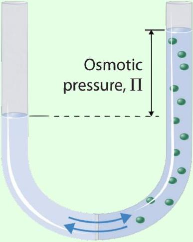
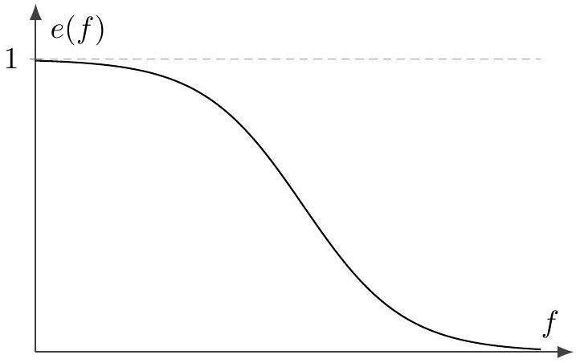
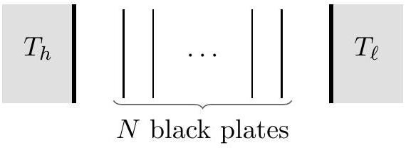

## Thermodynamics II

Chapters 3 and 4.1-4.4 of Wang and Ricardo, volume 2 cover the topics of this problem set at an appropriate level. For more detail, see chapters 10-16, 18, 21, and 23 of Blundell and Blundell. For interesting discussion, see chapters I-44 through I-46 of the Feynman lectures. There is a total of 92 points.

## 1 The First Law

We started T1 with basic thermodynamics; here we will treat it more thoroughly, using partial derivatives. Explicit partial derivatives almost never appear on the IPhO. However, the idea is often used implicitly, and they're a useful way to organize your thinking in more complex problems.

Idea 1
The first law states that

$$
\Delta U = \Delta Q + \Delta W
$$

where $\Delta U$ is the change in internal energy, $\Delta Q$ is the heat given to the system, and $\Delta W$ is the work done on the system. Only $U$ is an intrinsic property of the system itself, i.e. a state function, we make this distinction explicit by writing the differential version as

$$
d U = d Q + d W .
$$

As always, $d Q = T d S$ for reversible heating.

Idea 2
For a gas, the state of the system is specified by the pressure $P$, volume $V$, and temperature $T$, and the three are related by the ideal gas law. The infinitesimal work done is

$$
d W = - P d V .
$$

We'll focus on gases in this problem set, but many simple thermodynamic systems can be described by a temperature and a pair of "conjugate variables". For example, a bubble with surface tension $\gamma$ and area $A$ has

$$
d W = \gamma d A .
$$

A rubber band with tension $F$ and length $L$ has

$$
d W = F d L .
$$

In all of these simple examples, we have three variables and one "equation of state" which relates them, which means two parameters are required to describe the system's state. That's why, for example, you can't speak of a single "heat capacity". There's more than one way to change the temperature: if we heat at constant volume, we get the heat capacity $C _ { V }$, and if we heat at constant pressure, we get $C _ { P }$. In T1, we just made these distinctions verbally, but this quickly gets confusing as you do more complex calculations. A more rigorous and powerful approach is to use partial derivatives, which explicitly specify what quantity is being held constant as another is changed.

Example 1
Consider describing a plane with Cartesian coordinates $( x , y )$ and polar coordinates $( r , \theta )$. Calculate the partial derivatives $\left. ( \partial x / \partial r ) \right| _ { \theta }$ and $\left. ( \partial x / \partial r ) \right| _ { y }$.

Solution
To evaluate the first partial derivative, we need to write $x$ as a function of $r$ and $\theta$. This is done by $x = r \cos \theta$. Differentiating with respect to $r$ and treating $\theta$ as a constant, we have

$$
\left. \frac { \partial x } { \partial r } \right| _ { \theta } = \cos \theta .
$$

To evaluate the second, we should write $x$ in terms of $r$ and $y$. This is done starting with

$$
r ^ { 2 } = x ^ { 2 } + y ^ { 2 } .
$$

We could solve for $x$ here. However, it's quicker to use the usual trick of implicit differentiation: note that differentiating both sides with respect to $r$, at fixed $y$, gives

$$
2 r = \left. 2 x \frac { \partial x } { \partial r } \right| _ { y } + 0
$$

which yields the answer,

$$
\left. \frac { \partial x } { \partial r } \right| _ { y } = \frac { r } { x } = \frac { 1 } { \cos \theta } .
$$

These two results are different: changing what you keep constant changes the derivative. You can see this geometrically by evaluating the two versions of $\partial x / \partial r$ at a few points.

Idea 3: Multivariable Differential
The change of a function $f ( x , y )$ upon independent changes in $x$ and $y$ is

$$
d f = \left. \frac { \partial f } { \partial x } \right| _ { y } d x + \left. \frac { \partial f } { \partial y } \right| _ { x } d y
$$

which you can recognize as an alternative form of the multivariable chain rule from P1. We can also use this equation to describe small increments of quantities that aren't state functions, in which case we'll write the left-hand side as $d f$.
[1] Problem 1. How are pressure and temperature defined, in terms of partial derivatives of $U$ ?
Solution. By the first law of thermodynamics, we have

$$
d U = d Q + d W = T d S - P d V
$$

From this result, we immediately read off the answers,

$$
T = \left. \frac { \partial U } { \partial S } \right| _ { V } , \quad P = - \left. \frac { \partial U } { \partial V } \right| _ { S } .
$$

Example 2: Change of Variable
The same differential $d f$ can be described by coordinates $x$ and $y$, and by $x ^ { \prime }$ and $y$, so that

$$
d f = \left. \frac { \partial f } { \partial x } \right| _ { y } d x + \left. \frac { \partial f } { \partial y } \right| _ { x } d y = \left. \frac { \partial f } { \partial x ^ { \prime } } \right| _ { y } d x ^ { \prime } + \left. \frac { \partial f } { \partial y } \right| _ { x ^ { \prime } } d y
$$

How are these partial derivatives related to each other?

Solution
The two forms of the differential are in terms of $d x$ and $d y$, and $d x ^ { \prime }$ and $d y$ respectively. We thus need to write $d x$ in terms of $d x ^ { \prime }$ and $d y$, which we do by applying idea 3 to $x$ itself,

$$
d x = \left. \frac { \partial x } { \partial x ^ { \prime } } \right| _ { y } d x ^ { \prime } + \left. \frac { \partial x } { \partial y } \right| _ { x ^ { \prime } } d y .
$$

After plugging this in, the first form of $d f$ becomes

$$
d f = \left. \left. \frac { \partial f } { \partial x } \right| _ { y } \frac { \partial x } { \partial x ^ { \prime } } \right| _ { y } d x ^ { \prime } + \left( \left. \left. \frac { \partial f } { \partial x } \right| _ { y } \frac { \partial x } { \partial y } \right| _ { x ^ { \prime } } + \left. \frac { \partial f } { \partial y } \right| _ { x } \right) d y .
$$

Comparing this to the second form of $d f$, we conclude that

$$
\left. \frac { \partial f } { \partial x ^ { \prime } } \right| _ { y } = \left. \left. \frac { \partial f } { \partial x } \right| _ { y } \frac { \partial x } { \partial x ^ { \prime } } \right| _ { y } , \left. \quad \frac { \partial f } { \partial y } \right| _ { x ^ { \prime } } = \left. \frac { \partial f } { \partial y } \right| _ { x } + \left. \left. \frac { \partial f } { \partial x } \right| _ { y } \frac { \partial x } { \partial y } \right| _ { x ^ { \prime } } .
$$

These expressions might look a bit complicated, but their interpretations are simple. The first one just says that when we hold the same quantity $y$ constant throughout, then the ordinary single-variable chain rule in P1 works, since all the functions involved become effectively single-variable. (This also implies that reciprocals of partial derivatives behave as expected. For instance, $\left. ( \partial f / \partial x ) \right| _ { y } = 1 / ( \partial x / \partial f ) _ { y }$.) The second one says that when we change $y$ while keeping $x ^ { \prime }$ constant, there are two contributions: one solely from the change in $y$ itself, and one from the induced change in $x$, needed to keep $x ^ { \prime }$ constant.

If you want, you can generalize the reasoning here to see what happens when you change both coordinates at once, but that won't be needed for the problems below.

Now we're going to embark on some serious partial derivative acrobatics. The techniques we're about to cover are a bit tricky, and are generally regarded as the hardest thing covered in an undergraduate thermodynamics class. But they're also the simplest way to solve the problems in this section. The material covered below will not be necessary for anything else in these handouts.

Example 3: Heat Capacities
The heat capacities at constant volume and constant pressure are defined as

$$
C _ { V } = \left. \frac { \partial Q } { \partial T } \right| _ { V } , \quad C _ { P } = \left. \frac { \partial Q } { \partial T } \right| _ { P } .
$$

Find a formula for $C _ { P } - C _ { V }$ in terms of $P , V , T$, and the internal energy $U$.

Solution
To avoid confusion, we again note that the partial derivative notation above does not imply that $Q$ is a state function. It simply means that a small increment of heat transfer $d Q$ can be related to small increments of $P , V$, and $T$, via

$$
đ Q = C _ { V } d T + \left. \frac { \partial Q } { \partial V } \right| _ { T } d V = C _ { P } d T + \left. \frac { \partial Q } { \partial P } \right| _ { T } d P
$$

Now, to solve the problem itself, we apply the second identity derived in example 2, to get

$$
C _ { P } = C _ { V } + \left. \left. \frac { \partial Q } { \partial V } \right| _ { T } \frac { \partial V } { \partial T } \right| _ { P } .
$$

To write this in terms of $U$, we use the first law of thermodynamics,

$$
d Q = d U + P d V .
$$

By expanding both $d Q$ and $d U$ in the differentials $d V$ and $d T$, we read off

$$
\left. \frac { \partial Q } { \partial T } \right| _ { V } = \left. \frac { \partial U } { \partial T } \right| _ { V } , \left. \quad \frac { \partial Q } { \partial V } \right| _ { T } = \left. \frac { \partial U } { \partial V } \right| _ { T } + P .
$$

The first result just tells us that $C _ { V }$ can be equivalently defined as $\left. ( \partial U / \partial T ) \right| _ { V }$. As for the second result, plugging it in gives an answer of

$$
C _ { P } - C _ { V } = \left. \left( \left. \frac { \partial U } { \partial V } \right| _ { T } + P \right) \frac { \partial V } { \partial T } \right| _ { P } .
$$

This is actually quite intuitive. The extra heat we have to put in at constant pressure, when we allow the volume to change, comes from two sources. First, we have to make up for the energy lost to $P d V$ work. Second, we have to make up for the energy intrinsically needed to expand the gas, by doing work against the attractive intermolecular forces between the gas molecules. (That second term is zero for an ideal gas by definition.) However, trying to show this result without the organizing framework of partial derivatives would be prone to error.
[3] Problem 2. [A] Let's illustrate some consequences of the previous example.

(a) For a monatomic ideal gas, we have $U = ( 3 / 2 ) n R T$ and the equation of state $P V = n R T$. Evaluate $C _ { V }$ and $C _ { P }$ using the results above.
(b) In a real gas, there are short-ranged attractive intermolecular forces. If they are relatively weak, they yield a small negative contribution to the energy, of the form
$$
U = \frac { 3 } { 2 } n R T - \frac { a n ^ { 2 } } { V } .
$$
Explain qualitatively why the change in energy is proportional to $n ^ { 2 } / V$.

(c) We will show in problem 4 that this modifies the equation of state to
$$
\left( P + \frac { a n ^ { 2 } } { V ^ { 2 } } \right) V = n R T .
$$
Using these results, show that to first order in $a$, we have
$$
C _ { V } = \frac { 3 } { 2 } n R , \quad C _ { P } - C _ { V } \approx n R + \frac { 2 a n ^ { 2 } } { T V } .
$$
Qualitatively explain why the new term has a positive sign.

Solution. (a) Using the results of the previous example, we have

$$
C _ { V } = \left. \frac { \partial U } { \partial T } \right| _ { V } = \frac { 3 } { 2 } n R , \quad C _ { P } - C _ { V } = \left. \left( \left. \frac { \partial U } { \partial V } \right| _ { T } + P \right) \frac { \partial V } { \partial T } \right| _ { P } = P \frac { n R } { P } = n R .
$$

Combining these gives $C _ { P } = ( 5 / 2 ) n R$, just as expected.

(b) Since the interaction is short-ranged, the number of molecules near a single given molecule is proportional to the average density $n / V$. We then multiply by the total number of molecules, which is proportional to $n$, to get a contribution proportional to $n ^ { 2 } / V$. The sign of this contribution is negative since the force is attractive.
Note that we implicitly assumed that the density of molecules near a given molecules was the same as the density in the whole container. But if the interaction is sufficiently strong, that won't be true, because the molecules will clump up. This dramatic behavior is associated with a phase transition to a liquid or solid state, and will be discussed further in T3. For now, we're just concerned with the case of weak interactions.
(c) The first result follows directly from the definition of the heat capacity. Next,
$$
C _ { P } - C _ { V } = \left. \left( \left. \frac { \partial U } { \partial V } \right| _ { T } + P \right) \frac { \partial V } { \partial T } \right| _ { P } = \left. \left( P + \frac { a n ^ { 2 } } { V ^ { 2 } } \right) \frac { \partial V } { \partial T } \right| _ { P } .
$$
To get $\partial V / \left. \partial T \right| _ { P }$, differentiate the equation of state with respect to $T$ at constant $P$,
$$
n R = \left. \left( P + \frac { a n ^ { 2 } } { V ^ { 2 } } - \frac { 2 a n ^ { 2 } } { V ^ { 2 } } \right) \frac { \partial V } { \partial T } \right| _ { P } .
$$
Plugging this result in and expanding to lowest order in $a$ gives the result. The reason the new term has a positive sign is that the interaction is attractive, so when the gas expands under heating, we need to put in extra heat to get the molecules further away from each other.

## Idea 4: Equality of Mixed Partial Derivatives

If we take two distinct partial derivatives of a state function $f$, then the order doesn't matter,

$$
\left. \left. \frac { \partial } { \partial x } \right| _ { y } \frac { \partial f } { \partial y } \right| _ { x } = \left. \left. \frac { \partial } { \partial y } \right| _ { x } \frac { \partial f } { \partial x } \right| _ { y } .
$$

If this identity doesn't hold, it means that $f$ is not actually a state function. Imposing this requirement for various choices of independent variables $x$ and $y$ yields a variety of nontrivial

identities, collectively called Maxwell relations.
[3] Problem 3. [A] Let's check the consequences of this idea.

(a) We should be able to take the partial derivatives of $U$ with respect to $S$ or $V$ in either order. By combining this idea with your solution to problem 1, infer a nontrivial relationship between the derivatives of $T$ and $P$, and check that it is satisfied for an ideal gas.
(b) If heat was a state function, we could take the partial derivatives of $Q$ with respect to $T$ or $V$ in either order. Check that this implies a relationship which is not satisfied for an ideal gas.

Solution. (a) Since we can take the partial derivatives of $U$ with respect to $S$ and $V$ in either order, we conclude that we need the nontrivial relation

$$
\left. \frac { \partial T } { \partial V } \right| _ { S } = - \left. \frac { \partial P } { \partial S } \right| _ { V } .
$$

To evaluate the left-hand side, we need to consider how $T$ varies with $V$ in an adiabatic expansion. In this case $T V ^ { \gamma - 1 }$ is constant, so that

$$
\frac { d T } { T } = ( 1 - \gamma ) \frac { d V } { V }
$$

from which we conclude that

$$
\left. \frac { \partial T } { \partial V } \right| _ { S } = - \frac { T } { V } ( \gamma - 1 ) .
$$

To evaluate the right-hand side, note that for constant volume heating, $d U = d Q = T d S$, so

$$
\left. \frac { \partial P } { \partial S } \right| _ { V } = \left. T \frac { \partial P } { \partial U } \right| _ { V } = T \left( \left. \frac { \partial U } { \partial P } \right| _ { V } \right) ^ { - 1 } .
$$

But for an ideal gas, we have $U = n R T / ( \gamma - 1 ) = P V / ( \gamma - 1 )$, so

$$
\left. \frac { \partial P } { \partial S } \right| _ { V } = \frac { T } { V } ( \gamma - 1 )
$$

which confirms the expected result.

(b) By definition, the differential of heat is
$$
\partial Q = C _ { V } d T + \left. \frac { \partial Q } { \partial V } \right| _ { T } d V
$$
and the required identity, if heat were a state function, is
$$
\left. \frac { \partial C _ { V } } { \partial V } \right| _ { T } = \left. \frac { \partial } { \partial T } \right| _ { V } \left( \left. \frac { \partial Q } { \partial V } \right| _ { T } \right) .
$$
The left-hand side just vanishes for an ideal gas. As for the right hand side, we note that
$$
\left. \frac { \partial Q } { \partial V } \right| _ { T } = \left. \frac { \partial U } { \partial V } \right| _ { T } - \left. \frac { \partial W } { \partial V } \right| _ { T } = - \left. \frac { \partial W } { \partial V } \right| _ { T } = P
$$

where we used the fact that the internal energy of an ideal gas depends only on temperature. Thus, the right-hand side is
$$
\left. \frac { \partial P } { \partial T } \right| _ { V } = \frac { n R } { V } \neq 0
$$
so the identity is not satisfied, as expected.
[3] Problem 4. [A] Now let's revisit the nonideal gas considered in problem 2. We would like to take the given form of the internal energy and derive the equation of state, which gives the pressure in terms of the other variables.
    (a) Explain why it's true that
$$
\left. \left. \frac { \partial U } { \partial S } \right| _ { V } \frac { \partial S } { \partial V } \right| _ { T } = - \left. \frac { \partial U } { \partial V } \right| _ { S } + \left. \frac { \partial U } { \partial V } \right| _ { T } .
$$
Three of these partial derivatives can be evaluated easily; simplify accordingly.
    (b) This gets us close to the desired result, except that we don't know how to evaluate $\partial S / \left. \partial V \right| _ { T }$. To do this, we're going to need another Maxwell relation. Find the Maxwell equation that follows from taking the partial derivatives of the quantity $U - T S$ with respect to $T$ and $V$.
    (c) You should now have a differential equation for the pressure as a function of temperature, at constant volume. To finish, integrate this equation and use the fact that the attractive interaction has negligible effect as $a \rightarrow 0$.

Solution. (a) This is simply a direct application of the change of variable identity in example 2. The easy things to evaluate are

$$
\left. \frac { \partial U } { \partial S } \right| _ { V } = T , \left. \quad \frac { \partial U } { \partial V } \right| _ { S } = - P , \left. \quad \frac { \partial U } { \partial V } \right| _ { T } = \frac { a n ^ { 2 } } { V ^ { 2 } }
$$

from which we conclude that

$$
\left. T \frac { \partial S } { \partial V } \right| _ { T } = P + \frac { a n ^ { 2 } } { V ^ { 2 } } .
$$

(b) First, let's figure out what the differential of this quantity is. Calling it $F$, we have
$$
d F = T d S - P d V - T d S - S d T = - P d V - S d T .
$$
Therefore, we conclude that
$$
\left. \frac { \partial F } { \partial V } \right| _ { T } = - P , \left. \quad \frac { \partial F } { \partial T } \right| _ { V } = - S
$$
and the corresponding Maxwell relation is
$$
\left. \frac { \partial P } { \partial T } \right| _ { V } = \left. \frac { \partial S } { \partial V } \right| _ { T } .
$$
Plugging this in, we conclude that
$$
\left. T \frac { \partial P } { \partial T } \right| _ { V } = P + \frac { a n ^ { 2 } } { V ^ { 2 } } .
$$

(c) If we separate the variables, at constant $V$, then we have
$$
\frac { d P } { P + a n ^ { 2 } / V ^ { 2 } } = \frac { d T } { T }
$$
and integrating tells us that
$$
T \propto P + \frac { a n ^ { 2 } } { V ^ { 2 } }
$$
where the constant of proportionality can depend on $n$ and $V$, since these quantities were held constant. When $a \rightarrow 0$, we have to recover the ideal gas law, so the constant has to be $n R / V$, and we conclude that
$$
P + \frac { a n ^ { 2 } } { V ^ { 2 } } = \frac { n R T } { V }
$$
as desired. (In T3, we will combine this pressure correction with a "volume exclusion factor" to yield the van der Waals gas, which is useful for modeling the liquid-gas phase transition.)

[3] Problem 5. [A] INPhO 2020, problem 1. A very contrived application of partial derivatives.

## 2 The Second Law

Idea 5: Entropy
The increase in entropy of a body at temperature $T$ that receives heat $d Q$ is

$$
d S = \frac { d Q } { T }
$$

if the process is reversible; moreover, entropy is a state function.

Idea 6: Second Law
The second law of thermodynamics takes several equivalent forms, which are all useful.

- For an isolated system, $d S \geq 0$ for any spontaneous process.
- Clausius: no process is possible whose sole result is the transfer of heat from a colder to a hotter body.
- Kelvin: no process is possible whose sole result is the complete conversion of heat into work.
- Carnot: of all heat engines working between two given temperatures, none is more efficient than a Carnot engine.

Example 4: Mixing Entropy
A container of volume $V$ is divided in half by a partition. The two halves contain pure nitrogen and oxygen gas, respectively, both at pressure $P$ and temperature $T$. The partition is removed and the gases are allowed to mix. How much does the entropy increase?

Solution
We cannot apply the formula $d S = d Q / T$, because the gas is not in equilibrium during the process. However, because entropy is a state function, we can calculate its change by considering a path that only goes through equilibrium states.

Suppose we introduce a piston at one end of the container, which is magically transparent to oxygen atoms, and slowly and isothermally move it to the center of the container. This puts the nitrogen back where it started. The change in entropy of the nitrogen is

$$
\Delta S _ { \mathrm { N } } = \frac { Q } { T } = - \frac { W } { T } = n R \log \frac { V _ { f } } { V _ { i } } = - n R \log 2 = - N k _ { B } \log 2
$$

where $N$ is the number of nitrogen molecules, which is also the number of oxygen molecules. If we do the same for the oxygen with another piston, introduced from the other side, we get another, equal decrease in the entropy. This takes us back to the original state, so since entropy is a state function, the increase in entropy when we allowed the gases to mix was

$$
\Delta S = - 2 \Delta S _ { \mathrm { N } } = 2 N k _ { B } \log 2 .
$$

[3] Problem 6. Some basic conceptual questions about the second law.

(a) Verify explicitly that the second law of thermodynamics allows heat to flow from a hot body to a cold one, but not vice versa.
(b) Derive the efficiency of a Carnot engine operating between reservoirs of temperatures $T _ { H } > T _ { C }$ by using the fact that the Carnot cycle is reversible, i.e. that after a complete Carnot cycle the entropy of the universe is unchanged.
(c) Let's suppose that in addition to reservoirs at temperatures $T _ { H }$ and $T _ { C }$, you had a reservoir at temperature $\left( T _ { H } + T _ { C } \right) / 2$. Is the Carnot cycle between the extreme reservoirs still the most efficient option? If not, what's the maximum possible efficiency?
(d) Consider the free expansion of an ideal gas. No work is done, and the internal energy $U$ does not change. However, the entropy increases since the process is irreversible. On the other hand, the first law states
$$
d U = T d S + đ W
$$
so there appears to be a contradiction. What is wrong with this argument?

Solution. (a) If $d Q$ of heat flows from $T _ { 1 }$ to $T _ { 2 }$ with $T _ { 1 } > T _ { 2 }$, the total change in entropy is

$$
- d Q / T _ { 1 } + d Q / T _ { 2 } > 0 ,
$$

so $t Q > 0$ as desired.

(b) The change in entropy of the engine itself is zero, because it just ends up at its original state. The only other contribution is the change in entropy of the reservoirs,
$$
\Delta S _ { \text {univ } } = \frac { Q _ { C } } { T _ { C } } - \frac { Q _ { H } } { T _ { H } } .
$$

Setting this to zero gives $Q _ { C } / T _ { C } = Q _ { H } / T _ { H }$. The efficiency is then
$$
\eta = \frac { W } { Q _ { H } } = \frac { Q _ { H } - Q _ { C } } { Q _ { H } } = 1 - \frac { T _ { C } } { T _ { H } } .
$$
(c) The Carnot engine is still the most efficient option. From the standpoint of entropy changes in part (b), it is always best to draw heat from the hottest possible reservoir and to expel it to the coldest possible reservoir.
(d) The problem is that $d Q \neq T d S$ for irreversible processes. For example, in free expansion the entropy goes up, even though no heat is added.

[3] Problem 7. Most thermodynamic systems have positive heat capacities, but a gravitationally bound system of particles has a negative heat capacity by the virial theorem, as does a black hole. Suppose a system with negative heat capacity $C _ { 1 }$ is placed in thermal contact with a slightly cooler system with positive heat capacity $C _ { 2 }$.

(a) What happens in the long run if $\left| C _ { 1 } \right| > \left| C _ { 2 } \right|$ ?
(b) What happens in the long run if $\left| C _ { 1 } \right| < \left| C _ { 2 } \right|$ ?
(c) Some systems, such as lasers, have a negative temperature and a positive heat capacity. (You'll see another example of negative temperature in problem 14.) What happens if such a system is placed in thermal contact with a system with positive temperature and heat capacity?

Solution. (a) By the second law, heat must flow from the hotter system to the cooler one. Since the hotter system has negative heat capacity, both systems will get hotter! If $\left| C _ { 1 } \right| > \left| C _ { 2 } \right|$, then the initially cooler system with positive heat capacity "catches up" in temperature, and equilibrium is reached.

(b) In this case, the cooler system never catches up in temperature. The heat transfer goes on indefinitely, with both systems continually becoming hotter, until something about this description breaks down.
This sounds crazy; can it really happen? Consider a system of many particles interacting under gravity, with an initially uniform temperature $T$. The particles near the middle of the system are dominated by gravitational potential energy; this dense "core" region has negative heat capacity. The particles in the "halo", which extends further outward, are dominated by kinetic energy, and have positive heat capacity like a standard ideal gas.
If the core becomes slightly hotter, then the exact situation described in this problem occurs, and heat flows from the core to the halo. If the core is dense enough relative to the halo, then $\left| C _ { 1 } \right| < \left| C _ { 2 } \right|$ and there is a runaway, known as the "gravothermal catastrophe." In the long run, the particles in the halo are ejected as they reach escape velocity, while the particles in the core collapse into a black hole. This is possibly the (very) long-term fate of our galaxy. If you think about it, a similar process has already happened in our solar system, which started as a disk of dust; the end result was the formation of the Sun and planets, with much of the rest of the dust blown away.
(c) By the second law, heat should leave the negative temperature system and go into the positive temperature system, that way $d S = d Q / T$ is positive for both systems. Thus the negative

temperature system will get more negative, and the positive temperature system will get hotter. This will continue until the negative temperature system goes back to a positive temperature (and the temperatures meet at equilibrium), as seen by moving to the left on the graph in problem 14.

[3] Problem 8 (Kardar). The solar system originated from a dilute gas of particles, sufficiently separated from other such clouds to be regarded as an isolated system. Under the action of gravity the particles coalesced to form the sun and planets.

(a) The motion and organization of planets is much more ordered than the original dust cloud. Why does this not violate the second law?
(b) The nuclear processes of the sun convert protons to heavier elements such as carbon. Does this further organization lead to a reduction in entropy?
(c) The evolution of life and intelligence requires even further levels of organization. Why does this not violate the second law?

For a nice discussion of these issues, see section 36.7 of Blundell and Blundell.
Solution. (a) When the dust cloud gravitationally contracted, it heated up and then released its energy by radiation. Thus, the entropy of the interstellar space around the solar system went up.

(b) Again, the process releases a lot of heat, which then increases the entropy of the Sun itself. Or, if you consider the long run, waiting until the Sun dies, then radiation is emitted from the surface of the Sun, increasing the entropy of the surrounding universe.
(c) Earth receives energy at high temperature (about 6000 K) from the Sun, then radiates this energy back to outer space at low temperature (about room temperature). This process increases the total entropy of the Earth's surroundings, which means life can exploit this to decrease its own entropy, by letting this energy pass through it.
[4] Problem 9. We can find an expression for entropy of an ideal gas using pure thermodynamics. Consider $n$ moles of an ideal gas with adiabatic index $\gamma$, initially at pressure $P$ and volume $V$.
    (a) Suppose the gas is heated at constant volume to pressure $P ^ { \prime }$. Compute the change in entropy.
    (b) Suppose the gas is instead expanded at constant pressure to volume $V ^ { \prime }$. Compute the change in entropy.
    (c) By combining your two results, show that the entropy $S ( P , V )$ of the ideal gas is
$$
S = n C _ { V } \log \left( P V ^ { \gamma } \right) + \text { constant }
$$
when $n$ is constant. The constant can't be found using classical thermodynamics alone, since it only can determine changes in entropy.
    (d) Now consider the case where the ideal gas is allowed to freely expand into a vacuum, reaching a final volume $V ^ { \prime }$. This is an example of a nonequilibrium process that changes the entropy, despite no work or heat transfer. Find the resulting change in entropy.

(e) So far, we don't know anything about how $S$ depends on $n$, because we only considered processes that kept $n$ constant. However, the entropy should be extensive, meaning that if the pressure and temperature are kept the same, then $S$ is proportional to $n$. Thus, if in general
$$
S / n = C _ { V } \log \left( P V ^ { \gamma } f ( n ) \right) + \mathrm { constant }
$$
then the right-hand side must be independent of $n$. Using this, find $f ( n )$.

Solution. (a) For heating at constant volume, we have

$$
\Delta S = \int \frac { d Q } { T } = n C _ { V } \log \frac { T ^ { \prime } } { T } = n C _ { V } \log \frac { P ^ { \prime } } { P } .
$$

(b) For heating at constant pressure, we have
$$
\Delta S = \int \frac { d Q } { T } = n C _ { P } \log \frac { T ^ { \prime } } { T } = n C _ { P } \log \frac { V ^ { \prime } } { V } .
$$
(c) Suppose we start at some fixed pressure and volume $P _ { 0 }$ and $V _ { 0 }$, and use the above two steps to get to pressure and volume $P$ and $V$. Then
$$
S ( P , V ) = S \left( P _ { 0 } , V _ { 0 } \right) + n C _ { V } \log \frac { P ^ { \prime } } { P } + n C _ { P } \log \frac { V ^ { \prime } } { V } = S \left( P _ { 0 } , V _ { 0 } \right) + n C _ { V } \log \frac { P ^ { \prime } } { P } + n C _ { V } \log \frac { V ^ { \prime \gamma } } { V ^ { \gamma } } .
$$
Since $P _ { 0 }$ and $V _ { 0 }$ and $S \left( P _ { 0 } , V _ { 0 } \right)$ are all fixed constants, we hence have
$$
S ( P , V ) = n C _ { V } \log \left( P V ^ { \gamma } \right) + \text { constant }
$$
as desired.
(d) Since no work or heat transfer occurred, the internal energy must stay the same. Thus the temperature stayed the same. Using our previously obtained result, we get
$$
\Delta S = n C _ { V } \log \left( \frac { T V ^ { \prime \gamma - 1 } } { T V ^ { \gamma - 1 } } \right) = n R \log \left( \frac { V ^ { \prime } } { V } \right) .
$$
This can also be found by considering an isothermal process to get to the final state and finding the entropy change using $d S = d Q / T$. Since entropy is a state function, the final changes in entropy are equivalent.
(e) Use the ideal gas law to substitute $V = n R T / P$, giving
$$
S / n = C _ { V } \log \left( P \frac { n ^ { \gamma } R ^ { \gamma } T ^ { \gamma } } { P ^ { \gamma } } f ( n ) \right) + \text { constant } .
$$
For constant $P$ and $T$, the argument of the logarithm is independent of $n$ when
$$
f ( n ) = n ^ { - \gamma } .
$$
The resulting general expression for the entropy of an ideal gas, up to the remaining constant (which can't be found without using quantum statistical mechanics) is called the Sackur-Tetrode equation.
[3] Problem 10. USAPhO 2014, problem A2.
[3] Problem 11. USAPhO 2017, problem A2. A simple but tricky problem. (For a more involved problem based on the same fundamental idea, see Physics Cup 2019, problem 2.)
[3] Problem 12. USAPhO 2020, problem B3. An advanced problem which shows you how to compute corrections for a slightly nonideal gas. (Note that you can use the quantity $T$ in any of the parts, not just (e) and (f).)

## 3 Quantum Statistical Mechanics and the Third Law

So far, everything we have discussed only tells us about changes in entropy, while the absolute value is undetermined. This is fixed by the following fact.

Idea 7: Third Law
The entropy of any thermodynamic system approaches zero as the temperature goes to zero.
The third law of thermodynamics is a bit of a black sheep. Unlike the other laws, it is inherently quantum mechanical, and comes from the statistical definition of entropy, as described below.

[2] Problem 13. Show that the third law requires the specific heat $C$ to approach zero as the temperature approaches zero. (Since this isn't true for a classical ideal gas, the ideal gas law must break down in quantum mechanics, at low temperatures. You can also see this from your result for the entropy in problem 9, which diverges at low temperatures; there's no way to add a constant to it to make it go to zero at zero temperature.)
Solution. We have
$$
d S = \frac { \partial Q } { T } = \frac { C ( T ) d T } { T } .
$$
Therefore, for a small temperature $T _ { 0 }$, we have
$$
S \left( T _ { 0 } \right) = \int _ { 0 } ^ { T _ { 0 } } d T \frac { C ( T ) } { T }
$$
and the right-hand side must go to zero as $T _ { 0 }$ goes to zero. But if $C ( T )$ doesn't go to zero as $T$ does, instead approaching a nonzero limit, then the right-hand side is instead infinite.

Idea 8: Microcanonical Ensemble
If a large isolated system in thermodynamic equilibrium is in one of $\Omega$ quantum states, then we assume all of the states are equally likely, and the entropy is

$$
S = k _ { B } \log \Omega .
$$

This is the fundamental definition of entropy; in fact the equation $d S = d Q / T$ does not define entropy, but rather defines temperature! The third law follows from this result because at temperature $T = 0$, all systems settle into their ground state, so $\Omega = 1$ and $S = 0$.

The entropy describes how much information is required to specify the true state of the system. The factor of $k _ { B }$ is due to historical convention. The logarithm makes sense because if we have two independent systems, which could be in $\Omega _ { 1 }$ or $\Omega _ { 2 }$ different states, then we want the entropy to add, $\log \left( \Omega _ { 1 } \Omega _ { 2 } \right) = \log \left( \Omega _ { 1 } \right) + \log \left( \Omega _ { 2 } \right)$.

Remark
The assumption that all states are equally likely may sound a bit confusing, because in T1 we used the Boltzmann distribution, which stated that higher-energy states were less likely to be occupied. The difference is that for the Boltzmann distribution, we assumed the system

was inside an environment at temperature $T$. In fact, all quantum states of the system and environment together remain equally likely in this context, but lower-energy states of the system correspond to more energy in the environment, and hence (usually) more possible environment states. Thus, accounting for the number of possible environment states, lowerenergy states of the system are more likely. You will make all this precise in problem 14, where you will use it to derive the Boltzmann distribution.

Example 5: Mixing Entropy
Repeat example 4 using statistical mechanics.

Solution
In statistical mechanics, we can compute $S$ directly using $S = k _ { B } \log \Omega$. Focusing on a single oxygen or nitrogen molecule, let $\Omega _ { i }$ be the initial number of possible states. When the partition is removed, the possible position space for the particle doubles, and since quantum states all have the same volume in phase space, the number of states available doubles. So for one particle,

$$
\Delta S _ { \text {part } } = k _ { B } \log \left( 2 \Omega _ { i } \right) - k _ { B } \log \Omega _ { i } = k _ { B } \log 2 .
$$

Since the $2 N$ particles are independent,

$$
\Delta S = 2 N \Delta S _ { \mathrm { part } } = 2 N k _ { B } \log 2
$$

in agreement with the result from thermodynamics.

Example 6: Osmotic Pressure
A water-filled tube is divided by a membrane which only allows water molecules through. When a substance is dissolved in one half of the tube, forming $N$ ions, the water level on that side is observed to go up, as shown.

Explain why, and calculate the height difference, neglecting interactions between different ions, and between the ions and the water.

Solution
Osmotic pressure is an example of an entropic force. Suppose the water level on one side of the tube goes up. The water is otherwise unchanged, since it's just translated along the tube, so its entropy has not changed. But its energy is higher, and this energy must have come via heat transfer from the environment. Hence the entropy of the environment has decreased.

If there were no dissolved ions, this would show why water levels don't spontaneously go up: it is forbidden by the second law. But here, increasing the water in the section with the ions increases the ions' entropy, since they now have more positions they could be in. Since the number of available quantum states is proportional to the available volume, we have

$$
S _ { \mathrm { ion } } = N k _ { B } \log V
$$

up to an additive constant, which means that

$$
d S _ { \text {ion } } = \frac { N k _ { B } } { V } d V .
$$

In equilibrium, let there be an osmotic pressure difference $P$ across the membrane. Then moving a volume $d V$ of water across it costs energy $P d V$, so

$$
d S _ { \mathrm { env } } = - \frac { đ Q } { T } = - \frac { P } { T } d V .
$$

In thermodynamic equilibrium the total entropy is maximized, giving

$$
d S _ { \mathrm { ion } } + d S _ { \mathrm { env } } = 0
$$

Solving for the osmotic pressure gives

$$
P V = N k _ { B } T .
$$

The height difference is simply found using hydrostatic pressure,

$$
h = \frac { P } { \rho g } = \frac { N k _ { B } T } { \rho V g } .
$$

The appearance of a pressure here in response to an opportunity for decreasing entropy is generally called an "entropic force". In fact, you might have already seen this result in chemistry class, but in rather different notation. In chemistry textbooks, you'll typically see

$$
\Pi = i M R T
$$

where $\Pi$ is the osmotic pressure, $M$ is the molarity of solute, and the van 't Hoff factor $i$ is the number of moles of ions per mole of solute. This is perfectly equivalent to what we found.

Remark
Why does the expression for osmotic pressure bear a suspicious resemblance to the ideal gas law? The reason is that, by completely neglecting interactions between the solute and solvent, we have effectively treated the solute ions like an ideal gas, from the standpoint of entropy. This gives an additional contribution to the pressure, which can be derived just like the pressure of an ideal gas is in T1. (Using this reasoning backwards, one can conclude that the pressure of an ideal gas can also be described as an entropic force, using the same reasoning as above.)

The reason that this kinetic theory connection to the ideal gas law is not emphasized in chemistry classes is that the solute particles don't actually behave like an ideal gas at all. They are part of a liquid, and hence are constantly bumping into the solvent particles. The thermodynamic reasoning we used above is more general, because it only requires that the interaction between the solvent and solute doesn't significantly change the solute's entropy.

Entropic forces can sound mysterious, but they're simply ordinary forces, whose value we can calculate most easily using the tool of entropy. In the end, there are no forces at play except for the ordinary forces you're familiar with. Here the specific force at play is the interaction between the membrane and the ions. Since the membrane makes the ions bounce off, rather than pass through, it exerts a repulsive force on them which is transmitted to the water.
[5] Problem 14. This is a long problem, but a really useful one that ties a lot of things together. Consider a set of $N$ atoms, each of which may be in the ground state, with zero energy, or in an excited state with energy $E _ { 0 }$. Suppose it is only known that the total energy of the system is $\alpha N E _ { 0 }$.

(a) In P1, we discussed Stirling's approximation: for large $N , \log N ! \approx N \log N - N$. Using this result, show that the entropy of the system is
$$
S = N k _ { B } \left( \alpha \log \frac { 1 } { \alpha } + ( 1 - \alpha ) \log \frac { 1 } { 1 - \alpha } \right) .
$$
Sketch the entropy as a function of $\alpha$.
(b) Using the definition of temperature, $d S = d Q / T$, show that the system has a temperature of
$$
T = \frac { E _ { 0 } } { k _ { B } } \frac { 1 } { \log ( 1 - \alpha ) - \log \alpha } .
$$
Sketch the temperature as a function of $\alpha$. In particular, what temperature do you need to get $\alpha = 1 / 2$ ? How about $\alpha = 1$ ?
(c) Show that the third law is satisfied.
(d) Now consider just a single one of the $N$ atoms, where the total energy of the system is $\alpha N E _ { 0 }$ as before. Show that the probability it is excited obeys the Boltzmann distribution.

Solution. (a) We see that $\Omega = \binom { N } { \alpha N } = \frac { N ! } { ( \alpha N ) ! ( ( 1 - \alpha ) N ) ! }$, so

$$
\log \Omega \approx N \log N - \alpha N \log ( \alpha N ) - ( 1 - \alpha ) N \log ( ( 1 - \alpha ) N ) .
$$

Expanding the logarithms and simplifying, we get
$$
S = k _ { B } \log \Omega = N k _ { B } \left( \alpha \log \frac { 1 } { \alpha } + ( 1 - \alpha ) \log \frac { 1 } { 1 - \alpha } \right) .
$$
(b) We see that $d Q = N E _ { 0 } d \alpha$, and
$$
d S = N k _ { B } ( \log ( 1 - \alpha ) - \log \alpha ) d \alpha .
$$
Thus, $T = d Q / d S = \frac { E _ { 0 } } { k _ { B } } \frac { 1 } { \log ( 1 - \alpha ) - \log \alpha }$. Here is the graph of $T$ as a function of $\alpha$.

To get $\alpha = 0.5$ we need $T = \infty$, to get $\alpha > 0.5$ we need negative temperatures, and as $\alpha \rightarrow 1$, we have $T \rightarrow 0$ from the negative side. So the hottest possible temperature is just below zero! Though this sounds weird, it just means the natural variable is $1 / T$, which indeed decreases monotonically as $\alpha$ increases. Also, a system having negative temperature doesn't mean it's particularly violent. It just means we've temporarily driven it to $\alpha > 0.5$, so that when placed in contact with anything at positive temperature, it will tend to lose energy.
(c) As $\alpha \rightarrow 0$, we see $T \rightarrow 0$ and $S \rightarrow 0$. For the entropy, this requires an application of l'Hospital's rule, which shows that $\lim _ { \alpha \rightarrow 0 } \alpha \log \alpha = 0$.
(d) We know the probability is just $\alpha$, so
$$
\frac { p ( \text { excited } ) } { p ( \text { ground } ) } = \frac { \alpha } { 1 - \alpha } .
$$
By comparison, the Boltzmann distribution states that
$$
\frac { p ( \text { excited } ) } { p ( \text { ground } ) } = e ^ { - E _ { 0 } / k _ { B } T } .
$$
Therefore, the two expressions match if
$$
e ^ { - E _ { 0 } / k _ { B } T } = \frac { \alpha } { 1 - \alpha } .
$$
This is equivalent to the expression for $T$ we found in part (b), as desired.

[5] Problem 15. This long problem illustrates some important features of free energy. A rubber molecule can be modeled in one dimension as a chain consisting of a series of $N = N _ { + } + N _ { - } \gg 1$ links of length $a$, where $N _ { + }$point in the $+ z$ direction and $N _ { - }$point in the $- z$ direction. The orientations of each of the links are independent, and it costs no energy to rotate a link. Thus all configurations are equally likely at any temperature. Define $L = \left( N _ { - } - N _ { + } \right) a$ to be the total downward extension of the chain.
    (a) Using the approximation mentioned in problem 14 and assuming $L \ll N a$, show that
$$
S = N k _ { B } \left( \log 2 - \frac { L ^ { 2 } } { 2 N ^ { 2 } a ^ { 2 } } \right)
$$
and hence show that the entropy decreases as $L$ increases. This model is very basic; for instance, it tells us nothing about the tension in the chain, but the sign here is correct. (Hint: notice that the changes in entropy are of order $L ^ { 2 } / N$, and hence are very small. You will have to be careful with your approximations to avoid dropping an important contribution.)
    (b) Note that the entropy doesn't depend on temperature, because all configurations have the same energy. In a more realistic model, the total entropy of the molecule would be the sum of the entropy computed above, plus the entropy due to additional thermal motions, such as vibrations of the links. Given this, if a rubber band is quickly stretched, does it feel warm or cold to the touch? (You can check your answer experimentally!)
    (c) Now suppose a mass $m$ is hung from the bottom of the chain. Find the average length of the chain at temperature $T$, using the Boltzmann distribution. Do not assume $L \ll N a$. (The force that raises this mass is another example of an entropic force.)
    (d) It turns out that you can also arrive at this answer by maximizing the entropy of the entire universe $S _ { \text {univ } }$. Argue in general that $S _ { \text {univ } }$ is maximized when the Helmholtz free energy
$$
F = U - T S
$$
is minimized, where $U$ is the total energy of the rubber band and mass, and $T$ is the temperature of the system and its surroundings. (Hint: use the expression for $d S _ { \text {univ } }$, along with conservation of energy.)
    (e) Show that in the limit $L \ll N a , F$ is indeed minimized at the equilibrium length.

Solution. For convenience, we'll set $k _ { B } = a = 1$ for now.

(a) We have
$$
S = \log \frac { N ! } { N _ { + } ! N _ { - } ! } .
$$
Applying the approximation $\log N ! \approx N \log N - N$, the linear terms cancel out, giving
$$
\begin{aligned}
S & = N \log N - N _ { + } \log N _ { + } - N _ { - } \log N _ { - } \\
& = N \log N - \frac { 1 } { 2 } ( N + L ) \log ( ( N + L ) / 2 ) - \frac { 1 } { 2 } ( N - L ) \log ( ( N - L ) / 2 ) \\
& = N \log 2 + N \log N - \frac { 1 } { 2 } ( N + L ) \log ( N + L ) - \frac { 1 } { 2 } ( N - L ) \log ( N - L ) .
\end{aligned}
$$

To simplify further, we write the logarithms as

$$
\log ( N \pm L ) = \log N + \log \left( 1 \pm \frac { L } { N } \right) .
$$

Plugging this in and defining $x = L / N$ gives

$$
S = N \log 2 - \frac { N } { 2 } ( ( 1 + x ) \log ( 1 + x ) + ( 1 - x ) \log ( 1 - x ) ) .
$$

Expanding the quantity in parentheses is a little tricky, because it vanishes at first order in $x$. So since the answer is second order, we need to expand the logarithms to second order to make sure we have everything. We have

$$
\log ( 1 \pm x ) = \pm x - \frac { x ^ { 2 } } { 2 }
$$

and plugging this in gives

$$
( ( 1 + x ) \log ( 1 + x ) + ( 1 - x ) \log ( 1 - x ) ) = x ^ { 2 } + \ldots .
$$

If we hadn't included the second-order term in the logarithm, we would have gotten $2 x ^ { 2 }$ instead, leading to an erroneous result.
Putting everything together and restoring the units, we have

$$
S = N \log 2 - \frac { N x ^ { 2 } } { 2 } = N k _ { B } \left( \log 2 - \frac { L ^ { 2 } } { 2 N ^ { 2 } a ^ { 2 } } \right)
$$

as desired.

(b) Since the process is fast, it is adiabatic, so the entropy of the entire rubber band stays the same. But we have shown the entropy of the chain configuration degrees of freedom (i.e. ones which determine the length $L$ ) goes down, so the entropy of the other degrees of freedom must go up. Hence these other degrees of freedom receive heat, and the rubber band feels hot.
By the way, this fact provides a new perspective on a classic puzzle. If you take an ordinary metal spring, stretch it with a clamp, and put the whole thing in a bath of acid, then when the acid dissolves the spring, where does the elastic potential energy go? For a metal spring, the answer is that when you stretch it, you're pulling the chemical bonds inside of it longer, so that they're displaced from the minimum of potential energy. The spring's constituent atoms thus start out in a less deep potential well, so when they are dissolved they emerge with higher energy, which ultimately heats up the bath.
However, for a rubber band the answer is different, because the elastic force is entropic. Specifically, though you can describe the force from a rubber band macroscopically with a potential energy, at the microscopic level it doesn't correspond to any actual potential energy; we have been assuming throughout this problem that it costs no energy to rotate any of the links! Accordingly, when you stretch a rubber band, the work you put in is not actually stored within it as potential energy. It instead warms up the rubber band, and therefore quickly turns into thermal energy in the room. When the rubber band's temperature returns to its original value, its total energy is the same as before you stretched it. If you put this rubber band in an acid bath, the acid's final temperature will be the same regardless of how the band was stretched, because the energy you put in has already left.

(c) It's easiest to look at each link individually. The energy of the $+ z$ configuration now is $2 m g a$ greater than the $- z$ configuration, so the ratio of their probabilities is $\alpha = e ^ { - 2 m g a / k _ { B } T }$. Then the probability of $\pm z$ is
$$
p _ { - } = \frac { 1 } { 1 + \alpha } , \quad p _ { + } = \frac { \alpha } { 1 + \alpha }
$$
so the expected contribution to the length is
$$
\frac { 1 } { 1 + \alpha } - \frac { \alpha } { 1 + \alpha } = \tanh \left( m g a / k _ { B } T \right) .
$$
By summing over all links, the expected length is
$$
\langle L \rangle = N a \tanh \frac { m g a } { k _ { B } T } .
$$
Since $N$ is large, thermal fluctuations fall as $1 / \sqrt { N }$ by the logic of P2, so this is also approximately the observed length at all times.
As mentioned in the problem, this raising of the mass is due to an entropic force. Here's the fascinating thing: we haven't specified anything about the dynamics of the molecule in this problem. For example, it could be made of rigid rods connected with pivots, designed to snap to the upward or downward position, and immersed inside an ideal gas of temperature $T$ which occasionally flip them in a collision. Or maybe the rods could be made of iron, and immersed inside a box of permanent magnets flying around with temperature $T$, which occasionally flip them with the magnetic force. The point is that it doesn't matter! As long as the whole system is at equilibrium at temperature $T$, and the expressions above correctly describe the rod's entropy, we'll get the same result for the length $\langle L \rangle$. We don't need to talk about where the entropic force comes from, because the result doesn't depend on that.
(d) The entropy of the universe is, up to a constant, $- F / T$, because
$$
- \frac { F } { T } = S - \frac { U } { T } .
$$
The first term is the rubber band's entropy, while $- U / T$ accounts for the change of entropy of the environment by $\Delta S _ { \text {env } } = \Delta U _ { \text {env } } / T _ { \text {env } } = - \Delta U / T$. For several steps in this argument, it's essential that everything is at temperature $T$.
(e) In this case the argument of the hyperbolic tangent is small, so
$$
L \approx \frac { m g N a ^ { 2 } } { k _ { B } T } .
$$
On the other hand, we have
$$
F = - m g L - N k _ { B } T \left( \log 2 - \frac { L ^ { 2 } } { 2 N ^ { 2 } a ^ { 2 } } \right)
$$
and we have
$$
\frac { \partial F } { \partial L } = - m g + \frac { k _ { B } T L } { N a ^ { 2 } }
$$
which implies that
$$
L = \frac { m g N a ^ { 2 } } { k _ { B } T }
$$
as expected.

## Remark: Heat vs. Work

What is the difference between work and heat? If we have a gas in a cylinder with a piston, moving the piston counts as work. Clearly, if we split the piston into two halves and moved them independently, this would still be work. But we can keep splitting the piston until we are down to individual atoms of the piston. These can transfer energy to gas particles because they can slam into them as the gas particles are bouncing off, like a batter hitting a baseball. But as mentioned in T1, this is precisely how a hot wall transfers energy to a gas! So when did we transition from doing work to supplying heat?

The point is that there is no sharp distinction. There's just energy transfer; work is the subset of energy transfers that we keep track of in detail, and heat is the subset we don't. Entropy quantifies our ignorance of the precise state a system is in. That's why supplying heat changes the entropy and doing work doesn't.

## Remark: Is Entropy Subjective?

Our definition of entropy involved the number of states the system "could" be in, but of course in reality the system is actually in just one state. We really mean the number of states the system could be in given the information you know. For example, for an ideal gas we usually know the temperature, pressure, and volume.

You might find this disturbing because it implies the entropy is subjective, depending on what each person personally knows. But the entropy determines things like $F$, and hence the amount of work that can be extracted from the system, so how could it differ?

In fact, there is no contradiction between these two things. For example, suppose that besides the usual properties, particles in an ideal gas can be slightly bigger or smaller. If you happen to somehow know that all of the big particles are on the left side of a box and all the small particles are on the right side, then the entropy you assign to the box is lower than somebody who doesn't know about this, and accordingly you can extract more work from the box. For instance, you can put a filter that only allows small particles through in the middle, then collect energy as small particles move from right to left.

On the other hand, if you are hit on the head and forget that the particles are sorted by size, your entropy for the gas goes up. And accordingly, you can now extract less work, because you wouldn't know it made sense to put in such a filter in the first place!

While this example may seem contrived, it's actually exactly the same as our earlier mixing entropy example! If you don't have any equipment that can distinguish between oxygen and nitrogen molecules, then the "unmixed" state already has just as much entropy as the mixed state. In this case, the entropy doesn't change at all when you allow the gases to mix.

What this example shows is that you don't have to know everything about a system to use thermodynamics. Even if you are wrong about how the system behaves microscopically, you can still use the theory to describe what you can do with the system, using your knowledge.

That's the core reason for the longevity of thermodynamics. As a recent paper put it:
If physical theories were people, thermodynamics would be the village witch. Over the course of three centuries, she smiled quietly as other theories rose and withered, surviving major revolutions in physics, like the advent of general relativity and quantum mechanics. The other theories find her somewhat odd, somehow different in nature from the rest, yet everyone comes to her for advice, and no one dares to contradict her.

For more about this perspective, see the insightful articles by E.T. Jaynes, The Gibbs Paradox and Information Theory and Statistical Mechanics. (But don't read too much of his later work, since he got pretty cranky with age.)

## 4 Blackbody Radiation

Idea 9: Planck's Law
As we will show in X1, the radiation power per unit area from an object at temperature $T$ at frequency $f$, per unit frequency, is given by Planck's law,

$$
I ( f ) = \frac { 2 \pi h f ^ { 3 } } { c ^ { 2 } } \frac { 1 } { e ^ { h f / k _ { B } T } - 1 } e ( f )
$$

where $e ( f )$ is called the emissivity. For an ideal blackbody, $e ( f ) = 1$. By integrating over all frequencies, one finds that the total power per unit area from an ideal blackbody is

$$
J = \int _ { 0 } ^ { \infty } I ( f ) d f = \sigma T ^ { 4 } , \quad \sigma = \frac { 2 \pi ^ { 5 } k _ { B } ^ { 4 } } { 15 c ^ { 2 } h ^ { 3 } }
$$

This is the Stefan-Boltzmann law, which can also be derived with dimensional analysis. It's a compact and useful result, which means it comes up quite often in Olympiads.
[2] Problem 16. Some basic manipulations with Planck's law.

(a) Show that $J \propto T ^ { 4 }$ by nondimensionalizing the integral, as explained in P1.
(b) Prove Wien's displacement law, which states that the maximum of $I ( f )$ for an ideal blackbody occurs at a frequency which is proportional to $T$.

Solution. (a) By definition, we have

$$
J = \int _ { 0 } ^ { \infty } \frac { 2 \pi \left( k _ { B } T \right) ^ { 3 } \left( h f / k _ { B } T \right) ^ { 3 } } { c ^ { 2 } h ^ { 2 } } \frac { 1 } { e ^ { h f / k _ { B } T } - 1 } \frac { k _ { B } T } { h } d \left( \frac { h f } { k _ { B } T } \right) .
$$

Let $x \equiv h f / k _ { B } T$. Then we get

$$
J = \frac { 2 \pi \left( k _ { B } T \right) ^ { 4 } } { c ^ { 2 } h ^ { 3 } } \int _ { 0 } ^ { \infty } \frac { x ^ { 3 } d x } { e ^ { x } - 1 }
$$

The integral will evaluate to a dimensionless constant, so we conclude $J \propto T ^ { 4 }$.

(b) As in part (a), note that we can write $I ( f )$ in the form
$$
I ( f ) = ( \text { constants independent of } f ) \times \frac { x ^ { 3 } } { e ^ { x } - 1 } , \quad x = \frac { h f } { k _ { B } T } .
$$
Thus, the shape of $I ( f )$ depends only on the dimensionless combination $x$. If there is a maximum in $I ( f )$ for some value of $x$, this is true for any temperature. Since the maximum happens at the same value of $x$, we have $h f _ { \text {max } } / k _ { B } T$ constant, so $f _ { \text {max } } \propto T$ as desired.

Example 7
At high temperatures, the resistivities of many materials scale approximately linearly with temperature. Suppose that a light bulb supplies total radiation power $P$ when connected across an AC voltage $V$. How does $P$ scale with $V$ ?

Solution
The total power dissipated in the resistor scales as $V ^ { 2 } / R$, and $R \propto \rho \propto T$. This power must equal the blackbody radiation power emitted, so by the Stefan-Boltzmann law,

$$
P \propto T ^ { 4 } \propto \frac { V ^ { 2 } } { T }
$$

from which we conclude that $T \propto V ^ { 2 / 5 }$, so $P \propto V ^ { 8 / 5 }$.

Example 8
A nonideal blackbody absorbs a fraction $a ( f )$ of incident radiation of frequency $f$. (For an ideal blackbody, $a ( f ) = 1$.) Show that the second law implies Kirchhoff's law, $e ( f ) = a ( f )$.

Solution
First let's consider the case where $a ( f )$ and $e ( f )$ are constants, which don't depend on $f$. If we place two blackbodies of temperature $T$ right next to each other, then the rate at which the first heats the second is proportional to $e _ { 1 } a _ { 2 }$, while the rate the second heats the first is proportional to $e _ { 2 } a _ { 1 }$. By the second law, these must be equal, which implies $e _ { 1 } / a _ { 1 } = e _ { 2 } / a _ { 2 }$. Hence the ratio is constant. But for a perfect blackbody, $e = a$, so the two are equal.

More generally, suppose we place in between the two blackbodies a filter that only lets light of frequency $f$ through, and blocks everything else. Then the same reasoning gives $e _ { 1 } ( f ) / a _ { 1 } ( f ) = e _ { 2 } ( f ) / a _ { 2 } ( f )$, so $e ( f ) = a ( f )$. Thermodynamics forces good absorbers to also be good emitters. It's possible to derive this microscopically, by considering how individual atoms behave; in that context Kirchhoff's law follows from time reversal symmetry.

You might wonder what would happen if we placed a "one-way" filter which only let light through in one direction. Such a filter would act like Maxwell's demons for photons: if you used one to divide a room full of photons, it would start directing photons of certain frequencies to one side or the other, decreasing the entropy. So thermodynamics also forbids the existence of one-way filters; again, microscopically this is a result of time reversal symmetry.

Example 9
A satellite contains a nuclear reactor at its core, fixed at temperature $T _ { H }$. Suppose the exterior of the satellite is somehow fixed at temperature $T _ { C }$, and the satellite runs an ideal heat engine, using the core and exterior as hot and cold reservoirs. Treat the exterior as an ideal blackbody, and neglect the temperature of outer space. What value of $T _ { C }$ maximizes the rate of work extracted?

Solution
One might think that $T _ { C }$ should be as low as possible, to increase the efficiency of the cycle. However, a lower $T _ { C }$ means a lower rate of heat emission $\dot { Q } _ { \text {out } }$, since we are limited by emission of blackbody radiation, which lowers the rate of work done $\dot { W }$.

The rate of heat emitted from the satellite is

$$
\dot { Q } _ { \mathrm { out } } = \sigma A T _ { C } ^ { 4 } \propto T _ { C } ^ { 4 } .
$$

Therefore, the rate of work done is

$$
\dot { W } = \eta \dot { Q } _ { \mathrm { in } } = \eta \frac { T _ { H } } { T _ { C } } \dot { Q } _ { \mathrm { out } } \propto \left( 1 - \frac { T _ { C } } { T _ { H } } \right) \frac { T _ { H } } { T _ { C } } T _ { C } ^ { 4 } = T _ { H } T _ { C } ^ { 3 } - T _ { C } ^ { 4 } .
$$

This is maximized when $T _ { C } = ( 3 / 4 ) T _ { H }$, at which point the efficiency is 1/4.
[2] Problem 17. Consider two adjacent blackbodies with similar temperatures, exchanging energy by radiation. Show that the rate of change of the temperature difference is approximately proportional to the temperature difference itself. This is an example of Newton's law of cooling, which implies the temperature difference decays exponentially. How does the time scale for cooling depend on the average temperature of the blackbodies?

Solution. By the Stefan-Boltzmann law, the net energy transfer rate is proportional to $T _ { 1 } ^ { 4 } - T _ { 0 } ^ { 4 }$. Letting $\Delta T = T _ { 1 } - T _ { 0 } \ll T _ { 0 }$, we have

$$
T _ { 1 } ^ { 4 } - T _ { 0 } ^ { 4 } = T _ { 0 } ^ { 4 } \left( \left( 1 + ( \Delta T ) / T _ { 0 } \right) ^ { 4 } - 1 \right) \approx 4 T _ { 0 } ^ { 3 } \Delta T
$$

by the binomial theorem. This is proportional to $\Delta T$ as desired. Therefore, $d \Delta T / d t = - k \Delta T$ for a constant $k$, so $\Delta T \sim e ^ { - k t }$, as desired. The timescale for cooling is $1 / k \propto 1 / T ^ { 3 }$.
[3] Problem 18 (IPhO 1992). A satellite is a sphere of diameter $D$ orbiting about the Earth.

(a) First suppose the satellite is perfectly black. Ignoring the effect of the Earth, find its temperature $T$ in terms of the temperature $T _ { \odot }$ of the Sun, the radius $R _ { \odot }$ of the Sun, and the radius $R$ of Earth's orbit.
(b) How does the answer change if the satellite has a uniform emissivity $e ( f ) = e _ { 0 } < 1$ ?
(c) If an engineer wishes to make $T$ as small as possible using a special paint, which can have an arbitrary $e ( f )$, sketch how the function $e ( f )$ should look.

Solution. (a) The power going into the satellite is
$$
P = \frac { \sigma \left( 4 \pi R _ { \odot } ^ { 2 } \right) T _ { \odot } ^ { 4 } } { 4 \pi R ^ { 2 } } \frac { 1 } { 4 } \pi D ^ { 2 } .
$$
At equilibrium, this should equal to the power that the satellite emits.
$$
P = \sigma \pi D ^ { 2 } T ^ { 4 } .
$$
Equating the two yields
$$
T = T _ { \odot } \sqrt { \frac { R _ { \odot } } { 2 R } }
$$
    (b) The power that the satellite absorbs will be reduced by a factor of $e _ { 0 }$, and the power emitted will also be reduced by a factor of $e _ { 0 }$. When equating the powers as in part (a), the $e _ { 0 }$ will cancel out, giving the same answer.
    (c) Since the satellite has lower temperature than the Sun, at high frequencies the emission from the satellite rapidly falls off. Thus, it is better to have $e ( f )$ smaller at these high frequencies, because energy comes in at these frequencies but doesn't substantially come out.

[3] Problem 19 (IPhO 1996). Two perfectly black surfaces of temperatures $T _ { h }$ and $T _ { \ell }$ are parallel to each other in vacuum, and the net heat flux from the hotter surface to the colder one is $P$.

Now suppose that $N$ parallel, thermally insulating, perfectly black plates are placed in between them. This shielding reduces the heat flux to $P ^ { \prime }$. Find $P ^ { \prime } / P$.
Solution. The answer is $1 / ( N + 1 )$. The official solution to IPhO 1996, problem 1(d) does the $N = 2$ case, and the same method works for general $N$.

Example 10
In problem 19 you considered some ideally black surfaces, but things get more complicated when the surfaces have general emissivity. For simplicity, consider two walls facing each other, with emissivities $e _ { 1 }$ and $e _ { 2 }$. Verify that when both walls have temperature $T$, there is no net energy flow from one to the other.

Solution
Let $I _ { 0 } = \sigma T ^ { 4 }$. The second wall emits radiation of intensity $e _ { 2 } I _ { 0 }$, so in equilibrium it must absorb this amount as well. Verifying this takes a little work.

The first wall emits radiation of intensity $e _ { 1 } I _ { 0 }$, and a fraction $e _ { 2 }$ of it gets absorbed by the second wall. The rest bounces back to the first wall, and if it doesn't get absorbed by the first wall, then it comes back to the second wall again for another chance to get absorbed. The total intensity transferred from the first wall to the second is the sum of an infinite series,

$$
I _ { 1 \rightarrow 2 } = \left( e _ { 1 } I _ { 0 } \right) \left( e _ { 2 } + \left( 1 - e _ { 2 } \right) \left( 1 - e _ { 1 } \right) e _ { 2 } + \ldots \right) = \frac { e _ { 1 } e _ { 2 } I _ { 0 } } { e _ { 1 } + e _ { 2 } - e _ { 1 } e _ { 2 } } .
$$

This isn't the expected result, because there's another contribution. When the second wall emits radiation, it can reflect off the first wall and then get reabsorbed by the second wall. So the second wall absorbs a total radiation intensity due to its own emission, of

$$
I _ { 2 \rightarrow 2 } = \left( e _ { 2 } I _ { 0 } \right) \left( \left( 1 - e _ { 1 } \right) e _ { 2 } + \left( 1 - e _ { 1 } \right) \left( 1 - e _ { 2 } \right) \left( 1 - e _ { 1 } \right) e _ { 2 } + \ldots \right) = \frac { \left( 1 - e _ { 1 } \right) e _ { 2 } ^ { 2 } I _ { 0 } } { e _ { 1 } + e _ { 2 } - e _ { 1 } e _ { 2 } } .
$$

When you sum these contributions, you get $e _ { 2 } I _ { 0 }$ as expected. This is a typical example of the power of thermodynamics: it is often easy to tell what the answer has to be, but the way that answer comes about can be a bit complicated.

Example 11
Suppose a black sphere of radius $r$ is placed inside a large container of arbitrary shape, whose walls are a blackbody with temperature $T$. In the steady state, what is the rate of power absorbed by the sphere from the walls?

Solution
Radiation is continually emitted from all points on the walls in all directions, so it would seem that we have to do a complicated integral to find how much hits the sphere, which would be hard even if we were given the container's shape. But the problem is actually trivial due to the second law of thermodynamics!

Let's suppose the sphere itself is also at temperature $T$. Then it sends power $\left( 4 \pi r ^ { 2 } \right) \sigma T ^ { 4 }$ to the walls, since all radiation that exits the sphere hits the walls. But if the sphere and walls are at the same temperature, a temperature difference cannot spontaneously appear. Therefore, the power going from the walls to the sphere must also be $\left( 4 \pi r ^ { 2 } \right) \sigma T ^ { 4 }$. And

since this quantity can also be expressed as a geometric integral, it can't depend on the temperature of the sphere, so it must be true for any sphere temperature.

This is a neat idea worth followups. First, if we had a more general shape than a sphere, when would the reasoning above still work? Second, for a tough problem which uses a variant of this idea, see NBPhO 2010, problem 2. An improved solution due to Stefan Ivanov is available here.
[2] Problem 20. USAPhO 2011, problem A3.
[3] Problem 21. USAPhO 2006, problem B2. The graphs are hard to read, but do your best!
[3] Problem 22. (1) USAPhO 2019, problem A2. An elegant, tricky radiation problem. (This is essentially the same problem as Physics Cup 2022, problem 5.)
[3] Problem 23. Planck's law can be used to understand atomic physics, as Einstein showed and as you will now show. Suppose we have a collection of two-state atoms encased inside a cavity, whose walls are blackbodies with temperature $T$. In equilibrium, there will be $N _ { 1 }$ atoms in the ground state and $N _ { 2 }$ atoms in the excited state, bathed in a photon gas of temperature $T$. Three physical processes can occur:

1. Atoms in the excited state can each spontaneously decay with rate $A$.
2. Atoms in the ground state can absorb a photon. For each atom, the rate of this process is $B \rho ( f )$ where $\rho ( f )$ is the energy density of radiation at frequency $f$.
3. Atoms in the excited state can undergo stimulated emission when interacting with a photon, in the process $e + \gamma \rightarrow g + \gamma + \gamma$. For each atom, the rate of this process is $B ^ { \prime } \rho ( f )$.

These three "Einstein coefficients" depend on the frequency, but not on the temperature.

(a) Argue that $\rho ( f )$ is proportional to $I ( f )$ in Planck's law. In fact,
$$
I ( f ) = \frac { c } { 4 } \rho ( f )
$$
though you do not have to show this.
(b) Write down an expression for $d N _ { 2 } / d t$.
(c) In the steady state, for any temperature, $N _ { 2 } / N _ { 1 }$ must be given by the Boltzmann distribution. Using this, find $A$ and $B ^ { \prime }$ in terms of $B$.

This is an extraordinary result: one might have expected a difficult calculation to find each of $A , B$, and $B ^ { \prime }$, but if you know one, then by thermodynamics you know them all. In particular, thermodynamics requires spontaneous emission to be possible, $A \neq 0$.

Solution. (a) Here $\rho ( f )$ refers to the distribution of radiation energy inside the blackbody, while $I ( f )$ refers to the intensity of radiation escaping the blackbody if there were a hole. The reason these are proportional is that all electromagnetic radiation travels at the same speed; hence light of all frequencies will escape a blackbody at the same rate. (Note that this would not be true for an ideal gas, where higher-energy particles would escape at a higher rate.)

(b) Adding up the contributions from the three processes,
$$
\frac { d N _ { 2 } } { d t } = - A N _ { 2 } + B \rho ( f ) N _ { 1 } - B ^ { \prime } \rho ( f ) N _ { 2 } .
$$
(c) We know that in thermal equilibrium,
$$
\frac { N _ { 2 } } { N _ { 1 } } = e ^ { - h f / k _ { B } T } .
$$
Plugging this in above and setting $d N _ { 2 } / d t = 0$, we have
$$
\frac { A } { \rho ( f ) } = B e ^ { h f / k _ { B } T } - B ^ { \prime } .
$$
Using the given expression for $\rho ( f )$,
$$
A \frac { c ^ { 3 } } { 8 \pi h f ^ { 3 } } \left( e ^ { h f / k _ { B } T } - 1 \right) = B e ^ { h f / k _ { B } T } - B ^ { \prime } .
$$
The left-hand side goes to zero in the limit $T \rightarrow \infty$, which is physically reasonable. It is only possible for the right-hand side to do the same thing if
$$
B ^ { \prime } = B .
$$
Plugging this back in, we have
$$
A = \frac { 8 \pi h f ^ { 3 } } { c ^ { 3 } } B .
$$
[3] Problem 24. In T1, we derived some properties of photon gases using basic kinetic theory. Here, we'll derive some more properties, starting from Planck's law and then sticking with pure thermodynamics. As in problem 23, we assume there is a photon gas at temperature $T$, with pressure $P$ within a cavity of volume $V$, whose walls are perfect blackbodies. (Note that since photons can be absorbed and emitted by the walls, it doesn't make sense to talk about $N$ as for an ideal gas. Instead, $N$ is determined by the other parameters. This actually makes things simpler, since there's one less variable to worry about.)
(a) It turns out that the pressure of the photon gas is $P = A T ^ { 4 }$ where $A$ is a constant. Explain why the pressure depends only on the temperature. (Harder, optional task: explain why $P \propto T ^ { 4 }$ starting from Planck's law.)
(b) Our next goal is to compute $U ( T , V )$. Consider an infinitesimal Carnot cycle, shown below.

By equating the efficiency of this cycle to the Carnot efficiency, find $\left. ( \partial U / \partial V ) \right| _ { T }$.

(c) By integrating this result, and using $U ( T , 0 ) = 0$, find $U ( T , V )$.
(d) We can now use these results to find $S ( T , V )$, just as we did for an ideal gas in problem 9, i.e. by considering the change of entropy during some infinitesimal process and then integrating the result. Do this in any way you like. Can the third law be satisfied?

Solution. (a) It's simply because the properties of blackbody radiation don't depend on the volume of its container. The ideal gas pressure depends on volume because increasing the volume dilutes the particles; for radiation, new photons are simply produced to get back up to the same pressure.
Integrating Planck's law gives the Stefan-Boltzmann law, which says the rate of emission of energy per unit area from the surface of a blackbody is $\sigma T ^ { 4 }$. But energy is directly related to momentum, $p = E / c$, and changes in momentum directly correspond to pressures by the usual kinetic theory argument. So when photons bounce off the inside walls of a blackbody, they impart pressure $P \propto \sigma T ^ { 4 }$.

(b) First, using the chain rule we have
$$
\left( \frac { \partial U } { \partial V } \right) _ { T } = \left( \frac { \partial Q } { \partial V } \right) _ { T } - P .
$$
That is, we need to compute $\left. ( \partial Q / \partial V ) \right| _ { T }$, the rate at which heat is absorbed along an isotherm. And that's exactly what we can find with this Carnot cycle argument.
The work done in the cycle is the area of the parallelogram, $d W = d V d P$. The Carnot efficiency is
$$
\eta = 1 - \frac { T } { T + d T } = \frac { d T } { T } .
$$
Thus, the heat input during the isotherm is
$$
\text { đ } Q _ { \text {in } } = \frac { d W } { \eta } = \frac { d V d P } { d T } T = 4 A T ^ { 4 } d V
$$
Combining this with the result above gives
$$
\left( \frac { \partial U } { \partial V } \right) _ { T } = 4 A T ^ { 4 } - P = 3 A T ^ { 4 } .
$$
(c) Integrating the above result with respect to volume gives
$$
U ( T , V ) = 3 A T ^ { 4 } V .
$$
(d) Let's consider an isothermal process. We just showed above that along an isotherm,
$$
đ Q = 4 A T ^ { 4 } d V .
$$
Therefore, we have
$$
d S = \frac { d Q } { T } = 4 A T ^ { 3 } d V
$$
and integrating gives
$$
S = 4 A T ^ { 3 } V + f ( T )
$$

where the unknown integration constant is any function of temperature. The third law of thermodynamics is satisfied precisely when $f ( T ) = 0$. (The fact that it can be satisfied is expected, since it is a quantum mechanical law and we are working with photons, the quanta of light.) This gives $S = 4 A T ^ { 3 } V$.

If you prefer, we can reframe the reasoning in the following way. Why isn't the Third Law obvious? It's because in the thermodynamics of gases, we only measure entropy changes $d S = d Q / T$, leaving the integration constant unknown. But when the temperature of a photon gas is lowered to zero, the entire gas just vanishes, as the photons get absorbed. And obviously, the entropy of an empty box should be zero! This reasoning doesn't work for an ideal gas because it doesn't just vanish as you cool it; instead, much weirder things happen, as quantum mechanics takes over.
(On the other hand, an indirect method works: consider a plasma of electrons and positrons and no net charge, in equilibrium with a photon gas. This system does vanish as the temperature goes to zero, because all the electrons and positrons will annihilate, and the produced photons will be absorbed. So given the absolute entropy of the photon gas, you can use thermodynamic arguments to deduce the absolute entropy of a plasma. It would probably then be possible to extend this argument to find the absolute entropy of an ideal gas, but this approach is a lot more trouble than just invoking the Third Law.)
In part (c), we found that the energy density is proportional to $T ^ { 4 }$, a result very closely related to the Stefan-Boltzmann law. Stefan was the experimentalist who proposed the law, and Boltzmann was the theorist who derived it. He didn't know about Planck's law, but he was able to use thermodynamic arguments similar to the ones used in this problem, along with the fact that pressure and energy density are proportional for radiation, to derive the result.
[5] Problem 25. Physics Cup 2013, problem 9.
Solution. See the official solutions here.

## 5 Heat Conduction

Idea 10: Fourier's Law
In T1, you investigated heat conduction from the standpoint of kinetic theory. Now we revisit the subject from the standpoint of hydrodynamics. The flux of heat (i.e. the power per unit area) due to thermal conduction is proportional to the temperature gradient,

$$
J = - \kappa \frac { \partial T } { \partial x } .
$$

By considering the net heat flowing in and out of a slab of width $d x$, we have

$$
\frac { \partial u } { \partial t } = - \frac { \partial J } { \partial x } = \kappa \frac { \partial ^ { 2 } T } { \partial x ^ { 2 } } .
$$

where $u$ is the energy density. Intuitively, this shows how heat conduction works to smooth out temperature gradients. For example, if the temperature had a local minimum, then $\partial u / \partial t$ would be positive at that point, as heat flows in from all directions.

Example 12
Find the steady state heat flow through a rectangular slab of area $A$ and thickness $d$, whose left and right ends are held at temperature $T$ and $T + \Delta T$.

Solution
By the argument in the above idea, in the steady state the energy density within the slab is constant, so $\partial ^ { 2 } T / \partial x ^ { 2 } = 0$ and the temperature gradient is uniform. In this steady state, heat simply flows uniformly through the slab, without accumulating anywhere in it, just like current flows uniformly through a resistor. (Since this "internal" steady state is often reached quickly, in many problems it is just assumed to hold, without being explicitly stated.)

Therefore, the temperature gradient is just $\Delta T / d$ everywhere in the slab, so

$$
P = J A = \frac { \kappa A \Delta T } { d } .
$$

This is the key equation for heat conduction problems.

Remark: Continuity Equations
We can generalize the results above to three dimensions. In this case, the flux of heat is described by a vector,

$$
\mathbf { J } = - \kappa \nabla T .
$$

The conservation of energy equation becomes

$$
\frac { \partial u } { \partial t } = - \nabla \cdot \mathbf { J } = \kappa \nabla ^ { 2 } T .
$$

The first equality here is known as a continuity equation, and it is the general way that the density of a conserved quantity is related to a flow. For example, the continuity equation for fluids, which we saw in one-dimensional form in M7, is written in three dimensions as

$$
\frac { \partial \rho } { \partial t } = - \nabla \cdot ( \rho \mathbf { v } )
$$

and expresses conservation of mass. The continuity equation for charge, which we'll see in E4, is very similar,

$$
\frac { \partial \rho } { \partial t } = - \nabla \cdot \mathbf { J }
$$

where $\rho$ is a charge density and $\mathbf { J }$ is a current density.
[2] Problem 26. Suppose it takes five minutes to boil a chicken egg. Estimate how long it takes to boil an ostrich egg, which has three times the diameter.

Solution. The thermal gradient $d T / d r$ is of the order $\Delta T / R \propto 1 / R$, where $R$ is the radius of the object. The heat flux into the egg is proportional to $A d T / d r \propto R ^ { 2 } ( 1 / R ) = R$. But the heat capacity of the egg scales as $R ^ { 3 }$. Thus, the time scales as $R ^ { 3 } / R = R ^ { 2 }$, and hence it takes about 45 minutes to boil an ostrich egg. (This can also be shown by dimensional analysis.)

[2] Problem 27 (Cahn). A deep swimming pool is initially filled with water of depth $D = 0.5 \mathrm {~m}$ with uniform temperature $0 ^ { \circ } \mathrm { C }$, during a cold winter where the air temperature is a constant $T _ { 0 } \approx - 10 ^ { \circ } \mathrm { C }$. The ice has thermal conductivity $\kappa = 2.2 \mathrm {~W} / \mathrm { mK }$, and latent heat of fusion $L = 3.4 \times 10 ^ { 5 } \mathrm {~J} / \mathrm { kg }$. The density of ice is $\rho _ { i } = 0.9 \times 10 ^ { 3 } \mathrm {~kg} / \mathrm { m } ^ { 3 }$, and the density of water is $\rho _ { w } = 1.0 \times 10 ^ { 3 } \mathrm {~kg} / \mathrm { m } ^ { 3 }$. Assume for simplicity that the ice always forms a uniform layer over the water. Estimate how many days it takes the whole pool to freeze.
Solution. Let the ice layer on the top of the lake have thickness $x$. The temperature difference across the ice layer is a constant $\Delta T = 10 ^ { \circ } \mathrm { C }$, so the rate of heat flow through the ice is
$$
P = \frac { \kappa A \Delta T } { x } = L \rho _ { i } A \frac { d x } { d t } .
$$
Separating and integrating gives
$$
\int _ { 0 } ^ { D \rho _ { w } / \rho _ { i } } x d x = \int _ { 0 } ^ { t } \frac { \kappa \Delta T } { L \rho _ { i } } d t
$$
where the final height is $D \rho _ { w } / \rho _ { i } \approx 1.1 D$ because water expands as it freezes. Notice that this implies the growth of the ice slows down over time, $x \propto \sqrt { t }$. This makes sense, since as the ice grows thicker, the temperature gradient gets smaller, slowing the heat transfer. By carrying out the integral, we find
$$
t = \frac { D ^ { 2 } L \rho _ { i } } { 2 \kappa \Delta T } \frac { \rho _ { w } ^ { 2 } } { \rho _ { i } ^ { 2 } } = 25 \text { days. }
$$

Example 13
Model a brick pizza oven as a sphere with inner radius $R _ { 1 }$, outer radius $R _ { 2 }$, and thermal conductivity $\kappa$. The inside of the oven is held at temperature $T _ { 1 }$ and the outside of the oven is held at temperature $T _ { 2 }$. In equilibrium, find $T ( r )$, and the power needed to keep the inside of the oven at temperature $T _ { 1 }$.

Solution
Consider a shell of radius $r$ and thickness $d r$. The outward heat flow through it is

$$
P ( r ) = - \kappa \left( 4 \pi r ^ { 2 } \right) \frac { d T } { d r }
$$

In addition, because the shells have constant temperature, there can be no net heat accumulating in any shell. Thus, $P ( r )$ must actually be independent of $r$. Renaming it to $P$, we can integrate the resulting differential equation to find

$$
\int _ { T _ { 1 } } ^ { T ( r ) } d T = - \int _ { R _ { 1 } } ^ { r } \frac { P } { 4 \pi \kappa r ^ { 2 } } d r
$$

which gives the solution

$$
T ( r ) = T _ { 1 } + \left( T _ { 2 } - T _ { 1 } \right) \frac { r - R _ { 1 } } { r } \frac { R _ { 2 } } { R _ { 2 } - R _ { 1 } } .
$$

Now that we know $T ( r )$, we can evaluate $d T / d r$ at any radius to find the total power, using the first equation. Another slicker way, which doesn't even require knowing $T ( r )$, is to

integrate the first equation all the way from the inside of the oven to the outside,
$$
\int _ { T _ { 1 } } ^ { T _ { 2 } } d T = - \int _ { R _ { 1 } } ^ { R _ { 2 } } \frac { P } { 4 \pi \kappa r ^ { 2 } } d r
$$
This gives an expression for the power in terms of the other parameters, yielding
$$
P = 4 \pi \kappa \left( T _ { 1 } - T _ { 2 } \right) \frac { R _ { 1 } R _ { 2 } } { R _ { 2 } - R _ { 1 } }
$$
[2] Problem 28. Consider a sphere of a radioactive rock, which constantly produces heat $q$ per unit volume. The outside of the sphere is held at temperature $T _ { 0 }$, the sphere's radius is $R$, and its thermal conductivity is $\kappa$. Find the temperature at the center of the sphere.
Solution. Just as in the example, we have
$$
P ( r ) = - \kappa \left( 4 \pi r ^ { 2 } \right) \frac { d T } { d r } .
$$
However, $P ( r )$ is not independent of $r$. It represents the rate at which heat passes through the shell at radius $r$, so in the steady state it should be equal to the rate at which radioactive heat is produced within that shell,
$$
P ( r ) = \frac { 4 } { 3 } \pi r ^ { 3 } q .
$$
Plugging this in gives
$$
\frac { d T } { d r } = - \frac { q r } { 3 \kappa } .
$$
Integrating this and using $T ( R ) = T _ { 0 }$ gives
$$
T ( 0 ) = T _ { 0 } + \frac { q R ^ { 2 } } { 6 \kappa }
$$
which grows rapidly with $R$.
As an application, farmers have to worry about hay bales spontaneously catching on fire. That's because $q$ is small but nonzero, due to bacteria feeding on the hay and producing heat, and $R$ can be very large.
[3] Problem 29. USAPhO 2016, problem A4. A practical conduction question.
[3] Problem 30. USAPhO 2013, problem A1. An elegant conduction question.
[4] Problem 31. EuPhO 2023, problem 1. A cute problem on thermal lensing.
