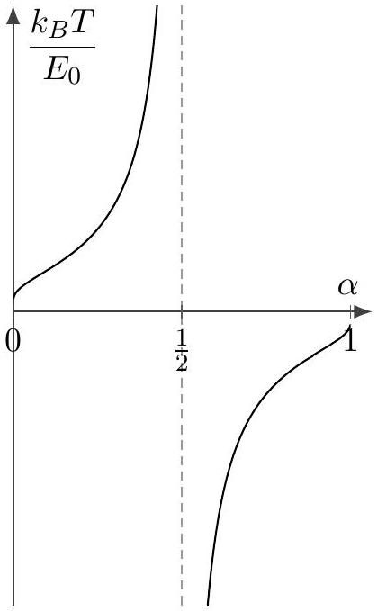

[5] Problem 14. This is a long problem, but a really useful one that ties a lot of things together. Consider a set of $N$ atoms, each of which may be in the ground state, with zero energy, or in an excited state with energy $E _ { 0 }$. Suppose it is only known that the total energy of the system is $\alpha N E _ { 0 }$.

(a) In P1, we discussed Stirling's approximation: for large $N , \log N ! \approx N \log N - N$. Using this result, show that the entropy of the system is
$$
S = N k _ { B } \left( \alpha \log \frac { 1 } { \alpha } + ( 1 - \alpha ) \log \frac { 1 } { 1 - \alpha } \right) .
$$
Sketch the entropy as a function of $\alpha$.
(b) Using the definition of temperature, $d S = d Q / T$, show that the system has a temperature of
$$
T = \frac { E _ { 0 } } { k _ { B } } \frac { 1 } { \log ( 1 - \alpha ) - \log \alpha } .
$$
Sketch the temperature as a function of $\alpha$. In particular, what temperature do you need to get $\alpha = 1 / 2$ ? How about $\alpha = 1$ ?
(c) Show that the third law is satisfied.
(d) Now consider just a single one of the $N$ atoms, where the total energy of the system is $\alpha N E _ { 0 }$ as before. Show that the probability it is excited obeys the Boltzmann distribution.

Solution. (a) We see that $\Omega = \binom { N } { \alpha N } = \frac { N ! } { ( \alpha N ) ! ( ( 1 - \alpha ) N ) ! }$, so

$$
\log \Omega \approx N \log N - \alpha N \log ( \alpha N ) - ( 1 - \alpha ) N \log ( ( 1 - \alpha ) N ) .
$$

Expanding the logarithms and simplifying, we get
$$
S = k _ { B } \log \Omega = N k _ { B } \left( \alpha \log \frac { 1 } { \alpha } + ( 1 - \alpha ) \log \frac { 1 } { 1 - \alpha } \right) .
$$
(b) We see that $d Q = N E _ { 0 } d \alpha$, and
$$
d S = N k _ { B } ( \log ( 1 - \alpha ) - \log \alpha ) d \alpha .
$$
Thus, $T = d Q / d S = \frac { E _ { 0 } } { k _ { B } } \frac { 1 } { \log ( 1 - \alpha ) - \log \alpha }$. Here is the graph of $T$ as a function of $\alpha$.

To get $\alpha = 0.5$ we need $T = \infty$, to get $\alpha > 0.5$ we need negative temperatures, and as $\alpha \rightarrow 1$, we have $T \rightarrow 0$ from the negative side. So the hottest possible temperature is just below zero! Though this sounds weird, it just means the natural variable is $1 / T$, which indeed decreases monotonically as $\alpha$ increases. Also, a system having negative temperature doesn't mean it's particularly violent. It just means we've temporarily driven it to $\alpha > 0.5$, so that when placed in contact with anything at positive temperature, it will tend to lose energy.
(c) As $\alpha \rightarrow 0$, we see $T \rightarrow 0$ and $S \rightarrow 0$. For the entropy, this requires an application of l'Hospital's rule, which shows that $\lim _ { \alpha \rightarrow 0 } \alpha \log \alpha = 0$.
(d) We know the probability is just $\alpha$, so
$$
\frac { p ( \text { excited } ) } { p ( \text { ground } ) } = \frac { \alpha } { 1 - \alpha } .
$$
By comparison, the Boltzmann distribution states that
$$
\frac { p ( \text { excited } ) } { p ( \text { ground } ) } = e ^ { - E _ { 0 } / k _ { B } T } .
$$
Therefore, the two expressions match if
$$
e ^ { - E _ { 0 } / k _ { B } T } = \frac { \alpha } { 1 - \alpha } .
$$
This is equivalent to the expression for $T$ we found in part (b), as desired.
