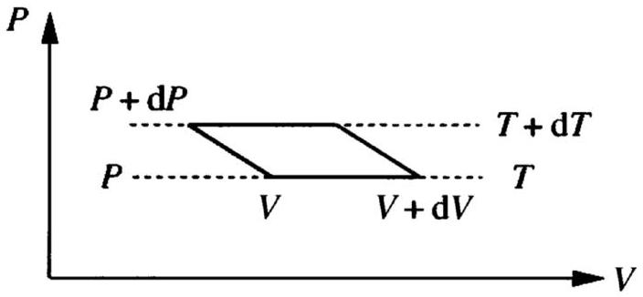

[3] Problem 24. In T1, we derived some properties of photon gases using basic kinetic theory. Here, we'll derive some more properties, starting from Planck's law and then sticking with pure thermodynamics. As in problem 23, we assume there is a photon gas at temperature $T$, with pressure $P$ within a cavity of volume $V$, whose walls are perfect blackbodies. (Note that since photons can be absorbed and emitted by the walls, it doesn't make sense to talk about $N$ as for an ideal gas. Instead, $N$ is determined by the other parameters. This actually makes things simpler, since there's one less variable to worry about.)
(a) It turns out that the pressure of the photon gas is $P = A T ^ { 4 }$ where $A$ is a constant. Explain why the pressure depends only on the temperature. (Harder, optional task: explain why $P \propto T ^ { 4 }$ starting from Planck's law.)
(b) Our next goal is to compute $U ( T , V )$. Consider an infinitesimal Carnot cycle, shown below.

By equating the efficiency of this cycle to the Carnot efficiency, find $\left. ( \partial U / \partial V ) \right| _ { T }$.

(c) By integrating this result, and using $U ( T , 0 ) = 0$, find $U ( T , V )$.
(d) We can now use these results to find $S ( T , V )$, just as we did for an ideal gas in problem 9, i.e. by considering the change of entropy during some infinitesimal process and then integrating the result. Do this in any way you like. Can the third law be satisfied?

Solution. (a) It's simply because the properties of blackbody radiation don't depend on the volume of its container. The ideal gas pressure depends on volume because increasing the volume dilutes the particles; for radiation, new photons are simply produced to get back up to the same pressure.
Integrating Planck's law gives the Stefan-Boltzmann law, which says the rate of emission of energy per unit area from the surface of a blackbody is $\sigma T ^ { 4 }$. But energy is directly related to momentum, $p = E / c$, and changes in momentum directly correspond to pressures by the usual kinetic theory argument. So when photons bounce off the inside walls of a blackbody, they impart pressure $P \propto \sigma T ^ { 4 }$.

(b) First, using the chain rule we have
$$
\left( \frac { \partial U } { \partial V } \right) _ { T } = \left( \frac { \partial Q } { \partial V } \right) _ { T } - P .
$$
That is, we need to compute $\left. ( \partial Q / \partial V ) \right| _ { T }$, the rate at which heat is absorbed along an isotherm. And that's exactly what we can find with this Carnot cycle argument.
The work done in the cycle is the area of the parallelogram, $d W = d V d P$. The Carnot efficiency is
$$
\eta = 1 - \frac { T } { T + d T } = \frac { d T } { T } .
$$
Thus, the heat input during the isotherm is
$$
\text { đ } Q _ { \text {in } } = \frac { d W } { \eta } = \frac { d V d P } { d T } T = 4 A T ^ { 4 } d V
$$
Combining this with the result above gives
$$
\left( \frac { \partial U } { \partial V } \right) _ { T } = 4 A T ^ { 4 } - P = 3 A T ^ { 4 } .
$$
(c) Integrating the above result with respect to volume gives
$$
U ( T , V ) = 3 A T ^ { 4 } V .
$$
(d) Let's consider an isothermal process. We just showed above that along an isotherm,
$$
đ Q = 4 A T ^ { 4 } d V .
$$
Therefore, we have
$$
d S = \frac { d Q } { T } = 4 A T ^ { 3 } d V
$$
and integrating gives
$$
S = 4 A T ^ { 3 } V + f ( T )
$$

where the unknown integration constant is any function of temperature. The third law of thermodynamics is satisfied precisely when $f ( T ) = 0$. (The fact that it can be satisfied is expected, since it is a quantum mechanical law and we are working with photons, the quanta of light.) This gives $S = 4 A T ^ { 3 } V$.

If you prefer, we can reframe the reasoning in the following way. Why isn't the Third Law obvious? It's because in the thermodynamics of gases, we only measure entropy changes $d S = d Q / T$, leaving the integration constant unknown. But when the temperature of a photon gas is lowered to zero, the entire gas just vanishes, as the photons get absorbed. And obviously, the entropy of an empty box should be zero! This reasoning doesn't work for an ideal gas because it doesn't just vanish as you cool it; instead, much weirder things happen, as quantum mechanics takes over.
(On the other hand, an indirect method works: consider a plasma of electrons and positrons and no net charge, in equilibrium with a photon gas. This system does vanish as the temperature goes to zero, because all the electrons and positrons will annihilate, and the produced photons will be absorbed. So given the absolute entropy of the photon gas, you can use thermodynamic arguments to deduce the absolute entropy of a plasma. It would probably then be possible to extend this argument to find the absolute entropy of an ideal gas, but this approach is a lot more trouble than just invoking the Third Law.)
In part (c), we found that the energy density is proportional to $T ^ { 4 }$, a result very closely related to the Stefan-Boltzmann law. Stefan was the experimentalist who proposed the law, and Boltzmann was the theorist who derived it. He didn't know about Planck's law, but he was able to use thermodynamic arguments similar to the ones used in this problem, along with the fact that pressure and energy density are proportional for radiation, to derive the result.
[5] Problem 25. Physics Cup 2013, problem 9.
Solution. See the official solutions here.

## 5 Heat Conduction

Idea 10: Fourier's Law
In T1, you investigated heat conduction from the standpoint of kinetic theory. Now we revisit the subject from the standpoint of hydrodynamics. The flux of heat (i.e. the power per unit area) due to thermal conduction is proportional to the temperature gradient,

$$
J = - \kappa \frac { \partial T } { \partial x } .
$$

By considering the net heat flowing in and out of a slab of width $d x$, we have

$$
\frac { \partial u } { \partial t } = - \frac { \partial J } { \partial x } = \kappa \frac { \partial ^ { 2 } T } { \partial x ^ { 2 } } .
$$

where $u$ is the energy density. Intuitively, this shows how heat conduction works to smooth out temperature gradients. For example, if the temperature had a local minimum, then $\partial u / \partial t$ would be positive at that point, as heat flows in from all directions.
