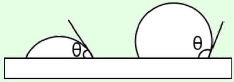
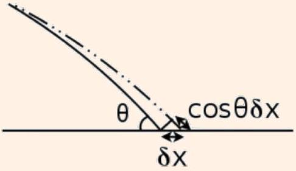
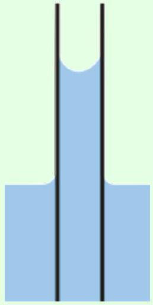
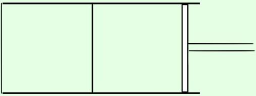
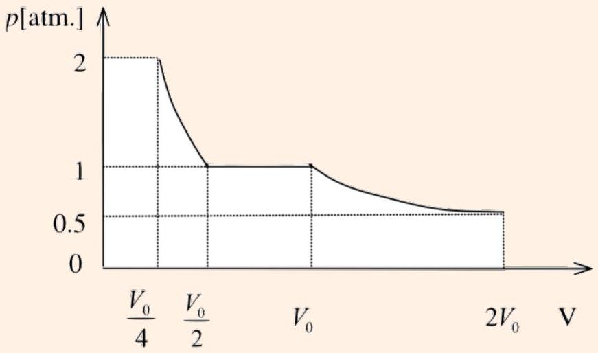
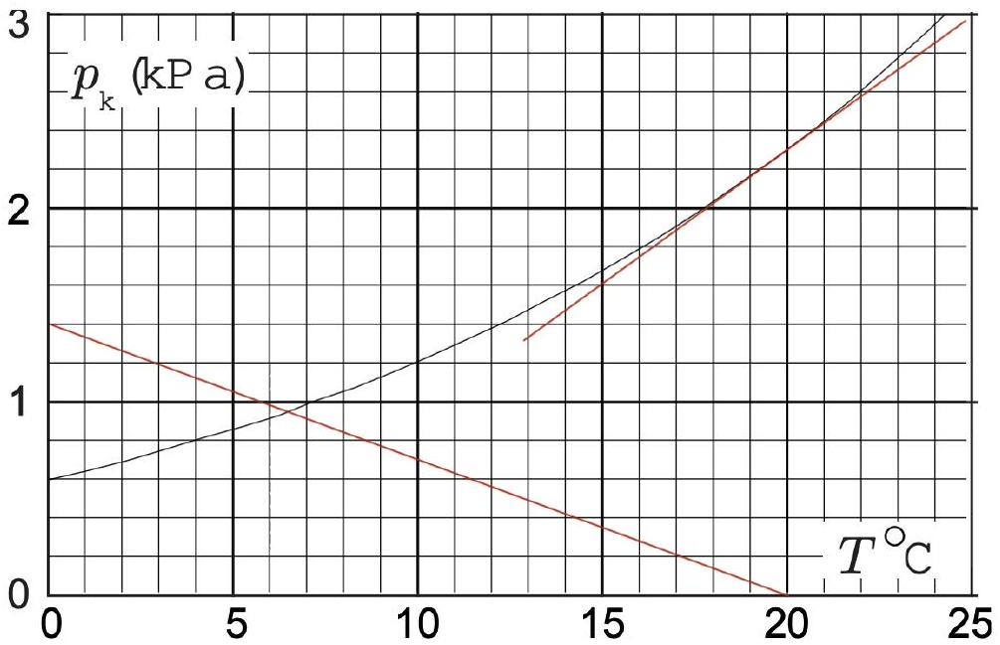
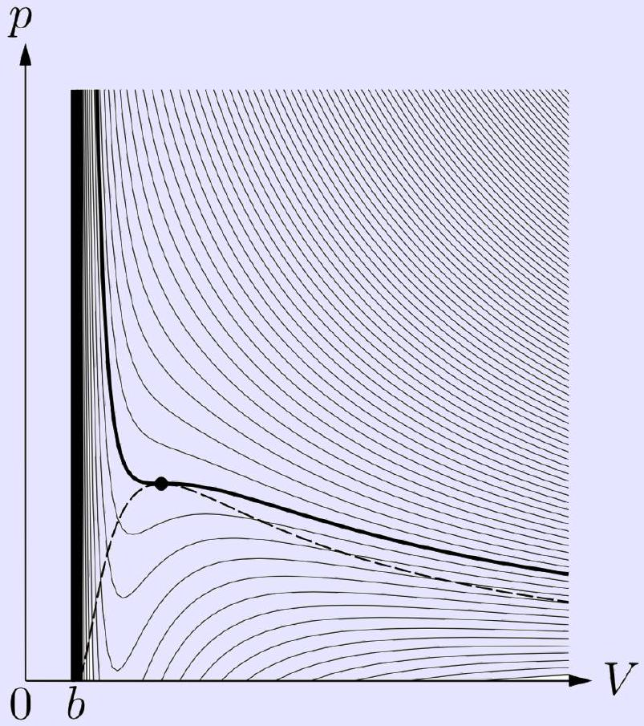
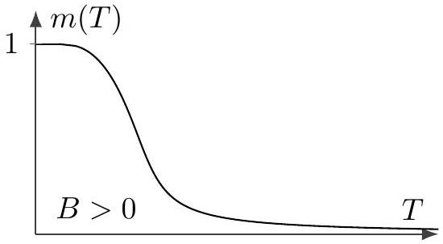
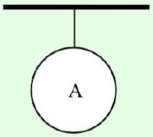
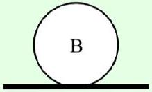

## Thermodynamics III

For more about surface tension, which can be quite tricky, see section 9.3 of Wang and Ricardo, volume 1, or Kalda's thermodynamics handout, which also covers humidity. Phase transitions are covered clearly in section 4.5 of Wang and Ricardo, volume 2. For more detail, chapter 17 of Blundell and Blundell covers various types of thermodynamic work, chapter 26 covers liquid-gas phase transitions, and chapter 28 covers phase transitions in general. There is a total of 78 points.

## 1 Surface Tension

Thermodynamics applies to many systems that aren't ideal gases, or even gases at all; in such systems the work is not necessarily $d W = - P d V$. The most important example is surface tension, which we saw in M2 and M7. We begin with the microscopic origin of surface tension.

Idea 1
For a liquid surface in air, there is an associated energy $\gamma A$ where $A$ is the area of the surface. This leads to a contribution to the work

$$
d W = \gamma d A .
$$

The surface tension $\gamma$ is also the force per length exerted along the surface.
The energy $\gamma A$ comes from the fact that liquid molecules at the surface are "missing" neighbors, and hence cannot lower their energy as much by forming cohesive bonds. (Technically, the same is true for the air molecules too, but air is very sparse compared to liquid, so we just ignore it.)
[3] Problem 1. Here, we use the above idea to very roughly estimate the surface tension of water.

(a) Estimate the spacing between water molecules. (Hint: you could use known atomic distance scales, or reverse engineer this from the known density of water.)
(b) Estimate the energy of a hydrogen bond, which is a weak type of chemical bond.
(c) Using these results, estimate the surface tension of water, and compare this to actual value $\gamma = 0.073 \mathrm {~N} / \mathrm { m }$.
(d) Estimate the typical height of a droplet of water on a flat surface.

Solution. (a) The size of one hydrogen atom is about $10 ^ { - 10 } \mathrm {~m}$, also known as an angstrom. Since water is $\mathrm { H } _ { 2 } \mathrm { O }$ and oxygen atoms are a bit bigger, we can estimate the distance between water molecules to be $10 ^ { - 9 } \mathrm {~m}$.

(b) The typical maximum energy scale of chemical bonds is about 1 eV. There are a few ways to do this. You can remember that the binding energy of an electron in a hydrogen atom is 13.6 eV, and the chemical bond energies are a bit smaller. Or, you can recall that the electrons in batteries are pushed by chemical reactions, and a typical battery voltage is 1 V. Hydrogen bonds are particularly weak, so their energy is about 0.1 eV.

(c) The number of water molecules per area $1 \mathrm {~m} ^ { 2 }$ is about $10 ^ { 18 }$, and the energy of each missing bond is $0.1 \mathrm { eV } = 1.6 \times 10 ^ { - 20 } \mathrm {~J}$, giving an estimate of about $0.01 \mathrm {~J} / \mathrm { m } ^ { 2 }$, within an order of magnitude of the true value.
(d) By dimensional analysis, this must be $h \sim \sqrt { \gamma / g \rho }$ where $\rho$ is the density of water. (This can also be obtained by heuristically minimizing the sum of gravitational potential energy and surface tension, where the first favors a small height and the second favors a large height.) Plugging in numbers, we get $h \sim 3 \mathrm {~mm}$, which is quite reasonable.
Another way of saying this is that there's only one dimensionless quantity you can build out of the given variables, $g \rho h ^ { 2 } / \gamma$. This is known as the Eotvos number, and quantifies the ratio of the importance of gravitational and surface tension forces (just like the Reynolds number you found in M7 quantifies the ratio of inertial and viscous forces). Since a droplet requires these forces to balance, the Eotvos number should be of order 1, recovering the answer.

Next, we consider problems that combine surface tension with ideas in thermodynamics.
[2] Problem 2 (PPP 62). Two soap bubbles of radii $R _ { 1 }$ and $R _ { 2 }$ are joined by a straw. Air goes from one bubble to the other and a single bubble of radius $R _ { 3 }$ is formed isothermally. The atmospheric pressure is $P$.

(a) If $R _ { 1 } < R _ { 2 }$, which bubble loses air and which bubble gains it?
(b) Show that if $\gamma$ is zero, then $R _ { 3 } ^ { 3 } = R _ { 1 } ^ { 3 } + R _ { 2 } ^ { 3 }$.
(c) When $\gamma$ is nonzero, the relation in part (b) is modified. Solve for $\gamma$ in terms of $R _ { 1 } , R _ { 2 } , R _ { 3 }$, and $P$. Is this a practical way to measure $\gamma$ for typical soap bubbles?

Solution. We use the fact, derived in M2, that a bubble with radius $R$ has excess pressure $4 \gamma / R$.

(a) The bubble with a smaller radius has a larger excess pressure. Thus when the bubbles are connected, bubble 1 will lose air, and bubble 2 will gain it.
(b) All the bubbles have the same temperature, and the number of moles adds, so the ideal gas law gives
$$
P _ { 1 } V _ { 1 } + P _ { 2 } V _ { 2 } = P _ { 3 } V _ { 3 } .
$$
If there is no surface tension, then all the $P _ { i }$ are equal to $P$, so $V _ { 3 } = V _ { 1 } + V _ { 2 }$.
(c) Accounting for the excess pressure, we have
$$
\left( P + \frac { 4 \gamma } { R _ { 1 } } \right) R _ { 1 } ^ { 3 } + \left( P + \frac { 4 \gamma } { R _ { 2 } } \right) R _ { 2 } ^ { 3 } = \left( P + \frac { 4 \gamma } { R _ { 3 } } \right) R _ { 3 } ^ { 3 }
$$
and solving for $\gamma$ gives
$$
\gamma = \frac { P } { 4 } \frac { R _ { 3 } ^ { 3 } - R _ { 1 } ^ { 3 } - R _ { 2 } ^ { 3 } } { R _ { 1 } ^ { 2 } + R _ { 2 } ^ { 2 } - R _ { 3 } ^ { 2 } } .
$$
Since $\gamma$ is small, the numerator will be quite small relative to the radii of the bubbles, so the answer will have a large relative error even if each length is determined precisely. So this method isn't very practical.

[2] Problem 3 (Cahn). A tightly closed jar is completely filled with water. At the bottom of the jar are two small air bubbles. The pressure at the top of the jar is $P _ { 0 }$, the radius of each bubble is $R _ { 0 }$, and the surface tension is $\gamma$. The two bubbles then merge isothermally. Calculate the new pressure at the top of the jar.
Solution. Since the air-water surface has only one "side", the excess pressure is $\Delta P = 2 \gamma / R _ { 0 }$. The process is isothermal and the number of moles of gas stays the same, so by the ideal gas law,
$$
\left( P _ { 1 } + \frac { 2 \gamma } { R _ { 1 } } \right) R _ { 1 } ^ { 3 } = 2 \left( P _ { 0 } + \frac { 2 \gamma } { R _ { 0 } } \right) R _ { 0 } ^ { 3 } .
$$
Since water is incompressible, the volume of gas should also stay the same, $R _ { 1 } ^ { 3 } = 2 R _ { 0 } ^ { 3 }$, which gives
$$
P _ { 1 } = P _ { 0 } + \frac { \gamma } { R _ { 0 } } \left( 2 - 2 ^ { 2 / 3 } \right) .
$$
[3] Problem 4. USAPhO 2007, problem A3.
[3] Problem 5. IPhO 2014, problem 1B.

Idea 2
One can also have liquid, solid, and air in the same problem, which leads to some complications. Let $A _ { l }$ and $A _ { s }$ be the surface areas of the liquid and solid exposed to the air, and $A _ { s l }$ be the surface area of the liquid-solid interface. Then there are three terms in the work,

$$
d W = \gamma _ { l } d A _ { l } + \gamma _ { s } d A _ { s } + \gamma _ { s l } d A _ { s l } .
$$

In other words, there are three surface tensions, one associated with each kind of interface.
Both $\gamma _ { l }$ and $\gamma _ { s }$ arise from the fact that cohesive liquid-liquid or solid-solid bonds are broken to form a surface. However, $\gamma _ { s l }$ is determined by the adhesive forces between the liquid and solid, which may lead to a positive or negative contribution to the energy.

Specifically, let's define the energy of adhesion $U _ { s l }$ to be the work needed, per area, to separate a liquid from a solid, thereby turning a liquid-solid interface into a liquid-air and solid-air interface. By the definitions above,

$$
U _ { s l } = \gamma _ { l } + \gamma _ { s } - \gamma _ { s l } .
$$

Now, $U _ { s l }$ can be computed in terms of microscopic chemical bond energies, like $\gamma _ { l }$ and $\gamma _ { s }$, so this result can also be thought of as a microscopic definition of $\gamma _ { s l }$. When a liquid is in contact with a solid, the solid exerts a force per length of $U _ { s l }$ on the boundary of the liquid, along the solid.

Example 1
The surface of a drop of water makes a contact angle $\theta$ with a solid, as shown.

When $\theta$ is acute, the surface is said to be hydrophilic. If $\theta$ is obtuse, it is hydrophobic. Find an expression for $\theta$ in terms of the relevant surface tensions.

## Solution

If the liquid drop expands outward by $\delta x$, the areas of various surfaces change, as shown.

The change in energy is

$$
d U \propto \gamma _ { s l } \delta x + \gamma _ { l } \cos \theta \delta x - \gamma _ { s } \delta x
$$

and this must be equal to zero in equilibrium. Thus,

$$
\cos \theta = \frac { \gamma _ { s } - \gamma _ { s l } } { \gamma _ { l } } = \frac { U _ { s l } } { \gamma _ { l } } - 1 .
$$

This is Young's equation. The liquid surface tension $\gamma _ { l }$ must be positive; otherwise the liquid could not exist stably at all, but rather would disperse into gas. Thus, the surface is hydrophilic when $U _ { s l } > \gamma _ { l }$ and hydrophobic when $U _ { s l } < \gamma _ { l }$.

As extreme cases, note that there is no solution for $\theta$ when $U _ { s l } > 2 \gamma _ { l }$. In this limit, the surface is so hydrophilic that the liquid spreads out and coats the entire solid; this is known as perfect wetting. There is also no solution when $U _ { s l } < 0$, in which case the liquid disperses into many tiny nearly spherical drops, each with a tiny area of contact with the solid.

This derivation was in terms of energy, which is typically easier for surface tension. The same result can be derived in terms of forces, but it's more subtle than it looks; the standard derivation in textbooks is wrong. For a clear derivation, see section 9.3 of Wang and Ricardo.

## Example 2

A very thin, hollow glass tube of radius $r$ is dipped vertically inside a container of water.

Find the equilibrium height of the water in the tube.

## Solution

We first encountered this problem in M7, where we solved it by using Pascal's principle, giving an answer in terms of the contact angle. The derivation above of the contact angle completes this solution. However, we can also solve the problem using energy or force.

In terms of energy, if we move the height of the water up by $\delta h$, then

$$
d U = \rho \pi r ^ { 2 } g h \delta h + \left( \gamma _ { s l } - \gamma _ { s } \right) 2 \pi r \delta h = 0
$$

and solving gives

$$
h = \frac { 2 \left( \gamma _ { s } - \gamma _ { s l } \right) } { \rho g r } = \frac { 2 \gamma _ { l } \cos \theta } { \rho g r }
$$

using Young's equation. Alternatively, in terms of force, consider the vertical forces acting on the column of water inside the tube. There is an upward force of adhesion from the solid wall of $2 \pi r U _ { s l }$, and a downward surface tension force from the liquid below of $2 \pi r \gamma _ { l }$. Then

$$
F = 2 \pi r \left( U _ { s l } - \gamma _ { l } \right) - \rho \pi r ^ { 2 } g h = 0
$$

which yields precisely the same result.

## Example 3

Fill a dish with water, and sprinkle something small over it, such as ground pepper. If you place a drop of detergent in the middle of the dish, then the pepper will "flee" away to the edges. Why does this happen?

## Solution

Detergent is a surfactant, meaning that it decreases the surface tension of water. When one places the detergent in the middle of the dish, it diffuses outward, making the surface tension temporarily higher near edges of the dish. This leads to an unbalanced surface tension force on the pepper grains, pulling them to the edges.

This phenomenon is called the Marangoni effect. Of course, the force vanishes once the detergent becomes uniformly distributed, and the surface tension is uniform again.

Remark
Here's a neat fact: the number of atoms that fit into a drop of water is comparable to the number of drops of water that fit inside the tallest mountains. We can show this using rough estimates, in the style of P1. Let $E _ { b }$ be the energy of a typical chemical bond, let $m$ be the mass of an atom, and let $d$ be the typical distance between atoms.

The size $\ell$ of a droplet of water, such as one that drips from a leaky ceiling, is the size where surface tension forces balance gravitational ones. By dimensional analysis, we must have

$$
\ell \sim \sqrt { \gamma / \rho g }
$$

as we showed in M7. Now, $\rho \sim m / d ^ { 3 }$, and the logic of problem 1 implies $\gamma \sim E _ { b } / d ^ { 2 }$, so

$$
\ell \sim \sqrt { E _ { b } d / m g . }
$$

Now consider the height $H$ of the tallest mountains. The height of mountains is limited by the rigidity of rock; if the pressure is too great, then the rock underneath the mountain will deform, causing it to sink into the ground. Let's consider an atom-thick column of this rock. If it sunk down by a distance $d$, then the gravitational potential energy harvested would be $m g H$. However, the atom at the bottom would have to break its chemical bonds with its horizontal neighbors, which takes energy $E _ { b }$. Balancing these gives a maximum height

$$
H \sim E _ { b } / m g .
$$

We have therefore shown that

$$
\ell \sim \sqrt { H d }
$$

which implies the original statement, within a few orders of magnitude.

## 2 Melting, Freezing, Boiling, Evaporation, and Condensation

Idea 3
A phase transition is a sudden, dramatic change in a system as thermodynamic variables such as the temperature are varied. Most of the ones you'll see have a latent heat

$$
Q = m L .
$$

For example, if ice is heated up, its temperature will gradually increase until it hits 0 °C. At that point, the temperature will remain constant until all of the ice is melted, i.e. when the full latent heat has been supplied.

Remark
We can roughly estimate the latent heats of melting and evaporation. In general, the latent heat can go into either in breaking molecular bonds, or increasing the entropy.

When a solid melts into a liquid, the molecules stay right next to each other, so changing bond energy isn't the dominant effect. Instead, it's the increase in entropy as the liquid molecules become free to move and rotate. Let's suppose that the molecules, each of mass $m _ { \text {mol } }$, each gain a few extra possible quantum states. This corresponds to an entropy increase per molecule $\Delta S \sim k _ { B }$, which means a latent heat per mass of

$$
L = \frac { T \Delta S } { m _ { \mathrm { mol } } } \sim \frac { k _ { B } T } { m _ { \mathrm { mol } } } = \frac { R T } { \mu }
$$

where $\mu$ is the molar mass, or equivalently a latent heat per mole $\mathcal { L } \sim R T$. For water, we get $L \sim 10 ^ { 5 } \mathrm {~J} / \mathrm { kg }$, which is of the same order of magnitude as the true value $3.3 \times 10 ^ { 5 } \mathrm {~J} / \mathrm { kg }$.

When a liquid becomes a gas, the dominant effect is typically the huge increase in entropy $k _ { B } \log \left( V _ { \text {gas } } / V _ { \text {liq } } \right)$ per molecule because they get much more space to move. The ratio inside the logarithm is huge, which means that while the volumes per molecule $V _ { \text {gas } }$ and $V _ { \text {liq } }$ vary by order-one amounts between phase transitions, the logarithm of their ratio is always around the same value, which turns out to be about 10. This gives a latent heat per mass of

$$
L \sim \frac { 10 k _ { B } T } { m _ { \mathrm { mol } } } = \frac { 10 R T } { \mu } .
$$

This result is called Trouton's rule, and it is surprisingly accurate for most liquids. However, the latent heat of vaporization for water is noticeably higher, $L = 2.26 \times 10 ^ { 6 } \mathrm {~J} / \mathrm { kg }$. This is because of the extra energy needed to break hydrogen bonds.

[3] Problem 6. The temperature $T$ at which a phase transition happens depends on the pressure $P$, yielding a "coexistence curve" $P ( T )$ where the two phases can be in equilibrium with each other. The exact relationship is given by the Clausius-Clapeyron equation
$$
\frac { d P } { d T } = \frac { L } { T \left( V _ { 2 } - V _ { 1 } \right) }
$$
where $L$ is the total latent heat for some amount of material, and $V _ { 2 }$ and $V _ { 1 }$ are the corresponding volumes of that material when it is in each of the phases. (Depending on convention, $L$ could be the latent heat per mole, in which case the $V _ { i }$ are volumes per mole, or both quantities could be per unit mass, in which case the $V _ { i }$ become densities.) In this problem, you will derive this equation.
    (a) Consider an infinitesimal Carnot cycle operating between temperatures $T$ and $T + d T$, and pressures $P$ and $P + d P$, chosen so that the isothermal heating and cooling steps involve supplying latent heat. Compute the work done by the cycle.
    (b) Argue that we may ignore all heat transfer except for the latent heat.
    (c) Derive the Clausius-Clapeyron equation by setting the efficiency equal to the Carnot efficiency.

This classic setup is also considered in the second half of USAPhO 2023, problem A3.

Solution. (a) Almost all the work is done in the isothermal processes, due to the changes in volume in the phase transitions. (The adiabatic steps are negligible, because not only is the temperature change infinitesimal, but the volume change is also infinitesimal!) The positive work is thus $( P + d P ) \left( V _ { 2 } - V _ { 1 } \right)$ and the negative work is $P \left( V _ { 2 } - V _ { 1 } \right)$, giving

$$
W = \left( V _ { 2 } - V _ { 1 } \right) d P .
$$

(b) The non-latent heat transfer is infinitesimal compared to the latent heat, since it is proportional to $d T$, so we only need to count the latent heat $Q _ { \text {in } } = L$. (This is also very nearly the same as $Q _ { \text {out } }$, with the difference being the infinitesimal amount of work done.)
(c) The efficiency $\epsilon = W / Q _ { \text {in } }$ is equal to $d T / T$ by expanding the Carnot efficiency, so
$$
\frac { d T } { T } = \frac { \left( V _ { 2 } - V _ { 1 } \right) d P } { L }
$$
which is just what we want after a little rearranging.

[3] Problem 7. [A] In this exercise you'll find a quicker, more advanced derivation of the Clausius-Clapeyron equation.

(a) The Gibbs free energy is defined as $G = U + P V - T S$. Show that for reversible processes,
$$
d G = V d P - S d T .
$$
Two phases can only be in thermodynamic equilibrium if they have the same Gibbs free energy per molecule. Otherwise, turning one phase to the other would reduce the Gibbs free energy, which turns out to be equivalent to increasing the entropy of the universe. (For more details, see section 16.5 of Blundell and Blundell.)
(b) Suppose that the Gibbs free energies per molecule $G / N$ for two phases are equal at temperature $T _ { 0 }$ and pressure $P _ { 0 }$. Derive the Clausius-Clapeyron equation by demanding this is also true at temperature $T _ { 0 } + d T$ and $P _ { 0 } + d P$.

Solution. (a) By the first law, we have $d Q = d U + d W$, where $d W = P d V$ and, by reversibility, $d Q = T d S$. Differentiating the definition of Gibbs free energy, we have

$$
d G = d U + P d V + V d P - T d S - S d T = T d S - P d V + P d V + V d P - T d S - S d T
$$

which simplifies to the desired answer.

(b) Consider a sample of the first phase with a given total particle number $N$. The change in Gibbs free energy along the coexistence curve is
$$
d G _ { 1 } = V _ { 1 } d P - S _ { 1 } d T .
$$
Similarly, for the second phase,
$$
d G _ { 2 } = V _ { 2 } d P - S _ { 2 } d T .
$$
By the definition of the coexistence curve, these two must be equal, so
$$
\left( V _ { 1 } - V _ { 2 } \right) d P = \left( S _ { 1 } - S _ { 2 } \right) d T .
$$
We also know that $S _ { 2 } - S _ { 1 } = L / T$, so rearranging gives the desired result.

Remark: Thermodynamic Potentials
You might sometimes see the Clausius-Clapeyron equation written in terms of a difference in enthalpy $\Delta H$ rather than a latent heat. The enthalpy is the state function $H = U + P V$, so

$$
d H = V d P + đ Q .
$$

This is useful because many lab experiments happen at constant pressure, $d P = 0$, leaving $d H = d Q$. That is, only heat changes the enthalpy, so the latent heat of a phase transition must be the difference in enthalpies of the two phases, $L = \Delta H$. That in turn is useful because enthalpy is a state function, so given a new phase transition you can calculate $L$ by just looking up the enthalpy values for each of the phases in a table.

We've now covered all the classic "thermodynamic potentials". As we just saw, the enthalpy $H$ is useful for bookkeeping heat. As we saw in T2, the Helmholtz free energy $F$ is minimized in thermodynamic equilibrium, given constant temperature and volume. (This is the relative of the statement that the system's internal energy $U$ is minimized in equilibrium, given constant entropy and volume, which is just the usual statement of mechanical equilibrium.) And as we saw in the problem above, the Gibbs free energy $G$ is minimized in thermodynamic equilibrium, given constant temperature and pressure.

More generally, what's going on is that the number of possibly useful potentials doubles every time we add another pair of "thermodynamic conjugate variables". Before learning about thermodynamics, we just had $U$. When we learned about temperature and entropy, we additionally cared about $F$. And now upon accounting for pressure and volume, we have $H$ and $G$. If we had another pair, such as magnetization and external magnetic field, we could define 4 more potentials, which would each be useful in different situations.
[2] Problem 8. Ice skaters can move with little friction because they actually glide on a thin layer of water. Estimate how heavy an ice skater has to be to melt ice by just standing on their skates, assuming the ice is at temperature -5 °C.

Solution. To melt the ice, we need to apply enough pressure to reach the water-ice equilibrium point, which we can find with the Clausius-Clapeyron equation. We need to reach 0°C, so

$$
\Delta T = 5 ^ { \circ } \mathrm { C } = 5 \mathrm {~K} , \quad T = 273 \mathrm {~K} .
$$

The Clausius-Clapeyron equation gives

$$
P = \frac { \Delta T } { T } L \left( \frac { 1 } { \rho _ { i } } - \frac { 1 } { \rho _ { w } } \right) ^ { - 1 } \approx 6.76 \times 10 ^ { 7 } \mathrm {~Pa}
$$

where we used

$$
\rho _ { i } = 917 \mathrm {~kg} / \mathrm { m } ^ { 3 } , \quad \rho _ { w } = 1000 \mathrm {~kg} / \mathrm { m } ^ { 3 } , \quad L = 334000 \mathrm {~J} / \mathrm { kg } .
$$

Ice skate blades have a thickness of around 1 mm and a length of around 25 cm, so the total area with two feet will be around $5 \times 10 ^ { - 4 } \mathrm {~m} ^ { 2 }$. The weight $P A$ needed will then be around $30,000 \mathrm {~N}$, corresponding to a mass of about 3,000 kg. Thus, unless you are incredibly massive, or the ice is very close to melting already, pressure alone is not enough to melt the ice. Scientists are still arguing over the true explanation; you can see a recent review here.

Now we focus on the specifics of liquid-gas phase transitions.

[3] Problem 9. Suppose that at pressure $P _ { 0 }$, a liquid-gas phase transition takes place at temperature $T _ { 0 }$. Assume the gas obeys the ideal gas law, and neglect the volume of the liquid.
    (a) Assuming the latent heat is temperature-independent, compute the coexistence curve $P ( T )$.
    (b) In reality, the latent heat has a mild dependence on temperature, changing the results. As a crude model, suppose that the latent heat per molecule for a monatomic liquid-gas phase transition has two components: a fixed energy $E _ { 0 }$ required to break the bonds with other molecules in the liquid, and the $P d V$ work that must be done to "push" the rest of the gas away, since the new gas molecule takes up space. Under these assumptions, what is the latent heat per molecule, and qualitatively how does the dependence $P ( T )$ change?
    (c) A closed container of constant volume contains both liquid and gas in equilibrium, at temperature $T$. Let the latent heat of vaporization per mole be $\mathcal { L }$, and neglect the volume of the liquid. If the temperature is increased by a very small amount $\Delta T$, by what factor does the number of moles in gas form change?

Solution. (a) We have $V _ { 2 } = n R T / P$ and $V _ { 1 }$ can be ignored, so

$$
\frac { d P } { d T } = \frac { L } { n R } \frac { P } { T ^ { 2 } } .
$$

Separating and integrating,

$$
\int _ { P _ { 0 } } ^ { P } \frac { d P } { P } = \int _ { T _ { 0 } } ^ { T } \frac { L } { n R T ^ { 2 } } d T
$$

which gives

$$
P ( T ) = P _ { 0 } e ^ { - \frac { L } { n R } \left( \frac { 1 } { T } - \frac { 1 } { T _ { 0 } } \right) } \propto e ^ { - L / n R T } .
$$

(b) The latent heat per molecule is now
$$
\mathcal { L } = E _ { 0 } + P \Delta V
$$
where $\Delta V$ is the change in volume due to that molecule. But $\Delta V = V / N$, so
$$
\mathcal { L } = E _ { 0 } + \frac { P V } { N } = E _ { 0 } + k _ { B } T .
$$
The total latent heat is $L = N \mathcal { L }$. The Clausius-Clapeyron equation now looks like
$$
\frac { d P } { d T } = \frac { E _ { 0 } } { k _ { B } } \frac { P } { T ^ { 2 } } + \frac { P } { T } .
$$
Separating and integrating gives
$$
\int \frac { d P } { P } = \frac { E _ { 0 } } { k _ { B } } \int \frac { d T } { T ^ { 2 } } + \int \frac { d T } { T }
$$
which gives
$$
P ( T ) = P _ { 0 } \left( \frac { T } { T _ { 0 } } \right) e ^ { - \frac { E _ { 0 } } { k _ { B } } \left( \frac { 1 } { T } - \frac { 1 } { T _ { 0 } } \right) } .
$$
In other words, compared to part (a) where we neglected the $P \Delta V$ contribution, there is now an additional linear temperature dependence.

(c) We apply the Clausius-Clapeyron equation to a small temperature change,
$$
\frac { \Delta P } { \Delta T } \approx \frac { \mathcal { L } } { T \mathcal { V } }
$$
where $\mathcal { L }$ and $\mathcal { V }$ are the latent heat per mole and volume per mole. By the ideal gas, $\mathcal { V } = R T / P$. Then
$$
\frac { \Delta P } { \Delta T } = \frac { \mathcal { L } } { R T ^ { 2 } / P }
$$
which solves to give
$$
\frac { \Delta P } { P } = \frac { \mathcal { L } } { R T } \frac { \Delta T } { T } .
$$
The ideal gas law tells us that $P \propto n T$, which means for small changes,
$$
\frac { \Delta P } { P } \approx \frac { \Delta n } { n } + \frac { \Delta T } { T } .
$$
Combining these results,
$$
\frac { n + \Delta n } { n } = 1 + \frac { \Delta P } { P } - \frac { \Delta T } { T } = 1 + \frac { \Delta T } { T } \left( \frac { \mathcal { L } } { R T } - 1 \right) .
$$
In other words, while the pressure and temperature of the vapor both certainly go up, whether the number of moles goes up or down depends on the specific substance! However, most liquids obey Trouton's rule, $\mathcal { L } \approx 10 R T$, as explained in a remark above, so that $\mathcal { L } / R T - 1$ is positive and the number of moles of gas goes up.

Example 4: APhO 2004.3
A cylinder is divided into two parts by a mobile partition, which is free to move and conducts heat well. One compartment contains one mole of water vapor, and the other contains one mole of nitrogen gas. Initially, both compartments have volume $V _ { 0 }$, pressure 0.5 atm, and temperature 373 K. A piston is then slowly inserted, compressing the system isothermally.

Sketch the $P ( V )$ curve.

Solution
The answer is shown below.

Initially, we just have an ordinary isothermal compression. Both the water vapor and nitrogen gas compartments are compressed at the same rate, since they must have equal pressures and temperatures. When the total volume is halved, the pressure in both reaches one atmosphere. Now, water condenses at temperature 373 K at pressure $p = 1 \mathrm {~atm}$. Thus, as the volume continues to decrease, the pressure stays constant, the nitrogen compartment's volume stays the same, and the water compartment shrinks, as the vapor gradually condenses to liquid. This process completes once all the vapor is condensed, which is roughly when the total volume has halved again. After this point, we again have ordinary isothermal compression, of the nitrogen gas alone.
[3] Problem 10. NBPhO 2016, day 2, problem 2. A problem on phase transitions with data analysis.
[3] Problem 11. USAPhO 2015, problem A4. A heat engine with phase transitions.
In practice, water on Earth is more subtle because there are three substances at play: liquid water, water vapor, and the rest of the atmosphere.

Idea 4: Humidity
Consider a box at constant temperature $T$ containing only water, and let $P ( T )$ be the liquid water-water vapor coexistence curve. In equilibrium, if we apply any pressure below $P ( T )$, all of the water will be in vapor form, and if we apply any pressure above $P ( T )$, all of the water will be in liquid form. Physically, applying a higher pressure forces the water vapor to condense into liquid, as it packs the molecules closer together, and applying a lower pressure forces the liquid to evaporate into vapor, as it cannot hold itself together against the thermal motion of the molecules. Coexistence is impossible, except at exactly the pressure $P ( T )$.

However, in everyday life, the two easily coexist over a wide range of pressures. The subtlety is that the total air pressure has two contributions,

$$
P _ { \mathrm { tot } } = P _ { \mathrm { atm } } + P _ { \mathrm { vap } }
$$

where the first is the pressure due to atmospheric gases, such as nitrogen and oxygen, and the second is the pressure due to water vapor in the air. In everyday conditions, $P _ { \text {atm } }$ is about 100 times larger than $P _ { \text {vap } }$, and the liquid water feels the pressure $P _ { \text {tot } }$. But water vapor evaporates and condenses independently of the air, so $P _ { \text {atm } }$ has no effect on it at all. As a result, in equilibrium liquid water and water vapor can coexist, with the vapor having a pressure

$P _ { \text {vap } } = P ( T )$. The coexistence curve $P ( T )$ is thus also called the (equilibrium) vapor pressure.
The relative humidity $\phi$ is defined as

$$
\phi = P _ { \mathrm { vap } } / P ( T )
$$

and quantifies how saturated the air is with water vapor; under normal atmospheric conditions $\phi < 1$. The dew point $T _ { d }$ satisfies

$$
P \left( T _ { d } \right) = P _ { \mathrm { vap } }
$$

and represents the temperature at which water would begin condensing out of a given parcel of air, cooled at constant pressure. This determines, e.g. the height at which rising air turns into a cloud, which explains why some clouds have flat bottoms.

The boiling temperature $T _ { b }$ satisfies

$$
P \left( T _ { b } \right) = P _ { \mathrm { tot } } .
$$

This is the temperature at which a bubble of pure water vapor, which forms inside the liquid, has a high enough pressure to push the liquid away and continue to expand. Beyond this temperature, liquid water can't exist; it all turns to vapor. When boiling water on the stove, the produced water vapor flies away, so that $P _ { \text {tot } } \approx P _ { \text {atm } }$. In a sealed pressure cooker, the vapor accumulates, increasing $P _ { \text {tot } }$. This increases $T _ { b }$, allowing food to cook faster.

At the interface between two liquids, boiling can start at a significantly lower temperature than the boiling temperature of either liquid, because both of the liquids contribute to the vapor pressure. This is called border boiling, and is treated in IZhO 2020, problem 2.

Example 5
How does alcohol distillation work?

Solution
Let alcohol and water have coexistence curves/equilibrium vapor pressures of $P _ { a } ( T )$ and $P _ { w } ( T )$. The vapor pressure of alcohol is higher, with pure alcohol boiling at about 80° C.

Consider heating a mixture of alcohol and water, with mole fractions $X _ { a }$ and $X _ { w }$, with $X _ { a } + X _ { w } = 1$. If a small bubble of gas forms inside, then Raoult's law states that both alcohol and water vapor will be present, and contribute independently in proportion to their mole fractions. Then the boiling point satisfies

$$
X _ { a } P _ { a } \left( T _ { b } \right) + X _ { w } P _ { w } \left( T _ { b } \right) = P _ { \text {atm } } .
$$

This is between the individual boiling points of alcohol and water. By the ideal gas law, the ratio of mole fractions of alcohol and water in the vapor is the ratio of partial vapor pressures,

so
$$
\frac { X _ { a } ^ { \prime } } { X _ { w } ^ { \prime } } = \frac { X _ { a } } { X _ { w } } \frac { P _ { a } \left( T _ { b } \right) } { P _ { w } \left( T _ { b } \right) } > \frac { X _ { a } ^ { \prime } } { X _ { w } ^ { \prime } }
$$
since $P _ { a } \left( T _ { b } \right) > P _ { w } \left( T _ { b } \right)$.

By the above logic, we could get completely pure alcohol by just repeating the distillation procedure several times. Actually, it's more complicated than that because the alcohol and water molecules will interact, causing Raoult's law to break down; our calculation above only applies for an "ideal mixture". For more about distillation, see these notes.

[3] Problem 12. Kalda Thermodynamics, problem 22. A problem on practically measuring humidity.
Solution. (a) The dry bulb thermometer is just at room temperature, $T _ { 0 } = 20 ^ { \circ } \mathrm { C }$. Meanwhile, the wet bulb thermometer is cooled down by evaporation. In this part, we are neglecting heat conduction, so equilibrium is only reached when evaporation from the wet bulb stops. This occurs when the relative humidity at the wet bulb thermometer itself reaches 100\%.
Let $p _ { s } ( T )$ be the saturation pressure as shown in the graph. The vapor pressure of water vapor in the room is
$$
p _ { a } = r p _ { s } \left( T _ { 0 } \right) = ( 0.9 ) ( 2.3 \mathrm { kPa } ) = 2.07 \mathrm { kPa }
$$
by reading off the graph. The wet bulb temperature $T$ satisfies
$$
p _ { a } = p _ { s } ( T )
$$
and from the graph we read off $T = 18.5 ^ { \circ } \mathrm { C }$. Thus, the difference is $1.5 ^ { \circ } \mathrm { C }$.
    (b) We balance the heat flowing in and out of the wet bulb thermometer,
$$
a \left( T _ { 0 } - T \right) = b \left( p _ { s } ( T ) - p _ { a } \right) .
$$
In this part, $p _ { a }$ is zero, so we have
$$
- 65 \mathrm {~Pa} / \mathrm { K } = \frac { p _ { s } ( T ) } { T - T _ { 0 } } .
$$
Therefore, to find $T$, we draw a line on the graph passing through $p = 0$ and $T = 20 ^ { \circ } \mathrm { C }$ and slope $- 65 \mathrm {~Pa} / \mathrm { K }$. The solution is where this line intersects the curve $p _ { s } ( T )$, giving $6.5 ^ { \circ } \mathrm { C }$.

(c) The temperature we're looking for satisfies
$$
- 65 \mathrm {~Pa} / \mathrm { K } = \frac { p _ { s } ( T ) - r p _ { s } \left( T _ { 0 } \right) } { T - T _ { 0 } } .
$$
The solution will be near $T _ { 0 }$ itself, which means it suffices to approximate $p _ { s } ( T )$ near $T _ { 0 } = 20 ^ { \circ } \mathrm { C }$. By reading off the graph again, we have the linear approximation
$$
p _ { s } ( T ) \approx 2.3 \mathrm { kPa } + \left( T - T _ { 0 } \right) \left( 0.14 \mathrm { kPa } / { } ^ { \circ } \mathrm { C } \right) .
$$
Plugging in and simplifying, we find the temperature difference obeys
$$
\Delta T \approx \left( 11 ^ { \circ } \mathrm { C } \right) ( 1 - r ) .
$$
Any answer within ~ 15\% of this is good enough.
(d) The way evaporation works is that every water molecule on the laundry has some probability per time of jumping off, while every water molecule in the surrounding air has some probability per time for sticking to the laundry. The two processes balance when the humidity is 100\%. Thus, the net rate of evaporation is proportional to $1 - r$, which means the laundry in 80\% humidity dries 4 times faster than in 95\% humidity.

[3] Problem 13. NBPhO 2006, problem 1. (Note that the comma in the density of air in part 4 denotes a decimal point.)

## 3 General Phase Transitions

In this section we'll illustrate some of the ideas needed to analyze phase transitions in general.
Idea 5
A nonideal gas can be described by the van der Waals equation of state,

$$
\left( P + \frac { a n ^ { 2 } } { V ^ { 2 } } \right) ( V - n b ) = n R T .
$$

You derived the pressure correction in T1 assuming weak attractive intermolecular forces; the modification of the volume accounts for the fact that the molecules can't overlap each other. Remarkably, this equation of state also contains a liquid-gas phase transition!

To see this, consider a plot of the isotherms on a PV diagram.

At low temperatures, the isotherms can have negative compressibility, meaning that the pressure decreases as the volume decreases. This is unphysical, and means that the fluid is unstable at these points: if you push on it, it'll just keep shrinking, until it condenses into a dense liquid. Therefore, parts of these isotherms should be replaced with horizontal lines; along these horizontal parts liquid and gas coexist, in varying proportions.

Specifically, everything underneath the dotted line should be replaced with horizontal lines. As described in more detail in section 26.1 of Blundell, this can be shown by demanding that the liquid and gas have equal Gibbs free energy. As a result, the total area on the PV diagram of the isotherm that goes underneath the horizontal line equals the area that goes above it; this is called Maxwell's equal area rule.

There is a critical isotherm marked in bold above. Above this temperature, there is no liquid-gas phase transition at all; instead we just have one phase, called a supercritical fluid. Specifically, this is the temperature of the first isotherm that no longer has a local minimum in pressure, which means

$$
\left( \frac { \partial P } { \partial V } \right) _ { T } = \left( \frac { \partial ^ { 2 } P } { \partial V ^ { 2 } } \right) _ { T } = 0
$$

at the critical temperature $T = T _ { c }$. As you will see in problem 14, this occurs at

$$
V _ { c } = 3 n b , \quad T _ { c } = \frac { 8 a } { 27 R b } , \quad P _ { c } = \frac { a } { 27 b ^ { 2 } } .
$$

This point, marked above, is called the critical point.

Remark
The van der Waals equation of state is accurate for a sparse gas with weak attractive interactions; you shouldn't expect it to be accurate for dense gases or the liquid state. However, it still is extremely important because it is one of the simplest equations of state that gives a liquid-gas phase transition. Moreover, if you zoom in near the critical point and write the pressure, volume, and temperature as multiples of the critical pressures, volumes, and temperatures, it turns out that all equations of state give the same results! This deep phenomenon is called universality, and is explained with the renormalization group.
[3] Problem 14. INPhO 2018, problem 6. A series of exercises on the van der Waals gas. Feel free to look up definitions for part (a).
[4] Problem 15. [A] Here we'll introduce a simple model for a ferromagnetic phase transition. Consider $N$ electrons, which may have spins $s _ { i } = \pm 1$. The energy of a configuration is

$$
E = - B \sum _ { i } s _ { i } - \frac { J } { 2 N } \sum _ { i \neq j } s _ { i } s _ { j } .
$$

The first term represents the effect of an external magnetic field $B$, while the second term represents an interaction, with strength described by the constant $J$, which tries to make the spins parallel. (In this simple model, we suppose all distinct pairs of spins interact equally. We could also make spins only interact with their neighbors, but this would complicate the analysis.)

(a) Define the average magnetization as $m = \sum _ { i } s _ { i } / N$. Find $E ( m )$, the energy in terms of $m$ and the other constants in the problem.
(b) For a fixed value of $m$, write down the number of states $\Omega ( m )$ with that magnetization.
(c) The probability of having a given value of $m$ is proportional to $e ^ { - \beta E ( m ) } \Omega ( m )$. Argue that this probability is maximized for the value of $m$ that minimizes the free energy
$$
F = E - T S .
$$
Hence the equilibrium configuration minimizes the free energy. This is the statistical mechanical way to argue that $F$ is minimized; the thermodynamic way was covered in T2.
(d) Assuming that $N \gg 1$ and using the approximation for $\log N$ ! mentioned in T2, show that the free energy $F ( m )$ is minimized when
$$
m = \tanh ( \beta B + \beta J m ) , \quad \beta = \frac { 1 } { k _ { B } T } .
$$
For a fixed $B > 0$, plot $m ( T )$. This should match with Curie's law, which you proved in T1.
(e) For $B = 0$, show there exists a critical temperature $T _ { c }$, above which $m ( T )$ is zero and below which it is nonzero. Also, find an approximate expression for the magnetization just below $T _ { c }$.
(f) For $T = T _ { c }$, find an approximate expression for $m$ for small $B$.

This is a phase transition where the material spontaneously becomes magnetized, and the simplest example of a phase transition which can be understood analytically. Though the results in (e) and (f) depend on the detailed parameters, the scalings found in these parts are universal, in the sense that they also apply to a wide variety of similar models.

Solution. (a) The first term is easy,

$$
- B \sum _ { i } s _ { i } = - N m B .
$$

To do the second term, we note that

$$
\sum _ { i \neq j } s _ { i } s _ { j } = \sum _ { i } \sum _ { j } s _ { i } s _ { j } - \sum _ { i } s _ { i } s _ { i } = \left( \sum _ { i } s _ { i } \right) ^ { 2 } - \sum _ { i } s _ { i } ^ { 2 } = N ^ { 2 } m ^ { 2 } - N .
$$

We hence have

$$
E = - N m B - \frac { 1 } { 2 } J N m ^ { 2 } + \frac { 1 } { 2 } J .
$$

(b) Of all $N$ electrons, $N _ { + }$have $s _ { i } = + 1$ and $N _ { - }$have $s _ { i } = - 1$, where $N _ { + } + N _ { - } = N$ and $m N = N _ { + } - N _ { - }$. Thus $N _ { + } = N / 2 + m N / 2$ and $N _ { - } = N / 2 - m N / 2$. The number of states is $N$ choose $N _ { + }$.
$$
\Omega ( m ) = \frac { N ! } { \left( \frac { N } { 2 } ( 1 + m ) \right) ! \left( \frac { N } { 2 } ( 1 - m ) \right) ! } .
$$
(c) The probability $P ( m ) = e ^ { - \beta E ( m ) } \Omega ( m )$ is found with Boltzmann's theorem, where each state has a probability of $e ^ { - E / k _ { B } T }$, so $\beta = 1 / k _ { B } T$. Maximizing $P ( m )$ is the same as maximizing $\log ( P ( m ) )$, which gives
$$
\log ( P ( m ) ) = - \frac { E } { k _ { B } T } + \log ( \Omega ( m ) ) .
$$
Since we're optimizing with respect to $m$, we can multiply both sides by $- k _ { B } T$ and maximize $P ( m )$ by minimizing $- k _ { B } T \log ( P ( m ) )$.
$$
- k _ { B } T \log ( P ( m ) ) = E - T k _ { B } \log ( \Omega ( m ) ) = E - T S .
$$
This is just the expression for free energy, thus minimizing free energy for a given value of $m$ will maximize the probability.
(d) Using $\log N ! \approx N \log N - N$ gives
$$
\log \left( \frac { N ! } { \left( \frac { N } { 2 } ( 1 + m ) \right) ! \left( \frac { N } { 2 } ( 1 - m ) \right) ! } \right) \approx N \log N - \frac { N } { 2 } ( 1 + m ) \log \frac { N ( 1 + m ) } { 2 } - \frac { N } { 2 } ( 1 - m ) \log \frac { N ( 1 - m ) } { 2 } .
$$
To simplify this, we can expand the logarithms to get
$$
N \left( \log N - \frac { 1 + m } { 2 } \left( \log N + \log \frac { 1 + m } { 2 } \right) - \frac { 1 - m } { 2 } \left( \log N + \log \frac { 1 - m } { 2 } \right) \right)
$$
and various factors cancel to give
$$
- N \left( \frac { 1 + m } { 2 } \log \frac { 1 + m } { 2 } + \frac { 1 - m } { 2 } \log \frac { 1 - m } { 2 } \right) .
$$
Setting $d F / d m$ to zero gives
$$
0 = - N B - N J m - T \frac { \partial S } { \partial m }
$$

which is equivalent to
$$
N ( B + J m ) = - k _ { B } T \frac { \partial \log \Omega } { \partial m } = N k _ { B } T \left( \frac { 1 } { 2 } \log \frac { 1 + m } { 2 } - \frac { 1 } { 2 } \log \frac { 1 - m } { 2 } \right) .
$$
Then we have
$$
\beta B + \beta J m = \frac { 1 } { 2 } \log \frac { 1 + m } { 1 - m } = \tanh ^ { - 1 } m .
$$
This matches Curie's law at high temperature, and when plotted looks like this:

(e) With $B = 0$, for the magnetization to be nonzero, we need a non-zero solution to
$$
m = \tanh \left( \frac { J m } { k _ { B } T } \right) .
$$
Since the second derivative of $\tanh ( a x ) , - 2 a ^ { 2 } \operatorname { sech } ^ { 2 } ( a x ) \tanh ( a x )$ is always negative for $x > 0$, that means that the slope of $\tanh ( a x )$ will always be decreasing for $x > 0$. In order for the graphs of $x$ and $\tanh ( a x )$ to intersect again after $x = 0$, the slope of $\tanh ( a x )$ must be greater than the slope of $x$, which is 1 . Thus the critical value is where $a = 1$, so
$$
T _ { c } = \frac { J } { k _ { B } } .
$$
To find what happens just below $T _ { c }$, we Taylor expand the hyperbolic tangent about zero, which is useful because $m$ will be small,
$$
\tanh ( x ) = x - \frac { x ^ { 3 } } { 3 } + \mathcal { O } \left( x ^ { 5 } \right) .
$$
Letting $T = ( 1 - \epsilon ) T _ { c }$, we have $J m / k _ { B } T = m / ( 1 - \epsilon )$, giving
$$
m \approx \frac { m } { 1 - \epsilon } - \frac { 1 } { 3 } \frac { m ^ { 3 } } { ( 1 - \epsilon ) ^ { 3 } }
$$
which means that at lowest order in epsilon,
$$
m \approx \sqrt { 3 \epsilon } = \left( \frac { 3 \left( T _ { c } - T \right) } { T _ { c } } \right) ^ { 1 / 2 } .
$$
(f) In this case we have $m = \tanh ( m + B / J )$, and using the same series expansion as above, neglecting higher-order terms in $B$, we find $m \approx ( 3 B / J ) ^ { 1 / 3 }$.

[5] Problem 16. APhO 2011, problem 3. A nice problem on a real-world mechanical phase transition. Some of the intuition you gained studying the van der Waals gas will be useful.

## 4 Thermodynamic Systems

Now that we know all about the different methods of heat transfer, as well as phase transitions, we consider some questions involving a mix of these concepts as well as mechanics.

Example 6: IPhO 1967.3
Consider two identical homogeneous balls with the same initial temperatures. One of them is at rest on a horizontal plane, while the other hangs on a thread.

The same quantity of heat is supplied to both balls. Which has the higher final temperature?

Solution
This infamous problem, which appeared on the first IPhO, was the original "troll" Olympiad question. The balls are different because the one on the plane thermally expands upward, while the one on a thread thermally expands downward. This tiny change in gravitational potential energy means that the ball on the thread ends up hotter.

This is an incredible solution - in the sense that it is not credible. About fifty years after it was written, physicists at Oxford showed that it is wrong! Suppose the logic above were actually right. Then a heat engine can be constructed with these four steps:

1. Heat the ball on the plane, therefore raising its center of mass.
2. Attach the ball to a thread and remove the plane.
3. Cool the ball on the thread, therefore raising its center of mass.
4. Put a plane just under the ball's new position and remove the thread.

This is a heat engine, where the work goes into raising the ball. If the ball is only heated and cooled a tiny amount $d T$, then the heat supplied is proportional to $d T$, but the distance through which the ball rises is also proportional to $d T$. Therefore, the efficiency of the cycle becomes a constant as $d T$ goes to zero, which exceeds the Carnot efficiency (which instead goes to zero) and hence violates the second law of thermodynamics.

A real ball doesn't violate the second law, because it also stretches while hanging on the thread, and squashes while on the plane. The slick solution neglects these effects and considers only thermal expansion, but the above argument shows that this assumption is inconsistent: you can't have the latter without the former. This is an example of how thermodynamic considerations alone can, perhaps surprisingly, yield information about mechanical properties.

The paper linked above performs a careful analysis and shows that, for most materials, the ball on the thread instead ends up colder.

Example 7
Why does a breeze cool you down, and why do clothes make you warmer?

Solution
Like most gases, air has a very small thermal conductivity, and enough viscosity so that you carry around a thin layer of warm air with you wherever you go. (The main reason you cool down is because this warm air rises away from you, by convection.) When a breeze is blowing, it strips off this cushion of warm air, which is why you feel colder.

When you're sweaty, the same logic applies. The layer of air you carry around is also moist, saturated with water vapor from your sweat. Again, a breeze removes this layer, allowing more evaporation to happen, cooling you down.

Clothing material itself actually has a higher thermal conductivity than air. Its real purpose is to trap the layer of warm, moist air around you, preventing it from being blown away by breezes or rising from convection. (That's also how greenhouses keep plants warm: the sun warms air near the ground, and the glass room prevents that air from rising away. Confusingly, this has nothing to do with the atmospheric "greenhouse effect.")

Example 8
Can you boil water in a pot by putting it into a bigger pot of boiling water?

Solution
No, because boiling is a phase transition that requires latent heat. The water in the small pot can get heated up to boiling temperature, but it can't start boiling, because at that point it'll be at the same temperature as the bigger pot, and no more heat can flow.
[1] Problem 17 (IPhO 1996). A thermally insulated piece of metal is heated under atmospheric pressure by an electric current so that it receives a constant power $P$. The temperature is

$$
T ( t ) = T _ { 0 } \left( 1 + a \left( t - t _ { 0 } \right) \right) ^ { 1 / 4 }
$$

where $T _ { 0 } , t _ { 0 }$, and $a$ are constants. Find the heat capacity $C ( T )$.
Solution. By definition, $C ( T ) = d Q / d T$. With constant power $P , d Q = P d t$, and

$$
\frac { d T } { d t } = \frac { P } { C ( T ) } = \frac { 1 } { 4 } T _ { 0 } \left( 1 + a \left( t - t _ { 0 } \right) \right) ^ { - 3 / 4 } a = \frac { a T _ { 0 } ^ { 4 } } { 4 T ^ { 3 } } .
$$

This gives the answer,

$$
C ( T ) = \frac { 4 T ^ { 3 } P } { a T _ { 0 } ^ { 4 } } .
$$

[3] Problem 18. NBPhO 2011, problem 8. A tricky data analysis problem.
[3] Problem 19. NBPhO 2014, problem 9. A nice problem reviewing radiation and kinetic theory.
[4] Problem 20. EuPhO 2019, problem 1.

## 5 Thermodynamic Fluids

In this section, we focus on problems combining thermodynamics with fluids, as covered in M7. We begin with some questions which only require fluid statics.

[5] Problem 21. IPhO 1998, problem 2. A very nice real-world fluids/thermodynamics question.
[5] Problem 22. APhO 2009, problem 3. Another nice, simple model of a real-world phenomenon.
Idea 6
In M7 we considered Bernoulli's principle for incompressible liquids with no temperature. However, in general fluids are compressible and carry internal energy. To derive Bernoulli's principle in this more general context, we apply conservation of energy to a tube of streamlines, as one mole of ideal gas flows through it. We neglect gravity, since it typically is unimportant for such rapid flows. The energy of a mole of gas at the entry of the tube is
$$
\frac { 1 } { 2 } \mu v _ { 1 } ^ { 2 } + c _ { V } T _ { 1 }
$$
where $\mu$ is the molar mass, and $c _ { V }$ is the heat capacity per mole. Similarly, the energy of a mole of gas at the other end is
$$
\frac { 1 } { 2 } \mu v _ { 2 } ^ { 2 } + c _ { V } T _ { 2 } .
$$
Assuming there's no heat transfer, the difference must be the work done on the tube of fluid as a mole of gas flows through,
$$
p _ { 1 } \delta V _ { 1 } - p _ { 2 } \delta V _ { 2 } = R \left( T _ { 1 } - T _ { 2 } \right)
$$
where the $\delta V _ { i }$ are the volumes of a mole of gas at the entry and exit, and we used the ideal gas law. Combining and using $c _ { p } = c _ { V } + R$ gives
$$
\frac { 1 } { 2 } \mu v ^ { 2 } + c _ { p } T = \mathrm { const }
$$
along a streamline in steady flow.

Remark
You might also see Bernoulli's principle in the form

$$
\frac { 1 } { 2 } v ^ { 2 } + g h + c _ { p } T = \mathrm { const }
$$

where we've added on the contribution of gravitational potential energy. In this case, $c _ { p }$ is the heat capacity at constant pressure per unit mass, not per mole. Unfortunately, people

use the letter $c$ or $C$ to denote many different kinds of (specific) heat capacities. Whenever doing a problem where a heat capacity is given, check the dimensions!

## Example 9: Wang and Ricardo

A rocket propels itself by burning fuel to release diatomic gas of temperature $T _ { 1 }$ in its combustion chamber, which has cross-sectional area $A _ { 1 }$. The gas then flows adiabatically and is expelled out of the nozzle, which has a cross-sectional area $A _ { 2 }$, at a speed $v _ { 2 }$ relative to the rocket, pressure $p _ { 2 }$ (which is equal to the ambient pressure), and temperature $T _ { 2 } < T _ { 1 }$. In the limit of steady flow, determine the thrust experienced by the rocket.

## Solution

Since the flow is adiabatic and the gas is diatomic,

$$
p _ { 1 } = p _ { 2 } \left( \frac { T _ { 1 } } { T _ { 2 } } \right) ^ { 7 / 2 } .
$$

As discussed in M7, mass conservation in steady flow means $\rho A v$ must be the same on both sides of the nozzle. The ideal gas law tells us that $\rho \propto p / T$, so

$$
\frac { p _ { 1 } A _ { 1 } v _ { 1 } } { T _ { 1 } } = \frac { p _ { 2 } A _ { 2 } v _ { 2 } } { T _ { 2 } } .
$$

Combining these two gives a relation between the velocities,

$$
v _ { 1 } = v _ { 2 } \frac { A _ { 2 } } { A _ { 1 } } \left( \frac { T _ { 2 } } { T _ { 1 } } \right) ^ { 5 / 2 } .
$$

Bernoulli's principle gives

$$
\frac { 1 } { 2 } \mu v _ { 1 } ^ { 2 } + \frac { 7 } { 2 } R T _ { 1 } = \frac { 1 } { 2 } \mu v _ { 2 } ^ { 2 } + \frac { 7 } { 2 } R T _ { 2 }
$$

where we neglected the gravitational energy. Combining with our previous relation gives

$$
v _ { 2 } ^ { 2 } = \frac { 7 R \left( T _ { 1 } - T _ { 2 } \right) } { \mu \left( 1 - \left( A _ { 2 } / A _ { 1 } \right) ^ { 2 } \left( T _ { 2 } / T _ { 1 } \right) ^ { 5 } \right) } .
$$

Finally, the thrust is

$$
F = \frac { d p } { d t } = \rho _ { 2 } A _ { 2 } v _ { 2 } ^ { 2 } = \frac { \mu p _ { 2 } A _ { 2 } v _ { 2 } ^ { 2 } } { R T _ { 2 } } = \frac { 7 p _ { 2 } A _ { 2 } \left( T _ { 1 } - T _ { 2 } \right) } { T _ { 2 } \left( 1 - \left( A _ { 2 } / A _ { 1 } \right) ^ { 2 } \left( T _ { 2 } / T _ { 1 } \right) ^ { 5 } \right) } .
$$

## Example 10

How does the Bernoulli's principle above reduce to the incompressible one used in M7?

Solution
This is trickier than it seems. For simplicity, let's neglect the gravitational contribution. Then by the ideal gas law, the compressible Bernoulli's principle derived above is

$$
\frac { 1 } { 2 } v ^ { 2 } + \frac { \gamma } { \gamma - 1 } \frac { P } { \rho } = \text { const. }
$$

When the flow is incompressible, $\rho$ is constant, but if we just multiply by $\rho$ we get

$$
\frac { 1 } { 2 } \rho v ^ { 2 } + \frac { \gamma } { \gamma - 1 } P = \mathrm { const }
$$

which is not the expected result!
In fact, there's something more troubling under the surface. The Bernoulli's principle derived in M7 applies to water flow, since water is incompressible. And the compressible version derived above applies to ideal gas flow, since gas is compressible. But in M7, we applied the incompressible Bernoulli's principle to gas flow! How does that even make sense?

The resolution to the two questions is the same: the key assumption needed to get to the original form of Bernoulli's principle is not that an ideal gas is incompressible, because that's simply not true. Instead, the key assumption is that the gas flow is much slower than the speed of sound, $v ^ { 2 } \ll c _ { s } ^ { 2 } \sim P / \rho$. In this limit, the kinetic energy term in the generalized Bernoulli's principle is much smaller than the internal energy term. Thus, in the course of subsonic flow, the temperature, pressure, and density of the gas can only change by a small relative amount. For example, the pressure is $P ( x ) = P _ { 0 } + \Delta P ( x )$ where $\Delta P \ll P _ { 0 }$. (To avoid some confusion, remember that Bernoulli's principle always assumes steady flow. The air in my bike tires has $\Delta P \approx 6 P _ { 0 }$, but that's because the process of pumping a tire is not a steady flow.)

But if that's true, then what went wrong with just multiplying our result above by $\rho$ ? The point is that for very subsonic flows, the $v ^ { 2 }$ term is much smaller than the $P / \rho$ term, so we need to evaluate the $P / \rho$ term to a very good relative precision to get correct results. (If my bank was careless and randomly misplaced 0.1\% of its money, then that might mean losing 100\% of my savings, since my account's value is small compared to its total.)

Now we're ready to do the derivation properly. We start from the first equation above, but we don't multiply by $\rho$. Instead, we note that $P / \rho ^ { \gamma }$ is constant because the gas is compressed adiabatically, since we neglected heat transfer, so we multiply by $\rho _ { 0 } = \rho \left( P _ { 0 } / P \right) ^ { 1 / \gamma }$, giving

$$
\left( \frac { P _ { 0 } } { P } \right) ^ { 1 / \gamma } \frac { 1 } { 2 } \rho v ^ { 2 } + \frac { \gamma } { \gamma - 1 } \left( \frac { P } { P _ { 0 } } \right) ^ { ( \gamma - 1 ) / \gamma } P _ { 0 } = \text { const. }
$$

Since the first term is the small one, we can approximate $P _ { 0 } \approx P$ there without much error. As for the second term, we expand $\left( P / P _ { 0 } \right) ^ { ( \gamma - 1 ) / \gamma }$ with the binomial theorem to get

$$
\frac { 1 } { 2 } \rho v ^ { 2 } + \frac { \gamma } { \gamma - 1 } P _ { 0 } + \Delta P = \mathrm { const }
$$

and subtracting the constant $P _ { 0 } / ( \gamma - 1 )$ recovers the "incompressible" Bernoulli's principle.

In conclusion, the Bernoulli's principle derived in this problem set works for arbitrarily fast gas flows, while the incompressible form in M7 only works for very subsonic flows. But that doesn't mean you should never use the latter. When the flow is subsonic, the incompressible form is easy to use, while the more general form requires great care to get the correct result. You should only use the general form when it's actually necessary, i.e. for the very fast gas flows considered in the following problems.

[3] Problem 23 (Feynman). Air with density $\rho$, pressure $P$, and adiabatic index $\gamma$ flows at uniform speed $v$ through a smooth pipe of constant cross-sectional area $A$. It is heated as it passes a wire grid, which offers negligible resistance to the flow, with a power $\dot { Q }$. This is a simple model for a jet engine. For simplicity, suppose the output pressure is also $P$, though this would not be true in a practical engine.
    (a) Find the speed $v ^ { \prime }$ with which the air exits the tube, in terms of the given parameters.
    (b) Find the thrust produced, in terms of $v ^ { \prime }$ and the other parameters.
    (c) In the limit of small $\dot { Q }$, find the engine's efficiency.
Next to rockets and computing chips, jet engines are some of the most difficult technologies humans can build; see this article for a nice overview of the history.
Solution. (a) We will conserve mass and energy. Denote quantities that leave with a prime, and let $\mu$ be the molar mass. The rate of mass flow in must match the rate out,
$$
J = \rho A v = \rho ^ { \prime } A v ^ { \prime } .
$$
To apply energy conservation, we use a modified form of Bernoulli's principle, which accounts for the inflow of heat,
$$
\frac { \dot { Q } } { J } = \frac { 1 } { 2 } \left( v ^ { \prime 2 } - v ^ { 2 } \right) + \frac { c _ { P } } { \mu } \left( T ^ { \prime } - T \right) .
$$
The ideal gas law states
$$
\rho = \frac { \mu P } { R T }
$$
which we can use to eliminate $\mu$. Additionally using $c _ { p } = \gamma R / ( \gamma - 1 )$ gives
$$
\frac { \dot { Q } } { J } = \frac { 1 } { 2 } \left( v ^ { \prime 2 } - v ^ { 2 } \right) + \frac { P } { \rho T } \frac { \gamma } { \gamma - 1 } \left( T ^ { \prime } - T \right) .
$$
Since $P = P ^ { \prime }$, combining the ideal gas law with mass conservation gives
$$
\frac { v } { T } = \frac { v ^ { \prime } } { T ^ { \prime } } .
$$
Using this to eliminate $T ^ { \prime }$ will give a quadratic equation for $v ^ { \prime }$ in terms of known parameters,
$$
\frac { 1 } { 2 } v ^ { \prime 2 } + \frac { c _ { 0 } ^ { 2 } } { v } v ^ { \prime } - \left( \frac { 1 } { 2 } v ^ { 2 } + c _ { 0 } ^ { 2 } + \frac { \dot { Q } } { J } \right) = 0 , \quad c _ { 0 } ^ { 2 } = \frac { \gamma } { \gamma - 1 } \frac { P } { \rho } .
$$
Using the quadratic equation and taking the physical root,
$$
v ^ { \prime } = \sqrt { \left( v + c _ { 0 } ^ { 2 } / v \right) ^ { 2 } + 2 \dot { Q } / J } - c _ { 0 } ^ { 2 } / v .
$$
As a check, note that $v ^ { \prime } = v$ when $\dot { Q } = 0$.

(b) By conservation of momentum, the thrust must be
$$
F = J \Delta v = \rho A v \left( v ^ { \prime } - v \right) .
$$
(c) By applying the binomial theorem to the result of part (a), the efficiency is
$$
\frac { F v } { \dot { Q } } \approx \frac { 1 } { 1 + c _ { 0 } ^ { 2 } / v ^ { 2 } }
$$
which is small for low $v$, and approaches an efficiency of 1 as $v \rightarrow \infty$.

[3] Problem 24 (Wang 2.17). Consider an ideal gas with pressure $p$, density $\rho$, and adiabatic index $\gamma$. A density pulse is set up in the gas, traveling along the $- x$ direction with speed $c$. Inside the pulse, the gas has local velocity $v \ll c$ in the lab frame, and a local density $\rho + \Delta \rho$, where $\Delta \rho \ll \rho$.

(a) Transform to the reference frame where the pulse is at rest, and find three constraints, using mass conservation, energy conservation, and the fact that the gas is compressed and expanded adiabatically when it enters and leaves the pulse (i.e. heat conduction is negligible).
(b) Combine these relations to find $c$. Work to lowest order in the small quantities $v / c$ and $\Delta \rho / \rho$.

The quantity $c$ is the adiabatic speed of sound in a gas, which we'll derive in a different way in W3. For more about sound waves, see chapter 31 of Blundell, or section 14.1 of Lautrup.

Solution. (a) We work in the reference frame moving to the left with speed $c$. In this frame, the gas has velocity $c$ everywhere, except at the pulse, where it has velocity $c + v$. The density away from the pulse is $\rho$ and the density at the pulse is $\rho + \Delta \rho$.

Mass conservation gives

$$
( c + v ) ( \rho + \Delta \rho ) = c \rho .
$$

Using $c _ { p } = ( \gamma / ( \gamma - 1 ) ) R$, Bernoulli's principle gives

$$
\frac { 1 } { 2 } \mu c ^ { 2 } + \frac { \gamma } { \gamma - 1 } R T = \frac { 1 } { 2 } \mu ( c + v ) ^ { 2 } + \frac { \gamma } { \gamma - 1 } R ( T + \Delta T ) .
$$

Finally, since the gas is compressed adiabatically we have

$$
T \propto \rho ^ { \gamma - 1 } .
$$

(b) Mass conservation gives the relation
$$
\frac { \Delta \rho } { \rho } \approx - \frac { v } { c }
$$
to lowest order. Bernoulli's principle gives
$$
\mu c v = - \frac { \gamma } { \gamma - 1 } R \Delta T
$$
to lowest order. Finally, the adiabatic condition to lowest order is
$$
\frac { \Delta T } { T } \approx ( \gamma - 1 ) \frac { \Delta \rho } { \rho } .
$$

Combining this with Bernoulli's principle to eliminate $\Delta T$ gives

$$
\mu c v \approx - \gamma R T \frac { \Delta \rho } { \rho } \approx \gamma R T \frac { v } { c } .
$$

Thus, solving for $c$, we conclude

$$
c ^ { 2 } = \frac { \gamma R T } { \mu } = \frac { \gamma p V } { \mu n } = \frac { \gamma p } { \rho }
$$

which is the adiabatic speed of sound.
Example 11
Show that the kinetic and potential energy of a sinusoidal, adiabatic sound wave are equal.

Solution
First, we explicitly define our notation. The sound wave profile is

$$
P = P _ { 0 } + \Delta P \cos ( k x - \omega t ) , \quad \rho = \rho _ { 0 } + \Delta \rho \cos ( k x - \omega t )
$$

and

$$
\frac { v } { c } = \frac { v _ { 0 } } { c } \cos ( k x - \omega t ) , \quad T = T _ { 0 } + \Delta T \cos ( k x - \omega t ) .
$$

In problem 24, you derived relations between the parameters $( \Delta P ) / P _ { 0 } , ( \Delta \rho ) / \rho _ { 0 } , v _ { 0 } / c$, and $( \Delta T ) / T _ { 0 }$, which are all assumed small, and of the same order of magnitude. The total energy density of the fluid, up to second order, is

$$
u = \frac { 1 } { 2 } \rho _ { 0 } v ^ { 2 } + c _ { v } \rho T
$$

where here $c _ { v }$ is the heat capacity per unit mass. The first term is the bulk kinetic energy density, while the change in the second term is the potential energy density, where we're using the usual meaning of potential energy as any energy which isn't kinetic.

This all looks pretty straightforward, but there's a reason that most introductory textbooks never write down this expression. You can see the issue by applying the ideal gas law to the second term. Since $P \propto \rho T$, this term is proportional to $P$, but the average of $P$ is just $P _ { 0 }$. This suggests that sound waves have no potential energy density at all, which is wrong. For instance, if you instantly take out all the macroscopic kinetic energy, setting $v$ to zero, then there is still energy remaining that can be harvested because the pressure is nonuniform.

Here's the problem: energy is inherently a second order quantity. If $\rho$ and $T$ were both small quantities, then it would be good enough to multiply them to get the answer to second order. But instead, $\rho$ and $T$ are the quantities $\rho _ { 0 }$ and $T _ { 0 }$ shifted by small quantities $\Delta \rho$ and $\Delta T$. That means that to get the quantity $\rho T$ correct to second order, we need to get both $\rho$ and $T$ individually correct to second order, which is beyond the first order approximations we started with! This is a conceptual issue that occurs whenever you have a perturbation that shifts existing properties of a medium. (It doesn't happen for waves on a string, which we cover in W1, because those waves are parametrized by $y$, and $y = 0$ when there is no wave.)

It's possible to fix this issue, but we need to be careful. First, let's use the ideal gas law to change variables to pressure, so we only have one quantity to deal with,

$$
c _ { v } \rho T = \frac { R } { \mu } \frac { 1 } { \gamma - 1 } \rho T = \frac { P } { \gamma - 1 } .
$$

The key insight is that we can keep our expression for $\rho$ the same. The reason is that for the wave equation to continue to be satisfied at second order, we can only add second order terms that are constant, or also sinusoids. Adding a constant to the density is not allowed because we know the total number of particles is conserved, so the mass $\int \rho d V$ is, and adding a sinusoid can be absorbed by simply redefining $\Delta \rho$.

Now, we know that $P \propto \rho ^ { \gamma }$, and letting $\delta \rho = \Delta \rho \cos ( k x - \omega t )$ for convenience, we have

$$
\frac { P } { P _ { 0 } } = \left( \frac { \rho } { \rho _ { 0 } } \right) ^ { \gamma } = 1 + \frac { \gamma \delta \rho } { \rho _ { 0 } } + \frac { \gamma ( \gamma - 1 ) } { 2 } \left( \frac { \delta \rho } { \rho _ { 0 } } \right) ^ { 2 } .
$$

When we integrate the first term, we get the internal energy of the fluid at rest. The second term averages to zero, and so can be disregarded. The third term gives the desired result,

$$
u = \frac { 1 } { 2 } \rho _ { 0 } v ^ { 2 } + \frac { \gamma P _ { 0 } } { 2 } \left( \frac { \delta \rho } { \rho _ { 0 } } \right) ^ { 2 } .
$$

Now that the energy is in terms of small quantities squared, we can relax and use first order results. Using the results derived in problem 24, this can be simplified to

$$
u = \frac { 1 } { 2 } \rho _ { 0 } v ^ { 2 } + \frac { 1 } { 2 } \rho _ { 0 } c ^ { 2 } \left( \frac { \delta \rho } { \rho _ { 0 } } \right) ^ { 2 }
$$

and the two contributions are equal, because $v / c = \delta \rho / \rho _ { 0 }$.
As a check on this result, it is often true that the energy density is equal to the momentum density times the wave speed, $u = p c$. (For example, this corresponds to $E = p c$ for photons.) The momentum density is $p = \rho v = \left( \rho _ { 0 } + \delta \rho \right) v$. The first order term represents the overall momentum of all of the gas, not the momentum due to the sound wave itself, so it can be ignored. The second order term is

$$
p = \delta \rho v = \frac { \rho _ { 0 } v ^ { 2 } } { c }
$$

which is exactly the expected result.
Ironically, while we began this discussion by noting that the energy of a transverse wave on a string is more straightforward, the longitudinal momentum of a transverse wave on a string is far more confusing - how can there be any if the string moves only transversely? Does the above identity $u = p c$ break down for these waves, or do we just need to evaluate $p$ more carefully? (For one perspective in this ongoing debate, see this paper.) All of this is too subtle to be relevant to Olympiads; even string theorists get confused about it. It's just a reminder that there are always subtleties lurking in even basic physics.

[3] Problem 25. IPhO 2012, problem 1B. A tricky real-world problem on fluids and condensation.
