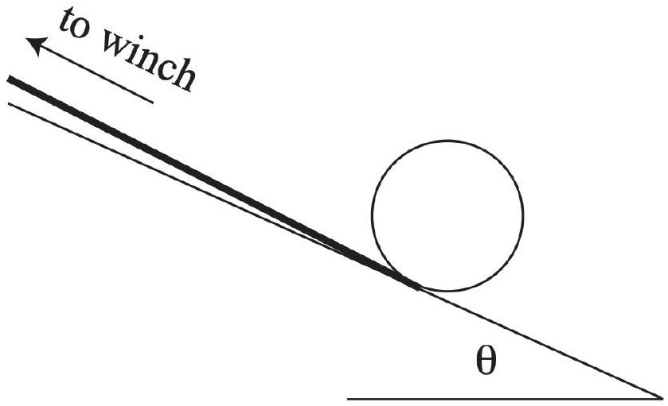

## Practice USAPhO A

INSTRUCTIONS
DO NOT OPEN THIS TEST UNTIL YOU ARE TOLD TO BEGIN

- Work Part A first. You have 90 minutes to complete all problems. Each problem is worth an equal number of points, with a total point value of 90. Do not look at Part B during this time.
- After you have completed Part A you may take a break.
- Then work Part B. You have 90 minutes to complete all problems. Each problem is worth an equal number of points, with a total point value of 90. Do not look at Part A during this time.
- Show all your work. Partial credit will be given. Do not write on the back of any page. Do not write anything that you wish graded on the question sheets.
- Start each question on a new sheet of paper. Put your AAPT ID number, your proctor's AAPT ID number, the question number, and the page number/total pages for this problem, in the upper right hand corner of each page. For example,
Student AAPT ID \#
Proctor AAPT ID \# A1-1/3
- A hand-held calculator may be used. Its memory must be cleared of data and programs. You may use only the basic functions found on a simple scientific calculator. Calculators may not be shared. Cell phones, PDA's or cameras may not be used during the exam or while the exam papers are present. You may not use any tables, books, or collections of formulas.
- Questions with the same point value are not necessarily of the same difficulty.
- In order to maintain exam security, do not communicate any information about the questions (or their answers/solutions) on this contest.

Possibly Useful Information. You may use this sheet for both parts of the exam.

$$
\begin{aligned}
& g = 9.8 \mathrm {~N} / \mathrm { kg } \\
& k = 1 / 4 \pi \epsilon _ { 0 } = 8.99 \times 10 ^ { 9 } \mathrm {~N} \cdot \mathrm {~m} ^ { 2 } / \mathrm { C } ^ { 2 } \\
& c = 3.00 \times 10 ^ { 8 } \mathrm {~m} / \mathrm { s } \\
& N _ { \mathrm { A } } = 6.02 \times 10 ^ { 23 } ( \mathrm {~mol} ) ^ { - 1 } \\
& \sigma = 5.67 \times 10 ^ { - 8 } \mathrm {~J} / \left( \mathrm { s } \cdot \mathrm {~m} ^ { 2 } \cdot \mathrm {~K} ^ { 4 } \right) \\
& 1 \mathrm { eV } = 1.602 \times 10 ^ { - 19 } \mathrm {~J} \\
& m _ { e } = 9.109 \times 10 ^ { - 31 } \mathrm {~kg} = 0.511 \mathrm { MeV } / \mathrm { c } ^ { 2 } \\
& \sin \theta \approx \theta - \frac { 1 } { 6 } \theta ^ { 3 } \text { for } | \theta | \ll 1
\end{aligned}
$$

$$
\begin{aligned}
& G = 6.67 \times 10 ^ { - 11 } \mathrm {~N} \cdot \mathrm {~m} ^ { 2 } / \mathrm { kg } ^ { 2 } \\
& k _ { \mathrm { m } } = \mu _ { 0 } / 4 \pi = 10 ^ { - 7 } \mathrm {~T} \cdot \mathrm {~m} / \mathrm { A } \\
& k _ { \mathrm { B } } = 1.38 \times 10 ^ { - 23 } \mathrm {~J} / \mathrm { K } \\
& R = N _ { \mathrm { A } } k _ { \mathrm { B } } = 8.31 \mathrm {~J} / ( \mathrm { mol } \cdot \mathrm {~K} ) \\
& e = 1.602 \times 10 ^ { - 19 } \mathrm { C } \\
& h = 6.63 \times 10 ^ { - 34 } \mathrm {~J} \cdot \mathrm {~s} = 4.14 \times 10 ^ { - 15 } \mathrm { eV } \cdot \mathrm {~s} \\
& ( 1 + x ) ^ { n } \approx 1 + n x \text { for } | x | \ll 1 \\
& \cos \theta \approx 1 - \frac { 1 } { 2 } \theta ^ { 2 } \text { for } | \theta | \ll 1
\end{aligned}
$$

## Part A

## Question A1

An empty tin can has radius $r = 50 \pm 1 \mathrm {~mm}$, height $h = 150 \pm 1 \mathrm {~mm}$, and a wall, base, and top of uniform thickness $s = 0.10 \pm 0.01 \mathrm {~mm}$. Wound around its circumference is a string, which is attached to a winch. The can is placed on a slope at angle $\theta$ to the horizontal so that the string is parallel to the slope, as shown.

The winch has radius $r _ { w }$ and can be set to turn a fixed number of turns $n _ { t }$ with a constant torque $\tau$, i.e. $\tau / r _ { w }$ is the tension in the winching string. The can is initially held stationary, and is then released. It is observed that the winch stops turning after a time $t$. Neglect friction between the can and slope and treat the string as massless.

1. The density of tin is $\rho = 7.30 \times 10 ^ { 3 } \mathrm {~kg} \mathrm {~m} ^ { - 3 }$. Find the mass $m$ of the tin can, with uncertainty.
2. Suppose we know $m , r _ { w }$, and $r$, and moreover that $\tau$ and $n _ { t }$ are known and freely adjustable. In each run, we can measure $t$. Describe an experimental procedure, involving plotting a straight line, that can be used to find $\theta$ and the moment of inertia $I$ of the can about its center of mass. Give explicit formulas for $\theta$ and $I$ in terms of the slope and intercept of this line.

Solution. This is AuPhO 2011, problem 12. Here's an outline of the official solution:

1. $m = 46 \pm 5 \mathrm {~g}$. You should get an answer quite close to this, no matter what error propagation method you use, because almost all the uncertainty is due to the thickness.
2. Let $a _ { r }$ be the acceleration of the rope. Then
$$
\frac { 1 } { 2 } a _ { r } t ^ { 2 } = 2 \pi n _ { t } r _ { w }
$$
which lets us solve for $a _ { r }$. We also know that $a _ { r }$ can be decomposed into $a _ { 1 } + a _ { 2 }$, standing for acceleration due to the center-of-mass motion and rotation of the can respectively,
$$
a _ { 1 } = - g \sin \theta + \frac { \tau } { m r _ { w } } , \quad \frac { \tau r } { r _ { w } } = I \alpha = \frac { I a _ { 2 } } { r } .
$$
Combining these results, we have
$$
a _ { r } = \frac { 4 \pi n _ { t } r _ { w } } { t ^ { 2 } } = - g \sin \theta + \frac { \tau } { r _ { w } } \left( \frac { r ^ { 2 } } { I } + \frac { 1 } { m } \right) .
$$

Therefore, we can plot $4 \pi n _ { t } r _ { w } / t ^ { 2 }$ versus $\tau$, while varying both $n _ { t }$ and $\tau$. The slope $a$ and intercept $b$ of this line are then

$$
a = \frac { 1 } { r _ { w } } \left( \frac { r ^ { 2 } } { I } + \frac { 1 } { m } \right) , \quad b = - g \sin \theta
$$

from which we can extract the desired parameters as

$$
\theta = - \sin ^ { - 1 } ( b / g ) , \quad I = \frac { r ^ { 2 } } { a r _ { w } - 1 / m } .
$$

Of course, many other procedures are possible; this is just one example.

## Question A2

A charged object generally induces an image charge when placed near a metallic plate. If the object moves, currents in the metal will lead to damping of its motion. Consider the following model for the dissipation: the image charge's motion lags by time $\tau$ behind the object's motion. This leads to an additional velocity-dependent force in addition to the position-dependent force from the instantaneous image charge.

1. What applied force $\mathbf { F } _ { \text {app } }$ is necessary to sustain the motion of an object with charge $q$ moving with constant velocity $\mathbf { v }$ parallel to an infinite metal plate, a distance $r$ from the plate?
2. Find the leading contribution (for small $v$ and $\tau$ ) to the force calculated in part 1, in the direction of v. That is, defining the drag force to be $\mathbf { F } = - \gamma \mathbf { v }$, find the damping coefficient $\gamma$.
3. What is the damping coefficient for motion perpendicular to the plate?
4. The quantity $\tau$ should be determined by the conductivity $\sigma$ of the plate. Find a rough estimate for the power dissipated by the point charge in the metal, in terms of $q , \sigma , v$, and $r$.

Solution. This is BAUPC 2002, problem 5. The answers are:

1. $\mathbf { F } _ { \text {app } } = k q ^ { 2 } ( 2 r \hat { \mathbf { z } } + v \tau \hat { \mathbf { x } } ) / \left( 4 r ^ { 2 } + v ^ { 2 } \tau ^ { 2 } \right) ^ { 3 / 2 }$ where $k = 1 / \left( 4 \pi \epsilon _ { 0 } \right)$
2. $\gamma = k q ^ { 2 } \tau / \left( 8 r ^ { 3 } \right)$
3. $\gamma = k q ^ { 2 } \tau / \left( 4 r ^ { 3 } \right)$
4. We've seen in E3 that on metals, induced charges decay on the timescale $\epsilon _ { 0 } / \sigma$, so we expect $\tau \sim \epsilon _ { 0 } / \sigma$. Plugging this in gives
$$
P \sim F v \sim \frac { q ^ { 2 } v ^ { 2 } } { \sigma r ^ { 3 } } .
$$
You could also derive this result from dimensional analysis. For a derivation from first principles, see application 14.5 of Zangwill.

## Question A3

A particle of mass $m$ and charge $q$ is in a homogeneous magnetic field $B \hat { \mathbf { z } }$. The system is situated in between two parallel electrodes, which can be used to create a homogeneous electric field $E \hat { \mathbf { x } }$. Throughout this problem, neglect any radiation or induction effects.

1. Suppose the particle begins at rest. The electric field is switched on for a very short time $\tau$ and then switched off. Describe the subsequent trajectory of the particle, and find the period $T$ of the motion.
2. Now suppose that the electric field is periodically switched on for a very short time $\tau$, starting at $t = 0$, after equal time intervals $\Delta t = T / 4$. Sketch the subsequent trajectory of the particle, in both the $( x , y )$ plane and the $\left( p _ { x } , p _ { y } \right)$ plane.
3. Now suppose that $\tau \ll \Delta t \ll T$. Sketch the subsequent trajectory of the particle, in both the $( x , y )$ plane and the $\left( p _ { x } , p _ { y } \right)$ plane. (Hint: it may be useful to first draw the impulses provided by each electric field pulse.)

Solution. This is a modification of NBPhO 2003, problem 6. Here's an outline of the official solution:

1. Circle of radius $r = E \tau / B$, with period $T = 2 \pi m / ( q B )$.
2. See the figure for the official solution to part 3, though note that for some reason, they swap the $x$ and $y$ axes.
3. For the answer in momentum space, see the figure for the official solution to part 5. This case isn't fundamentally different from having a constant electric field, so the trajectory in real space is a cycloid, as you've found in E4.

## Part B

## Question B1

This question consists of several independent parts. Each of them asks for an estimate of an order of magnitude only, not for a precise answer.

1. An egg, taken directly from the fridge at temperature 4° C, is dropped into a pot with water that is kept boiling at temperature $T _ { 1 }$. The following data may be useful:
Mass density of the egg: $\mu = 10 ^ { 3 } \mathrm {~kg} \mathrm {~m} ^ { - 3 }$
Specific heat capacity of the egg: $C = 4.2 \mathrm {~J} \mathrm {~K} ^ { - 1 } \mathrm {~g} ^ { - 1 }$
Radius of the egg: $R = 2.5 \mathrm {~cm}$
Coagulation temperature of albumen (egg protein): $T _ { c } = 65 ^ { \circ } \mathrm { C }$
Heat transport coefficient of liquid and solid albumen: $\kappa = 0.64 \mathrm {~W} \mathrm {~K} ^ { - 1 } \mathrm {~m} ^ { - 1 }$
You may use the simplified form of Fourier's law, $J = \kappa \Delta T / \Delta r$, where $\Delta T$ is the temperature difference associated with $\Delta r$, the typical length scale of the problem. The heat flow $J$ is in units of $\mathrm { Wm } ^ { - 2 }$.
    (a) How large is the amount of energy $U$ that is needed to get the egg coagulated?
    (b) How large is the heat flow $J$ that is flowing into the egg?
    (c) How large is the heat power $P$ transferred to the egg?
    (d) For how long do you need to cook the egg so that it is hard-boiled?
2. Let us regard blood as an incompressible viscous fluid with mass density $\mu$ similar to that of water and dynamic viscosity $\eta = 4.5 \mathrm {~g} \mathrm {~m} ^ { - 1 } \mathrm {~s} ^ { - 1 }$. We model blood vessels as circular straight pipes with radius $r$ and length $L$ and describe the blood flow by Poiseuille's law,
$$
\Delta p = R D ,
$$
the fluid dynamics analogue of Ohm's law in electricity. Here $\Delta p$ is the pressure difference between the entrance and the exit of the blood vessel, $D = S v$ is the volume flow through the cross-sectional area $S$ of the blood vessel, and $v$ is the blood velocity. The hydraulic resistance $R$ is given by
$$
R = \frac { 8 \eta L } { \pi r ^ { 4 } } .
$$
For the systemic blood circulation (the one flowing from the left ventricle to the right auricle of the heart), the blood flow is $D \approx 100 \mathrm {~cm} ^ { 3 } \mathrm {~s} ^ { - 1 }$ for a man at rest. Answer the following questions under the assumption that all capillary vessels are connected in parallel and that each of them has radius $r = 4 \mu \mathrm {~m}$ and length $L = 1 \mathrm {~mm}$ and operates under a pressure difference $\Delta p = 1 \mathrm { kPa }$.
    (a) How many capillary vessels are in the human body?
    (b) How large is the velocity $v$ with which blood is flowing through a capillary vessel?

3. At the bottom of a 1000 m high skyscraper, the outside temperature is $T _ { \text {bot } } = 30 ^ { \circ } \mathrm { C }$. The objective is to estimate the outside temperature $T _ { \text {top } }$ at the top. Consider a thin slab of air (ideal nitrogen gas with adiabatic coefficient $\gamma = 7 / 5$ ) rising slowly to height $z$ where the pressure is lower, and assume that this slab expands adiabatically so that its temperature drops to the temperature of the surrounding air.
The mass of a nitrogen molecule is $m = 4.65 \times 10 ^ { - 26 } \mathrm {~kg}$.
    (a) How is the fractional change in temperature $d T / T$ related to $d p / p$, the fractional change in pressure?
    (b) Express the pressure difference $d p$ in terms of $d z$, the change in height.
    (c) In Celsius, what is the temperature at the top of the building?

Solution. This is a modification of IPhO 2006, problem 3. The answers are:

1. (a) $U = 17000 \mathrm {~J}$
    (b) $J \sim 2500 \mathrm {~W} / \mathrm { m } ^ { 2 }$
    (c) $P \sim 19 \mathrm {~W}$
    (d) $\tau \sim 870 \mathrm {~s}$
2. (a) $N \sim 4.5 \times 10 ^ { 9 }$
    (b) $v \sim 4.4 \times 10 ^ { - 4 } \mathrm {~m} / \mathrm { s }$
3. (a) $d T / T = ( 1 - 1 / \gamma ) d p / p$
    (b) $d p = - m g p d z / \left( k _ { B } T \right)$
    (c) $T ^ { \prime } = 20.6 ^ { \circ } \mathrm { C }$

For answers with ~, I've shown the answer you'd expect if you performed the approximations the question writers intended, but anything within an order-one factor is acceptable.

## Question B2

In this problem we consider the average contribution of each electron to the specific heat of a free electron gas at constant volume. According to classical physics, the conduction electrons in metals constitute a free electron gas like an ideal gas. In thermal equilibrium their average energy is related to the temperature, so they contribute to the specific heat. The average contribution of each electron to the specific heat at constant volume is

$$
c _ { V } = \frac { d \bar { E } } { d T }
$$

where $\bar { E }$ is the average energy of each electron.

1. What is the value of $c _ { V }$ in classical physics?

Experimentally it has been found that $c _ { V }$ is very different from the classical expectation. This is because the electrons obey quantum statistics rather than classical statistics. In the quantum theory, the number of states $d S$ for the conduction electrons within an energy range $d E$ is

$$
d S \propto V E ^ { 1 / 2 } d E
$$

where the normalization constant is determined by the total number of electrons in the system. The probability that a state of energy $E$ is occupied by electrons is

$$
f ( E ) = \frac { 1 } { 1 + e ^ { \left( E - E _ { F } \right) / k _ { B } T } }
$$

where $E _ { F }$ is called the Fermi level. At room temperature, $E _ { F }$ is about several eV for metallic materials.

2. Sketch the Fermi distribution function $f ( E )$ when the temperature is low, $k _ { B } T \ll E _ { F }$, and sketch its limit when the temperature approaches zero.
3. Numerically, for what temperatures is the low-temperature limit used in part (2) valid?
4. Compute the average energy per particle $\bar { E }$ at zero temperature.
5. Find an approximate expression for $c _ { V }$ valid at room temperature to within an order of magnitude. You may assume that $E _ { F }$ does not change significantly.

Solution. This is a modification of APhO 2007, problem 3. The answers are:

1. $c _ { V } = 3 k _ { B } / 2$
2. It should be roughly 1 at small energies, then sharply decrease to zero in a narrow window of width $\sim k _ { B } T$ around $E = E _ { F }$. In the limit $T \rightarrow 0$, it decreases to zero instantly.
3. We need $E _ { F } \gg k _ { B } T$, which corresponds roughly to $T \ll 10 ^ { 5 } \mathrm {~K}$.
4. The average energy per particle is
$$
\bar { E } = \frac { \int _ { 0 } ^ { E _ { F } } E ^ { 1 / 2 } E d E } { \int _ { 0 } ^ { E _ { F } } E ^ { 1 / 2 } d E } = \frac { 3 } { 5 } E _ { F } .
$$
5. The distribution only changes significantly in a range of energies $\left| E - E _ { F } \right| \lesssim k _ { B } T$, which means only a fraction $\sim k _ { B } T / E _ { F }$ of the particles are even affected. They each raise the energy by order $k _ { B } T$. That means
$$
\Delta \bar { E } \sim \left( k _ { B } T \right) \left( k _ { B } T / E _ { F } \right)
$$
which implies that
$$
c _ { V } \sim \frac { k _ { B } ^ { 2 } T } { E _ { F } } .
$$
This is much smaller than the classical expectation.
