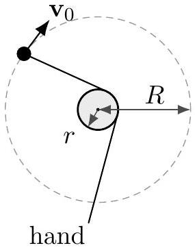
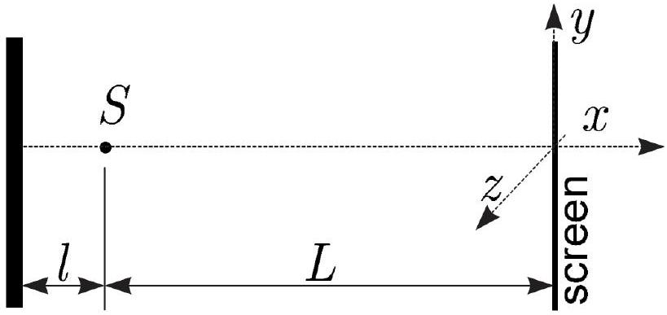
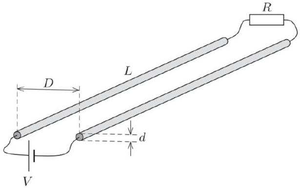
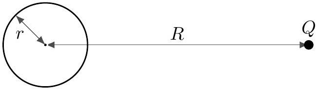
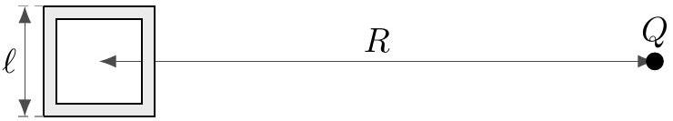

## Practice USAPhO B

INSTRUCTIONS
DO NOT OPEN THIS TEST UNTIL YOU ARE TOLD TO BEGIN

- Work Part A first. You have 90 minutes to complete all problems. Each problem is worth an equal number of points, with a total point value of 100. Do not look at Part B during this time.
- After you have completed Part A you may take a break.
- Then work Part B. You have 90 minutes to complete all problems. Each problem is worth an equal number of points, with a total point value of 100. Do not look at Part A during this time.
- Show all your work. Partial credit will be given. Do not write on the back of any page. Do not write anything that you wish graded on the question sheets.
- Start each question on a new sheet of paper. Put your AAPT ID number, your proctor's AAPT ID number, the question number, and the page number/total pages for this problem, in the upper right hand corner of each page. For example,
Student AAPT ID \#
Proctor AAPT ID \# A1-1/3
- A hand-held calculator may be used. Its memory must be cleared of data and programs. You may use only the basic functions found on a simple scientific calculator. Calculators may not be shared. Cell phones, PDA's or cameras may not be used during the exam or while the exam papers are present. You may not use any tables, books, or collections of formulas.
- Questions with the same point value are not necessarily of the same difficulty.
- In order to maintain exam security, do not communicate any information about the questions (or their answers/solutions) on this contest.

Possibly Useful Information. You may use this sheet for both parts of the exam.

$$
\begin{aligned}
& g = 9.8 \mathrm {~N} / \mathrm { kg } \\
& k = 1 / 4 \pi \epsilon _ { 0 } = 8.99 \times 10 ^ { 9 } \mathrm {~N} \cdot \mathrm {~m} ^ { 2 } / \mathrm { C } ^ { 2 } \\
& c = 3.00 \times 10 ^ { 8 } \mathrm {~m} / \mathrm { s } \\
& N _ { \mathrm { A } } = 6.02 \times 10 ^ { 23 } ( \mathrm {~mol} ) ^ { - 1 } \\
& \sigma = 5.67 \times 10 ^ { - 8 } \mathrm {~J} / \left( \mathrm { s } \cdot \mathrm {~m} ^ { 2 } \cdot \mathrm {~K} ^ { 4 } \right) \\
& 1 \mathrm { eV } = 1.602 \times 10 ^ { - 19 } \mathrm {~J} \\
& m _ { e } = 9.109 \times 10 ^ { - 31 } \mathrm {~kg} = 0.511 \mathrm { MeV } / \mathrm { c } ^ { 2 } \\
& \sin \theta \approx \theta - \frac { 1 } { 6 } \theta ^ { 3 } \text { for } | \theta | \ll 1
\end{aligned}
$$

$$
\begin{aligned}
& G = 6.67 \times 10 ^ { - 11 } \mathrm {~N} \cdot \mathrm {~m} ^ { 2 } / \mathrm { kg } ^ { 2 } \\
& k _ { \mathrm { m } } = \mu _ { 0 } / 4 \pi = 10 ^ { - 7 } \mathrm {~T} \cdot \mathrm {~m} / \mathrm { A } \\
& k _ { \mathrm { B } } = 1.38 \times 10 ^ { - 23 } \mathrm {~J} / \mathrm { K } \\
& R = N _ { \mathrm { A } } k _ { \mathrm { B } } = 8.31 \mathrm {~J} / ( \mathrm { mol } \cdot \mathrm {~K} ) \\
& e = 1.602 \times 10 ^ { - 19 } \mathrm { C } \\
& h = 6.63 \times 10 ^ { - 34 } \mathrm {~J} \cdot \mathrm {~s} = 4.14 \times 10 ^ { - 15 } \mathrm { eV } \cdot \mathrm {~s} \\
& ( 1 + x ) ^ { n } \approx 1 + n x \text { for } | x | \ll 1 \\
& \cos \theta \approx 1 - \frac { 1 } { 2 } \theta ^ { 2 } \text { for } | \theta | \ll 1
\end{aligned}
$$

## Part A

## Question A1

A mass, which is free to move on a horizontal frictionless plane, is attached to one end of a massless string which wraps partially around a frictionless vertical pole of radius $r$, as shown (top view).

1. At time $t = 0$, the mass has speed $v _ { 0 }$ in the tangential direction along the dotted circle of radius $R$ shown. You pull on the string so that the mass keeps moving along the dotted circle, so that the string remains in contact with the pole at all times. Find the speed of the mass as a function of time.
2. Now suppose that, at time $t = 0$, the mass has speed $v _ { 0 }$ opposite the direction shown. You hold the string, keeping your hand stationary. Using the approximation $r \ll R$, find the time when the mass hits the pole.

Solution. This is an extension of BAUPC 2002, problem 2. The answers are:

1. The centripetal acceleration is $v ^ { 2 } / R$, so by similar triangles, the tangential acceleration is $v ^ { 2 } \tan \theta / R$, where $\tan \theta = r / \sqrt { R ^ { 2 } - r ^ { 2 } }$. We thus have
$$
\frac { d v } { d t } = \frac { v ^ { 2 } } { R } \tan \theta
$$
and separating and integrating gives
$$
\frac { t \tan \theta } { R } = \frac { 1 } { v _ { 0 } } - \frac { 1 } { v } .
$$
Solving for $v$ gives
$$
v = \left( \frac { 1 } { v _ { 0 } } - \frac { t r } { R \sqrt { R ^ { 2 } - r ^ { 2 } } } \right) ^ { - 1 } .
$$
Of course, this expression eventually blows up, which indicates that it'll break down before that point, e.g. because the string will snap.
2. This is a new part. Here energy is conserved, so the speed remains $v _ { 0 }$. Every time the string wraps around the pole, the length $r ^ { \prime }$ of the free string decreases by $2 \pi r$. In addition, each wrapping takes an approximate time $2 \pi r ^ { \prime } / v _ { 0 }$, where we approximated the trajectory for one revolution as circular. Therefore, we have
$$
\frac { d r ^ { \prime } } { d t } \approx - \frac { r } { r ^ { \prime } } v _ { 0 } .
$$
Separating and integrating gives $t _ { f } = R ^ { 2 } / \left( 2 v _ { 0 } r \right)$.

## Question A2

A point source $S$ emits coherent light of wavelength $\lambda$ isotropically in all directions; thus, the wavefronts are concentric spheres. The waves reflect from a mirror placed at a distance $\ell = N \lambda$ (where $N$ is a large integer) from the point source, and the interference pattern is observed on a screen, parallel to the mirror, which is placed a distance $L \gg \ell$ from the point source. The mirror lies in the $y z$ plane, as shown.

1. At which values of $y$ are the interference maxima on the screen? You may assume $y \ll L$.
2. Sketch the shape of the few smallest-sized interference maxima on the screen.
3. Now the flat screen is replaced with a spherical screen of radius $L$, centered on the point source. How many interference maxima can be observed?

Solution. This is NBPhO 2014, problem 8. The answers are:

1. $y = L \sqrt { ( n + 1 / 2 ) / N }$
2. The maxima form concentric circles on the screen, which get closer together for higher $n$.
3. $2 N$

## Question A3

A long wire of radius $a$ along the $y$-axis carries current $I$. A particle of charge $q$ and mass $m$ is ejected perpendicular to the surface of the wire, with speed $v _ { 0 }$. Find the maximum distance the particle attains from the $y$-axis.

Solution. This is INPhO 2011, problem 1, with subparts removed. Let $r$ be the distance to the wire. The charge's speed $v _ { 0 }$ is constant, and its acceleration is

$$
a = \frac { q v _ { 0 } B } { m } = \frac { \mu _ { 0 } I q v _ { 0 } } { 2 \pi m } \frac { 1 } { r } .
$$

Since this acceleration is always perpendicular to the velocity, $a = v _ { 0 } d \theta / d t$, so

$$
\frac { d \theta } { d t } = \frac { \mu _ { 0 } I q } { 2 \pi m } \frac { 1 } { r } .
$$

We also know that $d r / d t = v _ { 0 } \cos \theta$, where $\theta$ is the angle of the velocity to the radial direction. Multiplying both sides of the above equation by $d t / d r$ thus gives

$$
\frac { d \theta } { d r } = \frac { \mu _ { 0 } I q } { 2 \pi v _ { 0 } m } \frac { 1 } { r \cos \theta } .
$$

Separating and integrating gives

$$
\int _ { 0 } ^ { \pi / 2 } \cos \theta d \theta = \frac { \mu _ { 0 } I q } { 2 \pi v _ { 0 } m } \int _ { a } ^ { r _ { \max } } \frac { d r } { r }
$$

from which we conclude

$$
r _ { \max } = a \exp \left( 2 \pi v _ { 0 } m / \mu _ { 0 } I q \right) .
$$

More generally, if the particle starts with a velocity in an arbitrary direction, the trajectories are quite intricate, exhibiting "double helix" structures; you can find plots of them in this paper.

## Question A4

Two identical long cylindrical conductors, of diameter $d$ and negligible resistance, are placed parallel to each other with their axes separated by distance $D = 50 d$.

A battery of voltage $V$ is connected between the ends of the wires, and a resistor $R$ is connected across the other ends. Numerically compute the resistance $R$ that makes the electric and magnetic forces between the conductors equal.

Solution. This is problem 172 from 200 More Puzzling Physics Problems. By Gauss's law, a single cylinder has electric field $E = \lambda / \left( 2 \pi r \epsilon _ { 0 } \right)$, so potential $V = \lambda \log r / \left( 2 \pi \epsilon _ { 0 } \right)$. Since $D \gg d$, we can neglect the influence of the cylinders on each other, so they can be treated as two isolated cylinders, giving a voltage difference

$$
V = 2 \frac { \lambda } { 2 \pi \epsilon _ { 0 } } \log \frac { D } { d / 2 } = \frac { \lambda } { \pi \epsilon _ { 0 } } \log ( 100 ) .
$$

We also have $V = I R$ where $B = \mu _ { 0 } I / ( 2 \pi D )$, so the magnetic force is

$$
F _ { B } = I L B = \frac { \mu _ { 0 } V ^ { 2 } L } { 2 \pi R ^ { 2 } D } .
$$

The electric force is

$$
F _ { E } = \lambda L E = \frac { \lambda ^ { 2 } L } { 2 \pi D \epsilon _ { 0 } } .
$$

Setting these equal and solving gives

$$
R = \frac { \log ( 100 ) } { \pi } \sqrt { \frac { \mu _ { 0 } } { \epsilon _ { 0 } } } = 552 \Omega .
$$

This is an interesting result, because you've probably heard that $\mu _ { 0 }$ can be determined by measuring the force between current-carrying wires. Yet for a completely reasonable value of the resistance, the electric force between the wires, due to the surface charges they have to carry (discussed briefly in E2), can be just as big! To avoid this effect, we need $R$ to be as low as possible.

## Part B

## Question B1

A pencil is placed vertically on a table with its point downward. It is then released and begins falling over to the right. Model the pencil as a uniform rod, and the pencil tip as an ideal point with coefficient of friction $\mu$ with the floor.

1. Assuming the pencil tip has not yet slipped, compute the normal force $N$ as a function of $\theta$, the angle through which the pencil has rotated.
2. Assuming the pencil tip has not yet slipped, compute $f / N$ as a function of angle $\theta$, where $f$ is the friction force acting on the tip of the pencil.
3. If $\mu$ can be arbitrarily large, find the largest possible angle $\theta$ at which the pencil tip can first begin to slip, and indicate the direction it slips.
4. Now suppose that $\mu = 0.1$. Numerically compute the angle at which the pencil tip slips to within one significant digit, and indicate the direction it slips.

Solution. This is problem 61 from 200 Puzzling Physics Problems. The answers are:

1. Using energy conservation and considering the vertical acceleration of the center of mass,
$$
N = \left( \frac { 3 \cos \theta - 1 } { 2 } \right) ^ { 2 } m g
$$
2. By considering the horizontal acceleration of the center of mass,
$$
f = \frac { 3 } { 4 } \sin \theta ( 3 \cos \theta - 2 ) m g
$$
from which we conclude
$$
\frac { f } { N } = \frac { 3 \sin \theta ( 3 \cos \theta - 2 ) } { ( 3 \cos \theta - 1 ) ^ { 2 } } .
$$
3. Slipping occurs when $\mu < | f / N |$, and $f / N$ diverges when $\cos \theta = 1 / 3$. Thus, slipping must occur by $\theta = \cos ^ { - 1 } ( 1 / 3 ) = 70.5 ^ { \circ }$. The slipping is to the right.
4. We need to solve the equation $f / N = 0.1$ numerically. This equation has multiple solutions; we want the one with smallest $\theta$. There are several ways to do this, but one way is to notice that $\mu$ is quite small, so slipping will occur at a small $\theta$. If we expand $f / N$ at small $\theta$, we get
$$
\frac { f } { N } \approx \frac { 3 \theta ( 3 - 2 ) } { ( 3 - 1 ) ^ { 2 } } = \frac { 3 } { 4 } \theta .
$$
Therefore, a good first estimate for the answer is $\theta = ( 4 / 3 ) ( 0.1 )$. Plugging this in, you'll find that this actually corresponds to $f / N = 0.099$, which is certainly close enough to get the answer within one significant digit. Therefore, we conclude that
$$
\theta \approx 0.133 = 7.6 ^ { \circ } .
$$
The slipping is to the left.

This is a classic problem which has been studied in several papers (e.g. see here). For general coefficients of friction and initial angles, you can get rather complicated behavior. For example, it is possible for the pencil tip to start sliding one way, stop, and then start sliding the other way.

## Question B2

For a fairly simple system of charges proposed by W. Shockley and R. P. James in 1967, understanding the conservation of linear momentum requires careful relativistic analysis. If a point charge is located near a magnet of changing magnetization, there is an induced electric force on the charge, but no apparent reaction on the magnet. The process may be slow enough that any electromagnetic radiation (and any momentum carried away by it) is negligible. Thus, we apparently get a cannon without recoil.

In this problem, you will demonstrate that in relativistic mechanics, a composite body may hold a nonzero mechanical momentum while remaining stationary. First, consider a circular current loop of radius $r$ carrying a current $I _ { 1 }$, and a second, larger current loop of radius $R \gg r$, concentric with the first and lying in the same plane.

1. A current $I _ { 2 }$ passing through loop 2 (the larger loop) generates a magnetic flux $\Phi _ { B 1 }$ through loop 1. Find the ratio $M _ { 21 } = \Phi _ { B 1 } / I _ { 2 }$. It is called the mutual inductance coefficient.
2. Given that $M _ { 12 } = \Phi _ { B 2 } / I _ { 1 } = M _ { 21 }$, find the total induced EMF $\mathcal { E } _ { 2 }$ in the larger loop as a result of a variation $d I _ { 1 } / d t$ of the current in the smaller loop. Neglect the current in the larger loop.
3. The EMF you found above is due to the tangential component of an induced electric field. Obtain an expression for the tangential electric field $E$ at radius $R$ as a function of $d I _ { 1 } / d t$.
4. We now remove the larger current loop, and put a massive point charge $Q$ at radius $R$.

It may be assumed that the charge moves very little during the relevant time periods.
Find the total tangential impulse $\Delta p$ received by the point charge as the current in the small loop changes from an initial value $I _ { 1 } = I$ to the final value $I _ { 1 } = 0$.

We will now understand the origin of the recoil of the loop, using a loop of different geometry.

5. Consider a hollow tube with walls made of a neutral insulating material of length $\ell$ and cross-sectional area $A$ carrying an electric current $I$. The current is due to charged particles of rest mass $m$ and charge $q$ distributed homogeneously inside the tube with number density $n$. Assume that the charged particles are all moving along the tube with the same velocity. Find the total momentum $p$ of the charged particles in the tube, taking special relativistic effects into account.
6. Now consider a square current loop with side length $\ell$. At a distance $R \gg \ell$ from the loop, there is a point charge $Q$, as shown.

The loop carries current $I$. We will model the current loop as a neutral tube, as in part 5. The charge carrierss can move freely along the loop, colliding elastically with the walls and making elastic right turns at the corners. Neglect all interactions among the charge carrierss. Assume also that all the charge carriers at a given section along the tube always move with the same velocity. Assume that the loop is heavy and that its motion can be neglected. Calculate the total linear momentum $p _ { \text {hid } }$ of the charge carrierss in the loop. It is called "hidden momentum".

When the current stops, this linear momentum is transferred to the loop, and it gets an impulse equal to minus the impulse received by the point charge. This is the missing recoil that we were looking for (note that in the initial state there is also momentum in the electromagnetic field; this is important for conservation of the total momentum of the entire system).

Solution. This is the first 2/3 of APhO 2011, problem 1. The answers are:

1. $M _ { 21 } = \pi \mu _ { 0 } r ^ { 2 } / ( 2 R )$
2. $\mathcal { E } _ { 2 } = \pi \mu _ { 0 } r ^ { 2 } \dot { I } _ { 1 } / ( 2 R )$
3. $E = \mu _ { 0 } r ^ { 2 } \dot { I } _ { 1 } / \left( 4 R ^ { 2 } \right)$
4. $\Delta p = \mu _ { 0 } r ^ { 2 } I Q / \left( 4 R ^ { 2 } \right)$
5.
$$
p = \frac { m I \ell } { q } \left( 1 - \left( \frac { I } { n A q c } \right) ^ { 2 } \right) ^ { - 1 / 2 }
$$
6. The momenta of the top and bottom sides cancel by symmetry. The left and right sides have a potential difference $\Delta U = k Q q \ell / R ^ { 2 }$, and carry the same current $I = q \lambda _ { 1 } v _ { 1 } = q \lambda _ { 2 } v _ { 2 }$. Energy conservation gives $\left( \gamma _ { 2 } - \gamma _ { 1 } \right) m c ^ { 2 } = \Delta U$. The total momentum is
$$
p _ { \mathrm { hid } } = m \ell \left( \gamma _ { 2 } \lambda _ { 2 } v _ { 2 } - \gamma _ { 1 } \lambda _ { 1 } v _ { 1 } \right) = \frac { m \ell I } { q } \left( \gamma _ { 2 } - \gamma _ { 1 } \right) = \frac { k Q I \ell ^ { 2 } } { R ^ { 2 } c ^ { 2 } } .
$$
