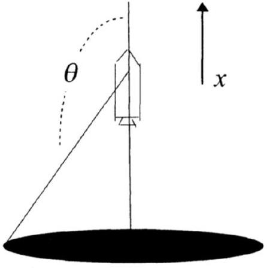
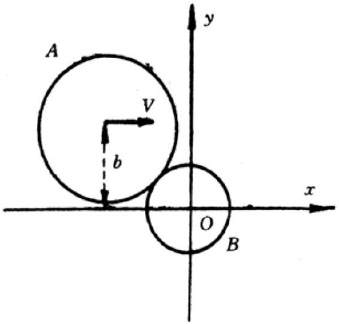

## Practice USAPhO C

INSTRUCTIONS
DO NOT OPEN THIS TEST UNTIL YOU ARE TOLD TO BEGIN

- Work Part A first. You have 90 minutes to complete all problems. Each problem is worth an equal number of points, with a total point value of 90. Do not look at Part B during this time.
- After you have completed Part A you may take a break.
- Then work Part B. You have 90 minutes to complete all problems. Each problem is worth an equal number of points, with a total point value of 90. Do not look at Part A during this time.
- Show all your work. Partial credit will be given. Do not write on the back of any page. Do not write anything that you wish graded on the question sheets.
- Start each question on a new sheet of paper. Put your AAPT ID number, your proctor's AAPT ID number, the question number, and the page number/total pages for this problem, in the upper right hand corner of each page. For example,
Student AAPT ID \#
Proctor AAPT ID \# A1-1/3
- A hand-held calculator may be used. Its memory must be cleared of data and programs. You may use only the basic functions found on a simple scientific calculator. Calculators may not be shared. Cell phones, PDA's or cameras may not be used during the exam or while the exam papers are present. You may not use any tables, books, or collections of formulas.
- Questions with the same point value are not necessarily of the same difficulty.
- For this exam alone, you may use a ruler and a movable hard surface, such as a portable whiteboard, an iPad, a cutting board, or anything similar. You may also use a small mass, such as a paperweight or a book.
- In order to maintain exam security, do not communicate any information about the questions (or their answers/solutions) on this contest.

Possibly Useful Information. You may use this sheet for both parts of the exam.

$$
\begin{array} { l l }
g = 9.8 \mathrm {~N} / \mathrm { kg } & G = 6.67 \times 10 ^ { - 11 } \mathrm {~N} \cdot \mathrm {~m} ^ { 2 } / \mathrm { kg } ^ { 2 } \\
k = 1 / 4 \pi \epsilon _ { 0 } = 8.99 \times 10 ^ { 9 } \mathrm {~N} \cdot \mathrm {~m} ^ { 2 } / \mathrm { C } ^ { 2 } & k _ { \mathrm { m } } = \mu _ { 0 } / 4 \pi = 10 ^ { - 7 } \mathrm {~T} \cdot \mathrm {~m} / \mathrm { A } \\
c = 3.00 \times 10 ^ { 8 } \mathrm {~m} / \mathrm { s } & k _ { \mathrm { B } } = 1.38 \times 10 ^ { - 23 } \mathrm {~J} / \mathrm { K } \\
N _ { \mathrm { A } } = 6.02 \times 10 ^ { 23 } ( \mathrm {~mol} ) ^ { - 1 } & R = N _ { \mathrm { A } } k _ { \mathrm { B } } = 8.31 \mathrm {~J} / ( \mathrm { mol } \cdot \mathrm {~K} ) \\
\sigma = 5.67 \times 10 ^ { - 8 } \mathrm {~J} / \left( \mathrm { s } \cdot \mathrm {~m} ^ { 2 } \cdot \mathrm {~K} ^ { 4 } \right) & e = 1.602 \times 10 ^ { - 19 } \mathrm { C } \\
1 \mathrm { eV } = 1.602 \times 10 ^ { - 19 } \mathrm {~J} & h = 6.63 \times 10 ^ { - 34 } \mathrm {~J} \cdot \mathrm {~s} = 4.14 \times 10 ^ { - 15 } \mathrm { eV } \cdot \mathrm {~s} \\
m _ { e } = 9.109 \times 10 ^ { - 31 } \mathrm {~kg} = 0.511 \mathrm { MeV } / \mathrm { c } ^ { 2 } & ( 1 + x ) ^ { n } \approx 1 + n x \text { for } | x | \ll 1 \\
\sin \theta \approx \theta - \frac { 1 } { 6 } \theta ^ { 3 } \text { for } | \theta | \ll 1 & \cos \theta \approx 1 - \frac { 1 } { 2 } \theta ^ { 2 } \text { for } | \theta | \ll 1
\end{array}
$$

## Part A

## Question A1

A solid homogeneous metal ball of radius $R$ is dropped with its lowest point a height $h$ above the floor. It has zero initial velocity, and an initial angular velocity of $\omega \hat { \mathbf { x } }$ about its center of mass. After impact, the ball rebounds so that the maximum subsequent height of its lowest point is $\alpha h$. Assume the impact time is negligible, and let the mass of the ball be $m$, the acceleration due to gravity be $g$, and the coefficient of kinetic friction between the ball and floor be $\mu _ { k }$.

1. Find the minimum value of $\omega$ so that the ball slips throughout the entire impact.
2. Assuming $\omega$ is above this minimum value, find the distance between the ball's first and second impact points.

Solution. This is half of IPhO 1991, problem 1. The answers are:

1.
$$
\omega = \frac { 7 } { 2 } \frac { \mu } { R } \sqrt { 2 g h } ( 1 + \sqrt { \alpha } )
$$
2.
$$
\Delta x = 4 \mu h ( \alpha + \sqrt { \alpha } )
$$

## Question A2

A spaceship starting at the center of the Milky Way begins to move away from it, perpendicular to its plane, at a constant speed $v$. If one looks out from the window of the spaceship, one sees a strangely distorted image of the galaxy. To understand this, suppose a light ray from the galaxy intercepts the spaceship at an angle $\theta$ to the forward direction, as shown.

In the frame of the spaceship, the angle is instead $\theta ^ { \prime }$.

1. Using the relativistic velocity transformations
$$
u _ { x } ^ { \prime } = \frac { u _ { x } - v } { 1 - v u _ { x } / c ^ { 2 } } , \quad u _ { y } ^ { \prime } = \frac { u _ { y } } { \gamma \left( 1 - v u _ { x } / c ^ { 2 } \right) }
$$
find an expression for $\theta ^ { \prime }$.
2. Suppose light from the edge of the galaxy comes in at an angle $\theta = 150 ^ { \circ }$. How fast does the spaceship have to be moving for this to correspond to an angle $\theta ^ { \prime } = 30 ^ { \circ }$ ? For all future parts, assume the spaceship is moving at this speed.

3. For what values of $\theta ^ { \prime }$ can light from the galaxy be seen?
4. Suppose there are pulsars distributed throughout the galaxy, which pulse with frequency 1 Hz in their rest frames. What pulse frequencies does an observer inside the spaceship see with their eyes, from pulsars that are at the center of the galaxy, and at the edge?
5. Qualitatively, how does the image of the galaxy change as the spacecraft continues at constant speed?

Solution. This is adapted from tutorial 36 of Physics to a Degree. The answers are:

1. Using $u _ { x } = - c \cos \theta$ and $u _ { y } = - c \sin \theta$, we have
$$
\tan \theta ^ { \prime } = \frac { u _ { y } ^ { \prime } } { u _ { x } ^ { \prime } } = \frac { u _ { y } / \gamma } { u _ { x } - v } .
$$
2. Plugging in numbers gives $v = 4 \sqrt { 3 } / 7 = 0.9897 c$.
3. The galaxy occupies all $\theta ^ { \prime } > 30 ^ { \circ }$, with its outer part "wrapped around" the ship, and its center appearing directly behind.
4. Let's now set $c = 1$. There are many possible methods, but we can use the Lorentz transformation.
For a photon emitted from the center of the galaxy, we have $p ^ { \mu } = ( E , E , 0,0 )$ in the galaxy's frame. In the ship's frame, $E ^ { \prime } = \gamma ( E - v E ) = \sqrt { ( 1 - v ) / ( 1 + v ) } E = 0.072 E$. (You can also just skip right to this step if you remember the relativistic Doppler shift.) Then $f ^ { \prime } = 0.072 \mathrm {~Hz}$.
For a photon emitted from the edge of the galaxy, we have
$$
p ^ { \mu } = ( E , \sqrt { 3 } E / 2 , E / 2,0 )
$$
in the galaxy's frame. We can now Lorentz transform to the ship's frame explicitly, though there's a slick way to think about the result. In the ship's frame, $p ^ { y ^ { \prime } } = p ^ { y } = E / 2$, but we also know that $\left| p ^ { y ^ { \prime } } / p ^ { x ^ { \prime } } \right| = \left| p ^ { y } / p ^ { x } \right|$, because $\theta ^ { \prime } = \pi - \theta$, so we know that $p ^ { x ^ { \prime } } = - p ^ { x }$. But since $E = | \mathbf { p } |$ in all frames, we conclude that $E ^ { \prime } = E$, so $f ^ { \prime } = 1 \mathrm {~Hz}$.
5. Over time, the edge of the galaxy moves to larger $\theta ^ { \prime }$, while redshifting more and more, to match the frequency of light from the center.

## Question A3

Devise and perform an experiment to find the coefficients of static friction between (1) paper and paper, and (2) paper and graphite mixture, the residue left behind when one draws on paper with a pencil, as accurately as possible. You may use a ruler, a movable hard surface, a mass, and the pencil and paper you brought to this exam.

To receive credit, you should describe the method you used and justify why you have chosen it. You do not have to do any graphing for this problem. State your results for the two coefficients of friction along with uncertainties. (Most of the credit for this question is for producing a sensible experimental method, not your final numeric results.)

Solution. This is AuPhO 2013, problem 14. It's an example of why I like the AuPhO, despite its occasional typos and ambiguities.

There are many possible solutions. The most crucial point is that you shouldn't use any method that depends on the weight of the paper itself (e.g. just putting a scrap of paper on another piece of paper and tilting), because it's far too small to get reliable results. The normal and friction forces will be overwhelmed by other, irrelevant forces, like air resistance or even electrostatic forces.

One possible method is to fold a little box out of paper and put other stuff in it to weigh it down. Then, for the first part, put the box on another sheet of paper on a surface, tilt the surface until sliding begins, measure the angle, and use $\mu = \tan \theta$. For the second part, shade in the bottom of the box with your pencil and repeat.

Another possible method is to directly apply an extra vertical force by pushing downward with your pencil, taking care to keep your pencil as vertical as possible. For the first part, you push the pencil on a scrap of paper which is on top of another sheet of paper on a tilted surface. For the second part, you can directly press the pencil onto the sheet of paper, and see when the pencil slips. For an effective measurement, you want to avoid the problem with normal forces at corners mentioned in M2. That is, since a sharp tip might deform the paper, you should make sure the tip of your pencil is blunt.

## Part B

## Question B1

A homogeneous disc $A$ of mass $m$ and radius $R _ { A }$ moves on a plane in the $\hat { \mathbf { x } }$ direction with speed $v$. The center of the disc is at a distance $b$ from the $x$-axis. It collides with a stationary homogeneous disc $B$ whose center is initially located at the origin. Disc $B$ has mass $m$ and radius $R _ { B }$. Both discs are initially nonrotating. The plane is frictionless, but the discs have friction with each other.

The parameter $b$ is such that the two discs collide. Assume that:

- The velocities of the discs at their point of contact, in the direction perpendicular to the line joining their centers, are equal after the collision.
- The magnitudes of the relative velocities of the discs along the line joining their centers are the same before and after the collision.

Determine the velocities $\mathbf { v } _ { A } ^ { \prime }$ and $\mathbf { v } _ { B } ^ { \prime }$ of the discs after the collision.
Solution. This is most of IPhO 1994, problem 3, and it's admittedly a bit tedious. The answer is:

$$
v _ { A , x } ^ { \prime } = \frac { 5 } { 6 } \frac { b ^ { 2 } } { \left( R _ { A } + R _ { B } \right) ^ { 2 } } v , \quad v _ { A , y } ^ { \prime } = \frac { 5 } { 6 } \frac { b \sqrt { \left( R _ { A } + R _ { B } \right) ^ { 2 } - b ^ { 2 } } } { \left( R _ { A } + R _ { B } \right) ^ { 2 } } v .
$$

where $\mathbf { v } _ { B } ^ { \prime }$ is simply given by momentum conservation,

$$
v _ { B , x } ^ { \prime } = v - v _ { A , x } ^ { \prime } , \quad v _ { B , y } ^ { \prime } = - v _ { A , y } ^ { \prime } .
$$

The official solution has more steps, but also a minor typo.

## Question B2

Consider two very long, tightly wound cylindrical solenoids with $n$ turns per unit length, total length $L$, and cross-sectional areas $A _ { 1 } > A _ { 2 }$. The second solenoid is placed concentrically inside the first, so that the centers of the two coils coincide. Both solenoids are hooked up to constant current sources $I$, so that they generate magnetic fields in the same direction.

1. Compute the total magnetic field energy. You may ignore fringe fields.

Now suppose that the second solenoid is moved a distance $x$ to the right along its symmetry axis, so that the centers of the two solenoids no longer coincide. You may assume that $\sqrt { A _ { i } } \ll x \ll L$.

2. Compute the total magnetic field energy when both coils are held in place at this position.
3. Find the electromotive forces $\mathcal { E } _ { 1 }$ and $\mathcal { E } _ { 2 }$ generated on the coils when the second one is pulled further out with a velocity $v$.
4. Now suppose again that both coils are held in place. Find the force $F$ needed to hold the second coil in place, and indicate its direction.

Solution. This is a modification of NBPhO 2015, problem 9. The answers are:

1.
$$
U _ { 0 } = \mu _ { 0 } n ^ { 2 } I ^ { 2 } L \left( \frac { 3 } { 2 } A _ { 2 } + \frac { 1 } { 2 } A _ { 1 } \right)
$$
2.
$$
U = U _ { 0 } - \mu _ { 0 } n ^ { 2 } I ^ { 2 } | x | A _ { 2 }
$$
3. The signs of these emfs act to increase the current, and their magnitudes are
$$
\left| \mathcal { E } _ { 1 } \right| = \left| \mathcal { E } _ { 2 } \right| = \mu _ { 0 } n ^ { 2 } I A _ { 2 } v .
$$
4. We use the method of virtual work. Suppose the coils have constant current sources attached. Moving by $d x$ changes the field energy by $- \mu _ { 0 } n ^ { 2 } I ^ { 2 } A _ { 2 } d x$. At the same time, the current source in coil $i$ supplies energy $\mathcal { E } _ { i } d Q _ { i } = I d \Phi _ { i }$, for a total of
$$
I \left( d \Phi _ { 1 } + d \Phi _ { 2 } \right) = - 2 \mu _ { 0 } n ^ { 2 } I ^ { 2 } A _ { 2 } d x
$$
So the energy in the current sources goes $u p$ by $2 \mu _ { 0 } n ^ { 2 } I ^ { 2 } A _ { 2 } d x$, while the field energy goes down by $\mu _ { 0 } n ^ { 2 } I ^ { 2 } A _ { 2 } d x$, so the total energy goes up by $\mu _ { 0 } n ^ { 2 } I ^ { 2 } A _ { 2 } d x$. This must be equal to $F d x$, so we conclude that
$$
F = \mu _ { 0 } n ^ { 2 } I ^ { 2 } A _ { 2 }
$$
pointing outward.
That is, the coils attract each other, even though getting closer would increase the field energy. This tricky sign is the same as the one you found for a similar situation with capacitors in E2.
