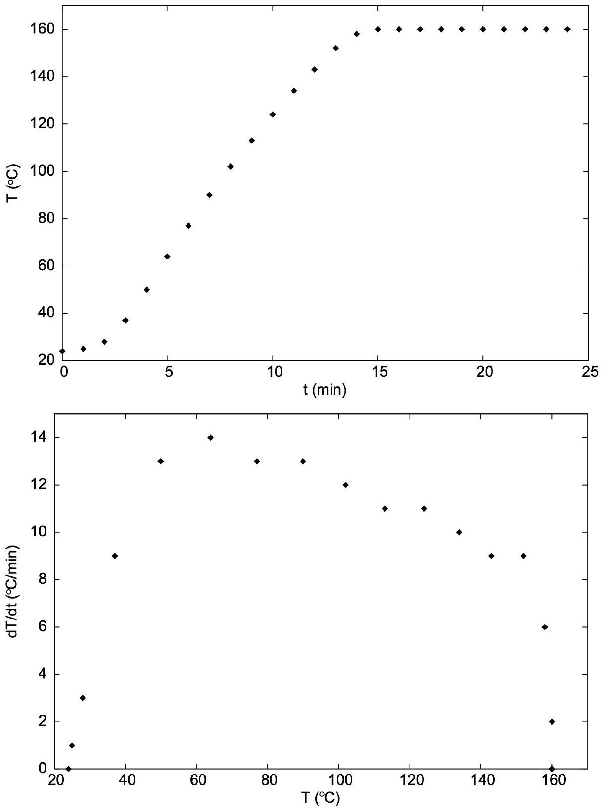
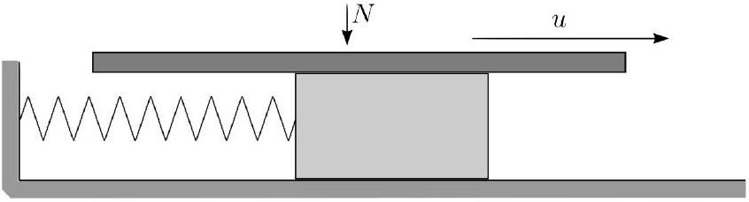
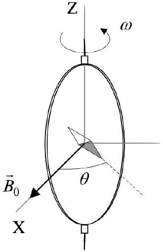
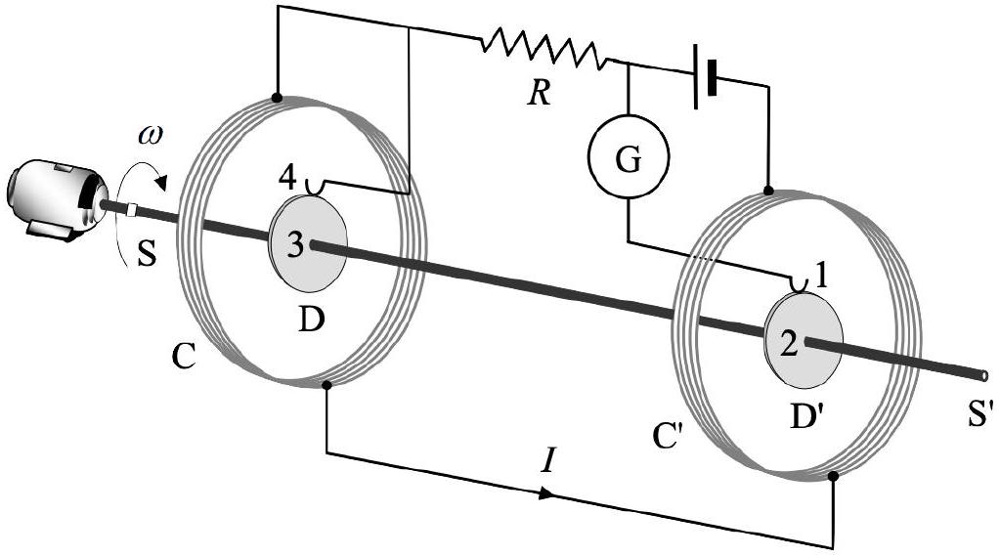

## Practice USAPhO D

INSTRUCTIONS
DO NOT OPEN THIS TEST UNTIL YOU ARE TOLD TO BEGIN

- Work Part A first. You have 90 minutes to complete all problems. Each problem is worth an equal number of points, with a total point value of 100. Do not look at Part B during this time.
- After you have completed Part A you may take a break.
- Then work Part B. You have 90 minutes to complete all problems. Each problem is worth an equal number of points, with a total point value of 100. Do not look at Part A during this time.
- Show all your work. Partial credit will be given. Do not write on the back of any page. Do not write anything that you wish graded on the question sheets.
- Start each question on a new sheet of paper. Put your AAPT ID number, your proctor's AAPT ID number, the question number, and the page number/total pages for this problem, in the upper right hand corner of each page. For example,
Student AAPT ID \#
Proctor AAPT ID \# A1-1/3
- A hand-held calculator may be used. Its memory must be cleared of data and programs. You may use only the basic functions found on a simple scientific calculator. Calculators may not be shared. Cell phones, PDA's or cameras may not be used during the exam or while the exam papers are present. You may not use any tables, books, or collections of formulas.
- Questions with the same point value are not necessarily of the same difficulty.
- In order to maintain exam security, do not communicate any information about the questions (or their answers/solutions) on this contest.

Possibly Useful Information. You may use this sheet for both parts of the exam.

$$
\begin{aligned}
& g = 9.8 \mathrm {~N} / \mathrm { kg } \\
& k = 1 / 4 \pi \epsilon _ { 0 } = 8.99 \times 10 ^ { 9 } \mathrm {~N} \cdot \mathrm {~m} ^ { 2 } / \mathrm { C } ^ { 2 } \\
& c = 3.00 \times 10 ^ { 8 } \mathrm {~m} / \mathrm { s } \\
& N _ { \mathrm { A } } = 6.02 \times 10 ^ { 23 } ( \mathrm {~mol} ) ^ { - 1 } \\
& \sigma = 5.67 \times 10 ^ { - 8 } \mathrm {~J} / \left( \mathrm { s } \cdot \mathrm {~m} ^ { 2 } \cdot \mathrm {~K} ^ { 4 } \right) \\
& 1 \mathrm { eV } = 1.602 \times 10 ^ { - 19 } \mathrm {~J} \\
& m _ { e } = 9.109 \times 10 ^ { - 31 } \mathrm {~kg} = 0.511 \mathrm { MeV } / \mathrm { c } ^ { 2 } \\
& \sin \theta \approx \theta - \frac { 1 } { 6 } \theta ^ { 3 } \text { for } | \theta | \ll 1
\end{aligned}
$$

$$
\begin{aligned}
& G = 6.67 \times 10 ^ { - 11 } \mathrm {~N} \cdot \mathrm {~m} ^ { 2 } / \mathrm { kg } ^ { 2 } \\
& k _ { \mathrm { m } } = \mu _ { 0 } / 4 \pi = 10 ^ { - 7 } \mathrm {~T} \cdot \mathrm {~m} / \mathrm { A } \\
& k _ { \mathrm { B } } = 1.38 \times 10 ^ { - 23 } \mathrm {~J} / \mathrm { K } \\
& R = N _ { \mathrm { A } } k _ { \mathrm { B } } = 8.31 \mathrm {~J} / ( \mathrm { mol } \cdot \mathrm {~K} ) \\
& e = 1.602 \times 10 ^ { - 19 } \mathrm { C } \\
& h = 6.63 \times 10 ^ { - 34 } \mathrm {~J} \cdot \mathrm {~s} = 4.14 \times 10 ^ { - 15 } \mathrm { eV } \cdot \mathrm {~s} \\
& ( 1 + x ) ^ { n } \approx 1 + n x \text { for } | x | \ll 1 \\
& \cos \theta \approx 1 - \frac { 1 } { 2 } \theta ^ { 2 } \text { for } | \theta | \ll 1
\end{aligned}
$$

## Part A

## Question A1

In this problem you will analyze the longitudinal motion of a linear molecule, i.e. the motion along the molecular axis. The rotational motion and the bending of the molecule are not considered. Each atom is assumed to be connected to its neighbors by a chemical bond, approximated by a massless spring which obeys Hooke's law.

1. Consider a diatomic molecule $A B$, where atom $A$ has mass $m _ { A }$, atom $B$ has mass $m _ { B }$, and the spring constant of the bond is $k$. Find the angular frequency of vibrations.
2. Now consider a triatomic molecule $A B A$, where the two bonds both have spring constant $k$. Find the possible vibrational angular frequencies and sketch the associated motions.

Solution. This is IPhO 1992, problem 2. (Things were a lot easier back then!) The answers are:

1. $\omega = \sqrt { k \left( m _ { A } + m _ { B } \right) / \left( m _ { A } m _ { B } \right) }$. If you know about reduced mass, you can write this down immediately.
2. There are two vibrational modes with nonzero $\omega$.
    - $B$ stays at rest and the $A$ 's move oppositely. This mode clearly has $\omega = \sqrt { k / m _ { A } }$.
    - The $A$ 's have the same velocity while $B$ moves against them. Since the center of mass has to stay stationary, $v _ { B } = - 2 m _ { A } v _ { A } / m _ { B }$. This yields
$$
\omega = \sqrt { k \left( \frac { 1 } { m _ { A } } + \frac { 2 } { m _ { B } } \right) } .
$$

## Question A2

Consider a long cylindrical capacitor whose surfaces are concentric cylinders of radius $r _ { \text {in } }$ and $r _ { \text {out } }$. The capacitor is filled with a gas which will break down if it experiences an electric field greater than $E _ { 0 }$. If the outer radius is fixed, what should the inner radius be in order to maximize the voltage $V$ to which the capacitor can be charged, without breakdown?

Solution. Let the charge per length on the cylinders be $\pm \lambda$. By Gauss's law, the electric field is

$$
E = \frac { \lambda } { 2 \pi r \epsilon _ { 0 } } .
$$

Thus, the voltage drop is

$$
V = \frac { \lambda } { 2 \pi \epsilon _ { 0 } } \log \left( r _ { \text {out } } / r _ { \text {in } } \right) .
$$

On the other hand, the highest electric field is right at the inner cylinder, so

$$
E _ { 0 } = \frac { \lambda } { 2 \pi r _ { \mathrm { in } } \epsilon _ { 0 } } .
$$

Thus, we fix $\lambda \propto r _ { \text {in } }$, which means

$$
V \propto r _ { \text {in } } \log \left( r _ { \text {out } } / r _ { \text {in } } \right) \propto x \log ( 1 / x ) , \quad x = r _ { \text {in } } / r _ { \text {out } } .
$$

Setting the derivative to zero,

$$
\log ( 1 / x ) - 1 = 0
$$

which implies $x = 1 / e$, or $r _ { \text {in } } = r _ { \text {out } } / e$.

## Question A3

An electron with kinetic energy 1 MeV travels along the $z$-axis and collides with a positron at rest. The particles annihilate, producing a pair of photons with equal energies. The rest mass of an electron is $m _ { e } = 511 \mathrm { keV } / \mathrm { c } ^ { 2 }$.

1. Explain why it is not possible for the collision process to produce only one photon.
2. Numerically compute the speed of the electron.
3. Find the angle between the momentum of the first photon and the $z$-axis.

Solution. This is a modification of NBPhO 2015, problem 1. The answers are:

1. It is forbidden by energy and momentum conservation, as can be argued in several ways. For example, in the center of mass frame, there is nonzero initial energy and zero initial momentum. This couldn't be true for a single photon, as $E = p c$.
2. Using $K = ( \gamma - 1 ) m _ { e } c ^ { 2 }$, we have $\gamma = 2.957$. Solving for the velocity, we have $v = 0.941 c =$ $2.82 \times 10 ^ { 8 } \mathrm {~m} / \mathrm { s }$.
3. This is somewhat misleading wording, also present in the original problem statement. How do we know which photon is the "first" one? It doesn't matter, because both photons have to come out at the same angle to the $z$-axis, by momentum conservation. We have
$$
\cos \theta = \frac { c p _ { z } } { E } = \frac { \gamma m _ { e } v c } { ( \gamma + 1 ) m _ { e } c ^ { 2 } } = 0.703
$$
which implies that $\theta = 0.791 \mathrm { rad } = 45.3 ^ { \circ }$.

## Question A4

A student measures the latent heat of vaporization per unit mass of a substance X. He begins by putting approximately 200 mL of liquid X on a combined hotplate and scale. He inserts a thermometer, turns on the hotplate at time $t = 0 \mathrm {~min}$, and records the liquid's temperature as well as the combined mass. After 24 minutes, no more liquid remains in the beaker. The measured results are shown below.

| Time (min) | 0 | 1 | 2 | 3 | 4 | 5 | 6 | 7 | 8 |
| :--- | :--- | :--- | :--- | :--- | :--- | :--- | :--- | :--- | :--- |
| Temperature $\left( { } ^ { \circ } \mathrm { C } \right)$ | 24 | 25 | 28 | 37 | 50 | 64 | 77 | 90 | 102 |
| Mass (g) | 310 | 310 | 310 | 310 | 310 | 310 | 310 | 310 | 310 |

| Time (min) | 9 | 10 | 11 | 12 | 13 | 14 | 15 | 16 | 17 |
| :--- | :--- | :--- | :--- | :--- | :--- | :--- | :--- | :--- | :--- |
| Temperature (°C) | 113 | 124 | 134 | 143 | 152 | 158 | 160 | 160 | 159 |
| Mass (g) | 310 | 310 | 307 | 307 | 305 | 302 | 288 | 264 | 241 |

| Time (min) | 18 | 19 | 20 | 21 | 22 | 23 | 24 |
| :--- | :--- | :--- | :--- | :--- | :--- | :--- | :--- |
| Temperature $\left( { } ^ { \circ } \mathrm { C } \right)$ | 160 | 160 | 160 | 161 | 160 | 161 | - |
| Mass (g) | 214 | 190 | 165 | 138 | 110 | 79 | 69 |

Plots of the temperature as a function of time, and the rate of change of temperature as a function of temperature are given below.

1. Explain why the second graph has a sharp increase, then a gradual decrease, then a sharp decrease.
2. The specific heat capacity of liquid X is known to be $2.19 \mathrm {~kJ} \mathrm {~kg} ^ { - 1 } \mathrm {~K} ^ { - 1 }$. Using this information and the given data, find the net power that goes into vaporizing the liquid, when it is boiling.
3. Find the latent heat of vaporization of liquid X, in units of $\mathrm { kJ } \mathrm { kg } ^ { - 1 }$.

Solution. This is AuPhO 2009, problem 14. (It was later reused as INPhO 2015, problem 5.) The answers are:

1. First, the hot plate needs to warm up. Once it fully warms up, it can start heating the liquid. As the liquid gets hotter, it starts to lose more heat to its environment, so its rate of heating decreases. Finally, the liquid starts to boil, which happens at constant temperature.

2. We need to account for the fact that the liquid will always be losing heat to its environment, so we should look at $d T / d t$ just before it starts boiling. Referring to the second graph, it is $9 ^ { \circ } \mathrm { C } / \mathrm { min }$. Looking between minutes 12 and 13, we have
$$
P = m c \frac { d T } { d t } = ( 306 \mathrm {~g} - 69 \mathrm {~g} ) ( 2.19 \mathrm {~kJ} / ( \mathrm { kg } \cdot \mathrm {~K} ) ) ( 9 \mathrm {~K} / \min ) = 78 \mathrm {~W}
$$
where we remembered to subtract off the mass of the beaker and thermometer. Anything within 5\% is fine.
Or, if you want to do a bit better, you could fit a line to the part of the $d T / d t$ versus $T$ curve, between roughly $60 ^ { \circ } \mathrm { C }$ and $150 ^ { \circ } \mathrm { C }$, as this region should be linear by Newton's law of cooling, and extrapolating it to $160 ^ { \circ } \mathrm { C }$. This will give an answer lower by about 10\%, and either is good enough for the purposes of this question.
3. We plot the mass versus time, in the regime where the liquid has started to boil, to get a boiling rate of 26 g/min. This implies $L = 183 \mathrm {~kJ} / \mathrm { kg }$. Again, anything within 5\% is fine.

## Part B

## Question B1

In this problem we discuss a simple model for how a bow drives a violin string. Model the string as a block of mass $m$ attached to a wall by a spring of spring constant $k$, and lying on a frictionless horizontal surface. Model the bow with a horizontal plate, pressed with constant force $N$ downward, which moves with constant speed $u$ parallel to the axis of the spring, as shown.

The coefficients of friction between the plate and block are $\mu _ { k } < \mu _ { s }$. For the first two parts, assume that the speed of the plate $u$ is very small compared to the maximal speed of the block.

1. What is the maximal speed of the block?
2. Qualitatively sketch the displacement of the block as a function of time, and indicate on the graph the durations of the distinct behaviors.

Next, suppose that $u$ is no longer very small.

3. Qualitatively sketch the velocity of the block as a function of time.
4. Determine the amplitude $A$ of the steady state motion, i.e. half the distance between the rightmost and leftmost points.
5. Under what conditions are the oscillations of the block almost entirely simple harmonic?

Solution. This is a modification of NBPhO 2011, problem 6. The answers are:

1. The block slips at $k x _ { s } = \mu _ { s } N$, and then performs simple harmonic motion displaced by $\Delta x = \mu _ { k } N / k$. Then
$$
\frac { 1 } { 2 } m v _ { \max } ^ { 2 } = \frac { 1 } { 2 } k \left( x _ { s } - \Delta x \right) ^ { 2 }
$$
which gives
$$
v _ { \max } = \sqrt { \frac { k } { m } } \frac { N } { k } \left( \mu _ { s } - \mu _ { k } \right) .
$$
2. See the graph in the official solution.
3. See the graph in the official solution.
4. At the moment of slipping, the displacement is $x _ { s } - \Delta x$ and the speed is $u$, so that
$$
\frac { 1 } { 2 } k A ^ { 2 } = \frac { 1 } { 2 } k \left( x _ { s } - \Delta x \right) ^ { 2 } + \frac { 1 } { 2 } m u ^ { 2 }
$$
which gives
$$
A = \sqrt { \left( \mu _ { s } - \mu _ { k } \right) ^ { 2 } \frac { N ^ { 2 } } { k ^ { 2 } } + \frac { m u ^ { 2 } } { k } } .
$$

5. We need to have $\left( x _ { s } - \Delta x \right) / u \ll \sqrt { m / k }$, which implies
$$
u \gg \left( \mu _ { s } - \mu _ { k } \right) \frac { N } { \sqrt { m k } }
$$

## Question B2

The technological and scientific transformations during the $19 { } ^ { \text {th } }$ century produced a compelling need for universally accepted standards for the electrical quantities. It was thought the new absolute units should only rely on the standards of length, mass and time established after the French Revolution. An intensive experimental work to settle the values of these units was developed.

Lord Kelvin devised the following setup in the 1860s to set the absolute standard for the ohm.

A closed circular coil of $N$ turns, radius $a$, and resistance $R$ is rotated with constant angular velocity $\omega$ about a vertical diameter in a horizontal magnetic field $\mathbf { B } _ { 0 } = B _ { 0 } \hat { \mathbf { x } }$. A small magnetic needle is placed at the center of the coil. It is free to turn slowly around the $\hat { \mathbf { z } }$ axis in a horizontal plane, but it cannot follow the rapid rotation of the coil.

1. Compute the electromotive force $\mathcal { E }$ induced in the coil, and the mean power $\langle P \rangle$ required for maintaining the coil in motion. Neglect the coil's self-inductance.
2. Once the stationary regime is reached, the needle will set at a direction making a small angle $\theta$ with $\mathbf { B } _ { 0 }$. Compute the resistance $R$ of the coil in terms of this angle and the other parameters of the system.

To avoid the rotating coil, Lorenz devised an alternative method.

The setup consists of two identical metal disks D and D' of radius $b$ mounted on the conducting shaft SS'. A motor rotates the set at an adjustable angular velocity $\omega$. Two identical coils C and C', of radius $a$ with $N$ turns each, surround the disks. They are connected so that the current $I$ flows through them in opposite directions. The disks are connected to the circuit by brush contacts at their rims 1 and 4. The galvanometer G detects the flow of current through the circuit 1-2-3-4. The whole apparatus serves to measure the resistance $R$.

3. Assume the current $I$ flowing through the coils C and C' creates a uniform magnetic field $B$ around D and D', equal to the one at the center of the coil. Compute the electromotive force $\mathcal { E }$ induced between the rims 1 and 4, assuming the distance between the coils is much greater than the radii of the coils and that $a \gg b$.
4. The resistance is measured by adjusting $\omega$ until the galvanometer reads zero. At this point, give $R$ in terms of the physical parameters of the system.

Solution. This is the first 2/3 of IPhO 2005, problem 2, and it's partly a test of your ability to read real setups. The answers are:

1. $$
\mathcal { E } = N \pi a ^ { 2 } B _ { 0 } \omega \sin ( \omega t ) , \quad \langle P \rangle = \frac { 1 } { 2 } \frac { \left( N \pi a ^ { 2 } B _ { 0 } \omega \right) ^ { 2 } } { R }
$$
2. $$
R = \frac { \mu _ { 0 } N ^ { 2 } \pi a \omega } { 4 \tan \theta }
$$
3. $$
\mathcal { E } = \frac { \mu _ { 0 } b ^ { 2 } \omega I N } { 2 a }
$$
4. $$
R = \frac { \mu _ { 0 } b ^ { 2 } \omega N } { 2 a }
$$
