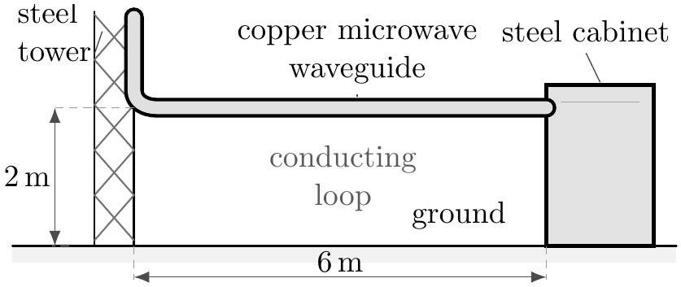
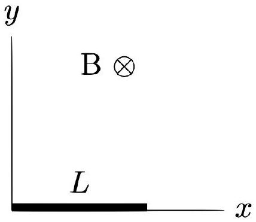
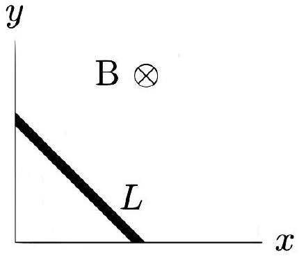
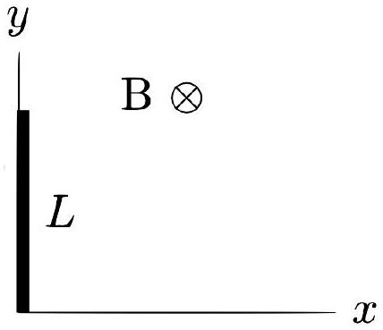
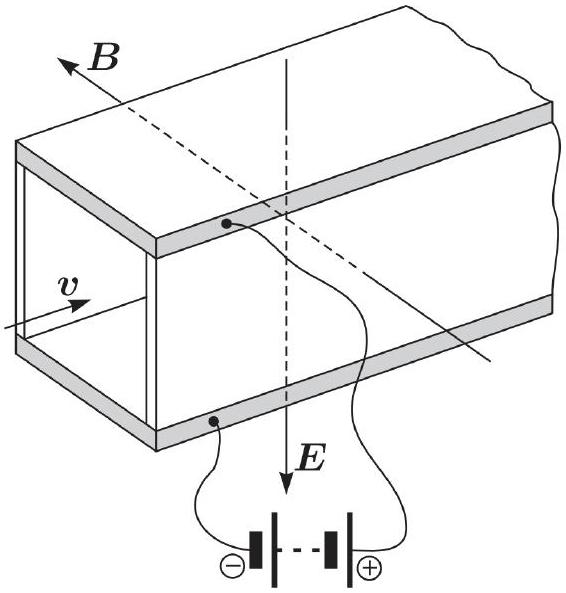
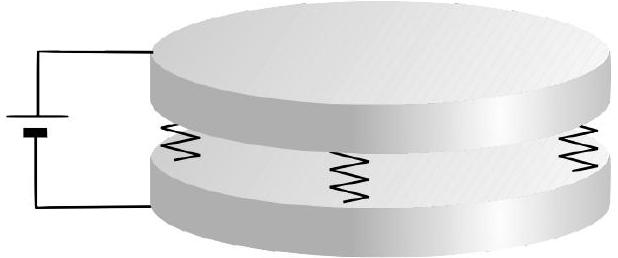
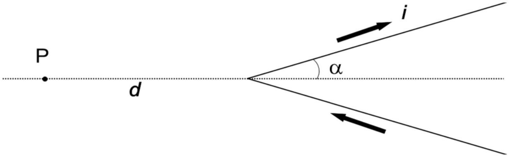

## Practice USAPhO E

INSTRUCTIONS
DO NOT OPEN THIS TEST UNTIL YOU ARE TOLD TO BEGIN

- Work Part A first. You have 90 minutes to complete all problems. Each problem is worth an equal number of points, with a total point value of 60 . Do not look at Part B during this time.
- After you have completed Part A you may take a break.
- Then work Part B. You have 90 minutes to complete all problems. Each problem is worth an equal number of points, with a total point value of 60. Do not look at Part A during this time.
- Show all your work. Partial credit will be given. Do not write on the back of any page. Do not write anything that you wish graded on the question sheets.
- Start each question on a new sheet of paper. Put your AAPT ID number, your proctor's AAPT ID number, the question number, and the page number/total pages for this problem, in the upper right hand corner of each page. For example,
Student AAPT ID \#
Proctor AAPT ID \# A1-1/3
- A hand-held calculator may be used. Its memory must be cleared of data and programs. You may use only the basic functions found on a simple scientific calculator. Calculators may not be shared. Cell phones, PDA's or cameras may not be used during the exam or while the exam papers are present. You may not use any tables, books, or collections of formulas.
- Questions with the same point value are not necessarily of the same difficulty.
- In order to maintain exam security, do not communicate any information about the questions (or their answers/solutions) on this contest.

Possibly Useful Information. You may use this sheet for both parts of the exam.

$$
\begin{aligned}
& g = 9.8 \mathrm {~N} / \mathrm { kg } \\
& k = 1 / 4 \pi \epsilon _ { 0 } = 8.99 \times 10 ^ { 9 } \mathrm {~N} \cdot \mathrm {~m} ^ { 2 } / \mathrm { C } ^ { 2 } \\
& c = 3.00 \times 10 ^ { 8 } \mathrm {~m} / \mathrm { s } \\
& N _ { \mathrm { A } } = 6.02 \times 10 ^ { 23 } ( \mathrm {~mol} ) ^ { - 1 } \\
& \sigma = 5.67 \times 10 ^ { - 8 } \mathrm {~J} / \left( \mathrm { s } \cdot \mathrm {~m} ^ { 2 } \cdot \mathrm {~K} ^ { 4 } \right) \\
& 1 \mathrm { eV } = 1.602 \times 10 ^ { - 19 } \mathrm {~J} \\
& m _ { e } = 9.109 \times 10 ^ { - 31 } \mathrm {~kg} = 0.511 \mathrm { MeV } / \mathrm { c } ^ { 2 } \\
& \sin \theta \approx \theta - \frac { 1 } { 6 } \theta ^ { 3 } \text { for } | \theta | \ll 1
\end{aligned}
$$

$$
\begin{aligned}
& G = 6.67 \times 10 ^ { - 11 } \mathrm {~N} \cdot \mathrm {~m} ^ { 2 } / \mathrm { kg } ^ { 2 } \\
& k _ { \mathrm { m } } = \mu _ { 0 } / 4 \pi = 10 ^ { - 7 } \mathrm {~T} \cdot \mathrm {~m} / \mathrm { A } \\
& k _ { \mathrm { B } } = 1.38 \times 10 ^ { - 23 } \mathrm {~J} / \mathrm { K } \\
& R = N _ { \mathrm { A } } k _ { \mathrm { B } } = 8.31 \mathrm {~J} / ( \mathrm { mol } \cdot \mathrm {~K} ) \\
& e = 1.602 \times 10 ^ { - 19 } \mathrm { C } \\
& h = 6.63 \times 10 ^ { - 34 } \mathrm {~J} \cdot \mathrm {~s} = 4.14 \times 10 ^ { - 15 } \mathrm { eV } \cdot \mathrm {~s} \\
& ( 1 + x ) ^ { n } \approx 1 + n x \text { for } | x | \ll 1 \\
& \cos \theta \approx 1 - \frac { 1 } { 2 } \theta ^ { 2 } \text { for } | \theta | \ll 1
\end{aligned}
$$

## Part A

## Question A1

This problem describes a real situation once faced by Federal Aviation Administration engineers. In Florida, where there are frequent thunderstorms, the FAA experienced a large number of communications equipment failures. Suspecting lightning strikes, a power recording monitor was installed at one Florida site. After carefully studying the problem, the engineers concluded that the failures were the result of inductive coupling of energy into the communications system. They determined that a conducting loop (with dimensions of about 2 meters by 6 meters) was formed by the steel tower, the copper microwave waveguide, the steel equipment cabinet, and the ground (see sketch). Using typical figures for the rise time of electric current in a lightning bolt, one can estimate that significant voltage would be induced in this loop, even by a lightning strike several kilometers away.

Let us model the process as follows.

1. Begin with the magnetic field produced by a straight, infinite line of steady current $I$. Use either the Biot-Savart or Ampere's law to obtain an expression for the magnetic field at distance $r$ from the current.
2. Although the result of part 1 holds rigorously only for a steady current, let us use it to estimate the time-dependent magnetic field produced by a lightning bolt. Let us model the lightning bolt as a straight, vertical, infinite line of current that rises linearly from zero to $1 \times 10 ^ { 6 } \mathrm {~A}$ in $5 \times 10 ^ { - 5 } \mathrm {~s}$. Let the lightning bolt strike one kilometer from the tower. Find the emf induced in the conducting loop while the lightning current increases. Describe any other approximations you make besides the ones we have already mentioned.
3. Suppose the conducting loop described above has a resistance of 50 Ohms. Inside the cabinet there is a solid state device that can survive a maximum current of 0.25 A. Could this device be damaged by the lightning strike described in part 2?

Solution. This is USAPhO 1998, problem A4. Here's an outline of the official solution:

1. (4) $B = \mu _ { 0 } I / 2 \pi r$.
2. (6) $\mathcal { E } = 48 \mathrm {~V}$ if you model the lightning bolt as infinite. If you model it as half-infinite, which is a much better approximation, you instead get 24 V. Either answer is acceptable.
3. (5) If you modeled the lightning bolt as infinite, then $I = \mathcal { E } / R = 0.96 \mathrm {~A}$, and if you modeled it as half-infinite, then $I = 0.48 \mathrm {~A}$. In either case the device is damaged.

## Question A2

A large vessel is filled with an incompressible, electrically insulating liquid of mass density $\rho _ { m }$, carrying a uniform charge density $\rho _ { e }$, which is so small that any electric fields created by the liquid can be neglected. Let $z = 0$ at the initial surface level of the liquid. A point charge $- q$ is brought to the height $H$, and a bump forms on the liquid surface.

1. Find the maximum height of the bump.
2. If the charge is slowly lowered, at what height $H ^ { * }$ will the liquid start flowing to it?

Solution. This is NBPhO 2006, problem 3. Here's an outline of the official solution:

1. (10) Let the height of the bump be $h$. Since the surface of the liquid must be at constant potential energy,
$$
\rho _ { m } g h = \frac { \rho _ { e } q } { 4 \pi \epsilon _ { 0 } } \frac { 1 } { H - h } .
$$
This is a quadratic equation in $h$, with solution
$$
h = \frac { H } { 2 } - \sqrt { \left( \frac { H } { 2 } \right) ^ { 2 } - \frac { k \rho _ { e } q } { \rho _ { m } g } } .
$$
2. (5) This happens when there is no solution for $h$ above; the liquid minimizes its energy by going all the way to the charge. The critical value of $H$ is thus when the discriminant is zero,
$$
H ^ { * } = 2 \sqrt { \frac { k \rho _ { e } q } { \rho _ { m } g } } .
$$

## Question A3

A metallic rod of mass $m$ and length $L$ (thick line in the figure below) can slide without friction, with its ends attached to two perpendicular wires (thin lines in the figures). The entire arrangement is located in the horizontal plane. A constant magnetic field of magnitude $B$ exists perpendicular to this plane in the downward direction. The wires have negligible resistance compared to the rod whose resistance is $R$. Initially, the rod is along one of the wires so that one end of it is at the junction of the two wires (see Fig. (a)).

(a)

(b)

(c)

The rod is given an initial angular speed $\Omega$ such that it slides with its two ends always in contact with the two wires (see Fig. (b)), and just comes to rest in an aligned position with the other wire (see Fig. (c)). Determine $\Omega$. Neglect the self-inductance of the system.

Solution. This is INPhO 2017, problem 5. Let $\phi$ be the angle of the rod with the horizontal. Then

$$
x _ { \mathrm { cm } } = \frac { L } { 2 } \cos \phi , \quad y _ { \mathrm { cm } } = \frac { L } { 2 } \sin \phi
$$

so

$$
K = \frac { 1 } { 2 } m v _ { \mathrm { cm } } ^ { 2 } + \frac { 1 } { 2 } I _ { \mathrm { cm } } \dot { \phi } ^ { 2 } = \frac { m L ^ { 2 } \dot { \phi } ^ { 2 } } { 6 } .
$$

The induced emf is

$$
\mathcal { E } = \frac { 1 } { 2 } B L ^ { 2 } \cos ( 2 \phi ) \dot { \phi } .
$$

By calculating the dissipated power,

$$
\frac { d K } { d t } = - \frac { \mathcal { E } ^ { 2 } } { R }
$$

which implies

$$
\ddot { \phi } = - \frac { 3 B ^ { 2 } L ^ { 2 } } { 4 m R } \cos ^ { 2 } ( 2 \phi ) \dot { \phi } .
$$

Integrating both sides with respect to time gives

$$
\Omega = \frac { 3 B ^ { 2 } L ^ { 2 } } { 4 m R } \int _ { 0 } ^ { \pi / 2 } \cos ^ { 2 } ( 2 \phi ) d \phi = \frac { 3 \pi B ^ { 2 } L ^ { 2 } } { 16 m R } .
$$

## Question A4

A conductive liquid of resistivity $\rho$ flows at speed $v$ through a square metal pipe, which is placed in a uniform electric field $E$ and magnetic field $B \gg E / c$. The velocity, electric field, and magnetic field are all perpendicular.

This is a "magnetohydrodynamic drive", which uses electrical energy to push the liquid forward.

1. Find the force per volume acting on the liquid in the direction of the pipe. Neglect any fields created by the flow of current.
2. Find the flow speed $v$ that maximizes the power per volume delivered to the liquid. At this flow speed, what is the efficiency of the pump?

Solution. This is problem 174 from Kalda's electromagnetism handout, translated here.

1. (8) The effect of the fields is to produce a uniform current density $J$ in the liquid, which flows down along the direction of $E$, and returns along the sides of the pipe. By considering the forces on the liquid, we have
$$
\rho J = E - v B .
$$
The magnetic field then acts on this downward current to produce a force along the pipe. The force per volume $\mathcal { F }$ is
$$
\mathcal { F } = J B = \frac { B ^ { 2 } } { \rho } \left( \frac { E } { B } - v \right) .
$$
2. (7) The power per volume is
$$
\mathcal { P } = \mathcal { F } v = \frac { B ^ { 2 } } { \rho } \left( \frac { E } { B } - v \right) v .
$$
This is maximized when $v = E / 2 B$. We can neglect relativity, because $v \ll c$.
On the other hand, the power lost due to resistance in the liquid per volume is
$$
\mathcal { P } _ { \text {loss } } = \rho J ^ { 2 } = \frac { B ^ { 2 } } { \rho } \left( v - \frac { E } { B } \right) ^ { 2 } .
$$
When $v = E / 2 B$, we have $\mathcal { P } = \mathcal { P } _ { \text {loss } }$. That is, the power delivered to the liquid is equal to the power lost to resistance, which means the efficiency is 1/2.

## Part B

## Question B1

Mechanical and electrical processes are sometimes strongly coupled. Very important examples are systems containing piezoelectric materials, e.g. quartz resonator. Here we investigate a somewhat simpler situation.

There are two metal plates with area $S$ and mass $m$. One plate is situated atop of the other one. Plates are connected to each other with springs, whose total spring constant is $k$ and which are made of insulator. The lower plate is mounted on a steady base. The equilibrium distance between the plates is $X _ { 0 }$.

1. Let us assume that there is a small vertical shift $x$ of the upper plate from its equilibrium position. Find the acceleration $\ddot { x }$ of $x$ in terms of system parameters. What is the angular frequency $\omega _ { 0 }$ of the small vertical oscillations of the upper plate?
2. The plates are now connected to a constant high voltage source, so that they form a capacitor. The electrostatic force between the plates causes an additional shift of the upper plate. The equilibrium distance between the plates is now $X _ { 1 }$. Derive expression for the electrical attractive force $F _ { e }$ and the voltage applied to the plates $U$ in terms of $X _ { 0 } , X _ { 1 } , S , m$, and $k$.
3. The system is set to oscillate again, keeping the voltage $U$ constant. Let $x$ still stand for the small shift from the equilibrium position. Derive an expression for the acceleration $\ddot { x }$ of $x$ in terms of $X _ { 0 } , X _ { 1 } , S , m , k$, and the shift $x$. What is the angular frequency $\omega _ { 0 } ^ { \prime }$ of the upper plate's small vertical oscillations?
4. Let us modify the situation of the previous question and connect an inductor with inductance $L$ in series to the capacitor and voltage source. In equilibrium, the distance between the plates is $X _ { 1 }$, and the charge on the capacitor is $Q$. Now consider a small shift of both quantities, so that the distance and charge become $X _ { 1 } + x$ and $Q + q$. Derive expressions for the accelerations $\ddot { x }$ and $\ddot { q }$ in terms of $X _ { 1 } , Q , S , L , m , k , x$, and $q$.
5. Find the possible angular frequencies of harmonic oscillation of the system, in terms of $X _ { 0 }$, $X _ { 1 } , \omega _ { 0 }$, and $\omega _ { 1 } = \sqrt { X _ { 1 } / \epsilon _ { 0 } S L }$.
6. What is the maximum value of $X _ { 0 } / X _ { 1 }$ for which the system is stable?

Solution. This is NBPhO 2005, problem 6. It is a toy example of optomechanics (the study of coupled mechanical and electromagnetic oscillations) which is increasingly important in physics; for example, LIGO is a gigantic optomechanical system. Here's an outline of the official solution:

1. (3) Of course, it is $m \ddot { x } = - k x$, so $\omega _ { 0 } = \sqrt { k / m }$.

2. (6) By force balance, $F _ { e } = k \left( X _ { 0 } - X _ { 1 } \right)$. We also know that
$$
F _ { e } = \frac { Q E } { 2 } = \frac { C U ^ { 2 } } { 2 X _ { 1 } } = \frac { S \epsilon _ { 0 } U ^ { 2 } } { 2 X _ { 1 } ^ { 2 } } .
$$
Combining and solving for $U$ gives
$$
U = \sqrt { \frac { 2 k \left( X _ { 0 } - X _ { 1 } \right) } { S \epsilon _ { 0 } } } X _ { 1 } .
$$
3. (6) For a small displacement $x$, the restoring force is $- k x - \left( d F _ { e } / d x \right) x$, so the effective spring constant is
$$
k _ { \mathrm { eff } } = k + \left. \frac { d } { d x } \left( \frac { S \epsilon _ { 0 } U ^ { 2 } } { 2 \left( X _ { 1 } + x \right) ^ { 2 } } \right) \right| _ { x = 0 } = k - \frac { S \epsilon _ { 0 } U ^ { 2 } } { X _ { 1 } ^ { 3 } } .
$$
By using our final result from part (b),
$$
k _ { \mathrm { eff } } = k - \frac { S \epsilon _ { 0 } } { X _ { 1 } ^ { 3 } } \frac { 2 k \left( X _ { 0 } - X _ { 1 } \right) } { S \epsilon _ { 0 } } X _ { 1 } ^ { 2 } = k \left( 3 - 2 \frac { X _ { 0 } } { X _ { 1 } } \right)
$$
from which we conclude
$$
\omega _ { 0 } ^ { \prime } = \sqrt { \frac { k _ { \mathrm { eff } } } { m } } = \sqrt { \frac { k } { m } \left( 3 - 2 \frac { X _ { 0 } } { X _ { 1 } } \right) } .
$$
4. (6) Since there are two small perturbations from equilibrium, we need to be careful to consider all changes of either order $q$ or order $x$. Consider how the voltage across the capacitor varies, at lowest order. We have
$$
V _ { C } = \frac { Q + q } { C } = \frac { ( Q + q ) \left( X _ { 1 } + x \right) } { S \epsilon _ { 0 } } .
$$
Thus, neglecting a second order term, the change in the voltage from equilibrium is
$$
\delta V _ { C } = \frac { q X _ { 1 } + Q x } { S \epsilon _ { 0 } } .
$$
Therefore, the perturbed Kirchhoff's loop rule is
$$
L \ddot { q } = - \delta V _ { C } = - \frac { q X _ { 1 } } { S \epsilon _ { 0 } } - \frac { Q x } { S \epsilon _ { 0 } } .
$$
Next, consider the perturbation to the force. The electric force is
$$
F _ { e } = \frac { ( Q + q ) E } { 2 } = \frac { ( Q + q ) ^ { 2 } } { 2 S \epsilon _ { 0 } }
$$
which means the change from equilibrium, to first order, is
$$
\delta F _ { e } = \frac { Q q } { S \epsilon _ { 0 } } .
$$
Thus, Newton's second law gives
$$
m \ddot { x } = - k x - \delta F _ { e } = - k x - \frac { Q q } { S \epsilon _ { 0 } }
$$

5. (6) We guess complex exponentials of angular frequency $\omega$ for both $x$ and $q$. As usual, the second time derivative gives a factor of $- \omega ^ { 2 }$, and canceling the complex exponential gives a relation between the amplitudes of the two quantities, which we'll also call $x$ and $q$ for brevity,
$$
\omega ^ { 2 } L q = \frac { q X _ { 1 } } { S \epsilon _ { 0 } } + \frac { Q x } { S \epsilon _ { 0 } } , \quad \omega ^ { 2 } m x = k x + \frac { Q q } { S \epsilon _ { 0 } } .
$$
Since these equations are linear, there's only one independent quantity, the ratio $q / x$. The two equations must predict the same value of $x / q$, which are
$$
\frac { x } { q } = \frac { Q / S \epsilon _ { 0 } } { \omega ^ { 2 } m - k } , \quad \frac { x } { q } = \frac { \omega ^ { 2 } L - X _ { 1 } / S \epsilon _ { 0 } } { Q / S \epsilon _ { 0 } } .
$$
Setting these equal and simplifying gives
$$
\left( \omega ^ { 2 } - \omega _ { 0 } ^ { 2 } \right) \left( \omega ^ { 2 } - \omega _ { 1 } ^ { 2 } \right) = \frac { Q ^ { 2 } } { S ^ { 2 } \epsilon _ { 0 } ^ { 2 } m L } = 2 \left( \frac { X _ { 0 } } { X _ { 1 } } - 1 \right) \omega _ { 0 } ^ { 2 } \omega _ { 1 } ^ { 2 } .
$$
Thus, we have
$$
\omega ^ { 4 } - \left( \omega _ { 0 } ^ { 2 } + \omega _ { 1 } ^ { 2 } \right) \omega ^ { 2 } + \omega _ { 0 } ^ { 2 } \omega _ { 1 } ^ { 2 } \left( 3 - 2 \frac { X _ { 0 } } { X _ { 1 } } \right) = 0 .
$$
Using the quadratic formula, we finally find
$$
\omega ^ { 2 } = \frac { \omega _ { 0 } ^ { 2 } + \omega _ { 1 } ^ { 2 } } { 2 } \pm \sqrt { \left( \frac { \omega _ { 0 } ^ { 2 } + \omega _ { 1 } ^ { 2 } } { 2 } \right) ^ { 2 } - \left( 3 - 2 \frac { X _ { 0 } } { X _ { 1 } } \right) \omega _ { 0 } ^ { 2 } \omega _ { 1 } ^ { 2 } } .
$$
6. (3) For the system to be stable, all the values of $\omega$ need to be real, which means $\omega ^ { 2 }$ has to be positive. On the other hand, the product of the two values of $\omega ^ { 2 }$ is proportional to $3 - 2 X _ { 0 } / X _ { 1 }$, which means one solution for $\omega ^ { 2 }$ goes negative when $X _ { 0 } / X _ { 1 } = 3 / 2$. The system is thus stable for $X _ { 0 } / X _ { 1 } < 3 / 2$. (This has nothing to do with the inductor; it simply reflects the fact that if the applied voltage is too strong, the two plates will snap together, much like the setup in USAPhO 2019 B1.)

This problem is quite a lot more computationally involved than question B2, which again illustrates that not all points come for an equal amount of work.

## Question B2

Among the first successes of the interpretation by Ampere of magnetic phenomena, we have the computation of the magnetic field B generated by wires carrying an electric current, as compared to early assumptions originally made by Biot and Savart. A particularly interesting case is that of a very long wire, carrying a constant current $i$, made out of two straight sections and bent into the form of a "V", with angular half-span $\alpha$.

According to Ampere's computations, the magnitude $B$ of the magnetic field at point $P$, a distance $d$ from the vertex, is proportional to $\tan ( \alpha / 2 )$. Ampere's work was later embodied in Maxwell's electromagnetic theory, and is universally accepted.

1. Find the direction of $\mathbf { B }$ at $P$.
2. Given that the magnitude of the field at $P$ is $B = k \tan ( \alpha / 2 )$, find the constant $k$.
3. Let $P ^ { * }$ be the reflection of $P$ about the vertex of the V. Compute the field B at $P ^ { * }$.
4. To measure the magnetic field, we place at $P$ a small magnetic needle with moment of inertia $I$ and magnetic dipole moment $\boldsymbol { \mu }$. It oscillates about a fixed point in a plane containing the direction of B. Compute the period of small oscillations of this needle as a function of $B$.
5. In the same conditions Biot and Savart had instead assumed that the magnetic field at $P$ might have been $B = \mu _ { 0 } i \alpha / \pi ^ { 2 } d$. In fact, they attempted to decide between the two expressions using an experiment, by measuring the oscillation period of the magnetic needle as a function of $\alpha$. To distinguish experimentally between the two predictions, we need a significant difference in period. For approximately what range of $\alpha$ is Ampere's prediction at least 10\% larger than Biot and Savart's?

It may be useful to use the tangent half angle identity,

$$
\tan \frac { \alpha } { 2 } = \frac { \sin \alpha } { 1 + \cos \alpha } .
$$

Solution. This is IPhO 1999, problem 2. Here's an outline of the official solution:

1. (5) Out of the page.
2. (5) Using the special case $\alpha = \pi / 2$, which is just a straight wire, we find $k = \mu _ { 0 } i / 2 \pi d$.
3. (5) This is equivalent to setting $\alpha \rightarrow \pi - \alpha$ and reversing the current, so $B = k \cot ( \alpha / 2 )$ into the page.

4. (5) Since $I \ddot { \theta } = \tau = - \mu B \sin \theta \approx - \mu B \theta$, we have simple harmonic motion with $T = 2 \pi \sqrt { I / \mu B }$.
5. (10) We have
$$
\frac { T _ { \mathrm { A } } } { T _ { \mathrm { BS } } } = \sqrt { \frac { 2 \alpha } { \pi \tan ( \alpha / 2 ) } } = \left\{ \begin{array} { l l }
2 / \sqrt { \pi } & \alpha = 0 \\
1 & \alpha = \pi / 2
\end{array} . \right.
$$
This quantity monotonically decreases in $\alpha$, so $\alpha \leq \alpha _ { * }$ where $T _ { \mathrm { A } } / T _ { \mathrm { BS } } = 1.1$ at $\alpha _ { * }$. Solving by iteration or binary search or any other method gives $\alpha _ { * } = 0.77 \mathrm { rad } = 44 ^ { \circ }$. Any answer within 20\% of this is acceptable.
