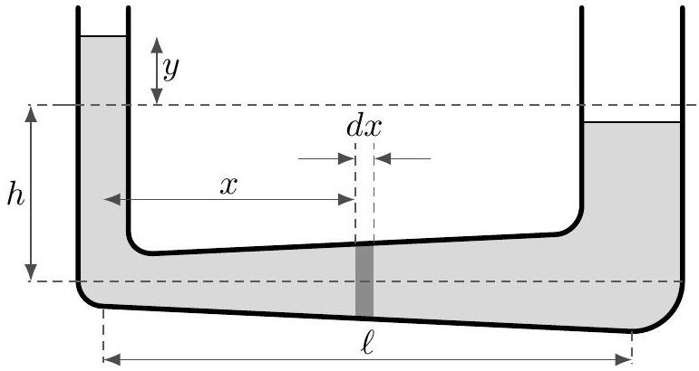

## Practice USAPhO M

INSTRUCTIONS
DO NOT OPEN THIS TEST UNTIL YOU ARE TOLD TO BEGIN

- Work Part A first. You have 90 minutes to complete all problems. Each problem is worth an equal number of points, with a total point value of 75. Do not look at Part B during this time.
- After you have completed Part A you may take a break.
- Then work Part B. You have 90 minutes to complete all problems. Each problem is worth an equal number of points, with a total point value of 75. Do not look at Part A during this time.
- Show all your work. Partial credit will be given. Do not write on the back of any page. Do not write anything that you wish graded on the question sheets.
- Start each question on a new sheet of paper. Put your AAPT ID number, your proctor's AAPT ID number, the question number, and the page number/total pages for this problem, in the upper right hand corner of each page. For example,
Student AAPT ID \#
Proctor AAPT ID \# A1-1/3
- A hand-held calculator may be used. Its memory must be cleared of data and programs. You may use only the basic functions found on a simple scientific calculator. Calculators may not be shared. Cell phones, PDA's or cameras may not be used during the exam or while the exam papers are present. You may not use any tables, books, or collections of formulas.
- Questions with the same point value are not necessarily of the same difficulty.
- In order to maintain exam security, do not communicate any information about the questions (or their answers/solutions) on this contest.

Possibly Useful Information. You may use this sheet for both parts of the exam.

$$
\begin{aligned}
& g = 9.8 \mathrm {~N} / \mathrm { kg } \\
& k = 1 / 4 \pi \epsilon _ { 0 } = 8.99 \times 10 ^ { 9 } \mathrm {~N} \cdot \mathrm {~m} ^ { 2 } / \mathrm { C } ^ { 2 } \\
& c = 3.00 \times 10 ^ { 8 } \mathrm {~m} / \mathrm { s } \\
& N _ { \mathrm { A } } = 6.02 \times 10 ^ { 23 } ( \mathrm {~mol} ) ^ { - 1 } \\
& \sigma = 5.67 \times 10 ^ { - 8 } \mathrm {~J} / \left( \mathrm { s } \cdot \mathrm {~m} ^ { 2 } \cdot \mathrm {~K} ^ { 4 } \right) \\
& 1 \mathrm { eV } = 1.602 \times 10 ^ { - 19 } \mathrm {~J} \\
& m _ { e } = 9.109 \times 10 ^ { - 31 } \mathrm {~kg} = 0.511 \mathrm { MeV } / \mathrm { c } ^ { 2 } \\
& \sin \theta \approx \theta - \frac { 1 } { 6 } \theta ^ { 3 } \text { for } | \theta | \ll 1
\end{aligned}
$$

$$
\begin{aligned}
& G = 6.67 \times 10 ^ { - 11 } \mathrm {~N} \cdot \mathrm {~m} ^ { 2 } / \mathrm { kg } ^ { 2 } \\
& k _ { \mathrm { m } } = \mu _ { 0 } / 4 \pi = 10 ^ { - 7 } \mathrm {~T} \cdot \mathrm {~m} / \mathrm { A } \\
& k _ { \mathrm { B } } = 1.38 \times 10 ^ { - 23 } \mathrm {~J} / \mathrm { K } \\
& R = N _ { \mathrm { A } } k _ { \mathrm { B } } = 8.31 \mathrm {~J} / ( \mathrm { mol } \cdot \mathrm {~K} ) \\
& e = 1.602 \times 10 ^ { - 19 } \mathrm { C } \\
& h = 6.63 \times 10 ^ { - 34 } \mathrm {~J} \cdot \mathrm {~s} = 4.14 \times 10 ^ { - 15 } \mathrm { eV } \cdot \mathrm {~s} \\
& ( 1 + x ) ^ { n } \approx 1 + n x \text { for } | x | \ll 1 \\
& \cos \theta \approx 1 - \frac { 1 } { 2 } \theta ^ { 2 } \text { for } | \theta | \ll 1
\end{aligned}
$$

## Part A

## Question A1

Two masses, $m _ { 1 }$ and $m _ { 2 }$, attached to equal length massless strings, are hanging side-by-side just in contact with each other. Mass $m _ { 1 }$ is swung out to the side to a point having a vertical displacement 20 cm above mass $m _ { 2 }$. It is released from rest and collides elastically with the stationary hanging mass $m _ { 2 }$. Each of the masses is observed to rise to the same height following the collision. Neglect the volumes of the masses.

1. Find the numerical value of this height.
2. The masses swing back down and undergo a second elastic collision. After this collision, how high do the masses rise?
3. Suppose that the collisions are instead slightly inelastic. After a long time, how high does each mass rise in its motion, and qualitatively what is their relative position?

Solution. This is USAPhO Quarterfinal 1999, problem 3. Here's an outline of the official solution:

1. (10) If they rose to the same height, they must have had the same speeds after the collision. This happens when $m _ { 2 } = 3 m _ { 1 }$. If $v _ { 0 }$ is the speed of mass $m _ { 1 }$ right before the first collision, then after the collision both masses have speed $v _ { 0 } / 2$, so the height is 5 cm.
2. (5) The reverse of the first collision happens, so $m _ { 2 }$ stops and $m _ { 1 }$ rises back to height 20 cm.
3. (10) Suppose that after the first collision (which occurs at the lowest point for both masses), the masses have velocities $v _ { 1 }$ and $v _ { 2 }$. No matter what these velocities are, the masses will then take time $\pi \sqrt { L / g }$ to swing back up, stop, and then swing back down. So the second collision will also occur at the lowest point, and so on for future collisions. Furthermore, the initial velocities in the second collision are $- v _ { 1 }$ and $- v _ { 2 }$, i.e. the same as the final velocities in the first collision up to a sign.
All collisions preserve the velocity of the center of mass, $m _ { 1 } v _ { 1 } + m _ { 2 } v _ { 2 }$, while an elastic collision also preserves the relative speed $\left| v _ { 1 } - v _ { 2 } \right|$. A slightly inelastic collision simply slightly lowers the relative speed. Thus, across many collisions, $m _ { 1 } v _ { 1 } + m _ { 2 } v _ { 2 }$ stays the same (up to a sign) while $v _ { 1 } - v _ { 2 }$ goes to zero. After a long time, the masses thus swing together, always touching. At the bottom we have $v _ { 1 } = v _ { 2 } = v$, so
$$
\left( m _ { 1 } + m _ { 2 } \right) v = m _ { 1 } v _ { 0 } .
$$
Thus, $v = v _ { 0 } / 4$, which means both masses rise up to a height 1.25 cm.

## Question A2

A U-tube has vertical arms of radii $r$ and $2 r$, connected by a horizontal tube of length $l$ whose radius increases linearly from $r$ to $2 r$. The U-tube contains liquid up to height $h$ in each arm. The liquid is set oscillating, and at a given instant the liquid in the narrower arm is at a distance $y$ above the equilibrium level.

1. Show that, to second order in $y$, the change in potential energy of the liquid is
$$
U = \frac { 5 } { 8 } g \rho \pi r ^ { 2 } y ^ { 2 } .
$$
2. Show that, to second order in $y$, the kinetic energy of the liquid is
$$
K = \frac { 1 } { 4 } \rho \pi r ^ { 2 } \left( \ell + \frac { 5 } { 2 } h \right) \left( \frac { d y } { d t } \right) ^ { 2 } .
$$
You may find it useful to integrate over slices $d x$, as shown in the figure. Ignore any nastiness at the corners, and assume $\ell \gg r$.
3. Assuming $\ell = 5 h / 2$, compute the period of oscillations.
4. Explain why the assumption $\ell \gg r$ is necessary to get an accurate result.

Solution. This is problem 3.17 of Vibrations and Waves by French.

1. (5) We can think of moving a chunk of liquid from one side to the other. If a volume $V = \pi r ^ { 2 } y$ is added to the narrow arm, then a volume $V$ will be removed from the other, so the water level will sink a distance of $y _ { 2 } = V / \left( 4 \pi r ^ { 2 } \right) = y / 4$. The center of mass of the chunk of water will go from a height of $- y _ { 2 } / 2$ to $y / 2$, going a distance of $\Delta y = y / 2 + y / 8 = 5 y / 8$. Then the potential energy change is
$$
U = \Delta m g \Delta y = \frac { 5 } { 8 } \rho \pi r ^ { 2 } g y ^ { 2 } .
$$
2. (10) Consider points along the vertical arms first. The left arm's fluid will have kinetic energy $K _ { L } = \frac { 1 } { 2 } \rho \pi r ^ { 2 } h \dot { y } ^ { 2 }$ and the right $K _ { R } = \frac { 1 } { 2 } \rho \pi ( 2 r ) ^ { 2 } h ( \dot { y } / 4 ) ^ { 2 }$, so the kinetic energy of the arms is $K _ { A } = \frac { 1 } { 2 } \rho \pi r ^ { 2 } \dot { y } ^ { 2 } ( h + h / 4 ) = \frac { 5 } { 8 } \rho \pi r ^ { 2 } h \dot { y } ^ { 2 }$. In the horizontal part, a slice $d x$ with radius $r + r x / \ell$ will have area $A$ and kinetic energy $d K = \frac { 1 } { 2 } \rho A d x v ^ { 2 }$, and $v$ can be found with the fact that the fluid is incompressible: $A v = \pi r ^ { 2 } \dot { y } = A _ { 0 } \dot { y }$.
$$
\begin{gathered}
d K _ { h } = \frac { 1 } { 2 } \rho A \frac { A _ { 0 } ^ { 2 } \dot { y } ^ { 2 } } { A ^ { 2 } } d x = \frac { 1 } { 2 } \rho A _ { 0 } ^ { 2 } \dot { y } ^ { 2 } \frac { d x } { \pi ( r + r x / \ell ) ^ { 2 } } \\
K _ { h } = \frac { 1 } { 2 } \rho A _ { 0 } ^ { 2 } \dot { y } ^ { 2 } \int _ { 0 } ^ { \ell } \frac { d x } { \pi ( r + r x / \ell ) ^ { 2 } } = \frac { 1 } { 2 } \rho \pi r ^ { 4 } \dot { y } ^ { 2 } \frac { \ell } { r } \left( \frac { 1 } { r } - \frac { 1 } { 2 r } \right) = \frac { 1 } { 4 } \rho \dot { y } ^ { 2 } \pi r ^ { 2 } \ell \\
K = \frac { 1 } { 4 } \rho \pi r ^ { 2 } \left( \ell + \frac { 5 } { 2 } h \right) \dot { y } ^ { 2 } .
\end{gathered}
$$

3. (5) The energy equation is
$$
E = \frac { 5 } { 4 } \rho \pi r ^ { 2 } h \dot { y } ^ { 2 } + \frac { 5 } { 8 } g \rho \pi r ^ { 2 } y ^ { 2 } = \frac { 1 } { 2 } m _ { \mathrm { eff } } \dot { y } ^ { 2 } + \frac { 1 } { 2 } k _ { \mathrm { eff } } y ^ { 2 }
$$
so using the standard method in M4, we have
$$
T = 2 \pi \sqrt { \frac { m _ { \mathrm { eff } } } { k _ { \mathrm { eff } } } } = 2 \pi \sqrt { \frac { 2 h } { g } } .
$$
4. (5) This ensures that our estimate of the kinetic energy above is good. There are additional contributions to the kinetic energy due to the complicated turnaround at the corners, and also the radial velocity in the horizontal part, but these are small by assumption.

## Question A3

Two stars of masses $M _ { 1 }$ and $M _ { 2 }$ are initially orbiting each other in a circular orbit, with relative velocity $v$ and separation $r$. The first star begins slowly transferring matter to the second.

1. Show that during this process, the quantities $M _ { 1 } M _ { 2 } v ^ { a } r$ and $v ^ { b } r$ are conserved, for some values of $a$ and $b$, and find these values.
2. If the mass transfer rate is $\mu$, what is $d r / d t$, in terms of $r , M _ { 1 } , M _ { 2 }$, and $\mu$ ?

Solution. This is from the 2001 NBPhO. Here's an outline of the official solution:

1. (15) The stars orbit in circles of radii $r _ { 1 }$ and $r _ { 2 }$, where
$$
r _ { 1 } = \frac { M _ { 2 } } { M _ { 1 } + M _ { 2 } } r , \quad r _ { 2 } = \frac { M _ { 1 } } { M _ { 1 } + M _ { 2 } } r
$$
and have speeds $v _ { 1 }$ and $v _ { 2 }$, where $v = v _ { 1 } + v _ { 2 }$. Note that the transfer does not necessarily conserve energy, but it does conserve angular momentum. The angular momentum about the center of mass is
$$
L = M _ { 1 } v _ { 1 } r _ { 1 } + M _ { 2 } v _ { 2 } r _ { 2 } = \frac { M _ { 1 } M _ { 2 } r } { M _ { 1 } + M _ { 2 } } \left( v _ { 1 } + v _ { 2 } \right) = \frac { M _ { 1 } M _ { 2 } v r } { M _ { 1 } + M _ { 2 } } .
$$
Since the total mass $M _ { 1 } + M _ { 2 }$ is conserved, and $L$ is conserved, $M _ { 1 } M _ { 2 } v r$ is conserved. Next, we note that since the process is slow, the orbits remain circular. (This is an example of the adiabatic theorem reasoning from M4.) Then force balance gives
$$
\frac { M _ { 1 } v _ { 1 } ^ { 2 } } { r _ { 1 } } = \frac { G M _ { 1 } M _ { 2 } } { r ^ { 2 } }
$$
which simplifies to give
$$
r v _ { 1 } ^ { 2 } = \frac { G } { M _ { 1 } + M _ { 2 } } M _ { 2 } ^ { 2 } .
$$
By identical reasoning, we have
$$
r v _ { 2 } ^ { 2 } = \frac { G } { M _ { 1 } + M _ { 2 } } M _ { 1 } ^ { 2 }
$$

which means that by combining the equations,
$$
r v ^ { 2 } = \frac { G } { M _ { 1 } + M _ { 2 } } \left( M _ { 1 } + M _ { 2 } \right) ^ { 2 } = G \left( M _ { 1 } + M _ { 2 } \right)
$$
and the right-hand side is conserved, so $v ^ { 2 } r$ is conserved. Therefore, the answers are
$$
a = 1 , \quad b = 2 .
$$
2. (10) By combining the conserved quantities, we see that $M _ { 1 } M _ { 2 } \sqrt { r }$ is conserved. Thus, setting its time derivative to zero gives the answer. This is most conveniently done by taking the logarithm first,
$$
\frac { d } { d t } \left( \log M _ { 1 } + \log M _ { 2 } + \frac { 1 } { 2 } \log r \right) = - \frac { \mu } { M _ { 1 } } + \frac { \mu } { M _ { 2 } } + \frac { 1 } { 2 } \frac { \dot { r } } { r } = 0
$$
from which we conclude
$$
\dot { r } = 2 \mu r \frac { M _ { 2 } - M _ { 1 } } { M _ { 1 } M _ { 2 } } .
$$

## Part B

## Question B1

A man wishes to topple a very tall and thin obelisk, of height $L$. To do this, he wraps the end of a rope of length $L$ around the obelisk at height $h$, then stands on the ground and pulls the other end as hard as he can. Assume that the rope does not slip on the obelisk, but the man can slip on the ground, with coefficient of static friction $\mu$.

1. Explain why the man is unlikely to succeed if he attaches the rope at $h = 0$ or $h = L$.
2. To topple the obelisk, the man should maximize the torque they can exert about the obelisk's base without slipping. What is the optimal value of $h$ ?

Solution. This is the "obelisk razer" problem from Professor Povey's Perplexing Problems.

1. (5) At height $h = 0$, the man would just be pulling on the obelisk horizontally at its base, which applies no torque about the base. At $h = L$ the man would be pulling the rope almost exactly down, which would, if anything, make the obelisk more secure.
2. (20) Let the man pull on the rope with a force $F$. By balancing horizontal forces on the man, the maximum possible value of $F$ before the man starts slipping satisfies

$$
F \cos \theta = \mu ( m g - F \sin \theta )
$$

where $\theta$ is the angle the rope makes with the horizontal, so

$$
\sin \theta = \frac { h } { L } , \quad \cos \theta = \frac { \sqrt { L ^ { 2 } - h ^ { 2 } } } { L } .
$$

Then we have

$$
F = \frac { \mu m g } { \mu \sin \theta + \cos \theta } .
$$

The torque on the obelisk is then $\tau = F h \cos \theta = F L \sin \theta \cos \theta$, so

$$
\tau = \frac { \sin \theta \cos \theta } { \mu \sin \theta + \cos \theta } \mu m g L .
$$

Therefore, simplifying the fraction, we have

$$
\tau \propto \frac { 1 } { \mu / \cos \theta + 1 / \sin \theta } .
$$

Therefore, we want to minimize the denominator. Setting its derivative to zero gives

$$
\frac { \cos \theta } { \sin ^ { 2 } \theta } = \frac { \mu \sin \theta } { \cos ^ { 2 } \theta }
$$

which becomes $\tan \theta = \mu ^ { - 1 / 3 }$. Solving the triangle gives

$$
h = \frac { L } { \sqrt { 1 + \mu ^ { 2 / 3 } } } .
$$

## Question B2

The bottom of the Marianas trench in the Pacific ocean is 10.9 km below sea level.

1. Estimate the pressure at the bottom of the trench, assuming the water is incompressible. The density of water at atmospheric pressure is $1025 \mathrm {~kg} / \mathrm { m } ^ { 3 }$.
2. In reality, water is not incompressible. Its compressibility is described by its bulk modulus,
$$
B = \rho \frac { d P } { d \rho } = 2.1 \times 10 ^ { 9 } \mathrm {~Pa} .
$$
The bulk modulus has the same dimensions as the Young's modulus, defined as stress over strain. They're fundamentally very similar, but the bulk modulus quantifies the response to uniform pressure, while the Young's modulus quantifies the response to stress in one direction. Find the pressure at the bottom of the trench, accounting for the compressibility of water, to within 10\% accuracy.
3. A bathyscaph is a spherical diving vessel designed to descend to great depths in the ocean. Estimate the thickness of steel wall needed to withstand the pressure at the bottom of the Mariana trench, to within 10\% accuracy. Assume the initial radius is 1 m, the Young's modulus of steel is $2 \times 10 ^ { 11 } \mathrm {~Pa}$, and that steel breaks down at a strain (fractional length change) of above 0.5\%. (Hint: consider forces between two halves of the bathyscaph.)

Solution. This is problem 18.3 from Physics to a Degree.

1. (5) The pressure will be $P _ { 0 } + \rho g h \approx \rho g h = 1.09 \times 10 ^ { 8 } \mathrm {~Pa}$.
2. (10) The fraction the water is compressed at the bottom is proportional to $( \rho g h ) / B \approx 5 \%$, so we expect the correction is small. Since the water gets compressed, there's more of it than accounted for in part (a), so the pressure should go up a bit. However, it's such a small effect that we can already tell, without doing any real calculation, that just repeating the same answer as in part (a) is good enough to get within 10\%.
For completeness, we can do this exactly, though you don't have to do this for credit. The pressure balance equation is $d P = \rho g d h$, so using the definition of the bulk modulus gives
$$
\int _ { \rho _ { 0 } } ^ { \rho } \frac { d \rho } { \rho } = \int _ { P _ { 0 } } ^ { P } \frac { d P } { B } , \quad \rho ( P ) = \rho _ { 0 } e ^ { \left( P - P _ { 0 } \right) / B }
$$
Neglecting the atmospheric pressure, we have
$$
d P = \rho _ { 0 } e ^ { P / B } g d h .
$$
Integrating both sides,
$$
\int _ { 0 } ^ { P } e ^ { - P / B } d P = \int _ { 0 } ^ { h } \rho g d h
$$
which implies
$$
B \left( 1 - e ^ { - P / B } \right) = \rho g h , \quad P = B \log \left( \frac { 1 } { 1 - \rho g h / B } \right) \approx 1.13 \times 10 ^ { 8 } \mathrm {~Pa} .
$$

In other words, the error in treating water as incompressible is only about 3\%. (Note that our final result diverges for sufficiently large $h$, say 100 times more than what we used in this problem. This is just telling us that at that point, treating the water as some substance with a constant bulk modulus breaks down. If you squeeze it enough, its bulk modulus actually starts to increase. In fact, for sufficiently strong squeezing, ocean-temperature water will crystallize into an exotic form of ice, and its bulk modulus will get even higher.)

3. (10) The vessel will be a spherical shell of thickness $t$ and radius $R$, and the pressure differential between the inside to the outside will be $P - P _ { 0 } \approx P$. Using the hemisphere trick introduced in M2, the force between two hemispheres is $\pi R ^ { 2 } P$.
The force is supported by a cross-sectional area of $2 \pi R t$, so the stress is
$$
\frac { \pi R ^ { 2 } P } { 2 \pi R t } = \frac { P R } { 2 t } .
$$
By the definition of Young's modulus $Y$, the strain is
$$
\text { strain } = \frac { \text { stress } } { Y } = \frac { P R } { 2 Y t }
$$
and the maximum strain is 0.005 . Solving for $t$ gives
$$
t = \frac { P R } { 0.01 Y } = 6 \mathrm {~cm} .
$$

## Question B3

A uniform ring of mass $m$ and radius $R$ has a point mass of mass $M$ attached to it. The ring is placed on the ground, with the point mass initially at its highest point, and is given an infinitesimal sideways impulse in the plane of the ring. Assume the ring does not slip.

1. Assuming the ring never loses contact with the ground, find the angular velocity $\omega$ of the ring as a function of the angle $\theta$ through which it has rotated.
2. Continuing to assume the ring never loses contact with the ground, find the vertical component of the net force on the ring-mass system as a function of $\theta$.
3. It turns out that for some range of values of $m / M$, the normal force from the ground vanishes at some point. What are these values? (For partial credit, you can instead prove that there exists a value of $m / M$ so that this occurs.)

Solution. This is a classic problem, most recently popularized by Tadashi Tokieda's paper The Hopping Hoop and originally published in John Littlewood's Miscellany.

1. (5) By a conservation of energy argument, and letting $\mu = m / M$ for simplicity,
$$
\omega = \sqrt { \frac { 1 - \cos \theta } { 1 + \cos \theta + \mu } \frac { g } { R } } .
$$

2. (10) By differentiating the angular velocity, we have
$$
\alpha = \frac { ( 1 + \mu / 2 ) \sin \theta } { ( 1 + \cos \theta + \mu ) ^ { 2 } } \frac { g } { R } .
$$
Deriving this is a little messy, and maybe the easiest way to do it is to note that $d \left( \omega ^ { 2 } \right) / d t = 2 \omega \alpha$, since $\omega ^ { 2 }$ doesn't have a square root.
The center of mass of the ring is always at $y = R$, so the vertical force is $M a _ { y }$ where $a _ { y }$ is the acceleration of the mass. Using polar coordinates, the mass has
$$
y = R ( 1 + \cos \theta )
$$
which implies that
$$
v _ { y } = - R \omega \sin \theta , \quad a _ { y } = - R \left( \alpha \sin \theta + \omega ^ { 2 } \cos \theta \right) .
$$
Plugging in our earlier results, we find the messy result
$$
F _ { y } = M a _ { y } = - M g \frac { \sin ( \theta / 2 ) ^ { 2 } } { ( 1 + \mu + \cos \theta ) ^ { 2 } } ( 3 + \mu + ( 4 + 3 \mu ) \cos \theta + \cos 2 \theta ) .
$$
3. (10) We need the normal force to vanish, $F _ { y } = - M ( 1 + \mu ) g$, which is equivalent to
$$
\frac { \sin ( \theta / 2 ) ^ { 2 } } { ( 1 + \mu + \cos \theta ) ^ { 2 } } ( 3 + \mu + ( 4 + 3 \mu ) \cos \theta + \cos 2 \theta ) = 1 + \mu .
$$
It's a little easier to understand this by working entirely in terms of $\cos \theta$. Using half-angle and double-angle identities gives
$$
\frac { 1 - \cos \theta } { 2 } \frac { 1 } { ( 1 + \mu + \cos \theta ) ^ { 2 } } \left( 2 + \mu + ( 4 + 3 \mu ) \cos \theta + 2 \cos ^ { 2 } \theta \right) = 1 + \mu .
$$
This can indeed hold for small enough $m / M$. To see this, set $m / M = 0$ to get
$$
\frac { 1 - \cos \theta } { 2 } \frac { 1 } { ( 1 + \cos \theta ) ^ { 2 } } \left( 2 + 4 \cos \theta + 2 \cos ^ { 2 } \theta \right) = 1
$$
which greatly simplifies to $1 - \cos \theta = 1$, which occur when $\theta = \pi / 2$.
Quantitatively, the normal force can vanish for $m / M < 1 / 13$. By clearing denominators and using a series of trigonometric identities, we can show this occurs at the moment that
$$
\mu + 2 \cos \theta + \frac { \mu ( 2 + \mu ) ^ { 2 } } { ( 1 + \mu + \cos \theta ) ^ { 2 } } = 0 .
$$
To see if this condition is ever satisfied, we can minimize this with respect to $\theta$ and check if the minimum is negative, as this implies the value would have crossed zero at some point. Setting the derivative with respect to $\cos \theta$ equal to zero gives
$$
\mu ( 2 + \mu ) ^ { 2 } = ( 1 + \mu + \cos \theta ) ^ { 3 } .
$$
Plugging this result back in gives the condition
$$
\mu + 2 \left( \left( \mu ( 2 + \mu ) ^ { 2 } \right) ^ { 1 / 3 } - \mu - 1 \right) + \left( \mu ( 2 + \mu ) ^ { 2 } \right) ^ { 1 / 3 } \leq 0 .
$$

The threshold in $\mu$ occurs when this is equal to zero,

$$
2 + \mu = 3 \mu ^ { 1 / 3 } ( 2 + \mu ) ^ { 2 / 3 } .
$$

Throwing away the extraneous solution $\mu = - 2$, this equation is equivalent to

$$
\left( \frac { \mu + 2 } { \mu } \right) ^ { 1 / 3 } = 3
$$

which has solution $\mu = 1 / 13$, so the answer is $m / M < 1 / 13$.
Of course, it's crazy that all this is worth just 10 points! In practice, some points are indeed much harder to get than others. But the true purpose of this question is to test how you fare under extreme time pressure. If you spent a lot of time working on this part, but lost some much easier points on B1 or B2, you should reconsider your strategy for future mock exams.

Tough question, right? But it's actually even trickier. You might think that when the normal force vanishes, the ring jumps off the ground. But in fact, for the initial conditions assumed in this problem, it turns out the vertical acceleration of the ring is downward at this moment. So the ring slightly deforms into the ground, while exerting no normal force! In addition, the ring can start slipping, no matter how high the coefficient of friction is, since the normal force vanishes. So it is very nontrivial to determine what actually happens next; it depends on nonideal features of the system. For a recent discussion, see this paper.
