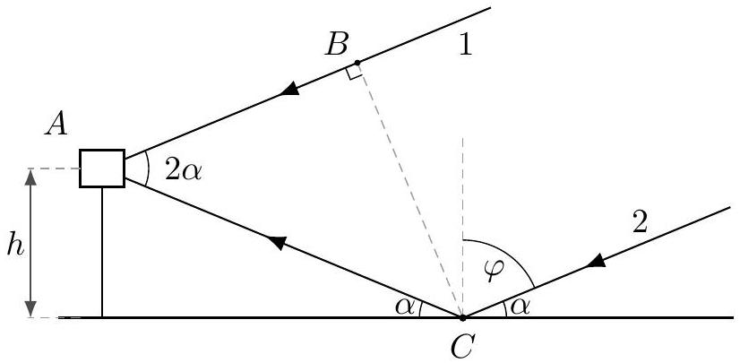

## Practice USAPhO X

INSTRUCTIONS
DO NOT OPEN THIS TEST UNTIL YOU ARE TOLD TO BEGIN

- Work Part A first. You have 90 minutes to complete all problems. Each problem is worth an equal number of points, with a total point value of 60. Do not look at Part B during this time.
- After you have completed Part A you may take a break.
- Then work Part B. You have 90 minutes to complete all problems. Each problem is worth an equal number of points, with a total point value of 60. Do not look at Part A during this time.
- Show all your work. Partial credit will be given. Do not write on the back of any page. Do not write anything that you wish graded on the question sheets.
- Start each question on a new sheet of paper. Put your AAPT ID number, your proctor's AAPT ID number, the question number, and the page number/total pages for this problem, in the upper right hand corner of each page. For example,
Student AAPT ID \#
Proctor AAPT ID \# A1-1/3
- A hand-held calculator may be used. Its memory must be cleared of data and programs. You may use only the basic functions found on a simple scientific calculator. Calculators may not be shared. Cell phones, PDA's or cameras may not be used during the exam or while the exam papers are present. You may not use any tables, books, or collections of formulas.
- Questions with the same point value are not necessarily of the same difficulty.
- In order to maintain exam security, do not communicate any information about the questions (or their answers/solutions) on this contest.

Possibly Useful Information. You may use this sheet for both parts of the exam.

$$
\begin{aligned}
& g = 9.8 \mathrm {~N} / \mathrm { kg } \\
& k = 1 / 4 \pi \epsilon _ { 0 } = 8.99 \times 10 ^ { 9 } \mathrm {~N} \cdot \mathrm {~m} ^ { 2 } / \mathrm { C } ^ { 2 } \\
& c = 3.00 \times 10 ^ { 8 } \mathrm {~m} / \mathrm { s } \\
& N _ { \mathrm { A } } = 6.02 \times 10 ^ { 23 } ( \mathrm {~mol} ) ^ { - 1 } \\
& \sigma = 5.67 \times 10 ^ { - 8 } \mathrm {~J} / \left( \mathrm { s } \cdot \mathrm {~m} ^ { 2 } \cdot \mathrm {~K} ^ { 4 } \right) \\
& 1 \mathrm { eV } = 1.602 \times 10 ^ { - 19 } \mathrm {~J} \\
& m _ { e } = 9.109 \times 10 ^ { - 31 } \mathrm {~kg} = 0.511 \mathrm { MeV } / \mathrm { c } ^ { 2 } \\
& \sin \theta \approx \theta - \frac { 1 } { 6 } \theta ^ { 3 } \text { for } | \theta | \ll 1
\end{aligned}
$$

$$
\begin{aligned}
& G = 6.67 \times 10 ^ { - 11 } \mathrm {~N} \cdot \mathrm {~m} ^ { 2 } / \mathrm { kg } ^ { 2 } \\
& k _ { \mathrm { m } } = \mu _ { 0 } / 4 \pi = 10 ^ { - 7 } \mathrm {~T} \cdot \mathrm {~m} / \mathrm { A } \\
& k _ { \mathrm { B } } = 1.38 \times 10 ^ { - 23 } \mathrm {~J} / \mathrm { K } \\
& R = N _ { \mathrm { A } } k _ { \mathrm { B } } = 8.31 \mathrm {~J} / ( \mathrm { mol } \cdot \mathrm {~K} ) \\
& e = 1.602 \times 10 ^ { - 19 } \mathrm { C } \\
& h = 6.63 \times 10 ^ { - 34 } \mathrm {~J} \cdot \mathrm {~s} = 4.14 \times 10 ^ { - 15 } \mathrm { eV } \cdot \mathrm {~s} \\
& ( 1 + x ) ^ { n } \approx 1 + n x \text { for } | x | \ll 1 \\
& \cos \theta \approx 1 - \frac { 1 } { 2 } \theta ^ { 2 } \text { for } | \theta | \ll 1
\end{aligned}
$$

## Part A

## Question A1

In this problem, we analyze the working principle of a speed camera. The transmitter of the speed camera emits an electromagnetic wave of frequency $f _ { 0 } = 24 \mathrm { GHz }$ having waveform $\cos \left( 2 \pi f _ { 0 } t \right)$. The wave gets reflected from an approaching car moving with speed $v$. The reflected wave is recorded by the receiver of the speed camera.

1. What is the frequency $f _ { 1 }$ of the reflected wave? You may assume that $v \ll c$.
2. Inside the circuitry of the speed camera, the received waveform is multiplied with the original emitted waveform. This product can itself be written as a sum of sinusoids of various frequencies. Find all the distinct frequencies in the sum.
3. Given that the lowest frequency component present in the multiplied signal is $f _ { \text {low } } = 4.8 \mathrm { kHz }$, calculate the speed of the car $v$.

You may find it useful to use the trigonometric identity

$$
\cos \alpha \cos \beta = ( \cos ( \alpha + \beta ) + \cos ( \alpha - \beta ) ) / 2 .
$$

Solution. This is NBPhO 2018, problem 2. Here's an outline of the official solution:

1. (8) The Doppler shift formula effectively has to be used twice, once because the car is moving towards the transmitter, and again because the car is moving towards the receiver. The answer is
$$
f _ { 1 } = f _ { 0 } \frac { 1 + v / c } { 1 - v / c } \approx f _ { 0 } ( 1 + 2 v / c ) .
$$
2. (6) Using the provided identity, the frequencies present are $f _ { 0 } + f _ { 1 }$ and $f _ { 1 } - f _ { 0 }$, which means $f _ { 0 } ( 2 + 2 v / c )$ and $2 f _ { 0 } v / c$. (That's a general principle - multiplication causes frequencies to add and subtract.)
3. (6) We have $f _ { \text {low } } = 2 f _ { 0 } v / c$, and solving gives $v = 30 \mathrm {~m} / \mathrm { s }$. (Incidentally, this frequency doesn't determine the direction of motion of the car, but it's possible to find it by tracking the waves' phases.)

## Question A2

Wood burns in a fireplace on the ground, producing smoke with temperature $T _ { 1 } = 40 ^ { \circ } \mathrm { C }$, which slowly rises through the atmosphere. Neglect the exchange of heat between the smoke and the surrounding air, and suppose the atmosphere has pressure $p _ { 0 } = 100 \mathrm { kPa }$ at the ground, and uniform temperature $T _ { 0 } = 20 ^ { \circ } \mathrm { C }$. Treat both the smoke and atmosphere as diatomic ideal gases of molar mass $\mu = 29 \mathrm {~g} / \mathrm { mol }$, and recall that $0 ^ { \circ } \mathrm { C } = 273 \mathrm {~K}$. To within $10 \%$, how high does the smoke column rise?

Solution. This is NBPhO 2008, problem 7. The smoke stops rising once it reaches the same density as the air. The ideal gas law tells us that $p V = n R T$, which means the density of a gas is proportional to $p / T$. The smoke and air always are in mechanical equilibrium, i.e. they have the

same pressure $p$, so they have the same density once they have the same temperature, i.e. when the smoke column cools to temperature $T _ { 0 }$.

Since the smoke does not exchange heat with its surroundings, it expands and cools adiabatically as it rises, which means $p V ^ { \gamma }$ is constant. Combining this with the ideal gas law, we have $p ^ { \gamma - 1 } \propto T ^ { \gamma }$, which means the final pressure obeys

$$
\frac { p _ { f } ^ { \gamma - 1 } } { T _ { 0 } ^ { \gamma } } = \frac { p _ { 0 } ^ { \gamma - 1 } } { T _ { 1 } ^ { \gamma } } .
$$

Plugging in the numbers with $\gamma = 7 / 5$ for a diatomic gas, we find

$$
p _ { f } = 79 \mathrm { kPa } .
$$

When the atmospheric pressure falls to $p _ { f }$, the smoke column will stop. Now, we know that for an atmosphere with constant temperature $T _ { 0 }$, hydrostatic equilibrium implies

$$
\frac { d p } { d z } = - \rho g , \quad \rho = \frac { \mu n } { V } = \frac { p \mu } { R T _ { 0 } } .
$$

We therefore have

$$
p ( z ) = p _ { 0 } e ^ { - \mu g z / R T _ { 0 } }
$$

and the final height $h$ is when $p ( h ) = p _ { f }$. Solving gives $h = 2000 \mathrm {~m}$.

## Question A3

Consider particles of mass $m$ confined to a one-dimensional box of length $L$. We consider the quantum mechanics of this system. For simplicity, express your answers in terms of the quantity $\alpha = h ^ { 2 } / 8 m$ as much as possible.

1. In each energy level, the particle may be represented by a standing wave, where the wavefunction is zero at the walls. Find the wavelength $\lambda$ for the $n ^ { \text {th } }$ energy level.
2. Using the de Broglie relation $p = h / \lambda$, find the energy $E _ { n }$ of the $n ^ { \text {th } }$ energy level.
3. Assume the particles are fermions, meaning that each energy level can only be occupied with two particles (one with spin up, and one with spin down). Let there be $N$ particles of mass $m$ in this box, where $N$ is even and $N \geq 4$. Find the lowest possible total energy $U _ { 0 }$ of the system, i.e. the ground state energy of the system. You may neglect the Coulomb interaction between the particles, and you may use the identity
$$
\sum _ { n = 1 } ^ { m } n ^ { 2 } = \frac { m ( m + 1 ) ( 2 m + 1 ) } { 6 }
$$
4. Write the total energy $U _ { 1 }$ in terms of $U _ { 0 }$ and relevant quantities when the system is in the first excited state. Do the same for the total energy $U _ { 2 }$ of the second excited state.
5. In the ground state, find the magnitude of the force $F$ on each wall in terms of $U _ { 0 }$.
6. In some astrophysical systems, the size $L$ is free to vary, and in equilibrium the outward force found in part (5) balances the inward gravitational force. We can get a rough estimate for the equilibrium value of $L$ by equating the total energy $U _ { 0 }$ to the total gravitational potential energy. Make a very rough estimate for the gravitational potential energy using dimensional analysis, treating the box as having uniform density. Equate this to $U _ { 0 }$ and find a rough estimate for the equilibrium length $L$ in terms of $N$ and other quantities.

Solution. This is INPhO 2019, problem 2. Here's an outline of the official solution:

1. (2) $\lambda = 2 L / n$ for $n \geq 1$.
2. (3) The de Broglie relation $p = h / \lambda$ means that
$$
E _ { n } = \frac { p ^ { 2 } } { 2 m } = \frac { n ^ { 2 } h ^ { 2 } } { 8 m L ^ { 2 } } = \frac { \alpha n ^ { 2 } } { L ^ { 2 } } .
$$
3. (4) The energy levels from $n = 1$ up to $n = N / 2$ are all occupied by two particles. Thus,
$$
U _ { 0 } = \frac { 2 \alpha } { L ^ { 2 } } \sum _ { n = 1 } ^ { N / 2 } n ^ { 2 } = \frac { \alpha } { 12 L ^ { 2 } } N ( N + 1 ) ( N + 2 ) .
$$
4. (6) To get to the first excited state, we remove one particle from the $n = N / 2$ state, and put it in the $n = N / 2 + 1$ state. That means
$$
U _ { 1 } = U _ { 0 } - \frac { \alpha } { L ^ { 2 } } \left( \frac { N } { 2 } \right) ^ { 2 } + \frac { \alpha } { L ^ { 2 } } \left( \frac { N } { 2 } + 1 \right) ^ { 2 } = U _ { 0 } + \frac { \alpha } { L ^ { 2 } } ( N + 1 ) .
$$
To get to the second excited state from the first excited state, we can then remove one particle from the $n = N / 2 - 1$ state and put it in the $n = N / 2$ state, since it now has an empty slot. The net change from the ground state is that one particle has been moved from $n = N / 2 - 1$ to $n = N / 2 + 1$, giving
$$
U _ { 2 } = U _ { 0 } - \frac { \alpha } { L ^ { 2 } } \left( \frac { N } { 2 } - 1 \right) ^ { 2 } + \frac { \alpha } { L ^ { 2 } } \left( \frac { N } { 2 } + 1 \right) ^ { 2 } = U _ { 0 } + \frac { \alpha } { L ^ { 2 } } 2 N .
$$
5. (2) By the definition of force,
$$
F = - \frac { d U _ { 0 } } { d L } = \frac { 2 U _ { 0 } } { L } .
$$
6. (3) Our extremely rough estimate is
$$
U _ { G } \sim \frac { G M _ { \mathrm { tot } } ^ { 2 } } { L } \sim \frac { G N ^ { 2 } m ^ { 2 } } { L } .
$$
Setting this equal to $U _ { 0 } \sim \alpha N ^ { 3 } / L ^ { 2 }$, we have
$$
L \sim \frac { \alpha N } { G m ^ { 2 } } .
$$

## Part B

## Question B1

A submarine of unknown nationality is traveling near the bottom of the Baltic sea, at the depth of $h = 300 \mathrm {~m}$. Its interior is one big room of volume $V = 10 \mathrm {~m} ^ { 3 }$ filled with air ( $M = 29 \mathrm {~g} / \mathrm { mol }$ ) at pressure $p _ { 0 } = 100 \mathrm { kPa }$ and temperature $t _ { 0 } = 20 ^ { \circ } \mathrm { C }$. Suddenly it hits a rock and a large hole of area $A = 20 \mathrm {~cm} ^ { 2 }$ is formed at the bottom of the submarine. As a result, the submarine sinks to the bottom and most of it is filled fast with water, leaving a bubble of air at increased pressure (no air escapes the submarine). The density of water is $\rho = 1000 \mathrm {~kg} / \mathrm { m } ^ { 3 }$ and free fall acceleration is $g = 9.81 \mathrm {~m} / \mathrm { s } ^ { 2 }$. Treat the air as a diatomic ideal gas.

1. What is the volume rate (in $\mathrm { m } ^ { 3 } / \mathrm { s }$ ) at which the water flows into the submarine immediately after the formation of the hole?
2. The flow rate is so large that the submarine is filled with water so fast that heat exchange between the gas and the water can be neglected, in both this part and the next part. What is the volume of the air bubble once water flow has stopped?
3. At this point, what is the change in internal energy of the air?
4. The water stream rushing into the submarine creates a turbulent flow, which ultimately causes energy to be dissipated as heat. How much total energy is dissipated to heat within the water, once the inflow has stopped due to equalized pressures?

Solution. This is NBPhO 2018, problem 8. Here's an outline of the official solution:

1. (5) According to Bernoulli's principle, the flow rate through the hole is
$$
v = \sqrt { \frac { 2 \Delta P } { \rho } } = \sqrt { 2 g h } = 76.7 \mathrm {~m} / \mathrm { s } .
$$
The rate of volume flow is
$$
Q = A v = 0.153 \mathrm {~m} ^ { 3 } / \mathrm { s } .
$$
2. (5) The air in the submarine is adiabatically compressed. The initial pressure is $p _ { 0 }$, and the flow stops once its pressure is equal to the outside water pressure, $p _ { f } \approx \rho g h = 3.0 \times 10 ^ { 6 } \mathrm {~Pa}$. Since $\gamma = 7 / 5$ for a diatomic gas,
$$
V _ { f } = V _ { i } \left( \frac { p _ { 0 } } { p _ { f } } \right) ^ { 5 / 7 } = 0.9 \mathrm {~m} ^ { 3 } .
$$
3. (5) The change in internal energy is
$$
\Delta U _ { \mathrm { air } } = \frac { 5 } { 2 } n R \Delta T .
$$
Using the ideal gas law, we have $n = 410$. The change in temperature can be found using
$$
T _ { f } = T _ { i } \left( \frac { p _ { f } } { p _ { 0 } } \right) ^ { 1 - 1 / \gamma } = T _ { i } \left( \frac { p _ { f } } { p _ { 0 } } \right) ^ { 2 / 7 } = 770 \mathrm {~K} .
$$
Plugging in the numbers,
$$
\Delta U _ { \text {air } } = 4 \times 10 ^ { 6 } \mathrm {~J} .
$$

4. (5) We use energy conservation. The work done on the submarine by the external water is
$$
W = p _ { f } \Delta V = p _ { f } \left( V _ { i } - V _ { f } \right) = 2.7 \times 10 ^ { 7 } \mathrm {~J} .
$$
If this isn't totally clear, you can also note that the total decrease in gravitational potential energy of the water is $\rho g h \Delta V$. But since $h$ is large, we have $\rho g h \approx p _ { f }$ in hydrostatic equilibrium, recovering the result above.
This energy goes into heating up the water in the submarine, and heating the air. But we only want the heat in the water, which is
$$
Q = W - \Delta U _ { \text {air } } = 2.3 \times 10 ^ { 7 } \mathrm {~J} .
$$
Any answer within 10\% of this is acceptable.

## Question B2

Consider a modification of Coulomb's law by replacing it with

$$
\mathbf { F } = \frac { q _ { 1 } q _ { 2 } } { 4 \pi \epsilon _ { 0 } } \left( \frac { 1 } { r ^ { 2 } } + \frac { \beta } { r ^ { 3 } } \right) \hat { \mathbf { r } }
$$

where $\beta$ is a constant. The usual Bohr quantization condition $L = n \hbar$ still holds. Simplify your answers as much as possible, and express them in terms of the Bohr radius $a _ { 0 } = 4 \pi \epsilon _ { 0 } \hbar ^ { 2 } / m e ^ { 2 }$, so that $\hbar$ does not appear explicitly in your answers.

1. Find the radii $r _ { n }$ of the electron orbits in hydrogen, under this modified law.
2. Find the corresponding energy levels $E _ { n }$.
3. Find the transition energy $\Delta E$ from $n = 2$ to $n = 1$ for this modified law. For simplicity, you may assume $\beta$ is small and ignore terms of order $\beta ^ { 2 }$ and higher.

Solution. This is INPhO 2011, problem 4. There are no official solutions, but the answers are:

1. (7) The calculations are simple classical mechanics; the only trouble is keeping things clean. We have
$$
F = \frac { m v ^ { 2 } } { r } = \frac { L ^ { 2 } } { m r ^ { 3 } } = \frac { n ^ { 2 } \hbar ^ { 2 } } { m r ^ { 3 } } .
$$
Equating this with the force given, we find
$$
\frac { e ^ { 2 } } { 4 \pi \epsilon _ { 0 } } \left( \frac { 1 } { r ^ { 2 } } + \frac { \beta } { r ^ { 3 } } \right) = \frac { n ^ { 2 } \hbar ^ { 2 } } { m r ^ { 3 } }
$$
and solving for $r$ gives the radius of the $n ^ { \text {th } }$ orbit,
$$
r _ { n } = n ^ { 2 } a _ { 0 } - \beta .
$$
2. (9) The trick here is getting to the answer without messy algebra. The potential energy is
$$
U = - \frac { e ^ { 2 } } { 4 \pi \epsilon _ { 0 } } \left( \frac { 1 } { r } + \frac { \beta } { 2 r ^ { 2 } } \right) .
$$

It's best to write the kinetic energy as
$$
K = \frac { 1 } { 2 } m v ^ { 2 } = \frac { L ^ { 2 } } { 2 m r ^ { 2 } } = \frac { n ^ { 2 } \hbar ^ { 2 } } { 2 m r ^ { 2 } } = \frac { e ^ { 2 } } { 4 \pi \epsilon _ { 0 } } \frac { n ^ { 2 } a _ { 0 } } { 2 r ^ { 2 } } .
$$
Adding the two, we have the nice result
$$
E _ { n } = \frac { e ^ { 2 } } { 4 \pi \epsilon _ { 0 } } \left( \frac { n ^ { 2 } a _ { 0 } } { 2 r _ { n } ^ { 2 } } - \frac { 1 } { r _ { n } } - \frac { \beta } { 2 r _ { n } ^ { 2 } } \right) = \frac { e ^ { 2 } } { 4 \pi \epsilon _ { 0 } r _ { n } } \left( \frac { 1 } { 2 } - 1 \right) = - \frac { e ^ { 2 } } { 8 \pi \epsilon _ { 0 } } \frac { 1 } { n ^ { 2 } a _ { 0 } - \beta } .
$$
3. (4) By definition, we have
$$
\Delta E = \frac { e ^ { 2 } } { 8 \pi \epsilon _ { 0 } } \left( \frac { 1 } { a _ { 0 } - \beta } - \frac { 1 } { 4 a _ { 0 } - \beta } \right) .
$$
Using the binomial approximation, since $\beta \ll a _ { 0 }$, gives
$$
\Delta E \approx \frac { e ^ { 2 } } { 8 \pi \epsilon _ { 0 } a _ { 0 } } \left( \frac { 3 } { 4 } + \frac { 15 } { 16 } \frac { \beta } { a _ { 0 } } \right) .
$$

## Question B3

A detector of radio waves is placed on the sea beach at height $h = 2 \mathrm {~m}$ above sea level. A star, which radiates electromagnetic waves of wavelength $\lambda = 21 \mathrm {~cm}$, begins to rise over the horizon. As a result, the detector senses alternating maxima and minima in the intensity of the waves. The waves are polarized parallel to the sea surface, which is flat.

1. Let the star be an angle $\alpha$ above the horizon. Determine the angles $\alpha$ where the detector registers intensity maxima, and minima.
2. When the star just passes the horizon (i.e. when $\alpha = 0$ ), is the intensity increasing or decreasing?
3. Determine the ratio of the intensity at the first maximum to the next minimum. Note that upon reflection of the wave on the water surface, the ratio of the magnitudes of the electric fields of the reflected and incident waves is
$$
\frac { E _ { r } } { E _ { i } } = \frac { n - \cos \varphi } { n + \cos \varphi }
$$
where the refractive index of water for radio waves is $n = 9$, and $\varphi$ is the incident angle of the wave from the normal.
4. Does the ratio of intensities of consecutive maxima and minima increase or decrease as the star rises?

Solution. This is IPhO 1981, problem 3. Here's an outline of the official solution:

1. (8) The interference maxima and minima occur because of the interference of two rays, as shown.

By doing a little trigonometry, we find that the path length difference is

$$
\frac { h } { \sin \alpha } - \frac { h \cos 2 \alpha } { \sin \alpha } = 2 h \sin \alpha .
$$

In addition, the path that bounces off the water has an additional phase shift $\pi$ because of the reflection. Thus, the condition for an interference maximum is

$$
2 h \sin \alpha = ( m - 1 / 2 ) \lambda , \quad \sin \alpha = \frac { \lambda } { 4 h } ( 2 m - 1 )
$$

while the condition for an interference minimum is

$$
2 h \sin \alpha = m \lambda , \quad \sin \alpha = \frac { m \lambda } { 2 h }
$$

Incidentally, there are $\lfloor 2 h / \lambda \rfloor = 19$ maxima, and 19 minima.
2. (2) At $\alpha = 0$, the phase difference is $\pi$, so we are at a minimum. Thus, as $\alpha$ changes away from zero, the intensity increases.
3. (7) At the maxima the field strength is $E _ { i } + E _ { r }$, while at the minima it is $E _ { i } - E _ { r }$. Furthermore, by definition $\cos \varphi = \sin \alpha$. Thus, at the first maximum,

$$
E _ { i } + E _ { r } = \left( 1 + \frac { n - \sin \alpha } { n + \sin \alpha } \right) E _ { i } = \frac { 2 n E _ { i } } { n + \sin \alpha } = \frac { 2 n E _ { i } } { n + \lambda / 4 h } .
$$

At the first minimum after that, we have field

$$
E _ { i } - E _ { r } = \left( 1 - \frac { n - \sin \alpha } { n + \sin \alpha } \right) E _ { i } = \frac { 2 E _ { i } \sin \alpha } { n + \sin \alpha } = \frac { E _ { i } \lambda / h } { n + \lambda / 2 h } .
$$

The ratio of intensities is

$$
\frac { I _ { \max } } { I _ { \min } } = \left( \frac { E _ { i } + E _ { r } } { E _ { i } - E _ { r } } \right) ^ { 2 } = \left( \frac { 2 n h } { \lambda } \right) ^ { 2 } \left( \frac { n + \lambda / 2 h } { n + \lambda / 4 h } \right) ^ { 2 } = 3 \times 10 ^ { 4 } .
$$

4. (3) When $\alpha$ is small, $E _ { i }$ and $E _ { r }$ are almost equal, which means that $I _ { \text {min } }$ is very small. As $\alpha$ increases, their difference increases, increasing $I _ { \text {min } }$. Thus, the ratio of the intensities of consecutive maxima and minima decreases.

As you can see, the IPhO was a lot easier back then! This method, used in Australia in the 1940s, is called sea interferometry.
