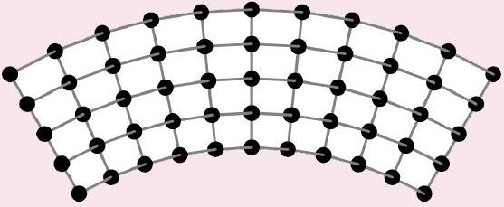

## Waves I: The Wave Equation

The basics of waves are covered in chapter 18 of Halliday and Resnick, and the rest of the material needed for Olympiad physics can be found in chapter 13 of Wang and Ricardo, volume 1. For more on Fourier series, see chapter 6 of Vibrations and Waves by French, and for waves in general, see chapters 7 and 8. For a more advanced perspective, see chapter 16 of Taylor. For many physical examples, see chapters 4 and 6 of Crawford's Waves. For more about the physics of music, see these lecture notes. For more fun, see chapters I-47 through I-50 of the Feynman lectures. There is a total of 78 points.

## 1 Traveling Waves

Waves is a vast subject, ranging from the humble wave on a string to electromagnetic waves, gravitational waves, and quantum matter waves. The math used to analyze waves will appear in just about every physics class you'll ever take. But more importantly, the subject is rich in examples, because waves are the physics of the everyday world.

Example 1
Consider a string with mass $\mu$ per unit length, under tension $T$. The transverse displacement of the string is given by the wave function $y ( x , t )$, and for simplicity we assume the wave is shallow, i.e. $\partial y / \partial x \ll 1$. What's the equation of motion for $y$ ?

Solution
Consider a segment of length $\Delta x$. At each end of the segment, the tension provides horizontal and vertical forces

$$
T _ { x } = \frac { T } { \sqrt { 1 + y ^ { \prime 2 } } } \approx T , \quad T _ { y } = \frac { T y ^ { \prime } } { \sqrt { 1 + y ^ { \prime 2 } } } \approx T y ^ { \prime }
$$

where we're expanding to first order in $y ^ { \prime }$. Therefore the total force is

$$
F _ { y } = \Delta T _ { y } = T y ^ { \prime \prime } \Delta x .
$$

The mass of this segment is $\mu \Delta x$, again to first order, so by Newton's Second Law,

$$
T \Delta x \frac { \partial ^ { 2 } y } { \partial x ^ { 2 } } = \mu \Delta x \frac { \partial ^ { 2 } y } { \partial t ^ { 2 } }
$$

Cleaning this up a bit, we have the wave equation

$$
\frac { \partial ^ { 2 } y } { \partial t ^ { 2 } } = v ^ { 2 } \frac { \partial ^ { 2 } y } { \partial x ^ { 2 } } , \quad v ^ { 2 } = \frac { T } { \mu } .
$$

Physically, this simply says the string tries to straighten out curvature (represented by $\partial ^ { 2 } y / \partial x ^ { 2 }$ ). The wave equation is the simplest possible equation of motion for waves. Even in more complicated situations, we often start with this equation and treat the extra terms as perturbations. The wave equation thus occupies a position like that of the simple harmonic oscillator.

Idea 1
We may factor the wave equation as a difference of squares,

$$
\left( \partial _ { t } ^ { 2 } - v ^ { 2 } \partial _ { x } ^ { 2 } \right) y = \left( \partial _ { t } - v \partial _ { x } \right) \left( \partial _ { t } + v \partial _ { x } \right) y = 0 .
$$

Therefore, functions that satisfy $\left( \partial _ { t } \pm v \partial _ { x } \right) y = 0$ solve the wave equation. It is simple to verify that these are functions of the form

$$
y ( x , t ) = f ( x \pm v t ) .
$$

Since the wave equation is linear, superpositions of solutions to the wave equation are also solutions to the wave equation. The general solution is of the form $f ( x - v t ) + g ( x + v t )$ for arbitrary functions $f$ and $g$.

[1] Problem 1. Waves of the form $y ( x , t ) = f ( x \pm v t )$ simply translate with uniform velocity $v$. Does a wave of the form $y ( x , t ) = f ( x + v t )$ move to the left or the right?
Solution. This wave moves towards the left. To see this, note that at time $t = 0$ the wave profile is $f ( x )$, while a small time later it looks like $f ( x + v \Delta t )$. This is the graph of $f ( x )$ shifted to the left.
[2] Problem 2. Consider a string with the following shape.

    (a) If this is a traveling wave moving to the right with velocity $v$, carefully draw the velocity and acceleration of every point on the string.
    (b) Now suppose the string is held in place, with zero velocity. If it is suddenly released, sketch the subsequent behavior of the string.

Solution. (a) You can figure out the velocity in two different ways. First, since the wave is proportional to $f ( x - v t )$, the vertical velocity is

$$
\frac { \partial y } { \partial t } = - v f ^ { \prime } = - v \frac { \partial y } { \partial x }
$$

so it is proportional to the slope of the string. Alternatively, you can think about how the string has to move so that a moment later, its shape is the same but translated to the right. The result is shown below:

To derive the acceleration, you can think about how the velocity profile has to change as the string moves, or you can think about how it comes about from the tension in the string. In general, the net force depends on the concavity $\partial ^ { 2 } y / \partial x ^ { 2 }$ of the string. In this case, it's only nonzero at the three kinks.

(b) To keep the string in that position, we must hold it at three points. Since information can't travel faster than the speed of waves, only the bits of string near those three points can move right after release, because they're the only ones that know about the release. The direction of motion can be found with the wave equation (the middle goes down, the ends go up).
Now, for the general solution, note that a solution to the wave equation with zero initial velocity may be written in the form $f ( x + v t ) + f ( x - v t )$. Here, the function $f$ has the same shape as the wave, but half the height. Evidently, two traveling waves split off in opposite directions.
[2] Problem 3. A uniform rope of mass $m$ and length $L$ hangs from a ceiling.
    (a) Show that the time it takes for a transverse wave pulse to travel from the bottom of the rope to the top is approximately $2 \sqrt { L / g }$. Under what circumstances is this approximation good?
    (b) Does the pulse get longer or shorter as it travels?

Solution. (a) The velocity is

$$
v = \sqrt { T / \mu } = \sqrt { T L / m }
$$

and $T = x m g / L$ where $x$ is the distance from the bottom, so

$$
v = \sqrt { x g } .
$$

At the most naive level, a wave pulse just travels along the string with a varying velocity, and takes a total time

$$
t = \int _ { 0 } ^ { L } \frac { d t } { d x } d x = \int _ { 0 } ^ { L } \frac { d x } { v } = \frac { 1 } { \sqrt { g } } \int _ { 0 } ^ { L } \frac { d x } { \sqrt { x } } = 2 \sqrt { \frac { L } { g } } .
$$

This approximation makes sense as long as the wave pulse can't "see" that the velocity is actually changing, which means it works if the pulse has a length much smaller than the length of the rope itself. This idea is discussed further for the case of quantum matter waves in X1.

(b) Because the tension is higher at higher points on the rope, the top part of the pulse is always traveling a bit faster than the bottom. Thus, the pulse gets longer as it travels up.
[3] Problem 4. [A] At time $t = 0$, the position and transverse velocity of a string obeying the wave equation are given by $y ( x )$ and $v _ { y } ( x )$. Find an explicit expression for $y ( x , t )$ in terms of these functions; this is called d'Alembert's solution. (Hint: construct solutions with initial position $y ( x )$ and zero initial velocity, and vice versa, and add them together. Your final answer should contain an integral involving $v _ { y }$.)
Solution. We write $y ( x , t ) = g ( x , t ) + h ( x , t )$, where $g$ has the correct initial position $y ( x )$ but no initial velocity, and $h$ has the correct initial velocity $v _ { y } ( x )$ but zero initial position. The lesson of problem 2 was precisely that
$$
g ( x , t ) = \frac { y ( x - v t ) + y ( x + v t ) } { 2 } .
$$
Now let's construct $h ( x , t )$. We know it must vanish at $t = 0$, and that when it's differentiated with respect to time at $t = 0$, we get $v _ { y } ( x )$. So an initial guess might be
$$
h ( x , t ) = \int _ { 0 } ^ { t } v _ { y } \left( x - v t ^ { \prime } \right) d t ^ { \prime }
$$

That's because, by the fundamental theorem of calculus, the only contribution to $\partial h / \partial t$ is from the change of the upper bound of the integral, so

$$
\left. \frac { \partial h } { \partial t } \right| _ { t = 0 } = \left. v _ { y } ( x - v t ) \right| _ { t = 0 } = v _ { y } ( x ) .
$$

However, this solution doesn't work, because it doesn't quite satisfy the wave equation. In particular, at $t = 0$ we have $h = 0$, which implies $\partial ^ { 2 } h / \partial x ^ { 2 } = 0$, which implies $\partial ^ { 2 } h / \partial t ^ { 2 } = 0$ by the wave equation. In other words, the solution for $h$ should have no initial acceleration because the string begins flat. But taking the second time derivative of the solution above gives something that's certainly nonzero.

To fix this, we use exactly the same trick that was used to derive $g$. We superpose a solution with dependence on $x + v t$ rather than $x - v t$,

$$
h ( x , t ) = \frac { 1 } { 2 } \int _ { 0 } ^ { t } \left( v _ { y } \left( x - v t ^ { \prime } \right) + v _ { y } \left( x + v t ^ { \prime } \right) \right) d t ^ { \prime }
$$

This still has the right initial conditions, and it does solve the wave equation.
We therefore conclude that the general solution is

$$
y ( x , t ) = \frac { 1 } { 2 } \left( y ( x - v t ) + y ( x + v t ) + \int _ { 0 } ^ { t } \left( v _ { y } \left( x - v t ^ { \prime } \right) + v _ { y } \left( x + v t ^ { \prime } \right) \right) d t ^ { \prime } \right) .
$$

Using this solution you can show, for example, that if you poke the string and thereby change either $y$ or $v _ { y }$ at one point in space, the influence of that change spreads out at speed $v$. In other words, the physics is "local": there is no way to send a signal to a distant place instantaneously. This solution gives the basic prototype for many arguments involving locality in more advanced physics.

[4] Problem 5. Flexible strings, ropes, and chains can display some counterintuitive behavior. Suppose a string carries a small traveling wave on it, moving with speed $v = \sqrt { T / \mu }$ to the right. Then in the frame that's also moving with speed $v$ to the right, the string maintains a constant shape, while moving along this shape with speed $v$, like a snake.
    (a) In fact, this phenomenon is extremely general. Show that if we have a flexible string loop floating in zero gravity with any shape, then it is possible for that string to move along its length while maintaining a constant shape, if its speed satisfies $v = \sqrt { T / \mu }$.

In the popular "string shooter" toy, a loop of string is shot through spinning wheels with high speed $v$. As a result, the string seems to levitate in the air while maintaining a constant shape. This is partially explained by part (a), but the real explanation also involves the weight and drag forces. Assume the string experiences a drag force $f$ per unit length, directed against its motion.

A fit of the string's profile to data is shown above, where the wheels are at the origin. The string moves in the clockwise direction.

(b) Qualitatively, how does the tension in the string vary around the loop? In particular, find the point $P$ on the figure where the string has tension $T = \mu v ^ { 2 }$. Also, find whether the string has higher tension just before or just after it goes through the wheels.
(c) By taking measurements from the figure, estimate the drag to weight ratio $f / ( \mu g )$. (You may have to roughly eyeball some numbers. 20\% accuracy is good enough.)
(d) One interesting feature, which you can see in the video linked above, is that if you tap the string right below the wheels, a pulse will smoothly move to the right along the bottom of the string with a slow speed $u$. Explain why, and find an estimate for $u$. Assume the string has speed $v = 15 \mathrm {~m} / \mathrm { s }$. You'll have to eyeball some numbers again, so expect only 20\% accuracy.

Solution. (a) There are no external forces acting along the string, so the string carries a uniform tension, due to its own motion. Now consider a small piece of the string of length $d x$, and suppose the radius of curvature there is $r$. Then the tension on each side of the piece gives an inward force $T d \theta = T d x / r$, while the required centripetal force is $( \mu d x ) v ^ { 2 } / r$. These are equal if $v = \sqrt { T / \mu }$ for any value of $r$. That is, the internal tension force always provides the right centripetal force no matter what the string's local shape is.
(This has been tested in the International Space Station, though it turns out to be pretty hard to set up the desired motion. Also, when you do get it going, internal friction dissipates kinetic energy while keeping the angular momentum the same, which slowly causes the shape to relax to a circle, which has the minimum energy for a given angular momentum.)

By the way, this provides the explanation of an alternative solution to the pearl necklace problem in M3. In that problem, it turns out that a necklace will jump off a table once it accelerates to $v = \sqrt { T / \mu }$ at the corner. That's precisely because at that point, its own tension provides all the centripetal force, so the normal force vanishes. For another example of this trick, see problem 105 of 200 Puzzling Physics Problems.

(b) Consider the force and acceleration of a small piece $d \mathbf { s }$ of the string, where $d \mathbf { s }$ points along the string's direction of motion. The forces are $\mu g d s$ acting downward, a drag force $- f d \mathbf { s }$, and

tension forces on each side. Because the string is moving with constant speed, its acceleration is perpendicular to $d \mathbf { s }$.
Therefore, there is no net force parallel to $d \mathbf { s }$, and balancing forces in that direction implies that the difference in tension forces has to be

$$
d T = f d s + \mu g d y
$$

where $d y$ is the $y$-component of $d s$. In other words, the tension increases as one goes along the string, and as one goes to higher elevations. For the parts of the string just before and after the wheels, the heights are about the same, so the tension is higher just before going through the wheels. This makes sense, as the wheels are pulling the string in.
Next, consider the forces perpendicular to $d \mathbf { s }$. This contains contributions from the gravitational force and the tension forces, and needs to sum up to the centripetal force. We know from part (a) that at the point where $T = \mu v ^ { 2 }$, the tension alone accounts for the centripetal force. Then at this point, gravity can't contribute in this direction, so $d \mathbf { s }$ must be vertical. So point $P$ is at the rightmost point on the loop.
At other points, $T$ is a bit different from $\mu v ^ { 2 }$, so the difference is made up by gravity. Working through this will give a complicated differential equation for the shape of the string, which was numerically solved to make the curve in the diagram above.

(c) There's a net downward gravitational force $\mu L g$ on the string. The net drag force is
$$
\mathbf { F } _ { d } = \int f d \mathbf { s } = 0
$$
since the string is a closed loop. So the wheels must apply a purely vertical force $\mu L g$.
Now, we can finish the problem by considering either forces or torques. Let's consider torques first, taking the wheels as the origin. The torque from gravity is $\mu L g x _ { \mathrm { CM } }$, and it has to be balanced by the torque from the drag force, which is
$$
\tau _ { d } = \left| \int f \mathbf { r } \times d \mathbf { s } \right| = 2 f A
$$
where $A$ is the area of the loop. (That is, the drag force is what lets the string stay up, even though it doesn't provide any net upward force!) We therefore conclude that
$$
\frac { f } { \mu g } = \frac { x _ { \mathrm { CM } } L } { 2 A } .
$$
Roughly eyeballing the values gives
$$
x _ { \mathrm { CM } } \approx 0.8 \mathrm {~m} , \quad A \approx 0.6 \mathrm {~m} ^ { 2 } , \quad \frac { f } { \mu g } \approx 2.1 .
$$
Alternatively, we can consider forces. (I thank Joshua Wang for pointing out this alternative solution.) Let the tension right after the wheels be $T$, so that the tension right before the wheels is $T + f L$. In addition, let the string exit the wheels at an angle $\theta _ { 1 }$ above the horizontal, and enter the wheels at an angle $\theta _ { 2 }$ below the horizontal. Now consider a piece of string as it passes through the wheels. The horizontal component of Newton's second law is
$$
\mu v ^ { 2 } \left( \cos \theta _ { 1 } + \cos \theta _ { 2 } \right) = T \cos \theta _ { 1 } + ( T + f L ) \cos \theta _ { 2 }
$$

and the vertical component is

$$
\mu v ^ { 2 } \left( \sin \theta _ { 1 } - \sin \theta _ { 2 } \right) = T \sin \theta _ { 1 } - ( T + f L ) \sin \theta _ { 2 } + \mu L g
$$

where the last term is the vertical force from the wheels. These equations are equivalent to

$$
\left( \mu v ^ { 2 } - T \right) \left( \cos \theta _ { 1 } + \cos \theta _ { 2 } \right) = f L \cos \theta _ { 2 }
$$

and

$$
\left( \mu v ^ { 2 } - T \right) \left( \sin \theta _ { 1 } - \sin \theta _ { 2 } \right) = \mu L g - f L \sin \theta _ { 2 } .
$$

Dividing these equations removes the unwanted dependence on $v$ and $T$, and simplifying gives

$$
\frac { f } { \mu g } = \frac { \cos \theta _ { 1 } + \cos \theta _ { 2 } } { \sin \left( \theta _ { 1 } + \theta _ { 2 } \right) } .
$$

Thus, we only have to measure these two angles, which can be done relatively accurately, accounting for the fact that the axis scales are not equal. I find that

$$
\theta _ { 1 } \approx 48 ^ { \circ } , \quad \theta _ { 2 } \approx 10 ^ { \circ } , \quad \frac { f } { \mu g } \approx 1.95 .
$$

For comparison, the figure above is from this paper, with parameters $f / ( \mu g ) = 1.82$.

(d) At the bottom part of the string, we have $T > \mu v ^ { 2 }$. Here, waves on the string move a bit faster than the string itself, so that they can travel slowly against the string's flow. (A similar conclusion applies to waves made at the top: here the waves are a bit slower than the string, so waves propagating leftward will smoothly move to the right. However, you have to take more care at the top because the string will be moving into your finger, so you can easily get it tangled up. Untangling the string is the most annoying part of using this toy.) Both sets of waves end up converging at the point identified in part (c).
Let the tension right below the wheels be $T = \mu v ^ { 2 } + \Delta T$. By tracking the change in tension induced by gravity and drag from the point identified in part (c), we have
$$
\Delta T = f \ell _ { 0 } - \mu g y _ { 0 }
$$
where $\ell _ { 0 }$ is the length of string from the bottom of the wheels to the point in part (c), and $y _ { 0 }$ is that point's $y$-coordinate. Eyeballing some more numbers, the fractional shift is
$$
\frac { \Delta T } { \mu v ^ { 2 } } = \frac { g } { v ^ { 2 } } ( ( 2.0 ) ( 1.5 \mathrm {~m} ) - ( 0.5 \mathrm {~m} ) ) = 0.11
$$
where I took $f / ( \mu g ) = 2.0$ as a rough compromise between the two answers to part (c). So the change in velocity is roughly
$$
u \approx \frac { 1 } { 2 } \frac { \Delta T } { \mu v ^ { 2 } } v \approx 0.8 \mathrm {~m} / \mathrm { s } .
$$
For typical speeds, drag is the dominant factor and $f \propto v ^ { 2 }$, so the ratio $u / v$ remains roughly constant as you increase the speed of the string.
For a more advanced and thorough treatment of this system, published in a top journal, see this paper. More generally, there are a lot of tricky questions about flexible strings and chains. People still write papers disagreeing about the explanation of the chain fountain.

Idea 2
A sinusoidal wave has the form

$$
y ( x , t ) = A \cos ( k x - \omega t + \phi ) , \quad v = \frac { \omega } { k }
$$

where $k$ is the wavenumber and $\omega$ is the angular frequency. They are related to the wavelength and period by

$$
k = \frac { 2 \pi } { \lambda } , \quad \omega = \frac { 2 \pi } { T } .
$$

Sinusoidal waves will be especially useful because the wave equation is linear. Fourier analysis tells us that any initial condition can be written in terms of a sum of sinusoids, so if we know what happens to the sinusoids, we know what happens in general by superposition. This is just a generalization of ideas we've seen in M4 and E6. Just as we saw there, it can also be useful to promote $y$ to a complex number, where the physical value of $y$ is the real part; for a sinusoidal wave we would have $y ( x , t ) = y _ { 0 } e ^ { i ( k x - \omega t ) }$.

Remark
Physicists almost universally use $k$ and $\omega$ rather than $\lambda , f$, and $T$. A nice way of thinking of these variables is that they represent how quickly the phase $\phi$ changes, in space or time,

$$
k = \frac { d \phi } { d x } , \quad \omega = - \frac { d \phi } { d t } .
$$

If we use a little special relativity, we can even combine these into a single equation,

$$
k ^ { \mu } = \partial ^ { \mu } \phi .
$$

The fundamental relation between particle and wave properties in quantum mechanics is

$$
p ^ { \mu } = \hbar k ^ { \mu } .
$$

These are the de Broglie relations, which we'll cover in X1.

[4] Problem 6. For a wave on a string, there are two contributions to the energy: potential energy from stretching, and kinetic energy from transverse motion.
    (a) Find the kinetic and potential energy density (i.e. energy per unit length) of the string in terms of $T , \mu , y$, and its derivatives.
    (b) Evaluate the above quantities for $y = A \cos ( k x - \omega t )$. Is the total energy density uniform?
    (c) Show that for a general traveling wave of the form $y = f ( x - v t )$, the total kinetic and potential energy are equal.
    (d) Show that for any wave function $y$, total energy is conserved. This will require some integration by parts, as well as the wave equation itself; you should assume $y$ goes to zero at infinity.
    (e) Compute the energy of the static configuration in problem 2(b), assuming the triangle has height $h$ and base $L$, where $h \ll L$.

One warning: as we saw in E6, energy is quadratic, so it does not obey the superposition principle. Locally, the amount of energy can be more or less than the sum of the energies of the superposed waves, due to interference.

Solution. (a) We will assume the displacement of the string is small, and take the lowest order terms. Using $\frac { 1 } { 2 } m v ^ { 2 }$ for kinetic energy of a piece moving in the transverse direction gets

$$
\begin{gathered}
\Delta K = \frac { 1 } { 2 } \Delta m \dot { y } ^ { 2 } = \frac { 1 } { 2 } \left( \mu \Delta x \sqrt { 1 + y ^ { \prime 2 } } \right) \dot { y } ^ { 2 } \\
\frac { d K } { d x } = \frac { 1 } { 2 } \mu \dot { y } ^ { 2 } \sqrt { 1 + y ^ { \prime 2 } } \approx \frac { 1 } { 2 } \mu \dot { y } ^ { 2 }
\end{gathered}
$$

For the potential energy, the work done on stretching the string is $\Delta U = T \Delta \ell$ where $\Delta \ell =$ $\sqrt { 1 + y ^ { \prime 2 } } \Delta x - \Delta x \approx \frac { 1 } { 2 } y ^ { \prime 2 } \Delta x$ since the displacement is small. Thus

$$
\frac { d U } { d x } = \frac { 1 } { 2 } T y ^ { \prime 2 } .
$$

(b) We have
$$
\frac { d K } { d x } = \frac { 1 } { 2 } \mu A ^ { 2 } \omega ^ { 2 } \sin ^ { 2 } ( k x - \omega t ) , \quad \frac { d U } { d x } = \frac { 1 } { 2 } T A ^ { 2 } k ^ { 2 } \sin ^ { 2 } ( k x - \omega t ) .
$$
Here, we can see that the total energy density is not uniform, but rather comes in "lumps". This is also true for electromagnetic waves.
(c) The densities are
$$
\frac { d K } { d x } = \frac { 1 } { 2 } \mu v ^ { 2 } f ^ { \prime 2 } , \quad \frac { d U } { d x } = \frac { 1 } { 2 } T f ^ { \prime 2 }
$$
and for a wave traveling in one direction, these densities are exactly equal because $v ^ { 2 } = T / \mu$, so the total kinetic and potential energy are equal.
(d) The total energy is
$$
E = \int _ { - \infty } ^ { \infty } \left( \frac { 1 } { 2 } \mu \dot { y } ^ { 2 } + \frac { 1 } { 2 } T y ^ { \prime 2 } \right) d x
$$
Taking the time derivative and applying the wave equation,
$$
\frac { d E } { d t } = \int _ { - \infty } ^ { \infty } \mu \ddot { y } \ddot { y } + T \dot { y } ^ { \prime } y ^ { \prime } d x \propto \int _ { - \infty } ^ { \infty } \dot { y } y ^ { \prime \prime } + \dot { y } ^ { \prime } y ^ { \prime } d x
$$
where we used the wave equation in the second equality. Integrating the first term by parts,
$$
\int _ { - \infty } ^ { \infty } \dot { y } y ^ { \prime \prime } d x = \left. \dot { y } y ^ { \prime } \right| _ { - \infty } ^ { \infty } - \int _ { - \infty } ^ { \infty } \dot { y } ^ { \prime } y ^ { \prime } d x
$$
and the boundary term vanishes by our assumptions. The remaining term is just the opposite of the other term in $d E / d t$, so $d E / d t = 0$ as desired.
(e) Since the string was initially held steady, there is only potential energy. The amount of potential energy is just $T$ times the total length the string is stretched, so
$$
U = T \left( \sqrt { 4 h ^ { 2 } + L ^ { 2 } } - L \right) \approx \frac { 2 T h ^ { 2 } } { L }
$$
where we used $h \ll L$ in the last step.

[2] Problem 7 (French 7.23). One end of a stretched string is moved transversely at constant velocity $u$ for a time $\tau$, and is moved back to its starting point with velocity $- u$ during the next interval $\tau$. As a result, a triangular pulse is set up on the string and moves along it with speed $v$. Show that the total energy of the pulse is equal to the work done on the string, working to lowest order in $u / v$.
Solution. First let's compute the energy in the pulse. Recall that the energy density is
$$
\frac { d E } { d x } = \frac { \mu } { 2 } \left( \frac { \partial y } { \partial t } \right) ^ { 2 } + \frac { T } { 2 } \left( \frac { \partial y } { \partial x } \right) ^ { 2 } = \frac { T } { 2 } \left( \frac { 1 } { v ^ { 2 } } \left( \frac { \partial y } { \partial t } \right) ^ { 2 } + \left( \frac { \partial y } { \partial x } \right) ^ { 2 } \right) .
$$
The triangular pulse has height $u \tau$, and the two halves of it have length $v \tau$. Thus, $| \partial y / \partial t | = u$ and $| \partial y / \partial x | = u / v$ across the pulse, so the total energy is
$$
U = ( 2 v \tau ) \frac { d E } { d x } = \frac { 2 T \tau u ^ { 2 } } { v } .
$$
When lifting the string to create the pulse, the string was at an angle of $u / v$ to first order in $u / v$, so the transverse force that needed to be applied was $T u / v$. The distance over which this force was applied was $u \tau$, for a total work of $T \tau u ^ { 2 } / v$. The same work was done when bringing it down with constant velocity, so the total work done was $2 T \tau u ^ { 2 } / v$, as expected.

Remark
How can we account for damping in the wave equation? The simplest thing would be to add a force proportional to $v _ { y }$, which e.g. could be due to air drag. Then

$$
\partial _ { t } ^ { 2 } y = v ^ { 2 } \partial _ { x } ^ { 2 } y - A \partial _ { t } y .
$$

But what if the string is in a vacuum? Then the simplest kind of damping would be due to the energy lost in bending and unbending of the string, which takes the form

$$
\partial _ { t } ^ { 2 } y = v ^ { 2 } \partial _ { x } ^ { 2 } y + A \partial _ { t } \partial _ { x } ^ { 2 } y
$$

because $\partial _ { x } ^ { 2 } y$ describes the bending. This is called Kelvin-Voigt damping.
In both cases, it's straightforward to handle the damping since the wave equation remains linear; we just plug in a solution of the form $e ^ { i ( k x - \omega t ) }$ and find the new relation between $\omega$ and $k$. If we pick $k$ to be a real number, we will generally find $\omega$ to be complex, with its imaginary part corresponding to exponential decay of the wave over time.

[3] Problem 8. [A] With a little vector calculus, the results above can be generalized to an arbitrary number of dimensions. For example, ideal waves in three dimensions obey
$$
\frac { \partial ^ { 2 } \psi } { \partial t ^ { 2 } } = v ^ { 2 } \left( \frac { \partial ^ { 2 } \psi } { \partial x ^ { 2 } } + \frac { \partial ^ { 2 } \psi } { \partial y ^ { 2 } } + \frac { \partial ^ { 2 } \psi } { \partial z ^ { 2 } } \right) = v ^ { 2 } \nabla ^ { 2 } \psi
$$
where the function $\psi ( \mathbf { r } , t )$ could stand for a variety of things, such as the pressure, density, or temperature (for a sound wave) or the electric or magnetic field (for an electromagnetic wave).
    (a) For simplicity, let's restrict to waves which have spherical symmetry, so that $\psi$ only depends on $r$ and $t$. Plug such a spherical wave into the wave equation, and simplify until you get an equation only in terms of the partial derivatives of $\psi ( r , t )$.

(b) Because the area of a sphere goes as $r ^ { 2 }$, we expect the energy density of a spherical wave to fall as $1 / r ^ { 2 }$, and therefore expect the amplitude to fall as $1 / r$. Therefore, it is useful to consider the quantity $r \psi$, which has this falloff factored out. By considering the differential equation that $r \psi$ obeys, find the general solution for $\psi ( r , t )$.

Solution. (a) To do this, we need to simplify the partial derivatives with respect to $x , y$, and $z$. We have

$$
\frac { \partial \psi } { \partial x } = \frac { \partial \psi } { \partial r } \frac { \partial r } { \partial x }
$$

where these partial derivatives are all keeping the other spatial variables $y$ and $z$ constant. To evaluate $\partial r / \partial x$, we note that

$$
r ^ { 2 } = x ^ { 2 } + y ^ { 2 } + z ^ { 2 }
$$

and take $\partial / \partial x$ of both sides, giving

$$
2 r \frac { \partial r } { \partial x } = 2 x
$$

from which we conclude

$$
\frac { \partial r } { \partial x } = \frac { x } { r } .
$$

Plugging this back in, we conclude

$$
\frac { \partial \psi } { \partial x } = \frac { x } { r } \frac { \partial \psi } { \partial r } .
$$

Of course, we actually want the second spatial derivative, which is

$$
\frac { \partial ^ { 2 } \psi } { \partial x ^ { 2 } } = \frac { 1 } { r } \frac { \partial \psi } { \partial r } - \frac { x ^ { 2 } } { r ^ { 3 } } \frac { \partial \psi } { \partial r } + \frac { x } { r } \frac { \partial } { \partial x } \frac { \partial \psi } { \partial r } = \frac { 1 - x ^ { 2 } / r ^ { 2 } } { r } \frac { \partial \psi } { \partial r } + \frac { x ^ { 2 } } { r ^ { 2 } } \frac { \partial ^ { 2 } \psi } { \partial r ^ { 2 } }
$$

where we used the product rule. By similar logic for the other components, we conclude

$$
\frac { \partial ^ { 2 } \psi } { \partial t ^ { 2 } } = v ^ { 2 } \left( \frac { 3 - \left( x ^ { 2 } + y ^ { 2 } + z ^ { 2 } \right) / r ^ { 2 } } { r } \frac { \partial \psi } { \partial r } + \frac { x ^ { 2 } + y ^ { 2 } + z ^ { 2 } } { r ^ { 2 } } \frac { \partial ^ { 2 } \psi } { \partial r ^ { 2 } } \right) = v ^ { 2 } \left( \frac { 2 } { r } \frac { \partial \psi } { \partial r } + \frac { \partial ^ { 2 } \psi } { \partial r ^ { 2 } } \right) .
$$

Of course, a shortcut to this result would be to just look up the formula for the Laplacian in spherical coordinates, but it's good to go through this once in your life.

(b) We notice that
$$
\frac { \partial ^ { 2 } } { \partial t ^ { 2 } } ( r \psi ) = v ^ { 2 } \frac { \partial ^ { 2 } } { \partial r ^ { 2 } } ( r \psi )
$$
by the product rule. That is, the quantity $r \psi$ obeys the ordinary, one-dimensional wave equation, for which we already know the general solution! We thus conclude
$$
\psi ( r , t ) = \frac { f ( r - v t ) + g ( r + v t ) } { r } .
$$
If we also want the wave not to blow up at $r = 0$, we additionally need $f ( - v t ) + g ( v t ) = 0$. By the way, an analogous trick does not work for a cylindrical wave (which is equivalent to a wave spreading out in two dimensions). The quantity $\sqrt { r } \psi$ does not maintain its profile, but rather develops a tail behind it. More generally, the trick above only works in an odd number of dimensions.

## 2 Standing Waves

Idea 3
A standing wave is a solution to the wave equation of the form

$$
y ( x , t ) = f ( x ) \cos ( \omega t ) .
$$

Typically, only discrete values of $\omega$ are possible, with the allowed values depending on the boundary conditions. If the setup is translationally symmetric, then $f ( x )$ will be sinusoidal. If you want to get some intuition, try playing with this PhET simulation.

[2] Problem 9. Consider a string of length $L$ and wave speed $v$.
    (a) Suppose the ends of the string are fixed, i.e. $y ( x , t ) = 0$ at $x = 0$ and $x = L$. Find the standing wave angular frequencies and sketch the configurations.
    (b) Do the same if the ends of the string are free, i.e. $\partial y / \partial x = 0$ at $x = 0$ and $x = L$.
    (c) Do the same if one end is fixed and one end is free.

Solution. (a) The standing wave equations are $y ( x , t ) = A \sin ( k x ) \cos ( \omega t )$ and $y ( 0 , t ) = y ( L , t ) =$ 0 . Thus $k L = \pi n$, giving the angular frequencies

$$
\omega _ { n } = \frac { \pi v n } { L }
$$

for $n \geq 1$. The waves will look like this:

(b) We can replace the sine with a cosine in the above solution (so integrating or differentiating the above solution with respect to $x$ gets the solutions to this problem). Thus the angular frequencies are the same, $\omega _ { n } = \pi v n / L$, and the waves look like this:

Technically, while the boundary conditions in part (a) required $n \geq 1$, here we can actually take $n \geq 0$. The $n = 0$ solution just corresponds to the whole string being moved up or down and staying there, with zero frequency. But this trivial solution is not typically called a "standing wave", so it's conventional to say the lowest frequency is at $n = 1$.
(c) Let $x = 0$ be fixed and $x = L$ be free. Then for $y ( x , t ) = A \sin ( k x ) \cos ( \omega t )$, we have $k L = \pi ( n + 1 / 2 )$, so
$$
\omega _ { n } = \frac { \pi v } { L } ( n + 1 / 2 )
$$
for $n \geq 0$. The first five standing wave solutions, including the fundamental $n = 0$ mode, are shown below.

[2] Problem 10. USAPhO 1997, problem A1.
Idea 4
When a musical instrument plays a note, typically multiple standing waves are excited, so the resulting sound is composed of multiple frequencies. As you saw in problem 9, often the standing wave frequencies are all multiples of a single, lowest frequency. This frequency $f _ { 0 }$ is called the fundamental, or first harmonic, while the multiple $n f _ { 0 }$ is called the $n ^ { \text {th } }$ harmonic. The fundamental frequency determines the pitch we perceive, while the distribution of energy among the harmonics determines the timbre, or tonal quality, of the instrument.
[5] Problem 11. Some instruments, such as xylophones and marimbas, are made with rigid rods instead of strings. The equation that describes transverse vibrations is instead

$$
\frac { \partial ^ { 2 } y } { \partial t ^ { 2 } } = - A \frac { \partial ^ { 4 } y } { \partial x ^ { 4 } }
$$

for a constant $A$ that depends on the material and cross-sectional area.

(a) For a xylophone bar of length $L$, find the standing wave solutions and their angular frequencies. For simplicity, pretend that the solutions are sinusoidal in space, and that the bar has free ends just like a string, even though this is not true in reality.
(b) When the bar in part (a) is hit, a certain note is sounded. What is the length of the bar that makes a note one octave higher?

(c) $[ \mathbf { A } ] \star$ The actual boundary conditions for a free bar are
$$
\frac { \partial ^ { 2 } y } { \partial x ^ { 2 } } = \frac { \partial ^ { 3 } y } { \partial x ^ { 3 } } = 0
$$
at the endpoints, and the solutions aren't purely sinusoidal in space. Numerically compute the lowest few standing wave angular frequencies and compare them to those you found in part (a).
(d) A guitar or piano string satisfies the wave equation with a small additional fourth-order term,
$$
\frac { \partial ^ { 2 } y } { \partial t ^ { 2 } } = v ^ { 2 } \frac { \partial ^ { 2 } y } { \partial x ^ { 2 } } - A \frac { \partial ^ { 4 } y } { \partial x ^ { 4 } } .
$$
Show that the standing wave frequencies are not linearly spaced, as they would be for an ideal string, but instead are slightly more spaced out. This effect is called inharmonicity. (Hint: the spatial profiles of the standing waves are still sinusoidal.)
We perceived two notes to be "in tune" when the component frequencies in the notes line up with each other. But since the frequencies are more spread out than ideal harmonics, a piano feels more in tune when the fundamental frequencies are spread out a little bit more. This "stretch tuning" is significant and adds up to about an entire semitone across the piano!

Solution. (a) If we assume that the solutions are $y ( x , t ) = \sin ( k x ) \cos ( \omega t )$ where $k L = \pi n$, using the differential equation will get

$$
- \omega ^ { 2 } = - A k ^ { 4 } , \quad \omega = \sqrt { A } \frac { \pi ^ { 2 } n ^ { 2 } } { L ^ { 2 } } .
$$

(b) The fundamental frequency is proportional to $1 / L ^ { 2 }$, and going up by an octave doubles this, so we need a length of $L / \sqrt { 2 }$.
(c) The spatial solutions look like exponentials $e ^ { \pm k x }$ and $e ^ { \pm i k x }$. It's easiest to use even and odd combinations. Letting $y ( x , t ) = u ( x ) \cos ( \omega t )$, we have
$$
u ( x ) = A _ { 1 } \cosh ( k x ) + A _ { 2 } \sinh ( k x ) + A _ { 3 } \cos ( k x ) + A _ { 4 } \sin ( k x ) .
$$
For convenience, let's place the left end of the bar at $x = 0$. Then the boundary conditions at this point imply $A _ { 3 } = A _ { 1 }$ and $A _ { 4 } = A _ { 2 }$, so
$$
u ( x ) = A _ { 1 } ( \cosh ( k x ) + \cos ( k x ) ) + A _ { 2 } ( \sinh ( k x ) + \sin ( k x ) ) .
$$
There are two more boundary conditions for the right side, and they both determine the ratio $A _ { 2 } / A _ { 1 }$, so for a solution to exist, the boundary conditions must be redundant with each other. In other words, we should have
$$
\frac { \left( d ^ { 2 } / d x ^ { 2 } \right) ( \cosh ( k x ) + \cos ( k x ) ) } { \left( d ^ { 2 } / d x ^ { 2 } \right) ( \sinh ( k x ) + \sin ( k x ) ) } = \frac { \left( d ^ { 3 } / d x ^ { 3 } \right) ( \cosh ( k x ) + \cos ( k x ) ) } { \left( d ^ { 3 } / d x ^ { 3 } \right) ( \sinh ( k x ) + \sin ( k x ) ) } .
$$
Carrying out the derivatives, this condition is equivalent to $( \cosh ( k x ) - \cos ( k x ) ) ^ { 2 } = \sinh ^ { 2 } ( k x ) -$ $\sin ^ { 2 } ( k x )$, which further simplifies to
$$
\cosh ( k L ) \cos ( k L ) = 1 .
$$

At this point, we can numerically solve to find

$$
k L = 4.73,7.85,11.00,14.14,17.28 , \ldots
$$

which is quite different from the naive solutions $k L = \pi n$. From here we can straightforwardly calculate $\omega = \sqrt { A } k ^ { 2 }$.

(d) Plugging $y ( x , t ) = \sin ( k x ) \cos ( \omega t )$ into the differential equation and setting $k L = \pi n$ gives
$$
- \omega ^ { 2 } = - v ^ { 2 } k ^ { 2 } - A k ^ { 4 }
$$
which gives solutions
$$
\omega _ { n } = k _ { n } \sqrt { v ^ { 2 } + A k _ { n } ^ { 2 } } = \frac { \pi n } { L } \sqrt { v ^ { 2 } + \frac { A \pi ^ { 2 } n ^ { 2 } } { L ^ { 2 } } }
$$
where the extra spacing comes from the $A \pi ^ { 2 } n ^ { 2 } / L ^ { 2 }$ term. Using an app on your phone, you can check that this occurs for piano strings and guitar strings.

Remark: Beam Theory
Where does the strange fourth-order equation for transverse vibrations above come from? Since force is the derivative of energy, it's easier to think about how the energy stored in a rigid rod differs from that of a string. When a string with tension $T$, mass per length $\lambda$, and length $\ell$ is plucked, giving it a transverse displacement $y$, then

$$
\frac { \text { kinetic energy } } { \text { length } } \sim \lambda \dot { y } ^ { 2 } , \quad \frac { \text { potential energy } } { \text { length } } \sim \frac { T \Delta \ell } { \ell } \sim \frac { T y ^ { 2 } } { \ell ^ { 2 } }
$$

where our expression for $\Delta \ell$ comes from the Pythagorean theorem. As we know from M4, the ratio of the coefficients gives $\omega ^ { 2 }$, so $\omega \ell \sim \sqrt { T / \lambda }$. For a general wave with wavenumber $k$, we would replace $\ell$ with $1 / k$ above, giving $\omega \propto k$ as expected.

Now, a rod is characterized by a Young's modulus $Y$, mass density $\rho$, length $\ell$, width $w$, and vertical thickness $h$. If the transverse displacement is $y$, then

$$
\frac { \text { kinetic energy } } { \text { volume } } \sim \rho \dot { y } ^ { 2 } , \quad \frac { \text { potential energy } } { \text { volume } } \sim Y ( \text { strain } ) ^ { 2 } .
$$

The tricky part is understanding the strain. If you naively used the same logic as for the string, then all parts of the rod would be stretched, with typical strain $( y / \ell ) ^ { 2 }$. This is correct in the limit of large displacements, $y \gg h$, where the rod's thickness is negligible. But for small displacements, it's an overestimate.

As the rod is displaced vertically, it slightly shrinks horizontally. As a result, there is a "neutral line" in the middle of the rod that is neither stretched or compressed. Bonds above the line are stretched, and bonds below the line are compressed.

The neutral line has radius of curvature $R \sim \ell ^ { 2 } / y$. Thus, the strain at the top and bottom of the rod is of order $h / R \sim h y / \ell ^ { 2 }$. Plugging this in gives

$$
\omega \sim \sqrt { \frac { Y } { \rho } } \frac { h } { \ell ^ { 2 } } .
$$

Again, for a general wavenumber we would replace $\ell$ with $1 / k$, giving the $\omega \propto k ^ { 2 }$ scaling. For a derivation of this result by dimensional analysis, see section 9.2.3 of The Art of Insight.

There's another neat bit of physics we can get here. Consider a horizontal rod with one end fixed at a wall. What is the vertical deflection of the other end of the rod, due to its own weight? The gravitational and internal potential energy densities both have "reasonable", power-law dependence on the deflection $y$. Thus, when their derivatives match, so that forces balance, their absolute values should match within an order of magnitude,

$$
\frac { \text { elastic potential energy } } { \text { volume } } \sim \frac { \text { gravitational potential energy } } { \text { volume } } \sim \rho g y .
$$

Solving for the deflection gives

$$
y \sim \frac { \rho g \ell ^ { 4 } } { Y h ^ { 2 } }
$$

which is the fundamental result of Euler-Bernoulli beam theory. (For a proper derivation in terms of force and torque balance, see chapters 9 and 10 of Lautrup.)

Example 2
How are the sounds of a violin, a trumpet, and a person different in a room full of helium?

Solution
As we saw in T3, the speed of sound in air is $\sqrt { \gamma p / \rho }$. When the air is replaced with helium, $\rho$ decreases, increasing the speed of sound.

The standing wave frequencies of a violin are determined by properties of the strings, which aren't affected by the helium. The only difference will be that the way the violin's sound reverberates will be subtly changed.

For the trumpet, the standing wave frequencies are proportional to $v / L$ where $L$ is the length of the air column inside the trumpet. Thus, the standing wave frequencies go up, and the trumpet makes higher-pitched notes.

The human voice is more subtle. A wind instrument works by exciting standing waves inside it. But the source of the human voice is the vibrations of the vocal folds, whose fundamental vibration frequency is directly controlled by your muscles. The entire rest of your vocal tract does not affect what frequencies are present, but rather affects how energy is distributed between those frequencies. (For instance, vowels are characterized by having extra energy

near two particular frequencies, called formants.) Helium changes the resonant frequencies of the vocal tract and thus changes which frequencies emitted by the vocal folds are emphasized. It thus changes the timbre, but not the pitch.

[3] Problem 12. Some questions about musical instruments.

(a) A piano makes sound by quickly striking a string with a hammer. The seventh harmonic doesn't fit in with the rest that well. If you want to eliminate the seventh harmonic, at what point(s) can you put the hammer?
(b) A violinist can make the note from an open string sound an octave higher by lightly touching it at a point while bowing it somewhere else. Which point(s) should be touched?
(c) Suppose a string has its ends attached to walls. A person can set up a standing wave by holding the string at some point and moving it side to side, sinusoidally with fixed amplitude. At which point(s) should the string be driven to maximize the amplitude of a given standing wave? Assume the string experiences very little damping.

Solution. (a) In order to avoid exciting a given standing wave, we should strike the piano at a node of that wave, so that there is zero "overlap" between the wave and the strike. So we can place it 1/7,2/7,...,6/7 of the way down the string.

(b) The midpoint of the string should be touched. This removes all harmonics that don't have a node at the midpoint, i.e. all odd harmonics. The remaining frequencies are even multiples of the fundamental $f _ { 0 }$, and since these are all multiples of $2 f _ { 0 }$, we perceive $2 f _ { 0 }$ as the pitch.
(c) Suppose a standing wave has a spatial profile $f ( x )$ and frequency $f$, and to excite it we drive at frequency $f$ and amplitude $A$ at a point $x _ { 0 }$. Assuming the damping is small, then in the steady state the spatial profile will be $f ( x ) \left( A / f \left( x _ { 0 } \right) \right)$, which is largest if we drive near a node of the harmonic, not an antinode!
This may be somewhat unintuitive. The point is that driving at an antinode maximizes the rate at which you initially put energy into the harmonic; this is what we cared about in part (a). But driving at the node maximizes the eventual steady state amplitude, which is what matters here. A real-world example of this is playing jump rope: your hands driving the rope are near at the nodes, because they need to move much less than the middle of the rope does.
[5] Problem 13. EuPhO 2017, problem 1. (Hint: don't try to use fancy math here. EuPhO problems are designed to be solved with only elementary math and graph reading.)
Idea 5
Standing wave solutions also exist for waves in more than one spatial dimension. In the special case where the wave medium is uniform, and shaped like a rectangle (in two dimensions) or a rectangular prism (in three dimensions), all the standing wave solutions can be found by separation of variables. That is, they can all be written as
$$
\psi ( x , y , z , t ) = f ( x ) g ( y ) h ( z ) \cos ( \omega t )
$$
where $f , g$, and $h$ are sinusoids.

[3] Problem 14. The top of a drum is like a string, in that it has a uniform surface mass density $\sigma$ and surface tension $\gamma$.
    (a) Waves on the drum can be described by its height $z ( x , y , t )$. Find the wave equation for a drum. What is the speed of traveling waves?
    (b) Consider a square drum of side length $L$, where the boundaries are fixed to $z = 0$. Find the standing wave solutions and the corresponding $\omega$. What's the lowest standing wave angular frequency?
The frequencies will not be multiples of a fundamental frequency, so they are called overtones, rather than harmonics; that's why drums don't sound like they're playing notes. (Special examples, such as the timpani, are designed to mostly excite the harmonic frequencies.)
    (c) Why does a drum sound different if you hit it near the edge, versus at the center?

Solution. (a) A piece of mass $d m = \sigma d x d y$ will experience a net force from differing forces from the sides. Consider the force on the $d y$ side, where the force from surface tension is $\gamma d y$, and the vertical component for small displacements is $\gamma d y \frac { \partial z } { \partial x }$ (since we are going perpendicularly away from the $d y$ side). To find the change in this vertical force across $d x$, we will take the differential again to get $d F _ { x } = \gamma d y d x \frac { \partial ^ { 2 } z } { \partial x ^ { 2 } }$. Adding the force from the $y$ direction gets

$$
d F _ { x } + d F _ { y } = \sigma d x d y \frac { \partial ^ { 2 } z } { \partial t ^ { 2 } }
$$

which gives the wave equation

$$
\frac { \partial ^ { 2 } z } { \partial t ^ { 2 } } = \frac { \gamma } { \sigma } \left( \frac { \partial ^ { 2 } z } { \partial x ^ { 2 } } + \frac { \partial ^ { 2 } z } { \partial y ^ { 2 } } \right)
$$

and hence a wave speed of

$$
v = \sqrt { \frac { \gamma } { \sigma } } .
$$

(b) Let $z ( x , y , t ) = \sin \left( k _ { x } x \right) \sin \left( k _ { y } y \right) \cos ( \omega t )$. The boundary conditions give $k _ { x } = \pi n / L$ and $k _ { y } = \pi m / L$ by the same logic as in problem 9. Plugging this into the wave equation the simplifying gives
$$
\omega ^ { 2 } = \frac { \gamma } { \sigma } \left( k _ { x } ^ { 2 } + k _ { y } ^ { 2 } \right) , \quad \omega _ { n , m } = \sqrt { n ^ { 2 } + m ^ { 2 } } \frac { \pi v } { L } .
$$
Note that neither $n$ or $m$ can be zero, because then the standing wave solution just becomes zero. So the lowest frequency corresponds to $n = m = 1$, where $\omega = \sqrt { 2 } \pi v / L$.
(c) When a drum is hit at the center, it primarily excites the fundamental and some of the lower modes. When it's hit near the edge, it doesn't excite these modes, because it's close to a node for them. Higher modes are excited instead, leading to a "higher", "thinner" sound.
[4] Problem 15. When sand is sprinkled on a vibrating metal plate, it forms Chladni patterns. Suppose we (unrealistically) model the plate as a square elastic membrane, as in problem 14, of side length $L$ obeying the wave equation with wave speed $v$. Unlike in problem 14, we now assume the boundaries of the plate are free.

(a) Do Chladni patterns form at the nodes or antinodes of a standing wave?
(b) Find the general standing wave solutions $z ( x , y , t )$ and their angular frequencies.
(c) The plate is also fixed in the middle by the support, so $z = \partial z / \partial x = \partial z / \partial y = 0$ there, which removes many of the standing wave solutions. Find the lowest and second-lowest angular frequencies of allowed standing waves.
(d) Sketch the Chladni pattern for the lowest standing wave frequency.
(e) For the second-lowest standing wave frequency, there will be two independent standing waves with that frequency. What superpositions of them will yield Chladni patterns with 90° rotational symmetry? (If you want to see these patterns, you'll need a computer.)

Solution. (a) The sand can sit still at the nodes, while it gets bounced away from everywhere else. So the Chladni pattern shows the nodes. (The true story is a bit more complicated. Very fine dust is substantially affected by the air currents created by the vibrating plate. It turns out that this causes dust to accumulate near antinodes instead. To avoid confusion, real demonstrations are often performed with sifted sand, which does not contain dust.)

(b) This is very similar to the result of problem 14. For concreteness, let's put the origin at the bottom-left of the plate. For the boundary condition to be satisfied at the bottom and left edges of the plate, the standing waves should be proportional to cosines,
$$
z ( x , y , t ) = \cos ( \omega t ) \cos \left( k _ { x } x \right) \cos \left( k _ { y } y \right) .
$$
For the boundary conditions to be satisfied at the opposite edges of the plate, we require
$$
k _ { x } = \frac { \pi n } { L } , \quad k _ { y } = \frac { \pi m } { L }
$$
from which we conclude
$$
\omega _ { n m } = \sqrt { n ^ { 2 } + m ^ { 2 } } \frac { \pi v } { L } .
$$
(c) Because of these additional restrictions, both $n$ and $m$ have to be odd. This means the lowest frequency standing wave corresponds to $( n , m ) = ( 1,1 )$ and $\omega = \sqrt { 2 } \pi v / L$. The next lowest corresponds to $( n , m ) = ( 1,3 )$ and $( 3,1 )$ and thus $\omega = \sqrt { 10 } \pi v / L$.

(d) In this case, the Chladni pattern is a centered plus sign.
(e) Setting $\pi / L = 1$ for convenience, the standing wave profiles are
$$
f ( x , y ) = \cos ( 3 x ) \cos ( y ) , \quad g ( x , y ) = \cos ( x ) \cos ( 3 y ) .
$$
Neither of these has 90° rotational symmetry, but the combinations
$$
h _ { \pm } ( x , y ) = f ( x , y ) \pm g ( x , y )
$$
either stay the same, or flip sign upon a 90° rotation. Thus, their Chladni patterns both have 90° rotational symmetry.

With the origin moved to the center of the plate, the two Chladni patterns are shown below.

$$
h _ { + } = f + g
$$

$$
h _ { - } = f - g
$$

Remark: Plate Theory
The treatment of problem 15 is inaccurate because the restoring force in a metal plate is rigidity, not tension. The waves actually satisfy the two-dimensional analogue of the fourthorder equation considered in problem 11, which is called the biharmonic equation,

$$
- \frac { \partial ^ { 2 } z } { \partial t ^ { 2 } } \propto \nabla ^ { 4 } z = \nabla ^ { 2 } \nabla ^ { 2 } z = \left( \partial _ { x } ^ { 2 } + \partial _ { y } ^ { 2 } \right) \left( \partial _ { x } ^ { 2 } + \partial _ { y } ^ { 2 } \right) z = \frac { \partial ^ { 4 } z } { \partial x ^ { 4 } } + 2 \frac { \partial ^ { 4 } z } { \partial x ^ { 2 } \partial y ^ { 2 } } + \frac { \partial ^ { 4 } z } { \partial y ^ { 4 } } .
$$

For more about this thrilling subject, see Plates, by Bhaskar and Varadan.

Remark: Wavepackets
Purely sinusoidal traveling waves of the form $e ^ { i ( k x - \omega t ) }$ are unrealistic, because they have infinite spatial extent. A realistic alternative is a wavepacket, which looks like a sinusoid with wavenumber $k$ but with a finite envelope, as shown below.

To understand how sinusoids are constructed, consider the superposition of two traveling waves with wavenumbers $k \pm \Delta k$. The wavefunction is

$$
e ^ { i ( ( k - \Delta k ) x - ( \omega - \Delta \omega ) t ) } + e ^ { i ( ( k + \Delta k ) x - ( \omega + \Delta \omega ) t ) } = 2 e ^ { i ( k x - \omega t ) } \cos ( \Delta k x - \Delta \omega t ) .
$$

This is simply a sinusoid of wavenumber $k$ with a slowly varying envelope, whose characteristic size is $1 / \Delta k$, reflecting how the two component waves slowly move in and out of phase. The wave is still infinite in size, but this can be remedied by superposing infinitely many wavenumbers; in this case the component sinusoids never get back in phase again.

If the wavenumbers occupy a region $\Delta k$, then the size of the envelope is of order $1 / \Delta k$, because this is the distance required for the component waves to get out of phase with each other. This yields an "uncertainty principle" for waves,

$$
\Delta x \Delta k \gtrsim 1 .
$$

In quantum mechanics, particles are described by waves with $p = \hbar k$. Substituting this in immediately gives the Heisenberg uncertainty principle; it fundamentally holds because one cannot get a finite wave without superposing different wavenumbers.

Alternatively, if we had worked with angular frequencies instead, we would have had

$$
\Delta t \Delta \omega \gtrsim 1 .
$$

This is an "acoustic uncertainty principle", also important in digital signal processing, where it is called the Gabor limit. Upon using the de Broglie relations, one finds the energy-time uncertainty principle.

## Idea 6

The dispersion relation of a system is the function $\omega ( k )$ relating the angular frequency and wavenumber of sinusoidal waves. The phase and group velocity

$$
v _ { p } = \frac { \omega } { k } , \quad v _ { g } = \frac { d \omega } { d k }
$$

describe the velocities of sinusoidal waves of wavenumber $k$ and the envelopes of wavepackets built from sinusoids near wavenumber $k$, respectively. We can see the latter result from the remark above: the peak of the envelope is the point where the components are in phase, and this point travels at speed $\Delta \omega / \Delta k \approx d \omega / d k$.

For ideal waves, the dispersion relation is linear, the group and phase velocities are constant and equal, and waves travel while maintaining their shape. When the dispersion relation isn't linear, the group and phase velocities depend on $k$, so wavepackets gradually fall apart (i.e. they disperse). For more discussion of these topics, see chapter 6 of Morin.

## Remark

In R1, you learned that nothing can go faster than the speed of light. But the phase velocity can exceed it; for instance, in problem 16 you will find a phase velocity that can be infinite! This is compatible with relativity, because the phase velocity isn't the speed of an actual object. It's just a formal quantity, namely the rate of change of the position of points of

constant phase in an infinite plane wave. To reinforce the point, suppose we arranged to stand at different places and clap at the same time. Then we could say "the clap moved from me to you at infinite speed", but clearly nothing about this contradicts relativity.

In some textbooks, you'll read that while the phase velocity can be faster than light, the group velocity can't be, because it's the speed of an actual pulse. But that's not quite true in general either, because that result follows from an approximation. For instance, in materials with really weird dispersion relations, a single pulse can split up into two, in which case the speed of "the" peak or "the" envelope isn't even well-defined. Accordingly, in these cases the group velocity can be formally faster than light, but it doesn't contradict relativity because the group velocity ceases to have its intuitive meaning.

If you're mathematically minded, you might be bothered by the argument that a superluminal phase velocity is okay because no "actual object" moves faster than light, since it seems hard to rigorously define the term "actual object". Luckily, there's a simple and perfectly rigorous definition of the light speed limit: the observable effects of an action must lie in the future light cone of the action. Suppose you change the value of a field at the origin, at time $t = 0$. Then at time $t$, the field at all points $r > c t$ must be the same as if you didn't make the change at all. The maximum speed at which changes of the field propagate is called the signal velocity, and it can never exceed $c$.
[3] Problem 16. Consider transverse waves on a horizontal string with tension $T$ and mass density $\mu$. The string is attached to the ceiling by a large number of vertical springs, so that if the entire string is pulled down, it will oscillate with angular frequency $\omega _ { 0 }$.

(a) Find the wave equation for waves on this string.
(b) By guessing sinusoidal solutions, find $\omega ( k )$ and the minimum possible angular frequency.
(c) Compute the phase and group velocity for wavepackets of angular frequency $\omega$.
(d) What actually happens if you grab one end of the string and try to wiggle it at a frequency below the minimum possible frequency?

If we treat the string as a quantum system, excitations of the string are particles with $E ( p )$ determined by the function $\omega ( k )$ you found, along with the de Broglie relations $E = \hbar \omega$ and $p = \hbar k$. Therefore, there is a minimum energy for excitations. In a relativistic and quantum context, this means that all the particles must be massive; the minimum energy is $m c ^ { 2 }$. This is a toy model for how the Higgs field gives particles mass.

Solution. (a) There is now an additional acceleration of $- \omega ^ { 2 } z$ due to the springs, so the wave equation is

$$
\frac { \partial ^ { 2 } z } { \partial t ^ { 2 } } = \frac { T } { \mu } \frac { \partial ^ { 2 } z } { \partial x ^ { 2 } } - \omega _ { 0 } ^ { 2 } z .
$$

(b) Guessing a sinusoidal solution gets
$$
\omega ^ { 2 } = \frac { T } { \mu } k ^ { 2 } + \omega _ { 0 } ^ { 2 }
$$
and the minimum possible angular frequency is $\omega = \omega _ { 0 }$.

(c) The phase velocity $v _ { p } = \omega / k$ is
$$
v _ { p } = \frac { \omega } { \sqrt { \omega ^ { 2 } - \omega _ { 0 } ^ { 2 } } } \sqrt { \frac { T } { \mu } }
$$
The group velocity is $d \omega / d k$, and we have
$$
2 \omega \frac { d \omega } { d k } = \frac { T } { \mu } ( 2 k )
$$
so therefore
$$
v _ { g } = \frac { T } { \mu } \frac { 1 } { \sqrt { T / \mu + \omega _ { 0 } ^ { 2 } / k ^ { 2 } } } = \sqrt { \frac { T } { \mu } } \sqrt { \frac { \omega ^ { 2 } - \omega _ { 0 } ^ { 2 } } { \omega ^ { 2 } } } .
$$
(d) In this case, you won't manage to create any propagating waves. The part of the string near you will just move up and down, following your hand, analogous to how the position of a mass on a spring simply follows the force if the driving frequency is much lower than the resonant frequency. Or, to say this more formally, the wave solutions of the frequency corresponding to your hand's driving are exponentially decaying, rather than oscillating and propagating, formally because the solution for $k$ is imaginary.
[2] Problem 17. The motion of ripples of short wavelength (less than 1 cm) on water is controlled by the surface tension $\gamma$ and density $\rho$.
    (a) Find the phase velocity $v _ { p }$ of ripples with wavenumber $k$, up to a dimensionless constant.
    (b) Show that $v _ { g } = ( 3 / 2 ) v _ { p }$.

Solution. (a) By dimensional analysis, the only possible dispersion relation is

$$
\omega ( k ) \propto \sqrt { \frac { \gamma k ^ { 3 } } { \rho } } .
$$

This tells us that

$$
v _ { p } = \frac { \omega } { k } \propto \sqrt { \frac { \gamma k } { \rho } } .
$$

(b) We have
$$
v _ { g } = \frac { d \omega } { d k } \propto \frac { 3 } { 2 } \sqrt { \frac { \gamma k } { \rho } }
$$
with the same constant of proportionality as in part (a), giving the desired result. So interestingly, this is a case where dimensional analysis can give us a numeric prefactor!

## 3 Reflection and Transmission

When we considered standing waves in the previous section, we were only considering "steady state" behavior. Now we consider the dynamics of a wave hitting an obstacle more explicitly.

Example 3
Suppose a string defined for $x < 0$ ends at a hard wall at $x = 0$. Show that any wave directed towards the wall will be reflected back upside-down.

Solution
We suppose that we send in a wave of the form

$$
y _ { \text {in } } ( x , t ) = f ( k x - \omega t ) .
$$

Let the reflected wave be a general wave traveling backward,

$$
y _ { r } ( x , t ) = g ( - k x - \omega t ) .
$$

Both of these expressions only have physical meaning for $x < 0$, since the string only exists there. Now, the boundary condition is $y ( 0 , t ) = 0$, so we have

$$
f ( - \omega t ) + g ( - \omega t ) = 0 .
$$

This tells us precisely that $g = - f$, so the wave is reflected upside-down but otherwise unchanged.

There's an easy way to visualize what's going on here. We can imagine that there really is string for $x > 0$, but that the point $x = 0$ stays fixed for some reason. Then this situation corresponds to an incoming wave coming from the left, and a flipped wave coming from the right. The two meet and cancel at $x = 0$, and the flipped wave continues on going to the left, where the physical string is. Fundamentally, this story works for the same reason as the method of images in electromagnetism: as long as you satisfy the boundary conditions, you can do whatever you want beyond the boundary.
[1] Problem 18. Another type of boundary condition is the "soft" boundary condition, which requires $d y / d x = 0$ at $x = 0$. Show that waves are reflected from this boundary but not flipped.

Solution. Let the reflected wave again be a general wave traveling backward,

$$
y _ { r } ( x , t ) = g ( - k x - \omega t ) .
$$

The boundary condition is

$$
\left. \frac { \partial } { \partial x } ( f ( k x - \omega t ) + g ( - k x - \omega t ) ) \right| _ { x = 0 } = k f ^ { \prime } ( - \omega t ) - k g ^ { \prime } ( - \omega t ) = 0
$$

which tells us that $f = g$ up to a constant. Of course, that constant is just the initial height of the string at $x = 0$, which we set to zero. Thus, $f = g$, so the wave is reflected without a sign flip.
[3] Problem 19. Consider the triangular "plucked" shape of problem 2 again, but suppose that the string starts at rest, and its two outer corners are always held fixed.

(a) Sketch what happens after the string is released. What is the period of the motion?

(b) Confirm explicitly that the initial potential energy of the string is equal to the kinetic energy of the string when it is purely horizontal.
(c) What would prevent a real string from achieving this ideal motion? What will the string look like after a few oscillations?
(d) To further build your intuition, try to visualize what happens if the string begins with the "pluck" off-center. Also, consider what happens if the string starts horizontal and at rest, but it instantaneously receives an impulse at its center.

Solution. (a) The answer is shown in the early stages of this video. This generally shows how standing waves are produced. From an initial pluck, the reflections from the ends naturally create the oppositely-moving waves needed to form a standing wave. Since the wave becomes inverted after bouncing off the ends, it needs to travel a distance of $2 L$ before it reaches its original state, giving a period of $2 L / v = 2 L \sqrt { \mu / T }$.

(b) Let the string have a height $h$ initially, so that $y ( x , t ) = f ( x - v t ) + f ( x + v t )$ where $f ( x )$ a triangle of height $h / 2$ and base $L$. Since $f ( x )$ was in the form of $f ( x ) = x ( h / 2 ) / ( L / 2 ) = h x / L$, then $\dot { y } = h v / L$. When the string is straight, each waveform has its peak at the end with the other half reflected, so the velocity adds up to give a velocity of $2 h v / L$ at every point uniformly across the string, so $K = \frac { 1 } { 2 } ( \mu L ) ( 2 h v / L ) ^ { 2 }$. The potential energy can be found with $U / L = \frac { 1 } { 2 } T y ^ { \prime 2 } = \frac { 1 } { 2 } T ( 2 h / L ) ^ { 2 }$, which gives $U = 2 T h ^ { 2 } / L = 2 \mu v ^ { 2 } h ^ { 2 } / L = K$.
(c) Of course, the amplitude decreases over time. But also, sharp features in the string are damped faster, due to both energy losses in the bending string, and drag with the air. As a result, after a while, the initially sharp features get smoothed out. You can start to see this happen in the latter part of the video linked in part (a).
(d) You can check your answers here and here.

[4] Problem 20. [A] The general, turn-the-crank method to find the time evolution of an arbitrary wave on a string of length $L$ is Fourier series. In this method, we write the initial shape $y _ { 0 } ( x )$ of the wave as a combination of standing waves,

$$
y _ { 0 } ( x ) = \sum _ { n } c _ { n } \sin \frac { \pi n x } { L } , \quad 0 \leq x \leq L .
$$

We know how each standing wave oscillates in time, so by linearity, the entire wave evolves as

$$
y ( x , t ) = \sum _ { n } c _ { n } \sin \frac { \pi n x } { L } \cos \left( \omega _ { n } t \right)
$$

where $\omega _ { n }$ is the angular frequency of the $n ^ { \text {th } }$ harmonic.

(a) The coefficients $c _ { n }$ can be extracted by integrating $y _ { 0 } ( x )$ against another sine,
$$
c _ { n } \propto \int _ { 0 } ^ { L } d x y _ { 0 } ( x ) \sin \frac { \pi n x } { L }
$$
Explain why this works, and find the constant of proportionality.

(b) Now let's consider the plucked string considered in part (a) of problem 19. If the pluck is centered at the middle of the string and has height $h$, find the coefficients $c _ { n }$. (If you're so inclined, you can use a computer to see how the resulting $y ( x , t )$ approaches the answer to problem 19 as more terms are included.)
(c) Argue that in general, we have
$$
\int _ { 0 } ^ { L } y _ { 0 } ^ { 2 } ( x ) d x = \frac { L } { 2 } \sum _ { n } \left| c _ { n } \right| ^ { 2 }
$$
By applying this result to the plucked string, show that the Riemann zeta function has value
$$
\zeta ( 4 ) = \sum _ { n = 1 } ^ { \infty } \frac { 1 } { n ^ { 4 } } = \frac { \pi ^ { 4 } } { 90 } .
$$
In fact, this is one of the simplest ways to compute $\zeta ( 4 )$.

We'll use the idea of Fourier series to illustrate some conceptual points in W2.
Solution. (a) This works because all the other terms in $y _ { 0 } ( x )$ will cancel out, as seen here:

$$
\int _ { 0 } ^ { L } d x \sin \frac { \pi n x } { L } \sin \frac { \pi m x } { L } = \frac { 1 } { 2 } \int _ { 0 } ^ { L } d x \left( \cos \frac { \pi x } { L } ( m - n ) - \cos \frac { \pi x } { L } ( m + n ) \right)
$$

which will always equal to 0 when $m \neq n$, since the arguments of sine (the anti-derivative of cosine) will always be an integer multiple of $\pi$. To find the constant of proportionality, we only need to look at the $n ^ { \text {th } }$ term of the expansion of $y _ { 0 } ( x )$ :

$$
\int _ { 0 } ^ { L } d x y _ { 0 } ( x ) \sin \frac { \pi n x } { L } = c _ { n } \int _ { 0 } ^ { L } d x \sin ^ { 2 } \frac { \pi n x } { L } = c _ { n } L / 2
$$

Thus the constant of proportionality is $2 / L$.

(b) The equation of the plucked string is
$$
y _ { 0 } ( x ) = h - 2 h | x - L / 2 | / L , \quad 0 < x < L .
$$
By symmetry, if $n$ is even, $c _ { n } = 0$ since $y _ { 0 } ( x )$ is even about $x = L / 2$ and $\sin ( \pi n x / L )$ is odd about $x = L / 2$, so the integral will be 0. Thus we will consider the case where $n$ is odd,
$$
c _ { n } = \frac { 2 } { L } \int _ { 0 } ^ { L / 2 } \frac { 2 h x } { L } \sin \left( \frac { \pi n x } { L } \right) d x + \frac { 2 } { L } \int _ { L / 2 } ^ { L } ( 2 h - 2 h x / L ) \sin \left( \frac { \pi n x } { L } \right) d x
$$
Using symmetry again, the two integrals above are equal, so we only need to evaluate the first. We have
$$
c _ { n } = \frac { 4 h } { L ^ { 2 } } \left( - \left. \frac { L } { \pi n } x \cos \left( \frac { \pi n x } { L } \right) \right| _ { 0 } ^ { L / 2 } + \frac { L } { \pi n } \int _ { 0 } ^ { L / 2 } \cos \left( \frac { \pi n x } { L } \right) d x \right) + \frac { 4 h } { L } \int _ { L / 2 } ^ { L } \left( 1 - \frac { x } { L } \right) \sin \left( \frac { \pi n x } { L } \right) d x
$$
Considering only odd $n$, the first term will vanish since $\cos ( \pi n / 2 ) = 0$ for odd $n$. Also, by symmetry the integral that goes from $L / 2$ to $L$ should be equal to the one that goes from 0 to $L / 2$. Thus, for odd $n$,
$$
c _ { n } = \frac { 8 h } { \pi ^ { 2 } n ^ { 2 } } \sin \left( \frac { \pi n } { 2 } \right)
$$
while $c _ { n } = 0$ for even $n$.

(c) Again, integrating sinusoids with different values of $n$ will get 0, and the same value will get $L / 2$. Thus when representing $y _ { 0 } ( x )$ as a sum of sinusoids and having the integral of all the cross terms go to 0, we get that
$$
\int _ { 0 } ^ { L } y _ { 0 } ^ { 2 } ( x ) d x = \int _ { 0 } ^ { L } d x \sum _ { n } c _ { n } ^ { 2 } \sin ^ { 2 } \frac { \pi n x } { L } = \sum _ { n } c _ { n } ^ { 2 } \int _ { 0 } ^ { L } d x \sin ^ { 2 } \frac { \pi n x } { L } = \frac { L } { 2 } \sum _ { n } c _ { n } ^ { 2 }
$$
Using $y _ { 0 } ( x ) = h - 2 h | x - L / 2 | / L$, and symmetry about $x = L / 2$, we get
$$
\int _ { 0 } ^ { L } y _ { 0 } ^ { 2 } ( x ) d x = 2 \int _ { 0 } ^ { L / 2 } y _ { 0 } ^ { 2 } ( x ) d x = 2 \int _ { 0 } ^ { L / 2 } \frac { 4 h ^ { 2 } x ^ { 2 } } { L ^ { 2 } } d x = \frac { 1 } { 3 } h ^ { 2 } L
$$
To find the sum of $c _ { n }$, we use our answer above and consider the nonzero odd terms:
$$
\frac { L } { 2 } \sum _ { n } \left| c _ { n } \right| ^ { 2 } = \frac { L } { 2 } \sum _ { n } \frac { 64 h ^ { 2 } } { \pi ^ { 4 } ( 2 n + 1 ) ^ { 4 } } = \frac { 32 h ^ { 2 } L } { \pi ^ { 4 } } \sum _ { n } \frac { 1 } { ( 2 n + 1 ) ^ { 4 } }
$$
To relate that sum to $\zeta ( 4 )$, define the sums for the even and odd numbers as $E$ and $O$ so that
$$
\zeta ( 4 ) = E + O , \quad E = \sum _ { n } \frac { 1 } { ( 2 n ) ^ { 4 } } = \frac { 1 } { 16 } \zeta ( 4 ) , \quad O = \zeta ( 4 ) - E = \frac { 15 } { 16 } \zeta ( 4 )
$$
Now equating our expressions will get
$$
\frac { 1 } { 3 } h ^ { 2 } L = \frac { 32 h ^ { 2 } L } { \pi ^ { 4 } } \frac { 15 } { 16 } \zeta ( 4 )
$$
from which we conclude
$$
\zeta ( 4 ) = \frac { \pi ^ { 4 } } { 90 } .
$$

Idea 7
More generally, the relation between the incoming and reflected waves may depend on the exact form of the incoming wave. In this case, it's useful to consider sinusoidal solution. Let

$$
y _ { \text {in } } ( x , t ) = e ^ { i ( k x - \omega t ) } .
$$

Almost all boundary conditions will state that something at the boundary is constant in time, which is only possible if the reflected wave has the same frequency. So in general we have

$$
y _ { r } ( x , t ) = r e ^ { i ( - k x - \omega t ) }
$$

where $r$ is the reflection coefficient. If the medium exists for $x > 0$, there is also a transmitted wave there, of the form

$$
y _ { t } ( x , t ) = t e ^ { i \left( k ^ { \prime } x - \omega t \right) }
$$

where $k ^ { \prime }$ might differ from $k$, and $t$ is the transmission coefficient. In general, both $r$ and $t$ may depend on $k$ as well as the boundary conditions. Note that the phases of $r$ and $t$ depend on the conventions we used to define $y _ { r } ( x , t )$ and $y _ { t } ( x , t )$, though the magnitudes don't.

[4] Problem 21. Suppose the string at $x < 0$ has a tension $T _ { 1 }$ and mass density $\mu _ { 1 }$, while the string at $x > 0$ has a tension $T _ { 2 }$ and mass density $\mu _ { 2 }$. (If you were doing this at home, it would be difficult to have $T _ { 1 } \neq T _ { 2 }$ since the whole setup would accelerate longitudinally. But for the sake of the problem, suppose the two strings are attached at $x = 0$ by a massless ring which slides on a vertical frictionless pole, so that the normal force from the pole balances the longitudinal force $T _ { 2 } - T _ { 1 }$.) As above, let $y _ { \text {in } } ( x , t ) = e ^ { i ( k x - \omega t ) }$.
    (a) Write down $k ^ { \prime }$ and the boundary conditions at $x = 0$.
    (b) Show that the reflection and transmission coefficients are
$$
r = \frac { Z _ { 1 } - Z _ { 2 } } { Z _ { 1 } + Z _ { 2 } } , \quad t = \frac { 2 Z _ { 1 } } { Z _ { 1 } + Z _ { 2 } } , \quad Z _ { i } = \sqrt { \mu _ { i } T _ { i } } .
$$
The quantity $Z _ { i }$ is called the impedance.
    (c) What limiting cases correspond to hard and soft boundary conditions? Verify that the reflection coefficients match the results above.
    (d) Suppose the incoming wave has the exponential form above, but only lasts for a long but finite time $\tau$. After a long time, the incoming wave is gone, and we have a reflected and transmitted wave. Verify that energy has been conserved. (Be careful: it's not simply $| r | ^ { 2 } + | t | ^ { 2 } = 1$.)

Solution. (a) By continuity of the frequency, we have

$$
k ^ { \prime } = \frac { v _ { 1 } } { v _ { 2 } } k = \frac { \sqrt { T _ { 1 } / \mu _ { 1 } } } { \sqrt { T _ { 2 } / \mu _ { 2 } } } k .
$$

The boundary conditions are continuity of the string, and continuity of the transverse component of the tension at $x = 0$, so that the forces on the ring balance.

(b) Continuity of the string requires
$$
1 + r = t .
$$
Continuity of the transverse component of tension requires
$$
T _ { 1 } ( k - r k ) = T _ { 2 } t k ^ { \prime } .
$$
Combining this with the result of part (a) gives
$$
1 - r = \frac { \sqrt { T _ { 2 } \mu _ { 2 } } } { \sqrt { T _ { 1 } \mu _ { 1 } } } t = \frac { Z _ { 2 } } { Z _ { 1 } } t .
$$
Combining this with the continuity condition and solving gives the desired results.
(c) A hard boundary can be modeled by setting $T _ { 1 } = T _ { 2 }$ and $\mu _ { 2 } \rightarrow \infty$, which is equivalent to $Z _ { 2 } / Z _ { 1 } \rightarrow \infty$. In this limit, $r = - 1$ and $t = 0$ as expected.
A soft boundary can be modeled by setting $T _ { 1 } = T _ { 2 }$ and $\mu _ { 2 } \rightarrow 0$, which sets $Z _ { 2 } / Z _ { 1 } \rightarrow 0$. In this case we have $r = 1$ as expected. Oddly we also have $t = 2$, but this isn't really physical because in a soft boundary, the string at $x > 0$ doesn't exist. (It makes no difference from the standpoint of the reflection coefficient whether or not the string at $x > 0$ exists, because the wave carries no energy in the limit $\mu _ { 2 } \rightarrow 0$.)

(d) First, we need to find the energy for a wave of given amplitude. The kinetic and potential energies in a wave are equal, so we can look at either. The potential energy per unit length is proportional to $T y ^ { \prime 2 } \propto T ( A k ) ^ { 2 }$ where $A$ is the amplitude and $k$ is the wavenumber. Since the waves in this problem have fixed frequency, and $v = \omega / k$, we have $k \propto 1 / v$. Finally, the total duration $\tau$ of the wave is fixed, meaning the total length is $L = v \tau \propto v$. Combining these results,
$$
U \propto L T A ^ { 2 } k ^ { 2 } \propto v T A ^ { 2 } / v ^ { 2 } = \frac { T } { v } A ^ { 2 } = Z A ^ { 2 } .
$$
In other words, the impedance determines the energy per unit time in a wave pulse of given amplitude. That gives some intuition for why the transmission of energy is perfect when $Z _ { 1 } = Z _ { 2 }$. If you want there to be no reflection, then the amplitudes of the transmitted and incoming waves have to match by continuity. This is only consistent with energy conservation if the impedances are matched too.
Therefore, the statement of energy conservation is
$$
Z _ { 1 } = Z _ { 1 } | r | ^ { 2 } + Z _ { 2 } | t | ^ { 2 } .
$$
Plugging in the expressions above and doing the algebra confirms this.

The great thing about the coefficients $r$ and $t$ is that they contain all the information about the reflection and transmission. For complicated problems with multiple interfaces, it's best to work purely in terms of $r$ and $t$, as solving the wave equation as a whole can get messy.

## Remark

In E7 you found that transmission lines have a characteristic impedance $Z$. When two transmission lines are attached, wave reflection occurs if the impedances mismatch. The point of the previous problem is that the same idea applies to many kinds of waves, as long as one generalizes the notion of impedance.

In all these cases, we can reduce unwanted reflection by inserting "impedance matching" devices which soften the discontinuity. This language is very commonly used by engineers. For example, they might say that a conical megaphone works because it helps impedance match the air column in your mouth and throat to the atmosphere.

## Remark

You can generalize the methodology of the previous problem to a large variety of similar problems. For example, suppose the ring at $x = 0$ wasn't massless. Then the boundary conditions would have been changed; instead of the transverse force on the ring vanishing, the transverse force would have had to be equal to its mass times its transverse acceleration. (You may recall that setup from the preliminary problem set.) You could even put the ring on a spring, or give it a damping force (in which case the wave energy is no longer conserved). In all cases, the technique is just to take exponential solutions on both sides and apply the relevant boundary conditions. I won't assign such problems, since they usually involve lots of messy algebra, but the idea is very important in physics.

## 4 Interference

Idea 8
The intensity of a wave is proportional to its amplitude squared, so if two waves with amplitudes $A _ { 1 }$ and $A _ { 2 }$ are superposed, the resultant intensity is

$$
I \propto \left( A _ { 1 } + A _ { 2 } \right) ^ { 2 } .
$$

This differs from the sum of the intensities by an interference term,

$$
I = I _ { 1 } + I _ { 2 } + 2 \sqrt { I _ { 1 } I _ { 2 } } \cos \theta
$$

where $\theta$ is the phase difference between the waves.

[3] Problem 22. Consider a symmetric, thin mirror with air on both sides. When an electromagnetic wave whose electric field has amplitude $A$ hits the mirror from either side, there is a transmitted wave of amplitude $t A$ and a reflected wave of amplitude $r A$. Here, $t$ and $r$ are generally complex numbers, with their phase determining the phase shift of the transmitted or reflected wave. Assume that no energy is absorbed in the mirror itself.
    (a) Suppose light hits the mirror from one side. Using energy conservation, show that $| r | ^ { 2 } + | t | ^ { 2 } = 1$.
    (b) By considering a situation where light hits the mirror from both sides, show that $r ^ { * } t + t ^ { * } r = 0$. Show that this means $r$ and $t$ differ in phase by $\pi / 2$.
    (c) Alternatively, one can argue that the amplitude of the electric field must be continuous at the mirror. (This isn't quite right, as the charges in the mirror will make a big electric field confined to the mirror, but it's reasonable for other situations, such as problem 25, and happens to give the right answer here.) Using this assumption, show again that $r ^ { * } t + t ^ { * } r = 0$.
    (d) Why don't these results apply to the situation in problem 21?
    (e) ★ What can we say about an asymmetric mirror, which has coefficients $r$ and $t$ from one side, and $r ^ { \prime }$ and $t ^ { \prime }$ from the other? Continue to assume that no energy is absorbed in the mirror.

Solution. (a) The energy contained in an electromagnetic wave is proportional to its squared amplitude. If we send in a pulse of some duration with amplitude $A$, then after some time, we will get a transmitted pulse with amplitude $t A$ and a reflected pulse with amplitude $r A$, and energy conservation implies $A ^ { 2 } = \left( | r | ^ { 2 } + | t | ^ { 2 } \right) A ^ { 2 }$, giving the result.

(b) Suppose that light pulses of the same amplitude $A$ and duration hit the mirror from both sides at the same time. After some time, we will get two outgoing pulses with amplitude $( r + t ) A$. Then energy conservation gives $| r + t | ^ { 2 } = 1$. Expanding this out and using part (a) gives the result.
As for the phase difference of $\pi / 2$, it's easiest to see this with phasors. The facts that $| r + t | ^ { 2 }$ and $| r | ^ { 2 } + | t | ^ { 2 } = 1$ mean that, when $r$ and $t$ are added up in the complex plane, they form the sides of a right triangle.

(c) For a single incident wave, the amplitude from the incident side is $( 1 + r ) A$, while the amplitude on the other side is $t A$. So by continuity, we have $1 + r = t$, which is equivalent to $1 = t - r$. Taking the squared magnitude of both sides recovers the answer to part (b).
(d) Here we've assumed that the light travels in the same medium on both sides of the mirror; if this weren't true, then the energy in terms of the amplitude would have a different proportionality constant. But in problem 21, there are different media (strings of different thicknesses) on each side. On the other hand, if we threaded a mass through a single string, so that the properties of the string were the same on each side of it, then the mechanical waves transmitted or reflected off this mass would have amplitudes obeying the identities derived here.
(e) Clearly, repeating the argument of part (a) will give
$$
| r | ^ { 2 } + | t | ^ { 2 } = \left| r ^ { \prime } \right| ^ { 2 } + \left| t ^ { \prime } \right| ^ { 2 } = 1 .
$$
Now, by repeating the argument of part (b), but allowing the wave from the right side to start with an arbitrary phase shift $\theta$, we have
$$
\left| r + e ^ { i \theta } t ^ { \prime } \right| ^ { 2 } + \left| e ^ { i \theta } r ^ { \prime } + t \right| ^ { 2 } = 2 .
$$
Expanding this out and using our first result gives
$$
e ^ { i \theta } \left( r ^ { * } t ^ { \prime } + r ^ { \prime } t ^ { * } \right) + e ^ { - i \theta } \left( r ^ { * } t ^ { \prime } + r ^ { \prime } t ^ { * } \right) ^ { * } = 0 .
$$
Since $\theta$ is arbitrary, this can only be true if
$$
r ^ { * } t ^ { \prime } + r ^ { \prime } t ^ { * } = 0 .
$$
This is the final answer, but we can interpret it a bit better by rearranging it to
$$
\frac { r } { t } = - \left( \frac { r ^ { \prime } } { t ^ { \prime } } \right) ^ { * } .
$$
By comparing the magnitudes of each side, we conclude that
$$
| r | = \left| r ^ { \prime } \right| , \quad | t | = \left| t ^ { \prime } \right| .
$$
This makes perfect sense, as it says that the mirror cannot be "one-way": the amount of energy transmitted when passing through each direction has to be the same. (We've argued in T2 that if this wasn't true, one could violate the second law of thermodynamics.) Finally, let $\theta = \arg ( r / t )$ be the difference in phase shifts on reflection and transmission from one side, and let $\theta ^ { \prime } = \arg \left( r ^ { \prime } / t ^ { \prime } \right)$ be the corresponding quantity for the other side. Then by comparing the phases of each side above, we have $\theta = - \theta ^ { \prime } + \pi$, i.e. that
$$
\theta + \theta ^ { \prime } = \pi .
$$
The arguments here are very simple, but were missed for a surprisingly long time. If you figured it out a few decades ago, you could have published it and gotten a hundred citations.
[4] Problem 23. Consider two identical, thin, symmetric mirrors, with reflection and transmission coefficients $r$ and $t$, placed a distance $L$ apart, with air in between them and outside them. This system is called a Fabry-Perot interferometer. A wave with wavenumber $k$ hits the apparatus; we want to find the reflection and transmission coefficients $r _ { \text {net } }$ and $t _ { \text {net } }$ of the entire system.

(a) Draw all paths that the light could take to be reflected, and to be transmitted.
(b) By applying the principle of superposition and summing a geometric series, show that
$$
r _ { \mathrm { net } } = r + \frac { r t ^ { 2 } e ^ { 2 i k L } } { 1 - r ^ { 2 } e ^ { 2 i k L } } , \quad t _ { \mathrm { net } } = \frac { t ^ { 2 } e ^ { i k L } } { 1 - r ^ { 2 } e ^ { 2 i k L } } .
$$
Note that your answers may differ by phases, depending on your conventions for $r _ { \text {net } }$ and $t _ { \text {net } }$.
(c) Show that all the light is transmitted for some special values of $L$, even if $r \approx 1$. That is, nearly ideal mirrors can become perfectly transparent! This is called resonant transmission, and it occurs because the reflected waves perfectly destructively interfere.

For the rest of the problem, assume that $L$ takes one of the special values found in part (c).

(d) Using energy conservation, recover the result of problem 22(b).
(e) Suppose that a laser with power $P$ has been fired at the interferometer for a long time. Then, at a certain moment, the laser is suddenly switched off. Find the total energy of the light that travels from the interferometer back towards the laser after the laser is switched off. For simplicity, suppose that $| t | \ll 1$, and give your answer in terms of $P , L , | t |$, and $c$.
(f) Estimate the duration of the light pulse that travels back towards the laser.

Solution. Parts (a) to (d) are textbook standards; (e) and (f) were in EuPhO 2024, problem 3.

(a) Light can be immediately reflected from the first mirror. It can also go in between the mirrors and be reflected any number of times before leaving through either mirror.
(b) For a wave to be transmitted, it must be transmitted through one mirror, reflected $2 n$ times, then travel a distance of $L$ and get transmitted out the other mirror. For each intermediate reflection, its amplitude gets a factor of $\alpha = r e ^ { i k L }$. Then we have
$$
t _ { \mathrm { net } } = t ^ { 2 } e ^ { i k L } \left( 1 + \alpha ^ { 2 } + \alpha ^ { 4 } + \ldots \right) = \frac { t ^ { 2 } e ^ { i k L } } { 1 - r ^ { 2 } e ^ { 2 i k L } }
$$
as desired. As for reflection, we have
$$
r _ { \mathrm { net } } = r + t ^ { 2 } e ^ { i k L } \left( \alpha + \alpha ^ { 3 } + \alpha ^ { 5 } + \ldots \right) = r + \frac { r t ^ { 2 } e ^ { 2 i k L } } { 1 - r ^ { 2 } e ^ { 2 i k L } }
$$
(c) The fraction of the energy transmitted is
$$
T = \left| t _ { \text {net } } \right| ^ { 2 } = \frac { | t | ^ { 4 } } { \left| 1 - r ^ { 2 } e ^ { 2 i k L } \right| ^ { 2 } } .
$$
This is maximized when $r ^ { 2 } e ^ { 2 i k L }$ is real and positive, so that it is equal to $| r | ^ { 2 }$, giving
$$
T = \frac { | t | ^ { 4 } } { \left( 1 - | r | ^ { 2 } \right) ^ { 2 } } = 1 .
$$
This is a striking result: you can put two nearly perfect mirrors next to each other, and light of the right color will still go right through. This is because the light that goes go through the first can bounce around inside many times, eventually completely canceling the zeroth order reflected wave. This phenomenon is called resonant transmission.

(d) In this case, we have $\left| t _ { \text {net } } \right| ^ { 2 } = 1$, so energy conservation implies $r _ { \text {net } } = 0$, which means
$$
0 = r + \frac { \left( t ^ { 2 } / r \right) r ^ { 2 } e ^ { 2 i k L } } { 1 - r ^ { 2 } e ^ { 2 i k L } } = r + \frac { t ^ { 2 } | r | ^ { 2 } / r } { 1 - | r | ^ { 2 } } = r + \frac { t ^ { 2 } | r | ^ { 2 } / r } { | t | ^ { 2 } } .
$$
This is equivalent to
$$
\frac { r ^ { 2 } } { | r | ^ { 2 } } = - \frac { t ^ { 2 } } { | t | ^ { 2 } }
$$
so that the phases of $r ^ { 2 }$ and $t ^ { 2 }$ differ by $\pi$, so the phases of $r$ and $t$ differ by $\pi / 2$.
(e) We've established that, in the steady state, the total reflected wave has zero amplitude. Let $\Delta t = 2 L / c$ be the time for one round trip within the interferometer. For the first $\Delta t$, the total reflected wave is "missing" the direct reflected wave, so it has an amplitude of magnitude $r$. For the next $\Delta t$, it is missing both the direct reflected wave and the one involving one trip within the interferometer, and so on.
To make this more quantitative, note that $| r | = r e ^ { i k L }$, so that
$$
r _ { \mathrm { net } } = r + t ^ { 2 } e ^ { i k L } \left( | r | + | r | ^ { 3 } + | r | ^ { 5 } + \ldots \right) = e ^ { - i k L } \left( | r | + \left( | r | ^ { 3 } - | r | \right) + \left( | r | ^ { 5 } - | r | ^ { 3 } \right) + \ldots \right) .
$$
So for the first $\Delta t$, the reflected amplitude has magnitude $| r |$, and for the next $\Delta t$, it has magnitude $| r | ^ { 3 }$, and so on. Then we have
$$
E _ { r } = ( P \Delta t ) \left( | r | ^ { 2 } + | r | ^ { 6 } + | r | ^ { 10 } + \ldots \right) = \frac { 2 P L } { c } \frac { | r | ^ { 2 } } { 1 - | r | ^ { 4 } } \approx \frac { P L } { | t | ^ { 2 } c }
$$
where we used $| t | \ll 1$.
(f) Every time $\Delta t$, the reflected pulse weakens by a factor of $| r | ^ { 4 }$, where $1 - | r | ^ { 4 } \approx 2 | t | ^ { 2 }$. Then the timescale of decay is roughly $T \sim \Delta t / | t | ^ { 2 } \sim L / \left( | t | ^ { 2 } c \right)$.

[3] Problem 24. USAPhO 2004, problem A3.

[3] Problem 25 (Kalda). In fiber optics, devices called equal ratio splitters are often used; these are devices where two optical fibers are brought into such a contact so that if an electromagnetic wave is propagating in one fiber, it splits into two equal amplitude waves traveling in each of the fibers. Assume that all waves propagate with the same polarization, i.e. that all electric fields are parallel.

(a) Show that whenever a wave enters the splitter, from either fiber, one of the outgoing waves is advanced in phase by $\pi / 4$, while the other is retarded by $\pi / 4$.
(b) From part (a) alone, it's ambiguous which wave is advanced and which wave is retarded. Let's suppose that the fibers are set up so that, when a wave enters along fiber 1, the wave that exits along fiber 1 is advanced. If a wave enters along fiber 2, is the wave that exits along fiber 1 advanced or retarded?

(c) Now consider two sequentially positioned, identical equal ratio splitters, as shown.

This is called a Mach-Zehnder interferometer. The optical path difference between the intersplitter segments of the two fibers is $30 \mu \mathrm {~m}$. Assuming the wavelength of the incoming monochromatic light varies from 610 nm to 660 nm, for what wavelengths is all the light energy directed into fiber 2?

Solution. (a) This is a case where the heuristic argument of problem 22(c) works, because there's nothing but vacuum at the splitting point. Let the ingoing electric field amplitude be $E _ { \text {in } }$, and let the outgoing field amplitudes be $E _ { 1 }$ and $E _ { 2 }$. Then

$$
E _ { \text {in } } = E _ { 1 } + E _ { 2 } , \quad \left| E _ { \text {in } } \right| ^ { 2 } = \left| E _ { 1 } \right| ^ { 2 } + \left| E _ { 2 } \right| ^ { 2 }
$$

from continuity of the electric field, and energy conservation. Thus, by the Pythagorean theorem, $E _ { 1 }$ and $E _ { 2 }$ must differ in phase by $\pi / 2$. For the equal ratio splitter relevant to this problem, one of them is advanced in phase by $\pi / 4$, while the other is delayed in phase by $\pi / 4$.

(b) Consider sending in waves with the same phase and equal amplitude $E _ { 0 }$ along both fibers 1 and 2 simultaneously. If the wave that exits along fiber 1 is always advanced, then the final amplitudes are
$$
E _ { 1 } = \left( e ^ { i \pi / 4 } + e ^ { i \pi / 4 } \right) \frac { E _ { 0 } } { \sqrt { 2 } } = \sqrt { 2 } e ^ { i \pi / 4 } E _ { 0 } , \quad E _ { 2 } = \left( e ^ { - i \pi / 4 } + e ^ { - i \pi / 4 } \right) \frac { E _ { 0 } } { \sqrt { 2 } } = \sqrt { 2 } e ^ { - i \pi / 4 } E _ { 0 } .
$$
On the other hand, if a wave that enters along fiber 2 exits along fiber 1 retarded instead, the final amplitudes are
$$
E _ { 1 } = \left( e ^ { i \pi / 4 } + e ^ { - i \pi / 4 } \right) \frac { E _ { 0 } } { \sqrt { 2 } } = E _ { 0 } , \quad E _ { 2 } = \left( e ^ { - i \pi / 4 } + e ^ { i \pi / 4 } \right) \frac { E _ { 0 } } { \sqrt { 2 } } = E _ { 0 } .
$$
Only the second option respects energy conservation, $\left| E _ { 1 } \right| ^ { 2 } + \left| E _ { 2 } \right| ^ { 2 } = 2 \left| E _ { 0 } \right| ^ { 2 }$, so that one must occur. In other words, we have:
$$
1 \rightarrow 1,2 \rightarrow 2 : \text { advanced } , \quad 1 \rightarrow 2,2 \rightarrow 1 \text { : retarded }
$$
(c) Let's consider the two components of the waves that eventually exit along fiber 1.
    - Part of the incident wave stays in fiber 1 at the first splitter, getting advanced by $\pi / 4$. It picks up some phase between the two splitters, then gets advanced by $\pi / 4$ again at the second splitter.
    - Part of the incident wave goes into fiber 2 at the first splitter, getting retarded by $\pi / 4$. It picks up some phase between the two splitters, then (by the result of part (b)) gets retarded by $\pi / 4$ again at the second splitter.

For all the light to come out along fiber 2, these two components that come out along fiber 1 have to cancel out. That means they need opposite phases, which implies

$$
\pi / 4 + k \ell + \pi / 4 - ( - \pi / 4 + k ( \ell + \Delta \ell ) - \pi / 4 ) = ( 2 n + 1 ) \pi .
$$

This simplifies to $k \Delta \ell = 2 \pi n$, or $n \lambda = \Delta \ell = 30 \mu \mathrm {~m}$, from which we conclude

$$
n \in \{ 46,47,48,49 \} , \quad \lambda \in \{ 612,625,638,652 \} \mathrm { nm } .
$$

## Remark

Above, we've focused on cases where light can only exit a given optical element in two ways. But in general, you could have $n$ "ports", in which case you would need an entire $n \times n$ matrix of coefficients $S$ to relate the $n$ input amplitudes to the $n$ output amplitudes. Generalizing problem 22 to this case shows that $S$ is a unitary matrix, $S ^ { \dagger } = S ^ { - 1 }$.

All of the optical elements we've seen so far obey optical reciprocity, i.e. the principle that "if I can see you, then you can see me", related to time reversal symmetry. However, we can violate reciprocity by using special materials, such as permanent magnets. For example, a circulator is an optical element with 3 ports, so that all light entering port 1 exits from port 2, light in port 2 exits from port 3, and light in port 3 exits from port 1. Though it's exotic, there's no way to use it to violate the second law of thermodynamics.
[3] Problem 26. The Sagnac effect is a phase shift observed when an interferometer rotates. Originally it was used as a test of special relativity, and today it is used to make sensitive gyroscopes.

To illustrate the effect, consider a thin ring of radius $R$, rotating uniformly about its axis of symmetry with a small angular velocity $\Omega$. Light of angular frequency $\omega$ is inserted at a point $P$ on the ring, and travels both clockwise and counterclockwise along it. When the two light beams arrive at point $P$ again, after a full revolution, their phase is compared.

(a) If the ring is hollow, what is the phase difference between the beams when they meet?
(b) What if the ring contains a material with index of refraction $n$ ?

To solve this problem, you will need prior exposure to R1.
Solution. (a) There are several ways to set up the calculation. One could try to work in the reference frame rotating with the ring, but this generally is a bad idea, since noninertial frames have very confusing behavior in special relativity. One could also work in a series of reference frames which momentarily move with a light beam as it traverses a point on the ring, but this is a bit clunky. It turns out to be easiest just to stay in the lab frame.
In the absence of rotation, each beam needs a time $\Delta t = 2 \pi R / c$ to arrive back at point $P$. With rotation, the relative speed of the ring and light beams is $c \pm \Omega R$ in the lab frame, so the beams need time $\Delta t _ { \pm } = 2 \pi R / ( c \pm \Omega R )$. The phase shift is

$$
\Delta \phi = \omega \left| \Delta t _ { + } - \Delta t _ { - } \right| \approx \frac { 4 \pi \omega \Omega R ^ { 2 } } { c ^ { 2 } }
$$

where we used $\Omega R \ll c$. (Note that the result is proportional to the area of the ring; it can be shown that this remains true for an arbitrary ring shape.)

(b) In the rest frame of such a material, light travels with speed $c / n$. To find the speed in the lab frame, we need to perform relativistic velocity addition, which gives
$$
v _ { \pm } = \frac { ( c / n ) \mp \Omega R } { 1 \mp \Omega R / n c } \approx \frac { c } { n } \mp \Omega R \left( 1 - \frac { 1 } { n ^ { 2 } } \right) .
$$
We derived this same result back in R1. The beams now need a time
$$
\Delta t _ { \pm } = \frac { 2 \pi R } { v _ { \pm } \pm \Omega R } = \frac { 2 \pi R n } { c } \frac { 1 } { 1 \pm \Omega R / n c } \approx \frac { 2 \pi n R } { c } \mp \frac { 2 \pi \Omega R ^ { 2 } } { c ^ { 2 } }
$$
which gives a phase shift of
$$
\Delta \phi \approx \frac { 4 \pi \omega \Omega R ^ { 2 } } { c ^ { 2 } }
$$
exactly as in part (a). That is, the value of $n$ drops out! (This problem also appeared on the 2003 APhO, but as pointed out by Stefan Ivanov here, the official solutions are incorrect because they didn't use relativistic velocity addition.)

Interestingly, you can also get the result of part (b) in nonrelativistic physics, if you make appropriate assumptions about the ether. This led to a lot of historical confusion; however, it turns out that you can't explain both the Sagnac effect and the Michelson-Morley experiment with ether simultaneously, as they require different assumptions about how the ether gets "dragged".

Remark: Interference and Energy Conservation
People sometimes get the impression that interference violates energy conservation, but it doesn't. For instance, in the double slit experiment, you get destructive interference in some places, and constructive interference in other places, so that the total energy stays the same.

A natural followup question is: what if you could engineer waves to have destructive interference everywhere? Wouldn't that unambiguously violate energy conservation? Actually, it still won't, but the reason is a bit subtle and depends on the details.

For simplicity, suppose we start with a long string at rest. You hold one end, and your friend holds the string some distance away. You wiggle your hand, using energy $E$, to produce a wave pulse traveling towards your friend. Then you ask your friend to wiggle their hand in the exact "opposite" way when the wave passes by them, which should also require energy $E$, but which should create a wave which perfectly destructively interferes with yours. So doesn't an energy $2 E$ just vanish into nowhere?

The subtlety is that your friend will be trying to move the string at the precise moment that your wave pulse is passing by them. There are two simple limiting cases we can consider.

- If you created the wave by exerting a vertical force profile $F ( t )$, then your friend exerts a force $- F ( t )$. But in this case, your friend will be doing negative work on the string, because it'll be moving opposite the force they exert. They're just absorbing the pulse you put in, so conservation of energy is satisfied because $E - E = 0$.
- If you created the wave by displacing the rope vertically by $y ( t )$, then your friend displaces it (relative to the wave) by $- y ( t )$. But in this case, the net displacement of the rope

at your friend's hand will just be zero, because their displacement cancels with the displacement of your wave pulse passing by. In this case, your friend is actually just holding the rope in place. They don't do any work, since their hand doesn't move. The forward-moving pulse is indeed completely destroyed, but it is replaced with a reflected pulse of equal energy, so conservation of energy is still satisfied because $E + 0 = E$.

We can also try to route around this issue. For example, suppose you and your friend tied together some strings into a Y shape, and you each held one of the prongs of the Y, and made opposite pulses at the same time. Now there's no issue like the one above, and once the pulses meet at the vertex, they'll perfectly destructively interfere, leaving no energy in the "neck" of the Y. But the waves will also reflect off the vertex, and transmit from one prong to the other. If you carry out the analysis, you'll find that all the energy will get redirected into waves going back up the prongs. Similar arguments hold for electromagnetic waves encountering optical elements, like beam splitters.

All of this is not surprising, because interference comes from wave equations, which in turn are derived from Newton's laws or Maxwell's equations, which obey energy conservation.
