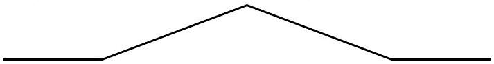
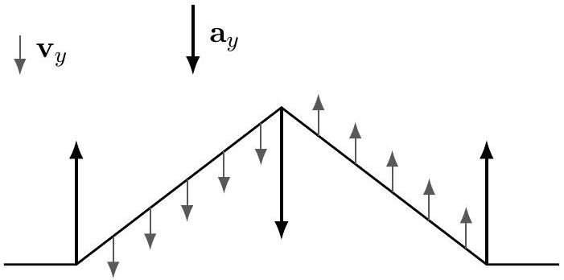

[2] Problem 2. Consider a string with the following shape.

    (a) If this is a traveling wave moving to the right with velocity $v$, carefully draw the velocity and acceleration of every point on the string.
    (b) Now suppose the string is held in place, with zero velocity. If it is suddenly released, sketch the subsequent behavior of the string.

Solution. (a) You can figure out the velocity in two different ways. First, since the wave is proportional to $f ( x - v t )$, the vertical velocity is

$$
\frac { \partial y } { \partial t } = - v f ^ { \prime } = - v \frac { \partial y } { \partial x }
$$

so it is proportional to the slope of the string. Alternatively, you can think about how the string has to move so that a moment later, its shape is the same but translated to the right. The result is shown below:

To derive the acceleration, you can think about how the velocity profile has to change as the string moves, or you can think about how it comes about from the tension in the string. In general, the net force depends on the concavity $\partial ^ { 2 } y / \partial x ^ { 2 }$ of the string. In this case, it's only nonzero at the three kinks.

(b) To keep the string in that position, we must hold it at three points. Since information can't travel faster than the speed of waves, only the bits of string near those three points can move right after release, because they're the only ones that know about the release. The direction of motion can be found with the wave equation (the middle goes down, the ends go up).
Now, for the general solution, note that a solution to the wave equation with zero initial velocity may be written in the form $f ( x + v t ) + f ( x - v t )$. Here, the function $f$ has the same shape as the wave, but half the height. Evidently, two traveling waves split off in opposite directions.
