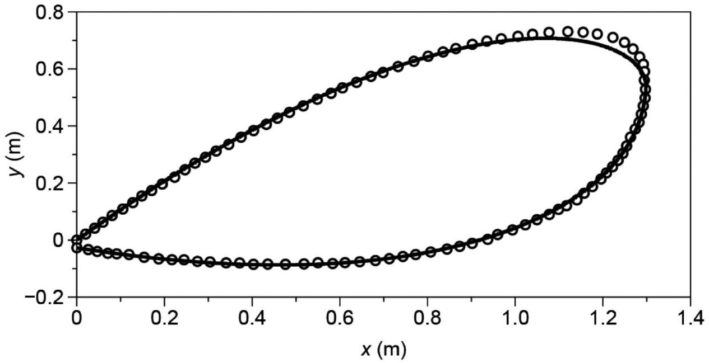

[4] Problem 5. Flexible strings, ropes, and chains can display some counterintuitive behavior. Suppose a string carries a small traveling wave on it, moving with speed $v = \sqrt { T / \mu }$ to the right. Then in the frame that's also moving with speed $v$ to the right, the string maintains a constant shape, while moving along this shape with speed $v$, like a snake.
    (a) In fact, this phenomenon is extremely general. Show that if we have a flexible string loop floating in zero gravity with any shape, then it is possible for that string to move along its length while maintaining a constant shape, if its speed satisfies $v = \sqrt { T / \mu }$.

In the popular "string shooter" toy, a loop of string is shot through spinning wheels with high speed $v$. As a result, the string seems to levitate in the air while maintaining a constant shape. This is partially explained by part (a), but the real explanation also involves the weight and drag forces. Assume the string experiences a drag force $f$ per unit length, directed against its motion.

A fit of the string's profile to data is shown above, where the wheels are at the origin. The string moves in the clockwise direction.

(b) Qualitatively, how does the tension in the string vary around the loop? In particular, find the point $P$ on the figure where the string has tension $T = \mu v ^ { 2 }$. Also, find whether the string has higher tension just before or just after it goes through the wheels.
(c) By taking measurements from the figure, estimate the drag to weight ratio $f / ( \mu g )$. (You may have to roughly eyeball some numbers. 20\% accuracy is good enough.)
(d) One interesting feature, which you can see in the video linked above, is that if you tap the string right below the wheels, a pulse will smoothly move to the right along the bottom of the string with a slow speed $u$. Explain why, and find an estimate for $u$. Assume the string has speed $v = 15 \mathrm {~m} / \mathrm { s }$. You'll have to eyeball some numbers again, so expect only 20\% accuracy.

Solution. (a) There are no external forces acting along the string, so the string carries a uniform tension, due to its own motion. Now consider a small piece of the string of length $d x$, and suppose the radius of curvature there is $r$. Then the tension on each side of the piece gives an inward force $T d \theta = T d x / r$, while the required centripetal force is $( \mu d x ) v ^ { 2 } / r$. These are equal if $v = \sqrt { T / \mu }$ for any value of $r$. That is, the internal tension force always provides the right centripetal force no matter what the string's local shape is.
(This has been tested in the International Space Station, though it turns out to be pretty hard to set up the desired motion. Also, when you do get it going, internal friction dissipates kinetic energy while keeping the angular momentum the same, which slowly causes the shape to relax to a circle, which has the minimum energy for a given angular momentum.)

By the way, this provides the explanation of an alternative solution to the pearl necklace problem in M3. In that problem, it turns out that a necklace will jump off a table once it accelerates to $v = \sqrt { T / \mu }$ at the corner. That's precisely because at that point, its own tension provides all the centripetal force, so the normal force vanishes. For another example of this trick, see problem 105 of 200 Puzzling Physics Problems.

(b) Consider the force and acceleration of a small piece $d \mathbf { s }$ of the string, where $d \mathbf { s }$ points along the string's direction of motion. The forces are $\mu g d s$ acting downward, a drag force $- f d \mathbf { s }$, and

tension forces on each side. Because the string is moving with constant speed, its acceleration is perpendicular to $d \mathbf { s }$.
Therefore, there is no net force parallel to $d \mathbf { s }$, and balancing forces in that direction implies that the difference in tension forces has to be

$$
d T = f d s + \mu g d y
$$

where $d y$ is the $y$-component of $d s$. In other words, the tension increases as one goes along the string, and as one goes to higher elevations. For the parts of the string just before and after the wheels, the heights are about the same, so the tension is higher just before going through the wheels. This makes sense, as the wheels are pulling the string in.
Next, consider the forces perpendicular to $d \mathbf { s }$. This contains contributions from the gravitational force and the tension forces, and needs to sum up to the centripetal force. We know from part (a) that at the point where $T = \mu v ^ { 2 }$, the tension alone accounts for the centripetal force. Then at this point, gravity can't contribute in this direction, so $d \mathbf { s }$ must be vertical. So point $P$ is at the rightmost point on the loop.
At other points, $T$ is a bit different from $\mu v ^ { 2 }$, so the difference is made up by gravity. Working through this will give a complicated differential equation for the shape of the string, which was numerically solved to make the curve in the diagram above.

(c) There's a net downward gravitational force $\mu L g$ on the string. The net drag force is
$$
\mathbf { F } _ { d } = \int f d \mathbf { s } = 0
$$
since the string is a closed loop. So the wheels must apply a purely vertical force $\mu L g$.
Now, we can finish the problem by considering either forces or torques. Let's consider torques first, taking the wheels as the origin. The torque from gravity is $\mu L g x _ { \mathrm { CM } }$, and it has to be balanced by the torque from the drag force, which is
$$
\tau _ { d } = \left| \int f \mathbf { r } \times d \mathbf { s } \right| = 2 f A
$$
where $A$ is the area of the loop. (That is, the drag force is what lets the string stay up, even though it doesn't provide any net upward force!) We therefore conclude that
$$
\frac { f } { \mu g } = \frac { x _ { \mathrm { CM } } L } { 2 A } .
$$
Roughly eyeballing the values gives
$$
x _ { \mathrm { CM } } \approx 0.8 \mathrm {~m} , \quad A \approx 0.6 \mathrm {~m} ^ { 2 } , \quad \frac { f } { \mu g } \approx 2.1 .
$$
Alternatively, we can consider forces. (I thank Joshua Wang for pointing out this alternative solution.) Let the tension right after the wheels be $T$, so that the tension right before the wheels is $T + f L$. In addition, let the string exit the wheels at an angle $\theta _ { 1 }$ above the horizontal, and enter the wheels at an angle $\theta _ { 2 }$ below the horizontal. Now consider a piece of string as it passes through the wheels. The horizontal component of Newton's second law is
$$
\mu v ^ { 2 } \left( \cos \theta _ { 1 } + \cos \theta _ { 2 } \right) = T \cos \theta _ { 1 } + ( T + f L ) \cos \theta _ { 2 }
$$

and the vertical component is

$$
\mu v ^ { 2 } \left( \sin \theta _ { 1 } - \sin \theta _ { 2 } \right) = T \sin \theta _ { 1 } - ( T + f L ) \sin \theta _ { 2 } + \mu L g
$$

where the last term is the vertical force from the wheels. These equations are equivalent to

$$
\left( \mu v ^ { 2 } - T \right) \left( \cos \theta _ { 1 } + \cos \theta _ { 2 } \right) = f L \cos \theta _ { 2 }
$$

and

$$
\left( \mu v ^ { 2 } - T \right) \left( \sin \theta _ { 1 } - \sin \theta _ { 2 } \right) = \mu L g - f L \sin \theta _ { 2 } .
$$

Dividing these equations removes the unwanted dependence on $v$ and $T$, and simplifying gives

$$
\frac { f } { \mu g } = \frac { \cos \theta _ { 1 } + \cos \theta _ { 2 } } { \sin \left( \theta _ { 1 } + \theta _ { 2 } \right) } .
$$

Thus, we only have to measure these two angles, which can be done relatively accurately, accounting for the fact that the axis scales are not equal. I find that

$$
\theta _ { 1 } \approx 48 ^ { \circ } , \quad \theta _ { 2 } \approx 10 ^ { \circ } , \quad \frac { f } { \mu g } \approx 1.95 .
$$

For comparison, the figure above is from this paper, with parameters $f / ( \mu g ) = 1.82$.

(d) At the bottom part of the string, we have $T > \mu v ^ { 2 }$. Here, waves on the string move a bit faster than the string itself, so that they can travel slowly against the string's flow. (A similar conclusion applies to waves made at the top: here the waves are a bit slower than the string, so waves propagating leftward will smoothly move to the right. However, you have to take more care at the top because the string will be moving into your finger, so you can easily get it tangled up. Untangling the string is the most annoying part of using this toy.) Both sets of waves end up converging at the point identified in part (c).
Let the tension right below the wheels be $T = \mu v ^ { 2 } + \Delta T$. By tracking the change in tension induced by gravity and drag from the point identified in part (c), we have
$$
\Delta T = f \ell _ { 0 } - \mu g y _ { 0 }
$$
where $\ell _ { 0 }$ is the length of string from the bottom of the wheels to the point in part (c), and $y _ { 0 }$ is that point's $y$-coordinate. Eyeballing some more numbers, the fractional shift is
$$
\frac { \Delta T } { \mu v ^ { 2 } } = \frac { g } { v ^ { 2 } } ( ( 2.0 ) ( 1.5 \mathrm {~m} ) - ( 0.5 \mathrm {~m} ) ) = 0.11
$$
where I took $f / ( \mu g ) = 2.0$ as a rough compromise between the two answers to part (c). So the change in velocity is roughly
$$
u \approx \frac { 1 } { 2 } \frac { \Delta T } { \mu v ^ { 2 } } v \approx 0.8 \mathrm {~m} / \mathrm { s } .
$$
For typical speeds, drag is the dominant factor and $f \propto v ^ { 2 }$, so the ratio $u / v$ remains roughly constant as you increase the speed of the string.
For a more advanced and thorough treatment of this system, published in a top journal, see this paper. More generally, there are a lot of tricky questions about flexible strings and chains. People still write papers disagreeing about the explanation of the chain fountain.

Idea 2
A sinusoidal wave has the form

$$
y ( x , t ) = A \cos ( k x - \omega t + \phi ) , \quad v = \frac { \omega } { k }
$$

where $k$ is the wavenumber and $\omega$ is the angular frequency. They are related to the wavelength and period by

$$
k = \frac { 2 \pi } { \lambda } , \quad \omega = \frac { 2 \pi } { T } .
$$

Sinusoidal waves will be especially useful because the wave equation is linear. Fourier analysis tells us that any initial condition can be written in terms of a sum of sinusoids, so if we know what happens to the sinusoids, we know what happens in general by superposition. This is just a generalization of ideas we've seen in M4 and E6. Just as we saw there, it can also be useful to promote $y$ to a complex number, where the physical value of $y$ is the real part; for a sinusoidal wave we would have $y ( x , t ) = y _ { 0 } e ^ { i ( k x - \omega t ) }$.

Remark
Physicists almost universally use $k$ and $\omega$ rather than $\lambda , f$, and $T$. A nice way of thinking of these variables is that they represent how quickly the phase $\phi$ changes, in space or time,

$$
k = \frac { d \phi } { d x } , \quad \omega = - \frac { d \phi } { d t } .
$$

If we use a little special relativity, we can even combine these into a single equation,

$$
k ^ { \mu } = \partial ^ { \mu } \phi .
$$

The fundamental relation between particle and wave properties in quantum mechanics is

$$
p ^ { \mu } = \hbar k ^ { \mu } .
$$

These are the de Broglie relations, which we'll cover in X1.

[4] Problem 6. For a wave on a string, there are two contributions to the energy: potential energy from stretching, and kinetic energy from transverse motion.
    (a) Find the kinetic and potential energy density (i.e. energy per unit length) of the string in terms of $T , \mu , y$, and its derivatives.
    (b) Evaluate the above quantities for $y = A \cos ( k x - \omega t )$. Is the total energy density uniform?
    (c) Show that for a general traveling wave of the form $y = f ( x - v t )$, the total kinetic and potential energy are equal.
    (d) Show that for any wave function $y$, total energy is conserved. This will require some integration by parts, as well as the wave equation itself; you should assume $y$ goes to zero at infinity.
    (e) Compute the energy of the static configuration in problem 2(b), assuming the triangle has height $h$ and base $L$, where $h \ll L$.

One warning: as we saw in E6, energy is quadratic, so it does not obey the superposition principle. Locally, the amount of energy can be more or less than the sum of the energies of the superposed waves, due to interference.

Solution. (a) We will assume the displacement of the string is small, and take the lowest order terms. Using $\frac { 1 } { 2 } m v ^ { 2 }$ for kinetic energy of a piece moving in the transverse direction gets

$$
\begin{gathered}
\Delta K = \frac { 1 } { 2 } \Delta m \dot { y } ^ { 2 } = \frac { 1 } { 2 } \left( \mu \Delta x \sqrt { 1 + y ^ { \prime 2 } } \right) \dot { y } ^ { 2 } \\
\frac { d K } { d x } = \frac { 1 } { 2 } \mu \dot { y } ^ { 2 } \sqrt { 1 + y ^ { \prime 2 } } \approx \frac { 1 } { 2 } \mu \dot { y } ^ { 2 }
\end{gathered}
$$

For the potential energy, the work done on stretching the string is $\Delta U = T \Delta \ell$ where $\Delta \ell =$ $\sqrt { 1 + y ^ { \prime 2 } } \Delta x - \Delta x \approx \frac { 1 } { 2 } y ^ { \prime 2 } \Delta x$ since the displacement is small. Thus

$$
\frac { d U } { d x } = \frac { 1 } { 2 } T y ^ { \prime 2 } .
$$

(b) We have
$$
\frac { d K } { d x } = \frac { 1 } { 2 } \mu A ^ { 2 } \omega ^ { 2 } \sin ^ { 2 } ( k x - \omega t ) , \quad \frac { d U } { d x } = \frac { 1 } { 2 } T A ^ { 2 } k ^ { 2 } \sin ^ { 2 } ( k x - \omega t ) .
$$
Here, we can see that the total energy density is not uniform, but rather comes in "lumps". This is also true for electromagnetic waves.
(c) The densities are
$$
\frac { d K } { d x } = \frac { 1 } { 2 } \mu v ^ { 2 } f ^ { \prime 2 } , \quad \frac { d U } { d x } = \frac { 1 } { 2 } T f ^ { \prime 2 }
$$
and for a wave traveling in one direction, these densities are exactly equal because $v ^ { 2 } = T / \mu$, so the total kinetic and potential energy are equal.
(d) The total energy is
$$
E = \int _ { - \infty } ^ { \infty } \left( \frac { 1 } { 2 } \mu \dot { y } ^ { 2 } + \frac { 1 } { 2 } T y ^ { \prime 2 } \right) d x
$$
Taking the time derivative and applying the wave equation,
$$
\frac { d E } { d t } = \int _ { - \infty } ^ { \infty } \mu \ddot { y } \ddot { y } + T \dot { y } ^ { \prime } y ^ { \prime } d x \propto \int _ { - \infty } ^ { \infty } \dot { y } y ^ { \prime \prime } + \dot { y } ^ { \prime } y ^ { \prime } d x
$$
where we used the wave equation in the second equality. Integrating the first term by parts,
$$
\int _ { - \infty } ^ { \infty } \dot { y } y ^ { \prime \prime } d x = \left. \dot { y } y ^ { \prime } \right| _ { - \infty } ^ { \infty } - \int _ { - \infty } ^ { \infty } \dot { y } ^ { \prime } y ^ { \prime } d x
$$
and the boundary term vanishes by our assumptions. The remaining term is just the opposite of the other term in $d E / d t$, so $d E / d t = 0$ as desired.
(e) Since the string was initially held steady, there is only potential energy. The amount of potential energy is just $T$ times the total length the string is stretched, so
$$
U = T \left( \sqrt { 4 h ^ { 2 } + L ^ { 2 } } - L \right) \approx \frac { 2 T h ^ { 2 } } { L }
$$
where we used $h \ll L$ in the last step.

[2] Problem 7 (French 7.23). One end of a stretched string is moved transversely at constant velocity $u$ for a time $\tau$, and is moved back to its starting point with velocity $- u$ during the next interval $\tau$. As a result, a triangular pulse is set up on the string and moves along it with speed $v$. Show that the total energy of the pulse is equal to the work done on the string, working to lowest order in $u / v$.
Solution. First let's compute the energy in the pulse. Recall that the energy density is
$$
\frac { d E } { d x } = \frac { \mu } { 2 } \left( \frac { \partial y } { \partial t } \right) ^ { 2 } + \frac { T } { 2 } \left( \frac { \partial y } { \partial x } \right) ^ { 2 } = \frac { T } { 2 } \left( \frac { 1 } { v ^ { 2 } } \left( \frac { \partial y } { \partial t } \right) ^ { 2 } + \left( \frac { \partial y } { \partial x } \right) ^ { 2 } \right) .
$$
The triangular pulse has height $u \tau$, and the two halves of it have length $v \tau$. Thus, $| \partial y / \partial t | = u$ and $| \partial y / \partial x | = u / v$ across the pulse, so the total energy is
$$
U = ( 2 v \tau ) \frac { d E } { d x } = \frac { 2 T \tau u ^ { 2 } } { v } .
$$
When lifting the string to create the pulse, the string was at an angle of $u / v$ to first order in $u / v$, so the transverse force that needed to be applied was $T u / v$. The distance over which this force was applied was $u \tau$, for a total work of $T \tau u ^ { 2 } / v$. The same work was done when bringing it down with constant velocity, so the total work done was $2 T \tau u ^ { 2 } / v$, as expected.

Remark
How can we account for damping in the wave equation? The simplest thing would be to add a force proportional to $v _ { y }$, which e.g. could be due to air drag. Then

$$
\partial _ { t } ^ { 2 } y = v ^ { 2 } \partial _ { x } ^ { 2 } y - A \partial _ { t } y .
$$

But what if the string is in a vacuum? Then the simplest kind of damping would be due to the energy lost in bending and unbending of the string, which takes the form

$$
\partial _ { t } ^ { 2 } y = v ^ { 2 } \partial _ { x } ^ { 2 } y + A \partial _ { t } \partial _ { x } ^ { 2 } y
$$

because $\partial _ { x } ^ { 2 } y$ describes the bending. This is called Kelvin-Voigt damping.
In both cases, it's straightforward to handle the damping since the wave equation remains linear; we just plug in a solution of the form $e ^ { i ( k x - \omega t ) }$ and find the new relation between $\omega$ and $k$. If we pick $k$ to be a real number, we will generally find $\omega$ to be complex, with its imaginary part corresponding to exponential decay of the wave over time.
