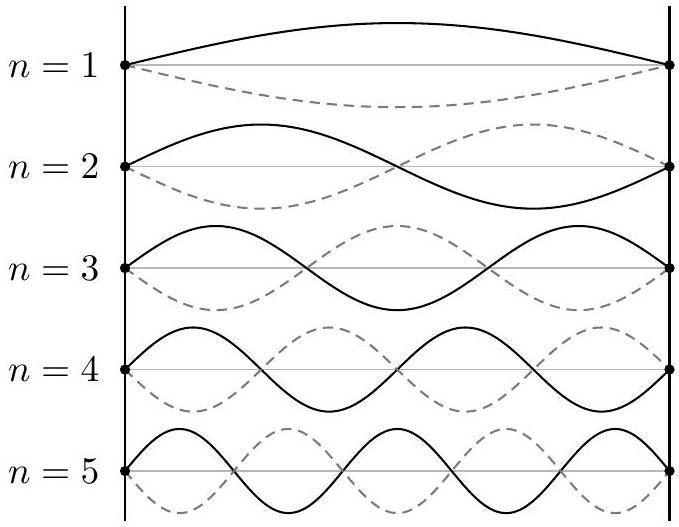
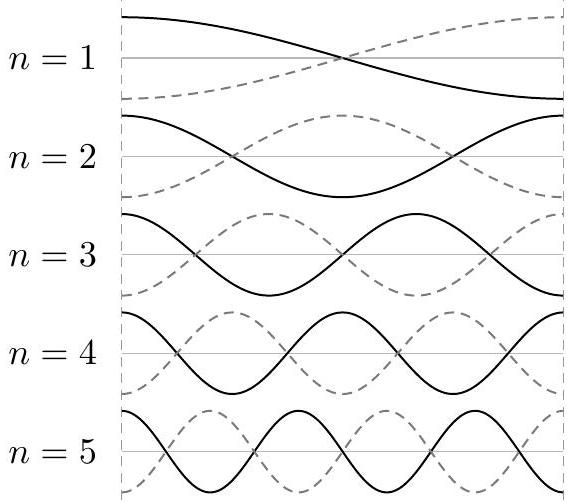
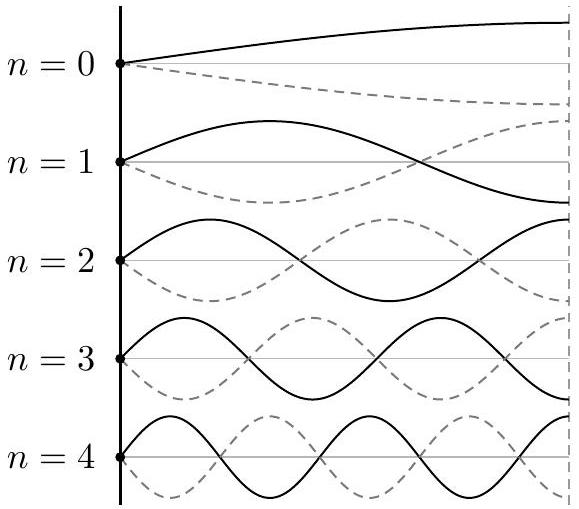

[2] Problem 9. Consider a string of length $L$ and wave speed $v$.
    (a) Suppose the ends of the string are fixed, i.e. $y ( x , t ) = 0$ at $x = 0$ and $x = L$. Find the standing wave angular frequencies and sketch the configurations.
    (b) Do the same if the ends of the string are free, i.e. $\partial y / \partial x = 0$ at $x = 0$ and $x = L$.
    (c) Do the same if one end is fixed and one end is free.

Solution. (a) The standing wave equations are $y ( x , t ) = A \sin ( k x ) \cos ( \omega t )$ and $y ( 0 , t ) = y ( L , t ) =$ 0 . Thus $k L = \pi n$, giving the angular frequencies

$$
\omega _ { n } = \frac { \pi v n } { L }
$$

for $n \geq 1$. The waves will look like this:

(b) We can replace the sine with a cosine in the above solution (so integrating or differentiating the above solution with respect to $x$ gets the solutions to this problem). Thus the angular frequencies are the same, $\omega _ { n } = \pi v n / L$, and the waves look like this:

Technically, while the boundary conditions in part (a) required $n \geq 1$, here we can actually take $n \geq 0$. The $n = 0$ solution just corresponds to the whole string being moved up or down and staying there, with zero frequency. But this trivial solution is not typically called a "standing wave", so it's conventional to say the lowest frequency is at $n = 1$.
(c) Let $x = 0$ be fixed and $x = L$ be free. Then for $y ( x , t ) = A \sin ( k x ) \cos ( \omega t )$, we have $k L = \pi ( n + 1 / 2 )$, so
$$
\omega _ { n } = \frac { \pi v } { L } ( n + 1 / 2 )
$$
for $n \geq 0$. The first five standing wave solutions, including the fundamental $n = 0$ mode, are shown below.

[2] Problem 10. USAPhO 1997, problem A1.
Idea 4
When a musical instrument plays a note, typically multiple standing waves are excited, so the resulting sound is composed of multiple frequencies. As you saw in problem 9, often the standing wave frequencies are all multiples of a single, lowest frequency. This frequency $f _ { 0 }$ is called the fundamental, or first harmonic, while the multiple $n f _ { 0 }$ is called the $n ^ { \text {th } }$ harmonic. The fundamental frequency determines the pitch we perceive, while the distribution of energy among the harmonics determines the timbre, or tonal quality, of the instrument.
