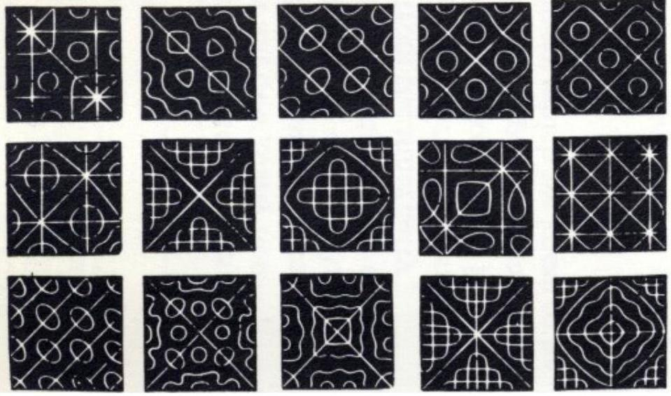
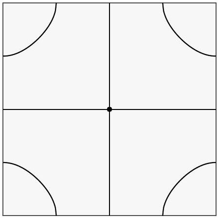
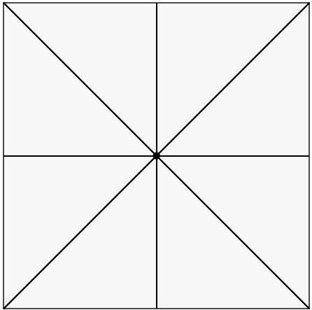
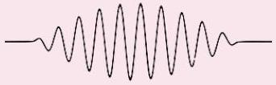

[4] Problem 15. When sand is sprinkled on a vibrating metal plate, it forms Chladni patterns. Suppose we (unrealistically) model the plate as a square elastic membrane, as in problem 14, of side length $L$ obeying the wave equation with wave speed $v$. Unlike in problem 14, we now assume the boundaries of the plate are free.

(a) Do Chladni patterns form at the nodes or antinodes of a standing wave?
(b) Find the general standing wave solutions $z ( x , y , t )$ and their angular frequencies.
(c) The plate is also fixed in the middle by the support, so $z = \partial z / \partial x = \partial z / \partial y = 0$ there, which removes many of the standing wave solutions. Find the lowest and second-lowest angular frequencies of allowed standing waves.
(d) Sketch the Chladni pattern for the lowest standing wave frequency.
(e) For the second-lowest standing wave frequency, there will be two independent standing waves with that frequency. What superpositions of them will yield Chladni patterns with 90° rotational symmetry? (If you want to see these patterns, you'll need a computer.)

Solution. (a) The sand can sit still at the nodes, while it gets bounced away from everywhere else. So the Chladni pattern shows the nodes. (The true story is a bit more complicated. Very fine dust is substantially affected by the air currents created by the vibrating plate. It turns out that this causes dust to accumulate near antinodes instead. To avoid confusion, real demonstrations are often performed with sifted sand, which does not contain dust.)

(b) This is very similar to the result of problem 14. For concreteness, let's put the origin at the bottom-left of the plate. For the boundary condition to be satisfied at the bottom and left edges of the plate, the standing waves should be proportional to cosines,
$$
z ( x , y , t ) = \cos ( \omega t ) \cos \left( k _ { x } x \right) \cos \left( k _ { y } y \right) .
$$
For the boundary conditions to be satisfied at the opposite edges of the plate, we require
$$
k _ { x } = \frac { \pi n } { L } , \quad k _ { y } = \frac { \pi m } { L }
$$
from which we conclude
$$
\omega _ { n m } = \sqrt { n ^ { 2 } + m ^ { 2 } } \frac { \pi v } { L } .
$$
(c) Because of these additional restrictions, both $n$ and $m$ have to be odd. This means the lowest frequency standing wave corresponds to $( n , m ) = ( 1,1 )$ and $\omega = \sqrt { 2 } \pi v / L$. The next lowest corresponds to $( n , m ) = ( 1,3 )$ and $( 3,1 )$ and thus $\omega = \sqrt { 10 } \pi v / L$.

(d) In this case, the Chladni pattern is a centered plus sign.
(e) Setting $\pi / L = 1$ for convenience, the standing wave profiles are
$$
f ( x , y ) = \cos ( 3 x ) \cos ( y ) , \quad g ( x , y ) = \cos ( x ) \cos ( 3 y ) .
$$
Neither of these has 90° rotational symmetry, but the combinations
$$
h _ { \pm } ( x , y ) = f ( x , y ) \pm g ( x , y )
$$
either stay the same, or flip sign upon a 90° rotation. Thus, their Chladni patterns both have 90° rotational symmetry.

With the origin moved to the center of the plate, the two Chladni patterns are shown below.

$$
h _ { + } = f + g
$$

$$
h _ { - } = f - g
$$

Remark: Plate Theory
The treatment of problem 15 is inaccurate because the restoring force in a metal plate is rigidity, not tension. The waves actually satisfy the two-dimensional analogue of the fourthorder equation considered in problem 11, which is called the biharmonic equation,

$$
- \frac { \partial ^ { 2 } z } { \partial t ^ { 2 } } \propto \nabla ^ { 4 } z = \nabla ^ { 2 } \nabla ^ { 2 } z = \left( \partial _ { x } ^ { 2 } + \partial _ { y } ^ { 2 } \right) \left( \partial _ { x } ^ { 2 } + \partial _ { y } ^ { 2 } \right) z = \frac { \partial ^ { 4 } z } { \partial x ^ { 4 } } + 2 \frac { \partial ^ { 4 } z } { \partial x ^ { 2 } \partial y ^ { 2 } } + \frac { \partial ^ { 4 } z } { \partial y ^ { 4 } } .
$$

For more about this thrilling subject, see Plates, by Bhaskar and Varadan.

Remark: Wavepackets
Purely sinusoidal traveling waves of the form $e ^ { i ( k x - \omega t ) }$ are unrealistic, because they have infinite spatial extent. A realistic alternative is a wavepacket, which looks like a sinusoid with wavenumber $k$ but with a finite envelope, as shown below.

To understand how sinusoids are constructed, consider the superposition of two traveling waves with wavenumbers $k \pm \Delta k$. The wavefunction is

$$
e ^ { i ( ( k - \Delta k ) x - ( \omega - \Delta \omega ) t ) } + e ^ { i ( ( k + \Delta k ) x - ( \omega + \Delta \omega ) t ) } = 2 e ^ { i ( k x - \omega t ) } \cos ( \Delta k x - \Delta \omega t ) .
$$

This is simply a sinusoid of wavenumber $k$ with a slowly varying envelope, whose characteristic size is $1 / \Delta k$, reflecting how the two component waves slowly move in and out of phase. The wave is still infinite in size, but this can be remedied by superposing infinitely many wavenumbers; in this case the component sinusoids never get back in phase again.

If the wavenumbers occupy a region $\Delta k$, then the size of the envelope is of order $1 / \Delta k$, because this is the distance required for the component waves to get out of phase with each other. This yields an "uncertainty principle" for waves,

$$
\Delta x \Delta k \gtrsim 1 .
$$

In quantum mechanics, particles are described by waves with $p = \hbar k$. Substituting this in immediately gives the Heisenberg uncertainty principle; it fundamentally holds because one cannot get a finite wave without superposing different wavenumbers.

Alternatively, if we had worked with angular frequencies instead, we would have had

$$
\Delta t \Delta \omega \gtrsim 1 .
$$

This is an "acoustic uncertainty principle", also important in digital signal processing, where it is called the Gabor limit. Upon using the de Broglie relations, one finds the energy-time uncertainty principle.

## Idea 6

The dispersion relation of a system is the function $\omega ( k )$ relating the angular frequency and wavenumber of sinusoidal waves. The phase and group velocity

$$
v _ { p } = \frac { \omega } { k } , \quad v _ { g } = \frac { d \omega } { d k }
$$

describe the velocities of sinusoidal waves of wavenumber $k$ and the envelopes of wavepackets built from sinusoids near wavenumber $k$, respectively. We can see the latter result from the remark above: the peak of the envelope is the point where the components are in phase, and this point travels at speed $\Delta \omega / \Delta k \approx d \omega / d k$.

For ideal waves, the dispersion relation is linear, the group and phase velocities are constant and equal, and waves travel while maintaining their shape. When the dispersion relation isn't linear, the group and phase velocities depend on $k$, so wavepackets gradually fall apart (i.e. they disperse). For more discussion of these topics, see chapter 6 of Morin.

## Remark

In R1, you learned that nothing can go faster than the speed of light. But the phase velocity can exceed it; for instance, in problem 16 you will find a phase velocity that can be infinite! This is compatible with relativity, because the phase velocity isn't the speed of an actual object. It's just a formal quantity, namely the rate of change of the position of points of

constant phase in an infinite plane wave. To reinforce the point, suppose we arranged to stand at different places and clap at the same time. Then we could say "the clap moved from me to you at infinite speed", but clearly nothing about this contradicts relativity.

In some textbooks, you'll read that while the phase velocity can be faster than light, the group velocity can't be, because it's the speed of an actual pulse. But that's not quite true in general either, because that result follows from an approximation. For instance, in materials with really weird dispersion relations, a single pulse can split up into two, in which case the speed of "the" peak or "the" envelope isn't even well-defined. Accordingly, in these cases the group velocity can be formally faster than light, but it doesn't contradict relativity because the group velocity ceases to have its intuitive meaning.

If you're mathematically minded, you might be bothered by the argument that a superluminal phase velocity is okay because no "actual object" moves faster than light, since it seems hard to rigorously define the term "actual object". Luckily, there's a simple and perfectly rigorous definition of the light speed limit: the observable effects of an action must lie in the future light cone of the action. Suppose you change the value of a field at the origin, at time $t = 0$. Then at time $t$, the field at all points $r > c t$ must be the same as if you didn't make the change at all. The maximum speed at which changes of the field propagate is called the signal velocity, and it can never exceed $c$.
