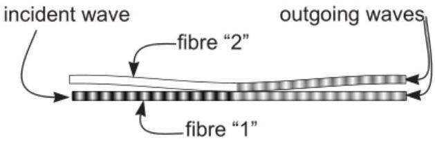
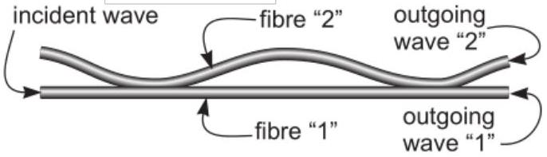

[4] Problem 23. Consider two identical, thin, symmetric mirrors, with reflection and transmission coefficients $r$ and $t$, placed a distance $L$ apart, with air in between them and outside them. This system is called a Fabry-Perot interferometer. A wave with wavenumber $k$ hits the apparatus; we want to find the reflection and transmission coefficients $r _ { \text {net } }$ and $t _ { \text {net } }$ of the entire system.

(a) Draw all paths that the light could take to be reflected, and to be transmitted.
(b) By applying the principle of superposition and summing a geometric series, show that
$$
r _ { \mathrm { net } } = r + \frac { r t ^ { 2 } e ^ { 2 i k L } } { 1 - r ^ { 2 } e ^ { 2 i k L } } , \quad t _ { \mathrm { net } } = \frac { t ^ { 2 } e ^ { i k L } } { 1 - r ^ { 2 } e ^ { 2 i k L } } .
$$
Note that your answers may differ by phases, depending on your conventions for $r _ { \text {net } }$ and $t _ { \text {net } }$.
(c) Show that all the light is transmitted for some special values of $L$, even if $r \approx 1$. That is, nearly ideal mirrors can become perfectly transparent! This is called resonant transmission, and it occurs because the reflected waves perfectly destructively interfere.

For the rest of the problem, assume that $L$ takes one of the special values found in part (c).

(d) Using energy conservation, recover the result of problem 22(b).
(e) Suppose that a laser with power $P$ has been fired at the interferometer for a long time. Then, at a certain moment, the laser is suddenly switched off. Find the total energy of the light that travels from the interferometer back towards the laser after the laser is switched off. For simplicity, suppose that $| t | \ll 1$, and give your answer in terms of $P , L , | t |$, and $c$.
(f) Estimate the duration of the light pulse that travels back towards the laser.

Solution. Parts (a) to (d) are textbook standards; (e) and (f) were in EuPhO 2024, problem 3.

(a) Light can be immediately reflected from the first mirror. It can also go in between the mirrors and be reflected any number of times before leaving through either mirror.
(b) For a wave to be transmitted, it must be transmitted through one mirror, reflected $2 n$ times, then travel a distance of $L$ and get transmitted out the other mirror. For each intermediate reflection, its amplitude gets a factor of $\alpha = r e ^ { i k L }$. Then we have
$$
t _ { \mathrm { net } } = t ^ { 2 } e ^ { i k L } \left( 1 + \alpha ^ { 2 } + \alpha ^ { 4 } + \ldots \right) = \frac { t ^ { 2 } e ^ { i k L } } { 1 - r ^ { 2 } e ^ { 2 i k L } }
$$
as desired. As for reflection, we have
$$
r _ { \mathrm { net } } = r + t ^ { 2 } e ^ { i k L } \left( \alpha + \alpha ^ { 3 } + \alpha ^ { 5 } + \ldots \right) = r + \frac { r t ^ { 2 } e ^ { 2 i k L } } { 1 - r ^ { 2 } e ^ { 2 i k L } }
$$
(c) The fraction of the energy transmitted is
$$
T = \left| t _ { \text {net } } \right| ^ { 2 } = \frac { | t | ^ { 4 } } { \left| 1 - r ^ { 2 } e ^ { 2 i k L } \right| ^ { 2 } } .
$$
This is maximized when $r ^ { 2 } e ^ { 2 i k L }$ is real and positive, so that it is equal to $| r | ^ { 2 }$, giving
$$
T = \frac { | t | ^ { 4 } } { \left( 1 - | r | ^ { 2 } \right) ^ { 2 } } = 1 .
$$
This is a striking result: you can put two nearly perfect mirrors next to each other, and light of the right color will still go right through. This is because the light that goes go through the first can bounce around inside many times, eventually completely canceling the zeroth order reflected wave. This phenomenon is called resonant transmission.

(d) In this case, we have $\left| t _ { \text {net } } \right| ^ { 2 } = 1$, so energy conservation implies $r _ { \text {net } } = 0$, which means
$$
0 = r + \frac { \left( t ^ { 2 } / r \right) r ^ { 2 } e ^ { 2 i k L } } { 1 - r ^ { 2 } e ^ { 2 i k L } } = r + \frac { t ^ { 2 } | r | ^ { 2 } / r } { 1 - | r | ^ { 2 } } = r + \frac { t ^ { 2 } | r | ^ { 2 } / r } { | t | ^ { 2 } } .
$$
This is equivalent to
$$
\frac { r ^ { 2 } } { | r | ^ { 2 } } = - \frac { t ^ { 2 } } { | t | ^ { 2 } }
$$
so that the phases of $r ^ { 2 }$ and $t ^ { 2 }$ differ by $\pi$, so the phases of $r$ and $t$ differ by $\pi / 2$.
(e) We've established that, in the steady state, the total reflected wave has zero amplitude. Let $\Delta t = 2 L / c$ be the time for one round trip within the interferometer. For the first $\Delta t$, the total reflected wave is "missing" the direct reflected wave, so it has an amplitude of magnitude $r$. For the next $\Delta t$, it is missing both the direct reflected wave and the one involving one trip within the interferometer, and so on.
To make this more quantitative, note that $| r | = r e ^ { i k L }$, so that
$$
r _ { \mathrm { net } } = r + t ^ { 2 } e ^ { i k L } \left( | r | + | r | ^ { 3 } + | r | ^ { 5 } + \ldots \right) = e ^ { - i k L } \left( | r | + \left( | r | ^ { 3 } - | r | \right) + \left( | r | ^ { 5 } - | r | ^ { 3 } \right) + \ldots \right) .
$$
So for the first $\Delta t$, the reflected amplitude has magnitude $| r |$, and for the next $\Delta t$, it has magnitude $| r | ^ { 3 }$, and so on. Then we have
$$
E _ { r } = ( P \Delta t ) \left( | r | ^ { 2 } + | r | ^ { 6 } + | r | ^ { 10 } + \ldots \right) = \frac { 2 P L } { c } \frac { | r | ^ { 2 } } { 1 - | r | ^ { 4 } } \approx \frac { P L } { | t | ^ { 2 } c }
$$
where we used $| t | \ll 1$.
(f) Every time $\Delta t$, the reflected pulse weakens by a factor of $| r | ^ { 4 }$, where $1 - | r | ^ { 4 } \approx 2 | t | ^ { 2 }$. Then the timescale of decay is roughly $T \sim \Delta t / | t | ^ { 2 } \sim L / \left( | t | ^ { 2 } c \right)$.

[3] Problem 24. USAPhO 2004, problem A3.

[3] Problem 25 (Kalda). In fiber optics, devices called equal ratio splitters are often used; these are devices where two optical fibers are brought into such a contact so that if an electromagnetic wave is propagating in one fiber, it splits into two equal amplitude waves traveling in each of the fibers. Assume that all waves propagate with the same polarization, i.e. that all electric fields are parallel.

(a) Show that whenever a wave enters the splitter, from either fiber, one of the outgoing waves is advanced in phase by $\pi / 4$, while the other is retarded by $\pi / 4$.
(b) From part (a) alone, it's ambiguous which wave is advanced and which wave is retarded. Let's suppose that the fibers are set up so that, when a wave enters along fiber 1, the wave that exits along fiber 1 is advanced. If a wave enters along fiber 2, is the wave that exits along fiber 1 advanced or retarded?

(c) Now consider two sequentially positioned, identical equal ratio splitters, as shown.

This is called a Mach-Zehnder interferometer. The optical path difference between the intersplitter segments of the two fibers is $30 \mu \mathrm {~m}$. Assuming the wavelength of the incoming monochromatic light varies from 610 nm to 660 nm, for what wavelengths is all the light energy directed into fiber 2?

Solution. (a) This is a case where the heuristic argument of problem 22(c) works, because there's nothing but vacuum at the splitting point. Let the ingoing electric field amplitude be $E _ { \text {in } }$, and let the outgoing field amplitudes be $E _ { 1 }$ and $E _ { 2 }$. Then

$$
E _ { \text {in } } = E _ { 1 } + E _ { 2 } , \quad \left| E _ { \text {in } } \right| ^ { 2 } = \left| E _ { 1 } \right| ^ { 2 } + \left| E _ { 2 } \right| ^ { 2 }
$$

from continuity of the electric field, and energy conservation. Thus, by the Pythagorean theorem, $E _ { 1 }$ and $E _ { 2 }$ must differ in phase by $\pi / 2$. For the equal ratio splitter relevant to this problem, one of them is advanced in phase by $\pi / 4$, while the other is delayed in phase by $\pi / 4$.

(b) Consider sending in waves with the same phase and equal amplitude $E _ { 0 }$ along both fibers 1 and 2 simultaneously. If the wave that exits along fiber 1 is always advanced, then the final amplitudes are
$$
E _ { 1 } = \left( e ^ { i \pi / 4 } + e ^ { i \pi / 4 } \right) \frac { E _ { 0 } } { \sqrt { 2 } } = \sqrt { 2 } e ^ { i \pi / 4 } E _ { 0 } , \quad E _ { 2 } = \left( e ^ { - i \pi / 4 } + e ^ { - i \pi / 4 } \right) \frac { E _ { 0 } } { \sqrt { 2 } } = \sqrt { 2 } e ^ { - i \pi / 4 } E _ { 0 } .
$$
On the other hand, if a wave that enters along fiber 2 exits along fiber 1 retarded instead, the final amplitudes are
$$
E _ { 1 } = \left( e ^ { i \pi / 4 } + e ^ { - i \pi / 4 } \right) \frac { E _ { 0 } } { \sqrt { 2 } } = E _ { 0 } , \quad E _ { 2 } = \left( e ^ { - i \pi / 4 } + e ^ { i \pi / 4 } \right) \frac { E _ { 0 } } { \sqrt { 2 } } = E _ { 0 } .
$$
Only the second option respects energy conservation, $\left| E _ { 1 } \right| ^ { 2 } + \left| E _ { 2 } \right| ^ { 2 } = 2 \left| E _ { 0 } \right| ^ { 2 }$, so that one must occur. In other words, we have:
$$
1 \rightarrow 1,2 \rightarrow 2 : \text { advanced } , \quad 1 \rightarrow 2,2 \rightarrow 1 \text { : retarded }
$$
(c) Let's consider the two components of the waves that eventually exit along fiber 1.
    - Part of the incident wave stays in fiber 1 at the first splitter, getting advanced by $\pi / 4$. It picks up some phase between the two splitters, then gets advanced by $\pi / 4$ again at the second splitter.
    - Part of the incident wave goes into fiber 2 at the first splitter, getting retarded by $\pi / 4$. It picks up some phase between the two splitters, then (by the result of part (b)) gets retarded by $\pi / 4$ again at the second splitter.

For all the light to come out along fiber 2, these two components that come out along fiber 1 have to cancel out. That means they need opposite phases, which implies

$$
\pi / 4 + k \ell + \pi / 4 - ( - \pi / 4 + k ( \ell + \Delta \ell ) - \pi / 4 ) = ( 2 n + 1 ) \pi .
$$

This simplifies to $k \Delta \ell = 2 \pi n$, or $n \lambda = \Delta \ell = 30 \mu \mathrm {~m}$, from which we conclude

$$
n \in \{ 46,47,48,49 \} , \quad \lambda \in \{ 612,625,638,652 \} \mathrm { nm } .
$$

## Remark

Above, we've focused on cases where light can only exit a given optical element in two ways. But in general, you could have $n$ "ports", in which case you would need an entire $n \times n$ matrix of coefficients $S$ to relate the $n$ input amplitudes to the $n$ output amplitudes. Generalizing problem 22 to this case shows that $S$ is a unitary matrix, $S ^ { \dagger } = S ^ { - 1 }$.

All of the optical elements we've seen so far obey optical reciprocity, i.e. the principle that "if I can see you, then you can see me", related to time reversal symmetry. However, we can violate reciprocity by using special materials, such as permanent magnets. For example, a circulator is an optical element with 3 ports, so that all light entering port 1 exits from port 2, light in port 2 exits from port 3, and light in port 3 exits from port 1. Though it's exotic, there's no way to use it to violate the second law of thermodynamics.
