## Waves II: Interference and Diffraction

Interference and diffraction are covered in chapters 41, 42, and 43 of Halliday and Resnick, and chapter 14 of Wang and Ricardo, volume 1. For more mathematical detail, see chapter 9 of Crawford's Waves. For lighter reading with neat examples, see chapters I-29 and I-30 of the Feynman lectures. For much more, see chapters 9 and 10 of Optics by Hecht, a well-written but somewhat long-winded university level text. There is a total of 68 points.

## 1 Double Slit Interference

Remark: Coherence
We introduced interference in W1. However, in many cases interference for optical light can't be observed at all, because the relative phase between the two waves will oscillate rapidly, making the interference term cancel out. We say waves are "coherent" if their phase relation is stable enough for interference effects to be seen, and this is difficult with natural sources.

If you superpose light of wavelength 600 nm and 600.001 nm, their frequency difference will be $\sim 10 ^ { 9 } \mathrm {~Hz}$. Interference effects will oscillate at this frequency, and thus be impossible to see with the eye. Now, some lamps generate light with transitions between atomic energy levels, so that they ideally only have one output frequency. But you still wouldn't see interference if you used two identically constructed lamps, because tiny effects like thermal fluctuations will make the frequency wobble by enough to wash out interference effects.

So how did anybody ever observe light interference in the 19th century? It helps a lot to use a single lamp, since the light it produces is presumably in phase with itself. But that isn't quite enough, because the light received from the lamp at different points ultimately came from different parts of the lamp. The solution was to put a tiny (sub-millimeter) pinhole between the light source and the actual experiment; if the pinhole is small enough, then all the light going through the pinhole at a given moment is in phase with itself. After passing through the pinhole, the light spreads out again and can be directed, e.g. to the two slits of a double slit experiment. The pinhole is so effective that the source can even be the Sun.

Today, carrying out interference experiments is much easier, because lasers produce extremely coherent light. One can simply fire an ordinary laser pointer at a double slit. If you work even harder, it is possible, though challenging, to observe interference between two different lasers of the same type. Anyway, for the problems below we'll generally assume coherence is perfect, but one should remember it's always an important consideration in real setups.

Example 1
Derive the far-field intensity pattern for the double slit experiment.

Solution
We suppose a plane wave with wavenumber $k$ is incident on two small slits. Using Huygens' principle, the wall absorbs all wavelets except the ones at the slits, so it's as if we have a spherical wave coming from each slit. They then travel to a screen a distance $D$ away.
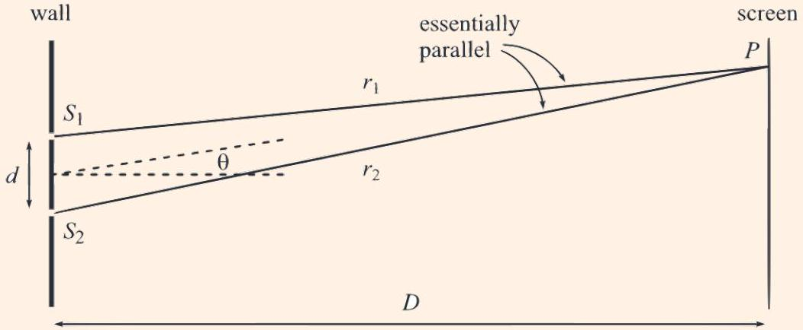
The amplitude of the light on the screen at some height $y$ is

$$
A ( t ) \propto e ^ { i \left( k r _ { 1 } - \omega t \right) } + e ^ { i \left( k r _ { 2 } - \omega t \right) }
$$

where we've switched to complex notation, and the quantities $r _ { 1 }$ and $r _ { 2 }$ depend on $y$. In principle the two terms don't need to have the same magnitude, e.g. if the two slits are not equal in size. Additionally, as you saw in W1, for spherical waves the amplitude actually falls as $1 / r$. However, in the far-field limit we have $r _ { 1 } \approx r _ { 2 }$, so we neglect this effect.

At each point on the screen, the amplitude is some constant times the time-varying phase,

$$
A ( t ) \propto \left( e ^ { i k r _ { 1 } } + e ^ { i k r _ { 2 } } \right) e ^ { - i \omega t } = A _ { 0 } e ^ { - i \omega t } .
$$

The intensity of the light we see at that point is proportional to $\left| A _ { 0 } \right| ^ { 2 }$, using the results about wave energy from W1. Since only the coefficient squared matters, we can factor out a common phase to get

$$
A _ { 0 } \sim e ^ { - i k \Delta r / 2 } + e ^ { i k \Delta r / 2 } , \quad \Delta r = r _ { 2 } - r _ { 1 }
$$

and the intensity is

$$
I \propto \left| A _ { 0 } \right| ^ { 2 } \propto \left| e ^ { - i k \Delta r / 2 } + e ^ { i k \Delta r / 2 } \right| ^ { 2 } = | 2 \cos ( k \Delta r / 2 ) | ^ { 2 } \propto \cos ^ { 2 } ( k \Delta r / 2 ) .
$$

Next, we find the path length difference $\Delta r$. For far-field diffraction, using $D \gg d$,

$$
\Delta r = r _ { 2 } - r _ { 1 } \approx d \sin \theta
$$

where $\theta$ is the angle from the slits to the point on the screen we're looking at. Therefore,

$$
I ( \theta ) \propto \cos ^ { 2 } ( k d ( \sin \theta ) / 2 ) .
$$

This yields a series of bright and dark bands on the screen. Most of the time, we'll only be concerned with the few most central minima and maxima, which for typical parameter values lie at $\theta \ll 1$. Then we may use the small angle approximation $\sin \theta \approx \tan \theta = y / D$, giving

$$
I ( y ) \propto \cos ^ { 2 } \frac { k d y } { 2 D } .
$$

We have a periodic pattern of dark and light fringes. The separation between the minima and between the maxima on the screen is $D \lambda / d$.

The set of approximations made above gives us the theory of far field ("Fraunhofer") diffraction. For example, when we calculated the path length difference, which was of order $d$, we neglected a higher order term of order $d ( d / D )$. This is acceptable as long as this is small compared to the wavelength $\lambda$. Thus, defining the Fresnel number $F = d ^ { 2 } / D \lambda$, we have far field diffraction when $F \ll 1$. For $F \sim 1$ we must use the more complicated near field (Fresnel) diffraction. For $F \gg 1$, the bands get spaced so close together that they end up being washed out, and interference effects stop being visible. Here we just use geometrical optics, as covered in W3.

[1] Problem 1. Sketch the intensity on the screen as a function of $\theta$ if $k d = 8$. What are the bounds on $\theta$ ? How many completely dark points exist?
Solution. The bounds are $- \pi / 2 < \theta < \pi / 2$ and there only exist 2 dark points, as shown.
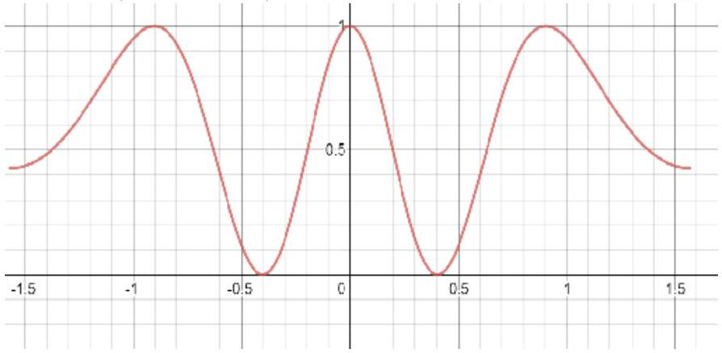
[3] Problem 2. Qualitatively describe how the interference pattern for a double slit changes, in the following cases.
    (a) The slits are brought closer together.
    (b) The light going through the top slit has a small additional phase shift of $\theta$, e.g. because it passes through a piece of glass in the slit.
    (c) The top slit is twice as wide as the bottom slit.
    (d) Coherent white light is passed through the slits.
    (e) A separate laser is aimed at each slit. Assume, somewhat unrealistically, that the lasers have perfectly stable but slightly different frequencies, say $\Delta f = 1 \mathrm {~Hz}$.

Solution. (a) The entire pattern on the screen gets larger. This is a general phenomenon for diffraction: small features at the source turn into large features at the screen.

(b) The interference pattern gets shifted by an angle of $\phi$ such that $\theta = k d \sin \phi$. For small angles, the pattern is just translated on the screen.
(c) We can factor out a common phase to get $A _ { 0 } \sim 2 + e ^ { i k \Delta r }$, and the intensity will vary from $I _ { 0 }$ to $9 I _ { 0 }$ as opposed to the original 0 to $4 I _ { 0 }$ with the same spacing.

(d) The visible spectrum will be dispersed (except at the very center which stays white), with the longer wavelengths (i.e. red) farther away from the center than the corresponding spot for the shorter wavelengths (i.e. violet). So the maxima near the center will look like little rainbows. Higher order maxima will start overlapping each other, making it harder to see interference.
(e) The interference pattern will be seen to be slowly moving. For small angles, it will have a uniform velocity on the screen. As noted in part (b), a phase shift causes an angular shift in the pattern, and the different frequencies will cause a slowly increasing phase difference between the two slits.

[3] Problem 3. USAPhO 1999, problem A3. A triple slit experiment.
[2] Problem 4. A pair of slits is separated by a distance $d _ { 1 }$, and two of these pairs are separated by a larger distance $d _ { 2 }$, so that $d _ { 2 } \gg d _ { 1 } \gg \lambda$. Sketch the intensity pattern on the screen for this four-slit apparatus. (Hint: to avoid a complicated computation, factor the expression for the amplitude.)

Solution. The simplest way to do this is to factor the amplitude,

$$
A \sim 1 + e ^ { i k d _ { 1 } \sin \theta } + e ^ { i k d _ { 2 } \sin \theta } + e ^ { i k \left( d _ { 1 } + d _ { 2 } \right) \sin \theta } = \left( 1 + e ^ { i k d _ { 1 } \sin \theta } \right) \left( 1 + e ^ { i k d _ { 2 } \sin \theta } \right) .
$$

This is the product of the amplitudes of a double slit with separation $d _ { 1 }$ and a double slit with separation $d _ { 2 }$. Therefore, the intensity is just the product of their intensities. Using the small angle approximation, we have many bright and dark bands inside a slowly varying envelope. Similarly, if we had two slits of finite width, we would get a double slit intensity pattern multiplied by a single slit peak.

If you know Fourier transforms, this is just the statement that Fourier transforms swap convolutions (the quadruple slit is the convolution of two double slits) and products (the intensity is the product of their individual intensities).

## Idea 1: Image Sources

Some interference problems have complex arrangements of mirrors and lenses. In these cases, actually computing the path length differences can be a nightmare. For instance, you'd have to account for the detailed shape of every lens. Also, you won't just have to compute the path length, but rather the optical path length, which is the ordinary path length weighted by the index of refraction. This is because the index of refraction affects the wavelength and hence the phase difference.

However, there's a trick which makes everything much simpler: any point image can be treated like its own light source. That means you can compute path length differences by starting from the images, rather than having to go all the way back to the original objects.

For real images, there's a very simple way to see why this works. For instance, consider the setup below, where an object $o$ is focused with a lens to an image $i$.
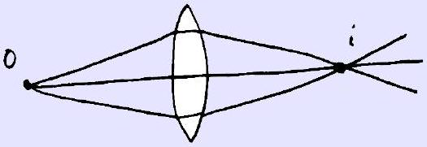

Fermat's principle of least time tells us that all of the paths shown take the same time, and since phases are directly related to time by $\Delta \phi = \omega \Delta t$, it means that all of the rays arrive at the image with the same phase. That means they leave the image with the same phase, so the image can be treated just like a coherent source. (That is, the phase of the light coming from the image doesn't depend on the direction it comes out.) To find the phase of the waves at $i$, you can pick any of the paths, most conveniently the one on the symmetry axis.

We can also consider virtual images, as shown below.
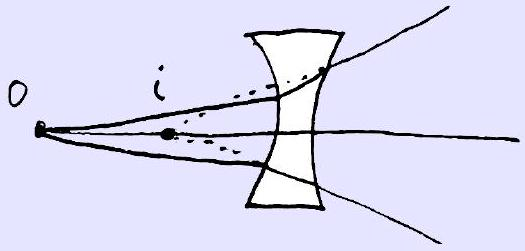
Here, the Fermat's principle argument doesn't work because the rays never actually meet at $i$, but we can use Huygens' principle. The key ideas are that (1) light locally propagates perpendicularly to wavefronts, and (2) the phase on a wavefront is always uniform, by definition. The first point implies the outgoing wavefronts are spheres centered on $i$. The second point implies that the phase only depends on the distance from $i$, so it can again be treated just like a source. In this way, seemingly impossible questions can be solved instantly.

## Example 2: Kalda 17

Consider the optical setup shown below.
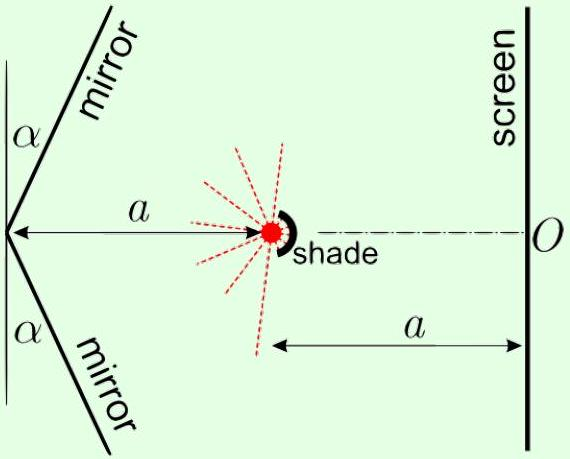
Many light and dark bands appear on the screen, with dark bands separated by distance $d$. Assuming that $\alpha \ll 1$, find the wavelength $\lambda$ of the light.

## Solution

This is actually just a double slit interference problem! Each mirror produces a (virtual) image source reflected behind it, and the pattern on the screen results from the interference between the two image sources, just as if there were two slits at those points.

Specifically, let the light source have coordinates (0, 0), with the screen at $x = a$. Then the

image sources are located at $( - 2 a , \pm 2 \alpha a )$, so we have a double slit setup with sources $4 \alpha a$ apart from each other, a distance $3 a$ from the screen. Using our existing results,

$$
\lambda = ( 4 \alpha a ) \frac { d } { 3 a } = \frac { 4 \alpha d } { 3 } .
$$

Note that reflection from a mirror changes the phase by $\pi$, but that didn't matter in this problem, because both image sources pick up the same phase.
[3] Problem 5. USAPhO 2020, problem B2. A problem on interference with images.

## 2 Thin Film Interference

Idea 2
In general, the phase of a wave is unaffected by reflection from a rarer medium, and flipped by 180° when reflected from a denser medium; here a "denser" medium is defined as one where the wave speed is lower, e.g. one with a higher index of refraction for light. This is analogous to the result for wave reflection in a string derived in $\mathbf { W 1 }$, and is derived starting from Maxwell's equations in E8.

Example 3
Why does a very thin soap film on a wire loop look dark when viewed from above?

Solution
For the soap film, we consider interference between two paths for the light: bouncing off the top surface, or transmitting through and bouncing off the bottom surface. These have almost the same phase from their path length, since the soap film is thin, but the former has an extra 180° phase shift. So the two destructively interfere, making the soap film look dark.

Remark
This is the usual high school textbook analysis, but the real situation is a bit more subtle. First off, there are actually infinitely many possible paths for the light to take, and sometimes many of these paths are important, as you saw in W1 for the Fabry-Perot interferometer for $r \approx 1$. However, the two paths we considered were indeed the most important by far.

Second off, the amplitudes upon reflection and transmission must be computed using the results you found in W1, and generally won't have the same magnitude. This means that generically we don't get complete destructive interference, just a lowered intensity. Finally, these reflection and transmission coefficients will vary significantly with angle according to Fresnel's equations, as shown in E8. We typically ignore this by focusing on normal incidence.

By the way, you might be wondering why we're specializing to thin films; why isn't there thick film interference? Technically there could be interference fringes, but they would be

too close to see even if everything was perfect. And in reality, they would then get blurred together due to imperfections in the surfaces, and the spread of frequencies and incidence directions in the incoming light.
[3] Problem 6. The anti-reflection coating on your glasses consists of a thin layer of material whose index of refraction is between that of air $( n = 1 )$ and glass $( n = 1.5 )$. The coating is designed to eliminate the reflection of green light, $\lambda = 550 \mathrm {~nm}$.
    (a) Accounting for only the two most significant paths for the light, find the minimum possible thickness of the coating, and its index of refraction. (You'll need results for reflection and transmission coefficients from W1 or E8, and a computer to numerically solve an equation.)
    (b) Roughly how much does the next most significant path contribute to the reflected intensity?
Solution. (a) For a general interface, our results in $\mathbf { W 1 }$ for $r$ and $t$ were
$$
r = \frac { v _ { 2 } - v _ { 1 } } { v _ { 1 } + v _ { 2 } } , \quad t = \frac { 2 v _ { 2 } } { v _ { 1 } + v _ { 2 } }
$$
and using $v = c / n$, we have
$$
r = \frac { n _ { 1 } - n _ { 2 } } { n _ { 1 } + n _ { 2 } } , \quad t = \frac { 2 n _ { 1 } } { n _ { 1 } + n _ { 2 } } .
$$
You also derived these results in E8. From that more general derivation, you can see that this only holds if the magnetic permeabilities on both sides are the same, which is indeed an excellent approximation for everyday materials. (The analogous assumption made in the case of a string in $\mathbf { W 1 }$ is that the tension is the same on both sides.)
The two most significant paths are the path with an immediate reflection at the air-coating interface and the path with the only reflection at the coating-glass interface. To eliminate green light, we must arrange for the amplitudes of these paths to be equal, and for their phases to be opposite. For the former, if we let the indices of refraction for air, the coating, and glass be $n _ { a } = 1 , n$, and $n _ { g } = 1.5$ respectively, then we must have
$$
\frac { n _ { a } - n } { n _ { a } + n } = \frac { 2 n _ { a } } { n _ { a } + n } \frac { n - n _ { g } } { n + n _ { g } } \frac { 2 n } { n + n _ { a } } .
$$
Clearing denominators, we have
$$
\left( n ^ { 2 } - n _ { a } ^ { 2 } \right) \left( n + n _ { g } \right) = 4 n \left( n _ { g } - n \right)
$$
and plugging in values and expanding gives
$$
2 n ^ { 3 } + 11 n ^ { 2 } - 14 n - 3 = 0 .
$$
We can solve this numerically to get $n = 1.22$.
Now let's find the thickness $\ell$. Both reflections are at hard boundaries (low to high indices of refraction), so the same $\pi$ shift is applied to both paths. The geometric path length difference is then $2 \ell$, so destructive interference for the lowest possible $\ell$ occurs when
$$
\ell = \frac { \lambda } { 4 n } = 113 \mathrm {~nm} .
$$

(b) The next most significant path has 3 reflections and 2 transmissions, so its amplitude is
$$
A = \frac { 2 n _ { a } } { n _ { a } + n } \frac { n - n _ { g } } { n + n _ { g } } \frac { n - n _ { a } } { n + n _ { a } } \frac { n - n _ { g } } { n + n _ { g } } \frac { 2 n } { n _ { a } + n }
$$
and the numerical value, using our previous answer, is $A _ { 3 } \approx 0.001$, which is the portion of the original amplitude reflected. Thus, the intensity is reduced by a factor of $10 ^ { - 6 }$.
[2] Problem 7 (NBPhO 2004). A thick glass plate is coated by a thin transparent film. The emission spectrum of the system at normal incidence is as shown.
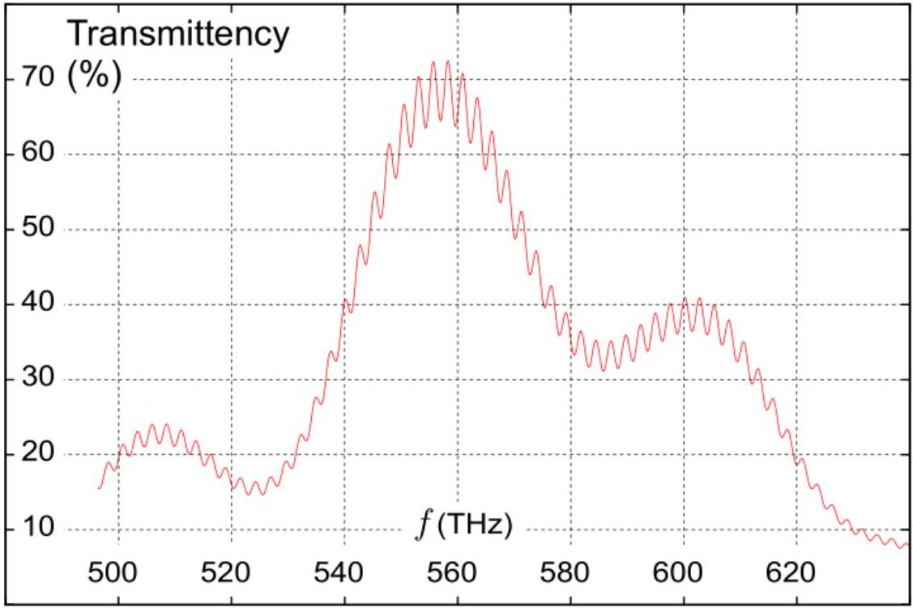
The refractive index of the film is $n = 1.3$. Find the thickness of the film.
[2] Problem 8. Newton's rings are an interference pattern formed when a lens is placed on a flat glass surface and illuminated from above by light of wavelength $\lambda$. For concreteness, suppose the side of the lens touching the surface is spherical, with radius of curvature $R$. When viewed from above, one sees an interference pattern with circular fringes.

The most important reflection paths are (1) reflection off the top surface of the lens, (2) reflection off the bottom surface of the lens, and (3) reflection off the flat surface. However, the first reflection path has a very different path length from the other two, which means it won't give rise to visible interference fringes, as explained in the remark above. Instead, the first reflection path just adds some background intensity everywhere, preventing the dark fringes from being perfectly dark. Thus, in this problem we'll only consider the second and third paths.
    (a) Explain why the center of the pattern is dark.

(b) Find the radii of the bright and dark fringes, i.e. the values of $r$ where there is a local minimum or maximum of the intensity. For simplicity, assume $r \ll R$.

Solution. (a) Consider light that comes in very close to the center. Then paths (2) and (3) have almost the same path length, but path (2) has reflection from glass to air, which comes with no phase shift, and path (3) has reflection from air to glass, which comes with a $\pi$ phase shift. Therefore, the paths destructively interfere, and the center is dark.

(b) Since $r \ll R$, we can approximate the light as going straight up and down. Putting the origin at the place the lens and flat surface touch, the equation of the lens's curved surface is
$$
r ^ { 2 } + ( y - R ) ^ { 2 } = R ^ { 2 }
$$
where $r$ is the distance from the axis of symmetry. We thus have
$$
r ^ { 2 } = 2 y R - y ^ { 2 } .
$$
We know that $r \ll R$, so for the left-hand side to match the right-hand side, we must have $y \ll R$, which in turn implies the $y ^ { 2 }$ term is negligible. Dropping it gives
$$
y \approx \frac { r ^ { 2 } } { 2 R }
$$
The path length difference is $2 y$, and we have an extra $\pi$ phase shift as explained in part (a), so the condition for destructive interference is
$$
\frac { r ^ { 2 } } { R } = n \lambda , \quad r = \sqrt { n \lambda R }
$$
while the condition for constructive interference is
$$
\frac { r ^ { 2 } } { R } = ( n + 1 / 2 ) \lambda , \quad r = \sqrt { ( n + 1 / 2 ) \lambda R } .
$$
This is a practical way to quickly check how spherical a lens really is.

[3] Problem 9 (Kalda). A hall of a contemporary art installation has white walls and a white ceiling, lit with a monochromatic green light of wavelength $\lambda = 550 \mathrm {~nm}$. The floor of the hall is made of flat transparent glass plates. The lower surfaces of the glass plates are matte and painted black; the upper surfaces are polished and covered with thin transparent film. A visitor standing in the room will see circular concentric bright and dark strips on the floor, centered around himself. A curious visitor observes that the stripe pattern depends on their height, and upon lowering themselves, sees a maximum of 20 stripes. The film's index of refraction is 1.4 and the glass's is 1.6. Determine the thickness of the film.

Solution. Both rays will bounce off a hard surface, so the phase shift due to that will be ignored. All that will be considered is the difference in optical path lengths.

Note that $\sin \alpha = n \sin \beta$. For the immediately reflected ray, it will travel through $L _ { 1 } = w \sin \alpha$, and $\tan \beta = ( w / 2 ) / t$, so $L _ { 1 } = 2 t \tan \beta \sin \alpha$. For the ray that goes through the film, it will travel by $L _ { 2 } = 2 n t / \cos \beta$ where $n = 1.4$, so the path length difference is

$$
\Delta L = \frac { 2 n t } { \cos \beta } - \frac { 2 t \sin \beta \sin \alpha } { \cos \beta } = 2 n t \frac { 1 - \sin ^ { 2 } \beta } { \sqrt { 1 - \sin ^ { 2 } \beta } } = 2 t \sqrt { n ^ { 2 } - ( n \sin \beta ) ^ { 2 } } = 2 t \sqrt { n ^ { 2 } - \sin ^ { 2 } \alpha } .
$$

So $\Delta L$ ranges from $2 t n$ to $2 t \sqrt { n ^ { 2 } - 1 }$. Constructive interference is where $\Delta L = \lambda k$ with $k$ as an integer. Thus for this situation, there are 20 values of $\lambda k$ that fit between $2 t \sqrt { n ^ { 2 } - 1 }$ and $2 t n$, thus $2 t n - 2 t \sqrt { n ^ { 2 } - 1 } \approx 20 \lambda$, giving

$$
t \approx \frac { 20 \text { 人 } } { 2 \left( n - \sqrt { n ^ { 2 } - 1 } \right) } \approx 13 \mu \mathrm {~m} .
$$

## 3 Diffraction

Next, we turn to diffraction.
Example 4
Find the interference pattern of a diffraction grating, a set of $N$ identical slits in a row, each separated by a distance $d$.

Solution
Defining $\Delta r = d \sin \theta$ as before, the amplitude is

$$
A \sim 1 + e ^ { i k \Delta r } + e ^ { 2 i k \Delta r } + \ldots + e ^ { ( N - 1 ) i k \Delta r } = \frac { e ^ { i k N \Delta r } - 1 } { e ^ { i k \Delta r } - 1 } .
$$

Factoring out a common phase, we have

$$
A \sim \frac { e ^ { i k N \Delta r / 2 } - e ^ { - i k N \Delta r / 2 } } { e ^ { i k \Delta r / 2 } - e ^ { - i k \Delta r / 2 } } = \frac { \sin ( N k \Delta r / 2 ) } { \sin ( k \Delta r / 2 ) }
$$

so the intensity is

$$
I \propto \frac { \sin ^ { 2 } ( N k \Delta r / 2 ) } { \sin ^ { 2 } ( k \Delta r / 2 ) } .
$$

The normalized intensity is plotted below as a function of $\theta$.
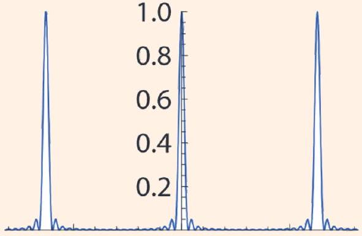
The numerator yields rapid oscillations which aren't very visible; their envelope is given by the slow oscillations in the denominator. These slow oscillations are the ones we care about; they are the diffraction peaks and occur when

$$
\frac { k \Delta r } { 2 } = n \pi , \quad d \sin \theta = \frac { 2 \pi n } { k } = n \lambda , \quad n \in \mathbb { Z } .
$$

This is intuitive, because at the maxima, the contributions from each slit are in phase, as the path length difference between adjacent slits is a multiple of $\lambda$.
[3] Problem 10. For practical applications of diffraction gratings, we usually focus on the intensity maxima. However, around each maximum there are also secondary maxima.

(a) Argue that the first minimum occurs when there is a phase difference of $2 \pi / N$ between adjacent slits, then compute its angle. This is easiest to see using phasors, i.e. by drawing the individual terms in the amplitude $A$ as vectors in the complex plane.
(b) Show that each secondary maximum is half as wide as the central maximum.
(c) Let the intensity at the central maximum be $I _ { 0 }$. Assuming $N \gg 1$, use phasors to show that the intensity at the $k ^ { \text {th } }$ adjacent secondary maximum is roughly $I _ { 0 } / \left( ( k + 1 / 2 ) ^ { 2 } \pi ^ { 2 } \right)$.

This final result shows that in general, the secondary maxima are much dimmer, and can be neglected; we will ignore them for almost all problems below.

Solution. (a) When the phase difference is $2 \pi / N$ between slits, the phasors sum to zero.

Hence the cumulative phase difference across the whole grating should be $2 \pi$, so

$$
N d \sin \theta = \lambda .
$$

(b) As seen in the formula, we get minima when $N k \Delta r / 2 = \pi n$, so the intensity minima are regularly spaced, except at the primary maxima when $k \Delta r / 2 = \pi n$. Since at the central maximum, the minimum that would be there was replaced with a peak, the distance between adjacent minima becomes twice as large as the distance between the other adjacent minima.

(c) Since every phasor is rotated by the same amount relative to the one before it, and with $N \gg 1$, the phasors form a circular arc in the complex plane. For the secondary maxima, at least one full circle will be formed, and the maximum amplitude is approximately reached when the end point of the arc and the origin form the diameter of the circle. That diameter will be the approximate amplitude of the secondary maximum.
If the total length of the phasors is $A _ { 0 }$, then for the $k ^ { \text {th } }$ secondary maxima, $k + \frac { 1 } { 2 }$ circles will be formed, so that the diameter $A$ of the circle satisfies
$$
\pi A ( k + 1 / 2 ) \approx A _ { 0 } .
$$
Since $I \sim A ^ { 2 }$, we get
$$
I \approx \frac { I _ { 0 } } { ( k + 1 / 2 ) ^ { 2 } \pi ^ { 2 } }
$$

Example 5
Use the previous example to get the interference pattern for a single wide slit of width $a$.

Solution
We can think of a single slit as the limit of a diffraction grating with $N d = a$, where $N \rightarrow \infty$ and $d \rightarrow 0$. Taking these two limits simultaneously is a bit delicate. Starting with our previous result

$$
A \sim \frac { \sin ( N k d \sin \theta / 2 ) } { \sin ( k d \sin \theta / 2 ) }
$$

we may substitute $N d = a$ in the numerator. Only $d$ remains in the denominator, so the $d \rightarrow 0$ limit allows us to use the small angle approximation. We thus have

$$
A \sim \frac { \sin ( k a \sin \theta / 2 ) } { k d \sin \theta / 2 } .
$$

But as $d \rightarrow 0$ the expression blows up, because we're taking the number of slits to infinity while keeping the amplitude from each slit constant. To get a consistent limit, we normalize by dividing the amplitude by $N$, giving $N d = a$ in the denominator for

$$
A \sim \frac { \sin \beta } { \beta } \quad \beta = \frac { k a \sin \theta } { 2 }
$$

The amplitude is proportional to the sinc function, shown below.

What we're really doing here is zooming in on the central maximum of the diffraction grating; the other maxima have been removed by sending the slit spacing to zero.

Remark: Uncertainty Principle
There's a neat way to rephrase our results. In the far field limit and small angle approximation, an opening at height $z$ gives a wave with amplitude $e ^ { i ( k / D ) y z }$ at height $y$ on the screen. If we think of a "slit function" $f ( z )$ which is equal to one at holes and zero elsewhere, then the amplitude $A ( y )$ at the screen is simply the Fourier transform of $f ( z )$ ! Phasors are just a visual way to compute the Fourier transform.

We won't use this language explicitly below, but it can add some intuition if you know it. For example, we know from W1 that the products of the widths of any function and its Fourier transform are bounded. For example, a wavepacket of width $\Delta x$ with Fourier components of width $\Delta k$ obeys $\Delta x \Delta k \gtrsim 1$.

In this case, the Fourier pair is screen height $y$ and the scaled slit height $( k / D ) z$. (Don't get confused with the notation here; now $k$ is fixed while $z$ varies.) Hence the uncertainty principle says

$$
\Delta y \Delta z \gtrsim \frac { D } { k } \sim D \lambda
$$

which you can check holds for all the examples we've seen so far. The uncertainty principle provides a simple explanation for why making the slits narrower makes the pattern wider.

In fact, this is equivalent to the Heisenberg uncertainty relation $\Delta y \Delta p _ { y } \gtrsim \hbar$ for photons passing through the slit, as you can verify. This makes sense, as we should be able to calculate the diffraction pattern in terms of either the whole light wave, or in terms of what happens to each of the photons in the light wave.

Remark
If we take the limit $a \rightarrow \infty$ for the single slit, the central maximum becomes an infinitely sharp, bright point. But in reality, a light will just uniformly illuminate the screen.

The problem is that when $a$ gets too high, the approximations of Fraunhofer diffraction break down, and we must switch to Fresnel diffraction. Fresnel diffraction augments Fraunhofer diffraction with two additional effects.

1. The amplitude of each wavelet falls off as $1 / r$.
2. The amplitude of each wavelet is proportional to the "obliquity factor" $( 1 + \cos \theta ) / 2$, where $\theta$ is the angle from its original forward direction of propagation. (Strictly speaking, this factor appears in Fraunhofer diffraction too, but in that case it's not too important, because all the wavelets that reach a given point of the screen have about the same $\theta$.)

Both effects matter, but it suffices to consider the first to fix the problem. This amplitude falloff implies that in the case $a \gg D$, the illumination at each point on the screen mostly comes from points on the slit within a distance $D$, not from the entire slit. Since every point on the screen can see such a range of points, the screen is uniformly illuminated.

For points on the screen near the edge of the slit, there is a gradual shadow, along with some interference bands from "edge diffraction". In the limit $D \gg \lambda$ these residual diffraction peaks get very close and blur together, leaving only a smooth shadow. This is just as expected, as in this case we have $F \gg 1$ and geometrical optics should apply.

For a derivation of Fresnel diffraction starting from the wave equation, see section 10.4 of Hecht. Incidentally, Fresnel diffraction came first historically, since reaching the simpler Fraunhofer regime $F \ll 1$ requires manufacturing tiny optical instruments. This is yet another example of how the textbook treatment we enjoy today is easier. We can start with the simple case, but the pioneers had to get it all right at once.

## Remark: Interference vs. Diffraction

Interference is the name for the fact that when waves superpose, their energy doesn't just add; it can become larger than the sum (constructive interference) or smaller (destructive interference). Diffraction is the name for the fact that waves do not need to keep going in a straight line when they hit an obstacle.

What's confusing is that double slit "interference", single slit "diffraction", and a many-slit "diffraction" grating all involve both interference and diffraction. Why is it called diffraction when there are one or many holes, but not when there's two? I was very confused about this in high school, but I'm pretty sure there is no difference; it's just historical convention. (However, one pattern is that things that have maxima at larger angles tend to be called "diffraction", because it's more apparent that the direction of the light has been changed.)
[2] Problem 11. Comparing the single and double slit.

(a) Show that the minima for the single slit occur when
$$
a \sin \theta = n \lambda , \quad n \neq 0 .
$$
(b) Note that this looks almost identical to the result for the maxima of a double slit with separation $a$. Explain the difference using phasors.
(c) In our analysis of the double slit, we didn't account for the small but nonzero width of each slit. Using the idea of problem 4, sketch the diffraction pattern accounting for this.

For tips on accurately measuring diffraction patterns, see the handout on experimental methods.
Solution. (a) Using the formula derived above, the minima occur when $k a \sin \theta / 2 = \pi n$, and with $k = 2 \pi / \lambda$, this immediately yields $a \sin \theta = n \lambda , n \neq 0$.

(b) For the double slit, when $d \sin \theta = n \lambda$, there are only 2 phasors, which point in the same direction. In a single slit with width $a$, we're summing infinitesimal phasors that form a circle arc. Since the points in the single slit that provide the first and last phasors are separated by a distance $a$, that indicates that when $a \sin \theta = n \lambda$, the first and last phasors point in the same direction. That means that the phasors went in a full circle (or multiple), so the net amplitude is zero.

(c) Since the slits are small, by the idea of problem 4, we should multiply a double slit intensity pattern with a much wider single slit intensity pattern, giving the following result.

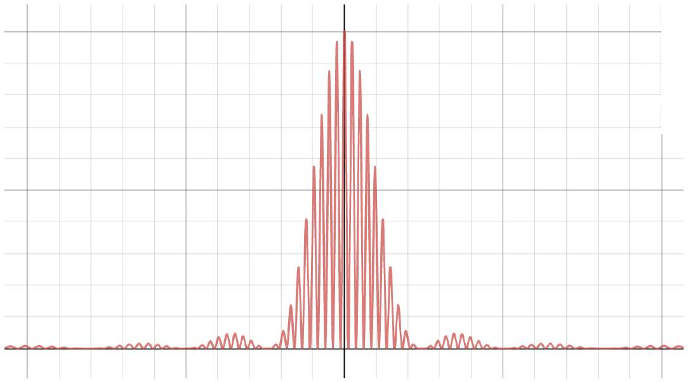

[3] Problem 12 (MPPP 123). Some imperfect diffraction gratings. For this problem, you can ignore secondary maxima. Use the small angle approximation throughout, and neglect any diffraction effects from the finite widths of the slits.
    (a) In an imperfect diffraction grating, the slits have equal widths, but the distances between the slits are alternately $d$ and $3 d$. Sketch the resulting diffraction pattern, indicating the relative heights of the maxima.
    (b) In another imperfect diffraction grating, the slits are evenly spaced, but their widths are alternatively $a$ and $b$, where $a \approx b$. Sketch the resulting diffraction pattern, indicating the relative heights of the maxima.

It may be useful to refer to problem 4.
Solution. (a) By blocking every other slit, we can see that this pattern is the sum of two gratings with spacing $4 d$ and a displacement of $d$. Thus we can add the amplitudes of what we would get with a grating of spacing $4 d$,

$$
A \sim \frac { \sin ( N k ( 4 d \sin \theta ) / 2 ) } { \sin ( k ( 4 d \sin \theta ) / 2 ) } ,
$$

except one of them has a phase shift of $e ^ { i k d \sin \theta }$. This results in a net amplitude of $A \left( 1 + e ^ { i k d \sin \theta } \right)$. Factoring out a common factor and squaring the amplitude gets

$$
I \propto \frac { \sin ^ { 2 } ( 2 N k d \sin \theta ) } { \sin ^ { 2 } ( 2 k d \sin \theta ) } \cos ^ { 2 } ( k d \sin \theta / 2 ) .
$$

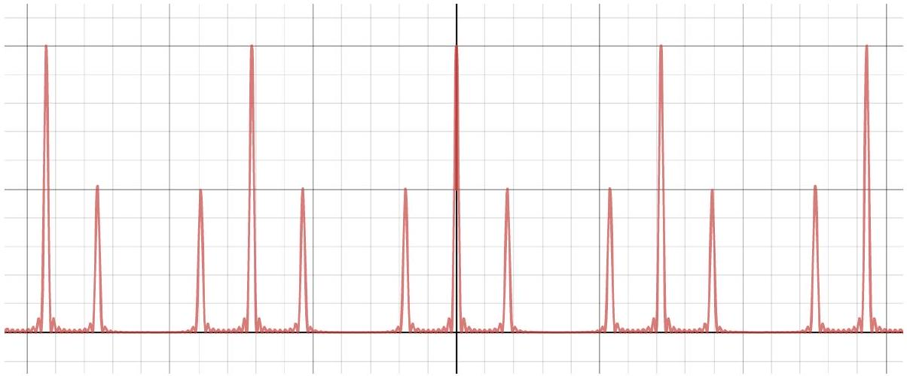

(b) Without loss of generality, we can assume that $a > b$. Then the pattern is the sum of a grating with spacing $d$ and slit width $b$, and a grating with spacing $2 d$ and slit width $a - b$. Since the amplitude of the second component is much smaller, the overall pattern looks like a diffraction grating with spacing $d$ and peaks with intensity proportional to $( a + b ) ^ { 2 }$, except there will be a small peak with intensity $( a - b ) ^ { 2 }$ in between the primary peaks instead of a minimum.

## 4 Higher Dimensions

In these problems we tackle interference and diffraction effects in more than one dimension, which can be used to infer the structure of molecules and crystals.

Idea 3
We've shown that for a thin slit of length $a$, the central maximum is a band, bounded by minima at $\theta = \pm \lambda / a$. If we instead had a circular slit of diameter $d$, the central maximum is a circle, bounded by minima at $\theta \approx 1.22 \lambda / d$. The radii of the higher-order minima then get closer and closer spaced as one moves outward. The resulting pattern is called an Airy disc.
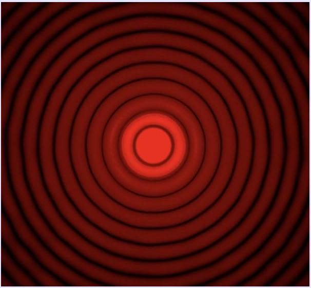
You can straightforwardly write down an integral that gives the intensity $I ( r )$, but the integral can only be performed in terms of special functions, called Bessel functions.

## Idea 4: Babinet's Principle

Consider all of the rays $R$ that strike a point $P$ on the screen. If the intensity at $P$ is zero, then the rays must completely destructively interfere. That means that if we split $R$ into two sets of rays $R _ { 1 }$ and $R _ { 2 }$ in any way, then the amplitudes due to the rays $R _ { 1 }$ and the rays $R _ { 2 }$ must be equal and opposite, which means either set of rays alone would produce the same intensity at $P$. This is Babinet's principle.

As a concrete example, consider shining a laser pointer at a wall. There will be a bright spot on the wall at the exact location the laser hits, and darkness everywhere else. Consider some dark point $P$. If we had instead passed the laser through two slits, we would only get the rays $R _ { 1 }$ going through the slits, and we would generally get some nonzero intensity at $P$, due to the double slit interference pattern. Babinet's principle tells us we would get the exact same intensity at $P$ if we put two slit-shaped obstacles in the way, because then we would get precisely the rays $R _ { 2 }$ which don't hit the slits. In other words, the diffraction pattern from an obstacle is precisely the same as the diffraction pattern from a complementary slit.

## Example 6: BPhO 2016.5

When a laser pointer hits a spring, the following pattern is produced on a screen behind it.
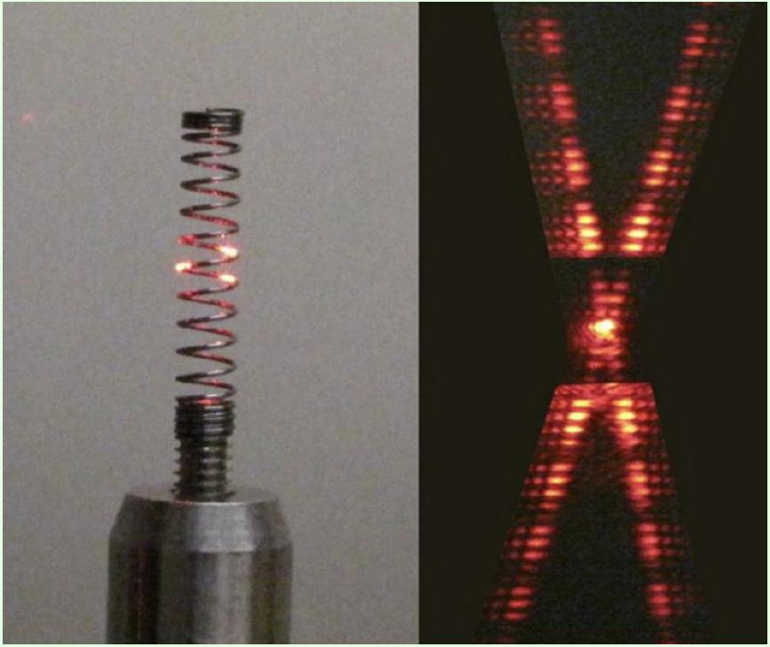
Explain why this happens, and what we can learn about the spring.

## Solution

If we look at the spring along the direction the laser pointer is going, it's essentially two sets of obstructions, one going up and to the right (the front of the spring, in the picture), and one going up and to the left (the back of the spring). By Babinet's principle, the resulting diffraction pattern should be the same as if we had two sets of openings instead. Thus, we expect to see two independent diffraction patterns, one due to each of these obstructions. The angle between these two patterns is twice the angle that the spiral path of the spring

makes with the horizontal.

Now focus on one interference pattern. By Babinet's principle, it's basically a single slit pattern, which is indeed what we see. However, from the reflection of the laser in the picture, we see that the laser beam is wide enough to hit two separate turns of the spring. The result is a double slit pattern multiplied by a single slit pattern, where the latter yields a minimum at approximately every 5 double slit minima. The spacing between the single slit minima tells us the thickness of the wire, and the spacing between the double slit minima tells us the spacing between the turns in the spring. Combining this with what we know about the angle of the spring tells us about the radius of the spring. Thus, we can figure out essentially everything about its 3D shape.

You can see many of the same features in the original X-ray diffraction pattern of DNA, shown below, which was used to discover its double helix structure.
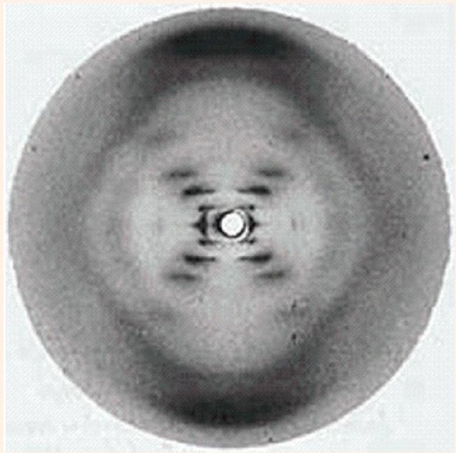

## Example 7: MPPP 125

An opaque sheet is perforated by many small holes arranged in a square grid of side length $d$. It is illuminated by light of wavelength $\lambda$, and a screen lies a distance $D$ behind it.
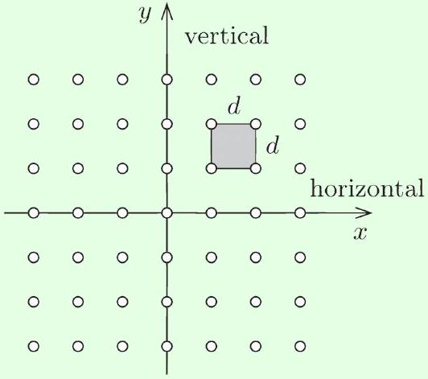
Assuming $D \gg d \gg \lambda$, find the locations of the primary diffraction maxima on the screen.

Solution
Let $( x , y )$ denote coordinates on the sheet, and $\left( x ^ { \prime } , y ^ { \prime } \right)$ denote coordinates on the screen, with the same center. When we considered one-dimensional diffraction gratings, we found that light which originates from $y$ and hits point $y ^ { \prime }$ on the screen has a path length difference $y y ^ { \prime } / D$ relative to light that came from point $y = 0$. A similar argument shows light which comes from $( x , y )$ and hits $\left( x ^ { \prime } , y ^ { \prime } \right)$ gets a path length difference

$$
\Delta \ell = \frac { x x ^ { \prime } + y y ^ { \prime } } { D }
$$

relative to light coming from $x = y = 0$.
For a square grid, $( x , y ) = ( n d , m d )$ for integers $n$ and $m$, giving a path length difference

$$
\Delta \ell _ { n , m } = \frac { d } { D } \left( n x ^ { \prime } + m y ^ { \prime } \right) .
$$

We get a diffraction maximum at $\left( x ^ { \prime } , y ^ { \prime } \right)$ when the light from each hole arrives in phase, which means this quantity must be a multiple of $\lambda$ for all $n$ and $m$. This occurs precisely when

$$
x ^ { \prime } = \frac { \lambda D } { d } n ^ { \prime } , \quad y ^ { \prime } = \frac { \lambda D } { d } m ^ { \prime }
$$

for integers $n ^ { \prime }$ and $m ^ { \prime }$. That is, the diffraction maxima also form a square grid of side length $\lambda D / d$. Notice again that the diffraction pattern is "inverse" to the pattern on the sheet. It gets bigger when the sheet gets smaller; for instance, if the sheet is compressed horizontally, the maxima on the screen are stretched horizontally.

[3] Problem 13 (MPPP 126). Continuing on the previous example, suppose the holes are instead arranged in a triangular grid with side length $d$.
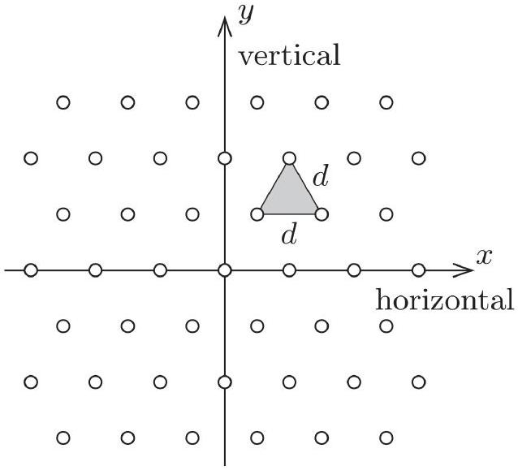
Find the primary diffraction maxima on the screen. What kind of grid do they form?
Solution. Note that the points on a triangular grid can be written as
$$
( x , y ) = n \mathbf { r } _ { 1 } + m \mathbf { r } _ { 2 }
$$
where the "lattice basis vectors" are
$$
\mathbf { r } _ { 1 } = ( d , 0 ) , \quad \mathbf { r } _ { 2 } = ( d / 2 , \sqrt { 3 } d / 2 ) .
$$

Again, we need to find the points $\left( x ^ { \prime } , y ^ { \prime } \right)$ on the screen where the light from all holes arrives in phase. This is a bit less obvious than in the above example, so let's think about it more systematically. First, we can find a peak $\left( x ^ { \prime } , y ^ { \prime } \right) = \mathbf { r } _ { 1 } ^ { \prime }$ where changing $n$ by one changes the path length by $\lambda$, and changing $m$ by one doesn't change the path length at all. Similarly, we can find a peak $\left( x ^ { \prime } , y ^ { \prime } \right) = \mathbf { r } _ { 2 } ^ { \prime }$ where changing $m$ by one changes the path length by $\lambda$, while changing $n$ by one doesn't change the path length. The general solution will then take the form

$$
\mathbf { r } ^ { \prime } = n ^ { \prime } \mathbf { r } _ { 1 } ^ { \prime } + m ^ { \prime } \mathbf { r } _ { 2 } ^ { \prime }
$$

for integers $n ^ { \prime }$ and $m ^ { \prime }$, where $\mathbf { r } _ { 1 } ^ { \prime }$ and $\mathbf { r } _ { 2 } ^ { \prime }$ are called the "reciprocal lattice" basis vectors.
In equations, the criterion we have stated above are

$$
\mathbf { r } _ { 1 } ^ { \prime } \cdot \mathbf { r } _ { 1 } = \lambda D , \quad \mathbf { r } _ { 1 } ^ { \prime } \cdot \mathbf { r } _ { 2 } = 0 , \quad \mathbf { r } _ { 2 } ^ { \prime } \cdot \mathbf { r } _ { 1 } = 0 , \quad \mathbf { r } _ { 2 } ^ { \prime } \cdot \mathbf { r } _ { 2 } = \lambda D .
$$

Plugging in the lattice basis vectors and solving the equations gives

$$
\mathbf { r } _ { 1 } ^ { \prime } = \frac { \lambda D } { d } \left( 1 , - \frac { 1 } { \sqrt { 3 } } \right) , \quad \mathbf { r } _ { 2 } ^ { \prime } = \frac { \lambda D } { d } \left( 0 , \frac { 2 } { \sqrt { 3 } } \right) .
$$

In other words, the diffraction maxima also form a triangular grid, but the side length is $( 2 / \sqrt { 3 } ) ( \lambda D / d )$, and the whole thing is rotated by 90°.
[3] Problem 14. AuPhO 2015, problem 14. Instructive examples of higher-dimensional diffraction patterns. You'll need the diagrams in the accompanying answer sheets.

For a much harder multi-dimensional diffraction problem, beyond the scope of the Olympiad, see Physics Cup 2019, problem 5.

## 5 Technological Applications

Example 8
Gratings split light into its components. If a grating can just resolve the two wavelengths $\lambda$ and $\lambda + \Delta \lambda$, its resolving power is $R = \lambda / \Delta \lambda$. Compute the resolving power of a diffraction grating with $N$ slits at the $n ^ { \text {th } }$ order maximum.

Solution
Conventionally, we say that two diffraction peaks are distinguishable if the maximum of one falls outside the first minimum of the other. We know the $n ^ { \text {th } }$ order maximum for wavelength $\lambda$ occurs when $d \sin \theta = n \lambda$, as here the path length difference between adjacent slits is $n \lambda$. Furthermore, the first minimum around this maximum occurs when there is an extra net path length difference of $\lambda$ across the entire diffraction grating, i.e. when

$$
N d \sin \theta = N n \lambda + \lambda .
$$

Setting the value of $\sin \theta$ equal to that for wavelength $\lambda + \Delta \lambda$, we see that we can just resolve these two wavelengths if

$$
\frac { n ( \lambda + \Delta \lambda ) } { d } = \frac { ( N n + 1 ) \lambda } { N d } , \quad R = \frac { \lambda } { \Delta \lambda } = N n .
$$

Note that the resolving power is also the number of wavelengths by which the longest and shortest possible paths to the diffraction maximum differ (i.e. the paths through the very top and very bottom slits). The fact that a larger distance may be used to resolve smaller wavelength differences is another manifestation of the uncertainty principle.

[2] Problem 15. Many common diffraction gratings reflect light rather than transmitting it.

(a) We may crudely model a reflective diffraction grating as a mirror with $N$ small notches, spaced a distance $d$ apart. The notches do not reflect light, but the rest of the mirror serves as a source of Huygens wavelets when light is incident on the grating. Show that, unlike the transmission gratings we considered above, the zeroth order maximum of a reflective grating is much brighter than the others.
(b) This feature is undesirable because the zeroth order maximum is useless for distinguishing different wavelengths. Instead, most modern diffraction gratings are blazed, as shown.

For concreteness, suppose that light is incident straight downward. How should the blaze angle $\gamma$ be chosen so that the $n ^ { \text {th } }$ order maximum is the brightest?

Reflective diffraction gratings are more flexible and more common than transmission gratings. (CDs, DVDs, and "holographic" trading cards and stickers all use reflective diffraction gratings, and you can even make them on chocolate.) Textbooks focus on transmission gratings largely because they make the diagrams a little cleaner.

Solution. (a) This is like single slit diffraction: the angle $\theta = 0$ is the only one where all the Huygens wavelets are automatically in phase, so the maximum in that direction is much brighter than the rest. This corresponds to ordinary, specular reflection.

(b) In this case, the direction of specular reflection is at $\theta = 2 \gamma$. To check this explicitly, note that the path length difference between two points on the same slanted section, separated by a vertical distance $h$, is
$$
h \frac { \sin ( \theta - \gamma ) } { \cos ( \gamma ) } - h \tan ( \gamma )
$$
which indeed vanishes for $\theta = 2 \gamma$.
On the other hand, we also know that the $n ^ { \text {th } }$ order maximum occurs at $d \sin \theta = n \lambda$, so combining our results gives
$$
\gamma = \frac { 1 } { 2 } \arcsin ( n \lambda / d ) .
$$
[2] Problem 16 (PPP 127). When a particular line spectrum is examined using a diffraction grating with 300 lines $/ \mathrm { mm }$ with the light at normal incidence, it is found that a line at $24.46 ^ { \circ }$ contains both red (640-750 nm) and blue/violet (360-490 nm) components. Are there any other angles at which the same would be observed?
Solution. The lines are at $d \sin \theta = n \lambda$ with $d = ( 1 / 300 ) \mathrm { mm }$. This results in $n \lambda = 1380 \mathrm {~nm}$, and $n$ must be an integer. Now, integer values of $n$ are guessed and the values of $\lambda$ that fit in the specified wavelength ranges are $n _ { R } = 2 , \lambda _ { R } = 690 \mathrm {~nm}$ and $n _ { B } = 3 , \lambda _ { B } = 460 \mathrm {~nm}$.

Since the maximum value of $n \lambda$ is $d = 3333 \mathrm {~nm}$, the only other possible value of $d \sin \theta = n _ { R } \lambda _ { R } =$ $n _ { B } \lambda _ { B }$ is when $n _ { R } = 4$ and $n _ { B } = 6$, corresponding to $d \sin \theta = 2 \times 1380$. This gives $\theta = 55.9 ^ { \circ }$. Larger values of $n _ { R }$ and $n _ { B }$ would give no solution for $\theta$.
[3] Problem 17. Diffraction limits the resolution of optical instruments.

(a) Suppose that light of wavelength $\lambda$ enters through an aperture of width $D$. As a result, the light diffracts, which causes the angle of the light's propagation to pick up an additional spread of order $\theta$. Estimate $\theta$.
(b) The diameter of a human pupil is about 3 mm . Estimate the size of the smallest text that a human being could read from 5 m away.
(c) A typical amateur telescope has an aperture of order 10 cm. The Sun has a radius of $7 \times 10 ^ { 8 } \mathrm {~m}$. Estimate the furthest possible distance, in light years, that such a telescope could resolve a Sun-sized star. (Stars further away than this will just show up as blurry points.)

Solution. (a) Whenever diffraction occurs, it creates an angular spread of order $\theta \sim \lambda / D$. For example, the angular width of the central maximum for diffraction through a circular aperture is $\sin ^ { - 1 } ( 1.22 \lambda / D )$, as noted earlier.

(b) For concreteness, taking $\lambda = 500 \mathrm {~nm}$, the formula above gives an angular spread of $\theta \sim$ $1.7 \times 10 ^ { - 4 } \mathrm { rad }$. At a distance of 5 m, this corresponds to a distance of $\sim 1 \mathrm {~mm}$, so a letter smaller than this will just get blurred into a single blob.
And indeed, the letters on the bottom row of a standard eye chart are about 4 mm tall. Of course, most people can't see this well, but that's a consequence of geometric optics (i.e. the eye not focusing light optimally) rather than diffraction.
(c) Repeating the reasoning of part (b) yields a distance of around 0.02 ly, so no stars can be resolved by such a telescope at all. Even the biggest optical telescopes ever built can resolve essentially no stars.

Remark
The diffraction limit described in problem 17 motivates astronomers to build ever larger telescopes. The largest examples are radio telescopes, such as the Arecibo observatory that collapsed in 2020, though their resolution is not better than optical telescopes, since the wavelength of radio waves is much longer.

However, the telescope doesn't have to be one big piece. Two telescopes can effectively be combined into a single telescope whose radius, for the purposes of the diffraction limit, is the distance between the telescopes. This is possible as long as one can add together the time-dependent amplitudes they see.

This technique is routinely used in radio telescope arrays, such as the Very Large Array. The Event Horizon Telescope was able to resolve a black hole $5 \times 10 ^ { 7 }$ ly away because it combined radio telescopes spaced around the entire Earth. Some astronomers are presently excited about the incredibly resolutions that could be achieved by combining optical telescopes, though realizing this would require extremely good timing precision.

Example 9
How close does a Sun-like star have to be in order to see it with the naked eye in daylight?

Solution
Let the distance to the Sun be $d$, and the distance to the star be $D$. Then the ratio of intensities of the two is naively

$$
\frac { I _ { \mathrm { star } } } { I _ { \mathrm { Sun } } } = \left( \frac { d } { D } \right) ^ { 2 } .
$$

This suggests the star is hard to see if $D > d$, which is always true. But this is too pessimistic, because the light from the Sun comes from all directions in the sky, while the light from the star comes from only a single direction. The actual ratio we want to calculate is

$$
\frac { I _ { \mathrm { star } } / \Omega _ { \mathrm { star } } } { I _ { \mathrm { Sun } } / 2 \pi } = \left( \frac { d } { D } \right) ^ { 2 } \frac { 2 \pi } { \Omega _ { \mathrm { star } } }
$$

where $\Omega _ { \text {star } }$ is the apparent solid angle of the star in the sky.
This in turn is given by the diffraction limit: if your pupils have radius $r$, then

$$
\Omega _ { \mathrm { star } } \sim ( \Delta \theta ) ^ { 2 } \sim ( \lambda / r ) ^ { 2 } .
$$

The star should be visible above daylight if the ratio above is at least one or so, which means the maximum distance is

$$
D \sim \frac { r } { \lambda } d \sim \frac { 1.5 \mathrm {~mm} } { 600 \mathrm {~nm} } ( 1 \mathrm { AU } ) \sim 5 \times 10 ^ { 3 } \mathrm { AU } \sim 0.1 \mathrm { ly } .
$$

This is still closer than the closest other star, so you would need a telescope to see any.
Notice how this differs from a microscope! Microscopes are used to resolve finer details on a small object. But most telescopes can't resolve any of the details of any but the nearest stars. Increasing the size of the telescope has two benefits: increasing the amount of light that goes through, and improving the contrast due to decreasing the blurring due to diffraction.
[3] Problem 18 (PPP 126). A compact disc contains approximately 650 MB of information. Estimate the size of one bit on a CD using an ordinary ruler. Confirm your estimate using a laser pointer. (If you can't find a CD, a DVD will also work.)

Solution. CDs have a radius of around 6 cm and an inner radius of around 2.5 cm, giving a surface area of around $0.01 \mathrm {~m} ^ { 2 }$. Then the area of 1 bit can be found by dividing the total area by $650 \times 10 ^ { 6 } \times 8$ (since there are 8 bits in a byte), and the square root of that would give the approximate size of a bit as 1 micrometer.

The bits are arranged in concentric rings, so a laser pointer hitting part of the CD will effectively see a reflective diffraction grating, with the slits parallel to the tangential direction on the CD. The resulting diffraction peaks can be used to find the ring spacing, as you can try at home!
[3] Problem 19. NBPhO 2005, problem 5. A simple but subtle interference problem.

Solution. See the official solutions as usual. However, as pointed out by Stefan Ivanov here, there are typos in the last part. To do it right, note that the relative speed of the pattern and fluid is

$$
v ^ { \prime } = \Delta v \pm v , \quad v = 0.37 \mathrm {~m} / \mathrm { s } , \quad \Delta v = \frac { c } { \alpha } \frac { \delta \lambda } { \lambda } = 36.6 \mathrm {~m} / \mathrm { s }
$$

where $v$ is the speed you calculated in part (b). We see that $\Delta v$ dominates, so the answer is

$$
\nu ^ { \prime } = \frac { v ^ { \prime } \alpha } { \lambda } \approx \frac { \Delta v \alpha } { \lambda } = \frac { c \delta \lambda } { \lambda ^ { 2 } } = 5.0 \mathrm { MHz }
$$

with an uncertainty of 1\% depending on the sign of $v$.

## 6 Real World Examples

These questions are not neat and self contained - they illustrate real physical phenomena, for which you'll have to guess an appropriate physical model. Of course, you have the massive advantage of knowing that all of the problems involve interference and diffraction... or do they? In some cases, it might be useful to think about ray tracing, discussed in W3.
[2] Problem 20. Take a pair of glasses, exhale on them to fog them up, and put them on and look at a light. You should see something strange; why does it happen?

Solution. Your breath creates a lot of little water droplets on the glasses, and you see their combined diffraction pattern, which should form a disc around the light with blue in the middle and red on the outside. If you vary the parameters, you can change how it looks, e.g. if you exhale a lot, you can see a faint second disk.
[2] Problem 21 (Povey). Consider a reflective metal tube, such as a length of copper pipe, with length $L$ and radius $r$. If you place a diffuse light source at one end of the tube, on the axis of symmetry, and look at it from the other end, with your eye also on the axis of symmetry, then you will see both the light source and bright circular rings around it. Why does this happen? Assuming the light has wavelength $\lambda$, calculate the angles of the bright rings.

Solution. You can tell that a diffraction explanation is implausible, because the copper pipe is too big for diffraction effects to be prominent, and a diffuse light source probably isn't coherent, yet the result is sharp. Instead, the effect is due to geometric optics.

The closest ring is due to light that bounces off the inner surface of the pipe, then arrives back at the middle. By basic trigonometry, the angle is $\theta = \tan ^ { - 1 } ( 2 r / L )$. Higher rings are due to multiple bounces, and arrive at angles $\tan ^ { - 1 } ( 2 n r / L )$. There are infinitely many rings, though they blur together at high $n$.
[2] Problem 22. If you look down a large body of water before sunset, the sun's reflection will appear very long. Why?

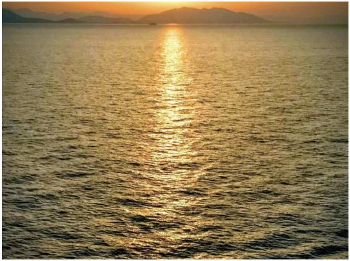

Solution. Because of the large length scales involved, and the absence of dispersion, we can tell that this is a geometrical optics effect. The explanation is as follows. If the water's surface was perfectly flat, then the sun's reflection would be at a point. Because there are waves, different parts of the surface are tilted with respect to the vertical by a small angle, so that other light rays can also make it to your eye.

Because the sun is low in the sky, this effect is much more dramatic in the forward/backward direction. For instance, suppose the ideal reflection occurs a distance $d$ away from you, and your height is $h \ll d$, so that the light ray enters your eye at a low angle $\theta \approx h / d$ to the horizontal. Then sunlight can also hit the water a distance $2 d$ away from you, bounced off a tilted water surface, and enter your eye at an angle $h / ( 2 d ) = \theta / 2$. Just a small change $\theta / 2$ in the direction of reflection can double the distance of the reflection! Such an enhancement does not occur in the left/right direction, so the reflection of the sun looks much longer than it is wide.

[4] Problem 23. This problem is about some neat atmospheric phenomena. For some parts, it will be useful to use Babinet's principle.

    (a) On a foggy night, there are many tiny water droplets in the air. On such nights one can see a ring around the moon, called a lunar corona, shown at left above. The ring is usually reddish in color. If one looks very carefully on a good night, one can see a blue ring outside the red ring and a blueish-white region inside the red ring. On other nights, one can only see a white haze around the moon. Explain these observations.
    (b) The size of the corona depends on the atmospheric conditions. Estimate the diameter of the water droplets in the air if the first red ring around the moon appears to have a diameter 4 times that of the moon. The angular diameter of the moon in the sky is 0.5°.

(c) On a cold night, there are many thin hexagonal ice crystals in the air. On such nights one can see a much larger, sharper ring around the moon, called a 22° halo, shown at right above. The size of the halo does not depend on the size of the crystals. Explain these observations.
(d) In the photo used in part (c), the moon is shaped like an octagon. Why?
(e) On a cold and exceptionally calm night, the results will be different.

Instead of a circle, one will see two "moon dogs", bright spots displaced about 22° from the moon horizontally. In addition, lights on the ground will produce vertical "light pillars". Explain these observations.

Solution. (a) This is similar to problem 20. Fog is made of small water droplets dispersed in the air, which leads to single slit diffraction by Babinet's principle. The red wavelengths are spread out more, so the bluer regions are seen inside the red rings.
Note that the colors are only pronounced if the droplets are small (to give a large diffraction angle), and nearly uniform in size. A wide range of droplet sizes will wash out the diffraction features, giving a white haze.

(b) This light was deflected by $\theta = 1 ^ { \circ }$, and from the one-dimensional single slit diffraction pattern, we can estimate a drop diameter $a = \lambda / \theta$. (The numeric factor is actually different, since it's two-dimensional diffraction, but we're just doing a rough estimate here.) Taking $\lambda = 650 \mathrm {~nm}$ for red light gives $a = 4 \times 10 ^ { - 5 } \mathrm {~m}$. Anything within a factor of a few is acceptable.
(c) The fact that you always get the same angle, regardless of crystal size, indicates this isn't a diffraction effect. Instead, it's a geometric optics effect. The hexagonal ice crystals refract and reflect the light. The resulting angular deflection has a critical point at 22°, which causes a lot of light to come out with that deflection. The reason that the halo has a red to blue gradient is simply because the index of refraction depends slightly on the wavelength of light. In XRev, you'll carry out this kind of calculation explicitly for a spherical drop of water, which leads to the familiar rainbow.
(d) The octagon is just showing the aperture shape of the camera, i.e. the shape of the opening that the light goes through. The reason it's apparent here is because the photograph is taken in low light conditions, requiring a wide aperture, the moon itself is quite small, and the camera evidently was not focused properly. In bokeh photography, this sort of effect is done intentionally. We'll discuss cameras further in W3.
(e) In the absence of wind, the hexagonal ice crystals will lie flat in the air, so light arriving from the top can just pass right through them without much deflection. We only see a 22° deflection when light enters the hexagon horizontally, as shown.

This yields the two "moon dogs", and if the same thing happens in the daytime, one can instead see "sun dogs".
As for the light pillars, they simply occur when light reflects directly off the flat bottom faces of the hexagons to reach the viewer, as shown here.
[2] Problem 24. Sometimes, a cloud will display a colorful pattern, as shown.

What is the explanation for this phenomenon, and why is it relatively rare? While you're at it, what's going on with the sun in this photo?

Solution. This is called cloud iridescence, a diffraction phenomenon due to tiny water droplets. In order for this effect to be visible, we need a few things to happen at once. The diffraction angle is relatively small, so the cloud needs to be near the Sun. To get relatively sharp colors, the water droplets need to have roughly uniform size (here, the colors are somewhat mixed together). Finally, the cloud needs to be relatively thin, so that light will dominantly hit single droplets rather than scattering off many of them.

In addition, the sunlight is diffracting off an edge, which creates rainbow patterns inside the shadow. Edge diffraction was briefly discussed above, and requires Fresnel diffraction to properly understand. You can (carefully) observe it at home by aiming a laser pointer at the edge of a blade.
[3] Problem 25. A student noticed an odd pattern when the light from a streetlamp shined through their open window. The window is fitted with a metal mesh screen and a curtain. Photos were taken with the curtain up (left) and down (right).

For scale, the streetlamp was about 30 m away, the distance between the metal wires was 1.4 mm, the diameter of each wire was 0.4 mm, and the curtain was woven from fibers whose width was comparable to that of a human hair.

(a) Explain everything you can about the pattern on the left.
(b) Explain everything you can about the pattern on the right.
(c) What, if anything, can we learn about the streetlamp from either picture?

Solution. (a) This effect is just due to ordinary reflection, not diffraction. This is apparent because the scale of the metal wires is just too big for diffraction to be noticeable.
What's going on is that the wires in the metal mesh make a rectangular grid, and produce specular reflection. The light on the top of the picture, for example, comes from light bouncing off the bottom of one of the top metal wires. The plus shape indicates that the mesh wires are mostly oriented horizontally or vertically, while the two horizontal lines indicate that the mesh wires bend back and forth from the vertical a bit due to the weaving.

(b) This is a diffraction effect, and one way to tell is to note that it affects different colors dramatically differently; there are clearly blue spots near the center and red spots slightly farther away. Evidently, we are seeing a combination of different single slit diffraction patterns, due to fibers in the weave being oriented in different directions. The fact that we see features at sharp angles means that the weaving is quite regular. With more information, we could accurately find the width of the fibers.
(c) The second picture tells us that the lamp is coherent enough to interfere with itself, which is not too surprising because it is so far away. (See the related discussion in the first remark.) It also tells us that the lamp contains colors of all wavelengths, even though it looks yellow.
Decades ago, "sodium lamps" used to be common, and they emitted only yellow light. However, in modern times we've decided that the light from such lamps is ugly, because it has poor "color rendering". (Specifically, in dim light, you would want everything to look just about the same as usual, but dimmer. But in pure dim yellow light, everything that reflects yellow looks very yellow, and everything that absorbs yellow looks completely black, which can be disorienting to the eye.) This wide spectrum tells us that the streetlamp is modern. However, the picture is too blurry to tell if it's incandescent, fluorescent, or LED.
[4] Problem 26. One day, somebody sent me a photo of a weird pattern on their phone.

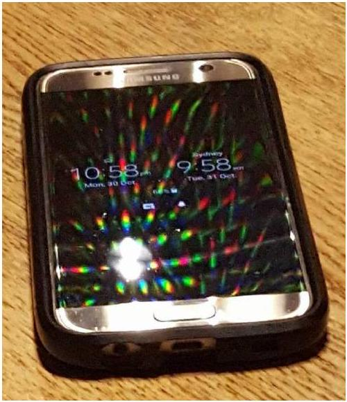
The phone was on a desk, about a meter away from the camera.

(a) Does the desk light emit a roughly continuous spectrum (typical for incandescent or good LED lights) or a sharply peaked spectrum (typical for fluorescent or cheap LED lights)?
(b) Qualitatively explain everything about the pattern seen. In particular, explain the geometrical pattern of the colored dots, the way the colors are distributed, why the colored dots cover the entire phone, and why one dot is large and white.
(c) How are the pixels on the phone laid out?
(d) Roughly estimate the pixel spacing on the phone.
(e) Using a suitable source of light, such as a laser pointer, determine the resolution of your own phone screen as accurately as possible. (You can look up relevant wavelengths of light; also note that it won't work with all phones; older ones may fare better.) Prepare a lab report with a data table and an uncertainty estimate, as explained in P2, and compare your result against the advertised value.

Solution. (a) The spectrum is sharply peaked. For a continuous spectrum, we would expect a lot of smeared out rainbows, but instead we get separate spots that are blue, green, and red. (There is some yellow near the center, but that's just the green and red spots overlapping.)

(b) We're seeing a classic diffraction pattern, where the pixels of the phone act as the spots on a reflective diffraction grating. The colored spots are the diffraction maxima, and the geometrical pattern of the spots tells us about the pixel layout, just as we saw in problem 13. The blue spots are closer to the central bright white spot (the specular reflection of the desk light) because shorter wavelength light diffracts less.
Why do the spots cover the entire phone? A tempting explanation is that the lamp light hits the bottom-left part of the phone, where the bright white spot is, then bounces off at various angles due to diffraction. But that is not responsible for what you see, because the light coming out at other angles wouldn't hit your eyes or the camera lens.
What's really going on is that the lamp light is hitting the entire phone basically uniformly. At each point, it bounces off the phone both specularly reflected, and at a few sharp angles due to diffraction. The spots you see at the top of the phone are due to light that hit the top of the phone, and then diffracted off at a downward angle, relative to the specular reflection.

The white spot is just the part of the specular reflection of the lamp that hits your eye, i.e. the extra bright zeroth order maximum discussed in problem 15.
Note that we can only see, in practice, the primary diffraction maxima; the secondary maxima are basically invisible, which is why we didn't worry about them in many of the problems above. However, the primary maxima show up as spots, rather than points, because of the nonzero size of the desk light.
(c) As in problem 13(b), the pixels are in a triangular grid. This is because pixels can each emit only one color, and you need them in groups of three (for the red, green, and blue). A triangular grid is a natural choice because it has threefold symmetry, as shown here.
This grid pattern is slightly obscured because there are other maxima on the phone that don't fit into the pattern. These are due to diffraction from the ceiling light, whose specular reflection you can also see on the top and bottom of the phone.
(d) This is a rough estimate, because we don't know the angle of inclination of the camera or the dimensions of the phone. Since it's already going to be relatively rough, we'll also neglect the fact that the grid is triangular, though you can account for it using the result of problem 13.
The pixel size $d$ is effectively the slit spacing of a reflection grating, so we have $d \sim \lambda L / \Delta x$ where $\lambda$ is the wavelength, $L$ is the distance to the camera, and $\Delta x$ is the spacing of the maxima on the phone's surface. Let's look at the maxima along a horizontal line in the picture, since the vertical direction is stretched out by the low angle of inclination. Focusing on the green dots, there are roughly 10 maxima along the screen's width, which is about 10 cm wide. We are also given that the phone is about a meter away. Then
$$
d \sim \frac { ( 500 \mathrm {~nm} ) ( 1 \text { meter } ) } { ( 1 \mathrm {~cm} ) } \sim 0.05 \mathrm {~mm}
$$
which is of the right order of magnitude.
(e) There are various ways of setting this up. To get a result with good uncertainty, it's important to be able to precisely measure the diffraction angle, which could be relatively small depending on your phone. For example, you can send the laser in directly perpendicular to the phone screen, then measure the diffraction pattern on a wall behind the laser; this gives a large separation between the peaks. Depending on your phone, you could find a hexagonal, square, or rectangular grid. There could also be large features superimposed on the lattice of diffraction maxima, which correspond to small features within or between pixels. Try it and see! You can compare the quality of your results to those of this paper, which also has nice discussion of other phenomena involving phone screens.
